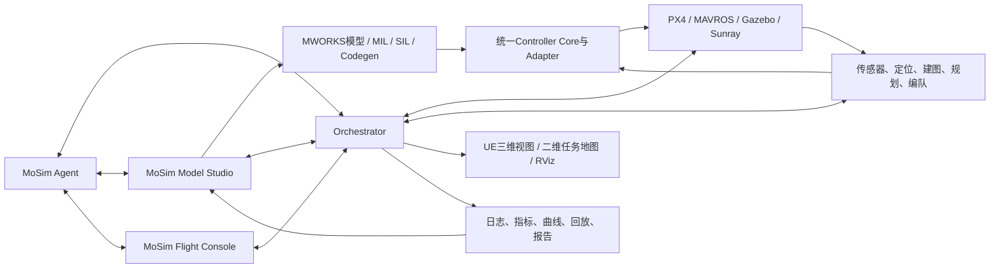

# MoSim智能无人机建模仿真与实验平台

> MoSim面向四旋翼控制、复杂任务仿真和集群协同，将MWORKS模型设计、代码生成、
> PX4/Gazebo工程运行、UE高真实感显示、QGroundControl地面站和智能Agent连接为一套
> 可配置、可复现、可分析的完整实验系统。

## 1. 项目定位

MoSim不是单一控制器、单一仿真脚本或无人机动画，而是一套覆盖“设计、生成、运行、
展示、评价、优化”的无人机建模仿真平台。用户可以在统一界面中选择飞行任务、控制算法、
状态源、扰动、故障、安全策略和编队方式，并将同一份实验配置贯穿MWORKS、PX4、Gazebo、
ROS、UE和结果分析全过程。

平台形成以下闭环：

```text
图形化建模与控制器设计
  -> MIL/SIL仿真与代码生成
  -> PX4/Gazebo工程环境运行
  -> 定位、建图、规划与集群任务
  -> UE/二维地图/遥测综合展示
  -> 自动指标、曲线和实验报告
  -> Agent辅助诊断与下一轮实验
```

MoSim的目标是降低复杂无人机实验的搭建门槛，让控制算法从模型设计走向接近真实飞控、
传感器和复杂环境的系统验证，同时保证每次实验能够复现、比较和追溯。

## 2. 解决的核心痛点

传统无人机仿真工作通常分散在多个软件和脚本中：模型在一个工具里设计，控制器在另一套
代码中实现，Gazebo和PX4由命令行启动，规划器需要单独配置，结果依靠人工整理，修改一个
参数后还要重复大量操作。由此带来以下问题：

- 模型、生成代码和实际运行控制器容易不一致；
- 控制器、状态源、场景和扰动参数缺少统一配置；
- PX4、ROS、Gazebo、RViz和UE启动链复杂，重复实验耗时；
- 多种控制器难以在完全相同的条件下公平比较；
- 风扰、故障和安全介入缺少统一注入与记录机制；
- 仿真画面、飞行数据、指标和报告相互分离；
- 出现失败后需要人工翻查大量日志，定位和复现实验成本高。

MoSim通过双GUI、ExperimentProfile、Orchestrator和智能Agent把这些环节组织成一个系统。
用户面对的是任务和实验目标，而不是零散的模型文件、终端命令和话题名称。

## 3. 总体架构



系统各层职责清晰：

| 层级 | 主要职责 |
| --- | --- |
| MWORKS建模层 | 四旋翼模型、图形化控制器、MIL/SIL、参数设计和代码生成 |
| 控制与飞控层 | 统一控制核心、PX4适配、模式管理、状态估计和执行器控制 |
| 物理与传感器层 | Gazebo动力学、Sunray150机体、MID360、IMU、风扰、故障与碰撞 |
| 感知与任务层 | FAST-LIO定位建图、路径规划、自主探索、覆盖建图和多机协同 |
| 编排层 | ExperimentProfile、运行状态机、进程管理、注入事务和证据关联 |
| 展示与交互层 | 双GUI、UE、二维任务地图、RViz、遥测、曲线和实验操作 |
| Agent层 | 自然语言实验编排、诊断、对比分析、参数建议和报告生成 |

## 4. 双GUI：把复杂工具链变成完整产品

MoSim自主设计开发两个相互联通的GUI。它们分别解决“如何设计和分析实验”与“如何运行和
观察实验”两个核心问题，并通过同一个`run_id`和ExperimentProfile保持数据一致。

### 4.1 MoSim Model Studio

Model Studio是基于MWORKS.Syslab原生APP开发的模型与实验设计中心。它将大量控制器、
增强模块、安全模块和故障容错模块组织为清晰的下拉选择与Profile组合，而不是要求用户在
庞大的模型树和脚本目录中寻找入口。

主要功能包括：

- 选择机型、场景、轨迹、规划器、状态源和车辆数量；
- 选择名义控制器、增强模块、姿态内环、安全层和故障容错层；
- 打开对应MWORKS图形化模型并查看控制链结构；
- 执行MIL、SIL、代码生成和一致性比较；
- 管理参数集、扰动工况、故障类型和评价指标；
- 对比不同控制器在相同实验条件下的轨迹和误差；
- 接收Gazebo/PX4运行结果并与模型仿真结果并列分析；
- 从异常指标直接定位到对应模型、时间段和实验记录。

Model Studio保留MWORKS图形化建模和代码生成优势，同时把重复的模型选择、实验配置、
结果查找和对比工作封装为直接操作的实验流程。

### 4.2 MoSim Flight Console

Flight Console基于QGroundControl源码二次开发，是飞行运行、任务规划和实时展示中心。
平台复用QGC成熟的MAVLink、车辆管理、航点、围栏和任务能力，并加入MoSim自己的实验、
控制、注入、证据和多机模块。

主要界面包括：

- 主窗口内真正嵌入的UE工厂三维视图；
- 可调距离的自由、跟随、环绕和多机视角；
- 右上角Factory二维小地图及可展开任务地图；
- 航点、任务边界、覆盖区域、Geofence、禁飞区和返航点编辑；
- 单机与多机连接、模式、位置、姿态、电量和任务状态；
- 控制器、增强层、安全层和故障容错状态摘要；
- 风扰、质量变化、传感器异常和电机效能故障的滑块式注入；
- 一键打开RViz点云、累计地图、栅格地图和规划轨迹；
- 实时曲线、告警、事件时间线、实验结果和视频入口。

Flight Console不是简单替换Gazebo画面，而是把高真实感UE场景、QGC任务操作、ROS工程数据
和MoSim实验管理融合成一个飞行控制台。普通航点继续复用QGC原生Mission能力，自主探索、
覆盖建图和编队任务通过统一Adapter接入现有开源算法，避免重复实现成熟功能。

### 4.3 双GUI协同流程

```text
Model Studio配置模型与实验
  -> 生成并发布ExperimentProfile
  -> Flight Console一键启动飞行环境
  -> UE和遥测实时展示
  -> 用户进行任务规划、扰动和故障实验
  -> 运行结果自动回传Model Studio
  -> 曲线对比、指标分析和模型优化
```

双GUI解决了模型工具与飞行运行长期割裂的问题，使一次实验从配置到结果分析都能在统一
产品流程中完成。

## 5. 智能Agent：用自然语言驱动无人机仿真

MoSim Agent是平台的重要智能化入口。它嵌入Model Studio和Flight Console，共享当前模型、
Profile、运行状态、遥测、日志和结果上下文。用户可以用自然语言描述实验目标，Agent负责
将需求转换成结构化配置和可执行流程。

典型交互包括：

```text
“用Factory地图、三架无人机、Leader-Follower编队，加入3 m/s侧风，
分别比较Cascade PID和NMPC + INDI + L1。”

“把1号电机效能从100%逐步降到65%，观察故障检测、控制分配和安全降落过程。”

“对上一次8字轨迹实验分析XYZ误差，找出误差最大的时间段，
并给出下一组参数和对照实验。”

“运行单机自主探索，结束后汇总覆盖率、轨迹长度、规划失败次数和安全介入事件。”
```

Agent完成的工作包括：

1. 解析自然语言中的场景、任务、控制器、车辆、扰动、故障和指标；
2. 从注册表中选择对应模块，生成ExperimentProfile草稿；
3. 检查算法组合、状态源、车辆数量、地图坐标和运行资源是否兼容；
4. 调用Orchestrator完成环境预检、模型仿真、代码生成或Gazebo运行；
5. 持续汇总运行状态、遥测异常、安全介入和任务进度；
6. 自动读取结果，比较基线与改进算法并定位失败原因；
7. 生成下一轮参数建议、消融实验和报告摘要。

Agent将过去需要反复打开软件、输入命令、修改配置、查找日志和手工画图的工作转换成自然
语言驱动的实验流程，显著降低批量仿真和控制器迭代成本。所有操作仍经过Profile、状态机和
安全规则，保证自然语言便利性不会破坏实验可复现性和飞行安全边界。

## 6. 控制算法与模块库

MoSim采用插槽化控制链，将算法按照实际作用位置组合，而不是把所有模块混在一个控制器
列表中：

```text
任务/轨迹
  -> 编队控制
  -> Reference Governor
  -> 名义控制器
  -> 增强与扰动补偿
  -> 姿态/角速度内环
  -> Safety Filter
  -> Fault Manager与Control Allocator
  -> PX4 Command Adapter
```

### 6.1 名义控制器

- PID族：增益调度PID、Fuzzy PID、Neural PID、统一Cascade PID、Anti-windup和前馈；
- 线性与鲁棒控制族：LQR/LQI/LQG、H-infinity、mu-Synthesis、反馈线性化、无源控制和
  Adaptive Backstepping；
- 几何与平坦性控制：SE3、SO3、DFBC及高阶轨迹前馈；
- 滑模族：Integral SMC、Terminal SMC、Non-singular Terminal SMC、Super-Twisting SMC、
  Adaptive SMC、Fuzzy-SMC和Neural-SMC；
- MPC族：Linear、Robust、Adaptive、Tube、Learning、Explicit Gain-Scheduled、Distributed
  MPC，以及iLQR、MPPI和NMPC Outer。

### 6.2 增强、学习与扰动补偿

- L1自适应补偿、AWFF、完整ADRC、标准化INDI、DOB/ESO；
- 参数调度、Fuzzy/ANFIS、RBF/NN、ILC和受限残差策略；
- **有界Neural Residual**：根据位置误差、速度误差、参考加速度和飞行状态生成受限的
  外环加速度残差，保留基础控制器并通过限幅和失效回退约束学习输出；
- **有界RL Gain Scheduler**：根据当前飞行状态在线调整基础控制器增益，调度量具有明确
  上下界，并在输入异常或推理失败时回退到确定性基线。

这两类学习控制模块不是独立接管飞机的黑盒策略，而是受安全边界约束、能够回退、能够与
传统控制器做消融对比的增强模块。它们让平台既包含现代智能控制方法，又保持工程可解释性。

### 6.3 安全与故障容错

- Safety Filter、CBF、Reference Governor和动力学约束；
- Geofence、Emergency Stop、Return-and-Land和Failsafe状态机；
- FDI、Passive FTC、Active FTC和故障程度估计；
- 故障感知控制分配、单电机故障安全降落和多故障重构；
- 状态过期、轨迹失效、姿态超限、机间距不足和碰撞风险保护。

### 6.4 编队与集群控制

- Leader-Follower、Virtual Structure、Consensus和Containment；
- Formation Tracking、Formation Reconfiguration和Fault-Tolerant Formation；
- Formation CBF和Distributed MPC；
- 单机目标、多机目标、编队中心路线、队形间距和成员重分配。

所有控制算法使用统一状态、参考、控制量、生命周期和诊断接口，使不同算法可以在相同场景、
相同状态源和相同评价标准下组合与比较。

## 7. 感知、规划与多机任务

MoSim将感知和规划作为可替换模块接入控制闭环：

- MID360激光雷达与IMU构成三维环境感知输入；
- FAST-LIO负责激光定位、点云累计和地图构建；
- Diff-Planner负责给定目标下的单机和多机轨迹规划与避障；
- FUEL负责单机未知环境自主探索；
- RACER负责多机协同探索；
- Swarm-Formation负责多机队形保持、重构和障碍穿越；
- 已知地图覆盖建图用于快速、可重复的全区域扫描任务；
- Planner Adapter统一航点、探索、覆盖和编队任务的输入输出。

二维任务地图面向操作员显示完整Factory结构，用于规划航点、任务区域和安全边界；探索算法
只读取实时传感器与在线地图，避免界面先验被错误传入未知环境算法。

## 8. 高真实感场景与数字化展示

平台采用Factory工厂作为综合实验场景：

- Gazebo负责动力学、碰撞、传感器、执行器和环境交互；
- UE负责高真实感厂房、机体、桨叶、光照和多机画面；
- Gazebo碰撞地图、UE渲染地图和二维任务地图共享坐标合同；
- RViz显示MID360点云、FAST-LIO累计地图、栅格地图、TF和动态规划轨迹；
- Flight Console将UE、二维地图、遥测、任务与实验操作集中展示。

这种分层既保留Gazebo/PX4的工程仿真能力，也获得UE更直观的比赛展示效果，并通过统一坐标
和`run_id`保证画面、地图和飞行数据属于同一次实验。

## 9. 自动化实验与结果闭环

每次实验由ExperimentProfile完整描述：

```text
场景、机型、传感器、状态源、车辆数量
任务、轨迹、规划器、编队方式
名义控制器、增强层、安全层、故障容错层
扰动、故障、参数、随机种子、运行后端
显示布局、评价指标和证据要求
```

Orchestrator根据Profile生成唯一`run_id`，管理模型检查、仿真启动、状态转换、故障注入、
显示绑定、停止清理和结果归档。实验结束后自动组织：

- XYZ与姿态RMSE、峰值误差、稳态误差、超调和调节时间；
- 速度、加速度、控制能量、饱和和轨迹新鲜度；
- 故障检测时间、恢复时间、安全介入次数和降级状态；
- 多机最小间距、编队误差、覆盖率和任务完成率；
- 模型、参数、生成代码、地图和配置哈希；
- 原始日志、标准化数据、曲线、回放、截图、视频和报告摘要。

用户可以在Model Studio中直接比较MIL、SIL、generated-C和Gazebo/PX4结果，也可以让Agent
自动总结差异、定位异常并生成下一轮实验。

## 10. 平台特色

### 10.1 从模型到工程运行的完整闭环

MWORKS图形化模型不是独立演示。控制算法通过统一接口和代码生成进入PX4/Gazebo运行，
运行结果再返回MWORKS分析，形成真正可迭代的模型驱动开发流程。

### 10.2 双GUI统一复杂工具链

Model Studio负责模型、算法、参数、代码生成和结果分析；Flight Console负责UE飞行画面、
任务地图、遥测、故障注入和多机操作。两个自主开发界面把分散的软件和脚本变成一套连贯
产品，这是MoSim解决实际使用痛点的核心。

### 10.3 Agent驱动的智能实验

Agent能够理解自然语言实验需求，自动组织模型、算法、场景和工况，调用仿真链，分析结果
并形成下一步建议。它不仅是问答助手，而是连接配置、工具、运行和证据的实验智能体。

### 10.4 传统控制与学习控制统一

PID、鲁棒控制、滑模、MPC、INDI、L1、安全过滤、故障容错与有界Neural Residual、
有界RL Gain Scheduler进入同一模块注册、代码生成、运行和评价体系，能够进行公平消融。

### 10.5 单机、多机与复杂任务统一

同一平台覆盖轨迹跟踪、路径规划、自主探索、覆盖建图、编队保持、障碍穿越、扰动抑制和
故障恢复，不需要为每类任务重新搭建一套仿真系统。

### 10.6 可复现、可追溯、可扩展

所有实验由Profile、hash和`run_id`关联。控制器、规划器、状态源、场景、地图和GUI均通过
注册接口扩展，新增算法不需要修改系统总体结构。

## 11. 典型演示流程

一个完整的比赛演示可以按以下顺序展开：

1. 在Model Studio通过下拉框选择Factory场景、轨迹和控制器；
2. 打开MWORKS图形化模型，展示控制链并运行MIL/SIL；
3. 生成控制代码，点击“进入飞行仿真”；
4. Flight Console在主窗口中显示UE工厂和无人机，二维小地图同步显示位置；
5. 执行轨迹跟踪、路径规划或三机编队任务；
6. 通过滑块加入侧风、电机效能下降或传感器异常；
7. 实时观察误差、安全层、故障检测和控制分配状态；
8. 使用自然语言要求Agent比较控制器、分析异常或运行下一组实验；
9. 飞行结束后自动返回Model Studio，展示曲线、指标、回放和实验结论。

这条流程同时展示了模型设计、控制算法、代码生成、工程仿真、高真实感场景、多机任务、
智能Agent和自动评价，能够完整表达MoSim作为智能无人机仿真实验平台的系统价值。

## 12. 总结

MoSim将MWORKS、PX4、Gazebo、ROS、UE和QGroundControl从多个独立工具连接成统一系统。
双GUI解决复杂工具链难以操作和展示的问题，ExperimentProfile与Orchestrator保证实验一致性，
智能Agent让用户能够用自然语言完成仿真配置、批量运行、故障诊断和结果分析。平台同时容纳
传统控制、鲁棒控制、学习控制、安全容错、路径规划和多机协同，并通过自动指标和证据回流
形成从模型到工程验证再到优化迭代的完整闭环。
