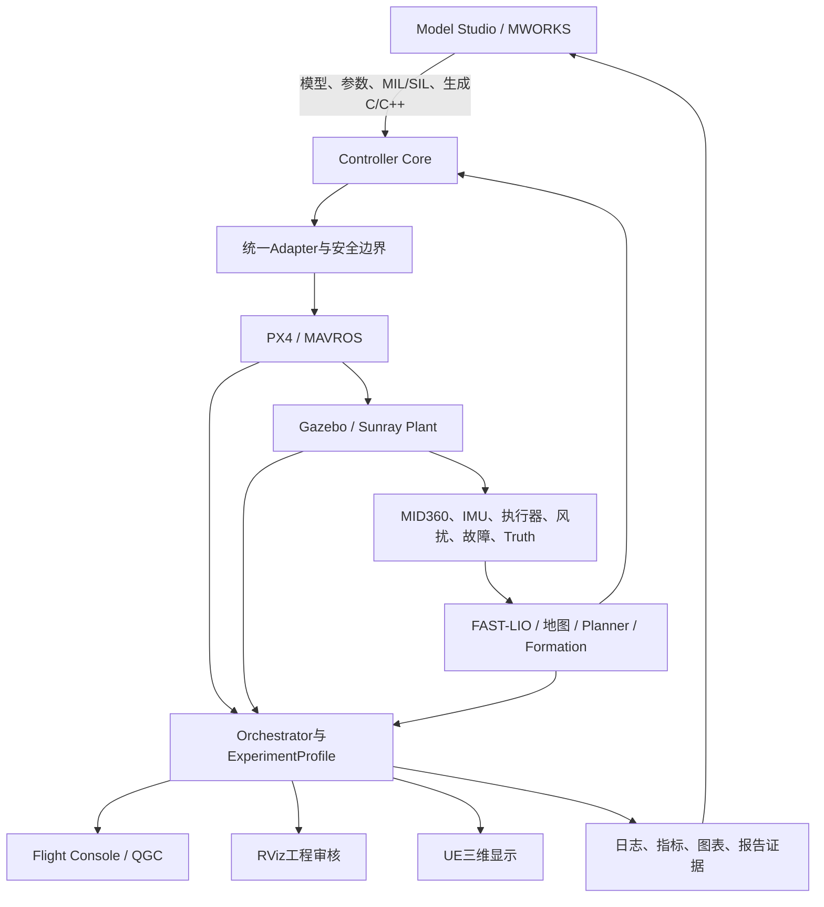

# MoSim大系统介绍与学长评审提纲

> 版本：2026-07-17送审稿。
>
> 用途：向熟悉无人机控制、仿真或集群系统的老师/学长说明MoSim准备解决什么问题、
> 已经做到什么程度、哪些仍是设计，以及希望获得哪些技术建议。
>
> 重要边界：本文将“已有设计”“源码/离线门禁通过”“局部运行通过”和“完整系统通过”
> 分开描述。设计完整不等于功能已经实现，单项运行成功也不等于整个系统已经闭环。

## 1. 希望评审者重点判断什么

我们不是希望只确认“界面好不好看”或“算法数量够不够”，而是希望评审者重点判断：

1. 这套系统是否围绕四旋翼控制与工程部署形成了有实际意义的闭环；
2. MWORKS、PX4、Gazebo、ROS、UE和QGC的分工是否合理；
3. 控制器比较、扰动/故障注入、规划和多机任务是否具有可信的评价方法；
4. 当前工作是否过宽，哪些模块应当删减、后置或深入；
5. 从比赛展示、论文表达和后续真机部署三个角度，当前最值得补齐的短板是什么。

建议先看第2、4、7、9节；如时间有限，可直接在第9节逐项给意见。

## 2. 一句话介绍

MoSim是一套面向四旋翼控制算法设计、代码生成和工程验证的可扩展仿真实验平台：

```text
MWORKS中建模和设计控制器
  -> 生成或复用统一C/C++控制核心
  -> 接入PX4/MAVROS
  -> 在Gazebo/Sunray中运行真实传感器、执行器、扰动和故障模型
  -> 接入定位、规划、探索和多机任务
  -> 通过RViz/UE/QGC审核和操作
  -> 自动输出日志、指标、图表和可复现实验证据
  -> 根据结果返回MWORKS继续修改模型或参数
```

它参考RflySim的分层思想，但不照搬其实现。我们希望解决的不是“再做一个无人机动画”，
而是把模型设计、生成代码、飞控运行、复杂环境、算法比较和证据回流串成同一个工程流程。

## 3. 为什么要做这套系统

### 3.1 现有理想仿真的不足

只在MWORKS、MATLAB或Simulink类环境内进行理想模型仿真，通常难以同时覆盖：

- PX4模式、解锁、Offboard、EKF和failsafe；
- 传感器频率、时延、噪声、丢帧和坐标系错误；
- 执行器饱和、电机效能下降、风扰和碰撞；
- FAST-LIO、局部地图、轨迹规划和多机命名空间；
- 长时间运行、进程残留、轨迹失效和通信过期。

因此理想模型结果不能直接等同于工程运行效果。

### 3.2 直接在Gazebo中调控制器的不足

如果完全跳过模型设计软件，只在ROS/Gazebo脚本中调参，又容易失去：

- 图形化模型和控制结构的可解释性；
- MIL/SIL和生成代码一致性检查；
- 控制器参数、实验条件和结果的统一管理；
- 同一场景下对多个控制器进行公平比较的能力。

### 3.3 MoSim的核心价值

MoSim试图把两者连接起来：MWORKS负责设计、仿真、代码生成和分析，Gazebo/PX4负责
工程运行，ROS算法负责定位和规划，前端负责受控操作与展示，证据系统负责判断而不是
依赖肉眼印象。

## 4. 总体架构



### 4.1 各软件的权威边界

| 层 | 负责什么 | 不负责什么 |
| --- | --- | --- |
| MWORKS/Sysblock/Syslab | 控制器模型、MIL/SIL、参数、代码生成、离线指标 | 不直接证明Gazebo飞行或真机成功 |
| Controller Core | 标准状态和参考到姿态/推力等物理控制量 | 不拥有地图或plant真值 |
| PX4/MAVROS | 模式、解锁、EKF、Offboard、failsafe和飞控接口 | 不证明控制算法创新性 |
| Gazebo/Sunray | plant、执行器、传感器、碰撞、扰动、故障和仿真truth | 不证明MWORKS模型与生成代码一致 |
| ROS算法 | 定位、建图、轨迹、探索、编队和任务适配 | 未知探索不得读取完整场景真值 |
| RViz/UE/QGC | 工程审核、三维展示、操作、视频和人机交互 | 不作为控制和定位指标的权威来源 |
| Orchestrator | Profile校验、启动、状态机、注入事务、日志和证据关联 | 不实现控制算法内部公式 |

高频飞行闭环不依赖GUI或MWORKS窗口同步返回控制量。显示卡顿或窗口关闭不应导致飞机失控。

## 5. 一次完整实验如何运行

### 5.1 计划中的最终用户流程

1. 在Model Studio选择场景、控制器、状态源、轨迹、扰动、故障和评价Profile；
2. 打开对应MWORKS图形化模型，完成MIL/SIL、参数检查和代码生成；
3. 生成的控制核心先通过离线一致性，再注册为可运行控制器；
4. Model Studio把结构化ExperimentProfile提交给Orchestrator；
5. Orchestrator校验模块兼容性、坐标、资源和安全条件，生成Launch Plan；
6. 启动Gazebo、PX4、MAVROS、控制器、传感器、定位和任务算法；
7. Flight Console显示UE三维画面、二维任务地图、遥测、故障注入和证据状态；
8. RViz按需显示点云、累计地图、占据地图、轨迹、坐标系和规划前端；
9. 飞行结束后自动生成同一`run_id`下的日志、指标、图表、截图和视频入口；
10. 结果回到Model Studio，与MIL/SIL和其他控制器并列比较，再决定是否调整模型。

### 5.2 为什么使用Profile而不是按钮直接运行脚本

前端按钮不会直接拼接shell命令或发布裸setpoint。每次运行都应固定并记录：

```text
scenario / plant / sensor / state / truth / trajectory / planner
controller / augmentation / safety / adapter / fault / disturbance
frequency / display / evaluation / random seed / source hash
```

这样可以防止比较两个控制器时同时改变了定位、轨迹、风场或评价窗口，也可以避免GUI
绕过安全门禁直接控制飞机。

## 6. 系统包含哪些能力

### 6.1 控制器与增强层

平台接口已经按以下类别设计，但“进入注册表”不等于“均已完成运行验收”：

- PID族：官方PID、级联PID、增益调度、Fuzzy PID、Neural PID、Anti-windup、前馈；
- 线性与鲁棒控制：LQR/LQI/LQG、H-infinity、mu-Synthesis、反馈线性化、反步；
- 几何和微分平坦：SE3、SO3、DFBC及高阶轨迹参考；
- 滑模族：传统、积分、终端、非奇异终端、Super-Twisting、自适应和智能滑模；
- MPC族：线性、鲁棒、Tube、Adaptive、Learning、Distributed、NMPC、iLQR/MPPI；
- 增强与扰动补偿：INDI、L1、AWFF、DOB/ESO、ADRC、参数调度、ILC和有界学习残差；
- 安全层：Safety Filter、CBF、Reference Governor、Geofence、急停、返航和降落；
- 故障容错：FDI、Passive/Active FTC、故障感知分配和单电机故障降级；
- 编队层：Leader-Follower、Virtual Structure、Consensus、Formation Tracking、Formation CBF和
  Distributed MPC。

目前已经有px4ctrl生成代码闭环基线；更大的控制器族仍处于离线门禁、模型/codegen、
运行溯源或逐项Gazebo验证的不同阶段，不能对外宣称“所有控制器均已完成”。

### 6.2 定位、地图和规划

- 控制器默认读取PX4/MAVROS融合状态；
- MID360与FAST-LIO提供激光定位和建图候选；
- 仿真评价使用Gazebo truth，但truth不应静默混入正式控制状态；
- 部分探索实验采用FAST-LIO水平定位加仿真定高替身的Hybrid-Z Profile，必须明确标注；
- GPS/视觉/激光融合可以作为后续状态源扩展，项目不应被包装成只适用于无GPS环境；
- Diff-Planner用于单机和三机给定目标规划；
- FUEL用于单机未知环境探索；
- RACER用于多机未知环境探索研究；
- Swarm-Formation用于已知目标下的三机队形保持与障碍穿越。

### 6.3 场景与展示

- 第一张正式场景是较大尺度Factory工厂；
- 同一场景需要Gazebo碰撞网格、UE渲染地图和二维任务地图共享坐标合同；
- RViz负责点云、占据、规划和TF等工程审核；
- UE负责更直观的机体、工厂、多机和视频展示；
- QGC二次开发的Flight Console负责运行、遥测、注入、显示和证据入口；
- 二维Factory地图计划支持航点、探索/覆盖边界、Geofence、禁飞区、返航点和多机任务分配。

未知探索算法只能读取实时传感器占据地图和允许边界，不能因为操作员界面显示完整工厂
平面图就获得墙体先验。

### 6.4 自动评价和可追溯证据

每次实验计划统一输出：

- XYZ和姿态RMSE、峰值误差、稳态误差、超调和调节时间；
- 控制能量、饱和、轨迹新鲜度和安全介入次数；
- 故障检测/恢复时间、多机最小距离和编队误差；
- 控制器、参数、Profile、代码hash、地图版本和坐标标定hash；
- 原始日志、指标JSON、图表、RViz/UE截图和视频入口。

画面只用于展示与人工审核，数值结论必须来自日志和明确的评价脚本。

### 6.5 开源复用与项目自有工作的边界

项目优先复用经过公开验证的工程，而不是从零重写飞控、定位或规划算法：

| 上游/平台 | 在MoSim中的用途 | 我们不宣称的内容 |
| --- | --- | --- |
| PX4、MAVROS、Sunray、px4ctrl | 飞控接口、仿真机体和当前控制基线 | 不把上游飞控和基准控制器称为自研 |
| FAST-LIO | MID360激光定位与建图基线 | 不把FAST-LIO算法本身称为项目创新 |
| Diff-Planner、FUEL、RACER、Swarm-Formation | 给定目标规划、未知探索和编队研究入口 | 不把成功复现称为自研规划算法 |
| QGroundControl 5.0.8 | Flight Console产品底座 | 不重写QGC已有的MAVLink、任务和车辆管理能力 |
| MWORKS、Gazebo、UE | 模型设计、物理运行和三维展示平台 | 不把平台本身称为项目成果 |

MoSim当前主要自有工作集中在：

- 统一控制器I/O、Profile、Adapter和代码生成接入合同；
- MWORKS生成控制核心到PX4/Gazebo的离线一致性和运行回灌；
- MID360、FAST-LIO、PX4状态融合、坐标系和Hybrid-Z的显式工程适配；
- Factory场景的Gazebo/UE/二维地图坐标标定与版本约束；
- FUEL/RACER/编队算法接入当前机体、雷达、状态源和安全门禁所需的适配与诊断；
- 轨迹新鲜度、动态可行性、碰撞、机间距、状态过期和紧急保持等运行保护；
- Orchestrator、ExperimentProfile、日志指标和可复现实验证据；
- Model Studio和Flight Console的产品集成。

如果最终只完成开源算法复现而没有形成上述模型到运行和证据回流闭环，就不应将其包装成
平台核心贡献。控制算法本身的创新也必须通过论文依据、实现差异和同场景消融单独说明。

## 7. 当前做到什么程度

### 7.1 成熟度定义

| 等级 | 含义 |
| --- | --- |
| A 运行通过 | 有明确Profile、同一运行证据、指标和通过边界 |
| B 局部通过 | 某个区域、时长、子门禁或降级Profile通过，不能外推到完整目标 |
| C 源码/离线就绪 | 设计、源码、构建或离线测试通过，仍缺真实运行闭环 |
| D 设计完成 | 接口和验收标准已设计，尚未实现或验证 |

### 7.2 当前能力矩阵

| 能力 | 当前等级 | 已有结果 | 仍缺什么 |
| --- | --- | --- | --- |
| Sunray/PX4/Gazebo/MAVROS/px4ctrl单机 | A | 起飞、悬停、降落和规划运行基线已冻结 | 真机/HITL不在当前完成范围 |
| Diff-Planner单机目标规划 | A | 已有用户审核和冻结运行基线 | 后续只在控制器回归时复跑 |
| Diff-Planner三机目标规划 | A | 三机目标误差约0.006/0.022/0.032 m，最小机间距约0.98 m | 这是给定目标规划，不是自主任务分配或编队保持 |
| MWORKS px4ctrl Golden Slice | A | MWORKS CFunction生成代码、离线四方一致性、单机Gazebo A/B和三机Diff smoke通过 | 不代表全部高级控制器完成codegen/runtime |
| 大控制器族 | C | 已有统一接口、注册、模型/生成代码和多类离线门禁 | 仍需逐项生成代码溯源及同场景Gazebo闭环，不可批量宣称通过 |
| FAST-LIO + MID360 | B | 点云、定位、地图和PX4外部视觉融合已有运行证据 | Hybrid-Z仍含仿真定高替身；GPS/纯激光XYZ/真机链路需分别验收 |
| FUEL单机未知探索 | B | 固定64×64 m区域达到82.32%传感器足迹覆盖，越过80%门槛 | 完整约176×64 m工厂长测仍出现不可达frontier和轨迹失效，未正式通过全覆盖 |
| RACER多机未知探索 | B | MID360、坐标和三机运行链做过适配，120 s最好覆盖约17.15% | 未达到多机全覆盖目标，当前已停止盲目调参 |
| 三机已知目标编队/避障 | B | r34编队跟踪子门禁通过：RMSE 0.0182 m、峰值0.0660 m、最小间距1.439 m、无紧急hold | 需要把完整门禁状态和视频/审核统一收口；不能称为未知探索 |
| Factory Gazebo/UE坐标与场景 | B | 静态导入、非对称标定框和坐标审查已有证据，UE显示已进行人工审核 | 仍应在正式同一run中核对Gazebo、UE和二维地图的版本/hash |
| Model Studio | B | Syslab原生APP的Profile选择、禁用门禁、prepare/context/result边界通过 | 尚未与完整D6运行形成模型到结果的同一run闭环 |
| Flight Console | B | QGC 5.0.8 Custom Build完成325/325 Release构建，五个MoSim页面完成原生可见性审核 | MAVLink、Gazebo、注入、UE/RViz和证据尚未在同一run完整验收 |
| Factory二维任务地图 | D | 小地图/放大编辑、航点、边界、Geofence、多机分配和发布合同已设计 | 尚未完成QML实现和runtime任务发布验收 |
| 单机双GUI纵向闭环D6 | C | Profile、白名单后端、sidecar、遥测和注入ACK源码链已接通 | 真实同一run飞行、注入、显示和结果回流尚未通过 |
| 三机双GUI纵向闭环D7 | C | 三机遥测、逐机注入和Profile源码门禁已通过 | 三机同一run、逐机ACK、RViz/UE绑定和人工审核未完成 |
| 3至9机扩展 | D | 接口和逐级验收方法已设计，UI先禁用4至9机 | 当前只承诺三机；不得把可配置字段说成已支持9机 |
| AI助手 | D | 已设计上下文、建议、确认和审计边界 | 暂未实现；AI未来也不能直接拥有飞行控制权 |

### 7.3 已确认的主要问题

1. 完整工厂未知探索仍可能卡在不可达frontier、轨迹过期或覆盖增长停滞；
2. RACER在当前Factory和MID360链路下覆盖率低，继续调参的投入产出比不明确；
3. 高级控制器数量很多，但没有必要全部作为比赛主叙事；应选代表算法做公平消融；
4. 部分状态源使用仿真Hybrid-Z，必须避免包装成纯FAST-LIO全状态定位；
5. 双GUI分别已有原生门禁，但尚未证明从模型到飞行再回到结果的完整同一run体验；
6. Factory的Gazebo、UE和二维地图必须通过同一版本和标定hash防止前端穿墙；
7. 目前仍是仿真平台，不应把照片、模型参数或Gazebo结果直接描述为真机成功。

## 8. 已设计但尚未全部实现的能力

### 8.1 双GUI最终形态

**Model Studio（MWORKS.Syslab原生APP）**计划负责：

- 场景、控制器、状态源、任务、扰动、故障和评价Profile选择；
- 打开图形化模型、运行MIL/SIL、代码生成和结果查看；
- 对比不同控制器与不同实验条件；
- 将合法ExperimentProfile提交给Orchestrator。

**Flight Console（QGC二次开发）**计划负责：

- 中央UE三维视图；
- 右上角Factory二维小地图，点击展开为任务编辑地图；
- 飞机连接、模式、解锁、遥测、任务和逐机状态；
- 风扰、电机效能等受控注入及实际施加ACK；
- 一键打开RViz点云/占据地图；
- 运行日志、指标、截图和视频入口。

二维地图不是装饰性缩略图，而是航点、任务区域、Geofence、禁飞区、返航点、编队中心
路线和多机任务分配的正式入口。地图编辑先生成`MissionDraft`，经坐标、边界、能力和安全
校验后才由Orchestrator提交给Planner Adapter。

### 8.2 扰动、安全和故障闭环

计划形成以下实验链：

```text
选择控制器与增强层
  -> 注入风扰、质量误差、传感器异常或电机效能下降
  -> 对比无增强/有增强
  -> 观察Safety/FTC是否介入
  -> 比较跟踪误差、恢复时间、控制能量和任务完成率
```

当前已有若干源码、离线或局部运行探针，但完整矩阵仍需要在同一Gazebo基线上逐项验收。

### 8.3 AI助手

AI助手计划作为后续亮点，但不是当前主线。合理职责包括：

- 解释当前Profile、指标和失败原因；
- 根据历史实验建议下一组参数或对照实验；
- 检查组合是否缺证据或违反安全边界；
- 生成实验摘要和报告草稿。

AI只能生成建议或待确认请求，不能绕过Profile Validator、直接发setpoint、解锁、注入故障
或修改在飞控制器。

## 9. 希望学长重点给建议的问题

### P0：决定系统是否有实际意义

1. **主线是否聚焦正确？** 以“MWORKS模型/codegen到PX4/Gazebo工程验证，再回流分析”作为
   核心贡献是否成立，还是应该把重点进一步收缩到某一类鲁棒控制器？
2. **ATTITUDE_THRUST接口是否合理？** 高级外环统一输出期望姿态和总推力，PX4保留姿态/角速率
   内环，是否足以公平比较PID、SE3、DFBC、SMC和NMPC？哪些算法必须下沉到BODY_RATE或电机层？
3. **仿真可信度是否够？** 当前Sunray/Gazebo plant、PX4 EKF、MID360和故障/风扰注入还缺哪些
   最关键的物理项，才值得支撑“工程可部署”而不是“理想仿真”？
4. **控制器广度是否过大？** 比赛中最值得保留的3至5个名义控制器、2至3个增强/安全模块分别
   应该是什么？哪些算法只保留接口而不实现更合理？
5. **最有说服力的实验是什么？** 应优先展示高速轨迹、未知环境、风扰、单电机故障、三机编队，
   还是一条从MWORKS生成代码到Gazebo回归的完整链？

### P1：决定定位、规划和多机路线

6. FAST-LIO经PX4融合、仿真Hybrid-Z和未来GPS融合三类Profile应该如何设置，才能既可运行又不
   造成状态源口径混乱？
7. FUEL固定区域通过但完整工厂仍不稳定，继续做源码级frontier恢复是否值得，还是应明确把
   未知探索降为演示支线，把时间投入控制、容错和代码生成？
8. RACER在当前场景覆盖率较低，多机未知探索是否还值得继续，还是保留三机给定目标规划和
   已知目标编队避障更符合比赛投入产出？
9. 三机编队当前使用Gazebo truth评价编队误差、PX4融合状态控制，这种评价边界是否合理？还应
   增加哪些通信延迟、丢包或成员故障实验？
10. Factory场景很大且结构复杂，正式视频应选完整场景长测，还是选可重复的局部代表区域，
    再用全局地图证明可扩展性？

### P2：决定产品和展示范围

11. Model Studio与Flight Console双GUI是否必要，还是一个主界面加MWORKS原生结果查看器更稳妥？
12. QGC二维地图、UE主视图、RViz工程审核三者的分工是否清楚？哪些页面会让评委感觉功能堆叠？
13. AI助手作为实验设计和故障解释助手是否有实际亮点，还是会削弱控制主线？最小有价值功能
    应该是什么？
14. 从后续真机部署看，下一步最该提前冻结的是PX4-native module、HITL、传感器标定、实时性，
    还是参数辨识？

## 10. 我们当前建议的收敛方案

在获得评审意见前，我们倾向于按以下顺序收敛，而不是继续横向增加算法：

1. 完成一个代表性生成控制器的Model Studio到Flight Console单机同一run闭环；
2. 固定同一Factory局部场景，完成基准、鲁棒增强、风扰和电机效能下降的公平A/B；
3. 只选择少量代表控制器进入Gazebo完整矩阵，其余保留为禁用接口或研究候选；
4. 完成三机已知目标编队避障与逐机故障/扰动演示；
5. 未知探索保留FUEL固定区域有效结果，除非有明确源码修复路线，否则不继续盲目长测；
6. 实现Factory二维任务地图的最小航点、边界和Geofence闭环；
7. 最后再考虑AI助手和4至9机扩展。

如果学长认为这个顺序不合理，希望直接指出应删除、交换或提前的项目。

## 11. 对外表述边界

可以表述：

- 已建立MWORKS模型/codegen到PX4/Gazebo的可复现基线；
- 已运行单机、三机目标规划、局部未知探索和三机编队子门禁；
- 已建立统一Profile、日志指标和模块化接口；
- 正在把QGC、UE和MWORKS原生APP连接成完整实验工作流。

暂时不能表述：

- 所有控制器均已完成或均优于px4ctrl；
- 完整Factory未知环境已经100%自主探索；
- RACER多机未知探索已经通过；
- 三机同时到达目标等同于自研编队或自主任务分配；
- FAST-LIO已经提供纯激光完整XYZ控制状态；
- QGC/UE画面证明控制、定位或规划成功；
- Gazebo结果等同真机结果，或所有机体参数均为真机实测；
- 双GUI和AI助手已经完成。

## 12. 评审意见建议格式

为了便于我们把建议落实为任务，希望评审者可以按以下格式简要回复：

```text
1. 建议保留的核心贡献：
2. 建议删除或后置的模块：
3. 最需要补的一个技术闭环：
4. 最需要补的一个对照实验：
5. 控制器/增强层推荐组合：
6. 定位、规划或多机路线建议：
7. 比赛演示建议：
8. 最大的技术或表述风险：
```

## 13. 项目内证据入口

以下路径用于需要进一步核对时查阅，不要求首次评审全部阅读：

- 总体架构：`Docs/Design/架构.md`
- 需求总览：`Docs/Design/需求.md`
- 控制器与代码生成：`Docs/Design/架构/01_控制器平台/`
- 定位、规划与集群：`Docs/Design/架构/02_感知定位与规划集群/`
- 双GUI规划：`Docs/Design/架构/04_展示与实验平台/双GUI与非AI系统闭环实施规划.md`
- Flight Console与二维任务地图：
  `Docs/Design/架构/04_展示与实验平台/Flight Console与二维任务地图详细设计.md`
- G8 MWORKS生成代码闭环：
  `Results/sunray_ros1/g8_mworks_full_loop_closeout_20260629_115603/SUMMARY.md`
- FUEL固定区域通过证据：
  `Results/sunray_ros1/factory_l2_fuel_frame_unified_selector_r83_300s_20260714_060951/`
- FUEL完整工厂最终阻塞证据：
  `Results/sunray_ros1/factory_l2_fuel_unreachable_recovery_r100_900s_20260715/`
- 三机编队跟踪子门禁：
  `Results/sunray_ros1/factory_l2_swarm_formation_obstacle_runtime_r34_20260716/SWARM_FORMATION_TRACKING_GATE.json`
- Model Studio原生审核：`Results/ui_platform/model_studio_native_review_20260717/`
- Flight Console原生审核：`Results/ui_platform/flight_console_native_review_20260717/`
