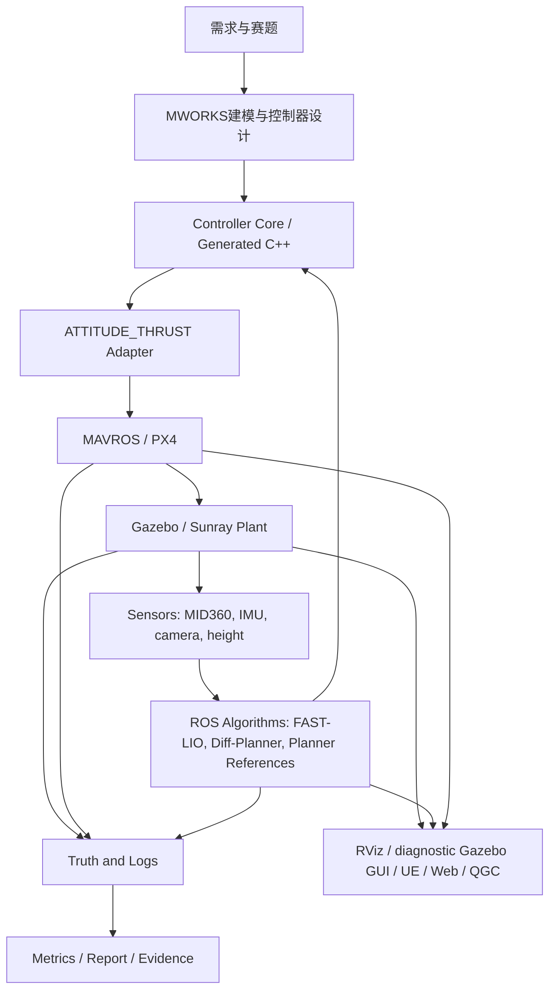

# MoSim总体架构

> 状态：系统架构入口，2026-07-28。QGC Factory 二维操作面为已批准的
> 用户授权建设任务；它不改变 MWORKS、Gazebo、PX4、MAVROS 和日志的证据权威。
>
> 本文回答“MoSim整体系统怎么分层、各软件谁是权威、当前先做哪条闭环”。
> 具体控制器接口、FAST-LIO、规划、编队、代码生成、调参和测试细节由
> `Docs/Design/架构/` 下的专题规范负责。

## 1. 架构定位

MoSim面向A8四旋翼赛题，主线是基于MWORKS完成控制系统建模、仿真、优化、
代码生成和工程验证。项目不以复现通用机器人导航栈为目标，也不把UE/RViz
画面作为控制器成功的证明。

当前架构采用RflySim式分层，但不照搬RflySim实现：

```text
MWORKS / Sysblock / Syslab
  -> 控制器建模、MIL/SIL、代码生成、指标分析

PX4 / MAVROS / QGC
  -> 飞控接口、模式、解锁、估计器、failsafe和地面站监控

Gazebo / Sunray
  -> 运行plant、执行器、传感器、真值、扰动和故障环境

ROS / FAST-LIO / Diff-Planner / EGO references
  -> 外部定位、建图、规划和集群算法

RViz / UE / Web / QGC
  -> 审核、展示、实验操作和视频证据
```

核心原则：

```text
高频控制闭环不得依赖GUI或跨软件同步步进；
MWORKS负责模型和生成代码，不长期作为Gazebo实时闭环的阻塞节点；
Gazebo/Sunray在当前阶段是plant和传感器运行权威；
UE/RViz/QGC/网页是显示和操作层，不是控制成功判定层；
每次实验必须记录controller、plant、state、truth、trajectory和display profile。
```

## 1.1 架构权威冻结

本文不只作为说明性架构图使用，而是后续专题规范的权威入口。当前架构决策
冻结为：

| 决策项 | 当前冻结口径 | 落地专题 |
| --- | --- | --- |
| 控制主线优先级 | 先完成最小大系统闭环，再做控制器族和MWORKS代码生成扩展 | `Docs/Design/架构/01_控制器平台/MWORKS控制器关系与组合架构.md`、`Docs/Design/架构/03_测试调参与证据/测试与评价.md` |
| Plant权威 | 当前Sunray/Gazebo是plant、传感器、truth、故障和扰动权威 | `Docs/Design/架构/02_感知定位与规划集群/FASTLIO定位闭环.md` |
| 控制器权威 | `controller core`只接收标准状态和参考，输出物理控制语义 | `Docs/Design/架构/01_控制器平台/统一控制接口.md`、`Docs/Design/架构/00_架构与任务/系统集成接口与编排.md` |
| 状态源权威 | 控制状态、定位候选、评价truth必须分profile记录，不得静默混合 | `Docs/Design/架构/02_感知定位与规划集群/FASTLIO定位闭环.md` |
| 显示权威 | RViz、UE、Web、QGC只做显示、操作和审核，不作为指标计算来源 | `Docs/Design/架构/00_架构与任务/系统集成接口与编排.md`、`Docs/Design/架构/03_测试调参与证据/测试与评价.md` |
| 代码生成权威 | 生成代码必须先通过离线一致性，再进入Gazebo闭环回灌 | `Docs/Design/架构/01_控制器平台/代码生成与PX4部署.md` |

`Docs/Design/架构/00_架构与任务/系统架构问题与决策矩阵.md`只作为风险索引和设计问题追踪表；任何已经
冻结的决策，必须同步进入上表对应的专题规范后才算可执行。

## 2. 总体分层



各层权威如下：

| 层 | 权威内容 | 不拥有的权威 |
| --- | --- | --- |
| MWORKS建模层 | 控制器模型、MIL/SIL、参数优化、代码生成、离线一致性 | Gazebo闭环成功、真机成功、显示画面成功 |
| Controller Runtime层 | C++/生成代码控制器、Adapter、安全限幅、状态诊断 | plant真值、全局地图真值 |
| PX4/MAVROS层 | 模式、解锁、EKF、Offboard接口、failsafe、飞控内环 | 控制算法创新归属、Gazebo物理真值 |
| Gazebo/Sunray层 | 当前plant、执行器、传感器、truth、故障/扰动环境 | 控制器数学正确性、MWORKS模型等价性 |
| ROS算法层 | FAST-LIO、局部地图、Diff-Planner轨迹、参考规划器和多机规划 | plant真值、显示层全局地图偷读 |
| RViz/UE/Web/QGC层 | 可视化、操作、审核、视频和人机界面 | 控制器成功判定、定位成功判定、最终指标 |

## 3. 当前最小大系统闭环

当前先做最小大系统，而不是先批量铺开所有控制器。最小大系统是后续控制器、
代码生成、规划、集群和展示的统一验证台。

当前冻结路线：

```text
Ubuntu-20.04 / ROS1 Noetic
  -> References/Sunray
  -> Sunray150 + MID360
  -> Gazebo Classic
  -> PX4 + MAVROS
  -> px4ctrl / ATTITUDE_THRUST
  -> RViz点云、轨迹、地图审核
```

最小大系统包括：

```text
1. Sunray150机体和MID360装配正确；
2. PX4/MAVROS/Gazebo基线稳定；
3. px4ctrl完成起飞、悬停、降落、阶跃、8字、螺旋；
4. RViz默认显示飞机三轴、轨迹、累计点云和规划地图；
5. FAST-LIO先做独立定位/建图评价；经PX4 EKF融合进入统一状态源属于后置
   `FL-EKF`状态源替换分支；
6. Diff-Planner完成单机复现；
7. Diff-Planner swarm完成uav1/uav2/uav3三机工程基线；
8. EGO/EGOv2/EGO-Swarm作为参考和后续对照；
9. 日志、指标、截图、视频和报告证据可追溯。
```

当前不得把以下路线作为正式主线证据：

```text
ROS2/PX4 x500历史实验；
假点云或静态点云；
ROS直接写Gazebo电机话题；
Python truth-feedback临时控制器；
只看RViz/Gazebo非空画面；
UE画面替代Gazebo/PX4/日志指标；
MWORKS GUI同步步进Gazebo后宣称实时闭环。
```

## 4. RflySim对标关系

RflySim给MoSim的主要参考是分层思想，不是参数、场景或代码照搬。

| RflySim角色 | MoSim对应角色 | 当前策略 |
| --- | --- | --- |
| Simulink | MWORKS/Sysblock/Syslab | 控制器建模、MIL/SIL、代码生成 |
| CopterSim | Gazebo/Sunray plant，后续可有MWORKS plant证据 | 动力学、传感器、执行器、故障/扰动 |
| PX4/Ardupilot | PX4/MAVROS | 飞控接口、EKF、模式、failsafe |
| RflySim3D/UE | UE/RViz/诊断用Gazebo GUI | 显示和审核，不进高频控制闭环；Gazebo GUI不作常驻前台展示 |
| ROS/ROSTrans/MAVROS | 当前ROS1/MAVROS；ROS2仅作历史/未来参考 | 外部定位、规划、集群和传感器转发 |
| QGC | QGC | 地面站、参数、状态、模式监控 |

RflySim式架构的重点是：

```text
建模软件负责设计和生成；
高频运行使用编译产物或飞控固件；
plant、传感器、渲染和GUI分进程；
ROS做外部算法，不承担电机/姿态高频内环；
显示卡顿只影响观看，不影响控制闭环。
```

MoSim必须吸收这个边界。若后续实现MWORKS-Gazebo联合仿真，也只能作为受控
研究项，不能让Gazebo实时飞行依赖MWORKS GUI逐步同步返回控制量。

## 4.1 MWORKS到部署验证边界

MWORKS在MoSim中的角色接近Simulink：用于控制器、任务状态机、安全逻辑、
扰动/故障模型、MIL/SIL仿真、参数优化、代码生成和报告指标。Gazebo/Sunray/
PX4/ROS/UE是部署验证、传感器、规划、集群和展示环境。两者不是互相替代关系，
也不应被拆成两个互不相干的项目。

允许的耦合方式：

```text
MWORKS模型/MIL/SIL
  -> GenerateModelCode或等价稳定实现
  -> 离线一致性检查
  -> ROS/Sunray/PX4/Gazebo回灌A/B验证
  -> 日志、指标、截图、视频和报告证据

MWORKS任务/故障/扰动profile
  -> 导出为实验profile或参数表
  -> Gazebo/ROS/UE侧按同一profile执行
  -> 结果回到MWORKS/脚本侧做指标对比和报告图表

ROS/FAST-LIO/Diff/EGO/Swarm运行日志
  -> 离线回放或低频任务事件
  -> MWORKS验证控制、安全、故障和任务状态机边界
```

禁止的耦合方式：

```text
Gazebo/PX4高频控制环每个周期等待MWORKS GUI或跨软件同步返回控制量；
用MWORKS GUI同步步进结果冒充可部署实时闭环；
用ROS/规划/集群单独跑通替代MWORKS控制器/codegen闭环；
用UE/RViz画面替代Gazebo/PX4/MAVROS日志和指标。
```

因此，SLAM、规划、集群和UE/frontend仍然是agent要完成的工程任务；只是它们
必须说明服务的MWORKS控制、任务、安全、故障或报告目标，不能反向把项目改成
脱离MWORKS的通用机器人导航栈。

## 5. 延迟与实时性边界

实时链路按频率和风险分层：

| 链路 | 目标用途 | 是否允许跨GUI/高延迟链路 |
| --- | --- | --- |
| 电机/角速度/姿态内环 | PX4或生成代码本地执行 | 不允许 |
| ATTITUDE_THRUST控制器 | 100Hz基线，后续按实验调整 | 只允许C++/生成代码/稳定ROS节点 |
| FAST-LIO定位 | 默认先跑通，再评价频率和延迟 | 可跨ROS，但必须带timestamp和诊断 |
| Diff-Planner/EGO类规划 | 10-20Hz或事件触发 | 允许跨ROS |
| RViz/UE/Web显示 | 30-60FPS显示或审核 | 允许丢帧，不允许阻塞控制 |
| QGC | 地面站监控和操作 | 不进入实时闭环 |

设计约束：

```text
控制器不等待UE渲染；
控制器不等待RViz显示；
控制器不等待网页刷新；
显示端只消费带时间戳的状态帧，过期帧直接丢弃；
指标计算使用日志和truth，不使用屏幕画面估算；
跨进程消息必须带source、frame_id、timestamp、sequence和profile。
```

## 6. 状态源与真值

当前默认控制状态源冻结为PX4/MAVROS融合状态。Gazebo truth完整位姿/里程计
只做评价；唯一例外是显式 `height_source_profile` 中的 Gazebo Z 定高替身，
该例外必须单独标注，不得冒充纯FAST-LIO或纯PX4融合状态：

| 数据 | 当前用途 |
| --- | --- |
| `/mavros/local_position/odom` | 控制器主要位置、速度、姿态输入 |
| `/mavros/imu/data` | 角速度/IMU相关输入 |
| `/sunray/uav_state` | 模式、解锁、有效性、显示和状态机辅助 |
| Gazebo truth pose/odom | 评价真值，不得静默输入控制器 |
| FAST-LIO odometry | 先独立评价，再经PX4 EKF融合进入统一状态源 |
| Gazebo Z定高替身 | 仅可在显式`height_source_profile`中作为真机激光定高替身 |

状态源冻结不只冻结topic，也必须冻结字段语义。当前Sunray/PX4/MAVROS链路中，
`/mavros/local_position/odom`的pose使用map/local语义；`twist.twist.linear`
必须按已审计的velocity frame处理。2026-06-28 Diff-Planner交互炸机排查确认，
MAVROS local odom的linear velocity更符合body/base_link速度语义，px4ctrl输入层
需通过`odom_velocity_frame=body`把速度旋转到world后再控制。任何新状态源或
新MAVROS/FAST-LIO接入，不得只复用topic名；必须重新审计position、orientation、
linear velocity、angular velocity、timestamp、covariance和frame_id/child_frame_id。

FAST-LIO正式进入闭环的路线是：

```text
MID360点云 + 雷达IMU
  -> FAST-LIO
  -> 外参和坐标系对齐到机体/飞控中心
  -> pose、quaternion、velocity、covariance、timestamp、status
  -> PX4 external odometry / vision融合
  -> /mavros/local_position/odom
  -> 同一套px4ctrl/控制器参数进行A/B对比
```

不得把FAST-LIO直接输出、Gazebo truth和PX4融合状态混成一个不透明状态源。

## 7. UE、RViz、QGC和网页前端

第一阶段默认审核面：

```text
RViz:
  点云、累计地图、栅格地图、TF、飞机三轴、轨迹/path

Gazebo GUI:
  仅在模型装配、碰撞或场景诊断时临时打开；不作为常驻前台展示窗口

QGC:
  原生MAVLink连接、模式、解锁、起飞、降落、参数、日志和状态观察；
  已发布Profile的选择、待应用故障的确认/恢复、Factory二维态势与回放操作；
  运行命令必须在可见终端中留下日志和报错，不得变成不可观察的后台启动

MoSim Studio:
  实验配置、Profile可视化、MWORKS模型/结果/代码工程入口；
  维护可供QGC选择的已发布Profile和兼容性信息，不与QGC维护第二套配置事实

可见终端:
  ROS1、Gazebo、PX4、MAVROS、规划器和RViz的实际启动、日志和报错入口
```

UE是增强展示层，不是第一阶段控制闭环依赖。当前第一张正式UE地图为Factory。
UE保持独立可选窗口，不再嵌入QGC；其默认输入策略必须不锁死鼠标，失焦或`Esc`
必须释放指针。`MoSimSceneLibrary` 当前以未捕获、未锁定、可见光标启动，并把`Esc`绑定为
幂等的指针释放；这是源码输入策略，不是 UE 运行时验收。Factory路线先做L2静态导入Gazebo和UE Global Overview姿态轨迹视图；
QGC以工厂二维图作为主操作面，不承担UE渲染或鼠标焦点管理。理想长期路线：

```text
Gazebo/Sunray/PX4/ROS产生状态、轨迹、点云、地图和相机数据
  -> UE异步订阅/回放
  -> UE显示真实机体、场景、轨迹、多机、相机第一视角和实验UI
```

当前UE第一版落地路线是单向渲染镜像：Gazebo/PX4/MAVROS/ROS1继续拥有
控制、plant、truth、日志和metrics权威，UE只消费状态帧并产出展示、视频和
人工审核证据。桥接契约和验收门禁见
`Docs/Design/架构/04_展示与实验平台/UE渲染镜像桥接方案.md`。
Factory L2静态导入和10Hz全局姿态轨迹视图见
`Docs/Design/架构/04_展示与实验平台/Factory地图导入与全局态势视图.md`。

UE路线必须拆成Scene Base和Data Bridge两条产物线。Factory L2静态导入只解决
场景底座；UE Global Overview、第三视角和轨迹残影必须由ROS1/Gazebo/PX4/MAVROS/
Sunray的run bundle或live topics经`mosim.ue_render_stream_manifest.v1`驱动。
第一版先做`T0 replay`，再做`T1 live sidecar at 10Hz`。没有Data Bridge和manifest
的UE截图、视频或静态地图只能算临时观察或场景审核，不能算UE运行时展示完成。

QGC Factory二维操作面冻结为：

```text
Map Registry(map_id, map_version, asset hash, world frame, world<->pixel,
             optional geodetic anchor, task overlays)
  -> Fly View：飞机位置/航向、实际轨迹、未来规划轨迹、任务边界、状态与图层开关
  -> Plan View：同一工厂底图上的原生QGC航点与边界编辑

live map_state / rosbag replay map_state
  -> 同一渲染接口；带run_id、profile_id/profile_hash、source、timestamp、sequence
  -> 无真实数据时隐藏车辆和路径，绝不以演示坐标填充
```

Factory L2 的二维底图包含图像留白，世界边界并不等于 PNG 的四条边。因此 Map Registry 的
`image_coordinate_contract` 必须冻结原始像素尺寸、`world_to_pixel_3x3`、
`pixel_to_world_3x3`、矩阵源文件路径和 SHA-256，并作为 `operator_map_snapshot` 的一部分
进入同一 `RunManifest` 哈希。准备工具、Orchestrator 和运行 sidecar 启动时必须拒绝缺失、篡改、
不可逆或与源矩阵不一致的合同；运行状态读取只校验已冻结快照的哈希、身份和矩阵可逆性，避免
每帧重复读取矩阵文件。Fly View 只能按
`world -> source pixel -> rendered pixel` 绘制飞机、航迹、边界和目标；Plan View 必须先用
`pixel_to_world` 求整张图像四角的世界坐标后再投到 QGC 地理图层，禁止把完整 PNG 直接拉伸到
`world_bounds_m`。当前 `axis_aligned_image_rect_v1` 只支持无旋转、无剪切的仿射图；未来地图若有
旋转或剪切，必须先新增投影图元和合同版本，不能静默使用矩形近似。

初始地图为完整Factory L2，FUEL室内区域只能作为任务叠层。新城市或其他地图只可
通过同一注册表加入，不能以截图或临时比例尺替换Factory坐标契约。QGC原生任务发布
必须在仿真Home经纬度锚点经过世界坐标往返门禁后才开放；未通过时二维图可显示、回放
和编辑草案，但必须明确阻止上传任务。

实时模式只消费低频车辆/轨迹/任务状态，允许丢弃过期显示帧且不得阻塞控制；点云、
栅格和TF继续由RViz审核。回放模式优先消费带地图和坐标契约的rosbag派生状态，提供
播放、暂停、倍速和图层控制；它不能被标注为实时运行。

### 7.1 Factory 二维 `map_state` 数据合同

Fly View 和 Plan View 不直接猜测 ROS topic、UE 坐标或本机时间。它们只消费投影后的
`mosim.operator_map_state.v1`，该对象可作为 `runtime_telemetry` 的 `map_state` 字段传入，
也可由 rosbag 回放器以相同结构提供。第一版字段冻结如下：

```text
schema, run_id, profile_id, profile_hash,
transport: {
  mode: live_ros1 | rosbag_replay,
  sequence, received_at_unix_s, source_timestamp_s,
  playback_state, playback_time_s, bag_id?
},
map: {
  map_id, map_version, asset_sha256, world_frame,
  coordinate_contract_id, coordinate_contract_status,
  operator_map_snapshot_hash
},
vehicles[], task_paths{expected?, future?}, task_boundary?, formation_target?,
map_data_status?: { state: accepted | rejected, reason_code }
```

时间语义固定为：`source_timestamp_s` 是 ROS header 或 rosbag 原始记录时间，只用于
时间轴、延迟和复盘；`received_at_unix_s` 是 sidecar/replay 接收并发布本帧的墙钟时间，
用于实时新鲜度判断；`sequence` 在同一 `run_id` 内严格递增。回放模式还必须给出
`playback_state`（`playing`、`paused`、`completed` 或 `failed`）与 `playback_time_s`。暂停时
保留最后一帧供审核，但不得把它标为“实时”；实时模式收到超过显示阈值的帧必须隐藏飞机
与轨迹。

坐标语义固定为：所有车辆、航点、边界和轨迹点都已经转换到 `map.world_frame` 的米制平面，
`coordinate_contract_status` 只能为 `verified`、`pending_runtime_validation` 或 `rejected`。
只有 `verified` 才能在二维图绘制动态数据；其余状态只能显示底图和明确的阻断原因，不能把
MAVROS 局部坐标、UE 厘米坐标或演示坐标静默当作 Factory 世界坐标。`map_id`、
`map_version`、`asset_sha256` 和 `coordinate_contract_id` 必须与 Map Registry 和冻结的
RunManifest 一致，任一不一致即丢弃该帧。

首张 Factory L2 地图的 RunManifest 需冻结 `operator_map_snapshot`，至少包含
`map_id=factory_l2`、版本、资源哈希、世界坐标系和坐标契约标识。后续城市地图或其他楼层
只能新增 Registry 条目和对应坐标契约，不能复用 Factory 的边界或转换矩阵。QGC 任务编辑
仍在独立的经纬度往返门禁之后才允许发布；`map_state` 验证通过仅说明二维显示坐标可信，
不等于飞控任务地理坐标已经通过验证。

每个需要 QGC 二维态势的已发布 ExperimentProfile 显式声明 `operator_map_id`。创建实际运行目录的
受控运行脚本或准备工具必须从已启用的 Map Registry 深拷贝完整条目到
`operator_map_snapshot`，并写入确定性的 `operator_map_snapshot_hash`；准备后的 QGC、live
sidecar 和 rosbag 回放只消费该快照。QGC 不创建、修改或补写 RunManifest。它仅在尚未发现活动
运行时显示目录默认图；已有 `run_id` 但没有合法快照时必须显示阻断状态，不能退回到可变目录默认值。
sidecar 的 `--map-id` 和 `--coordinate-contract-id` 仅作一致性断言，不匹配即拒绝发布；
`--coordinate-contract-status=verified` 不得作为运行时开关。坐标校验可以通过绑定同一地图快照的
证据文件把状态更新为 `verified` 或 `rejected`，但不能改变快照身份或其哈希。

实时 sidecar 必须以 `--coordinate-evidence <path>` 显式加载同一
`mosim.operator_map_coordinate_evidence.v1` 证据后，才可把 `map_state` 标为
`verified`。它只投影已声明与证据 `source_frame_id` 一致的里程计位置、航向、全局速度和
预期/未来路径到 `target_frame_id=map.world_frame`；`nav_msgs/Odometry` 的 body-frame
twist 不得冒充 Factory 世界速度。未提供证据时，`map_state` 只保留连接状态并把路径标为
待验证，不泄露原始 ROS 几何给二维图。某个车辆源 frame 不匹配时，sidecar 生成空的动态几何和
`map_data_status={state: rejected, reason_code}`，但继续写入原始运行遥测、readiness 和日志，
绝不以显示失败重启、停机或改变飞控。

live sidecar、rosbag 回放器和 QGC Bridge 都必须校验 `map_state` 的 run/profile/map 快照身份、
传输时间语义、车辆编号、几何边界和回放字段；当状态为 `verified` 时，车辆位置和轨迹还必须显式
声明同一 `world_frame`。校验失败只拒绝该遥测帧，不改变飞控或控制器状态，也不得触发后台重启。

#### Rosbag 派生回放入口

`Scripts/ui/replay_rosbag_operator_map.py` 是 Factory 二维态势的离线回放入口。它读取
ROS1 `.bag` 中每架飞机的 Odom 记录，并可显式读取已录制的 `nav_msgs/Path` 任务预期路径和
`visualization_msgs/Marker` B-Spline 未来轨迹；仅供测试的标准化 JSONL 导出使用
`record_type=odom|expected_path|future_path` 区分三类记录。预期/未来路径只在其 bag 记录时间
到达后进入同一 `map_state`，不会在回放开始时预加载后续规划结果。它不发布 ROS 消息、不解锁
飞机、不启动 Gazebo/PX4，也不向控制器或规划器回写任何数据。它以已准备运行目录的
`RUN_MANIFEST.json` 为唯一身份来源，并产生：

```text
OPERATOR_MAP_REPLAY_MANIFEST.json  # 源文件路径/sha256、bag_id、话题映射、坐标证据、总更新帧数/里程计帧数和时长
OPERATOR_MAP_REPLAY_STATUS.json    # playing/completed/failed、序列号和回放时间
telemetry.json                     # 当前帧的 mosim.operator_map_state.v1，供 QGC 只读消费
```

真实可绘制的回放必须随命令提供 `mosim.operator_map_coordinate_evidence.v1`：该文件包含
`evidence_id`、完整地图身份、冻结快照哈希、源/目标 frame 和米制 `T_target_from_source` 矩阵；
目标 frame 必须等于冻结地图的 `world_frame`。缺少、失配或尚未审核的证据只能保持
`pending_runtime_validation`，QGC 可以保留底图和回放状态，但必须隐藏飞机和轨迹。三机回放在
任一车辆尚无首帧时输出 `vehicles=[]`，不补造队形位置；全部车辆均有真实帧后才输出完整状态。

QGC 的“开始回放监看”只会轮询当前运行目录的 `telemetry.json`，不会启动回放脚本、打开隐藏终端
或改变飞控生命周期。用户在可见 ROS1 终端启动脚本后，QGC 才以 `rosbag_replay` 状态显示轨迹；
完成帧保持为 `completed`，不得标记为实时运行或控制器/规划器成功证据。
回放页对操作者显示中文的“ROS1 实时数据”“rosbag 回放中/已暂停/已完成/失败”状态；回放时还显示
`bag_id` 与回放时间，避免把机器字段、旧帧或离线回放误认成当前飞行遥测。

Plan View 只在地图身份（`map_id`、版本、资源哈希、快照哈希）首次出现或发生变化时重居中，
普通遥测刷新不会覆盖用户的平移和缩放。当前 Factory 地图的世界坐标到经纬度往返门禁尚未通过，
所以原生 QGC 航点/围栏可编辑为草案，但“上传到飞控”必须明确阻止，直至
`mission_publication.status=verified`。

最小可接受前台审核/展示路线：

```text
RViz工程审核 + UE展示/视频或Web/QGC辅助前端；Gazebo GUI只作诊断窗口
```

实时UE truth暂不启用。UE真值或导出地图如果未来使用，只能作为调试、显示、
静态导入或校验来源；要进入评价或规划，必须先经过场景几何/传感器/地图契约，
不允许规划器直接偷读UE全局地图。

## 8. 可组合实验平台边界

MoSim需要支持前端选择控制器、状态源、轨迹、故障、扰动、显示和评价方式，
但这不是任意模块自由排列组合。当前采用固定流水线和有限插槽：

```text
Scenario
  -> Plant Profile
  -> State Source Profile
  -> Trajectory / Planner Profile
  -> Trajectory Server / Reference Shaper
  -> Controller Core
  -> Optional Augmentation
  -> Safety Filter
  -> Adapter
  -> PX4 / Gazebo
  -> Logger / Evaluator / Display
```

约束：

```text
同一时刻只能有一个Controller Core拥有最终控制权；
MoSim Studio只能编辑/校验/展示Profile并打开对应MWORKS工程，不能替用户运行MWORKS或导出代码；
QGC可选择已发布且兼容的Profile，并显示冻结后的controller/profile/run身份；
QGC不得临时拼装未经验证的控制器组合，且飞机进入prepare、解锁或飞行后禁止切换；
QGC故障面只允许“待应用 -> 人工确认应用 -> 生效ACK -> 恢复正常”的离散命令，
第一版不连续流式发送滑块值；
QGC命令面板必须显示并复制已验证的完整终端命令，不得在后台启动运行时；用户始终在可见终端查看日志、报错和停止状态；
Orchestrator不是比赛与交付主线的必需运行依赖，现有相关代码只能作为后续可选研究基础设施；
不兼容组合必须拒绝启动，不能静默降级；
每次运行必须记录完整profile和哈希。
```

### 8.0 QGC 已发布 Profile 与离散故障契约

QGC 可见任务目录固定为 `Config/profiles/operator_profiles.json`。目录条目只提供
`profile_id`、显示名称、启用状态、操作模式和受控任务关键词；QGC 本地只读加载对应
ExperimentProfile、运行后端目录与地图注册表，显示 `controller_profile`、`vehicle_count`、
`operator_map_id` 与冻结的运行身份。准备运行前，Profile 是唯一的配置事实来源：选择
控制器或二维地图只能反向选择一个兼容的已发布 Profile，不能在 QGC 中临时拼接控制器、
任务、机数和地图。地图切换优先保持当前控制器和任务关键词；无兼容 Profile 的未来地图
可见但禁用，并显示原因。机数始终由 Profile 派生且只读。`RunManifest` 形成后冻结同一
Profile 身份、哈希和地图快照，起飞前后均不能改选或再次复制启动命令。复制的前台命令首先执行
`Scripts/ui/prepare_operator_run.py`，由该准备工具在 `Results/runs/<run_id>/RUN_MANIFEST.json`
冻结 Profile、地图快照和场景快照，并原子更新
`Results/ui_platform/qgc_active_run.json`；QGC Bridge 只读取该指针和清单，不自行写入或补写。
任务已停止后，操作者通过同一可见终端执行准备工具的 `--clear-active`，将指针标记为已结束而不删除
本次证据。

当前 QGC 二次开发的唯一活动源码是
`apps/flight_console/mosim/custom/`。`Scripts/ui/build_flight_console.ps1` 将其物化到
`apps/flight_console/vendor/qgroundcontrol/custom/` 后再构建；后者是生成的构建目标，不能作为
常规编辑源。`src/ground_station/qgc/mosim_extension/` 是 `copied_pending_activation` 快照，
不在当前构建链路中，不能把其中旧的 Orchestrator 或 UE 嵌入实现重新接回操作面。

`Config/control_platform/runtime_backend_catalog.json` 中的 `operator_invocation` 是 QGC 的唯一
启动命令合同。QGC 只允许把受审计的环境变量和参数渲染为可复制的前台 PowerShell/WSL 命令，并
显式附加 `MOSIM_OPERATOR_PROFILE_ID`、`MOSIM_CONTROLLER_PROFILE`、
`MOSIM_VEHICLE_COUNT`、`MOSIM_PLANNER_PROFILE`、运行入口和操作模式。QGC 不使用
`QProcess`、不调用 Orchestrator、不会在后台启动或监督 ROS、Gazebo、PX4、MAVROS、UE、RViz
或 sidecar。用户把命令粘贴进可见终端执行，终端才是启动日志、错误和停止信号的权威入口。

第一版故障请求使用同一逻辑合同的控制面路径：

```text
QGC 暂存风扰或单电机效率
  -> 仅在 QGC 内存中形成待应用值
  -> 显示并复制 write_operator_fault_request.py 的完整命令
  -> 用户在可见终端执行
  -> Results/runs/<run_id>/injection_commands/*.json
  -> 已运行 ROS sidecar 消费命令并产生 ACK、telemetry 与 injections 记录

QGC 点击“恢复正常”
  -> 显示并复制同一工具的 --restore-normal 命令
  -> 可见终端写入风扰 0.0 与电机 1..4 效率 1.0 的五条离散命令
  -> sidecar 逐条 ACK；任一失败必须保留逐条结果
```

`apply_injection` 和 `restore_injection` 仅保留为旧调用方兼容接口，QGC 操作面不得直接使用。
QGC 不启动 ROS、Gazebo、PX4、MAVROS、UE、RViz 或 sidecar，也不把命令复制成功表述为故障已经
生效。上述契约已有源码和静态测试覆盖，但不证明 Gazebo、PX4、MAVROS 或真实飞行端已接受任一
命令；运行时结论仍需同一 `run_id` 的后端 ACK、遥测和日志。

故障页同时只读显示选定飞机在同一 `telemetry.json` 中的 `injection_state` 与
`injection_acks/*.json` 的最新有效 ACK。ACK 必须保留 `target`、可选 `rotor_index`、
`apply_mode`、`source`、请求值、生效值、接受状态和原因码，并与当前 `run_id`、飞机编号和
已冻结机数一致；不满足这些条件的文件不显示。该读回仅说明 sidecar 的命令处理状态，不能替代
Gazebo/PX4/MAVROS 的运行验收或真实飞行结论。

QGC 的控制器选择器从 `control_scheme_catalog.json` 读取全量控制器族和控制器条目，并按
“控制器族 -> 控制器 -> 已发布兼容 Profile”展示。`operator_profiles.json` 为每个任务 Profile
显式声明 `controller_scheme_id` 和 `task_key`：选择一个可用控制器时，QGC 仅绑定同一控制器已有的
已发布 Profile，优先保持当前任务类型；不存在已发布兼容 Profile 的控制器仍可见但禁用，并显示原因。
这使控制器入口在 QGC 中完整可见，同时不允许脱离 Profile 临时拼装算法、增强层、安全层或输出边界。
增强模块、故障注入、安全过滤和不同输出层级后续按兼容性矩阵逐步释放。因此“自由选择”应理解为
受约束的实验配置选择，不是控制模块任意堆叠。
`Reference Shaper` 当前属于 `trajectory_profile` / `planner_profile` 的内部求值
和整形逻辑，不单独作为第一版 `ExperimentProfile` 顶层槽位。

## 8.1 已批准的 MWORKS 模型库目标结构

当前正式加载根仍是 `Models/MoSimQuadrotorModel/package.mo`。现有根目录的
`Plant`、`Dynamics`、`Controllers`、`ExperimentRunner`、`Missions`、`Robustness`、
`System`、`Planning`、`Formation`、`LiveIntegration`、`SceneTrace` 和 `Support`
尚未改名；本节只冻结下一次原子迁移的目标，不把它写成既成事实。

```text
MoSimQuadrotorModel/
  Parameters/       冻结参数、物理和控制 Profile
  Vehicle/          Sunray150 装配、动力学、推进、电气、传感器和地面接触
  Control/          控制契约、基线、分配、适配、桥接和控制律实现
  Experiment/       Runner、探针、场景、任务模板、指标和结果契约
  Guidance/         轨迹、规划、编队和外部参考生成
  Deployment/       生成代码、MWORKS Live、ROS1/PX4/Gazebo 适配
  Visualization/    场景轨迹、动画和展示追踪
  Common/           共享类型、工具和非业务支撑模块
```

目标根下的职责进一步固定为：

```text
Control/
  Interfaces/       四种 typed controller boundary
  Baselines/        离线默认控制律和官方基线壳
  Allocation/       姿态/角速度/WRENCH 到转子命令的内环与分配
  Adapters/         只做 typed boundary projection 的控制器适配器
  Bridges/          EquationBridge 和 CFunction 外部实现桥
  Implementations/  PID、经典鲁棒、滑模、优化、几何、学习和 Sysblock 控制律
Experiment/
  Runners/          四种输出边界的整机 Runner
  Probes/           固定输入、符号和最小闭环探针
  Scenarios/        扰动、参数失配和故障注入场景
  Templates/        官方案例、完整系统模板和固定链的实验模板
Guidance/
  Trajectories/     ClimbPath、CirclePath、EightPath 等任务参考
  Planning/         单机规划
  Formation/        编队参考
  References/       表格/内联外部参考源
Common/
  Limits/saturate   共享限幅函数；函数名保留小写 Modelica 习惯，但不再裸露在根目录
```

映射规则固定为：`Plant + Dynamics -> Vehicle`，`Controllers -> Control`，
`ExperimentRunner -> Experiment`，`Missions + Robustness + System ->
Experiment/Scenarios` 或 `Experiment/Templates`，`Planning + Formation -> Guidance`，
`LiveIntegration -> Deployment`，`SceneTrace -> Visualization`，`Support -> Common`。
五条命名整机 Profile 不是独立模型目录或控制器族；其中 PID 与 MPC/NMPC Profile
分别迁入 `Control` 下对应家族。

`ExperimentRunner.Adapters` 不能整体搬迁：真正的 `*Adapter` 进入
`Control/Adapters`，`Offline*Allocator` 进入 `Control/Allocation`，
`*EquationBridge` 与 `*CFunction` 进入 `Control/Bridges`，`Offline*Controller`
进入 `Control/Baselines`。`GraphicalMIL` 是历史评审阶段名，迁移后统一为
`Control/Implementations`；`Plant/PathPlanning` 必须迁至
`Guidance/Trajectories`。`ExperimentRunner.Plant` 的两个 legacy alias 已退休，
所有活动引用统一改为 `Vehicle` 的规范装配类。

迁移必须是一次可验证的原子改名，而不是新旧目录长期并存：先完成 46 条现有路线和计划
ESO Profile 的接口矩阵，再同步更新 `package.mo`、`package.order`、全限定名、配置、
Runner、Adapter、脚本和文档引用；随后以 `Sunray150Assembly`、Official PID 和四类
Runner 输出合同回归。迁移期间保持叶类控制律和物理方程行为不变；迁移完成后，不得保留
旧根、空壳 alias 或旧路径作为第二个活动加载面。历史 Results 只保留历史路径文字，不做
回写或伪装为新结构的证据。

## 8.2 工程源码与交付布局

> 状态：目标架构已确认；首批组件已按“只复制、不移动、不删除、不切换活动入口”登记为
> `copied_pending_activation`。同时，已冻结“源码、静态资产、可复用数据、运行证据和历史归档”
> 的语义边界。该语义决定不代表任何物理路径已经迁移。任何构建路径改写、运行时复跑、旧目录归档
> 或交付包剔除，仍必须由独立迁移任务按本节执行，不能从源码快照推断为已激活或可运行。

工程目录按功能分类，不按“是否第三方”分类。`vendor`、`mosim`和`References`不能作为
运行源码的顶层归属。上游来源、许可证、固定commit和本项目补丁由组件目录内的
`UPSTREAM.md`、`PATCHES.md`及统一依赖锁定清单记录。

```text
apps/
  model_studio/                 # 唯一原生APP：MoSim Studio

src/
  control/                      # 控制律、生成代码适配、安全与容错
    controllers/
    runtime_adapters/
    safety/
    fault_tolerance/
  planning/                     # FUEL、FALCON、RACER、Diff、固定编队与任务适配
    fuel/
    falcon/
    racer/
    diff_planner/
    diff_swarm/
    ego_planner_swarm/
    fixed_formation/
    mission_adapters/
  perception/                   # FAST-LIO、建图与感知处理
    fast_lio/
    mapping/
  simulation/                   # Gazebo、Sunray、场景、机体与传感器模型
    gazebo/
      sunray/
      plugins/sunray/
      worlds/
      sensors/
  flight_stack/                 # PX4、MAVROS及飞控侧集成
    px4/
    mavros/
  ground_station/               # QGC上游源码、MoSim QML/C++扩展和补丁
    qgc/
      qgroundcontrol/
      mosim_extension/
      patches/
  visualization/                # RViz、UE桥接与回放
    rviz/
    unreal_bridge/
    replay/
  integration/                  # ROS1 launch、消息契约、运行记录和诊断
    ros1_launch/
    contracts/
    run_records/
    diagnostics/
  common/                       # 共享数学和非业务工具
    math/
    utilities/

Config/                          # Profile、任务、场景、地图和参数
Scripts/                         # 用户入口、预检、构建、诊断和分析；不承载主要业务实现
Models/                          # MWORKS正式模型根，当前不强行迁入src
UE5/                             # UE正式工程根，当前不强行迁入src
Assets/                          # 版本化静态资产：场景、机体、地图、材质和转换清单
  environments/factory_l2/<v>/   # 原始场景、Gazebo正式场景、二维图和坐标/转换清单
  vehicles/sunray150/<v>/        # 不可由构建重建的机体和传感器静态资产
Data/                            # 跨任务复用的传感器数据和回放数据，不承载实验结论
  sensor_replay/
  recordings/
Results/                         # 每次运行的证据、指标、截图以及与run_id绑定的raw/replay
References/                      # 论文、博客、原始示例和调研材料；不参与构建或运行
```

`Assets/` 和 `Data/` 是目标根目录，不得因为本段定义而直接新建空目录、批量移动或删除当前文件。
它们只在对应资产包的迁移任务中创建，并同步写入路径注册、清单、哈希和最小验收。

资产、数据、结果与历史代码的边界：

```text
静态资产：Factory L2原始GLB、当前Gazebo world/models、二维底图、坐标映射、机体网格和材质
  -> Assets/<domain>/<asset_id>/<version>/；一个可运行场景必须作为带MANIFEST的原子资产包迁移。

可复用数据：可被多个任务消费的传感器回放、UE truth 数据集、标定输入和外部数据集
  -> Data/；必须有数据来源、坐标系、采样/时间语义、许可证和SHA-256清单。

运行证据：某次MWORKS、Gazebo、PX4或ROS运行产生的指标、图、日志、Result.msr、rosbag、ULog
  -> Results/<domain>/<run_id>/；原始记录可放在raw/或replay/，但必须由RunManifest说明用途。
  Result.msr、rosbag、ULog和可回放点云不是“缓存”，不得因目录瘦身删除。

本机生成物：build、devel、install、ROS工作区编译输出、下载工具链和临时转换文件
  -> build/、.tools/或明确的本机工作区；不进入src、Assets、Data或正式Results证据包。

历史AgentOS：退役CoAgent源码和其历史说明
  -> Docs/Cache/agent_legacy/，仅在完整依赖审计、清单和根目录引用更新后归档；不得进入src。
```

Factory L2 的当前 `Results/unreal_scene_mapping/factory_l2_static_import/` 是运行输入而非普通结果。
迁移时必须整体形成 `Assets/environments/factory_l2/<version>/`：保留原始场景、当前接受的
`gazebo/clean` world/models、正式二维图、坐标/转换清单和必要几何；不能只搬某个OBJ、STL或截图。
QGC编译所需的地图资源由受控物化步骤从该资产包复制到 QGC 扩展资源目录，扩展内副本不再是
资产真源。旧转换版本、可再生成OBJ/STL和非正式chunk可在新路径验收后单独归档，不得先删。

功能边界：

```text
control只生成控制命令和控制相关安全/容错语义；
planning只生成目标、轨迹和任务状态，不直接拥有MAVROS最终控制权；
simulation拥有Gazebo plant、场景和传感器仿真；
flight_stack拥有PX4和MAVROS飞控接口；
ground_station只拥有QGC构建、显示和原生飞控操作，不接管ROS运行时；
integration只拥有协议、launch、RunManifest和诊断，不重复实现控制或规划算法；
visualization只消费状态、轨迹和传感器数据，不能成为控制或指标权威。
```

迁移映射按功能执行，例如：

```text
当前Sunray/Gazebo源码       -> src/simulation/gazebo/sunray/
当前Sunray/Gazebo插件       -> src/simulation/gazebo/plugins/sunray/
当前px4ctrl运行源码         -> src/control/runtime_adapters/
当前FUEL、Diff及集群源码    -> src/planning/<algorithm>/
当前EGO/EGO-Swarm核心       -> src/planning/ego_planner_swarm/
当前FAST-LIO源码            -> src/perception/fast_lio/
当前PX4、MAVROS源码         -> src/flight_stack/
当前QGC源码和MoSim定制层    -> src/ground_station/qgc/
当前Model Studio            -> apps/mosim_studio/
```

迁移后的交付约束：

```text
1. 任何当前构建、launch、QGC构建、测试或运行Profile不得再引用References/；
2. 每个迁入组件保留上游来源、固定版本、许可证和补丁说明；
3. 只迁移源码、配置和必要资产，不迁移build、devel、install、缓存或历史日志；
4. Scripts只做入口和工具，复杂实现必须进入对应src功能目录；
5. 用户拿到项目源码包后，无需下载或查找References/即可按README完成环境配置和运行；
6. Models/和UE5/的原生根只有在路径注册、构建检查和专门烟测通过后才能迁移；
7. 旧References副本只能在哈希比对、依赖审计和新路径验证完成后归档或从交付包剔除。
8. 静态资产、可复用数据和运行证据必须按本节边界登记；不得把运行所需场景或传感器数据继续
   伪装成Results临时输出，也不得把不可替代的回放记录当作可删除缓存。
```

第一阶段迁移前必须先建立统一的项目根/组件路径配置，并逐个改写活动脚本、Profile、
测试和构建配置；不得一次性剪切目录。每迁移一个功能组件，至少验证其静态路径检查和
对应最小构建或预检。迁移执行步骤和证据要求由
`Docs/Workflows/project_structure_refactor.md`负责，不在本节重复。

## 9. 控制器和MWORKS推进顺序（历史批次标签）

> **历史编号说明：** 本节的 G8-G11、G9.5 和 G9.6 是历史批次标签，不代表当前
> 执行顺序。当前控制器证据 gate 只使用
> `Docs/Workflows/controller_evidence_closeout.md` 定义的 G1-G7；两套编号没有一一
> 对应关系。G6 的执行细则见
> `Docs/Workflows/g6_controller_experiment_execution.md`。

第一阶段控制接口只实际实现：

```text
ATTITUDE_THRUST
```

控制器core输出：

```text
desired_attitude_quaternion
desired_collective_thrust_N
controller_status
controller_diagnostics
```

推进顺序：

```text
1. PX4/MAVROS融合状态下收口px4ctrl起飞、悬停、降落基线；
2. 收口8字、螺旋、阶跃、圆形等基础轨迹和参数误差基线；
3. 跑通FAST-LIO独立评价、Diff-Planner单机和Diff-Planner swarm三机工程基线；
4. 用px4ctrl、官方PID、SE3 Basic形成代表控制器模板；
5. 做MWORKS Golden Slice，完成离线一致性、生成C/C++和Gazebo回灌；
6. 将MWORKS版控制器先接回Diff-Planner单机链路做闭环复核，再按结果扩展到Diff-Planner swarm三机；
7. 单独完成FAST-LIO经PX4 EKF融合后的状态源替换A/B对比；
8. 进入G9控制器族扩展：先完成G9-0静态工程收口，再逐个释放G9-A/F首批控制器；
9. 进入G9.5/G9.6论文级控制器复现：先复现高性能名义DFBC/NMPC对照，再复现抗风鲁棒DFBC；
10. 进入G10增强层矩阵：按DOB/ESO、L1/AWFF、INDI、安全过滤、故障分配、参数调度等类别做可组合实现；
11. 进入G11全控制器MWORKS/codegen闭环：不是冻结一个最佳控制器，而是把所有进入implemented/accepted的控制器和增强组合逐个完成模型、生成代码、离线一致性和ROS/Sunray回灌；
12. Factory L2静态地图导入和UE Global Overview姿态轨迹可作为当前S11显示/实验平台前置工作推进；实时UE truth、QGC二次开发、完整UE实验控制台和更复杂界面集成仍等控制器与codegen闭环稳定后再作为独立阶段推进。
```

历史 G8 基线曾冻结为：

```text
G8_MWORKS_FULL_LOOP_BASELINE_20260629
  -> px4ctrl generated core
  -> single-UAV Gazebo A/B
  -> Diff-Planner single-UAV regression
  -> Diff-Planner three-UAV regression
```

因此后续控制器族不再从零重做最小闭环，而是复用G8模板进入G9：

| G9项 | 内容 | 第一状态 |
| --- | --- | --- |
| G9-0 | ControllerProfile、candidate ExperimentProfile、Launch Plan、Run Manifest、source-basis和静态门禁 | 配置/文档/测试收口 |
| G9-A | official PID baseline | planned -> implemented -> accepted |
| G9-B | SE3 Basic | planned -> implemented -> accepted/report |
| G9-C | DFBC Basic / DFBC-Jerk | planned -> implemented -> accepted/report |
| G9-D | Classical or boundary-layer SMC | planned -> implemented -> accepted/report |
| G9-E | PID-INDI / INDI bounded augmentation | planned -> implemented -> accepted/report |
| G9-F | NMPC outer loop | planned -> implemented -> accepted/report |

G9-A/F不是一次性批量铺开。每个控制器必须先有论文/开源/公式来源审计，再进入
实现；未实现前只能放在`Config/profiles/candidates/`，并且显式检查时必须被
`C-CTRL-01`或对应增强模块错误拒绝。进入`Config/profiles/experiments/`前，
`implementation_status`必须是`implemented`或`accepted`。

G9-A/F完成后不得直接转入“选一个最好控制器并冻结”的流程。当前控制器主线
冻结为：

```text
G9.5  高性能名义控制论文复现
G9.6  抗风/鲁棒微分平坦控制论文复现
G10   增强层矩阵实现和消融对比
G11   全控制器/增强组合MWORKS代码生成闭环
```

其中G9.5/G9.6只解决“控制效果是否能显著提升”；G10解决“增强层是否有独立
贡献”；G11解决“所有有价值控制器和增强组合是否能从模型生成代码并回灌”。
G11不裁剪为单一主力栈，也不把未通过codegen和回灌的控制器作为正式平台能力。

UE、QGC二次开发和UE集成界面属于展示/实验平台路线。当前可推进的是Factory
L2静态导入、单向渲染镜像和UE Global Overview姿态轨迹；完整QGC二次开发、
实时UE truth和复杂实验控制台属于后置阶段。推荐长期方向是：

```text
Gazebo/Sunray继续作为物理plant、传感器和PX4/MAVROS运行权威；
MWORKS/Sysplorer/Syslab作为控制模型、仿真和代码生成权威；
UE作为高质量渲染、场景展示、视频、静态地图来源/验证面和可选后置truth来源；
QGC二次开发作为操作、参数、实验Profile和飞控状态界面；
最终可将QGC式界面嵌入UE或与UE联动，形成RflySim式展示体验。
```

该展示路线不能反向阻塞G9.5/G9.6/G10/G11。Factory L2静态导入必须给用户审核，
未审核前只能标记为`factory_l2_import_review_required`；实时UE truth、QGC
二次开发和完整实验控制台必须等控制器和codegen闭环稳定后再作为独立阶段推进。

FAST-LIO经PX4 EKF融合后的闭环A/B对比属于状态源替换分支，必须做，但不作为
Diff-Planner工程基线启动前置条件。规划链路第一版可以使用PX4/MAVROS
融合状态基线；FAST-LIO结果按独立评价和状态源替换实验单独分组。
EGO/EGOv2/EGO-Swarm保留为参考和后续对照，不作为当前Goal 3硬门槛。

MWORKS Golden Slice路线：

```text
冻结上游px4ctrl和Sunray工程版
  -> 差异审计
  -> 抽取px4ctrl_core
  -> 原包装层与抽取core离线对齐
  -> MWORKS重建core
  -> MWORKS生成C/C++
  -> 四方离线一致性
  -> 接回同一个Sunray/ROS包装层
  -> Gazebo闭环A/B对齐
```

离线一致性未通过，不允许进入Gazebo闭环。

## 9.1 代码生成到PX4部署的阶段边界

MWORKS生成代码不能被理解为“直接生成PX4固件”。正式架构必须拆成可独立
验收的部署层级：

| 层级 | 目标 | 主要产物 | 未通过时的处理 |
| --- | --- | --- | --- |
| L0 MWORKS模型 | 证明控制律、参数和接口正确 | Sysblock模型、数据字典、MIL结果 | 停在模型侧修正，不进入代码生成 |
| L1 生成C/C++离线核 | 证明生成代码与参考core一致 | 生成源码、ABI wrapper、离线一致性报告 | 保留原C++ core作为工程基线 |
| L2 ROS/Sunray包装回灌 | 证明生成core可替换原ROS控制核 | IController适配器、MAVROS ATTITUDE_THRUST闭环 | 不进入PX4 Module路径 |
| L3 PX4 SITL影子Module | 证明PX4模块、uORB订阅、参数和日志可用 | `src/modules/mosim_controller/`、Kconfig、module.yaml、ulog | 只记录诊断，不发布控制 |
| L4 PX4 SITL控制Module | 证明uORB发布控制设定值时闭环稳定 | vehicle_*_setpoint发布、冲突检查、SITL指标 | 回退ROS/MAVROS路径和PX4原生控制器 |
| L5 板载/HITL候选 | 证明目标飞控能编译、启动、调参和实时运行 | board配置、参数元数据、QGC可见性、HITL证据 | 不进入真机候选 |

第一阶段最小闭环只要求L0-L2，且输出层级固定为`ATTITUDE_THRUST`。
L3-L5是后续PX4内部部署路径，不能反向阻塞当前Sunray/ROS1/MAVROS验证。

PX4内部部署必须明确以下边界：

```text
MWORKS只生成平台无关控制核心；
PX4 Module包装层负责uORB订阅/发布、参数读取、work queue/task调度和日志；
Kconfig只决定模块/算法是否编译进固件，不保存控制增益；
module.yaml定义运行时参数元数据；
px4board决定目标飞控默认启用哪些模块；
Airframe/启动脚本决定机型默认参数和启动顺序。
```

## 9.2 实现故障与降级总则

后续实现中出现问题时，不能为了继续推进而静默换主线。当前冻结以下处理：

| 故障 | 典型症状 | 停止条件 | 降级/修复方向 |
| --- | --- | --- | --- |
| MWORKS生成代码无法编译 | 缺头文件、动态内存、非定长数组、工具链不兼容 | standalone编译失败 | 回到Sysblock代码生成约束，禁止手写修改生成文件冒充通过 |
| 生成代码与参考core不一致 | 姿态、推力、积分状态超容差 | 离线一致性失败 | 比对输入序列、dt、数据类型、饱和和reset语义 |
| ROS回灌闭环变差 | 同参数下误差显著大于原core | Gazebo A/B不通过 | 固定状态源、轨迹和推力映射，只查wrapper与core差异 |
| PX4 Module编译失败 | Kconfig、CMake、module.yaml或uORB消息错误 | SITL固件构建失败 | 先做空Module和影子Module，不发布控制 |
| PX4参数不可见或不持久 | QGC看不到参数、重启丢失 | 参数验收失败 | 检查module.yaml、参数前缀、board配置和默认参数文件 |
| uORB发布冲突 | 与PX4原生控制器争抢同一setpoint | Topic所有权检查失败 | 进入影子模式，明确控制权仲裁和模式条件 |
| 实时性不达标 | 控制周期超时、CPU过高、栈溢出 | deadline miss超过阈值 | 裁剪控制器、降低候选算法层级或保留外置计算 |
| 控制不稳定 | SITL炸机、输出NaN、饱和持续 | safety gate触发 | 自动回退px4ctrl/PX4原生，保存ulog和run packet |

任何降级都必须写入`run_id`、profile、错误码、日志路径和“禁止声明”。降级成功
不等于原目标完成，只能说明系统保留了可复现的安全回退路径。

## 10. 任务组织

需求到任务的执行选择以
`Docs/Design/架构/00_架构与任务/任务路线图.md` 为准。

当前能力块：

```text
S0 赛题范围与需求
S1 运行基线
S2 状态源、传感器和定位
S3 单机控制基准
S4 轨迹和任务参考
S5 单机规划和局部地图
S6 多机和集群
S7 MWORKS Golden Slice和代码生成
S8 控制器族扩展
S9 鲁棒、安全和故障容错
S10 真机化与C++化
S11 UE/前端/可视化
S12 自动评估、报告和交付
```

每个任务必须声明：

```text
目标能力块；
使用的scenario_profile；
使用的controller_profile；
使用的state_source_profile；
使用的height_source_profile；
使用的truth_profile；
使用的plant_profile；
使用的sensor_profile；
使用的trajectory_profile；
使用的planner_profile；
使用的augmentation_profile；
使用的safety_profile；
使用的adapter_profile；
使用的fault_profile；
使用的disturbance_profile；
使用的frequency_profile；
使用的display_profile；
使用的evaluation_profile；
验收指标；
禁止声明。
```

## 11. 逐层架构检查结果

本节是当前系统架构的逐层检查入口。它不替代专题规范，但用于防止只看单个
控制器或单个故障样例后漏掉系统耦合问题。

| 层 | 当前设计状态 | 必须防止的问题 | 活动落点 |
| --- | --- | --- | --- |
| 需求与赛题口径 | `需求.md`已覆盖控制器族、智能补偿、规划、集群、UE、证据和许可证 | 只把控制器清单当成需求，漏掉证据、Profile、真机化和展示平台 | `需求.md`、`赛题.md` |
| 文档入口和索引 | 根`README.md`和根`架构.md`是Level 0入口 | 旧草案继续自称当前入口，Agent读错路径 | `README.md`、本文件、`Docs/Design/架构/00_架构与任务/系统架构问题与决策矩阵.md` |
| Runtime Plant与传感器 | Sunray/Gazebo是当前plant权威，MWORKS plant向它和真机参数靠拢 | plant、sensor、height、truth混成一个旧式单字段，导致误差来源不可追溯 | `Docs/Design/架构/00_架构与任务/系统集成接口与编排.md`、`Docs/Design/架构/03_测试调参与证据/真机化与C++化.md` |
| 状态估计与FAST-LIO | PX4/MAVROS融合状态为基准，FAST-LIO先独立评价再经PX4 EKF融合 | 直接把FAST-LIO/Gazebo truth/混合Z喂控制器后混报排行榜 | `Docs/Design/架构/02_感知定位与规划集群/FASTLIO定位闭环.md` |
| 轨迹与任务参考 | Trajectory Server统一求值p/v/a/jerk/snap/yaw | 规划器低频点线性插值后冒充高阶轨迹，阶段切换引入跳变 | `Docs/Design/架构/01_控制器平台/统一控制接口.md`、`Docs/Design/架构/02_感知定位与规划集群/规划与编队控制接口.md` |
| 单机控制器基准 | px4ctrl、PID、SE3作为模板；高级控制器逐个释放 | 未证明基准和接口就批量铺开DFBC/NMPC/SMC/INDI等控制器 | `Docs/Design/架构/01_控制器平台/MWORKS控制器关系与组合架构.md`、`Docs/Design/架构/01_控制器平台/单机控制器实现.md` |
| 增强、安全与故障 | 增强模块、SafetySupervisor、故障诊断、控制分配分层 | 把INDI/L1/DOB/CBF/故障分配当成同级控制器随意勾选 | `Docs/Design/架构/01_控制器平台/控制增强与容错.md` |
| 规划、地图与集群 | Diff-Planner单机和Diff-Planner swarm三机作为当前工程入口；EGO/EGOv2/EGO-Swarm作为参考/后续对照；所有规划器通过Planner Adapter和Trajectory Server接入 | planner直接拥有MAVROS控制权；Diff-Planner swarm或EGO-Swarm复现被误称为自研编队完成 | `Docs/Design/架构/02_感知定位与规划集群/规划与编队控制接口.md` |
| MWORKS与代码生成 | 先离线一致性，再ROS/MAVROS回灌；PX4 Module另设独立门禁 | 把生成C代码等同于直接进PX4/uORB固件 | `Docs/Design/架构/01_控制器平台/代码生成与PX4部署.md` |
| 编排与前端 | MoSim Studio负责配置/工程入口；用户在可见终端执行经QGC命令面板复制的任务命令；QGC复用原生MAVLink飞控操作 | 隐藏启动运行时、前端重复实现飞控、飞行中切换控制权、把Orchestrator当作必需依赖 | 本文件第7、8、8.2节；`Docs/Design/架构/01_控制器平台/控制器管理与配置.md` |
| 评价与证据 | 每次实验记录run_id、profile hash、日志、指标、截图/视频和禁止声明 | 单次截图、非空点云或漂亮动画替代指标与可复现证据 | `Docs/Design/架构/03_测试调参与证据/测试与评价.md` |
| 上游引用与许可证 | 需求已要求commit、license、patch和复现/自研边界 | 复制参考仓库后无法证明版本、许可证和修改点 | `需求.md`、后续参考版本清单/证据包 |

当前结论：

```text
控制、定位、规划、代码生成和评价的主边界已经成立；
最需要继续硬化的是Profile槽位、旧入口隔离、plant/sensor/scenario清单、
上游版本许可证清单和前端编排的拒绝/降级实现；
这些缺口不改变当前“先最小大系统闭环，再控制器模板，再MWORKS Golden Slice”
的执行顺序。
```

## 12. 当前文档入口

| 任务 | 入口 |
| --- | --- |
| 需求和范围 | `Docs/Design/需求.md` |
| 系统总体架构 | `Docs/Design/架构.md` |
| 工程源码与交付布局 | 本文件第8.2节 |
| 架构问题与决策矩阵 | `Docs/Design/架构/00_架构与任务/系统架构问题与决策矩阵.md` |
| 系统集成接口与编排 | `Docs/Design/架构/00_架构与任务/系统集成接口与编排.md` |
| 控制器关系与组合架构 | `Docs/Design/架构/01_控制器平台/MWORKS控制器关系与组合架构.md` |
| 控制体系算法族索引 | `Docs/Design/架构/01_控制器平台/控制体系总览.md` |
| 统一控制接口 | `Docs/Design/架构/01_控制器平台/统一控制接口.md` |
| FAST-LIO定位闭环 | `Docs/Design/架构/02_感知定位与规划集群/FASTLIO定位闭环.md` |
| 规划与编队 | `Docs/Design/架构/02_感知定位与规划集群/规划与编队控制接口.md` |
| 单机控制器实现 | `Docs/Design/架构/01_控制器平台/单机控制器实现.md` |
| 代码生成与PX4部署 | `Docs/Design/架构/01_控制器平台/代码生成与PX4部署.md` |
| 调参与优化 | `Docs/Design/架构/03_测试调参与证据/调参与参数优化.md` |
| 测试与评价 | `Docs/Design/架构/03_测试调参与证据/测试与评价.md` |
| 真机化与C++化 | `Docs/Design/架构/03_测试调参与证据/真机化与C++化.md` |
| 展示与实验平台 | `Docs/Design/架构/04_展示与实验平台/展示与实验平台接口.md` |
| 双GUI、参数信号、自动调参与运行可观测性 | `Docs/Design/架构/04_展示与实验平台/双GUI与非AI系统闭环实施规划.md`、`Docs/Design/架构/04_展示与实验平台/参数信号自动调参与运行可观测性详细设计.md` |
| UE渲染镜像桥接 | `Docs/Design/架构/04_展示与实验平台/UE渲染镜像桥接方案.md` |
| Factory地图导入与全局态势 | `Docs/Design/架构/04_展示与实验平台/Factory地图导入与全局态势视图.md` |

本文是Level 0入口。专题规范可以更细，但不得覆盖本文的权威边界。
