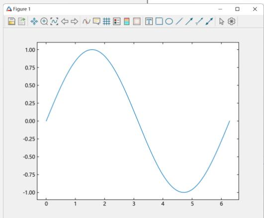
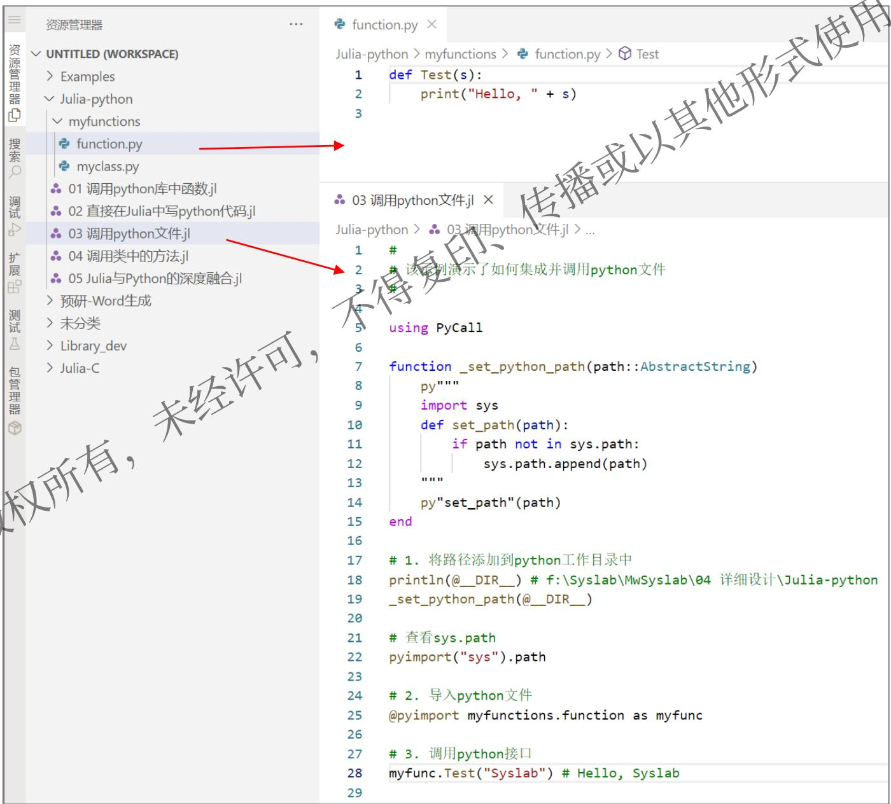
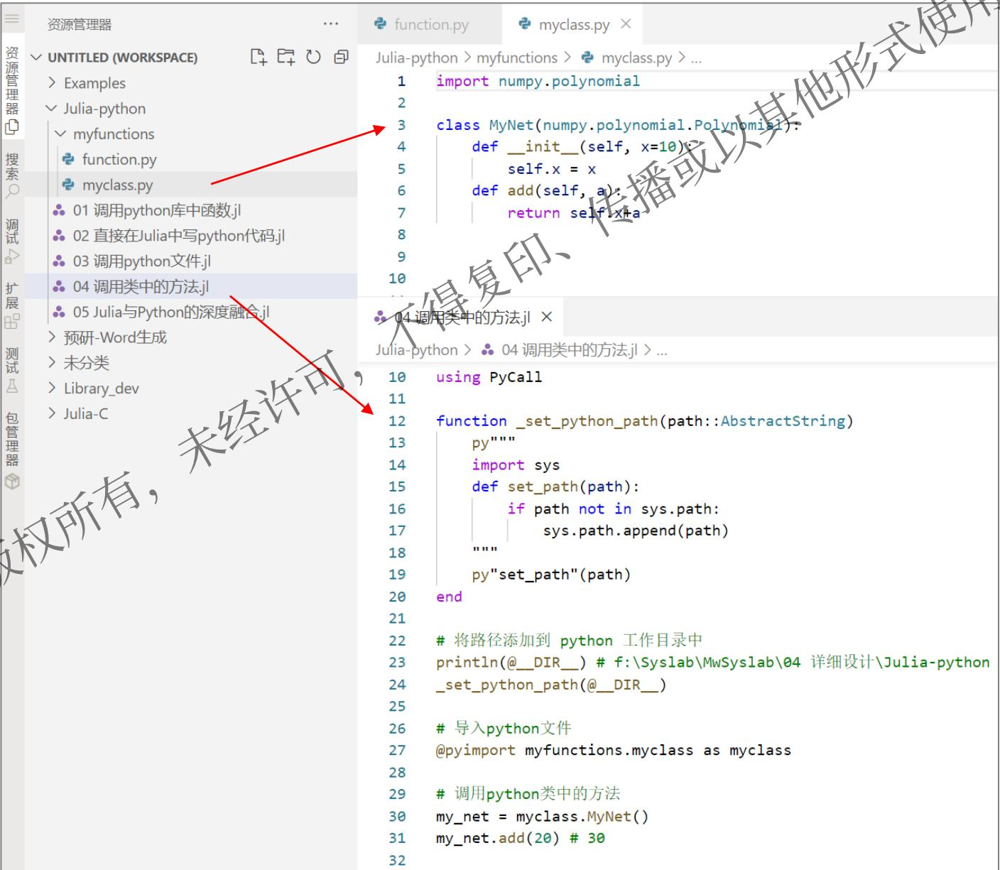
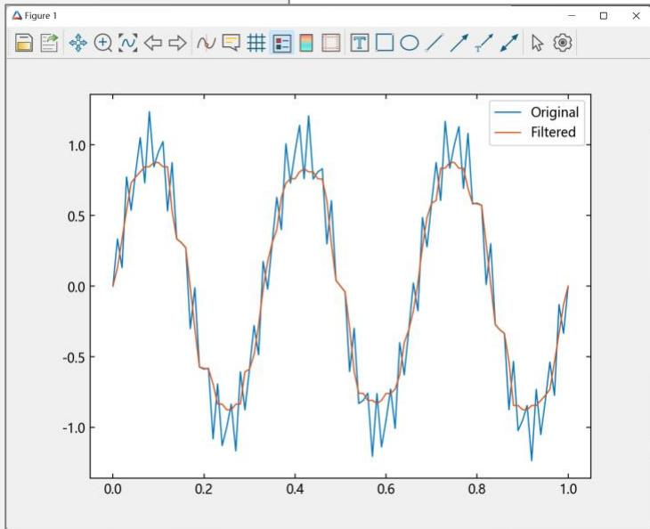

# MWORKS.Syslab外部函数调用

- Source: `MWORKS高校星火计划资料包/培训课程配套材料/01-官网课程配套材料/03-扩展接口调用/01-MWORKS.Syslab外部函数调用/01-2023a/MWORKS.Syslab外部函数调用.pdf`
- Converted by: `MinerU precise API`
- Conversion date: `2026-05-08`
- Review status: `MinerU converted; spot check recommended`
- Priority: `P2`
- Source SHA1: `0427405671c5`
- MinerU batch id: `dbc1421f-6e14-4ce7-9b0e-aeae35c891ca`
- Images: `6`
- Notes: Syslab 调用 Python/C/外部函数的参考。

# MWORKS.Syslab 2023a

# 外部函数调用

张和华 宋家豪

苏州同元软控信息技术有限公司

2023年8月16日

# 目录

1. Julia与C/C++互调用  
2. Julia与Python互调用

# 1.1 Julia与C/C++互调用

#  Julia调用 $\mathbb { C } / \mathbb { C } + +$

在数值计算领域，存在很多用C或Fortran写的高质量且成熟的库，为了便捷复用现有资产，Julia提供简洁且高效的调用方式，不需要任何“胶水”代码。 播或

可以使用 ccall 来生成一个对 $\mathsf { C } / \mathsf { C } + +$ 库函数的调用。ccall定义如下：

```matlab
ccall(function_name, library), returntype, (argtype1, ..., argvalue1, ...)  
ccall(function_name, returntype, (argtype1, ..., argvalue1, ...)  
ccall(function_pointer, returntype, (argtype1, ..., argvalue1, ... 
```

注：ccall是Julia内置库Base的关键字，无需加载额外包

例如：

```autohotkey
ccall(:clock, Int32, ()) 
```

调用C库里面的clock函数，空参，返回值类型为Int32

# 1.1 Julia与C/C++互调用

#  Julia调用 $\mathbb { C } / \mathbb { C } + +$

对于C标准库中的函数，Julia可以直接调用。

例如，C标准库中的getenv函数声明：char* getenv (const char* name);示例：

ccall(function_name, returntype, (argtype1, ...), argvalue1, ...)

# 函数名 返回值类型 参数类型

# 实参

julia> path $=$ ccall(:getenv, Cstring, (Cstring,), “PATH”)#注：函数名前面加冒号表示symbol类型 Cstring(0x00000000028c4f68)

julia> unsafe_string(path)#Copy a string from the address of a C-style，表示从C地址中取字符串值

"C:\\Program Files (x86)\\VMware\\VMware

Workstation\\bin\\;C:\\Windows\\system32;C:\\Windows;C:\\Windows\\System32\\Wbem;C:\\Windows\\System32\\Window

sPowerShell\\v1.0\\;C:\\Windows\\System32\\OpenSSH\\;C:\\Program Files (x86)\\NVIDIA

Corporation\\PhysX\\Common;C:\\Program Files\\TortoiseSVN\\bin;C:\\ProgramData\\chocolatey\\bin;D:\\Program

Files\\Polyspace\\R2020b\\runtime\\win64;D:\\Program Files\\Polyspace\\R2020b\\bin;D:\\P" ⋯ 788 bytes ⋯

"ingw64\\bin;C:\\Program Files\\CMake\\bin;D:\\Program Files\\MWorks.Syslab 2022\\Syslab\\bin;D:\\Program

Files\\MWorks.Syslab 2022\\Tools\\PortableGit\\cmd;D:\\Program Files\\MWorks.Syslab

2022\\Tools\\PortableGit\\usr\\bin;D:\\Users\\TR\\AppData\\Local\\Programs\\Microsoft VS Code\\bin;C:\\Program

Files\\MWorks.Syslab 2022\\Syslab\\bin;C:\\Program Files\\MWorks.Syslab

2022\\Tools\\PortableGit\\cmd;C:\\Program Files\\MWorks.Syslab 2022\\Tools\\PortableGit\\usr\\bin"

# 1.1 Julia与C/C++互调用

#  Julia调用 $\mathbb { C } / \mathbb { C } + +$

还可以使用另外一种方法 @ccall 来调用C函数，更加简洁清晰。和上一种方法使用等价

比如：ccall(:clock, Int32, ())等价于@ccall clock()::Int32

@ccall 的定义如下：

```batch
@ccall library.function_name(argvalue1::argtype1, ...)::returntype
@ccall function_name(argvalue1::argtype1, ...)::returntype
@ccall $function_pointer(argvalue1::argtype1, ...)::returntype 
```

例如：

```julia
julia> path = @ccall getenv("PATH"::Cstring):::Cstring Cstring(0x00000000028c4f68)  
julia> unsafe_string(path) 
```

函数名 实参 参数类型 返回值类型

# 1.1 Julia与C/C++互调用

#  Julia调用 $\mathbb { C } / \mathbb { C } + +$

除了可以直接调用C标准库外，还可以调用用户开发的 ${ \mathsf { C } } + +$ 动态库。

假设，用户开发了一个动态库ArrayMaker.dll，该动态库的 ${ \mathsf { C } } / { \mathsf { C } } + +$ 头文件定义如下：

```c
ifndef ARRAYMAKER_H #define ARRAYMAKER_H 
```

```txt
include "ArrayMaker_global.h" 
```

```txt
struct ArrayListMaker {
    int nNumber;
    double* pArray;
}; 
```

# // 求和

```txt
extern "C" ARRAYMAKERExport double GetSum(double x, double y); 
```

```c
extern "C" ARRAYMAKER exporting ArrayMaker \* CreateObj();   
extern "C" ARRAYMAKER exporting void DeleteObj(ArrayMaker \*\* ppobj);   
extern "C" ARRAYMAKER exporting Double\* FillArray(ArrayMaker\* pobj, int num, double value);   
extern "C" ARRAYMAKER exporting double\* SetValue(ArrayMaker\* pobj, int nth/\*base-1\*/, double value);   
extern "C" ARRAYMAKER exporting int GetValues(ArrayMaker \* pobj, double\* out, int len); 
```

```txt
endif 
```

# 1.1 Julia与C/C++互调用

#  Julia调用 $\mathbb { C } / \mathbb { C } + +$

除了可以直接调用C标准库外，还可以调用用户开发的 ${ \mathsf { C } } + +$ 动态库。

通过 Libdl 来实现加载和卸载 $\mathsf { C } / \mathsf { C } + +$ 动态库。 libdl函数库为Julia内置函数库，无需手动安装

```txt
using Libdl 
```

# 加载库

```python
lib_path = joinpath(@_DIR_, "ArrayMaker", "x64", "Release", "ArrayMaker")
lib = Libdl.dlopen.lib_path 
```

# 获取调用函数的符号

```txt
GetSum = Libdl.dlsym.lib, :GetSum) 
```

# 调用函数

```txt
c = @ccall $GetSum(2::Cdouble, 3::Cdouble)::Cdouble
库路径
与调用C标准库方法一样 
```

# 关闭dll

```txt
Libdl.dclose Lib) 
```

使用的函数帮助文档链接：https://juliacn.gitlab.io/JuliaZH.jl/stdlib/Libdl.html

# 1.1 Julia与C/C++互调用

# Julia调用 $\mathbb { C } / \mathbb { C } + +$

目前，基本的 ${ \mathsf { C } } / { \mathsf { C } } + +$ 值类型可以转换为Julia类型，以C为前缀。标准Julia别名与Julia基本类型没有区别

<table><tr><td>C类型</td><td>Fortran 类型</td><td>标准 Julia 别名</td><td>Julia 基本类型</td></tr><tr><td>unsigned char</td><td>CHARACTER</td><td>Cuchar</td><td>UInt8</td></tr><tr><td>bool (_Bool in C99+)</td><td></td><td>Cuchar</td><td>UInt8</td></tr><tr><td>short</td><td>INTEGER*2,LOGICAL*2</td><td>Cshort</td><td>Int16</td></tr><tr><td>unsigned short</td><td></td><td>Cushort</td><td>UInt16</td></tr><tr><td>int, BOOL (C, typical)</td><td>INTEGER*4,LOGICAL*4</td><td>Cint</td><td>Int32</td></tr><tr><td>unsigned int</td><td></td><td>Cuint</td><td>UInt32</td></tr><tr><td>long long</td><td>INTEGER*8,LOGICAL*8</td><td>Clonglong</td><td>Int64</td></tr><tr><td>unsigned long long</td><td></td><td>Culonglong</td><td>UInt64</td></tr><tr><td>intmax_t</td><td></td><td>Cintmax_t</td><td>Int64</td></tr><tr><td>uintmax_t</td><td></td><td>Cuintmax_t</td><td>UInt64</td></tr><tr><td>float</td><td>REAL*4i</td><td>CFloat</td><td>Float32</td></tr><tr><td>double</td><td>REAL*8</td><td>Cdouble</td><td>Float64</td></tr><tr><td>complex float</td><td>COMPLEX*8</td><td>ComplexF32</td><td>Complex{Float32}</td></tr><tr><td>complex double</td><td>COMPLEX*16</td><td>ComplexF64</td><td>Complex{Float64}</td></tr><tr><td>ptrdiff_t</td><td>侵权必究</td><td>Cptrdiff_t</td><td>Int</td></tr><tr><td>ssize_t</td><td></td><td>Csize_t</td><td>Int</td></tr><tr><td>size_t</td><td></td><td>Csize_t</td><td>UInt</td></tr></table>

<table><tr><td>C类型</td><td>Fortran类型</td><td>标准Julia别名</td><td>Julia基本类型</td></tr><tr><td>void</td><td></td><td></td><td>Cvoid</td></tr><tr><td>void and [[noreturn]] or _Noreturn</td><td></td><td></td><td>Union{}</td></tr><tr><td>void*</td><td></td><td></td><td>Ptr{Cvoid} (或类似的 Ref{Cvoid})</td></tr><tr><td>T*(where T represents an appropriately defined type)</td><td></td><td></td><td>Ref{T} (只有当T是isbits类型时,T 才可以安全地转变)</td></tr><tr><td>char*(or char[],e.g. a string) CHARACTER*N</td><td></td><td></td><td>CString if NUL-terminated, or Ptr{UInt8} if not</td></tr><tr><td>char**(or *char[])</td><td></td><td></td><td>Ptr{Ptr{UInt8}}</td></tr><tr><td>jl_value_t*(any Julia Type)</td><td></td><td></td><td>Any</td></tr><tr><td>jl_value_t* const*(一个 Julia 值的引用)</td><td></td><td></td><td>Ref{Any} (常量,因为转变需要写屏 障,不可能正确插入)</td></tr><tr><td>va_arg</td><td></td><td></td><td>Not supported</td></tr><tr><td>... (variadic function specification)</td><td></td><td></td><td>T...(其中T是上述类型之一,当使 用 ccall 函数时)</td></tr><tr><td>... (variadic function specification)</td><td></td><td></td><td>; va_arg1::T、va_arg2::S 等 (仅 支持@ccall宏)</td></tr></table>

# 上面标注红框为常用类型

# 1.1 Julia与C/C++互调用

# Julia调用 $\mathbb { C } / \mathbb { C } + +$ 的一个完整示例

$\textcircled{1}$ Julia代码：

using Libdl

# 加载dll

lib_path $=$ joinpath(@__DIR__, "ArrayMaker", "x64", "Release", "ArrayMaker") lib $=$ Libdl.dlopen(lib_path)

# 获取符号

CreateObj $=$ Libdl.dlsym(lib, :CreateObj) DeleteObj $=$ Libdl.dlsym(lib, :DeleteObj) FillArray $=$ Libdl.dlsym(lib, :FillArray)

# 创建对象指针

pobj $=$ @ccall $CreateObj()::Ptr{Cvoid}

# 填充数组

len $= ~ 5$ parr $=$ @ccall $FillArray(pobj::Ptr{Cvoid}, len::Cint, 3.5::Cd ::Ptr{Cdouble} arr $=$ [unsafe_load(parr, i) for i = 1:len] #=

5-element Vector{Float64}: 3.5 3.5 3.5 3.5 3.5 =#

# 销毁对象

@ccall $DeleteObj(Ref(pobj)::Ptr{Ptr{Cvoid}})::Cvoid pobj = C_NULL

# 关闭dll

Libdl.dlclose(lib)

$\textcircled { 2 } \mathsf { C } / \mathsf { C } + +$ 头文件代码：

#ifndef ARRAYMAKER_H #define ARRAYMAKER_H

#include "ArrayMaker_global.h"

struct ArrayMaker { int nNumber; double* pArray;

extern ${ } ^ { \prime \prime } \mathrm { C } ^ { \prime \prime }$ "" ARRAYMAKER_EXPORT ArrayMaker* CreateObj(); extern "C" ARRAYMAKER_EXPORT void DeleteObj(ArrayMaker ** ppobj); extern ${ } ^ { \prime \prime } \mathrm { C } ^ { \prime \prime }$ ARRAYMAKER_EXPORT double* FillArray(ArrayMaker* pobj, int num, double value); #endif

备注：

CreateObj：创建数组构造器对象；

DeleteObj：销毁数组构造器对象；

FillArray：填充数组，输入参数为数组长度、数组元素值。初始时，所有数据元素值都为value。

# 1.1 Julia与C/C++互调用

# Julia调用 $\mathbb { C } / \mathbb { C } + +$ 的一个完整示例

# $\textcircled { 3 } \textcircled { C } / \textcircled { C } + +$ 源文件代码：

include "ArrayMaker.h" #include <math.h> using namespace std;   
ArrayMaker\* CreateObj() { auto p $\equiv$ new ArrayMaker; $\mathrm{p - > nNumber = 0}$ . $\mathrm{p - > pArray = nullptr};$ return p; }   
void DeleteObj(ArrayMaker\*\* ppobj) { if (ppobj $= =$ nullptr）{ return; } auto& pobj $\equiv$ \*ppobj; if (pobj != nullptr) {

# //删除数据

```css
if (pobj->pArray != nullptr delete[] pobj->pArray: pobj->pArray = nullptr; } 
```

# //删除本身

```sql
delete podj  
podj = nullptr; 
```

double\* FillArray(ArrayMaker\* bobj, int num double value)   
{ double\* data $=$ nullptr; if (pobj $! =$ nullptr){ data $=$ bobj+pArray; if (data $! =$ nullptr) { delete[] data; data $=$ new double[num]; for (int i $= 0$ ;i $<$ num;i++) { data[i] $=$ value; } bobj->pArray $=$ data; bobj->nPNumber $=$ num; } return data;

# 1.2 Julia与C/C++互调用

# $\mathbb { C } / \mathbb { C } + +$ 调用Julia

${ \mathsf { C } } / { \mathsf { C } } + +$ 调用Julia，本质上 $\subset / { \mathsf { C } } + +$ 调用Julia动态库， ${ \mathsf { C } } / { \mathsf { C } } + +$ 工程的编译和运行都依赖Julia及Julia仓库。

${ \mathsf { C } } / { \mathsf { C } } + +$ 调用Julia的配置方法，详细请参见：https://juliacn.gitlab.io/JuliaZH.jl/manual/embedding.html。

下例为函数展示了使用 ${ \mathsf { C } } + +$ 启动julia，并调用Julia的"print(sqrt(2.0))"语句

```c
include <julia.h>  
JULIA DEFINE_FAST_TLS // only define this once, in an executable (not in a shared library) if you want fast code.  
int main(int argc, char *argv[])  
{ /* required: setup the Julia context */jl_init(); /* run Julia commands */jl.eval_string("print(square(2.0))"); /* strongly recommended: notify Julia that the program is about to terminate. this allows Julia time to cleanup pending write requests and run all finalizers */jl_atexit-hook(); return 0; } 
```

# 目录

1. Julia与C/C++互调用  
2. Julia与Python互调用

# 2.1 Julia与Python互调用

#  Julia调用Python

在数值计算领域，存在很多用Python写的高质量且成熟的库，为了便捷复用现有资产，Julia提供简洁且高效的调用方式，不需要任何“胶水”代码。 播

Julia调用python扩展库中函数：pyimport 和 @pyimport

# 依赖PyCall

using PyCall

# 导入python库

math $=$ pyimport("math")

v = math.sin(pi/2)

println( $\ " \mathsf { v } = \$ \mathsf { v } " )$

# $\textsf { v } = \bot \ldots \theta$

using PyCall

using TyPlot # 同元绘图库

# 导入python库

@pyimport numpy as np

x = np.linspace(0,2pi, 1000)

y = np.sin(x)

# 绘图

plot(x,y)



目前Syslab安装包已经提供了完备的Julia和Python。

若用户想要使用自己的Python环境，需要参考Syslab帮助文档"Syslab-外部语言接口-Python调用Julia”。

# 2.1 Julia与Python互调用

#  Julia调用Python

直接在Julia中嵌入python代码：py

using PyCall

# 直接嵌入python代码

py"

str = "3 * 4 + 5"

a = compile(str,'','eval')

print("a =", eval(a))

# $\textsf { a } = \lfloor 1 7$

module MyModule

using PyCall

function __init__()

py"""

def hello(s):

return "hello " + s

end

# 直接调用python函数

hello(s) $=$ py"hello"(s)

end # MyModule

MyModule.hello("julia")

# "hello julia"

# 2.1 Julia与Python互调用

#  Julia调用Python

调用python代码文件：

- 将路径添加到python工作目录中  
- 导入python文件  
- 调用python接口

  
示例：见Example示例：Julia-Python

# 2.1 Julia与Python互调用

#  Julia调用Python

调用python类中的方法：

- 将路径添加到python工作目录中  
- 导入python文件  
- 获取类对象   
- 调用python类中的方法

  
示例：见Example示例：Julia-Python

# 2.2 Julia与Python互调用

#  Python调用Julia

Julia通过PyCall可以很方便地调用Python代码。反过来，Python通过tjc_common、tyjuliacall、julia-numpy等扩展包来实现对Julia的调用（注，上述三个扩展包都是同元公司开发的）。 传播或

其中，tjc_common 主要是利用JuliaSysimage.dll(或.so) 文件来加速Julia包导入，tyjuliacall 主要用来实现Python对Julia代印 码的调用，julia-numpy 作为tyjuliacall的底层支撑。 得复

# 示例1-内嵌Julia代码

启动Syslab，新建Python文件  
写入Python代码(如右图)   
运行得到结果

```python
from tjc_common import *
from tyjuliacall import Main
from tyjuliacall import JuliaEvaluator 
```

```txt
调用Julia代码  
JuliaEvaluator[  
    : "mutable struct S x :: Int y :: Int end" 
```

```julia
]  
S = JuliaEvaluator["S"]  
s = S(1, 2)  
print(s.x)  
print(s.y) 
```

```txt
修改字段  
s.x = 10  
s.y = 5  
print(s.x)  
print(s.y) 
```

```txt
输出 调试控制台 终端 + √ 3:Python(Examples) √ □画 … X
```

```batch
PS C:\Program Files\MWORKS\Syslab 2023a\Examples> & C:/Users/Publicc/TongYuan/.julia/miniforge3/python.exe "c:/Program Files\MWORKS/Syslab 2023a/Examples/07 Interfaces/PythonCallJulia/test-struct.py" 
```

```txt
导入tyjuliacall: 6.02 s  
1  
2  
10  
5  
PS C:\Program Files\MWORKS\Syslab 2023a\Examples> 
```

# 2.2 Julia与Python互调用

# 示例2-调用Julia库函数

启动Syslab，新建Python文件  
写入Python代码(如右图)   
运行得到结果

from time import time

from tjc_common import *

_t0 = time.time()

from tyjuliacall import TySignalProcessing as sp # NOQA: E402

from tyjuliacall import TyPlot as tp # NOQA: E402

print(f"导入同元库耗时: {get_timespan(_t0):.2f} s")

import numpy as np

$\mathsf { f } _ { \mathsf { S } } ~ = ~ 1 0 0$

t = np.arange(fs + 1) / fs

print(t)

$\times \ =$ np.sin(2 * np.pi * t*3) + 0.25*np.sin(2 * np.pi * t*40)

# 调用信号库函数

_t0 = time.time()

y = sp.medfilt1(x, 9)

print(f"调用函数耗时: {get_timespan(_t0):.2f} s")

# 调用图形库函数

tp.plot(t, x, t, y)

tp.legend(np.asarray(["Original", "Filtered"]))

tp.plt.show()



medfilt1是同元信号处理工具箱函数

plot是同元图形工具箱函数

建立知识规范， 营造协同生态

积累工业模型， 发展可控平台

融入中国创新，打造先进软件

# 请各位专家指正！
