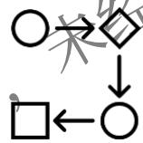
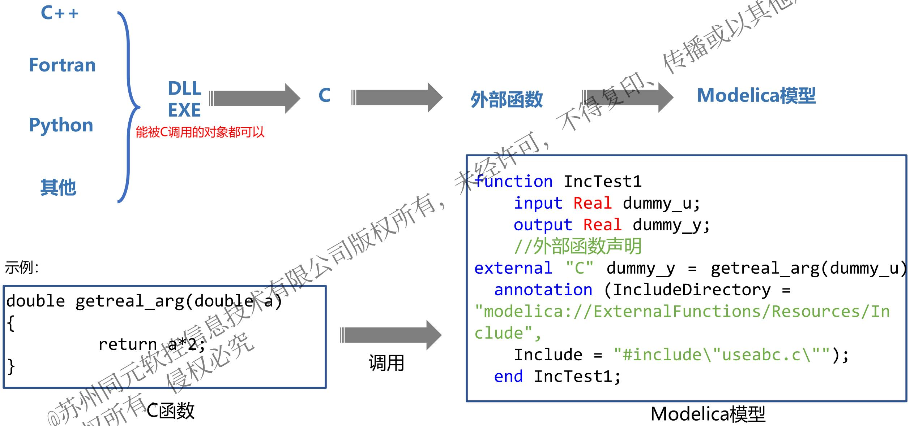
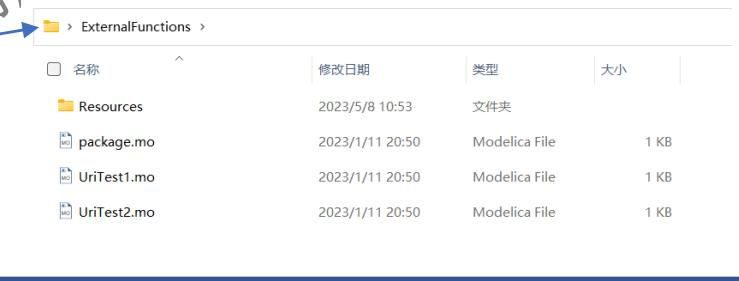
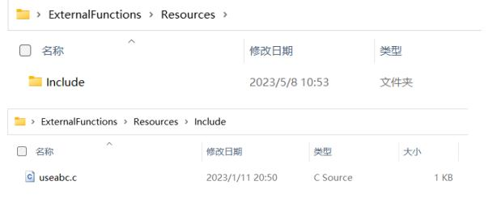
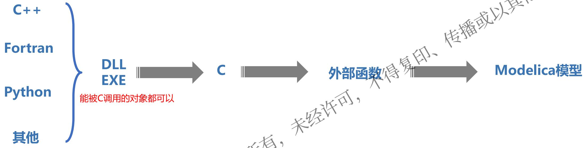
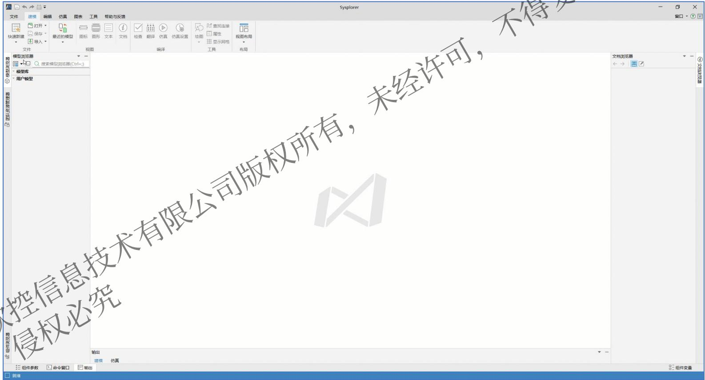
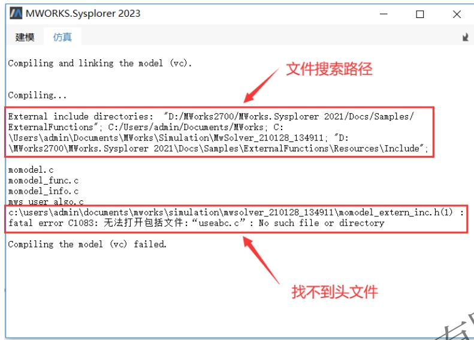
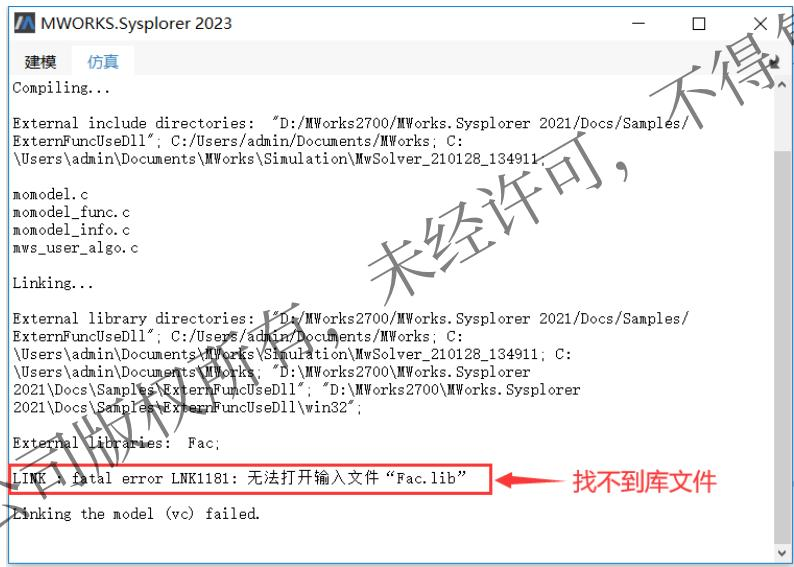
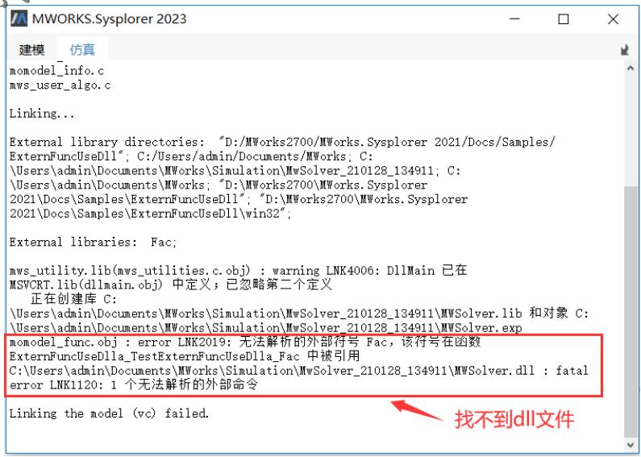

# MWORKS.Sysplorer外部接口_外部函数

- Source: `MWORKS高校星火计划资料包/培训课程配套材料/01-官网课程配套材料/03-扩展接口调用/02-MWORKS.Sysplorer外部接口-外部函数(C、C++、Fortran)/01-2023b/MWORKS.Sysplorer外部接口-外部函数(C、C++、Fortran).pdf`
- Converted by: `MinerU precise API`
- Conversion date: `2026-05-08`
- Review status: `MinerU converted; spot check recommended`
- Priority: `P2`
- Source SHA1: `be15829eab38`
- MinerU batch id: `ef312786-3ff5-412f-a18a-8b06a89f6eeb`
- Images: `13`
- Notes: 外部函数接口，后续联动 C/C++ 或外部算法时参考。

# MWORKS.Sysplorer 外部接口

# 外部函数(C/C++/Fortran)

李鹏宇

苏州同元软控信息技术有限公司

2023年8月16日

# 目录

1. Modelica外部函数概况  
2. 外部函数入门-Modelica调用C  
3. 外部函数高级-Modelica调用c++/Fortran高级特性和外部编辑器  
4. 常见问题说明

# 1.1 Modelica为什么要支持外部函数

# 提高Modelica的灵活性和可扩展性


# 支持与其他软件的集成



# 加速仿真过程


Modelica通过使用外部函数可以轻松地集成其他编程语言编写的库，如数学库和物理模型库，从而扩展其功能。这可以让用户更加灵活地选择合适的库来解决特定的问题。

许多工程应用程序需要与其他软件进行集成。使用外部函数，Modelica可以方便地与其他编程语言和软件进行交互，如MATLAB、Simulink、LabVIEW和Python等。

外部函数可以使用高效的算法和数据结构来加速仿真过程。例如，如果Modelica无法快速求解一个复杂的数学问题，可以使用外部函数来调用数值计算库来解决该问题，从而加速仿真过程。

# 1.2 外部函数简介



# 1.2 外部函数简介

```txt
function IncTest1  
    input Real dummy_u;  
    output Real dummy_y;  
//外部函数声明
```

```txt
external "C" dummy_y = getreal_arg(dummy_u)  
annotation (IncludeDirectory = "modelica://ExternalFunctions/Resources/Include", Include = "#include\"useabc.c\""); 
```

```txt
end IncTest1; 
```

# 用户模型


ExternalFunctions

> UriTest1   
> UriTest2

# 对应文件夹





本示例路径：软件安装目录..\Docs\Samples\ExternalFunctions

Tips：这里includeDrestory注解中.c文件所在路径采用了Modelica模式URl的方式来表示：说明见下页

# 1.2 外部函数简介

# Modelica 模式URI说明：

使用MWORKS.Sysplorer 建模时，有可能用到数据文件等外部资源。要使模型仿真时能正确找到相应的文件，建模时需要遵循相应的规范。

外部资源统一以Modelica 模式的URI 表示，其形式为：

```txt
modelica://Package_Name/Relative_Path 
```

Package_Name 是Modelica模型中package 的名字，Relative_Path 是相对路径。

这种URI 在模型翻译后得到绝对路径，取Package_Name 所在文件位于的文件夹作为基准路径，与Relative_Path 组合形成完整的本地路径。

示例：

```txt
modelica://Modelica.Mechanics/C.jpg modelica://Modelica/Mechanics/C.jpg 
```

假设Modelica 所在的package.mo 文件位于“C:\Modelica3.2.1\Modelica ”，而Modelica.Mechanics 所在的.mo 文件位于“C:\Modelica3.2.1\Modelica\Mechanics ”，那么，这两个都表示同一个文件“C:\Modelica3.2.1\Modelica\Mechanics\C.jpg ”。

# 1.2 外部函数简介

#  基本类型

<table><tr><td rowspan="2">Modelica</td><td colspan="2">C</td></tr><tr><td>输入</td><td>输出</td></tr><tr><td>Real</td><td>double</td><td>double *</td></tr><tr><td>Integer</td><td>int</td><td>int *</td></tr><tr><td>Boolean</td><td>int</td><td>int *</td></tr><tr><td>String</td><td>const char*</td><td>const char **</td></tr><tr><td>Enumeration type</td><td>int</td><td>int *</td></tr></table>

#  复合类型

数组：基本类型地址的传递

结构体：Modelica中使用记录类 record 对应

# 1.2 外部函数简介

#  return

C代码中使用return返回输出值，Modelica中使用output类型变量对应。如：

input Real dummy_u;

output Real dummy_y;

external "C" dummy_y $=$ getreal_arg(dummy_u)

//c代码

double getreal_arg(double dummy_u){return dummy_y;}

#  指针变量

C代码中使用指针变量输出值，Modelica中使用output类型变量对应。如：

input Real dummy_u;

output Real dummy_y;

external "C" getreal_arg(dummy_u， dummy_y)

//c代码

void getreal_arg(double dummy_u， double* dummy_y)

# 目录

1. Modelica外部函数概况  
2. 外部函数入门-Modelica调用C  
3. 外部函数高级-Modelica调用c++/Fortran高级特性和外部编辑器  
4. 常见问题说明

# 2. 外部函数入门-Modelica调用C

• C文件调用：在annotation 中用Include 注解包含被调用函数实现的C 文件；  
• 链接库调用：在annotation 中用Library 注解指定链接库，从而调用指定库中的函数。MWORKS.Sysplorer 既支持动态链接库（包含.lib 、.dll 文件），也支持静态链接库（包含.lib 文件）； 传描  
• 代码调用：在annotation 中用Include 注解直接嵌入C 代码。

# 示例1：C文件调用

调用的外部函数内容如下，该函数的目的是将输入值相加。

```lisp
double add(double a, double b)  
{  
    return a + b;  
} 
```

• Include 注解：Include $=$ "#include"add.c"" ，表示add.c 为外部函数所需的头文件。 城   
• IncludeDirectory 注 解 IncludeDirectory"modelica://ExternFunc/Include" ， 表 示 add.c 位 于ExternFunc/Include 文件夹中。

T这里meudeDirectory注解中.c文件所在路径采用了modelica模式URl的方式来表示，见第二章

model UriTest1

//将外部函数封装成function

```matlab
function IncTest1
    input Real a1;
    input Real b1;
    output Real c1; 
```

//外部函数声明

//IncludeDirectory注解指定包含文件所在的位置，以URI的modelica模式表示

```txt
//Include指定外部函数所需的头文件  
external "C" c1 = add(a1, b1)  
annotation (IncludeDirectory = "modelica://ExternFunc/Include" Include = "#include\"add.c\"");  
end IncTest1; 
```

//调用函数IncTest1 Real y = IncTest1(2.0, 3.0); d UriTest1;

# 2. 外部函数入门-Modelica调用C

# 示例2：链接库调用

1. 将 示 例 1 中 的 函 数 封 装 成 dll ， 命 名 为 dll_2010 ， 将 lib 与 dll 放 在“modelica://ExternFunc/library/dll/win32”目录下。  
2. Modelica 中外部函数声明时用Library 注解指定链接库名（注意：不带扩展名）。LibraryDirectory 注解指定链接库文件和dll （或so ）文件所在的位置。  
3. LibraryDirectory 指定位置中可以使用不同的平台文件夹存放各平台的库文件和dll （或so ）文件，例中MWORKS.Sysplorer 求解器设置为

“32 位求解器”：

win32 [32 位Microsoft Windows]win64 [64 位Microsoft Windows]linux32 [Intel 32 位Linux]linux64 [Intel 64 位Linux]

```txt
model TestExternFuncUseD11 function call_lib input Integer a; input Integer b; output Integer y; //Library指定链接库 //LibraryDirectory指定库文件所在的位置 external "C" y = add(a, b) annotation (Library = "d11_2010", Lib rary D i r e c t o r y = "modelica://ExternFunc/library/d11/win32"); end call_lib; parameter Integer a = 1; parameter Integer b = 2; Integer addr; equation addr = call_lib(a, b); end TestExternFuncUseD11; 
```

T这里LibraryDirectory注解中链接库所在路径采用了modelica模式URl的方式来表示，见第二章

# 2. 外部函数入门-Modelica调用C

# 示例3：代码调用

在没有外部文件（C 文件或库文件）的情况下，可以直接将C 代码嵌入到Include 注解中。但是由于这种方式不适合调试，所以不建议使用。

对应于如下的C 函数原型：

```txt
double add(double x,double y); 
```

翻译为C 中的调用为：

```javascript
y = add(1.0, 2.0); 
```

返回值 $\ y = 1 . 0 + 2 . 0 = 3 . 0 .$ 。

model UriTest2 //将外部函数封装成function function IncTest2 input Real x1; input Real x2; output Real y; //外部函数声明 //Include引用外部函数的关键字 //add(double x,double y){return $\mathrm{x + y};$ 外部函数的具体实现 external "C"y $=$ add(x1,x2) annotation (Include $=$ double add(double x,double y) { return $\mathrm{x + y}$ }）； endIncTest2; //调用函数IncTest2 Real $\mathrm{y1} =$ IncTest2(1.0，2.0); endUriTest2;

# 目录

1. Modelica外部函数概况  
2. 外部函数入门-Modelica调用C  
3. 外部函数高级-Modelica调用c++/Fortran高级特性和外部编辑器  
4. 常见问题说明

# 3.1 外部函数初级-Modelica调用C++/Fortran



$\mathsf { C } { + + }$ 、Fortran不能直接被Modelica调用，需要封装成C接口。

• $\pm +$ 在调用之前需要封装成C接口，需要注意的是：类、二维数组等参数或返回值需要拆开，分解成C的基本数据类型，然后再使用C函数封装。而且不要忘了在函数前面使用extern “C” 前缀修饰；  
• FORTRAN 语言中的接口调用有两种形式，FUNCTION和SUBROUTINE。若为FUNCTION，则调用方式与C基本一致，若为SUBROUTINE，则需要通过如下步骤调用：

1. 将FORTRAN代码生成为dll文件；  
2. 使用C代码对dll进行封装调用；  
3. 使用Modelica调用C代码。

# 3.1 外部函数初级-Modelica调用C++/Fortran

```fortran
subroutine ADD(x,y,z)  
!DEC$ ATTRIBUTES DLLEXPORT :: ADD !导出函数  
!DEC$ ATTRIBUTES REFERENCE ::z!返回值  
implicit none  
REAL::x,y  
REAL::z  
z=x+y  
end subroutine
```

# Fortran代码示例

示例1：Modelica调用Fortran

# Step1：C调用Dll代码示例 DllCaller.c：

//C代码 #include <stdio.h> #include <windows.h>

//函数定义 typedef void(*ADDFUNC)(double *, double *, double *);

//Dll和函数结构体定义typedef struct{HMODULE mLibrary;ADDFUNC mFunc;}DllAndFunc;

void UserDll_ADD(int handle, double x, double y, double *z) { DllAndFunc *func_handle = (DllAndFunc *)handle; func_handle->mFunc(&x, &y, z); return; }

# 主体函数

```c
int UserDll_Initialize(char* Dll_path)  
{  
    DllAndFunc *handle = (DllAndFunc *)malloc(sizeof(DllAndFunc));  
    handle->mLibrary = LoadLibraryA(Dll_path);  
    handle->mFunc = (ADDFUNC)GetProcAddress(handle->mLibrary, "ADD");  
    if (handle->mLibrary == NULL) {  
        printf("mLibrary null");  
    }  
    if (handle->mFunc == NULL) {  
        printf("mLibrary null");  
    }  
    return (int)handle; 
```

# 初始化函数

void UserDllTerminate(int handle)   
{ DllAndFunc \*terminate_handle $=$ (DllAndFunc \*)handle; Freelibrary(terminate_handle->mLibrary); free(terminate_handle);

# 终止函数

# Step2：构建Modelica函数：

function UserDll_Istalize input String DllPath; output Integer handle;   
external"C"handle $\equiv$ UserDll_Initializc(DllPath)   
annotation( Include $=$ "#include"\DllCaller.c"\*"， IncludeDirectory $=$ "C文件路径");   
endUserDll_Istalize;

# 初始化函数

```matlab
function UserDll_Terminate  
    input Integer handle;  
external "C" UserDll_Terminate(handle)  
annotation (  
    Include = "#include\"DllCaller.c\"",  
    IncludeDirectory = "DllCaller.c文件路径");  
end UserDll_Terminate; 
```

# 终止函数

```matlab
function UserDll_ADD
    input Real handle;
    input Real x;
    input Real y;
    output Real z;
external "C" UserDll_ADD(handle, x, y, z)
annotation (
    Include = "#include"DllCaller.c",
    IncludeDirectory = "DLLCaller.c文件路径");
end UserDll_ADD; 
```

# 主体函数

```txt
model CallFORTRAN  
parameter Real x = 23.12412412;  
parameter Real y = 42.56345235;  
parameter String Dllpath = "Dll路径";  
output Real z;  
Integer handle;  
equation  
when initial() then  
    handle =  
CallFORTRANDll.FunctionsPcg.UserDll初始化(Dllpath);  
end when;  
when sample(0, 0.1) then  
    z = CallFORTRANDll.FunctionsPcg.UserDll_ADD(handle, x, y);  
end when;  
when terminal() then  
    CallFORTRANDll.FunctionsPcg.UserDll_Terminate(handle);  
end when;  
end CallFORTRAN; 
```

# 3.2 外部函数高级特性

# 示例1：数组类型输入输出调用

模型中可以借助外部函数计算获取数组型数据，外部函数形式如下：

void厂数Test(double \*input_data,double \*output_data)   
{ output_data[0] $=$ input_data[0] $+10$ output_data[1] $=$ input_data[1] $+10$ ·

input_data 为传入参数，output_data 为输出参数，用来接收函数计算结果。

对外部函数的包装和调用过程如下所示

function ArrayTest input Real input_data[2]; output Real output_data[2];   
external "C" ArrayTest(input_data, output_data)   
annotation (IncludeDirectory $=$ "modelica://ExternFunc/Include", Include $=$ "#include "array.c");   
end ArrayTest;

# 示例2：控制外部函数调用频率— 条件调用

某dll 模块ExtLib.dll ，其中有两个接口Initial() 、StepRun() ，希望能够在求解前调用初始化接口Initial() ，在求解过程中，每隔2s 调用一次StepRun ，那么Modelica 代码可以如下编写：

model testlog1 function ExtLib_Initial external"C"Initial() annotation (Include $=$ "void Initial({return;}"); endExtLib_Initial; function ExtLib_STEPRun input Real x; external"C"StepRun(） annotation (Include $=$ "void StepRun({return;}"); endExtLib_STEPRun; Integer i(start $\equiv$ 0); annotation (experiment(StartTime $\equiv$ 0, StopTime $\equiv$ 10));   
initial algorithm ExtLib_Initial();//初始算法段中初始化外部函数 Modelica_utilitiesStreams.print("Initial has been called.");   
algorithm when sample(0,2) then //通过when控制函数的调用时机 ExtLib_StepRun(1); $\textbf{i} := \textbf{i} +\textbf{1}; / /$ 用i做计数器 Modelica_utilitiesStreams.print(String(i));//打印i以观察调用次数 end when;   
end testlog1;

# 3.3 外部函数编辑器

在Modelica模型中调用 C、C++编写的函数时，需要用到 Modelica外部函数机制，规范中的相关语法定义复杂，对用户造成了不必要的负担。对此， MWORKS.Sysplorer提供了外部函数编辑器，使得用户能够以可视化的方式导入和编辑外部 C函数。

• 启动MWORKS.Sysplorer，选择文件 $>$ 新建 $>$ external function，在弹出的新建模型对话框中填写模型信息后点击确定，弹出外部函数编辑器对话框。  
• 选择想要调用的C函数包含文件(.c, .h)，编辑器解析文件中声明的所有函数原型。选择一个函数原型，编辑器生成modelica外部函数调用语句。

  
外部函数编辑器.mp4

# 目录

1. Modelica外部函数概况  
2. 外部函数入门-Modelica调用C  
3. 外部函数高级-Modelica调用c++/Fortran高级特性和外部编辑器  
4. 常见问题说明

# 4. 常见问题说明

# 常见问题1：找不到文件

找不到文件分为以下三种情况：

# $\spadesuit$ 找不到头文件



# $\spadesuit$ 找不到lib 文件



# 找不到dll文件



针对上述三种情形，可以通过输出面板查看打印出的文件搜索路径，确认文件是否存在于搜索路径中，并且有访问权限。也可能是相关文件的路径没有加入到IncludeDirectory 或LibraryDirectory 中，输出栏显示了有效的搜索路径。查看“IncludeDirectory ”或“LibraryDirectory ”，更改模型中的IncludeDirectory 或LibraryDirectory 注解。对于“找不到Lib 文件”的情况，还可以用dumpbin 工具查看Lib 文件，确认依赖的接口是否存在于该Lib 文件中。

# 4. 常见问题说明

# 常见问题2：仿真失败

仿真时失败，有可能是因为dll 文件与求解器的位数( 或平台位数) 不匹配，比如32 位的dll 使用64 位求解器无法启动仿真。针对这个情况，换成匹配的求解器即可。 得复印

# 常见问题3：运行错误

运行期间求解器捕获到异常。这种情况，一般而言是外部函数运行出错，需要在C语言环境中调试外部函数，建议编写外部函数代码时，将一些有用的信息打印到文件或控制台中进行运行时调试 。

# 小结

1. 外部函数主要用于扩展Modelica能力、与其他软件联合仿真  
2. 掌握Modelica外部函数的语法规则、数据类型以及调用C的三种方式  
3. 了解Modelica外部函数的高级用法，数组输出参数、条件调用  
4. 了解外部函数编辑器的使用

建立知识规范， 营造协同生态

积累工业模型， 发展可控平台

融入中国创新， 打造先进软件

# 感谢专家批评指正
