# 智能无人系统应用挑战赛_专项培训二

- Source: `MWORKS高校星火计划资料包/培训课程配套材料/02-直播课程配套材料/06-智能无人系统应用挑战赛专项培训/02-第二期/无人车避障赛道专项培训（二）.pdf`
- Converted by: `MinerU precise API`
- Conversion date: `2026-05-08`
- Review status: `MinerU converted; spot check recommended`
- Priority: `P1`
- Source SHA1: `7f42490cae68`
- MinerU batch id: `92149f8d-6ce0-4a89-a14f-55945082dc99`
- Images: `148`
- Notes: 路径规划、避障和展示流程参考。

# 智能无人系统应用挑战赛 无人车避障赛道专项培训（二）

# 避障算法开发指南

孔德才

苏州同元软控信息技术有限公司

2025年6月16日

# 目录

1. MWORKS.Sysplorer 软件概览   
2. Sysblock 概述  
3. 框图建模基础   
4. Sysplorer与Sysblock混合仿真  
5. 状态机建模基础   
6. 初赛模型详解

# 1. MWORKS.Sysplorer软件概览

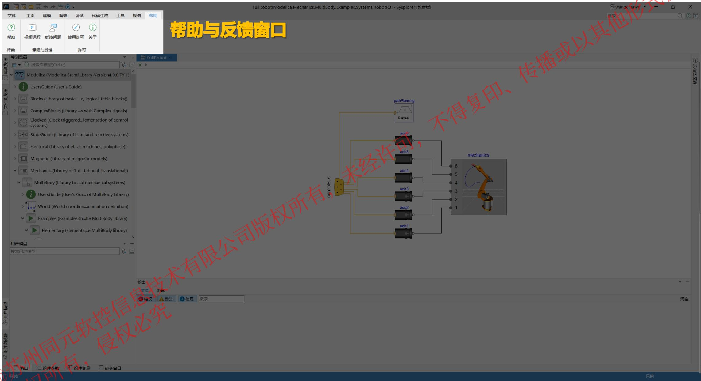

# 1. MWORKS.Sysplorer软件概览

视频课程：提供Sysplorer软件使用视频课程

  
课程全集

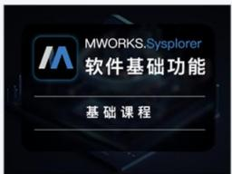

# 模型试验工具箱应用

简介：MWORKS.Sysplorer模型试验工具箱的概况、基本功能和一般使用方法，帮助新手快速上手模型试验工具箱

# 软件基础功能(Sysplorer)

简介：通过实例讲解MWORKS.Sysplorer基本功能和系统建模仿真一般流程，帮助新手快速基于MWORKS.Sysplorer上手系统建模仿真

# Modelica语法

简介：通过实例讲解Modelica语法，使用者可以根据相关语法对真实的物理系统使用Modelica语言进行模型开发

# 外部接口-外部函数

简介：帮助新手了解Modelica外部函数的作用快速学习Modelica外部函数的语义规范和使用方法

# 工具箱运行脚本（Python）

简介：帮助新手了解Python Python语言的使用。简介：介绍车辆动力学模型库的架构、应用场景，以及实现自动驾驶模仿真实的工具。主要功能以及使用和修改的方法

1 2 3 前往 1 页

# 车辆动力学模型库应用

简介：介绍车辆动力学模型库的架构、应用场景、主要功能以及使用和修改的方法

  
课程介绍：本课程通过简单的减震系统和电动汽车的组件选型两个实例讲解MWORKS.Sysplorer模型试验工具箱的概况、基本功能和一般使用方法，并通过实际软件演示帮助新手快速上手模型试验工具箱。

# 1. MWORKS.Sysplorer软件概览

MoHub：设置技术交流/高校专区，提供大量常见问题FAQ，安排专业工程师解答

Q MoHub

搜索

MoHub首页：www.mohub.net

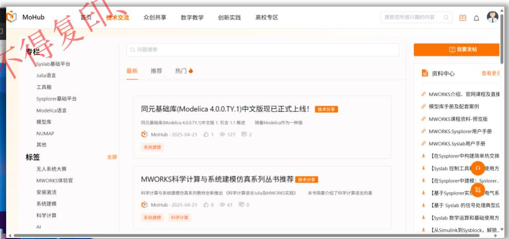

# 目录

1. MWORKS.Sysplorer 软件概览   
2. Sysblock 概述  
3. 框图建模基础   
4. Sysplorer与Sysblock混合仿真  
5. 状态机建模基础   
6. 初赛模型详解

# 2. Sysblock概述

因果框图建模+状态机建模   
> Sysblock提供与Simulink一致建模体验  
> Sysblock支持嵌入式代码生成，一般用于控制器

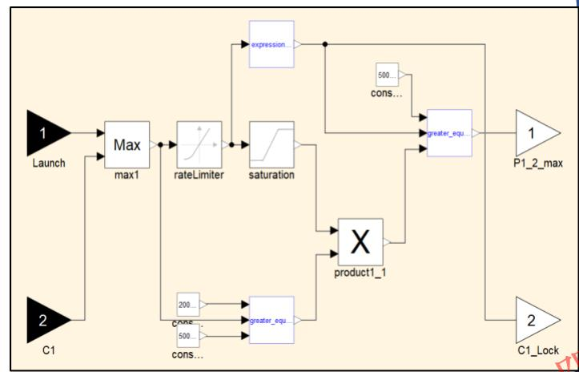  
因果框图建模

框图式模型库

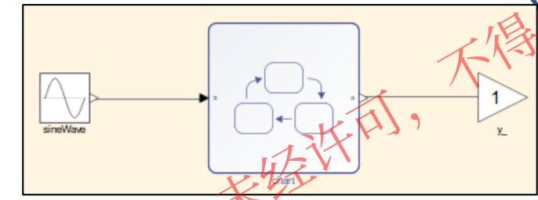  
状态机建模

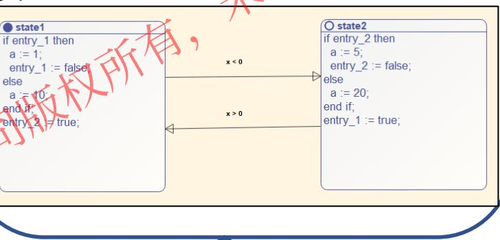

状态机模型库

Sysplorer

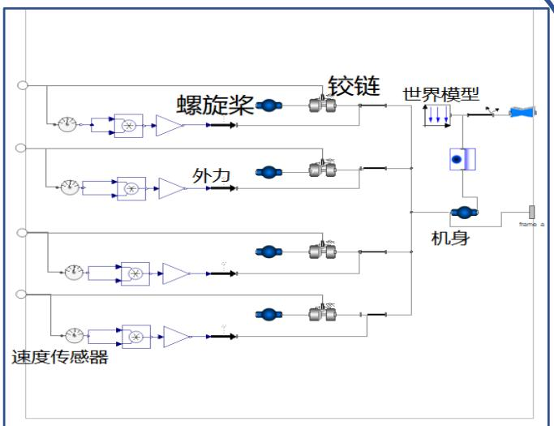  
陈述建模

多领域物理模型库

# 目录

1. MWORKS.Sysplorer 软件概览   
2. Sysblock 概述  
3. 框图建模基础   
4. Sysplorer与Sysblock混合仿真  
5. 状态机建模基础   
6. 初赛模型详解

# 3.1 框图模型标准建模流程

# 标准离散PID控制器示例

# 标准离散PID控制器：

$$
u (k) = K _ {p} \cdot e (k) + K _ {i} \cdot \sum_ {i = 0} ^ {k} e (i) \cdot T _ {s} + K _ {d} \cdot \frac {e (k) - e (k - 1)}{T _ {s}}
$$

其中：

$u(k)$ 是第 $k$ 时刻的控制输出  
- $e\left( k\right)$ 是第 $k$ 时刻的误差,通常为设定值与实际值之差  
- ${K}_{p}\text{、}{K}_{i}$ 和 ${K}_{d}$ 分别是比例、积分和微分系数  
- $T_{s}$ 是采样时间间隔

系统分析  

<table><tr><td>输入</td><td>e(k)</td></tr><tr><td>比例系数</td><td></td></tr><tr><td>积分系数</td><td></td></tr><tr><td>微分系数</td><td></td></tr><tr><td>采样时间</td><td></td></tr><tr><td>输出</td><td>u(k)</td></tr></table>

需要乘除、加减、积分、差分模块，所有模块在Sysblock库中均已有。

# 3.1 框图模型标准建模流程

# 新建模型

# 拖拽组件

# 设置参数

# 连接组件

# 代码配置

# 操作步骤:

> 点击“文件>新建Sysblock模型...”，弹出“新建模型”对话框  
> 填写模型名为“SimplePID”，描述为“简单PID控制器”  
> 点击确定，即可完成模型创建

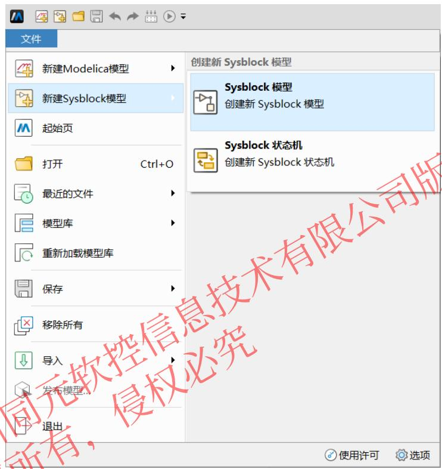

# 新建控制器模型

?

X

# 控制器模型名

# 类别

# SimplePID

# model

#

# 描述

# 简单PID控制器

# 插入到（可选）

# <Top Model>

# 控制器模型文件存储位置

# C:/Users/TR/Documents/MWORKS

# 确定

# 取消

# 3.1 框图模型标准建模流程

# 新建模型

# 拖拽组件

# 设置参数

# 连接组件

# 代码配置

# 操作步骤（方法一）：

选中Sysblock模块库Discrete子库中DiscreteTimeIntegralator模块   
$\succ$ 左键长按拖拽至右侧图形视图中

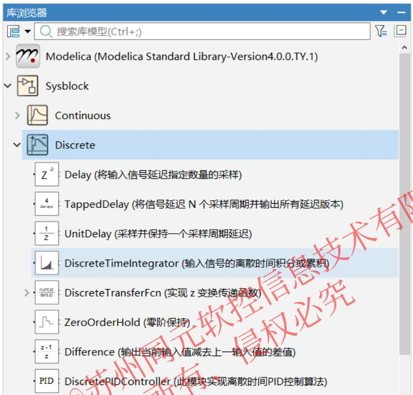

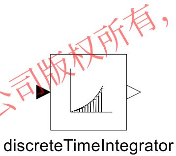

# 操作步骤 (方法二)

• 双击图形视图中空白位置
• 在弹出的搜索框中输入Integrator
• 选中搜索结果，按enter回车

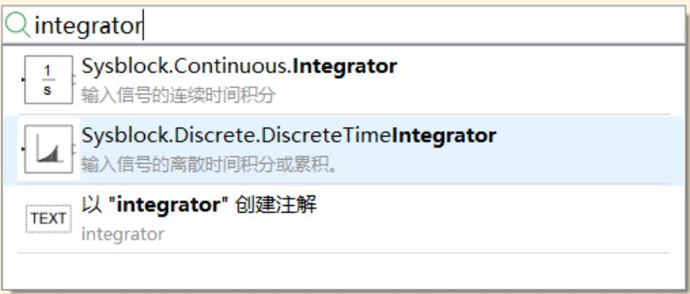

# 3.1 框图模型标准建模流程

$$
u (k) = K _ {p} \cdot e (k) + K _ {i} \cdot \sum_ {i = 0} ^ {k} e (i) \cdot T _ {s} + K _ {d} \cdot \frac {e (k) - e (k - 1)}{T _ {s}}
$$

新建模型

拖拽组件

设置参数

连接组件

代码配置

操作步骤：同“DiscreteTimeIntegralator”模块，拖入PID模型所需要的其他组件，并根据计算顺序适当排布。

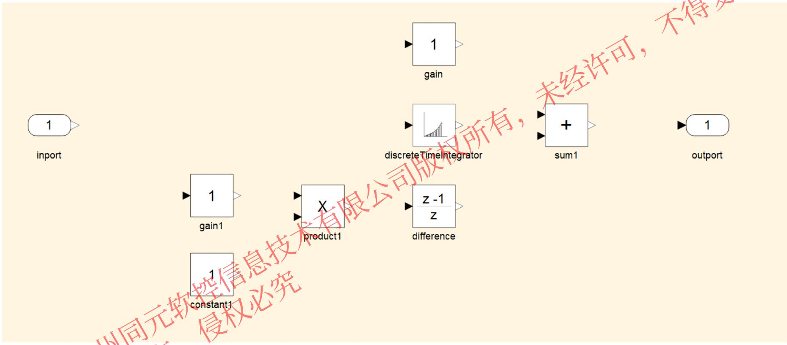

使用的模块如下：

Port子库:

Inport、Export

MathOperation子库:

Gain、Constant、

Product、Sum

Discrete子库:

Difference

# 3.1 框图模型标准建模流程

$$
u (k) = K _ {p} \cdot e (k) + K _ {i} \cdot \sum_ {i = 0} ^ {k} e (i) \cdot T _ {s} + K _ {d} \cdot \frac {e (k) - e (k - 1)}{T _ {s}}
$$

新建模型

拖拽组件

设置参数

连接组件

代码配置

操作步骤：根据具体的算法，双击模块，弹出参数对话框，设置参数。

如sum1模块需要对比例、积分、微分3个分量求和，而模块默认只有2个端口 product1模块需要除以采用时间Ts，而模块默认是乘法

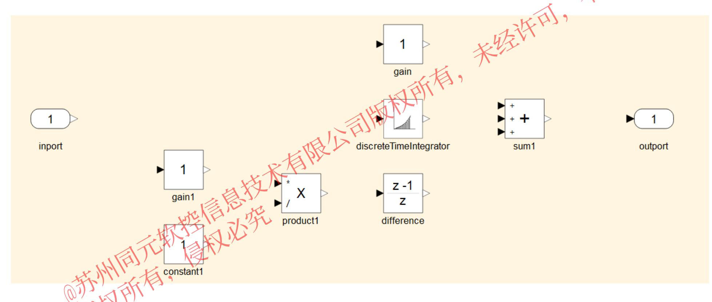

# Sum

对输入执行加法或减法。请指定下列选项之一：

a)字符串，其中包含 $+$ 或-表示每个输入端口，如 $+ + - +$

b) 正整数，指定输入端口的数量。

当只有一个输入端口时，在所有维度对元素执行加法或减法。

# 主要

# 信号属性

符号列表：

+ + +

确定

取消

应用

# Product

对输入执行乘法或除法。通过以下方式指定输入端口数量：

a)字符串，只能包含*或/，例如，**/*执行运算'u1*u2/u3*u4';

b) 正整数，例如，2执行运算'u1*u2'。

如果只有一个输入端口并且‘乘法’参数设置为‘按元素（*）’，则单个*或/使用指定的运算缩减输入信号。但是，如果‘乘法’参数设置为‘矩阵（*）’，则单个*会导致模块原样输出矩阵，单个/会导致模块输出逆矩阵。

# 主要

# 信号属性

输入数目：

按元素 $(^{*})$

取消

应用

定

取消

# 3.1 框图模型标准建模流程

$$
u (k) = K _ {p} \cdot e (k) + K _ {i} \cdot \sum_ {i = 0} ^ {k} e (i) \cdot T _ {s} + K _ {d} \cdot \frac {e (k) - e (k - 1)}{T _ {s}}
$$

<table><tr><td>新建模型</td><td>拖拽组件</td><td>设置参数</td><td>连接组件</td><td>代码配置</td></tr></table>

问题：1、比例、积分、微分系数、采用时间设置，需打开不同模块参数对话框

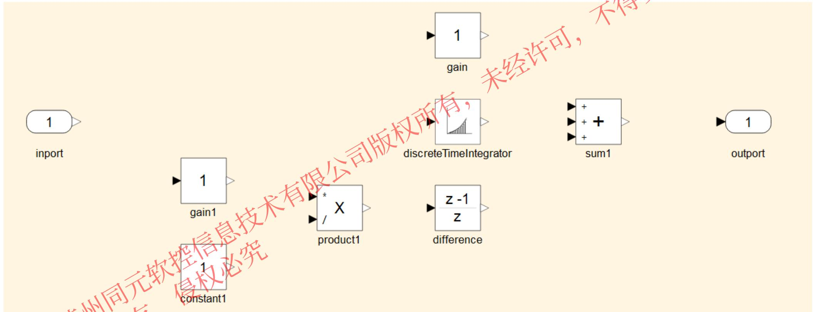

# 3.1 框图模型标准建模流程

$$
u (k) = K _ {p} \cdot e (k) + K _ {i} \cdot \sum_ {i = 0} ^ {k} e (i) \cdot T _ {s} + K _ {d} \cdot \frac {e (k) - e (k - 1)}{T _ {s}}
$$

新建模型

拖拽组件

设置参数

连接组件

代码配置

# 数据字典

数据字典是存储模型中的参数变量和信号变量的独立数据存储库，在模型仿真时，这些变量向模型提供变量值，在将模型生成C代码时，这些变量可生成C代码中的全局变量。

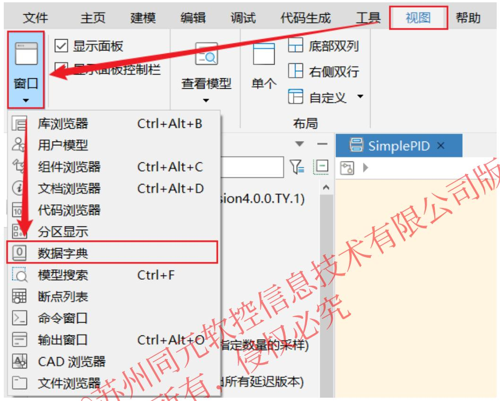

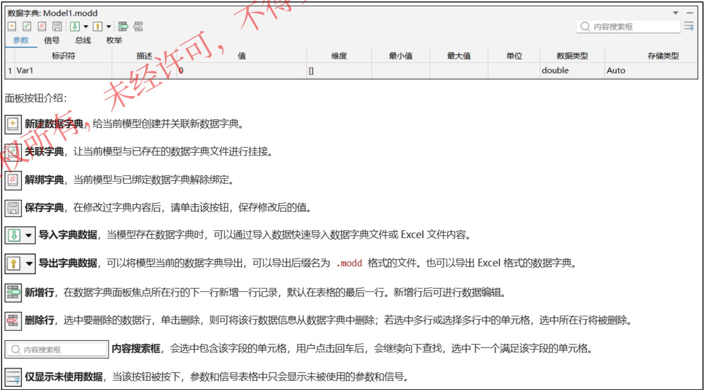

# 3.1 框图模型标准建模流程

$$
u (k) = K _ {p} \cdot e (k) + K _ {i} \cdot \sum_ {i = 0} ^ {k} e (i) \cdot T _ {s} + K _ {d} \cdot \frac {e (k) - e (k - 1)}{T _ {s}}
$$

新建模型

拖拽组件

设置参数

连接组件

代码配置

操作步骤：1、新建数据字典文件并与当前模型绑定  
2、新建参数Kp、Ki、Kd、Ts，且编辑值属性分别为100、0.1、0.1、0.01

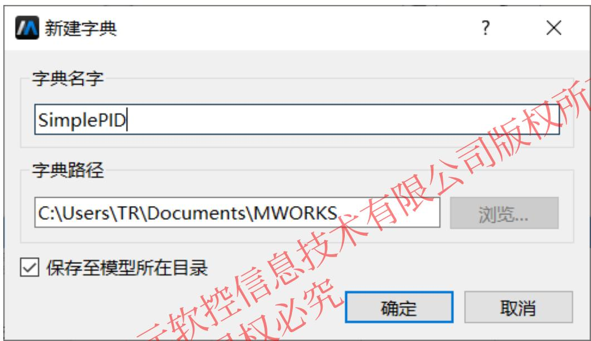

<table><tr><td colspan="4">数据字典: SimplePID.modd*</td></tr><tr><td colspan="4">+ ∩ ∩ ∩ ∴ ↓ ↑ ↘ 参数 信号 总线 枚举</td></tr><tr><td>标识符</td><td>描述</td><td colspan="2">值</td></tr><tr><td>1 Kp</td><td></td><td colspan="2">100</td></tr><tr><td>2 Ki</td><td></td><td colspan="2">0.1</td></tr><tr><td>3 Kd</td><td></td><td colspan="2">0.1</td></tr><tr><td>4 Ts</td><td></td><td colspan="2">0.01</td></tr></table>

# 3.1 框图模型标准建模流程

$$
u (k) = K _ {p} \cdot e (k) + K _ {i} \cdot \sum_ {i = 0} ^ {k} e (i) \cdot T _ {s} + K _ {d} \cdot \frac {e (k) - e (k - 1)}{T _ {s}}
$$

新建模型

拖拽组件

设置参数

连接组件

代码配置

操作步骤：1、设置gain模块值为Kp，discreteTimeIntegralator增益值为Ki，gain1模块值为Kd，contant模块的值为Ts

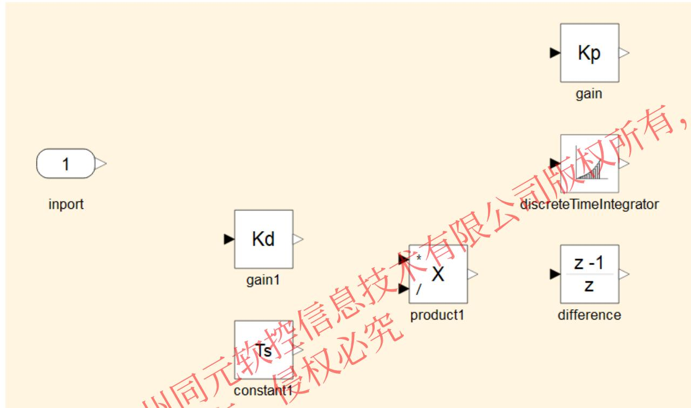

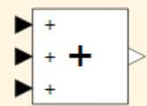  
sum1

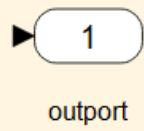

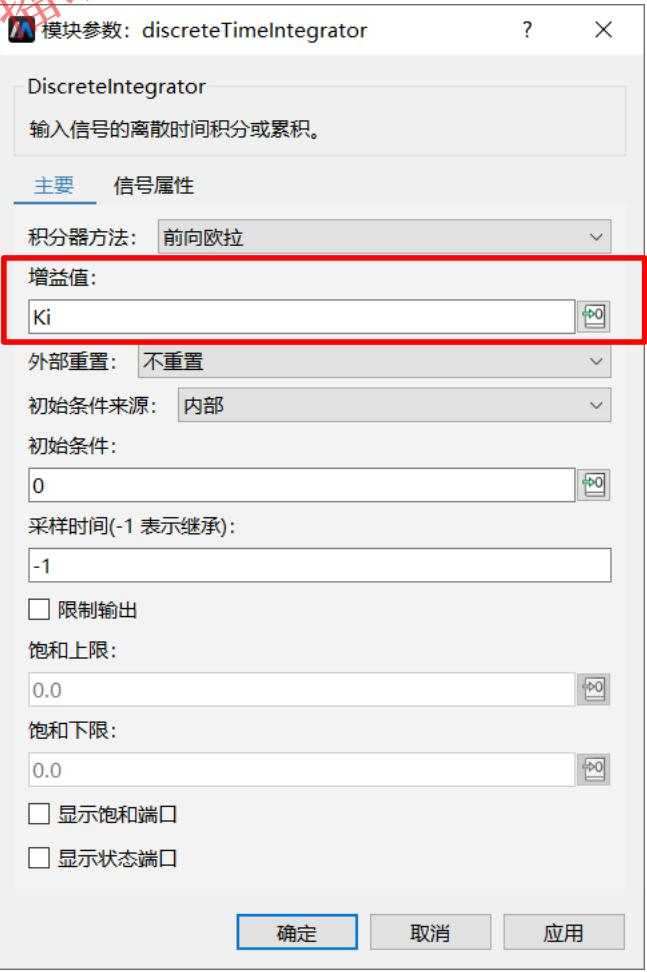  
difference

# 3.1 框图模型标准建模流程

$$
u (k) = K _ {p} \cdot e (k) + K _ {i} \cdot \sum_ {i = 0} ^ {k} e (i) \cdot T _ {s} + K _ {d} \cdot \frac {e (k) - e (k - 1)}{T _ {s}}
$$

新建模型

拖拽组件

设置参数

连接组件

代码配置

操作步骤：选择接口，拖拽连接组件。

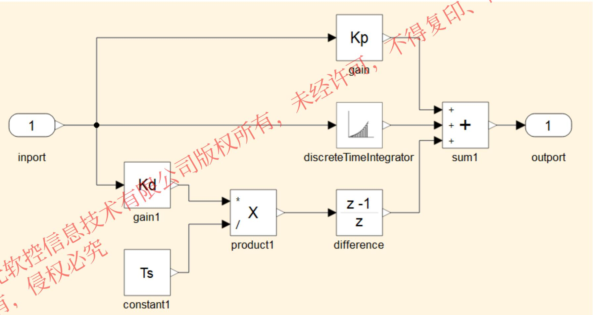

# 3.1 框图模型标准建模流程

$$
u (k) = K _ {p} \cdot e (k) + K _ {i} \cdot \sum_ {i = 0} ^ {k} e (i) \cdot T _ {s} + K _ {d} \cdot \frac {e (k) - e (k - 1)}{T _ {s}}
$$

新建模型

拖拽组件

设置参数

连接组件

代码配置

操作步骤：在代码生成之前，可以通过进入编译代码配置来设置需要生成的代码使用默认配置，观察生成代码

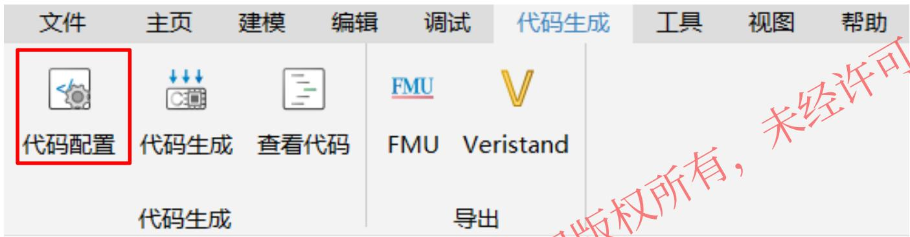

初始化函数：用来初始化模型数据，在调用执行仿真步的函数前调用此函数；

执行仿真步的函数：每调用一次则对模型执行一个仿真步的计算；

全局变量的声明与定义：与数据字典中定义的变量相对应的 C 代码变量；

main 函数：模型实例化，初始化，步进，终止。

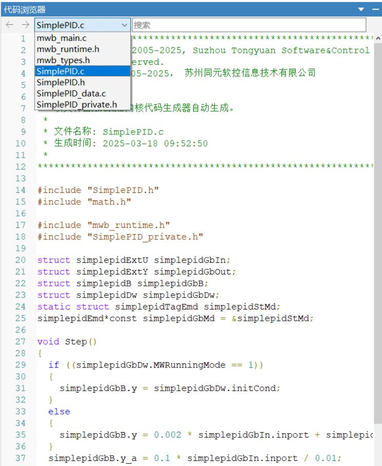

# 3.1 框图模型标准建模流程

# 双向追溯:

Sysblock按照因果式对框图模型进行处理，保留了模型与生成代码的映射关系，支持模型和生成代码之间的互相追溯，便于用户理解生成的代码

✓ 因果式建模，从底层机制上支持模型与代码的追溯  
✓ 代码生成框架改造，生成过程中保留追溯信息，适应双向追溯需求  
✓ 数据结构改造，代码字符串上附带追溯信息  
✓ 每个模块生成一个唯一的ID，上层据此获取模块与生成代码的映射关系  
✓ 生成追溯信息json文件

# 追溯信息

"id": "sineWave",

"codes

"file": "mosecmodel.e",

"positions": []

"begin row": 31,   
"begin column": 1,   
"end row": 39,   
"end column": 2

"begin row": 60,   
"begin column": 1,   
"end row": 60,   
"end column": 32

# 追溯效果（高亮）

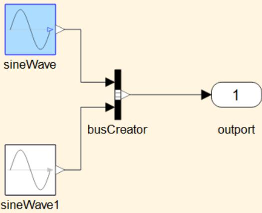

19   
20 struct t2ExtY t2GbOut;   
21 struct t2B t2GbB;   
22 struct t2Dw t2GbDw;   
23 static struct t2TagEmd t2StMd;   
24 t2Emd\*const t2GbMd $=$ &t2StMd;   
25   
26 void Step()   
27 {   
28 t2GbB.signal1 $\equiv$ (MwbDouble)(1) \* sin((Mw)   
29 t2GbB.signal2 $\equiv$ (MwbDouble)(1) \* sin((Mw)   
30 t2GbDw.MWRunningMode $\equiv$ 3;   
31 ++t2GbMd->m_timeTickCount;   
32 t2GbMd->mcurTime $\equiv$ t2GbMd->m_startTime   
33 }   
34   
35 void Init()   
36 {   
37 t2GbMd->m_stepSize $\equiv$ 0.02;   
38 t2GbDw.MWRunningMode $\equiv$ 1;   
39 }   
40

# 3.1 框图模型标准建模流程

$$
u (k) = K _ {p} \cdot e (k) + K _ {i} \cdot \sum_ {i = 0} ^ {k} e (i) \cdot T _ {s} + K _ {d} \cdot \frac {e (k) - e (k - 1)}{T _ {s}}
$$

新建模型

拖拽组件

设置参数

连接组件

代码配置

# 操作步骤：点击打开代码配置对话框

在代码定制标签页中，勾选数据除零保护代码重新生成代码

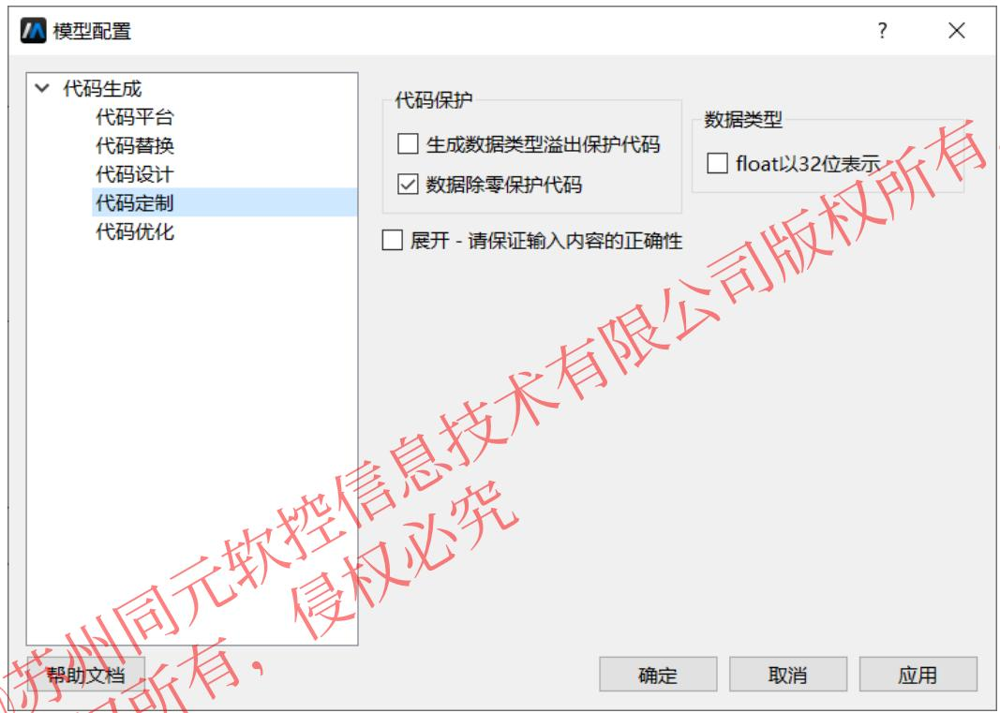

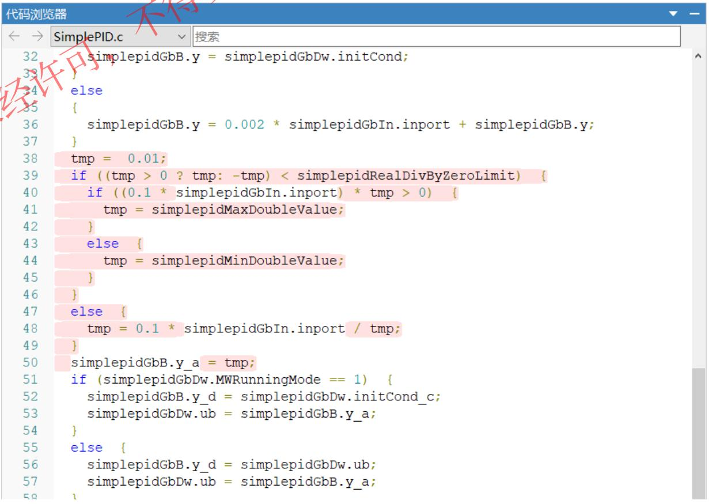

# 3.2 子系统建模

层次化建模可以提高系统的可读性、可维护性、重用性和扩展性，从而帮助提高整个系统的质量和效率。

Sysblock中使用子系统功能，支持用户将任意模块封装为一个整体（子系统）

✓ 子系统是框图系统支持层次化建模的手段, 所以也支持子系统内封装子系统 (多层嵌套)  
✓ 子系统封装可以是虚拟的,仅作用于模型外观和布局,不影响模型的代码生成及仿真; 也可以是原子的 (非虚拟,在模型编译、代码生成及仿真时做为一个整体  
√ 原子子系统可以指定生成代码的形式，包括：自动、内联、可重用函数、不可重用函数

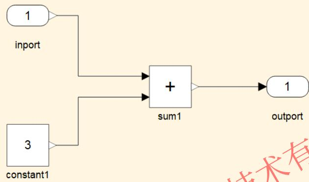

  
封装

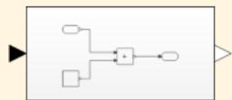  
将输入加3   
subSystem1

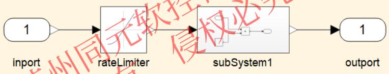

  
嵌套封装

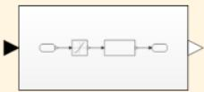  
subSystem1

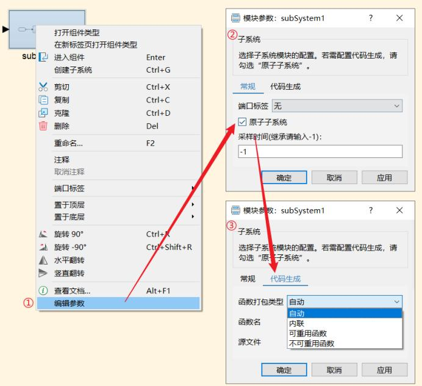  
原子模块：指定代码生成形式

# 3.2 子系统建模

# Sysblock支持条件执行子系统，子系统只在满足一定条件下才执行

$\succ$ 使能子系统  
□ 子系统在使能信号大于0时一直生效  
$\succ$ 触发子系统  
子系统在零穿越时生效，分上升沿、下降沿、任一沿  
使能触发子系统  
□子系统在同时满足：使能信号大于0、触发信号零穿越 两个条件时生效   
函数调用子系统  
子系统在控制端口在接收到函数调用事件时生效

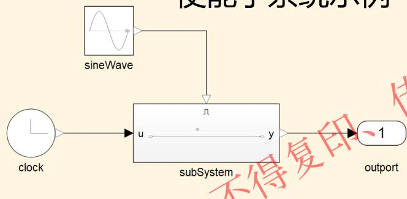  
使能子系统示例

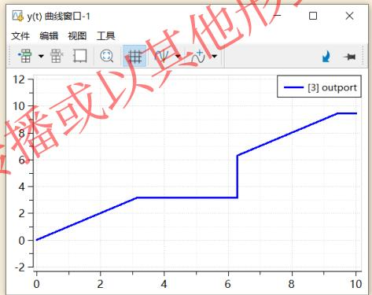

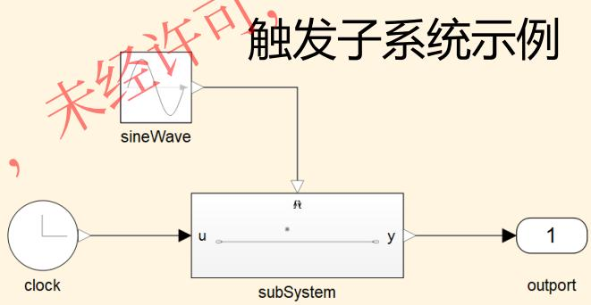

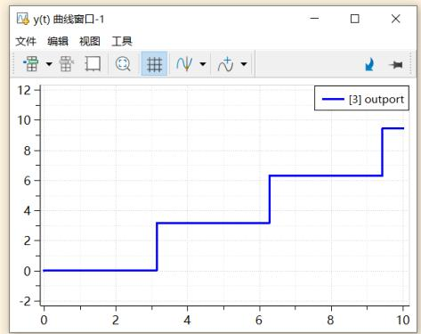

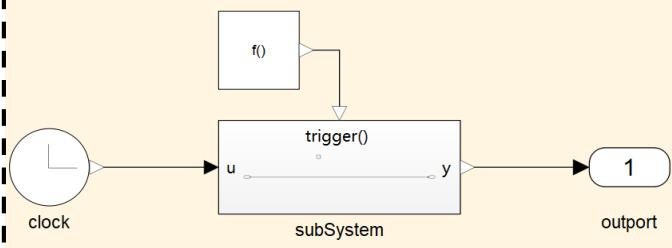  
触发子系统示例

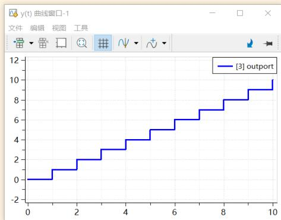

# 3.2 子系统建模

# 函数调用子系统示例1

# 问题描述:

1、按0.1的周期调用子系统  
2、子系统每次执行2次  
3、子系统中对输入加1

# 操作步骤：

1、新建SimpleSubsystem模型  
2、双击添加模块，包含Subsystem、

Outport、Clock、

FunctionCallGenerator

3、双击进入子系统内部，添加Trigger、  
Sum、constant模块

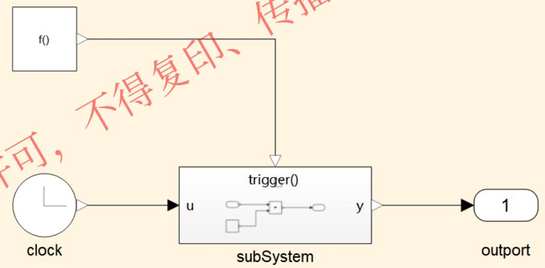

f()

trigger

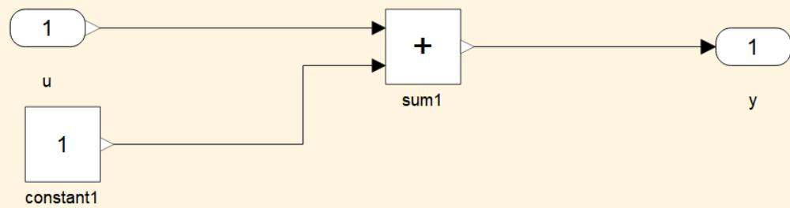

# 3.2 子系统建模

# 函数调用子系统示例1

操作步骤：1、设置trigger触发类型为functionCall  
2、设置functionCallGenerator采用时间  
0.1，迭代次数为2   
3、连接模型

Function-Call Generator

以指定的速率执行连接到此模块后的函数调用子系统

参数

采样时间

0.1

迭代次数

2

显示使能端口

确定

取消

应用

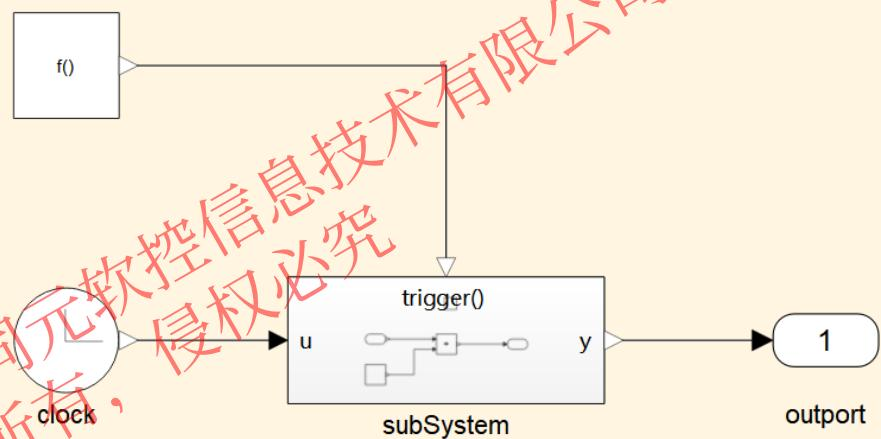

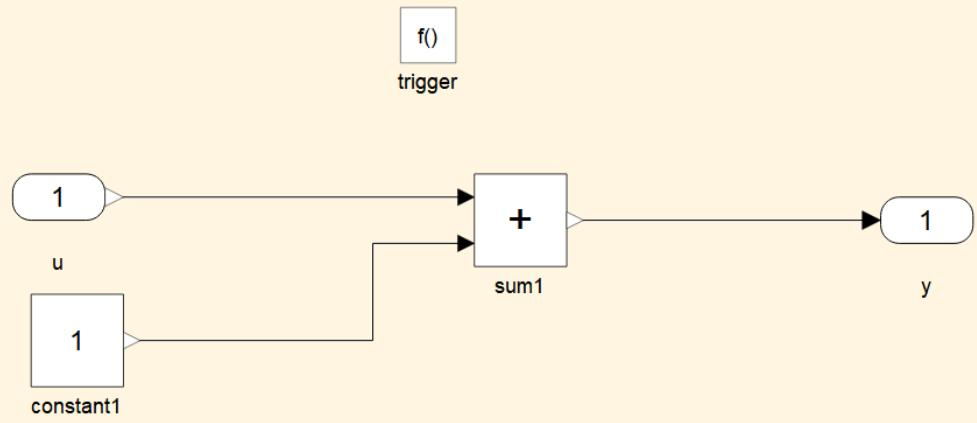

# 3.2 子系统建模

# 函数调用子系统示例1

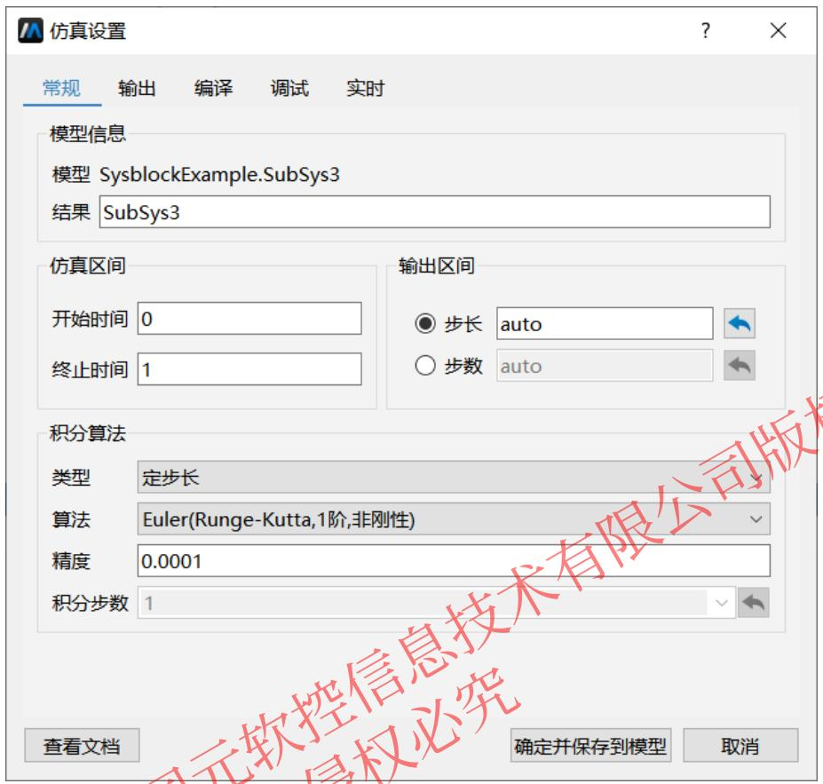

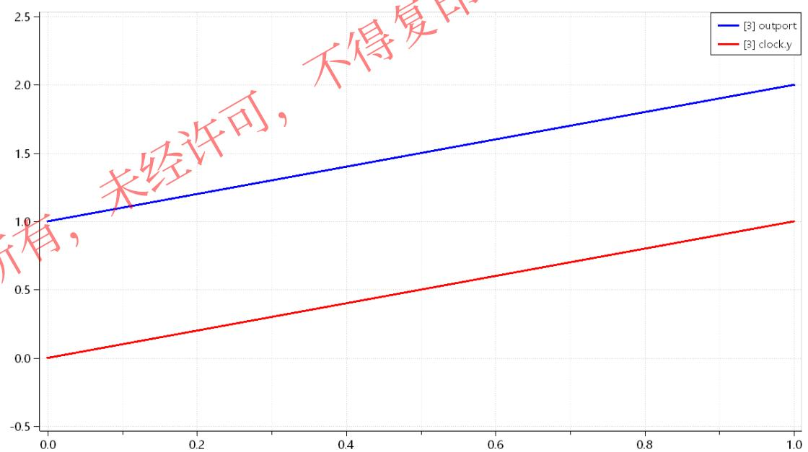

为什么输入输出差为1不为2

# 3.2 子系统建模

# 函数调用子系统示例2

操作步骤：1、复制SimpleSubsystem为SimpleSubsystem1

2、删除顶层输出端口、clock，添加DataStoreMemory模块   
3、设置DataStoreMemory模块初始值为0   
4、删除子系统内部输入端口，添加DataStoreRead模块   
5、删除子系统内部输出端口，添加DataStoreWrite模块

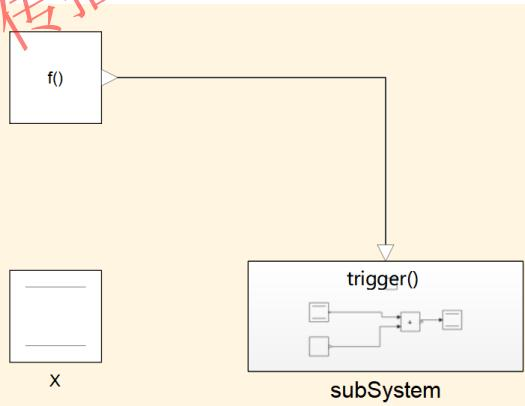

模块参数：X

?

DataStoreMemory

定义提供Data Store Read 和Data Store Write模块使用的内存区域。位于当前(子)系统级或更低级别且具有相同数据存储名称的所有Read和Write模块都能够读取或写入此模块。

主要

数据存储名称：

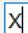

初始值：

数据类型：

Inherit: auto

维度(-1表示从初始值推断)

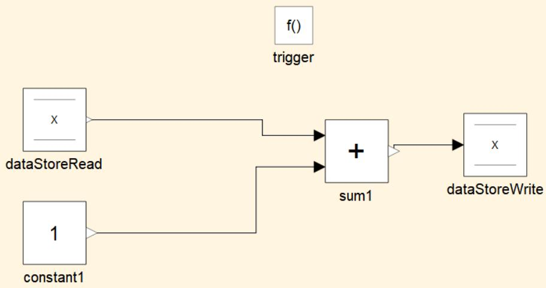

# 3.2 子系统建模

# 函数调用子系统示例2

# 操作步骤：1、仿真模型得到结果

Data Store Memory 模块定义并初始化一个命名的共享数据存储,即一个内存区域,

供指定相同数据存储名称的 Data Store Read 和 Data Store Write 模块使用:

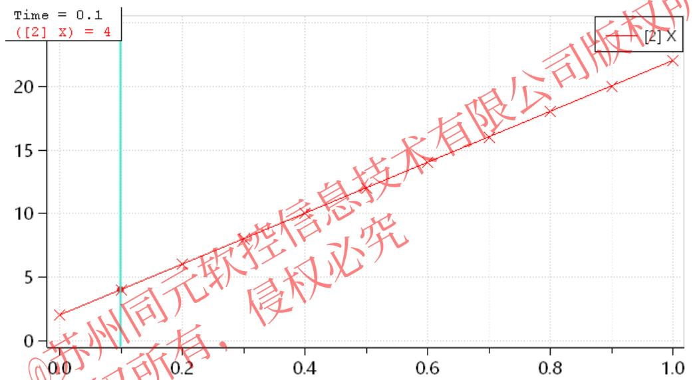

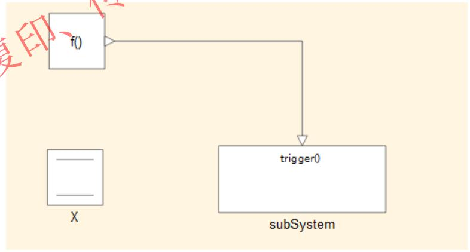

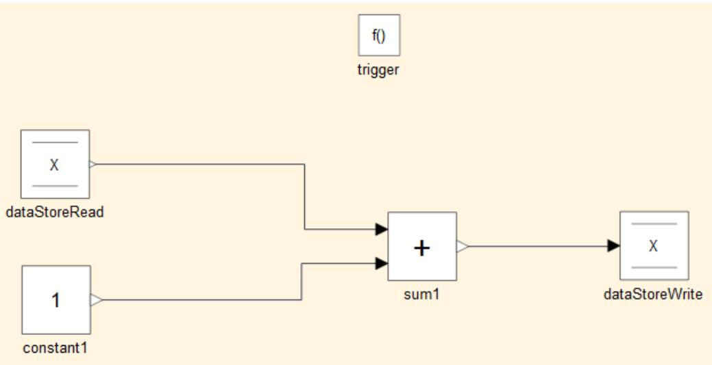

# 3.3 模型推导

# Sysblock支持使用数据类型助手设置输出端口类型

- 浮点: double、float  
- 整数：int8/uint8、int16/uint16、int32/uint32   
布尔：Boolean  
• 定点数: fixdt(1,16,0)、fixdt(1,16,2^0,0)、fixdt(1,16,1.0,0,0.0)

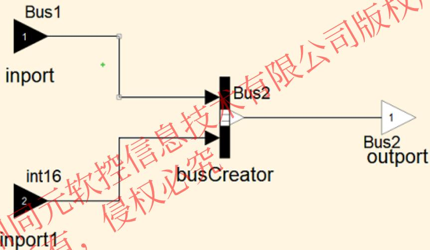

模块参数：inport

? X

import

输入端口

主要

信号属性

数据类型：

Inherit: auto

端口维度

Inherit: auto

-1

float

double

采样时间(-1

int8

int16

-1

int32

uint8

uint16

uint32

boolean

#

应用

# 3.3 模型推导

# 模型推导示例1

# 操作步骤:

1、重新打开SimplePID模型  
2、设置输入维度为[2]   
3、点击端口维度

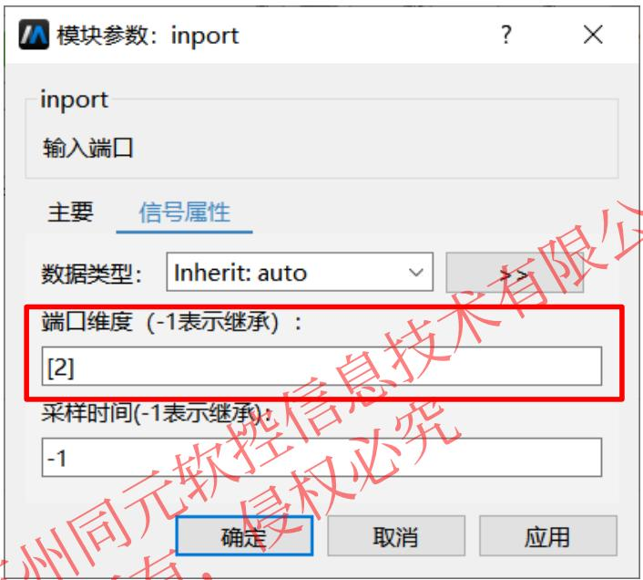

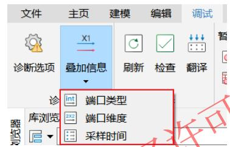

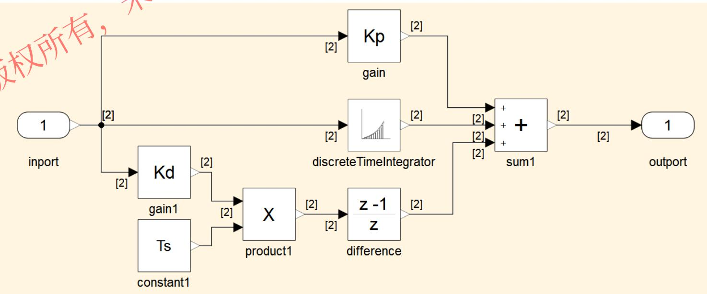

# 3.3 模型推导

# 模型推导示例2

# 操作步骤：

1、设置输入端口类型为int16  
2、设置content1类型为float  
3、点击端口类型

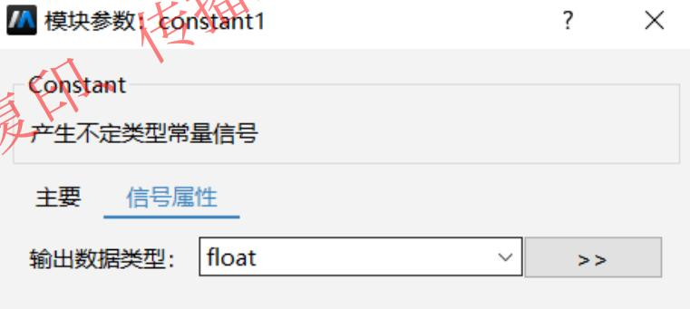

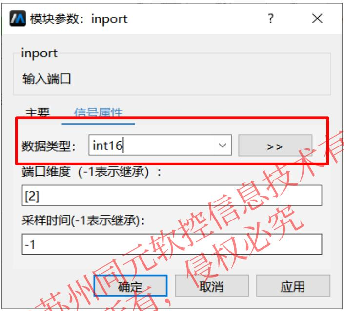

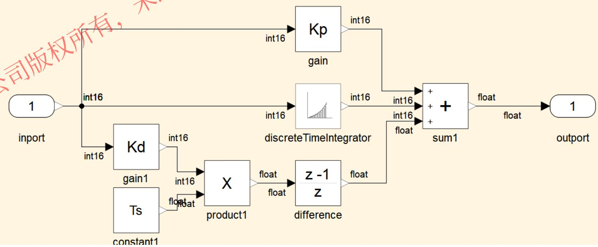

# 目录

1. MWORKS.Sysplorer 软件概览   
2. Sysblock 概述  
3. 框图建模基础   
4. Sysplorer与Sysblock混合仿真  
5. 状态机建模基础   
6. 初赛模型详解

# 4.1 混合仿真

# 针对控制器与被控对象全系统建模仿真需求，提供物理与框图混合建模仿真能力

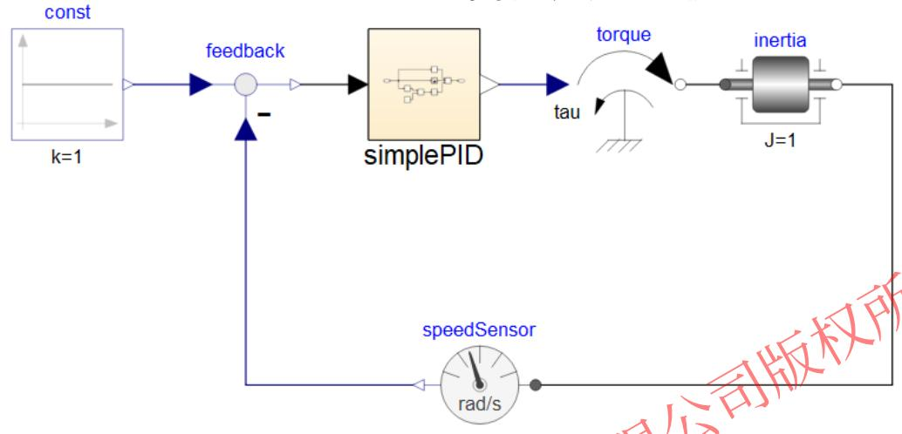  
混合仿真示例模型

✓ 物理模型走物理建模的流程，生成桌面端代码，框图模型走框图建模的流程，生成嵌入式代码  
✓ 框图模型的各项功能均可生效，例如类型定制、数据字典等  
✓ 物理模型和框图模型的仿真结果均支持查看  
√ 内核底层自动进行交互接口之间的类型匹配转换

c momodel.c   
h momodel_extern_inc.h   
c momodel_func.c   
c momodel_info.c   
h momodel_struct_types.h   
h momodel_types.h

物理模型代码

mosecdata.c   
h mosecdata.h   
c mosecdata1.c   
h mosecdata1.h   
mosecmodel.c   
h mosecmodel.h   
mosemodel block.h   
mosemodel block1.h   
mosecmodel1.c   
h mosecmodel1.h   
h mosecrt.h   
h mosecrt1.h

框图模型代码

物理模型

SEC模型

桌面端代码

嵌入式代码

# 4.1 混合仿真

# 简单混合仿真示例

操作步骤：1、在模型库中依次拖拽Constant、feedback、torque等组件，按关系摆放  
2、连接各组件构成闭环转速控制系统  
3、设定组件参数

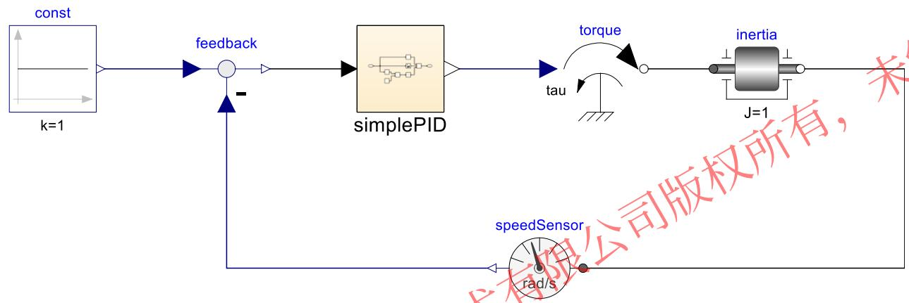

<table><tr><td>组件</td><td>参数名称</td><td>参数大小</td></tr><tr><td>const</td><td>k</td><td>1</td></tr><tr><td>inertia</td><td>J</td><td>1</td></tr></table>

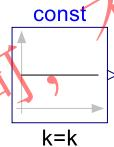

Modelica Blocks SOURces Constant

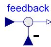

Modelica Blocks.Math.Feedback

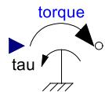

Modelica.Mechanics.Rotational.Sources.Torque

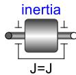

Modelica.Mechanics.Rotational.Components.Inertia

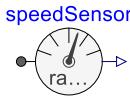

Modelica.Mechanics.Rotational.Sensors-SpeedSensor

# 目录

1. MWORKS.Sysplorer 软件概览   
2. Sysblock 概述  
3. 框图建模基础   
4. Sysplorer与Sysblock混合仿真  
5. 状态机建模基础   
6. 初赛模型详解

# 5.1 状态机建模

# Sysblock提供了基于有限状态机的图形化编程环境，适用于对复杂控制逻辑进行建模

✓ 支持转移动作和条件动作  
✓ 状态内动作支持区分entry、during、exit动作  
✓ 支持结点、历史结点  
✓ 支持输入、输出、局部事件  
$\checkmark$ 支持并行状态  
✓ 支持状态跨层转移  
✓ 支持内、外部转移  
✓ 支持带条件的缺省转移，支持同时存在多个缺省转移  
✓ 支持变量同时在父状态和子状态中赋值  
✓ 支持指定状态机的生成代码函数封装形式

# 5.2 状态机标准建模流程

# 汽车逻辑控制示例

# 问题概述:

使用状态机建模，汽车前进、停止行为，要求前进时支持前进档、后退档，前进时分为低速档与高速档

系统分析

<table><tr><td>输入</td><td colspan="3">用户的控制命令</td></tr><tr><td rowspan="4">状态</td><td colspan="3">停车</td></tr><tr><td rowspan="3">移动</td><td rowspan="2">前进</td><td>低速</td></tr><tr><td>高速</td></tr><tr><td colspan="2">倒车</td></tr></table>

# 5.2 状态机标准建模流程

# 新建模型

# 拖拽组件

# 数据管理

# 转移线连接

# 编辑动作

# 操作步骤:

> 点击“文件>新建Sysblock模型>Sysblock状态机...”，弹出“新建模型”对话框  
> 填写模型名为“SimpleChart”，描述为“简单状态机”  
> 点击确定，即可完成模型创建

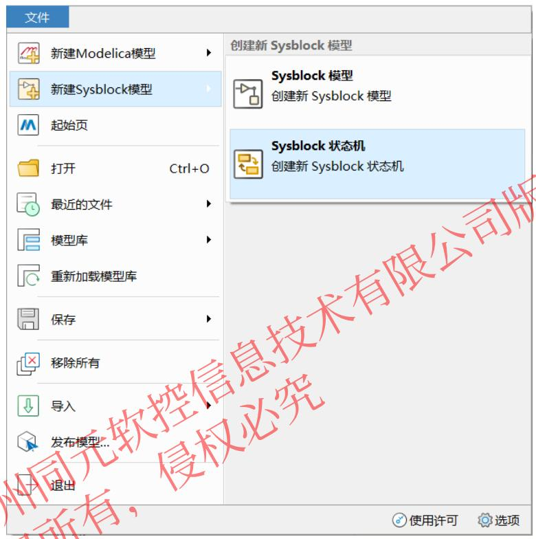

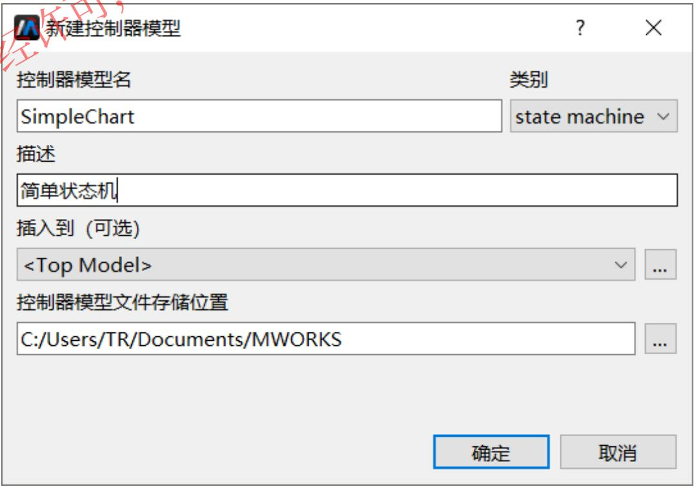

# 5.2 状态机标准建模流程

新建模型

拖拽组件

数据管理

转移线连接

编辑动作

操作步骤：双击进入chart，拖入State，并根据状态拓扑适当排布。

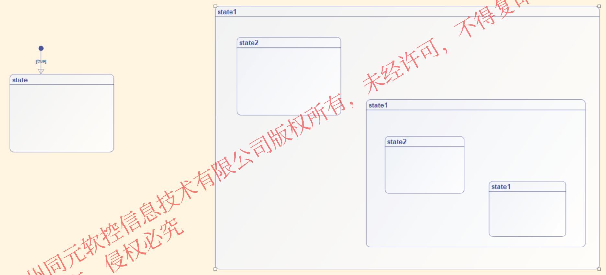

# 注:

1、Sysblock状态机通过图形上的位置关系确定父子关系  
2、点击状态，光标移动到4个边框时，可以拖住移动状态  
3、点击状态，光标移动到4个角时，可拖动放大、缩小状态

# 5.2 状态机标准建模流程

新建模型

拖拽组件

数据管理

转移线连接

编辑动作

操作步骤：双击State名称栏，修改为带有物理意义的名称。

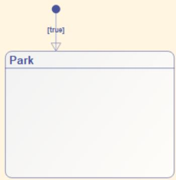  
Move   
Reverse

  
Drive   
HighSpeed

# 5.2 状态机标准建模流程

新建模型

拖拽组件

数据管理

转移线连接

编辑动作

操作步骤：状态机界面空白处右击选择编辑状态机变量，即可打开状态机变量对话框进行数据管理。

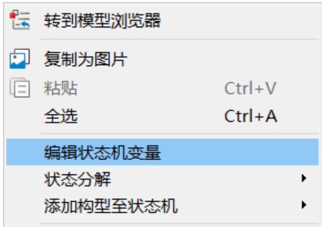

# 树状列表：

显示了状态机及其内部状态的隶属关系结构。

# 数据列表：

显示了状态机、状态内部的变量与事件。

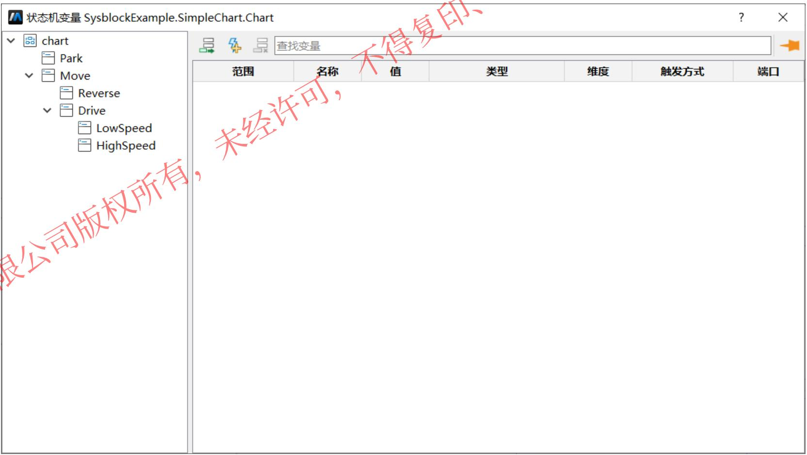

# 5.2 状态机标准建模流程

新建模型

拖拽组件

数据管理

转移线连接

编辑动作

操作步骤：添加变量设置其名称为speed，用于输出汽车速度设置其范围属性为Output添加变量设置其名称为direction，用于表示行驶方向设置其范围属性为Output

行驶方向还有前进、后退与停止，如何表达

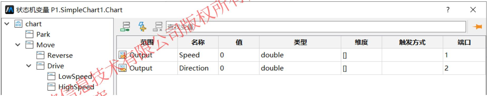

# 5.2 状态机标准建模流程

新建模型

拖拽组件

数据管理

转移线连接

编辑动作

# 操作步骤:

添加输入事件，用于控制不同状态之间的转移

添加6个事件

分别重命名为Event_On，Event_Off，Event_Dirve，Event_Reverse，Event_LowSpeed，Event_HighSpeed范围全部选取为Input

触发方式全部选取为either任一沿触发

状态机变量P1.SimpleChart1 Chart

chart

Park

Move

verse

Drive

LowSpeed

HighSpeed

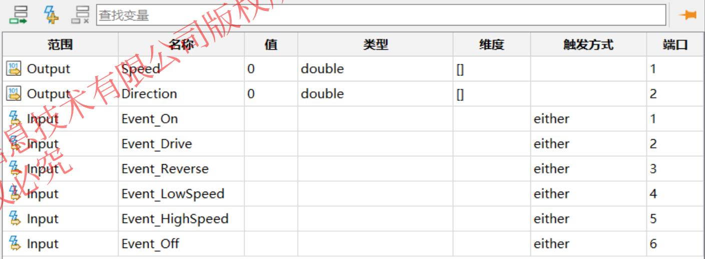

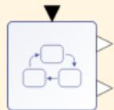  
chart

此时顶层状态机多出了端口

# 5.2 状态机标准建模流程

新建模型

拖拽组件

数据管理

转移线连接

编辑动作

操作步骤：转移线用于确定状态的转移关系，并通过转移条件来约束状态的转移成立条件。转移线的创建过程如下：

1. 将鼠标悬停于状态框上，等待光标变为 + 号；  
2. 按住鼠标左键并拖动鼠标，则引出一条转移线；  
3. 继续拖动鼠标, 移动到另一个状态的边框上, 松开鼠标或再次单击, 建立连接两个状态的转移线, 此时转移条件默认为 “true”。

# 添加默认转移

即Move父状态激活默认进入Drive状态  
Drive父状态激活默认进入LowSpeed状态

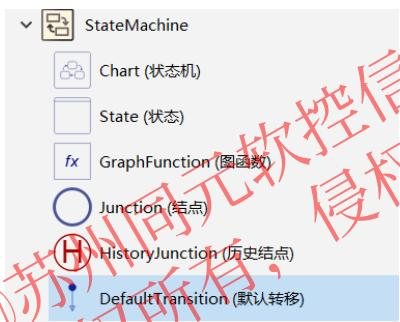

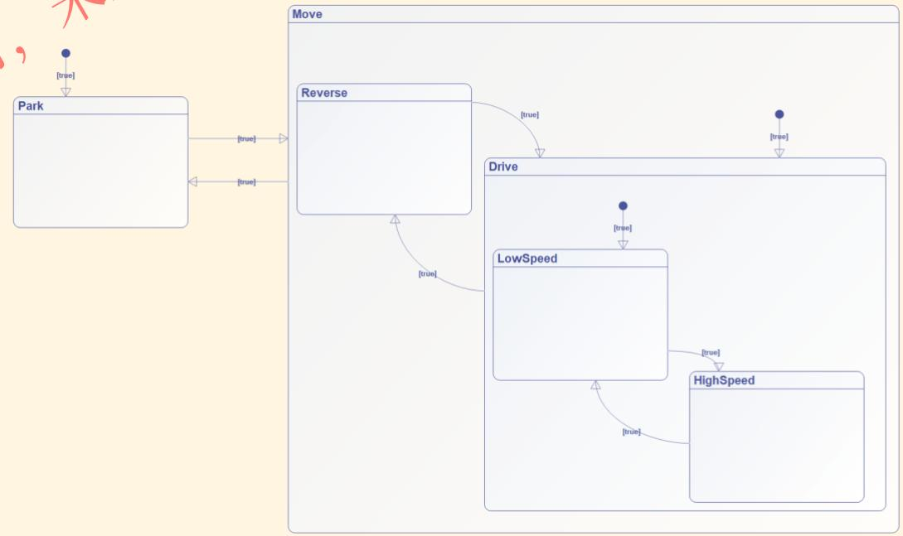

# 5.2 状态机标准建模流程

新建模型

拖拽组件

数据管理

转移线连接

编辑动作

转移文本可以包含事件、条件和动作，表示转移生效的条件以及附加行为，其格式如下所示：

[trigger and condition]{condition_action}/\{transition_action}

各部分含义如下：

- trigger: 表示事件条件，事件触发时转移生效  
- condition: 表示转移条件，条件为 true 时转移生效  
- condition_action：表示条件动作，条件生效执行  
transition_action：表示转移动作，转移生效执行

各部分都是可选的，示例如下：

[E1 and y<0]{y=2;}/{z++;m--;} // E1为事件

当事件 $\mathrm{E}1$ 触发且 $\mathrm{y} < 0$ 时,执行 $\mathrm{y} = 2$ ,若转移最终生效,执行 $\mathrm{z} +  + \text{、}\mathrm{m} -  -$ 。

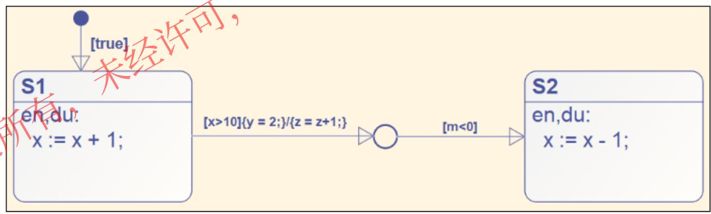

如上图，当 $x > 10$ 成立， $m < 0$ 不成立时，S1 到节点的转移条件生效，条件动作 $y = 2$ 会执行。

但是结点到S2的转移条件不成立，没有转移到有效的状态，所以转移最终没有生效，转移动作 $z = z + 1$ 不执行。

# 5.2 状态机标准建模流程

新建模型

拖拽组件

数据管理

转移线连接

编辑动作

操作步骤：[trigger and condition]{condition_action}/\{transition_action}

修改转移条件（之前默认条件为[true]）：

1、Park到Move的条件为[Event_On]   
2、Move到Park的条件为[Event_Off]  
3、Reverse到Drive的条件为[Event_Drive]   
4、Drive到Reverse的条件为

[Event_Reverse]

5、LowSpeed到HighSpeed的条件为   
[Event_HighSpeed]   
6、HighSpeed到LowSpeed的条件为   
[Event_LowSpeed]

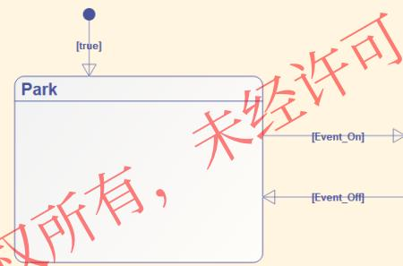

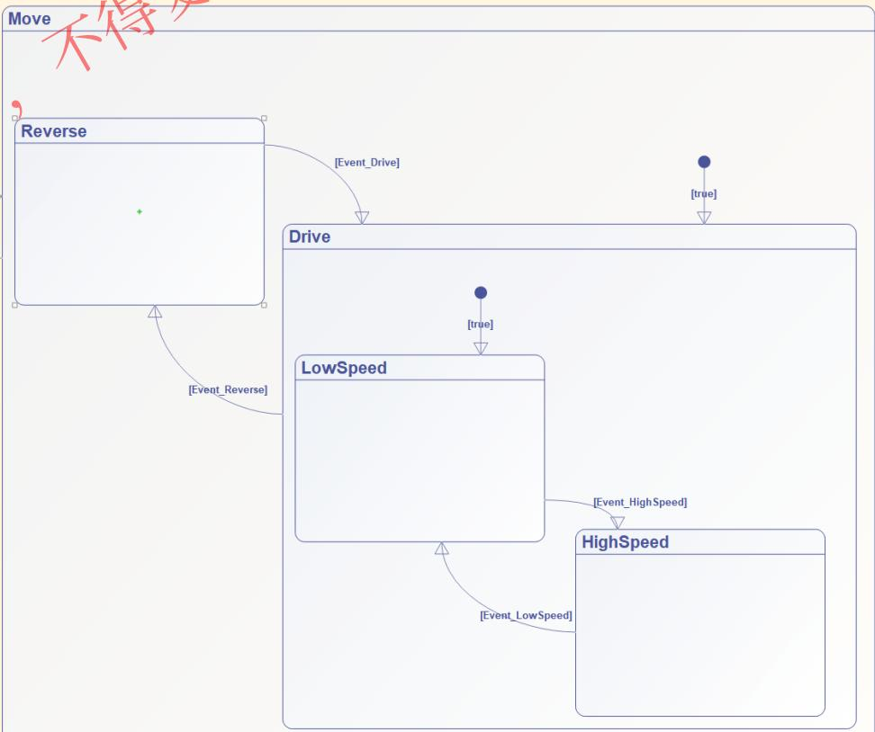

# 5.2 状态机标准建模流程

新建模型

拖拽组件

数据管理

转移线连接

编辑动作

# 操作步骤:

[trigger and condition]{condition_action}/{transition_action}

<table><tr><td>101 Output</td><td>Speed</td></tr><tr><td>101 Output</td><td>Direction</td></tr></table>

状态机中通过动作实现复杂逻辑:

转入Park状态，赋值Speed为0

转入LowSpeed状态，赋值

Speed为1

转入HighSpeed状态，赋值

Speed为2

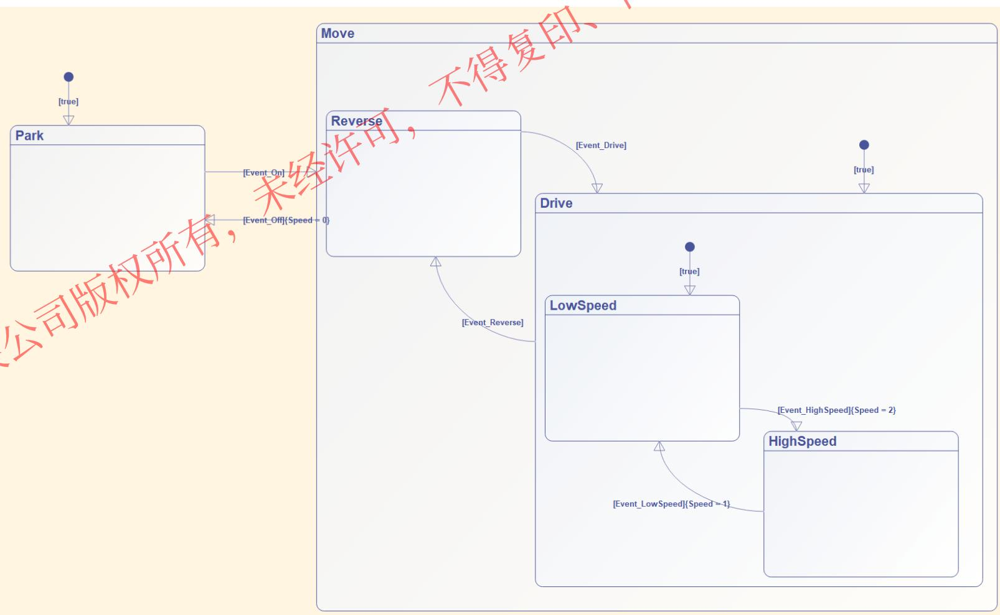

# 5.2 状态机标准建模流程

状态内动作支持区分entry、during、exit动作，将状态内动作根据状态的执行阶段进行细化，便于用户对状态内行为进行精细控制

√ entry动作，以entry(简写en)标签开头的动作，在进入状态时执行  
√ during动作，以during(简写du)标签开头的动作，在状态持续激活期间执行  
exit动作,以entry(简写ex)标签开头的动作，在退出状态时执行  
√动作标签可随意组合，以便定义需要在多个阶段都执行的动作；未指定动作标签的动作，将默认为en和du动作

除在转移线中指定简单的转移动作、条件动作外，状态内部也可以编辑动作，且可以支持较为复杂的逻辑

支持指定状态内动作类别，并支持动作类别任意组合

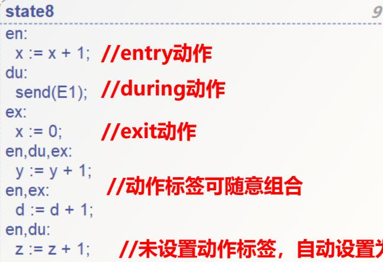

# 5.2 状态机标准建模流程

新建模型

拖拽组件

数据管理

转移线连接

编辑动作

# 操作步骤:

在编辑状态内部的动作：

1、状态机进入Park状态时，设置Direction为0，Speed为0(en动作)  
2、状态机进入、维持Drive状态时，设置Direction为1(en，du动作)  
3、状态机进入Reverse状态时，设置direction为-1，Speed为1(en动作)  
4、状态机进入LowSpeed状态时,设置Speed为1(en动作)

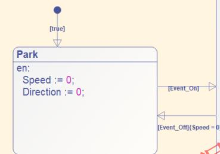

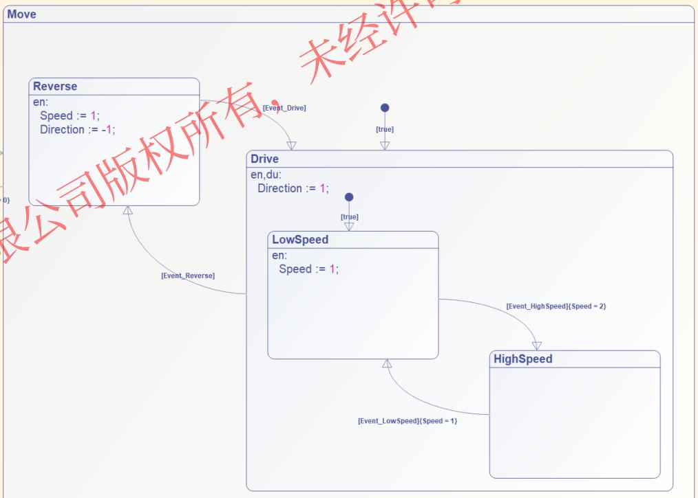

# 5.2 状态机标准建模流程

顶层给定输入，仿真验证状态机模型

# 操作步骤:

1、拖入Step、Constant、Mux、Export模块，如右图；  
2、step的阶跃时间为0.2 (Event_On)  
3、step1的阶跃时间为0.3(Event_Reverse)  
4、step2的阶跃时间为0.02（用于激活状态机）  
5、MUX的输入端口个数为6

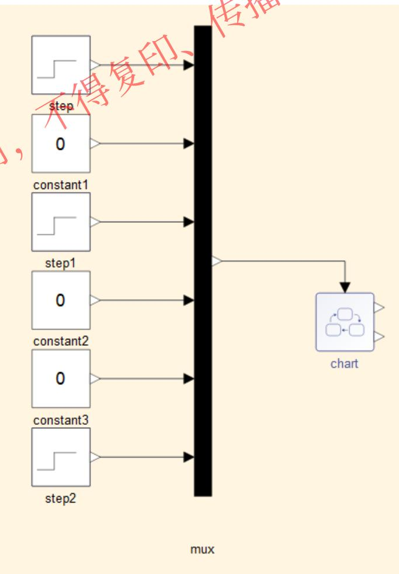

# 目录

1. MWORKS.Sysplorer 软件概览   
2. Sysblock 概述  
3. 框图建模基础   
4. Sysplorer与Sysblock混合仿真  
5. 状态机建模基础   
6. 初赛模型详解

# 6 初赛模型

# 车辆参数：

轴距：0.11m

轮距：0.165m

传感器位于前后左右四个位置

# 注意事项：

1. 选手只需要对红框中避障算法模块使用Sysblock进行建模，其余模型无需改动；  
2.仿真时勾选同步仿真，即可查看图形界面车辆状态与得分情况的动态显示；  
3. 小车每碰撞一次扣0.4分，综合考虑小车跑完一圈用时完成总分评判，具体细则请参看赛题说明。

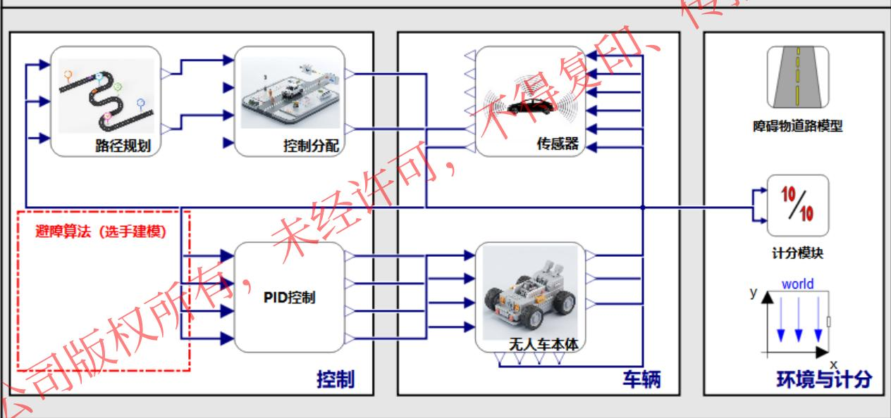  
无人系统大赛模型(初赛)  
车辆状态与得分情况

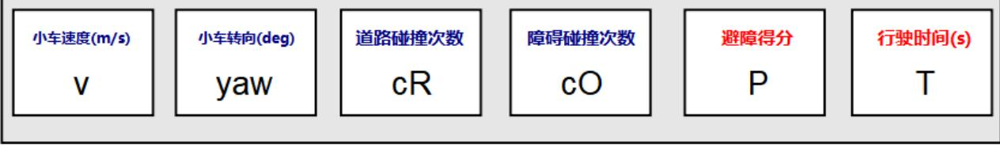  
苏州同元软控技术有限公司版权所有，仅用于无人系统大赛，未经许可不得复制、传播或以其他方式使用

# 6 初赛模型

# 车辆参数：

轴距：0.11m

轮距：0.165m

传感器位于前后左右四个位置

# 注意事项：

1. 选手只需要对红框中避障算法模块使用Sysblock进行建模，其余模型无需改动；  
2. 仿真时勾选同步仿真，即可查看图形界面车辆状态与得分情况的动态显示；  
3. 小车每碰撞一次扣0.4分，综合考虑小车跑完一圈用时完成总分评判，...细则请参看赛题说明。

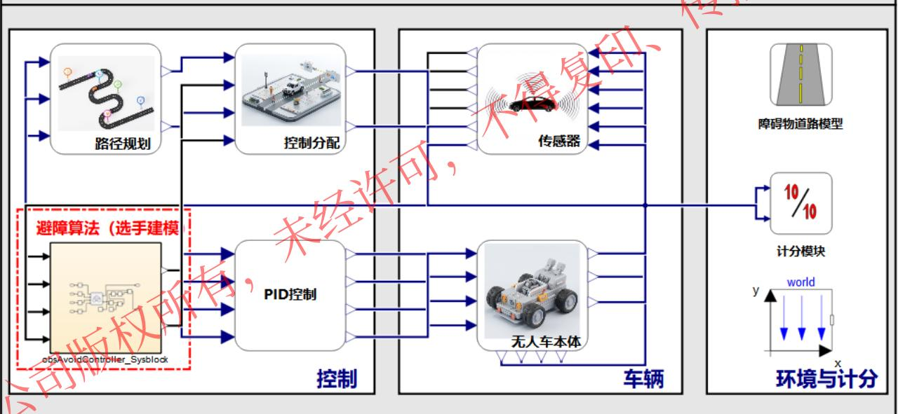  
无人系统大赛模型(初赛)

# 车辆状态与得分情况

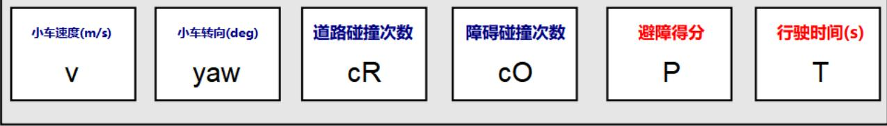  
苏州同元软控技术有限公司版权所有，仅用于无人系统大赛，未经许可不得复制、传播或以其他方式使用

建立知识规范，营造协同生态

积累工业模型，发展可控平台

融入中国创新，打造先进软件

# 感谢聆听
