# MWORKS与其他科学计算软件对比

- Source: `References/MWORKS高校星火计划资料包/MWORKS与MATLAB功能对照/01-MWORKS与其他科学计算软件对比.pdf`
- Converted by: `MinerU precise API`
- Conversion date: `2026-05-09`
- Review status: `MinerU converted; spot check recommended`
- Priority: `P0`
- Source SHA1: `51605bedc341`
- MinerU batch id: `dac5e9a5-3b55-48fa-856c-c43fc60aae6e`
- Images: `131`
- Notes: MWORKS 与 MATLAB/Simulink 等科学计算软件的总体能力对比。

# 新一代科学计算与系统建模仿真平台

# MWORKS与其他科学计算软件对比

苏州同元软控信息技术有限公司

2022年11月17日

# 目录

1. 功能映射与状态
2. 应用流程对比
3. 功能差异性对比

# MATLAB产品架构

MATLAB是国际上应用最为广泛的科学与工程计算平台软件，也是全球工业自动化控制系统设计仿真、信号通信和图像处理的标准软件。MATLAB平台采用“1+1+N”的产品架构，基于平台+应用的模式构建应用生态。

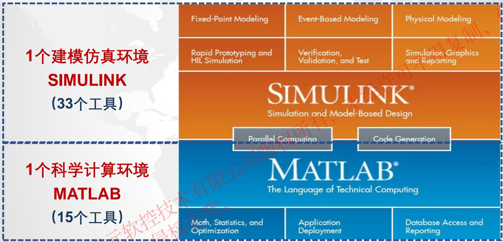

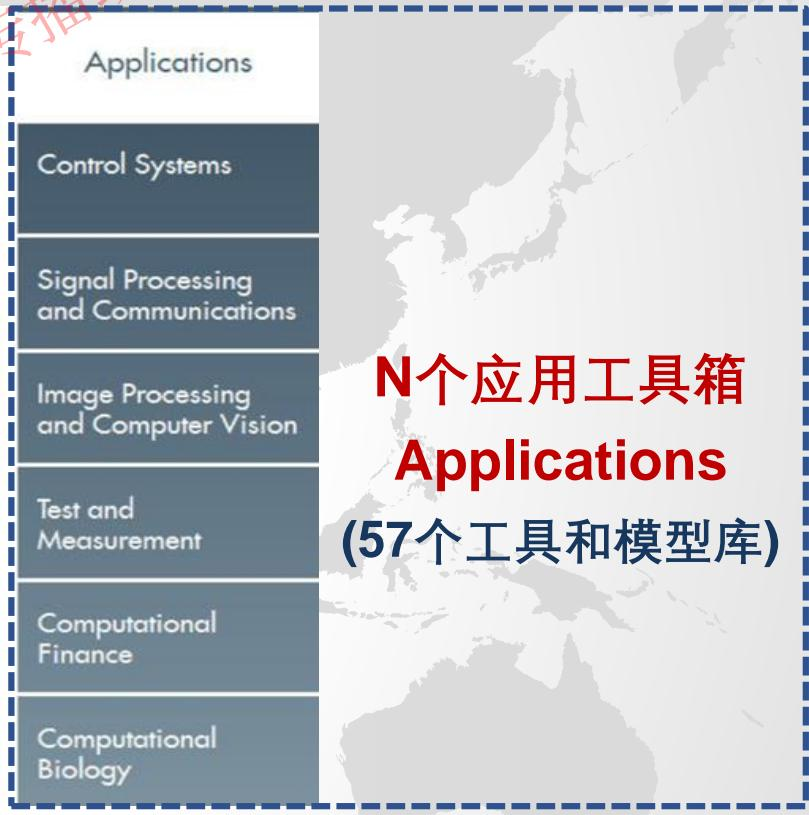
MATLAB 2020a产品架构， 来源： www. mathworks.com

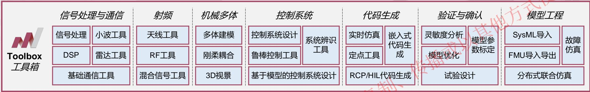
开放API体系MWORKS.SDK（C/C++/Python/Julia）

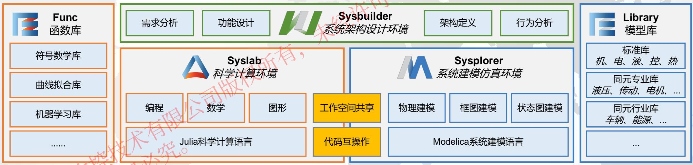


# MoHub

计算仿真云平台

（公有云，社区级）

模型社区

云端建模仿真

端云一体

弹性计算

私有化部署


# Syslink

协同设计仿真环境

(企业级)

# 科学计算环境

# 系统建模环境

# 工具箱

# Syslab vs MATLAB科学计算环境

MWORKS.Syslab提供交互式编程环境的完备功能。支持多范式统一编程，简约与性能兼顾，内置通用编程、数学、通信等函数库，用于科学计算、数据分析、算法设计、机器学习等领域，并通过内置丰富的图形进行数据可视化。


MWORKS.Syslab

Syslab

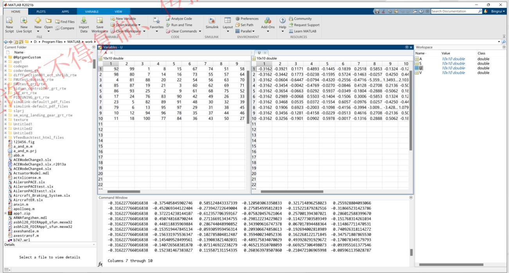

MATLAB

# Syslab vs MATLAB科学计算环境


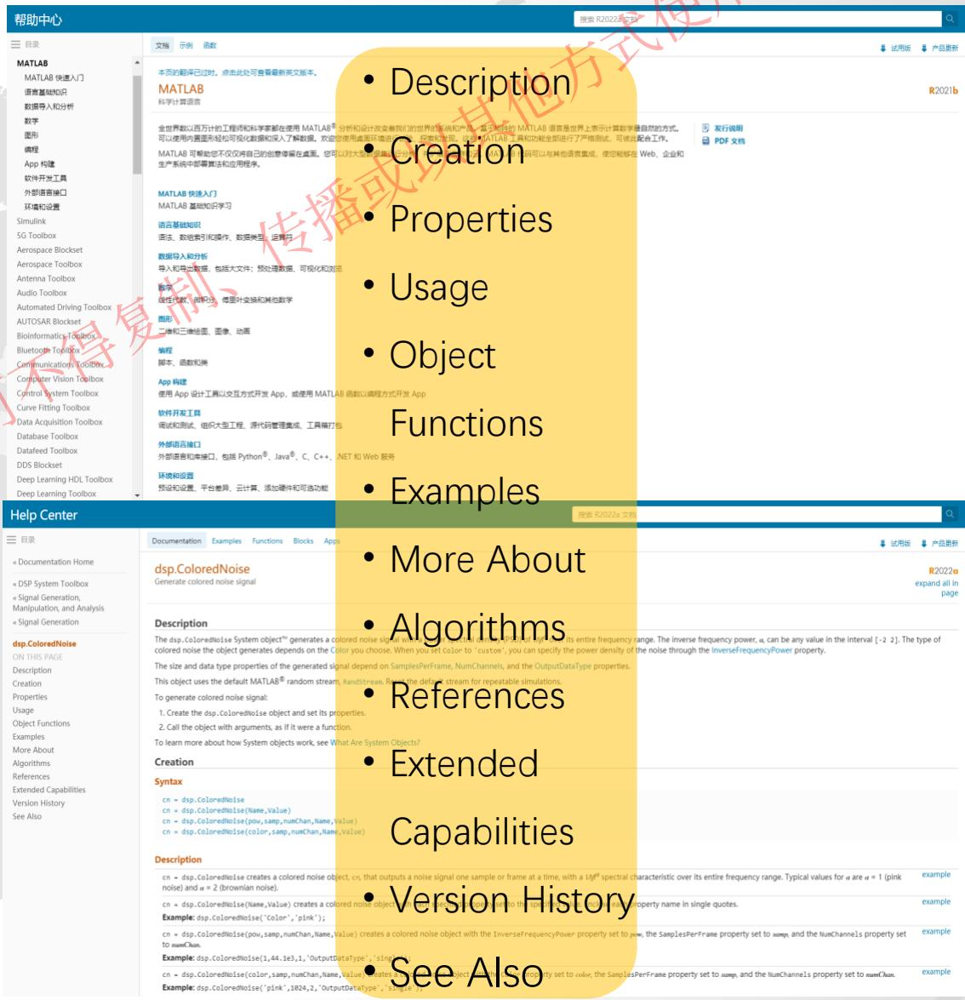

# Syslab vs MATLAB科学计算环境

# Julia

推出时间：2012
适用范围：面向科学计算的高性能动态高级程序设计语言
特点：快！开源

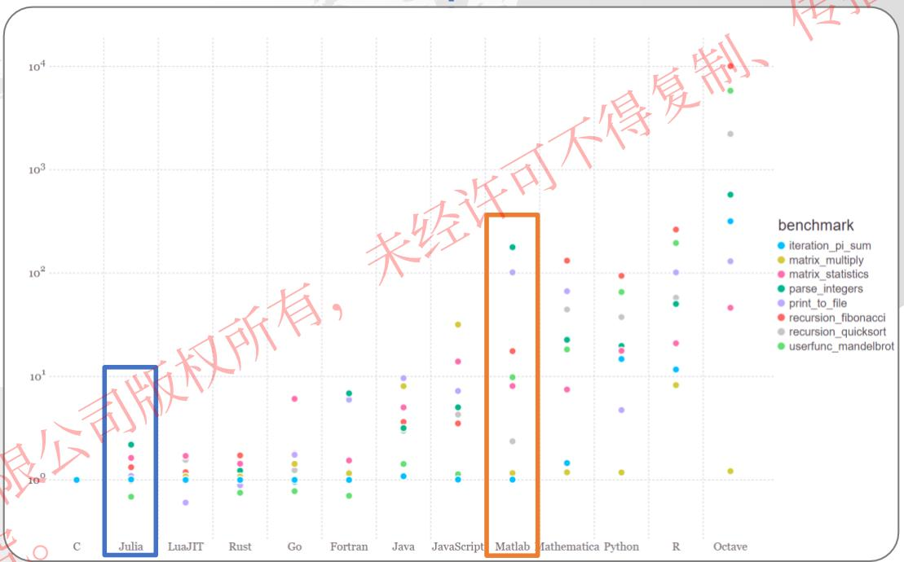
https://julialang.org/benchmarks/

# M

推出时间：1984
适用范围： 面向科学计算的计算机数学语言
特点：通用

# 科学计算环境

# 系统建模环境

# 工具箱

# Sysplorer vs Simulink系统建模环境

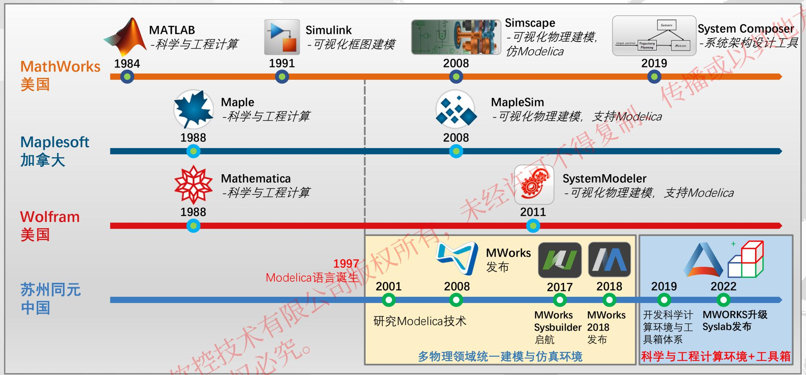

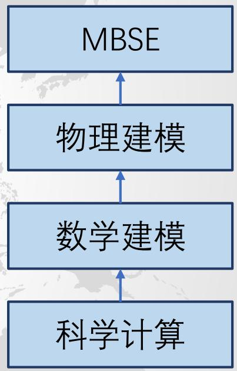

Modelica语言已经成为世界公认的MBSE和CPS的核心关键支撑技术：多领域系统统一建模仿真。

# Sysplorer vs Simulink系统建模环境

MWORKS.Sysplorer多领域统一建模环境支持框图建模，基于有限状态机理论的事件建模以及基于Modelica的多领域物理建模，分别对应Simulink的Block、Stateflow、Simscape。

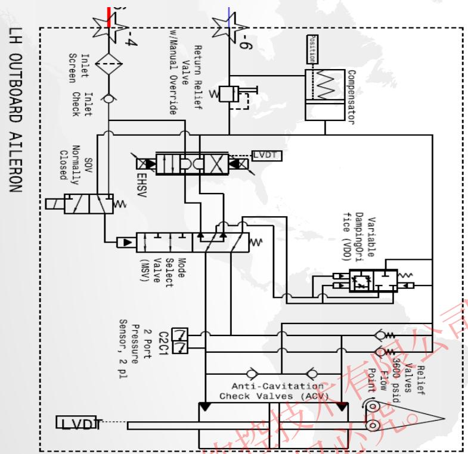
电液作动器PCU原理图

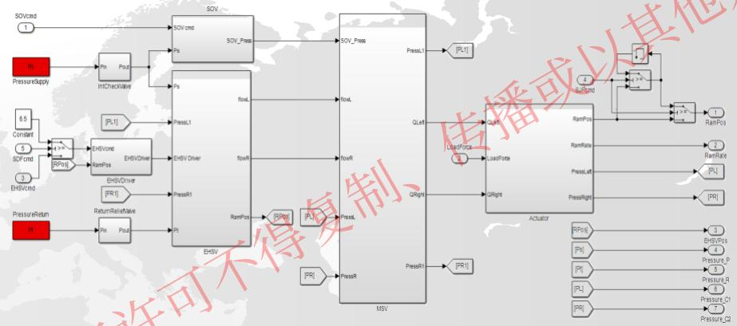

# Simulink框图模型

# 框图反映方程拓扑

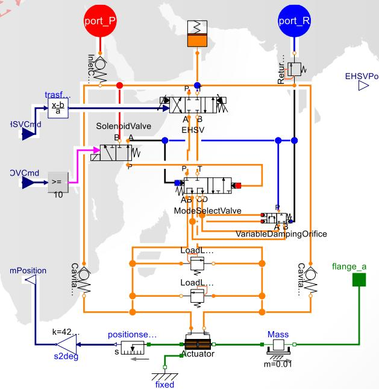

# Modelica物理模型

# 反映物理拓扑

# Sysplorer vs Simulink系统建模环境

MWORKS.Sysplorer多领域统一建模环境支持框图建模，基于有限状态机理论的事件建模以及基于Modelica的多领域物理建模，分别对应Simulink的Block、Stateflow、Simscape。

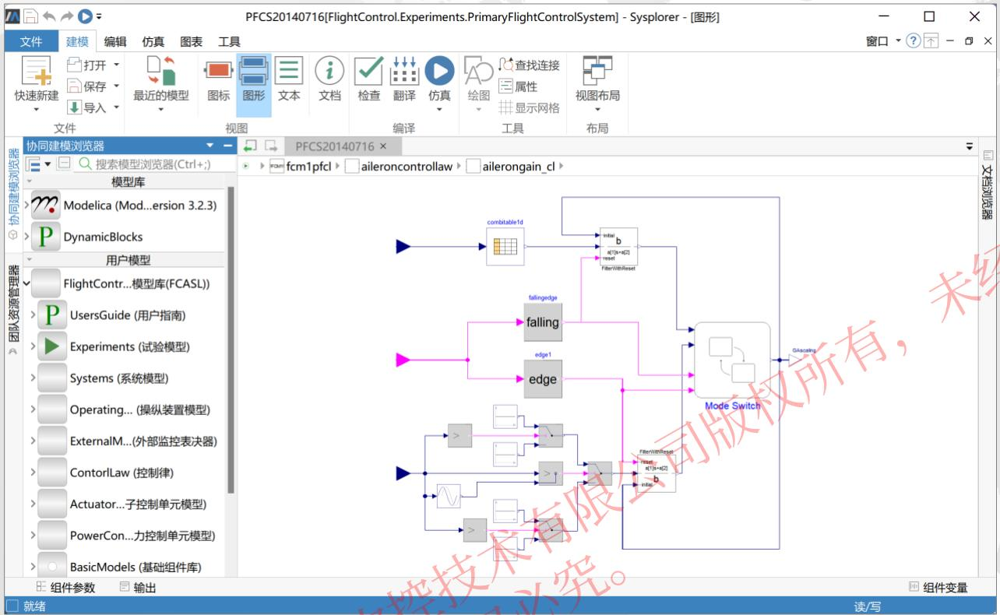
Sysplorer
框图建模

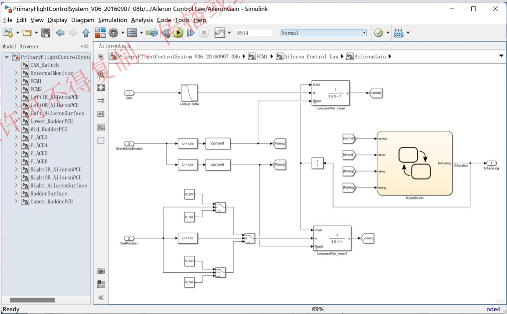
Simulink
框图建模

# Sysplorer vs Simulink系统建模环境

MWORKS.Sysplorer多领域统一建模环境支持框图建模，基于有限状态机理论的事件建模以及基于Modelica的多领域物理建模，分别对应Simulink的Block、Stateflow、Simscape。

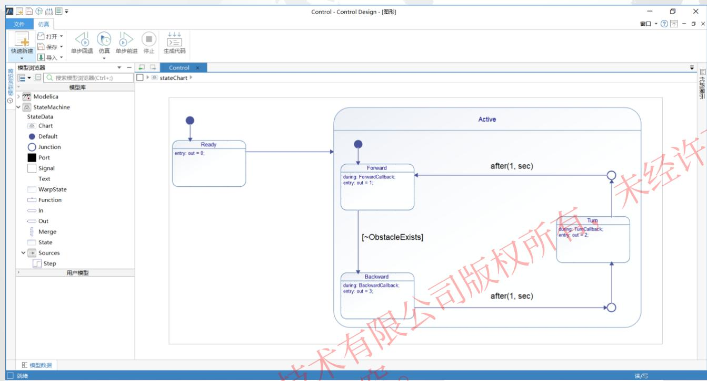

Sysplorer

事件建模

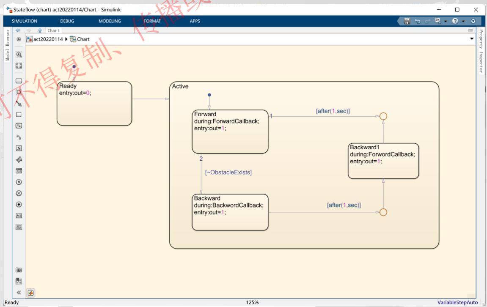

Simulink

事件建模

# 多领域统一建模环境MWORKS.Sysplorer vs Simulink

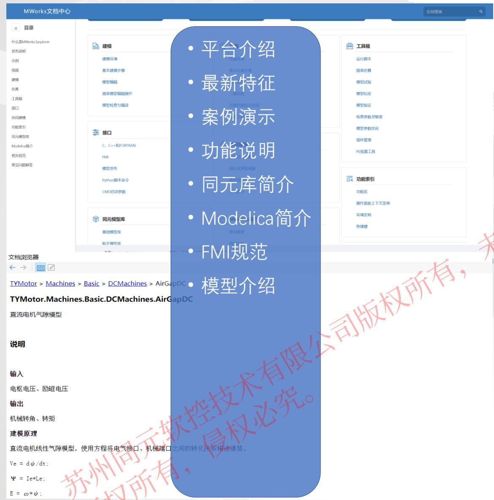

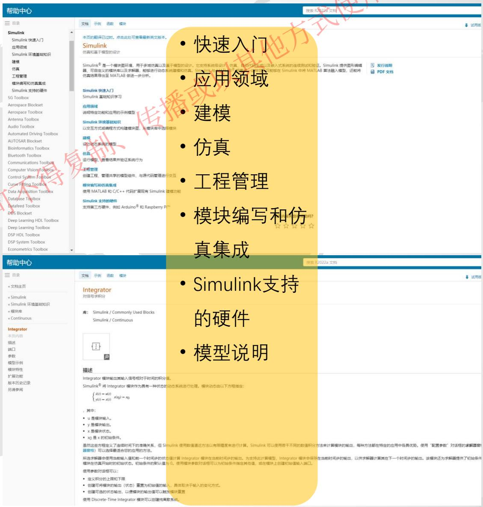

# 科学计算环境

# 系统建模环境

# 工具箱

# MWORKS vs MATLAB工具箱

<table><tr><td colspan="2">MATLAB. Toolbox</td><td colspan="2">MWORKS. Toolbox</td><td>说明</td></tr><tr><td rowspan="2">Parallel Computing并行计算</td><td>MATLAB Parallel Server</td><td rowspan="2">并行计算</td><td rowspan="2">并行计算工具箱</td><td>暂无开发计划</td></tr><tr><td>Parallel Computing Toolbox</td><td>MWORKS 2023b 即将发布</td></tr><tr><td rowspan="11">Math, Statistics, and Optimization数学、统计与优化</td><td>Curve Fitting Toolbox</td><td rowspan="11">数学、统计与优化</td><td>曲线拟合工具箱</td><td>MWORKS 2023a 已提供</td></tr><tr><td>Global Optimization Toolbox</td><td>全局优化工具箱</td><td>MWORKS 2023a 已提供</td></tr><tr><td>Optimization Toolbox</td><td>优化工具箱</td><td>MWORKS 2023a 已提供</td></tr><tr><td rowspan="2">Statistics and Machine Learning Toolbox</td><td>统计工具箱</td><td>MWORKS 2023a 已提供</td></tr><tr><td>机器学习工具箱</td><td>MWORKS 2023b 即将发布</td></tr><tr><td>Symbolic Math Toolbox</td><td>符号数学工具箱</td><td>MWORKS 2023a 已提供</td></tr><tr><td>Deep Learning Toolbox</td><td>深度学习工具箱</td><td>MWORKS 2023b 即将发布</td></tr><tr><td>Reinforcement Learning Toolbox</td><td>强化学习工具箱</td><td>MWORKS 2023b 即将发布</td></tr><tr><td>Partial Differential Equation Toolbox</td><td>/</td><td rowspan="3">暂无开发计划</td></tr><tr><td>Predictive Maintenance Toolbox</td><td>/</td></tr><tr><td>Text Analytics Toolbox</td><td>/</td></tr><tr><td rowspan="2">Database Access and Reporting数据库与报告生成</td><td>MATLAB Report Generator</td><td rowspan="2">数据库与报告生成</td><td>报告生成工具箱</td><td>MWORKS 2023b 即将发布</td></tr><tr><td>Database Toolbox</td><td>/</td><td>暂无开发计划</td></tr></table>

# MWORKS vs MATLAB工具箱

<table><tr><td colspan="2">MATLAB. Toolbox</td><td colspan="2">MWORKS. Toolbox</td><td>说明</td></tr><tr><td rowspan="12">控制系统Control System</td><td>Control System Toolbox</td><td>控制系统</td><td>控制系统设计工具箱</td><td>MWORKS 2023a 已提供</td></tr><tr><td>Powertrain Blockset</td><td>汽车工具箱与模型库</td><td>动力总成模型库</td><td>MWORKS 2023a 已提供</td></tr><tr><td>Vehicle Dynamics Blockset</td><td>汽车工具箱与模型库</td><td>车辆动力学模型库</td><td>MWORKS 2023a 已提供</td></tr><tr><td>Simulink Control Design</td><td rowspan="4">控制系统</td><td>基于模型的控制器设计工具箱</td><td>MWORKS 2023a 已提供</td></tr><tr><td>Robust Control Toolbox</td><td>鲁棒控制工具箱</td><td>在研,MWORKS 2024a 发布</td></tr><tr><td>System Identification Toolbox</td><td>系统辨识工具箱</td><td>MWORKS 2023b 即将发布</td></tr><tr><td>Simulink Design Optimization</td><td>基于模型的设计优化工具箱</td><td>MWORKS 2023b 即将发布</td></tr><tr><td>Aerospace Toolbox</td><td rowspan="2">航空航天</td><td rowspan="2">航空航天工具箱</td><td rowspan="2">在研,MWORKS 2025a 发布</td></tr><tr><td>Aerospace Blockset</td></tr><tr><td>Model-Based Calibration Toolbox</td><td>汽车工具箱与模型库</td><td>基于模型的标定工具</td><td>在研,MWORKS 2024a 发布</td></tr><tr><td>Fuzzy Logic Toolbox</td><td>/</td><td>/</td><td rowspan="2">暂无开发计划</td></tr><tr><td>Model Predictive Control Toolbox</td><td>/</td><td>/</td></tr><tr><td rowspan="5">Image Processing and Computer Vision图像处理与计算机视觉</td><td>Computer Vision Toolbox</td><td>/</td><td>/</td><td rowspan="5">暂无开发计划</td></tr><tr><td>Image Acquisition Toolbox</td><td>/</td><td>/</td></tr><tr><td>Image Processing Toolbox</td><td>/</td><td>/</td></tr><tr><td>Mapping Toolbox</td><td>/</td><td>/</td></tr><tr><td>Vision HDL Toolbox</td><td>/</td><td>/</td></tr></table>

# MWORKS vs MATLAB工具箱

<table><tr><td colspan="2">MATLAB. Toolbox</td><td colspan="2">MWORKS. Toolbox</td><td>说明</td></tr><tr><td rowspan="17">Signal Processing and Communications信号处理与通讯</td><td>Communications Toolbox</td><td>通信</td><td>基础通信工具箱</td><td>MWORKS 2023a 已提供</td></tr><tr><td>DSP System Toolbox</td><td rowspan="2">信号处理</td><td>DSP系统工具箱</td><td>MWORKS 2023a 已提供</td></tr><tr><td>Signal Processing Toolbox</td><td>基础信号处理工具箱</td><td>MWORKS 2023a 已提供</td></tr><tr><td>5G Toolbox</td><td rowspan="3">通信</td><td>5G工具箱</td><td>在研,MWORKS 2025a 发布</td></tr><tr><td>LTE Toolbox</td><td>LTE工具箱</td><td>在研,MWORKS 2025a 发布</td></tr><tr><td>WLAN Toolbox</td><td>WLAN工具箱</td><td>在研,MWORKS 2025a 发布</td></tr><tr><td>Wavelet Toolbox</td><td rowspan="2">信号处理</td><td>小波工具箱</td><td>MWORKS 2023b 即将发布</td></tr><tr><td>Phased Array System Toolbox</td><td>相控阵系统工具箱</td><td>MWORKS 2023b 即将发布</td></tr><tr><td>RF Toolbox</td><td rowspan="4">射频与混合信号</td><td rowspan="2">RF工具箱(含RF模型库)</td><td rowspan="2">在研,MWORKS 2024a 发布</td></tr><tr><td>RF Blockset</td></tr><tr><td>Antenna Toolbox</td><td>天线工具箱</td><td>在研,MWORKS 2024a 发布</td></tr><tr><td>Mixed-Signal Blockset</td><td>混合信号工具箱</td><td>在研,MWORKS 2024a 发布</td></tr><tr><td>Sensor Fusion and Tracking Toolbox</td><td>机器人</td><td>机器人与自主系统工具箱</td><td>在研,MWORKS 2025a 发布</td></tr><tr><td>SoC Blockset</td><td>/</td><td>/</td><td rowspan="4">暂无开发计划</td></tr><tr><td>Audio Toolbox</td><td>/</td><td>/</td></tr><tr><td>SerDes Toolbox</td><td>/</td><td>/</td></tr><tr><td>Wireless HDL Toolbox</td><td>/</td><td>/</td></tr><tr><td rowspan="4">Test and Measurement测试与测量</td><td>Instrument Control Toolbox</td><td rowspan="4">测试与测量</td><td>仪器控制工具箱</td><td>在研,MWORKS 2024a 发布</td></tr><tr><td>Data Acquisition Toolbox</td><td rowspan="3">/</td><td rowspan="3">暂无开发计划</td></tr><tr><td>OPC Toolbox</td></tr><tr><td>Vehicle Network Toolbox</td></tr></table>

# MWORKS vs MATLAB工具箱

<table><tr><td colspan="2">MATLAB. Toolbox</td><td colspan="2">MWORKS. Toolbox</td><td>说明</td></tr><tr><td rowspan="13">Code Generation代码生成</td><td>MATLAB Coder</td><td rowspan="4">模型驱动代码生成与实时仿真环境</td><td>科学工程计算语言代码生成</td><td>在研,MWORKS 2024a 发布</td></tr><tr><td>Embedded Coder</td><td>面向嵌入式产品的C代码生成模块</td><td>在研,MWORKS 2023b 发布</td></tr><tr><td>Fixed-Point Designer</td><td>定点数据类型的代码生成模块</td><td>在研,MWORKS 2024a 发布</td></tr><tr><td>GPU Coder</td><td>科学工程计算语言GPU代码生成</td><td>在研,MWORKS 2025a 发布</td></tr><tr><td>AUTOSAR Blockset</td><td>/</td><td>/</td><td rowspan="3">暂无开发计划</td></tr><tr><td>DO Qualification</td><td>/</td><td>/</td></tr><tr><td>Filter Design HDL Coder</td><td>/</td><td>/</td></tr><tr><td>Simulink Coder</td><td>模型驱动代码生成与实时仿真环境</td><td>物理模型的代码生成工具箱</td><td>MWORKS 2023a 已提供</td></tr><tr><td>HDL Coder</td><td>面向硬件在环的代码生成模块</td><td>面向硬件在环的代码生成工具箱</td><td>在研,MWORKS 2024a 发布</td></tr><tr><td>Simulink Code Inspector</td><td>模型验证确认与测试</td><td>模型静态检查工具箱</td><td>在研,MWORKS 2024a 发布</td></tr><tr><td>HDL Verifier</td><td>硬件代码检查</td><td>/</td><td rowspan="3">暂无开发计划</td></tr><tr><td>IEC Certification Kit (for ISO 26262 and IEC 61508)</td><td>/</td><td>/</td></tr><tr><td>Simulink PLC Coder</td><td>/</td><td>/</td></tr><tr><td rowspan="2">Real-Time Simulation and Testing实时仿真与测试</td><td>Simulink Desktop Real-Time</td><td rowspan="2">模型驱动代码生成与实时仿真环境</td><td>实时仿真工具箱 (Desktop)</td><td>在研,MWORKS 2024a 发布</td></tr><tr><td>Simulink Real-Time</td><td>实时仿真工具箱</td><td>在研,MWORKS 2024a 发布</td></tr></table>

# MWORKS vs MATLAB工具箱

<table><tr><td colspan="2">MATLAB. Toolbox</td><td colspan="2">MWORKS. Toolbox</td><td>说明</td></tr><tr><td rowspan="3">Application Deployment程序部署</td><td>MATLAB Compiler</td><td rowspan="2">可视化应用程序集成开发环境</td><td rowspan="2">可视化应用程序集成开发环境</td><td rowspan="2">在研,MWORKS 2024a 发布</td></tr><tr><td>MATLAB Compiler SDK</td></tr><tr><td>Simulink Compiler</td><td>可视化应用程序集成开发环境</td><td>可视化应用程序集成开发环境</td><td>在研,MWORKS 2024a 发布</td></tr><tr><td rowspan="2">Systems Engineering系统工程</td><td>System Composer</td><td>系统架构建模环境</td><td>系统架构建模软件MWORKS.Sysbuilder</td><td>已发布</td></tr><tr><td>Simulink Requirements</td><td>/</td><td>/</td><td>暂无开发计划</td></tr><tr><td rowspan="2">Event-Based Modeling基于事件的建模</td><td>SimEvents</td><td rowspan="2">状态机事件建模模块</td><td rowspan="2">状态机事件建模</td><td rowspan="2">MWORKS 2023b 即将发布</td></tr><tr><td>Stateflow</td></tr><tr><td rowspan="5">Physical Library物理模型库</td><td>Simscape</td><td rowspan="5">系统建模仿真环境</td><td>组件物理建模</td><td rowspan="4">MWORKS 2023a 已提供Sysplorer基于Modelica发布了同元商业模式模型库,涉及机械、电气、液压、气动、通讯等多个专业,可支撑覆盖航天、航空汽车、工程机械、能源和船舶等多行业;已包含11个基础模型库和6个行业模型库;</td></tr><tr><td>Simscape Driveline</td><td>组件物理建模</td></tr><tr><td>Simscape Electrical</td><td>组件物理建模</td></tr><tr><td>Simscape Fluids</td><td>组件物理建模</td></tr><tr><td>Simscape Multibody</td><td>机械多体工具箱</td><td>在研,MWORKS 2024b 发布</td></tr><tr><td rowspan="8">Verification, Validation, and Test验证、确认与测试</td><td>Polyspace Bug Finder</td><td rowspan="6">模型验证确认与测试</td><td rowspan="2">代码静态检查工具箱</td><td rowspan="2">在研,MWORKS 2024a 发布</td></tr><tr><td>Polyspace Code Prover</td></tr><tr><td>Simulink Check</td><td>模型规范检查工具箱</td><td>在研,MWORKS 2024a 发布</td></tr><tr><td>Simulink Coverage</td><td>模型覆盖度分析与统计工具箱</td><td>在研,MWORKS 2024b 发布</td></tr><tr><td>Simulink Design Verifier</td><td>模型静态检查工具箱</td><td>在研,MWORKS 2024a 发布</td></tr><tr><td>Simulink Test</td><td>模型自动化测试工具箱</td><td>在研,MWORKS 2024a 发布</td></tr><tr><td>Polyspace Bug Finder Server</td><td></td><td>/</td><td rowspan="2">暂无开发计划</td></tr><tr><td>Polyspace Code Prover Server</td><td></td><td>/</td></tr></table>

# MWORKS vs MATLAB工具箱

<table><tr><td colspan="2">MATLAB. Toolbox</td><td colspan="2">MWORKS. Toolbox</td><td>说明</td></tr><tr><td rowspan="2">Simulation Graphics and Reporting仿真可视化与报告生成</td><td>Simulink 3D Animation</td><td rowspan="2">系统建模仿真环境</td><td>3D视景工具箱</td><td>在研,MWORKS 2024a 发布</td></tr><tr><td>Simulink Report Generator</td><td>报告生成工具箱</td><td>MWORKS 2023b 即将发布</td></tr><tr><td rowspan="4">Robotics and Autonomous Systems机器人与相关系统</td><td>Navigation Toolbox</td><td rowspan="3">机器人</td><td rowspan="3">机器人与自主系统工具箱</td><td rowspan="3">在研,MWORKS 2025a 发布</td></tr><tr><td>Robotics System Toolbox</td></tr><tr><td>ROS Toolbox</td></tr><tr><td>Automated Driving Toolbox</td><td>车辆系统模型库</td><td>/</td><td>暂无开发计划</td></tr><tr><td rowspan="8">Computational Finance计算金融学</td><td>Database Toolbox</td><td rowspan="8">金融</td><td rowspan="8">/</td><td rowspan="8">暂无开发计划</td></tr><tr><td>Datafeed Toolbox</td></tr><tr><td>Econometrics Toolbox</td></tr><tr><td>Financial Instruments Toolbox</td></tr><tr><td>Financial Toolbox</td></tr><tr><td>Risk Management Toolbox</td></tr><tr><td>Spreadsheet Link</td></tr><tr><td>Trading Toolbox</td></tr><tr><td rowspan="2">Computational Biology计算生物学</td><td>Bioinformatics Toolbox</td><td rowspan="2">生物</td><td rowspan="2">/</td><td rowspan="2">暂无开发计划</td></tr><tr><td>SimBiology</td></tr></table>

# 目录

1. 功能映射与状态
2. 应用流程对比
3. 功能差异性对比

# 科学计算一般应用流程

# MATLAB


Syslab

科学计算环境

需求分析、机理分析、逻辑推导


理论分析

函数构建、脚本构建函数调用


代码构建

Debug调试、代码运行


运行调试

数据可视化、数据分析、数据/文件IO


结果处理

需求分析、机理分析、逻辑推导

函数构建、脚本构建函数调用

Debug调试、代码运行

数据可视化、数据分析、数据/文件IO

# 系统建模仿真一般应用流程


# 目录

1. 功能映射与状态
2. 应用流程对比
3. 功能差异性对比

# 科学计算对比

• Julia/M/Python常用语法差异

➢ 数组声明及操作
➢ 编程操作
➢ 控制流

# 系统建模仿真对比

• 因果建模VS非因果建模
面向函数VS面向对象
信号建模VS物理建模
接口机制
模型封装与集成

# 3.1 科学计算对比

1.数组声明及操作

<table><tr><td>功能</td><td>Julia</td><td>M语言</td><td>Python</td></tr><tr><td>创建1维数组</td><td>A=[1;2;3]或A=[1,2,3]</td><td>无法创建</td><td>A=np.array[1,2,3]</td></tr><tr><td>创建行、列矩阵</td><td>行:A=[1 2 3]列:A=[1 2 3],</td><td>行:A=[1 2 3]列:A=[1;2;3]</td><td>行:A=np.array[1 2 3].reshape(1,3)列:A=np.array[1 2 3].reshape(3,1)</td></tr><tr><td>K个点的线性间隔向量</td><td>A=range (1,5,length=k)</td><td>A=linspace(1,5,k)</td><td>A=np.linspace(1,5,k)</td></tr><tr><td>数组、字符串等的索引</td><td>从1开始;不支持负数索引;索引必须写全,例如a[2:end]</td><td>从1开始;不支持负数索引;索引必须写全,例如a[2:end]</td><td>从0开始;支持负数索引;索引可不写全,例如a[1:]</td></tr></table>

# 3.1 科学计算对比

1.数组声明及操作

<table><tr><td>功能</td><td>Julia</td><td>M语言</td><td>Python</td></tr><tr><td>对角矩阵</td><td>A=Diagonal([1,2,3])</td><td>A=diag([1 2 3])</td><td>A=np.diag([1,2,3])</td></tr><tr><td>稀疏矩阵</td><td>using SparseArraysA = spzeros(2, 2)A[1, 2] = 4A[2, 2] = 1</td><td>A = sparse(2, 2)A(1, 2) = 4A(2, 2) = 1</td><td>from scipy.sparse import coo_matrixA = coo_matrix(([4, 1],([0, 1], [1, 1])),shape=(2, 2))</td></tr><tr><td>三对角矩阵</td><td>x = [1, 2, 3]y = [4, 5, 6, 7]z = [8, 9, 10]Tridiagonal(x, y, z)</td><td>A = [1 2 3 NaN;4 5 6 7;NaN 8 9 0]spdiags(A&#x27;,[-1 0 1], 4, 4)</td><td>import sp.sparse as spdiagonals = [[4, 5, 6, 7],[1, 2, 3],[8, 9, 10]]sp.diags(diagonals, [0, -1, 2]).toarray()</td></tr><tr><td>将矩阵转换为矢量</td><td>A[:]</td><td>A(:)</td><td>A=A.flatten()</td></tr><tr><td>矩阵翻转</td><td>上/下翻转: reverse(A,dims=1)左/右翻转: reverse(A,dims=2)</td><td>上/下翻转: flipud(A)左/右翻转: fliplr(A)</td><td>上/下翻转: np.flipud(A)左/右翻转: np.fliplr(A)</td></tr></table>

# 3.1 科学计算对比

1.数组声明及操作

<table><tr><td>功能</td><td>Julia</td><td>M语言</td><td>Python</td></tr><tr><td>变量赋值</td><td>数组在分配给另一个变量时不会被复制。 在A = B之后,改变B的元素也会改变A的元素。</td><td>数组在分配给另一个变量时会被复制。在A = B之后,改变B的元素,A的元素值不变。</td><td>/</td></tr><tr><td>数组增长</td><td>不会在赋值语句中自动增长数组,使用push!和append!来增长</td><td>a(4) = 3.2 可以创建数组 a = [0 0 0 3.2],而 a(5) = 7 可以将它增长为 a = [0 0 0 3.2 7]</td><td>/</td></tr><tr><td>提取元胞数组的所有元素</td><td>[a...]</td><td>vertcat(A{:})</td><td>/</td></tr><tr><td>矩阵乘法</td><td>A*B代表矩阵相乘,A.*B代表逐元素相乘</td><td>A*B代表矩阵相乘,A.*B代表逐元素相乘</td><td>A*B代表逐元素相乘,A@B代表矩阵相乘</td></tr></table>

# 3.1 科学计算对比

2.编程操作

<table><tr><td>功能</td><td>Julia</td><td>M语言</td><td>Python</td></tr><tr><td>包使用</td><td>using 包</td><td>/</td><td>import numpy as np</td></tr><tr><td>注释一行</td><td>#This is a comment</td><td>%This is a comment</td><td>#This is a comment</td></tr><tr><td>注释块</td><td>#=Comment block=#</td><td>%{Comment block%}</td><td># Block# comment# following PEP8</td></tr><tr><td>打印文本和变量</td><td>x = 10println(&quot;x = $x&quot;)</td><td>x = 10fprintf(&#x27;x = %d \n&#x27;, x)</td><td>x = 10print(f&#x27;x = {x}&#x27;)</td></tr><tr><td>函数编写</td><td>function f(x)return x^2end或f(x) = x^2 #简写形式</td><td>function out = f(x)out = x^2end</td><td>def f(x):return x**2</td></tr></table>

# 3.1 科学计算对比

2.编程操作

<table><tr><td>功能</td><td>Julia</td><td>M语言</td><td>Python</td></tr><tr><td>函数调用</td><td>y1,y2=f(x1,x2)默认参数重新求值</td><td>[y1,y2]=f(x1,x2)/</td><td>[y1,y2]=f([x1,x2])只在函数定义是对默认参数求一次值</td></tr><tr><td>虚数单位sqrt(-1)</td><td>im</td><td>i或者j</td><td>j</td></tr><tr><td>%含义</td><td>余数运算符</td><td>注释</td><td>模运算符</td></tr><tr><td>指数运算</td><td>符号^表示a^b^c认为是a^(b^c)</td><td>符号^表示a^b^c认为是(a^b)^c</td><td>符号**</td></tr><tr><td>adjoint 函数</td><td>共轭转置</td><td>提供了经典伴随,余子式的转置</td><td>/</td></tr></table>

# 3.1 科学计算对比

2.编程操作

<table><tr><td>功能</td><td>Julia</td><td>M语言</td><td>Python</td></tr><tr><td>字符串拼接</td><td>*</td><td>/</td><td>+</td></tr><tr><td>范围语法</td><td>x[start:step:stop]</td><td>x[start:step:stop]</td><td>x[start:(stop+1):step]</td></tr><tr><td>代码延续</td><td>不完整的表达式会自动延续到下一行</td><td>...</td><td>“\”或()或使用块注释字符串</td></tr><tr><td>传参</td><td>默认按位置传参,必须使用“;”关键字来传递关键字参数</td><td>函数句柄</td><td>按位置传递</td></tr></table>

# 3.1 科学计算对比

3.控制流定义

<table><tr><td>功能</td><td>Julia</td><td>M语言</td><td>Python</td></tr><tr><td rowspan="2">if语句</td><td>if i &lt;= N# do something end</td><td>if i &lt;= N% do something end</td><td>if i &lt;= N:# do something</td></tr><tr><td>if i &lt;= N# do something else# do something else end</td><td>if i &lt;= N% do something else% do something else end</td><td>if i &lt;= N:# do something else:# so something else</td></tr><tr><td>for语句</td><td>for i in 1:N# do something end</td><td>for i = 1:N% do something end</td><td>for i in range(n):# do something</td></tr><tr><td>while语句</td><td>while i &lt;= N# do something end</td><td>while i &lt;= N% do something end</td><td>while i &lt;= N:# do something</td></tr></table>

# 3.2 系统建模对比-因果建模VS非因果建模

# 问题1：有哪些方式可以进行ODE方程组求解？

Lorenz方程的求解，

其中 $\sigma = 1 0 , \rho = 2 8 , \beta = 8 / 3$

且初值为： $x _ { 0 } = 1 , y _ { 0 } = z _ { 0 } = 0$

$$
\left\{ \begin{array}{l} \frac {d x}{d t} = \sigma (y - x) \\ \frac {d y}{d t} = x (\rho - z) - y \\ \frac {d z}{d t} = x y - \beta z \end{array} \right.
$$

clear;
f=@(t,x)[-8/3*x(1)+x(2)*x(3);
-10*x(2)+10*x(3);
-x(1)*x(2)+28*x(2)-x(3)];%描述微分方程系统
tf=100; %仿真结束时间
x0=[0;0;1e-9]; %系统初值
options=odeset;
options.RelTol=1e-9; %仿真设置
[t,x]=ode45(f,[0,tf],x0,options); %调用算法求解
plot(t,x); %结果作图
legend('x1','x2','x3');
plot3(x(:,1),x(:,2),x(:,3)); %相空间作图

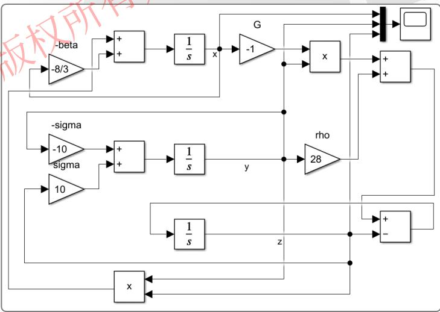

#一阶显示微分方程组——洛伦兹方程

function Lorenz(du, u, p, t)
du[1] = 10.0 * (u[2] - u[1])
du[2] = u[1] * (28.0 - u[3]) - u[2]
du[3] = u[1] * u[2] - (8 / 3) * u[3]

end
u0 = [10, 0, 0]
tspan = (0, 100)
prob = ODEProblem(Lorenz, u0, tspan)
sol = solve(prob, DP5(), saveat = 0.1)
plot3(sol[1, :], sol[2, :], sol[3, :])

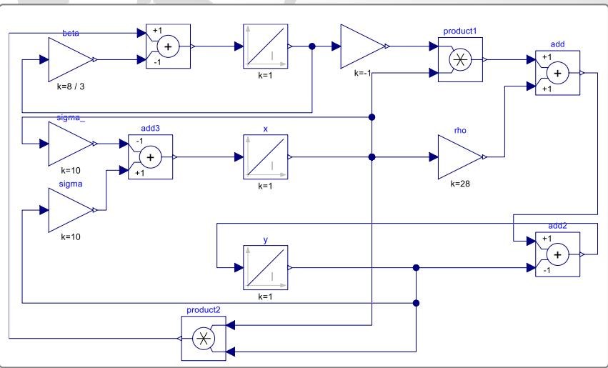

# 3.2系统建模对比-因果建模VS非因果建模

# 方程的形式描述模型行为

Lorenz方程的求解，其中 $\sigma = 1 0 , \rho = 2 8 , \beta = 8 / 3$ ，且初值为： $x _ { 0 } = 1 , y _ { 0 } = z _ { 0 } = 0$

$$
\left\{ \begin{array}{l} \frac {d x}{d t} = \sigma (y - x) \\ \frac {d y}{d t} = x (\rho - z) - y \\ \frac {d z}{d t} = x y - \beta z \end{array} \right.
$$

model Lorenz

$$
\begin{array}{l} \text { parameter   Real   sigma } = 1 0; \\ \text { parameter   Real   rho } = 2 8; \\ \text { parameter   Real   beta } = 8 / 3; \\ \text { Real } x (\text { start } = 1. 0); \\ \text { Real } y (\text { start } = 0. 0); \\ \text { Real } z (\text { start } = 0. 0); \\ \end{array}
$$

equation

$$
\begin{array}{l} \operatorname{der} (x) = \text { sigma } * (y - x); \\ \operatorname{der} (y) = x * (\text { rho } - z) - y; \\ \operatorname{der} (z) = x ^ {*} y - \text { beta } ^ {*} z; \\ \end{array}
$$

en

定义模型名称: model+模型名称+ “备注”

• 声明模型参数
• 声明模型变量
• 声明继承或被调用的模型 （如接口）

• 通过方程或算法， 描述模型行为

结束模型定义: end+模型名称；

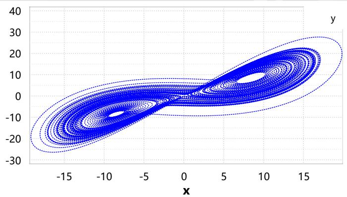

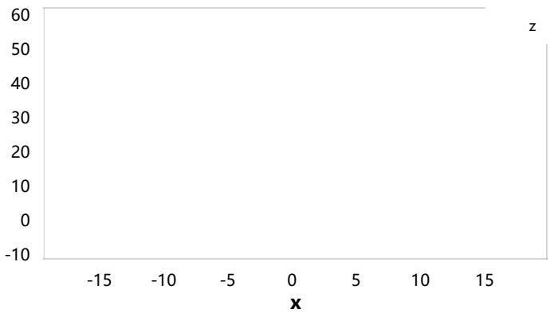

以方程的形式描述模型行为，不需要考虑计算步骤和赋值关系，可极大增加建模效率

# 3.2系统建模对比-因果建模VS非因果建模

问题2：因果建模和非因果建模方式如何构建模型？
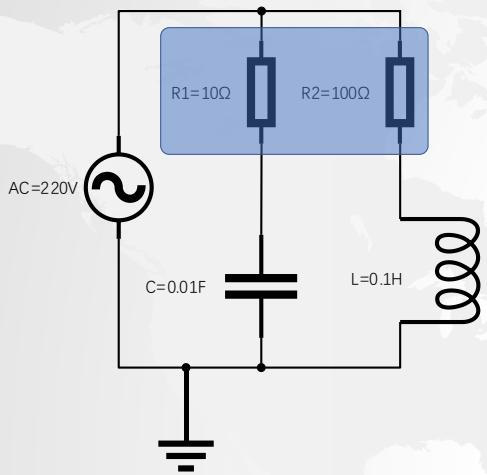

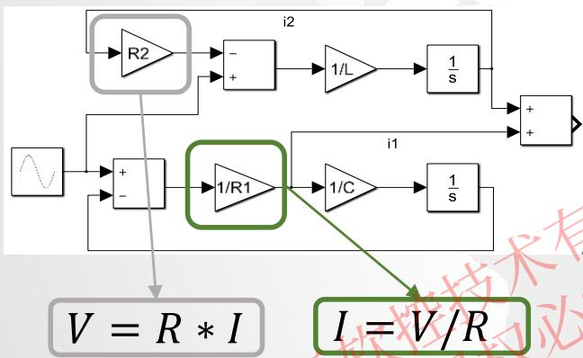
因果建模：根据模型的求解和编程实现的过 程建模

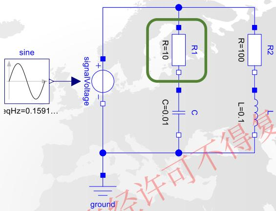

欧姆定律：

$$
V = R * I \text {或} I = V / R
$$

非因果建模：

Modelica语言可以根据机理方程直接构建等式，无需推导因果关系。 C

model Resistance1 "电阻"

annotation ();

parameter Modelica.SIunits.Resistance R = 10 "电阻值";

Modelica.SIunits.Voltage v "电阻两端电压";

Modelica.SIunits.Current i "电阻两端电流";

Interfaces.PositivePin positivePin "正极" annotation (…);

Interfaces.NegativePin negativePin "负极" annotation (…);

equation

v = positivePin.v - negativePin.v; //电阻两端电压

i = positivePin.i; //流过电阻电流

-i = negativePin.i;

v = R \* i; //欧姆定律

end Resistance;

model Resistance2 "电阻"

annotation ();

parameter Modelica.SIunits.Resistance R = 10 "电阻值";

Modelica.SIunits.Voltage v "电阻两端电压";

Modelica.SIunits.Current i "电阻两端电流";

Interfaces.PositivePin positivePin "正极" annotation (…);

Interfaces.NegativePin negativePin "负极" annotation (…);

equation

i = v / R; //欧姆定律

v = positivePin.v – negativePin.v; //电阻两端电压

i = positivePin.i; //流过电阻电流

-i = negativePin.i;

end Resistance2;

# 完全等价

# 3.2系统建模对比-因果建模VS非因果建模

# 因果建模VS非因果建模

基于数学公式建模，不必关心求解与编程细节

Modelica建模仿真工具能够决定如何自动求解方程变量，无需手工处理。工程师集中精力于建立对象的数学模型，不必关心模型的求解和编程实现的过程，大大提高建模的效率以及模型的可重用性。

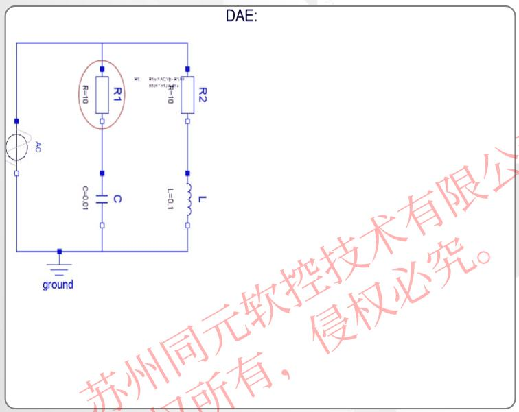

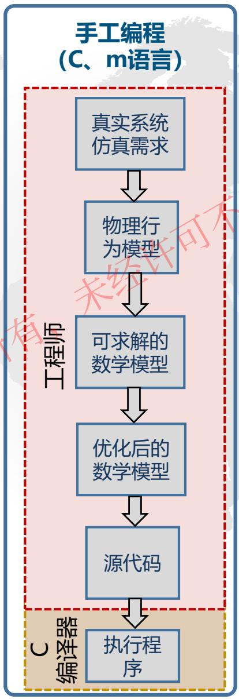

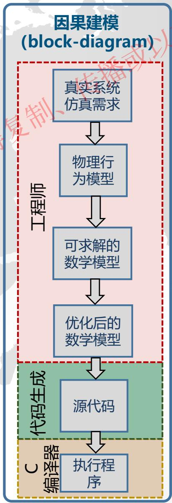

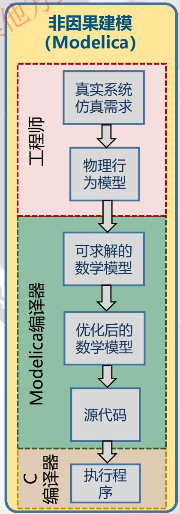

# 3.2系统建模对比-因果建模VS非因果建模

非因果是否意味着：已知模型输出，可以反求其输入？

传统动态逆模型： $\xrightarrow { u } \overline { { G ( t ) } } \xrightarrow { y }$ $\sharp \sharp \sharp \ G ^ { - 1 } \left( t \right)$ $\xrightarrow { \boldsymbol { y } } \overline { { \boldsymbol { G } ^ { - 1 } ( t ) } } \overline { { \boldsymbol { \left. \mu \right. } } }$

Modelica实现动态逆模型： $\begin{array} { r l } { u } &  { } \boxed { G ( t ) } \quad \begin{array} { l l } { y } \\ { \qquad } \end{array} \end{array}$

# 3.2系统建模对比-因果建模VS非因果建模

基于非因果建模的动态逆
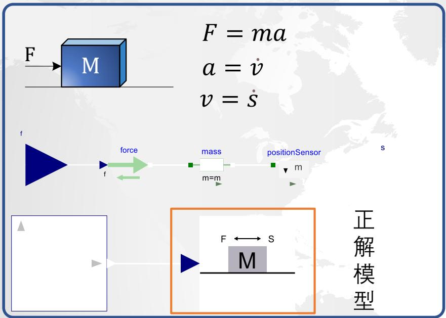
如何基于以上模型，已知S求解F？


逆模块

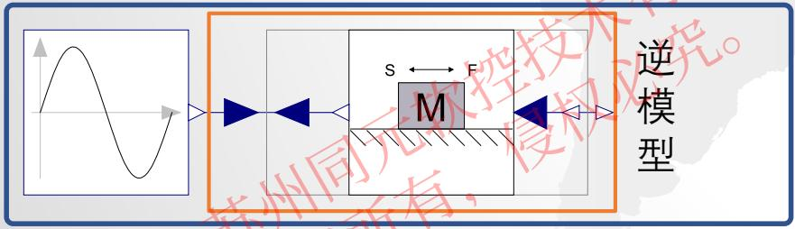

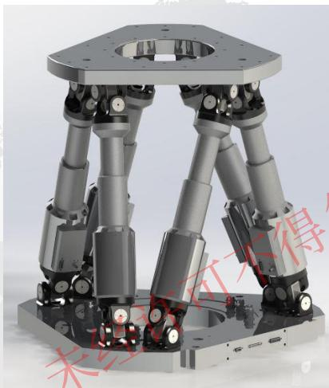

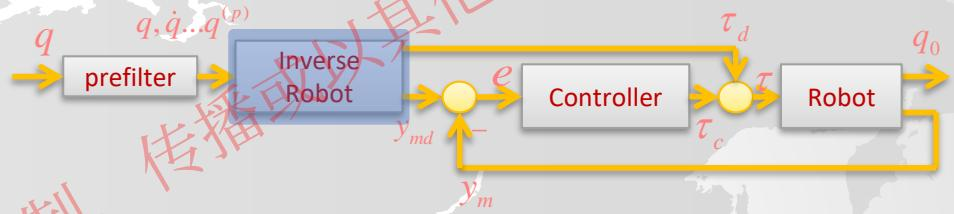
动态逆模型表现为高阶DAE方程，手工推导十分繁杂，利用Modelica非因果建模的方式则非常容易求解。

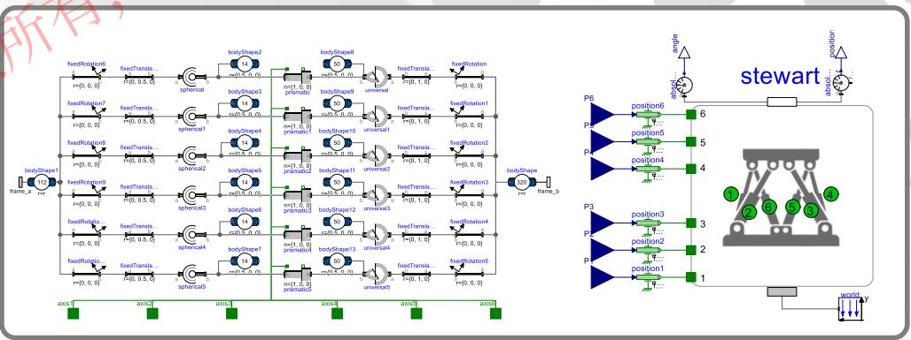
1. 根据物理拓扑关系形成正解模型

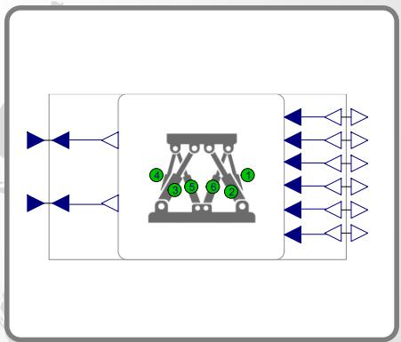
2. 使用逆模块封装

# 3.2 系统建模对比-面向函数与面向对象

问题3：如何根据物理现象构建系统模型？

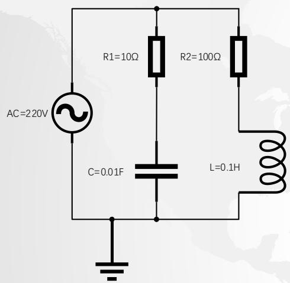

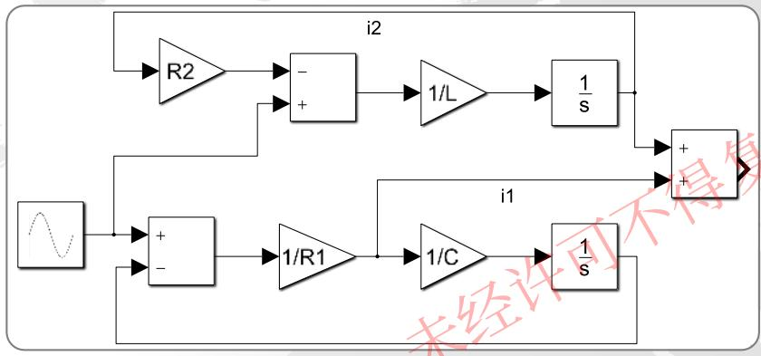

• 确定系统的输入与输出信号
• 建立方程组
• 将输入带入输出，推导输入输出函数
• 根据输入输出函数，拖放并连接组件

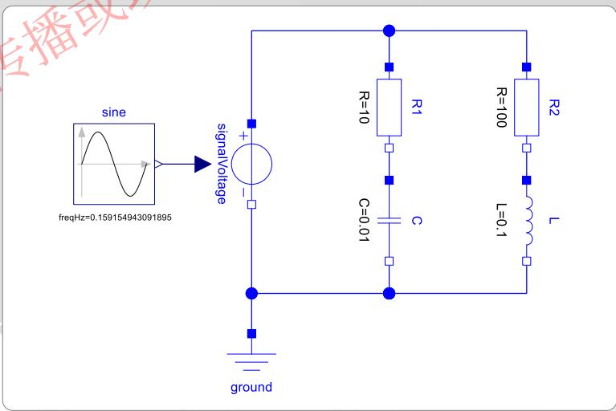

根据物理拓扑关系，拖放并连接组件

# 3.2 系统建模对比-面向函数与面向对象

问题4：系统架构不变的情况下，如何调整某些组件的型号？

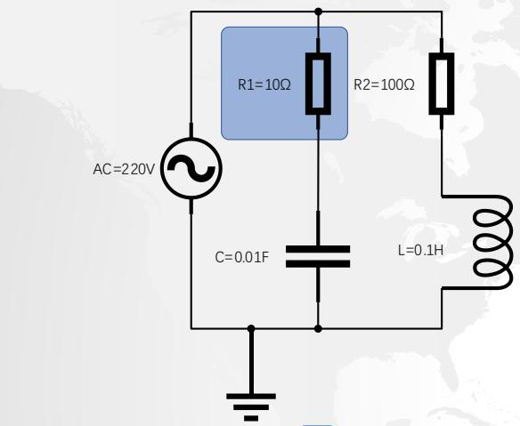

电阻改为电感


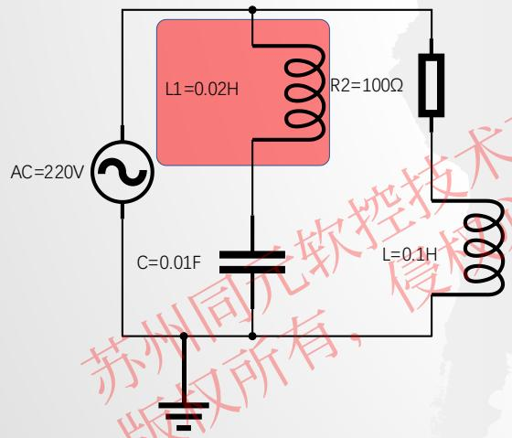

1. 确定系统的输入与输出信号
2. 建立方程组
3. 将输入带入输出，推导输入输出函数
4. 根据输入输出函数，拖放并连接组件

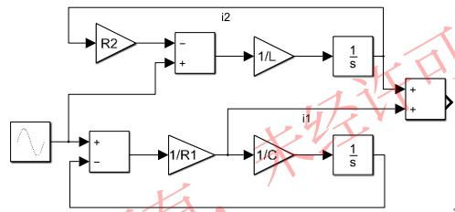

$$
\begin{array}{l} u (t) = R _ {1} i _ {1} (t) + \frac {1}{C} \int_ {d i _ {2} (t)} i _ {1} (t) d t \\ u (t) = R _ {2} i _ {2} (t) + L \frac {d t}{d t} \\ i (t) = i _ {1} (t) + i _ {2} (t) \\ \end{array}
$$

$$
\begin{array}{l} i _ {1} (t) = \frac {1}{R _ {1}} \left(u (t) - \frac {1}{C} \int i _ {1} (t) d t\right) \\ \int u (t) - R _ {2} i _ {2} (t) \end{array}
$$

$$
i _ {2} (t) = \int \frac {u (t) - R _ {2} i _ {2} (t)}{L} d t
$$

1. 根据物理拓扑关系，拖放并连接组件

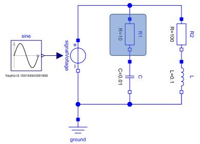

确定系统的输入与输出信号
6. 重新建立方程组
7. 将输入带入输出，推导输出函数
8. 根据输入输出函数，拖放并连接组件

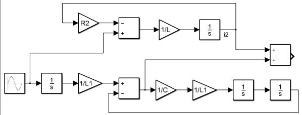

$$
u (t) = L _ {1} \frac {d i _ {1} (t)}{d t} + \frac {1}{C} \int i _ {1} (t) d t
$$

$$
u (t) = R _ {2} i _ {2} (t) + L \frac {d i _ {2} (t)}{d t}
$$

$$
i (t) = i _ {1} (t) + i _ {2} (t)
$$

$$
i _ {1} (t) = \frac {1}{L _ {1}} \int u d t - \frac {1}{C L _ {1}} \iint i _ {1} (t) d t
$$

$$
i _ {2} (t) = \int \frac {u (t) - R _ {2} i _ {2} (t)}{L} d t
$$

2. 替换组件类

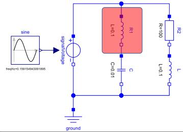


# 3.2 系统建模对比-面向函数与面向对象

面向函数VS面向对象
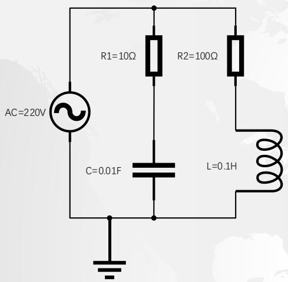

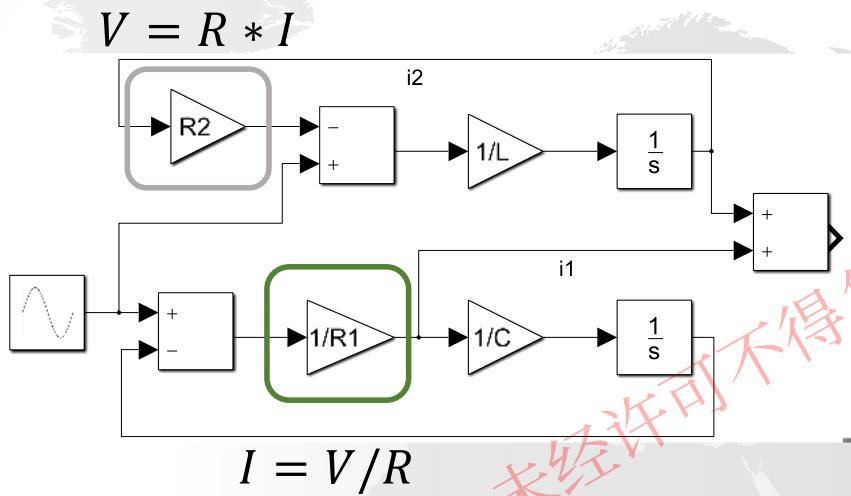

# 面向函数-事务：

分析解决问题的步骤，使用框图实现每个步骤的事务

# 优点：

步骤清楚，便于调试分析；

# 缺点：

需要深入推导，耗费精力大；
• 重用性低；
• 扩展能力差；

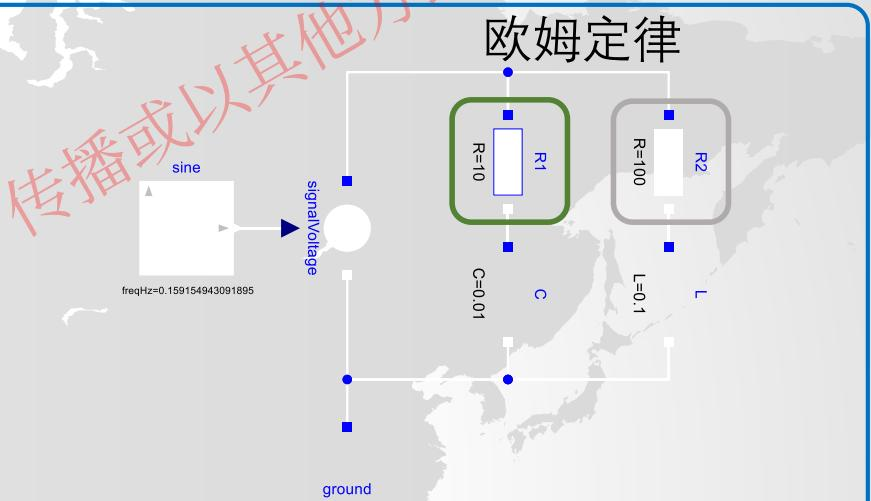

# 面向对象-事物：

将事物分解为若干个组成，根据特点描述事物的行为

# 优点：

具有封装、继承、多态的特性；
易重用；
易扩展；

# 缺点：

不易于调试；

# 3.2 系统建模对比-面向函数与面向对象

# 基于面向对象的模型演进

考虑系统在不同阶段对同一系统粒度需求的差异性，结合Modelica语言面向对象的特征，在架构接口保持不变的情况下，可以通过重声明机制实现对模型的演进，以适用于不同阶段的仿真需求。

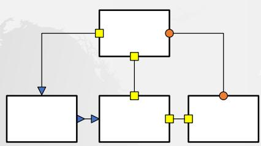
系统架构


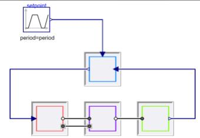

# 架构接口基类模型

Partial Model BaseArchitecture

replaceable Interfaces.PlantModel plant;

replaceable Interfaces.ControlSystem controller;

replaceable Interfaces.Sensor sensor;

replaceable Interfaces.Actuator actuator;

Modelica多领域仿真模型库


基于Modelica重声明机制的模型演进

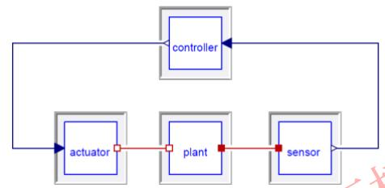

# 实例化并重声明的仿真模型

Model BaseSystem

extends BaseArchitecture(

redeclare replaceable Implementations.BasicPlant plant,

redeclare replaceable Implementations.BasicController controller,

redeclare replaceable Implementations.IdealSensor sensor,

redeclare replaceable Implementations.IdealActuator actuator);

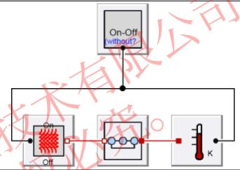

# 重声明替换实现模型演进

Model BaseSystemI

extends BaseArchitecture(

redeclare replaceable Implementations.Plant plant(C=2, G=1, h=2),

redeclare replaceable Implementations.OnOffController controller(setpoint=300),

redeclare replaceable Implementations.TempSensor sensor，

redeclare replaceable Implementations.Actuator actuator);

动态仿真
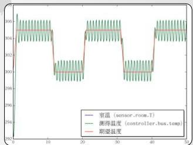

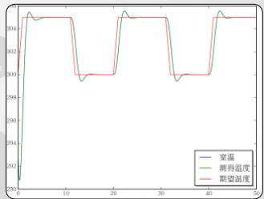

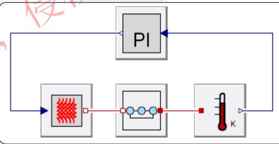

# 根据场景、需求，模型粒度的进一步细化

Model BaseSystemII

extends BaseArchitecture(

redeclare replaceable Implementations.Plant plant(C=2, G=1, h=2),

redeclare replaceable Implementations.PIController controller(setpoint=300，T=1，k=200),

redeclare replaceable Implementations.TempSensor sensor，

redeclare replaceable Implementations.Actuator actuator);

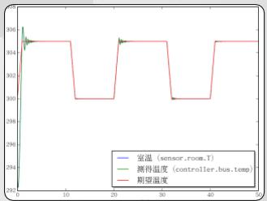

# 3.2 系统建模对比-信号建模与物理建模

问题5：查看组件的参数，结果有何异同？
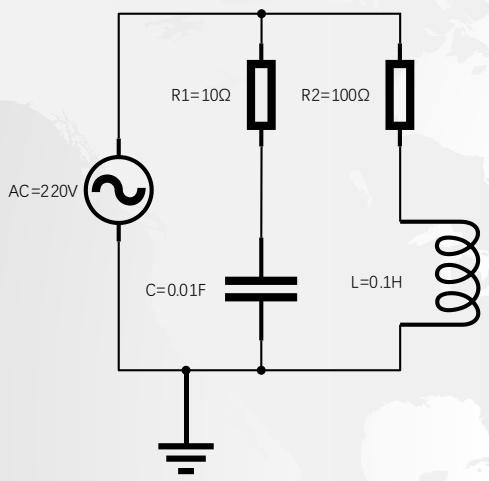

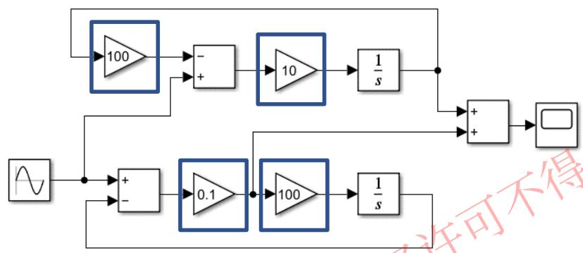

100: R2
0.1: 1/R1
100: 1/C
• 10: 1/L

均为无量纲数值，无实际物理意义

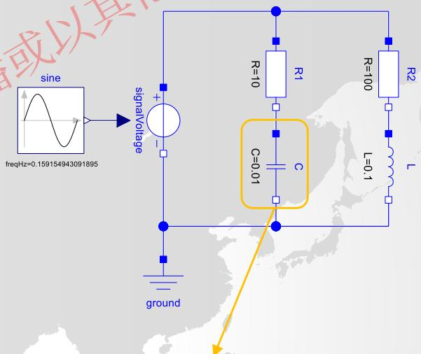

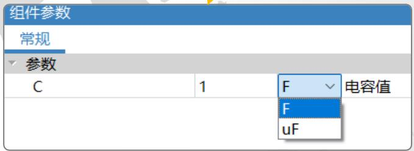

每一个数值都有物理量纲，均具有物理含义，可自动进行单位换算。

# 3.2 系统建模对比-信号建模与物理建模

信号建模VS物理建模
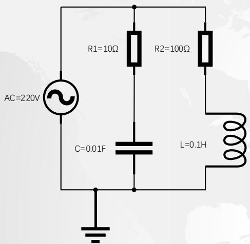

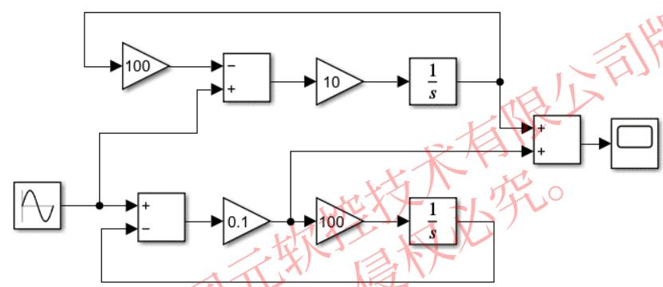
只是数值，无实际物理意义

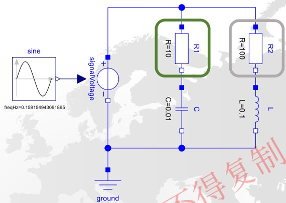
Modelica标准库中已根据ISO 31-1992国际标准单位制，声明了450个左右的物理量类型，可声明变量的物理量纲

model Resistance1 "电阻"

annotation ();

parameter Modelica.SIunits.Resistance R = 10 "电阻值";

Modelica.SIunits.Voltage v "电阻两端电压";

Modelica.SIunits.Current i "电阻两端电流";

Interfaces.PositivePin positivePin "正极" annotation (…);

Interfaces.NegativePin negativePin "负极" annotation (…);

# equation

v = positivePin.v - negativePin.v; //电阻两端电压

i = positivePin.i; //流过电阻电流

-i = negativePin.i;

v = R \* i; //欧姆定律

end Resistance;

model Resistance1 "电阻"

annotation ();

parameter Modelica.SIunits.Resistance R = 10 "电阻值";

Modelica.SIunits. Voltage v "电阻两端电压";

Modelica.SIunits.Current i "电阻两端电流";

Interfaces.PositivePin positivePin "正极" annotation (…);

Interfaces.NegativePin negativePin "负极" annotation (…);

# equation

v = positivePin.v - negativePin.v; //电阻两端电压

i = positivePin.i; //流过电阻电流

-i = negativePin.i;

v = R / i; //欧姆定律

end Resistance;

---检查模型: ModelicaGrammar.RLC.BasicModel.Resistance ----

正在解析模型...

正在实例化模型...

警告(5002)：方程v=positivePin.v-negativePin.v的单位不匹配：v的单位为m/s,

positivePin.v-negativePin.v的单位为V.

警告(5002)：方程v=R/i的单位不匹配：

v的单位为m/s,

R/i的单位为Ohm/A.

Modelica 还规定了复杂数学表达式单位计算的规则。以便检测模型中单位属性的错误或不一致。这对模型开发者来说是一个巨大的优势！

# 3.2 系统建模对比-接口机制

问题6：如何查看R1仿真结果信息？
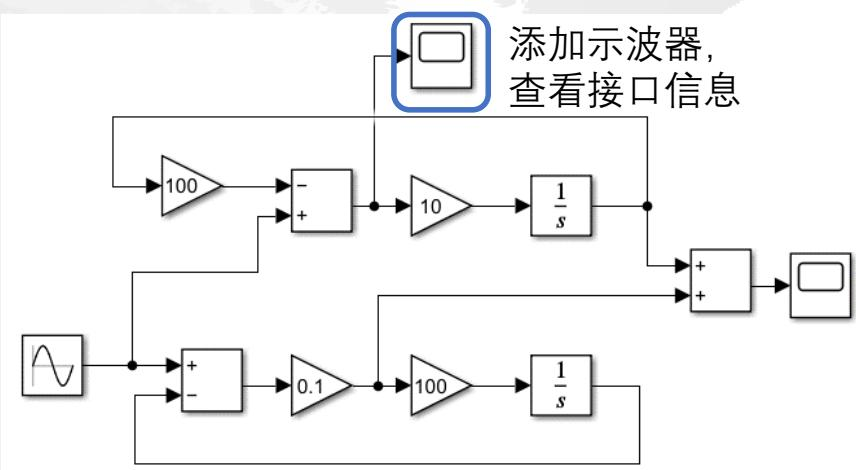

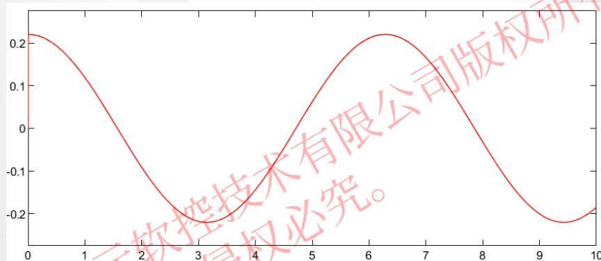
接口中仅传递是数值信号，因此称为信号流连接器。

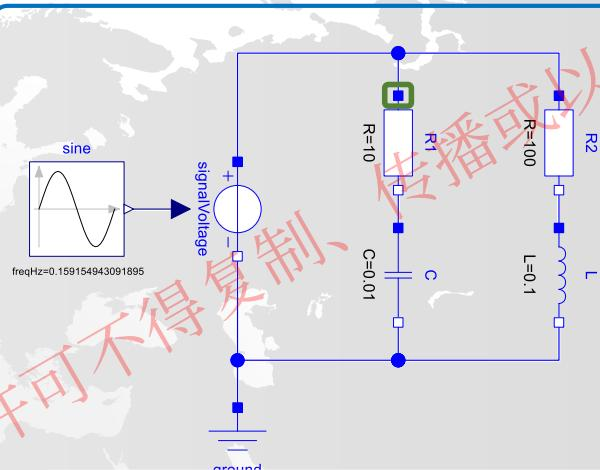

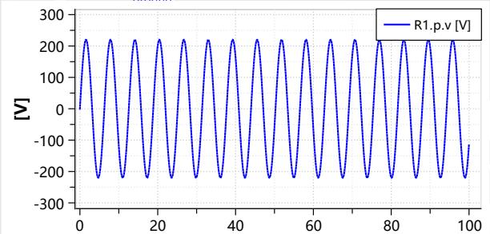

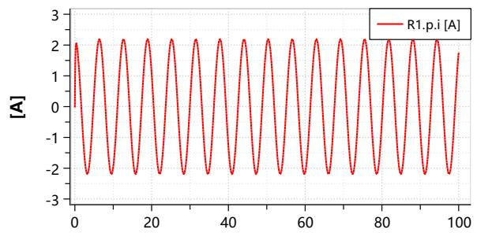

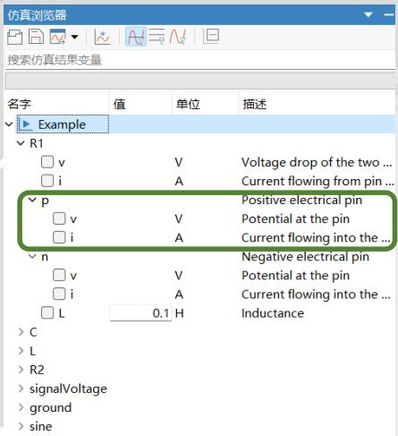
系统中任意组件中的所有变量均可查看结果
根据接口信息，电阻接口中传递是能量，因此称为能量流连接器。

# 3.2 系统建模对比-接口机制

信号流连接器VS能量流连接器
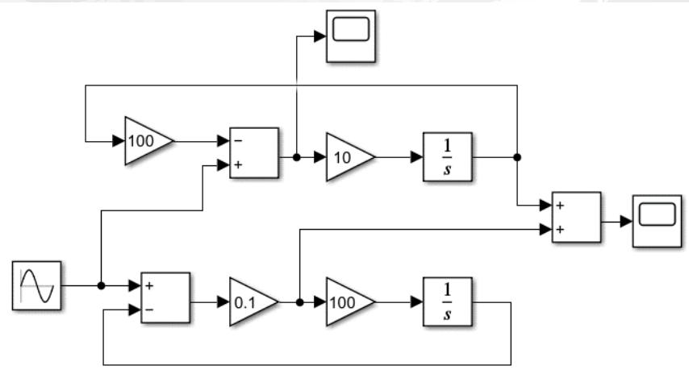

# 信号流连接器：

• 传递数值信号；
• 有固定流向，输出接口→输入接口；
• 输出值→ 输入值；

能量流连接器更符合物理实际，无需对子系统进行强行解耦，极大减少工作量。

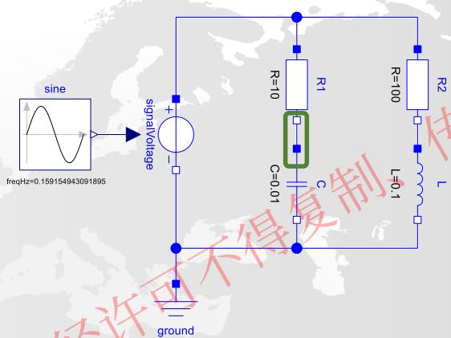

# 能量流连接器：

传递能量(根据广义基尔霍夫定律分解为势变量和流变量)；
无固定流向，根据边界条件和物理原理判定；
• 节点势变量相等，流变量和为零；

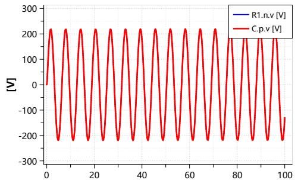

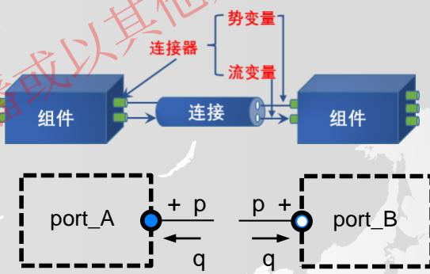

<table><tr><td>领域</td><td colspan="2">势变量</td><td colspan="2">流变量</td></tr><tr><td>平移机械</td><td>s</td><td>位移</td><td>f</td><td>力</td></tr><tr><td>转动机械</td><td>φ</td><td>角度</td><td>τ</td><td>转矩</td></tr><tr><td>电子</td><td>v</td><td>电压</td><td>i</td><td>电流</td></tr><tr><td>液压</td><td>p</td><td>压力</td><td> $\dot{V}$ </td><td>流速</td></tr><tr><td>热力学</td><td>T</td><td>温度</td><td> $\dot{Q}$ </td><td>熵流</td></tr><tr><td>化学</td><td>μ</td><td>化学势</td><td> $\dot{N}$ </td><td>粒子流</td></tr></table>

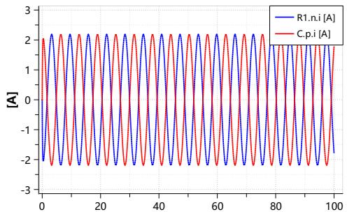

# 3.2 系统建模对比-接口机制

# 基于能量流连接器的多领域统一建模

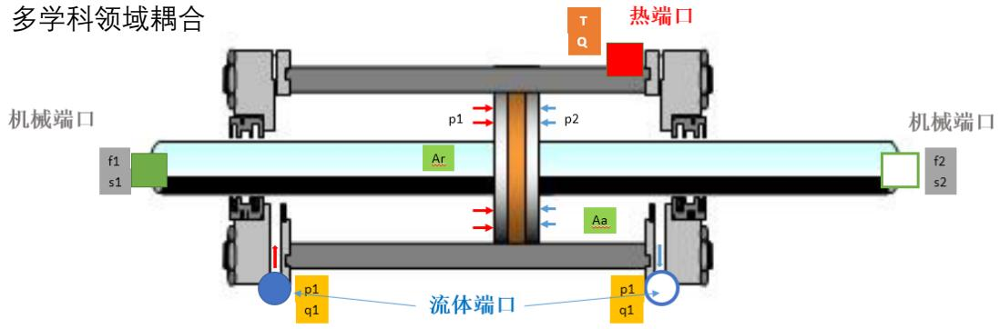

<table><tr><td colspan="2">基本定理</td><td>理论方程</td></tr><tr><td>力接口</td><td>力平衡方程</td><td> $m\ddot{s} = Aa \times (p1 - p2) + (f1 - f2)$ </td></tr><tr><td>液压接口</td><td>压差流量方程</td><td> $q1 = Cq \times A \times \sqrt{2(p1 - p2)/\rho}$ </td></tr><tr><td>热接口</td><td>热力学方程</td><td> $fo \times s + c \times \dot{s} = Q(T) + \Delta U$ </td></tr></table>

基于物理原理方程构建的领域转换器可用于不同领域间的能量转换

# 1. 根据广义基尔霍夫原理构建不同领域接口

connector Port\_A

Modelica.SIunits.Pressure p;

flow Modelica.SIunits.VolumeFlowRate q; end Port\_A;

connector Port\_B

Modelica.SIunits.Pressure p;

flow Modelica.SIunits.VolumeFlowRate q; end Port\_B;


connector Flange\_A

Modelica.SIunits.Position s;

flow Modelica.SIunits.Force f;

end Flange\_A;

connector Flange\_B

Modelica.SIunits.Position s;

flow Modelica.SIunits.Force f;

end Flange\_B;

flange\_a


flange\_b

# 2. 实例化接口，定义参数和变量，根据机理方程描述模型行为，绘制图标

model Cylinder "液压缸"

parameter Modelica.SIunits.Mass m = 1"活塞质量";

parameter Real Cq = 0.75"流量系数";

Modelica.SIunits.Area A"活塞面积";

Modelica.SIunits.Density rho"密度";

Interfaces.Port\_a port\_a annotation (…);

Interfaces.Port\_b port\_b annotation (…);

equation

//力平衡方程

$\textsf { m } ^ { * } \textsf { a } = \textsf { A } ^ { * } \textsf { a } ^ { * } \left( \mathsf { p } 1 - \mathsf { p } 2 \right) + ( \mathsf { f } 1 - \mathsf { f } 2 ) ;$

a = der(v);

v = der(s);

//压差流量方程

$\mathsf { q } 1 = \mathsf { C q } ^ { \ast } \mathsf { A } ^ { \ast } \mathsf { s q r t } ( 2 ^ { \ast } \left( \mathsf { p } 1 - \mathsf { p } 2 \right) / \mathsf { r h o } ) ;$

//热力学方程

f0 \* s + c \* der(s) = Q(T) + deltaU;

end Cylinder;

# 3. 根据物理拓扑关系构建多领域系统模型

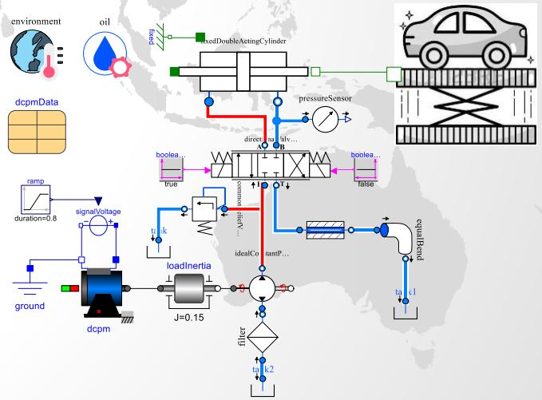

# 3.2 系统建模对比-模型封装与集成

问题6：当模型库中的组件不满足需求时，如何解决？

<table><tr><td>Simulink</td><td>Sysplorer</td></tr><tr><td rowspan="2">框图式模块封装</td><td>元件级(框图和物理模型)模块封装</td></tr><tr><td>根据机理方程直接构建</td></tr><tr><td>S-Function封装</td><td>C/C++封装</td></tr><tr><td>M脚本封装</td><td>Julia脚本封装</td></tr><tr><td>FMU模型封装</td><td>FMU模型封装</td></tr></table>

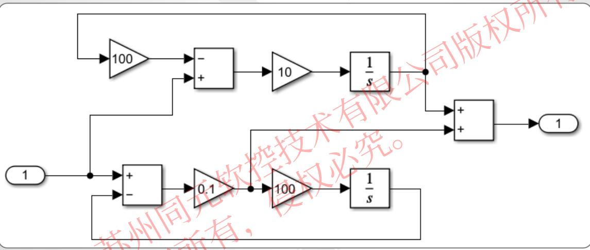

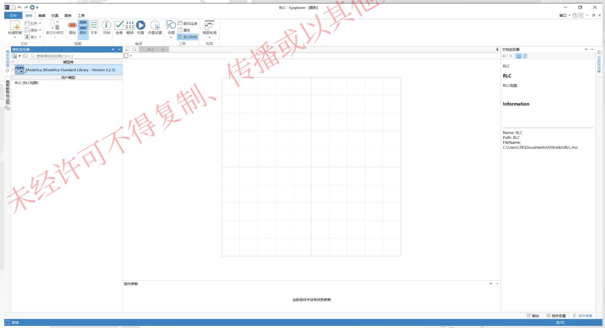
可基于物理拓扑直接封装

# 3.2 系统建模对比-模型封装与集成

# 外部模型集成

#  数据融合

⚫ From/To Workspace

#  接口融合

⚫ Sysplorer API
⚫ Syslab Function

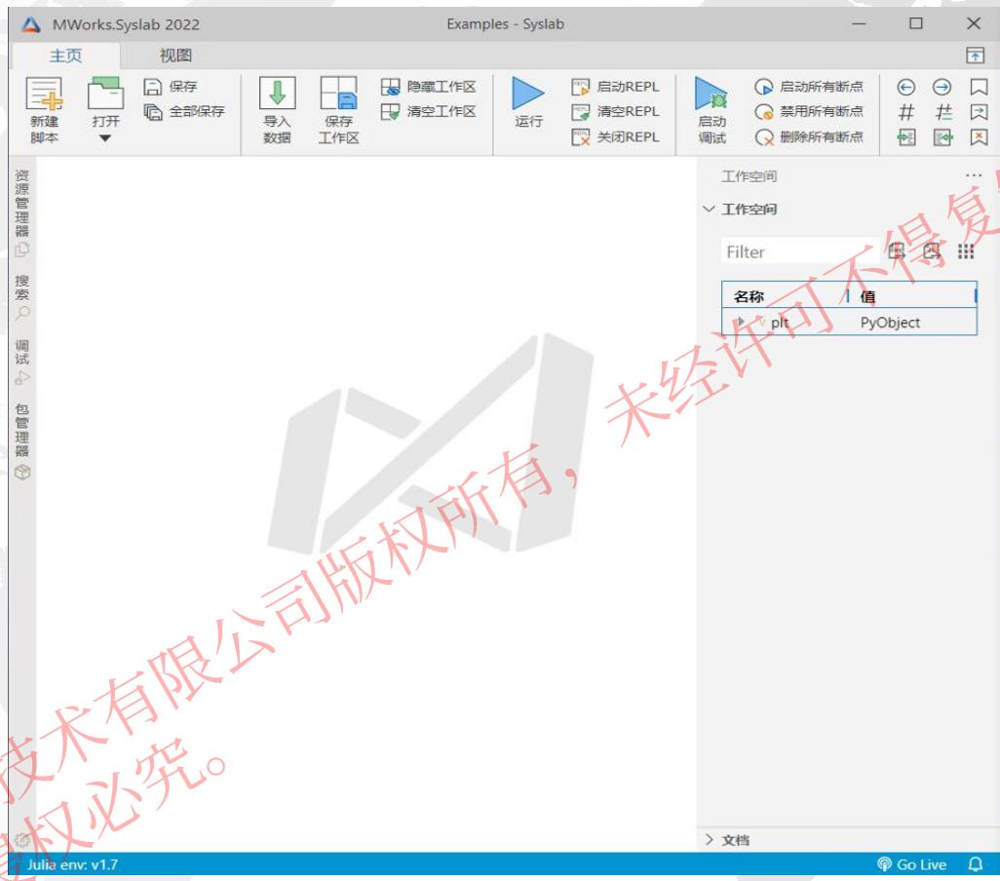

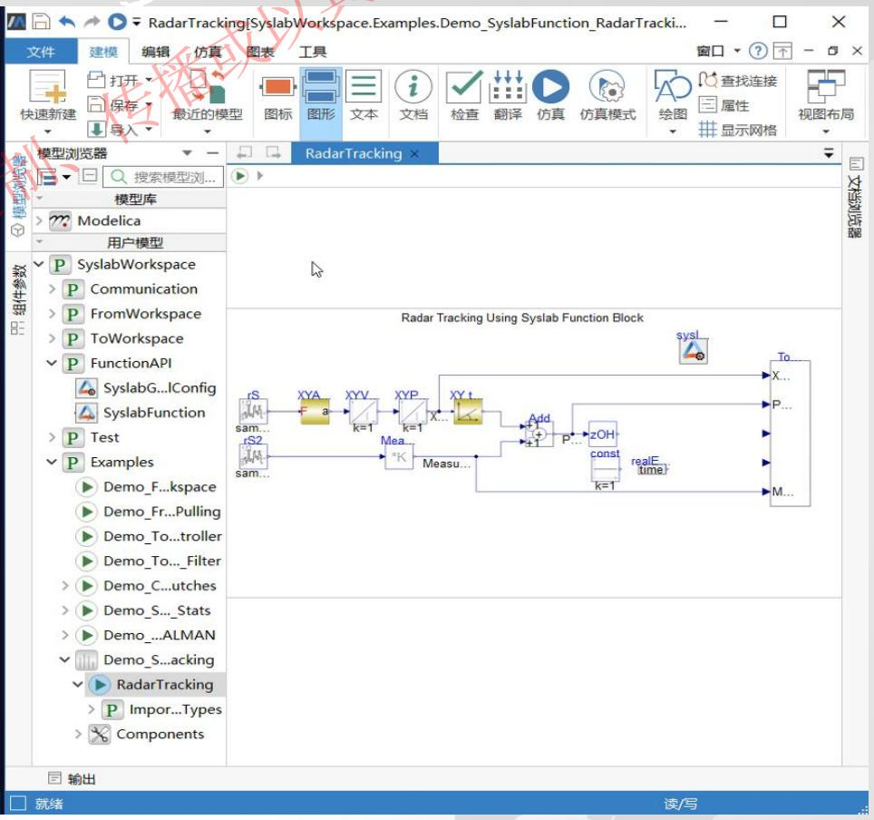

# 3.2 系统建模对比-模型封装与集成

外部模型集成
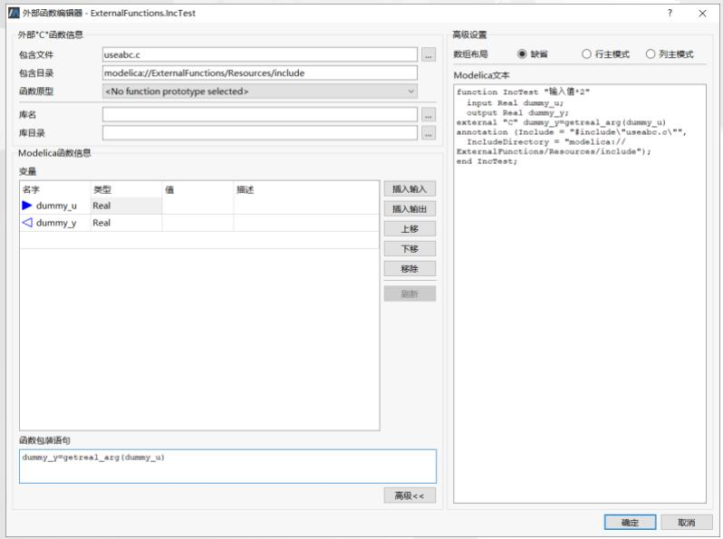

```txt
function IncTest "输入值*2"
    input Real dummy_u;
    output Real dummy_y;
external "C" dummy_y = getreal_arg(dummy_u)
annotation (Include = "#include\"useabc.c\"",
    IncludeDirectory = "modelica://ExternalFunctions/Resources/include");
end IncTest;
```

模型中除了可以调用使用Modelica 语言编写的函数外，还可以调用C 、C++ 和FORTRAN77 编写的函数。

三种方式：1. 调用c或h文件 2.直接集成C源码 3.调用动态链接库文件dll

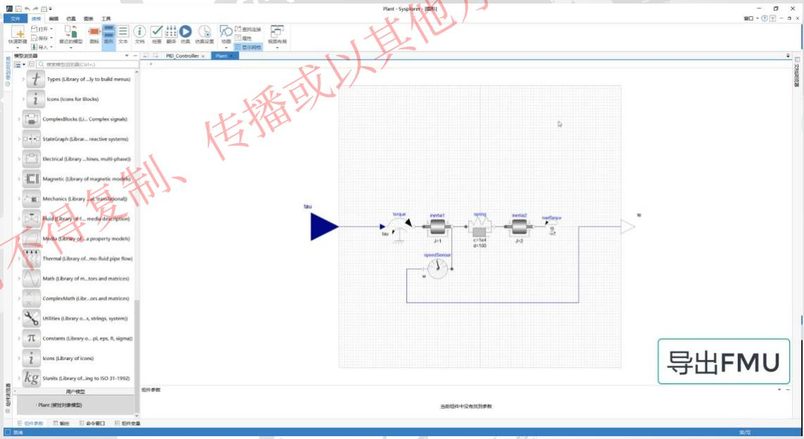

<table><tr><td colspan="3"></td><td colspan="3">FMU Export</td><td colspan="3">FMU Import</td></tr><tr><td>Name</td><td>License</td><td>Platforms</td><td colspan="2">Co-Simulation</td><td>Model Exchange</td><td colspan="2">Co-Simulation</td><td>Model Exchange</td></tr><tr><td>MWorks</td><td>$</td><td></td><td>1.0</td><td>2.0</td><td>1.0</td><td>2.0</td><td>1.0</td><td>2.0</td></tr></table>

同元MWORKS是中国唯一通过FMI官方测试认证的自主软件，列入FMI官网目录

# 功能差异性对比-总结

<table><tr><td rowspan="2">类别</td><td colspan="2">MATLAB</td><td colspan="2">MWORKS</td></tr><tr><td>功能</td><td>特点</td><td>功能</td><td>特点</td></tr><tr><td>科学计算</td><td>M语言</td><td>均科学计算语言,语法差异性不大</td><td>Julia语言</td><td>均科学计算语言,语法差异性不大</td></tr><tr><td rowspan="5">系统建模仿真</td><td>因果建模</td><td>基于求解和编程实现的过程建模,需推导因果关系</td><td>非因果建模</td><td>基于数学公式建模,无需推导因果关系,极大提高建模效率</td></tr><tr><td>面向函数</td><td>分析解决问题的步骤,使用框图实现每个步骤的事务</td><td>面向对象</td><td>将事物分解为若干个组成,根据特点描述事物的行为,极大提高模型重用性</td></tr><tr><td>信号建模</td><td>均为无量纲数值,无实际物理意义</td><td>物理建模</td><td>每一个数值都有物理量纲,均具有物理含义,并可进行单位计算</td></tr><tr><td>信号流接口</td><td>传递数值信号;有固定流向,输出接口→输入接口;输入值=输出值;</td><td>能量流接口</td><td>传递能量(根据广义基尔霍夫定律分解为势变量和流变量);无固定流向,根据边界条件和物理原理判定;节点势变量相等,流变量和为零;</td></tr><tr><td>模型封装与集成</td><td>框图式模块封装S-Function封装M脚本封装FMU模型封装</td><td>模型封装与集成</td><td>元件级(框图和物理模型)模块封装根据机理方程直接构建C/C++封装Julia脚本封装FMU模型导入</td></tr></table>

建立知识规范， 营造协同生态

积累工业模型， 发展可控平台

融入中国创新，打造先进软件

# 请各位专家指正！
