# MWORKS简介及与MATLAB的对比

- Source: `References/MWORKS高校星火计划资料包/MWORKS与MATLAB功能对照/02-MWORKS简介及与MATLAB的对比V2.0.pdf`
- Converted by: `MinerU precise API`
- Conversion date: `2026-05-09`
- Review status: `MinerU converted; spot check recommended`
- Priority: `P0`
- Source SHA1: `49e5d09f5c36`
- MinerU batch id: `aebaa0f1-c752-409e-aed3-a9414828e7c5`
- Images: `88`
- Notes: MWORKS 平台简介，以及从 MATLAB/Simulink 迁移到 Syslab/Sysplorer 的差异参考。

# MWORKS：新一代科学计算与系统建模仿真平台

# 信息物理系统建模仿真通用平台

（Syslab+Sysplorer）

# 各装备行业数字化工程支撑平台

（Sysbuilder+Sysplorer+Syslink）

# 开放、标准、先进的计算仿真云平台

（ Syslab+Sysplorer+MoHub）

航空

航天

车辆

通信

电子

能源

工程机械

高校

科研

Toolbox工具箱

# AI与数据科学

统计工具箱机器学习工具箱深度学习工具箱强化学习工具箱

# 信号与通信

基础信号处理DSP、基础通信小波工具箱雷达工具箱相控阵工具箱

# 控制系统

控制系统工具箱基于模型的控制器设计系统辨识工具箱鲁棒控制工具箱

# 设计优化

模型试验敏感度分析参数估计响应优化

# 半物理仿真

半物理仿真接口工具半物理仿真管理工具静态代码检查工具定点设计器

# 模型集成与联合仿真

模型降阶及联合仿真分布式联合仿真

# 机械多体

CAD工具箱3D视景工具箱

# 接口工具

FMI导入导出SysMLToModelicaMATLAB导入Simulink导入

# 基于标准的函数+模型+API拓展系统

需求导入

架构建模

Sysbuilder系统架构设计环境

逻辑仿真

分析评估

Func函数库

曲线拟合

符号数学

优化与全局优化

Syslab科学计算环境

编程

数学

图形

代码生成

Sysplorer系统建模仿真环境

物理建模

框图建模

状态机建模

Julia科学计算语言

并行计算

Modelica系统建模语言

Library 模型库

标准库

专业库

行业库

# Syslink

协同设计仿真环境

多人协同建模

模型技术状态管理

云端建模仿真

安全保密管理

# MWORKS.Syslab与MATLAB对比

Syslab是新一代科学计算环境，旨在为算法开发、数值计算、数据分析和可视化、信息域计算分析等提供通用编程开发环境。Syslab基于新一代高性能科学计算语言Julia，提供业内最为高效的数值计算能力，同时兼容Python和M语言，支持与Python、C/C++、Fortran、M等编程语言的相互调用 Svslab

<table><tr><td></td><td>MATLAB</td><td>Syslab</td><td>说明</td></tr><tr><td>通用编程与算法开发</td><td>MATLAB 支持使用M语言开展的编程和数值计算,支持数据分析、算法开发和建模。基础语言支持基本运算,例如创建变量、数组索引、算术运算和数据类型。</td><td>采用高级科学计算语言Julia并提供完备的交互式编程环境,支持算法的开发、调试与运行;同时兼容Python和M语言,支持Julia与Python、C/C++、Fortran、M等其他编程语言的相互调用</td><td>Syslab打造了M兼容工具:兼容M生态实现用户历史资产重用。针对M语言语法兼容度超97%,内置内置1260+个常用函数,涵盖基础、数学、图形、控制、信号处理等领域常用函数,无须安装MATLAB直接运行M代码</td></tr><tr><td>数据导入与分析</td><td>支持文本文件、电子表格、硬件、其他软件或Web等40余种格式文件的导入,并支持探查数据以判别趋势、检验假设和估计不确定性</td><td>支持MAT、CSV、TXT、EXCEL、HDF5、JSON、图片等15余种格式文件的导入,支持对数据进行预处理、数据分析、统计分析</td><td>/</td></tr><tr><td>数学</td><td>提供基础数学、符号数学、曲线拟合、优化、全局优化等合计超过1700个基础函数,为分析数据、开发算法和创建模型提供了一系列数值计算方法。核心函数使用经过处理器优化的库,可以快速进行向量和矩阵计算</td><td>内置基础数学、符号计算、曲线拟合、优化、全局优化等合计超过1500个数学函数,实现复杂科学与工程数学问题的简洁表达,通过Julia特别设计的编译运行机制提供高效计算能力</td><td>Julia语言机制天然支持高性能计算,Syslab数学库函数均已经过特别优化,部分函数相比于MATLAB函数运行效率高1~2个数量级</td></tr><tr><td>图形</td><td>图形函数包括二维和三维绘图函数,合计约300个函数。用于以可视化形式呈现数据和通信的结果。以交互方式或编程方式自定义绘图</td><td>图形函数包括二维、三维绘图函数,超过220个绘图函数,涵盖线图、数据分布图、极坐标图、等高线图、向量场、曲面、图像、地理图等。支持以交互方式或编程方式自定义绘图,也支持用户自定义的图形交互。通过运用标题、轴标签、数据提示添加注释、自定义绘图外观,可生成出版级质量的专业图形</td><td>/</td></tr><tr><td>外部语言接口</td><td>包括 Python、Java、C、C++、.NET 和 Web 服务</td><td>支持Python、C/C++、Fortran、M等其他编程语言的相互调用</td><td>/</td></tr></table>

Syslab软件功能、基础语言、数学等详细介绍与函数使用帮助可参见：Syslab官方帮助文档

Syslab
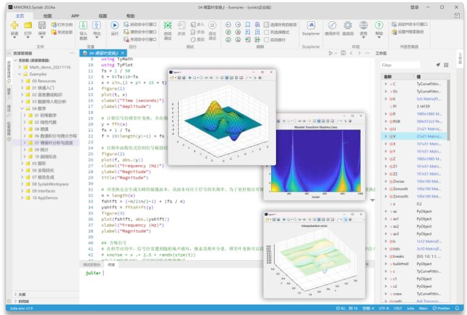

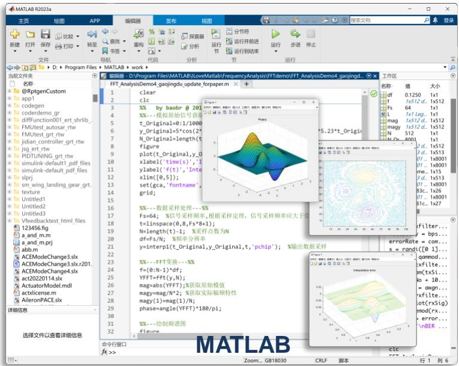

# MWORKS.Syslab与MATLAB对比

# MATLAB

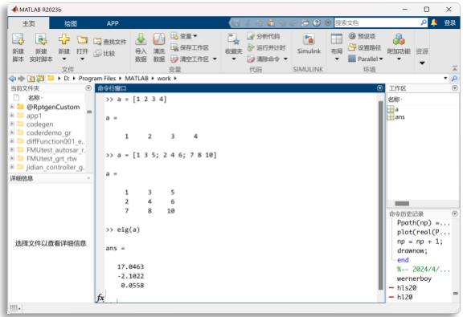

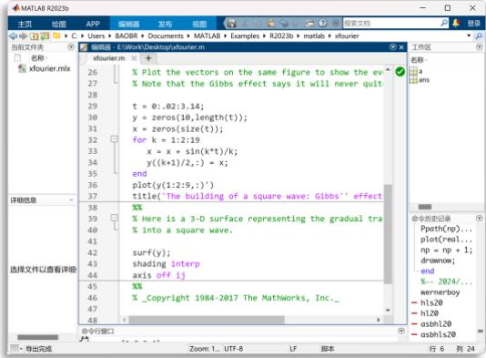

# 交互式编程与脚本

# Syslab

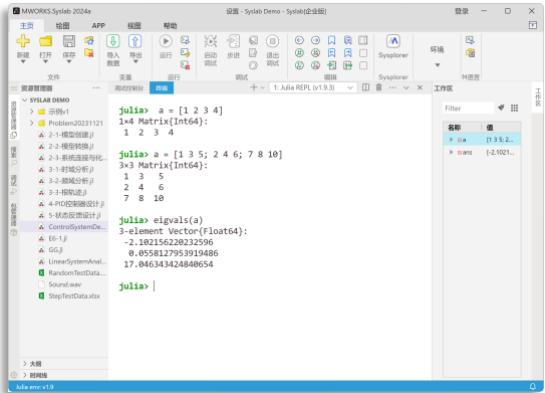

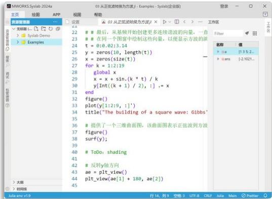

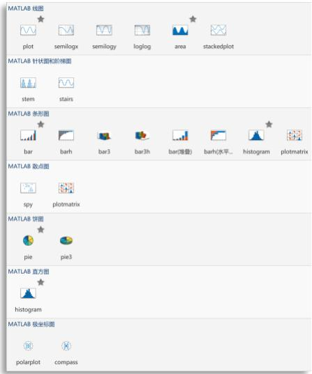

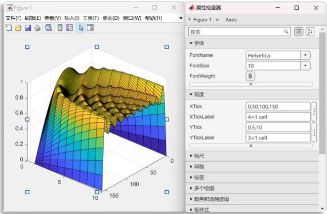

# 图形可视化

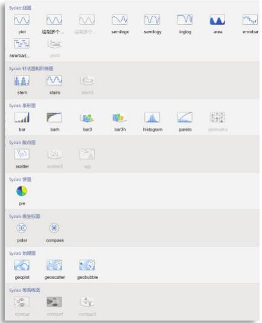

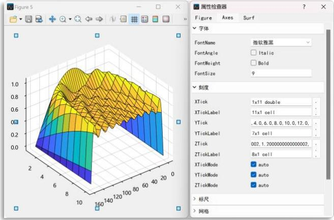

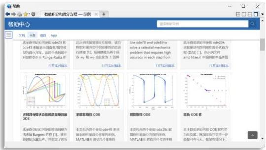

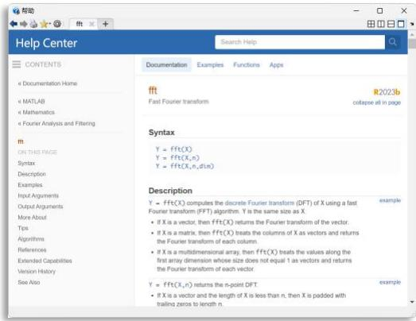

# 帮助系统

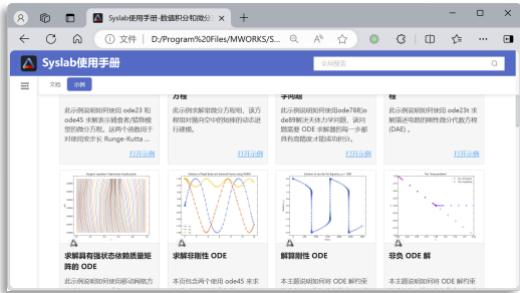

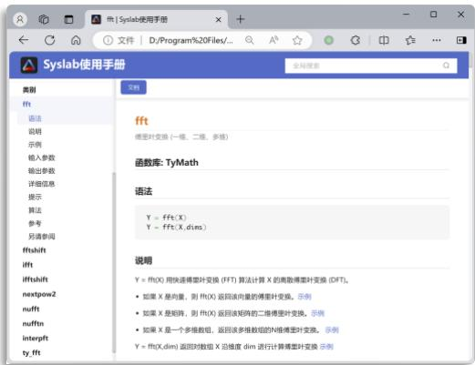

# MWORKS.Sysplorer与Simulink对比

Sysplorer是面向多领域工业产品的系统建模与仿真环境，全面支持多领域物理统一建模规范Modelica，提供物理/框图/状态机等多范式系统建模、编译分析、仿真求解、可视化后处理、模型驱动的代码生成与实时仿真等功能以及丰富的集成与扩展接口，支持用户开展产品多领域建模、虚拟集成验证、设计分析优化、虚实融合验证与运维服务支持

<table><tr><td></td><td>Simulink</td><td>Sysplorer</td><td>说明</td></tr><tr><td>动态系统建模</td><td>框图建模、多领域物理建模、状态机建模</td><td>多领域物理建模、框图建模、状态机建模</td><td>Sysplorer支持Modelica语言,在物理建模方面具备优势</td></tr><tr><td>模型库</td><td>内置63个模型库,包括基础库及专业库</td><td>内置28个模型库,包括基础库及专业库</td><td>Sysplorer提供的基础模型库与Simulink模型库可实现对标,同时社区提供400+开源模型库可复用</td></tr><tr><td>仿真求解</td><td>变步长、定步长求解算法合计19种</td><td>变步长、定步长求解算法合计22种,支持用户自定义求解算法</td><td>Sysplorer通过时钟同步机制,不仅支持多速率模型求解,同时支持不同时钟分区选择不同的求解算法</td></tr><tr><td>仿真后处理</td><td>支持变量曲线的显示、统计分析支持模型2D与3D动画,查看仿真过程</td><td>支持查看任意变量结果曲线,提供丰富的曲线交互功能支持模型2D与3D动画,直观查看仿真过程支持仿真实时推进、数据回放两种模式查看仿真过程</td><td>/</td></tr><tr><td>代码生成</td><td>支持多种环境的实时代码生成支持硬件设备代码生成,具备实时仿真能力支持控制器代码生成,并与硬件设备融合仿真</td><td>支持Windows、Linux、VxWorks等多种环境的实时代码生成支持硬件设备代码生成,具备实时仿真能力支持控制器代码生成,并与硬件设备融合仿真</td><td>/</td></tr><tr><td>扩展接口</td><td>支持C/C++/Python等语言混合编程或集成支持FMI 1.0 2.0 标准提供部分SDK</td><td>完整支持FMI 1.0 2.0 3.0 标准,支持基于FMI的系统联合仿真支持C/C++/Fortran/Python等外部语言集成提供SDK,支持外部应用集成、界面定制与功能扩展</td><td>/</td></tr><tr><td>应用领域</td><td>航空、航天、车辆、船舶、能源等领域</td><td>航空、航天、车辆、船舶、能源等领域</td><td>Sysplorer通过国内各行业重大型号工程持续10余年的应用锤炼</td></tr></table>

Sysplorer软件详细的功能与介绍可参见：Sysplorer官方帮助文档

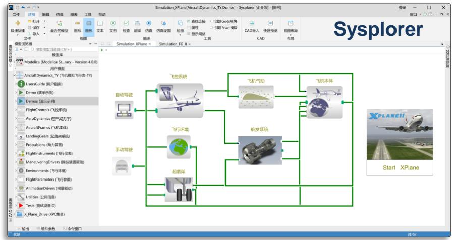

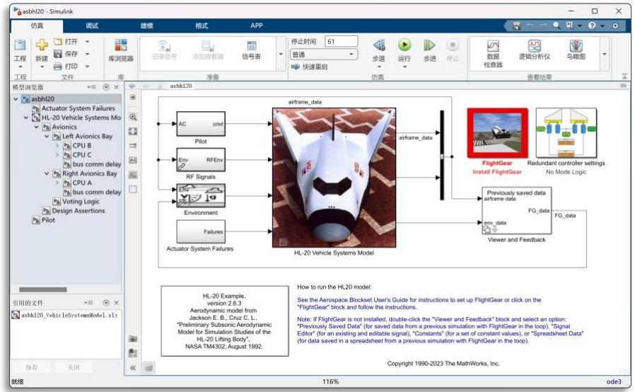

# MWORKS.Sysplorer与Simulink对比

# Simulink

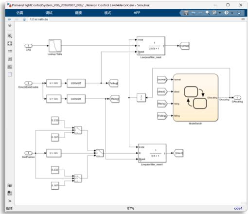

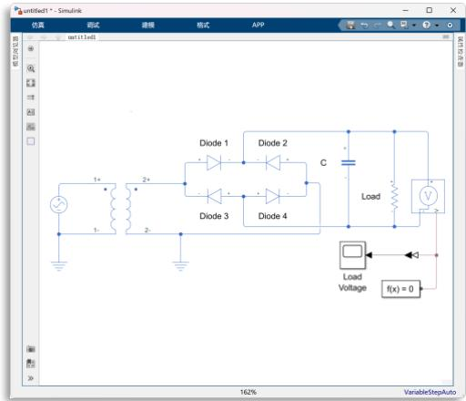
建模环境

Sysplorer
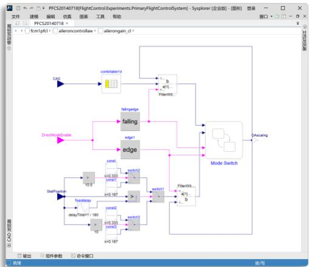

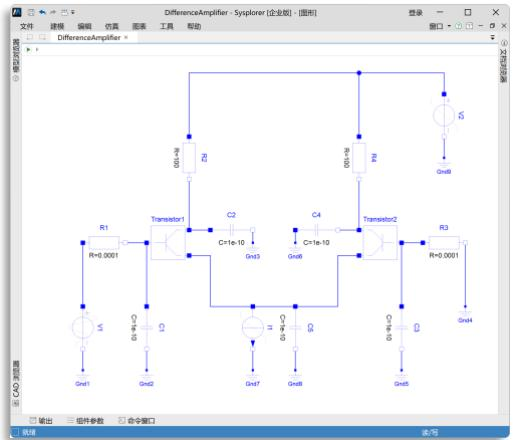

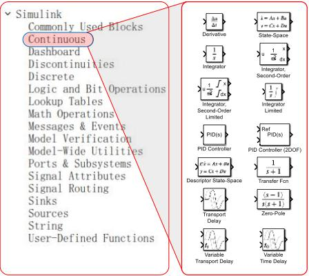

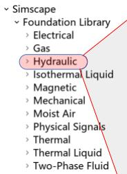

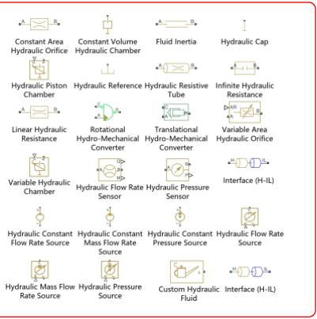
模型库

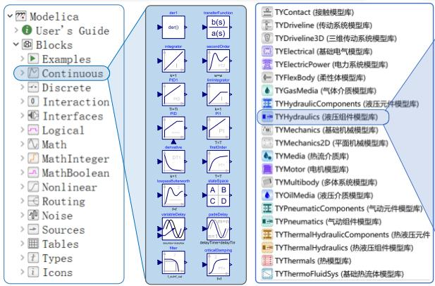

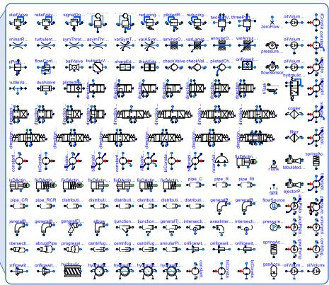

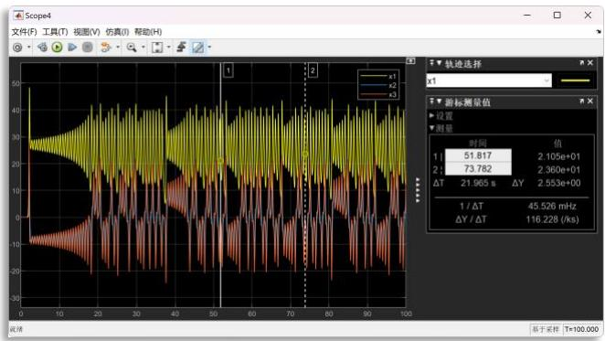

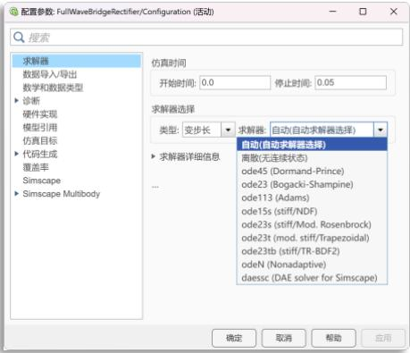
求解与后处理

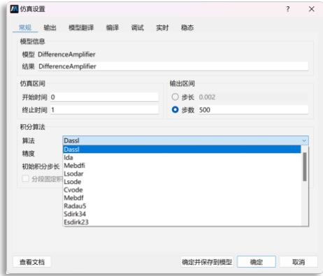

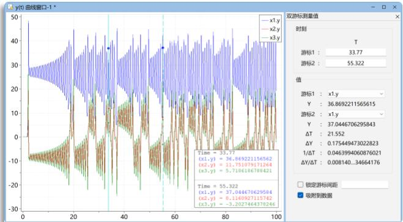

# MWORKS与MATLAB专业工具箱对比 - 信号与通信系列工具箱

信号与通信系列工具箱包括信号处理工具箱、DSP系统工具箱、小波工具箱、通信工具箱、相控阵工具箱、雷达工具箱6个。面向电子信息领域，为分析、设计和调节电子信息系统提供算法、模型和应用程序。覆盖信号处理、无线通信、雷达三大子领域，其中信号处理、DSP、小波作为通用领域工具箱，雷达、无线通信则作为专业领域工具箱用以支撑相关行业应用需求

<table><tr><td></td><td>MATLAB</td><td>MWORKS</td><td>说明</td></tr><tr><td>信号处理工具箱</td><td>提供可用于均匀和非均匀采样信号的管理、分析、预处理和特征提取的多种函数和App。包含滤波器设计和分析、重采样、平滑处理、去趋势和功率谱估计。支持设计和分析FIR和IIR数字滤波器。提供超过330个函数和8个APP</td><td>为通用信号处理与分析提供算法和应用程序。主要处理信号时域与频域特性提取、处理与分析,以及常用FIR/IIR等各类滤波器快速设计与验证,目前2024a版本提供超过243个函数(2025b将推出300个)和2个交互式APP</td><td>MWORKS信号处理工具箱函数均已经过特别优化,在计算效率上相比MATLAB占优</td></tr><tr><td>DSP系统工具箱</td><td>提供用于设计、仿真和分析的算法、应用和示波器 MATLAB 和 Simulink 中的信号处理系统。支持设计和分析FIR、IIR、多速率、多级和自适应滤波器。提供超过320个函数和3个APP</td><td>为对流信号处理系统设计和仿真提供算法和应用程序,支持数字信号处理、滤波器的设计与分析,以及针对动态数据流系统的信号处理算法的仿真与验证。目前2024a版本提供超过203个函数(2025b将推出289个)</td><td>/</td></tr><tr><td>小波工具箱</td><td>提供用于信号和图像的多尺度分析。支持对数据进行降噪和压缩,并检测异常情况,变化点和瞬态。可以提取边和定向特征使用小波、小波包和剪切变换的图像。提供超过170个函数和5个APP</td><td>支持基于小波变换理论的数据处理与分析。支持连续和离散小波分析、小波包分析、多分辨率分析、小波散射等算法进行数据的时频域分析与处理。目前2024a版本提供超过175个函数</td><td>/</td></tr><tr><td>通信工具箱</td><td>提供多种算法和App,可对通信系统进行设计、端到端仿真、分析和验证。支持生成自定义或基于标准的波形。支持以统计方式或使用包括地形和建筑物的射线追踪解决方案对传播信道进行建模。提供超过330个函数和2个APP</td><td>为通信系统的设计和仿真提供各种常用函数、模型和应用程序。可进行通信系统物理层模型构建和模拟,可视化信道特征分析,SISO和MIMO信道建模与分析,链路级设计建模及信道衰落补偿设计。目前2024a版本提供超过279个函数(2025b将推出302个)</td><td>/</td></tr><tr><td>相控阵工具箱</td><td>支持设计和仿真无线通信、雷达、声纳与声学应用领域的传感器阵列和波束成形系统。支持为5G和LTE蜂窝、卫星通信和WLAN通信系统设计多波束和电子控向天线。提供超过230个函数和3个APP</td><td>为传感器阵列和波束成形系统的设计和仿真提供各种常用函数。支持对5G、LTE蜂窝、卫星通信及WLAN通信系统的设计及仿真验证,以及各行业对雷达、声纳等探测及定位系统的仿真验证需求。目前2024a版本提供超过117个函数(2025b将推出139个)</td><td>MWORKS相控阵工具箱针对大规模MIMO、毫米波系统的天线设计和无线信道特性分析的常用函数、核心功能均已覆盖</td></tr><tr><td>雷达工具箱</td><td>提供设计、仿真、分析和测试多功能雷达系统的算法和工具。支持典型雷达系统实现。支持多个工作流,包括需求分析、设计、部署和现场数据分析。提供超过190个函数和2个APP</td><td>支持用户使用概率模型和I/Q信号级模型在不同的抽象层次上模拟雷达,支持模型或雷达系统设计的数据后处理,实现典型雷达系统。目前2024a版本提供超过151个函数</td><td>/</td></tr></table>

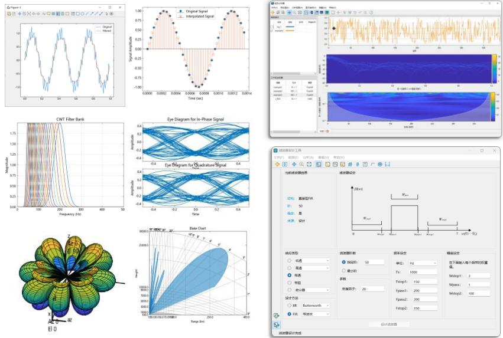

# 适用的一级学科：

信息与通信工程

电子科学与技术

控制科学与工程

电气工程

兵器科学与技术

航空宇航科学与技术

船舶与海洋工程

# MWORKS与MATLAB专业工具箱对比 - 控制系统系列工具箱

控制系统系列工具箱包括基础控制系统工具箱、基于模型的控制器设计工具箱、系统辨识工具箱、鲁棒控制工具箱4个。面向经典控制和现代控制领域，为分析、设计和调节线性控制系统提供算法、模型和应用程序。该系列工具箱支持将控制系统的构成环节指定为传递函数、状态空间或零极点增益模型，通过函数和应用程序，可实现对系统时域和频域响应的分析与可视化。控制系统工具同时为基于Modelica的物理被控对象模型的分析、控制律设计和调节提供支撑

<table><tr><td></td><td>MATLAB</td><td>MWORKS</td><td>说明</td></tr><tr><td>基础控制系统工具箱</td><td>提供了用于系统地分析、设计和调节线性控制系统的算法和 App。可以将系统指定为传递函数、状态空间、零极点增益或频率响应模型。借助App 和函数,可以在时域和频域中分析和可视化系统行为,同时支持使用交互式方法来调节补偿器参数。合计提供超过300个函数和3个APP</td><td>为系统化地分析、设计和调节线性控制系统提供算法和应用程序。主要处理经典控制、现代控制中的建模、分析与设计问题。支持线性模型创建/转换/化简、时频域分析、PID设计、补偿器设计、状态估计与LQG设计等功能,目前2024a版本提供超过200个函数(2025b将推出295个)和3个交互式应用程序APP</td><td>MWORKS基础控制系统工具箱针对常用函数、核心功能均已覆盖</td></tr><tr><td>基于模型的控制器设计工具箱</td><td>支持Simulink模型线性化,并基于经典控制、现代控制方法设计控制器。提供105个函数及2个应用程序APP</td><td>使用模型线性化器对Sysplorer中构建的Modelica被控对象物理模型进行线性化处理或频率特性估算,并开展进一步的控制系统设计。目前2024a版本提供50个以上函数(2025b将推出90个)与3个交互式APP</td><td>MWORKS针对Modelica物理模型的线性化技术在线性化精度和效率上具备更大的优势,该技术在业界领先并在实际工程的应用中取得较好的效果</td></tr><tr><td>系统辨识工具箱</td><td>系统标识提供函数用于动态系统建模,时间序列分析和预测的应用程序。支持学习测量变量之间的动态关系,以在使用时间或频率域数据的同时,在连续或离散的时间内创建传递函数,过程模型和状态空间模型。提供400个函数及1个APP</td><td>支持基于数据估计动态系统数学模型。支持根据系统的输入输出数据来估计动态系统模型,包括传递函数、状态空间、多项式模型及其他形式的模型,并支持分析、转换与验证估计模型。提供70个以上函数(2025b将推出368个)及1个交互式APP</td><td>MWORKS系统辨识工具箱针对时频域数据辨识的常用函数、核心功能均已覆盖</td></tr><tr><td>鲁棒控制工具箱</td><td>在不确定系统表示、分析、鲁棒控制器设计、线性矩阵不等式求解等方面提供了120多个常用函数</td><td>提供用于在存在对象不确定性的情况下分析和调整控制系统性能和稳健性功能和模块。支持H∞与μ综合工具设计控制器。在不确定系统表示、分析、鲁棒控制器设计、线性矩阵不等式求解等方面提供了超过60个常用函数(2025b将推出114个函数)</td><td>MWORKS鲁棒控制工具箱针对不确定系统表示、分析、鲁棒控制器设计的常用函数、核心功能均已覆盖</td></tr><tr><td>模型预测控制工具箱</td><td>提供了开发模型预测控制(MPC)函数和应用程序。对于线性问题,该工具箱支持隐式,显式,自适应和增益调度的MPC的设计。对于非线性问题,可实现单阶段和多阶段的非线性MPC。</td><td>在研</td><td>通过MWORKS提供的函数与功能可以实现MPC控制算法,已在项目中应用,正在产品化</td></tr><tr><td>模糊控制工具箱</td><td>提供函数、应用程序和模型,用于分析、设计和模拟模糊逻辑系统。支持指定和配置模糊推理系统的输入、输出、隶属函数和规则</td><td>在研</td><td>通过MWORKS提供的函数与功能可以实现模糊控制算法,已在项目中应用,正在产品化</td></tr></table>

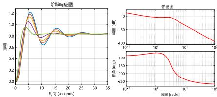

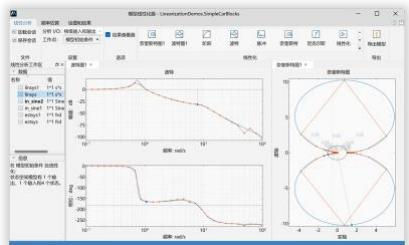

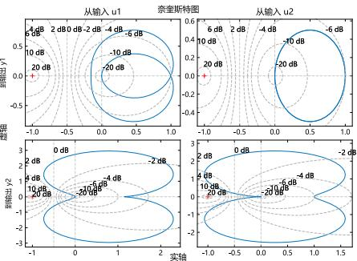

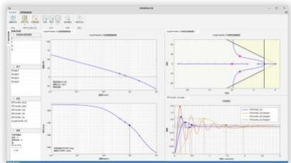

# 适用的一级学科：

控制科学与工程

电气工程

电子科学与技术

航空宇航科学与技术

兵器科学与技术

# MWORKS与MATLAB专业工具箱对比 - 设计优化系列工具箱

设计优化系列工具箱包括敏感度分析工具箱、参数估计工具箱、响应优化工具箱、模型试验工具箱4个。面向Modelica模型的设计和优化，为模型试验设计、敏感度分析、参数估计和响应优化提供应用程序和算法。该系列工具箱支持数字仿真模型的参数矩阵与组件选型、评估模型输入对输出参数变化敏感度、寻找使得系统整体性能趋向最优的参数值，快速估计出系统模型参数。该系列工具箱通过交互式工具和模块，为模型参数分析和调优提供支撑

<table><tr><td></td><td>MATLAB</td><td>MWORKS</td><td>说明</td></tr><tr><td>敏感度分析</td><td>Sensitivity Analysis支持使用实验设计、蒙特卡洛和相关技术分析成本函数对模型参数的敏感性,可通过敏感度分析评估Simulink模型的参数和状态如何影响模型输出或模型设计要求。支持将敏感度分析结果导出到参数估计器或响应优化器应用程序中。</td><td>敏感度分析工具箱支持通过蒙特卡洛仿真分析参数变动对模型输出的影响,确定模型关键参数,为参数估计和响应优化提供较好的参数初值和优化方向。提供符合均匀、指数、极值、泊松、高斯和广义帕累托等数十种数据分布的参数采样方式,覆盖参数估计试验配置和响应优化模型需求,支持量化分析参数敏感度,以比较不同参数对模型设计需求的影响情况。</td><td>/</td></tr><tr><td>参数估计</td><td>Parameter Estimator支持从数据中估计模型参数和初始状态,校准模型,可在参数估计器中或命令行中的测量数据估计Simulink模型的参数和状态。支持使用多实验数据同时估计和验证多个模型参数,并可以指定参数的边界。</td><td>参数估计工具箱将模型拟合到测试数据,基于底层寻优算法估计模型参数和来自数据的最优或次优初始状态。支持用户通过简单的待估计参数、目标变量和试验数据设置,基于工具提供的优化算法,快速估计系统模型参数。支持不定义边界、多边界参数估计分析,提供粒子群、遗传、模式搜索等多种算法</td><td>/</td></tr><tr><td>响应优化</td><td>Response Optimizer支持优化模型响应以满足设计要求,测试模型鲁棒性,提供设计要求并优化Simulink模型参数方法。支持使用模型验证模块或自定义约束和成本函数同时优化时域和频域设计要求。支持合并参数不确定度来测试设计的鲁棒性。</td><td>响应优化工具箱为模型参数分析、调优提供算法和应用程序,满足模型设计需求。提供多种模型需求设计类型和优化算法,支持单目标和多目标优化、同时满足多需求设计。利用响应优化工具可在合理范围和约束条件下进行模型参数调节和计算,获得最优参数,以满足复杂系统的性能设计指标。</td><td>/</td></tr><tr><td>模型试验</td><td>DOE技术为Sensitivity Analysis提供支撑,确定某些因子如何影响过程的结果(响应)。支持实验设计(包括完全析因设计、部分析因设计、D最优设计、准随机设计和响应面设计)或者可视化实验结果。</td><td>模型试验工具箱包含参数矩阵和组件选型两个工具。参数矩阵支持对系统模型参数设计仿真验证,研究模型参数对系统的影响。组件选型支持对多设计方案的系统关键指标性能仿真验证,研究不同型号部件模型对系统模型关键性能的影响。</td><td>/</td></tr></table>

MWORKS设计优化工具箱的详细功能、函数帮助可参见：敏感度分析、参数估计、响应优化、模型试验

官方帮助文档

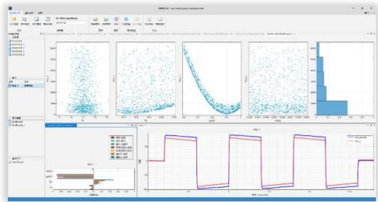

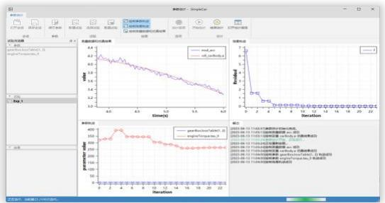

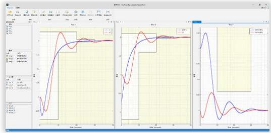

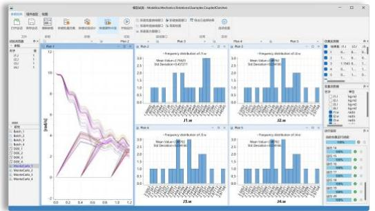

# 适用的一级学科：

控制科学与工程

电气工程

电子科学与技术

航空宇航科学与技术

机械工程

# MWORKS与MATLAB专业工具箱对比 - 半物理系列工具箱

半物理系列工具箱包括半物理仿真管理工具箱、半物理仿真接口工具箱、Sysplorer嵌入式代码生成工具箱3个。面向控制系统，为实时仿真与代码生成提供应用程序和方法。

以模型驱动的自动代码生成，产生能立即部署到目标硬件上并进行测试的软件，实现对系统的设计与测试、研究和评估的增量式交付。

<table><tr><td></td><td>MATLAB</td><td>MWORKS</td><td>说明</td></tr><tr><td>实时仿真管理</td><td>Simulink Real-Time允许从Simulink模型创建实时应用程序,并在连接到物理系统的Speedgoat 目标计算机硬件上运行。可以使用 Speedgoat I/O 驱动程序模块实时扩展 Simulink 模型,并自动构建实时应用程序。Simulink Real-Time 和 Speedgoat 目标计算机硬件旨在协同工作以创建实时适用于桌面、实验室和现场环境的系统。</td><td>半物理仿真管理工具箱(RT)是面向半物理仿真工程的专用上位机软件。支持以真实物理模型为基础,减少虚拟系统与真实设备之间的误差,在系统开发初期到验证阶段,引入实时软硬件环境进行仿真。</td><td>/</td></tr><tr><td>实时代码生成</td><td>Simulink Coder 从 Simulink 模型、Stateflow 图和 MATLAB函数中生成并执行C和C++代码。生成的源代码可用于实时和非实时应用程序,包括仿真加速、快速原型和硬件在环测试。支持使用Simulink调整和监测生成的代码,或在 MATLAB和Simulink之外运行代码以及与代码交互。</td><td>半物理仿真接口工具箱(HIL),可以快速、高效地将Modelica物理模型转换为适用于实时环境的可执行代码(高效C代码或联合仿真代码)。生成的实时代码包含模型代码和接口调用代码,支持在不同操作系统和架构的目标平台上运行,加快实时系统的开发。</td><td>/</td></tr><tr><td>嵌入式代码生成</td><td>Embedded Coder为大规模生产中使用的嵌入式处理器生成可读、紧凑且快速的C和C++代码。通过对MATLAB Coder和Simulink Coder的高级优化优化提高代码效率,简化与现有代码、数据类型和标定参数的集成。可以结合使用第三方开发工具编译可执行文件,以在嵌入式系统或快速原型构建板上实现即交即用式部署。</td><td>Sysplorer嵌入式代码生成工具箱支持将Sysblock模型一键生成符合MISRA-C规范的C代码,适用于各类兼容C语言的嵌入式平台。提供数据字典功能,用于绑定模型关键参数并体现到代码生成中以增加代码可读性,支持生成的 C 代码与模型双向追溯,大幅提升代码的可信度。Sysplorer 以 Sysblock 框图式建模仿真环境,承担嵌入式代码生成模型的建立和仿真功能。</td><td>/</td></tr><tr><td>HDL代码生成</td><td>HDL Coder可从MATLAB函数、Simulink 模型和Stateflow图生成可移植、可综合的VHDL和Verilog代码。生成的HDL代码可用于FPGA编程或ASIC 原型制作和设计。</td><td>在研</td><td>/</td></tr></table>

MWORKS半物理系列工具箱的详细功能、函数帮助可参见：半物理仿真管理、半物理仿真接口、Sysplorer嵌入式代码生成官方帮助文档

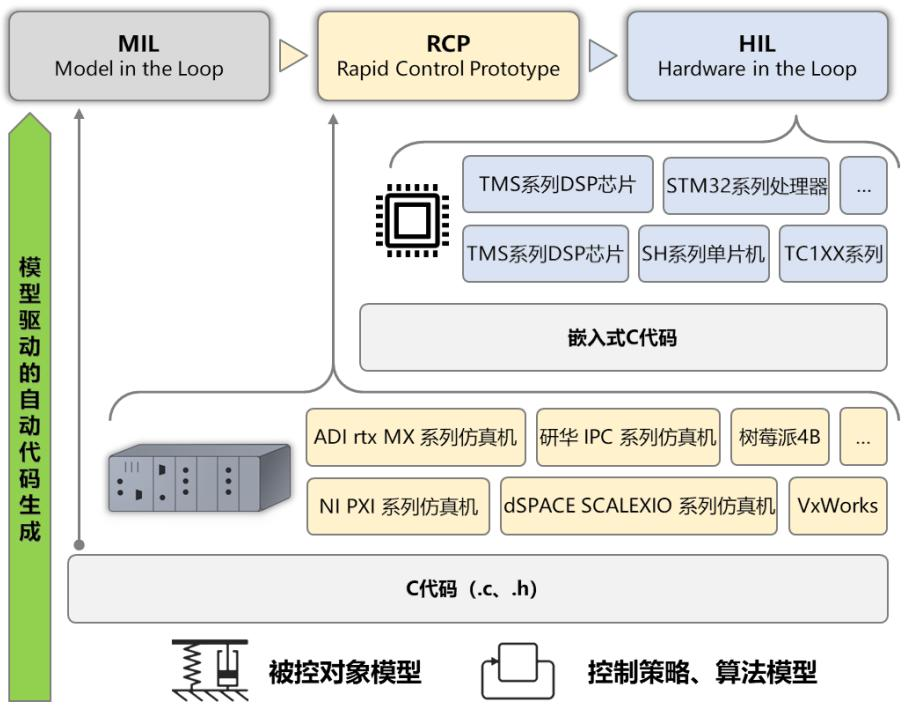

# 适用的一级学科：

控制科学与工程

电气工程

电子科学与技术

航空宇航科学与技术

机械工程

# MWORKS与MATLAB专业工具箱对比 - AI与数据科学系列工具箱

AI系列工具箱包括机器学习工具箱、深度学习工具箱、强化学习工具箱3个。面向AI与数据科学领域，基于系统建模仿真+AI/ML两大范式融合，为分析和模拟数据、训练函数提供算法。该系列工具箱在面向资源分配、机器人和自主系统等复杂应用场景，提供策略、控制器和决策算法。

<table><tr><td></td><td>MATLAB</td><td>MWORKS</td><td>说明</td></tr><tr><td>机器学习工具箱</td><td>Statistics and Machine Learning Toolbox提供了用于描述数据、分析数据以及为数据建模的函数和App。可以使用描述性统计量和绘图进行探索性数据分析,对数据进行概率分布拟合,生成进行蒙特卡罗仿真的随机数,以及执行假设检验。回归算法和分类算法允许您从数据做出推断并构建预测模型</td><td>机器学习工具箱提供用于分析和模拟数据的算法和函数。提供可视化和聚类功能,支持进行探索性数据分析。面向需要从数据中得出推论并建立预测模型的场景,提供回归和分类算法。面向多维数据分析和特征提取的场景,支持主成分分析(PCA)、正则化、降维和特征选择方法,提供识别具有最佳预测能力的变量的功能。目前2024a版本提供超过600个函数(2025b将推出750个)。</td><td>/</td></tr><tr><td>深度学习工具箱</td><td>Deep Learning Toolbox提供了一个用于通过算法、预训练模型和App来设计和实现深度神经网络的框架。可以使用卷积神经网络(ConvNet、CNN)和长短期记忆(LSTM)网络对图像、时序和文本数据执行分类和回归。可以使用自动微分、自定义训练循环和共享权重来构建网络架构,如生成对抗网络(GAN)和孪生网络。使用Deep Network Designer,能够以图形方式设计、分析和训练网络。Experiment Manager可管理多个深度学习试验,跟踪训练参数,分析结果,并比较不同试验的代码。并且可以通过可视化层激活,以图形方式监控训练进度</td><td>深度学习工具箱提供用于构建、训练和保存深度学习模型的函数,包含图像深度学习、时序、序列和文本深度学习、预训练网络、网络训练组件、函数逼近与聚类等功能模块。利用深度学习工具箱可进行模式识别、回归预测、机理数据融合建模等。目前2024a版本提供超过110个函数(2025b将推出200个)</td><td>/</td></tr><tr><td>强化学习工具箱</td><td>Reinforcement Learning Toolbox为使用强化的训练策略提供函数和块学习算法包括DQN、A2C和DDPG。支持机器人和自主等复杂系统的控制器和决策算法系统实现。支持使用深度神经网络、多项式或查找来实现策略表。</td><td>为使用强化学习算法(包括DQN、PPO、SAC和DDPG等十五种算法)训练策略提供了函数和智能体(Agent)模块。面向资源分配、机器人和自主系统等复杂应用场景,提供策略、控制器和决策算法。支持使用深度神经网络或查找表来表示策略和值函数,支持在使用FMU格式建模的环境下进行调用。</td><td>/</td></tr></table>

MWORKS AI系列工具箱的详细功能、函数帮助可参见：数据科学和深度学习官方帮助文档

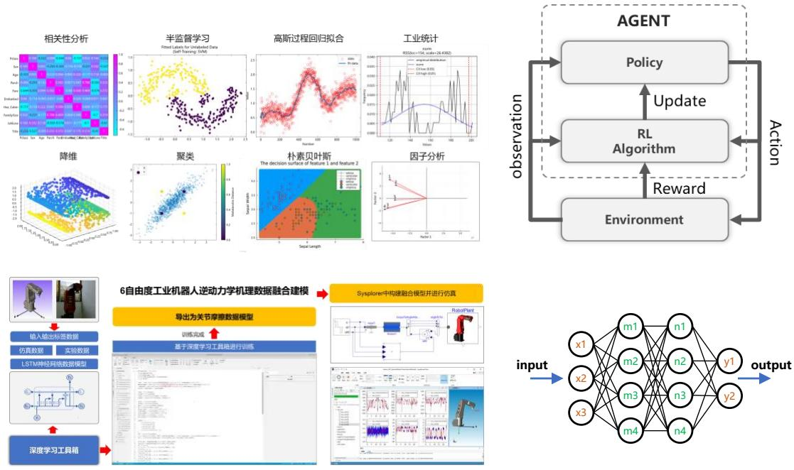

# 适用的一级学科：

控制科学与工程

电气工程

电子科学与技术

航空宇航科学与技术

机械工程

# MWORKS与MATLAB专业工具箱对比 - 模型降阶及融合仿真工具

模型降阶及融合仿真工具(ROM)内置超大规模场数据降阶算法、自适应超参搜索以及端侧模型自动部署等能力，复杂系统仿真模型通过降阶进行实时化处理，解决了非线性模型不能在半物理中实时仿真的问题。

<table><tr><td></td><td>MATLAB</td><td>MWORKS</td><td>说明</td></tr><tr><td>模型降阶及融合仿真</td><td>通过Deep Learning Toolbox、Statistics and Machine Learning Toolbox、System Identification Toolbox、Computer Vision Toolbox等工具箱的配合使用实现模型的机理与数据融合</td><td>模型降阶及融合仿真工具箱(ROM Builder Toolbox,下文简称 ROM Builder)可以将一维仿真模型与三维仿真模型进行耦合,对系统在不同尺度上进行全面分析,为模拟系统行为和性能的基础数据融合提供了降阶模型和数据模型生成工具。</td><td>MWORKS ROM工具箱适用于以下功能场景1.生成场降阶模型和系统数据模型2.生成轻量化 Modelica 模型3.生成实时模型导入半物理设备中进行仿真4.支持场降阶模型三维实时可视化</td></tr></table>

MWORKS模型降阶及融合仿真工具箱的详细功能可参见：模型降阶与融合仿真工具官方帮助文档

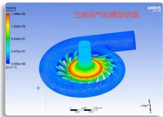

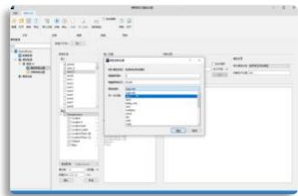

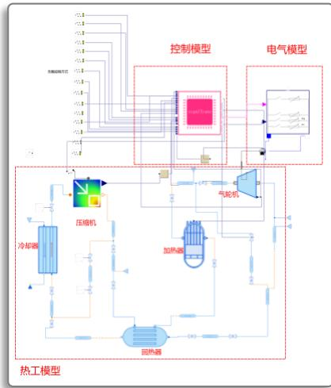

降阶前：网格数约为160万，144核工作站计算稳态解需要 4 小时降阶后：i5笔记本，计算时间1.01s，最大相对误差小于4%系统级模型引入压气机3D降阶模型后，仿真精细度提升，与同类专用软件的分析结果高度吻合

# 适用的一级学科：

动力工程与工程热物理

船舶与海洋工程

机械工程

电气工程

航空宇航科学与技术

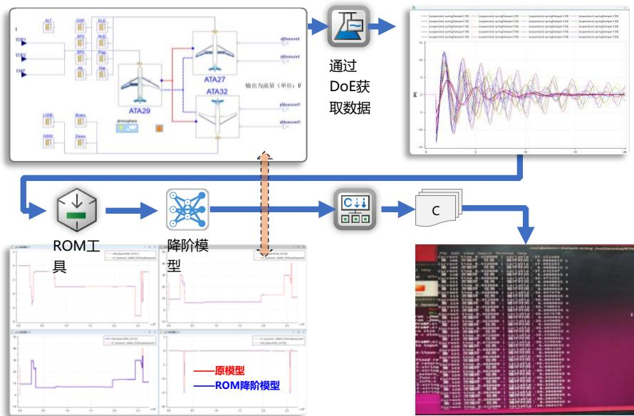

原模型：单步计算耗时2s

降阶后实时模型：单步计算时间约0.004毫秒。满足半物理实时性要求

实时机测试

# MWORKS与MATLAB专业工具箱对比 - 机械多体系列工具箱

机械多提系列工具箱包括Sysplorer CAD工具箱1个。面向机械系统，可以轻松将 CAD 模型导入 Sysplorer，自动提取模型的动力学和运动学属性，快速还原零部件之间的空间关系通过将机械模型合并到多领域、系统级仿真模型中，研究机械模型作为大规模系统一部分时的行为方式，使用 Sysplorer 的建模求解能力优化CAD模型的设计和最终应用

<table><tr><td></td><td>MATLAB</td><td>MWORKS</td><td>说明</td></tr><tr><td>CAD模型导入工具</td><td>MATLAB通过Multibody支持3D机械系统模型的导入与应用,例如机器人、车辆悬架、建筑设备和飞机起落架。支持对多体系统进行建模使用表示主体、关节、约束、力单元的块,和传感器。也可以导入完整CAD装配体,包括所有质量、惯性、接头、约束、和3D几何图形</td><td>Sysplore CAD工具箱(CAD Toolbox)支持将中性格式CAD模型中的装配体几何参数、物理属性等信息自动转换为Sysplorer中的Modelica多体模型,实现几何模型向功能模型的转换,提高建模效率,从而充分发挥平台的多领域统一建模的优势</td><td>MWORKS Sysplorer CAD工具箱适用于以下功能场景1.中性格式CAD模型直接使用,保留了几何参数、物理属性等设计信息,并且不依赖于特定的三维造型软件;2.在三维可视化环境中进行零部件的分组和添加标架;3.自动生成Modelica多体模型,并完成惯性张量、质量、姿态等参数的计算</td></tr></table>

MWORKS 机械多提系列工具箱的详细功能可参见：Sysplorer CAD 工具箱官方帮助文档

# 适用的一级学科：

机械工程

动力工程与热物理

控制科学与工程

电气工程

航空宇航科学与技术

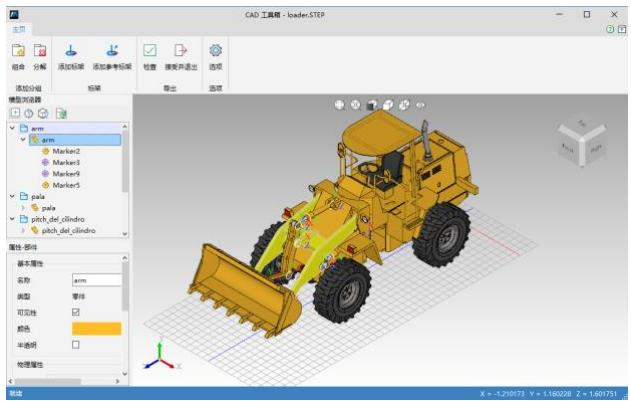
CAD 工具箱中导入装载机三维模型（前处理）

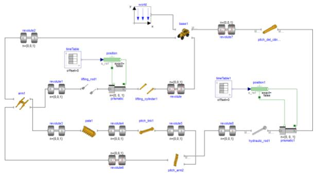
在Sysplorer中进行Modelica建模（模型构建）

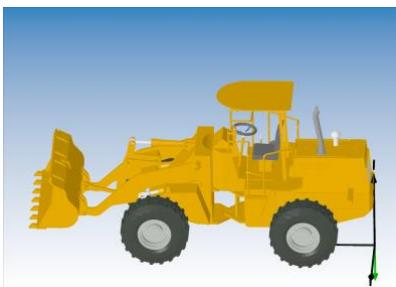
仿真三维动画（后处理）

# MWORKS在高校科研教学的应用

MWORKS平台可支撑绝大部分工学、理学专业，同时在管理学、医学等专业门类中涉及到科学计算和系统建模仿真应用的专业均可支撑

<table><tr><td colspan="2">MWORKS功能</td><td>可应用专业</td><td>对应学院</td></tr><tr><td rowspan="10">Syslab基础环境Sysplorer基础环境</td><td>数学优化类工具箱</td><td>数学与应用数学、统计学、智能交互设计、自动化、药学、化学测量与技术、行星科学、生物信息学等</td><td>理学院、机械工程学院、控制工程学院化学工程学院等</td></tr><tr><td>AI与数据科学类工具箱</td><td>数据计算机应用、生物信息学仿生科学与工程、人工智能、整合科学、智能感知工程、机器人工程、密码科学与技术等</td><td>计算机学院、生命科学与技术学院、计算机科学与技术学院、医学院等</td></tr><tr><td>信号处理类工具箱</td><td>电磁场与无线技术、电波传播与天线、智能测控工程、信息工程、电信工程及管理、通信工程等</td><td>信息工程学院、电子信息学院、控制工程学院等</td></tr><tr><td>通信类工具箱</td><td>通信工程、信息工程、电信工程及管理、电波传播与天线等</td><td>电气信息学院、信息工程学院等</td></tr><tr><td>射频与混合信号类工具箱</td><td>微电子科学与工程、信息工程、电子信息科学与技术、电波传播与天线等</td><td>电子信息学院、信息工程学院等</td></tr><tr><td>控制系统类工具箱</td><td>智能装备与系统、工业智能、自动化、核电技术与控制工程、建筑电气与智能化、智能建造、智慧水利等</td><td>控制工程学院、自动化学院、电气自动化学院等</td></tr><tr><td>模型驱动的代码生成与实时仿真类工具箱</td><td>计算机科学、软件工程、计算机信息系统、电机电器智能化、智能制造工程等</td><td>计算机学院、控制工程学院、电气自动化学院等</td></tr><tr><td>机械多体类工具箱</td><td>机械工程、机械设计制造及其自动化、机械电子工程等、过程装备与控制工程、智能制造工程等</td><td>机械工程学院、车辆工程学院、宇航学院等</td></tr><tr><td>基于模型的设计优化类工具箱</td><td>智能制造、水利水电工程、智能采矿工程、智能无人系统技术、海洋机器人、航空航天工程等</td><td>能源与能力工程学院、电气工程学院、宇航学院、自动化学院等</td></tr><tr><td>同元模型库</td><td>车辆工程、能源与动力工程、机械工程、电气工程及其自动化、智能制造工程、测控技术与仪器等</td><td>车辆工程学院、能源与动力工程学院、机械工程学院、电气自动化学院等</td></tr></table>
