# MWORKS.Sysplorer参数估计工具箱应用

- Source: `MWORKS高校星火计划资料包/培训课程配套材料/01-官网课程配套材料/05-基于模型的设计优化/02-参数估计工具箱应用/01-2023b/MWORKS.Sysplorer参数估计工具箱应用.pdf`
- Converted by: `MinerU precise API`
- Conversion date: `2026-05-08`
- Review status: `MinerU converted; spot check recommended`
- Priority: `P1`
- Source SHA1: `8239faae4554`
- MinerU batch id: `061150e6-e974-426f-a252-561eaf4766bd`
- Images: `29`
- Notes: 模型参数估计、仿真对齐和优化流程。

# MWORKS.Sysplorer设计优化

# 参数估计应用

苏州同元软控信息技术有限公司

2023年9月28日

# 目录

1. MWORKS.Sysplorer设计优化工具概况  
2. 参数估计简介  
3. 参数估计应用 - 不定义边界  
4. 参数估计应用 - 定义边界

# 01

# MWORKS.Sysplorer设计优化工具概况

# 1. MWORKS.Sysplorer 设计优化工具概况

设计优化工具箱面向Modelica模型的设计和优化，为模型试验设计、敏感度分析、参数估计和响应优化提供应用程序和算法。

model System “ 待优化的系统模型 ”

parameter Real param1; // 针对参数设计和优化

parameter Integer param2;

equation

...

end model

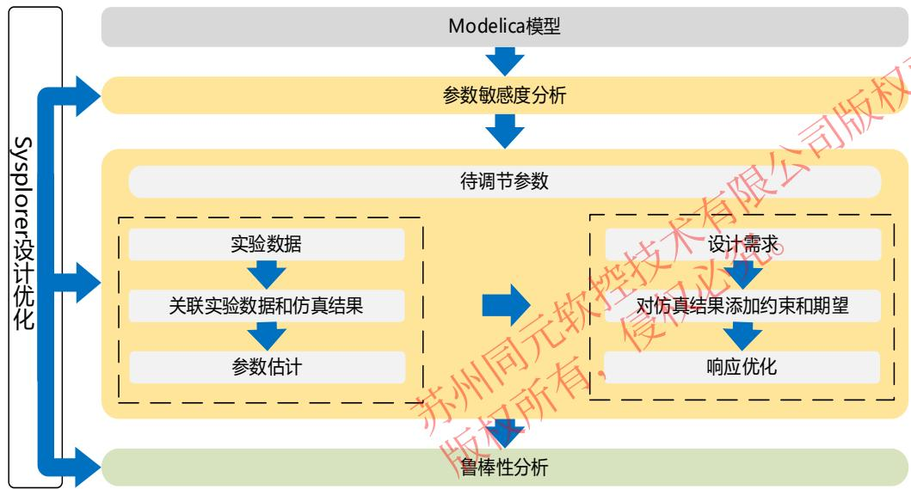

ToolBox

APP

# 模型试验APP

参数矩阵

组件选型

批量组件设计

组件排列自动生成系统模型

批量仿真

多类型可视化

# 敏感度分析APP

多类型采样方法

模型试验设计

参数敏感度分析

模型需求设计

需求偏差可视化

系统鲁棒性评估

# S.Sysplorer设计优化

# Sysplorer Design Optimzation

# 参数估计APP

数据预处理

多工况设计

支持多边界参数估计

参数评估

参数验证

迭代数据可视化

# 响应优化APP

模型需求设计

需求可视化

需求评估

多目标优化

模型线性化转换

迭代数据可视化

DOE & DOE结果可视化

多类型结果视图

批量仿真设计

试验设计设计

蒙特卡洛设计

批量组件设计

组件自动生成

系统模型自动生成

仿真结果导出

参数采样

需求评估

敏感度分析量化

敏感度结果可视化

算法运行控制

# 敏感度分析方法

全局敏感度分析

局部敏感度分析

参数估计

多边界工况配置

迭代可视化

工况导入

估计报告

残差计算

响应优化

频域/时域需求

需求可视化

迭代可视化

优化报告

需求计算

# 多边界/多目标聚合方法

最大目标函数值

基于惩罚的边界交叉

线性加权法

仿真实例池、仿真任务调度

# DoE方法

拉丁超立方

霍尔顿(Halton)采样

响应面设计

# 数据处理方法

去除奇异点

# 估值方法

四方位值

...

# 组件排列

顺序排列

全排列

粒子群算法

LM算法

遗传算法

单纯性搜索法

模拟退火算法

模式搜索

# Sysplorer SDK

模型翻译

并行仿真

结果管理

模型线性化

Modelica模型

（Sysplorer）

# 02 参数估计简介

# 2. 参数估计简介

系统仿真分析往往会遇到部分参数因为一些客观原因导致无法获取的情况，如何设置参数值才能提高模型精度，使得仿真结果逼近实验测量数据成为难题。传统的参数估计方式是通过大量和反复人工测试最终确定出一个比较符合预期的参数，但是该操作时间成本高、效率低。

参数估计支持用户通过简单的待估计参数、目标变量和试验数据设置，基于工具提供的优化算法，快速估计系统模型参数。

# 不定义边界

• 应用于基于单一工况下的测试数据/标准结果的模型参数估计

# 多边界

• 具有单值性条件的系统建模仿真  
• 应用于基于多个不同工况下的测试数据/标准结果的模型参数估计

# 优化算法

• 粒子群算法  
• 遗传算法  
• 模式搜索算法

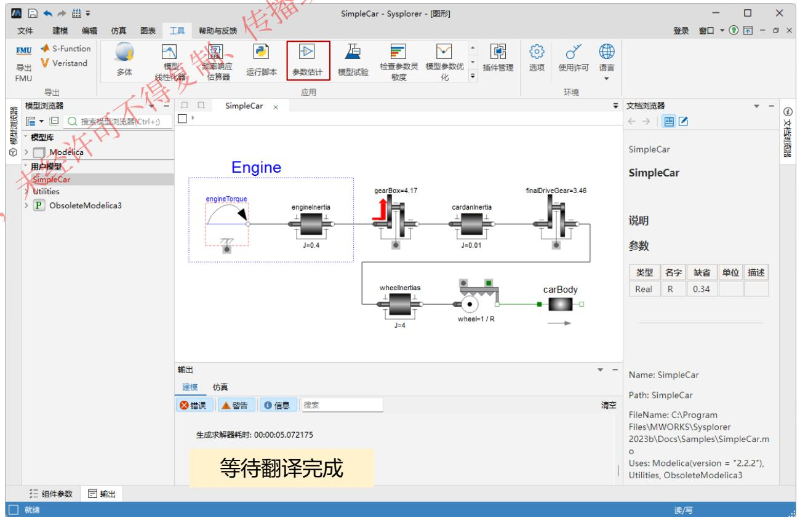

# 2. 参数估计简介

通过对比不同模型参数值的仿真结果和测量数据的吻合程度来不断调整模型参数值使模型仿真结果逼近测量数据的过程就是参数估计。使用参数估计，可以更快的调优模型以达到实验预期目标，明晰调参方向，降低人工调整参成本。此外，通过不断更新参数来优化模型，提高模型仿真精度，达成模型仿真结果逼近物理实验的效果。

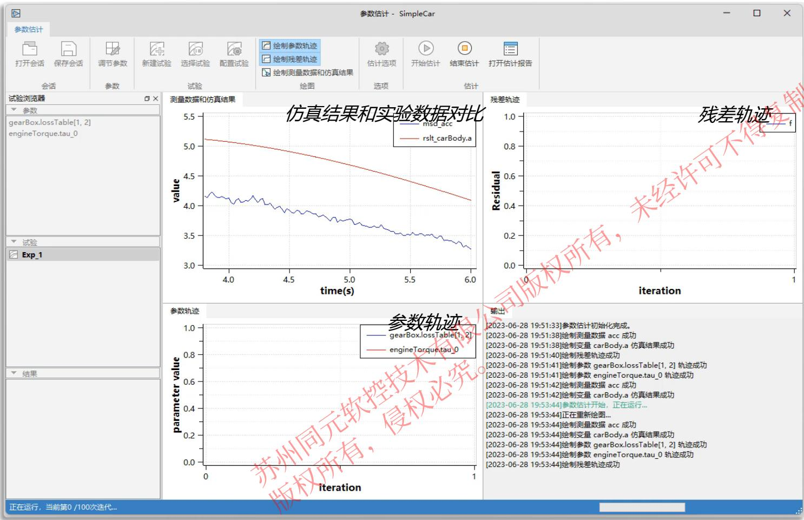  
参数估计APP运行结果.MP4

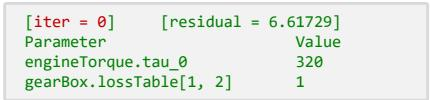

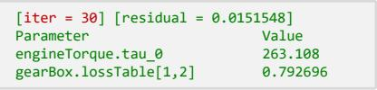

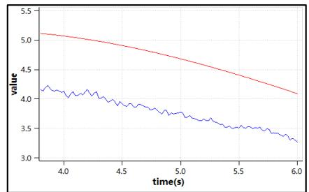  
初始参数仿真结果

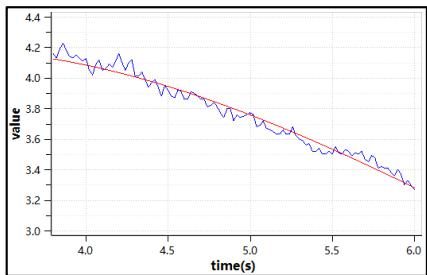  
优化后参数仿真结果   
模型仿真结果和实验数据对比

# 2. 参数估计简介

通过对比不同模型参数初值的仿真结果和测量数据的吻合程度来不断调整模型参数初值使模型仿真结果逼近测量数据的过程就是参数估计。使用参数估计，可以更快的调优模型以达到实验预期目标，明晰调参方向，降低人工调整参成本。此外，通过不断对参数进行更新来优化模型，使得模型不仅能够在测试数据上表现很好，而且可以在验证数据集上面表现的很好。

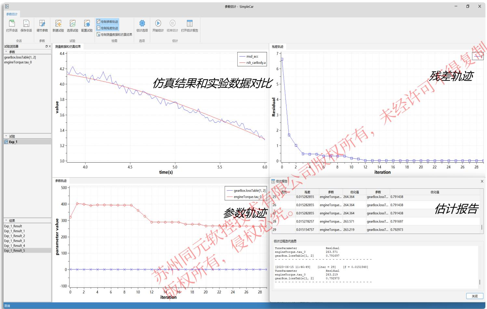  
参数估计APP

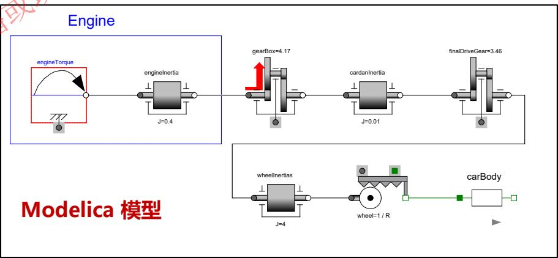

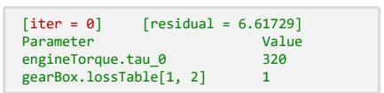

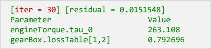

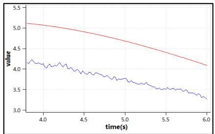

  
初始参数仿真结果  
优化后参数仿真结果   
模型仿真结果和实验数据对比

# 03

# 参数估计应用

# - 不定义边界

# 3.参数估计应用 – 不定义边界

简易小车模型，发动机通过啮齿和轴承传动装置推动车身前进，在车身上安装传感器测量简易小车加速度，速度和移动距离，探究恒定扭矩发动机的扭矩和传动系统的效率。

根据小车原理，在MWORKS.Sysplorer中搭建该小车模型，使用恒定扭矩发动机模型（Engine）驱动小车，具有啮合效率和轴承摩擦的齿轮（gearBox）和带惯性的 1D 旋转组件传动，其他传动齿轮和齿轮箱均选择无惯性模型忽略影响，推动车身前进，计算车身加速度。

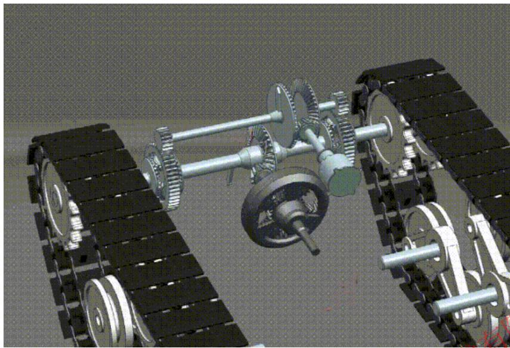

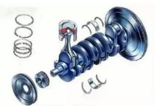

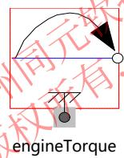  
恒定扭矩发动机模型

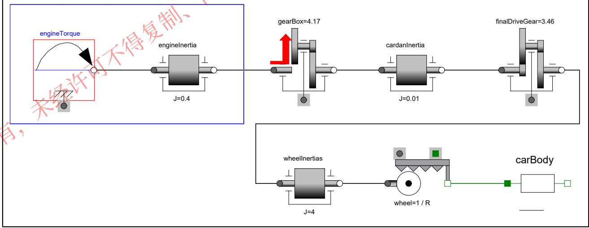  
Engine

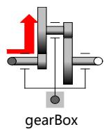  
具有啮合效率和轴承摩擦的齿轮

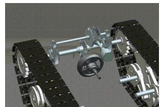

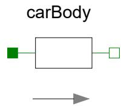  
具有惯性的滑动质量块

# 3.参数估计应用 – 不定义边界

实验中在车身上安装传感器测得加速度，通过模型仿真和参数估计工具估计gearBox的传动系统的效率 lossTable[1, 2] 和engineTorque力矩tau_0，使得传感器捕获到的加速度acc数据和carBody.a仿真结果的残差最小。

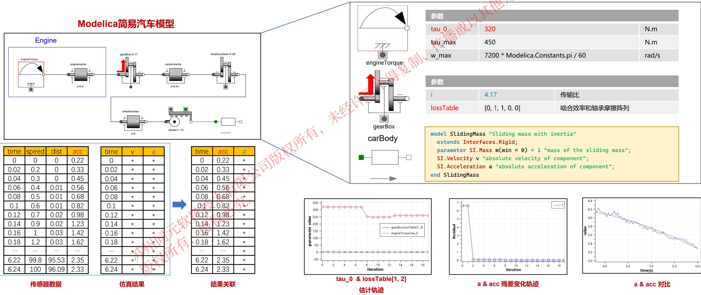

# 04

# 参数估计应用

# - 定义边界

# 4.参数估计应用 - 定义边界

汽车空调蒸发器是汽车空调系统中的一个重要组成部分，主要用于将压缩机压缩的高压制冷剂蒸发成低压的气体，制冷剂蒸发吸热实现空调系统的制冷效果，换热器设计完成后需要通过调整修正系数以提高空调的性能和效率。

通过实验测得稳态条件下的压降系数和换热系数，探究蒸发器的冷媒和空气压降系数修正系数和换热系数修正系数。

边界：传热过程的热流体建模仿真中的单值性条件。导热微分方程式是根据热力学定律所建立起来的描写物体的温度随空间和时间变化的关系式，它全然没有涉及到某一特定导热过程该过程作进一步的具体说明，这些补充说明条件总称为单值性条件。

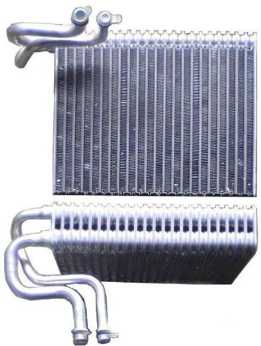

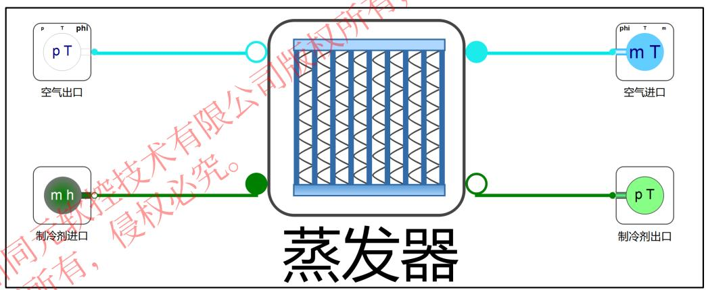  
Modelica蒸发器模型

压差和压降：压差是指制冷剂在蒸发器中的入口和出口之间的压力差异。压降是指制冷剂在通过蒸发器时由于流动阻力而产生的压力降低。压差和压降的大小直接影响制冷剂在蒸发器中的流动速度和热交换效果。温差：温差是指制冷剂在蒸发器中的入口和出口之间的温度差异。温差的大小取决于蒸发器的设计和工作条件，对于空调系统的制冷效果起着重要作用。

压降系数修正系数：在稳态条件下，蒸发器内部制冷剂流动时产生的压降与理论计算值之间的修正系数。由于蒸发器内部存在一定的阻力和流动不均匀性，实际压降会比理论值大，因此需要修正系数进行修正。

换热系数修正系数：蒸发器内部换热效果的修正系数。蒸发器内部的翅片和管道结构会影响制冷剂与空气之间的热交换效果，实际换热系数会受到多种因素的影响，如流速、流动状态、表面积等，因此需要修正系数进行修正。

# 4.参数估计应用 - 定义边界

本例为单体换热器模型，通常实验数据为多组固定边界条件的组合形式（热侧进口流量温度，冷侧进口流量温度进行组合），待估计的变量为换热量和换热器内部压降。，通过参数估计工具箱估计稳态多边界工况下的压降系数（冷媒和空气）的修正系数和换热系数（冷媒和空气）的修正系数 。

组合参数后，可针对当前换热器模型中使用的4个待估计参数进行调整，修正热侧和冷侧的压降值和换热量，使其在给定边界条件范围内和实验数据趋于一致。

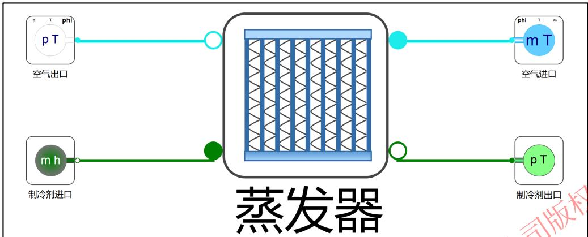

结果变量关联列表  

<table><tr><td>序号</td><td>mdot</td><td>p</td><td>dp</td><td>heat</td></tr><tr><td>bound1</td><td>0.1</td><td>100000</td><td>res1</td><td>res2</td></tr><tr><td>bound2</td><td>0.2</td><td>100000</td><td>res3</td><td>res4</td></tr><tr><td>bound3</td><td>0.3</td><td>100000</td><td>res5</td><td>res6</td></tr><tr><td>bound4</td><td>0.14</td><td>100000</td><td>res7</td><td>res8</td></tr><tr><td>bound5</td><td>0.7</td><td>103000</td><td>res9</td><td>res10</td></tr><tr><td>bound6</td><td>0.35</td><td>103000</td><td>res11</td><td>res12</td></tr><tr><td>bound7</td><td>0.6</td><td>103000</td><td>res13</td><td>res14</td></tr><tr><td>bound8</td><td>0.2</td><td>103000</td><td>res15</td><td>res16</td></tr></table>

<table><tr><td colspan="3">参数</td></tr><tr><td>mdot_air</td><td>0.3</td><td></td></tr><tr><td>T_air</td><td>320</td><td></td></tr><tr><td>CF_dp_ref</td><td>1</td><td>N.m</td></tr><tr><td>CF_dp_air</td><td>1.125</td><td>N.m</td></tr><tr><td>CF_heat_ref</td><td>1.5</td><td>rad/s</td></tr><tr><td>CF_heat_air</td><td>1</td><td></td></tr></table>

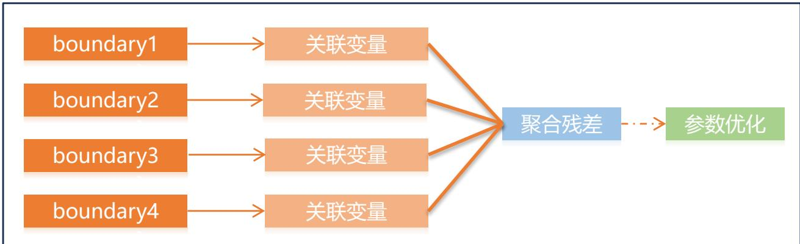  
多边界参数估计流程

建立知识规范， 营造协同生态

积累工业模型， 发展可控平台

融入中国创新，打造先进软件

# 请各位专家指正！
