# MWORKS.Syslab控制系统工具箱

- Source: `MWORKS高校星火计划资料包/培训课程配套材料/01-官网课程配套材料/02-控制系统设计与应用/01-控制系统工具箱应用/01-2024a/MWORKS.Syslab控制系统工具箱.pdf`
- Converted by: `MinerU precise API`
- Conversion date: `2026-05-08`
- Review status: `MinerU converted; spot check recommended`
- Priority: `P1`
- Source SHA1: `00be3b6ac998`
- MinerU batch id: `d831dfbe-d826-4f9f-9512-04e61b95dcfe`
- Images: `435`
- Notes: 控制系统建模、时域/频域分析、PID 与状态反馈。

# 课程须知

本课程适用软件版本：MWORKS.Syslab2024a  
> 本课程示例运行需要软件首选项加载:

基础库(TyBase)

数学库(TyMath)

图形库(TyPlot)

控制系统库(TyControlSystems)

# MWORKS.Syslab控制系统工具箱

鲍丙瑞 张万宽

苏州同元软控信息技术有限公司

2024-01-07

  
TONGYUAN

# 目录

1. 控制系统工具箱功能概述  
2. 线性控制系统的数学模型  
3. 线性控制系统分析  
4. PID控制器设计  
5. 状态反馈控制律设计

# 01

# 控制系统工具箱功能概述

# 1. 控制系统工具箱功能概述

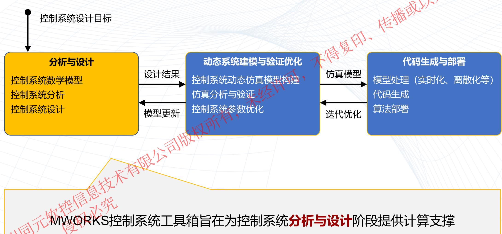  
控制系统工具箱在控制系统基于模型的设计流程中的定位

# 1. 控制系统工具箱功能概述

控制系统工具箱面向经典控制和现代控制领域，为分析、设计和调节线性控制系统提供算法、模型和应用程序

# 两类场景

- 基于数学模型的控制系统分析、设计与验证  
- 基于物理模型的控制系统分析、设计与验证

# 两个工具

- 控制系统工具 (Control System Toolbox)  
- 基于模型的设计工具 (Sysplorer Control Design)

# 四个应用

- 线性系统分析APP  
- 控制系统设计APP  
- 线性化与估算APP

- PID整定APP (2023Q3发布)

# 六类功能

- 线性模型创建  
- 线性系统分析  
PID控制  
- 状态估计与最优控制  
·补偿器设计   
- 线性化及频率特性估算

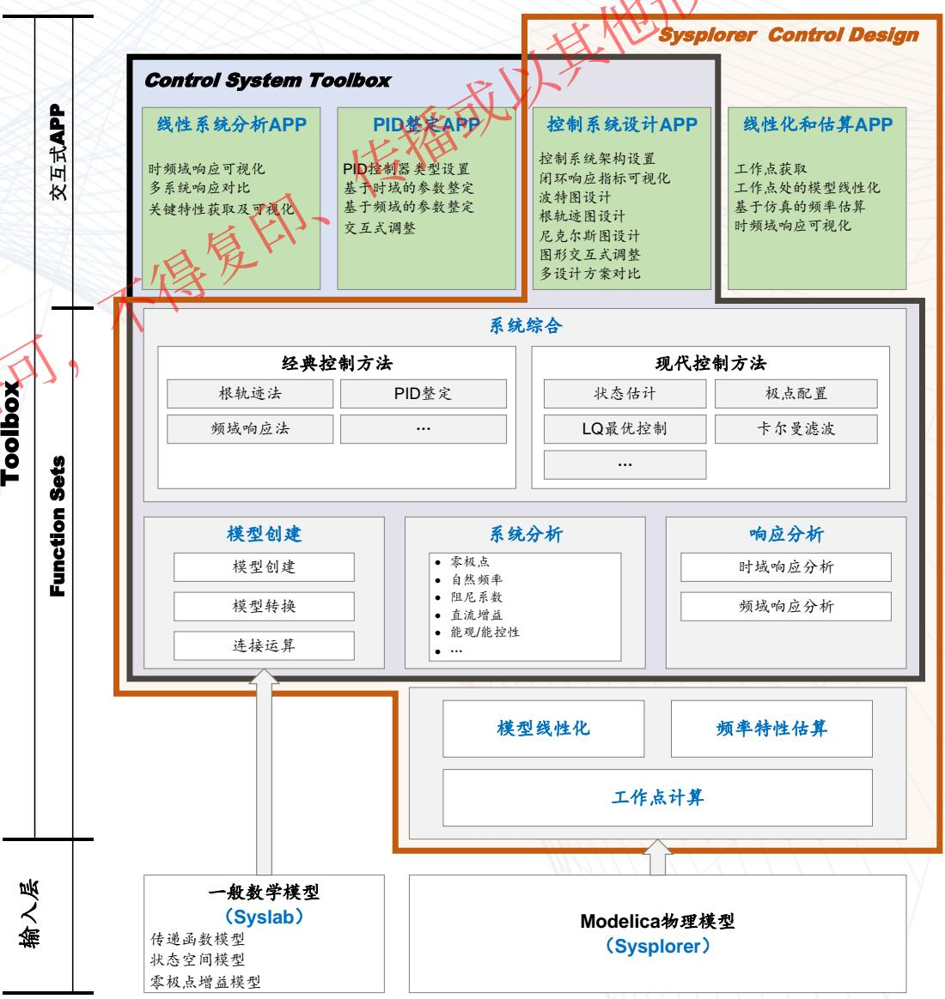

# 1. 控制系统工具箱功能概述

# 1 线性模型创建

- 线性时不变LTI模型创建  
模型转换  
模型连接运算  
模型简化

# 2 线性系统分析

时域分析与可视化  
- 频域分析与可视化  
- 根轨迹分析  
- 能观能控性分析

# 3 PID控制器设计

- 各类型连续/离散PID控制器创建  
- 基于目标的PID参数计算

# 4 状态估计与最优控制

- 状态反馈控制律设计  
- 卡尔曼滤波器设计  
- 线性二次型调节器设计

# 5 线性化及频率特性估算

- 物理模型线性化  
- 物理模型频率特性估算

# 6 补偿器设计

设计目标设定  
- 基于根轨迹法的补偿器设计  
基于频域法的补偿器设计

# 02

# 线性控制系统的数学模型

# 2.1 线性控制系统的数学模型 - 模型创建

大部分控制系统分析与设计的方法都需要假设系统的模型已知，而获得数学模型有两种方法：

□从已知的物理规律出发，用数学推导的方式建立系统的数学模型  
口由实验数据拟合系统的数学模型（系统辨识）

# 一. 传递函数模型 (tf)

连续时间动态系统一般以微分方程描述，而LTI系统则以定常系数线性常微分方程描述。假设系统的输入信号为 $u(t)$ ，输出为 $y(t)$ ，则 $n$ 阶系统的微分方程为：

$$
a _ {n} \frac {d ^ {n} y (t)}{d t ^ {n}} + a _ {n - 1} \frac {d ^ {n - 1} y (t)}{d t ^ {n - 1}} + \dots + a _ {1} \frac {d y (t)}{d t} + a _ {0} y (t) = b _ {m} \frac {d ^ {m} u (t)}{d t ^ {m}} + b _ {m - 1} \frac {d ^ {m - 1} u (t)}{d t ^ {m - 1}} + \dots + b _ {1} \frac {d u (t)}{d t} + b _ {0} u (t) \quad (n \geq m)
$$

系统输入量与输出量的 Laplace 变换之比即为其传递函数：

$$
G (s) = \frac {Y (s)}{U ^ {\prime} (s)} = \frac {b _ {m} s ^ {m} + b _ {m - 1} s ^ {m - 1} + \cdots + b _ {1} s + b _ {0}}{a _ {n} s ^ {n} + a _ {n - 1} s ^ {n - 1} + \cdots + a _ {1} s + a _ {0}}, n \geq m
$$

传递函数可以表示成两个多项式的比值, 在 Syslab 中, 多项式可以用向量表示。将多项式的系数按 $s$ 的降幂次序表示得到一个数值向量, 分别用 num 与 den 表示分子、分母多项式, 再利用 $\operatorname{tf}()$ 函数即可创建系统传递函数

$$
\mathsf {n u m} = [ \mathsf {b m}, \quad \dots \quad \mathsf {b 1}, \mathsf {b 0} ]
$$

$$
d e n = [ a n, \dots a 1, a 0 ]
$$

通过指定分子分母多项式系数创建传递函数

$$
G = t f (\text {n u m}, \text {d e n})
$$

# 线性系统一般可以用以下三种模型进行表示：

1. 传递函数模型  
2. 状态空间模型  
3. 零极点增益模型

# 2.1 线性控制系统的数学模型 - 模型创建

# 一. 传递函数模型 (tf)

示例2.1：Syslab中建立传递函数模型：

$$
G (s) = \frac {1 2 s ^ {3} + 2 4 s ^ {2} + 1 2 s + 2 0}{2 s ^ {4} + 4 s ^ {3} + 6 s ^ {2} + 2 s + 2}
$$

方式一

$$
\mathbf {n u m} = [ 1 2, 2 4, 1 2, 2 0 ]
$$

$$
d e n = [ 2, 4, 6, 2, 2 ]
$$

$$
G = t f (\text {n u m}, \text {d e n})
$$

#方式二

$$
G = t f ([ 1 2, 2 4, 1 2, 2 0 ], [ 2, 4, 6, 2, 2 ])
$$

输出：

$$
1 2 s ^ {\wedge} 3 + 2 4 s ^ {\wedge} 2 + 1 2 s + 2 0
$$

$$
2 s ^ {\wedge} 4 + 4 s ^ {\wedge} 3 + 6 s ^ {\wedge} 2 + 2 s + 2
$$

连续时间传递函数模型

考虑如果传递函数分子分母多项式给出的不是完全展开的形式,而是若干因式的乘积,或者包括其他运算。这种情况可以定义Laplace算子: $s = \operatorname{tf}\left( {{}^{\prime }s{}^{\prime }}\right)$ ,然后用类似数学表达式的形式直接输入

示例2.2：Syslab中建立传递函数模型：

$$
G (s) = \frac {3 (s ^ {2} + 3)}{(s + 2) ^ {3} (s ^ {2} + 2 s + 1) (s ^ {2} + 5)}
$$

$$
s = t f \left(^ {\prime} s ^ {\prime}\right) \# \text {定 义 L a p l a c e 算 子}
$$

$$
G = 3 * (s ^ {2} + 3) / ((s + 2) ^ {\wedge} 3 * (s ^ {\wedge} 2 + 2 * s + 1) * (s ^ {\wedge} 2 + 5))
$$

输出：

$$
3 s ^ {\wedge} 2 + 9
$$

$$
s ^ {\wedge} 7 + 8 s ^ {\wedge} 6 + 3 0 s ^ {\wedge} 5 + 7 8 s ^ {\wedge} 4 + 1 5 3 s ^ {\wedge} 3 + 1 9 8 s ^ {\wedge} 2 + 1 4 0 s + 4 0
$$

连续时间传递函数模型

# 2.1 线性控制系统的数学模型 - 模型创建

# 一. 传递函数模型 (tf)

离散时间动态系统一般以差分方程描述，LTI 系统则以定系数线性差分方程描述，对于离散SISO，设定采样周期为 $\mathrm{T}$ ,系统的输入为 $u\left( i\right)$ ,输出为 $y\left( i\right)$ ,则相应差分方程为:

$$
a _ {n} y (i + n) + a _ {n - 1} y (i + n - 1) + \dots + a _ {1} y (i + 1) + a _ {0} y (i) = b _ {m} u (i + m) + b _ {m - 1} u (i + m - 1) + \dots + b _ {1} u (i + 1) + b _ {0} u (i)
$$

对上述方程进行 $z$ 变换，得到离散系统的传递函数：

$$
H (z) = \frac {Y (z)}{U (z)} = \frac {b _ {m} z ^ {m} + b _ {m - 1} z ^ {m - 1} + \cdots + b _ {1} z + b _ {0}}{a _ {n} z ^ {n} + a _ {n - 1} z ^ {n - 1} + \cdots + a _ {1} z + a _ {0}}, n \geq m
$$

在 Syslab 中，同样使用 tf() 函数创建离散系统传递函数，与连续传递函数不同的是，同时需要指定采样时间 $T$

$$
\mathsf {n u m} = [ \mathsf {b m}, \quad \dots \quad \mathsf {b 1}, \mathsf {b 0} ]
$$

$$
d e n = [ a n, \dots a 1, a 0 ]
$$

通过指定分子分母多项式系数、采样时间

$$
G = t f (\text {n u m}, \text {d e n}, \text {t s})
$$

示例2.3：Syslab中建立离散系统传递函数模型，其采样周期为 $T = 0.1s$

$$
H (z) = \frac {6 z ^ {2} - 0 . 6 z - 0 . 1 2}{z ^ {4} - z ^ {3} + 0 . 2 5 z ^ {2} + 0 . 2 5 z - 0 . 1 2 5}
$$

$$
\begin{array}{l} \mathbf {n u m} = [ 6 - 0. 6 - 0. 1 2 ] \\ \mathsf {d e n} = [ 1 - 1 0. 2 5 0. 2 5 - 0. 1 2 5 ] \\ H = t f (\text {n u m}, \text {d e n}, 0. 1) \\ \end{array}
$$

输出：

$$
6. 0 z ^ {\wedge} 2 - 0. 6 z - 0. 1 2
$$

$$
1. 0 z ^ {\wedge} 4 - 1. 0 z ^ {\wedge} 3 + 0. 2 5 z ^ {\wedge} 2 + 0. 2 5 z - 0. 1 2 5
$$

Sample Time: 0.1 (seconds)

离散时间传递函数模型

# Tips:

针对离散时间系统模型，同样可以通过 $z = t f(z)$ 定义 $z$ 算子，再进行数学表达式的形式创建模型

# 2.1 线性控制系统的数学模型 - 模型创建

# 一. 传递函数模型 (tf)

多变量系统模型的一种表述形式为：传递函数矩阵。这是单变量系统传递函数在多变量系统中的直接扩展，一般可写为：

$$
G (s) = \left[ \begin{array}{c c c c} G _ {1 1} (s) & G _ {1 2} (s) & \dots & G _ {1 n} (s) \\ G _ {2 1} (s) & G _ {2 2} (s) & \dots & G _ {2 n} (s) \\ \vdots & \vdots & \ddots & \vdots \\ G _ {m 1} (s) & G _ {m 2} (s) & \dots & G _ {m n} (s) \end{array} \right]
$$

其中 $G_{i,j}(s)$ 表示第 $i$ 路输入信号对第 $j$ 路输出信号的放大倍数

示例2.4：构建以下MIMO系统的传递函数矩阵

$$
G (s) = \left[ \begin{array}{c c} \frac {s - 1}{s + 1} & \frac {1 0 0}{(s + 4) (s + 1 0 . 6 2 5)} \\ \frac {s + 2}{s ^ {2} + 4 s + 5} & \frac {s + 2}{s ^ {3} + 4 s + 2 0} \end{array} \right]
$$

# 输出

输入1到输出1  
1.0s-1.0  
1.0s+1.0  
输入1到输出2  
1.0s+2.0  
1.0s^2+4.0s+5.0

输入2到输出1 100.0   
1.0s^2+14.625s+42.5

输入2到输出21.0s+2.01.0s^3+4.0s+20.0

连续时间传递函数模型


方式一：通过创建的子传递函数构造MIMO系统传递函数矩阵  
方式二：通过分子、分母向量构成的矩阵构造MIMO系统传递函数矩阵

示例2.5：构建以下离散MIMO系统的传递函数矩阵，采样时间为 $t s = 0.2 s$

$$
H (z) = \left[ \begin{array}{c c} \frac {1}{z + 0 . 3} & \frac {z}{z + 0 . 3} \\ \frac {- z + 2}{z + 0 . 3} & \frac {3}{z + 0 . 3} \end{array} \right]
$$

输入1到输出1 1.0   
1.0z+0.3

输入1到输出2-1.0z+2.0

1.0z + 0.3

输入2到输出1 1.0z

1.0z + 0.3

输入2到输出23.0

# 输出

1.0z + 0.3

Sample Time: 0.2 (seconds)

离散时间传递函数模型

# 2.1 线性控制系统的数学模型 - 模型创建

# 二. 状态空间模型 (ss)

状态空间模型可以描述更广的一类控制系统，包括非线性系统、MIMO系统。针对连续时间LTI系统可以描述为：

□针对连续时间LTI系统可以描述为：

$$
\left\{ \begin{array}{l} \dot {x} (t) = A x (t) + B u (t) \\ y (t) = C x (t) + D u (t) \end{array} \right.
$$

□针对离散时间LTI系统可以描述为：

$$
\left\{ \begin{array}{l} x [ n + 1 ] = A x [ n ] + B u [ n ] \\ y [ n ] = C x [ n ] + D u [ n ] \end{array} \right.
$$

示例2.6：构建下面的双输入双输出系统状态空间模型

$$
\left\{ \begin{array}{l} \dot {x} (t) = \left[ \begin{array}{c c c c} - 1 2 & - 1 7. 2 & - 1 6. 8 & - 1 1. 9 \\ 6 & 8. 5 & 9. 5 & 8 \\ 5 & 8. 7 & 3. 5 & 6 \\ - 6 & - 6. 5 & - 9. 7 & - 5 \end{array} \right] x (t) + \left[ \begin{array}{c c} 2. 5 & 0. 1 \\ 2 & 0. 5 \\ 3 & 1 \\ 0 & 0. 5 \end{array} \right] u (t) \\ y (t) = \left[ \begin{array}{c c c c} 2 & 3 & 0. 8 & 0 \\ 0. 5 & 0. 5 6 & 0. 3 & - 1 \end{array} \right] x (t) \end{array} \right.
$$

$$
\begin{array}{l} A = \left[ - 1 2 - 1 7. 2 - 1 6. 8 - 1 1. 9; 6 8. 5 9. 5 8; 5 8. 7 3. 5 6; - 6 - 6. 5 - 9. 7 - 5 \right] \\ B = [ 2. 5 0. 1; 2 0. 5; 3 1; 0 0. 5 ] \\ C = [ 2, 3, 0. 8, 0; 0. 5, 0. 5 6, 0. 3 - 1 ] \\ D = \text {z e r o s} (2, 2) \\ G = s s (A, B, C, D) \\ \end{array}
$$

针对离散时间状态空间模型的创建，同样使用ss函数， $G = \text{ss}(A, B, C, D, ts)$ ，增加ts指定采样时间即可

$n \times n, n$ 个状态变量

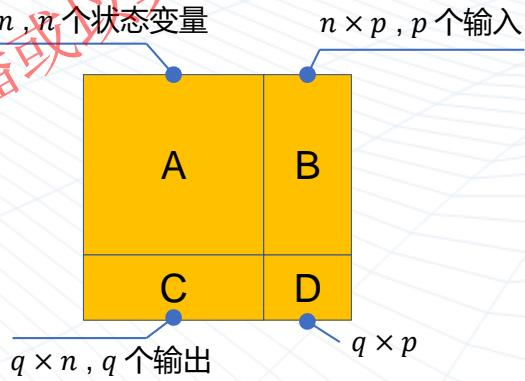

输出

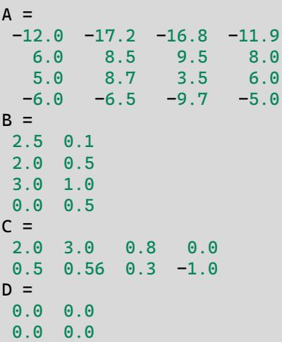

连续时间状态空间模型

# 2.1 线性控制系统的数学模型 - 模型创建

# 三. 零极点增益模型 (zpk)

零极点增益模型实际上是传递函数的一种特殊形式，其将系统表示为零点（Zeros）、极点（Poles）和增益（Gain）相乘的形式：

$$
G (s) = k \frac {\prod_ {i = 1} ^ {m} \left(s + z _ {i}\right)}{\prod_ {j = 1} ^ {n} \left(s + p _ {j}\right)} = k \frac {\left(s + z _ {1}\right) \left(s + z _ {2}\right) \cdots \left(s + z _ {m}\right)}{\left(s + p _ {1}\right) \left(s + p _ {2}\right) \cdots \left(s + p _ {n}\right)}
$$

其中: $k$ 为系统增益, $-z_{i}, i = 1,2,\dots m$ 为系统零点, $-p_{j}, j = 1,2,\dots n$ 为系统极点

示例2.7：构建下面的零极点增益模型

$$
G (s) = \frac {- 2 s}{(s - 1 - i) (s - 1 + i) (s - 2)}
$$

$$
\begin{array}{l} z = [ \theta ] \\ p = [ 1 - 1 i m, 1 + 1 i m, 2 ] \\ k = - 2 \\ G = z p k (z, p, k) \\ \end{array}
$$

输出

$$
- 2 \frac {s}{(s ^ {\wedge} 2 - 2 s + 2) (s - 2)}
$$

连续时间传递函数模型

示例2.8：构建离散时间零极点增益模型，采样时间为 $t_s = 0.125s$

$$
H (z) = \left[ \begin{array}{c} \frac {z}{z - 0 . 3} \\ \frac {2 (z + 0 . 5)}{(z - 0 . 1 + i) (z - 0 . 1 - i)} \end{array} \right]
$$

$$
\begin{array}{l} z = \left[ \left[ [ 0 ] \right]; \left[ - 0. 5 ] \right] \right] \\ p = \left[ \left[ [ 0. 3 ] \right]; \left[ [ 0. 1 - 1 i m, 0. 1 + 1 i m ] \right] \right] \\ k = [ [ 1 ]; [ 2 ] ] \\ G = z p k (z, p, k, 0. 1 2 5) \\ \end{array}
$$

输出


输入1到输出1

1.0z

1.0

1.0z - 0.3

输入1到输出2

1.0z + 0.5

2.0

1.0z^2 - 0.2z + 1.01

Sample Time: 0.125 (seconds)

离散时间传递函数模型

# 2.1 线性控制系统的数学模型 - 模型创建

模型创建相关主要Syslab函数，其余函数请参阅Syslab-控制系统工具箱帮助文档

<table><tr><td>函数及调用方式</td><td>说明</td></tr><tr><td>sys = tf(num,den)</td><td>返回变量为sys的连续时间传递函数</td></tr><tr><td>sys = tf(num,den,ts)</td><td>返回变量为sys的离散时间传递函数，其中ts表示为系统采样时间</td></tr><tr><td>s = tf(&#x27;s&#x27;)</td><td>定义Laplace算子，支持以有理多项式形式创建连续时间传递函数</td></tr><tr><td>z = tf(&#x27;z&#x27;,ts)</td><td>定义Z变换算子及其采样时间ts，支持以有理多项式形式创建离散时间传递函数</td></tr><tr><td>sys = zpk(z,p,k)</td><td>返回变量为sys的连续系统零极点增益模型</td></tr><tr><td>sys = zpk(z,p,k,ts)</td><td>返回变量为sys的离散系统零极点增益模型，其中ts表示为系统采样时间</td></tr><tr><td>sys = ss(A,B,C,D)</td><td>返回变量为sys的连续系统传递函数模型</td></tr><tr><td>sys = ss(A,B,C,D,ts)</td><td>返回变量为sys的离散系统传递函数模型，其中ts表示为系统采样时间</td></tr></table>

# 2.2 线性控制系统的数学模型 - 模型转换

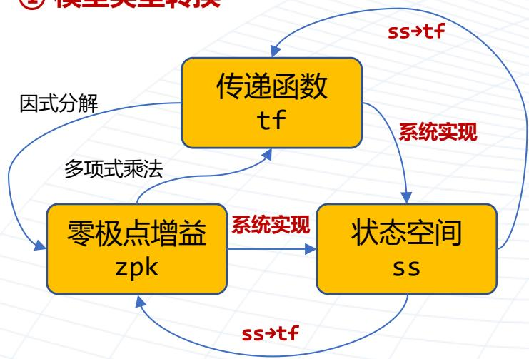  
(1) 模型类型转换

系统实现：对以下形式的传递函数转化为状态空间表达式，即为系统实现

$$
G (s) = \frac {Y (s)}{U (s)} = \frac {b _ {m} s ^ {m} + b _ {m - 1} s ^ {m - 1} + \cdots + b _ {1} s + b _ {0}}{a _ {n} s ^ {n} + a _ {n - 1} s ^ {n - 1} + \cdots + a _ {1} s + a _ {0}}, n \geq m
$$

ss→tf：状态空间模型到传递函数的转化

$$
G (s) = C [ s I - A ] ^ {- 1} B + D
$$


$$
\left[ \begin{array}{l} \dot {x} _ {1} \\ \dot {x} _ {1} \\ \vdots \\ \dot {x} _ {n - 1} \\ \dot {x} _ {n} \end{array} \right] = \left[ \begin{array}{c c c c c} 0 & 1 & 0 & \dots & 0 \\ 0 & 0 & 1 & \dots & 0 \\ \vdots & \vdots & \vdots & \ddots & \vdots \\ 0 & 0 & 0 & \dots & 1 \\ - \frac {a _ {0}}{a _ {n}} & - \frac {a _ {1}}{a _ {n}} & - \frac {a _ {2}}{a _ {n}} & \dots & - \frac {a _ {n - 1}}{a _ {n}} \end{array} \right] \cdot \left[ \begin{array}{l} x _ {1} \\ x _ {2} \\ \vdots \\ x _ {n - 1} \\ x _ {n} \end{array} \right] + \left[ \begin{array}{l} 0 \\ 0 \\ \vdots \\ 0 \\ 1 \end{array} \right] \cdot u
$$

$$
y = \left[ \begin{array}{c c c c c} \frac {b _ {0} - a _ {0} b _ {n}}{a _ {n}} & \frac {b _ {1} - a _ {1} b _ {n}}{a _ {n}} & \frac {b _ {2} - a _ {2} b _ {n}}{a _ {n}} & \dots & \frac {b _ {n - 1} - a _ {n - 1} b _ {n}}{a _ {n}} \end{array} \right] \cdot \left[ \begin{array}{c} x _ {1} \\ x _ {2} \\ \vdots \\ x _ {n - 1} \\ x _ {n} \end{array} \right] + \frac {b _ {n}}{a _ {n}} \cdot u
$$

# Syslab中可以直接通过tf()、ss()、zpk()函数实现不同表达形式模型之间的相互转换

示例2.9：将以下状态空间模型转化为传递函数模型

$$
\dot {x} = \left[ \begin{array}{c c} - 2 & - 1 \\ 1 & - 2 \end{array} \right] \left[ \begin{array}{l} x _ {1} \\ x _ {2} \end{array} \right] + \left[ \begin{array}{c c} 1 & 1 \\ 2 & - 1 \end{array} \right] \left[ \begin{array}{l} u _ {1} \\ u _ {2} \end{array} \right]
$$

$$
y = \left[ \begin{array}{l l} 1 & 0 \end{array} \right] \left[ \begin{array}{l} x _ {1} \\ x _ {2} \end{array} \right] + \left[ \begin{array}{l l} 0 & 1 \end{array} \right] \left[ \begin{array}{l} u _ {1} \\ u _ {2} \end{array} \right]
$$

A = [−2 -1; 1 -2]

$$
B = [ 1, 1; 2, - 1 ]
$$

$$
C = [ 1 0 ]
$$

$$
D = \left[ \begin{array}{l l} 0 & 1 \end{array} \right]
$$

$$
l t i S y s = s s (A, B, C,
$$

$$
D D _ {1}
$$

直接使用tf函数进行转换

$$
s y s = t f (l t i S y s)
$$

输入1到输出1

1.0s

$$
1. 0 s ^ {\wedge} 2 + 4. 0 s + 5. 0
$$

输入2到输出1

$$
1. 0 s ^ {\wedge} 2 + 5. 0 s + 8. 0
$$

$$
1. 0 s ^ {\wedge} 2 + 4. 0 s + 5. 0
$$

连续时间传递函数模型

示例2.10：将以下零极点增益模型转

化为状态空间模型

$$
H (s) = \frac {1 0 (s + 5)}{(s + 8) (s + 1 0) (s + 2)}
$$

$$
z = [ - 5 ]
$$

$$
p = [ - 8, - 1 0, - 2 ]
$$

$$
H = z p k (z, p, 1 0);
$$

直接使用ss函数进行转换

$$
s y s = s s (H)
$$

A =

$$
\begin{array}{c c c} \theta . 0 & 4. 0 & \theta . 0 \end{array}
$$

$$
\begin{array}{c c c} 0. 0 & 0. 0 & 8. 0 \end{array}
$$

$$
\begin{array}{c c c} - 5. 0 & - 1 4. 5 & - 2 0. 0 \end{array}
$$

B =

0.0

0.0

2.0

C =

$$
\begin{array}{c c c} 0. 7 8 1 2 5 & 0. 6 2 5 & 0. 0 \end{array}
$$

D =

0.0

连续时间状态空间模型

# 2.2 线性控制系统的数学模型 - 模型转换

# (2) 连续 - 离散转换

支持连续-离散系统模型的相互转换，以及离散系统之间的重采样

示例2.11：将以下连续模型离散化，采样时间为 $t_s = 0.1s$

$$
G (s) = \frac {s - 1}{s ^ {2} + 4 s + 5}
$$

G = tf([[1, -1], [1, 4, 5]])   
默认离散方法：零阶保持   
Gd = c2d(G, 0.1)   
选用一阶保持离散方法  
Gd1 = c2d(G, 0.1, :foh)


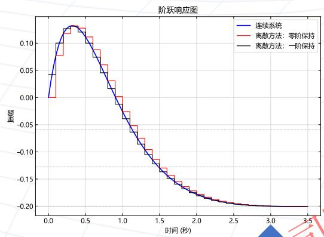

julia> Gd

0.07735946566180907z - 0.08556727104741424

1.0z^2 - 1.6292810191076135z + 0.6703200460356392

Sample Time: 0.1 (seconds)

离散时间传递函数模型

julia>Gd1

0.04226338595954682z^2 - 0.010930071156678323z - 0.03954112018847362

1.0z^2 - 1.6292810191076135z + 0.6703200460356392

Sample Time: 0.1 (seconds)

离散时间传递函数模型

示例2.12: 将以下离散时间系统进行重采样, 重采样时间为 $t_s = 0.02 s$

$$
H (z) = \frac {z - 1}{z ^ {2} + 4 z + 5}, t s = 0. 1 s
$$

H = tf([1, -1], [1, 1, 0.3], 0.1)

对原系统进行重采样

Hc = d2d(H,0.02)


julia> H

1.0z - 1.0

1.0z^2 + 1.0z + 0.3

Sample Time: 0.1 (seconds)

离散时间传递函数模型

julia> Hc

2.052778221587413z - 2.0527782215874133

1.0z^2 - 1.5169814293463761z + 0.7860030855966226

Sample Time: 0.02 (seconds)

离散时间传递函数模型

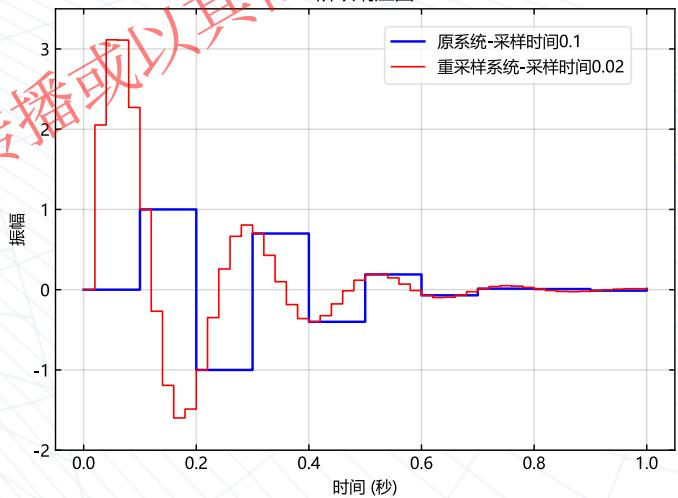  
阶跃响应图

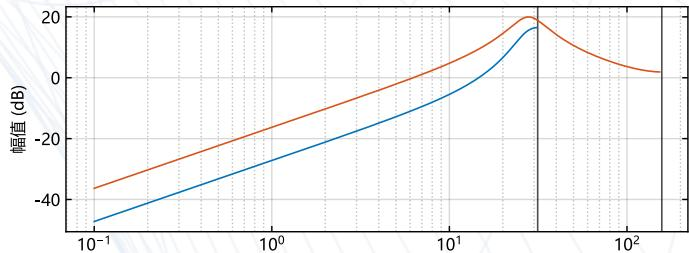  
伯德图


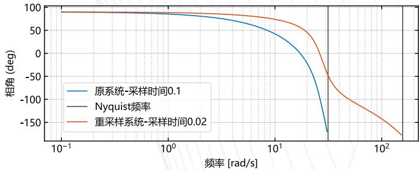

# 2.2 线性控制系统的数学模型 - 模型转换

模型转换相关主要Syslab函数，其余函数请参阅Syslab-控制系统工具箱帮助文档

<table><tr><td>函数及调用方式</td><td>说明</td></tr><tr><td>sys = tf(tfisys)</td><td>将ltisys系统转化为传递函数模型，ltisys可以为ss、zpk</td></tr><tr><td>sys = ss(ltiSys)</td><td>将ltisys系统转化为状态空间模型，ltisys可以为tf、zpk</td></tr><tr><td>sys = zpk(ltiSys)</td><td>将ltisys系统转化为零极点增益模型，ltisys可以为tf、ss</td></tr><tr><td>sysd = c2d(sysc, Ts)</td><td rowspan="2">将连续时间模型转化为离散时间模型</td></tr><tr><td>sysd = c2d(sysc, Ts, method)</td></tr><tr><td>sysc = d2c(sysd)</td><td rowspan="2">将离散时间模型转化为连续时间模型</td></tr><tr><td>sysc = d2c(sysd, method)</td></tr><tr><td>sys1 = d2d(sysc, Ts)</td><td rowspan="2">对离散时间动态系统模型 sys 进行重新采样，以产生具有新采样时间 Ts（以秒为单位）的等效离散时间模型 sys1</td></tr><tr><td>sys1 = d2d(sysc, Ts, method)</td></tr></table>

# 2.3 线性控制系统的数学模型 - 系统连接与化简

# (1) 系统连接

在实际应用中, 整个控制系统由被控对象和控制装置组成, 存在多个环节组合而成。每个单一模型都可以用一组微分方程或传递函数来描述  
□ 模型间连接主要有串联连接、并联连接、串并联连接和反馈连接等。对系统的不同连接情况，可以进行模型的化简

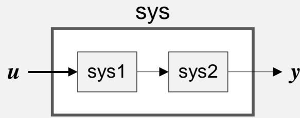  
串联

$$
s y s = s y s 1 \cdot s y s 2
$$

函数调用形式

$$
\mathbf {s y s} = \text {s e r i e s (s y s 1 , s y s 2)}
$$

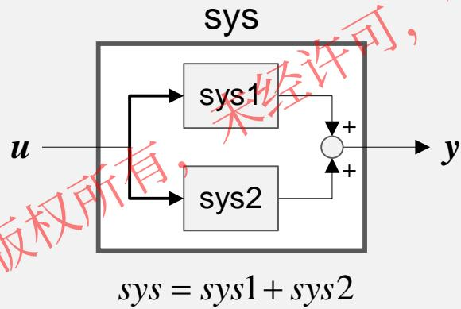  
并联

函数调用形式

$$
\mathrm {s y s} = \text {p a r a l l e l} (\mathrm {s y s 1}, \mathrm {s y s 2})
$$

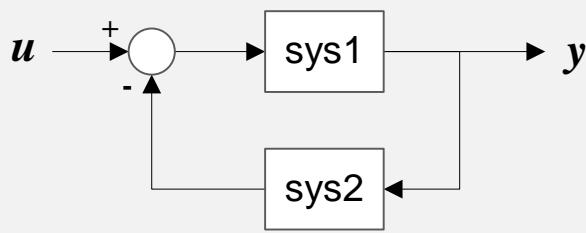  
负反馈

$$
s y s = \frac {s y s 1}{1 + s y s 1 \cdot s y s 2}
$$

函数调用形式

$$
\mathrm {s y s} = \text {f e e d b a c k} (\mathrm {s y s 1}, \mathrm {s y s 2})
$$

除上述三种典型连接外，Syslab还提供 append()、connect()、lft() 等函数支持一些相对复杂的连接，具体可以参考帮助文档

# 2.3 线性控制系统的数学模型 - 系统连接与化简

# (2) 系统变换化简

在复杂结构框图化简中,经常需要将某个支路的输入点从一个节点移动到另一个节点上,进而便于系统推导与简化

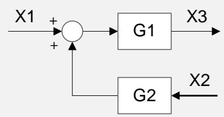  
A. 相加点后移等效变换


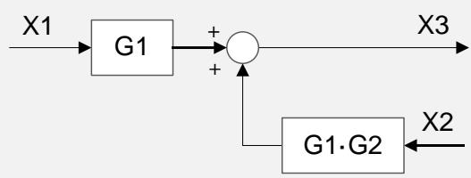

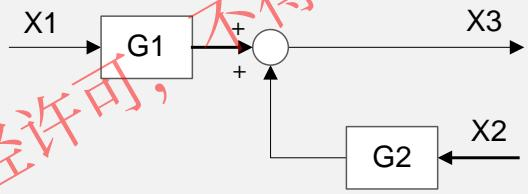  
B. 相加点前移等效变换


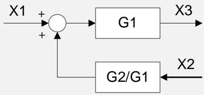

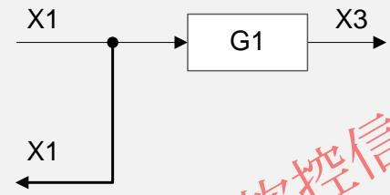  
C. 分支点后移等效变换

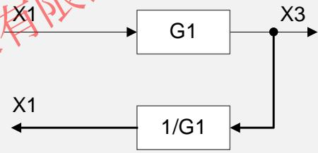

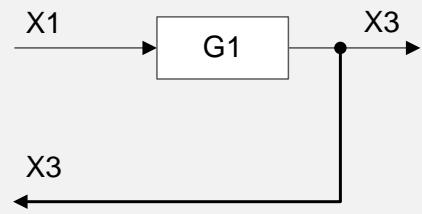  
D. 分支点前移等效变换


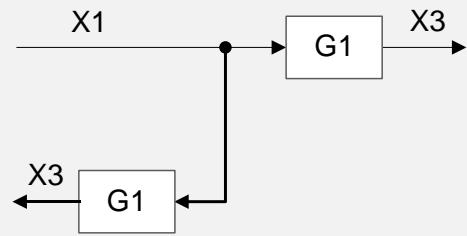

# 2.3 线性控制系统的数学模型 - 系统连接与化简

示例2.13：化简如图系统，求系统的传递函数

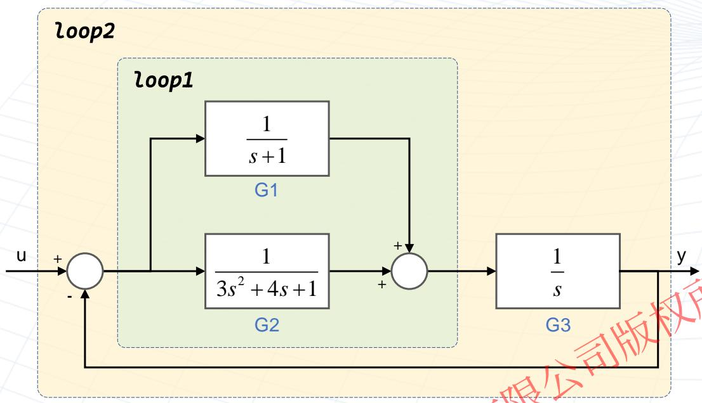

定义各模块模型

$$
G 1 = t f ([ 1 ], [ 1, 1 ])
$$

$$
G 2 = t f ([ 1 ], [ 3, 4, 1 ])
$$

$$
G 3 = t f ([ 1 ], [ 1, 0 ])
$$

计算loop1

$$
l o o p 1 = \text {p a r a l l e l} (G 1, G 2)
$$

计算loop2

$$
\text {l o o p 2} = \text {f e e d b a c k} (\text {l o o p 1} * \text {G 3}, 1)
$$

$$
j u l i a > l o o p 1
$$

$$
3 s ^ {\wedge} 2 + 5 s + 2
$$

$$
3 s ^ {\wedge} 3 + 7 s ^ {\wedge} 2 + 5 s + 1
$$

连续时间传递函数模型

$$
j u l i a > l o o p 2
$$

$$
3 s ^ {\wedge} 2 + 5 s + 2
$$

$$
3 s ^ {\wedge} 4 + 7 s ^ {\wedge} 3 + 8 s ^ {\wedge} 2 + 6 s + 2
$$

连续时间传递函数模型

# 2.3 线性控制系统的数学模型 - 系统连接与化简

示例2.14：给定一个多回路控制系统的方块图，试对其进行化

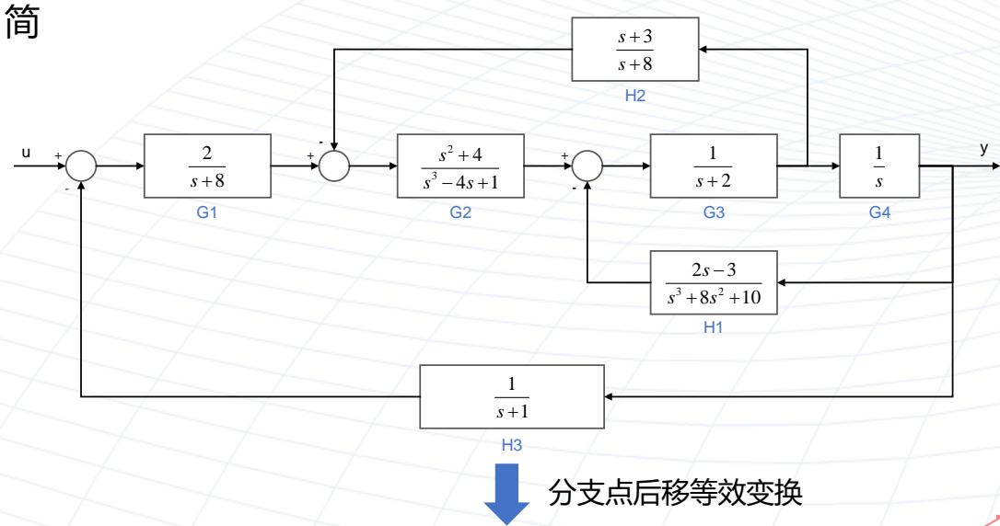

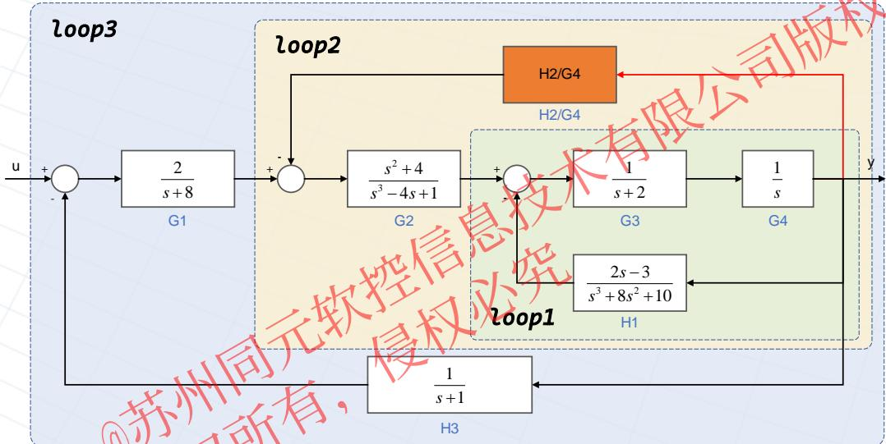

定义各模块模型

$$
G 1 = t f ([ 2 ], [ 1, 8 ])
$$

$$
G 2 = t f ([ 1, \theta , 4 ], [ 1, \theta , - 4, 1 ])
$$

$$
G 3 = t f ([ 1 ], [ 1, 2 ])
$$

$$
G 4 = t f ([ 1 ], [ 1, 0 ])
$$

$$
H 1 = t f ([ 2, - 3 ], [ 1, 8, 0, 1 0 ])
$$

$$
H 2 = t f ([ 1, 3 ], [ 1, 8 ])
$$

$$
H 3 = t f ([ 1 ], [ 1, 1 ])
$$

有内到外计算各回路模型

$$
\text {l o o p 1} = \text {f e e d b a c k} (\mathrm {G} 3 * \mathrm {G} 4, \mathrm {H} 1)
$$

$$
\text {l o o p 2} = \text {f e e d b a c k} (\mathrm {G} 2 * \text {l o o p 1}, \mathrm {H} 2 / \mathrm {G} 4)
$$

$$
\text {l o o p 3} = \text {f e e d b a c k} (\mathrm {G} 1 * \text {l o o p 2}, \mathrm {H} 3)
$$


$$
j u l i a > l o o p 1
$$

$$
s ^ {\wedge} 3 + 8 s ^ {\wedge} 2 + 1 0
$$

$$
s ^ {5} + 1 0 s ^ {4} + 1 6 s ^ {3} + 1 0 s ^ {2} + 2 2 s - 3
$$

连续时间传递函数模型

$$
j u l i a > l o o p 2
$$

$$
s ^ {\wedge} 6 + 1 6 s ^ {\wedge} 5 + 6 8 s ^ {\wedge} 4 + 7 4 s ^ {\wedge} 3 + 3 3 6 s ^ {\wedge} 2 + 4 0 s + 3 2 0
$$

$$
s ^ {\wedge} 9 + 1 8 s ^ {\wedge} 8 + 9 3 s ^ {\wedge} 7 + 7 8 s ^ {\wedge} 6 - 2 3 6 s ^ {\wedge} 5 - 2 2 9 s ^ {\wedge} 4 - 1 6 8 s ^ {\wedge} 3 - 5 5 0 s ^ {\wedge} 2 + 3 8 9 s - 2 4
$$

连续时间传递函数模型

$$
j u l i a > l o o p 3
$$

$$
2 s ^ {\wedge} 7 + 3 4 s ^ {\wedge} 6 + 1 6 8 s ^ {\wedge} 5 + 2 8 4 s ^ {\wedge} 4 + 8 2 0 s ^ {\wedge} 3 + 7 5 2 s ^ {\wedge} 2 + 7 2 0 s + 6 4 0
$$

$$
s ^ {\wedge} 1 1 + 2 7 s ^ {\wedge} 1 0 + 2 6 3 s ^ {\wedge} 9 + 1 0 5 9 s ^ {\wedge} 8 + 1 2 1 0 s ^ {\wedge} 7 - 1 7 2 7 s ^ {\wedge} 6 - 4 0 8 5 s ^ {\wedge} 5 - 3 7 5 8 s ^ {\wedge} 4 - 5 7 5 7 s ^ {\wedge} 3 - 2 5 1 s ^ {\wedge} 2 + 2 9 7 6 s + 4 4 8
$$

连续时间传递函数模型

# 2.3 线性控制系统的数学模型 - 系统连接与化简

示例2.15：考虑以下系统模 $G(s) = \frac{5s^3 + 50s^2 + 155s + 150}{s^4 + 11s^3 + 41s^2 + 61s + 30}$

如果不对其进行任何变换，无法发现该模型有哪些特点

刊

$$
G = t f ([ 5, 5 0, 1 5 5, 1 5 0 ], [ 1, 1 1, 4 1, 6 1, 3 0 ])
$$

$$
G T r a n s = z p k (G)
$$


$$
(1. 0 s + 5. 0) (1. 0 s + 3. 0 0 0 0 0 0 0 0 0 0 0 0 0 9) (1. 0 s + 1. 9 9 9 9 9 9 9 9 9 9 9 9 6)
$$

(1.0s + 4.9999999999999996)(1.0s + 3.0000000000000084)(1.0s + 1.999999999999982)(1.0s + 1.0000000000000009)

连续时间传递函数模型

从零极点模型发现，系统在 $s = -2$ 、-3、-5处有近似相同的零极点。在数学上就可以直接进行对消

系统的最小实现

5.0

$$
G r = \text {m i n r e a l} (G)
$$

$$
1. 0 s + 1. 0 0 0 0 0 0 0 0 0 0 0 0 0 0 0 9
$$

连续时间传递函数模型

$$
A = \left[ - 6 - 1. 5 2 4 9. 5; - 6 - 2. 5 2 5 1 2. 5; \right.
$$

$$
- 5 \theta . 2 5 - 0. 5 3. 5 9. 7 5; - 1 \theta . 5 \theta - 1 1. 5;
$$

$$
- 2 \quad - 1 \quad 1 \quad 2 \quad 3 ]
$$

$$
B = \left[ \begin{array}{l l l l l l l} 6 & 4; & 5 & 5; & 3 & 4; & 0 & 2; & 3 & 1 \end{array} \right]
$$

$$
C = [ 2. 0. 7 5 - 0. 5 - 1. 5 - 2. 7 5, 0 - 1. 2 5
$$

$$
1. 5 \quad 1. 5 \quad 2. 2 5 ]
$$

$$
D = \theta
$$

$$
G = s s (A, B, C, D)
$$

$$
\operatorname {G r} = \operatorname {m i n r e a l} (G)
$$

示例2.16：考虑以下 5 阶双输入双输出系统的最小实现

$$
\dot {x} = \left[ \begin{array}{r r r r r} - 6 & - 1. 5 & 2 & 4 & 9. 5 \\ - 6 & - 2. 5 & 2 & 5 & 1 2. 5 \\ - 5 & 0. 2 5 & - 0. 5 & 3. 5 & 9. 7 5 \\ - 1 & 0. 5 & 0 & - 1 & 1. 5 \\ - 2 & - 1 & 1 & 2 & 3 \end{array} \right] x + \left[ \begin{array}{l l} 6 & 4 \\ 5 & 5 \\ 3 & 4 \\ 0 & 2 \\ 3 & 1 \end{array} \right] u
$$

$$
y = \left[ \begin{array}{c c c c c} 2 & 0. 7 5 & - 0. 5 & - 1. 5 & - 2. 7 5 \\ 0 & - 1. 2 5 & 1. 5 & 1. 5 & 2. 2 5 \end{array} \right] x
$$

A =

-1.2278481012658258 -0.191306397507518 2.7601986869279136   
0.37367324372964017 -1.6275134947441525 0.8611642129490422   
0.19052992136657032 -0.21798219140272376 -1.1446384039900197

B =

-8.888194417315589 -7.200562565926553   
0.0 -3.186204440110084   
0.0 0.0

C =

-0.675052740555615 0.27015199741581764 0.4344110957473698   
-0.5625439504630119 -0.29796176185568113 -0.08835479913505939

D =

0.0 0.0

0.0 0.0

连续时间状态空间模型

5 阶系统消除了 2 个状态变量，得到的最小实现模型为 3 阶

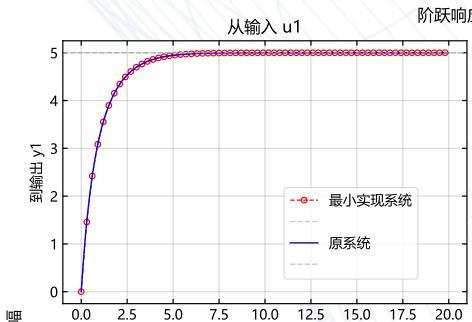  
原系统与最小实现系统的阶跃响应对比

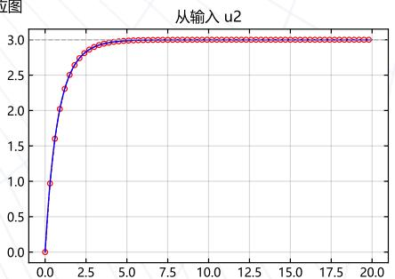

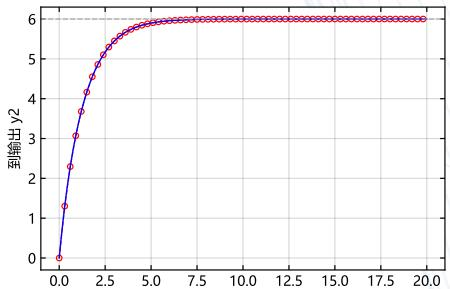  
华

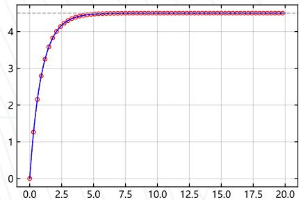  
时间（秒）

# 2.3 线性控制系统的数学模型 - 系统连接与化简

在模型化简中，均衡实现是状态方程的一种非常实用的表示形式，该模型可以将各个状态变量在整个控制系统中的重要程度明确表示出来。Syslab控制工具箱提供 balreal()函数可以将已知模型进行均衡实现

# 示例2.17：考虑将以下模型进行简化处理

$$
G (s) = \frac {s ^ {3} + 1 1 s ^ {2} + 3 6 s + 2 6}{s ^ {4} + 1 4 . 6 s ^ {3} + 7 4 . 9 6 s ^ {2} + 1 5 3 . 7 s + 9 9 . 6 5}
$$

# (1) 将上述模型先进行一个均衡状态空间实现

G = tf([[1, 11, 36, 26], [1, 14.6, 74.96, 153.7, 99.65]])

均衡状态空间模型实现

Gb, g = balreal(ss(G))

julia>Gb

A =

-3.6014357728975983   
-0.8212109733891765   
-0.6163395682048569   
-0.05831495258987857

0.8212109733891815   
-0.592971132963471   
-1.027308416789046   
-0.09033395280224091

-0.61633956820488   
1.0273084167890398   
-5.9138149392968336   
-1.1271647024054359

0.05831495258992703   
-0.09033395280227732  
1.1271647024056717   
4.491778154842064

B =

-1.0019840366001795   
-0.1064122797530519   
-0.0861241166324691  
-0.00811170666811537

C =

-1.0019840366001798

0.10641227975305245

-0.08612411663247543

0.008111706668125246

D =

0.0

连续时间状态空间模型

julia> g

4-element Vector{Float64}：

0.13938496656762894   
0.009548165713944949   
0.0006271217092401019   
7.324469597705166e-6

通过 Gramian 矩阵的对角线向量 g，判定均衡实现的后 2 个状态对系统影响较小

# (2) 通过 modred() 函数从均衡实现中消除对系统影响较小的状态

消除影响较小的两个状态

Gdel $=$ modred(Gb，[3,4]，method $\equiv$ Truncate)

julia> Gdel

A =

-3.6014357728975983   
-0.8212109733891765

0.8212109733891815   
-0.592971132963471

B =

-1.0019840366001795   
-0.1064122797530519

C =

-1.0019840366001798

0.10641227975305245

D =   
0.0

连续时间状态空间模型

# 消除2个影响小的状态变量后得到的系统模型

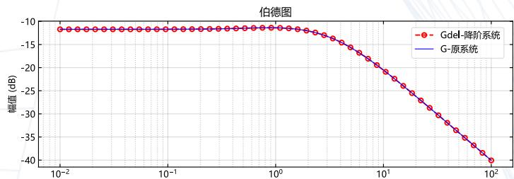

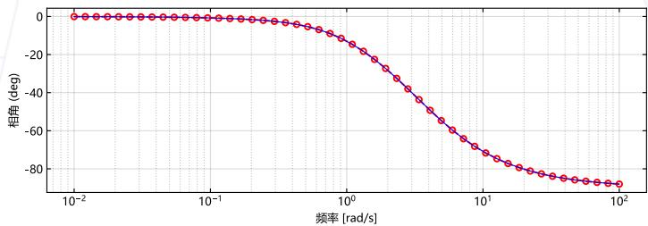

# 原始4阶系统与简化的2阶系统在频率上的响应几乎一致

# 2.3 线性控制系统的数学模型 - 系统连接与化简

系统连接与化简相关主要Syslab函数，其余函数请参阅Syslab-控制系统工具箱帮助文档

<table><tr><td>函数及调用方式</td><td>说明</td></tr><tr><td>sys = feedback(sys1, sys2)</td><td>回模型对象 sys1、sys2 的负反馈互连的模型对象 sys</td></tr><tr><td>sys = parallel(sys1, sys2)</td><td>两个模型的并联连接</td></tr><tr><td>sys = append(sys1, sys2, ..., sysN)</td><td>通过增加模型的输入和输出对模型进行分组</td></tr><tr><td>sysc = connect(blksys, connections, inputs, outputs)</td><td>动态系统的相互连接</td></tr><tr><td>sys = lft(sys1, sys2, nu, ny)</td><td>两个模型的广义反馈互连(Redheffer星积)</td></tr><tr><td>sys = series(sys1, sys2)</td><td>两个模型的串联连接</td></tr><tr><td>sysb, g = balreal(sys)
sysb, g, T = balreal(sys)</td><td>基于gramian的状态空间实现的输入/输出平衡</td></tr><tr><td>sysr = minreal(sys)</td><td>最小实现或极点、零点抵消</td></tr><tr><td>rsys = modred(sys, elim, method = value)</td><td>从状态空间模型中消除状态</td></tr><tr><td>msys = sminreal(sys)</td><td>结构极点/零点对消</td></tr></table>

# 03

# 线性控制系统分析

# 3.1 线性控制系统分析 - 时域分析

时域分析是一种最直观、最直接的分析。一般可以为控制系统预先规定一些特殊的试验输入信号，然后比较各种系统对这些信号的响应情况。

经常采用的试验输入信号  

<table><tr><td>信号名称</td><td>时域表达式</td><td>复频域表达式</td></tr><tr><td>单位阶跃</td><td>1(t),t≥0</td><td>1/s</td></tr><tr><td>单位斜坡</td><td>t,t≥0</td><td>1/s2</td></tr><tr><td>单位加速度</td><td>1/2t2,t≥0</td><td>1/s3</td></tr><tr><td>单位脉冲</td><td>δ(t),t=0</td><td>1</td></tr><tr><td>正弦函数</td><td>A sin ωt</td><td>Aω/s2+ω2</td></tr></table>

# 一. 阶跃响应-step()

口对于稳定系统,通常在系统阶跃响应曲线上来定义系统动态性能指标  
□系统的单位阶跃响应不仅完整反映了系统的动态特性，而且反映了系统在单位阶跃信号输入下的稳定状态。同时，单位阶跃信号又是一个最简单、最容易实现的信号。

<table><tr><td>step调用方式</td><td>说明</td></tr><tr><td>step(sys)</td><td>计算并直接返回系统阶跃响应图。其中sys可以是:tf、ss、zpk</td></tr><tr><td>step(sys,t)</td><td>计算向量t指定时间内的阶跃响应。t为标量:计算[0,t]内的响应,t为向量,计算各点的阶跃响应。示例:·step(G,5)·step(G,0:0.1:10)</td></tr><tr><td>step____,fmt)</td><td>计算并直接返回系统阶跃响应图。fmt为绘图样条属性设置字符串。示例:·step(G,&quot;-bo&quot;,linewidth = 1,markersize = 5,...)·step(G,&quot;-r&quot;,linewidth = 1,ishold = true,...)#将图形绘制在已有figure上</td></tr><tr><td>res = step(sys,t,fig = false)</td><td>计算阶跃响应数据,生成res响应数据为SimResult结构体,不出图。其中:·res.t:时间向量·res.y:响应数组</td></tr><tr><td>y,t,x = step(sys,t,fig = false)</td><td>计算阶跃响应数据,y为响应数据数组,t为时间向量,x为状态数组</td></tr></table>

# 3.1 线性控制系统分析 - 时域分析

# 一. 阶跃响应-step()

示例3.1：计算并绘制以下系统的阶跃响应 $G(s) = \frac{2s + 25}{s^2 + 4s + 25}$

G = tf([2 25], [1 4 25])

阶跃响应基础绘图

step(G,3.5)

# 图形修饰

step(G,0:0.05:3.5,"-ro",linewidth = 1,  
markersize = 5, markeredgecolor = "#0072BD", markerfacecolor = "#EDB120")  
grid("on")

#多个系统响应绘图叠加

step(G,3.5，"-b")  
step(c2d(G,0.1), 3.5, "-r", ishold = true)  
grid("on")

直接获取阶跃响应数据

$$
y, t = \operatorname {s t e p} (G, \operatorname {f i g} = \text {f a l s e})
$$

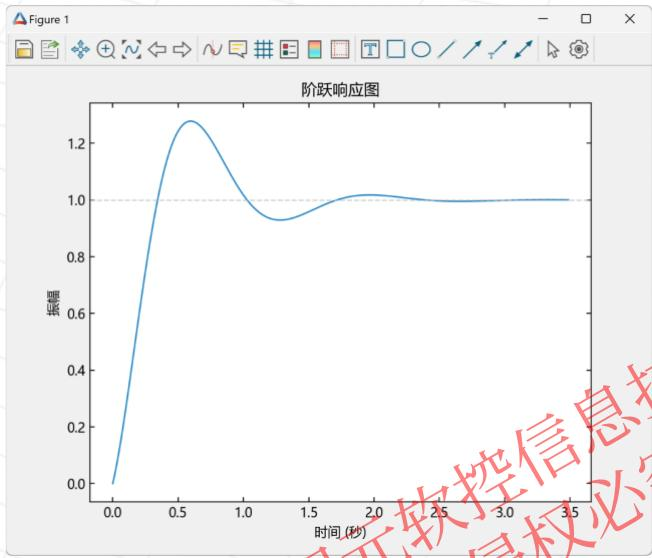

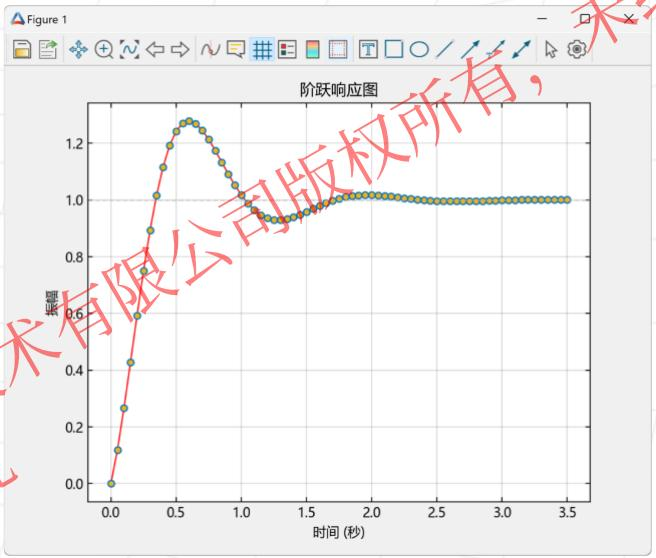

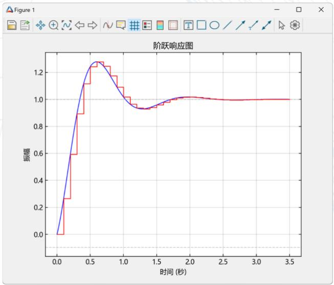

julia> t

101-element Vector{Float64} :

0.0

0.035

0.07

0.105000000000000001

中

3.43

3.4650000000000003

3.5000000000000004

julia> y

1×101 Matrix{Float64}：

0.0 0.0795734 0.174988

0.281454 0.394494 0.510026

0.624432 0.734596 0.837934

0.932392 1.01644 1.08903

1.14961 1.198 ... 0.999587

0.999952 1.00027 1.00054

1.00076 1.00093 1.00105

1.00112 1.00115 1.00115

1.00111 1.00105 1.00096

1.00086

# 3.1 线性控制系统分析 - 时域分析

# 一. 阶跃响应-step()

$$
\left[ \begin{array}{l} \dot {x} _ {1} \\ \dot {x} _ {2} \end{array} \right] = \left[ \begin{array}{c c} - 1 & - 1 \\ 6. 5 & 0 \end{array} \right] \left[ \begin{array}{l} x _ {1} \\ x _ {2} \end{array} \right] + \left[ \begin{array}{c c} 1 & 1 \\ 1 & 0 \end{array} \right] \left[ \begin{array}{l} u _ {1} \\ u _ {2} \end{array} \right]
$$

示例3.2：计算并绘制双输入双输出系统的阶跃响应

$$
\left[ \begin{array}{c} y _ {1} \\ y _ {2} \end{array} \right] = \left[ \begin{array}{c c} 1 & 0 \\ 0 & 1 \end{array} \right] \left[ \begin{array}{c} x _ {1} \\ x _ {2} \end{array} \right] + \left[ \begin{array}{c c} 0 & 0 \\ 0 & 0 \end{array} \right] \left[ \begin{array}{c} u _ {1} \\ u _ {2} \end{array} \right]
$$

定义系统矩阵

$$
A = \left[ - 1 - 1; 6. 5 0 \right]
$$

$$
B = [ 1 1; 1 0 ]
$$

$$
C = [ 1 \quad 0; 0 \quad 1 ]
$$

$$
D = \text {z e r o s} (2, 2)
$$

创建状态空间模型

$$
G = s s (A, B, C, D)
$$

计算系统阶跃响应

$$
\operatorname {s t e p} (G, 1 5)
$$

$$
\operatorname {g r i d} \left(" o n"\right)
$$

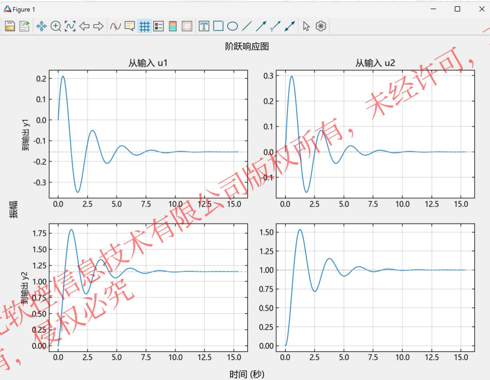

获取输出数据

$$
y, t = \text {s t e p} (G, \text {f i g} = \text {f a l s e})
$$

julia> t

0.0:0.030805850470027103:15.402925235013551

julia $\rightharpoondown$ y

2×1301×2 Array{Float64, 3}:

[;, :, 1] =

0.0 0.0830874 ... -0.153846 -0.153846 -0.153846

0.0 0.117899 1.15385 1.15385 1.15385

[;, :, 2] =

0.0 0.0871829 ... -9.71445e-17 -9.71445e-17

0.0 0.0266207 1.0 1.0

对于MIMO系统的响应数据 $y$ 为一个三维数组，其维度为：

$N_{y} * N * N_{u}$ , 其中:

- $N_{y}$ 为系统输出数量  
$N$ 为时间向量长度  
- $N_{x}$ 为系统输入数量

因此，通过 $y[i, :, j]$ 可取出第 $j$ 个输入到第 $i$ 个输出的阶跃响应数据向量。

# 3.1 线性控制系统分析 - 时域分析

# 一. 阶跃响应-step()

示例3.3：计算并绘制标准二阶系统阶跃响应曲线及响应面 $G(s) = \frac{1}{s^2 + 2\varsigma s + 1}$

(1) 阶跃响应曲线计算与绘制

时间向量定义

t = 0:0.2:10

阻尼比定义

$\zeta = 0:0.05:1.2$ # \zeta<tab>

传递函数及响应变量预定义

num = [θ];

den = [θ θ θ];

y = zeros(length(t), length(ζ))

ty = zeros(length(t), length(ζ))

计算不同阻尼比下的二阶系统阶跃响应

for i in 1:length(ζ)

num = [1]

den = [1, 2 * Z[i], 1]

y[:，i]，ty[:，i] $=$ step(tf(num，den)，t，fig=false)

end

绘制\zeta = 0的阶跃响应曲线

plot(t，y[:，1])

hold("on")

绘制\zeta = 0.2, 0.4, 0.6, 0.8, 1.0, 1.2的阶跃响应曲线

for j in 5:4:length(ζ)

plot(t, y[:, j])

end

# 图形修饰

grid("on")

title(raw"二阶系统阶跃响应曲线,其中:$\omegamega_n$=1

\\(zeta \)=0,0.2,0.4,0.6,0.8,1.0,1.2\( ) xlabel("time(s)"

ylabel("Amplitude")

legend(raw"\zeta=\0", raw"\zeta=\0.2')

raw"\$\\zeta\$=0.4", raw"\$\\zeta\$=0.6", raw"\$\\zeta\$=0.8",

raw"\$\zeta $\)=1.0", raw"\$\zeta\($ =1.2")

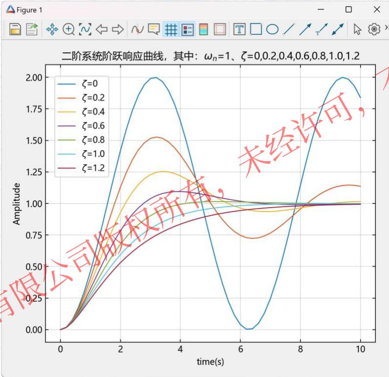

(2) 阶跃响应面绘制

构造3、七构成的网格

zeta, $T =$ meshgrid2( $\zeta ,t)$

三维响应面绘制

s = mesh(T, zeta, y; facealpha=0.95)

grid("off")

三维响应面图形修饰

xlabel("time(s)")

ylabel(raw"\$\zeta\$")

zlabel("Response")

s.set_facecolor("flat")

s.set_edgecolor("dddddd")

plt_update()

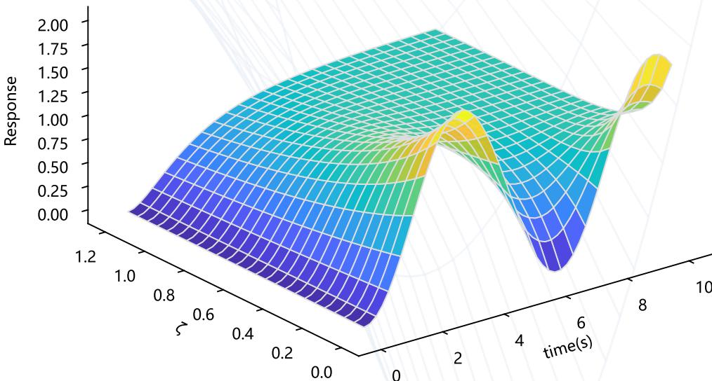

# 3.1 线性控制系统分析 - 时域分析

# 一. 阶跃响应-step()

# 时域分析性能指标

通常控制系统的性能指标以系统对单位阶跃输入量的瞬态响应形式给出

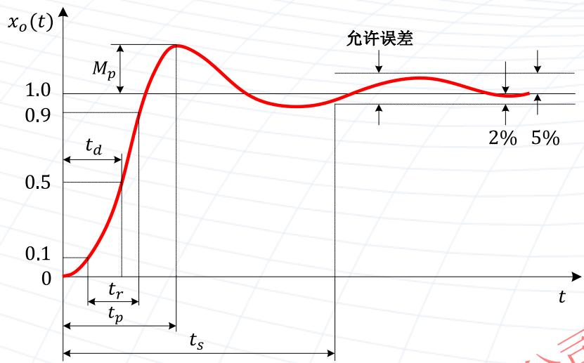

<table><tr><td>时域性能指标</td><td>含义</td></tr><tr><td>上升时间 tr</td><td>响应曲线由稳态值的10%上升到稳态值得90%所需的时间</td></tr><tr><td>峰值时间 tp</td><td>响应曲线从零上升到第一个峰值所需要的时间</td></tr><tr><td>最大超调量 Mp</td><td>响应曲线最大峰值与稳态值之差</td></tr><tr><td>调整时间 ts</td><td>响应曲线达到并一直保持在允许误差范围内的最短时间</td></tr><tr><td>延迟时间 td</td><td>响应曲线从0上升到稳态值的50%所需要的时间</td></tr></table>

通过 stepinfo() 函数计算并获取动态系统阶跃响应特性

示例3.4：获取系统的阶跃响应特性

$$
G (s) = \frac {2 5}{s ^ {2} + 3 s + 1 5}
$$

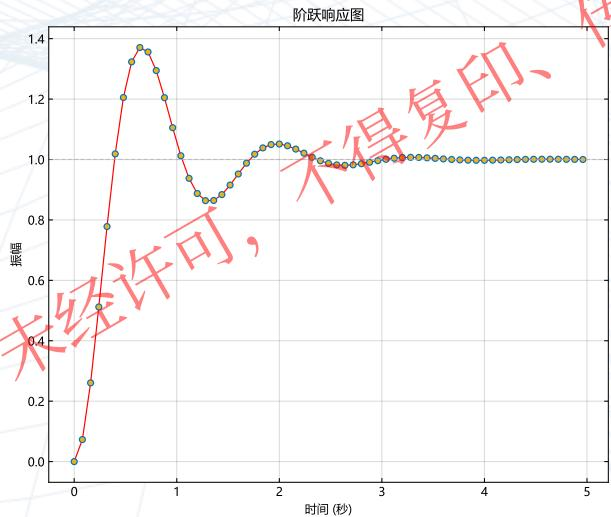

G = tf([[25], [1 3 25]])

计算并获取系统阶跃响应特性

res = steppinfo(G)

上升时间

res.RiseTime

最大超调

res.Overshoot

峰值

res.Peak

峰值时间

res.PeakTime

调整时间

res.SettingTime

# 输出


# 更多设置选项，参考帮助文档

julia> #上升时间

julia> res.RiseTime   
1x1 Matrix{Float64}：

0.26472503148285226

julia> # 最大超调

julia> res.Overshoot

1x1 Matrix{Float64}：

37.1410271661408

julia> # 峰值

julia> res.Peak

1x1 Matrix{Float64}：

1.371410271661408

julia> # 峰值时间

julia> res.PeakTime

1x1 Matrix{Float64}：

0.6447238260382373

julia> # 调整时间

julia> res.SettingTime

1x1 Matrix{Float64}：

2.246034069329275

# 3.1 线性控制系统分析 - 时域分析

# 二. 脉冲响应 - impulse()

系统的脉冲响应（或称为冲激响应）可以用 impulse() 函数进行计算并绘制脉冲响应图。

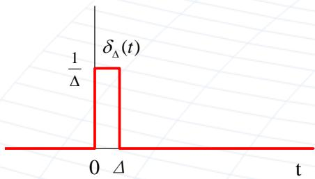

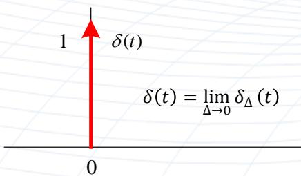

连续时间单位脉冲信号是一个持续时间为 $\Delta$ 的的短脉冲，对于任意的 $\Delta$ 值，其面积均为 1，随着 $\Delta \rightarrow 0$ ， $\delta_{\Delta}(t)$ 变得越来越窄，越来越高，但单位面积不变

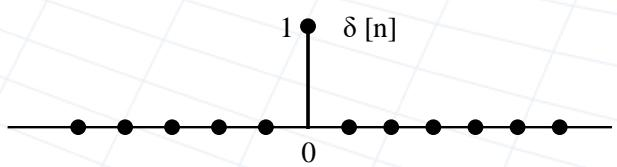

离散时间单位脉冲信号可以表达为：

$$
u [ n ] = \left\{ \begin{array}{l} 0, n \neq 0 \\ 1, n = 0 \end{array} \right.
$$

<table><tr><td>impulse 调用方式</td><td>说明</td></tr><tr><td>impulse(sys)</td><td>计算并直接返回系统脉冲响应图。其中sys可以是:tf、ss、zpk</td></tr><tr><td>impulse(sys,t)</td><td>未经许可,计算向量t指定时间内的脉冲响应。t为标量:计算[0,t]内的响应,t为向量,计算各点的脉冲响应。示例:·impulse(G,5)·impulse(G,0:0.1:10)</td></tr><tr><td>impulse(____,fmt)</td><td>计算并直接返回系统脉冲响应图。fmt为绘图样条属性设置字符串。示例:·impulse(G,&quot;-bo&quot;,linewidth = 1,markersize = 5,...)·impulse(G,&quot;-r&quot;,linewidth = 1,ishold = true,...) #将图形绘制在已有figure上</td></tr><tr><td>res = impulse(sys,t,fig = false)</td><td>计算脉冲响应数据,生成res响应数据为SimResult结构体,不出图。其中:·res.t:时间向量·res.y:响应数组</td></tr><tr><td>y,t,x = impulse(sys,t,fig = false)</td><td>计算阶跃响应数据,y为响应数据数组,t为时间向量,x为状态数组</td></tr></table>

# 3.1 线性控制系统分析 - 时域分析

# 二. 脉冲响应 - impulse()

示例3.5：计算以下系统的脉冲响应 $H(s) = \frac{1}{s^2 + 0.2s + 1}$

$$
\begin{array}{l} H = t f ([ 1 ], [ 1, 0. 2, 1 ]) \\ \mathsf {i m p l u s e} (H) \\ \end{array}
$$

# 图形修饰

$$
\begin{array}{l} H = t f ([ 1 ], [ 1, 0. 2, 1 ]) \\ \begin{array}{l} \text {i m p u l s e (H , 0 : 0 . 4 : 4 0 , " - r d " , l i n e w i d t h = 1 ,} \\ \text {m a r k e r s i z e = 5 , m a k e r e d g e c o l o r =} \\ \text {" \# 0 0 7 2 B D " , m a k e r f a c e c o l o r = " \# E D B 1 2 0 ")} \\ \text {g r i d (\prime \prime o n ")} \end{array} \\ \end{array}
$$

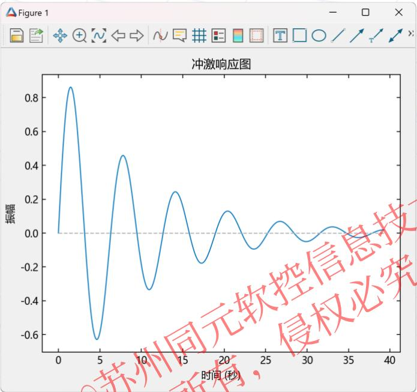

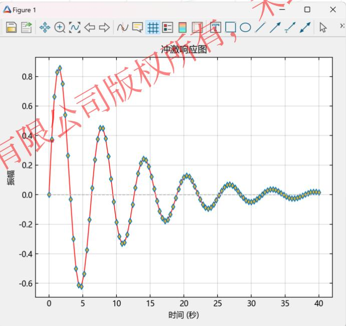

# 求脉冲响应的另一种方法

考虑系统的脉冲响应表达式为: $Y(s) = G(s) \cdot U(s)$ , 其中脉冲信号 $U(s) = 1$

$$
Y (s) = G (s) \cdot 1 = s \cdot G (s) \cdot \frac {1}{s}
$$

因此,求取 $G\left( s\right)$ 的脉冲响应,可以转化为求取 $s \cdot  G\left( s\right)$ 的单位阶跃响应

示例3.6：针对示例3.5，通过阶跃函数求取其脉冲响应

$$
s = t f \left(^ {\prime} s ^ {\prime}\right)
$$

$$
H = t f ([ 1 ], [ 1, 0. 2, 1 ])
$$

通过阶跃函数step求取 $H$ 的脉冲响应

$$
\operatorname {s t e p} (s * H, 4 0, \text {" - r "}, \text {l i n e w i d t h} = 1)
$$

← 两种计算方式等价

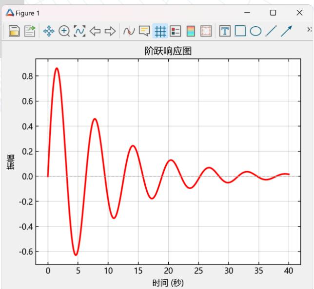

# 3.1 线性控制系统分析 - 时域分析

# 三. 斜坡信号响应

Syslab控制工具箱没有提供斜坡信号响应函数,同样可以考虑使用上面的方法进行求取。考虑系统的斜坡响应表达式为: $Y\left( s\right)  = G\left( s\right)  \cdot  U\left( s\right)$ ,其中斜坡信号: $U\left( s\right)  = \frac{1}{{s}^{2}}$

$$
Y (s) = G (s) \cdot \frac {1}{s ^ {2}} = \frac {1}{s} \cdot G (s) \cdot \frac {1}{s}
$$

求取 $G(s)$ 的斜坡响应，转化为求取 $\frac{1}{s} \cdot G(s)$ 的单位阶跃响应

示例3.7：计算以下系统的斜坡响应

$$
\left[ \begin{array}{l} \dot {x} _ {1} \\ \dot {x} _ {2} \end{array} \right] = \left[ \begin{array}{c c} 0 & 1 \\ - 1 & - 1 \end{array} \right] \left[ \begin{array}{l} x _ {1} \\ x _ {2} \end{array} \right] + \left[ \begin{array}{l} 0 \\ 1 \end{array} \right] u
$$

$$
y = \left[ \begin{array}{c c} 1 & 0 \end{array} \right] \left[ \begin{array}{c} x _ {1} \\ x _ {2} \end{array} \right]
$$

定义Laplace算子

$$
s = t f \left(^ {\prime} s ^ {\prime}\right)
$$

定义状态空间矩阵

$$
A = [ 0 1; - 1 - 1 ]
$$

$$
B = [ 0; 1 ]
$$

$$
C = \left[ \begin{array}{l l} 1 & \theta \end{array} \right]
$$

$$
D = [ \theta ]
$$

创建系统模型

$$
G = s s (A, B, C, D)
$$

指定时间向量

$$
t = 0: 0. 1 5: 1 0
$$

通过step计算斜坡响应

$$
\operatorname {s t e p} ((t f (G) / s), t, " r o")
$$

$$
h o l d (" b n ")
$$

绘制斜坡输入信号

$$
\text {p l o t} (t, t, ^ {\prime \prime} - b ^ {\prime \prime})
$$

legend("斜坡响应","斜坡信号")

$$
\operatorname {g r i d} \left(" o n "\right)
$$

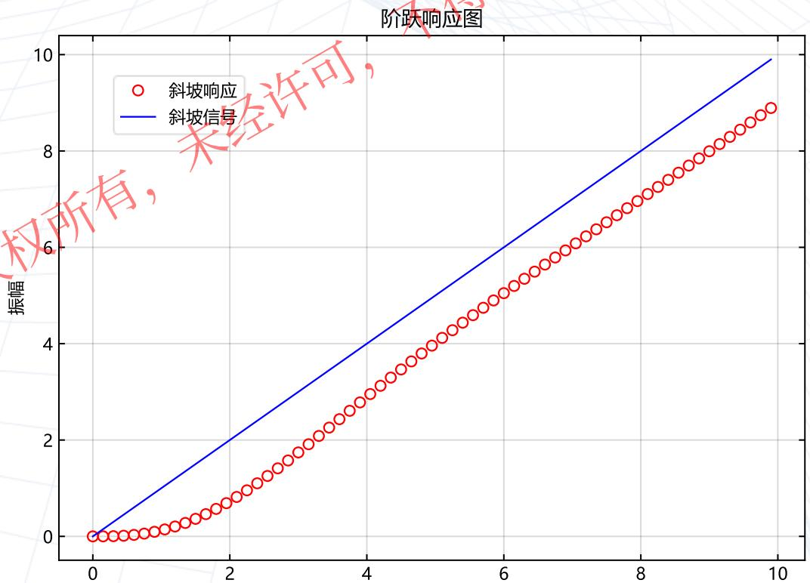  
时间 (秒)

类似的，系统对单位加速度信号的响应可以使用同样的方式计算得到

# 3.1 线性控制系统分析 - 时域分析

# 四. 对任意信号的响应 -lsim()

为了求对任意输入信号的响应，可以使用lsim()函数

<table><tr><td>lsim 调用方式</td><td>说明</td></tr><tr><td>lsim(sys,u,t)</td><td>计算并直接返回系统对输入信号(t,u)的时域响应图。其中t为时间向量，u的维度为:Nu×length(t)</td></tr><tr><td>lsim(sys,u,t,fmt)</td><td>计算并直接返回系统对输入信号(t,u)的时域响应图。fmt为绘图样条属性设置字符串。示例:
·lsim(G,u,t,&quot;-bo&quot;,linewidth=1,markersize=5,...)
·lsim(G,u,t,&quot;-r&quot;,linewidth=1,ishold=true,...) #将图形绘制在已有figure上</td></tr><tr><td>lsim(sys,u,t,x0=value)</td><td>当sys是状态空间模型时，可以进一步指定初始状态值x0，注意x0为向量形式。</td></tr><tr><td>lsim(sys,u,t,x0=value,fmt)</td><td>当sys是状态空间模型时，可以进一步指定初始状态值x0，fmt为绘图样条属性设置字符串。</td></tr><tr><td>res = lsim(sys,u,t,fig=false)</td><td>计算任意信号响应数据，生成res响应数据为SimResult结构体，不出图。其中:
·res.t:时间向量
·res.y:响应数组</td></tr><tr><td>y,t,x=lsim(sys,u,t,fig=false)</td><td>计算任意信号响应数据，y为响应数据数组，t为时间向量，x为状态数组</td></tr></table>

# 3.1 线性控制系统分析 - 时域分析

# 四. 对任意信号的响应 -lsim()

示例3.8：计算系统对自定义斜坡阶跃信号的响应，输入信号在 $t = 0$ 时从 0 开始，在 $t = 1$ 时从 0 开始单位斜坡 1s 到 1，然后在 1 处保持稳定。

定义系统

$$
s y s = t f ([ 3 ], [ 1, 2, 3 ])
$$

创建输入信号

$$
t = 0: 0. 0 8: 8
$$

$$
u = \max . (0, \min . (t - 1, 1))
$$

计算系统响应

$$
l s i m (s y s, r e s h a p e (u, 1, l e n g t h (u)), t, " r o ")
$$

示例3.9：考虑以下系统在输入信号 $u = e^{-t}$ 作用下的响应情况；

假设初始状态为 $x(0) = 0$

创建输入信号

$$
\begin{array}{l} A = \left[ - 1 0. 5; - 1 0 \right] \\ B = [ 0; 1 ] \\ C = \left[ \begin{array}{l l} 1 & 0 \end{array} \right] \\ D = \theta \\ G = s s (A, B, C, D) \\ t = 0: 0. 2: 1 2 \\ u = \exp . (- t) \\ u = \text {r e s h a p e} (u, 1, \text {l e n g t h} (u)) \\ l s i m (G, u, t, \text {" r o "}) \\ \end{array}
$$

状态初值修改


$$
\begin{array}{l} \left[ \begin{array}{l} \dot {x} _ {1} \\ \dot {x} _ {2} \end{array} \right] = \left[ \begin{array}{c c} - 1 & 0. 5 \\ - 1 & 0 \end{array} \right] \left[ \begin{array}{l} x _ {1} \\ x _ {2} \end{array} \right] + \left[ \begin{array}{l} 0 \\ 1 \end{array} \right] u \\ y = \left[ \begin{array}{l l} 1 & 0 \end{array} \right] \left[ \begin{array}{c} x _ {1} \\ x _ {2} \end{array} \right] \\ \end{array}
$$

改变初始状态为： $x(0) = [-0.2, 1.0]$

$$
\begin{array}{l} \begin{array}{l} \text {l s i m (G , u , t , [ - 0 . 2 , 1 . 0 ] , " r p " , m a k e r e d g e c o l o r =} \\ \text {" # 0 0 7 2 B D " , m a k e r f a c e c o l o r = " # D 9 5 3 1 9 ")} \end{array} \\ l e g e n d \left(" 系 统 响 应", " 输入 信 号 " \right) \\ \text {t i l e} \left(" 线 性 仿 真 结 果 ， 初 值 x 0 = [ - 0. 2, 1. 0 ]"\right) \\ \text {g r i d} \left(" o n "\right) \\ \end{array}
$$

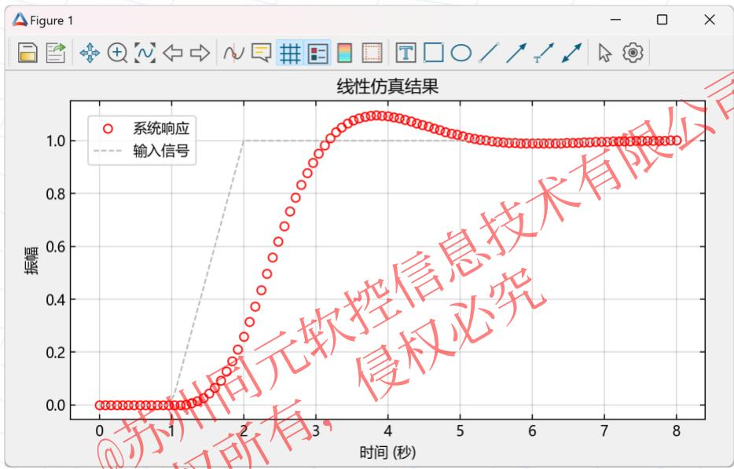

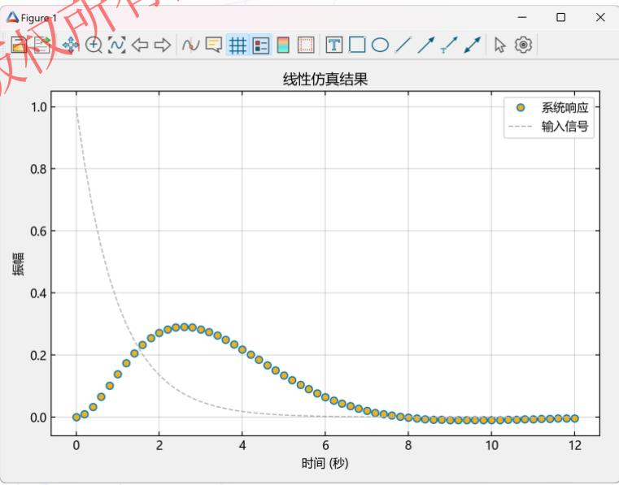

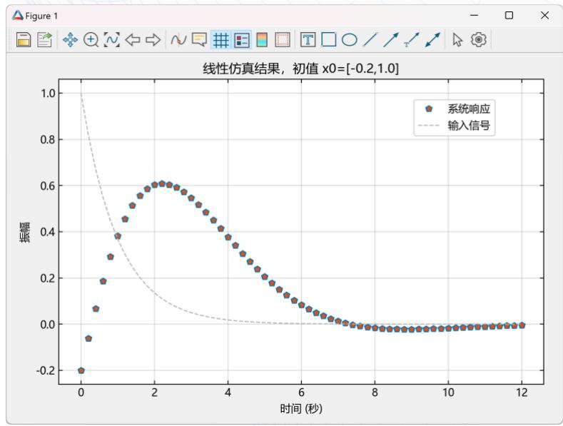

# 3.2 线性控制系统分析 - 频域分析

系统对正弦输入信号的稳态响应成为频率响应。频率特性的图形化表示常用伯德图、奈奎斯特图以及尼克尔斯图。

# 一. 伯德图 - bode()

<table><tr><td>bode 调用方式</td><td>说明</td></tr><tr><td>bode(sys)</td><td>计算系统频率响应,并绘制系统bode图</td></tr><tr><td>bode(sys, w)</td><td>计算系统频率响应,并绘制系统bode图,其中w为指定的计算频率·w为标量:频率特性计算范围为[0, w], Syslab将自动计算频率向量·w为向量:系统将按照w计算指定频率点的响应</td></tr><tr><td>bode(____, fmt)</td><td>计算系统频率响应,并绘制系统bode图。fmt为绘图样条属性设置字符串。示例:·bode(G, w, &quot;-bo&quot;, linewidth = 1, markersize = 5,...)·bode(G, w, &quot;-r&quot;, linewidth = 1, ishold = true,...) #将图形绘制在已有figure上</td></tr><tr><td>mag, phase, wout = bode(sys, fig = false)</td><td>计算系统频率响应数据,不出图。其中:·mag:幅频特性数组,维度为:输出数量*输入数量*频率向量长度·phase:相频特性数组,维度为:输出数量*输入数量*频率向量长度·wout:频率向量</td></tr><tr><td>mag, phase, wout = bode(sys, w, fig = false)</td><td>计算系统频率响应数据,不出图。其中:·mag:幅频特性数组,维度为:输出数量*输入数量*频率向量长度·phase:相频特性数组,维度为:输出数量*输入数量*频率向量长度·wout:频率向量</td></tr></table>

# 3.2 线性控制系统分析 - 频域分析

# 一. 伯德图 - bode()

示例3.10：计算系统频率响应并绘制bode图

$$
G (s) = \frac {1 0 0}{s ^ {2} + 4 s + 1 0 0}
$$

$$
G = t f ([ 1 0 0 ], [ 1, 2, 1 0 0 ])
$$

$$
\mathrm {b o d e} (G)
$$

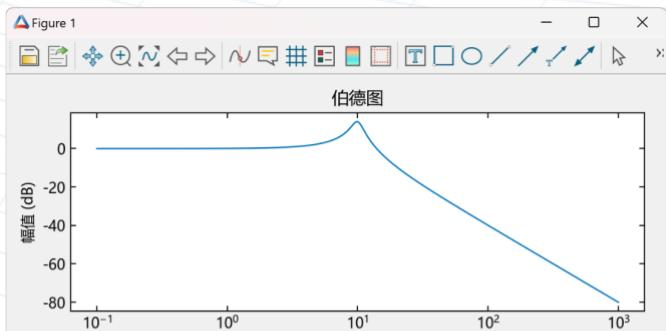

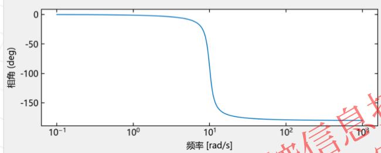

定义频率向量

$$
w = \text {l o g s p a c e} (0, 2, 1 0 0)
$$

定义不同阻尼比的系统模型

$$
G 1 = t f ([ 1 0 0 ], [ 1, 2 * 0. 1 * 1 0, 1 0 0 ])
$$

$$
G 2 = t f ([ 1 0 0 ], [ 1, 2 * 0. 4 * 1 0, 1 0 0 ])
$$

$$
G 3 = t f ([ 1 0 0 ], [ 1, 2 * 0. 8 * 1 0, 1 0 0 ])
$$

# bode图绘制

$$
\text {b o d e} (\mathrm {G 1}, \mathrm {w}, \text {l i n e w i t h} = 1)
$$

$$
\text {b o d e} (\mathrm {G 2}, \mathrm {w}, \text {l i n e w i d t h} = 1, \text {i s h o l d} = \text {t r u e})
$$

$$
\text {b o d e} (G 3, w, \text {l i n e w i d t h} = 1, \text {i s h o l d} = \text {t r u e})
$$

# bode图网格开启

$$
\mathbf {b o d e g r i d} (\text {t r u e})
$$

定义legend

$$
G 1 l = \text {r a w} ^ {\prime \prime} \mathbb {S} G _ {1} \backslash \text {l e f t} (s \backslash \text {r i g h t}) =
$$

$$
\backslash \operatorname {f r a c} \{\{1 0 0 \} \} \{\{\{s ^ {\wedge} 2 \} + 2 s + 1 0 0 \} \} \$
$$

$$
G 2 l = \text {r a w} ^ {\prime \prime} \mathbb {S} G _ {- 2} \backslash \text {l e f t} (s \backslash \text {r i g h t}) =
$$

$$
\left. \text {f r a c} \{\{1 0 0 \} \} \{\{\{s ^ {\wedge} 2 \} + 8 s + 1 0 0 \} \} \right\} \$ ”
$$

$$
G 3 l = \text {r a w} ^ {\prime \prime} \mathbb {S} G _ {-} 3 \backslash \text {l e f t} (s \backslash \text {r i g h t}) =
$$

$$
\backslash \text {f r a c} \{\{1 0 0 \} \} \{\{\{s ^ {\wedge} 2 \} + 1 6 s + 1 0 0 \} \} \$ "
$$

$$
\text {l e g e n d} (G 1 l, G 2 l, G 3 l)
$$


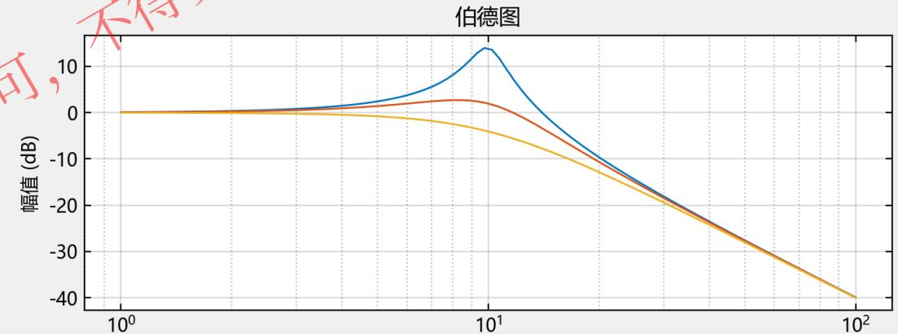

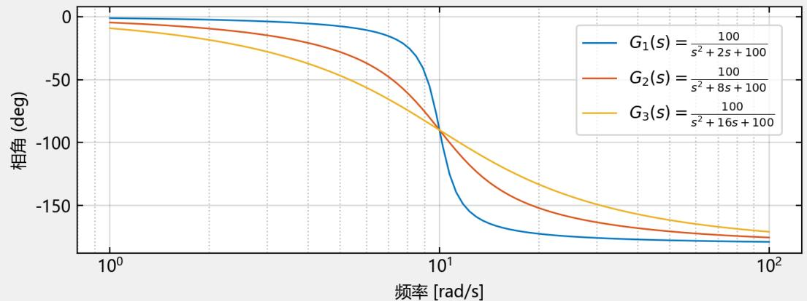

# 3.2 线性控制系统分析 - 频域分析

# 一. 伯德图 - bode()

# 示例3.11：计算下面MIMO系统频率响应并绘制bode图

$$
\begin{array}{l} \left[ \begin{array}{l} \dot {x} _ {1} \\ \dot {x} _ {2} \end{array} \right] = \left[ \begin{array}{c c} - 1 & - 1 \\ 6. 5 & 0 \end{array} \right] \left[ \begin{array}{l} x _ {1} \\ x _ {2} \end{array} \right] + \left[ \begin{array}{c c} 1 & 1 \\ 1 & 0 \end{array} \right] \left[ \begin{array}{l} u _ {1} \\ u _ {2} \end{array} \right] \\ \left[ \begin{array}{c} y _ {1} \\ y _ {2} \end{array} \right] = \left[ \begin{array}{c c} 1 & 0 \\ 0 & 1 \end{array} \right] \left[ \begin{array}{c} x _ {1} \\ x _ {2} \end{array} \right] + \left[ \begin{array}{c c} 0 & 0 \\ 0 & 0 \end{array} \right] \left[ \begin{array}{c} u _ {1} \\ u _ {2} \end{array} \right] \\ \end{array}
$$

定义系统矩阵

创建状态空间模型

绘制系统bode图

$$
\begin{array}{l} A = \left[ \begin{array}{l l l} - 1 & - 1; 6. 5 & 0 \end{array} \right] \\ B = [ 1 1; 1 0 ] \\ c = [ 1 \quad 0; 0 \quad 1 ] \\ D = \text {z e r o s} (2, 2) \\ G = s s (A, B, C, D) \\ \mathrm {b o d e} (G) \\ b o d e g r i d (t r u e) \\ \end{array}
$$

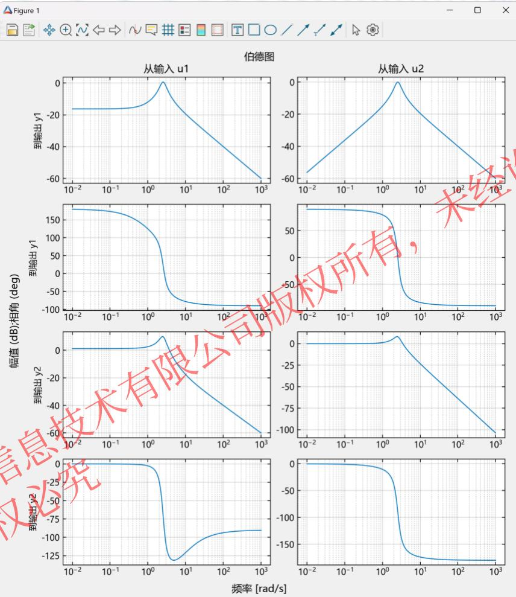

# 计算并获取系统频率响应数据

$$
\begin{array}{l} w = \text {l o g s p a c e} (- 2, 3, 1 0 0) \\ m a g, p h a s e, w o u t = b o d e (G, W, f i g = \text {f a l s e}) \\ \end{array}
$$

julia> mag

$2\times 2\times 100$ Array{Float64，3}：

$$
\begin{array}{l} [ : \:, \:, 1 ] = \\ 0. 1 5 3 8 5 6 \quad 0. 0 0 1 5 3 8 4 8 \\ 1. 1 5 3 8 6 \quad 1. 0 0 0 0 1 \\ \end{array}
$$

$[\therefore ,:,\text{2}] =$

$$
\begin{array}{l} 0. 1 5 3 8 5 9 \quad 0. 0 0 1 7 2 8 2 2 \\ 1. 1 5 3 8 7 \quad 1. 0 0 0 0 2 \\ \end{array}
$$

[;, :, 3] =

$$
\begin{array}{l} 0. 1 5 3 8 6 2 \quad 0. 0 0 1 9 4 1 3 6 \\ 1. 1 5 3 8 7 \quad 1. 0 0 0 0 2 \\ \begin{array}{c c c} \vdots & \vdots & \dots \end{array} \\ \end{array}
$$

julia> phase

$2\times 2\times 100$ Array{Float64,3}：

$$
[ :, :, 1 ] =
$$

$$
\begin{array}{l} \begin{array}{c c} 1 7 9. 3 3 9 & 8 9. 9 1 1 9 \end{array} \\ - 0. 0 1 1 7 5 4 3 - 0. 0 8 8 1 4 8 6 \\ \end{array}
$$

$[ \cdot , \cdot , 2 ] =$

$$
\begin{array}{l} \begin{array}{c c} 1 7 9. 2 5 7 & 8 9. 9 0 1 \end{array} \\ - 0. 0 1 3 2 0 4 3 - 0. 0 9 9 0 1 9 9 \\ \end{array}
$$

[：，：，3] =

$$
\begin{array}{l} \begin{array}{c c} 1 7 9. 1 6 6 & 8 9. 8 8 8 8 \end{array} \\ - 0. 0 1 4 8 3 3 3 - 0. 1 1 1 2 3 2 \\ \end{array}
$$

$$
\begin{array}{c c c} \vdots & \vdots & \dots \end{array}
$$

# 系统频率响应数据mag、phase均为三维数组

其维度: $N_{y} * N_{u} * \text{length}(wout)$ , 其中:

- $N_{y}$ 为系统输出数量  
- $N_{u}$ 为系统输入数量  
- length(wout) 为频率向量长度

因此，通过 mag[i, j,:] 可取出第 j 个输入到第 i 个输出的幅频响应数据向量

# 3.2 线性控制系统分析 - 频域分析

# 一. 伯德图 - bode()

# 系统频域指标

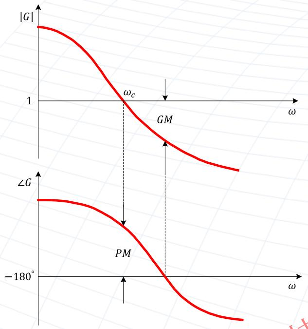  
(1). 开环频域指标

<table><tr><td>开环频域指标</td><td>含义</td></tr><tr><td>开环剪切频率 ωc</td><td>开环频率特性幅值为1对应的频率</td></tr><tr><td>幅值裕度 GM</td><td>在相角等于-180°的频率上，幅频特性|G(jω)|的倒数</td></tr><tr><td>相位裕度 PM</td><td>剪切频率处，相频特性距-180°线的相位差</td></tr></table>

# 通过 margin() 函数计算系统开环频率指标

示例3.12：设一闭环系统如下，绘制其开环传递函数bode图，并确定其增益裕度、相位裕度

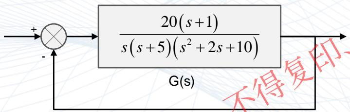

$$
\begin{array}{l} s = t f \left(^ {\prime} s ^ {\prime}\right) \\ G o p e n l o o p = 2 0 * (s + 1) / (s * (s + 5) * \left(s ^ {\wedge} 2 + 2 * s + 1 0\right)) \\ m a r g i n (G o p e n l o o p) \end{array}
$$

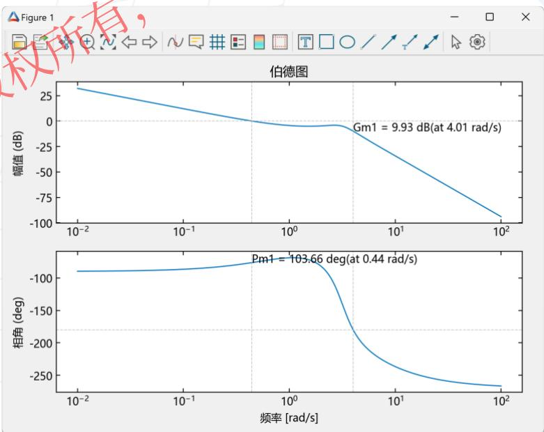

$$
\begin{array}{l} \text {G m , P m , W c g , W c p = m a r g i n (G o p e n l o o p , f i g =} \\ \text {f a l s e)} \end{array}
$$

julia> Gm #绝对单位，可通过 20*log10.(Gm)计算dB值

1x1 Matrix{Float64}：

3.17675128297679

julia> Pm # 相位裕度

1x1 Matrix{Float64}：

103.66528865343292

julia> Wcg # 增益裕度对应频率

1x1 Matrix{Float64}：

4.02997029195757

julia> Wcp # 开环剪切频率

1x1 Matrix{Float64}：

0.4429643273018798

# 3.2 线性控制系统分析 - 频域分析

# 一. 伯德图 - bode()

# 系统频域指标

(2). 闭环频域指标

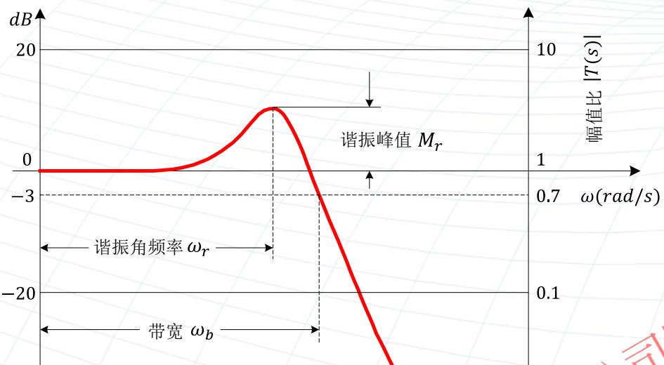

# 通过getPeakGain()、bandwidth()函数计算系统闭环谐振峰值与带宽

示例3.13：考虑如图闭环系统，利用Syslab求取其闭环表达式，并计算其谐振峰值、谐振频率和带宽

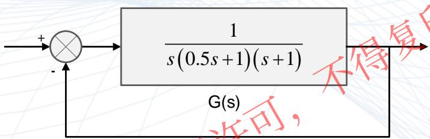

$$
\begin{array}{l} s = t f \left(^ {\prime} s ^ {\prime}\right) \\ G o p e n l o o p = 1 / (s * (0. 5 * s + 1) * (s + 1)) \\ G c l o s e l o o p = f e a d b a c k (G o p e n l o o p) \\ g p e a k, f p e a k = g e t P e a k G a i n (G c l o s e l o o p) \\ f b = b a n d w i d t h (G c l o s e l o o p) \end{array}
$$


输出

以绝对单位给出谐振峰值，可通过  
20\*log10.(gpeak)计算dB值  
julia> gpeak, fpeak = getPeakGain(Gcloseloop)  
(1.8371191411343013, 0.8164820126772819)  
julia> fb = bandwidth(Gcloseloop)  
1x1 Matrix{Float64}：  
1.2697224015878297

# 考虑通过带宽含义计算得到系统带宽

给定频率向量  
w = logspace(-1,1,500)  
# 定义系统模型  
s = tf('s')  
Gopenloop = 1/(s*(0.5*s+1)*(s+1))  
Gcloseloop = feedback(Gopenloop)  
# 计算频率响应  
mag, phase, w = bode(Gcloseloop, w, fig = false)  
# 计算系统带宽  
n = 1  
while 20*log10(log[n]) ≥ -3  
    n = n + 1  
end  
# 获取带宽值  
w[n]  
julia > w[n]  
1.2653317593889428

<table><tr><td>闭环频域指标</td><td>含义</td></tr><tr><td>闭环谐振频率 ωr</td><td>产生谐振峰值对应的频率</td></tr><tr><td>闭环谐振峰值 Mr</td><td>谐振频率处对应的幅值大小</td></tr><tr><td>带宽 ωb</td><td>对数幅频特性的幅值下降到-3dB时对应的频率</td></tr></table>

# 3.2 线性控制系统分析 - 频域分析

# 二.奈奎斯特图-nyquist()

示例3.14：计算示例3.11的MIMO系统频率响应并绘制Nyquist图

$$
\begin{array}{l} \left[ \begin{array}{l} \dot {x} _ {1} \\ \dot {x} _ {2} \end{array} \right] = \left[ \begin{array}{c c} - 1 & - 1 \\ 6. 5 & 0 \end{array} \right] \left[ \begin{array}{l} x _ {1} \\ x _ {2} \end{array} \right] + \left[ \begin{array}{c c} 1 & 1 \\ 1 & 0 \end{array} \right] \left[ \begin{array}{l} u _ {1} \\ u _ {2} \end{array} \right] \\ \left[ \begin{array}{l} y _ {1} \\ y _ {2} \end{array} \right] = \left[ \begin{array}{c c} 1 & 0 \\ 0 & 1 \end{array} \right] \left[ \begin{array}{l} x _ {1} \\ x _ {2} \end{array} \right] + \left[ \begin{array}{c c} 0 & 0 \\ 0 & 0 \end{array} \right] \left[ \begin{array}{l} u _ {1} \\ u _ {2} \end{array} \right] \\ \end{array}
$$

# 三. 尼克尔斯图 -Nichols()

示例3.15：绘制系统对数幅-相

图

$$
G (s) = \frac {1 0 0}{s ^ {2} + 2 s + 1 0 0}
$$

定义系统矩阵

$$
A = \left[ \begin{array}{l l l} - 1 & - 1; 6. 5 & 0 \end{array} \right]
$$

$$
B = \left[ \begin{array}{l l l} 1 & 1; 1 & 0 \end{array} \right]
$$

$$
C = [ 1 \quad 0; 0 \quad 1 ]
$$

$$
D = \text {z e r o s} (2, 2)
$$

创建状态空间模型

$$
G = s s (A, B, C, D)
$$

绘制系统Nyquist图nyquist(G)

nyquistgrid(true)

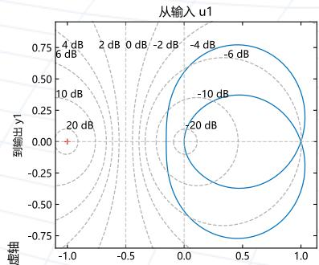  
奈奎斯特图

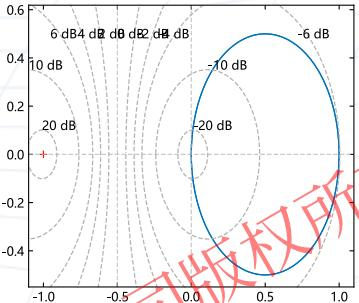  
从输入u2

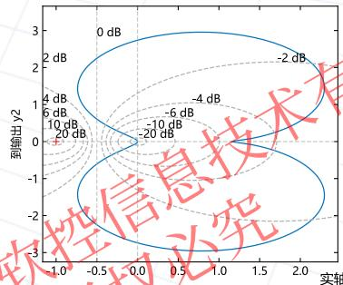

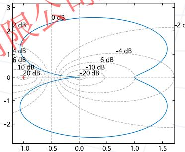

定义系统

$$
G = t f ([ 1 0 0 ], [ 1 2 1 0 0 ])
$$

绘制nichols图并开启网格

$$
\mathsf {n i c h o l s} (G)
$$

nicholsgrid(true)

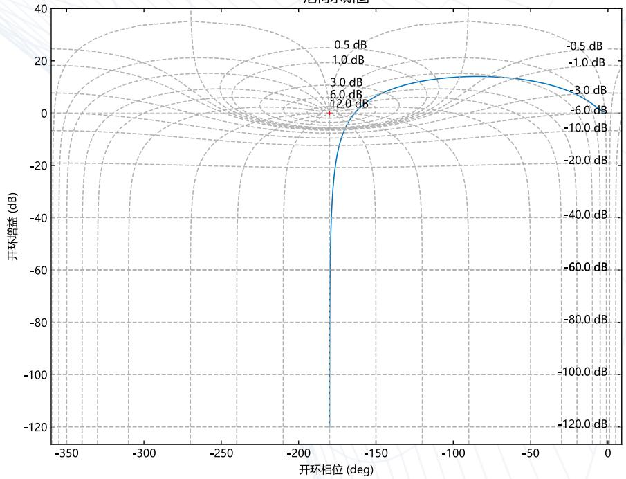  
尼柯尔斯图

Nyquist图、Nichols图的绘制、修饰与bode()用法一致，具体可以参考bode图示例及参考文档，这里不再赘述

# 3.2 线性控制系统分析 - 根轨迹

根轨迹法是经典控制理论的两大核心设计方法之一（另一为频率响应法）

根轨迹定义：当系统开环增益 $K$ 由 0 到 $\infty$ 变化时，闭环极点在 $s$ 平面的轨迹

根轨迹法的理论基础：闭环系统瞬态响应的基本特性与闭环极点的位置紧密相关。如果系统具有可变的开环增益，则闭环极点的位置取决于所选择的开环增益值。因此，当开环增益变化时，系统闭环极点在s平面如何移动，以及如何设计校正环节使得闭环极点按照期望的位置移动，即是根轨迹设计方法的基本原理。

求解三阶以上的特征方程根异常麻烦，Syslab则为该问题提供了一个简便的解法

<table><tr><td>rlocus 调用方式</td><td>说明</td></tr><tr><td>rlocus(sys)</td><td>计算系统根轨迹，并给出根轨迹图，支持时间连续系统与时间离散系统</td></tr><tr><td>rlocus(sys, K)</td><td>指定系统开环增益K，计算系统根轨迹，并绘制系统根轨迹图
• K为标量：开环增益计算范围为[0, K]，Syslab将自动计算增益向量
• K为向量：系统将按照K计算指定增益的的根轨迹响应</td></tr><tr><td>z, p, k = rlocus(sys, fig = false)</td><td>计算系统根轨迹，不出图。其中
• z:系统零点
• p:闭环极点数组
• k:开环增益数组</td></tr><tr><td>z, p, k = rlocus(sys, K, fig = false)</td><td>计算系统在指定开环增益K下的根轨迹，不出图。其中：
• z:系统零点
• p:闭环极点数组
• k:开环增益数组</td></tr><tr><td>pzgrid()</td><td>根轨迹网格开关。pzgrid(true)开启网格，pzgrid(false)关闭网格</td></tr></table>

# 3.2 线性控制系统分析 - 根轨迹

示例3.16：绘制以下系统根轨迹，考虑开环增益从0~1000变化

$$
G (s) = \frac {0 . 6 7 8 6 s - 0 . 3 5 4 0}{s ^ {4} + 9 . 7 1 4 6 s ^ {3} + 2 5 . 8 5 2 1 s ^ {2} + 1 7 . 4 7 0 4 s + 5 . 2 4 3 7}
$$

系统定义

$$
\mathbf {n u m} = [ 0. 6 7 6 8, - 0. 3 5 4 0 ]
$$

$$
d e n = [ 1. 0 0 0 0, 9. 7 1 4 6, 2 5. 8 5 2 1, 1 7. 4 7 0 4,
$$

$$
5. 2 4 3 7 ]
$$

$$
G = t f (\text {n u m}, \text {d e n})
$$

开环增益向量

$$
k = 0: 0. 1: 1 0 0 0
$$

根轨迹绘制

$$
\mathbf {r l o c u s} (G, k)
$$

网格开启

pzarid(true)


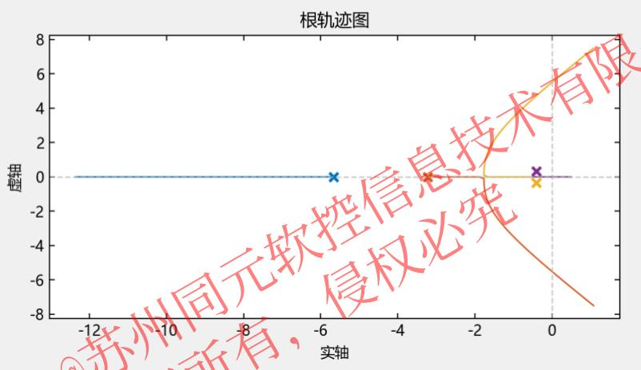

# 闭环极点位置对系统性能的影响

系统的瞬态响应类型由闭环极点确定，一阶系统简单，其总是稳定的、无震荡、响应单调；而高阶系统的响应一般是由一阶和二阶系统响应的组合构成。所以这里主要讨论闭环极点与二阶系统时域响应性能关系。

一般情况下,针对高阶系统进行控制律设计时,常常需要对高阶系统的增益进行调整,以便使系统具有一对闭环主导共轭复数极点,此时,闭环极点将起到相对主导作用。如果实部的比值超过5,且在极点附近不存在零点,那么距离s平面虚轴最近的闭环极点将对瞬态响应起主导作用。在这种情况下,高阶系统可以近似考虑仅由其主导极点构成的二阶系统来近似。

# 考虑典型的二阶系统表达：

上述系统的特征方程：

$$
\left\{ \begin{array}{l} - p _ {1} = - \varsigma \omega_ {n} + \omega_ {n} \sqrt {\varsigma^ {2} - 1} \\ - p _ {2} = - \varsigma \omega_ {n} - \omega_ {n} \sqrt {\varsigma^ {2} - 1} \end{array} \right.
$$

$$
G (s) = \frac {Y (s)}{R (s)} = \frac {\omega_ {n} ^ {2}}{s ^ {2} + 2 \varsigma \omega_ {n} s + \omega_ {n} ^ {2}}
$$

$$
s ^ {2} + 2 \varsigma \omega_ {n} s + \omega_ {n} ^ {2} = (s + p _ {1}) (s + p _ {2}) = 0
$$

考虑不同阻尼系数对系统的影响  

<table><tr><td colspan="2">阻尼系数</td><td>特征根</td><td>特征根位置</td><td>响应曲线</td></tr><tr><td>无阻尼</td><td>ζ=0</td><td>±jωn</td><td>虚轴上一对共轭虚根</td><td>等幅振荡</td></tr><tr><td>欠阻尼</td><td>0&lt;ζ&lt;1</td><td>-ζωn±j·ωn√1-ζ2</td><td>s左半平面的一对共轭复根</td><td>衰减震荡</td></tr><tr><td>临界阻尼</td><td>ζ=1</td><td>-ωn</td><td>负实轴上一对重根</td><td>单调上升</td></tr><tr><td>过阻尼</td><td>ζ&gt;1</td><td>-ζωn±ωn√ζ2-1</td><td>负实轴上两个互异根</td><td>单调上升</td></tr></table>

# 3.2 线性控制系统分析 - 根轨迹

# 闭环极点位置对系统性能的影响

针对典型二阶欠阻尼系统，其特征根为s左半平面一对共轭复根

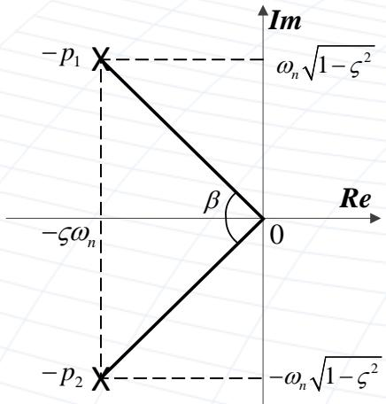

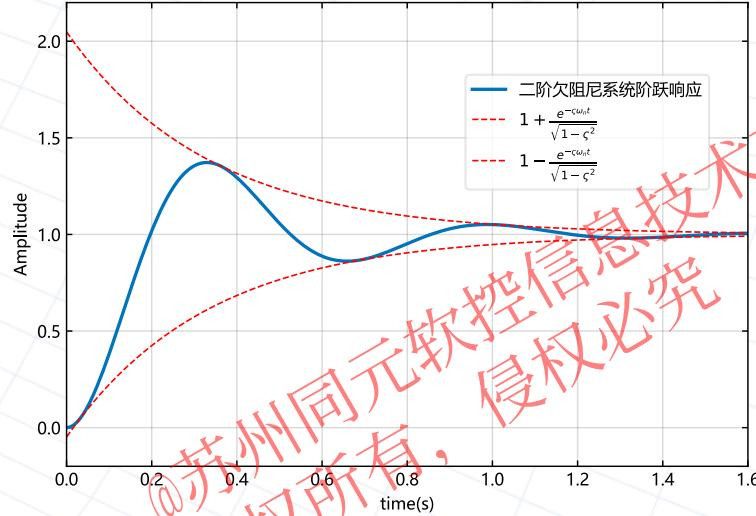  
Step Response and The Envelope Curves of Second Order System

$\beta$ 为二阶系统共轭复根对负实轴的张角, 显然有以下的关系: $\varsigma = \cos \beta$

因此， $\beta$ 被称为阻尼角，系统阻尼越大，阻尼角越小

根据阶跃响应时域表达式可以计算系统调整时间，调整时间是指系统响应维持在稳态值的某个误差百分比δ范围内所需要的时间。考虑误差为±2%的系统调整时间：

$$
e ^ {- \varsigma \omega_ {n} T _ {s}} <   0. 0 2
$$

得到调整时间近似值：

$$
T _ {s} = \frac {4}{\varsigma \omega_ {n}}
$$

因此，调整时间与极点实部的绝对值 $|\zeta \omega_{n}|$ 呈反比

基于根轨迹法的控制器设计，可依据上述分析作为依据参考，结合Syslab所绘制的系统根轨迹，辅助开展校正环节的设计。

# 3.2 线性控制系统分析 - 能观能控性分析

Syslab提供一系列函数支持系统的能观能控性分析  

<table><tr><td>系统特性计算或分析函数</td><td>说明</td></tr><tr><td>ctrb</td><td>状态空间模型的可控性</td></tr><tr><td>ctrbf</td><td>计算可控性阶梯形式</td></tr><tr><td>obsv</td><td>状态空间模型的可观察性</td></tr><tr><td>obsvf</td><td>计算可观察阶梯形式</td></tr><tr><td>lyap</td><td>连续李亚普诺夫方程解</td></tr><tr><td>dlyap</td><td>求解离散时间李亚普诺夫方程</td></tr><tr><td>icare</td><td>连续时间代数Riccati方程的隐式求解器</td></tr><tr><td>idare</td><td>离散时间代数Riccati方程的隐式求解器</td></tr><tr><td>norm</td><td>线性模型的范数</td></tr><tr><td>gram</td><td>Gramians方法判断可控性和可观察性</td></tr></table>

这些函数用法比较简单，因此不再举例说明，详细用法可以参考Syslab控制工具箱帮助文档

# 04

# PID控制器设计

# 4.1 PID控制在工业界的应用

国际自动控制联合会（IFAC）每三年召开一次的世界大会是自动控制领域的顶级学术会议

TABLE 1 A list of the survey results in order of industry impact as perceived by the committee members.   

<table><tr><td>Rank and Technology</td><td>High-Impact Ratings</td><td>Low- or No-Impact Ratings</td></tr><tr><td>PID control</td><td>100%</td><td>0%</td></tr><tr><td>Model predictive control</td><td>78%</td><td>9%</td></tr><tr><td>System identification</td><td>61%</td><td>9%</td></tr><tr><td>Process data analytics</td><td>61%</td><td>17%</td></tr><tr><td>Soft sensing</td><td>52%</td><td>22%</td></tr><tr><td>Fault detection and identification</td><td>50%</td><td>18%</td></tr><tr><td>Decentralized and/or coordinated control</td><td>48%</td><td>30%</td></tr><tr><td>Intelligent control</td><td>35%</td><td>30%</td></tr><tr><td>Discrete-event systems</td><td>23%</td><td>32%</td></tr><tr><td>Nonlinear control</td><td>22%</td><td>35%</td></tr><tr><td>Adaptive control</td><td>17%</td><td>43%</td></tr><tr><td>Robust control</td><td>13%</td><td>43%</td></tr><tr><td>Hybrid dynamical systems</td><td>13%</td><td>43%</td></tr></table>

IFAC在2014年发布的一项调查报告显示，PID仍然是在工业领域具有最大影响力的控制技术

Tariq Samad, A Survey on Industry Impact and Challenges Thereof

https://ieeexplore.ieee.org/stamp/stamp.jsp?arnumber=7823045

Table 2 The percentage of survey respondents indicating whether a control technology had demonstrated ("Current Impact") or was likely to demonstrate over the next five years ("Future Impact") high impact in practice.   

<table><tr><td></td><td>Current Impact</td><td>Future Impact</td></tr><tr><td>Control Technology</td><td>%High</td><td>%High</td></tr><tr><td>PID control</td><td>91%</td><td>78%</td></tr><tr><td>System Identification</td><td>65%</td><td>72%</td></tr><tr><td>Estimation and filtering</td><td>64%</td><td>63%</td></tr><tr><td>Model-predictive control</td><td>62%</td><td>85%</td></tr><tr><td>Process data analytics</td><td>51%</td><td>70%</td></tr><tr><td>Fault detection and identification</td><td>48%</td><td>78%</td></tr><tr><td>Decentralized and/or coordinated control</td><td>29%</td><td>54%</td></tr><tr><td>Robust control</td><td>26%</td><td>42%</td></tr><tr><td>Intelligent control</td><td>24%</td><td>59%</td></tr><tr><td>Discrete-event systems</td><td>24%</td><td>39%</td></tr><tr><td>Nonlinear control</td><td>21%</td><td>42%</td></tr><tr><td>Adaptive control</td><td>18%</td><td>44%</td></tr><tr><td>Repetitive control</td><td>12%</td><td>17%</td></tr><tr><td>Hybrid dynamical systems</td><td>11%</td><td>33%</td></tr><tr><td>Other advanced control technology</td><td>11%</td><td>25%</td></tr><tr><td>Game theory</td><td>5%</td><td>17%</td></tr></table>

2020年在Annual Reviews in Control中发表的Industry engagement with control research: Perspective and messages，表明PID控制的当前影响力最高，且在未来5年内可能是工业实践中影响力较高的控制技术，紧随其后的则是MPC技术

https://www.sciencedirect.com/science/article/pii/S1367578820300080

# 4.2 PID控制器原理分析

在当今应用的工业控制器中，有半数以上采用了PID或变形PID控制器。PID控制的价值取决于它们对大多数控制系统的广泛适用性，体现在：

□原理简单，应用方便，参数整定灵活   
□适用性强，特别是当被控对象的数学模型未知，而不能使用解析设计方法时，PID控制就显得特别有用  
□鲁棒性强，控制品质对受控对象的变化不太敏感，如受控对象受外界扰动时，无需经常改变控制器参数或结构

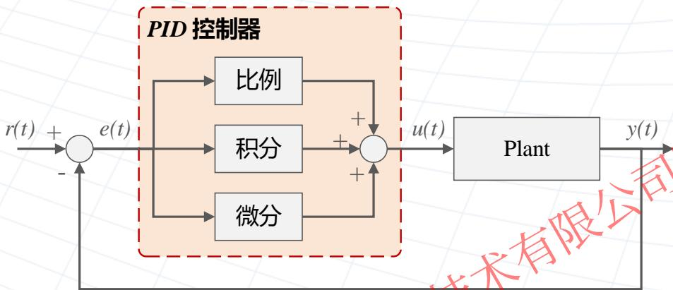

PID控制是通过对误差信号 $e(t)$ 进行比例、积分、微分运算和结果的加权处理, 得到控制器的输出 $u(t)$ , 最为控制对象的控制值。

$$
u (t) = K _ {P} \cdot e (t) + \frac {1}{K _ {I}} \int_ {0} ^ {t} e (t) d t + K _ {D} \frac {d e (t)}{d t}
$$

经Laplace变换后，PID控制器可描述为：

$$
G _ {c} (s) = K _ {P} + \frac {1}{K _ {I} s} + K _ {D} s
$$

其中, $K_{P}$ 为比例系数, $K_{I}$ 为积分时间常数, $K_{D}$ 微分时间常数

# 4.2 PID控制器原理分析

<table><tr><td></td><td>积分控制</td><td>比例控制</td><td>微分控制</td></tr><tr><td>控制作用与表达式</td><td>u=1/K1·∫0t e dt</td><td>u=Kp·e不得复印</td><td>u=KD·de/dt</td></tr><tr><td>特点</td><td>·控制输出不仅与偏差大小有关,还与偏差存在的时间长短有关
·无差调节。只要偏差存在,调节器就会一直作用,直到偏差为0,调节器会稳定不变</td><td>·偏差一旦发生,即时控制,没有时滞,动态性好
·有差调节。被调节量无法与设定值完全相等,它们之间一定有残差</td><td>·根据误差变化率采取控制作用,偏差变化越剧烈,控制作用越强,能够提升系统稳定性,偏差无变化,则不起作用
·有差调节。微分调节无法完全消除残差</td></tr><tr><td>系数影响</td><td>S=1/K1为积分速度
·增大积分速度:能够加快调节速度,但当积分速度大于某一临界值后,系统可能不稳定。另外,积分速度越快,越容易引起震荡
·减小积分速度:偏差消除速度减慢,系统稳定性增加一般不会单独使用,其作为一种辅助的调节,通常与比例控制组合使用</td><td>·增加比例系数:实质上相当增加开环放大倍数,系统响应加快,稳态误差减小但不能消除,增大到一定阈值后,系统可能会发散不稳定
·减小比例系数:响应减慢,稳态误差变大,但稳定裕度提升</td><td>·增大微分系数:控制作用增强。需要说明的是,微分作用与偏差大小无关,与偏差变化率正相关
·减小微分系数:控制作用减小。</td></tr></table>

积分控制，对过去的偏差进行累计并消除不忘历史

比例控制，对现在的偏差进行即时调整把握当下

微分控制，预测将来的偏差并作出反应展望未来

# 4.2 PID控制器原理分析 - 纯比例控制

# Syslab提供 pid() 函数支持创建并行形式 (parallel-form) 的连续时间、离散时间PID控制器

示例4.1：已知被控对象传递函数如下，考虑采用纯比例控制，比例系数分别为： $K_{P} = 0.5$ 、2.0、2.4、3.0、3.5，求系统闭环的单位阶跃响应

$$
C _ {p} (s) = K _ {p}, K _ {p} = \left[ 0. 5, 2. 0, 2. 4, 3. 0, 3. 5 \right]
$$

$$
G (s) = \frac {1}{(s + 1) (2 s + 1) (5 s + 1)}
$$

创建被控对象模型

$$
s = t f \left(" s "\right)
$$

$$
G = 1 / ((s + 1) * (2 * s + 1) * (5 * s + 1))
$$

$$
\mathrm {K p} = [ 0. 5, 2. 0, 2. 4, 3. 0, 3. 5 ]
$$

预定义开环系统

$$
\begin{array}{l} \text {G C p} = \text {A r r a y} \{\text {T y C o n t r o l S y s t e m s . T r a n s f e r F u n c t i o n} \} (\text {u n d e f}, \\ \text {l e n g t h (k p)}) \end{array}
$$

# 不同增益的开环系统定义及闭环阶跃响应计算

for i in 1:length(Kp)

$$
G C p [ i ] = \operatorname {p i d} (K p [ i ]) * G
$$

$$
\text {s t e p (f e a c k b a r d} (\mathrm {G C p} [ \mathrm {i} ])  , 3 5, \text {i s h o l d} = \text {t r u e}, \text {l i n e w i d t h} = 1. 5)
$$

end

grid("on")

hold("on")

SetPoint绘制

plot([0,35],[1,1],"--k",linewidth = 1.5)

#legend绘制

lines $=$ gca().getlines()

```python
legend([[lines[1], lines[3], lines[5], lines[7], lines[9]],

lines[11]，["Kp=0.5"，"Kp=2.0"，"Kp=2.4"，"Kp=3.0"，"Kp=3.5"，

"Setpoint=1"]

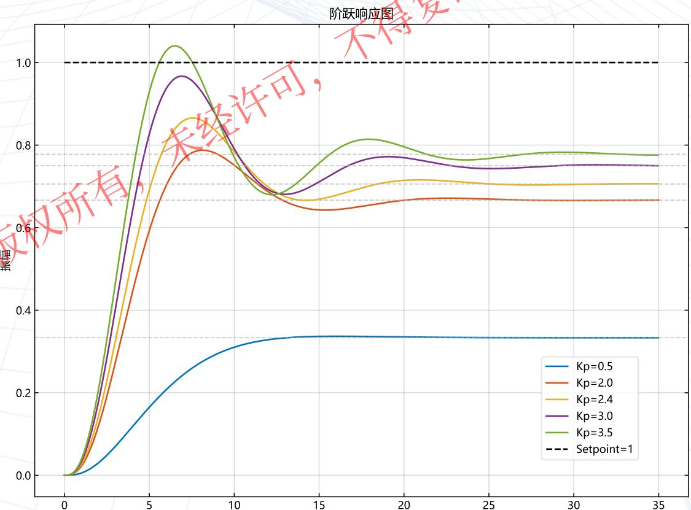  
时间 (秒)

纯P控制是有差调节  
比例系数越大，系统稳态误差越小，响应越快，但超调越大

# 4.2 PID控制器原理分析 - 比例-微分控制

示例4.2：对上述示例的被控对象采用PD控制，确定比例系数为 $K_{P} = 5$ ，考虑微分系数分别为： $K_{D} = 0.1$ 、0.7、1.5、3.5、8.0，求系统闭环的单位阶跃响应

$$
C _ {p d} (s) = K _ {p} + K _ {d} \cdot s, K _ {p} = 5, K _ {d} = [ 0. 1, 0. 7, 1. 5, 3. 5, 8. 0 ]
$$

创建被控对象模型

$$
s = t f \left(" s "\right)
$$

$$
G = 1 / ((s + 1) * (2 * s + 1) * (5 * s + 1))
$$

$$
\mathrm {K d} = [ 0. 1, 0. 7, 1. 5, 3. 5, 8. 0 ]
$$

#预定义开环系统

$$
\begin{array}{l} \text {G C p d = A r r a y \{T y C o n t r o l S y s t e m s . T r a n s f e r F u n c t i o n \}} (\text {u n d e f}, \\ \text {l e n g t h (k d)}) \end{array}
$$

# 不同增益的开环系统定义及闭环阶跃响应计算

$$
\begin{array}{r l} & \text {f o r i i n 1 : l e n g t h (K d)} \\ & \quad G C p d [ i ] = \operatorname {p i d} (5, 0, K d [ i ]) * G \\ & \quad \text {s t e p (f e e d b a c k (G C p d [ i ]) , 3 5 , i s h o l d = t r u e , l i n e w i d t h = 1 . 5)} \end{array}
$$

end

$$
\text {g r i d} \left(" o n "\right)
$$

$$
h o l d (" o n")
$$

$$
\text {t i l t e} \left(" \text {系 统 在 P D 控 制 器 作 用 下 的 阶 跃 响 应 ，} \mathrm {k p} = 5 ^ {\prime \prime}\right)
$$

SetPoint绘制

$$
\text {p l o t} ([ 0, 3 5 ], [ 1, 1 ], \text {" - - k "}, \text {l i n e w i d t h} = 1. 5)
$$

# legend绘制

$$
\begin{array}{l} l i n e s = \operatorname {g c a} () \cdot \text {g e t} _ {-} \text {l i n e s} () \\ \text {l e g e n d} \left(\left[ \text {l i n e s} [ 1 ], \text {l i n e s} [ 3 ], \text {l i n e s} [ 5 ], \text {l i n e s} [ 7 ], \text {l i n e s} [ 9 ], \right. \right. \\ l i n e s [ 1 1 ] \left[ ^ {\prime \prime} K d = 0. 1 ^ {\prime \prime}, ^ {\prime \prime} K d = 0. 7 ^ {\prime \prime}, ^ {\prime \prime} K d = 1. 5 ^ {\prime \prime}, ^ {\prime \prime} K d = 3. 5 ^ {\prime \prime}, ^ {\prime \prime} K d = 8. 0 ^ {\prime \prime}, \right. \\ " S e t p o i n t = 1 " ]) \\ \end{array}
$$

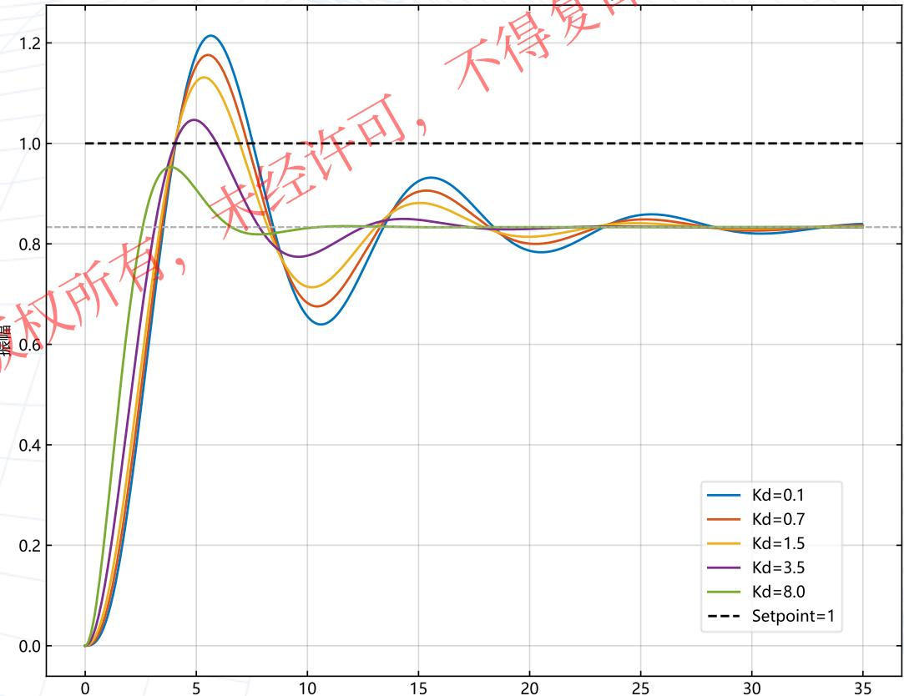  
系统在PD控制器作用下的阶跃响应， $Kp = 5$   
时间 (秒)

> PD控制引入微分项后，提升了系统稳定性，且加快了系统响应速度  
但PD控制无法消除系统残差

# 4.2 PID控制器原理分析 - 比例-积分控制

示例4.3：对上述示例的被控对象采用PI控制，确定比例系数为 $K_{P} = 2$ ，考虑积分系数分别为： $K_{I} = 1.5$ 、3.0、7.0、10、15，求系统闭环的单位阶跃响应

$$
C _ {p i} (s) = K _ {p} + \frac {1}{K _ {i} \cdot s}, K _ {p} = 2, K _ {i} = [ 1. 5, 3. 0, 7. 0, 1 0, 1 5 ]
$$

创建被控对象模型

$$
s = t f \left(" s " \right.
$$

$$
G = 1 / ((s + 1) * (2 * s + 1) * (5 * s + 1))
$$

$$
\mathrm {K i} = [ 1. 5, 3, 7, 1 0, 1 5 ]
$$

预定义开环系统

GCpi = Array{TyControlSystems.TransferFunction} (undef, length(Kd))

# 不同增益的开环系统定义及闭环阶跃响应计算

for i in 1:length(Kd)  
    GCpi[i] = pid(2,1/Ki[i])*G  
    step.Feedback(GCpi[i]),100,ishold = true,linewidth = 1.5)

end

grid("on")

hold("on")

title("系统在PI控制器作用下的阶跃响应，Kp = 2")

SetPoint绘制

plot([0,100],[1,1],"--k",linewidth $= 1.5$

#legend绘制

lines $=$ gca().getlines()

```python
legend([[lines[1], lines[3], lines[5], lines[7], lines[9]],

lines[11]，["Ki=1.5"，"Ki=3.0"，"Ki=7.0"，"Ki=10"，"Ki=15"，

"Setpoint=1"]

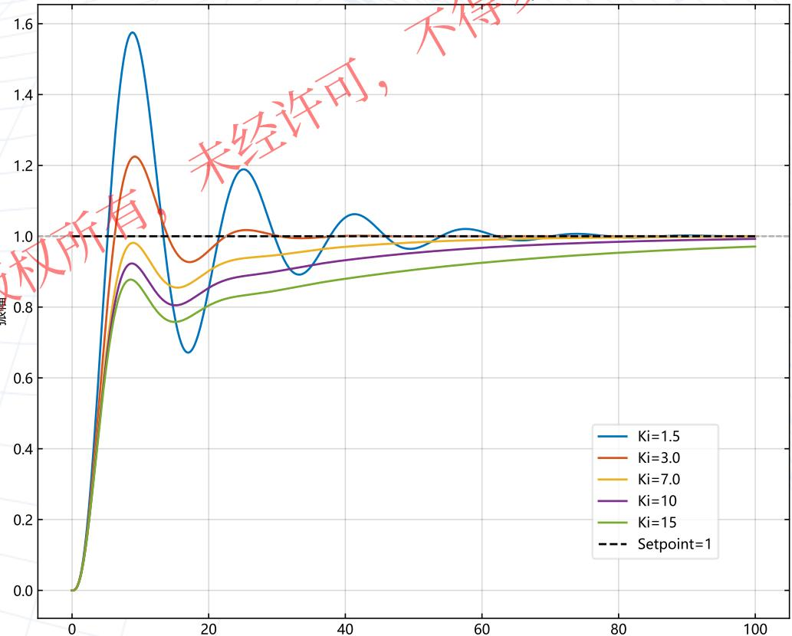  
系统在PI控制器作用下的阶跃响应， $Kp = 2$   
时间 (秒)

PI控制器引入了积分项，可以消除残差  
本材料中给出的积分系数为 $1 / K_{i}$ ,因此, $K_{i}$ 越小, 积分作用越强,系统稳定性会越差

# 4.2 PID控制器原理分析 - 比例-积分-微分控制

示例4.4：针对上述系统，对比采用P控制、PD控制、PI控制，PID控制的响应情况

创建被控对象模型

$$
s = t f \left(" s "\right)
$$

$$
G = 1 / ((s + 1) * (2 * s + 1) * (5 * s + 1))
$$

定义各类型PID控制器

$$
C = [ \text {p i d} (3. 5), \text {p i d} (3. 5, 0, 3. 5), \text {p i d} (3. 5, 1 / 2), \text {p i d} (3. 5, 1 / 2, 3. 5) ]
$$

预定义开环系统

$$
\begin{array}{l} \text {G C} = \text {A r r a y} \{\text {T y C o n t r o l S y s t e m s . T r a n s f e r F u n c t i o n} \} (\text {u n d e f}, \\ \text {l e n g t h (C)}) \end{array}
$$

开环系统定义及闭环阶跃响应计算

$$
f o r \quad i \text {i n} 1: l e n g t h (C)
$$

$$
G C [ i ] = C [ i ] * G
$$

$$
\text {s t e p (f e e d b a c k} (\mathrm {G C} [ \mathrm {i} ])  , 6 0, \text {i s h o l d} = \text {t r u e}, \text {l i n e w i d t h} = 1. 5)
$$

end

$$
\text {g r i d} \left(" o n "\right)
$$

$$
h o l d \left(" o n "\right)
$$

title("系统在各类PID控制器作用下的阶跃响应")

SetPoint绘制

$$
\text {p l o t} ([ 0, 6 0 ], [ 1, 1 ], \text {" - - k "}, \text {l i n e w i d t h} = 1. 5)
$$

legend绘制

$$
C p = r a w" \\( C _ {-} \{P \} = 3. 5 \$
$$

$$
C p d = r a w ^ {\prime \prime} \$ C _ {-} \{P D \} = 3. 5 + 3. 5 s
$$

$$
C p i = r a w " \\( C _ {\_} \{P I \} = 3. 5 + \text {F r a c} \{1 \} \{\{2 s \} \} \$
$$

$$
C p i d = r a w {"} \mathbb {S} C _ {-} \{\text {P I D} \} = 3. 5 + \backslash f r a c \{1 \} \{\{2 s \} \} + 3. 5 s \mathbb {S}"
$$

$$
l i n e s = g c a (). \text {g e t} _ {\text {l i n e s}} ()
$$

$$
\text {l e g e n d} ([ \text {l i n e s} [ 1 ], \text {l i n e s} [ 3 ], \text {l i n e s} [ 5 ], \text {l i n e s} [ 7 ] ],
$$

$$
[ C p, C p d, C p i, C p i d ] \big)
$$

$$
C _ {p} = K _ {p}, K _ {p} = 3. 5
$$

$$
C _ {p d} = K _ {p} + K _ {d} \cdot s, K _ {p} = 3. 5, K _ {d} = 3. 5
$$

$$
C _ {p i} (s) = K _ {p} + \frac {1}{K _ {i} \cdot s}, K _ {p} = 3. 5, K _ {i} = 2
$$

$$
C _ {p i d} (s) = K _ {p} + \frac {1}{K _ {i} \cdot s} + K _ {d} \cdot s, K _ {p} = 3. 5, K _ {i} = 2, K _ {d} = 3. 5
$$

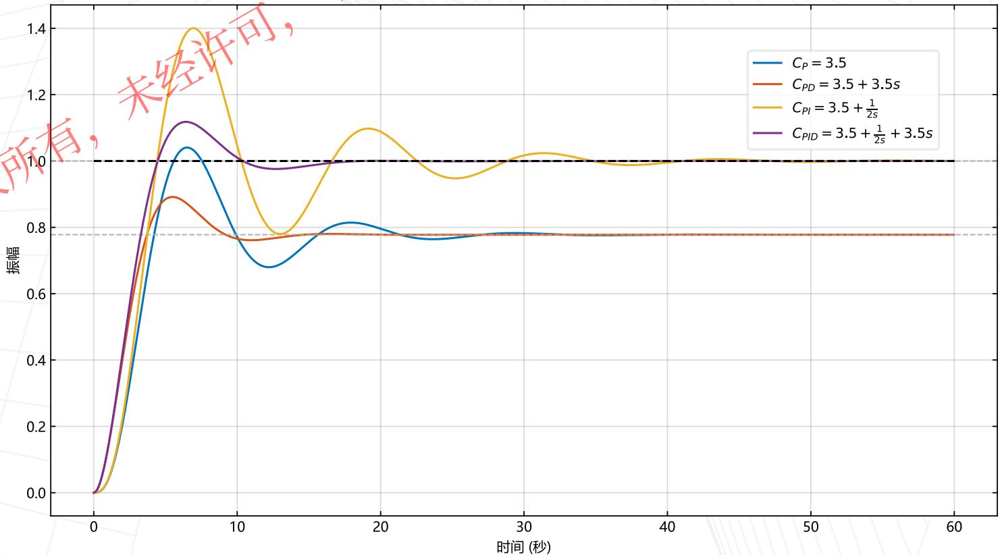  
系统在各类PID控制器作用下的阶跃响应

# 4.3 PID控制器设计

本章节介绍了PID控制器原理，并通过示例演示了各个调节的作用、以及P、I、D控制器的组合作用

实际上，在工业中PID控制器的设计有不少经验与解析的方法，这些方法均以设计指标为输入，通过一定的计算流程，得到PID控制器参数比如：

□ 齐格勒-尼科尔斯法（Ziegler-Nichols）设计PID控制器  
□ 频率响应法设计PID控制器

这些方法均为成熟方法，利用Syslab控制系统工具箱提供的函数，均可以实现上述方法的PID控制器设计，这里不再赘述。

有兴趣尝试的同学，可参考：《Modern Control Engineering》Fifth Edition, Katsuhiko Ogata

# 05

# 状态反馈控制律设计

# 5.1 状态空间设计-极点配置方法

# 极点配置：设计控制器使闭环系统的极点位于所希望的极点位置

极点配置方法类似于根轨迹法，但他们的基本区别是，根轨迹法仅配置了主导闭环极点，而极点配置设计则把所有的闭环极点都配置到希望的位置。

# 考虑SISO控制系统状态空间表达式如下：

$$
\dot {\boldsymbol {x}} = \boldsymbol {A} \boldsymbol {x} + \boldsymbol {B} \boldsymbol {u}
$$

$$
y = C x + D u
$$

其中, $x$ 为状态向量 (n维), $y$ 为输出信号 (标量), $u$ 为控制信号 (标量), $A$ 为 $n \times n$ 维定常矩阵, $B$ 为 $n \times 1$ 维定常矩阵, $C$ 为

$1 \times n$ 维定常矩阵, $D$ 为常量

假设所期望的闭环极点位于 $s_{1} = \mu_{1}, s_{2} = \mu_{2}, \ldots, s_{n} = \mu_{n}$ 。如果原系统是状态完全可控的（充要条件），那么可以通过选取一个适当的状态反馈增益 $K$ ，使系统具有的闭环极点位于期望的位置上

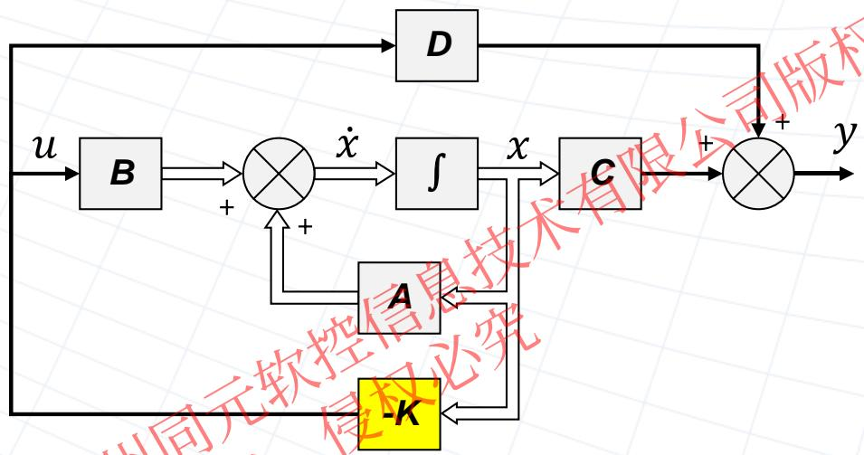  
[ u = -Kx ] 时的闭环控制系统

# 下图的闭环系统无输入量,其目的是保持系统输出为零。这个系统称之为调节器系统。

将 $u = -Kx$ 带入原始系统, 得到系统闭环方程:

$$
\dot {\boldsymbol {x}} (t) = (\boldsymbol {A} - \boldsymbol {B} \boldsymbol {K}) \cdot \boldsymbol {x} (t)
$$

该方程的解是：

$$
\boldsymbol {x} (t) = e ^ {(A \cdot B K) \cdot t} \boldsymbol {x} (0)
$$

其中 $x(0)$ 是外部扰动引起的初始状态, 系统的稳态响应与瞬态响应特性由矩阵 $A - B K$ 的特征值决定。选择合适的矩阵 $K$ , 可使矩阵 $A - B K$ 构成一个渐进稳定矩阵, 并针对所有的 $x(0) \neq 0$ , 当 $t$ 趋近无穷, 都可使 $x(t)$ 趋于 0 。称矩阵 $A - B K$ 的特征值为调节器的极点。这就是极点配置问题。

$$
\left| \lambda \boldsymbol {I} - (\boldsymbol {A} - \boldsymbol {B} \boldsymbol {K}) \right| = \prod_ {i = 1} ^ {n} (s - \mu_ {i})
$$

求解上述方程，得到的K即为状态反馈增益。Syslab提供 acker()、place() 函数以支持极点配置的求解

# 5.2 基于极点配置法的I型伺服系统设计 - 控制对象含有一个积分器的情况

上一节讨论的是调节器系统,其无输入量,目标是保持系统输出为零。但伺服系统的设计目标则是：寻找合适的控制量,让系统输出能够跟随给定值(输入量)的变化。

# 考虑含有一个积分器的SISO控制系统状态空间

表达式如下：

$$
\dot {\boldsymbol {x}} = \boldsymbol {A} \boldsymbol {x} + \boldsymbol {B} \boldsymbol {u}
$$

$$
y = C x
$$

其中, $x$ 为状态向量 (n维), $y$ 为输出信号 (标量), $u$ 为控制信号 (标量). $A$ 为 $n \times n$ 维定常矩阵, $B$ 为 $n \times 1$ 维定常矩阵, $C$ 为 $1 \times n$ 维定常矩阵, 假设 $y = x_{1}$

设定系统参考输入为 $r$ , 在该系统中, 采用以下状态反馈控制方案:

$$
\begin{array}{l} u = - \left[ \begin{array}{l l l l l} 0 & k _ {2} & k _ {3} & \dots & k _ {n} \end{array} \right] \cdot \left[ \begin{array}{c} x _ {1} \\ x _ {2} \\ x _ {3} \\ \vdots \\ x _ {n} \end{array} \right] + k _ {1} (r - x _ {1}) = - K x + k _ {1} r \\ K = \left[ \begin{array}{c c c c c} k _ {1} & k _ {2} & k _ {3} & \dots & k _ {n} \end{array} \right] \\ \end{array}
$$

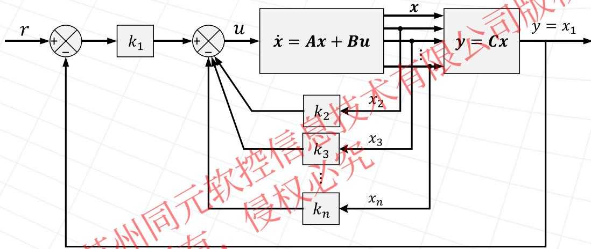

将 $u = -Kx + k_{1}r$ 带入系统方程形成闭环系统:

$$
\dot {\boldsymbol {x}} = \boldsymbol {A} \boldsymbol {x} + \boldsymbol {B} u = (\boldsymbol {A} - \boldsymbol {B} \boldsymbol {K}) \boldsymbol {x} + \boldsymbol {B} k _ {1} r
$$

系统在稳态时：

$$
\dot {\boldsymbol {x}} (\infty) = \left(\boldsymbol {A} - \boldsymbol {B} \boldsymbol {K}\right) \boldsymbol {x} (\infty) + \boldsymbol {B} k _ {1} r (\infty) \quad r \text {为 输 入 量 ，} r (\infty) = r (t)
$$

上述两个方程作差得到：

$$
\dot {\boldsymbol {x}} (t) - \dot {\boldsymbol {x}} (\infty) = (\boldsymbol {A} - \boldsymbol {B} \boldsymbol {K}) [ \boldsymbol {x} (t) - \boldsymbol {x} (\infty) ]
$$

令 $x(t) - x(\infty) = e(t)$ , $e(t)$ 则描述了系统的误差动态特性

$$
\dot {\boldsymbol {e}} (t) = (\boldsymbol {A} - \boldsymbol {B} \boldsymbol {K}) \cdot \boldsymbol {e} (t)
$$

注意：这里I型伺服系统的设计转换成了在给定任意初始条件 $e(0)$ 下，使 $e(t)$ 趋于零的渐进稳定调节器系统设计。如果原始系统完全可控，那么在指定了矩阵 $\mathbf{A} - \mathbf{B}\mathbf{K}$ 的希望特征值 $s_1 = \mu_1, s_2 = \mu_2, \ldots, s_n = \mu_n$ 时，利用前节介绍的极点配置方法即可求解矩阵 $\mathbf{K}$ 。

此时，即可利用Syslab提供 acker()、place() 函数进行极点配置求解

# 5.2 基于极点配置法的I型伺服系统设计 - 控制对象含有一个积分器的情况

示例5.1：当控制对象传递函数具有一个积分器时，试设计一个I型伺服系统。设控制对象传递函数为：

$$
\frac {Y (s)}{U (s)} = \frac {1}{s (s + 1) (s + 2)}
$$

希望的闭环极点为: $s = -2 \pm j \cdot 2 \sqrt{3}$ , 和 $s = -10$ 。设计系统状态反馈增益 $\mathbf{K}$ , 并计算系统单位阶跃响应

(1). 被控对象定义及模型转化

定义被控对象

$$
s = t f \left(" s "\right)
$$

$$
G = 1 / (s * (s + 1) * (s + 2))
$$

将被控对象转化为状态空间模型

$$
G s s = s s (G)
$$

julia> Gss

A =

0.0 1.0 0.0

0.0 0.0 1.0

0.0 -2.0 -3.0

B =

0.0

0.0

1.0

C =

1.0 0.0 0.0

D =

0.0

连续时间状态空间模型

(2). 定义期望极点位置并计算状态反馈增益 $K$

定义闭环系统期望极点

$$
\begin{array}{l} \text {i d e a l p o l e s} = [ - 2 + \mathrm {i m} * 2 * \operatorname {s q r t} (3), - 2 - \mathrm {i m} * 2 * \operatorname {s q r t} (3), - \\ 1 0 ] \end{array}
$$

使用place函数求解状态反馈增益

$$
\begin{array}{l} \text {K = p l a c e (G s s . A , G s s . B , i d e a l p o l e s)} \\ \text {K = r e a l (K)} \end{array}
$$

julia> K

1×3 Matrix{ComplexF64}：

160.0+0.0im 54.0+0.0im 11.0+0.0im

带入求取得到的状态反馈增益矩阵 $K$ ，系统闭环方程为：

$$
\dot {\boldsymbol {x}} = \left(\boldsymbol {A} - \boldsymbol {B} \boldsymbol {K}\right) \boldsymbol {x} + \boldsymbol {B} k _ {1} r
$$

$y = \mathbf{C} \mathbf{x}$

$$
\left[ \begin{array}{l} \dot {x} _ {1} \\ \dot {x} _ {2} \\ \dot {x} _ {3} \end{array} \right] = \left[ \begin{array}{c c c} 0 & 1 & 0 \\ 0 & 0 & 1 \\ - 1 6 0 & - 5 6 & - 1 4 \end{array} \right] \left[ \begin{array}{l} x _ {1} \\ x _ {2} \\ x _ {3} \end{array} \right] + \left[ \begin{array}{l} 0 \\ 0 \\ 1 6 0 \end{array} \right] \cdot r
$$

$$
y = \left[ \begin{array}{l l l} 1 & 0 & 0 \end{array} \right] \cdot \left[ \begin{array}{l} x _ {1} \\ x _ {2} \\ x _ {3} \end{array} \right]
$$

(3). 状态反馈闭环系统构造与阶跃响应计算

加入状态反馈的闭环系统计算

$$
A A = G s s. A - G s s. B * K
$$

$$
B B = G s s. B * K [ 1 ]
$$

$$
C C = G s s. C
$$

$$
D D = G s s. D
$$

被控对象单位闭环阶跃响应与状态反馈闭环阶跃计算对比

$$
\operatorname {s t e p} (\text {f e e d b a c k} (G), 1 5, \text {l i n e w i d t h} = 2)
$$

$$
\operatorname {s t e p} \left(\operatorname {s s} (\mathrm {A A}, \mathrm {B B}, \mathrm {C C}, \mathrm {D D}), 1 5, \text {l i n e w i d t h} = 2, \text {i s h o l d} = \text {t r u e}\right)
$$

$$
\text {g r i d} \left(" o n "\right)
$$

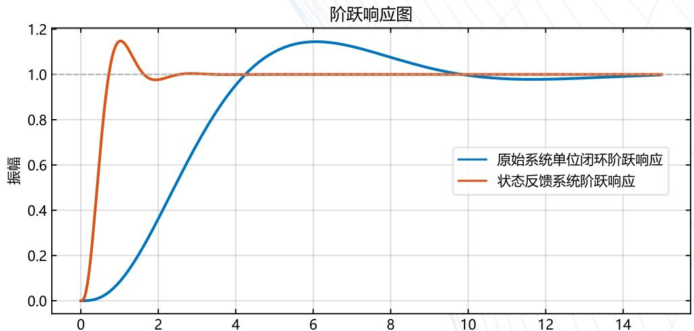  
时间 (秒)

# 5.2 基于极点配置法的I型伺服系统设计 - 控制对象含有一个积分器的情况

示例5.2：使用Sysplorer的基本blocks实现示例XX的模拟结构图模型，并执行仿真验证（回应B站教学视频中关于极点配置如何计算）

https://www.bilibili.com/video/BV1zf4y1X7eA/?spm id from=333.999.0.0&vd source=47a11ba45a018ce644b28fd69319c3ec

(1). 被控对象动态仿真模型构建

$$
\begin{array}{l} \left[ \begin{array}{l} \dot {x} _ {1} \\ \dot {x} _ {2} \\ \dot {x} _ {3} \end{array} \right] = \left[ \begin{array}{c c c} 0 & 1 & 0 \\ 0 & 0 & 1 \\ 0 & - 2 & - 3 \end{array} \right] \left[ \begin{array}{l} x _ {1} \\ x _ {2} \\ x _ {3} \end{array} \right] + \left[ \begin{array}{l} 0 \\ 0 \\ 1 \end{array} \right] \cdot r \\ y = \left[ \begin{array}{c c c} 1 & 0 & 0 \end{array} \right] \cdot \left[ \begin{array}{c} x _ {1} \\ x _ {2} \\ x _ {3} \end{array} \right] \\ \end{array}
$$

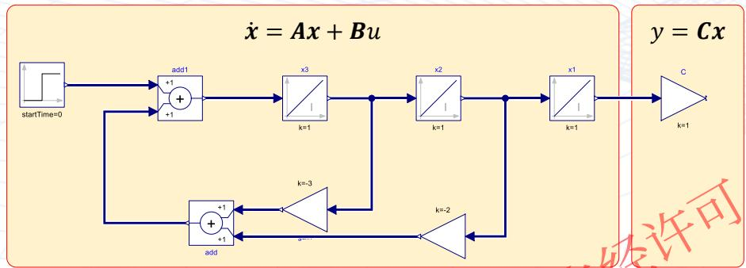

(2). 状态反馈系统模型构建

$$
\begin{array}{l} \left[ \begin{array}{l} \dot {x} _ {1} \\ \dot {x} _ {2} \\ \dot {x} _ {3} \end{array} \right] = \left[ \begin{array}{c c c} 0 & 1 & 0 \\ 0 & 0 & 1 \\ - 1 6 0 & - 5 6 & - 1 4 \end{array} \right] \left[ \begin{array}{l} x _ {1} \\ x _ {2} \\ x _ {3} \end{array} \right] + \left[ \begin{array}{l} 0 \\ 0 \\ 1 6 0 \end{array} \right] \cdot r \\ y = \left[ \begin{array}{c c c} 1 & 0 & 0 \end{array} \right] \cdot \left[ \begin{array}{c} x _ {1} \\ x _ {2} \\ x _ {3} \end{array} \right] \\ \end{array}
$$

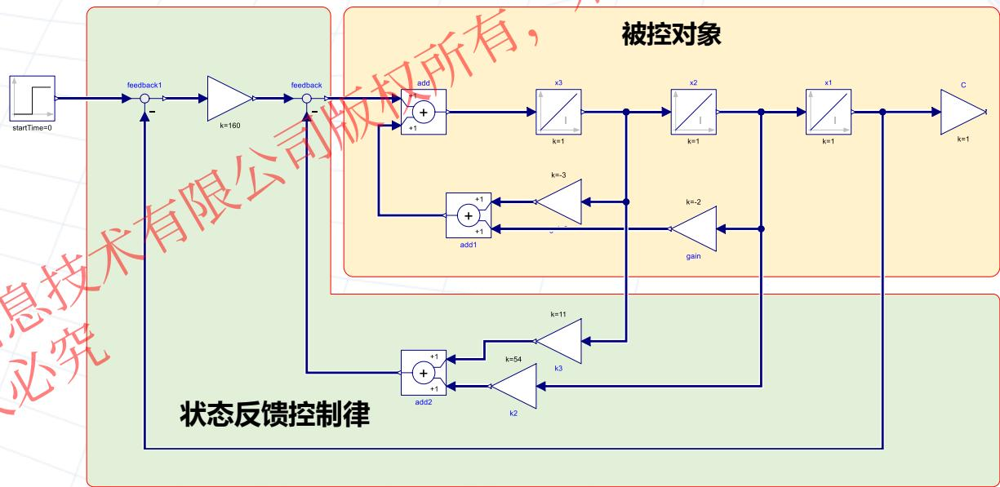

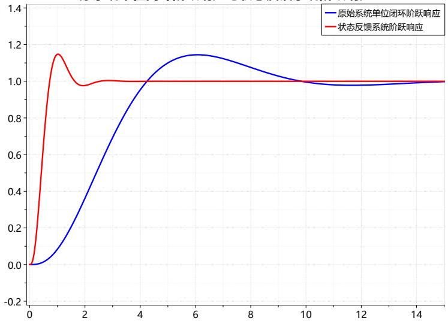  
原系统单位闭环阶跃响应与状态反馈系统阶跃响应

# 5.3 基于极点配置法的I型伺服系统设计 - 控制对象无积分器的情况

如果控制对象无积分器（0型控制对象），I型伺服系统的基本设计原则是：在控制对象与误差比较器之前的前向通路中插入一个积分器，如下：

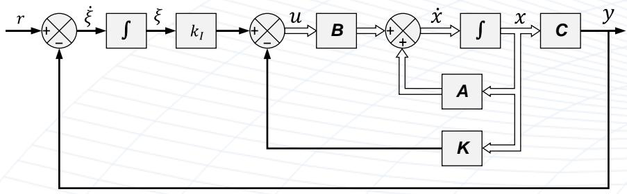

$$
\begin{array}{l} \dot {\boldsymbol {x}} = \boldsymbol {A} \boldsymbol {x} + \boldsymbol {B} \boldsymbol {u} \\ y = C x \\ u = - \boldsymbol {K} \boldsymbol {x} + k _ {l} \xi \\ \xi = r - y = r - C x \\ \end{array}
$$

其中, $x$ 为状态向量 ( $n$ 维), $y$ 为输出信号 (标量), $u$ 为控制信号 (标量), $\xi$ 为积分器输出, $r$ 为参考输入信号, $A$ 为 $n \times n$ 维定常矩阵, $B$ 为 $n \times 1$ 维定常矩阵, $C$ 为 $1 \times n$ 维定常矩阵

上述系统写成矩阵方程形式：

$$
\left[ \begin{array}{l} \dot {\boldsymbol {x}} (t) \\ \dot {\xi} (t) \end{array} \right] = \left[ \begin{array}{c c} \boldsymbol {A} & \boldsymbol {0} \\ - \boldsymbol {C} & 0 \end{array} \right] \cdot \left[ \begin{array}{l} \boldsymbol {x} (t) \\ \xi (t) \end{array} \right] + \left[ \begin{array}{l} \boldsymbol {B} \\ 0 \end{array} \right] \cdot u (t) + \left[ \begin{array}{l} \boldsymbol {0} \\ 1 \end{array} \right] \cdot r (t)
$$

稳态方程：

$$
\left[ \begin{array}{l} \dot {\boldsymbol {x}} (\infty) \\ \dot {\xi} (\infty) \end{array} \right] = \left[ \begin{array}{c c} \boldsymbol {A} & \boldsymbol {0} \\ - \boldsymbol {C} & 0 \end{array} \right] \cdot \left[ \begin{array}{l} \boldsymbol {x} (\infty) \\ \xi (\infty) \end{array} \right] + \left[ \begin{array}{l} \boldsymbol {B} \\ 0 \end{array} \right] \cdot u (\infty) + \left[ \begin{array}{l} \boldsymbol {0} \\ 1 \end{array} \right] \cdot r (\infty)
$$

问题转化为: 设计一个渐进稳定系统, 使得 $x(\infty)$ 、 $\xi(\infty)$ 和 $u(\infty)$ 分别趋于定常值, 因此在稳态时, $\dot{\xi}(t) = 0$ , 且 $y(\infty) = r$

方程作差得到:

$$
\left[ \begin{array}{l} \dot {\boldsymbol {x}} (t) - \dot {\boldsymbol {x}} (\infty) \\ \dot {\xi} (t) - \dot {\xi} (\infty) \end{array} \right] = \left[ \begin{array}{l l} \boldsymbol {A} & \boldsymbol {0} \\ - \boldsymbol {C} & 0 \end{array} \right] \cdot \left[ \begin{array}{l} \boldsymbol {x} (t) - \boldsymbol {x} (\infty) \\ \xi (t) - \xi (\infty) \end{array} \right] + \left[ \begin{array}{l} \boldsymbol {B} \\ 0 \end{array} \right] \cdot \left[ u (t) - u (\infty) \right]
$$

定义：

$$
\begin{array}{l} \boldsymbol {x} (t) - \boldsymbol {x} (\infty) = \boldsymbol {x} _ {e} (t) \\ \xi (t) - \xi (\infty) = \xi_ {e} (t) \\ u (t) - u (\infty) = u _ {e} (t) \\ \end{array}
$$

方程可写成：

$$
\begin{array}{l} \left[ \begin{array}{l} \dot {\boldsymbol {x}} _ {e} (t) \\ \dot {\xi} _ {e} (t) \end{array} \right] = \left[ \begin{array}{l l} \boldsymbol {A} & \boldsymbol {0} \\ - \boldsymbol {C} & 0 \end{array} \right] \cdot \left[ \begin{array}{l} \boldsymbol {x} _ {e} (t) \\ \xi_ {e} (t) \end{array} \right] + \left[ \begin{array}{l} \boldsymbol {B} \\ 0 \end{array} \right] \cdot u _ {e} (t) \quad e (t) = \left[ \begin{array}{l} \boldsymbol {x} _ {e} (t) \\ \xi_ {e} (t) \end{array} \right] \\ u _ {e} (t) = - \boldsymbol {K} \dot {\boldsymbol {x}} _ {e} (t) + k _ {I} \xi_ {e} (t) \\ e (t) = \left[ \begin{array}{l} \boldsymbol {x} _ {e} (t) \\ \xi_ {e} (t) \end{array} \right] \\ \end{array}
$$

定义一个新的 $(n + 1)$ 维误差向量 $\pmb{e}(t)$ :


$$
\begin{array}{l} \dot {\boldsymbol {e}} = \hat {\boldsymbol {A}} \boldsymbol {e} + \hat {\boldsymbol {B}} \boldsymbol {u} _ {e} \\ \hat {\boldsymbol {A}} = \left[ \begin{array}{c c} \boldsymbol {A} & \boldsymbol {0} \\ - \boldsymbol {C} & 0 \end{array} \right], \hat {\boldsymbol {B}} = \left[ \begin{array}{c} \boldsymbol {B} \\ 0 \end{array} \right] \\ u _ {e} = - \hat {\boldsymbol {K}} \boldsymbol {e}, \hat {\boldsymbol {K}} = \left[ \boldsymbol {K} \mid - k _ {I} \right] \\ \end{array}
$$

将输入带入状态

误差方程：

$$
\dot {\boldsymbol {e}} = \left(\hat {\boldsymbol {A}} - \hat {\boldsymbol {B}} \hat {\boldsymbol {K}}\right) \boldsymbol {e}
$$

注意：希望矩阵 $\widehat{\mathbf{A}} - \widehat{\mathbf{B}}\widehat{\mathbf{K}}$ 的特征值（期望的闭环极点）为指定的 $\mu_{1}, \mu_{2}, \ldots, \mu_{n+1}$ 时，则状态反馈增益 $\mathbf{K}$ 与积分增益 $k_{I}$ ，在误差状态方程完全可控的条件下，可利用前节介绍的极点配置方法确定。

需要指出：矩阵 $\hat{A}$ 的秩为 $n + 1$ ，则系统完全可控

# 5.3 基于极点配置法的I型伺服系统设计 - 控制对象无积分器的情况

示例5.3：一维倒立摆系统基于极点配置法的状态反馈控制律设计


设计目标希望尽可能把倒立摆保持在垂直位置上，倒立摆安装在小车上，它没有积分器。忽略摆杆质量与地面摩擦，考虑其质量集中在摆杆顶端，即摆杆的重心就是摆球的重心

(1). 系统分析与数学建模

□ 考虑摆杆重心的水平运动: $m \frac{d^2}{dt^2} (x + l \sin \theta) = H$   
□ 摆杆重心的垂直运动: $m \frac{d^{2}}{d t^{2}} (l \cos \theta) = V - m_{0}$   
小车水平运动: $M \frac{d^{2} x}{d t^{2}} = u - H$   
口 再考虑摆杆转动, 其绕重心 (摆球重心) 的转动运动可以描述为 ( $I$ 为摆杆绕其中心的转动惯量):

$$
I \frac {d ^ {2} \theta}{d t ^ {2}} = V l \sin \theta - H l \cos \theta
$$

线性化假设：考虑由于必须保持倒立摆垂直，可以认为θ角很小，因此，可以进行以下近似，sinθ≈θ、cosθ≈1；再考虑倒立摆围绕重心的转动惯量很小，可近似认为：I≈0

联立方程，得到：  
定义状态变量：

$$
\left\{ \begin{array}{l} x _ {1} = \theta \\ x _ {2} = \dot {\theta} \\ x _ {3} = x \\ x _ {4} = \dot {x} \end{array} \right.
$$

方程改写为：

$$
\left\{ \begin{array}{l} \dot {x} _ {1} = x _ {2} \\ \dot {x} _ {2} = \frac {M + m}{M l} g x _ {1} - \frac {1}{M l} u \\ \dot {x} _ {3} = x _ {4} \\ \dot {x} _ {4} = - \frac {m}{M} g x _ {1} + \frac {1}{M} u \end{array} \right.
$$

描述系统行为的状态方程：

$$
\begin{array}{l} \left[ \begin{array}{l} \dot {x} _ {1} \\ \dot {x} _ {2} \\ \dot {x} _ {3} \\ \dot {x} _ {4} \end{array} \right] = \left[ \begin{array}{c c c c} 0 & 1 & 0 & 0 \\ \frac {M + m}{M l} g & 0 & 0 & 0 \\ 0 & 0 & 0 & 1 \\ - \frac {m}{M} g & 0 & 0 & 0 \end{array} \right] \cdot \left[ \begin{array}{l} x _ {1} \\ x _ {2} \\ x _ {3} \\ x _ {4} \end{array} \right] + \left[ \begin{array}{l} 0 \\ - \frac {1}{M l} \\ 0 \\ \frac {1}{M} \end{array} \right] \cdot u \\ y = \left[ \begin{array}{c c c c} 0 & 0 & 1 & 0 \end{array} \right] \cdot \left[ \begin{array}{c} x _ {1} \\ x _ {2} \\ x _ {3} \\ x _ {4} \end{array} \right] \\ \end{array}
$$

# 倒立摆系统参数  
M = 2 # 小车质量2Kg   
m = 0.1 # 摆球质量0.1Kg   
l = 0.5 # 摆杆长度0.5m   
g = 9.8 # 重力加速度 $9.8 \mathrm{~m} / \mathrm{s}^{2}$   
# 倒立摆系统状态空间矩阵定义

A = [θ 1 θ 0]

# 倒立摆系统模型

$$
\begin{array}{l} (M + m) * g / (M * l) \quad 0 \quad 0 \quad 0 \\ \begin{array}{c c c c} 0 & 0 & 0 & 1 \end{array} \\ - m * g / M \quad 0 \quad 0 \quad 0 ] \\ B = [ 0 - 1 / (M * l) 0 1 / M ] ^ {\prime} \\ C = \left[ \begin{array}{l l l} 0 & 0 & 1 \end{array} \right] \\ D = 0 \\ G = s s (A, B, C, D) \\ \end{array}
$$

# 5.3 基于极点配置法的I型伺服系统设计 - 控制对象无积分器的情况

示例5.3：一维倒立摆系统基于极点配置法的状态反馈控制律设计

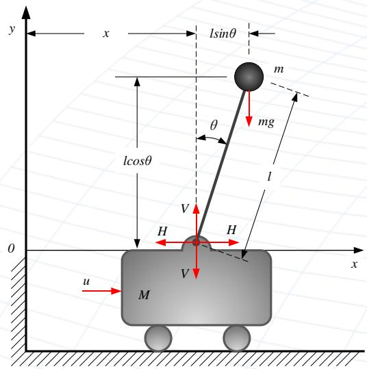

(2). 状态反馈控制律框架及推导

在被控对象与误差比较器之间的前向通路中插入一个积分器，因此，整个系统的闭环框图为

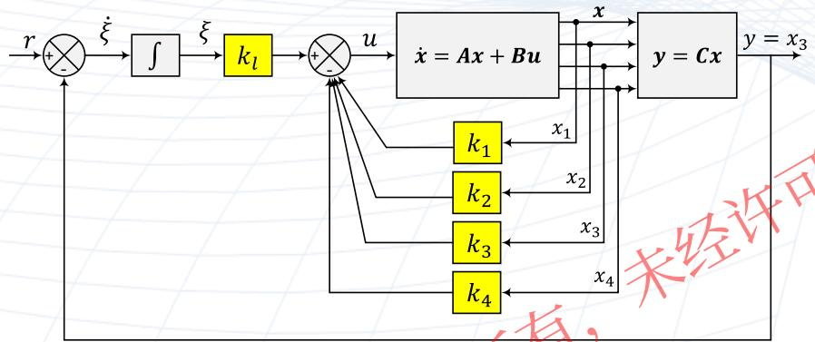

整个系统的闭环表达式为：

$$
\left\{ \begin{array}{l} \dot {x} = A x + B u \\ y = C x \\ u = - K x + k _ {l} \xi \\ \dot {\xi} = r - C x \end{array} \right. \quad \left[ \begin{array}{l} \dot {x} (t) \\ \dot {\xi} (t) \end{array} \right] = \left[ \begin{array}{l l} A & 0 \\ - C & 0 \end{array} \right] \left[ \begin{array}{l} x (t) \\ \xi (t) \end{array} \right] + \left[ \begin{array}{l} B \\ 0 \end{array} \right] u (t) + \left[ \begin{array}{l} 0 \\ 1 \end{array} \right] r (t)
$$

$$
\left[ \begin{array}{c} \dot {\boldsymbol {x}} (t) - \dot {\boldsymbol {x}} (\infty) \\ \dot {\xi} (t) - \dot {\xi} (\infty) \end{array} \right] = \left[ \begin{array}{c c} \boldsymbol {A} & \boldsymbol {0} \\ - \boldsymbol {C} & 0 \end{array} \right] \cdot \left[ \begin{array}{c} \boldsymbol {x} (t) - \boldsymbol {x} (\infty) \\ \xi (t) - \xi (\infty) \end{array} \right] + \left[ \begin{array}{c} \boldsymbol {B} \\ 0 \end{array} \right] \cdot \left[ \begin{array}{c} u (t) - u (\infty) \end{array} \right]
$$

构造误差状态方程，并判定其能控性：

构造误差状态方程，并判定系统能控性

$$
\begin{array}{l} A h a t = [ A z e r o s (s i z e (A, 1), 1); - C \theta ] \\ \text {B h a t} = [ B; 0 ] \\ r = \text {r a n k} ([ A h a t B h a t ]) \\ \end{array}
$$

计算得到 $r = 5$ ,表示系统完全能控,进而可以对系统进行极点配置。

由于闭环系统的阶次为5，需要为其配置5个极点，为保证系统的响应性能，配置其中2个极点为主导极点（方程 $s^2 + 2 * 0.7s + 1 = 0$ 的共轭复根，即阻尼为0.7的理想二阶环节极点），并使其余3个极点远离主导极点 $(-10, -15, -20)$

计算理想主导极点位置并分配系统所有极点位置

$$
\text {i d e a l P o l e s} = \text {r o o t s} ([ 1, 2 * 0. 7 * 1, 1 ])
$$

$$
\text {A l l P o l e s} = [ \text {i d e a l P o l e s} [ 1 ], \text {i d e a l P o l e s} [ 2 ], - 1 0, - 1 5, - 2 0 ]
$$

极点配置，计算状态增益K

$$
\text {K h a t} = \text {p l a c e} (\text {A h a t}, \text {B h a t}, \text {A l l P o l e s})
$$

# 状态增益值分解

$$
\begin{array}{l} K = \text {r e s h a p e} (\text {r e a l} (\text {k h a t} [ 1: 4 ]), 1, 4) \\ k 1 = - \text {r e a l} (\text {K h a t} [ \text {e n d} ]) \\ \end{array}
$$

$$
j u l i a > k = \text {r e s h a p e} (\text {r e a l} (\text {K h a t} [ 1: 4 ]), 1, 4)
$$

1×4 Matrix{Float64}：

$$
- 9 8 2. 0 2 9 - 2 5 5. 9 9 5 - 4 9 4. 8 9 8 - 4 1 9. 1 9
$$

$$
\begin{array}{l} j u l i a > k 1 = - r e a l (K h a t [ e n d ]) \\ - 3 0 6. 1 2 2 4 4 8 9 7 9 5 9 1 8 \\ \end{array}
$$

# 5.3 基于极点配置法的I型伺服系统设计 - 控制对象无积分器的情况

示例5.3：一维倒立摆系统基于极点配置法的状态反馈控制律设计


(3). 控制系统闭环及验证

将 $u = -Kx + k_{l}\xi$ 带入系统方程形成闭环系统:

$$
\begin{array}{l} \left[ \begin{array}{c} \dot {x} \\ \dot {\xi} \end{array} \right] = \left[ \begin{array}{c c} A - B K & B k _ {l} \\ - C & 0 \end{array} \right] \left[ \begin{array}{c} x \\ \xi \end{array} \right] + \left[ \begin{array}{c} 0 \\ 1 \end{array} \right] r \\ y = \left[ \begin{array}{l l l l l} 0 & 0 & 1 & 0 & 0 \end{array} \right] \left[ \begin{array}{l} x \\ \xi \end{array} \right] \\ \end{array}
$$

# 闭环系统状态方程

$$
\begin{array}{l} A A = [ A - B * K B * k 1; - C 0 ] \\ B B = \left[ \begin{array}{l l l l l} 0 & 0 & 0 & 0 & 1 \end{array} \right], \\ \end{array}
$$

$$
\begin{array}{l} C C = [ C \theta ] \\ D D = 0 \\ \end{array}
$$

$$
G c l o s e = s s (A A, B B, C C, D D)
$$

计算并绘制阶跃响应

$$
\begin{array}{l} \text {s t e p} (\text {G c l o s e}, 1 0, \text {l i n e w i d t h} = 2) \\ \text {g r i d} \left(" o n "\right) \\ \end{array}
$$

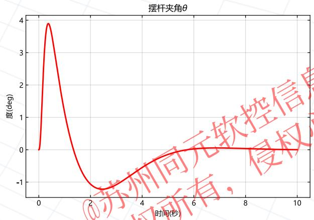

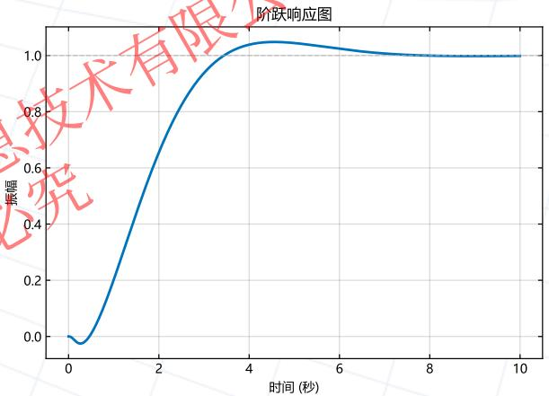

(4) 在Sysplorer中实现控制系统动态仿真模型并进行验证

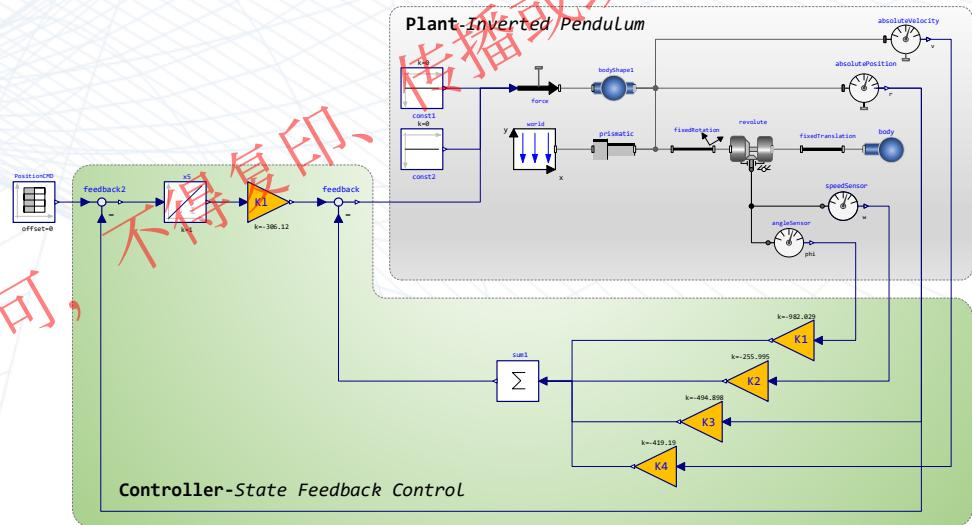

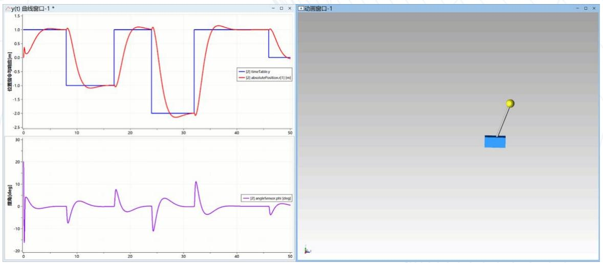

# 5.4 状态反馈控制律设计小结

控制系统的状态空间设计涵盖的内容除了本章介绍的极点配置方法，还包括观测器、二次型最佳调节器系统、鲁棒控制等 Syslab目前提供了以下设计函数：

<table><tr><td>Syslab状态空间设计函数</td><td>说明</td></tr><tr><td>acker(A,B,p)</td><td>用阿克曼法进行极点配置</td></tr><tr><td>place(A,B,p)</td><td>采用鲁棒极点配置方法计算极点配置</td></tr><tr><td>reg = lqq(sys,QXU,QWV)
reg = lqq(sys,QXU,QWV,Qi=value)</td><td>线性二次高斯（LQG）设计</td></tr><tr><td>K,S,P=lqr(sys,Q,R,N)
K,S,P=lqr(A,B,Q,R,N)</td><td>线性二次调节器(LQR)设计</td></tr><tr><td>kalmf,L,P,Mx,Z,My,known,sensors,wEstimates=kalman(sys,Q,R)
kalmf,L,P,Mx,Z,My,known,sensors,wEstimates=kalman(sys,Q,R,N=value)
____=kalman____,estimator=value)</td><td>状态估计的卡尔曼滤波设计</td></tr></table>

具体使用方法及示例，可参考Syslab帮助文档，这里不再赘述。

需要说明的是，Syslab控制工具箱函数目前仍在完善过程中，后续版本中将提供更多状态空间设计函数

建立知识规范，营造协同生态

积累工业模型，发展可控平台

融入中国创新，打造先进软件

# 感谢聆听
