# MWORKS.Syslab控制系统工具箱APP

- Source: `MWORKS高校星火计划资料包/培训课程配套材料/01-官网课程配套材料/02-控制系统设计与应用/02-控制系统设计与分析APP/01-2024a/MWORKS.Syslab控制系统工具箱APP(应用程序).pdf`
- Converted by: `MinerU precise API`
- Conversion date: `2026-05-08`
- Review status: `MinerU converted; spot check recommended`
- Priority: `P1`
- Source SHA1: `bd9a356c4e73`
- MinerU batch id: `f4fc4a5c-4d39-4d0d-9f1a-72ccf4370011`
- Images: `56`
- Notes: 控制系统设计与分析 APP 操作流程。

# MWORKS.Syslab控制系统工具箱

# APP(应用程序)

鲍丙瑞 张万宽 胥子豪 罗晓飞

苏州同元软控信息技术有限公司

2024-01-08

# 目录

1. 线性系统分析器  
2. 控制系统设计器  
3. PID调节器

# 01

# 线性系统分析器

# 1. 线性系统分析器

线性系统分析器可以查看和比较多个系统(单入单出系统，多入多出系统)的时域响应和频域响应。通过线性系统分析器，可以查看控制系统的时域特性、频域特性、稳态特性，以了解系统的动态响应特点和行为。

目前线性系统分析器，同时支持对单入单出系统（SISO）、多入多出系统(MIMO)及这两种系统的连续和离散模型的分析。时域分析，主要支持阶跃响应、脉冲响应曲线的绘制，及其时域特性的计算、显示。频域分析，主要支持对波特相位图、波特幅值图、奈奎斯特图、尼克尔斯图的绘制，及相应频域特性指标的计算。

如右图所示，为线性系统分析器同时对5个控制系统进行时频域多种绘图的分析结果。

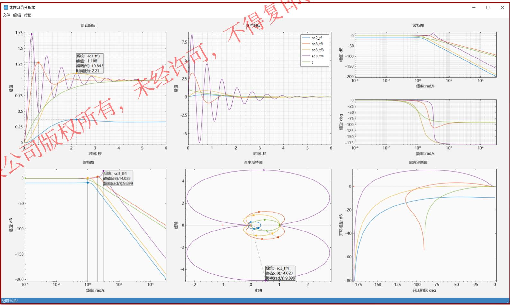

# 1. 线性系统分析器

线性系统分析器支持分析和查看连续、离散线性时不变系统。

# 1. 二阶LTI模型构建

using TyControlSystems

zeta = 0.5

w0 = 3

$\mathrm{n} 0 = \mathrm{w} 0^{\wedge} 2$

$\mathrm{d} 0 = [1, 2 * \text{zeta} * \mathrm{w} 0, \mathrm{w} 0^{\wedge} 2]$

H = tf(n0, d0)

Hd = c2d(H,0.1)

julia> H

9.0

1.0s^2 + 3.0s + 9.0

连续时间传递函数模型

julia>Hd

0.040519239073034674z + 0.03665475152195974

1.0z^2 - 1.6636442300867234z + 0.7408182206817179

Sample Time: 0.1 (seconds)

离散时间传递函数模型

# 2. 模型导入线性系统分析器

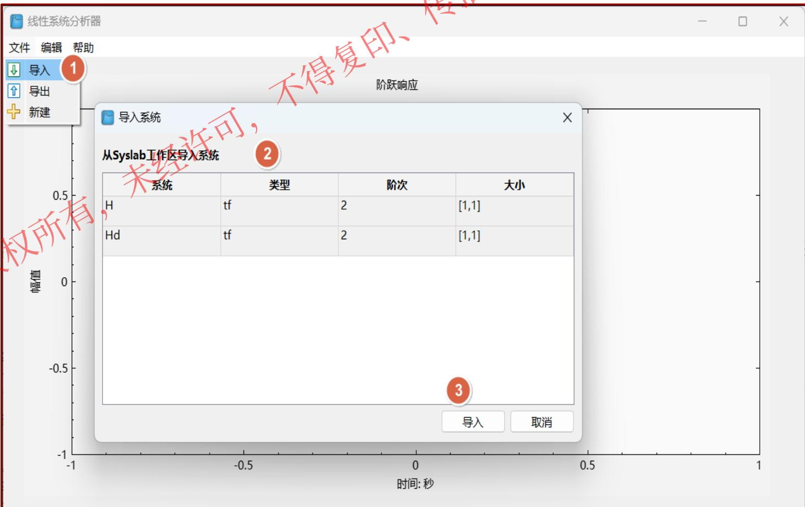  
选择系统导入...

# 1. 线性系统分析器

# 3. 阶跃响应绘图分析

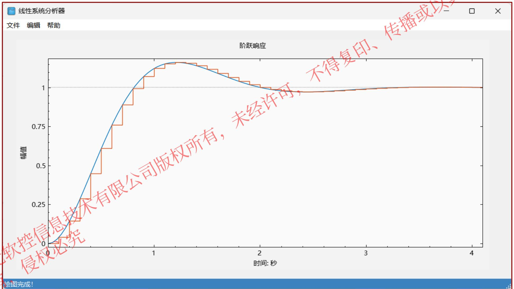

# 1. 线性系统分析器

线性系统分析器也支持分析和查看MIMO系统模型。

# 1. 1输入2输出MIMO系统模型构建

$$
\mathrm {u s i n g T y C o n t r o l S y s t e m s}
$$

$$
G 1 1 = \operatorname {t f} ([ 1 ], [ 1 2 1 ])
$$

$$
G 2 1 = \operatorname {t f} ([ 3 ], [ 1, 1 ])
$$

$$
G 0 = [ G 1 1; G 2 1 ];
$$

julia> G0

输入1到输出1 1

$$
s ^ {2} + 2 s + 1
$$

输入1到输出23

$$
- - - -
$$

$$
s + 1
$$

连续时间传递函数模型

# 2. 1输入2输出MIMO系统模型阶跃响应分析

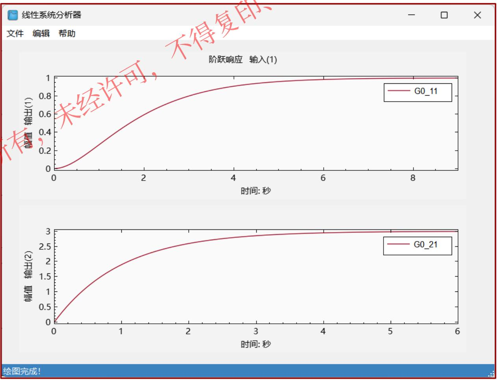

# 1. 线性系统分析器

线性系统分析器可以分析线性系统的时域特性，具体操作如下：

# 1. 系统模型构建

using TyControlSystems

$$
\begin{array}{l} G = z p k ([ ], [ - 5 - 5 - 1 0 ], 1 0 0) \\ \mathrm {T} 1 = \operatorname {t f} ([ 4 4 0 ], [ 1 2 0 1 2 5 2 5 0 4 4 0 ]) \\ \mathrm {T} 2 = \operatorname {t f} ([ 2 9 0 7 1 0 ], [ 1 2 0 1 2 5 5 4 0 7 1 0 ]) \\ \end{array}
$$

# 2. 在视图区域右键菜单中，选择“特性”

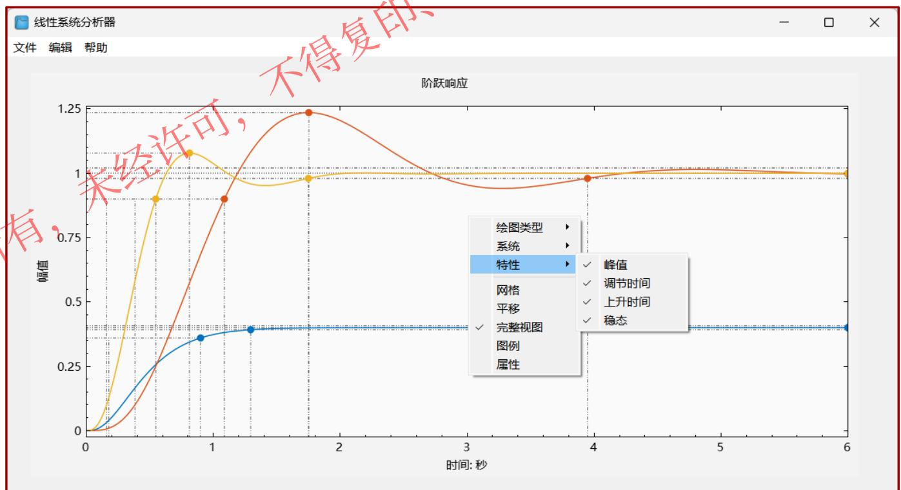  
绘图完成！

# 1. 线性系统分析器

鼠标点击在所显示的特性点上，会小窗口显示该特性点的详细信息，如右图所示。

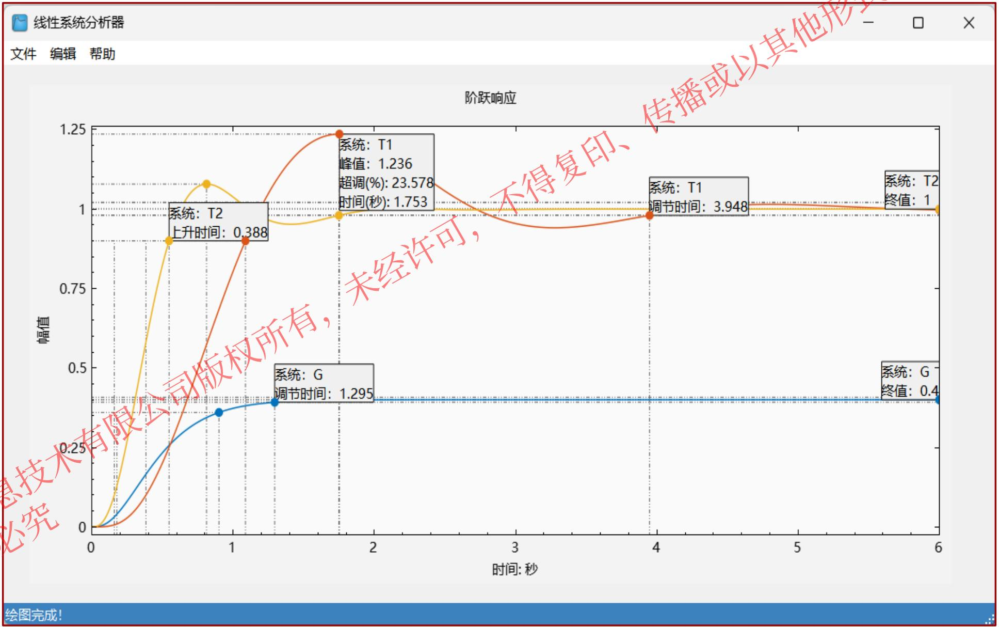

# 1. 线性系统分析器

在视图区域右键菜单中，鼠标选择“绘图类型”，在6种绘图类型中选择后4种任意一种绘图，即可查看系统的频域特性指标，如右图所示，以选择“波特”视图为例。

# 线性系统分析器

文件 编辑 帮助

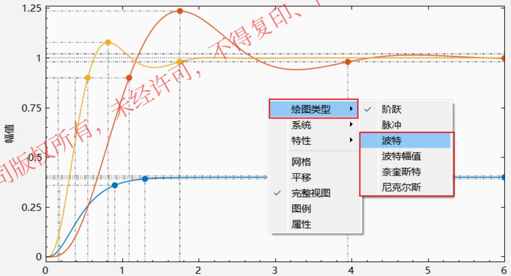  
阶跃响应  
时间：秒

# 1. 线性系统分析器

在波特图上，鼠标点击显示特性点，会小窗口显示该特性点的频域特性详细信息，如右图所示。

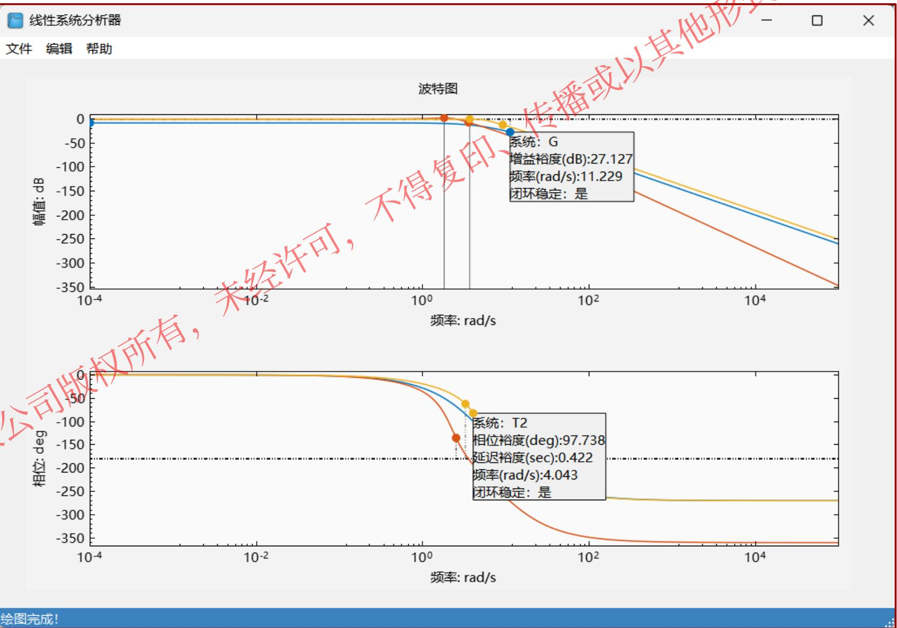

# 02

# 控制系统设计器

# 2.控制系统设计器

在得到系统数学模型后，控制领域有大量成熟的控制方法以设计相应的控制器。其中，基于系统的输入输出关系进行的时域、频域设计方法以及根轨迹设计方法，一般也被称为经典控制方法，在实际工程中应用广泛、经久不衰。为此在Syslab中，我们提供了控制系统设计器以支持交互式地设计和分析反馈系统的单输入单输出控制器。

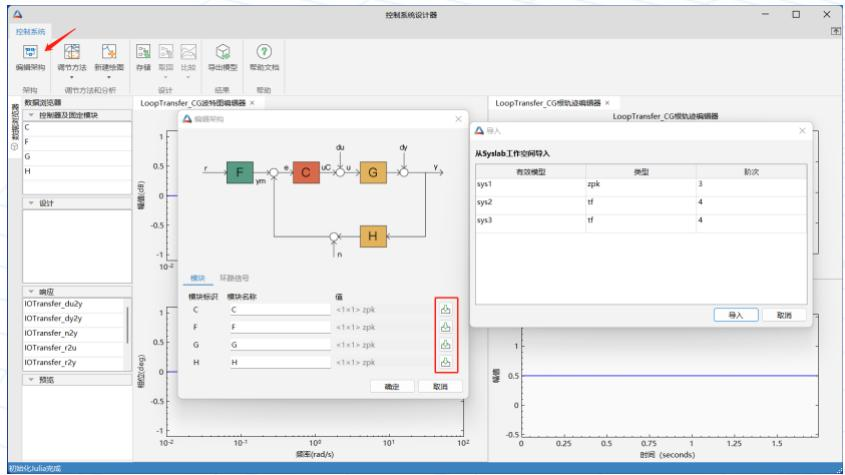

APP初始化配置

init_syslabapp();

默认配置启动控制系统设计器

控制系统Designer();

# 启动控制系统设计器并导入被控对象

sys $=$ tf(1,[1,1]);

控制系统Designer(sys);

# 通过控制系统设计器，我们可以：

$\succ$ 使用交互式的波特图、根轨迹编辑器来添加、修改和删除控制器的极点、零点和增益。  
$\succ$ 使用时域和频域响应分析控制系统设计，如阶跃响应和波特图。  
> 对比多个控制系统设计的响应图。

# 控制系统设计器支持通过以下方式打开：

> 菜单栏图标打开   
我们可以在Syslab中APP选项卡下点击控制系统设计器的图标以启动空白的控制系统设计器，然后通过控制系统设计器编辑架构选项卡从Syslab工作区导入控制系统。  
命令行方式打开

我们也可以在Syslab中通过调用控制系统Designer命令打开控制系统设计器。默认情况下，控制系统设计器在打开时显示波特图编辑器、根轨迹编辑器和闭环阶跃响应。

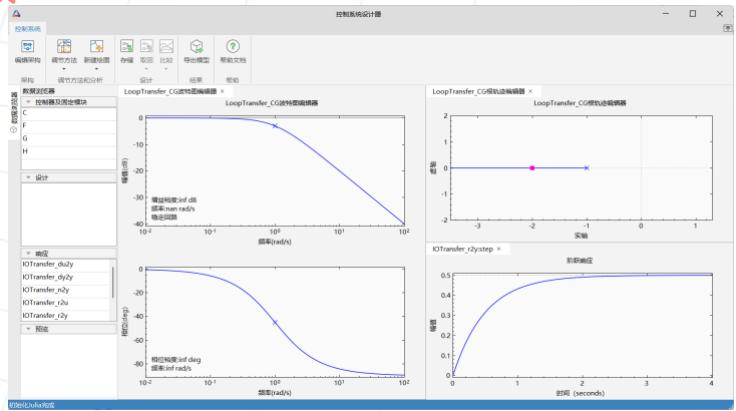

后续版本中，控制系统设计器计划支持：

> 为物理模型设计控制器 (2023Q4)。

# 2.控制系统设计器-基于波特图的设计

在控制系统设计器中有两种主要的补偿器设计方法，即基于波特图的设计、基于根轨迹的设计，分别对应于经典控制设计方法中的频域设计与零极点设计。

示例2.1：直流电机补偿器设计（基于波特图）

直流电机模型：

设计需求：

上升时间小于0.5秒  
- 稳态误差小于5%   
超调量小于10%  
- 增益裕度大于20 dB   
- 相位裕度大于40度

APP初始化配置

init_syslabapp();

启动控制系统设计器并导入被控对象

sys3 $=$ tf(1.5,[1,14,40.02]);

控制系统Designer(sys3);

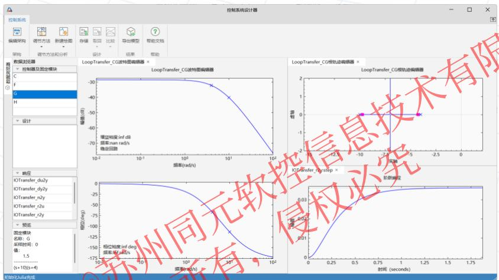

① 打开控制系统设计器并以默认控制结构导入sys3作为被控对象模型。  
(2) 设计要求上升时间小于0.5秒, 将开环直流交叉频率设置为约3 rad/s。在一阶近似下, 这个交叉频率对应的时间常数为0.33秒。右键单击波特图编辑器绘图区域打开网格以方便调整, 并通过移动曲线, 调整开环交叉频率为 $3 \mathrm{rad} / \mathrm{s}$ 附近。  
(3) 在阶跃响应图中通过右键>特性>上升时间查看系统阶跃响应特性，上升时间<0.2s，满足设计要求。  
(4) 类似地查看系统峰值与稳态值, 得到超调约为 $3.6 \%$ , 满足设计要求, 稳态值约为 0.56 , 不满足设计要求。通过在补偿器中添加积分器可以消除闭环阶跃响应中的稳态误差, 在波特图编辑器中通过 右键>补偿器编辑>零极点>右键>添加极点或零点>积分 添加积分器。积分器消除稳态误差的同时也会改变系统动态特性,使得系统响应变慢, 交叉频率降低, 上升时间增加。

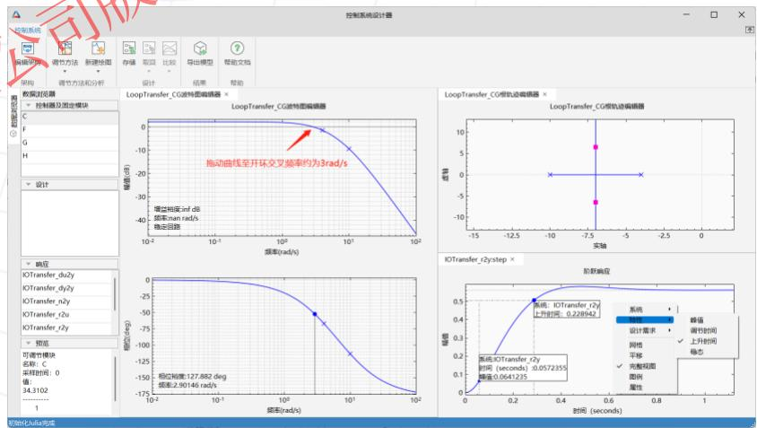

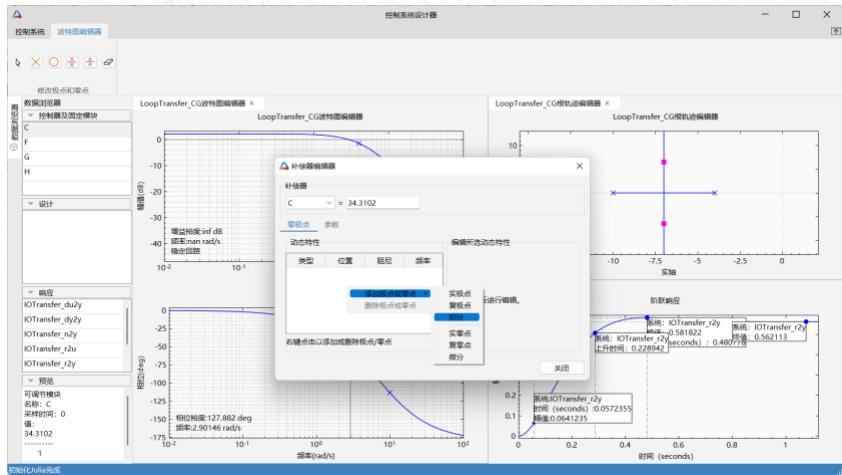

# 2.控制系统设计器-基于波特图的设计

示例2.1：直流电机补偿器设计（基于波特图）

直流电机模型：

设计需求：

上升时间小于0.5秒  
- 稳态误差小于5%   
超调量小于10%  
- 增益裕度大于20 dB   
- 相位裕度大于40度

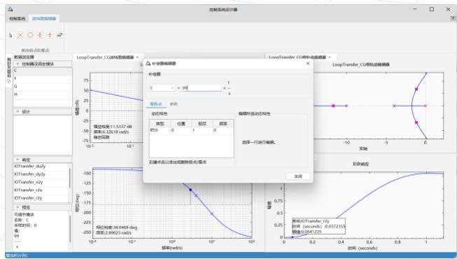

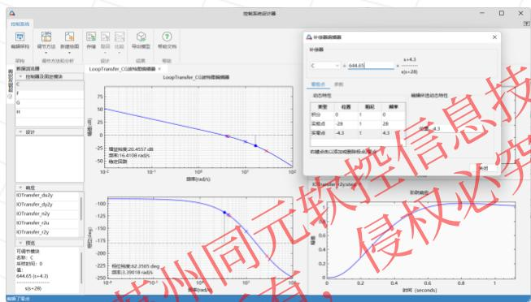

(5) 为了将交叉频率恢复到 $3 \mathrm{rad} / \mathrm{s}$ 左右, 需要进一步增加补偿器增益。通过右键单击波特图编辑器的绘图区域>编辑补偿器 打开补偿器编辑器, 在补偿器部分修改补偿器增益为99。  
⑥ 查看阶跃响应图, 此时闭环系统超调量约为 $30 \%$ , 显然不满足设计要求。此外, 设计要求增益裕度大于 $20 \mathrm{~dB}$ , 相位裕度大于 40 度。目前的设计不能满足这些要求。为满足稳定裕度要求, 考虑在补偿器上增加超前环节。通过补偿器编辑器为系统增加一个实零点和一个实极点, 调整实零点的位置至 -4.3 , 该值接近直流电机模型的最慢 (最左侧) 极点; 调整实极点的位置至 -28 ; 调整补偿器的增益至 644.65 。  
⑦ 查看波特图中开环系统的幅值裕度和相位裕度。增益裕度约为 $20.5 \mathrm{~dB}$ , 刚好满足设计需求。此时系统的鲁棒性较差, 不是一个良好的设计。为增加系统鲁棒性, 调整补偿器增益, 降低到 $550.23$ 。  
(8) 分别查看此时的开环波特图以及阶跃响应图，系统特性满足设计要求。  
(9) 要查看系统的其他响应或分析其参数敏感性，可以通过新建绘图选项卡进行创建。

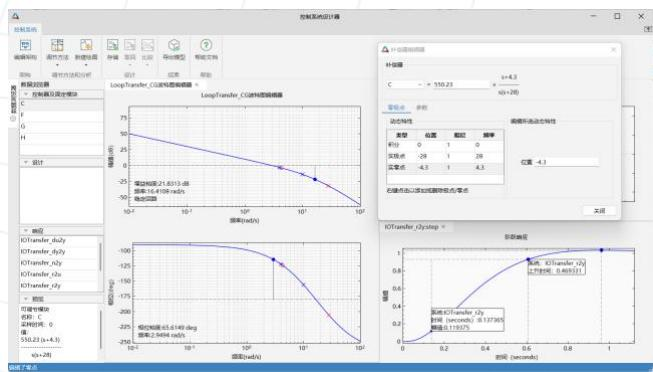

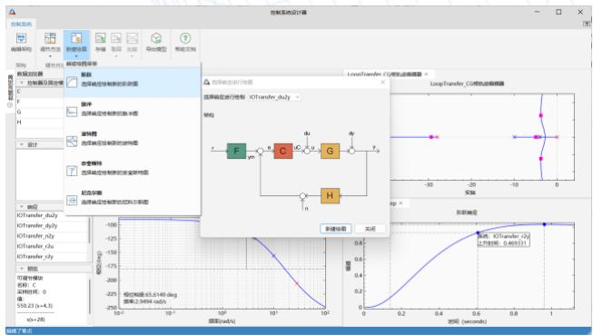

# 2.控制系统设计器-基于根轨迹法的设计

# 示例2.2：电液伺服机构补偿器设计（基于根轨迹法）

一个简易的电液伺服机构模型由以下部分组成:

- 推挽式放大器  
- 高压液压油容器中的滑动轴  
- 容器中允许流体流动的阀门开口  
- 一种带有活塞驱动的推力杆的中央腔室，用于向负载输送力  
- 对称的流体回流容器

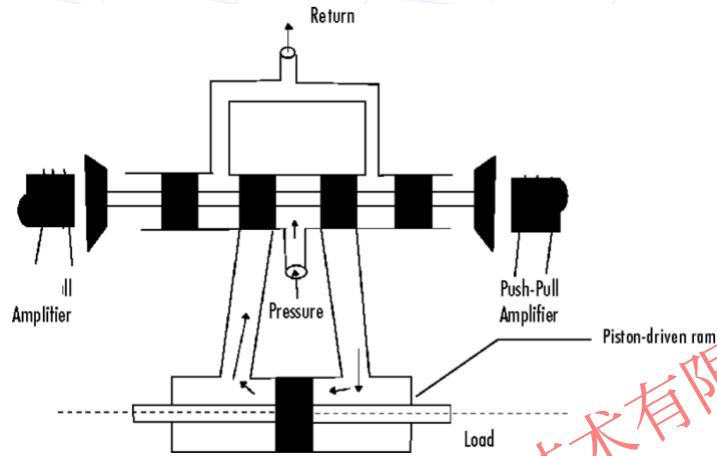

磁芯上的力与电磁铁线圈中的电流成正比。当阀芯移动时，阀门打开，使高压液压液流过腔室。运动的流体迫使活塞向与阀芯相反的方向运动。通过改变电磁铁的输入电压来控制滑动轴的位置。假使滑动轴位置可测量，就可以通过反馈进行滑动轴的位置控制。

简易的电液伺服机构模型的线性化模型为：

设计需求：

- 2%的调节时间小于0.05s  
- 超调量小于5%

(1) 打开控制系统设计器并以默认控制结构导入sys作为被控对象模型。

APP初始化配置

init_syslabapp();

# 启动控制系统设计器并导入被控对象

$$
\begin{array}{l} s = t f \left(" s"\right); \\ s y s = (4 e 7) / (s * (s + 2 5 0) * (s ^ {2} + 4 0 * s + 9 e 4)); \\ \text {c o n t r o l S y s t e m D e s i g n e r (s y s)}; \\ \end{array}
$$

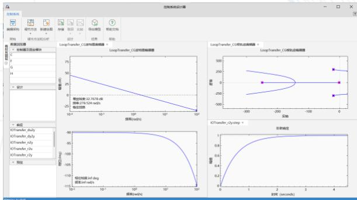

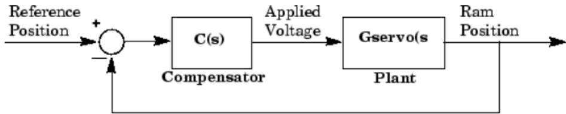

# 2.控制系统设计器-基于根轨迹法的设计

示例2.2：电液伺服机构补偿器设计（基于根轨迹法）

简易的电液伺服机构模型的线性化模型为：

设计需求：

- 2%的调节时间小于0.05s  
- 超调量小于5%

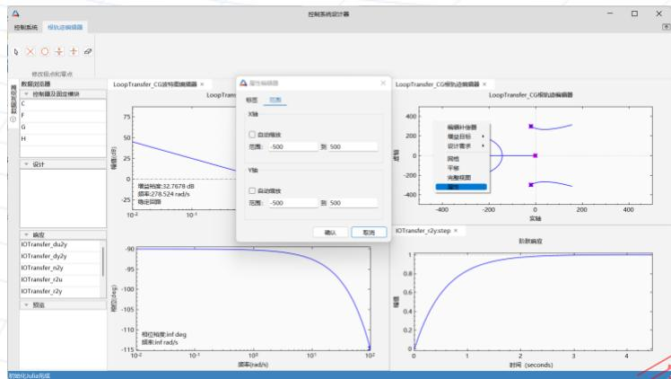

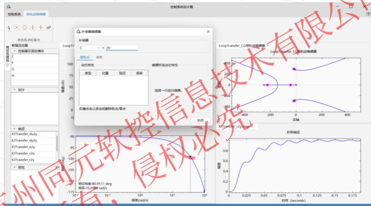

(2) 为了方便设计, 在根轨迹编辑器中, 通过右键>属性 打开属性编辑器并指定X轴和Y轴的范围为 $-500 \sim 500$ 。  
(3) 根据根轨迹编辑器图中曲线, 当系统增益增大时, 系统闭环极点很快转移到复平面的左半平面, 系统变得不稳定。通过右键>编辑补偿器调整补偿器增益至20, 查看阶跃响应图, 此时系统不满足设计需求并表现出不必要的振荡, 符合之前的分析。  
④ 考虑对补偿器添加极点对调整闭环极点使闭环系统更稳定,通过 补偿器编辑器>零极点> 添加极点或零点>复极点进行添加并设置复极点位置为- 140±260im。  
(5) 此时系统的响应速度过慢, 且通过根轨迹图发现调整增益的影响较小, 需要通过对补偿器添加零点来改善系统的动态特性, 通过补偿器编辑器>零极点>添加极点或零点>复零点进行添加并设置复零点位置为 $-170 \pm 430 \mathrm{~im}$ , 同时减小增益为 $8.1572$ 。

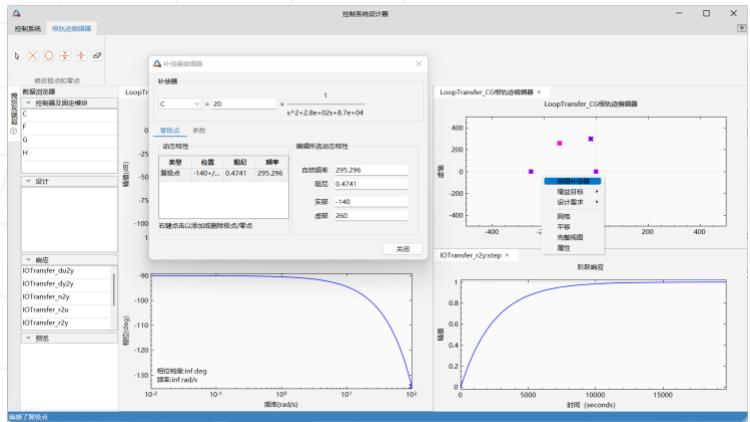

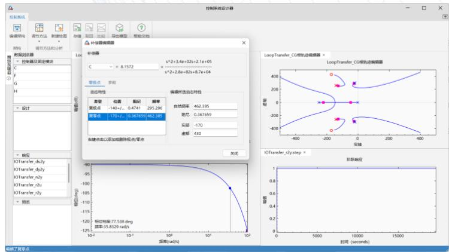

# 2.控制系统设计器

示例2.2：电液伺服机构补偿器设计（基于根轨迹法）

简易的电液伺服机构模型的线性化模型为：

设计需求：

- 2%的调节时间小于0.05s  
- 超调量小于5%

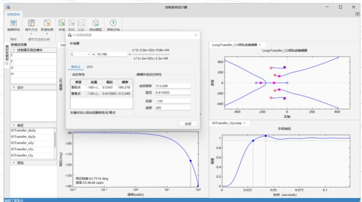

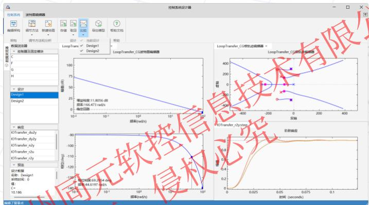

⑥ 查看此时系统的响应发现系统的动态特性明显改善，但仍未满足设计需求，因此需要对补偿器增益、极点位置和零点位置进行调整，知道满足设计需求。一种满足设计需求的补偿器参数为：

- 补偿器增益为10.186   
- 复极点位于 $-100 \pm 150 \mathrm{~im}$ 处  
- 复零点位于 $-130 \pm 285 \mathrm{~im}$ 处

⑦ 将补偿器进行设置后，查看闭环系统的阶跃响应，此时系统5%的调节时间约为0.03s，2%的调节时间约为0.045s，超调量为4%左右，满足设计需求。  
⑧ 要进行多个设计的比较，需要点击存储选项，保存当前设计，并通过比较选项进行多个设计的系统响应比较。比较完成后通过取回选项将最优设计设置为当前设计。  
(9) 设计完成后，通过导出模型选项可将模型导出至Syslab工作空间。

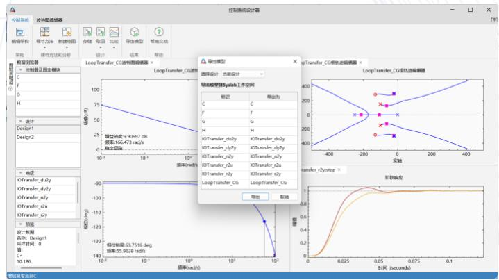

有关控制系统设计器的详细信息，可参阅帮助文档>APP>控制系统工具箱>控制系统设计器。

# 03

# PID调节器

# 3.PID调节器

PID控制器是工程控制领域中最常用的一种反馈控制器。PID代表比例（P）、积分（I）和微分（D），这三个元素构成了PID控制器的基础。比例控制（P）：比例控制是根据偏差的大小来调整控制量。偏差越大，控制量就越大，反之亦然。这种控制方式可以快速响应系统的变化，但可能会导致系统的稳态误差。积分控制（I）：积分控制是根据偏差累积的时间来调整控制量。即使偏差很小，只要持续存在，控制量也会不断增大，直到消除偏差。这种控制方式可以消除稳态误差，但响应速度较慢。微分控制（D）：微分控制是根据偏差变化的速度来调整控制量。偏差变化越快，控制量就越大，反之亦然。这种控制方式可以预测系统的变化，提前进行调整，从而减少超调和震荡。PID调节器通过综合这三种控制方式，可以实现对复杂系统的精确控制，广泛应用于各种工程领域，如温度控制、速度控制、压力控制等。在实际应用中，需要根据具体的控制对象和控制要求，合理设置PID参数，以达到最佳的控制效果。

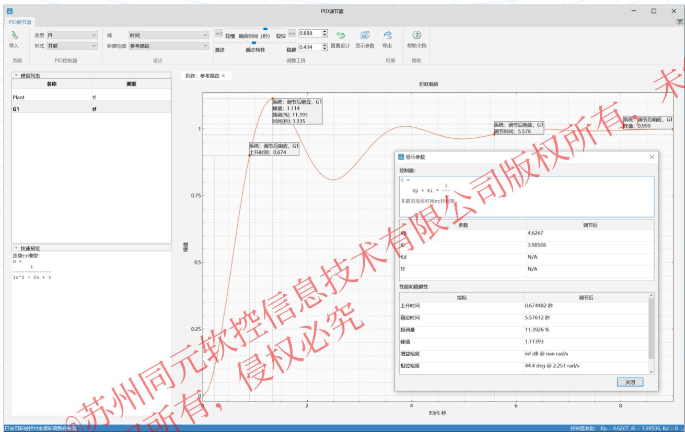

PID调节器可用于自动调整SISO模型的PID控制器参数以实现性能和鲁棒性之间的平衡。使用本应用程序，您可以：

> 根据时域设计需求自动生成PID控制器参数  
> 根据频域设计需求自动生成PID控制器参数  
支持对被控对象、参考跟踪等6种控制模型绘制阶跃响应和波特图  
支持实时查看系统的时频域特性  
支持将控制器模型和被控对象导出至 Syslab 工作区，进行分析

# 3.PID调节器

考虑用传递函数做为被控对象，按照如下命令生成传递函数。

$$
\mathrm {s y s} = \operatorname {t f} (1, [ 1, 2, 3 ])
$$

$$
s y s = \frac {1}{s ^ {2} + 2 s + 3}
$$

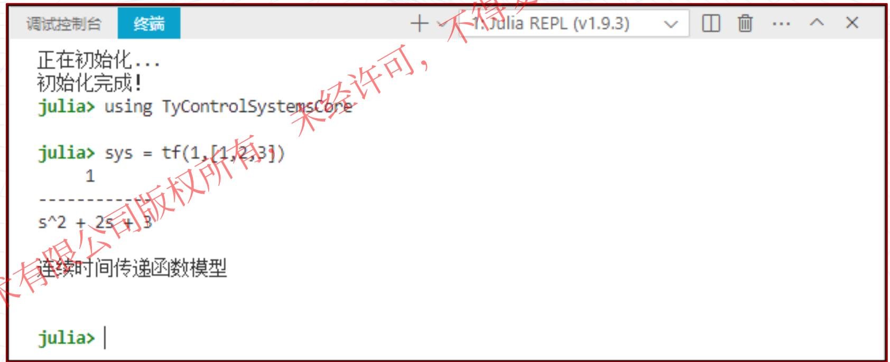

# 3.PID调节器

示例3.1：使用PID调节器设计PID控制器。

启动 PID 调节器：默认打开时会自动添加一个 Plant = 1 的传递函数。

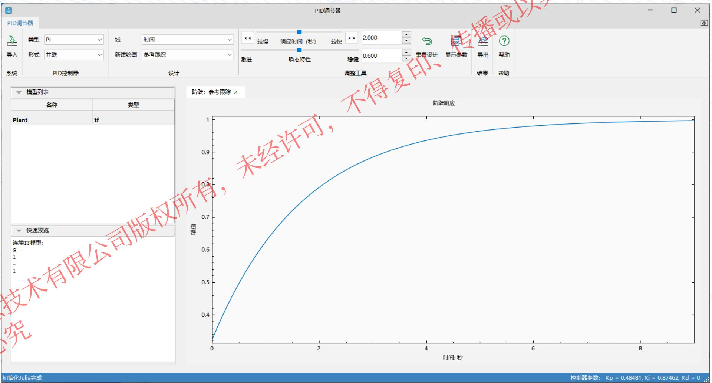

# 3.PID调节器

导入被控SISO模型对象：

① 单击PID调节器页面菜单栏的系统 > 导入按钮，选中被控对象 sys，单击导入，被控对象 sys 导入 App 中。  
② 导入被控对象后，新增阶跃参考跟踪绘图窗口。同时，时域响应指标默认响应时间为 $2 \mathrm{~s}$ ，瞬态特性为 0.6；频域响应指标默认带宽为 1 rad/s，相位裕度为 60 deg，绘图窗口会自动生成图像并显示。

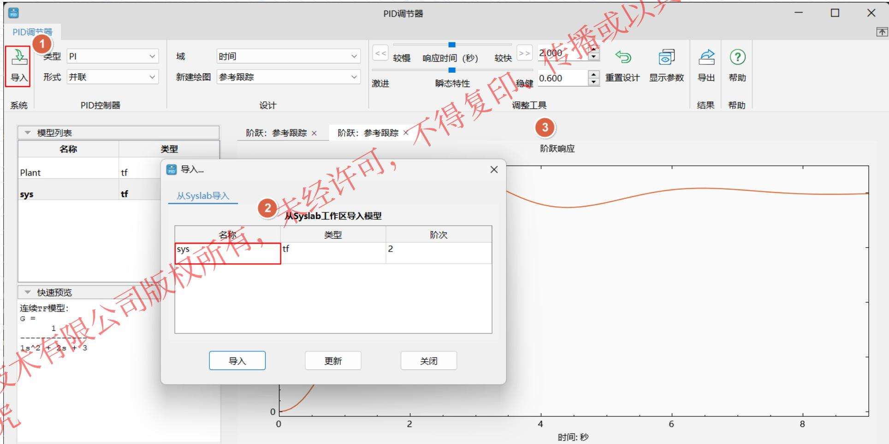  
已使用新被控对象重新调整控制器  
控制器参数： $\mathrm{Kp} = 0.77962,\mathrm{Ki} = 2.71886,\mathrm{Kd} = 0$

# 3.PID调节器

调整PID控制器设计类型、形式与性能指标：

(1) 单击PID控制器 > 类型下拉框, 切换控制器类型为PID, 页面上的绘图、控制器参数与性能指标会自动更新。  
(2) 单击新建绘图下拉框, 选择波特图的参考跟踪, 新建波特参考跟踪绘图。  
(3) 切换设计 $>$ 域为频率, 在输入框中修改带宽为 $7 \mathrm{rad} / \mathrm{s}$ , 相位裕度为 $77 \mathrm{deg}$ ; 且在输入框后, Enter键生效后, 控制器参数、波特图参考跟踪、阶跃参考跟踪和开环性能指标都会实时更新  
(4) 单击显示参数, 参数面板的控制器参数和开环性能都会实时刷新。

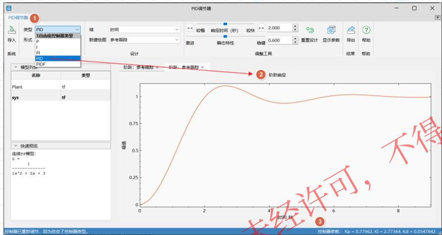

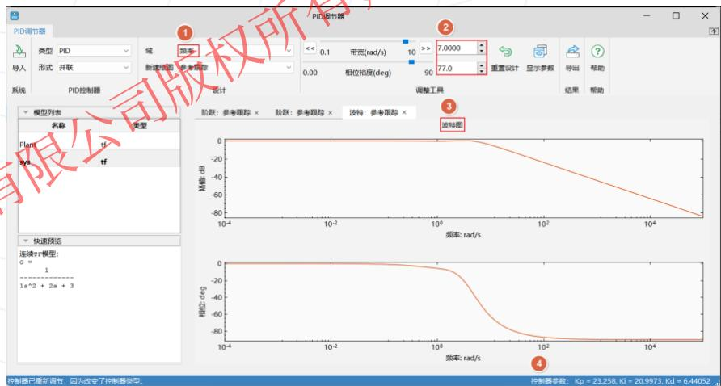

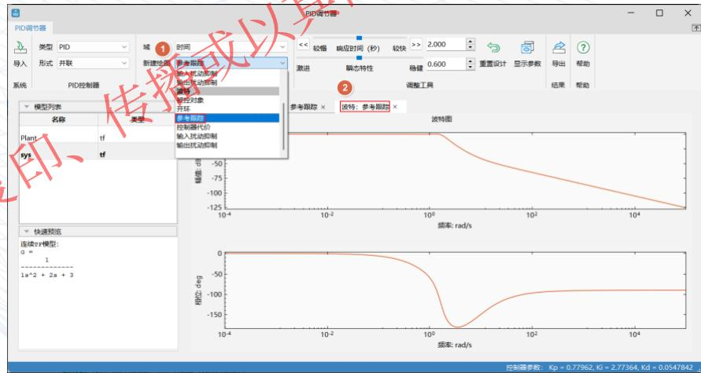

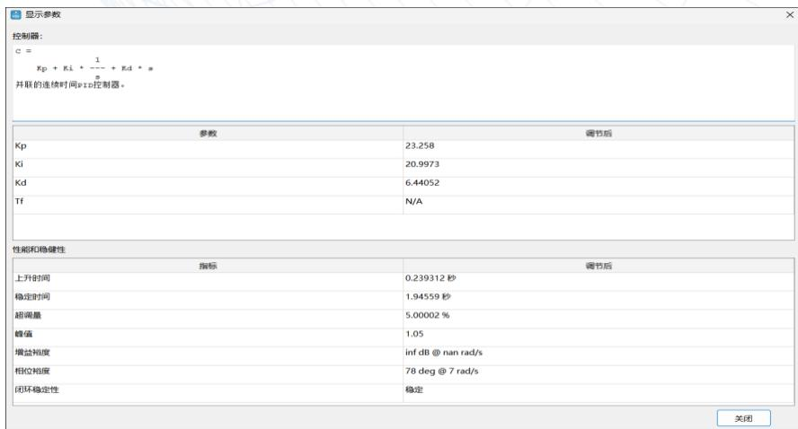

# 3.PID调节器

导出PID控制器：

(1) 单击导出, 弹出的导出面板中, 默认勾选了 PID 控制器, 且名称默认为 C。  
(2) 单击面板中的导出按钮, 会将控制器 C 导出至 Syslab 工作区。  
(3) 在 Syslab 终端可查看导出的控制器 C；或者在 Syslab 工作区查看。

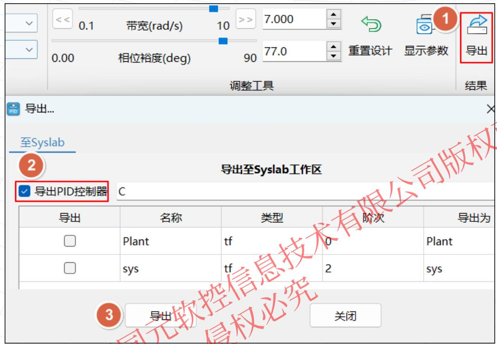

julia> C

$$
K p + K i * \begin{array}{c} 1 \\ - - - + K d * s \\ S \end{array}
$$

$$
\text {且} \mathrm {K p} = 2 3. 2 5 8, \mathrm {K i} = 2 0. 9 9 7 3, \mathrm {K d} = 6. 4 4 0 5 2
$$

并联型的连续时间PID控制器

# 3.PID调节器

重置设计：

(1) 单击重置设计按钮, 即可将调整工具中的带宽和相位裕度分别重置为 $1 \mathrm{rad} / \mathrm{s}$ 和 $60 \mathrm{deg}$ , 响应时间和瞬态特性分别重置为 $2 \mathrm{~s}$ 和 $0.6$ 。控制器参数恢复默认。  
(2) sys 系统的阶跃参考跟踪和波特参考跟踪绘图，全部恢复默认。

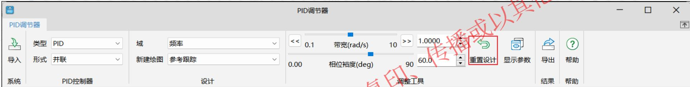

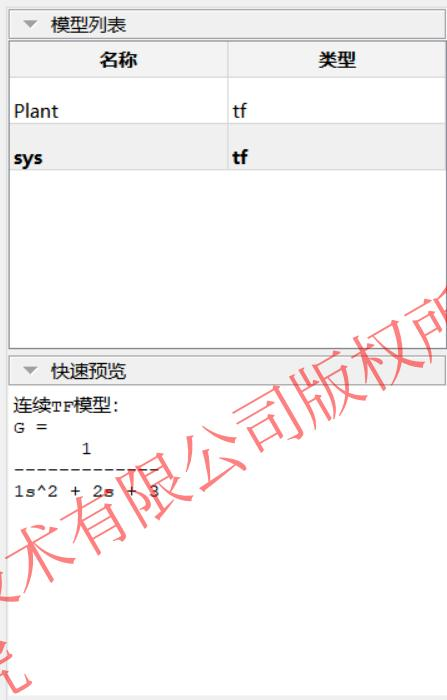

阶跃：参考跟踪× 阶跃：参考跟踪× 波特：参考跟踪×  
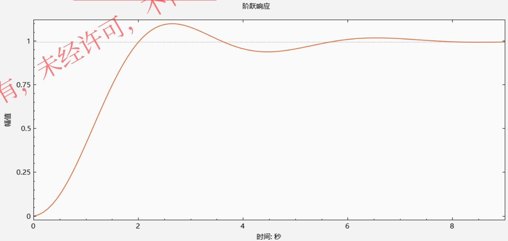  
控制器已重新调节，因为改变了控制器类型。  
控制器参数：Kp=0.77962,Ki=2.77364,Kd=0.0547842

# 3.PID调节器

绘图窗口：

在绘图窗口，可通过上下文菜单，勾选需要显示的基础信息。

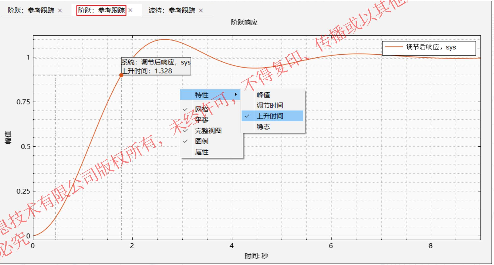

建立知识规范，营造协同生态

积累工业模型，发展可控平台

融入中国创新，打造先进软件

# 感谢聆听
