# Syslab与Sysplorer双向集成_2024a

- Source: `MWORKS高校星火计划资料包/培训课程配套材料/01-官网课程配套材料/00-快速入门课程/01-Sysplorer快速入门/07-MWORKS.Syslab和MWORKS.Sysplorer双向集成(2024a)/01-MWORKS.Syslab和MWORKS.Sysplorer双向集成.pdf`
- Converted by: `MinerU precise API`
- Conversion date: `2026-05-08`
- Review status: `MinerU converted; spot check recommended`
- Priority: `P0`
- Source SHA1: `0151ecdc646c`
- MinerU batch id: `1b00512a-e30b-450e-9c93-838eaa0bffc8`
- Images: `87`
- Notes: Syslab/Sysplorer 双向数据、仿真与 API 集成流程。

# 课程须知

本课程适用软件版本：MWORKS.Syslab2024aMWORKS.Sysplorer 2024a  
➢ 本课程示例运行需要软件首选项加载：

基础库  
数学库  
图形库  
信号处理库  
控制系统库  
DSP系统库

# MWORKS.Syslab和

# MWORKS.Sysplorer双向融合

# 新一代科学计算与系统建模平台MWORKS

耿建

苏州同元软控信息技术有限公司

2025年5月23日

  
TONGYU∧N  
Software and Control

# 目录

1. 背景-使用前的准备  
2. To Workspace   
3. From Workspace   
4. Syslab Function   
5. Sysplorer API

# 1.1 信息物理融合系统(CPS)

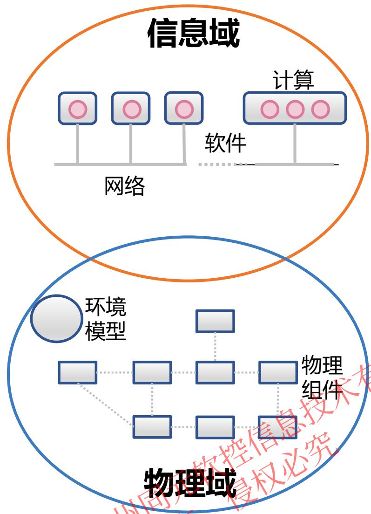

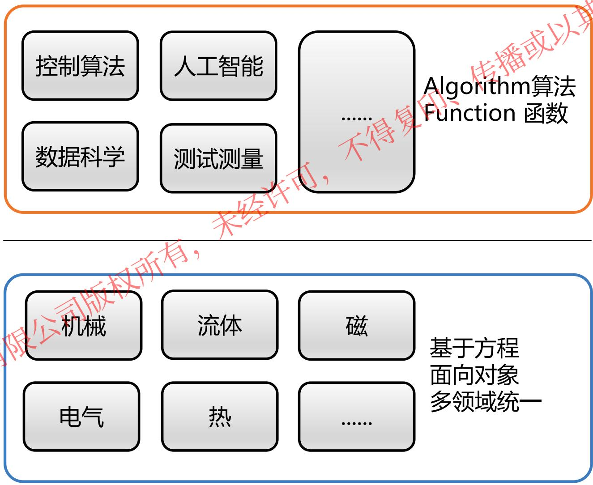

Syslab科学计算环境

Sysplorer系统建模仿真环境

# 1.1 信息物理融合系统(CPS)

Radar Tracking Using Syslab Function Block

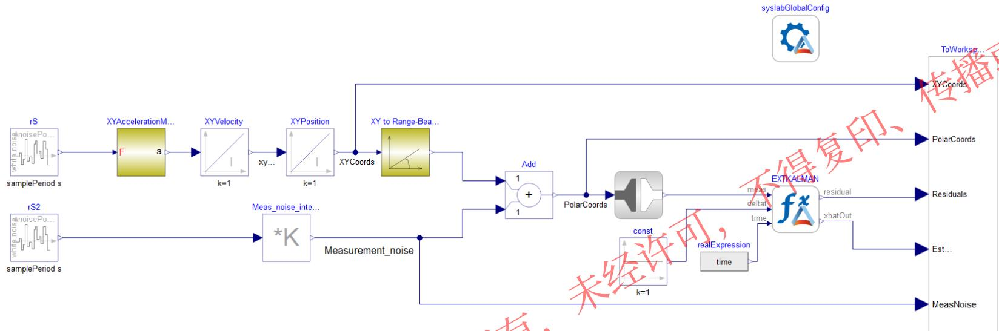  
示例详见：Sysplorer内置模型库SyslabWorkspace-Examples-Demo_SyslabFunction_RadarTracking-RadarTracking

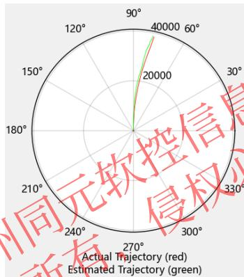

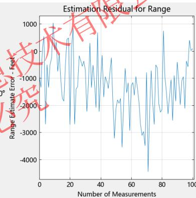

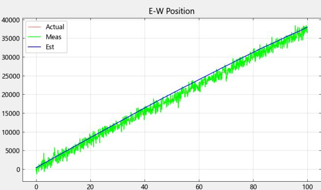

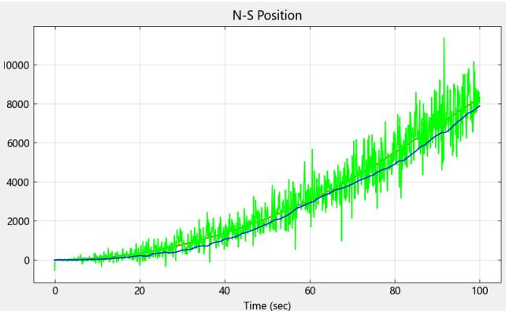

# 1.2 使用前的准备

在Syslab菜单栏中点击Sysplorer，自动打开Sysplorer软件并加载SyslabWorkspace模型库

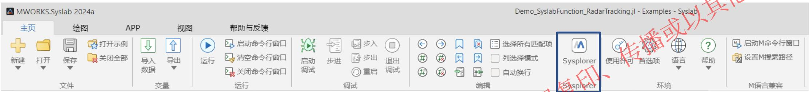

# 使用须知：

1. 如不能打开Sysplorer软件，则需要确认Syslab首选项中Sysplorer可执行文件路径是否正确  
2. Syslab和Sysplorer均需2022版以上  
3. Sysplorer软件编译器为64位

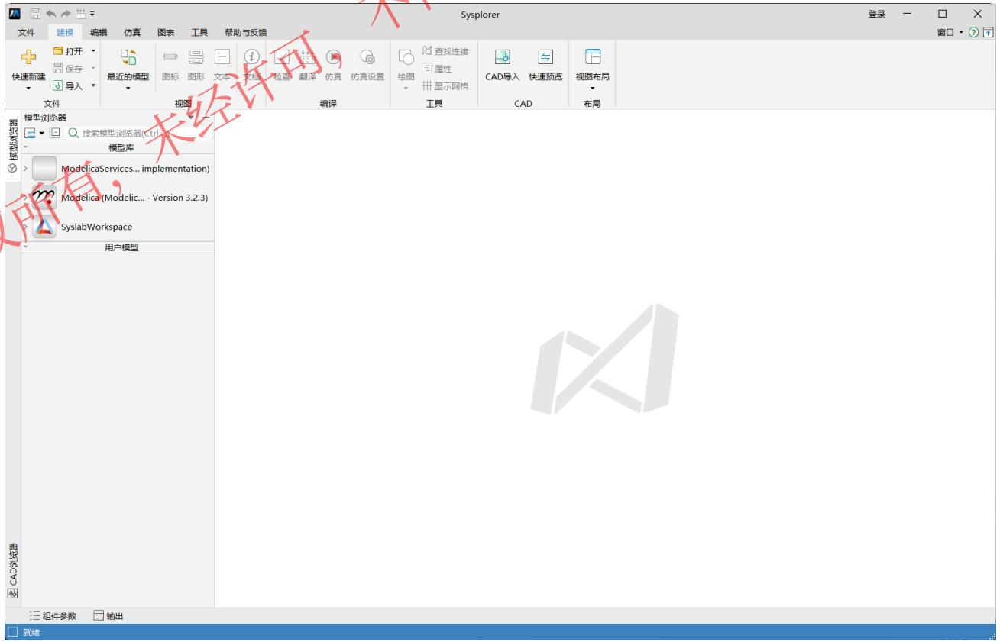

# 目录

1. 背景-使用前的准备  
2. To Workspace   
3. From Workspace   
4. Syslab Function   
5. Sysplorer API

# 2. To Workspace

# 将Sysplorer的仿真结果发送至Syslab工作空间中

Syslab

科学计算环境

Sysplorer

系统建模仿真环境

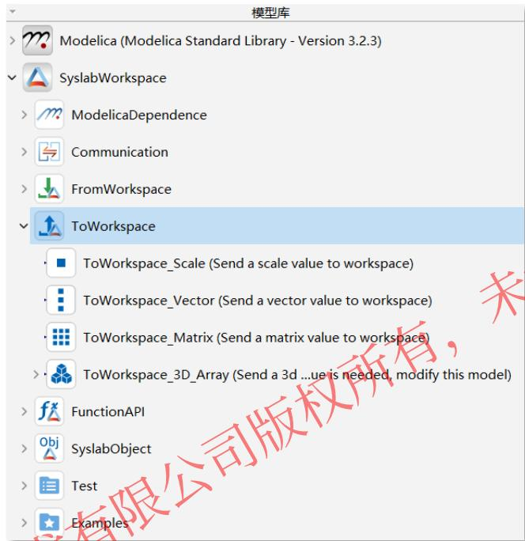  
拖拽式建模

reference speedgeneration

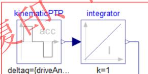

plant (simple drive train)

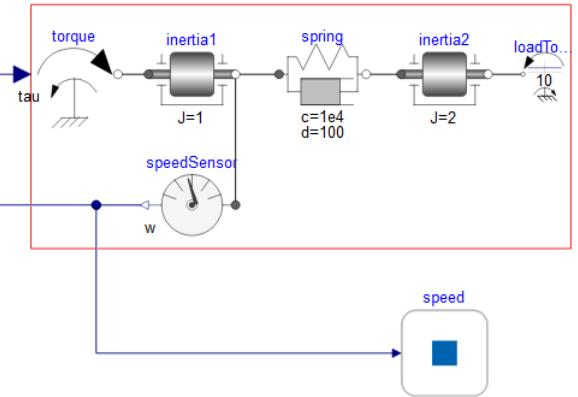

Pl controller

示例详见：Sysplorer内置模型库SyslabWorkspace-Examples-Demo_ToWorkspace_PID_Controller

To Workspace子库中包含4个组件，分别为：

• ToWorkspace_Scale：输出为标量数据  
• ToWorkspace_Vector：输出为一维数组  
ToWorkspace_Matrix：输出为数组  
ToWorkspace_3D_Array：输出为三维数组

# 2. To Workspace

reference speed generation

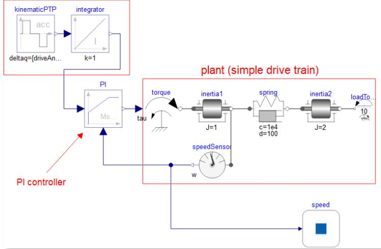  
示例详见：Sysplorer内置模型库SyslabWorkspace-Examples-Demo_ToWorkspace_PID_Controller

# 仿真

有國

<table><tr><td>名称</td><td>值</td></tr><tr><td>vans</td><td>NamedTuple(:tout, :w), ...</td></tr><tr><td>vout</td><td>NamedTuple(:tout, :w), ...</td></tr></table>

  
使用Syslab对仿真结果进行处理分析

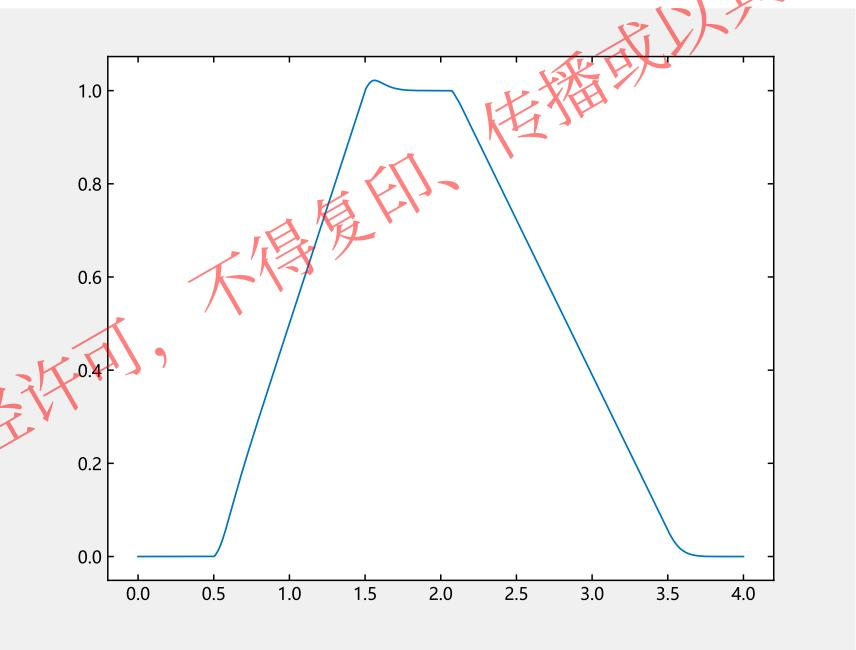

using TyPlot

$\mathbf { t } =$ out.tout

w = out.w

plot(t, w)

#在Syslab中进行输出变量的后处理

# 目录

1. 背景-使用前的准备  
2. To Workspace   
3. From Workspace   
4. Syslab Function   
5. Sysplorer API

# 3. From Workspace

# Sysplorer从Syslab工作空间中读取数据并作为输入

Syslab

科学计算环境

Sysplorer

系统建模仿真环境

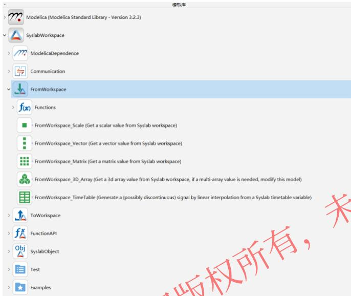

拖拽式建模

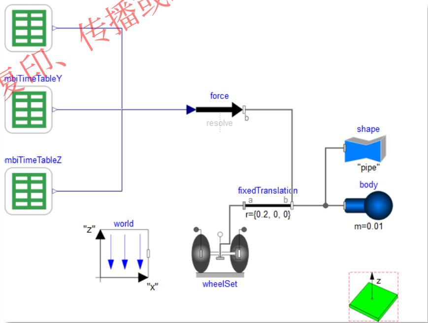  
示例详见：Sysplorer内置模型库SyslabWorkspace-Examples-Demo_FromWorkspace_RollingWheelSetPulling

FromWorkspace子库中包含5个组件，分别为：

• FromWorkspace_Scale：获取标量数据  
• FromWorkspace_Vector：获取一维数组  
• FromWorkspace_Matrix：获取二维数组  
• FromWorkspace_3D_Array：获取三维数组  
• FromWorkspaceTimeTable：获取表格矩阵，并通过线性插值来生成（可能是不连续的）信号

注意： FromWorkspace传递的量均为变量，不能直接作为组件参数，需将组件参数处理为输入接口或变量。

# 3. From Workspace

# Julia代码

table = [0 1 0 0

1 1 0 0

2 0 2 0

3 0 2 0]

combiTimeTableX $=$ table[:,[1,2]] #取1,2两列

combiTimeTableY $=$ table[:,[1,3]] #取1,3两列

combiTimeTableZ $=$ table[:,[1,4]] #取1,4两列

# 代码运行

名称

值

ans

Matrix{lnt64} with 4x2 ..

combiTimeTableX

Matrix{Int64} with 4x2 e...

combiTimeTableY

Matrix{lnt64} with 4x2e

combiTimeTableZ

Matrix{Int64yithAx2 e...

  
使用FromWorkspace组件

table

Matri&n with 4x4 e...

<table><tr><td colspan="4">参数</td></tr><tr><td>varName</td><td>* combiTimeTableZ*</td><td></td><td>Timetable variable name</td></tr><tr><td>row_dims</td><td>4</td><td></td><td>Timetable row dims</td></tr><tr><td>offset</td><td>0</td><td></td><td>Offset of output signal</td></tr><tr><td>startTime</td><td>0</td><td>s</td><td>Output = offset for time &lt;startTime</td></tr></table>

# 设定参数

# 名与工作空间变量名需完全一致

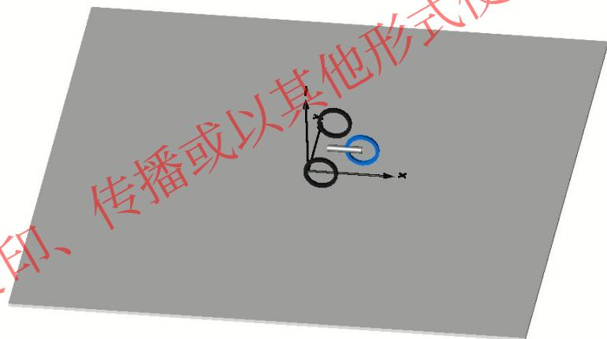

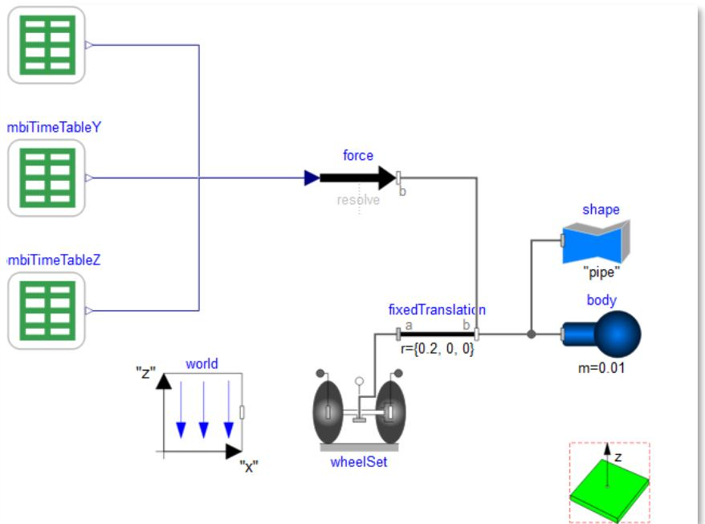  
示例详见：Sysplorer内置模型库SyslabWorkspace-Examples-Demo_FromWorkspace_RollingWheelSetPulling

# 3. From Workspace

From Workspace Functions 以函数的形式从 Syslab 工作区中读取数据，因此可以直接将获取的数据作为其他组件的参数值。

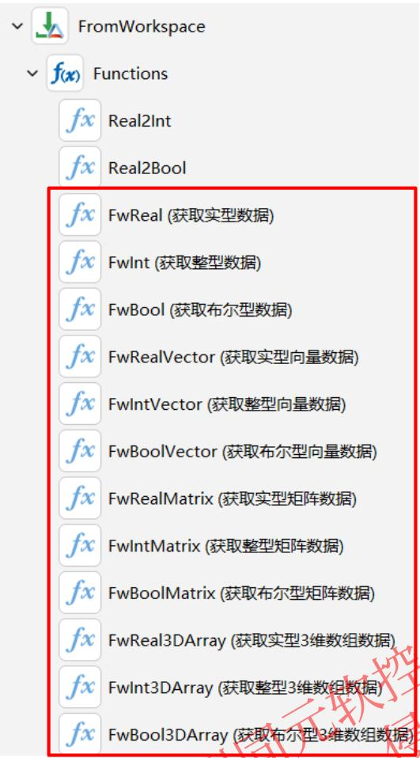

#Syslab脚本：

# 标量

i_val = 5

f_val = 7.5

b_val = true

# 向量

$\mathsf { i } \_ { \mathsf { V e C } } = [ 1 , 2 , 3 ]$

f_vec $=$ [1, 2.5, 3.5]

b_vec $=$ [true, false, true]

# 矩阵

i_mtx = [1 2 3; 4 5 6]

f_mtx = [1 2.5 3.5; 4 5.5 6.5]

b_mtx $=$ [true false true; false true false]

# 三维数组

i_arr $=$ fill(1, (2, 3, 4))

i_arr[2, 1, 3] = 17

f_arr = fill(2.5, (2, 3, 4))

f_arr[2, 1, 3] = 17

b_arr $=$ fill(true, (2, 3, 4))

b_arr[2, 1, 3] $=$ false

Syslab中计算出结果

model SubModel

import SyslabWorkspace.FromWorkspace.Functions.*;

//标量

parameter Integer int_x $=$ FwInt("i_val") "整型标量";

parameter Real real_x = FwReal("f_val") "实型标量";

parameter Boolean bool_x $=$ FwBool("b_val") "布尔型标量";

//向量

parameter Integer int_vec[:] $=$ FwIntVector("i_vec", 3) "整型向量";

parameter Real real_vec[:] $=$ FwRealVector("f_vec", 3) "实型向量";

parameter Boolean bool_vec[:] $=$ FwBoolVector("b_vec", 3) "布尔型向量";

//矩阵

parameter Integer int_mtx[:,:] $=$ FwIntMatrix("i_mtx", 2, 3) "整型矩阵";

parameter Real real_mtx[:,:] $=$ FwRealMatrix("f_mtx", 2, 3) "实型矩阵";

parameter Boolean bool_mtx[:,:] $=$ FwBoolMatrix("b_mtx", 2, 3) "布尔型矩阵";

//三维数组

parameter Integer int_arr[:,:,:] $=$ FwInt3DArray("i_arr", 2, 3, 4) "整型三维数组";

parameter Real real_arr[:,:,:] $=$ FwReal3DArray("f_arr", 2, 3, 4) "实型三维数组";

parameter Boolean bool_arr[:,:,:] $=$ FwBool3DArray("b_arr", 2, 3, 4) "布尔型三维数组";

annotation (…);

end SubModel;

Sysplorer中模型通过函数读取工作空间值作为参数

注：函数调用见：Modelica语法-函数；参数定义见Modelica语法-类与内置类型

# 目录

1. 背景-使用前的准备  
2. To Workspace   
3. From Workspace   
4. Syslab Function   
5. Sysplorer API

# 4. Syslab Function

将Syslab中构建的Julia复杂算法封装至Sysplorer中

Syslab科学计算环境

Sysplorer系统建模仿真环境

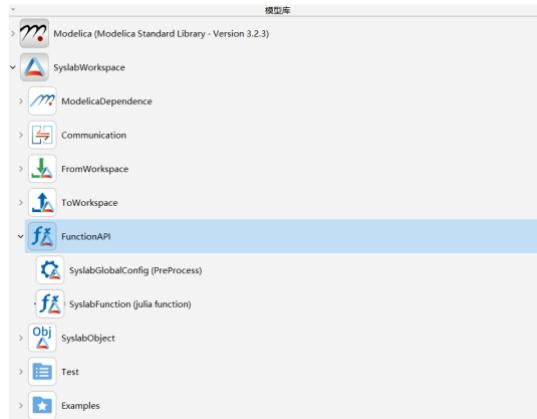

Function API中包含2个组件：

SyslabGlobalConfig：用于全局声明，包括导入包及全局变量声明等。  
SyslabFunction：用于嵌入 Julia函数，并将Syslab Function模块的输入和输出数据指定为参数和返回值。

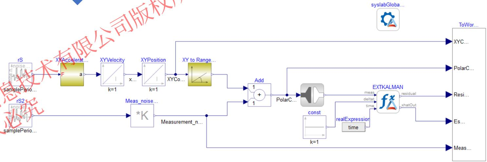  
示例详见：Sysplorer内置模型库SyslabWorkspace-Examples-Demo_SyslabFunction_RadarTracking-RadarTracking

# 4. Syslab Function

右击SyslabGlobalConfig模型，选择Syslab初始化配置， 即可转到Syslab中的全局声明代码

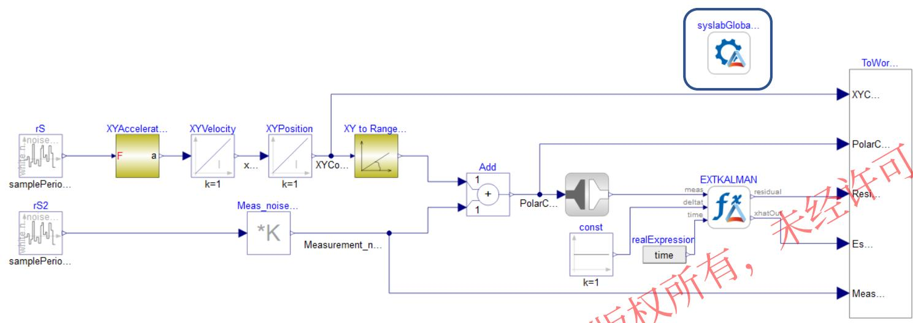  
示例详见：Sysplorer内置模型库SyslabWorkspace-Examples-Demo_SyslabFunction_RadarTracking-RadarTracking

  
Juli 建

# Julia代码-设置全局声明

$$
\begin{array}{l} P = \left[ \begin{array}{l l} \end{array} \right] \\ x h a t = [ ] \\ \text {r e s i d u a l} = [ ] \\ x h a t O u t = [ ] \\ s a m p l e = 1; \# \text {采 样 间 隔} \\ \text {n e x t} = 0. 0 1; \# \text {采 样 点} \\ \end{array}
$$

自动同步

$$
\begin{array}{l} ^ {\prime \prime} P = [ ] \\ x h a t = [ ] \\ \text {r e s i d u a l} = [ ] \\ x h a t O u t = [ ] \\ s a m p l e = 1; \# \text {采 样 间 隔} \\ \mathrm {n e x t} _ {\mathrm {t}} = 0. 0 1; \# \text {采 样 点}" \\ \mathsf {a n n o t a t i o n} (\ldots); \\ \end{array}
$$

# 4. Syslab Function

右击SyslabFunction模型，选择编辑Syslab函数脚本，即可转到Syslab中的算法函数代码

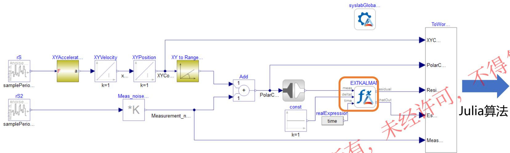  
示例详见：Sysplorer内置模型库SyslabWorkspace-Examples-Demo_SyslabFunction_RadarTracking-RadarTracking

function EXTKALMAN(meas, deltat, time)

# Initialization

global P;

global xhat;

global residual;

global xhatOut;

global next_t; #采样点

global sample; #采样间隔(s)

if isempty(P)

xhat $=$ [0.001; 0.01; 0.001; 400;;]; # 4x1矩阵

$$
P = \text {z e r o s} (4, 4);
$$

end

# 注意：

SyslabFunction组件认为脚本中的

第一个函数为本组件的主函数，其他

函数均为服务于主函数的辅助函数。

# 4. Syslab Function

SyslabFunction模型会根据第一个函数的输入参数和返回值自动生成输入输出接口；

如需手动配置：右击SyslabFunction模型，选择设置Syslab函数端口，手动配置输入输出接口。

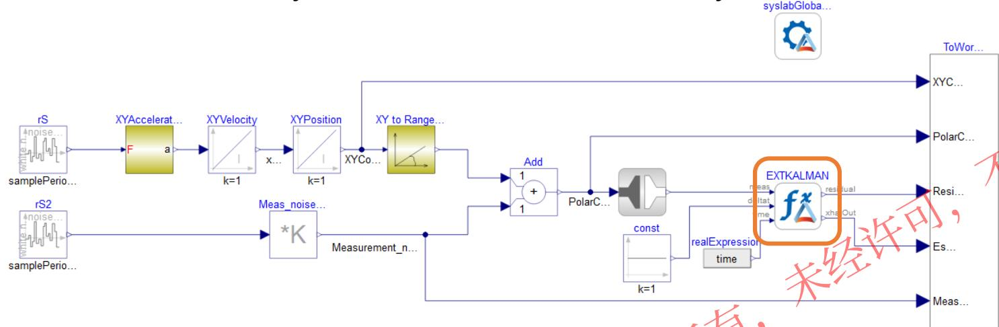

  
示例详见：Sysplorer内置模型库SyslabWorkspace-Examples-Demo_SyslabFunction_RadarTracking-RadarTracking

# 配置输入输出接口

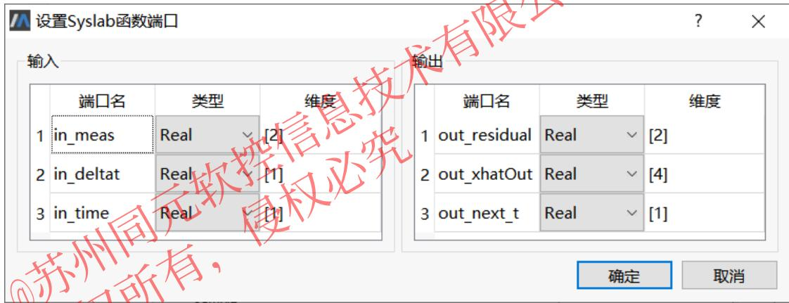

# 说明：

• 主函数的输入不要指定类型，不要指定具名参数；  
主函数的输出必须使用return指定，且必须为函数体中已经出现的变量符号；  
输入输出配置需要设定数据类型和维度。

# 4. Syslab Function

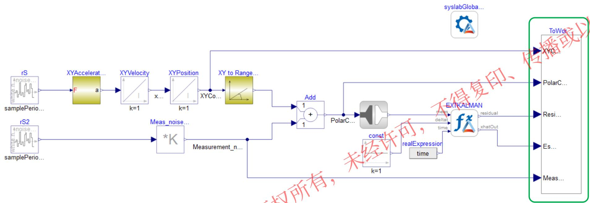  
示例详见：Sysplorer内置模型库SyslabWorkspace-Examples-Demo_SyslabFunction_RadarTracking-RadarTracking

使用To Workspace，在Syslab中处理仿真结果

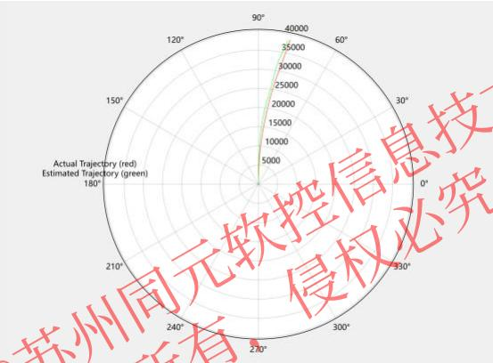

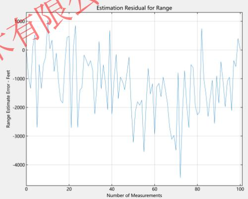

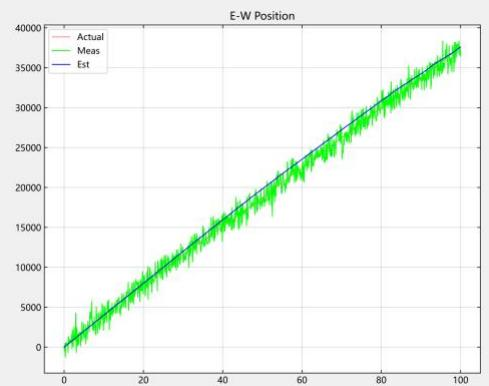

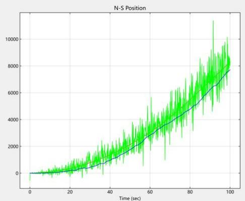

# 4. Syslab Function

# 将Syslab中Julia对象进行动态系统建模和处理流式数据

Syslab

科学计算环境

Sysplorer

系统建模仿真环境

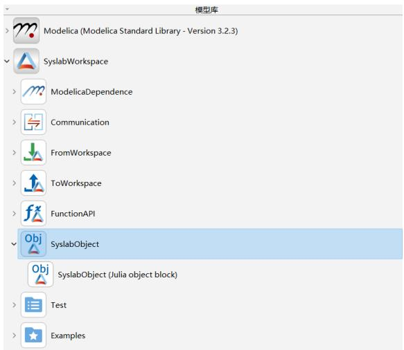

# syslabObject

# 拖拽组件

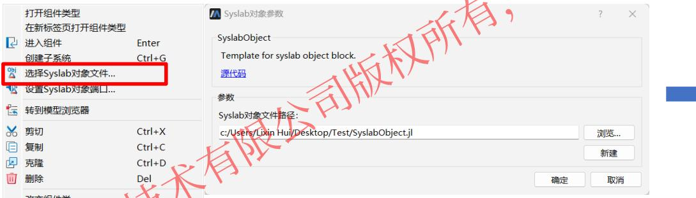

# 新建或选择脚本路径

using ObjectOriented

@oodef mutable struct SyslabObject

# Description (用于生成Modelica组件描述)   
# Template for syslab object block.

# Parameter (用于生成 Modelica 组件参数，包括名称、类型、描述)

# 格式：参数名::参数类型 $=$ 参数值 # 参数注释

# 例如：

gain::Real = 1.0

# 增益

# Private (Julia内部变量)

# 格式：变量名::类型 $=$ 值 # 变量说明

# 例如：

_count::Integer = -1

# 计数器

# Methods (主要调用算法，包括setupImpl，stepImpl，releaseImpl)

# 初始化函数：函数名固定，函数形参与stepImpl函数形参一致

function setupImpl(self, u)

self._count $= 0$

# ...

return nothing

end #setupImpl

# 单步计算函数：函数名固定，第一个函数形参必须是self，

# 其余函数形参将作为Modelica组件的输入端口，函数返回值作为输出端口

function stepImpl(self, u)

self._count $+ = 1$

# ...

$\boldsymbol { \mathsf { y } } = \boldsymbol { \mathsf { u } } ^ { \star }$ self.gain

return y

end #stepImpl

# 释放资源函数：函数名固定，且只能有一个函数参数self

function releaseImpl(self)

# ...

return nothing

end #releaseImpl

# 其它自定义函数，第一个函数形参数必须是self

# function xx(self)

#

# end

end

# 4. Syslab Function

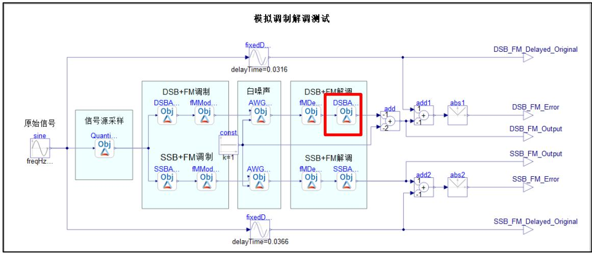

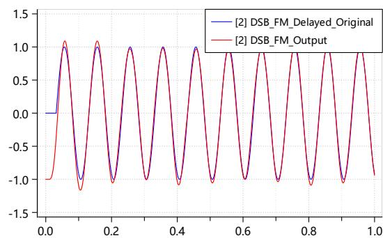

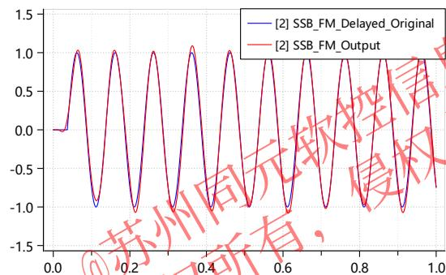

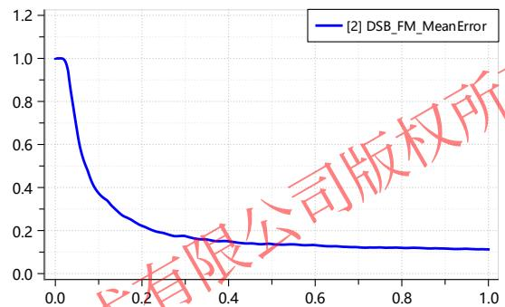

using TyCommunication

using TyBase

using TyMath

using TySignalProcessing

using ObjectOriented

@oodef mutable struct DSBAmplitudeDemodulator

# Description   
# Parameter

InputSignalOffset::Float64 = 1

CarrierFrequency::Float64 = 100   
InitialPhase::Float64 = 0   
SampleFrequency::Float64 = 1000

FilterOrder::Int64 = 4   
CutoffFrequency::Float64 = 100   
PassbandRipple::Float64 = 0.1   
StopbandAttenuation::Float64 = 50   
LowPassFilterMethod::String = "Butterworth"   
# Private   
Samplepoint = 0   
b = 0   
  
  
# Methods   
function setupImpl(self, data)

#..

if self.SampleFrequency $< 0$ throw(ArgumentError("Fs must be a real, positive scalar."))

end

# check that Fs must be greater than $2 ^ { \ast } \mathsf { F c }$

if self.SampleFrequency $< ~ 2 ~ ^ { * }$ self.CarrierFrequency throw(ArgumentError("Fs must be at least $2 ^ { \ast } F C \cdot ^ { \ast } )$ )

end   
if self.LowPassFilterMethod $= =$ "Butterworth"

…… end

self.zi = zeros(Float64, (max(length(self.a),length(self.b)) - 1)) return nothing

end #setupImpl

function stepImpl(self, data)

#...   
temp $=$ data .* cos(2 * pi * self.CarrierFrequency * self.Samplepoint / self.SampleFrequency $^ +$ self.InitialPhase)

return out

end #stepImpl

function releaseImpl(self)   
#.   
return nothing   
end #releaseImpl

组件参数  
  

<table><tr><td colspan="4">参数</td></tr><tr><td>startTime</td><td>0</td><td>s</td><td>sample start time</td></tr><tr><td>period</td><td>0.0001</td><td>s</td><td>sample period</td></tr><tr><td>InputSignalOffset</td><td>1</td><td></td><td></td></tr><tr><td>CarrierFrequency</td><td>100</td><td></td><td></td></tr><tr><td>InitialPhase</td><td>0</td><td></td><td></td></tr><tr><td>SampleFrequency</td><td>10000</td><td></td><td></td></tr><tr><td>FilterOrder</td><td>4</td><td></td><td></td></tr><tr><td>CutoffFrequency</td><td>20</td><td></td><td></td></tr><tr><td>PassbandRipple</td><td>0.1</td><td></td><td></td></tr><tr><td>StopbandAttenuati...</td><td>50</td><td></td><td></td></tr><tr><td>LowPassFilterMethod</td><td>&quot;Butterworth&quot;</td><td></td><td></td></tr></table>

# 目录

1. 背景-使用前的准备  
2. To Workspace   
3. From Workspace   
4. Syslab Function   
5. Sysplorer API

# 5. Sysplorer API

<table><tr><td>类别</td><td>命令接口</td><td>含义</td></tr><tr><td rowspan="9">系统命令</td><td>ClearScreen</td><td>清空命令窗口</td></tr><tr><td>SaveScreen</td><td>保存命令窗口内容至文件</td></tr><tr><td>ChangeDirectory</td><td>更改工作目录</td></tr><tr><td>ChangeSimResultDirectory</td><td>更改仿真结果目录</td></tr><tr><td>RunScript</td><td>执行脚本文件</td></tr><tr><td>GetLastErrors</td><td>获取上一条命令的错误信息</td></tr><tr><td>ClearAll</td><td>移除所有模型</td></tr><tr><td>Echo</td><td>打开或关闭命令执行状态的输出</td></tr><tr><td>Exit</td><td>退出MWORKS.Sysplorer</td></tr><tr><td rowspan="10">文件命令</td><td>OpenModelFile</td><td>加载指定的Modelica模型文件</td></tr><tr><td>LoadLibrary</td><td>加载Modelica模型库</td></tr><tr><td>ImportFMU</td><td>导入FMU文件</td></tr><tr><td>EraseClasses</td><td>删除子模型或卸载顶层模型</td></tr><tr><td>ExportIcon</td><td>把图标视图导出为图片</td></tr><tr><td>ExportDiagram</td><td>把组件视图导出为图片</td></tr><tr><td>ExportDocumentation</td><td>把模型文档信息导出到文件</td></tr><tr><td>ExportFMU</td><td>模型导出为FMU</td></tr><tr><td>ExportVeristand</td><td>模型导出为Veristand模型</td></tr><tr><td>ExportSFunction</td><td>模型导出为Simulink的S-Function</td></tr></table>

Syslab 命令窗口(REPL)或脚本中可直接调用Sysplorer API接口

<table><tr><td>类别</td><td>命令接口</td><td>含义</td></tr><tr><td rowspan="15">仿真命令</td><td>OpenModel</td><td>打开模型窗口</td></tr><tr><td>CheckModel</td><td>检查模型</td></tr><tr><td>TranslateModel</td><td>翻译模型</td></tr><tr><td>SimulateModel</td><td>仿真模型</td></tr><tr><td>RemoveResults</td><td>移除所有结果</td></tr><tr><td>RemoveResult</td><td>移除最后一个结果</td></tr><tr><td>ImportInitial</td><td>导入初值文件</td></tr><tr><td>ExportInitial</td><td>导出初值文件</td></tr><tr><td>GetInitialValue</td><td>获取变量初值</td></tr><tr><td>SetInitialValue</td><td>设置变量初值</td></tr><tr><td>ExportResult</td><td>导出结果文件</td></tr><tr><td>SetCompileSolver64</td><td>设置翻译时编译器平台位数</td></tr><tr><td>GetCompileSolver64</td><td>获取翻译时编译器平台位数</td></tr><tr><td>SetCompileFmu64</td><td>设置fmu导出时编译器平台位数</td></tr><tr><td>GetCompileFmu64</td><td>获取fmu导出时编译器平台位数</td></tr></table>

# 5. Sysplorer API

<table><tr><td>类别</td><td>命令接口</td><td>含义</td></tr><tr><td rowspan="5">曲线命令</td><td>CreatePlot</td><td>按指定的设置创建曲线窗口</td></tr><tr><td>Plot</td><td>在最后一个窗口中绘制指定变量的曲线</td></tr><tr><td>RemovePlots</td><td>关闭所有曲线窗口</td></tr><tr><td>ClearPlot</td><td>清除曲线窗口中的所有曲线</td></tr><tr><td>ExportPlot</td><td>曲线导出</td></tr><tr><td rowspan="5">文件命令</td><td>CreateAnimation</td><td>新建动画窗口</td></tr><tr><td>RemoveAnimations</td><td>关闭所有动画窗口</td></tr><tr><td>RunAnimation</td><td>播放动画</td></tr><tr><td>StopAnimation</td><td>停止动画播放</td></tr><tr><td>Animation Speed</td><td>设置动画播放速度</td></tr></table>

<table><tr><td>类别</td><td>命令接口</td><td>含义</td></tr><tr><td rowspan="10">模型对象操作命令</td><td>GetClasses</td><td>获取指定模型的嵌套类型</td></tr><tr><td>GetComponents</td><td>获取指定模型的嵌套组件</td></tr><tr><td>GetParamList</td><td>获取指定组件前缀层次中的参数列表</td></tr><tr><td>GetModelDescription</td><td>获取指定模型的描述文字</td></tr><tr><td>SetModelDescription</td><td>设置指定模型的描述文字</td></tr><tr><td>GetComponentDescription</td><td>获取指定模型中组件的描述文字</td></tr><tr><td>SetComponentDescription</td><td>设置指定模型中组件的描述文字</td></tr><tr><td>SetParamValue</td><td>设置当前模型指定参数的值</td></tr><tr><td>SetModelText</td><td>修改模型的Modelica文本内容</td></tr><tr><td>GetExperiment</td><td>获取模型仿真配置</td></tr></table>

关于Sysplorer API命令可见Syslab中文帮助文档中“Sysplorer API”

# 5. Sysplorer API

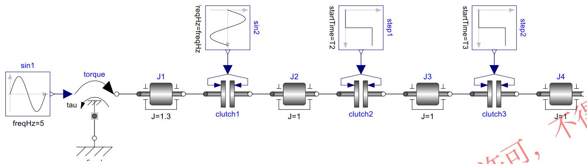  
在Syslab中对Sysplorer模型进行参数扫动分析

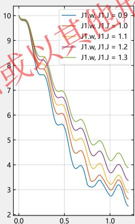

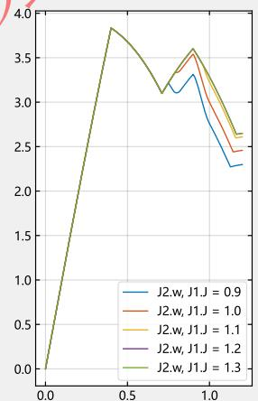

#软件恢复初始化

Sysplorer.ClearAll()

#加载Modelica3.2.1

Sysplorer.LoadLibrary("Modelica", "3.2.1")

# 打开模型

Sysplorer.OpenModel("Modelica.Mechanics.Rotational.Exa mples.CoupledClutches", Sysplorer.ModelView.Diagram)

# 扫动变量值，扫动序列为：0.9、1.0、 1.2、1.3para_sweep $=$ [0.9, 1.0, 1.1, 1.2, 1.3]

# 结果数组

J1_w_list = [] J2_w_list = [] time_list = []

# 开始实验

for i in 1:5

$$
\operatorname {p r i n t l n} \left(" s w e e p c a s e - \mathrm {s i} : \mathrm {J} 1. \mathrm {J} = \mathrm {\Phi} (\text {p a r a} _ {-} \text {s w e e p} [ \mathrm {i} ]) ^ {\prime}\right)
$$

# 设置变量

Sysplorer.SetParamValue("J1.J", string(para_sweep[i]))

# 进行仿真

Sysplorer.SimulateModel("Modelica.Mechanics.Rotational.Exampl es.CoupledClutches",

stop_time $= 1 . 2 ,$ algo $=$ Sysplorer.Integration.Dassl) println("case- $\$ 1$ finished")

# 记录结果

push!(J1_w_list, Sysplorer.GetVarValues("J1.w")) push!(J2_w_list, Sysplorer.GetVarValues("J2.w")) push!(time_list, Sysplorer.GetVarValues("time"))

end

# 结果绘图

println("start to plot")

subplot(1, 2, 1) hold("on")

建立知识规范， 营造协同生态

积累工业模型， 发展可控平台

融入中国创新， 打造先进软件

# Thanks！
