# Syslab与Sysplorer双向集成_2025b

- Source: `MWORKS高校星火计划资料包/培训课程配套材料/01-官网课程配套材料/00-快速入门课程/01-Sysplorer快速入门/08-MWORKS.Syslab与MWORKS.Sysplorer双向集成(2025b)/Syslab与Sysplorer双向集成.pdf`
- Converted by: `MinerU precise API`
- Conversion date: `2026-05-08`
- Review status: `MinerU converted; spot check recommended`
- Priority: `P0`
- Source SHA1: `22616e83b3dc`
- MinerU batch id: `702ffa8d-4239-4d3f-b385-1a3ff1197d59`
- Images: `158`
- Notes: 较新版本的 Syslab/Sysplorer 集成材料。

# MWORKS.Syslab和  
MWORKS.Sysplorer双向集成

# CONTENTS

# 目录 $\rightarrow$

01 背景-使用前的准备  
02 ToWorkspace   
03 FromWorkspace   
04 Syslab Block   
05 Sysplorer API   
06 工作区同步  
07 模型调试

# PART 01 $\rightarrow$

# 背景

使用前的准备


# 1.1 信息物理融合系统(CPS)

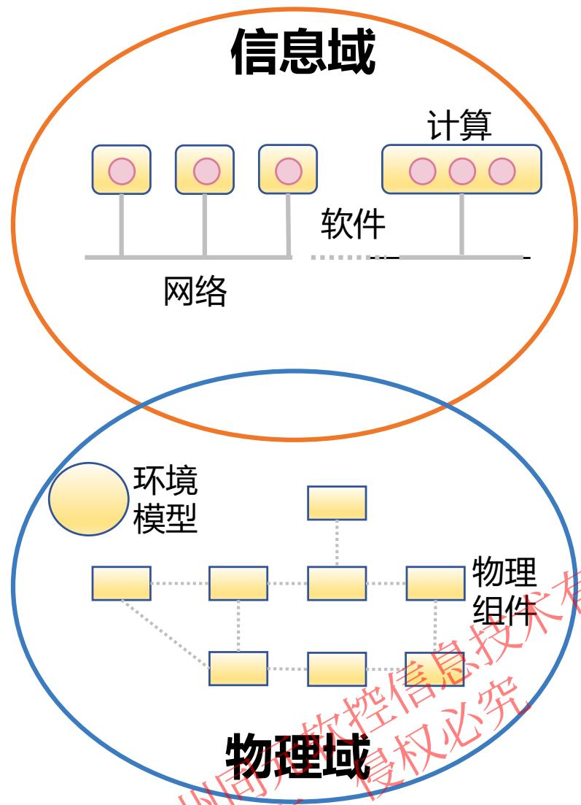

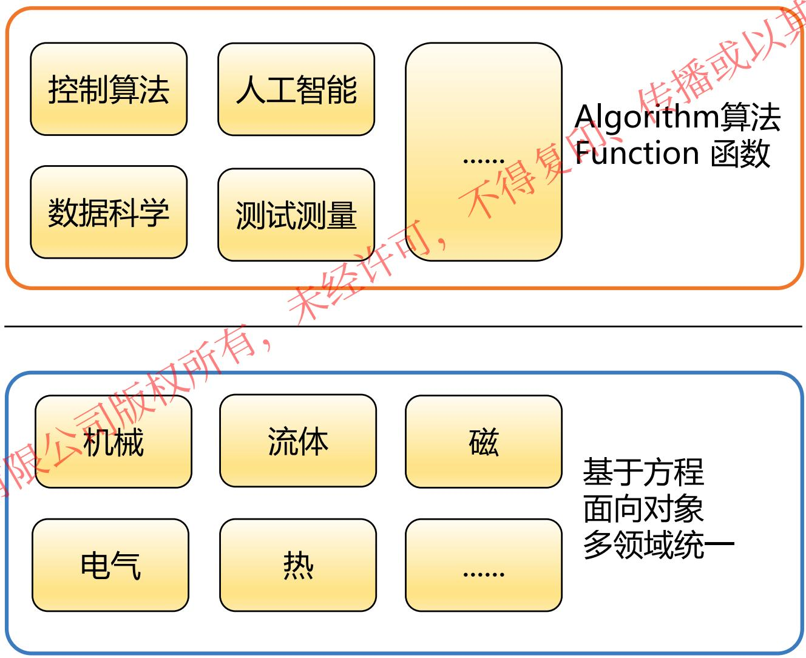


Syslab


Sysplorer

# 1.1 信息物理融合系统(CPS)

Radar Tracking Using Syslab Function Block   
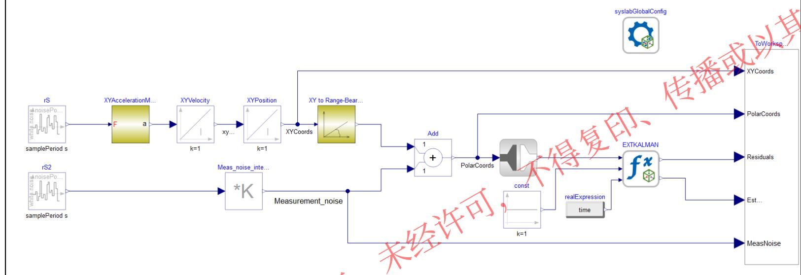  
操作步骤：  
(1) 在Syslab中打开示例并运行：Examples/08 SyslabWorkspace/Demo_SyslabFunction_RadarTracking.jl

示例详见：Sysplorer内置模型库SyslabWorkspace/Examples/Demo_SyslabFunction_RadarTracking/RadarTracking

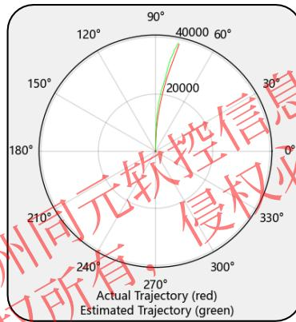

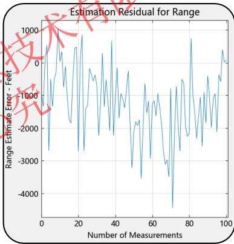

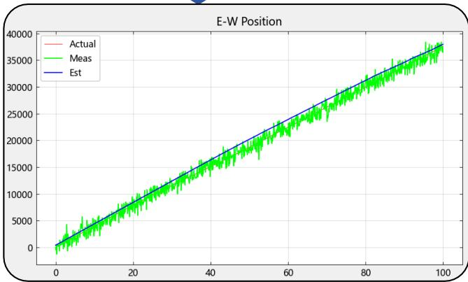

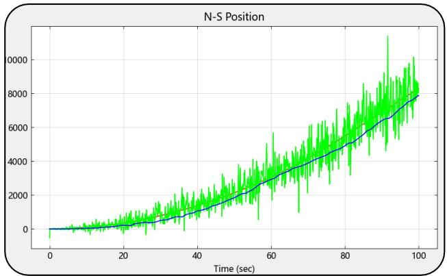

# 1.2 使用前的准备

在 Syslab 菜单栏中点击 Sysplorer 图标，自动打开 Sysplorer 软件并加载 SyslabWorkspace 模型库

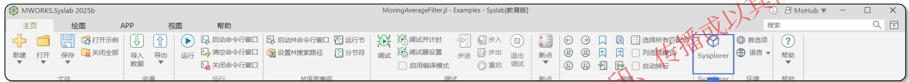

# 使用须知:

1. 如不能打开Sysplorer软件，则需要确认Syslab首选项中 Sysplorer可执行文件路径是否正确  
2. Syslab和Sysplorer均需2022版以上  
3. Sysplorer软件编译器为64位

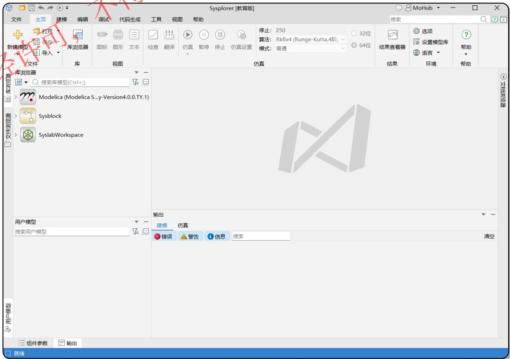

# 02

# PART 02

# To Workspace

将数据写入 Syslab 工作区

# 2. To Workspace

# 将Sysplorer/Sysblock的仿真结果发送至Syslab工作空间中

  
Syslab


  
Sysplorer

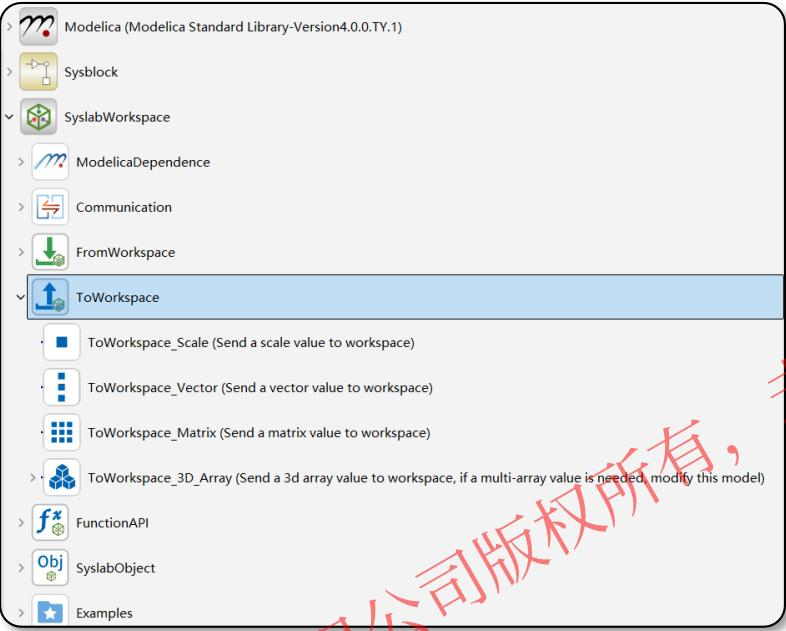

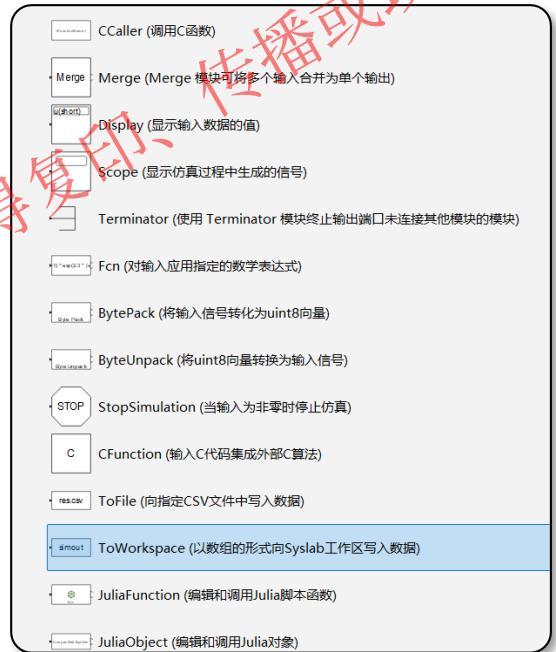

To Workspace子库中包含4个组件，分别为：

- ToWorkspace_Scale: 输出为标量数据   
- ToWorkspace Vector: 输出为一维数组   
- ToWorkspace Matrix: 输出为数组  
- ToWorkspace_3D_Array: 输出为三维数组

模型组件路径：Sysblock. Utilities.ToWorkspace

# 2. To Workspace

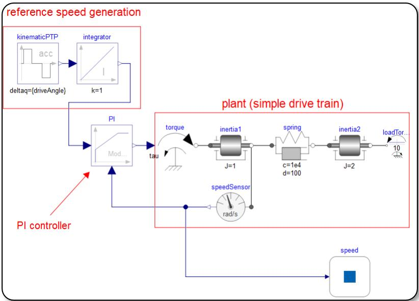  
示例详见：Sysplorer内置模型库

SyslabWorkspace/Examples/Demo_ToWorkspace_PID/stretcher


# 仿真

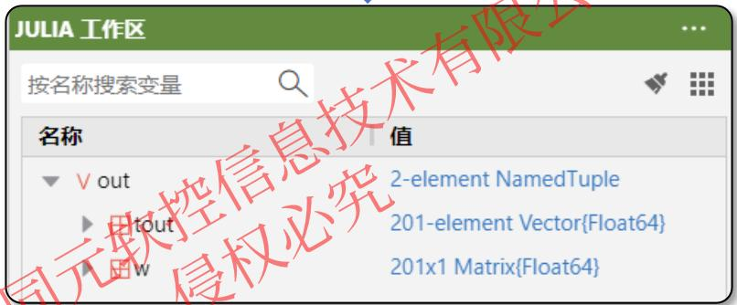

  
使用Syslab对仿真结果进行处理分析

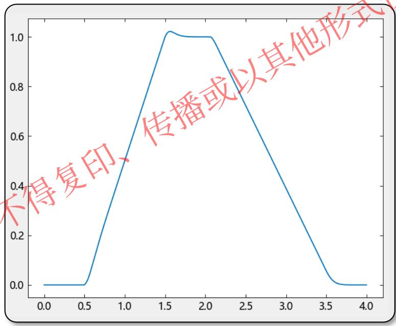


using TyPlot

t = out.tout

w = out.w

plot(t, w)

在Syslab中进行输出变量的后处理

# 2. To Workspace

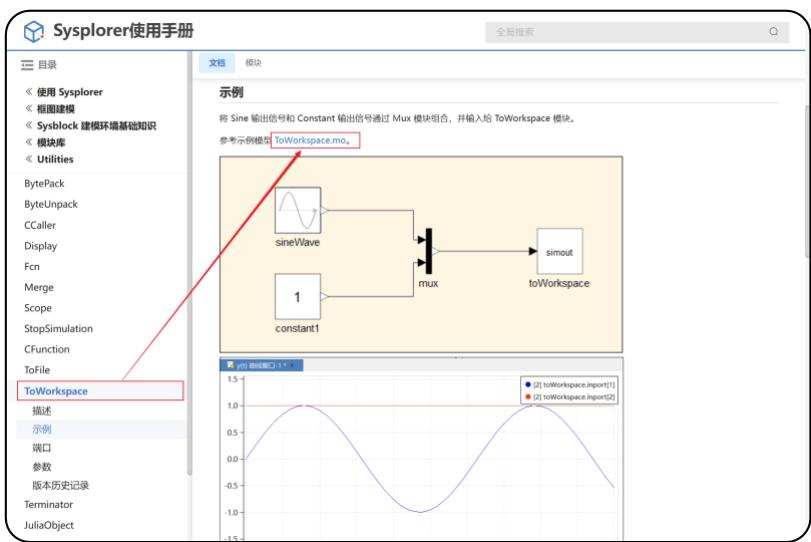


# 打开模型

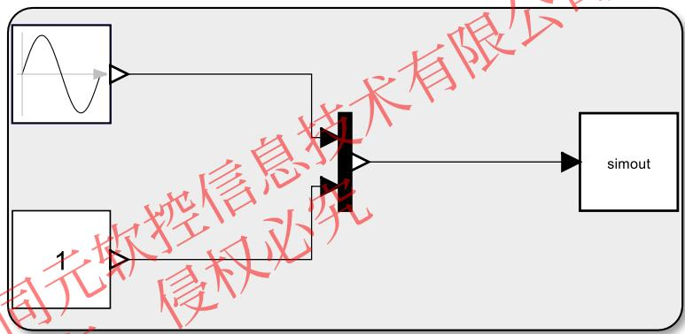


使用Syslab对仿真结果进行处理分析

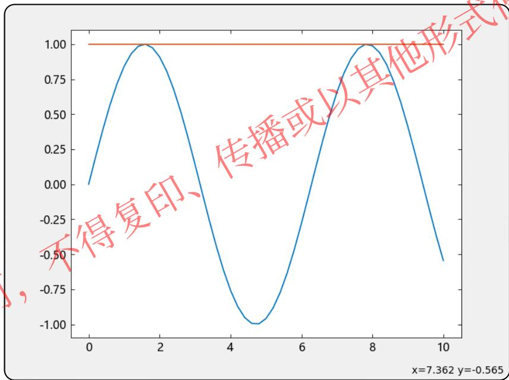


using TyPlot

$$
t = \text {o u t}. \text {t o u t}
$$

$$
\text {s i m o u t} = \text {o u t . s i m o u t}
$$

$$
\text {p l o t} (t, \text {s i m o u t})
$$

在Syslab中进行输出变量的后处理

# 03

# PART 03

# From Workspace

从 Syslab 工作区加载数据

# 3. From Workspace

# Sysplorer/Sysblock从Syslab工作空间中读取数据并作为输入


Syslab


Sysplorer

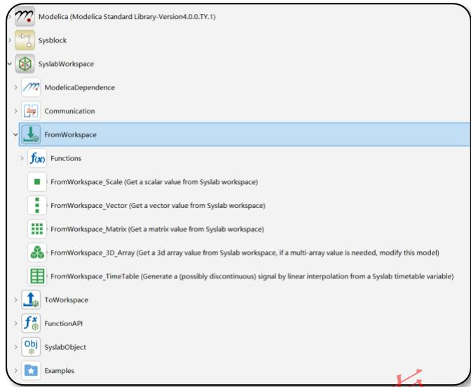

FromWorkspace子库中包含5个组件，分别为：

- FromWorkspace_Scale: 获取标量数据   
- FromWorkspace_Vector: 获取一维数组   
- FromWorkspace Matrix: 获取二维数组  
- FromWorkspace_3D_Array: 获取三维数组  
- FromWorkspace_TimeTable: 获取表格矩阵，并通过线性插值生成信号

注：FromWorkspace传递的量均为变量，不能直接作为组件参数。

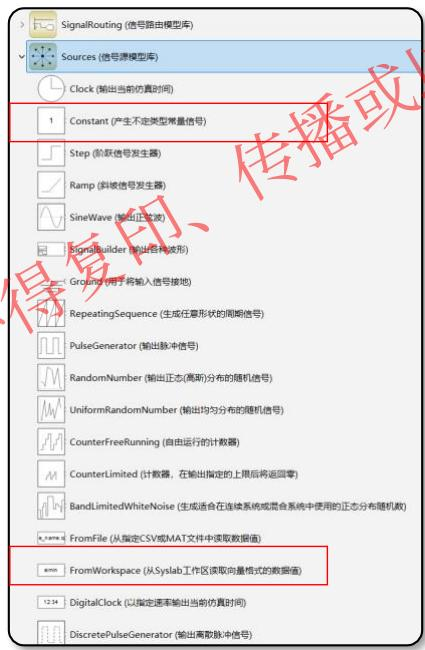

Constant

模型路径：Sysblock SOURCES Constant

功能：读取Syslab工作区标量或者向量数据

FromWorkspace

模型组件路径：Sysblock SOURCES.FromWorkspace

功能：读取Syslab工作区矩阵数据，且把第一列作为时间列

# 3. From Workspace

Julia代码

$$
\text {t a b l e} = \left[ \begin{array}{l l l} 0 & 1 & 0 & 0 \end{array} \right.
$$

1 1 0 0

2020

3020]

```java
combiTimeTableX = table[, [1,2]] #取1,2两列

```c
combiTimeTableY = table(:, [1,3]) #取1,3两列

```c
combTimeTableZ = table(:, [1,4]) #取1,4两列


# 代码运行

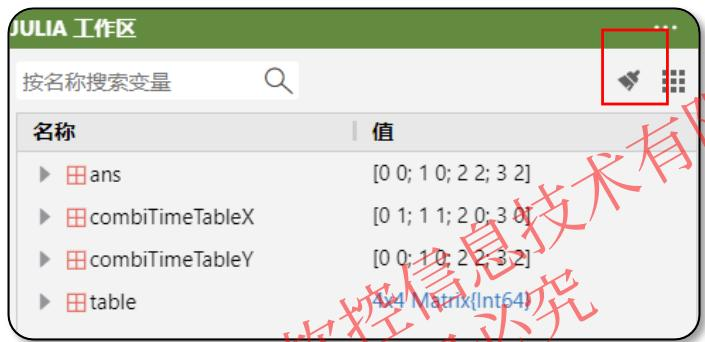

若结果不一致，可点击清空工作区再重新运行代码

# 使用FromWorkspace组件


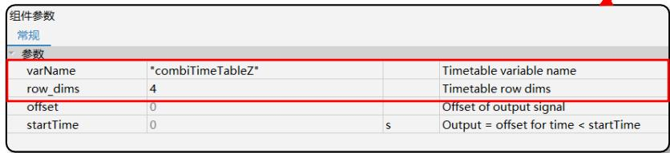

# 设定参数

名与工作空间变量名需完全一致

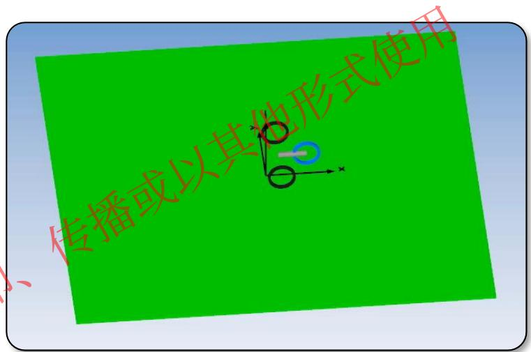

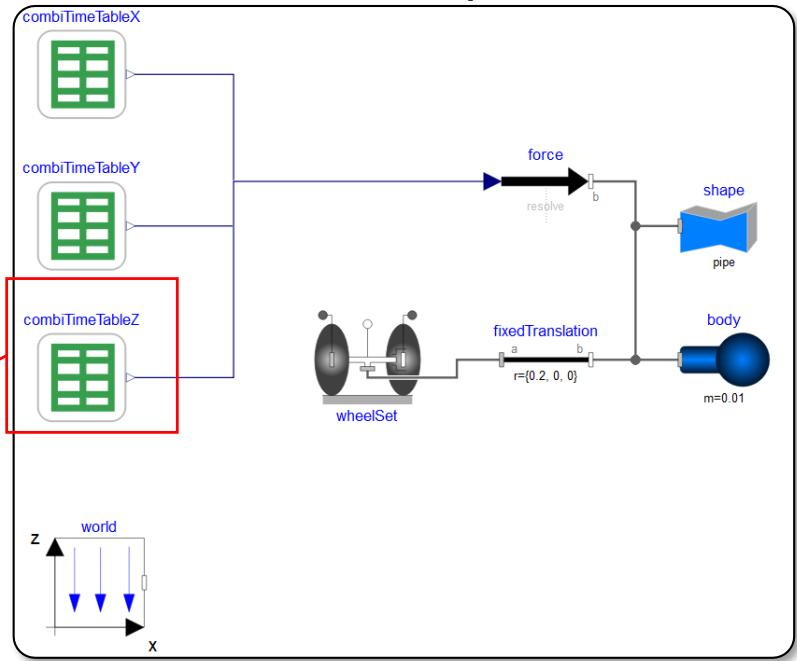  
结果展示.mp4

示例详见：Sysplorer内置模型库

SyslabWorkspace/Examples/Demo_FromWorkspace_RollingWheelSetPulling

# 3. From Workspace

From Workspace Functions 以函数的形式从 Syslab 工作区中读取数据，因此可以直接将获取的数据作为其他组件的参数值。

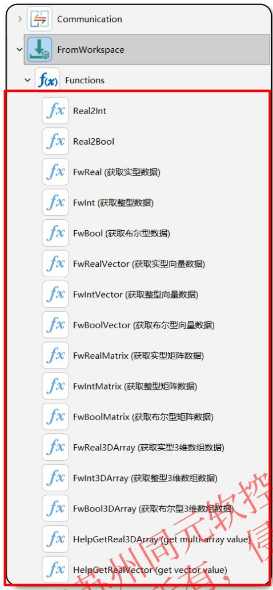

# 操作步骤

Syslab编辑并运行以下Syslab脚本  
- Sysplorer编辑并运行SubModel模型  
- 查看仿真结果

```matlab
Syslab脚本：  
# 标量  
i_val = 5  
f_val = 7.5  
b_val = true# 向量  
i_vec = [1, 2, 3]  
f_vec = [1, 2.5, 3.5]  
b_vec = [true, false, true]# 矩阵  
i_mtx = [1 2 3; 4 5 6]  
f_mtx = [1 2.5 3.5; 4 5.5 6.5]  
b_mtx = [true false true; false true]# 三维数组  
i.arr = fill(1, (2, 3, 4))  
i.arr[2, 1, 3] = 17  
f.arr = fill(2.5, (2, 3, 4))  
f.arr[2, 1, 3] = 17  
b.arr = fill(true, (2, 3, 4))  
b.arr[2, 1, 3] = false 
```

# Syslab中计算出结果

```verilog
model SubModel  
import SyslabWorkspace.FromWorkspace.Functions.*;  
//标量  
parameter Integer int_x = FwInt("i_val") "整型标量";  
parameter Real real_x = FwReal("f_val") "实型标量";  
parameter Boolean bool_x = FwBool("b_val") "布尔型标量";  
//向量  
parameter Integer int_vec[:] = FwIntVector("i_vec", 3) "整型向量";  
parameter Real real_vec[:] = FwRealVector("f_vec", 3) "实型向量";  
parameter Boolean bool_vec[:] = FwBoolVector("b_vec", 3) "布尔型向量";  
//矩阵  
parameter Integer int_mtx[(:, :, ] = FwIntMatrix("i_mtx", 2, 3) "整型矩阵";  
parameter Real real_mtx[(:, :, ] = FwRealMatrix("f_mtx", 2, 3) "实型矩阵";  
parameter Boolean bool_mtx[(:, :, ] = FwBoolMatrix("b_mtx", 2, 3) "布尔型矩阵";  
//三维数组  
parameter Integer int.arr[(:, :, ] = FwInt3DArray("i.arr", 2, 3, 4) "整型三维数组";  
parameter Real real carr[(:, :, ] = FwReal3DArray("f carr", 2, 3, 4) "实型三维数组";  
parameter Boolean bool carr[(:, :, ] = FwBool3DArray("b carr", 2, 3, 4) "布尔型三维数组";  
end SubModel; 
```

# Sysplorer中模型通过函数读取工作空间值作为参数

注：函数调用见：Modelica语法-函数；参数定义见Modelica语法-类与内置类型

# 3. From Workspace

# 结果查看

Syslab脚本：

标量

$$
i \quad v a l = 5
$$

$$
f _ {\text {v a l}} = 7. 5
$$

$$
b _ {\text {v a l}} = \text {t r u e} \# \text {向 量}
$$

$$
i _ {\text {v e c}} = [ 1, 2, 3 ]
$$

$$
f _ {\text {v e c}} = [ 1, 2. 5, 3. 5 ]
$$

$$
b _ {\text {v e c}} = [ \text {t r u e}, \text {f a l s e}, \text {t r u e} ] \# \text {矩 阵}
$$

$$
i _ {-} m t x = [ 1 2 3; 4 5 6 ]
$$

$$
f _ {m t x} = [ 1 2. 5 3. 5; 4 5. 5 6. 5 ]
$$

$$
b _ {m t x} = [ \text {t r u e f a l s e t r u e}; \text {f a l s e t r u e}
$$

$$
f a l s e ] \# \text {三 维 数 组}
$$

$$
i _ {-} a r r = f i l l (1, (2, 3, 4))
$$

$$
i _ {-} a r r [ 2, 1, 3 ] = 1 7
$$

$$
f _ {\text {a r r}} = \operatorname {f i l l} (2. 5, (2, 3, 4))
$$

$$
f _ {\text {a r r}} [ 2, 1, 3 ] = 1 7
$$

$$
b _ {-} a r r = f i l l (\text {t r u e}, (2, 3, 4))
$$

$$
b _ {-} a r r [ 2, 1, 3 ] = \text {f a l s e}
$$

通过From Workspace Functions，将Syslab工作区中的数据直接设置为模型的参数

<table><tr><td colspan="3">组件参数</td></tr><tr><td colspan="3">常规</td></tr><tr><td colspan="3">参数</td></tr><tr><td>int_x</td><td>FwInt(&quot;i_val&quot;)</td><td>整型标量</td></tr><tr><td>real x</td><td>FwReal(&quot;f_val&quot;)</td><td>实型标量</td></tr><tr><td>bool x</td><td>FwBool(&quot;b_val&quot;)</td><td>布尔型标量</td></tr><tr><td>int_vec</td><td>FwIntVector(&quot;i_vec&quot;, 3)</td><td>整型向量</td></tr><tr><td>real_vec</td><td>FwRealVector(&quot;f_vec&quot;, 3)</td><td>实型向量</td></tr><tr><td>bool_vec</td><td>FwBoolVector(&quot;b_vec&quot;, 3)</td><td>布尔型向量</td></tr><tr><td>int_mtx</td><td>FwIntMatrix(&quot;i_mtx&quot;, 2, 3)</td><td>整型矩阵</td></tr><tr><td>real_mtx</td><td>FwRealMatrix(&quot;f_mtx&quot;, 2, 3)</td><td>实型矩阵</td></tr><tr><td>bool_mtx</td><td>FwBoolMatrix(&quot;b_mtx&quot;, 2, 3)</td><td>布尔型矩阵</td></tr><tr><td>int.arr</td><td>FwInt3DArray(&quot;i.arr&quot;, 2, 3, 4)</td><td>整型三维数组</td></tr><tr><td>real carr</td><td>FwReal3DArray(&quot;f carr&quot;, 2, 3, 4)</td><td>实型三维数组</td></tr><tr><td>bool carr</td><td>FwBool3DArray(&quot;b carr&quot;, 2, 3, 4)</td><td>布尔型三维数组</td></tr></table>

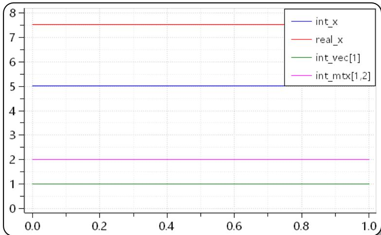

# 3. From Workspace

simin = [0.1 1 1

0.2 2 4   
0.3 3 3   
0.4 4 1]


# 代码运行

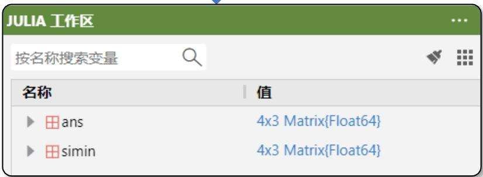


# 使用FromWorkspace组件

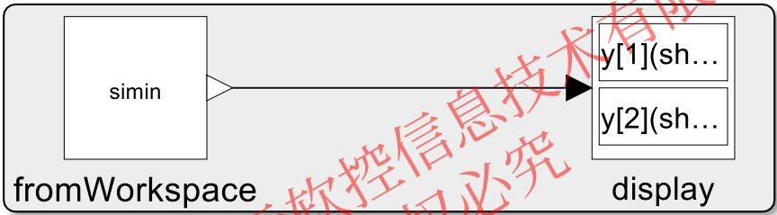  
注：可直接在帮助文档中打开该模型

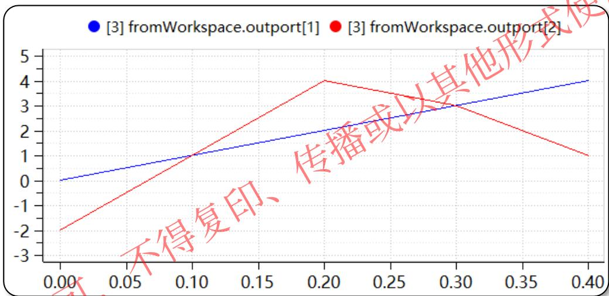

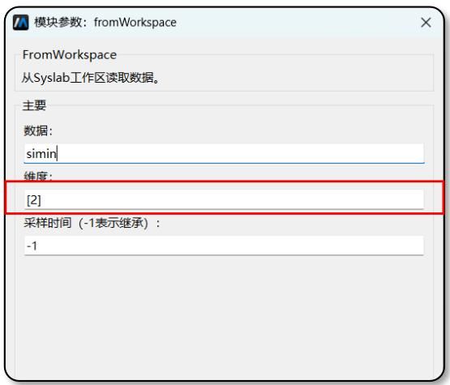

# 参数设置

数据：名称与工作空间变量名需完全一致

维度：以示例模型为例，其列数为 3，第 1 列为时间列，因此信号列为 2，维度填写为 [2]。

# 3. From Workspace

$$
1 = [ 1, 2, 3, 4, 5, 6 ];
$$

  
代码运行

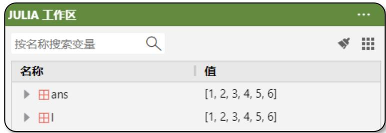

  
使用 Constant 组件

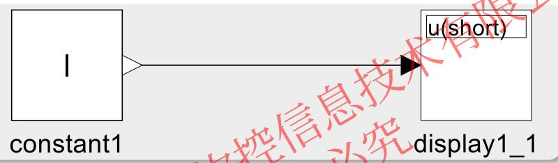


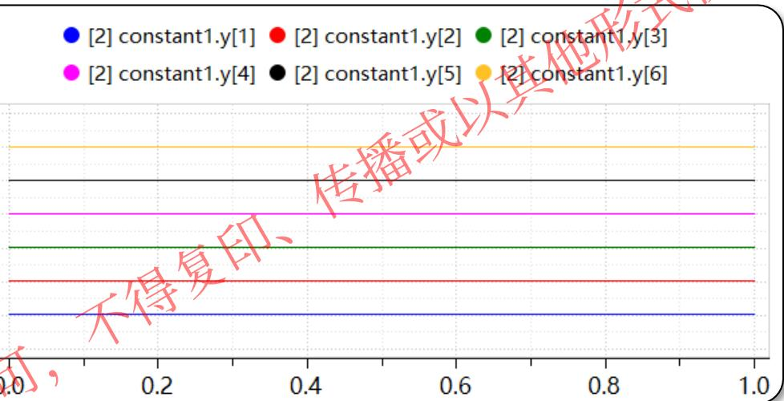

# 参数设置

数据：名称与工作空间变量名需完全一致

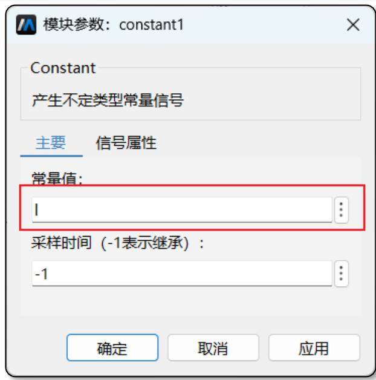

# PART 04②

# Syslab Block

使用 Syslab 实现新算法

# 04

# 4.1 Syslab Function

将Syslab中构建的Julia复杂算法封装至Sysplorer中


Syslab


Sysplorer

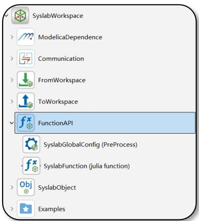  
拖拽式建模

Function API中包含2个组件:

- SyslabGlobalConfig：用于全局声明，包括导入包及全局变量声明等。  
- SyslabFunction: 用于嵌入 Julia函数, 并将Syslab Function模块的输入和输出数据指定为参数和返回值。

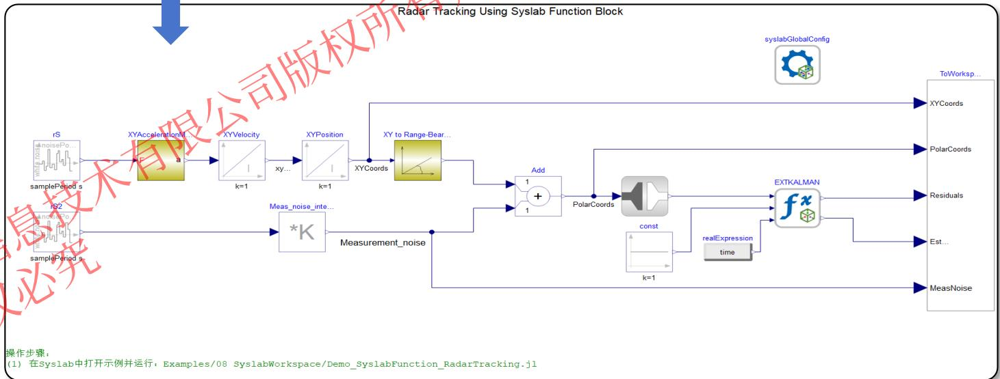  
示例详见：Sysplorer内置模型库  
SyslabWorkspace/Examples/Demo_SyslabFunction_RadarTracking/RadarTracking

# 4.1 Syslab Function

右击SyslabGlobalConfig模型，选择Syslab初始化配置，即可转到Syslab中的全局声明代码

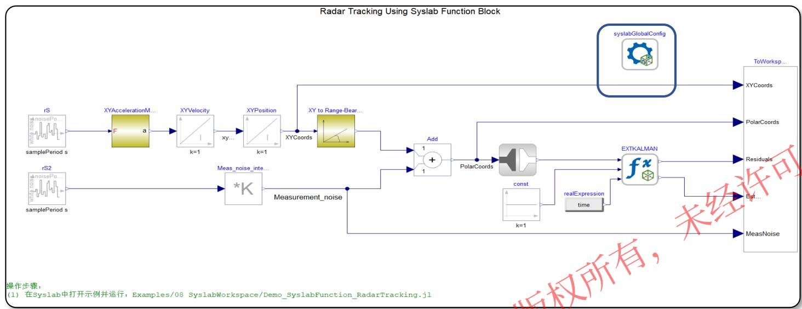


using LinearAlgebra

定义全局变量,命名以 g_ 为前缀

g_P = zeros(4, 4)

g_xhat = [0.001; 0.01; 0.001; 400; ];

4x1矩阵

示例详见：Sysplorer内置模型库

SyslabWorkspace/Examples/Demo_SyslabFunction_RadarTracking/RadarTracking

# 4.1 Syslab Function

右击SyslabFunction模型，选择编辑Syslab函数脚本，即可转到Syslab中的算法函数代码

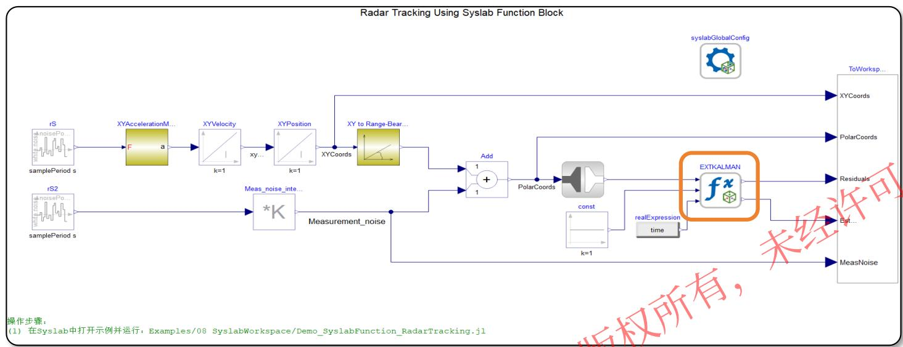

示例详见：Sysplorer内置模型库SyslabWorkspace/Examples/Demo_SyslabFunction_RadarTracking/RadarTracking

# Julia算法

```txt
function EXTKALMAN(meas, deltat, time) # 声明全局变量 global g_P global g_xhat
```

```hcl
Initialize  
residual = []  
xhatOut = [] 
```

```txt
Radar update time deltat is inherited from model workspace #1. Compute Phi, Q, and R Phi = [1 deltat 0 0; 0 1 0 0; 0 0 1 deltat; 0 0 1] Q = Diagonal([0, 0.005, 0, 0.005]) #对应 Matlab的diag R = Diagonal([300^2, 0.001^2]) #2. Propagate the covariance matrix: g_P = Phi * g_P * Phi' + Q 
```

# 注意:

SyslabFunction组件认为脚本中的第一个函数为本组件的主函数，其他函数均为服务于主函数的辅助函数。

# 4.1 Syslab Function

此示例主要介绍如何使用SyslabFunction对输入的向量求取平均值和标准差

# 操作步骤

- 新建模型，拖入realExpression和syslabFunction组件  
- 点击realExpression，右键选择“属性”，修改模型名称为“realExpression[4]”；  
修改realExpression组件参数为“{4,5,6,2}”；

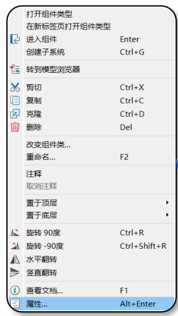


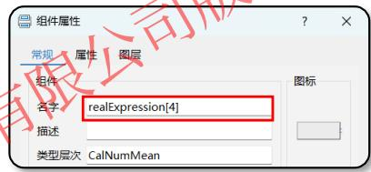


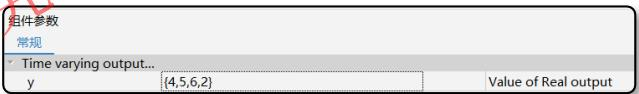

realExpression路径：Modelica Blocks. Sources. RealExpression

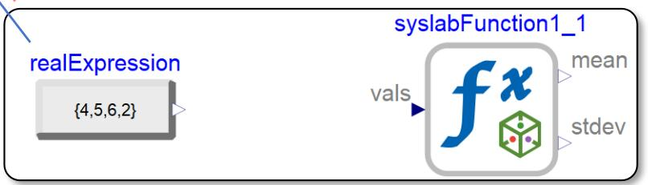

示例详见附件：CalNumMean

# 4.1 Syslab Function

# 操作步骤

- 点击syslabFunction1_1，右键选择“编辑Syslab函数脚本”  
- 在Syslab脚本编辑界面输入右侧代码  
- 点击syslabFunction1_1，右键选择“设置Syslab函数端口”将维度设置为[4];

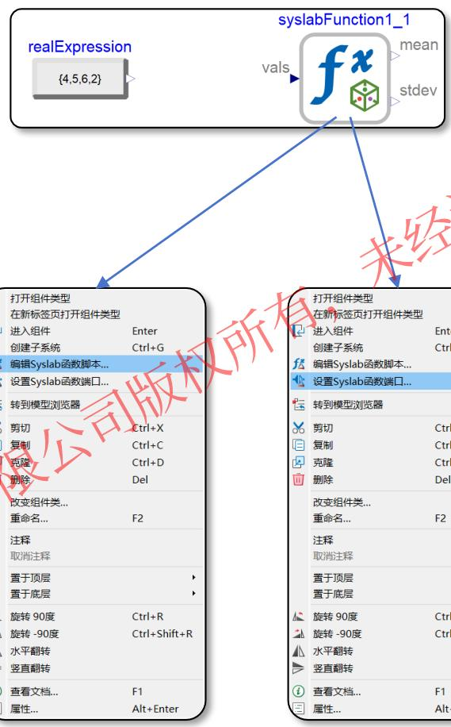

function stats(vals) # 计算平均值与标准差 len = length(vals); mean = avg(vals, len); stdev = sqrt(sum((vals. - avg(vals, len)).^2)) / len); return mean, stdev end

求平均值 function avg(array,size) mean $=$ sum(array)/size;

end


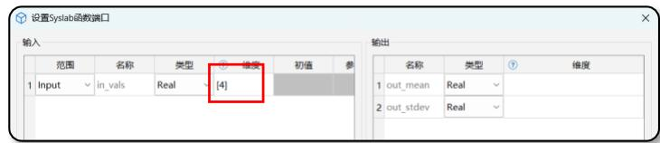

# 4.1 Syslab Function

操作步骤：完成连线，进行仿真，查看结果

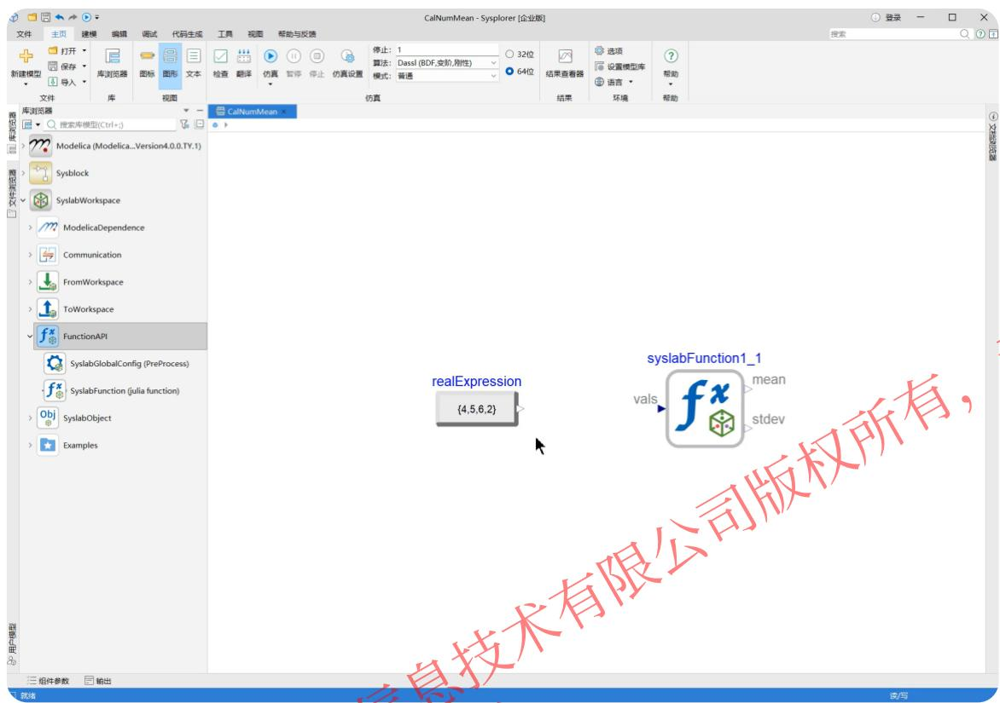  
组件连线.mp4

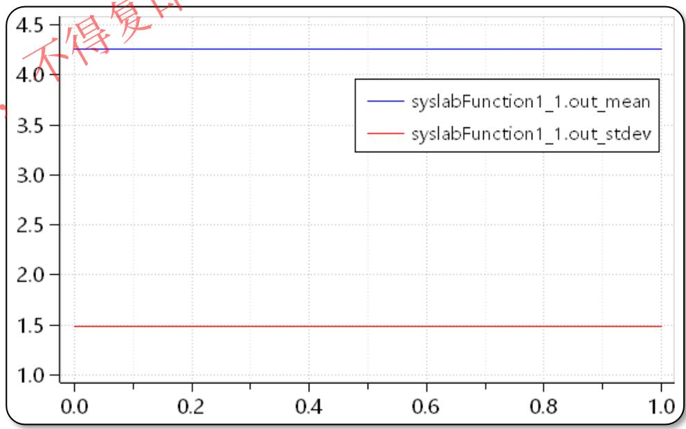

# 4.1 Syslab Function

Sysplorer 支持将调用 SyslabFunction 组件的物理模型生成半物理仿真代码，以及导入/导出 FMU。

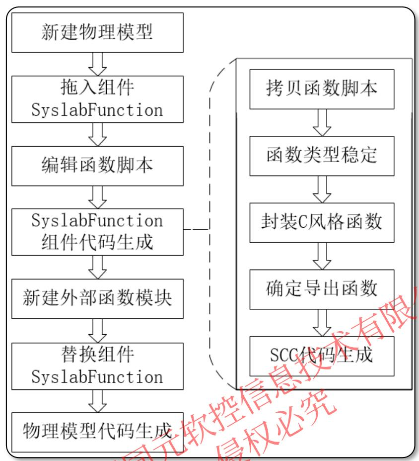  
物理模型代码生成流程

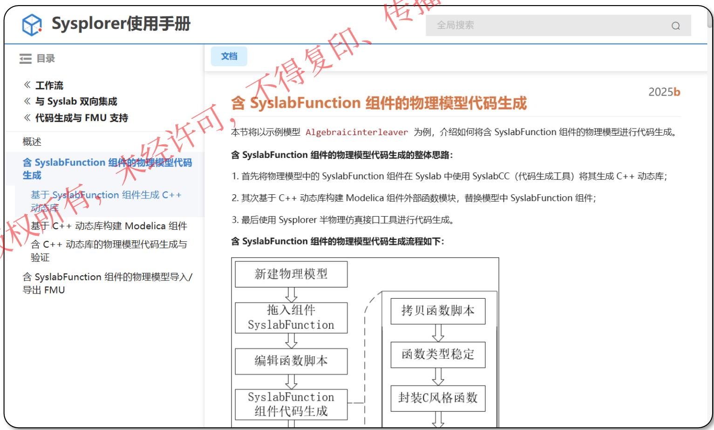

# 4.2 Syslab Object

# 使用 Syslab 中的 Julia 对象进行动态系统建模和处理流式数据


Syslab


Sysplorer

syslabObject


拖拽组件


打开组件类型

在新标签页打开组件类型


进入组件

创建子系统

Ctrl+G

拆分一维数组端口

选择Syslab对象文件...

设置Syslab对象端口...

转到模型浏览器

剪切

自 复制

克隆

删除

改变组件类...

重命名...

注释

取消注销

显示端口名标签

显示组件注解

置于顶层

置于底层

旋转 ${90}^{ \circ  }$

旋转-90

水平翻转

竖直翻转

查看文档

编辑参数

属性...

Ctrl+G

$\frac{1}{2} =$

#

Ctrl+X

Ctrl+C

Ctrl+D

Del

X

F2

$\therefore m - 1 \neq  0$ ;

$\frac{1 + u}{1} - \frac{u}{1} = \frac{\left( {1 + u}\right) u}{1} < \frac{u}{1} = u$

(1)

$\therefore m = \frac{3}{11}$

Ctrl+R

Ctrl+S

Alt+F1

Alt+En

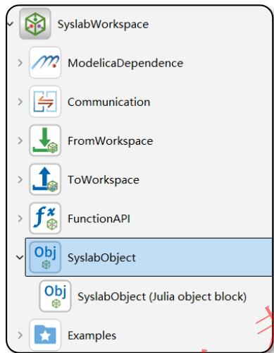

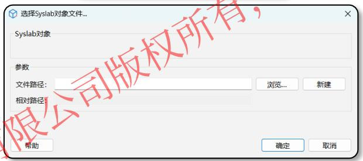  
点击“新建”


using ObjectOriented

@oodef mutable struct SyslabObject

Description（用于生成Modelica组件描述）

Template for syslab object block.

Parameter（用于生成Modelica组件参数，包括名称、类型、描述）

格式：参数名::参数类型 = 参数值 # 参数注释

例如：

gain::Real = 1.0

#增益

Private (Julia内部变量)

格式：变量名::类型 $=$ 值 #变量说明

例如：

_count::Integer = -1


Methods（主要调用算法，包括setupImpl，stepImpl，releaseImpl）

初始化函数：函数名固定，函数形参与stepImpl函数形参一致

function setupImpl(self, u)

$$
\text {c o u n t} = 0
$$

$$

$$

$$
n o t h i n g
$$

end #setupImpl

单步计算函数：函数名固定，第一个函数形参必须是self,

其余函数形参将作为Modelica组件的输入端口，函数返回值作为输出端口

$$
f u n c t i o n \quad s t e p I m p l (\text {s e l f}, u)
$$

$$
\text {s e l f .} \_ \text {c o u n t} + = 1
$$

$$
\# \dots
$$

$$
y = u * \text {s e l f . g a i n}
$$

$$
\text {r e t u r n} \mathcal {Y}
$$

end #stepImpl

释放资源函数：函数名固定，且只能有一个函数参数self

$$
f u n c t i o n \quad r e l a s e I m p l (s e l f)
$$

$$
\# \dots
$$

$$
\text {r e t u r n}
$$

end #releaseImpl

其它自定义函数，第一个函数形参数必须是self

$$
\begin{array}{l} \# \text {f u n c t i o n} x x (\text {s e l f}) \\ \begin{array}{c c c} \# & \dots \\ & \dots \end{array} \\ \# \text {e n d} \\ \end{array}
$$

end

Syslab脚本界面

# 4.2 Syslab Object

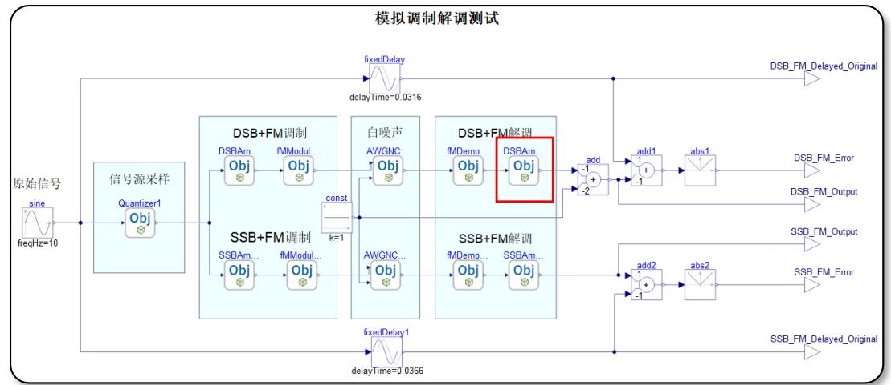

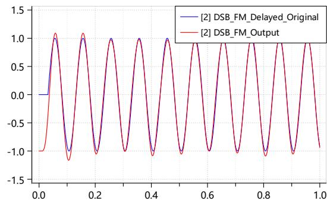  
示例详见：Sysplorer内置模型库SyslabWorkspace/Examples/Demo_SyslabObject_AncalogModulationDemodulation

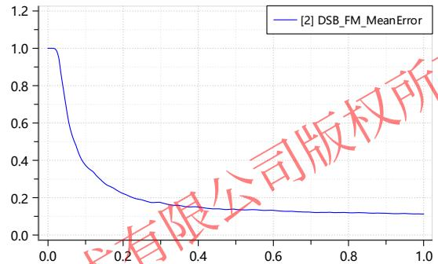


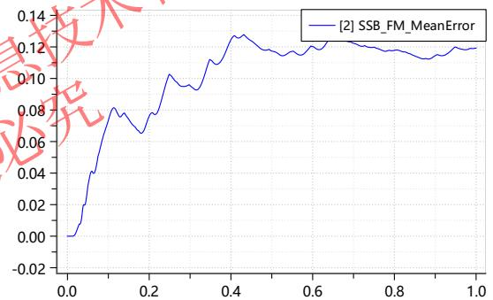

using TyCommunication

using TyBase

using TyMath

using TySignalProcessing

using ObjectOriented

@oodef mutable struct DSBAmplitudeDemodulator

Description

Parameter

InputSignalOffset::Float64 = 1

CarrierFrequency::Float64 = 100

InitialPhase::Float64 = 0

SampleFrequency::Float64 = 1000

FilterOrder::Int64 = 4

CutoffFrequency::Float64 = 100

PassbandRipple::Float64 = 0.1

StopbandAttenuation::F1cat64 = 50

LowPassFilterMethod::String = "Butterworth"

Private

Samplepoint $= 0$

[b = 0\text{.}]

[a = {10}]

[{z}_{1} = 0]

Methods

function setupImpl(self, data)

#

if selfSAMPLEFrequency $<  = 0$

throw(ArgumentError("Fs must be a real, positive scalar."))

end

check that Fs must be greater than $2^{*}Fc$

if selfSAMPLEFrequency $< 2$ * self.CarrierFrequency

throw(ArgumentError("Fs must be at least 2*Fc."))

end

if self.LowPassFilterMethod == "Butterworth"

··

end

self.zi = zeros Float64, (max(length(self.a), length(self.b)) - 1))

return nothing

end #setupImpl

function stepImpl(self, data)

#...

temp = data .* cos(2 * pi * self.CarrierFrequency * self_SAMPLEpoint / self_SAMPLEFrequency + self.InitialPhase)

···

return out

end #stepImpl

function releaseImpl(self)

#...

return nothing

end #releaseImpl

end

<table><tr><td colspan="4">组件参数
常规</td></tr><tr><td colspan="4">参数</td></tr><tr><td>startTime</td><td>0</td><td>s</td><td>sample start time</td></tr><tr><td>period</td><td>0.0001</td><td>s</td><td>sample period</td></tr><tr><td>InputSignalOffset</td><td>1</td><td></td><td></td></tr><tr><td>CarrierFrequency</td><td>100</td><td></td><td></td></tr><tr><td>InitialPhase</td><td>0</td><td></td><td></td></tr><tr><td>SampleFrequency</td><td>10000</td><td></td><td></td></tr><tr><td>FilterOrder</td><td>4</td><td></td><td></td></tr><tr><td>CutoffFrequency</td><td>20</td><td></td><td></td></tr><tr><td>PassbandRipple</td><td>0.1</td><td></td><td></td></tr><tr><td>StopbandAttenuati...</td><td>50</td><td></td><td></td></tr><tr><td>LowPassFilterMethod</td><td>&quot;Butterworth&quot;</td><td></td><td></td></tr></table>

# 4.2 Syslab Object

此示例说明如何使用 Syslab Object 实现移动平均滤波器

# 操作步骤

拖拽组件timeTable、Syslab Object  
- 点击Syslab Object，右键点击“选择Syslab对象文件”  
- 在弹出对象参数中点击“新建”，打开脚本编辑界面；  
- 在编辑界面输入右侧代码，点击保存，保存在所选文件夹中；  
- 组件timeTable、Syslab Object进行连线

TimeTable的Modelica模型路径

Modelica Blocks. Sources. TimeTable

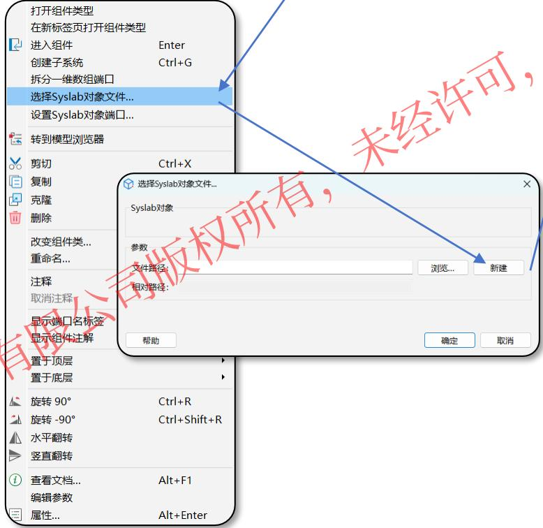

示例详见：Sysplorer内置模型库

SyslabWorkspace/Examples/Demo_SyslabObject_MovingAverageFilter

using ObjectOriented   
using TyMath   
using Base   
@oodef mutable struct MovingAverageFilter # Description（用于生成Modelica组件描述） #Moving average filter # Parameter（用于生成Modelica组件参数，包括类型、名称、描述) WindowLength::Int64 $= 0$ #窗口长度 #Private（内部变量，不对用户展示） pNumChannels::Int64 $= -1$ pCoefficients $\equiv$ [] State $= []$ #Methods（主要调用算法，包括setupImpl，stepImpl，releaseImpl)

```txt
初始化函数：函数名固定，函数形参与stepImpl函数形参一致  
function setupImpl(self, u)  
# Perform one-time calculations, such as computing constants  
self.NumChannels = size(u, 2)  
self.pCoefficients = ones(1, self.WindowLength) / self.WindowLength  
self.State = zeros(self.WindowLength - 1, self.NumChannels)  
return nothing  
end #setupImpl 
```

```txt
# 单步计算函数: 函数名固定, 第一个函数形参数必须是self, 其余函数形参将作为Modelica 组件的输入端口, 函数返回值作为输出端口 function stepImpl(self, u) # Implement algorithm. Calculate y as a function of input u and states. # @info "$(now())" step simulation input parameter u = $u" y, self.State = filter1(self.pCoefficients, 1, u, self.State) return y end #stepImpl
```

```txt
释放资源函数：函数名固定，且只有一个参数，第一个函数形参必须是self function releaseImpl(self) #... return nothing end #releaseImpl
```

```txt
# 其它自定义函数
# function xx(self) {
#     ...
# end
end
```

# 4.2 Syslab Object

# 操作步骤

- 将文件MovingAverage.csv中的数据复制到timeTable组件中  
设置movingAverageFilter_1参数  
- 点击仿真，仿真终止时间为250s，查看movingAverageFilter结果

1. 复制选中csv中参数（注意，不选择表头行）

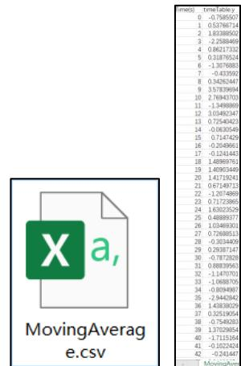  
注：MovingAverage_此csv文件见附件

2.点击timeTable组件，选择组件参数的table设置行数251行，将csv中参数粘贴进去，点击确定

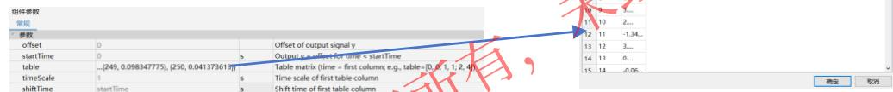

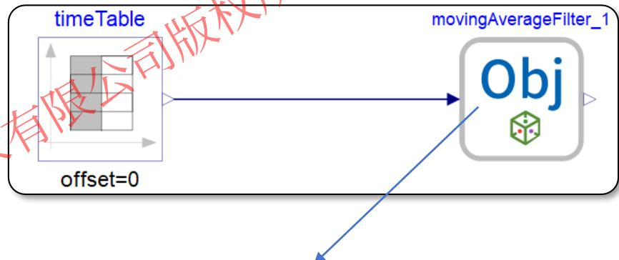

<table><tr><td>组件参数
常规</td><td colspan="3">3.设置movingAverageFilter_1参数</td></tr><tr><td>参数</td><td></td><td></td><td></td></tr><tr><td>startTime</td><td>0</td><td>s</td><td>sample start time</td></tr><tr><td>period</td><td>1</td><td>s</td><td>sample period</td></tr><tr><td>WindowLength</td><td>10</td><td></td><td>窗口长度</td></tr></table>

# 4. 查看仿真结果

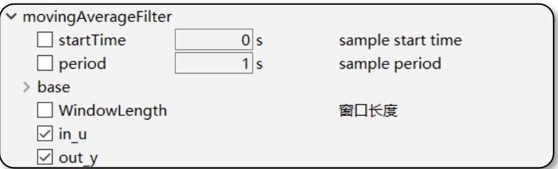

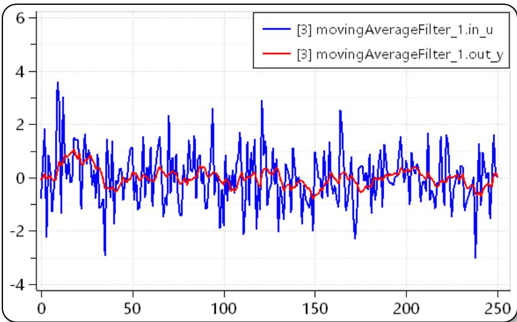

# 4.3 Julia Function

将Syslab中构建的Julia复杂算法封装至Sysblock中使用方式及参数设置与 SyslabFunction 一致

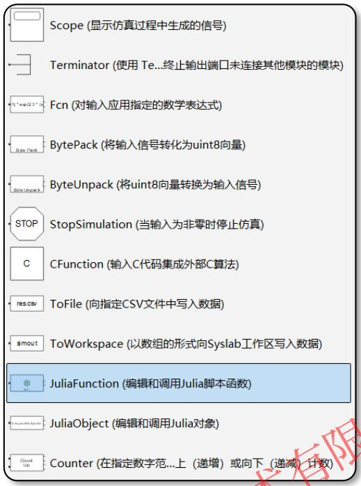

Sysblock. Utilities.JuliaFunction

示例详见附件：JuliaFunctionDemo

```lua
function fcn(u1, u2)  
    y = u1 + u2  
    return y  
end 
```

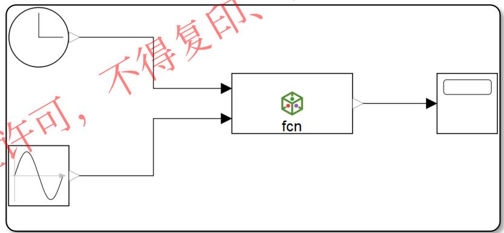

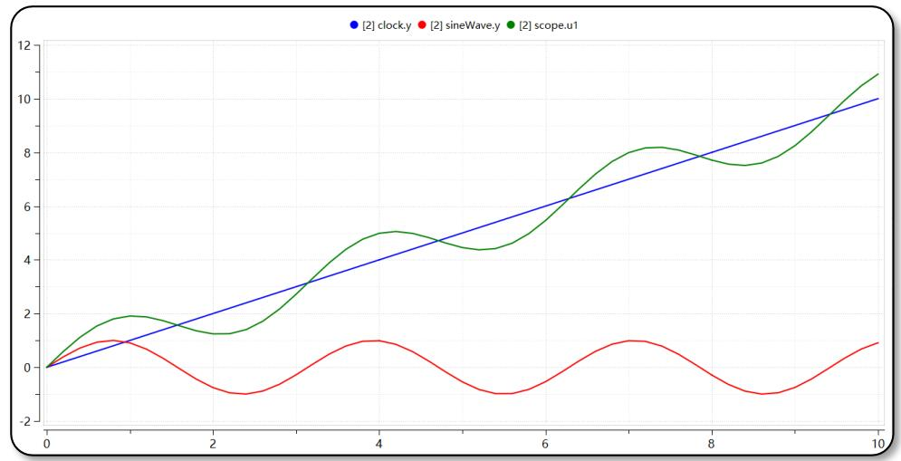

# 4.4 Julia Object

使用 Syslab 中的 Julia 对象进行动态系统建模和处理流式数据。

使用方式与 Syslab Object 基本一致

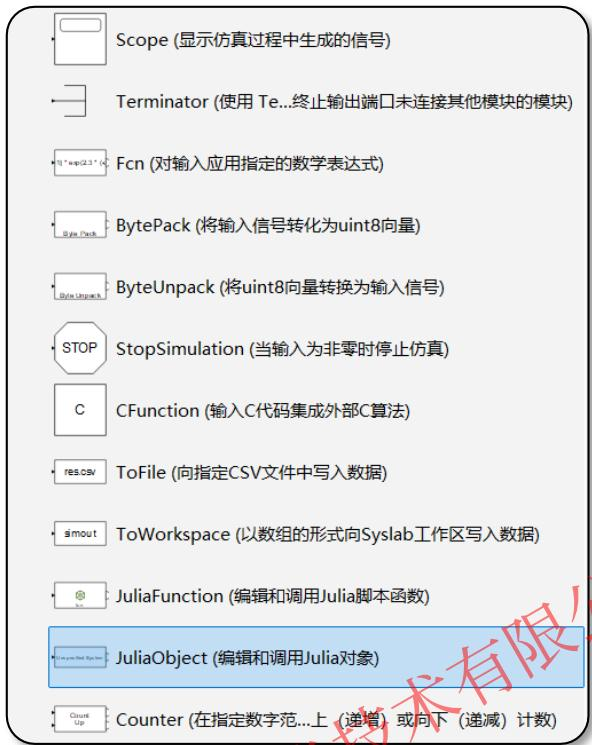  
Sysblock. Utilities.JuliaObject

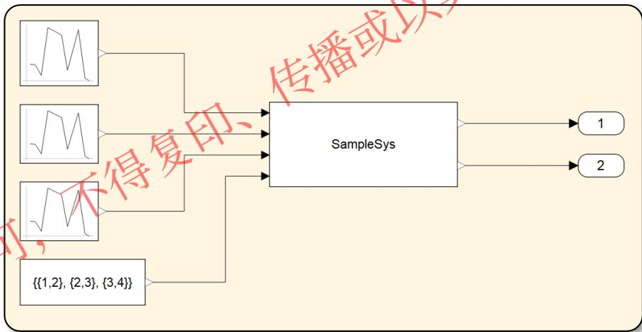

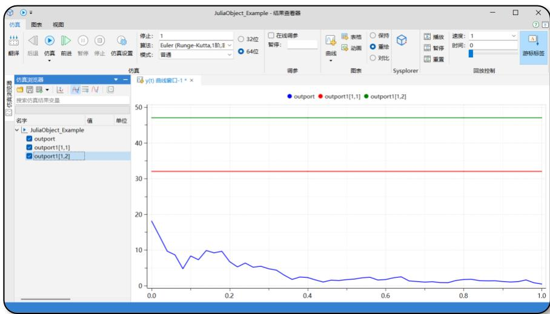  
注：可直接在帮助文档中打开该示例模型

# 05

# PART 05②

# Sysplorer API

建模仿真语言和科学计算语言之间支持互相调用

# 5. Sysplorer API

Sysplorer API 是具备 Sysplorer 部分功能模块的 API，支持用户对 Sysplorer 进行自动化脚本或专业 APP 开发。用于在 Syslab 使用 Julia 语言调用 Sysplorer，实现物理建模与框图建模，同时可支持模型检查、翻译、仿真模型等一系列操作。

各个函数的使用方式可前往帮助中心查阅。

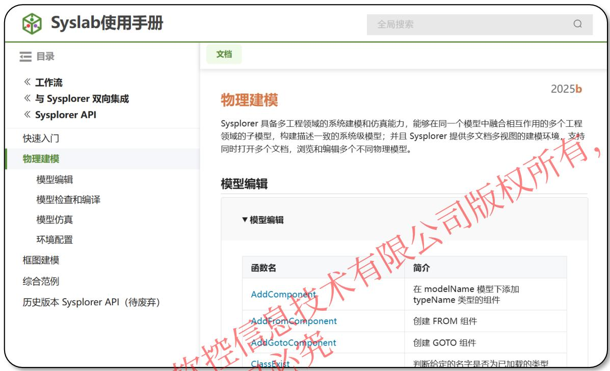  
API列表

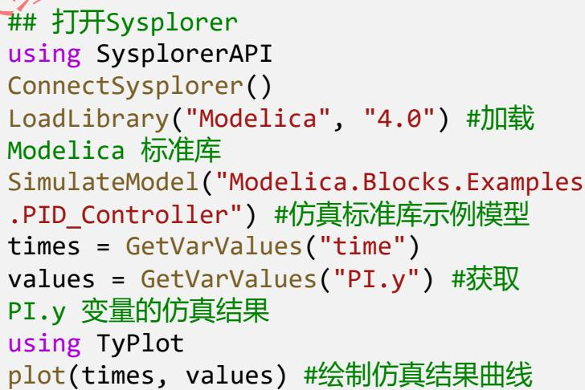

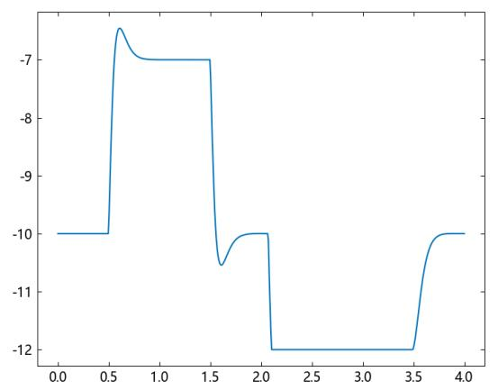  
入门案例

# 06

# PART 06

# 工作区同步

Sysplorer 基础工作区和 Syslab 的 Julia 工作区互通数据

# 6. 工作区同步

通过 Syslab 打开 Sysplorer 时，Sysplorer 基础工作区和 Syslab 的 Julia 工作区将互通数据。

包括Syslab数据同步到Sysplorer与Sysplorer数据同步到Syslab。

Syslab 数据同步到 Sysplorer: 当 Syslab 工作区数据修改后, 可以通过手动或自动的方式在 Sysplorer 中同步 Syslab 工作区数据。

## Parameter 类型

VP3 = SysplorerParam();

VP3.Value = [1,2,3,4,5,6];

VP3.Description = "Sysplorer参数，向量类型";

VP3.DataType = "Float64"

VP3.Dimensions = [6]

## Scalar 数值类型

s1 = Float64(64.1)

## Vector 数值类型

v1 = Bool[1,0,1,0,1,1,0,0]

v2 = Float32[32.1, 32.2, 32.3, 32.4, 36.0]

## 2维矩阵

m1 = Bool[1,0,1,0,1,0,1,0,0,0];

m2 = reshape(m1, 2, 5)

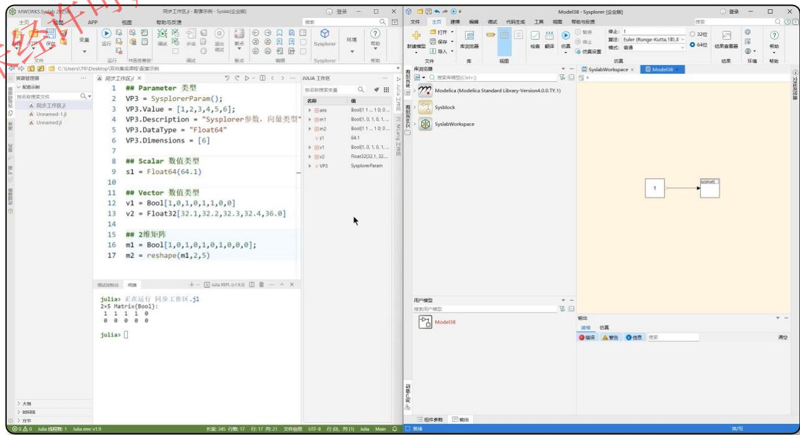  
Syslab 数据同步到 Sysplorer.mp4

# 6. 工作区同步

Sysplorer 数据同步到 Syslab：在 Sysplorer 基础工作区中，任何变量或参数的变更，都将实时同步到 Syslab 的 Julia 工作区中。

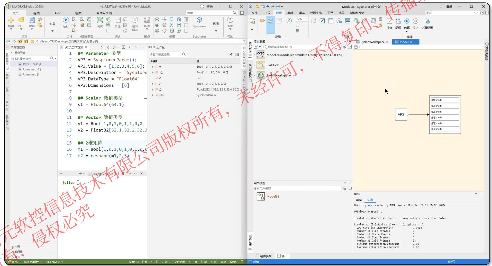

# PART 07 $\rightarrow$

# Syslab 调试

调试 Sysplorer 模型中 Syslab Block 模块与 Sysblock 模型中 Julia 模块中的 Julia 代码

# 7. Syslab 调试

调试 Sysplorer 模型中 Syslab Block 模块与Sysblock模型中 Julia 模块中的 Julia 代码。 Syslab 调试工作流有两种方式：①常规调试工作流；②指定时刻调试工作流。

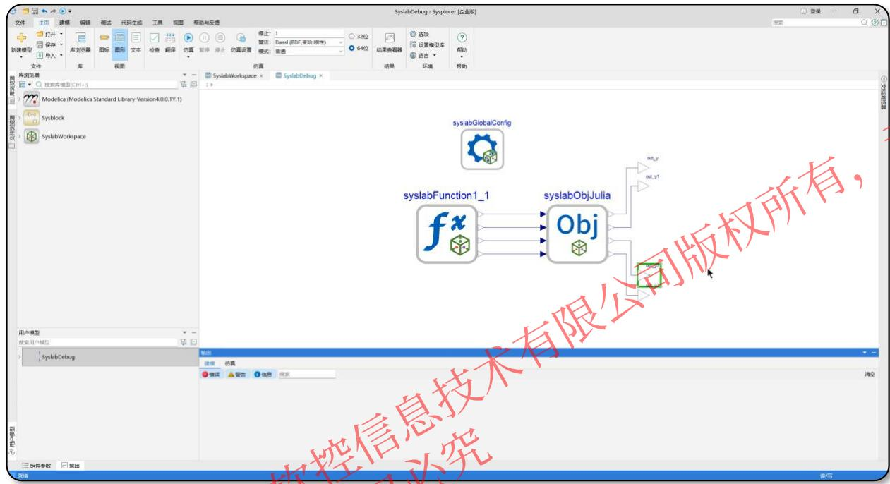  
常规调试工作流.mp4

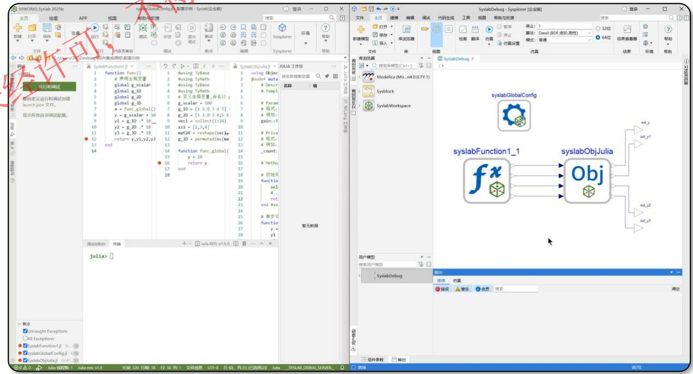  
指定时刻调试工作流.mp4

  
https://tongyuanrk.mikecrm.com

# MWORKS软件学习资源需求调研问卷

为更好地解决用户在使用MWORKS软件过程中的学习痛点，优化软件学习资源供给，我们特开展此次调研。本次调研聚焦于用户的线上学习习惯与资源需求，调研结果仅用于学习资源优化，所有数据将严格保密，请您放心填写。感谢您的支持！

一、基本信息

1.您所处的学习/工作阶段是？（单选）

本科在读

硕士在读

博士在读

已工作

2.您所在的专业方向是？（单选）

电气工程

自动控制（自动化/控制工程）

# Thanks.

建立知识规范，营造协同生态

积累工业模型，发展可控平台

融入工业创新，共创先进软件

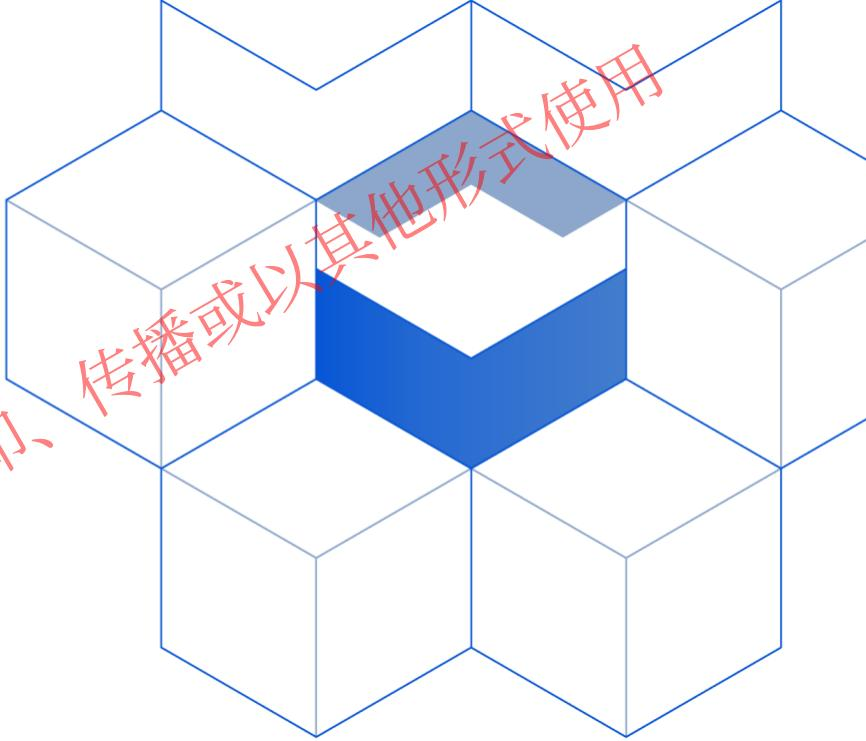
