# MWORKS.Sysplorer工具箱运行脚本_Python

- Source: `MWORKS高校星火计划资料包/培训课程配套材料/01-官网课程配套材料/03-扩展接口调用/03-MWORKS.Sysplorer工具箱运行脚本（Python）/01-2024a/MWORKS.Sysplorer工具箱运行脚本（Python）.pdf`
- Converted by: `MinerU precise API`
- Conversion date: `2026-05-08`
- Review status: `MinerU converted; spot check recommended`
- Priority: `P2`
- Source SHA1: `058b357d4c99`
- MinerU batch id: `607159b4-c03b-44fb-8d25-b838570e09f8`
- Images: `35`
- Notes: Sysplorer Python 脚本运行和自动化接口。

# 课程须知

本课程适用软件版本：MWORKS.Sysplorer2024a

# MWORKS.Sysplorer工具箱

# 运行脚本-Python

李鹏宇

苏州同元软控信息技术有限公司

2025年5月23日

# 目录

1. Python脚本应用概述
2. Python脚本应用-运行典型命令
3. Python脚本应用-高级使用
4. 注意事项

# 01

# Python脚本应用概述

# 1.1 为什么要使用Python脚本

脚本命令是工业软件的重要交互方式


Python

Python 作为使用率最高的通用脚本语言，已被应用到诸多工业软件与工程场景中。

Python 脚本在 Sysplorer 中的作用


实现自动化建模、仿真、模型测试


将 Sysplorer 擅长的建模仿真能力和 Python 的优化、控制等丰富的算法相结合，助力生产


以 Sysplorer 作为后台应用，使用 Python 快速开发工业 APP

# 1.2 Python脚本运行工具简介-Python命令行

MWORKS.Sysplorer 命令窗口支持Python界面功能命令、编译器命令等接口，供开发脚本程序时参考。

# 1. 命令交互输入

在命令窗口“>>”标识后输入命令，键盘“↑”和“↓”方向键可以在历史输入记录中前后查找，输入完毕后按回车键执行命令。

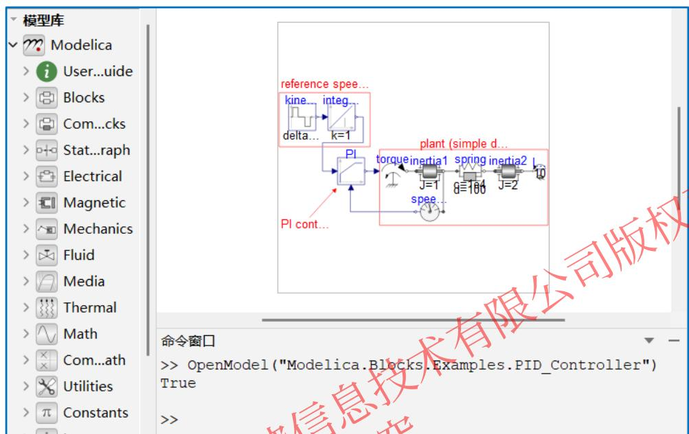

# 2. 脚本批量执行

可以将命令脚本文件（.mos、.scr 或.py）鼠标拖拽到命令窗口执行脚本。

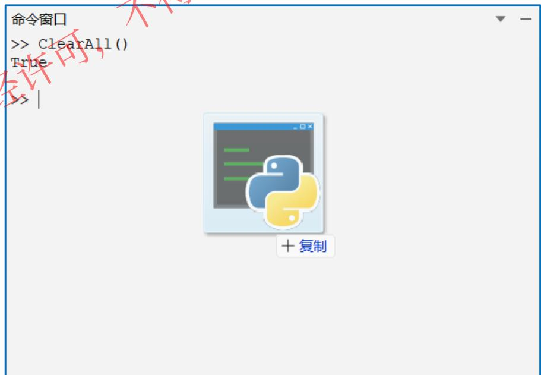

# 1.2 Python脚本运行工具简介-Python命令行

MWORKS.Sysplorer 命令窗口支持Python界面功能命令、编译器命令等接口，供开发脚本程序时参考。

# 3. 命令输出

执行命令后，根据命令的定义，返回相应的值。

命令原型：

Boolean CheckModel(String model_name="")

检查模型，若命令正确执行则返回True，执行错误则返回False，并说明错误的可能原因。

```txt
命令窗口
>> CheckModel("Model1")
True
>> CheckModel("Model2")
[#CheckModel] 模型"Model2"没有打开。
False
>>
同元软控信息技术有限公司侵权必究
```

# 4. 数据类型说明

命令接口与选项的参数/返回值类型如下。

- 关键字"void"表示无返回值。
- 布尔类型 bool，按照Python 语法，输入/返回 True/False
- 整型 int 和浮点数 double 无需特别解释。
- 字符串类型 string 作为参数输入时使用单引号或双引号表示，例如 CheckModel("Simple")
CheckModel("Simple")
- 集合类型 list，表示数组。

# 5.缺省参数

如果某个命令接口带有缺省参数, 调用时可以不给出实参, 这时系统自动取其缺省值。

命令原型：

```python
boolean SimulateModel (string model_name, double start_time = 0, double stop_time = 1, int number_of_intervals = 500, string algo = 'Dassl', double tolerance = 0.0001, double integral_step = 0.002, double store-double = False, double store_event = False)
```

命令调用：

SimulateModel ("Simple")

# 1.3 Python脚本运行工具简介-Python编辑器

MWORKS.Sysplorer 提供了Python文本编辑器，可以新建、编辑、运行Python脚本文件。

1. 在工具 > 应用 中点击运行脚本，即可打开Python编辑器。

- 新建文件：点击后新建空白的Python脚本。
- 打开文件：从本地打开.py文件至编辑器，此时脚本内容将显示在下方的文本编辑区内。
- 保存文件：将当前脚本保存至本地。
- 执行脚本：执行当前脚本。

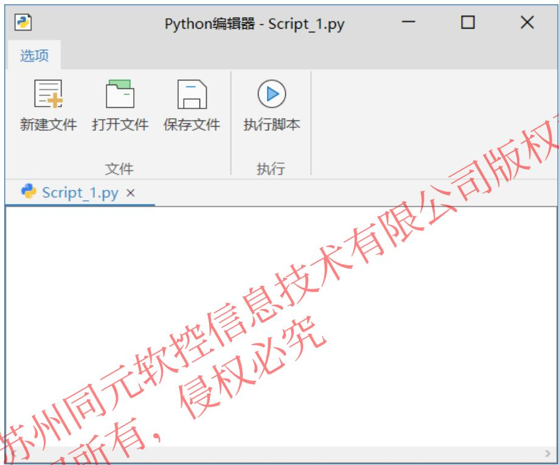

2. 新建、打开文件后，对当前脚本进行编辑。

- 编辑器提供编码助手功能，提高编辑效率。

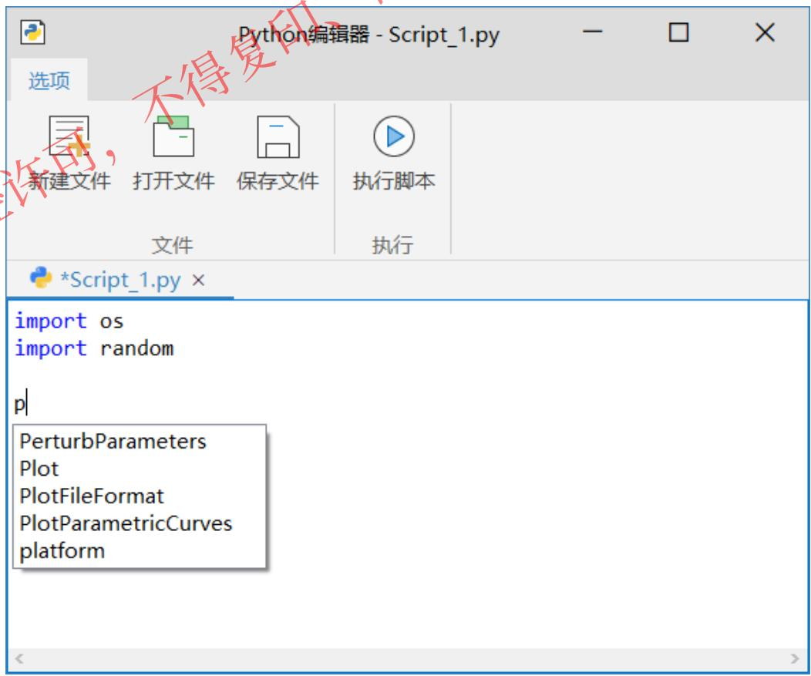

# 1.3 Python脚本运行工具简介-Python编辑器

MWORKS.Sysplorer 提供了Python文本编辑器，可以新建、编辑、运行Python脚本文件。

3.执行脚本后，输出显示在Python命令行窗口。

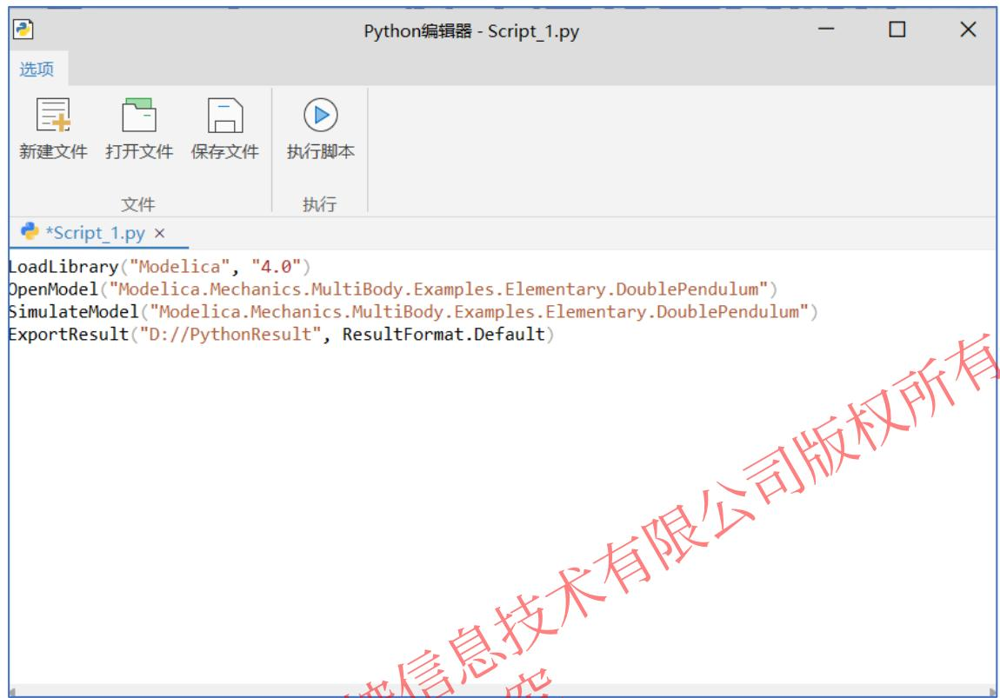
编辑器

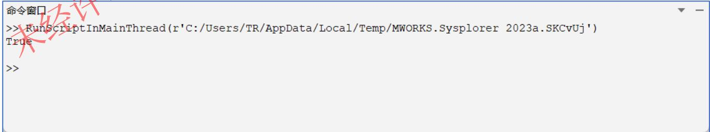
命令行窗口输出

# 1.4 Python脚本运行工具简介-Sysplorer Python API

Sysplorer 提供了一套 Python API，可以在外部的 Python 环境下调用，例如在 Syslab 中调用。

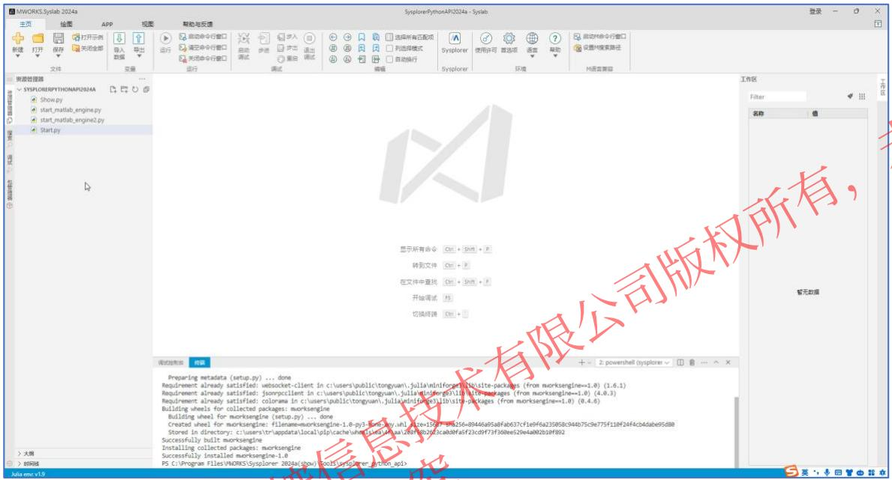
运行Python脚本

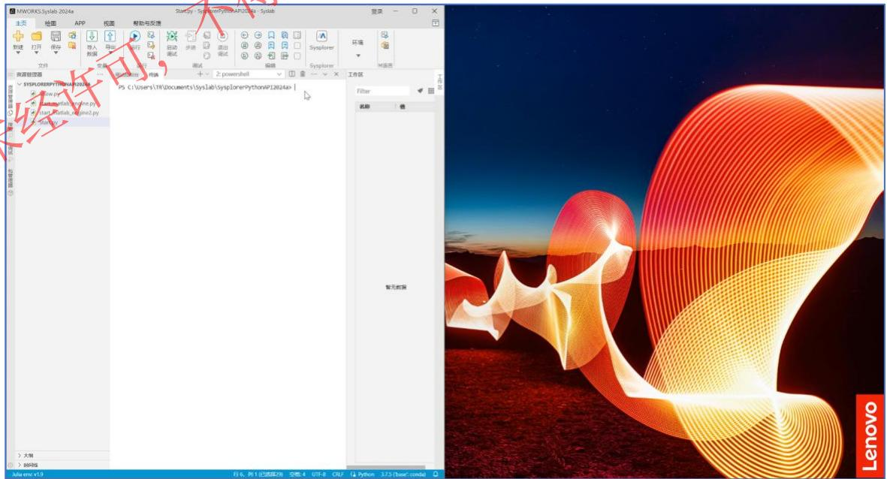
Python 命令行调用

# 1.4 Python脚本运行工具简介-Sysplorer Python API

# Step1：在Syslab中，新建PowerShell终端，并cd到SysplorerPythonAPI安装包的路径

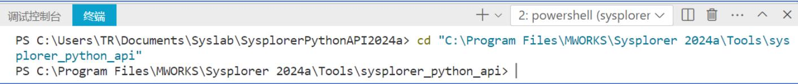

Step2：输入安装命令 pip install .\mworksengine-1.0.tar.gz -i https://pypi.tuna.tsinghua.edu.cn/simple

注：由于安装过程需要通过pip 安装其他Python库，通过pip官网安装需要国外代理，而通过国内的镜像源安装不需要代理，因此推荐国内用户使用清华镜像源网站https://pypi.tuna.tsinghua.edu.cn/simple安装。高手可忽略。

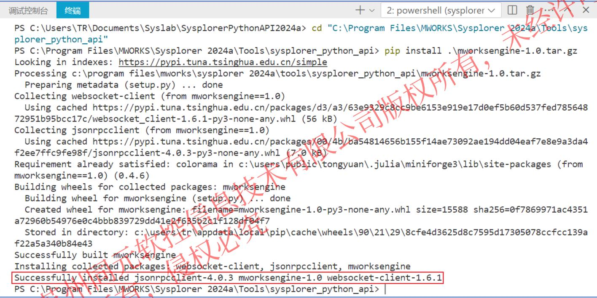

# Step3: 验证基本命令

import mworks
eng $=$ mworks.engine.StartSysplorer()
eng.LoadLibrary("Modelica")
eng.SimulateModel('Modelica Blocks.Examples.PID_controller')
eng.ImportResult(r'C:\Users\TR\Documents\MWorks\PID_controller er.csv'，"csv"，['PI.y'，'PI.u_m'，]，False)
eng.Exit()

# 点击“运行”查看结果

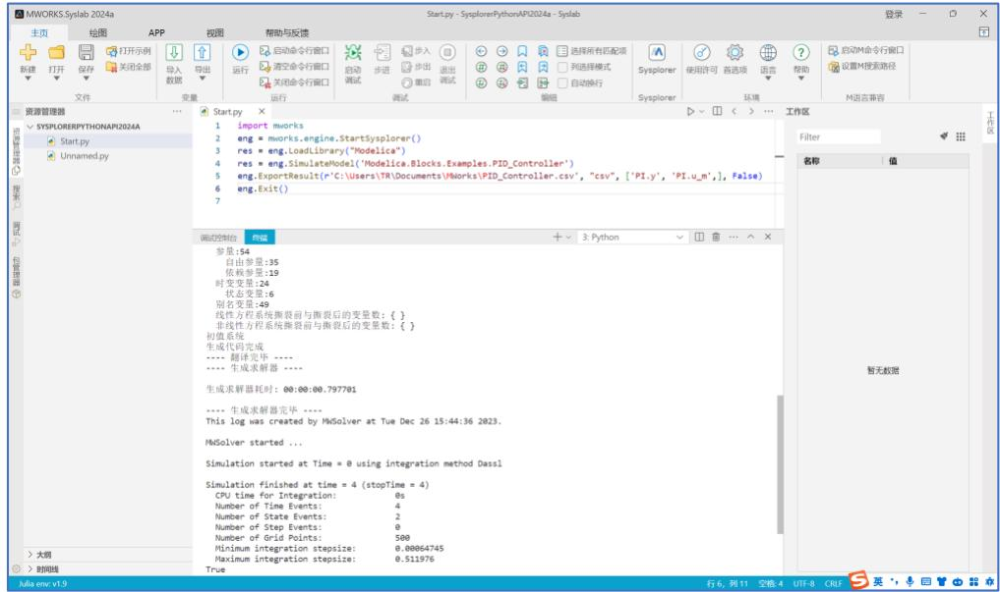

# 1.4 Python脚本运行工具简介-Sysplorer Python API

# Sysplorer Python API 提供了多种启动方式

# 1. 启动新的 Sysplorer

mworks.engine.StartSysplorer(start_mode: str = '-gui', processPath: str = None, ip: str = None) -> SysplorerEngine

说明：

- 启动一个新的 Sysplorer。

输入参数：

- start_mode: 启动模式，包括 '-gui' 和 '-q' 两种，分别表示启动带界面的 Sysplorer 和无界面的 Sysplorer；
- processPath：软件启动路径，默认使用注册表中记录的路径，即最新安装的 Sysplorer；
- ip: Sysplorer Python API 服务的 ip 地址，默认为 Python 客户端随机找一个可用的 ip，一般无需关心。

返回值:

- SysplorerEngine: Sysplorer 引擎类，所有的 Sysplorer Python API 都是这个类的接口。

示例

import mworks
eng $=$ mworks.engine.StartSysplorer()
eng.LoadLibrary("Modelica")
eng.SimulateModel('Modelica Blocks.Examples.PID_controller')
eng.ImportResult(r'C:\Users\TR\Documents\MWorks\PID_controller er.csv'，"csv"，['PI.y'，'PI.u_m'，]，False)
eng.Exit()

# 以界面启动的方式启动最新安装的 Sysplorer，获取到 Sysplorer 引擎对象：eng
调用eng对象的SysplorerPythonAPI

# 1.4 Python脚本运行工具简介-Sysplorer Python API

# Sysplorer Python API 提供了多种启动方式

# 2. 连接到已启动的 Sysplorer

需要配合使用多条命令来连接到已启动的 Sysplorer

# (1) Sysplorer 部分

ShareEngine()

说明：

将正在运行的本 Sysplorer 转换为共享引擎。

EnginePort() -> int:

说明：

返回本共享 Sysplore 引擎的可用端口。

EnginePort() -> int:

说明：

返回本共享 Sysplore 引擎的可用端口。

# (2) Python 部分

mworks.engine.FindSysplorer() -> List

说明：

- 查找可连接的 Sysplorer，返回端口号列表。

mworks.engine.ConnectSysplorer.port: int = None) -> SysplorerEngine

# 说明：

- 给定端口时，若端口为 Sysplorer 共享端口，则连接成功，否则，连接失败；
- 不给定端口时，若找到可用端口，则连接第一个可以连接的端口；
- 不给定端口时，若找不到可用端口，则启动一个新的 Sysplorer 并连接。

# 限制：

- 要求一个 Python 解释器只能连接一个 Sysplorer;
- 要求一个 Sysplorer 只能被一个 Python 解释器连接；

# 输入参数:

- port: 要连接的端口号，可以根据 FindSysplorer 获取；

# 02

# Python脚本应用-运行典型命令

# 2.1 运行Python命令

MWORKS.Sysplorer 支持Python原生命令。在命令行中，支持导入Python标准库；在编辑器中，还支持导入第三方库。

示例1：获取“C:\Users\TR\Pictures”下的png文件

说明：可自行修改路径，需使用绝对路径

示例2：使用numpy.random.random创建一个10*10的ndarray对象，并求最大值

注意：引用了第三方库numpy，需要在编辑器中使用。见最后注意事项。

脚本:

```python
>> import pathlib
>> from pathlib import Path
>> imgdir = "C:\Users\TR\Pictures"
>> p = Path(imgdir)
>> for i in p Rory('*png'): print(i)
```

输出：

```txt
命令窗口
>> import pathlib
>> from pathlib import Path
>> imgdir = "C:\Users\TR\Pictures"
>> p = Path(imgdir)
>> for i in p.rglob('*.png'): print(i)
C:\Users\TR\Pictures\图片1.png
C:\Users\TR\P Pictures\图片2.png
C:\Users\TR\P Pictures\图片3.png
C:\Users\TR\P Pictures\图片4.png
C:\Users\TR\P Pictures\图片5.png
C:\Users\TR\P Pictures\图片6.png
C:\Users\TR\P Pictures\图片7.png
C:\Users\TR\P Pictures\数据字典.png
>>
```

脚本：

import numpy
val $=$ numpy.random.random(size $\coloneqq$ (10,10))
print(val)
max $=$ val[0][0]
for i in val: for j in i: if max < j: max $=$ j
print(max)

输出：

```csv
MWORKS.Sysplorer 2023a
命令窗口
>> RunScriptInMainThread(r'C:/Users/TR/AppData/Local/Temp/MWORKS.Sysplorer 2023a.oSrEFN')
[0.02457047 0.64329662 0.29508219 0.76045119 0.74528323 0.75072329
0.71625686 0.9023695 0.22177791 0.74675985]
[0.30620808 0.92472283 0.31894754 0.4298375 0.03376191 0.87311797
0.91948542 0.47215861 0.76224022 0.1405613 ]
[0.02016951 0.75909561 0.00670662 0.1232334 0.31813187 0.89659812
0.22025221 0.05587955 0.38589641 0.61772952]
[0.85837119 0.54196803 0.5171998 0.73178854 0.19577488 0.19104937
0.02687574 0.09807891 0.14970673 0.71451754]
[0.98524408 0.93327747 0.19790751 0.8004091 0.01095274 0.37758427
0.43414944 0.39539523 0.51739363 0.27172696]
[0.41652449 0.34436168 0.40703817 0.48865746 0.90183809 0.78563054
0.97361447 0.95575416 0.87212394 0.42680014]
[0.99861031 0.7460208 0.43805572 0.31611618 0.18455575 0.99026371
0.46623242 0.44266762 0.2962334 0.8325901 ]
[0.40269667 0.34713282 0.57412118 0.75151181 0.01352363 0.96741616
0.78506812 0.89194209 0.26077474 0.77644202]
[0.24443607 0.90341938 0.91926274 0.39896439 0.27092891 0.92585298
0.47713348 0.30677819 0.54962689 0.97322189]
[0.95003606 0.84151057 0.38O381 0.01375939 0.339753O4 0.53469242
0.361751O6 0.7954BQ46 0.2O185SIS 5.OoTITI
[
```

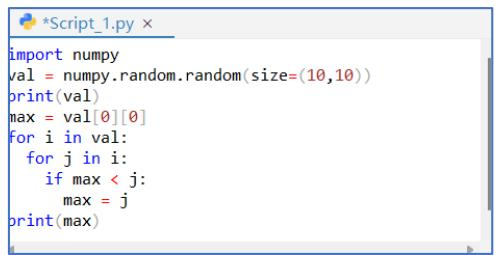
使用编辑器输入

# 2.2 运行Sysplorer命令

MWORKS.Sysplorer 提供了一系列 Sysplorer 命令，供开发脚本程序时参考

<table><tr><td>主题</td><td>说明</td></tr><tr><td>基本帮助命令</td><td>基本帮助命令的功能说明与示例</td></tr><tr><td>系统命令</td><td>系统命令的功能说明与示例</td></tr><tr><td>文件命令</td><td>文件命令的功能说明与示例</td></tr><tr><td>仿真命令</td><td>仿真命令的功能说明与示例</td></tr><tr><td>曲线命令</td><td>曲线命令的功能说明与示例</td></tr><tr><td>动画命令</td><td>动画命令的功能说明与示例</td></tr><tr><td>模型对象操作命令</td><td>模型对象操作命令的功能说明与示例</td></tr><tr><td>命令汇总</td><td>命令汇总</td></tr><tr><td>变量汇总</td><td>变量汇总</td></tr><tr><td>脚本示例</td><td>Python脚本简单示例</td></tr><tr><td>自定义工具库管理</td><td>介绍自定义工具库的查看、添加、删除方法</td></tr></table>

Tips: 可以打开软件, 在 “帮助- 接口-Python脚本命令” 中查看所有命令

# 2.2 运行Sysplorer命令-典型命令介绍

# 基本帮助命令

# 示例1：显示帮助信息

脚本：

>>Help()

输出：

# 命令窗口

>>Help()

help(): 显示本信息。

help(String command name): 显示指定命令的文档。

ListFunctions(): 列出所有函数。

ListVariables(): 列出所有变量。

# 示例2：查看指定命令的说明

脚本：

>>Help("CheckModel")或

>> help CheckModel

输出：

# 命令窗口

>>Help("CheckModel")

语法：

Boolean CheckModel(String model_name="")

说明：

检查模型。

model_name: 模型名。

# 2.2 运行Sysplorer命令-典型命令介绍

# 基本帮助命令

# 示例3：列出所有函数

脚本：

>> ListFunctions()

输出：

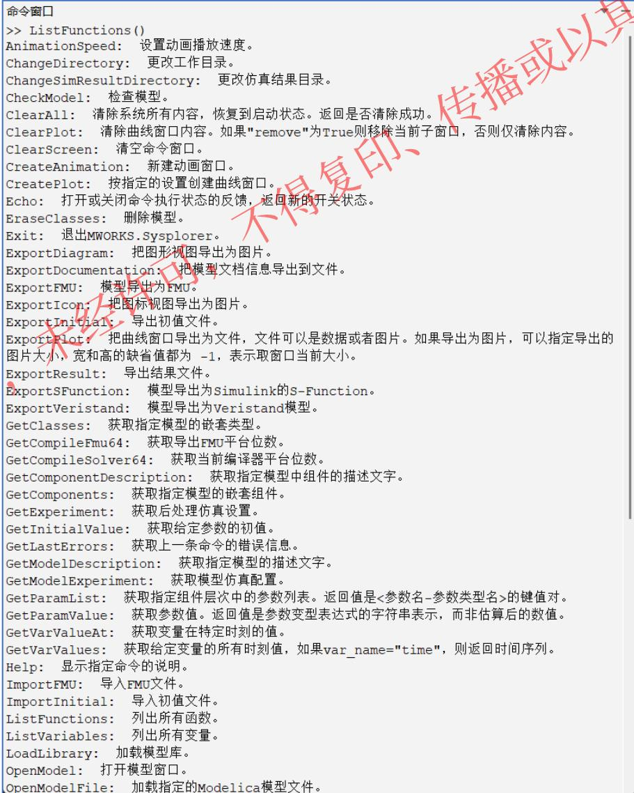

# 2.2 运行Sysplorer命令-典型命令介绍

# 基本帮助命令

# 示例4：列出所有变量

脚本：

>> ListVariables()

# 输出：

命令窗口
>>ListVariables()
Advanced.AnalyzerLinearSymbolElimination：分析线性符号消除
Advanced.Checked extends Restriction：检查基类限制性。
Advanced.CheckedTransitivelyNonReplaceable：检查递归非可替换
Advanced.CheckedTypeOfClassCompatibility：检查类的类别相容限
Advanced.ShowFinalParameter：显示final类型参数。
AxisTitleType.Custom：自定义的轴标题。
AxisTitleType.Default：使用默认的轴标题。
AxisTitleType.None：无轴标题。
FMI.Type.CoSimulation：联合仿真类型的FMI。
FMI.Type.ModelExchange：模型交换类型的FMI。
FMI.Version.V1：FMI 1.0.
FMI.Version.V2：FMI 2.0.
Integration.Dassl：积分算法：Dassl。
Integration.Euler：积分算法：Euler。
Integration.Radau5：积分算法：Radau5。
Integration.Rkfix2：积分算法：Rkfix2。
Integration.Rkfix3：积分算法：Rkfix3。
Integration.Rkfix4：积分算法：Rkfix4。
Integration.Rkfix6：积分算法：Rkfix6。
Integration.Rkfix8：积分算法：Rkfix8。
LegendLayoutEmbeddedBottom：图例布局：嵌入下边。
LegendLayoutEmbeddedLeft：图例布局：嵌入左边。
LegendLayoutEmbeddedRight：图例布局：嵌入右边。
LegendLayoutEmbeddedTop：图例布局：嵌入上边。
LegendLayout.FloatingBottomCenter：图例布局：浮动位于正下。
LegendLayout.FloatingBottomLeft：图例布局：浮动位于左下。
LegendLayout.FloatingBottomRight：图例布局：浮动位于右下。
LegendLayout.FloatingCenterLeft：图例布局：浮动位于左边。
LegendLayout.FloatingCenterRight：图例布局：浮动位于右边。
LegendLayout.FloatingTopCenter：图例布局：浮动位于正上。
LegendLayout.FloatingTopLeft：图例布局：浮动位于左上。
LegendLayout.FloatingTopRight：图例布局：浮动位于右上。
LegendLayout.Hide：图例布局：隐藏。
LineColor.Black：黑色。
LineColor.Brown：棕色。
LineColor.Green：绿色。
LineColor.Magenta：洋红。
LineColor.Purple：紫色。
LineColor.Red：红色。
LineColor.Yellow：黄色。
LineStyle.DashDot：点划线。
LineStyle.DashDotDot: 双点划线。
LineStyle.Dashed：虚线。
LineStyle.Dotted：点线。


# 2.2 运行Sysplorer命令-典型命令介绍

# 系统命令

示例5：设置工作目录

脚本：

>> ChangeDirectory(r"D:\03_workspath")

示例6：设置仿真结果目录

脚本：

>> ChangeSimResultDirectory(r"D:\03_workspath")

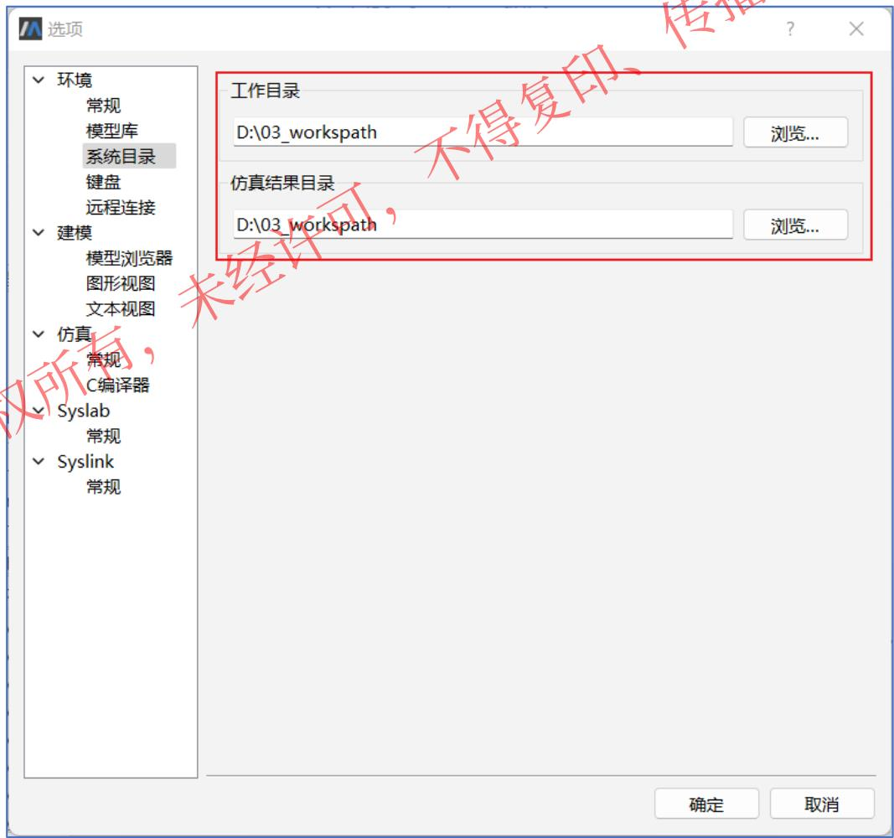
等效于在全局设置中设置

# 2.2 运行Sysplorer命令-典型命令介绍

# 系统命令

示例7：执行脚本文件

脚本：

>> RunScript(r"D:\03_workspath\test.py")

输出：

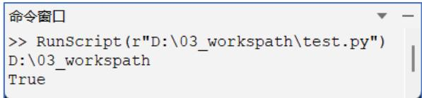

执行脚本文件，相当于将脚本中的命令，全部在命令行执行一遍。

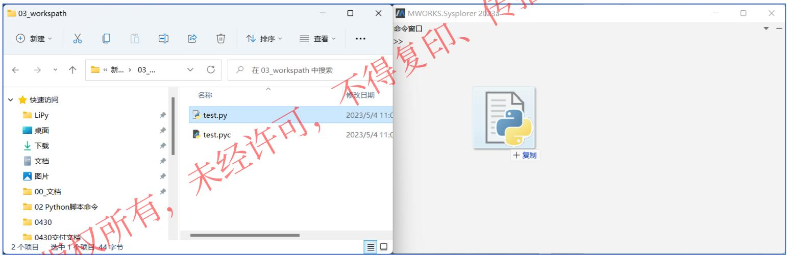
除了使用RunScript命令外，还可以直接将test.py文件拖拽到命令窗口，实现上述功能

# 2.2 运行Sysplorer命令-典型命令介绍

# 文件命令

# 示例8：加载模型库

脚本:

>> LoadLibrary('Modelica','4.0')

输出：

命令窗口

>> LoadLibrary('Modelica','4.0')

True

# 示例9：加载模型

脚本：

>>openModelFile(r"D:\\03_workspath\TestModel1.mo",True)

输出：

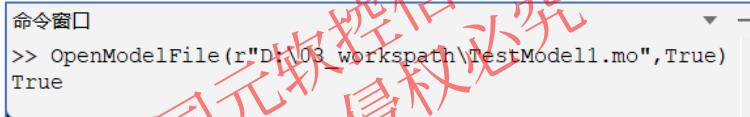

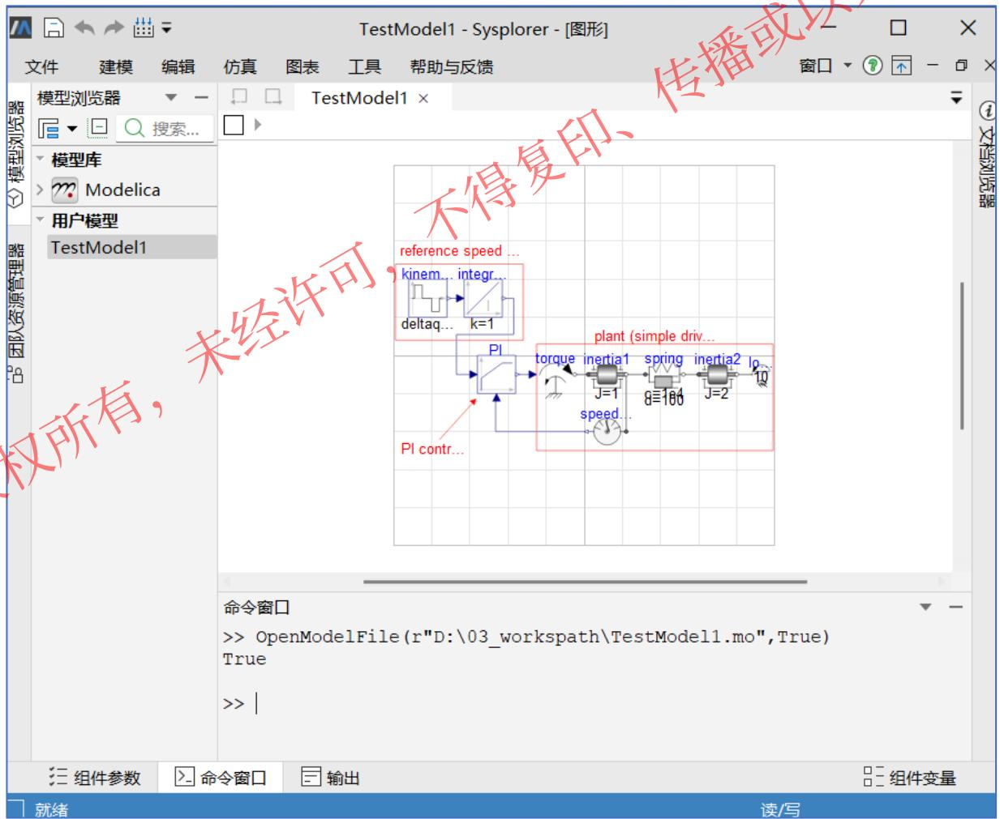

# 2.2 运行Sysplorer命令-典型命令介绍

# 仿真命令

# 示例10：打开模型

脚本：

```txt
>>openModel('TestModel1'，'text')
```

输出：

```txt
命令窗口
>> OpenModel('TestModel1','text')
True
```

该命令的意思是将模型浏览器中的某个模型在图形、图标或文本视图打开。

注意：要与文件命令中的加载模型命令open城市发展加以区分。

# 示例11：仿真模型

脚本：

```txt
>> SimulateModel(model_name = "TestModel1", algo = "Dassl", result_file = r"D:\aa")
```

输出：

```txt
输出
建模 仿真
This log was created by MWSolver at Thu May 04 13:53:15 2023.
MWSolver started...
Simulation started at Time = 0 using integration method dassl
Simulation terminated at Time = 1 (StopTime = 1)
CPU Time for Simulation: 0s
Number of Time Events: 1
Number of State Events: 0
Number of Grid Points: 500
Minimum integration stepsize: 0.000941378
Maximum integration stepsize: 0.511976
```

仿真命令参数很多，且都是缺省参数，示例11展示了指定部分缺省参数的仿真命令。

注意：要保证result_file 参数所在的文件夹存在，否则会仿真失败

# 2.2 运行Sysplorer命令-典型命令介绍

# 曲线命令

# 示例12：创建曲线

脚本：

```python
>> CreatePlot(id=2, x='time', y=['pID_controller.PI.u_s', 'pID_controller.PI.y'], legend.layout = 10, curve_verbier=True, result_file=r'D:\aa\TestModel1\Result.msr')
```

创建编号为2的曲线窗口，显示实例TestModel1中以time为X轴的pID_controller.PI.u_s和pID_controller.PI.y的曲线，图例悬浮在左下，并在该曲线窗口显示游标。

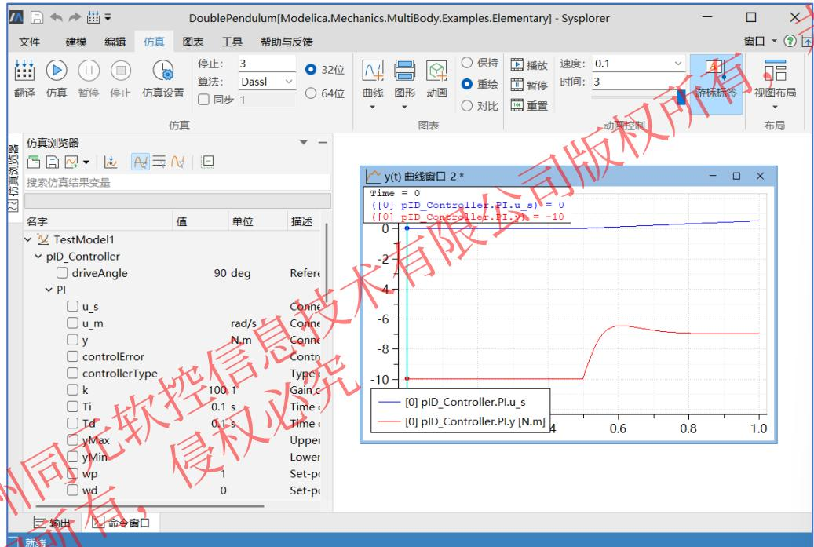

# 示例13：导出曲线

脚本:

```txt
>> ExportPlot('D:/plot.png', PlotFileFormat.Image, 2, 600, 400)
```

将曲线窗口-2作为 $600^{*} 400$ 大小的图片导出，导出的文件路径为‘D:\Plot.png'。

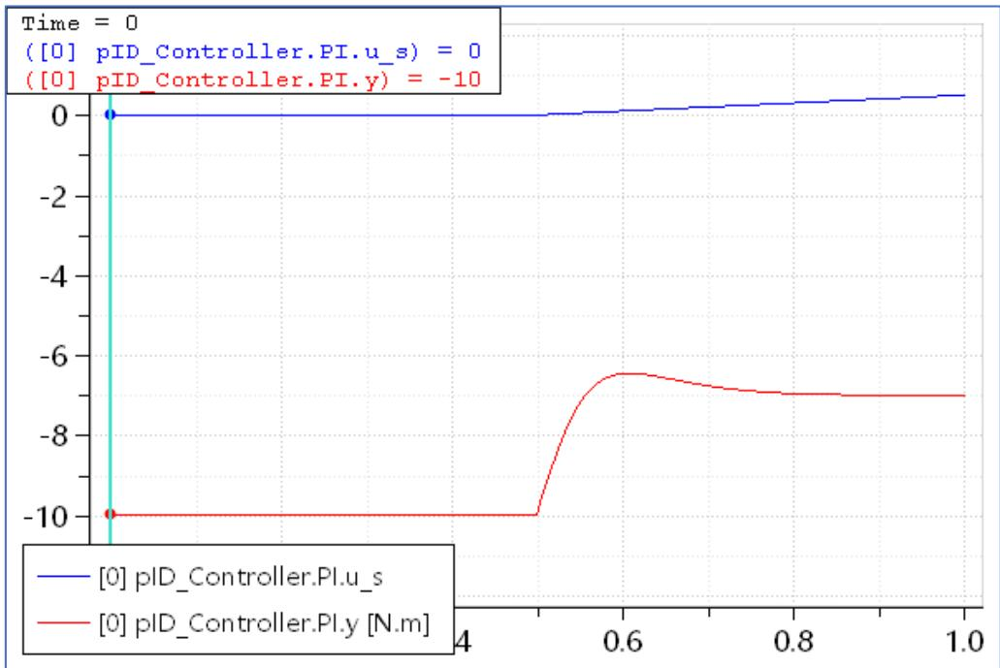

# 2.2 运行Sysplorer命令-典型命令介绍

# 动画命令

# 示例14：创建动画

脚本：

```python
>> CreateAnimation()

以Modelica.Mechanics.MultiBody.Examples.Elementary.DoublePendulum模型为例，首先仿真改模型，仿真成功后，执行该脚本

# 示例15：播放动画

脚本:

>> RunAnimation()

# 示例16：设置动画播放速度

脚本:

>> AnimationSpeed (0.1)

通过设置动画播放速度, 执行播放动画命令, 即可开始播放。

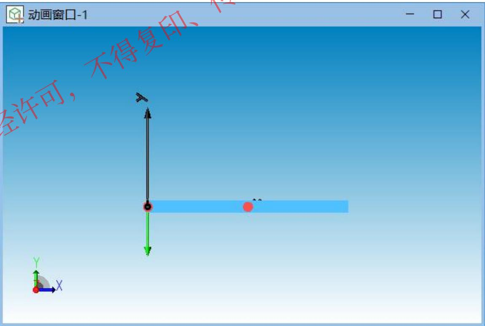
示例14.创建动画

# 2.2 运行Sysplorer命令-典型命令介绍

# 模型对象操作命令

# 示例17：获取组件列表

脚本：

```autoit
>>GetComponents('TestModel1')
```

获取模型'TestModel1的组件列表

输出：

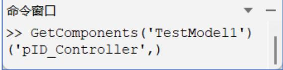

# 示例18：获取指定组件前缀层次中的参数列表。

脚本:

```txt
>> GetParamList('pID_controller')
```

输出：

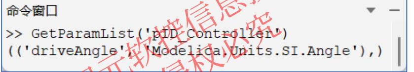

# 示例19：获取参数的值

脚本:

```txt
>> GetParamValue('pID_controller.driveAngle')
```

输出：

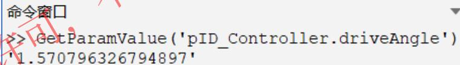

# 示例20：设置参数的值

脚本:

```txt
>> SetParamValue('pID_controller.driveAngle', '2')
```

输出：

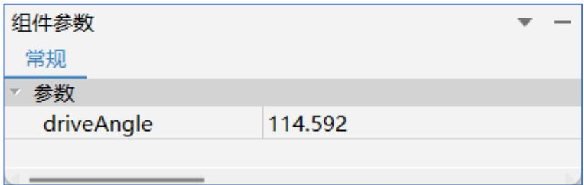

# 03

# Python脚本应用-高级使用

# 3.1 自动化建模仿真

# Python脚本自动化建模仿真的功能

右侧的Python脚本使用了第4章中介绍的不同分类的命令，包括清空环境、加载模型库、加载模型、打开模型、设置参数、仿真模型、创建曲线、导出曲线、创建动画、播放动画等，完成了一次打开模型、设置参数、仿真、导出数据的自动化建模仿真流程。

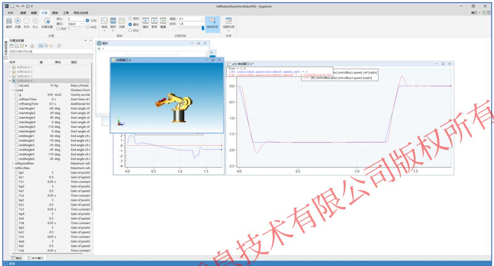
自动化建模仿真结果

# import os

#模型存放路径

#获取当前模型存放绝对路径

curDir=os.pathdirname(os.path.abspath(_file))

#软件恢复初始化

ClearAll()

加载Modelica3.2.1

LoadLibrary('Modelica','3.2.1')

#打开用户模型

"openModelFile(curDir + r"/Systems/package.mo")

#打开Systems.RobotR3.fullRobot模型

openModel('Systems.RobotR3.fullRobot', ModelView.Diagram)

变量axis2.c的值

axis2_c_values=[1,10,5,20]

对变量axis2.c设置不同的值，获得结果变量曲线和图片

for var in axis2_c_values:

修改部分参数

SetParamValue('axis2.c', var)

检查模型

CheckModel('Systems.RobotR3.fullRobot')

仿真模型

SimulateModel(model_name='Systems.RobotR3.fullRobot', stop_time=1.8, algo=Integration.Dassl)

创建曲线窗口1

CreatePlot(id = 1, position = [100, 120, 590, 600], y = ['axis2.flange phi'])

#创建子窗口

CreatePlot(id = 1, sub_plot = 2, y = ['axis2.flange.tau'])

创建曲线窗口2

CreatePlot(id = 2, position = [692, 120, 1200, 600], y =

['controlBus制约Bus3.speed_ref',

controlBus(axisControlBus3.speed])

添加曲线

Plot(y=['controlBus制约Bus2motion_ref'])

导出曲线图片

ExportPlot(curDir+r"/axis2.c值为"+str(var)+ "时axis2的曲线.png",PlotFileFormat.Image,1)

ExportPlot(curDir+r"/axis2.c值为"+ str(var) + "时controlBus的曲线.png", PlotFileFormat.Image, 2)

导出结果文件

ExportPlot(curDir + r" / axis2.c值为"+ str(var) + "时axis2的曲线.csv", PlotFileFormat.Csv, 1)

ExportPlot(curDir+r"/axis2.c值为"+ str(var) + "时controlBus的曲线.csv", PlotFileFormat.Csv, 2)

#打开动画窗口

CreateAnimation()

设置动画播放速度

AnimationSpeed(0.1)

播放动画

RunAnimation()

# 自动化建模仿真脚本

# 3.2 Python编辑器的使用

1. 点击“新建文件”，将第五章的自动化脚本复制到编辑区或点击“打开文件”，直接选择自动化脚本文件

2. 根据自己的需要，对自动化脚本进行修改，然后点击“执行脚本”。运行成功后，点击“保存文件”，保存修改后的脚本

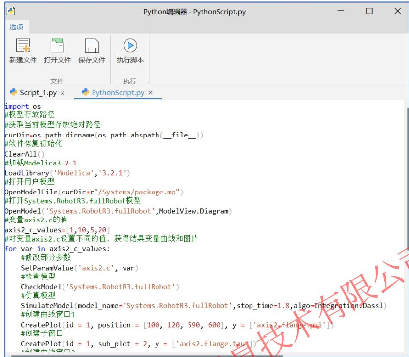

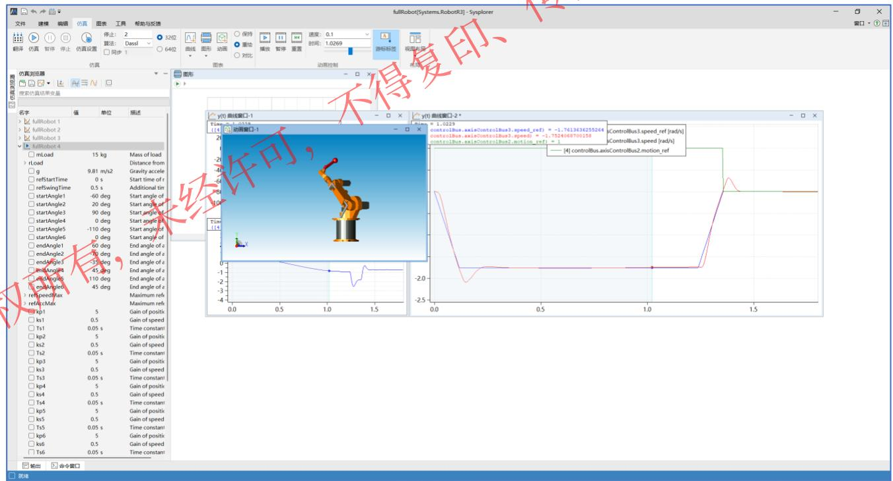

Tips: Python编辑器的脚本运行在UI线程，运行时可能会有卡顿现象，稍等片刻即可恢复

# 04

# 注意事项

# 4. 注意事项

# 注意事项1：外部库调用

MWORKS.Sysplorer中，有多种执行Python命令的方法。

- 若通过命令窗口运行Python命令或Python脚本文件，则默认在子线程中执行；
- 若使用Python编辑器运行脚本文件，则默认在主线程（UI线程）中执行。

需要注意的是,外部的GUI调用命令(如Matplotlib工具库)在子线程中无法正确运行,此时需要将命令保存到.py格式的脚本文件中,使用RunInMainThread()执行该脚本文件,或通过Python编辑器执行该脚本。

此外，由于多线程的影响，在Python命令行中只允许运行Python内置库，而第三方库。比如NumPy等，则需要在Python编辑器中运行。

# 注意事项2：Python脚本编码格式

默认编码格式
Python编辑器的默认编码格式为UTF-8-BOM，若使用其他格式可能出现中文乱码等情况。
> 保存编码格式方法

1. 使用记事本打开脚本文件。
2. 点击文件 > 另存为,选择编码为带有BOM的UTF-8。
3. 点击保存。

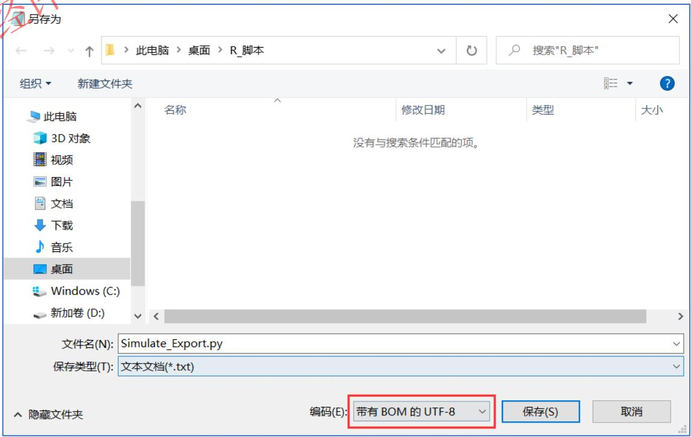

建立知识规范，营造协同生态

积累工业模型，发展可控平台

融入中国创新，打造先进软件

# 谢谢
