# 智能无人系统应用挑战赛_专项培训一

- Source: `MWORKS高校星火计划资料包/培训课程配套材料/02-直播课程配套材料/06-智能无人系统应用挑战赛专项培训/01-第一期/智能无人系统应用挑战赛-无人车避障赛道专项培训（一）.pdf`
- Converted by: `MinerU precise API`
- Conversion date: `2026-05-08`
- Review status: `MinerU converted; spot check recommended`
- Priority: `P1`
- Source SHA1: `8653e9e746ce`
- MinerU batch id: `0b32f338-c51f-42b7-b249-d99691b3c974`
- Images: `21`
- Notes: 智能无人系统场景、模型和控制展示参考。

# 智能无人系统应用挑战赛得无人车避障赛道专项培训 （一）

# 赛题剖析与案例讲解

孔德才

苏州同元软控信息技术有限公司

2025年6月16日

# 目录

1. 赛事简介
2. 赛题详解
3. 示例模型介绍
4. 实物验证讲解
5. 后续计划

# 1. 赛事简介-2024赛事回顾

在2024第四届智能无人系统应用挑战赛中，同元软控支持的“无人车避障”科目共计收到来自西北工业大学、北京理工大学、哈尔滨工业大学、西安交通大学、中国运载火箭技术研究院等单位的30余支队伍报名参赛。

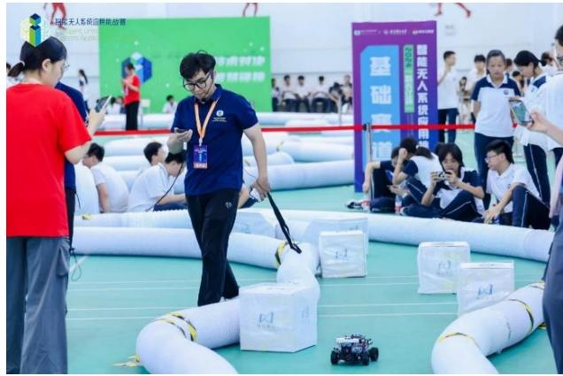

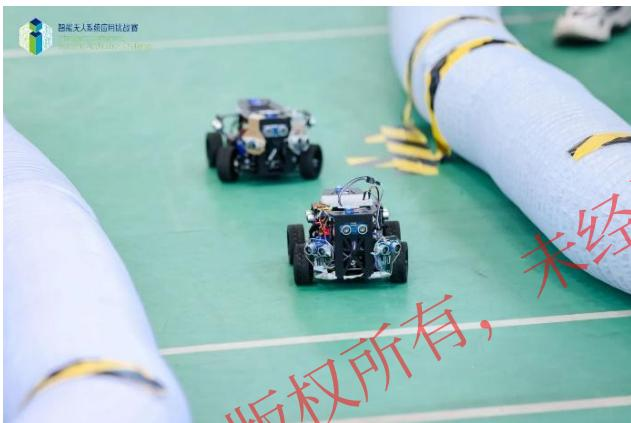

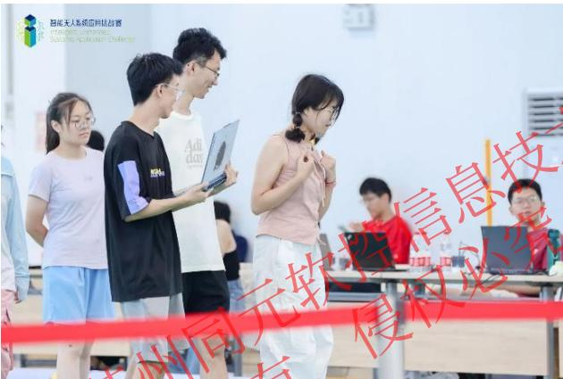

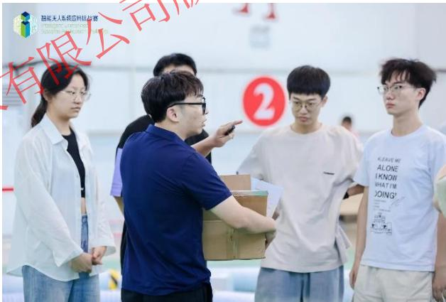

# 获奖队伍名单

一等奖

中国运载火箭技术研究院火箭飙车

二等奖

北京理工大学暴走小分队

三等奖

北京理工大学开拓之路

西北工业大学智履平地

# 1. 赛事简介-2025赛事

2025第五届智能无人系统应用挑战赛将于7月21-25日在南京理工大学江阴校区举办。

本届大赛以“无人自主，勇争先锋”为主题，设置自主赛道、算法赛道、基础赛道三大赛道，涵盖多个竞赛科目。同元软控作为大赛支持单位，为“算法赛道”中“无人车避障”科目提供软硬件支持与技术指导。

<table><tr><td>赛道设置</td><td>科目设置</td></tr><tr><td rowspan="5">自主赛道</td><td>飞行避障</td></tr><tr><td>快递速达</td></tr><tr><td>协同追踪</td></tr><tr><td>空地协同</td></tr><tr><td>智能清障</td></tr><tr><td>软控信息必究</td><td>无人车避障</td></tr><tr><td>基础赛道</td><td>RoboRacer无人车竞速赛</td></tr></table>

# 1. 赛事简介-2025赛事

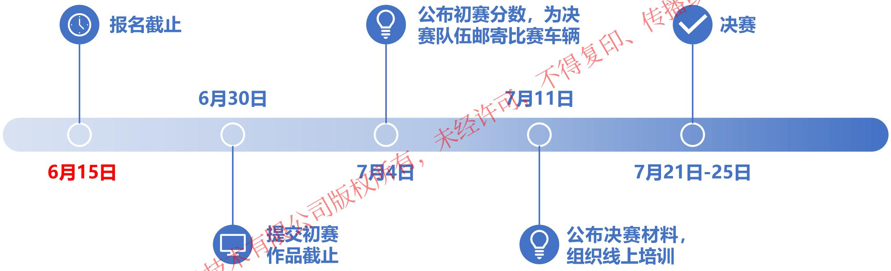

# 1. 赛事简介

# 2025智能无人系统应用挑战赛-微信群

群聊：2025智能无人系统应用挑战赛

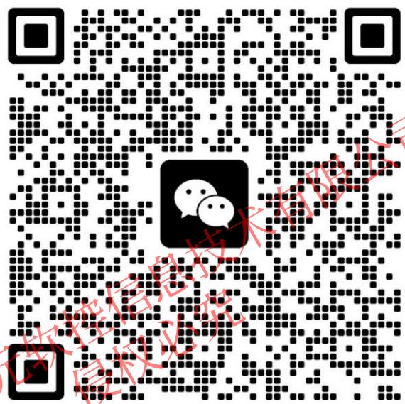

# MoHub技术交流专区/高校专区

# MWORKS技术答疑和交流社区

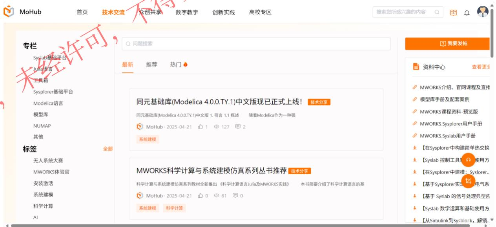

# 直接搜索“MoHub”

https://mohub.net

# 目录

1. 赛事简介
2. 赛题详解
3. 示例模型介绍
4. 实物验证讲解
5. 后续计划

# 2. 赛题详解

2025赛题下载地址：https://icaus2025.scimeeting.cn/cn/web/index/27793_2460619

智能无人系统应用挑战赛 下载中心 2025比赛规则—算法赛道—无人车避障3.0（第三版）.docx

# 智能无人系统应用挑战赛

下载中心

# 下载中心

2025比赛规则一自主赛道一飞行避障3.0（第一版）.doc

2025比赛规则一自主赛道一快递速达3.0（第一版）.doc

2025比赛规则一自主赛道—协同追踪3.0（第一版）.docx

2025比赛规则一自主赛道一协同追踪3.0（第二版）.docx

协同追踪一裁判软件+调试代码.rar

2025比赛规则一自主赛道—智能清障1.0（第一版）.docx

2025比赛规则一自主赛道一智能清障1.0（第二版）.d

2025比赛规则—自主赛道—空地协同2.0（第>版).docx

2025比赛规则—基础赛道—RoboRa&e人车竞速赛2.0（第一版）.doc

2025比赛规则一算法赛道一无人车避障3.0（第一版）.doc

2025比赛规则一算法赛道无人车避障3.0（第二版）.doc

2025比赛规则算法赛道一无人车避障3.0（第三版）.docx

2025第五届智能无人系统应用挑战赛报名表.doc

于举办2025第五届智能无人系统应用挑战赛的通知（第二轮通知）.pdf

# 2025第五届智能无人系统应用挑战赛

算法赛道一无人车避障3.0

竞赛规则 (第三版)

# 目录

1.比赛背景..

1.1名词解释
1.2比赛安排 5

2.比赛规则...

2.1初赛比要规则

2.1.1初赛赛道说明
2.1.2初赛仿真模型说明 4
2.1.3初赛评分细则

2.2决赛比晏规则 8

2.2.1决暴暴道说明 8
2.2.2决暴模型说明 .9
2.2.3决暴制规则
2.2.4决暴评分细则

3.选手指南. 14

3.1.1软件安装 14
3.1.2许可部署 .14
3.1.3学习资源 . 15
3.1.4技术支持 .15

4.赛程排. 1

2025第五届能元人統应用挑战赛组+西州元软信技术有限公司

# 2. 赛题详解

# 比赛分为初赛和决赛两个阶段

# 初赛阶段

基于MWORKS 2025a平台搭建模型，在虚拟仿真环境中开展避障算法设计与仿真验证。参赛队员利用组委会提供的无人车系统模型等材料，完成无人车避障算法设计和验证，提交参赛作品。组委会根据比赛规则，综合避碰效果和竞速时间等因素进行打分

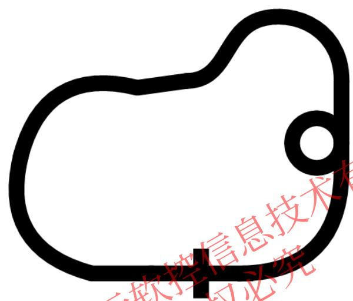
初赛赛道示例形状

# 赛道规格：

1. 赛道设置为环形赛道。
2. 赛道规格包括赛道的尺寸、形状、间距等。

赛道宽度不小于3.5m；
⚫ 赛道中可能存在直线、曲线、坡道、十字交叉路口、环形道、停车线等。

3. 赛道起点与终点：赛道中设有起点，终点即是起点。
4. 无人车行驶到十字交叉路口时应当直行，行驶至环形路口时需进入环形路行驶一周后驶出。

# 2. 赛题详解

# 比赛分为初赛和决赛两个阶段

# 决赛阶段

初赛通过后，各参赛队伍持续进行算法优化，届时组委会向进入到决赛的参赛队伍发放实物小车，决赛基于实物小车验证控制算法效果

基于MWORKS将设计的控制算法代码生成，下载到实物小车中，根据赛道路况进行无人车系统调试，最终在真实的模拟赛道中进行实物比赛。组委会根据比赛规则，综合避碰效果和竞速时间等因素进行打分。

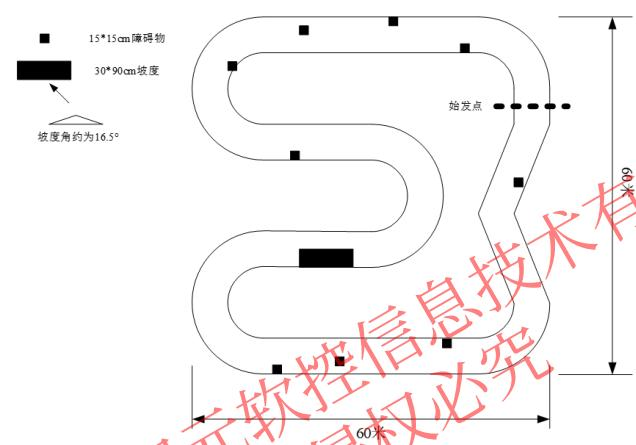
决赛赛道示例形状

# 赛道规格：

1. 赛道设置为不规则的环形赛道，分为内侧和外侧两圈轨道。
2. 在赛道的某些区域可能会设置障碍物和坡度挑战，通过增加障碍物来增加难度，考验选手对比赛车辆的控制能力和车辆反应速度。
3. 赛道起点与终点：赛道中设有起点，终点即是起点。

# 目录

1. 赛事简介
2. 赛题详解
3. 示例模型介绍
4. 实物验证讲解
5. 后续计划

# 3. 示例模型介绍

# 车辆参数：

轴距：0.11m

轮距：0.165m

传感器位于前后左右四个位置

# 注意事项：

1.选手只需要对红框中避障算法模块使用Sysblock进行建模，其余模型无需改动；
2.仿真时勾选同步仿真，即可查看图形界面车辆状态与得分情况的动态显示;
3.小车每碰撞一次扣0.4分，综合考虑小车跑完一圈用时完成总分评判，具体细则请参看赛题说明。

无人系统大赛模型(初赛)
车辆状态与得分情况

@苏州同元软控技术有限公司版权所有，仅用于无人系统大赛，未经许可不得复制、传播或以其他方式使用

# 目录

1. 赛事简介
2. 赛题详解
3. 示例模型介绍
4. 实物验证讲解
5. 后续计划

# 4. 实物验证讲解

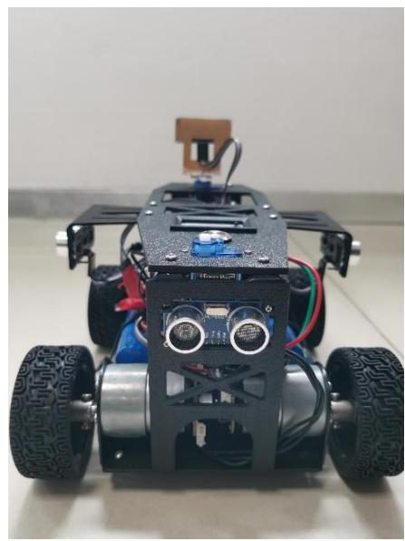

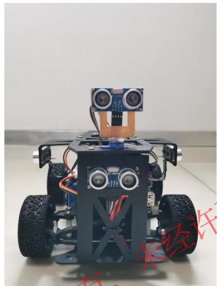

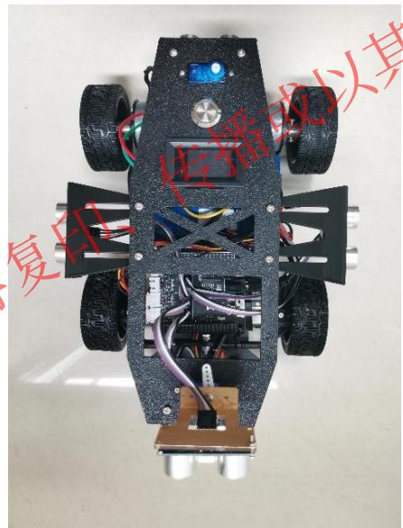

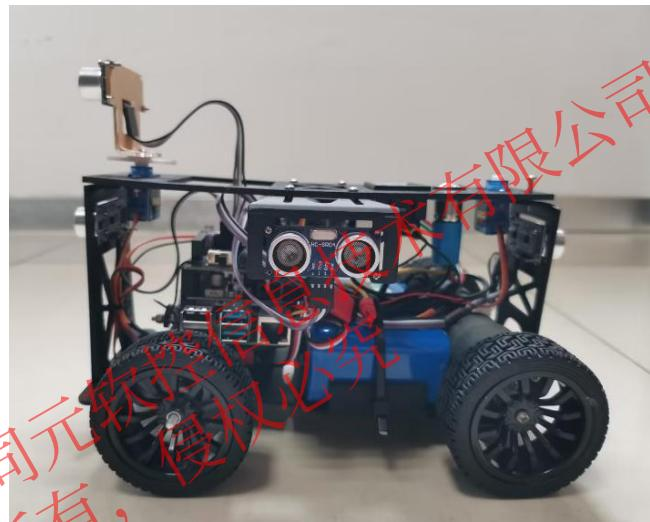

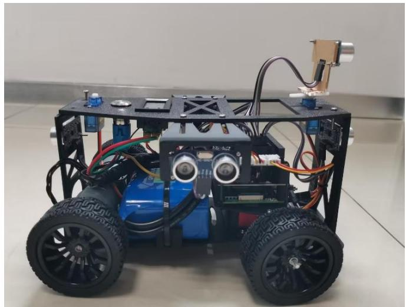

# 4. 实物验证讲解

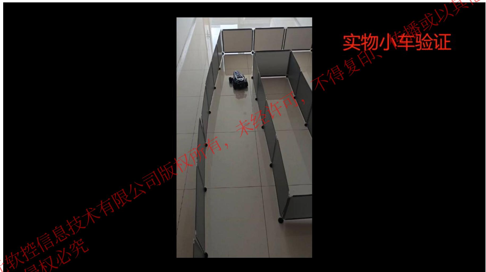

# 目录

1. 赛事简介
2. 赛题详解
3. 示例模型介绍
4. 实物验证讲解
5. 后续计划

# 5. 后续计划

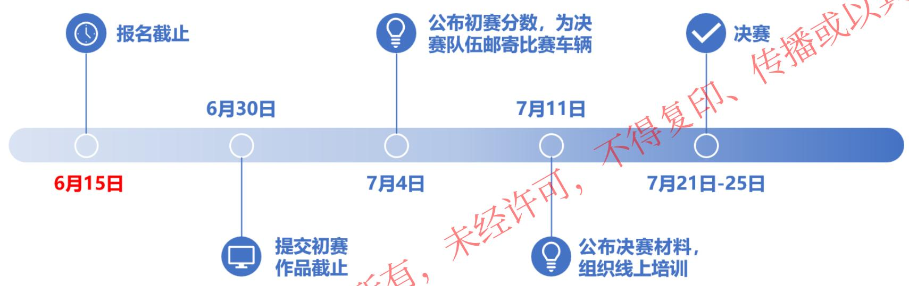

<table><tr><td>时间</td><td>培训主题</td><td>培训内容</td></tr><tr><td>6月16日</td><td>初赛培训</td><td>避障算法开发指南</td></tr><tr><td>7月11日</td><td>决赛培训</td><td>避障算法实物验证</td></tr></table>

建立知识规范， 营造协同生态

积累工业模型， 发展可控平台

融入中国创新， 打造先进软件

# 感谢聆听
