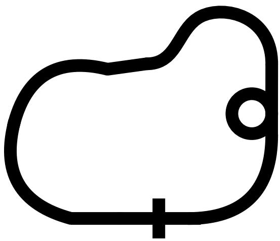
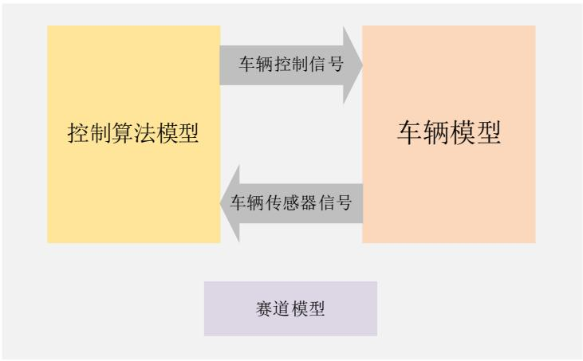
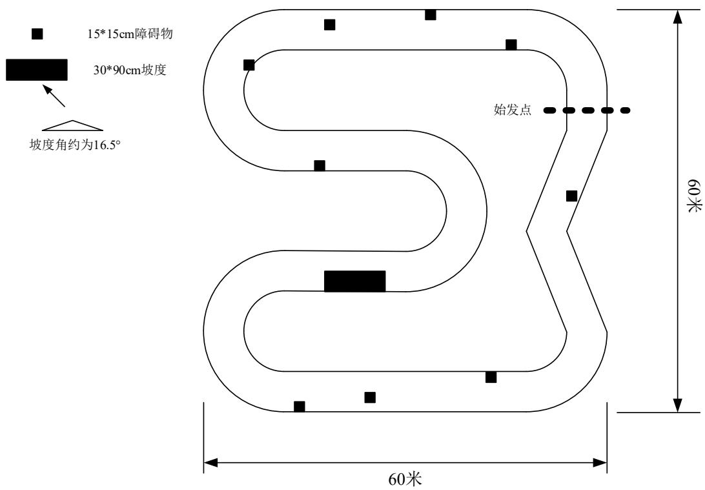
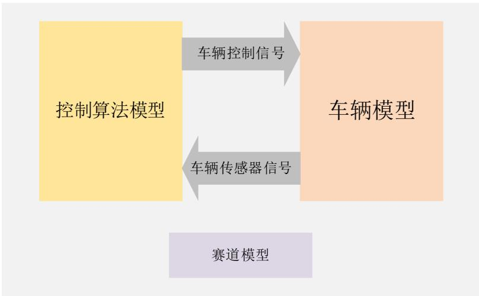
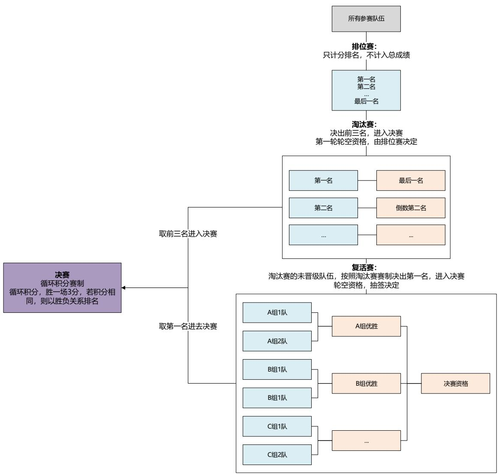
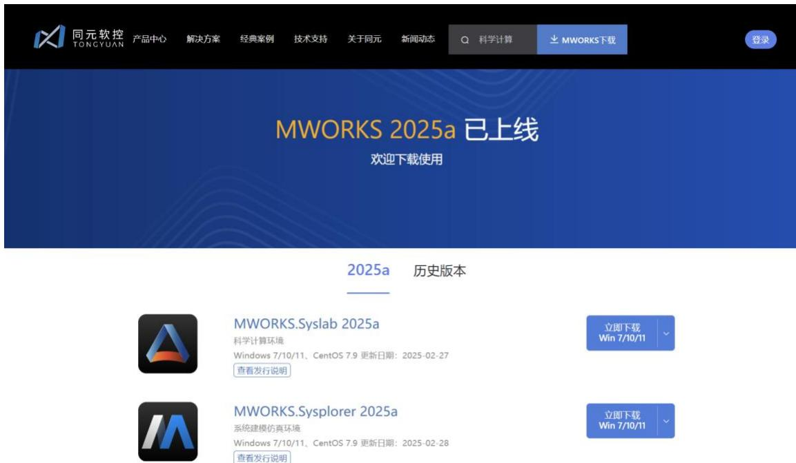
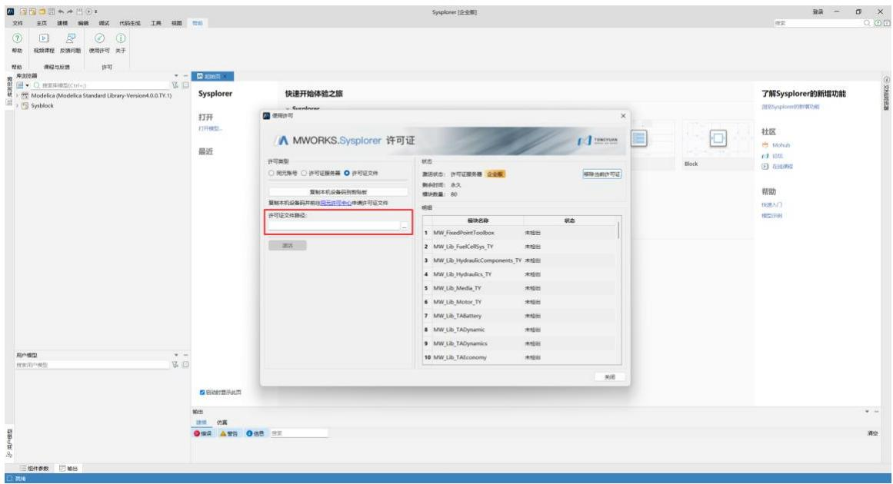
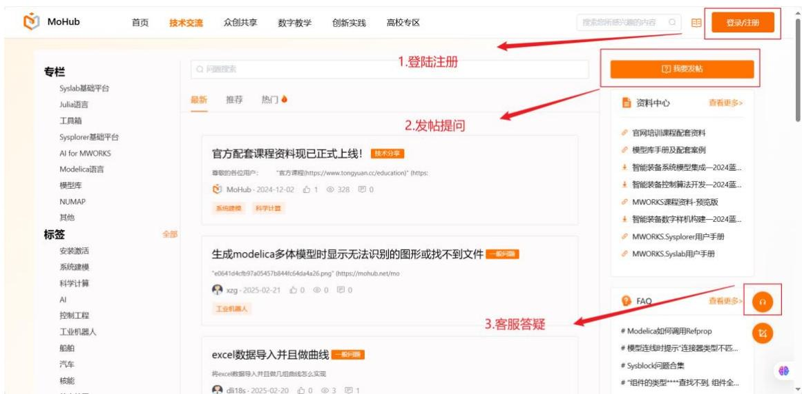

# 智能无人系统应用挑战赛_无人车避障竞赛规则

- Source: `MWORKS高校星火计划资料包/培训课程配套材料/02-直播课程配套材料/06-智能无人系统应用挑战赛专项培训/01-第一期/无人车避障3.0竞赛规则.pdf`
- Converted by: `MinerU precise API`
- Conversion date: `2026-05-08`
- Review status: `MinerU converted; spot check recommended`
- Priority: `P1`
- Source SHA1: `1d3eb782a447`
- MinerU batch id: `0f5e651c-2c3a-40fb-bdbb-ae58721c0c1a`
- Images: `13`
- Notes: 挑战赛规则和评价方式参考。

# 2025 第五届智能无人系统应用挑战赛

# 算法赛道—无人车避障 3.0

# 竞赛规则（第三版）

# 目录

# 1. 比赛背景 ..

1.1 名词解释.
1.2 比赛安排. 2

# 2. 比赛规则 .

2.1 初赛比赛规则. 3

2.1.1 初赛赛道说明.
2.1.2 初赛仿真模型说明. 4
2.1.3 初赛评分细则.

2.2 决赛比赛规则. 8

2.2.1 决赛赛道说明. 8
2.2.2 决赛模型说明. C
2.2.3 决赛赛制规则. .10
2.2.4 决赛评分细则. . 11

# 3. 选手指南 14

3.1.1 软件安装. .14
3.1.2 许可部署. .14
3.1.3 学习资源.. .15
3.1.4 技术支持. .15

# 4. 赛程安排（拟）... .. 16

修改日志

<table><tr><td>日期</td><td>版本</td><td>修改记录</td></tr><tr><td>2025.03.11</td><td>第一版</td><td>首次发布</td></tr><tr><td>2025.03.12</td><td>第二版</td><td>修改内容：
1. Mohub 更正为 MoHub（详见 P2、P3）；
2. MWORKS 官网图片刷新（详见 3.1.1、3.1.2 章节）；
3. 新增作品开源要求（详见 P3、P8）；
4. 赛制规则表述更正（P8“几何模型”修改为“形状示例”；P10“图5”修改为“图4”）。</td></tr><tr><td>2025.04.15</td><td>第三版</td><td>修改内容：
1. 修改赛程安排（详见 P16）</td></tr></table>

# 1. 比赛背景

无人车自主避障技术是自动驾驶技术的重要组成，涉及数据融合、任务决策、轨迹规划等内容，是目前研究的热点之一。

本科目基于国产自主的科学计算与系统建模仿真平台 MWORKS，开展无人车避障算法的设计、验证与实现。比赛任务是利用无人车传感器、基于控制算法等实现障碍识别与运动控制，在目标环境范围内运动，到达指定位置。要求行驶过程不超出路径边界，不与障碍物发生碰撞等。

比赛分为初赛和决赛两个阶段。在初赛阶段，参赛队员基于官方版本的MWORKS 2025a 平台搭建模型，在虚拟仿真环境中开展避障算法设计与仿真验证。参赛队员利用组委会提供的无人车系统模型等材料，基于 MWORKS 2025a完成无人车避障算法设计，并完成虚拟验证，提交参赛作品。组委会根据比赛规则，综合避碰效果和竞速时间等因素进行打分。

初赛通过后，各参赛队伍持续进行算法优化，届时组委会向进入到决赛的参赛队伍发放实物小车，基于实物小车验证控制算法效果。

在决赛阶段，参赛队员将基于 MWORKS 将设计的控制算法代码生成，下载到组委会官方提供的实物小车中，根据赛道路况进行无人车系统调试，最终在真实的模拟赛道中进行实物比赛。组委会根据比赛规则，综合避碰效果和竞速时间等因素进行打分。

本科目基于国产自主的科学计算与系统建模仿真平台 MWORKS，开展控制算法设计、仿真验证并驱动无人车完成虚拟竞速及实物比赛。通过比赛，让选手理解并掌握算法的仿真-验证-运行的完整流程，了解数字化设计与仿真，促进系统建模仿真相关工具链在无人系统领域的教学、试验与推广应用。

# 1.1 名词解释

MWORKS：同元软控基于数字化与智能化融合趋势，推出的新一代、自主可控的科学计算与系统建模仿真平台，全面支持信息物理融合系统的设计、仿真、验证及运维，是本次比赛指定的仿真建模软件。MWORKS.Sysplorer 和

MWORKS.Syslab 是 MWORKS 平台的两大核心软件。

MWORKS.Sysplorer：面向多领域的系统建模与仿真验证环境，完全支持多领域统一建模规范 Modelica，支持物理建模、框图建模和状态机建模等多种可视化建模方式，提供嵌入代码生成功能，支持设计、仿真和优化的一体化，是国际先进的系统建模仿真通用软件。

MWORKS.Syslab：是新一代科学计算环境，基于新一代高性能科学计算语言 Julia，旨在为算法开发、数值计算、数据分析和可视化、信息域计算分析等提供通用编程开发环境。Syslab 信息域计算分析与 Sysplorer 物理域建模仿真相融合，可以支撑完整的信息物理融合系统（CPS）建模仿真。

Sysblock：集成在 MWORKS.Sysplorer 中的框图建模环境，支持用户在多领域统一建模规范 Modelica 下进行控制策略的开发、验证和优化，提供了可视化的框图建模和状态机建模能力，全面覆盖 Simulink 框图建模与 Stateflow 状态流建模能力。

MoHub：新一代工业知识模型互联平台，基于“共建数智生态，探索数智未来”愿景，支持各行业工业知识、经验、数据的模型化和软件化，以实现工业知识的众创、分享与协作，打造有序开放的工业知识模型“共建共享”生态平台。

PID算法：一种可以在闭环系统控制中，自动对控制系统进行准确且迅速的校正的算法。

# 1.2 比赛安排

竞赛分为初赛和决赛两个阶段。

初赛阶段要求参赛队伍提交仿真模型以及仿真报告。专家评委组对模型仿真结果和仿真报告进行评分，并且按照初赛得分高低入围若干参赛队伍。

在决赛阶段，入围的参赛队伍受邀前往决赛比赛场地（南京理工大学江阴校区）进行实物演示，演示前可结合实物小车进行算法优化和完善，专家评委组对实物小车竞赛效果进行评分。按照总分高低以及奖项条件，评选出获奖队伍。

# 2. 比赛规则

# 2.1 初赛比赛规则

初赛阶段，组委会将提供无人车避障算法设计材料（包括 MWORKS 软件许可、系统模型等）。参赛队伍合理利用无人车避障算法设计材料，基于 MWORKS平台进行控制算法设计与验证，实现障碍识别与运动控制，在路径范围内行驶，到达终点，并最终完成仿真报告。参赛队伍需在初赛截止日期之前按相关要求提交初赛作品到指定邮箱。

# 比赛要求：

无人车需从赛道给定的起点位置出发，尽快到达终点；
无人车需从起点到终点绕行一周，终点即是起点；
无人车需按照比赛路径，尽量保持在车道内；

组委会鼓励参赛队伍采用更有创新性、实用性的控制算法，各参赛队伍基于MWORKS 平台自行设计控制算法（模型代码开源，格式规范），并基于组委会提供的无人车系统模型进行控制算法验证，控制效果需符合上述比赛要求。

另外，组委会将提供无人车避障算法设计材料（包括 MWORKS 软件许可、系统模型等）。比赛正式开始后，组委会将基于 MoHub平台为各参赛队伍提供比赛的全流程技术支持。

# 2.1.1 初赛赛道说明

下面给出初赛赛道的具体说明。

# 2.1.1.1 初赛赛道形状

初赛中，选手比赛所用赛道的示例形状如图 1 所示：

图 1 无人车避障-初赛赛道示例形状

# 2.1.1.2 初赛赛道规格

1. 赛道设置为环形赛道。
2. 赛道规格包括赛道的尺寸、形状、间距等。

赛道宽度不小于 $3 . 5 \mathrm { m }$ ；
赛道中可能存在直线、曲线、坡道、十字交叉路口、环形道、停车线等。

3. 赛道起点与终点：赛道中设有起点，终点即是起点。
4. 无人车行驶到十字交叉路口时应当直行，行驶至环形路口时需进入环形路行驶一周后驶出。

# 2.1.1.3 初赛赛道计时规则

宣布比赛开始时，计时即刻启动。车辆需要绕一圈完成赛道，并需要根据赛道路况实时调整车辆的速度和转向，以保持在赛道内合适的位置行驶，同时避免与赛道边缘发生碰撞，并最后到达终点。当车辆通过终点时，计时结束。

# 2.1.2 初赛仿真模型说明

组委会将提供无人车的系统模型，鼓励各参赛队伍设计验证更有创新性、实用性的控制算法，如图2中黄色部分，车辆本体模型和赛道模型统一使用组委会提供的指定模型，选手在规定时间内提交作品至组委会。为保证比赛公平性，专家评委组将对选手提交的仿真模型进行统一仿真，并现场打分，如有异议可在 3个工作日内向组委会反映。

图 2 无人车避障-初赛模型组成框图

# 2.1.3 初赛评分细则

初赛评分包括仿真报告得分和算法模型得分。其中，仿真报告得分满分为20分，算法模型得分满分为 80分。

# 2.1.3.1 仿真报告评分规则

仿真报告作为运行无人车模型的参考文件，是专家评委组进行评分的重要依据。仿真报告满分为 20分。

仿真报告根据组委会提供的《参赛作品设计报告模板》进行编写。

表 1 初赛赛道仿真报告评分细则表

<table><tr><td>项目</td><td>满分</td><td>评分细节</td></tr><tr><td>控制算法得分</td><td>12</td><td>是否能在规定时间内完成赛道全程；运动控制问题是否表达清楚；速度、轨迹的规划和控制算法是否创新有效</td></tr><tr><td>报告内容得分</td><td>8</td><td>仿真过程是否阐述完整；结果分析是否全面正确；算法描述是否清晰准确；格式版面是否统一美观</td></tr></table>

# 2.1.3.2 算法模型评分规则

在初赛中，算法模型得分包括竞速得分和避碰得分。组委会将提供 4条赛道，每个赛道总分为 20分，4条赛道总分为 80分。

# （1）竞速得分

竞速得分以单赛道完成时间最短的成绩为第一名，根据参赛队伍最短时间成绩与规定最长完成时间形成得分系数，按照得分系数给定各队伍得分值。单赛道时间得分满分为 10分。超过规定最长时间值，该项不得分。

# （2）避碰得分

仿真运行时会记录车辆的避碰情况。单赛道避碰满分为 10 分，每碰撞一次扣 0.4 分。扣完 25 次，则该项不计分。若车辆未在停车线前停止或停车时间不足3秒钟，则该项扣 5分。

# 2.1.3.3 初赛赛道评分表

<table><tr><td colspan="7">2025 第五届智能无人系统应用挑战赛
算法赛道一无人车避障科目初赛评分表</td><td></td></tr><tr><td>赛队名称</td><td colspan="4"></td><td>总分</td><td></td><td></td></tr><tr><td colspan="7">仿真报告评分</td><td></td></tr><tr><td>项目</td><td colspan="2">运动控制模块得分</td><td colspan="2">报告内容得分</td><td colspan="2">备注</td><td>小计</td></tr><tr><td>得分</td><td colspan="2"></td><td colspan="2"></td><td colspan="2"></td><td></td></tr><tr><td colspan="8">仿真模型评分</td></tr><tr><td></td><td>到达终点用时/s</td><td colspan="2">碰撞次数</td><td>竞速得分</td><td>避碰得分</td><td colspan="2">小计</td></tr><tr><td>赛道1</td><td></td><td colspan="2"></td><td></td><td></td><td colspan="2"></td></tr><tr><td>赛道2</td><td></td><td colspan="2"></td><td></td><td></td><td colspan="2"></td></tr><tr><td>赛道3</td><td></td><td colspan="2"></td><td></td><td></td><td colspan="2"></td></tr><tr><td>赛道4</td><td></td><td colspan="2"></td><td></td><td></td><td colspan="2"></td></tr></table>

# 2.2 决赛比赛规则

在决赛阶段，参赛队员将基于 MWORKS 设计的控制算法持续优化（模型代码开源，格式规范），虚拟验证后，进行代码生成，下载到组委会官方提供的实物小车中，根据实际赛道路况进行传感器和执行机构的标定，最终在真实的模拟赛道中进行实物比赛。组委会根据比赛规则，综合避障效果和通过时间等因素进行打分。

# 2.2.1 决赛赛道说明

下面给出决赛赛道的具体说明。

# 2.2.1.1 决赛赛道形状

决赛阶段，每轮比赛一共两名选手参加，所用车辆将在一条赛道内进行比赛，赛道的形状示例如图 3所示：

图 3 无人车避障-决赛赛道形状示例

1. 赛道设置为不规则的环形赛道，分为内侧和外侧两圈轨道。
2. 在赛道的某些区域可能会设置障碍物和坡度挑战，通过增加障碍物来增加难度，考验选手对比赛车辆的控制能力和车辆反应速度。
3. 赛道起点与终点：赛道中设有起点，终点即是起点。

# 2.2.1.2 赛道竞速规则

每场赛道比赛由两名选手同时参加，选手的车辆都在始发点上，按照相同方向同时出发。宣布比赛开始时，竞速即刻启动。车辆需要以逆时针方向绕圈完成赛道，并需要根据赛道的变化调整车辆的速度和转向，以保持在赛道内合适的位置行驶，同时需要避免与赛道边缘和障碍物发生碰撞，并最终回到起始位置，出发点也被视为终点。

比赛圈数根据参赛队伍和赛程安排进行设置，在 1 圈—3 圈范围进行选择。

赛道竞速评分规则分为两部分：竞速评分、避碰评分。竞速评分以选手车辆在赛道上完成比赛所用的时间为主要评分标准；避碰评分则主要考虑选手车辆在比赛中所碰撞的次数。两部分综合考虑，能够全面评估选手车辆的表现和能力，决定每场赛道竞速的优胜者。

# 2.2.2 决赛模型说明

组委会将为参赛队伍提供一个统一配置的理想测试平台，包括系统模型和实物小车，各参赛队伍可以专注于开发和优化控制算法，无需过多关注硬件配置和搭建。

组委会提供统一的系统模型和实物小车后，参赛队伍需根据 MWORKS 平台自行构建控制算法模型（如图 4 中黄色部分），虚拟验证后进行代码生成，并将控制代码烧录到实物小车中，基于实物小车进行控制效果验证和参加决赛。所有生成代码均需基于 MWORKS 平台完成，不允许二次修正。

在比赛现场，组委会将搭建一条实物赛道，选手需要使用实物小车进行实地竞赛。

图 4 无人车避障-决赛模型组成框图

# 2.2.3 决赛赛制规则

无人车避障决赛采用四轮比赛（排位赛、淘汰赛、复活赛、决赛）进行，每场比赛。

排位赛：所有参赛队伍单独跑完赛道，根据计分规则进行打分并排名，排位赛相关计分只作排名，不计入总成绩。

淘汰赛：淘汰赛采用分组对抗赛制，排位赛第一名与最后一名一组、第二名与倒数第二名一组，依次类推，优胜组进入下一轮次比赛，直至决出前三名，进入决赛。具体轮空资格由排位赛确定。

复活赛：淘汰赛未晋级选手全部进入复活赛，复活赛赛制与淘汰赛相同，最终决出前三名，第一名进入决赛。所有分组与轮空均抽签决定。

决赛：采用循环积分赛制，四支队伍循环积分，赢一场积一分，输一场不积分，若积分相同，则以胜负关系排名。

图 5 无人车避障-决赛赛制规则

# 2.2.4 决赛评分细则

决赛成绩由现场比赛成绩（占比 $80 \%$ ） $^ +$ 初赛成绩（占比 $20 \%$ ）进行计算。其中，现场比赛成绩由竞速评分（满分 60分） $^ +$ 避碰得分（满分 40分）来组成。每场比赛结束，均需要根据该场双方的现场比赛情况和初赛情况进行评分计算，从而判定获胜参赛队伍。

参赛队伍计分 $- 0 . 2 ^ { * }$ 初赛成绩 $+ 0 . 8 ^ { * }$ 现场成绩

# 2.2.4.1 竞速评分

1．基准时间：排位赛结束后，用时最短的参赛队伍为基准时间，分值为 60分。

2. 零分时间：当时间超过，则竞速计分为零。
3. 得分系数 $=$ （零分时间-实际完成时间 ）/（零分时间-基准时间）
4. 竞速得分 ${ \mathrm { \bar { \ } } } { \mathrm { = } } 6 0 ^ { \ast }$ 得分系数

# 2.2.4.2 避碰得分

1. 走完赛道，无任何碰撞，则记为满分，40 分，扣完为止。
2. 赛道碰撞规则：

轻微碰撞：碰撞时间小于 2秒，每次轻微碰撞扣 2分

中等碰撞：碰撞时间大于 2秒小于 5秒，每次中等碰撞扣 4分

严重碰撞：小车无法正常运行，需要回到最近复活点进行重置（是否重置由选手决定），每次卡死重置 8 分

3. 车辆碰撞规则（由车辆碰撞导致赛道碰撞按车辆碰撞处理）：

并行剐蹭：两车并行剐蹭，不重置扣 3分，重置扣 5 分，判定按后车车头是否过前车侧边传感器中点为准

追尾碰撞：两车追尾碰撞，轻微追尾（不影响正常行驶）扣 4分，严重追尾（需要重置）扣 8分，追尾碰撞肇事方扣分，被肇事方不扣分。若由追尾导致被肇事方需要重置，两车均需回到复活点，肇事方晚于被肇事方 2秒发车

4. 复活点：

复活点位置由后车轮是否过线判断，复活点方位与起始点一致，均由抽签决定。

# 2.2.4.3 决赛赛道评分表

# 2025 第五届智能无人系统应用挑战赛

# 算法赛道—无人车避障科目决赛评分表

小组赛/淘汰赛/排名赛

<table><tr><td colspan="7">参赛队伍评分表</td></tr><tr><td>赛队名称</td><td colspan="4"></td><td>总分</td><td></td></tr><tr><td colspan="3">初赛成绩</td><td colspan="4"></td></tr><tr><td>项目</td><td>竞速得分</td><td colspan="4">避碰得分</td><td>小计</td></tr><tr><td>数据</td><td></td><td colspan="4"></td><td></td></tr><tr><td>得分</td><td></td><td colspan="4"></td><td></td></tr><tr><td colspan="3">本场参赛队伍最终得分</td><td colspan="4"></td></tr></table>

# 3. 选手指南

参赛选手需根据以下指南完成 MWORKS 仿真建模，并在仿真环境中测试仿真模型。

# 3.1.1 软件安装

MWORKS 软件下载：MWORKS 官方网站 $\twoheadrightarrow$ MWORKS 下载，即可对MWORKS 平台，进行下载安装。

# 3.1.2 许可部署

软件许可届时将由组委会统一发放。

# 3.1.3 学习资源

线上课程：MWORKS 官方网站、“同元软控” B 站账号。

实时动态请关注“无人系统技术”微信公众号和“同元软控”微信公众号。

# 3.1.4 技术支持

各位参赛队伍可以通过注册应用 MoHub平台进行技术发帖和客服咨询，后台将有更多专业技术人员进行答疑，MoHub 平台还有更多的模型库资源和学习资料，MoHub 地址：https://mohub.net/home。

# 4. 赛程安排（拟）

➢ 6.15——报名截止
➢ 6.30——提交初赛作品截止
➢ 7.4——公布初赛分数，确定进入决赛队伍，为决赛队伍邮寄比赛车辆
➢ 7.11——公布决赛材料，组织线上培训，讲解决赛规则及流程
➢ 7.21-7.25——决赛
