# Syslab系统辨识工具箱

- Source: `MWORKS高校星火计划资料包/培训课程配套材料/01-官网课程配套材料/02-控制系统设计与应用/03-控制系统之系统辨识工具箱/01-2024b/Syslab控制系统之系统辨识工具箱.pdf`
- Converted by: `MinerU precise API`
- Conversion date: `2026-05-08`
- Review status: `MinerU converted; spot check recommended`
- Priority: `P1`
- Source SHA1: `b0904936f829`
- MinerU batch id: `53a14163-6a66-4cbb-9981-e2f003a7ea8f`
- Images: `83`
- Notes: 辨识流程，可用于模型不确定性和控制器整定支撑。

# Syslab 控制系统

# 系统辨识工具箱

刘擎宇

苏州同元软控信息技术有限公司

2024年09月21日


TONGYUAN

# 课程须知

# 本课程课程目标：

本课程介绍系统辨识基本定义与工作流程，从数据创建与预处理、模型估计、模型分析、模型验制系统系列工具箱中的系统辨识工具箱相关功能、函数用法及工作流程。

本课程基于云化版本：Syslab2024b构建

学习本课程之前需要学习：

Syslab基本功能

Julia语法

Syslab控制系统工具箱

自动控制原理等专业知识

运行本课程案例需要预加载以下工具箱：

TyBase、TyMath、TyPlot、TyControlSystems、TySystemIdentification

本课程内代码为伪代码，具体示例见附件：系统辨识示例

# CONTENTS

# 目录

# Part 1

总述

# Part 2

数据与估计

# Part 3

分析与验证

# Part 4

综合示例

# Part 1

# 总述

# 1 . 总 述

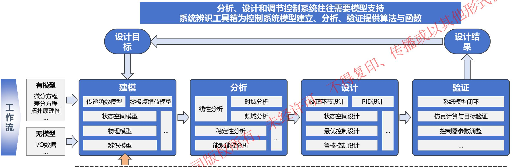

系统辨识工具箱为不具备模型或难以通过物理方法建模的控制系统设计、分析工作提供使用数据建立、分析与验证模型的方法，处于控制系统设计、分析调节工作流的前端，其功能涵盖：

➢ 数据准备：通过实际实验采集的信号与数据建立输入输出数据对象，同时支持对数据进行预处理，如去除数据内均值、对数据进行傅里叶变换等；
➢ 模型估计：支持通过时域或频域输入输出数据估计具备真实系统关键特征的模型，支持传递函数模型、状态空间模型、多项式模型等参数模型的估计，同时支持脉冲响应模型等非参数的估计；
➢ 模型分析：提供估计模型的时域或频域分析方法，如绘制模型的阶跃响应、绘制模型波德图等；
➢ 模型验证：为验证估计模型的质量提供工具，支持比较验证集数据与模型响应的输出、计算模型拟合度、残差分析等功能。

# 1 . 总 述

# 系统辨识即利用数据而非物理学建立动力学/控制系统模型的过程与方法

模型为真实系统的简化表示，包含系统关键特征，控制系统分析与设计的方法往往都需要已知的、确定的系统模型；如模型预测控制要求明确的系统模型；拥有明确的模型有助于设计系统状态扩张观测器等。通常有两种方法获得系统模型： 传播

# 从已知的物理规律出发，用数学推导的方式建立系统的数学模型 —— 物理推导建模

该类建模方法能较为全面的包含系统特征，但在实际应用中，往往缺少对真实系统 物理特性的全面了解，使得物理推导建模难以实际应用推广；

# 由实验数据建立系统的数学模型 系统辨识建模

建立模型有两种关键因素——结构与参数，当选定了合适的结构和参数时，可以模拟真实系统的关键特征，在同一输入信号下模型响应与真实系统输出数据能较大程度拟合，调整结构和参数使模型响应与真实数据尽可能拟合的过程，就是系统辨识。

系统辨识无需明晰系统结构的每一个细节，大的方便。

# 1 . 总 述

假设有一个动力学未知的系统，为一个典型的黑箱系统。使用输入信号激励系统，会得到被输入信号影响的系统输出，输入与输出数据存在某种关系；模型能尽可能模拟系统的关键动力学特征，也就是在不同的输入信号下，模型输出响应尽可能拟合系统真实 上述整个流程即为系统辨识的基本流程。

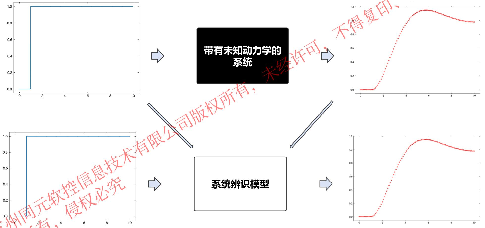

# 1 . 总 述

假设有一个动力学未知的系统 sys，为一个典型的黑箱系统。使用合适的输入信号激励系统，会得到系统输出，利用数据能估计出能模拟系统动力学的模型。接下来，我们将模拟使用数据估计具有系统关键动力学模型的流程。

首先，需要给定一个合适的系统输入信号，得到系统响应，该示例中，选择阶跃信号作为输入信号。

# 创建阶跃信号输入

$$
t = \text {c o l e c t} (0: 0. 0 1: 1 0)
$$

$$
u = \text {z e r o s} (1, \text {l e n g t h} (t))
$$

$$
u [ t. \geq 1 ] \cdot = 1
$$

# 阶跃信号下系统响应

$$
l s i m (s y s, u, t; c o l o r = " r e d")
$$

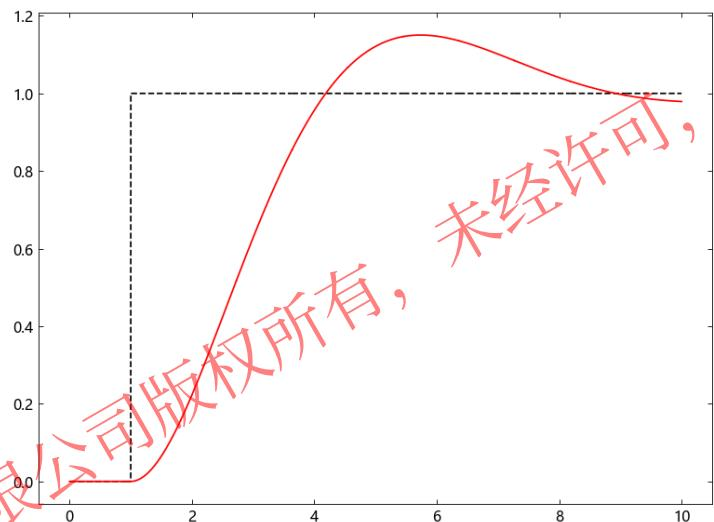
图1.1：系统阶跃响应

➢ 由系统响应可知系统为单输入输出系统；
➢ 系统看起来没有太多延迟；
➢ 系统响应存在超调；
➢ 系统稳态误差较小，零阶项几乎为零；
➢ 由上述分析，可以推断系统接近传递函数模型，为了模拟该系统，可以选择两个极点和不存在零点的传递函数模型作为估计模型结构。

接下来，对系统的阶跃响应进行简单参数。

# 1 . 总 述

使用典型的二阶传递函数模型作为模拟系统的初选模型，其中可调参数为模型固有频率 ?? 与模型阻尼比 ?? 。给定一组初值，观察并比较模型的响应与系统输出。

$$
G (s) = \frac {w ^ {2}}{s ^ {2} + 2 * z * w * s + w ^ {2}}
$$

初值：

$$
z = 1
$$

$$
w = 3
$$

使用iddata函数将输入信号生成数据对象，使用idtf函数创建初始模拟模型， 并使用lsim函数得到模型响应。

# 创建系统辨识数据对象

$$
T s = 0. 0 1
$$

$$
d a t a = i d d a t a ([ ], u, T s)
$$

输出：

IdData of length 1001 with 0 outputs and 1 inputs

# 创建初始数值传递函数辨识模型

$$
\text {m o d e l} = \text {i d t f} (9, [ 1; 6; 9 ])
$$

输出：

9

$$
s ^ {\wedge} 2 + 6 s + 9
$$

Delay: 0.0

连续时间传递函数辨识模型

# 阶跃数据下模型响应

$$
l s i m (m o d e l, d a t a)
$$

$$
h o l d \left(" o n"\right)
$$

$$
l s i m (s y s, u, t)
$$

$$
h o l d \left(" o f f "\right)
$$

legend("模型响应","阶跃信号","真实系统输 出")

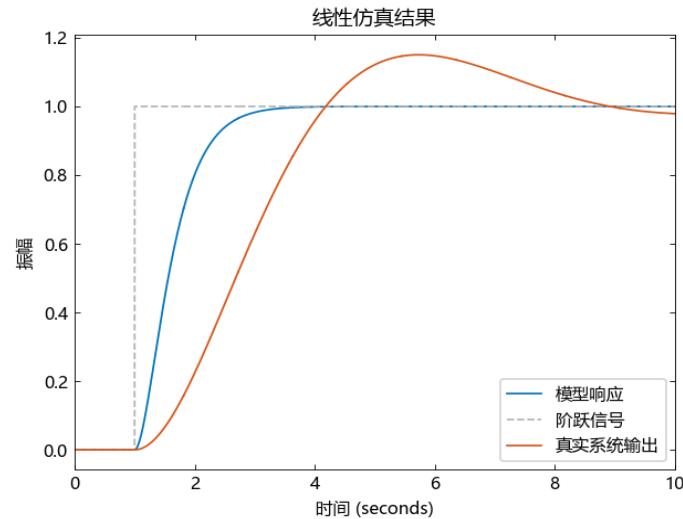

由模型响应与系统真实输出对比可以获知，目前的模型无法匹配真实系统的动力学特征， 因此需要进一步调整模型参数以匹配真实响应。

# 1 . 总 述

通过调整参数，比较响应，可以选取较好匹配系统动力学的模型参数。

# 阶跃数据下模型响应

$$
\text {m o d e l} = \operatorname {i d t f} (0. 6 4, [ 1; 0. 8 4; 0. 6 4 ])
$$

$$
l s i m (m o d e l, d a t a)
$$

$$
h o l d \left(" o n"\right)
$$

$$
l s i m (s y s, u, t)
$$

$$
h o l d \left(" o f f "\right)
$$

legend("模型响应","阶跃信号","真实系统输 出")

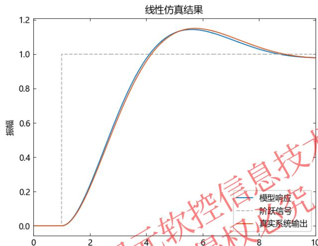
时间(seconds

选取合适的参数，可以较好的模拟真实系统动力学特征。但是通过试错找寻合适参数不适用于大部分场景，可以使用系统辨识工具箱相关函数直接找到合适参数；对于模型结构为传递函数的情况，可以使用tfest辨识模型：

# 使用tfest函数辨识模型

$$
\begin{array}{l} y, - = l s i m (s y s, u, t; f i g = \text {f a l s e}) \\ d a t a = i d d a t a (y, u, T s) \\ m o d e l = t f e s t (d a t a, 2, 0) \\ \end{array}
$$

输出：

0.6000000830547907

$$
1. 0 \mathrm {s} ^ {\wedge} 2 + 0. 8 0 0 0 0 0 1 0 5 3 1 7 2 3 1 5 \mathrm {s} + 0. 6 0 0 0 0 0 0 7 4 6 3 3 8 8 2 8
$$

$$
D e l a y: 0. 0
$$

连续时间传递函数辨识模型

# tfest辨识模型响应与真实输出对比

$$
\begin{array}{l} l s i m (m o d e l, d a t a) \\ h o l d \left(" o n"\right) \\ l s i m (s y s, u, t; l i n e s t y l e = ^ {\prime \prime} - ^ {\prime \prime}) \\ h o l d \left(" o f f "\right) \\ \end{array}
$$

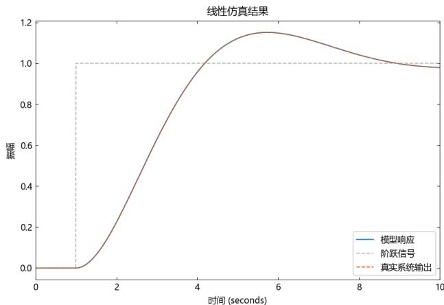

使用tfest函数，减少了试错的过程，简化了系统辨识的流程，并获得了更好效果的模型。

# Part 2

# 数据与估计

# 2. 数据与估计

在总述的示例中，我们了解了系统辨识的大致流程，并使用了iddata函数创建系统辨识数据对象，idtf函数创建了传递函数辨识模型，最后应用tfest函数通过数据进行了传递函数模型的自动辨识。系统辨识工具箱支持从数据对象模型的创建到通过数据辨识模型的系列函数： 数据或妙点

# 一. 数据创建与预处理

<table><tr><td>函数及调用方式</td><td>说明</td></tr><tr><td>data = data(data(y, [], Ts)</td><td>创建一个包含时域输出信号 y , 其中 Ts 为实验数据的采样时间。</td></tr><tr><td>data = data(data(y, u, Ts)</td><td>创建一个包含时域输出信号 y 和输入信号 u 的 data 对象, 其中 Ts 为实验数据的采样时间。</td></tr><tr><td>data = data(y, u, Ts, &quot;Frequency&quot;, w)</td><td>创建一个包含频域数据的对象。通常, w 为频率向量, y 和 u 是时域信号的离散傅立叶变换。</td></tr><tr><td>data_d, T_r = detrend(d, Type)</td><td>从时域数据对象中计算并减去指定趋势, 可指定平均趋势或线性趋势。</td></tr><tr><td>data = retrend(data_d, T)</td><td>通过将趋势信息T添加到 data_d 中的每个信号, 返回数据对象数据。</td></tr><tr><td>datf = fft(data)</td><td>使用快速傅立叶变换算法将时域数据对象数据转换为频域数据对象。</td></tr><tr><td>datf = fft(data, N)</td><td>使用快速傅立叶变换算法将时域数据对象数据转换为频域数据对象, 并制定变换长度 N。</td></tr><tr><td>data = fft(Datf)</td><td>将频域的 IdData 对象转换为时域对象。</td></tr></table>

# 2. 数据与估计

# 一. 数据创建与预处理

# 示例1：创建时域/频域数据对象

# 随机输入信号时域数据

y = randn(300,1)

data $=$ iddata(y,[])

data.Ts

data.u

IdData of length 300 with 1 outputs and 0 inputs

data.Ts =

data.u =

数据默认的采样时间为1s,如需指定采样时间，可调用iddata(y,u,Ts)

# 指定采样时间时域数据

y = randn(300,1)

$y \ =$ randn(300,1)

$\intercal \mathbf { s } ~ = ~ \boldsymbol { \Theta } . 1$

data $=$ iddata(y,u,Ts)

IdData of length 300 with 1 outputs and 1 inputs

系统辨识输入输出数据对象有多种属性，包括输入信号、输出信号、采样时间、时域数据时间向量、频域数据频域等。

# 查看或赋予输入输出数据对象属性

#查看采样时间

data.Ts

#查看数据输入输出通道数

size(data)

#改变数据对象采样时间

data.Ts = 2

Xrdata.Ts

julia> size(data)

julia> data.Ts 2

iddata同样支持频域信号数据对象的创建，调用

iddata(y,u,Ts,"Frequency",w)创建频域数据对象。

# 创建频域数据对象

y = fft(y)

u = fft(u)

w = collect(0.1:0.1:29.9)

data $=$

iddata(y,u,Ts,"Frequency",w)

data.Domain

data.Domain $=$

“Frequency”

# 2. 数据与估计

# 一. 数据创建与预处理

# 示例2：去除数据对象信号均值趋势

# 去除数据均值
# 创建随机信号

y = randn(300,1)

$\mathbf { u } \ =$ randn(300,1)

$\intercal \mathbf { s } ~ = ~ \boldsymbol { \Theta } . 1$

y = y .+ 10

$\mathrm { ~  ~ u ~ } = \mathrm { ~  ~ u ~ }$ . $+ 1 \Theta$

data $=$ iddata(y,u,Ts)

# 去除数据均值， 返回新数据与信息

data_d,Tr $=$ detrend(data)

# 结果存在随机情况

# 新数据均值

mean(data_d.OutputData) =

-2.1789977229976404e-15

# 趋势信息

Tr.InputOffset =

1-element Vector{Float64}:

10.065532350176692

detrend函数可以去除数据中输入输出信号的趋势，并返回去除的偏移值或斜率等相关信息；通过去除趋势，可以有效消除数据中信号的稳态偏差，有利于模型的估计。

# 示例3：数据对象的快速傅里叶变换与反变换

# 时域数据的傅里叶变换

# 创建随机信号

y = randn(300,1)

u = randn(300,1)

Ts = 0.1

data = iddata(y,u,Ts)

# 快速傅里叶变换

data_f = fft(data)

# 频域数据反傅里叶变换

data_r =

TySystemIdentificaiton.ifft(dat

fft函数与ifft函数能将对数据的输入输出信号分别做傅里叶变换和反傅里叶变换，实现时域频域数据互转，并计算相应的时间向量或频率向量。

# 2. 数据与估计

# 二. 辨识模型创建

<table><tr><td>函数及调用方式</td><td>说明</td></tr><tr><td>model =idf(num,den,Ts)</td><td>创建一个具有可辨识参数的传递函数辨识模型，并指定 numerator和 denominator参数。例如，对于传递函数所表示的连续时间SISO系统，输入参数 numerator和 denominator分别是和的系数，Ts为指定的离散系统采样时间。</td></tr><tr><td>model = idss(A,B,C,D,K,Ts)</td><td>创建一个具有可辨识系数的状态空间辨识模型，其中A、B、C、D为状态空间方程矩阵，K为状态扰动矩阵，Ts指定为离散系统采样时间，Ts=0时，系统为连续时间辨识模型。</td></tr><tr><td>model = idpoly(A,B,C,D,F,Ts)</td><td>创建一个具有可辨识参数的多项式辨识模型，A、B、C、D、F分别为多项式系统，根据不同情况可表示多种特定模型，如输出误差模型、Box-Jenkins模型等。</td></tr><tr><td>getpvec(model)</td><td>从模型中获取参数。</td></tr></table>

# 2. 数据与估计

# 辨识模型创建

# 示例4：创建传递函数辨识模型

# 创建传递函数辨识模型

$$
\begin{array}{l} \mathbf {n u m} = [ 1; 2 ] \\ d e n = [ 1; 3; 4 ] \\ m o d e l \_ c = i d t f (\text {n u m}, \text {d e n}) \\ m o d e l \_ d = i d t f (n u m, d e n, 0. 1) \\ \end{array}
$$

# 连续时间传递函数辨识模型

$$
\begin{array}{l} \text {m o d e l} _ {\mathrm {c}} = \\ s + 2 \\ \end{array}
$$

$$
s ^ {\wedge} 2 + 3 s + 4
$$

Delay: 0.0

连续时间传递函数辨识模型

# 离散时间传递函数辨识模型

$$
m o d e l \_ d =
$$

$$
z + 2
$$

$$
z ^ {\wedge} 2 + 3 z + 4
$$

Delay: 0.0

采样时间: 0.1 (seconds)

离散时间传递函数辨识模型

# 示例5：创建状态空间辨识模型

# 创建状态空间辨识模型

$$
A = \left[ - 1. 5 - 2; 1 0 \right];
$$

$$
B = [ 0. 5; 0 ];
$$

$$
C = [ \theta 1 ];
$$

$$
D = \theta ;
$$

$$
\operatorname {s y s} = \operatorname {i d s s} (A, B, C, D)
$$

# 创建带状态扰动的模型

$$
\begin{array}{l} K = [ 1; 2 ] \\ \operatorname {s y s} _ {k} = \operatorname {i d s s} (A, B, C, D, K, 0. 1) \\ \end{array}
$$

$$
\begin{array}{l} \text {s y s} = \\ A = \\ \begin{array}{c c} - 1. 5 & - 2. 0 \end{array} \\ \begin{array}{c c} 1. \theta & \theta . \theta \\ \hline \end{array} \\ B = \\ 0. 5 \\ \theta , \theta \\ C = \\ \begin{array}{c c} \theta . \theta & 1. \theta \end{array} \\ D = \\ 0. 0 \\ k = \\ 0. 0 \\ 0. 0 \\ \end{array}
$$

连续时间状态空间辨识模型

$$
\begin{array}{l} s y s _ {k} = \\ A = \\ \begin{array}{c c} - 1. 5 & - 2. 0 \end{array} \\ \begin{array}{c c} 1. \mathbf {0} & \mathbf {0}. \mathbf {0} \\ \hline \end{array} \\ B = \\ 0. 5 \\ 0. 0 \\ C = \\ \begin{array}{c c} \theta . \theta & 1. \theta \end{array} \\ D = \\ 0. 0 \\ k = \\ 1. 0 \\ 2. 0 \\ \end{array}
$$

采样时间(s): 0.1

离散时间状态空间辨识模型

# 示例6：创建多项式辨识模型

# 创建自回归移动-ARMAX模型

$$
A = \left[ \begin{array}{l l l} 1 & 5 & 6 \end{array} \right]
$$

$$
B = [ 4 6 ]
$$

$$
C = \left[ \begin{array}{l l l} 1 & 3 & 6 \end{array} \right]
$$

$$
\text {s y s} =
$$

$$
i d p o l y (A, B, C, [ 1. 0; ]; [ 1. 0; ]; 0. 1
$$

$$
\Supset
$$

$$
\text {s y s} =
$$

离散时间多项式模型: $\mathsf { A } ( z ) \mathsf { y } ( \ t ) = \mathsf { B } ( z ) \mathsf { u } ( \ t ) + \mathsf { C } ( z ) \mathsf { e } ( \ t )$

$$
A (z) = 1. \theta + 5. \theta z ^ {\wedge} - 1 + 6. \theta z ^ {\wedge} - 2
$$

$$
B (z) = 4. 0 + 6. 0 z ^ {\wedge} - 1
$$

$$
C (z) = 1. 0 + 3. 0 z ^ {\wedge} - 1 + 6. 0 z ^ {\wedge} - 2
$$

采样时间(s): 0.1

多项式阶数: na = 2 , nb = 2 , nc = 2 , nk = 0

# 2. 数据与估计

# 三. 模型估计

<table><tr><td>函数及调用方式</td><td>说明</td></tr><tr><td>model = tfest(data,np,nz)</td><td>使用时域/频域数据估计传递函数模型，data为IdsData数据对象，np指定模型极点数量，nz指定模型零点数量；当不输入零点数时，自动选择比极点数量少一的零点数量。</td></tr><tr><td>model = n4sid(data,n)</td><td>使用数据，应用子空间辨识算法估计状态空间辨识模型，返回的模型为离散时间状态空间模型，n为模型阶数。</td></tr><tr><td>model = ssest(data,n)</td><td>使用IdsData数据对象应用预报误差最小化算法估计状态空间辨识模型，返回为连续时间状态空间模型，n为模型阶数。</td></tr><tr><td>model = armax(data,na,nb,nc,nk)</td><td>使用数据估计自回归平移模型，返回为多项式模型Idpoly对象，其中na、nb、nc为模型阶数，nk为输入延迟。</td></tr><tr><td>model = oe(data,nb,nf,nk)</td><td>使用数据估计输出误差模型，返回为多项式模型Idpoly对象，其中nb、nf为模型阶数，nk为输入延迟。</td></tr><tr><td>model = bj(data,nb,nc,nd,nf,nk)</td><td>使用数据估计Box-Jenkins模型，返回为多项式模型Idpoly对象，其中nb、nc、nd、nf为模型阶数，nk为输入延迟。</td></tr><tr><td>model = polyest(data,na,nb,nc,nd,nf,nk)</td><td>使用数据估计多项式模型，返回为多项式模型Idpoly对象，其中na、nb、nc、nd、nf为模型阶数，nk为输入延迟。</td></tr><tr><td>model = impulseest(data,n)</td><td>通过拟合n阶FIR模型来估计系统脉冲响应。</td></tr><tr><td>model = spa(data)</td><td>使用频谱分析法估计频率响应模型。</td></tr></table>

# 2. 数据与估计

# 三. 模型估计

# 示例7：传递函数模型辨识

# 加载数据

load(pkgdir(TySystemIdentification)*"/examples/resources/z1.jl")

# 选定模型零极点估计模型

$n p = 2$

$\mathsf { n } z \ = \ 1$

model $=$ tfest(data,np,nz)

# 连续时间传递函数辨识模型

2.4554283190047097s + 176.98517623129524

1.0s^2 + 3.162498375400349s $^ +$ 23.16307597367161

Delay: 0.0

连续时间传递函数辨识模型

# 示例8：状态空间模型辨识

# 加载数据

load(pkgdir(TySystemIdentification)*"/examples/resources/z1.jl")

# 选定模型阶数估计模型

n = 2

model_d $=$ n4sid(data,n)

model_c $=$ ssest(data,n)

model_d =

A =

0.8654836773023451 0.35558106528490857

-0.4397545177429549 0.6485418103747511

B =

0.021048452934602252

0.03508494645687935

C =

72.79040433473675 -16.6540622047835

D =

0.0

K =

0.006563752363496491

-0.006759107067002004

采样时间(s): 0.1

离散时间状态空间辨识模型

model_c =

A =

-0.23224318093223686 4.288425368888051

-5.332141083094587 -2.917729207866554

B =

0.12923469312041103

0.43826048258686007

${ \textsf { C } } =$

72.79031685830054 -16.65389547730896

$\textsf { D } =$

0.0

$\textsf { k } =$

0.06415889787248205

-0.08638910418216976

连续时间状态空间辨识模型

# 2. 数据与估计

# 三. 模型估计

# 示例9：多项式模型模型辨识

# oe模型辨识

# 加载数据

load(pkgdir(TySystemIdentification)*"/examples/resources/z1.jl")

# 选定模型阶数估计输出误差模型

nb = 2

$n \mathbf { \ell } = \mathbf { \ell } 2$

$\mathsf { n k } = \mathsf { 1 }$

model $=$ oe(data,nb,nf,nk)

model $=$

离散时间多项式模型: $y ( t ) ~ = ~ [ 8 ( z ) / [ F ( z ) ] \mathsf { u ( t ) } ~ + ~ \mathsf { e ( t ) } ~ $

B(z) = 0.9915562323026462z^-1 + 0.49904342584892086z^-2

F(z) = 1.0 - 1.5330448734596784z^-1 + 0.7279770023615452z^-2

采样时间(s): 0.1

多项式阶数: nb = 2 , nf = 2 , nk = 1

# armax模型辨识

# 加载数据

load(pkgdir(TySystemIdentification)*"/examples/resources/z1.jl")

# 选定模型阶数估计自回归平移模型

na = 2

nb = 2

nc = 2

nk = 1

model = armax(data,nb,nf,nk)

model =

离散时间多项式模型: $\mathsf { A } ( z ) \mathsf { y } ( \ t ) = \mathsf { B } ( z ) \mathsf { u } ( \ t ) + \mathsf { C } ( z ) \mathsf { e } ( \ t )$

A(z) = 1.0 - 1.5199419944847241z^-1 + 0.7200800015822012z^-2

B(z) = 0.9310546880732662z^-1 + 0.5449605791723678z^-2

C(z) = 1.0 - 0.9011257319756902z^-1

采样时间(s): 0.1

多项式阶数: na = 2 , nb = 2 , nc = 1 , nk = 1

# Part 3

# 分析与验证

# 3. 分析与验证

在总述的示例中，我们使用tfest函数估计了在阶跃输入下的响应，极好拟合了系统真实输出的传递函数模型。但如果更换了输入数据，模型的响应还能跟真实系统有相当好的拟合吗？让我们用随机信号尝试验证。

# 创建随机信号

$$
\begin{array}{l} u = i d i n p u t (1 0 0 1, " s i n e") \\ \mathbf {p l o t} (t, u) \\ d a t a = i d d a t a ([ ], u, 0. 0 1) \\ \end{array}
$$

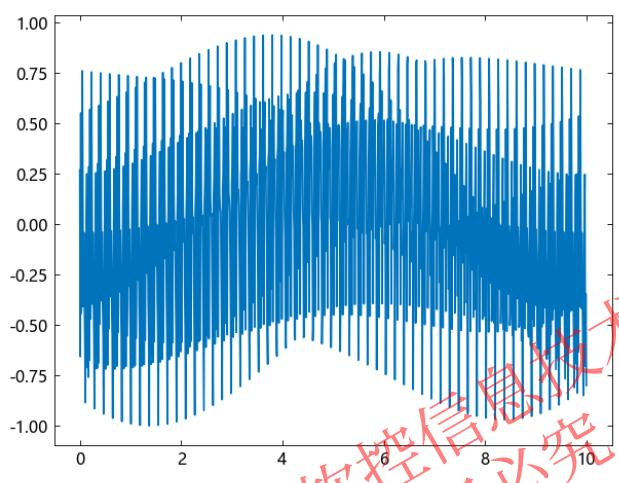

# 比较模型响应与系统真实输出

$$
\begin{array}{l} l s i m (m o d e l, d a t a) \\ h o l d \left(" o n "\right) \\ l s i m (s y s, u, t; l i n e s t y l e = ^ {\prime \prime} - - ^ {\prime \prime}) \\ h o l d \left(" o f f "\right) \\ \begin{array}{l} \text {l e g e n d} \left(\text {" 模 型 响 应 "}, \text {" 阶 跃 信 号 "}, \text {" 真 实 系 统 输 出 "}\right) \end{array} \\ \end{array}
$$

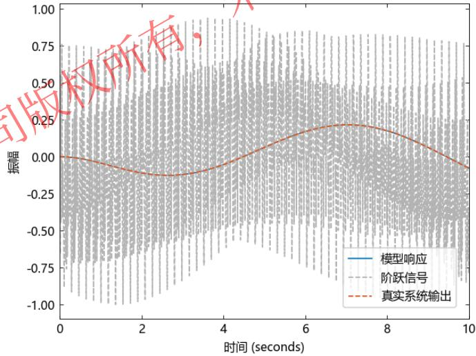
线仿真结果

在新的随机信号输入下，估计的传递函数模型响应依然能极大程度的拟合真实系统输出；在不同的输入信号下，如模型响应均能很好的拟合真实系统输出，则证明了模型具备了系统的动力学的特征，也就是说模型辨识质量较高。除了拟合度外，还可以从模型时域特性、频域特性、残差相关性等方面分析验证模型的辨识质量。

系统辨识工具箱支持模型的分析与验证方法，提供能够量化模型辨识质量、分析模型特性的函数工具。

# 3. 分析与验证

# 分析与验证

<table><tr><td>函数及调用方式</td><td>说明</td></tr><tr><td>bode(model)</td><td>为辨识模型绘制伯德图。</td></tr><tr><td>step(model)</td><td>绘制辨识模型的阶跃响应图。</td></tr><tr><td>predict(model,data,K)</td><td>预测模型在数据激励下的K步输出响应，绘制响应或返回预测响应数据。</td></tr><tr><td>sim(model,data)</td><td>计算模拟辨识模型的响应，绘制响应或返回响应数据。</td></tr><tr><td>pe(model,data)</td><td>计算模型预测响应与真实数据输出的差值。</td></tr><tr><td>compare(data,data)</td><td>比较模型响应与真实数据输出，绘制比较图，返回响应数据，计算模拟拟合度。</td></tr><tr><td>resid(model,data)</td><td>计算辨识模型响应的残差及残差相关性，包括自相关性与真实输出数据的互相关性，绘制相关性图。</td></tr><tr><td>ps,wout = spectrum(sys,data)</td><td>计算模型输出功率谱或线性输入/输出模型的扰动谱。</td></tr></table>

# 3. 分析与验证

# 分析与验证

# 示例10：绘制辨识模型伯德图

# 辨识传递函数模型

load(pkgdir(TySystemIdentification)*"/examples/resources/z2.jl")

$n p = 2$

$\mathsf { n } z \ = \ 1$

model $=$ tfest(data,np,nz)

# 绘制模型伯德图

bode(model)

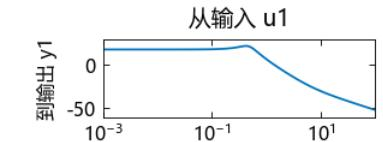
伯德图

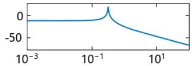
从输入u2

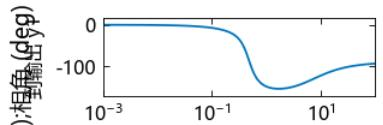

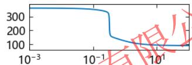

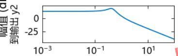

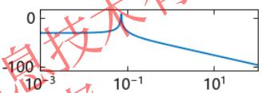

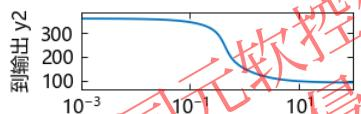

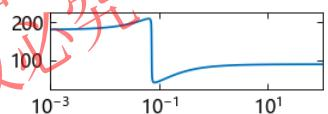
频率[rad/s]

# 示例11：绘制模型响应图

# 辨识状态空间模型

load(pkgdir(TySystemIdentification)*"/examples/resources/z1.jl")

n = 2

model = n4sid(data,n)

# 绘制模型响应图

sim(model,data)

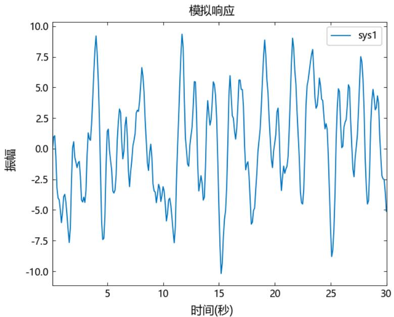

# 3. 分析与验证

# 分析与验证

# 示例12：比较模型响应与系统输出

# 辨识传递函数模型

load(pkgdir(TySystemIdentification)*"/examples/resources/z1.jl")

np = 2

model $=$ tfest(data,np)

# 绘制比较图,返回拟合度

compare(data,model)

_,fit,_ = compare(data,model;fig $=$ false)

fit = 70.77195906483973

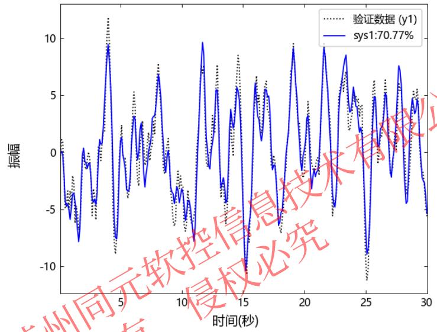
模拟响应比较

# 示例13：模型残差相关性

# 辨识状态空间模型

load(pkgdir(TySystemIdentification)*"/examples/resources/z1.jl")

n = 2

model = n4sid(data,n)

# 绘制模型残差相关性图

resid(model,data)

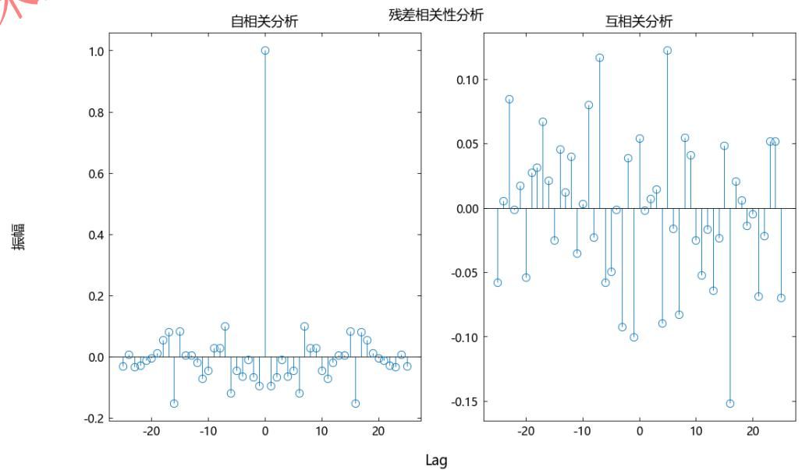

# Part 4

# 综合示例

# 4. 综合示例

系统辨识的工作流由数据收集创建开始，经过数据预处理，通过系统分析选择合适的模型结构，进行模型估计，得到验证辨识质量，由结果决定模型是否符合应用标准。

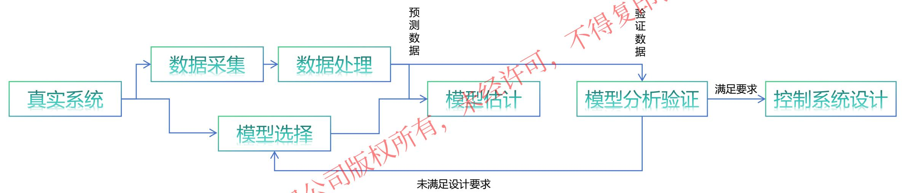

# 4. 综合示例

接下来将展示一个示例，展示从对模型的一个描述开始，学习如何将数据导入工具箱并对其进行预处理，然后系统地估计参数和非参数模型，从真实数据估计分析简单模型。

# 系统描述：

本案例研究涉及从实验室规模的“吹风机”收集的数据。该过程的工作原理如下：空气通过一根管子扇动，并在入口处加热。空气温度由出口处的热电偶测量。输入是加热装置上的电压，加热装置只是一个电阻丝网。输出是由测量的热电偶电压表示的出口空气温度。

# $\textcircled{1}$ 设置分析数据

```txt
加载输入输出数据
load(pkgdir(TySystemIdentification) * "/examples/resources/z2.jl")
# 创建系统辨识数据对象IdData
dry = iddata(y2, u2, 0.08)
# 分隔预测集ze与测试集zv
ze = dry[1:300]
zv = dry[800:900]
```

```txt
dry =
IdData of length 1000 with 1 outputs and 1 inputs
ze =
IdData of length 300 with 1 outputs and 1 inputs
zv =
IdData of length 101 with 1 outputs and 1 inputs
```

# 4. 综合示例

# ② 数据预处理

该数据输出向量y2包含1000个热电偶电压测量值，该电压与出口气流中的温度成正比。矢量u2包含1000个输入数据点，由施加到加热器的电压组成。输入是以二进制随机序列的形式生成的，该序列以0.2的概率从一个级别切换到另一个级别，采样时间为0.08秒。分隔出300样本的预测集用于估计模型与101样本的测试集数据用于验证估计模型质量；数据并非零均值，因此，去除分割出的数据进行去除常数水平均值趋势。

# 去除数据均值

$$
z e _ {1 -} = \text {d e t r e n d} (z e);
$$

$$
z v _ {1 -} = \text {d e t r e n d} (z v);
$$

# ③ 状态空间模型估计

现在数据集已经去趋势化，没有明显的异常值。进行参数估计的最为简单的方法之一是构建一个状态空间辨识模型，可以使用ssest函数应用预报误差最小化方法估计状态空间辨识模型：

# 状态空间模型估计

$$
s y s \_ s s = s s e s t (z e, 2)
$$

```txt
sys_ss =
A =
-1.6274010870850595 1.6439321779067662
-3.9074725558313212 -2.9619226247118977
B =
-0.03276201599568354
0.33593829460575325
C =
23.582747415471918 0.11789184524476894
D =
0.0
K =
0.5500568210423382
0.5833622877271966
```

连续时间状态空间辨识模型连续时间状态空间辨识模型

# 4. 综合示例

# 模型时频域分析

由数据估计了状态空间辨识模型，可以对该模型进行简单的时频域分析，此处我们选择绘制模型的阶跃响应图与伯德图。

# 绘制阶跃响应图

step(sys_ss)

# 绘制伯德图

bode(sys_ss)

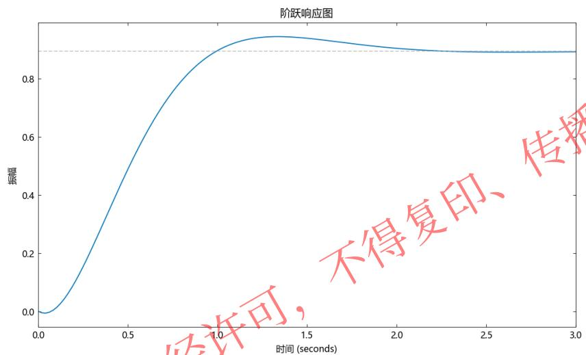
阶跃响应图

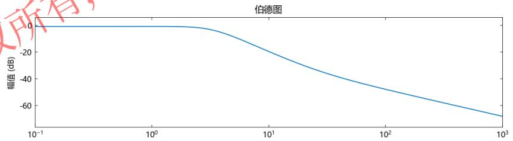

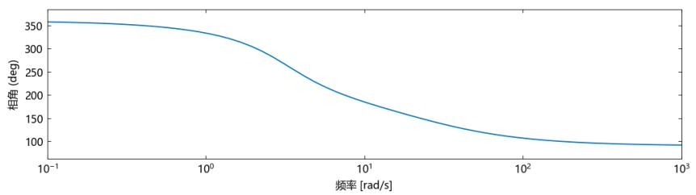
bode图

# 4. 综合示例

# 更新模型并比较输出

根据对模型的动力学特征的了解，估计模型时可以选择传递函数模型，选取三个极点一个零点的传递函数模型，并比较新模型与传递函数模型在验证集数据下同真实系统输出数据的差异与拟合度。 暖可

# 估计传递函数辨识模型

$$
\text {s y s} _ {\text {t f}} = \text {t f e s t} (z e, 3, 1)
$$

sys_tf =

```txt
-13.288315569908127s + 184.79903493463613
```

1.0s^3 + 13.554111968326213s^2 $^ +$ 101.02290536515689s + 197.4846364919181

Delay: 0.0

连续时间传递函数辨识模型

比较两种模型在验证集激励下的响应与真实系统数据的差异，并返回拟合度。

# 比较模型响应与系统数据

compare(zv,sys_ss,sys_tf)

# 4. 综合示例

# $\textcircled{5}$ 更新模型并比较输出

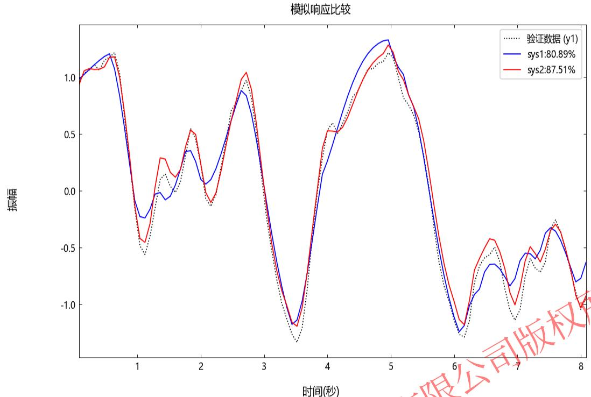

$8 7 . 5 1 \%$ ，从图中可以看出，阶状态空间辨识模型。

在真实应用中，通过先决的物理学知识或经验，选择合适的模型结构是很重要的，如系统的时频域分析获取部分结构信息以选取模型结构。型结构与合适的模型参数以使得模型更多的包含真实系统的动力学特征，能为控制系统分析与设计提供可靠的模型支持。

建立知识规范， 营造协同生态

积累工业模型， 发展可控平台

融入中国创新， 打造先进软件

# 感谢聆听
