# Syslab鲁棒控制工具箱

- Source: `MWORKS高校星火计划资料包/培训课程配套材料/01-官网课程配套材料/02-控制系统设计与应用/04-鲁棒控制工具箱应用/01-2024b/Syslab控制系统之鲁棒控制工具箱.pdf`
- Converted by: `MinerU precise API`
- Conversion date: `2026-05-08`
- Review status: `MinerU converted; spot check recommended`
- Priority: `P1`
- Source SHA1: `cd7d6d4bc75f`
- MinerU batch id: `a9a9bbe2-8994-4792-b2dd-d812cb705397`
- Images: `123`
- Notes: 鲁棒控制分析和设计方法。

# Syslab控制系统之

# 鲁棒控制工具箱

孙懿诚

苏州同元软控信息技术有限公司

2025年5月23日


TONGYUAN

# 课程须知

# 本课程课程目标：

本课程介绍鲁棒控制基本定义与工作流程，介绍Syslab控制系统系列工具箱中的鲁棒控制工具箱相关功能、函数用法及工作流程。

本课程基于云化版本：Syslab2024b构建

学习本课程之前需要学习：

Syslab基本功能

Julia语法

Syslab控制系统工具箱

自动控制原理等专业知识

运行本课程案例需要预加载以下工具箱：

➢ TyBase、TyMath、TyPlot、TyControlSystems、TyRobustControl

本课程内代码为伪代码，具体示例见附件：鲁棒控制示例

# CONTENTS

# 目录

# Part

鲁棒控制工具箱功能概况

# Part 2

不确定模型创建

# Part 3

不确定系统分析

# Part 4

鲁棒控制器设计

# Part 5

系统模型与控制器简化

# Part 6

线性矩阵不等式

# Part 1

# 鲁棒控制工具箱功能概况

# 1. 鲁棒控制工具箱功能概述

# 1 不确定模型创建

• 不确定元素
• 不确定模型构造
• 不确定模型属性
• 不确定模型连接

# 2 不确定模型分析

• 盘稳定裕度分析
• 鲁棒性分析
• 蒙特卡洛分析

# 3 鲁棒控制器设计

• 回路成形设计
• H∞ 综合
• μ 综合

# 系统模型与控制器简化

• 平衡截断
• Hankel 奇异值
• 模态分解

# 5 线性矩阵不等式

• 定义
• 求解
• 分析

# Part 2

# 不确定模型创建

# 2.1 不确定模型创建 - 不确定元素和模型

在实际控制系统中，被控对象的数学模型往往带有未建模动态、近似参数等不确定因素。

Syslab 目前提供以下函数用于创建不确定元素和不确定模型：

<table><tr><td>函数及调用方式</td><td>说明</td></tr><tr><td>uss</td><td>创建不确定状态空间（ss）模型</td></tr><tr><td>ureal</td><td>创建不确定实数</td></tr><tr><td>ucomplex</td><td>创建不确定复数</td></tr><tr><td>ucomplexm</td><td>创建不确定复矩阵</td></tr><tr><td>ultidyn</td><td>创建不确定线性定常（LTI）动力学模型</td></tr><tr><td>umargin</td><td>创建不确定的增益及相位模块</td></tr><tr><td>umat</td><td>创建不确定矩阵</td></tr><tr><td>ucover</td><td>响应集的不确定模型拟合</td></tr><tr><td>randatom</td><td>生成随机的不确定元素对象</td></tr><tr><td>randumat</td><td>生成随机不确定矩阵</td></tr><tr><td>randuss</td><td>生成随机且稳定的不确定状态空间模型</td></tr><tr><td>diag</td><td>提取不确定矩阵对角线元素</td></tr></table>

详细用法请参考 Syslab 鲁棒控制工具箱帮助文档

# 2.1 不确定模型创建 - 不确定元素和模型

# 示例1.1：创建含有不确定实数和不确定复数的不确定矩阵

# 标称值为 5，变化范围为 [2,6] 的不确定实数

a = ureal("a",5,Range=[2,6]);

# 标称值为 1，变化率为 [-10%,10%] 的不确定实数

b = ureal("b",1,Percentage=10);

# 标称值为 3+4im，变化半径为 0.1 的不确定复数

c = ucomplex("c",3+4im,Radius=0.1);

# 不确定元素与确定元素拼接成不确定矩阵

M = [a b;b*a 7;c-a b^2];


julia> a

不确定实数 "a" ，标称值 5 ，变化范围 [2, 6] 。

julia> b

不确定实数 "b" ，标称值 1 ，变化量 [-10, 10]% 。

julia> c

标称值为 3 + 4im ，变化半径为 0.1 的不确定复数 "c"

julia> M.NominalValue

3×2 Matrix{Complex{Int64}}:

5+0im 1+0im

5+0im 7+0im

-2+4im 1+0im

julia> get(M)

NominalValue: Complex{Int64}[5 $^ +$ 0im 1 + 0im; 5 + 0im 7 + 0im; 3 + 4im 1 + 0im]

Uncertainty: 3-entry Dict

SamplingGrid: 0-entry Dict

Name: ""

# 示例1.2：创建不确定状态空间模型

# ①.方法1：基于不确定元素创建不确定模型

# 创建不确定元素

$$
p 1 = \text {u r e a l} \left(" p 1", 1 0, \text {P e r c e n t a g e} = 5 0\right);
$$

$$
p 2 = \text {u r e a l} \left(" p 2", 3, \text {P l u s M i n u s} = [ - 0. 5, 1. 2 ]\right);
$$

# 创建不确定矩阵

$$
A = \left[ \begin{array}{l l l} - p 1 & p 2; & \theta & - p 1 \end{array} \right];
$$

$$
B = \left[ - p 2; p 2 \right];
$$

$$
C = \operatorname {u m a t} ([ 1 0; 1 1 ])
$$

$$
D = \operatorname {u m a t} ([ 0; 0 ])
$$

# 创建不确定状态空间模型

$$
u s y s = s s (A, B, C, D);
$$


julia> usys.NominalValue

A =

-10 3

0 -10

$\textsf { B } =$

$^ { - 3 }$

3

${ \textsf { C } } =$

1 0

1 1

$\textsf { D } =$

0

0

# 连续时间状态空间模型

julia> usys.Uncertainty

Dict{Any, Any} with 2 entries:

$" { \mathsf { p } } 2 " \Rightarrow$ 不确定实数 "p2" ，标称值 3 ，变化量 [-0.5, 1.2] 。

"p1" => 不确定实数 "p1" ，标称值 10 ，变化量 [-50, 50]% 。

②．方法2：直接将确定模型转

# 化为不确定模型

# 创建状态空间模型

A = [-10 3; 0 -10];

$\textsf { B } = \ [ - 3 \thinspace \vdots \  \ 3 ]$

$\textsf { C } = \ [ 1 \ \Theta ; \ 1 \ 1 ]$

D = [0; 0];

sys $=$ ss(A,B,C,D)

# 转化为对应的不确定模型

usys $=$ uss(sys)


julia> usys.NominalValue

$\tt { A } =$

-10 3

0 -10

$\textsf { B } =$

$^ { - 3 }$

3

${ \textsf { C } } =$

0

1 1

$\textsf { D } =$

0

0

连续时间状态空间模型

julia> usys.Uncertainty

Dict{Any, Any}()

通过该方法创建的不确定模型

# 不包含任何不确定元素

# 2.2 不确定模型创建 - 不确定模型属性

Syslab目前提供以下函数用于获取或更改不确定对象的属性：

<table><tr><td>函数及调用方式</td><td>说明</td></tr><tr><td>getNominal</td><td>不确定模型的标称值</td></tr><tr><td>uscale</td><td>缩放模块的不确定度</td></tr><tr><td>actual2normalized</td><td>将实际值转换为标准化值</td></tr><tr><td>normalized2actual</td><td>将归一化坐标中原子的值转换为相应的实际值</td></tr><tr><td>getLimits</td><td>不确定参数（UReal）的有效范围</td></tr><tr><td>isuncertain</td><td>检查参数是否是不确定的类型</td></tr><tr><td>lftdata</td><td>将不确定模型分解为确定部分和归一化不确定部分</td></tr></table>

这些函数用法比较简单，因此不再举例说明，详细用法请参考Syslab鲁棒控制工具箱帮助文档

# Part 3

# 不确定系统分析

# 3.1 不确定系统分析- 基于圆盘的增益裕度和相位裕度

# 一. 盘稳定裕度（diskmargin）

 稳定裕度 (stability margin) VS 盘稳定裕度 (disk margin)

经典稳定裕度仅适用于SISO系统，且将相位和幅值分开考虑；盘稳定裕度能够应用于SISO系统和MIMO系统，且能够同时考虑相位和幅值。

 反馈回路的盘稳定裕度实现步骤如下：

1. 构建增益和相位不确定性模型

$\textcircled{1}$ 对于SISO系统?? ，基于盘稳定裕度分析的不确定模型中包含一个复不确定性 $F$ ，作为乘积摄动代入回路传递函数中。??的表达式如下：

$$
F _ {j} = \frac {1 + \alpha [ (1 - \sigma) / 2 ] \delta_ {j}}{1 - \alpha [ (1 + \sigma) / 2 ] \delta_ {j}}
$$

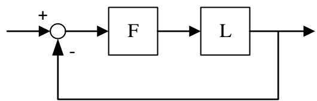

式中：

⚫ ??是一个增益有界动态不确定性，归一化数值只在单位圆盘内变化，即 $| \delta | < 1 .$ 。
⚫ ??设置模型??的增益和相位变化量。当参数 $\cdot \sigma$ 固定， $\alpha$ 控制的就是圆盘的大小。当 $\alpha = 0$ 时，乘子??为1，传递函数对应标称值??。
⚫ ??称为偏斜度，使模型的不确定性偏向增益增加或增益减少。

$\textcircled{2}$ 对于MIMO系统，模型允许不确定性在每个通道中单独变化：

$$
F _ {j} = \frac {1 + \alpha [ (1 - \sigma) / 2 ] \delta_ {j}}{1 - \alpha [ (1 + \sigma) / 2 ] \delta_ {j}}
$$

该模型将MIMO开环响应??替换为 $L * F$ ，其中

$$
F = \left( \begin{array}{c c c} F _ {1} & 0 & 0 \\ 0 & \ddots & 0 \\ 0 & 0 & F _ {N} \end{array} \right)
$$

# 3.1 不确定系统分析- 基于圆盘的增益裕度和相位裕度

# 一. 盘稳定裕度（diskmargin）

# 2. 基于圆盘分析法计算稳定裕度

给定的偏斜度 $\sigma$ ，当闭环系统单位负反馈对所有的??稳定时，盘裕度最大。为了求出这个值，diskmargin()求出最大的 $\alpha$ ，使得闭环系统对不确定性圆盘 $\Delta ( \alpha , \ \sigma )$ 中的所有??都稳定。

$$
\Delta (\alpha , \sigma) = \left\{F = \frac {1 + \alpha [ (1 - \sigma) / 2 ] \delta}{1 - \alpha [ (1 + \sigma) / 2 ] \delta}, | \delta | <   1 \right\}
$$

$\textcircled{1}$ 对于SISO系统，鲁棒稳定性分析可以得到

$$
\alpha_ {\mathrm {m a x}} = \frac {1}{| | S + (\sigma - 1) / 2 | | _ {\infty}}
$$

其中，??是灵敏度函数 $( 1 + L ) ^ { - 1 }$ 。

$\textcircled{2}$ 对于MIMO系统，鲁棒稳定性分析可以得到

$$
\alpha_ {\max } = \frac {1}{\mu_ {\Delta} \left(S + \frac {(\sigma - 1) I}{2}\right)}
$$

其中， $\mu \Delta$ 是对角线结构的结构化奇异值(mussv)

$$
\Delta = \left( \begin{array}{c c c} \delta_ {1} & 0 & 0 \\ 0 & \ddots & 0 \\ 0 & 0 & \delta_ {N} \end{array} \right)
$$

$\delta _ { \mathrm { j } }$ 是每个????的归一化不确定性。

➢ P. Seiler, A. Packard and P. Gahinet, "An Introduction to Disk Margins [Lecture Notes]," in IEEE Control Systems Magazine, vol. 40, no. 5, pp. 78-95, Oct. 2020, doi: 10.1109/MCS.2020.3005277.

# 3.1 不确定系统分析- 基于圆盘的增益裕度和相位裕度

# 一. 盘稳定裕度（diskmargin）

# 示例3.1：计算MIMO反馈回路的盘稳定裕度

给定如下图所示双通道MIMO反馈回路，分别计算一次回路的盘稳定裕度和多次回路的盘稳定裕度。

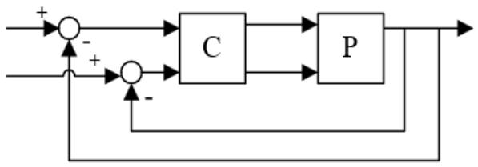

计算被控对象的输出盘稳定裕度，被控对象输出端的负反馈开环响应为 $L o = P C$ 。

$$
a = [ 0 1 0; - 1 0 0 ]
$$

$$
b = e y e (2)
$$

$$
c = [ 1 1 0; - 1 0 1 ]
$$

$$
P = s s (a, b, c, 0)
$$

$$
C = s s ([ 1 - 2; 0 1 ])
$$

$$
\mathsf {L} \mathsf {0} = \mathsf {P} * \mathsf {C}
$$

# DMo 数组储存一次回路盘稳定裕度

# MMo 储存多次回路盘稳定裕度

$$
D M O, M M O = \text {d i s k m a r g i n} (L o)
$$

$\textcircled{1}$ 两反馈通道一次回路盘稳定裕度：输出结果非常好（无限增益裕度和 $9 0 ^ { \circ }$ 相位裕度）。

```txt
julia> DMo[1] julia> DMo[2]
Disk margin with: Disk margin with:
GainMargin: [0.0, Inf] GainMargin: [0.0, Inf]
PhaseMargin: [-90.0, 90.0] PhaseMargin: [-90.0, 90.0]
DiskMargin: 2.0 DiskMargin: 2.0
Frequency: Inf rad/s, Inf Hz Frequency: 0.0 rad/s, 0.0 Hz
DelayMargin: 0.0 s DelayMargin: Inf s
Skew: 0 Skew: 0
WorstPerturbation: Inf + 0.0im WorstPerturbation: 0.0 - 0.0im
```

$\textcircled{2}$ 多次回路盘稳定裕度：考虑了两个反馈回路中独立和并发的增益/相位变化。输出结果就更加现实的评估。

```txt
julia>MMo
Disk margin with:
GainMargin:[0.6834,1.4633]
PhaseMargin：[-21.3031，21.3031]
DiskMargin:0.3762
Frequency:0.0 rad/s，0.0 Hz
DelayMargin:371808.7261s
Skew:0
WorstPerturbation:missing
```

# 3.1 不确定系统分析- 基于圆盘的增益裕度和相位裕度

# 二. 与盘稳定裕度相关的其余函数

在基于圆盘法的不确定系统分析中，圆盘大小、偏斜度、增益变化、相位变化之间的转换关系存在如图所示4个函数：

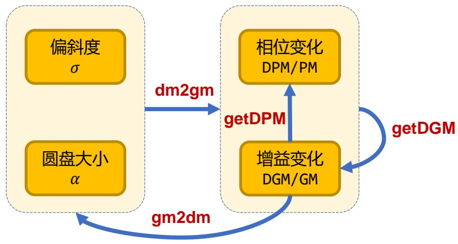

<table><tr><td>函数及调用方式</td><td>说明</td></tr><tr><td>DGM = getDGM(GM,PM,&quot;tight&quot;)</td><td rowspan="3">将增益和相位变化转换为基于圆盘的增益变化</td></tr><tr><td>DGM = getDGM(GM,PM,&quot;balanced&quot;)</td></tr><tr><td>DGM,DPM = getDGM(____)</td></tr><tr><td>DPM = getDPM(DGM)</td><td rowspan="2">将基于圆盘的增益变化转换为基于圆盘的相位变化</td></tr><tr><td>DPM = getDPM(GM)</td></tr><tr><td>GM,PM = dm2gm(alpha)</td><td rowspan="2">将圆盘大小和偏斜度转换为基于圆盘的增益和相位变化</td></tr><tr><td>DGM,DPM = dm2gm(alpha,sigma)</td></tr><tr><td>alpha,sigma = gm2dm(DGM)</td><td rowspan="2">将基于圆盘的增益裕度转换为圆盘大小和偏斜度</td></tr><tr><td>alpha,sigma = gm2dm(GM)</td></tr></table>

# 3.2 不确定系统分析- 正规化互质分解

 互质性：若两个多项式没有阶次大于等于 1 的公因子，则称这两个多项式是互质的。
 最小实现：传递函数的一个具有可能的最小维度的实现，需要满足分子多项式和分母多项式的互质性（即没有零极点相消）。

正规化互质分解是利用正规化互质因子进行计算的第一步，在后续的模型简化(reducespec)和控制器合成(ncfsyn)中均有需要。

# 一. 正规化左互质分解（lncf）

计算动态系统模型的正规化左互质分解。因式分解为：

$$
s y s = M _ {l} ^ {- 1} N _ {l}, \quad M _ {l} M _ {l} ^ {*} + N _ {l} N _ {l} ^ {*} = I
$$

式子中， ${ M _ { l } } ^ { * }$ 表示 $M _ { l }$ 的共轭。lncf返回稳定系统的最小状态空间实现 $[ M _ { l } , N _ { l } ]$ ，及互质因子 $M _ { l }$ 和 $N _ { l }$ 。

# 二. 正规化右互质分解（rncf）

计算动态系统模型的正规化右互质分解。因式分解为：

$$
s y s = M _ {l} ^ {- 1} N _ {l}, \quad M _ {l} M _ {l} ^ {*} + N _ {l} N _ {l} ^ {*} = I
$$

式子中， ${ M _ { r } } ^ { * }$ 表示 $M _ { r }$ 的共轭。rncf返回稳定系统的最小状态空间实现 $[ M _ { r } ; N _ { r } ]$ ，及互质因子 ${ \cdot } M _ { r }$ 和 $| N _ { r }$ 。

示例3.2：计算SISO系统的正规化左互质分解

$$
G (s) = \frac {(s - 1) (s ^ {2} + 2 s + 5)}{(s + 1) (s ^ {2} - 4 s + 5)}
$$

$\textcircled{1}$ 计算分解因子：

$$
\begin{array}{l} \text {s y s} = z p k ([ 1 - 1 + 2 i m - 1 - 2 i m ], [ - 1 2 + 1 i m 2 - 1 i m ], 1); \\ \text {f a c t}, M l, N l = l n c f (s y s); \end{array}
$$

$\textcircled{2}$ 检验分解因子：因子Ml和Nl的分子分别是sys的分母和分子。因此，sys=Ml\Nl成立。

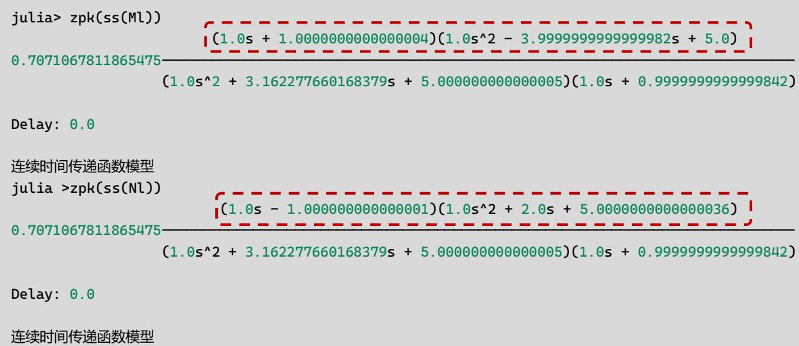

$\textcircled{3}$ 证实分解性质：系统 $[ M _ { l } ( j \omega ) , N _ { l } ( j \omega ) ]$ ]在所有频率 下 都是 单 位向 量 。 考 察 f a c t 的 奇 异 值 ， 即$[ M _ { l } ( j \omega ) , N _ { l } ( j \omega ) ]$ 的稳定最小实现。在很小的数值误差范围内，fa ct的奇异值在所有频率下均为1(0dB)。

$$
j u l i a > s i g m a (f a c t)
$$

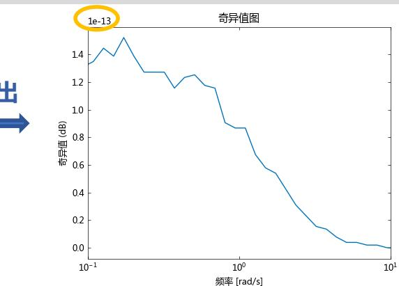
输

# 3.3 不确定系统分析- 结构奇异值

# 一. 计算结构奇异值上界（mussv）

结构奇异值（Structured Singular Value），通常用 $\mu$ 表示，用于分析具有特定结构的不确定性系统的鲁棒性和稳定性。

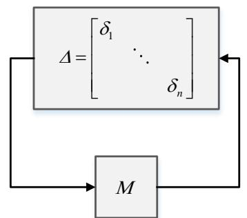

$$
\mu_ {\Delta} (\boldsymbol {M}) = \frac {1}{\min \left\{\sigma_ {\max} (\Delta) : \det (\mathbf {I} - \boldsymbol {M} \Delta) = 0 , \Delta \in \Delta \right\}}
$$

• 斜体 $\Delta$ ：具有块对角结构的结构不确定性
• $\sigma _ { \mathrm { m a x } } \big ( \Delta ( s ) \big )$ ： $\Delta$ 的最大奇异值
• 正体 $\Delta$ ：所有允许的不确定性结构集合

# 函数及调用方式

Bounds,MuInfo $=$ mussv(M,BlockStructure) Bounds,MuInfo $=$ mussv(M,BlockStructure,Options)

VDelta $=$ mussvextract(MuInfo) VDelta,VSigma $=$ mussvextract(MuInfo;nargout=2) VDelta,VSigma,VLmi $=$ mussvextract(MuInfo;nargout=3)

# 说明

根据指定扰动块结构，计算 M 的结构奇异值上界，输入参数含义如下：

M:2 维矩阵、多维数组或 FRD 系统模型

BlockStructure:扰动块结构，具体含义如下：

• BlockStructure[i,:] = [-r 0] → ???? 为 $\mathrm { { \bf r } } \times \mathrm { { \bf r } }$ 重复的对角实标量扰动；
• BlockStructure[i,:] = [r 0] → ???? 为 $\mathbf { r } \times \mathbf { r }$ 对角复标量扰动；
• BlockStructure[i,:] = [r c] → ???? 为 $\mathbf { r } \times \mathbf { c }$ 复数满块扰动

Options:计算选项，指定为字符串。（详细信息，请参考帮助文档）

输出参数含义如下：

Bounds:结构奇异值 µ 的上下界向量

MuInfo:字典（详细信息，请参考帮助文档）

提取 mussv 计算结果的详细信息

# 3.3 不确定系统分析- 结构奇异值

示例3.3：计算不确定矩阵的结构奇异值，并提取附加信息

①.计算不确定矩阵的奇异奇异值

```txt
using Random
Random.seed!(0); #固定随机数种子
M = randn(5,5) + im*randn(5,5);
BlockStructure = [-1 0; -1 0; 1 1; 2 0];
Bounds, MuInfo = mussv(M, BlockStructure);
```


```txt
julia> Bounds
1x2 Matrix{Float64}: 4.10643 4.10619
julia> propertynames(MuInfo) (:bnds, :dvec, :pvec, :gvec, :sens, :blk)
julia> MuInfo.bnds
1x2 Matrix{Float64}: 4.10643 4.10619
julia> MuInfo.blk
4x2 Matrix{Int64}: -1 0 -1 0 1 1 2 0
```

②.提取结构奇异值计算的附加信息

```matlab
VDelta = mussvextract(MuInfo); #nargout默认等于1
_, VSigma = mussvextract(MuInfo;nargout=2);
_, _, VLmi = mussvextract(MuInfo;nargout=3);
```


```txt
jula> VDelta
5x5 Matrix{ComplexF64}: -0.243535+0.0im 0.0+0.0im 0.0+0.0im 0.0+0.0im 0.0+0.0im 0.0+0.0im 0.0+0.0im 0.0+0.0im 0.0+0.0im 0.0+0.0im 0.0+0.0im 0.0+0.0im 0.0 + 0.118551-0.212732im 0.0+0.0im 0.0+0.0im 0.0+0.0im 0.0+0.0im -0.118551-0.212732im jula> collect keys(VSigma))
5-element Vector<String]: "DRight" "GRight" "GMiddle" "DLeft" "GLeft"
julia> collect keys(VLmi))
4-element Vector<String]: "Dc" "Grc" "Dr" "Gcr"
```

有关 mussvextract() 的输出变量的具体含义，请参阅帮助文档

# 3.4 不确定系统分析- 鲁棒性分析

# 一. 不确定系统的鲁棒稳定性裕度（robstab）

robstab() 计算不确定系统的鲁棒稳定性裕度的上界和下界。

• 稳定裕度大于 1：系统对于其建模的不确定性取值都是稳定的；
• 稳定裕度小于 1：对于某些不确定元素在其允许范围内的一些取值，系统会失去稳定性。

# 二. 不确定系统的鲁棒增益裕度（robgain）

robgain() 计算不确定系统的鲁棒增益裕度的上界和下界。

• 增益裕度大于 1 ：对于系统建模的所有不确定性值，系统峰值增益始终低于指定的 Gamma 值；
• 增益裕度小于 1 ：在某些频率下，对于不确定元素在其允许范围内的一些取值，系统峰值增益会超过指定的 Gamma 值。

<table><tr><td>函数及调用方式</td><td>说明</td></tr><tr><td>StabMarg,Wcu,Info = robstab(Usys)StabMarg,Wcu,Info = robstab(Usys,Options)</td><td>计算不确定系统 Usys 的鲁棒稳定裕度。输出参数的含义如下:StabMarg:字典,包含的键及其含义如下:&quot;LowerBound&quot;:鲁棒稳定裕度的下界&quot;UpperBound&quot;:鲁棒稳定裕度的上界&quot;CriticalFrequency&quot;:最小稳定裕度对应的频率Wcu:字典,导致系统不稳定的干扰值Info:字典,储存有关稳定裕度的其他信息</td></tr><tr><td>PerfMarg,Wcu,Info = robgain(Usys,Gamma)PerfMarg,Wcu,Info = robgain(Usys,Gamma,Options)</td><td>计算不确定系统 Usys 对于指定水平 Gamma 的鲁棒增益裕度。输出参数的含义如下:PerfMarg:字典,包含的键及其含义如下:&quot;LowerBound&quot;:鲁棒增益裕度的下界&quot;UpperBound&quot;:鲁棒增益裕度的上界&quot;CriticalFrequency&quot;:最小增益裕度对应的频率Wcu:字典,导致系统峰值增益达到 Gamma 的干扰值Info:字典,储存有关增益裕度的其他信息</td></tr></table>

# 3.4 不确定系统分析- 鲁棒性分析

示例3.4：计算不确定系统的鲁棒稳定性裕度和鲁棒增益裕度：

①.构造不确定系统

```matlab
P = tf(1, [1 0]) + ultidyn("delta", [1, 1], Bound=0.4); BW = 0.8; K = tf(BW, [1/(25*BW) 1]); S = feedback(uss(1), P*K);
```


julia> S不确定连续时间状态空间模型：1 输出，1 输入，2 状态包含以下不确定模块：delta：不确定LTI对象，最大增益 $= ~ 0 . 4$

②.计算标称系统的峰值增益

gpeak, $\underline{\mathbf{\Pi}}_{-} =$ getPeakGain(S.NominalValue);


```txt
julia> gpeak 1.0316119085179376
```

robgain 指定的 Gamma 值不能低于标称系统的峰值增益

③.计算鲁棒稳定性裕度和鲁棒增益裕度

计算鲁棒稳定裕度与鲁棒增益裕度
stabmarg, $- =$ robstab(S);
perfmarg1, $- =$ robgain(S, 1.05);
perfmarg2, $- =$ robgain(S, 2);

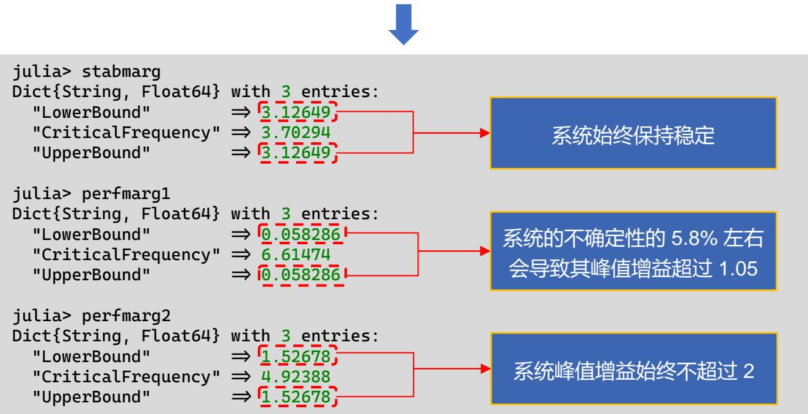

# Part 4

# 鲁棒控制器设计

# 4.1 鲁棒控制器设计 - 回路成形

# 一. 指定具有单调增益曲线的加权函数（makeweight）

加权函数是鲁棒控制器设计过程的重要的设计参数，直接影响到控制系统的性能和稳定性。
 利用 makeweight()快速指定具有特定增益曲线的加权函数，以用于后续的回路成形设计、鲁棒控制器设计、混合灵敏度问题分析等应用。

<table><tr><td>makeweight调用方式</td><td>说明</td></tr><tr><td>W = makeweight(dcgain, [freq, mag], hfgain)</td><td>创建单调增益曲线的一阶连续时间加权函数，其中
dcgain:低频增益，满足 W(0) = dcgain
hfgain:高频增益，满足 W(Inf) = hfgain
freq:特定频率
mag:特定频率下的增益，频率为 freq 时增益为 mag
(增益需要指定为绝对单位，即放大倍数)</td></tr><tr><td>W = makeweight(dcgain, [freq, mag], hfgain, Ts)</td><td>创建单调增益曲线的一阶离散时间加权函数，其中
dcgain:低频增益，满足 W(1) = dcgain
hfgain:高频增益，满足 W(-1) = hfgain
Ts:离散时间
freq:特定频率，满足 θ &lt; freq &lt; π/Ts
mag:特定频率下的增益，频率为 freq 时增益为 mag</td></tr><tr><td>W = makeweight(dcgain, [freq, mag], hfgain, Ts, N)</td><td>创建单调增益曲线的高阶连续/离散时间加权函数。Ts = 0 时创建连续时间加权函数。
阶数 N 越大，增益曲线越陡峭。</td></tr><tr><td>W = makeweight(dcgain, wc, hfgain, ____ )</td><td>指定交叉频率 wc, 即增益达到 0 dB 时的频率点。
该语法等价于 W = makeweight(dcgain, [wc, 1], hfgain, ____ )</td></tr></table>

# 4.1 鲁棒控制器设计 - 回路成形

# 一. 指定具有单调增益曲线的加权函数（makeweight）

# 示例4.1：创建一阶连续时间加权函数

# 低频增益为 40 dB， 高频增益滚降至 -20 dB， 1 rad/s 时增益为 10 dB

Wl $=$ makeweight(100,[1,3.16],0.1)

# 低频增益为 -10 dB， 高频增益为 40 dB， 交叉频率为 10 rad/s

Wh $=$ makeweight(0.316,10,100)

# 绘制伯德图

bodemag(Wl,Wh)

legend(["Wl", "Wh"])

bodegrid(true)

# 分贝(dB)和放大倍数(A)之间的换算关系：

dB = 20log(A)

julia> Wl

A =

-0.03159995441764031

$\textsf { B } =$

2.0

${ \textsf { C } } =$

1.5784177231611336

$\textsf { D } =$

0.1

连续时间状态空间模型

julia> Wh

$\tt { A } =$

-1053.9555343737468

$\textsf { B } =$

256.0

${ \textsf { C } } =$

-410.40040425200226

$\textsf { D } =$

100.0

连续时间状态空间模型

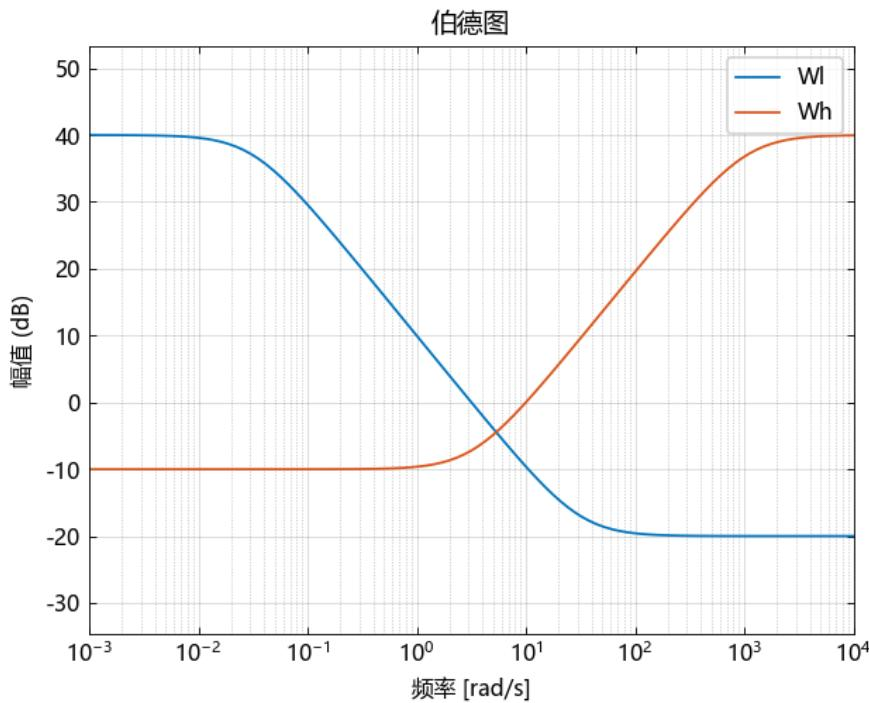

# 示例4.2：创建高阶连续时间加权函数

# 低频增益为 -10 dB， 高频增益为 40 dB， 1 rad/s 时增益为 6 dB， 阶数为 3
W3 $=$ makeweight(0.316,[1,2],100,0,3);
# 低频/高频增益与 W3 相同 阶数为 1
W1 $=$ makeweight(0.316,[1,2],100);
# 绘制伯德图 比较两者的区别
bodemag(W3,W1)
legend(["W3","W1"],loc="northwest")
bodegrid(true)

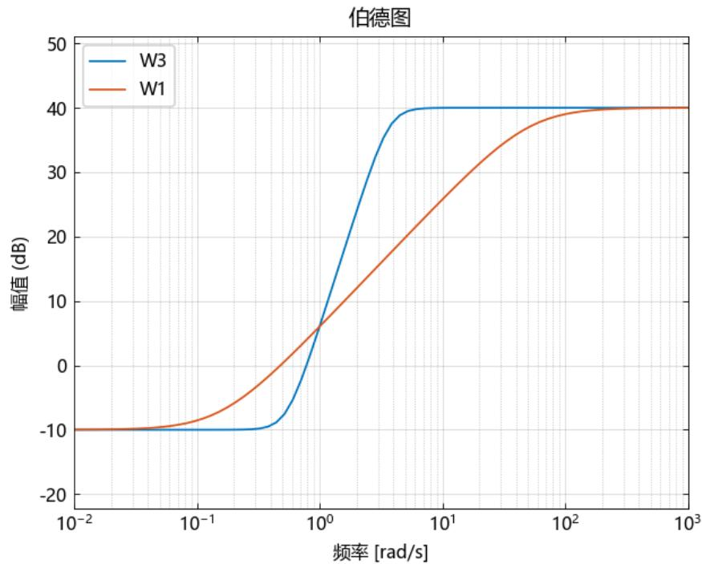

高阶加权函数的增益曲线更加陡峭！

# 4.1 鲁棒控制器设计 - 回路成形

# 二. 混合灵敏度问题的鲁棒 H∞ 回路成形设计方法（mixsyn）

考虑下图所示的典型控制系统：

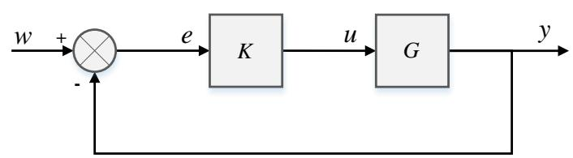

引入加权函数对原受控系统进行增广

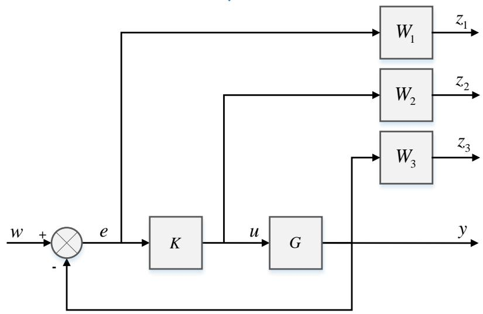

从输入 $w$ 到输出 $\mathbf { z } = [ z _ { 1 } ; z _ { 2 } ; z _ { 3 } ]$ 的传递函数为

$$
\boldsymbol {T} _ {z w} = \left[ \begin{array}{l} \boldsymbol {W} _ {1} \boldsymbol {S} \\ \boldsymbol {W} _ {2} \boldsymbol {K} \boldsymbol {S} \\ \boldsymbol {W} _ {3} \boldsymbol {T} \end{array} \right]
$$

其中，

 $\mid S = ( \mathbf { I } + \pmb { G } \pmb { K } ) ^ { - 1 }$ 为系统灵敏度，决定系统跟踪性能；
 $\pmb { T } = \pmb { G } \pmb { K } ( \mathbf { I } + \pmb { G } \pmb { K } ) ^ { - 1 }$ 为补灵敏度，决定系统的鲁棒稳定性；
 $\pmb { K } \pmb { S } = \pmb { K } ( \mathbf { I } + \pmb { G } \pmb { K } ) ^ { - 1 }$ 为控制器灵敏度；
 加权函数 ${ \cal W } _ { 1 } , { \cal W } _ { 2 } , { \cal W } _ { 3 }$ 分别对误差信号?? 、控制信号 $\mathbf { \Delta } \mathbf { u }$ 和输出信号??加权。

该类系统控制器的设计问题被称为混合灵敏度问题。

混合灵敏度控制器设计目标就是寻找一种控制器 $\pmb { K }$ ，使系统具有闭环稳定性，同时满足：

$$
\left\| \boldsymbol {T} _ {z w} \right\| _ {\infty} = \left\| \begin{array}{l} \boldsymbol {W} _ {1} \boldsymbol {S} \\ \boldsymbol {W} _ {2} \boldsymbol {K} \boldsymbol {S} \\ \boldsymbol {W} _ {3} \boldsymbol {T} \end{array} \right\| _ {\infty} <   \gamma
$$

一般情况下将其转化为标准问题，即 $\gamma = 1$ 。

由于 ${ \pmb { S } } + { \pmb { T } } = { \bf { I } }$ ，所以系统性能和鲁棒稳定性之间存在矛盾，需要折中处理。因此在实际应用中需要回路成形设计，即通过加权函数的选择，将回路形状（奇异值幅频特性）调节至期望形状。

加权函数一般根据以下原则进行选择：

 由于外界干扰主要发生在低频段， ${ \pmb W } _ { 1 }$ 在低频段应具有较大增益，高频段无要求；
 ${ \pmb W } _ { 3 }$ 的选择和系统的不确定性相关。一般情况下高频段系统标称模型与实际模型之间存在较大差异，因此 ${ \pmb W } _ { 3 }$ 在高频段应具有较大增益。
 ${ \pmb W } _ { 2 }$ 的选择由控制输入 u 决定。一般情况下不考虑 ${ \pmb W } _ { 2 }$ 。
 尽量选择低阶加权函数，以获得较为简单的低阶控制器。

# 4.1 鲁棒控制器设计 - 回路成形

# 二. 混合灵敏度问题的鲁棒 H∞ 回路成形设计方法（mixsyn）

<table><tr><td>mixsyn调用方式</td><td>说明</td></tr><tr><td>K,CL,Gamma = mixsyn(G,W1,W2,W3)</td><td>生成混合灵敏度问题下的H∞最优控制器，支持ss、tf、zpk类型系统。输出参数分别代表：K:控制器CL:闭环系统传递函数，CL=lft(G,K)Gamma:系统性能水平，即闭环系统CL的H∞范数</td></tr><tr><td>K,CL,Gamma = mixsyn(G,W1,W2,W3,GammaTry)</td><td>计算目标性能水平 GammaTry的控制器。如果 GammaTry无法达到，则mixsyn返回的K为空白模型，Gamma为Inf。</td></tr><tr><td>K,CL,Gamma = mixsyn(G,W1,W2,W3,GammaRange)</td><td>在 GammaRange范围内搜索控制器的最佳性能水平，GammaRange为[Gmin,Gmax]形式的二元向量。限制搜索范围可以减少mixsyn为测试不同性能水平而进行的迭代次数，从而加快计算速度。</td></tr><tr><td>K,CL,Gamma = mixsyn(_____,Options)</td><td>指定额外的计算选项。Options为HinfSynOptions类型的选项集。</td></tr></table>

# 4.1 鲁棒控制器设计 - 回路成形

# 二. 混合灵敏度问题的鲁棒 H∞ 回路成形设计方法（mixsyn）

示例4.3：构建下面的双输入双输出系统状态空间模型

$$
G (s) = \frac {s - 1}{(s + 1) ^ {2}}
$$

①.定义系统模型和加权函数

$$
\begin{array}{l} s = z p k \left(s ^ {\prime}\right) \\ G = (s - 1) / (s + 1) ^ {\wedge} 2 \\ \end{array}
$$

# W1 低频段增益为 20 dB， 高频段增益 -40 dB， 1 rad/s 时增益为 -20 dBW1 $=$ makeweight(10,[1,0.1],0.01);
# W2 低频段增益为 -20 dB， 高频段增益 0 dB， 32 rad/s 时增益为 -10 dBW2 $=$ makeweight(0.1,[32,0.32],1);
# W3 低频段增益 -40 dB， 高频段增益 20 dB， 1 rad/s 时增益为 -20 dBW3 $=$ makeweight(0.01,[1,0.1],10);bodemag(W1,W2,W3)

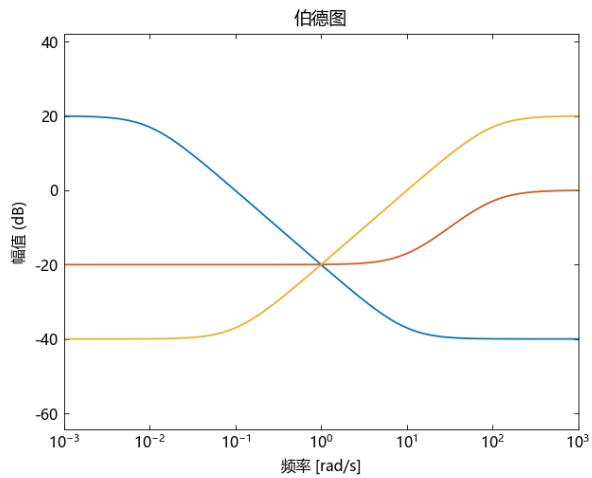

②.计算控制器

$$
K, C L, G a m m a = \text {m i x s y n} (G, W 1, W 2, W 3);
$$

julia> Gamma

0.2521874999639112

$\textcircled{3}$ .分析奇异值曲线：

$$
\begin{array}{l} S = \text {f e e d b a c k} (1, G * K); \\ K S = K * S; \\ T = 1 - S; \\ s i g m a (S, " b", K S, " r", T, " g ", G a m m a / W 1, " b -. ", s s (G a m m a / W 2), " r -. ", G a m m a / W 3, " g -. ") \\ l e g e n d ([ " S", " K S", " T", " G A M / W 1 ", " G A M / W 2 ", " G A M / W 3"], l o c = " s o u t h w e s t") \\ \text {b o d e g r i d (t r u e)} \\ \end{array}
$$

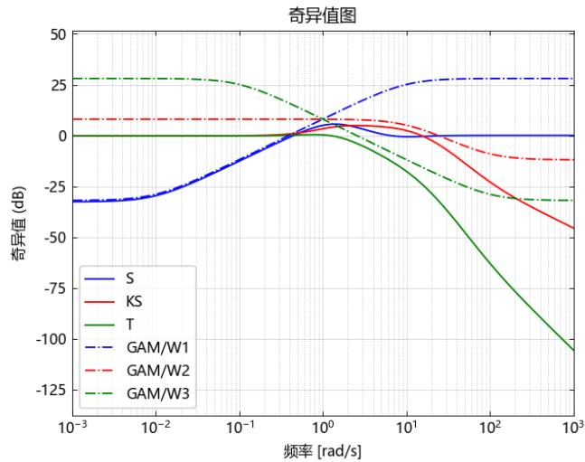

?? 远小于 1，闭环系统满足设计要求


$$
\begin{array}{l} \left\| \boldsymbol {S} \right\| _ {\infty} \leq \gamma \left| \boldsymbol {W} _ {1} ^ {- 1} \right| \\ \left\| \boldsymbol {K} \boldsymbol {S} \right\| _ {\infty} \leq \gamma \left| \boldsymbol {W} _ {2} ^ {- 1} \right| \\ \left\| \boldsymbol {T} \right\| _ {\infty} \leq \gamma \left| \boldsymbol {W} _ {3} ^ {- 1} \right| \\ \end{array}
$$


$$
\left\| \begin{array}{c} \boldsymbol {W} _ {1} \boldsymbol {S} \\ \boldsymbol {W} _ {2} \boldsymbol {K} \boldsymbol {S} \\ \boldsymbol {W} _ {3} \boldsymbol {T} \end{array} \right\| _ {\infty} <   \gamma
$$

闭环系统满足设计要求

# 4.1 鲁棒控制器设计 - 回路成形

回路成形设计相关主要Syslab函数，其余函数请参阅Syslab-鲁棒控制工具箱帮助文档

<table><tr><td>函数及调用方式</td><td>说明</td></tr><tr><td>K,CL,Gamma,info = ncfsyn(G)K,CL,Gamma,info = ncfsyn(G,W1)K,CL,Gamma,info = ncfsyn(G,W1,W2)K,CL,Gamma,info = ncfsyn(_____,tol=Value)</td><td>采用Glover-McFarlane法进行回路设计</td></tr><tr><td>sys = mkfilter(CF,Ord,Type)sys = mkfilter(CF,Ord,Type,PR)</td><td>生成巴特沃斯、贝塞尔、切比雪夫或RC滤波器</td></tr><tr><td>P = augw(G,W1,W2,W3)</td><td>用于加权混合灵敏度H∞和H2回路成形设计的受控系统增广</td></tr></table>

# 4.2 鲁棒控制器设计 – H∞分析

# 一. 生成 ??∞ 最优控制器（hinfsyn）

对于如图所示的系统：

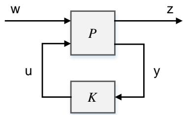

图中，w 代表扰动输入；u 代表控制输入；z 代表性能输出；y 代表测量输出。传递函数 P 的实现具有如下形式：

$$
P (s) = \left[ \begin{array}{c c c} A & B _ {1} & B _ {2} \\ \hline C _ {1} & D _ {1 1} & D _ {1 2} \\ C _ {2} & D _ {2 1} & D _ {2 2} \end{array} \right] = \left[ \begin{array}{c c c} P _ {1 1} (s) & P _ {1 2} (s) \\ P _ {2 1} (s) & P _ {2 2} (s) \end{array} \right]
$$

对应的状态空间方程为：

$$
\left\{ \begin{array}{l} d x = A x + B _ {1} w + B _ {2} u \\ z = C _ {1} x + D _ {1 1} w + D _ {1 2} u \\ y = C _ {2} x + D _ {2 1} w + D _ {2 2} u \end{array} \right.
$$

从 w 到 z 之间的闭环传递函数为

$$
T _ {z w} = P _ {1 1} + P _ {1 2} K \left(I - P _ {2 2} K\right) ^ {- 1} P _ {2 1}
$$

$H _ { \infty }$ 最优设计问题是设计反馈控制器 K ，使闭环系统稳定，同时使从 $\boldsymbol { \mathsf { W } }$ 到z 的闭环传递函数矩阵 $\pmb { T } _ { z w }$ 的 $H _ { \infty }$ 范数最小，即

$$
\operatorname {m i n i m i z e} \left\| T _ {z w} (s) \right\| _ {\infty}
$$

符合上述条件的控制器 K 一般不是唯一的。在实际应用中，通常会放宽限制条件，转而求解 $H _ { \infty }$ 次优设计问题：即给定被控对象 P 和性能指标 $\gamma > 0$ ，设计反馈控制器 K，使闭环系统稳定，同时闭环传递函数矩阵 $\pmb { T } _ { z w }$ 的 $H _ { \infty }$ 范数满足

$$
\left\| \boldsymbol {T} _ {z w} (s) \right\| _ {\infty} <   \gamma
$$

对于上述次优设计问题，可以通过递减 ?? 进行迭代运算的方式，不断逼近最优解。

# 4.2 鲁棒控制器设计 – H∞分析

# 一. 生成 ??∞ 最优控制器（hinfsyn）

<table><tr><td>hinfsyn调用方式</td><td>说明</td></tr><tr><td>K,CL,Gamma = hinfsyn(P,Nmeas,Ncon)</td><td>计算受控系统P的H∞最优稳定控制器，Nmeas和Ncon分别是测量输出y和控制输入u的维度。
K:控制器
CL:闭环系统传递函数，CL=lft(P,K)
Gamma:系统性能水平，即闭环系统CL的H∞范数</td></tr><tr><td>K,CL,Gamma = hinfsyn(P,Nmeas,Ncon,GammaTry)</td><td>计算目标性能水平 GammaTry的控制器。
如果 GammaTry无法达到，则mixsyn返回的K为空白模型，Gamma为Inf。</td></tr><tr><td>K,CL,Gamma = hinfsyn(P,Nmeas,Ncon,GammaRange)</td><td>在 GammaRange范围内搜索控制器的最佳性能水平，GammaRange为[Gmin,Gmax]形式的二元向量。
限制搜索范围可以减少hinfsyn为测试不同性能水平而进行的迭代次数，从而加快计算速度。</td></tr><tr><td>K,CL,Gamma = hinfsyn(_____,Options)</td><td>指定额外的计算选项。Options为HinfSynOptions类型的选项集。</td></tr></table>

# 4.2 鲁棒控制器设计 – H∞分析

# 一. 生成 ??∞ 最优控制器（hinfsyn）

示例4.4：为系统G设计一个混合灵敏度控制器，并用以下受控回路成形滤波器进行增广

$$
G (s) = \frac {s - 1}{s + 1}
$$

$$
W _ {1} (s) = \frac {0 . 1}{1 0 0 s + 1}, W _ {2} (s) = 0. 1, W _ {1} (s) = 0
$$

$\textcircled{1}$ 被控对象定义

# 定义受控系统 $G$

s = zpk('s');

G = (s-1)/(s+1);

# 定义加权函数 W1,W2,W3

W1 = 0.1*(s+100)/(100*s+1);

W2 = ss(0.1);

$\ W 3 \ =$ nothing;

# 构造增广系统 P

$\mathsf { P } = \mathsf { a u g w } ( \mathsf { G } , \mathsf { W 1 } , \mathsf { W 2 } , \mathsf { W 3 } )$ ;

$\textcircled{2}$ 生成 $H _ { \infty }$ 稳定控制器

# 假设测量输出维度 （B2的列数） 为 1

Nmeas $\mathbf { \lambda } = \mathbf { \lambda } _ { 1 }$ ;

# 假设控制输入维度 （C2的行数） 为 1

Ncon $\mathit { \Theta } = \mathit { \Theta } _ { 1 }$

K,CL,Gamma $=$ hinfsyn(P,Nmeas,Ncon);


```csv
julia> K
A =
-0.010000000000019327 -3.552713678800501e-15
-175.5577518722622 -69.52271916909726
B =
0.1118061938551518
4.4722477542060525e-5
C =
-392.5492538000678 -153.21762776816834
D =
9.99999999999996e-5
```

连续时间状态空间模型

julia> Gamma

0.1844399890346652

返回的控制器 K 具有 Nmeas 个输入，Ncon 个输出，状态数与被控对象 P 相同

③.检查闭环系统的奇异值图

sigma(CL,ss(Gamma))

legend(["CL","Gamma"])

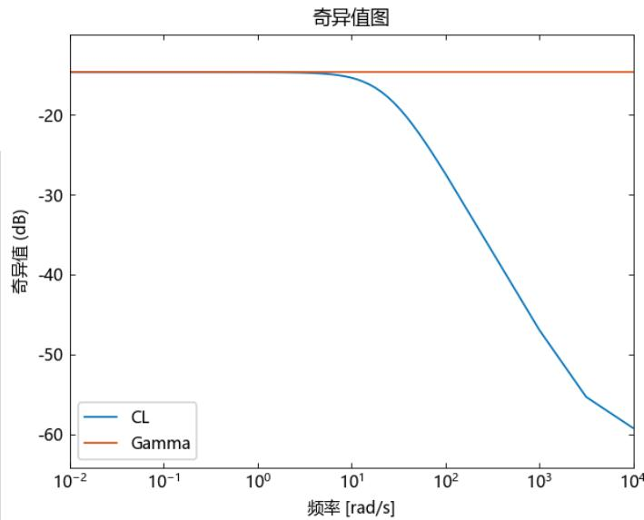

闭环系统 CL 的最大奇异值（即 $H _ { \infty }$ 范数）不超过 Gamma，满足设计要求

# 4.2 鲁棒控制器设计 – H∞分析

# 二. 生成 ??2 最优控制器（h2syn）

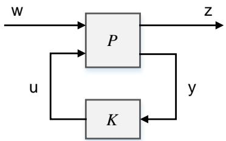

$H _ { 2 }$ 最优设计问题是设计反馈控制器 K ，使闭环系统稳定，同时使从 w 到 z 的闭环传递函数矩阵 $\pmb { T } _ { z w }$ 的 $H _ { 2 }$ 范数最小，即

$$
\operatorname {m i n i m i z e} \left\| T _ {z w} (s) \right\| _ {2}
$$

$H _ { 2 }$ 设计问题和 $H _ { \infty }$ 设计问题的主要区别：

 $H _ { 2 }$ 问题的目标是最小化系统的 $H _ { 2 }$ 范数，代表信号功率的最大放大倍数。
 $H _ { \infty }$ 问题的目标是最小化系统的 $H _ { \infty }$ 范数，代表信号能量的最大放大倍数。

两种设计问题的核心思想都是抑制外界扰动和模型不确定对系统输出的影响。

示例4.4：针对受控系统模型设计 $H _ { 2 }$ 最优控制器：

$\textcircled{1} .$ 被控对象定义

```txt
A = [5 6 -6; 6 0 5; -6 5 4];
B = [θ 4 θ 0; 1 1 -2 -2; 4 θ 0 -3];
C = [-6 0 8; 0 5 0; -2 1 -4; 4 -6 -5; 0 -15 7];
D = [θ 0 0 0; 0 0 0 1; 0 θ 0 0; 0 0 3 6; 8 θ -7 θ];
P = ss(A, B, C, D);
```

$\textcircled{2}$ 生成 $H _ { 2 }$ 最优稳定控制器

$$
\begin{array}{l} N m e a s = 2; \\ N c o n = 1; \\ K, C L, G a m m a, I n f o = h 2 s y n (P, N m e a s, N c o n); \\ \end{array}
$$


```csv
julia> K
A =
-1645.345678403497 -780.4615013409963 724.2540155649751
-2136.187098378665 -1001.6038488675041 941.6008131306859
-1318.334139122738 -592.6348821461788 568.2792826901878
B =
-1.9671324701038566 -2.2424588651268347
-2.888306328827665 -1.454117223473145
-2.066622917530499 0.32760767703331617
C =
-140.4933520818729 -62.78358937907453 61.374655483620586
D =
0.0 0.0
```

连续时间状态空间模型

julia> Gamma

877.5182497429581

③.检验闭环系统的稳定性：

$$
\mathrm {p o l e} (\mathrm {C L})
$$

julia> pole(CL)

6-element Vector{ComplexF64}:

$$
\begin{array}{l} - 3 1. 6 2 3 5 9 0 4 5 8 0 7 1 1 + 0. 0 i m \\ - 1 2. 6 4 6 0 4 9 2 5 6 0 0 2 6 5 9 + 3. 8 0 4 4 7 8 7 3 6 1 0 0 3 1 9 4 i m \\ - 1 2. 6 4 6 0 4 9 2 5 6 0 0 2 6 5 9 - 3. 8 0 4 4 7 8 7 3 6 1 0 0 3 1 9 4 i m \\ - 9. 6 0 7 3 3 6 2 5 9 7 2 0 1 8 7 + 0. 0 i m \\ - 9. 2 3 9 3 1 1 8 4 6 4 8 8 4 5 3 + 0. 0 i m \\ - 8. 6 9 3 8 8 5 3 8 7 9 5 5 7 8 8 + 0. 0 i m \\ \end{array}
$$

系统极点均位于左半平面，闭环系统稳定

返回的控制器 K 具有 Nmeas 个输入，Ncon 个输出，状态数与被控对象 P 相同

# Part 5

# 系统模型与控制器简化

# 5.1 系统模型与控制器简化

复杂模型并非始终是良好控制所需。通常情况下，基于 $\mathsf { H } \infty$ 、H2 和 $\mu$ 综合等最优控制理论的优化方法生成的控制器的状态个数至少与被控模型相同。此类别提供的模型降阶函数可以帮助您得到简化后的近似被控模型和控制器模型。

Syslab目前提供以下函数用于模型与控制器简化：

<table><tr><td>函数及调用方式</td><td>说明</td></tr><tr><td>ncfmr</td><td>基于归一化互质分解的模型降阶</td></tr><tr><td>reduce</td><td>基于 Hankel 奇异值的模型降阶的简化调用方法</td></tr><tr><td>balancmr</td><td>基于平方根法的平衡模型截断</td></tr><tr><td>bstmr</td><td>基于 Schur 方法的平衡随机模型截断（BST）</td></tr><tr><td>hankelmr</td><td>无平衡的 Hankel 最小度近似（MDA）</td></tr><tr><td>hankelsv</td><td>计算稳定/不稳定或连续/离散系统的 Hankel 奇异值</td></tr><tr><td>modreal</td><td>系统模态形式实现与投影</td></tr><tr><td>schurmr</td><td>基于 Schur 法的平衡模型截断</td></tr><tr><td>dcgainmr</td><td>基于最小直流增益截断的模型降阶</td></tr><tr><td>slowfast</td><td>快慢模态分解</td></tr></table>

详细用法请参考 Syslab 鲁棒控制工具箱帮助文档

# 5.1 系统模型与控制器简化

# 一. 基于归一化互质分解的模型降阶（ncfmr）

ncfmr() 通过截断全阶模型的互质分解中的模态来计算模型的降阶近似。

 互质分解：将系统的传递函数分解为两个互质的的传递函数（即没有共享的零极点）
 左归一化互质分解：存在 $U _ { l }$ 和 $V _ { l }$ ，满足：

$$
G (s) = M _ {l} ^ {- 1} (s) N _ {l} (s)
$$

$$
N _ {l} U _ {l} + M _ {l} V _ {l} = \mathbf {I}
$$

 右归一化互质分解：存在 $U _ { r }$ 和 $V _ { r }$ ，满足：

$$
G (s) = N _ {r} (s) M _ {r} ^ {- 1} (s)
$$

$$
U _ {r} N _ {r} + V _ {r} M _ {r} = I
$$

 算法步骤

$\textcircled{1}$ . 计算输入模型 $G$ 的左归一化互质分解 $\begin{array} { r l } { [ M _ { l } ( s ) } & { { } N _ { l } ( s ) ] } \end{array}$
$\textcircled{2}$ . 利用 $\mathsf { k }$ 阶平衡模型截断法，计算 ???? ?? $N _ { l } ( s ) ]$ 的 $\mathsf { k }$ 阶近似值 ?????? ?? $N _ { l r } ( s ) ]$ （可参考 balred() 函数）；
$\textcircled{3}$ . 计算降阶模型 $G _ { r e d } ( s )$

$$
G _ {r e d} (s) = M _ {l r} ^ {- 1} (s) N _ {l r} (s)
$$

<table><tr><td>函数及调用方式</td><td>说明</td></tr><tr><td>GRed,Info = ncfmr(G,Order)</td><td>通过全阶模型互质分解中的模型截断，计算系统的近似降阶模型
Gred: 降阶系统模型
Info: 类型为 NcfmrInfo 的附加信息结构体，包含以下字段:
• Info.GL: G 的左归一化互质分解
• Info.HSV: GL 的 Hankel 奇异值向量
• Info.ErrorBound: 最大近似误差向量，第 i 个元素代表简化到 i 个状态所对应的最大近似误差</td></tr><tr><td>GRed,Info = ncfmr(G,Order,MaxError=Value, ...)</td><td>指定降阶系统的 Hankel 奇异值之和与原系统的最大允许误差</td></tr></table>

示例5.1：基于归一化互质分解方法计算MIMO 系统的模型降阶：

# 定义原系统

using Random

Random.seed!(0);

G = rss(30,3,3);

# 系统降阶

G1, _ $=$ ncfmr(G,10);

G2, _ $=$ ncfmr(G,20);

sigma(G,G-G1,G-G2)

# 固定随机数种子
# 30 阶随机系统

# 10 阶降阶模型
# 20 阶降阶模型
# 比较近似误差

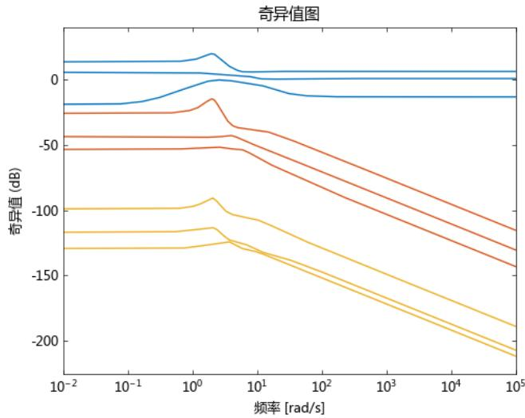
降阶系统阶数越大，近似误差越小

# 5.1 系统模型与控制器简化

# 二. 计算系统的 Hankel 奇异值（hankelsv）

#  物理意义：

Hankel 奇异值用于评估系统的：

⚫ 可控性和可观测性：较大的奇异值对应于系统中可观测性和可控性较强的状态，较小的奇异值对应于系统中可观测性和可控性较弱的状态；
⚫ 模型阶数：通过 Hankel 奇异值的大小，忽略较小奇异值对应的状态，判断系统的最小阶数。

#  计算方式：

给定被控对象 $G ( s ) = C ( s \mathrm { I } - A ) ^ { - 1 } B + D$ ：

$\textcircled{1}$ . 根据 Lyapunov 方程求解可控 Gramian 矩阵 $P$ 和可观 Gramian 矩阵 $Q$

$$
A P + P A ^ {\mathrm {T}} + B B ^ {\mathrm {T}} = 0 \quad A ^ {\mathrm {T}} Q + Q A + C ^ {\mathrm {T}} C = 0
$$

$\textcircled{2}$ . 计算 $P$ 和 $Q$ 奇异值（特征值）分解：

$$
P = U _ {p} \Sigma_ {p} V _ {p} ^ {\mathrm {T}} = U _ {p} \Sigma_ {p} U _ {p} ^ {\mathrm {T}} \quad Q = U _ {q} \Sigma_ {q} V _ {q} ^ {\mathrm {T}} = U _ {q} \Sigma_ {q} U _ {q} ^ {\mathrm {T}}
$$

$\textcircled{3}$ . 计算 $P$ 和 $Q$ 平方根：

$$
L _ {r} = U _ {p} \Sigma_ {p} ^ {1 / 2} \quad L _ {o} = U _ {q} \Sigma_ {q} ^ {1 / 2}
$$

$\textcircled{4}$ . 计算 $L _ { o } ^ { T } L _ { r }$ 奇异值矩阵 Σ，即 Hankel 奇异值矩阵：

$$
L _ {o} ^ {\mathrm {T}} L _ {r} = U \Sigma V ^ {\mathrm {T}}
$$

示例5.2：计算稳定/不稳定系统的 Hankel 奇异值：

```matlab
# 被控对象定义
G1 = tf(1, [1, 5, 6]); # 稳定系统
G2 = tf(1, [1, 1, -6]); # 不稳定系统
# 直接计算 Hankel 奇异值
sv_stab1, sv_unstab1 = hankelsv(G1);
sv_stab2, sv_unstab2 = hankelsv(G2);
```


```txt
julia>sv_stab1 #G1稳定子系统的Hankel奇异值
2-element Vector{Float64}：0.10000000000000030.01666666666666667
julia>sv_unstab1 #G1不稳定子系统的Hankel奇异值Int64[]
julia>sv_stab2 #G2稳定子系统的Hankel奇异值1-element Vector{Float64}：0.033333333333333351
julia>sv_unstab2 #G2不稳定子系统的Hankel奇异值1-element Vector{Float64}：0.05
```

# 5.1 系统模型与控制器简化

# 三. 系统模态形式实现与投影（modreal）

 模态形式：模态形式下系统的 A 矩阵具有对角线分块形式。系统实特征值对应于对角线上的 1 x 1 块，复特征值 $a + b j$ 对应于对角线上的 2 x 2 块，具体形式为

$$
\left[ \begin{array}{c c} a & b \\ - b & a \end{array} \right]
$$

 最小实现：指的是一个状态空间模型，其状态变量数量最少，同时仍然能够完全描述系统的输入输出行为；

#  应用：

• 简化状态空间模型：减少状态变量的数量，从而降低计算复杂度；
• 提高系统性能：移除不必要的状态变量，从而提高系统的稳定性和响应速度

示例5.3：系统模态形式实现与模态分解

$\textcircled{1}$ . 定义状态空间模型

$$
\begin{array}{l} A = [ 0 1 0 0; 0 - 0. 1 3 0; 0 0 0 1; 0 - 0. 5 3 0 0 ]; \\ B = [ 0; 2; 0; 5 ]; \\ C = \left[ \begin{array}{l l l l} 1 & \theta & \theta & \theta \\ & \theta & \theta & \theta \end{array} ; \theta & \theta & 1 & \theta \right]; \\ D = [ 0; 0 ]; \\ G = s s (A, B, C, D) \\ \end{array}
$$

$\textcircled{2}$ . 模态形式转换

$$
G 1, G 2 = \text {m o d r e a l} (G);
$$


julia> G1

A =

0.0 0.0

0.0

0.0

0.0 -0.04999583368055527

0.0

0.0 0.0

5.452508766135327

0.0

0.0 0.0

0.0

-5.502512932454772

B =

30.000000000000167

-30.03414342128311

2.473180176222291

2.636088196756005

C =

1.0 0.998752199617591

0.017788265700515477

-0.017953413137534784

0.0 -0.0008322934939024666

0.1795138571061975

-0.17790274828203068

D =

0.0

0.0

连续时间状态空间模型

julia> G2

D =

0.0

0.0

连续时间状态空间模型

$\textcircled{3}$ . 根据可选输入 cut 分解模态

$$
G 1, G 2 = \text {m o d r e a l} (G, 2);
$$


julia> G1
A =
0.0 -0.9998607698246718
0.0 -0.04999583368055563
$\textsf { B } =$
0.0033331943634500928
-1.499917198320145

1.0 0.0
0.0 -0.016665734743533535
$\textsf { D } =$
-0.01666944294006559
-0.1666527719926695

连续时间状态空间模型

julia> G2

A =

5.4525087661353275 0.0

0.0

2.460599498674898

2.623740441480088

C =

0.017879214444927564 -0.01803790486098624

0.18043168463268386 -0.17873998795862822

0.0

0.0

连续时间状态空间模型

# Part 6

# 线性矩阵不等式

# 6 线性矩阵不等式 – LMI 系统指定

LMI 是线性矩阵不等式（Linear Matrix Inequality）的缩写。由于 LMI 解的集合是凸集，因此被广泛用于求解各种优化问题。LMI 已经成为研究后现代控制理论的基本工具。利用LMI表示的控制问题具有以下优点：

 各种设计规范和约束条件都可以用 LMI 表示；
 利用 LMI 表示的控制问题可以通过高效的凸优化算法精确求解；
 作为一种数值方法，LMI 法可以求解许多无法利用解析法求解的问题。

LMI是线性矩阵不等式

$$
\boldsymbol {L} (\boldsymbol {x}) = \boldsymbol {L} _ {0} + x _ {1} \boldsymbol {L} _ {1} + \dots + x _ {N} \boldsymbol {L} _ {N} <   0
$$

其中 $\pmb { L } _ { N }$ 是对称常数矩阵， $x _ { N }$ 是决策变量， $\pmb { x }$ 为决策向量

在大多数控制问题涉及的 LMI 并不是传统意义上的 LMI，问题的变量通常表达为矩阵形式。例如稳定性问题需要求解的 Lyapunov 矩阵不等式：

$$
\boldsymbol {A} ^ {\mathrm {T}} \boldsymbol {X} + \boldsymbol {X A} <   0
$$

或者代数黎卡提方程：

$$
\boldsymbol {A} ^ {\mathrm {T}} \boldsymbol {X} + \boldsymbol {X A} - \boldsymbol {P B R} ^ {- 1} \boldsymbol {B} ^ {\mathrm {T}} \boldsymbol {P} + \boldsymbol {Q} <   0
$$

其中，??、??、??、??、??均为已知常数矩阵，且??、??为对称矩阵。

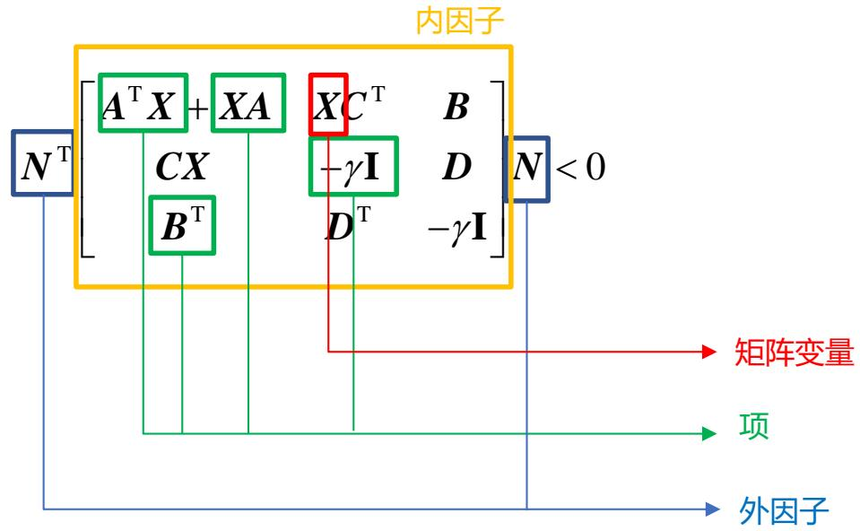

LMI 的相关术语含义如下：

 ??和??称为矩阵变量（Matrix variables），标量可以被视为 $1 \times 1$ 的矩阵变量；
 ??T??，????，??等称为项（Term），可以分为常数项和变量项；
 ??和??T称为外因子（Outer factor），它们未必是方阵，并且在一般的控制问题中不涉及；
 位于中间位置的分块矩阵是内因子（Inner factor），为对称块矩阵。

# 6 线性矩阵不等式 – LMI 系统指定

<table><tr><td>Syslab LMI系统指定函数</td><td>说明</td></tr><tr><td>hLMI = setlmis(LMIθ)</td><td>LMI 系统描述初始化</td></tr><tr><td>X,n,sX = lmivar(Type,Struct)</td><td>定义 LMI 系统中指定类型的矩阵变量</td></tr><tr><td>lmiterm(TermID,A)</td><td rowspan="3">定义 LMI 系统的项</td></tr><tr><td>lmiterm(TermID,A,B)</td></tr><tr><td>lmiterm(TermID,A,B,:s)</td></tr><tr><td>newlmi()</td><td rowspan="2">为现有 LMI 系统添加一个新的LMI</td></tr><tr><td>Tag = newlmi()</td></tr><tr><td>lmisys = getlmis()</td><td>获取 LMI 系统内部描述</td></tr><tr><td>newsys = delmvar(lmisys,X)</td><td>从 LMI 系统中删除一个矩阵变量</td></tr><tr><td>ndec = decnbr(LMISys)</td><td>LMI 系统的决策变量总数</td></tr></table>

具体使用方法及示例，可参考Syslab帮助文档，这里不再赘述

需要说明的是，Syslab鲁棒控制工具箱函数目前仍在完善过程中，后续版本中将提供更多 LMI 求解与分析函数

# 6 线性矩阵不等式 – LMI 系统指定

示例6.1：在Syslab中定义LMI如下

$$
\left[ \begin{array}{c c} \boldsymbol {A} \boldsymbol {X} _ {2} \boldsymbol {A} ^ {\mathrm {T}} - x _ {3} \boldsymbol {E} + \boldsymbol {D} ^ {\mathrm {T}} \boldsymbol {D} & \boldsymbol {B} ^ {\mathrm {T}} \boldsymbol {X} _ {1} \\ \boldsymbol {X} _ {1} ^ {\mathrm {T}} \boldsymbol {B} & - \mathbf {I} \end{array} \right] <   \boldsymbol {M} ^ {\mathrm {T}} \left[ \begin{array}{c c} \boldsymbol {C X} _ {1} \boldsymbol {C} ^ {\mathrm {T}} + \boldsymbol {C X} _ {1} ^ {\mathrm {T}} \boldsymbol {C} ^ {\mathrm {T}} & 0 \\ 0 & - f \boldsymbol {X} _ {2} \end{array} \right] \boldsymbol {M}
$$

其中 $X _ { 1 }$ 和 $| { X } _ { 2 }$ 分别代表类型 2 （非对称矩阵）和类型 1 （对称矩阵）的矩阵变量， $x _ { 3 }$ 为标量变量（视为类型 1 矩阵变量）

①.定义矩阵变量和常数矩阵

# 初始化LMI系统

$$
h L M I = \text {s e t l m i s} ([ ])
$$

# 定义矩阵变量

$$
X 1, -, - = \text {l m i v a r} (2, [ 3 3 ])
$$

$$
X 2, -, - = \text {l m i v a r} (1, [ 3 1 ])
$$

$$
x 3, -, - = \operatorname {l m i v a r} (1, [ 1 1 ])
$$

# 定义常数矩阵

$$
A = B = [ 1 2 3; 4 5 6; 7 8 9 ];
$$

$$
C = D = \left[ \begin{array}{l l l l l l l} 1 & 2 & 3; \theta & 1 & \theta ; 3 & 2 & 1 \end{array} \right];
$$

$$
E = e y e (3);
$$

$$
M = 2 * \text {e y e} (6);
$$

$$
f = 3;
$$

注意：在 使用lmivar()和lmiterm()描述新的 LMI 系统之前，必须首先使用setlmis()初始化其内部描述。同时输出必须命名为 ”hLMI”。

②.定义LMI的项

# 定义新的LMI

nlmi $=$ newlmi()

# 定义LMI不等号左侧的项

$$
l m i t e r m ([ n l m i, 1, 1, X 2 ], 2 * A, A ^ {\prime}) \quad \# 2 * A * X 2 * A ^ {\prime}
$$

$$
l m i t e r m ([ n l m i, 1, 1, x 3 ], - 1, E) \quad \# - x 3 * E
$$

$$
l m i t e r m ([ n l m i, 1, 1, 0 ], D * D ^ {\prime}) \quad \# D * D ^ {\prime}
$$

$$
l m i t e r m ([ n l m i, 2, 1, - X 1 ], 1, B) \quad \# \chi_ {1} ^ {\prime} * B
$$

$$
l m i t e r m ([ n l m i, 2, 2, 0 ], - 1) \quad \# - I
$$

# 定义LMI不等号右侧的项

lmiterm([-nlmi,0,0,0],M) # 外因子 M

lmiterm([-nlmi,1,1,X1],C,C',:s) # $C * \chi _ { 1 } * C ^ { \prime } + C * \chi _ { 1 } ^ { \prime } * C ^ { \prime }$

lmiterm([-nlmi,2,2,X2],-f,1) # -f*X2

③.获取LMI内部描述

$$
l m i s y s = \text {g e t l m i s (})
$$


232-element Vector{Int64}:

1
3
8
12
9
97
135
16
0
0 ⋮
2
1
0
1
1
-3
1
1
1
1

注意：使用getlmis()后，工作区变量 hLMI 将被清空。在此之后，如果需要定义一个新的 LMI 系统，请再次使用setlmis()进行系统初始化。

建立知识规范， 营造协同生态

积累工业模型， 发展可控平台

融入中国创新， 打造先进软件

# 感谢倾听
