# Modelica语法详解_模型行为描述

- Source: `MWORKS高校星火计划资料包/培训课程配套材料/01-官网课程配套材料/00-快速入门课程/01-Sysplorer快速入门/05-Modelica语法详解/04-Modelica语法详解-模型行为描述.pdf`
- Converted by: `MinerU precise API`
- Conversion date: `2026-05-08`
- Review status: `MinerU converted; spot check recommended`
- Priority: `P0`
- Source SHA1: `f38567ee4e3f`
- MinerU batch id: `5d946e17-bad9-4444-93d7-d4f36490ade4`
- Images: `50`
- Notes: Modelica 方程、算法、事件等模型行为表达。

# 模型行为描述

# Modelica语法详解

苏州同元软控信息技术有限公司

2024年2月27日

# Examples

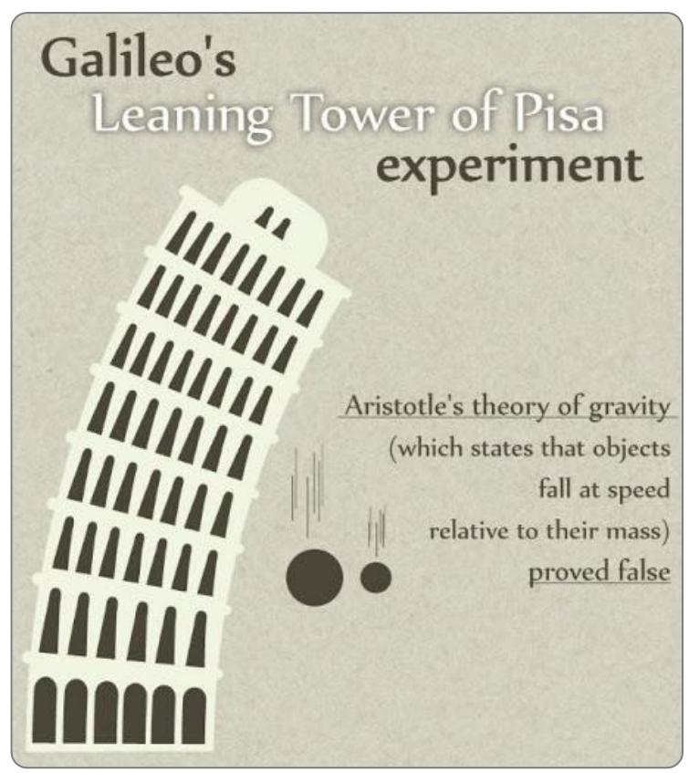

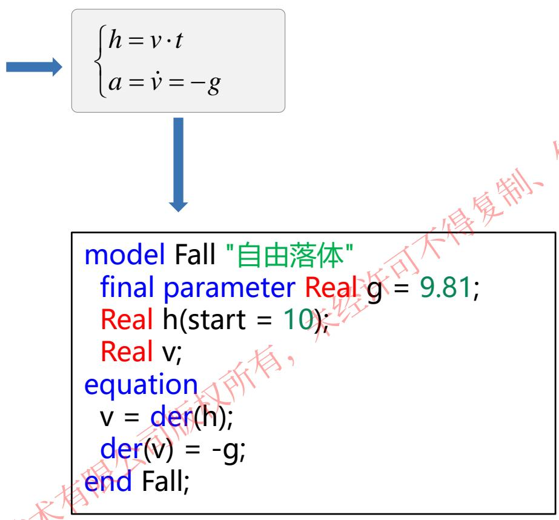
如何约束小球的运动？

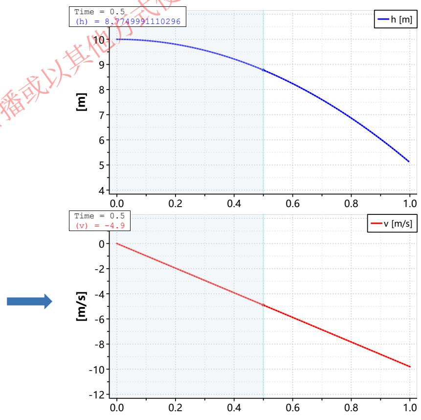

# 思考

class name

Declarationl

Declaration2

equation

equation1

equation1

：

end name;

class HelloWorld

Real x(start = 0);

parameter Real a = 1;

equation

der(x) = -a * x;

end HelloWorld;

# 类声明，定义模型名称

·声明参数
·声明变量
·声明继承或被调用的模型 (如接口）

·通过方程或算法，描述行为

结束类定义

构建一个模型，需要定义对象的属性和行为。

前两章已经学习了对象属性的定义，

那么对象的行为该如何定义？

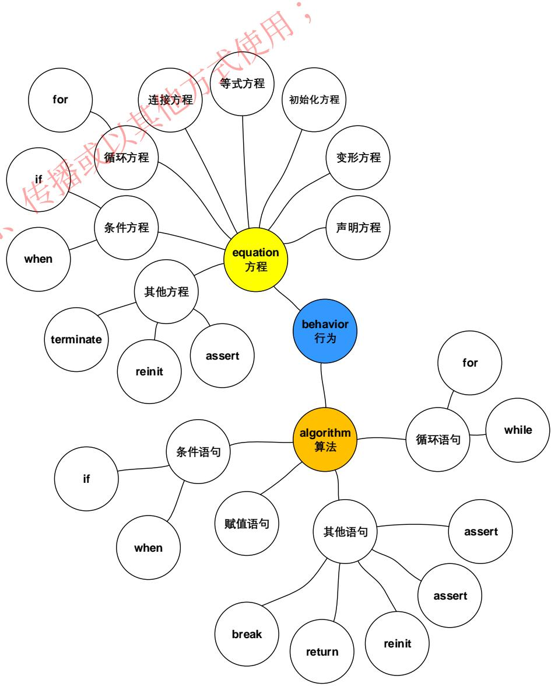

# 目录

1. 方程-equation
2. 算法-algorithm
3. 本章回顾

# 1. 方程-equation

特点：以陈述式方程表达模型的行为，模型行为即模型的数学方程或物理方程。

# 声明区域

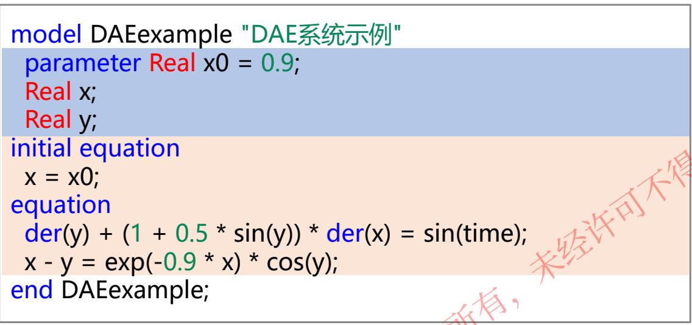

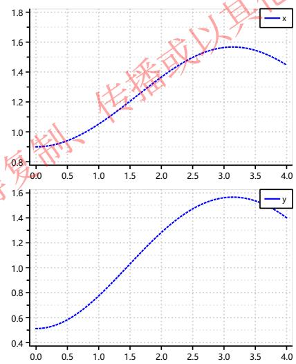

# 注意:

方程区域以“initial equation” 或“equation”关键词开始，终 止于类定义结束“end”或关键 词 “public”、“protected”、 “algorithm”、“equation”、 “initial algorithm”、“initial equation”之一。

# 方程分类

<table><tr><td rowspan="2">声明区域方程</td><td colspan="2">声明方程</td><td>给定变量约束</td></tr><tr><td colspan="2">变形方程</td><td>替换类的声明方程，用作属性修改</td></tr><tr><td rowspan="6">方程区域方程</td><td rowspan="6">常规方程</td><td>初始化方程</td><td rowspan="6">方程区定义的方程，定义各变量之间的关系。</td></tr><tr><td>等式方程</td></tr><tr><td>连接方程</td></tr><tr><td>循环方程</td></tr><tr><td>条件方程</td></tr><tr><td>其他方程</td></tr></table>

# 1. 方程-equation


作用：在变量声明的同时给定变量的约束

一般使用场景

变量取特定值：

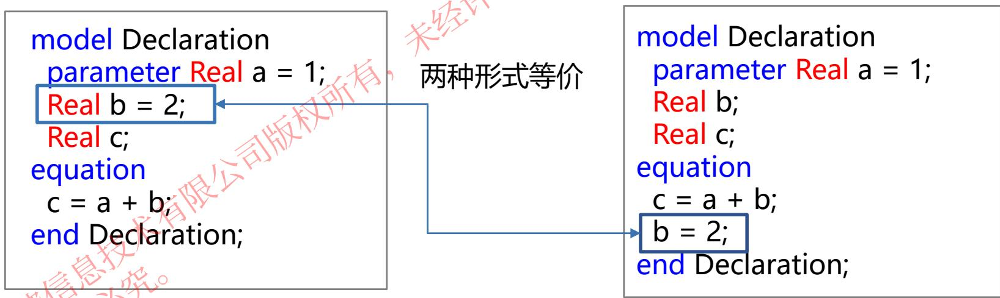

# 注意:

1. 声明方程给定变量的约束，在整个仿真过程中始终成立。
2. 一般变量取特定值时使用声明方程的形式，其他不推荐使用。

# 1. 方程-equation

声明方程

变型方程

初始方程

等式方程

连接方程

循环方程

条件方程

其他方程

作用：修改类的属性，即替换类的声明方程或增加新的方程

# 一般使用场景

拖拽式建模：

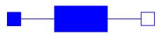

el Deformation

RLC.BasicModel.Resistance resistance

annotation (…);

end Deformation;

# 改变参数


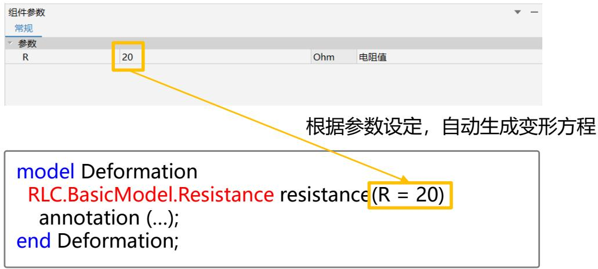

# 1. 方程-equation

声明方程

变型方程

初始方程

等式方程

连接方程

循环方程

条件方程

其他方程

作用：定义变量的初始化值

一般使用场景

等式中存在积分环节:

model Integral

parameter Real $\mathsf { a } = 3 \mathsf { . }$

Real b;

equation

der(b) = a;

end Integral;


设定初始值

model Integral

parameter Real a = 3;

Real b;

initial equation

b = 3;

equation

der(b) = a;

end Integral;

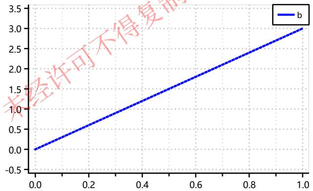

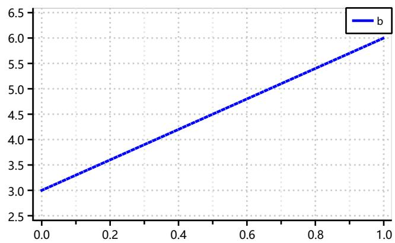

# 注意:

等式中存在积分环节时，需给定初始值，不给定初始值，则默认为初始值，即0或false
• “initial equation” 与 “start $\cdot$ ，fi ed $=$ true”功能上 等价，均为必须满足的初始值

# 1. 方程-equation

声明方程

变型方程

初始方程

等式方程

连接方程

循环方程

条件方程

其他方程

# 作用：定义各变量之间的约束关系

# 一般使用场景

定义等式两边的约束

$$
\left\{ \begin{array}{l} x _ {1} + x _ {2} = 3 5 \\ 2 x _ {1} + 4 x _ {2} = 9 4 \end{array} \right.
$$

model SimpleMath

Real x1 ;

Real x2 ;

equation

x1 + x2 = 35;

$$
2 ^ {*} \times 1 + 4 ^ {*} \times 2 = 9 4;
$$

end SimpleMath;

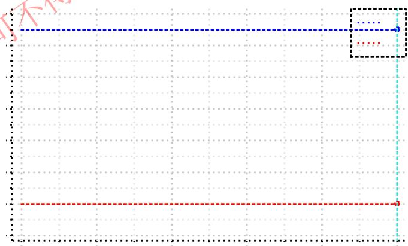

# 注意:

无需考虑左右两边的顺序
方程左侧不可写if方程
只有方程数等于变量数，才可以编译仿真

# 1. 方程-equation

声明方程

变型方程

初始方程

等式方程

连接方程

循环方程

条件方程

其他方程

作用：表示组件之间接口的连接

# 一般使用场景

拖拽式建模中连接组件

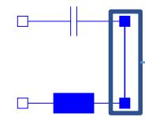

自动生成代码

model Conection

RLC.BasicModel.Resistance resistance

annotation (…);

RLC.BasicModel.Capacitor capacitor

annotation (…);

annotation (…);

equation

connect(capacitor.positivePin, resistance.positivePin)

annotation (…);

end Conection;

形式: concect(接口1，接口2)

annotation(…)；

表示连线的显示

注：连接方程一般不需文本书写，组件连接后自动生成

# 1. 方程-equation

声明方程

变型方程

初始方程

等式方程

连接方程

循环方程

条件方程

其他方程

# for方程

作用：使循环变量在一定范围内变化，对结构形式相同的方程进行迭代计算。

# 一般使用场景 单个迭代变量计算

model For1

Real x[5];

equation

for i in 1:5 loop

x[i] = i;

end for;

end For;

等价


model For1

Real x[5];

equation

for i in {1,2,3,4,5} loop

x[i] = i;

end for;

end For1;

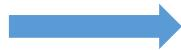

x[1] = 1;

x[2] = 2;

x[3] = 3;

x[4] = 4;

x[5] = 5;

# 形式:

range为向量

for <var> in <range> loop

<方程>

end for;

# 1. 方程-equation

声明方程

变型方程

初始方程

等式方程

连接方程

循环方程

条件方程

其他方程

# for方程

作用：使循环变量在一定范围内变化，对结构形式相同的方程进行迭代计算。

# 一般使用场景 多个迭代变量计算

model For2

Real x[2,4];

equation

for i in 1:2 loop

for j in 1:4 loop

x[i,j] = i + j;

end for;

end for;

end For2;

等价

model For2

Real x[2,4];

equation

for i in 1:2, j in 1:4 loop

x[i,j] = i + j;

end for;

end For2;

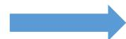

x[1,1] = 1+1;

x[1,2] = 1+2;

x[1,3] = 1+3;

$\times [ 1 , 4 ] = 1 + 4 ;$

x[2,1] = 2+1;

$\times [ 2 , 2 ] = 2 + 2 ;$

x[2,3] = 2+3;

$\times [ 2 , 4 ] = 2 + 4 ;$

# 形式:

for <var1> in <range1>, <var2> in <range2>loop

<方程>

end for;

# 注意:

1. 使用“,”隔开多个迭代器
2. range1、range2均为向量

# 1. 方程-equation

声明方程

变型方程

初始方程

等式方程

连接方程

循环方程

条件方程

其他方程

# if方程

作用：根据不同的判断条件选择计算方式。

形式1:

model If

$$
\mathrm {R e a l} u = \sin (1 0 ^ {*} \mathrm {t i m e});
$$

$$
\text {R e a l y};
$$

equation

$$
i f u > 0. 5 t h e n
$$

$$
y = 0. 5;
$$

$$
e l s e i f u <   - 0. 5 t h e n
$$

$$
y = - 0. 5;
$$

else

$$
y = u;
$$

end if;

$$
e n d \mathrm {I f};
$$

if <条件> then

<方程>

elseif <条件> then

<方程>

else

<方程>

end if ;

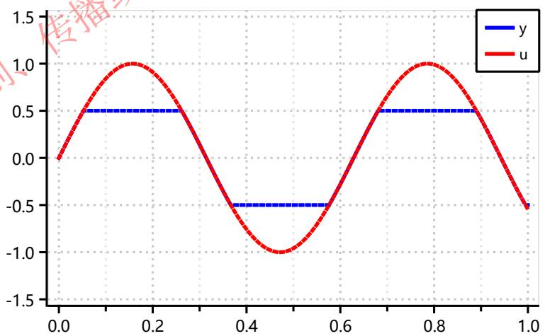

# 注意:

1. 各分支方程数量必须一致；
2. 各分支的条件均为布尔量；
3. elseif 可出现0到多次；
4. else最多出现一次, 如果if和elseif分支的条件为参数或常量，则可以没有else分支；

# 1. 方程-equation

声明方程

变型方程

初始方程

等式方程

连接方程

循环方程

条件方程

其他方程

# if方程

作用：根据不同的判断条件选择计算方式。

简写方式：用于分支方程数量为1的简单if语句赋值;

model If Real u $=$ sin(10 \* time);
Real y;
equation
y $=$ if u>0.5 then 0.5 elseif u<-0.5 then -0.5 else u;
end If;

# 形式2:

```txt
<variable> = if <条件1> then <value1> else if <条件2> then <value2> else <value3>
```

# 1. 方程-equation

声明方程

变型方程

初始方程

等式方程

连接方程

循环方程

条件方程

其他方程

# when方程

作用：表示在事件时刻有效的瞬态方程, 条件变为true时触发一次。

model When Real $\mathbf{x} =$ time; Real y;
equation when $x > 2$ then $\mathrm{y} = \mathrm{x};$ elsewhen $x > 3$ then $\mathrm{y} = 0;$ end when;
end When;

形式:

```txt
when <条件> then
<方程>
elsewhen <条件> then
<方程>
end when;
```

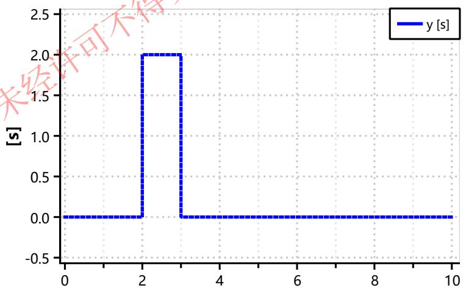

# 注意:

1. when语句中左边变量为离散变量
2. elsewhen可以出现0到多次
3. when方程不能嵌套在when、if、for方程中。

# <方程 $>$ 只能是以下形式之一

1. $y = \mathsf { e x p r } ,$ 左边是变量名
2. ( , , …) $=$ function(in , in , …), 左边为变量列表
3. assert(), terminate(), reinit()
4. 满足上述要求的if方程和for方程，不能有when方程。

# 1. 方程-equation

声明方程

变型方程

初始方程

等式方程

连接方程

循环方程

条件方程

其他方程

# when方程

# 注意事项

1. <条件>是布尔型的标量或向量，

标量条件变为true，该分支的方程生效

向量条件中只要任何一个元素变为true，该分支中的方程就生效；

model When

Real x = time;

Real y1;

Real y2;

equation

when sample(0, 2) or x < 5

then

y1 = x;

end when;

when {sample(0, 2), x < 5}

then

y2 = x;

end when;

end When;

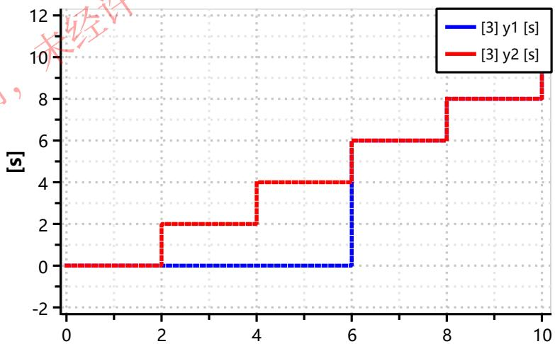

如果改成{sample(0, 2), x > 5}，结果会有什么变化？

# 1. 方程-equation

声明方程

变型方程

初始方程

等式方程

连接方程

循环方程

条件方程

其他方程

# when方程

# 注意事项

2. when中方程优先级高于elsewhen中方程；

model When

Real $\mathsf { x } =$ time;

Real y;

equation

when time $> 2$ then

$\mathsf { y } = \mathsf { x } _ { \prime }$

elsewhen time > 2

then

y = 0;

end when;

end When;

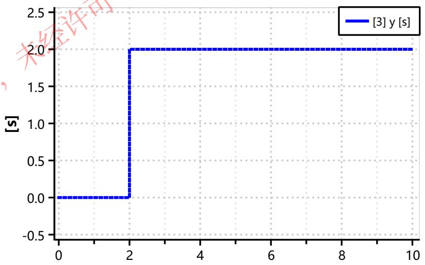

# 1. 方程-equation

声明方程

变型方程

初始方程

等式方程

连接方程

循环方程

条件方程

其他方程

# assert方程

作用：模型检查和校验的一种手段，当条件不满足时，输出消息，停止仿真

model Assert

Real a;

equation

a = sin(time);

assert $( \mathsf { a } ) > - \mathsf { 1 }$ , "退出仿真");

end Assert;

model Assert

Real a;

equation

a = sin(time);

assert(a > -0.5, "退出仿真");

end Assert;

# 形式:

assert(<条件>，<消息>)

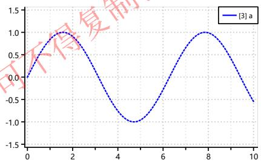

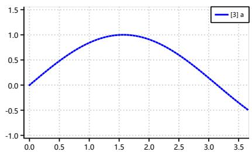

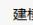

# 仿真

This log was created by MwSolver at Tue May 04 15:24:39 2021.

Event processing was done at Time =0

Sinulation started at Tine = O using integration nethod dassl

Error:Assert was triggered:

退出仿真

Error:Assert condition:

Sinulation terninated at Tine = 3.68 (StopTime = 10)

CPU Tine for Simulation: 0.001s

Nunber of Tine Events:

Nunber of State Events: 0

Number of Grid Points: 184

0

Haxinun integration stepsize: 0.02

错误代码：5。

# 注意：

1. <条件>为布尔型；
2. <消息 $>$ 为字符串型，即“输出提示”

# 1. 方程-equation

声明方程

变型方程

初始方程

等式方程

连接方程

循环方程

条件方程

其他方程

# terminate方程

作用：正常结束仿真程序。

一般与when语句联用，通过when语句触发terminate，仿真模型程序输出指定的消息字符串之后退出

model Terminate

Real a;

equation

a = sin(time);

when $\textsf { a } < = - 0 . 5$ then

terminate("退出仿真");

end when;

end Terminate;

形式:

terminate(<消息>)

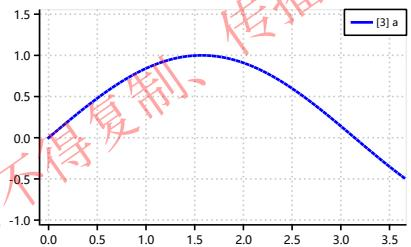
仿真设置

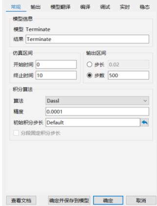
2

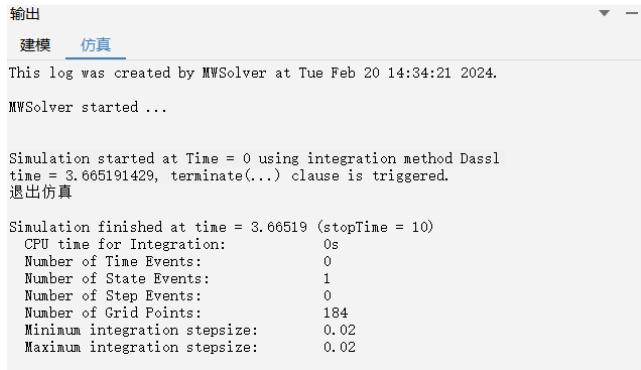

# 注意：

<消息 $>$ 为字符串型，即“输出提示”

# 1. 方程-equation

声明方程

变型方程

初始方程

等式方程

连接方程

循环方程

条件方程

其他方程

# reinit方程

# 作用：用于重新初始化状态变量

model Ball "弹跳小球"

final parameter Real ${ \mathfrak { g } } = 9 . 8$ "重力加速度";

parameter Real coef $= 0 . 9$ "弹性系数";

parameter Real ${ \mathsf { h } } 0 = 1 0$ "初始高度";

Real h "小球高度";

Real v "小球速度";

Boolean flying "是否运动";

initial equation

$\mathsf { h } = \mathsf { h } 0 ; \quad$

equation

flying $=$ not $\mathrm { h } < = 0$ and $\mathsf { v } < = 0 \mathsf { \Omega }$ );

der(v) $=$ if flying then -g else 0;

v = der(h);

when h $< = 0$ then

reinit(v, -coef * v);

end when;

end Ball;

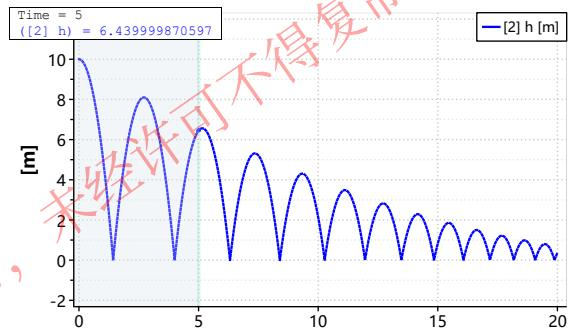

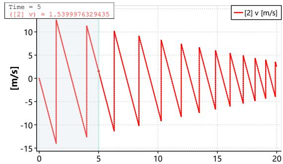

# 注意：

1. reinit只能使用在when语句中
2. 同一个状态变量只能在一个方程中使用reinit

# 形式:

reinit(状态变量，新的初始值)

# 1. 方程-equation

<table><tr><td rowspan="2">声明区域方程</td><td colspan="3">声明方程</td><td>给定变量约束</td></tr><tr><td colspan="3">变形方程</td><td>替换类的声明方程，用作属性修改</td></tr><tr><td rowspan="9">方程区域方程</td><td colspan="2">初始化方程</td><td>initial equation</td><td>用作变量的初始化定义</td></tr><tr><td rowspan="8">常规方程</td><td>等式方程</td><td>=</td><td>定义变量直接的关系</td></tr><tr><td>连接方程</td><td>connect</td><td>连接组件</td></tr><tr><td>循环方程</td><td>for</td><td>用于多个迭代变量计算</td></tr><tr><td rowspan="2">条件方程</td><td>if</td><td>用于多种计算方式的选择</td></tr><tr><td>when</td><td>用于表示在事件时刻有效的瞬态</td></tr><tr><td rowspan="3">其他方程</td><td>assert()</td><td>用于模型检查与校验</td></tr><tr><td>terminate</td><td>用于正常结束仿真程序</td></tr><tr><td>reinit()</td><td>用于重新初始化状态变量</td></tr></table>

# 目录

1. 方程-equation
2. 算法-algorithm
3. 本章回顾

# 2. 算法-algorithm

# 方程与算法的区别：

方程采用陈述式建模，即不指定数据流向和控制流，等式赋值没有顺序；算法采用过程式建模，即语句按其出现的顺序执行，且等号左边是未知量，右边是已知量；

```txt
model Average
parameter Real x[:] = {10, 20, 30, 40, 50};
Real average;
Real sum;
algorithm
sum := 0;
for i in 1: size(x, 1) loop
sum := sum + x[i];
end for;
average := sum / size(x, 1);
end Average;
```

# 注意：

尽量减少使用algorithm，能用equation尽量用equation。算法区域作为一个整体，因此一般将算法封装成function。

model Average parameter Real x[:] = {10, 20, 30, 40, 50}; Real average;
equation average $=$ ModelicaGrammar.Behavior.Average_f(x);
end Average;

```txt
function Average_f
input Real x[:];
output Real average;
Real sum;
algorithm
sum := 0;
for i in 1: size(x, 1) loop
sum := sum + x[i];
end for;
average := sum / size(x, 1);
end Average_f;
```

算法区域以“equation”关键词开始，终止于类定义结束“end”或关 键词 “public”、“protected”、“algorithm”、“equation”、 “initial algorithm”、“initial equation”之一。

算法只能出现在算法区域。

# 2. 算法-algorithm

算法由一系列算法语句组成。

<table><tr><td rowspan="10">算法语句</td><td>赋值语句</td><td>“:=”</td><td>定义各变量之间的约束关系</td></tr><tr><td rowspan="2">循环语句</td><td>for</td><td>用于迭代变量计算(与等式中使用相同)</td></tr><tr><td>while</td><td>用于具有约束条件的迭代计算</td></tr><tr><td rowspan="2">条件语句</td><td>if</td><td>用于多种计算方式的选择(与等式中使用相同)</td></tr><tr><td>when</td><td>用于表示在事件时刻有效的瞬态(与等式中使用相同)不能用于function中</td></tr><tr><td rowspan="5">其他语句</td><td>break</td><td>用于终止for、while循环计算</td></tr><tr><td>return</td><td>终止函数调用，返回当前输出变量的值</td></tr><tr><td>assert</td><td>用于模型检查与校验(与等式中使用相同)</td></tr><tr><td>terminate</td><td>用于正常结束仿真程序(与等式中使用相同)</td></tr><tr><td>reinit</td><td>用于重新初始化状态变量(与等式中使用相同)</td></tr></table>

# 2. 算法-algorithm

# 赋值语句

# 循环语句

# 条件语句

# 其他语句

# 作用：定义各变量之间的约束关系

```txt
function Average_f
input Real x[:];
output Real average;
Real sum;
algorithm
sum := 0;
for i in 1: size(x, 1) loop
sum := sum + x[i];
end for;
average := sum / size(x, 1);
end Average_f;
```

# 形式:

a := b

使用“: = 区分与 $" = "$ 的含义不同

# 2. 算法-algorithm

# 赋值语句

# 循环语句

# 条件语句

# 其他语句

# for语句

作用：使循环变量在一定范围的值里变化，对结构形式相同的方程进行迭代计算。

```txt
function Average_f
input Real x[:];
output Real average;
Real sum;
algorithm
sum := 0;
for i in 1: size(x, 1) loop
sum := sum + x[i];
end for;
average := sum / size(x, 1);
end Average_f;
```

使用方式与等式中for方程完全相同，不再赘叙。

# 2. 算法-algorithm

# 赋值语句

# 循环语句

# 条件语句

# 其他语句

# while语句

作用：用于约束条件的迭代计算

```txt
function Average_f
input Real x[:];
output Real average;
Real sum;
Integer i;
algorithm
sum := 0;
i := 0;
while i <= size(x, 1) loop
i = i + 1;
sum := sum + x[i];
end while;
average := sum / size(x, 1);
end Average_f;
```

for语句用于已知迭代次数的算法

while语句用于已知需满足的条件，不限迭代次数的算法

形式:

while <条件> loop<语句>end while

条件为布尔量
条件的值为true，则进入循环
条件的值为false，则转到“end w ile”之后执行

# 2. 算法-algorithm

# 赋值语句

# 循环语句

# 条件语句

# 其他语句

# if语句

作用：根据不同的判断条件选择计算方式。

```vhdl
function Average_f
input Real x[:];
output Real average;
algorithm
average := 0;
for i in 1: size(x, 1) loop
if x[i] > 0 then
average := average + x[i];
else
average := average - x[i];
end if;
end for;
average := average / size(x, 1);
end Average_f;
```

通过if语句判断，求解输入向量中所有值的绝对值的平均数

使用方式与等式中if方程完全相同，不再赘叙。

# 2. 算法-algorithm

# 赋值语句

# 循环语句

# 条件语句

# 其他语句

# when语句

作用：表示在事件时刻有效的瞬态方程, 条件变为true时触发一次。

model When

Real x;

Real y;

algorithm

when x > 2 then

y = x;

elsewhen x > 3 then

y = 0;

end when;

end When;

不能用于function中，只能用于model或block中。

使用方式与等式中when方程完全相同，不再赘叙。

# 2. 算法-algorithm

# 赋值语句

# 循环语句

# 条件语句

# 其他语句

# break语句

作用：用于终止while/for循环语句

```autohotkey
function Position
input Real x[:];
input Real val;
output Integer index;
algorithm
index := size(x, 1);
while index >= 1 loop
if x[index] == val then break;
else
index := index - 1;
end if;
end while;
end Position;
```

# 注意：

break语句只能用在算法中的while/for循环语句中。

while/for循环中遇到break语句:转到最内层的“end while”/ “end while”后执行。

# 思考：

如果删除break结果会如何？

# 2. 算法-algorithm

# 赋值语句

# 循环语句

# 条件语句

# 其他语句

# return语句

作用：用于终止函数调用，输出变量的当前值作为函数调用的结果返回

```txt
function Position
input Real x[:];
input Real val;
output Integer index;
algorithm
for i in 1: size(x, 1) loop
if x[i] == val then
index := i;
return;
end if;
end for;
index := 0;
end findValue;
```

# 注意：

return语句只能在function中使用。

```txt
model Location
parameter Real a[5] = {1, 4, 6, 7, 3};
parameter Real b = 6;
Real position;
equation
position = ModelicaGrammar.Behavior.Position(a, b);
end Location;
```

# 思考：

如果删除return结果会如何？

如果将return改成break会如何？

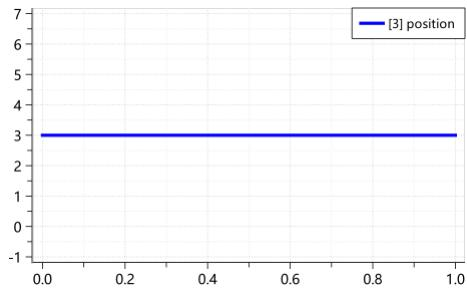
return

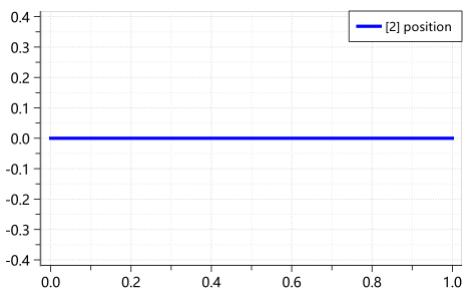
break

# 2. 算法-algorithm

赋值语句

循环语句

条件语句

其他语句

# assert语句

作用：模型检查和校验的一种手段。

# terminate语句

作用：正常结束仿真程序。

# reinit语句

作用：用于重新初始化状态变量(应用了der()的变量)。

使用方式与等式中assert、terminate、reinit方程完全相同，不再赘叙。

# 2. 算法-algorithm

# 小结

<table><tr><td rowspan="10">算法语句</td><td>赋值语句</td><td>“:=”</td><td>定义各变量之间的约束关系</td></tr><tr><td rowspan="2">循环语句</td><td>for</td><td>用于多个迭代变量计算(与等式中使用相同)</td></tr><tr><td>while</td><td>用于具有约束条件的迭代计算</td></tr><tr><td rowspan="2">条件语句</td><td>if</td><td>用于多种计算方式的选择(与等式中使用相同)</td></tr><tr><td>when</td><td>用于表示在事件时刻有效的瞬态(与等式中使用相同)不能用于function中</td></tr><tr><td rowspan="5">其他语句</td><td>break</td><td>用于终止for、while循环计算</td></tr><tr><td>return</td><td>终止函数调用，返回当前输出变量的值</td></tr><tr><td>assert</td><td>用于模型检查与校验(与等式中使用相同)</td></tr><tr><td>terminate</td><td>用于正常结束仿真程序(与等式中使用相同)</td></tr><tr><td>reinit</td><td>用于重新初始化状态变量(与等式中使用相同)不能用于function中</td></tr></table>

# 目录

1. 方程-equation
2. 算法-algorithm
3. 本章回顾

# 3. 本章回顾

<table><tr><td rowspan="2">声明区域方程</td><td colspan="3">声明方程</td><td>给定变量约束</td></tr><tr><td colspan="3">变形方程</td><td>替换类的声明方程,用作属性修改</td></tr><tr><td rowspan="9">方程区域方程</td><td colspan="2">初始化方程</td><td>initial equation</td><td>用作变量的初始化定义</td></tr><tr><td rowspan="8">常规方程</td><td>等式方程</td><td>=</td><td>定义变量直接的关系</td></tr><tr><td>连接方程</td><td>connect</td><td>连接组件</td></tr><tr><td>循环方程</td><td>for</td><td>用于多个迭代变量计算</td></tr><tr><td rowspan="2">条件方程</td><td>if</td><td>用于多种计算方式的选择</td></tr><tr><td>when</td><td>用于表示在事件时刻有效的瞬态</td></tr><tr><td rowspan="3">其他方程</td><td>assert()</td><td>用于模型检查与校验</td></tr><tr><td>terminate</td><td>用于正常结束仿真程序</td></tr><tr><td>reinit()</td><td>用于重新初始化状态变量</td></tr><tr><td rowspan="10">算法区语句</td><td rowspan="10">算法语句</td><td>赋值语句</td><td>&quot;:=&quot;</td><td>定义各变量之间的约束关系</td></tr><tr><td rowspan="2">循环语句</td><td>for</td><td>用于多个迭代变量计算(与等式中使用相同)</td></tr><tr><td>while</td><td>用于具有约束条件的迭代计算</td></tr><tr><td rowspan="2">条件语句</td><td>if</td><td>用于多种计算方式的选择(与等式中使用相同)</td></tr><tr><td>when</td><td>用于表示在事件时刻有效的瞬态(与等式中使用相同)不能用于function中</td></tr><tr><td rowspan="5">其他语句</td><td>break</td><td>用于终止for、while循环计算</td></tr><tr><td>return</td><td>终止函数调用,返回当前输出变量的值</td></tr><tr><td>assert</td><td>用于模型检查与校验(与等式中使用相同)</td></tr><tr><td>terminate</td><td>用于正常结束仿真程序(与等式中使用相同)</td></tr><tr><td>reinit</td><td>用于重新初始化状态变量(与等式中使用相同)</td></tr></table>

# 3. 本章回顾

# 课堂回顾

1. 下面属于声明方程的是 () 。

A. Real $v = 1 0 0$

B. R*I=V

C. V:=10

D. if方程

2. 和方程 $\mathsf { R } ^ { \star } \mathsf { I } = \mathsf { V }$ 等价的是 () 。

A. V:=R*I

B. R:=V/I

C. I:=V/R

D. I=V/R

3. 可以表达循环的方程是 () 。

A. 声明方程

B. 等式方程

C. for方程

D. if方程

4. 用来做判断的方程是 () 。

A. 变型方程

B. for方程

C. if方程

D. when方程

5. if方程中else分支最多可以出现 () 次 。

A. 1

B. 2

C. 3

D. 无限制

6. when方程中可以嵌套（）个when方程 。

A. 0

B. 1

C. 2

D. 无限制

7. 给用户提供错误提示，并终止仿真的是（） 。

A. if

B. when

C. assert

D. reinit

8. 用于状态变量初始化的方程是 () 。

A. if

B. when

C. assert

D. reinit

9. 算法区域以下列关键字 () 开始。

A. if

B. when

C. equation

D. algorithm

10. 可以中断循环的是 () 。

A. for

B. while

C. if

D. break

11. 正常终止仿真，并输出终止原因的是 () 方程。
12. 可以用于连接的是 () 方程 。
13. 条件有false变为true的瞬间，其中的方程计算一次，该

程是 () 方程 。

14. when语句中不能嵌套在 () 语句中。
15. break语句只能用于算法段中 () 语句或是 () 语句 。

# 3. 本章回顾

# 课后作业

1. 使用算法，采用for语句和while语句两种方式，定义一个“n!”阶乘模型，结果可根据n的值进行计算。
2. 使用等式，采用for方程的方式，定义“n!”阶乘模型，并将1!, !, !,…,n!均存储至结果数列中。
3. 已知RLC电路两端电压值为24V，利用Modelica语法根据物理拓扑关系描绘出仿真模型，并观测电容、电感两端电压以及流过的电流的变化。

RLC电路物理拓扑图以及系统原理方程如下：

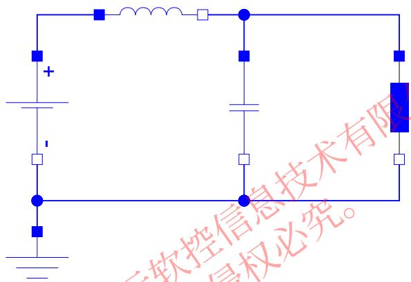

$$
\begin{array}{l} V _ {R} = i _ {R} \cdot R \\ C \cdot \frac {d V _ {C}}{d t} = i _ {C} \\ L \cdot \frac {d i _ {L}}{d t} = V _ {L} \\ V _ {R} = V _ {C} = V - V _ {L} \\ \dot {\boldsymbol {I}} _ {L} = \dot {\boldsymbol {I}} _ {R} + \dot {\boldsymbol {I}} _ {C} \\ \end{array}
$$

建立知识规范， 营造协同生态

积累工业模型， 发展可控平台

融入中国创新，打造先进软件

# 谢谢！
