# Modelica语法详解_模型重用

- Source: `MWORKS高校星火计划资料包/培训课程配套材料/01-官网课程配套材料/00-快速入门课程/01-Sysplorer快速入门/05-Modelica语法详解/09-Modelica语法详解-模型重用.pdf`
- Converted by: `MinerU precise API`
- Conversion date: `2026-05-08`
- Review status: `MinerU converted; spot check recommended`
- Priority: `P0`
- Source SHA1: `f03b21456c58`
- MinerU batch id: `4fd3f27b-0f14-4c8d-9d0d-58e9ae86aba5`
- Images: `49`
- Notes: 继承、替换、参数化和可复用模型结构。

# 模型重用

# Modelica语法详解

苏州同元软控信息技术有限公司

2024年2月27日

# 目录

1. 继承重用
2. 实例化重用
3. 重声明重用
4. 本章回顾

# 1. 继承重用

仔细观察下面的三个模型的代码，有何特点？

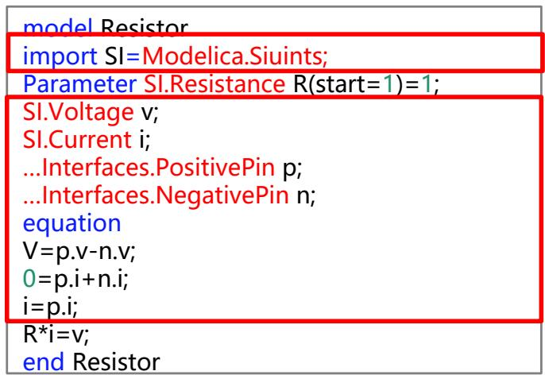
电阻

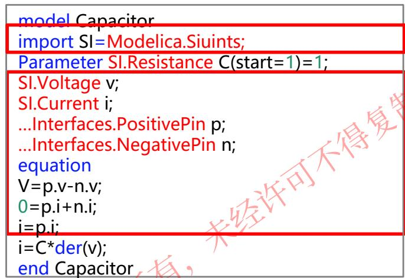
电容

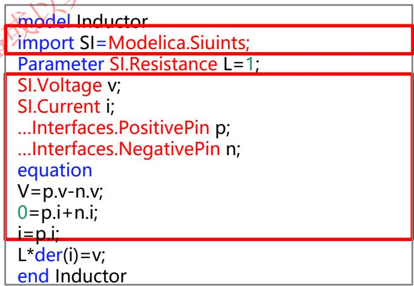
电感

三个组件模型，绝大部分代码是相同的，出现大量的重复代码，给后期代码的修改和维护造成很大的不便。

冗余是一切罪恶的根源

# 1. 继承重用

再阅读下面的代码，和前面的代码进行比较，有何不同？

partial model PartialPort SI.Voltage v; SI.Current i; Interfaces.PositivePin p; Interfaces.NegativePin n; equation $\mathsf{v} = \mathsf{p.v} - \mathsf{n.v};$ 0 $= \mathsf{p.i} + \mathsf{n.i};$ $\dot{\mathbf{i}} = \mathbf{p.i};$ end PartialPort;

# 基类

```txt
model Inductor
parameter SI.Inductance L = 1;
extends PartialPort;
equation
L * der(i) = v;
end Inductor;
```

# 电阻

```matlab
model Capacitor parameter SI.Capacitance C = 1; extends PartialPort;
equation i = C * der(v);
end Capacitor;
```

# 电容

model Resistor parameter SI.Resistance $R = 1$ extends PartialPort;
equation $\mathsf{R}^{*}\mathsf{i} = \mathsf{v};$ end Resistor;

# 电感

通过继承重用的方式，大大简化组件模型代码，避免不必要的冗余，避免了模型维护和修改时的繁琐。

# 1. 继承重用-使用场景

1. 继承connector，设计不同的图标和连接线
2. 继承partial类，完善模型行为方程

```txt
connector FluidPort_a "inlet"
extends FluidPort;
1 annotation (defaultComponentName = "port_a",
1 Icon(coordinateSystem(preserveAspectRatio = false,
  extent = {{-100, -100}, {100, 100}}), graphics = {Ellipse(
  extent = {{-100, 100}, {100, -100}}),
  lineColor = {0, 127, 255},
  fillColor = {0, 127, 255},
  fillPattern = FillPattern.Solid), Ellipse(
  extent = {{-100, 100}, {100, -100}}),
  lineColor = {0, 0, 0},
  fillColor = {0, 127, 255},
  fillPattern = FillPattern.Solid}));
end FluidPort_a;
```

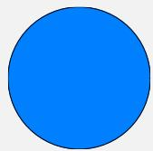

# 入口

# 场景1：继承connector，设计不同的图标和连接线

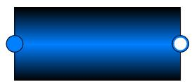


pipe

connector FluidPort replaceable package Medium $=$ Modelica Media. Interfaces. PartialMedium annotation (choicesAllMatching $\equiv$ true); flow Medium.MassFlowRate m_flow; Medium.AbsolutePressure p; stream Medium.SpecificEnthalpy h_outflow; stream Medium.MassFraction Xi_outflow[Medium.nXi]; stream Medium.ExtraProperty C_outflow[Medium.nC];
end FluidPort;

# 原始接口


```lua
connector FluidPort_b "outlet"
extends FluidPort;
annotation (defaultComponentName = "port_b",
Icon(coordinateSystem(preserveAspectRatio = fa,
extent = {{-100, -100}, {100, 100}}), graphics = {
Ellipse(
extent = {{-100, 100}, {100, -100}}),
lineColor = {0, 127, 255},
fillColor = {0, 127, 255},
fillPattern = FillPattern.Solid),
Ellipse(…
Ellipse(…
end FluidPort_b;
```

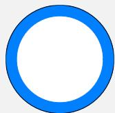

# 出口

# 1. 继承重用-使用场景

# 场景2：继承partial类，完善模型行为方程

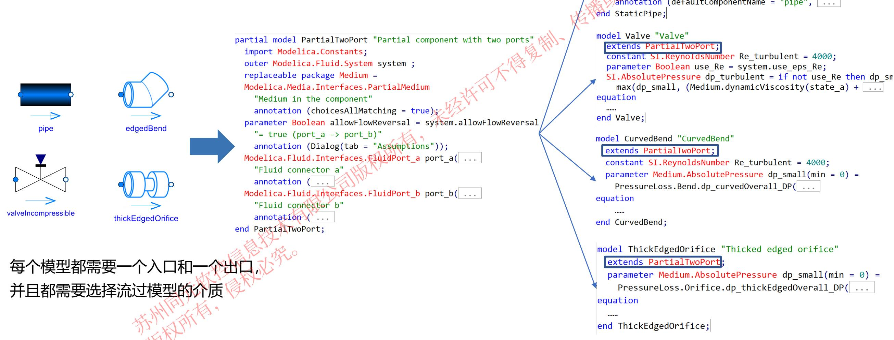

# 1. 继承重用-一般结构

record ColorData

parameter Real red $= 0 . 2$ ;

parameter Real blue $= 0 . 6 ;$

Real green;

end ColorData;

# 等价


model Color

parameter Real red $= 0 . 2$ ;

parameter Real blue $= 0 . 6 { \mathrm { ; } }$

Real green;

equation

red $^ +$ blue + green = 1;

end Color;

# 继承时要改变值怎么办？

model Color

extends ColorData;

equation

red + blue + green = 1;

end Color;

record ColorData

parameter Real red $= 0 . 2 ;$

parameter Real blue $= 0 . 6 { \mathrm { ; } }$

Real green;

end ColorData;

model Color

extends ColorData(red = 0.3);

equation

red + blue + green = 1;

end Color;

# 等价


model Color

parameter Real red $= 0 . 3$ ;

parameter Real blue $= 0 . 6 { \mathrm { ; } }$

Real green;

equation

red + blue + green = 1;

end Color;

一般结构：

extends $+$ 基类路径(参数/变量变型)

# 1. 继承重用-注意事项

# 1.继承保护

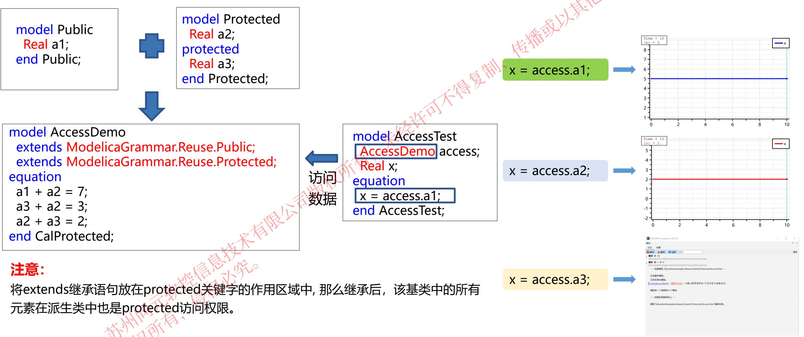

# 1. 继承重用-注意事项

# 2.单一继承

record ColorData

parameter Real red = 0.2;

parameter Real blue $= 0 . 6 { \mathrm { ; } }$

Real green;

end ColorData;

model Color

extends ColorData;

parameter Real red = 0.2;

parameter Real blue $= 0 . 6$

equation

red $^ +$ blue + green = 1;

第一种声明方式

model Color

extends ColorData;

parameter Real red $= 0 . 2$ ;

parameter Real blue $= 0 . 3$

equation

red + blue + green = 1;

end Color;

第二种声明方式

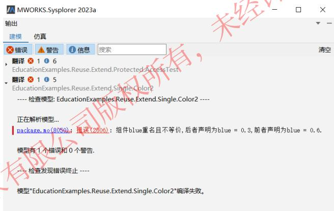

# 声明单一继承规则：

继承后如果有多个相同的声明，只保留一个声明。
继承后如果对同一个元素有多个不同的声明，会报错。

思考：左侧的两种声明方式是否会报错？

# 1. 继承重用-注意事项

# 3.继承限制

record RecordA

end RecordA;


model ModelA

extends RecordA; //正确

end ModelA;

package PackageA

end PackageA;


model ModelB

extends PackageA; //错误

end ModelB;

打√为派生类可继承的基类

<table><tr><td></td><td colspan="7">基类</td></tr><tr><td>派生类</td><td>package</td><td>function</td><td>type</td><td>record</td><td>connector</td><td>block</td><td>model</td></tr><tr><td>package</td><td>✓</td><td></td><td></td><td></td><td></td><td></td><td></td></tr><tr><td>function</td><td></td><td>✓</td><td></td><td></td><td></td><td></td><td></td></tr><tr><td>type</td><td></td><td></td><td>✓</td><td></td><td></td><td></td><td></td></tr><tr><td>record</td><td></td><td></td><td></td><td>✓</td><td></td><td></td><td></td></tr><tr><td>connector</td><td></td><td></td><td>✓</td><td>✓</td><td>✓</td><td></td><td></td></tr><tr><td>block</td><td></td><td></td><td></td><td>✓</td><td></td><td>✓</td><td></td></tr><tr><td>model</td><td></td><td></td><td></td><td>✓</td><td></td><td>✓</td><td>✓</td></tr></table>

# 目录

1. 继承重用
2. 实例化重用
3. 重声明重用
4. 本章回顾

# 2. 实例化重用-使用场景

1. 接口实例化
2. 模型封装
3. 系统仿真模型构建

# 场景1：接口实例化

新开发的模型中需要接口，可直接通过实例化的方式进行引用

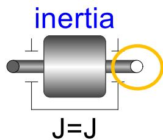

model Inertia "1D-rotational component with inertia" Rotational.Interfaces.Flange_a flange_a "Left flange of shaft" annotation (Placement(transformation(extent $=$ {{-110，-10},{-90，10}}},... Rotational.Interfaces.Flange_b flange_b "Right flange of shaft" annotation (Placement(transformation(extent $=$ {{90，-10},{110，10}}},...
parameter SI.Inertia J(min $= 0$ start $= 1$ "Moment of inertia"; parameter StateSelect stateSelect $\equiv$ StateSelect.default "Priority to use phi and w as states" annotation (HideResult $\equiv$ true,Dialog(table $\equiv$ "Advanced")); SI.Angle phi(stateSelect $\equiv$ stateSelect) "Absolute rotation angle of component" annotation (Dialog(group $\equiv$ "Initialization",showStartAttribute $\equiv$ true)); SI.AngularVelocity w(stateSelect $\equiv$ stateSelect) "Absolute angular velocity of component (= der(phi))" annotation (Dialog(group $\equiv$ "Initialization",showStartAttribute $\equiv$ true)); SI.AngularAcceleration a "Absolute angular acceleration of component (= der(w))" annotation (Dialog(group $\equiv$ "Initialization",showStartAttribute $\equiv$ true)); equation phi $=$ flange_a phi; phi $=$ flange_b phi; w $=$ der phi); a $=$ der(w); J\*a $=$ flange_a.tau + flange_b.tau; end Inertia;

# 2. 实例化重用-使用场景

# 场景2：模型封装

PID控制器，由比例单元(P)、积分单元(I)和微分单元(D)组成

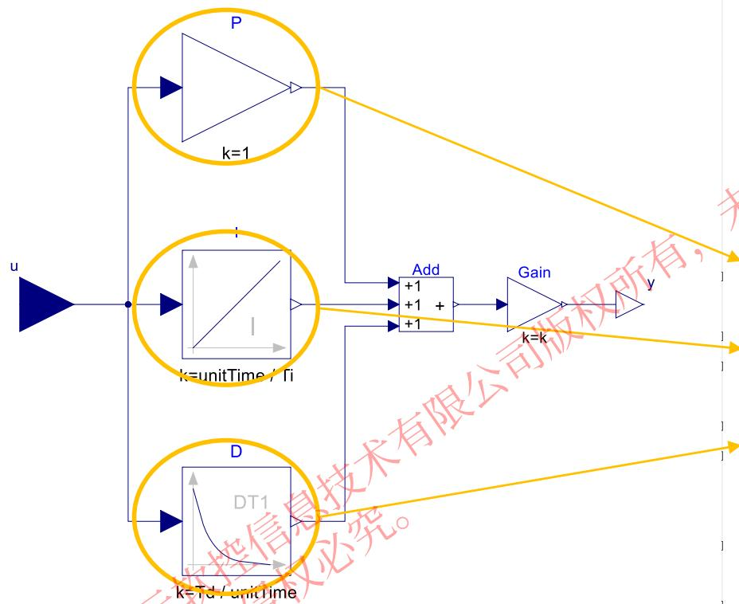

```txt
block PID "PID-controller in additive description form"
 extends Interfaces.SISO;
parameter Real k(unit = "1") = 1 "Gain";
parameter SIunits.Time Ti(min = ModelicaConstants/small, start = 0.5);
parameter SIunits.Time Td(min = 0, start = 0.1);
parameter Real Nd(min = ModelicaConstants/small) = 10;
parameter Modelica Blocks Types InitPID initType =
ModelicaBlocks Types InitPID.DoNotUse_IntegratorState;
parameter Real xi_start = 0;
parameter Real xd_start = 0;
parameter Real y_start = 0;
constant SI.Time unitTime = 1;
```

```lua
Blocks.Math.Gain P(k = 1) "Proportional part of PID controller" annotation (Placement(transformation(extent = {{-60, 60}, {-20, 100}}, ...
```

```txt
Blocks.Continuous.Integrator I(k = unitTime / Ti, y_start = xi_start, ... annotation (Placement(transformation(extent = {{-60, -20}, {-20, 20}}), ...
```

```txt
Blocks.Continuous.Derivative D(k = Td / unitTime, ...
annotation (Placement(transformation(extent = {{-60, -100}, {-20, -60}}, ...)
```

Blocks.Math.Gain Gain $(\mathsf{k} = \mathsf{k})$ "Gain of PID controller" annotation (Placement(transformation(extent $=$ {{60，-10}, {80, 10}}), rotation $=$

```txt
Blocks.Math.Add3 Add annotation (Placement(transformation(extent = {{20, -10}}, ...)
```

# 2. 实例化重用-使用场景

# 场景3：系统仿真模型构建

蔡氏电路：一种简单的非线性电子电路设计，它可以表现出标准的混沌理论行为。

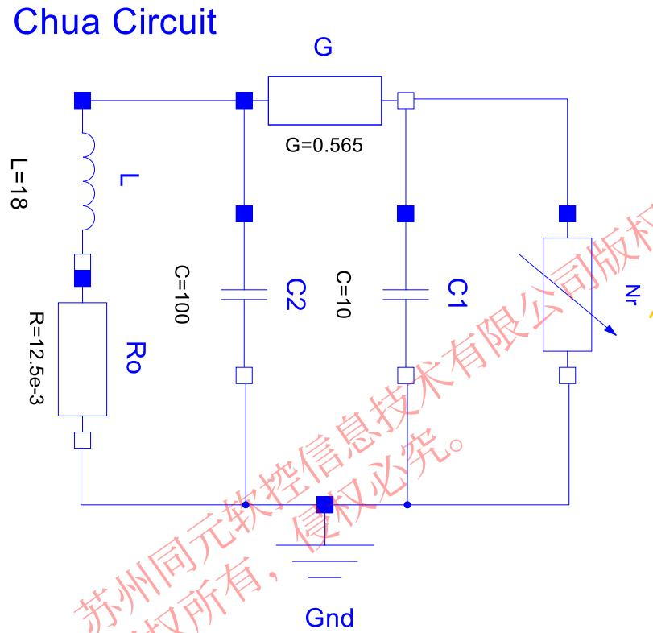

model ChuaCircuit "Chua's circuit, ns, V, A" import Modelica.Electrical.Analog.Basic; import Modelica.Electrical.Analog.ExamplesUtilities; import Modelica Icons; extends Icons_Example:
Basic.Inductor L(L = 18,i(start $= 0$ ,fixed $\equiv$ true)) annotation (.. Basic.Resistor Ro(R = 12.5e-3) annotation (.. Basic.Conductor G(G = 0.565) annotation (.. Basic.Capacitor C1(C = 10,v(start = 4,fixed $\equiv$ true)) annotation (.. Basic.Capacitor C2(C = 100,v(start = 0,fixed $\equiv$ true)) annotation (.. Utilities.NonlinearResistor Nr(.. Basic.Ground Gnd annotation (.. equation connect(L.n,Ro.p) annotation (Line(points $=$ {{-75,13},{-75,8}})); connect(C2.p,G.p) annotation (Line... connect(L.p,G.p) annotation (Line... connect(G.n,Nr.p) annotation (Line... connect(C1.p,G.n) annotation (Line... connect(Ro.n,Gnd.p) annotation (Line... connect(C2.n,Gnd.p) annotation (Line... connect(Gnd.p,C1.n) annotation (Line... connect(Gnd.p,Nr.n) annotation (Line... annotation (.. end ChuaCircuit;

# 2. 实例化重用-一般结构

Interfaces.FluidInterfaces.FluidPort_a port_a(p(start = p_start))；

Modelica.Media.Water.WaterIF97_base.ThermodynamicState state;

Modelica.Electrical.Analog.Basic.Resistor R3(R = 1.e-3);

Modelica.SIunits.Pressure p(displayUnit = "MPa");

connector重用
• record重用
• model重用
• type重用

一般结构：

父类模型路径+ 实例化名（参数、变量、特殊类变型）

# 2. 实例化重用-一般结构

父类模型路径：待实例化的类在模型库中的路径，可通过拖拽类的方式直接生成

实例化名：符合Modelica命名规则，并能形象描述实例化类的作用

变型：对实例化后的类参数、变量初始值、变量、显示单位、特殊类（ replaceable/redeclare 单独讲解）进行变型

# 2. 实例化重用-使用方式

# 1.参数变型

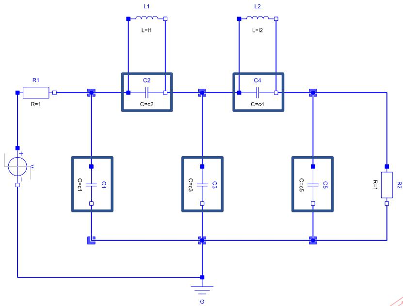

<table><tr><td colspan="4">组件参数</td></tr><tr><td colspan="4">常规</td></tr><tr><td colspan="4">参数</td></tr><tr><td>l1</td><td>1.304</td><td>H</td><td>filter coefficient l1</td></tr><tr><td>l2</td><td>0.8586</td><td>H</td><td>filter coefficient l2</td></tr><tr><td>c1</td><td>1.072</td><td>F</td><td>filter coefficient c1</td></tr><tr><td>c2</td><td>1 / (1.704992 ^ 2 * l1)</td><td>F</td><td>filter coefficient c2</td></tr><tr><td>c3</td><td>1.682</td><td>F</td><td>filter coefficient c3</td></tr><tr><td>c4</td><td>1 / (1.179945 ^ 2 * l2)</td><td>F</td><td>filter coefficient c4</td></tr><tr><td>c5</td><td>0.7262</td><td>F</td><td>filter coefficient c5</td></tr></table>

```matlab
model CauerLowPassAnalog extends Modelica Icons.Example;
Modelica.Electrical.Analog.Basic.Capacitor C1(C = c1, v(start = 0, fixed = true)) annotation (...);
Modelica.Electrical.Analog.Basic.Capacitor C2(C = c2) annotation (...);
Modelica.Electrical.Analog.Basic.Capacitor C3(C = c3, v(start = 0, fixed = true)) annotation (...);
Modelica.Electrical.Analog.Basic.Capacitor C4(C = c4) annotation (...);
Modelica.Electrical.Analog.Basic.Capacitor C5(C = c5, v(start = 0, fixed = true)) annotation (...);
end CauerLowPassAnalog;
```

实例化C1、C2、C3、C4、C5，通过变型设置电容值，这样就不必因为电容参数的不同而建立多个电容模型。

# 注意：

目前遇到的大多数示例中，被变型的组件属性都是参数。尽管Modelica规范中没有明确禁止对变量、常量等进行变型，但鉴于Modelica参数的设计意图，不推荐对变量、常量等进行变型。

# 2. 实例化重用-使用方式

# 2.数组变型

model Array

parameter Real x[2];

parameter Real y;

end Array;

model ArrayUse

Array A1[2](x = [1, 2; 1, 2], y = {2, 5});

end ArrayUse;


model ArrayUse

Array A1[2](each x = {1, 2}, y = {2, 5});

end ArrayUse;

model ArrayUseError

Array A1[2](x = [1, 2; 1, 2], y[1] = 2);

end ArrayUse;


ArrayUse

<A1

∨ A1[1]

<X

□x

x[1] 1

x[2]

2

□ y

2

∨ A1[2]

<X

x[1]

1

2

y

5


MWorks.Sysplorer 2..


□

仿真

---检查模型

ModelicaGrammar.Reuse.ArrayUseError--

正在解析模型

package.mo(194)：错误(3203)：元素

ModelicaGrammar.Reuse.ArrayUseError.A1的变型项y[1]中存在对数组分量的变型，变型非法，

模型有1个错误和0个警告

---检查发现错误终止---

# 注意：

使用“each”对所有数组元素中的某个属性赋相同的值。
必须对整个数组进行变型，不可以对单个数组元素进行变型。

# 2. 实例化重用-使用方式

# 3.单一变型

在一次变型中，不能对一个元素的同一个属性进行两次赋值修改

model M1

Real x[3];

end M1;

ModelicaGrammar.Reuse.M1 M2(x = ones(3));

ModelicaGrammar.Reuse.M1 M3(x = ones(3),x[2]=2);

# 正确


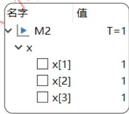

# 错误


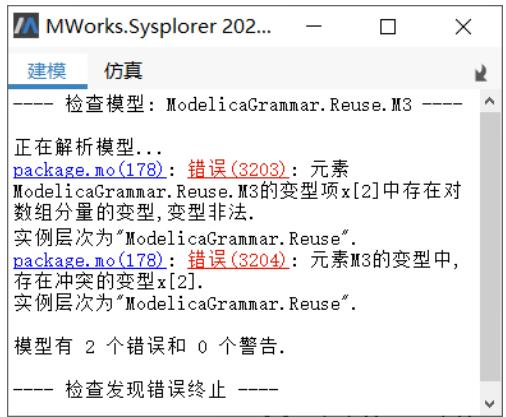

# 2. 实例化重用-注意事项

# 变型合并

model C1 parameter Real a;
end C1;
model C2 parameter Real b, c;
end C2;
model C3 final parameter Real x1 = 1;
parameter Real $\mathrm{x}2 = 2$ .
C1 x3[2](each a = 33);
C2 x4(b = 4);
C1 x5(a = 5);
extends C1;
extends C2(b = 6, c = 77);
end C3;
model C4 extends C3(x2 = 22, x4(c = 44), x5 = x3, a = 55, b = 66);
end C4;

<table><tr><td>变量</td><td>结果</td></tr><tr><td>x1</td><td>1</td></tr><tr><td>x2</td><td>22</td></tr><tr><td>x3[1].a</td><td>33</td></tr><tr><td>x3[2].a</td><td>33</td></tr><tr><td>x4.b</td><td>4</td></tr><tr><td>x4.c</td><td>44</td></tr><tr><td>x5.a</td><td>x3.a</td></tr><tr><td>a</td><td>55</td></tr><tr><td>b</td><td>66</td></tr><tr><td>c</td><td>77</td></tr></table>

C4变量赋值结果

# 注意：

每个元素只能赋值一次；
final元素不能进行赋值；
each表示数组中的每个变量均赋相同的值；
变形按照外层覆盖内层的原则进行合并；

# 目录

1. 继承重用
2. 实例化重用
3. 重声明重用
4. 本章回顾

# 3. 重声明重用-使用场景

1. 架构模型设计
2. 介质数据库

可替换重申明（ replaceable/ redeclare ）是其中一种快速替换模型的方法。

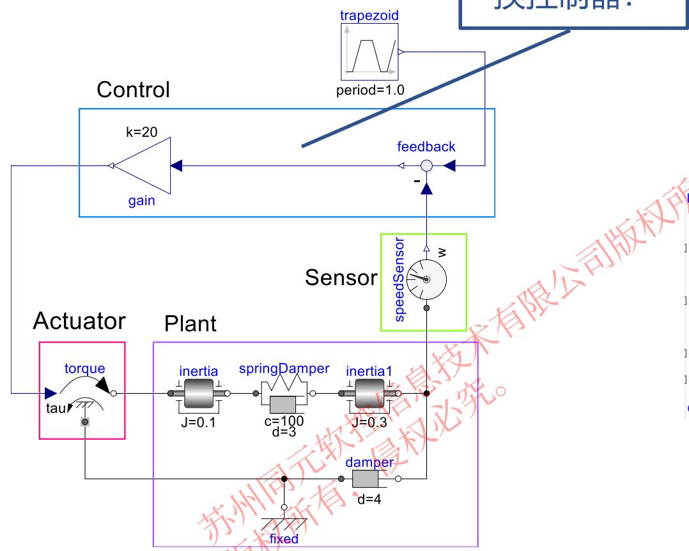
场景1：架构模型设计

$\textcircled{1}$ . 观察该系统的控制器，有三个接口，两个输入，一个输出，那么我们需要替换的控制器具有相同的接口数量和接口类型。
②. 设计一个架构模型，它只包含了接口，两个输入、一个输出

```lua
model PartialController "Interface for controller subsystem"
Modelica Blocks.Interfaces.RealInput setpoint "Desired system response"
annotation (Placement(transformation())
Modelica Blocks.Interfaces.RealInput measured "Actual system response"
annotation (Placement(transformation())
Modelica Blocks.Interfaces.RealOutput command "Command to send to actuator"
annotation (Placement(transformation())
annotation (Icon(coordinateSystem(extent = {{-100.0, -100.0}, {100.0, 100.0}}), ...
end PartialController;
```

# 3. 重声明重用-使用场景

$\textcircled{3}$ . 继承架构模型，开发不同的控制器模型

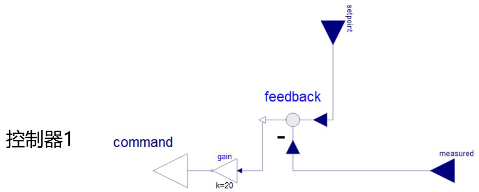

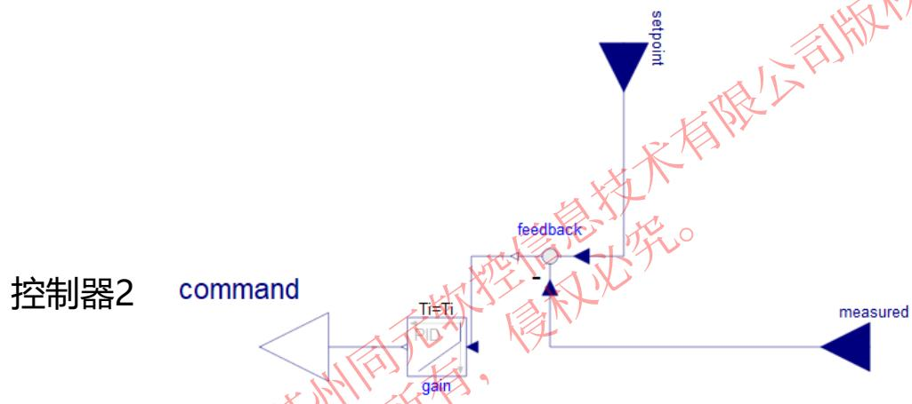

model Controller1 extends ReplaceableDemo.Interfaces.PartialController; Modelica Blocks.Math.Feedback feedback annotation (... Modelica Blocks.Math.Gain gain $(k = 20)$ annotation ( equation connect(gain.u, feedback.y) annotation (Line(origin $= \{-34.0$ , 21.0}, ... connectFeedback.u2, measured) . . . . . . . . . . . . . . . . . . . . . . . . . . . . . . . . . . . . . . . . . . . . . . . . . . . . . . . . . . . . . . . . . . . . . . . . . . . . . . . . . . . . . . . . . . . . . . . .. .. .. .. .. .. .. .. .. .. .. .. .. .. .. .. .. .. .. .. .. .. .. .. .. .. .. .. .. .. .. .. .. .. .. .. .. .. .. .. .. .. .. .. .. .. .. .. .. .. .. .. .. .. .. .. .. .. .. ... ... ... ... ... ... ... ... ... ... ... ... ... ... ... ... ... ... ... ... ... ... ... ... ... ... ... ... ... ... ... ... ... ... ... ... ... ... ... ... ... ... ... ... ... ... ... ... ... ... ... ... ... ... ... ... ... ... ... ... ... ... ... ... ... ... ... ... ... ... ... ... ... ... ... ... ... ... ... ... ... ...
		.. .
		.. .
		.. .
		.. .
		.. .
		.. .
		.. .
		.. .
		.. .
		.. .
		.. .
		.. .
		.
		...
		...
		...
		...
		...
		...
		...
	...
	...
	...
	...
	...
	...
	...
	...
	...
	...
	...
	...
	...
end Controller1;

model Controller2 extends ReplaceableDemo.Interfaces.PartialController; Modelica Blocks.Math.Feedback feedback annotation (... Modelica Blocks.Continuous.PID gain $(k = 20)$ annotation equation connect(gain.u, feedback.y) annotation (Line(origin $=$ {-34.0, 21.0}, ... connect(feedback.u2, measured) annotation (Line(origin $=$ {42.0, 17.0}, ... connect(feedback.u1, setpoint) annotation (Line(origin $=$ {-4.0, 81.0}, ... connect(gain.y, command) annotation (Line(origin $=$ {-88.0, 0.0}, ... end Controller2;

# 3. 重声明重用-使用场景

④. 封装一个控制器模型，用于系统模型构建

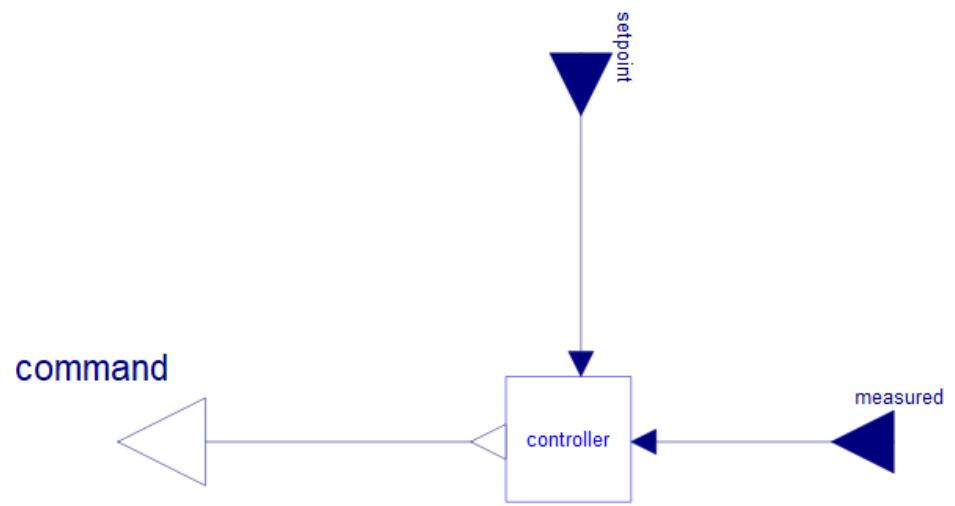

model Controller

extends ReplaceableDemo.Interfaces.PartialController;

replaceable ReplaceableDemo.Interfaces.PartialController controller

annotation (choicesAllMatching $=$ true,

equation

connect(controller.setpoint， setpoint)

annotation (Line(origin $=$ {0.0,66.0},

connect(controller.measured， measured)

annotation (Line(origin $=$ {55.0,0

connect(controller.command， command)

annotation (Line(origin ={6o.0, 0

end Controller;

$\textcircled{5}$ . 采用封装后的控制器模型替代原系统模型中的控制组件

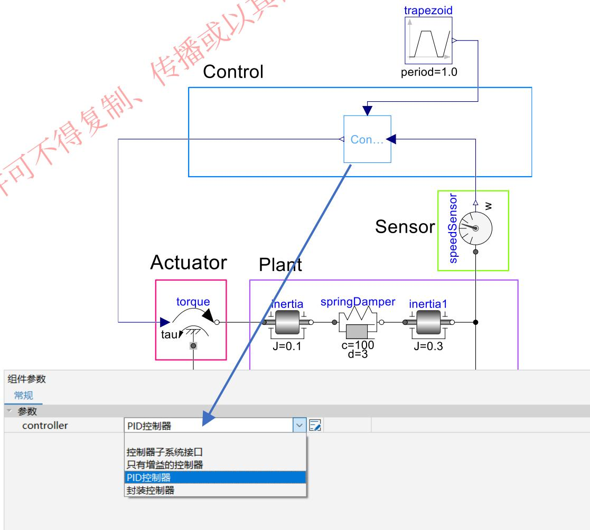

# 3. 重声明重用-使用场景

# 场景2：介质数据库

设想一个场景，用Modelica语言开发了一个水管模型，如果想把水管中流动的水改变为油液，用于油路系统中，该如何处理？

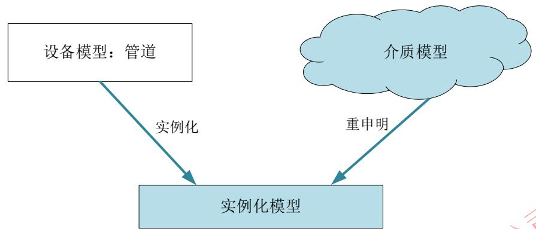

采用可替换重申明（ replaceable/ redeclare ）的方法，将设备模型与介质模型分离，开发设备模型时调用介质模型模板，实例化设备模型时，设备模型。

# $\textcircled{1}$ . 介质模板

partial package PartialMedium
replaceable partial function(State_pTX input AbsolutePressure p "Pressure"; input Temperature T "Temperature"; input MassFraction X[:] $=$ reference_X "Mass fractions"; output ThermodynamicState state "Thermodynamic state record"; end setState_pTX; replaceable partial function dynamicViscosity"Return dynamic viscosity" input ThermodynamicState state "Thermodynamic state record"; output DynamicViscosity eta "Dynamic viscosity"; end dynamicViscosity; .... end PartialMedium;

# ②. 水介质物性计算

```vhdl
partial package WaterIF97_base"Water"
extends Interfaces.PartialTwoPhaseMedium( ...
redeclare function extends(State_pTX "Return thermodynamic state of water as function of p and T"
algorithm state := ThermodynamicState( ... endsetState_pTX;
redeclare function extends dynamicViscosity "Dynamic viscosity of water" algorithm eta := IF97_Utilities.dynamicViscosity( ... enddynamicViscosity;
......
end WaterIF97_base;
```

# 3. 重声明重用-使用场景

$\textcircled{3}$ . 设备模型开发时与介质模板关联，并调用介质模板函数进行代码编写

```javascript
model StaticPipe "Basic pipe flow model without storage of mass or energy" replaceable package Medium = Modelica Media. Interfaces. PartialMedium "Medium in the component" annotation (choicesAllMatching = true); Medium.ThermodynamicState state = Medium-State_pTX.port_a.p,T); Modelica.SIunits.DynamicViscosity mu = Medium.dynamicViscosity(state); .... equation // Mass balance port_a.m_flow = flowModel.m_flow[1]; 0 = port_a.m_flow + port_b.m_flow; .. annotation (defaultComponentName = "pipe", ... end StaticPipe;
```

$\textcircled{4}$ . 实例化管道模型，并替换介质模板，得到带有介质的管道实例化模型

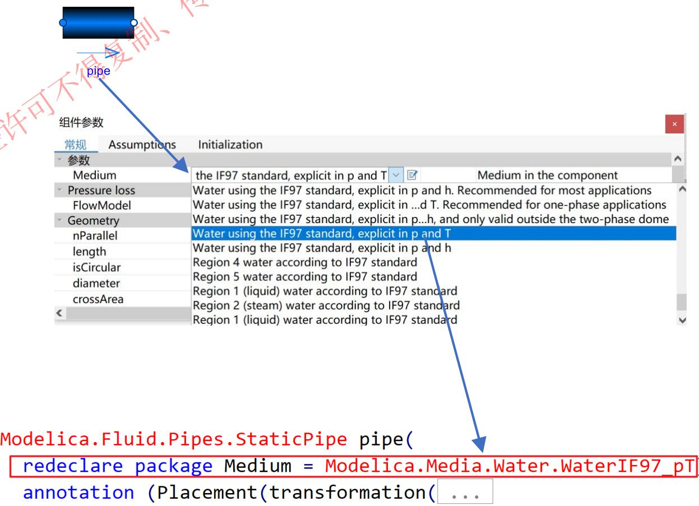

# 3. 重声明重用-使用方法

重申明重用，在语法中通过replaceable/ redeclare关键字实现，根据Modelica标准语法语义的规定可以对所有的类、参数、变量进行重申明，但是在实际的使用中以model、package、function这三种类的重申明为主，以实现通用化模型的开发。

关键字: replaceable：表示类型或组件可以被替换

redeclare：表示替换类型或组件

# 3. 重声明重用-使用方法

# 1.model重申明

# 基类模型

model PartialGeometry Modelica.SIunits.Area A "横截面积"; Modelica.SIunits.Length l "周长"; end PartialGeometry;

# 圆形

model cycle "圆形" extends PartialGeometry; parameter Modelica.SIunits.Diameter ${ \mathsf { d } } = 0 . 0 1$ ; equation $\mathsf { A } =$ Modelica.Constants.pi $^ { \star } { \mathsf { d } } ^ { \wedge } 2 / 4$ ; $| =$ Modelica.Constants.pi * d; end cycle;

# 三角形

model triangle "三角形" extends PartialGeometry; parameter Modelica.SIunits.Length $\mathsf { a } = 0 . 0 1$ ; equation A = 0.5 * a * a * sqrt(3) / 2; l = 3 * a; end triangle;

# 正方形

model square "正方形" h a = 0.01; equation A = a ^ 2; 2 l = 4 a; end square;


model Test_Geometry replaceable model Geometry = cycle constrainedby PartialGeometry annotation (choicesAllMatching $=$ true); Geometry geometry; Modelica.SIunits.Area A "横截面积"; Modelica.SIunits.Length l "周长"; equation A = geometry.A; l $=$ geometry.l; end Test_Geometry;


# 实例化后使用模型

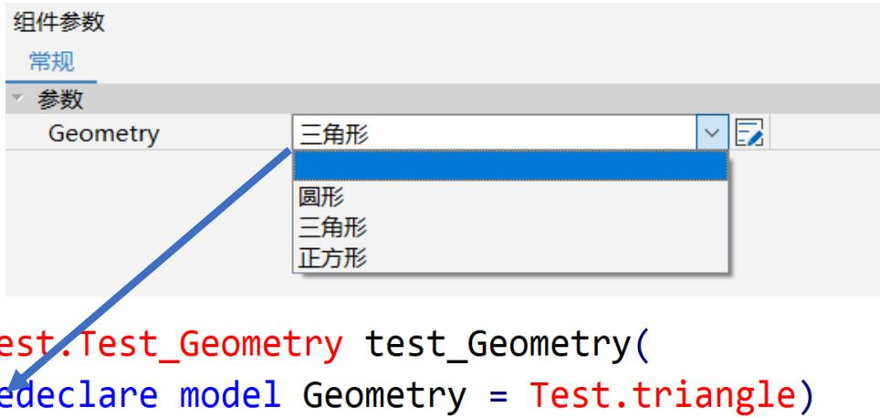

# 3. 重声明重用-使用方法

# 1.model重申明

典型应用场景：模型的几何结构、不同换热计算方法、不同流阻计算方法等

典型应用案例：标准库中DynamicPipe模型换热模式和流阻计算公式的切换，模型路径：

Modelica.Fluid.Pipes.DynamicPipe

model DynamicPipe "Dynamic pipe model with storage of mass and energy"

import Modelica.Fluid.Types.ModelStructure;

extends Modelica.Fluid.Pipes.BaseClasses.PartialStraightPipe(

extends BaseClasses.PartialTwoPortFlow(

parameter Boolean use_HeatTransfer $=$ false $" =$

annotation (Dialog(tab = "Assumptions"，group $=$ "Heat transfer"));

replaceable model HeatTransfer $=$ Modelica.Fluid.Pipes.BaseClasses.HeatTransfer.IdealFlowFeatTransfer

constrainedby Modelica.Fluid.Pipes.BaseClasses.HeatTransfer.PartialFlowHeatTransfer"Wall heat transfer"

annotation (Dialog(tab $=$ "Assumptions"，group $=$ "Heat transfer"，enable $=$ useHeatTransfer)， choicesAllMatching $=$ true);

HeatTransfer heatTransfer(

redeclare final package Medium $=$ Medium,

final $n ~ = ~ { \mathfrak { n } }$

final nParallel $=$ nParallel,

final surfaceAreas $=$ perimeter * lengths,

final lengths $=$ lengths,

final dimensions $=$ dimensions,

final roughnesses $\equiv$ roughnesses,

final states ${ } = { }$ mediums.state,

final vs = vs,

final use_k $=$ use_HeatTransfer) "Heat transfer model

annotation (Placement(transformation(extent = {{-45，20}， {-23, 42}}, rotation $\mathit { \Theta } = \mathit { \Theta } _ { \theta _ { i } }$ )));

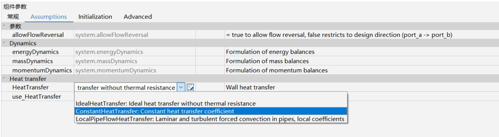

# 3. 重声明重用-使用方法

# 2.package和function重声明

```vhdl
package PartialSolidMedium "固体介质基类"
replaceable partial function Cp_T "返回定压比热"
input SI.Temperature T;
output SI.SpecificHeatCapacity Cp "定压比热";
end Cp_T;
replaceable partial function thermalConductivity_T "计算导热系数"
input SI.Temperature T;
output SI.ThermalConductivity lambda "导热系数";
end thermalConductivity_T;
replaceable partial function rho_T "返回密度"
input SI.Temperature T;
output SI.Density rho "密度";
end rho_T;
end PartialSolidMedium;
```

```vhdl
package Graphite "石墨,没有受过辐射"
extends PartialSolidMedium;
constant Real c1(unit = "J/(kg.K)) = -143.9883;
constant Real c2(unit = "J/(kg.K2)) = 3.6677;
constant Real c3(unit = "J/(kg.K3)) = -0.0022;
constant Real c4(unit = "J/(kg.K4)) = 4.6251e-7;
redeclare function extends rho_T "计算密度"
algorithm
rho := 1776.66;
end rho_T;
redeclare function extends Cp_T "计算比热容"
algorithm
Cp := c1 + c2 * T + c3 * T ^ 2 + c4 * T ^ 3;
end Cp_T;
redeclare function extends thermalConductivity_T "计算导热系数"
algorithm
lambda := 169.245 - 1.24890e-1 * T + 3.28248e-5 * T ^ 2;
end thermalConductivity_T;
end Graphite;
```

# 模型1

```vhdl
package B4C "碳化硼"
extends PartialSolidMedium;
redeclare function extends rho_T "计算密度"
algorithm
rho := 1800;
end rho_T;
redeclare function extends Cp_T "计算比热容"
algorithm
Cp := 713;
end Cp_T;
redeclare function extends thermalConductivity_T "计算导热系数"
algorithm
lambda := (-1.873e-10) * T ^ 4 + (5.792e-07) * T ^ 3 + (-0.0005904) * T ^ 2 + 0.1406 * T + 119.7;
end thermalConductivity_T;
end B4C;
```

# 3. 重声明重用-使用方法

# 2.package和function重声明

model Test-packagefunction replaceable package solid $=$ Graphite constrainedby PartialSolidMedium annotation (choicesAllMatching $\equiv$ true); Modelica.Slunits.Temperature $\mathsf{T} = 300$ "温度"; Modelica.Slunits.Density rho; Modelica.Slunits.SpecialHeatCapacity Cp; Modelica.Slunits. ThermalConductivity lamda; equation rho $=$ solid.rho_T(T); Cp $=$ solid.Cp_T(T); lamda $=$ solid. thermalConductivity_T(T);
end Testpackagefunction;

# 应用模型

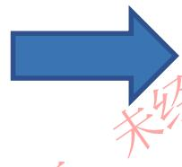

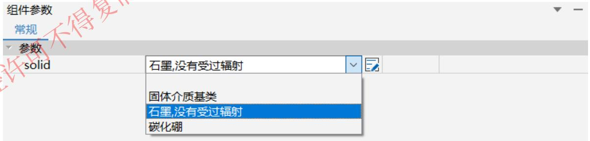

# 3. 重声明重用-使用方法

# 2.package和function重声明

典型应用场景：流体系统中，设备模型与介质模型的分离，通过基于package和function的重申明，实现设备模型中不同类型的介质选择；

典型应用案例：Modelica标准库中Media介质库的开发和调用方式；

# 3. 重声明重用-注意事项

# 1.重声明约束

```txt
model Oil "液压油"
replaceable model Oil = PreDefinedOil.EquationBasedCONSTANT
constrainedby OilMedia.Interfaces.Base "油液类型选择"
annotation (choicesAllMatching = true);
annotation (...);
end Oil;
```

```txt
model Constant "常特性油液"
extends OilMedia.Interfaces.Base(...);
annotation (...);
end Constant;
```

```txt
model MIL_H_5606 "MIL-H-5606牌号油液" extends OilMedia.Interfaces.Base(...);
annotation (...);
end MIL_H_5606;
```

```txt
model Tabular "基于插值表油液模板" extends OilMedia.Interfaces.Base(...); annotation (...); end Tabular;
```


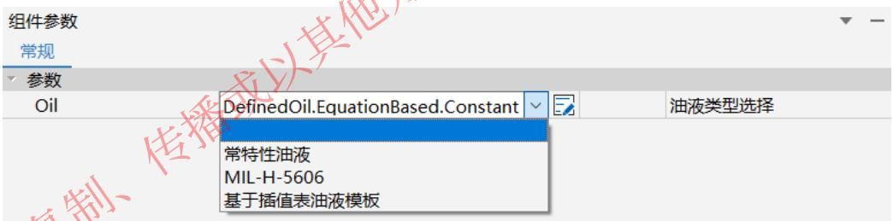

# 说明：

“constrainedby 基类路径”用来筛选所有继承此基类的模型
“choicesAllMatching $=$ true”表示所有符合筛选条件的模型均可在参数框中进行选取重声明

# 3. 重声明重用-注意事项

# 2.重声明注解

```txt
model Oil "液压油" replaceable model Oil = PreDefined.EquationBasedCONST constraintedby PreDefinedOil.EquationBasedCONST "油液类型选择" annotation (choices( choice(redclare model Oil = OilMedia.PreDefined.EquationBasedCONST "常特性油液"), choice(redclare model Oil = OilMedia.PreDefined.TabularBased.MIL_H_5606 "MIL-H-5606"), choice(redclare model Oil = OilMediaTemplates.Tabular "基于插值表油液模板"))); annotation (...); end Oil;
```


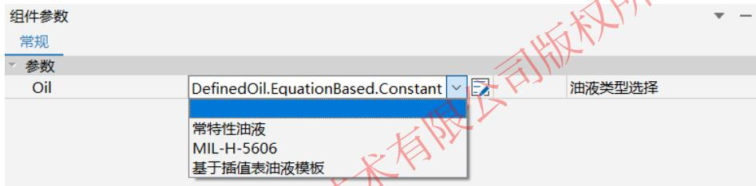

# 说明：

“constrainby 组件路径”表示默认选择的模型
“choices”作用为增加下拉框选项并赋值， 详见《注解》章节

# 目录

1. 继承重用
2. 实例化重用
3. 重声明重用
4. 本章回顾

# 4. 本章回顾

# 继承重用

# 使用场景：

➢ 继承connector，设计不同的图标和连接线；
➢ 继承partial类，完善模型行为方程；

# 一般结构：

➢ extends $^ +$ 基类路径(参数/变量变型)

# 注意事项：

➢ 继承保护
➢ 继承限制
➢ 单一继承

# $\bullet$ 重申明重用

# 使用场景：

➢ 架构模型设计；
➢ 介质数据库；

# 使用方法：

➢ model重申明
➢ package和function重声明

# 注意事项：

➢ 重申明约束
➢ 重申明注解

# ⚫ 实例化重用

# 使用场景：

➢ 接口实例化；
模型封装；
系统仿真模型构建

# 一般结构：

➢ 父类模型路径+ 实例化名（参数、变量、特殊类变型）

# 使用方法：

➢ 参数变型
➢ 数组变型

# 注意事项：

➢ 单一变型
➢ 变型合并

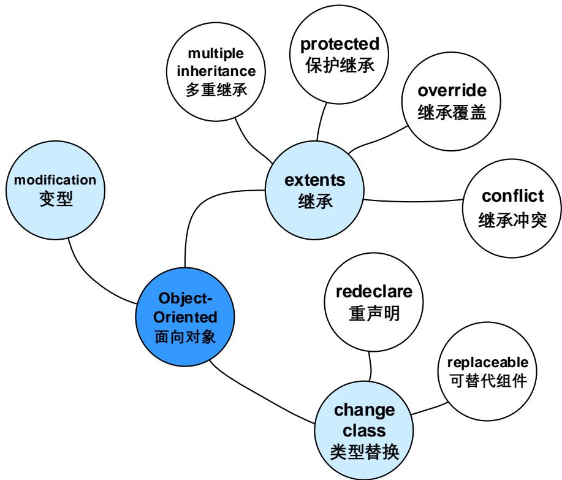

# 4. 本章回顾

# 课堂回顾

1.继承一个模型需要用到的关键词是（）。

A. partial

B. extends

C. public

D. record

2.下列类中，不能继承record的是（）。

A. package

B. record

C. connector

D. model

3.对数组变型的时候，用到的关键词是（）。

A. Real

B. class

C. each

D. change

4.（）关键词定义的元素禁止变型。

A. public

B. type

C. final

D. partial

5 .下面是重声明的关键词的是（） 。

A. replaceable

B. pre

C. change

D. edge

6.用于替换类型或组件的关键词是（） 。

A. change

B. record

C. cross

D. redeclare

7 .表明组件可被替换的关键词是（） 。

A. replaceable

B. pre

C. change

D. edge

8.继承保护的关键词是（）。

A. partial

B. public

C.protected

D.change

9. V型继承属于（）继承 。
10. 可以继承package的类是（） 。
11. 重声明的两个关键词分别是（）和（） 。
12. 外层变型可以覆盖（）变型 。
13. 在声明一个对象的同时修改类的属性属于（） 。

# 4. 本章回顾

# 课后作业

使用可替换重申明（ replaceable/ redeclare ） ，开发一个管道规格数据模型库；开发一个管道质量计算模型，通过选择不同的管道规格，并在参数面板中设置管道长度，计算得到该管道的质量。

<table><tr><td colspan="2">规格</td><td rowspan="2">外径(D)mm</td><td rowspan="2">壁厚(t)mm</td></tr><tr><td>公称内径</td><td>英寸</td></tr><tr><td>DN6</td><td></td><td>10.2</td><td>2.0</td></tr><tr><td>DN8</td><td>制</td><td>13.5</td><td>2.5</td></tr><tr><td>DN10</td><td></td><td>17.2</td><td>2.5</td></tr><tr><td>DN15</td><td>1/2</td><td>21.3</td><td>2.8</td></tr><tr><td>DN20</td><td>3/4</td><td>26.9</td><td>2.8</td></tr><tr><td>DN25</td><td>1</td><td>33.7</td><td>3.2</td></tr><tr><td>DN32</td><td>1.25</td><td>42.4</td><td>3.5</td></tr><tr><td>DN40</td><td>1.5</td><td>48.3</td><td>3.5</td></tr><tr><td>DN50</td><td>2</td><td>60.3</td><td>3.8</td></tr><tr><td>DN65</td><td>2.5</td><td>76.1</td><td>4.0</td></tr><tr><td>DN80</td><td>3</td><td>88.9</td><td>4.0</td></tr><tr><td>DN100</td><td>4</td><td>114.3</td><td>4.0</td></tr><tr><td>DN125</td><td>5</td><td>139.7</td><td>4.0</td></tr><tr><td>DN150</td><td>6</td><td>168.3</td><td>4.5</td></tr></table>

建立知识规范， 营造协同生态

积累工业模型， 发展可控平台

融入中国创新，打造先进软件

# 谢谢！
