# MoSim 挑战赛答辩 PPT 逐页方案

> 依据：Docs/报告/MoSim_仿真分析报告.docx、Docs/Design/赛题.md，以及已审阅的《实时数据监控与智能分析模拟系统竞标方案》版式模板。
>
> 建议规格：16:9，30 页主讲 + 6 页备份；讲解约 18-20 分钟，现场演示约 3-4 分钟。主讲页遵循“一个结论、1-2 个证据视觉、两句页脚”的固定合同，不把 Word 报告或宽表缩小后直接贴入。
>
> 证据边界：MWORKS/Sysplorer/Syslab 的模型、结果与指标是正式仿真证据；ROS1/PX4/Gazebo 是 px4ctrl 生成 C99 的运行时部署证据；UE、QGC、Studio、RViz 是展示或操作界面，不能单独证明控制性能。所有“通过”均沿用报告当前的 30/48、七场景或相应运行记录口径。

## 参考模板的执行合同

- **标题栏：**白底页面顶部保留统一标题栏和蓝色竖线，标题直接表达结论；章节起始页在标题前增加小号章节号，不单独增加空白分隔页。
- **主证据区：**单图页让核心图占页面约 65%-70%；双图页按“对照”“因果”或“架构 + 实物”左右排列。保留图例、坐标轴、单位、参考/实际颜色与数据来源。
- **页脚短文：**固定在页面下方约 22%-25%，只写两句：第一句解释图证明什么，第二句说明对评审结论的意义。推导、公式和长表转入备份页。
- **结果页：**曲线或轨迹为主证据，右侧最多三枚大数字卡；橙红色仅用于未达标、风险和当前优化重点，青绿色只用于通过或已接通的部署链路。
- **叙事节奏：**国产化 MWORKS 平台 -> MWORKS 的建模、验证与代码生成能力 -> MoSim 在四旋翼赛题上的领域落地 -> 共同实验基础 -> 筛查与量化结果 -> 扩展、部署与交付。结果是主讲高潮，功能不能按目录堆砌。

---

## 第一部分：MWORKS 国产化平台与 MoSim 项目定位

### 01. 封面：基于国产 MWORKS 的四旋翼全链路控制验证

- **叙事角色：**开场先定义国产化工程底座，再说明 MoSim 是其领域参考工程。
- **模板页型：**封面。
- **本页结论：**MWORKS 是本项目的国产化系统建模仿真工程底座；MoSim 是在其上验证四旋翼全链路能力的参考工程。
- **图源：**

  1. Docs/报告/图/云纵150/Sunray150_Blender_完整装配模型.png
  2. 可选角标：Docs/报告/图/Gazebo/Gazebo.png
- **审核预览（PPT/图源副本）：**
  

- **页内文案：**
  MWORKS 面向系统建模、图形控制、仿真分析与代码生成，为本项目提供不依赖受限工具链的工程底座。MoSim 以云纵150为参照，在 MWORKS 上将控制模型、定量验证、C99 和运行时部署连成可审查链路。
- **版式：**装配体占右侧约 70%，左下主标题突出“国产 MWORKS”；其下以小号副标题标明“MoSim：四旋翼参考工程”。Gazebo 小图只作为部署延伸角标。
- **讲解重点：**第一句话只回答“MWORKS 是什么”，第二句话才说明 MoSim 如何在其上落地。

### 02. 国产化替代：替代的不是一个仿真器，而是一条控制工程链

- **叙事角色：**先定义国产化替代的实际对象，再引出 MWORKS 的平台定位。
- **模板页型：**问题定义与替代范围页。
- **本页结论：**四旋翼控制工程需要替代的是从建模、控制设计、仿真分析到代码生成和部署的完整工具链，而不是孤立地替换一个数值求解器。
- **图源：**

  1. 基于 Docs/报告/MoSim_仿真分析报告.docx 第 1 章重绘“受限工具链 -> MWORKS 国产化工程链”对照图：控制理论/模型 -> 图形控制 -> 正式仿真与分析 -> C99 -> ROS/PX4/Gazebo。
  2. 可选角标：Docs/报告/图/代码生成与部署/Mworks导出代码.png
- **审核预览（PPT/图源副本）：**
  

> **待制图：**“受限工具链 -> MWORKS 国产化工程链”对照图尚无本地图片；上方仅预览现有的 MWORKS C99 导出产物。

- **页内文案：**
  MATLAB/Simulink 工具链的价值不只在单点计算，而在于把建模、设计、验证、代码和运行连接起来。MWORKS 的国产化价值是为这一控制工程链提供可自主使用的底座，MoSim 则在四旋翼场景中把它具体化、可审查化。
- **版式：**对照图占主区域，左侧为受限工具链的工程环节，右侧为 MWORKS 承载的对应能力；右下角只放小型 C99 导出产物，不仿造 MWORKS 软件界面。
- **讲解重点：**先说明“替代什么”，再说明 MWORKS 不是简单的求解器替换；暂不引入控制器性能结果。

### 03. MWORKS：国产化系统建模仿真与工程交付平台

- **叙事角色：**回答 MWORKS 这个软件如何承载完整的建模、验证与交付工程。
- **模板页型：**平台能力与工程链页。
- **本页结论：**MWORKS 将 Modelica 系统模型、图形化控制设计、正式仿真与数据分析、代码生成组织为一条可交付的工程链。
- **图源：**

  1. Docs/报告/图/手绘架构/16_MWORKS建模仿真代码生成反馈闭环.png
  2. Docs/报告/图/代码生成与部署/Mworks导出代码.png
- **审核预览（PPT/图源副本）：**
  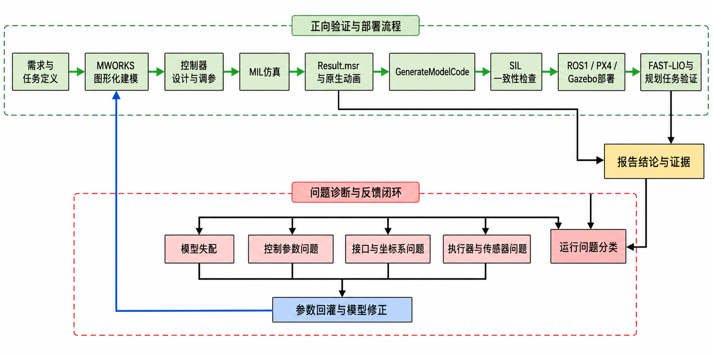

- **页内文案：**
  Sysplorer、Sysblock 与 Syslab 分别承载系统模型、图形控制器和定量分析，GenerateModelCode 将已验证的控制路径导出为 C99。正式模型与指标由 MWORKS 负责，ROS1/PX4/Gazebo 在其后承担部署验证，因此运行时画面不能替代模型结果。
- **版式：**闭环图占上方约 65%，右下角用导出代码截图证明交付产物存在；下方短文明确“MWORKS 正式模型证据 -> C99 交付 -> 运行时部署验证”的顺序。
- **讲解重点：**把 MWORKS 讲成“从模型到结果再到代码”的工程平台，而不是只会画模型的工具。

### 04. MoSim：MWORKS 在四旋翼控制赛题中的参考工程

- **叙事角色：**从 MWORKS 通用平台过渡到 MoSim 的领域资产与工程验证职责。
- **模板页型：**平台到领域的映射页。
- **本页结论：**MoSim 不另造通用平台，而是把 MWORKS 的建模、控制、验证与代码生成能力沉淀为四旋翼控制的参考工程和可复用资产。
- **图源：**

  1. Docs/报告/图/手绘架构/20_实验平台分层与故障反馈链路.png
  2. 基于 Docs/Design/赛题.md 重绘“MWORKS 平台能力 -> 四旋翼模型、控制器、场景、指标与交付”的领域映射图。
- **审核预览（PPT/图源副本）：**
  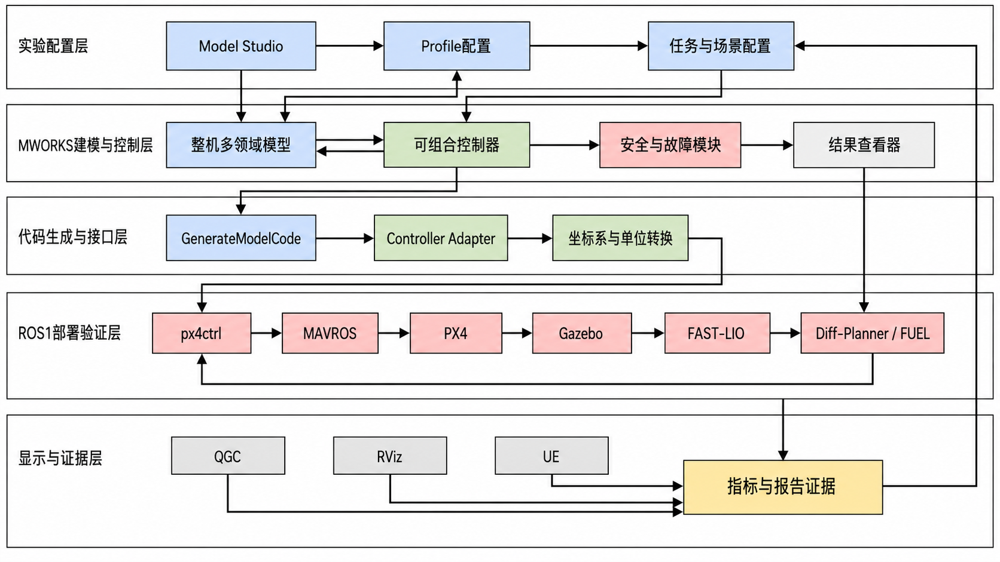

> **待制图：**“MWORKS 平台能力 -> MoSim 四旋翼领域资产”映射图尚无本地图片；上方仅预览现有实验平台分层图。

- **页内文案：**
  MoSim 以云纵150参照机体和统一公共 Plant 为承载，将不同控制器放入同一实验框架，再把结果、代码和部署接口回链到同一工程路径。它的价值是把 MWORKS 的通用能力转化为可复用、可对比、可交付的四旋翼资产，而不是重复建设另一个仿真平台。
- **版式：**左侧放实验平台分层图，右侧放五段领域映射图；中间箭头标记“MWORKS 通用能力 -> MoSim 四旋翼参考工程”。
- **讲解重点：**至此才解释 MoSim：它是 MWORKS 平台在无人机控制场景中的参考工程、验证载体与资产沉淀。

---

## 第二部分：统一模型与可审计实验

### 05. 云纵150参照机体、参数 Profile 与坐标链形成共同物理基准

- **叙事角色：**建立可信对象。
- **模板页型：**实物 + 架构页。
- **本页结论：**模型不是抽象理想四旋翼，而是以云纵150装配关系、参数来源和坐标约定为共同物理基准。
- **图源：**

  1. Docs/报告/图/云纵150/Sunray150_Blender_完整装配模型.png
  2. Docs/报告/图/手绘架构/18_坐标系与FrameContract转换关系.png
- **审核预览（PPT/图源副本）：**
  

- **页内文案：**
  装配体保留机架、旋翼、防护结构和机载设备的相对位置，旋翼中心、机臂长度与传感器安装关系进入参数 Profile。几何与质量参数按依据登记，惯量、气动和执行器参数作为可替换的工程种子，使后续台架或飞行数据可以逐层升级。
- **版式：**左侧装配体大图，右侧坐标链；三个小标注只指出旋翼、传感器与 Profile，不展示完整参数表。
- **讲解重点：**用“可升级、可回溯”替代“当前参数已完全等同实机真值”。

### 06. 公共 Plant 统一动力学、执行器和控制分配，保证比较公平

- **叙事角色：**建立公平实验基础。
- **模板页型：**架构 + 实物对应页。
- **本页结论：**不同控制算法面对同一机体动力学、旋翼执行器和 X 型控制分配，性能差异才可以归因于控制路线。
- **图源：**

  1. Docs/报告/图/手绘架构/19_四旋翼动力学与控制分配模型.png
  2. Docs/报告/图/云纵150/Sunray150_Blender_机体底部与桨叶防护结构.png
- **审核预览（PPT/图源副本）：**
  

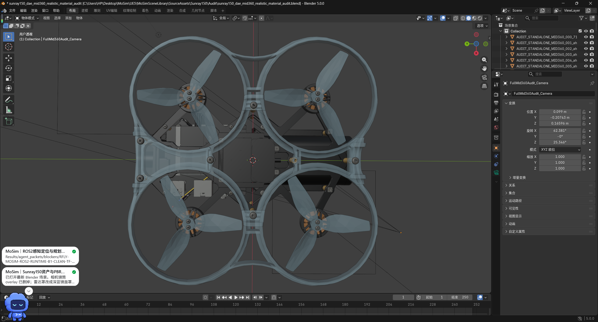

- **页内文案：**
  控制器输出最终进入同一套姿态、角速度、分配、旋翼动态和限幅链路，公共 Plant 在各路线间保持不变。这样同条件筛查和七场景对比的差异可以归因于控制律，而不是被控对象被替换。
- **版式：**架构图占主区域，右下放装配细节图；箭头只高亮控制器到执行器的统一入口。
- **讲解重点：**为“48 条路线同条件筛查”建立物理前提。

### 07. 四类输出边界让不同控制器接入同一验证框架

- **叙事角色：**解释平台接口。
- **模板页型：**双图对照页。
- **本页结论：**控制器可输出姿态、角速度、力矩或旋翼命令，但都经 Adapter 接入同一公共 Plant 和 FormalRunner。
- **图源：**

  1. Docs/报告/图/手绘架构/02_控制器族分层与统一接口.png
  2. Docs/报告/图/手绘架构/11_控制输出层级与Runner边界.png
- **审核预览（PPT/图源副本）：**
  

- **页内文案：**
  ATTITUDE_THRUST、BODY_RATE_THRUST、WRENCH 和 ROTOR_COMMAND 四类输出由 Adapter 处理物理量转换与限幅。新增算法只需声明接口并实现控制律，即可复用既有实验、指标和结果归档。
- **版式：**左图展示控制器族，右图展示 Runner 边界；四类输出只作为图例标签，不放接口字段明细。
- **讲解重点：**这是模块化与可扩展性的直接技术证据。

### 08. Profile、场景与故障注入独立配置，使实验可重复

- **叙事角色：**解释实验合同。
- **模板页型：**因果双图页。
- **本页结论：**参考轨迹、采样率和评价窗口与风扰、参数失配、电机效率等注入项分离，控制器可在固定条件下复跑比较。
- **图源：**

  1. Docs/报告/图/手绘架构/12_Profile配置与状态注入链路.png
  2. Docs/报告/图/手绘架构/20_实验平台分层与故障反馈链路.png
- **审核预览（PPT/图源副本）：**
  

- **页内文案：**
  Experiment Profile 固定任务与评价窗口，独立参数覆盖负责风扰、质量惯量失配和电机效率下降。正交配置避免为每个工况复制控制器模型，并让结果、指标和配置能够按路径回溯。
- **版式：**上方 Profile 链路、下方故障链路，页脚横跨全宽；正文不进入图内。
- **讲解重点：**强调“工况相同”是所有性能比较的前提。

### 09. 48 条路线可打开、可运行，但数量不等于全部通过

- **叙事角色：**界定平台规模。
- **模板页型：**全景 + 代表实例页。
- **本页结论：**48 是正式路线目录口径，图形模型可打开、完成仿真和性能达标必须分开统计。
- **图源：**

  1. Docs/报告/图/手绘架构/09_控制算法家族技术路线.png
  2. Docs/报告/图/控制器/05_最优与预测控制/linear_mpc/01_图形模型.png
- **审核预览（PPT/图源副本）：**
  

- **页内文案：**
  平台登记 46 个算法控制模块，并以 Official PID 与 px4ctrl 两条工程基线形成 48 条 FormalRunner 路由。截图说明图形实现与接口覆盖，性能是否达标必须由后续固定指标和正式结果判断。
- **版式：**路线全景图居左，代表性模型居右；只保留“控制器覆盖”“图形实现”两个短标签。
- **讲解重点：**主动消除“算法数量即成绩”的误解。

### 10. 指标与负样本规则先行，避免选择性展示

- **叙事角色：**建立结果可信度。
- **模板页型：**流程 + 分布页。
- **本页结论：**位置 RMSE、终端误差、超调、调节时间和控制能量在比较前已固定，失败和无效记录不被混入通过统计。
- **图源：**

  1. 基于报告“有效通过判定”重绘五指标与判定流程图。
  2. Docs/报告/figures/第10章/controller_dist_rmse_hist.png
- **审核预览（PPT/图源副本）：**
  

> **待制图：**本页图源中的重绘项尚无本地图片；其余现有图已在上方嵌入预览。

- **页内文案：**
  ClimbPath 50 s 与七场景实验使用固定读取方式和通过判据，超限、超时、MWORKS 原生提前终止与无效故障记录分别标识。分布图同时呈现有效条目与性能离散性，为后续代表路线选择提供依据。
- **版式：**判定流程居左、RMSE 分布居右；橙红色只标记未达标或无效状态。
- **讲解重点：**这页是所有性能数字可信的前提。

### 11. 30/48 同条件筛查确认可用路线范围

- **叙事角色：**给出平台规模结论。
- **模板页型：**双图结果页。
- **本页结论：**当前目录口径下，30/48 条路线完成 50 s 仿真并达到名义终端误差门限。
- **图源：**

  1. Docs/报告/figures/第10章/taxonomy_family_bars.png
  2. Docs/报告/figures/第10章/taxonomy_pass_rate.png
- **审核预览（PPT/图源副本）：**
  

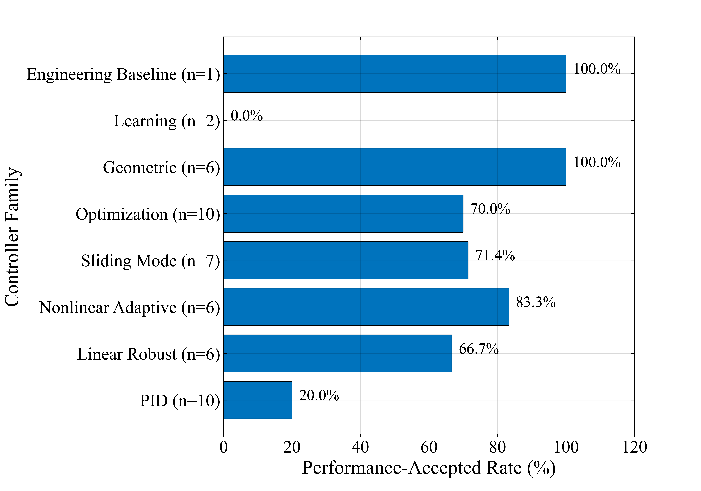

- **页内文案：**
  所有路线共享机体、参考轨迹、评价窗口和基础执行边界，30 条形成有效通过记录，18 条未达到门限或未形成完整有效记录。筛查用于选择代表路线，并不替代后续七场景的深度比较。
- **版式：**柱图与通过率图左右对照，页面中央只放一个大数字“30 / 48”；页脚注明当前口径。
- **讲解重点：**说清“30 通过、18 非通过”的定义，避免使用旧口径。

### 12. 有效路线的误差分布和多指标取舍确定主展示对象

- **叙事角色：**过渡到主路线。
- **模板页型：**双图结果页。
- **本页结论：**30 条有效记录呈现明显的性能取舍，px4ctrl 被选为主展示路线是因为证据链完整，而非宣称全面压倒所有路线。
- **图源：**

  1. Docs/报告/figures/第10章/controller_dist_rmse_box.png
  2. Docs/报告/figures/第10章/controller_radar_chart.png
- **审核预览（PPT/图源副本）：**
  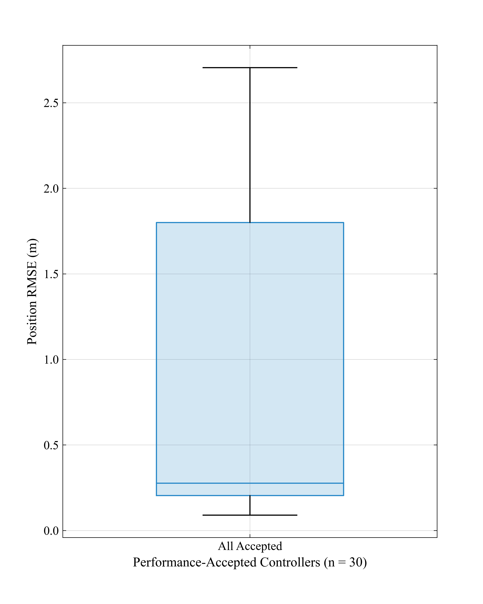

- **页内文案：**
  当前有效样本的位置 RMSE 最小值为 0.0897 m、中位值为 0.2766 m、最大值为 2.7052 m，低误差、低能量和快速完成之间存在取舍。px4ctrl 同时具备图形模型、七场景对比、SIL 和运行时部署证据，因此承担后续主展示。
- **版式：**箱线图居左、八族代表路线雷达图居右；三枚数字卡只显示最小、中位和最大。
- **讲解重点：**让“主路线选择”有数据依据，而不是偏好。

---

## 第三部分：px4ctrl 主路线与七场景量化结果

### 13. px4ctrl 已从图形模型贯通到部署验证

- **叙事角色：**引入主展示路线。
- **模板页型：**模型 + 轨迹页。
- **本页结论：**px4ctrl 是本项目唯一同时具备完整闭环、SIL 和运行时部署证据的自研主展示路线。
- **图源：**

  1. Docs/报告/图/控制器/01_PID族/px4ctrl/01_图形模型.png
  2. Docs/报告/figures/第10章/px4ctrl/trajectory_3d.png
- **审核预览（PPT/图源副本）：**
  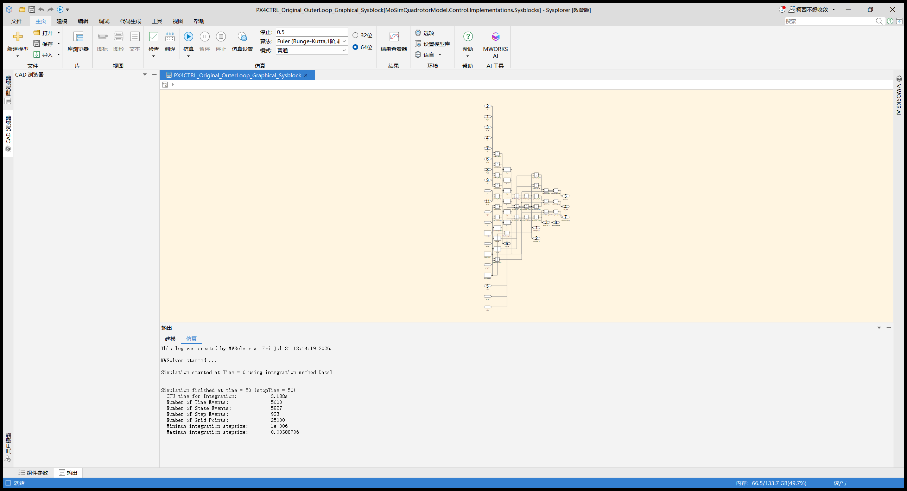

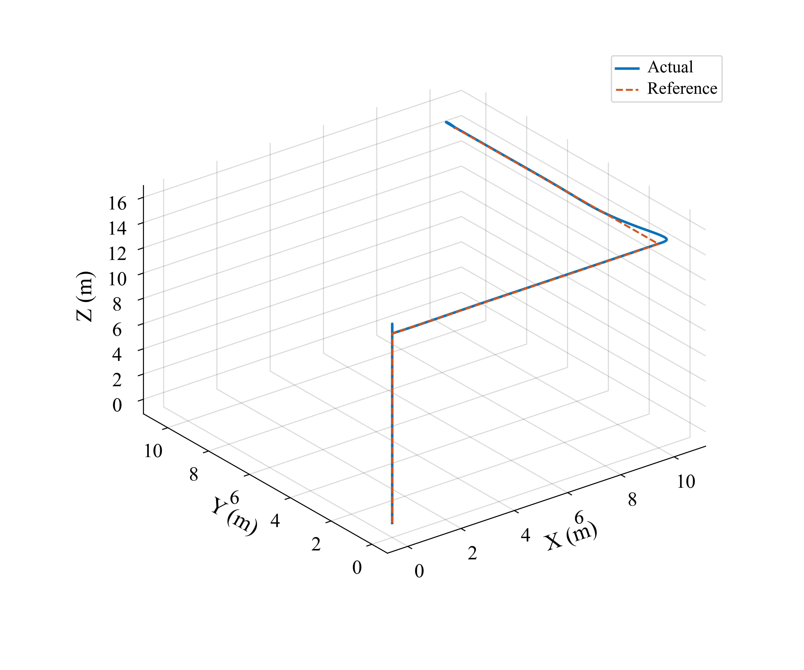

- **页内文案：**
  px4ctrl 在 MWORKS.Sysblock 中实现位置/速度外环，并通过 EquationBridge 接入共享姿态环、角速度环和控制分配。它与 Official PID 在同一 Plant、Profile 和指标框架下比较，且已形成 C99、50 s SIL 和 Gazebo 后端记录。
- **版式：**左侧图形控制器、右侧三维轨迹，用一条短箭头从模型指向任务轨迹。
- **讲解重点：**“自研”必须同时落到模型、结果和导出产物。

### 14. 外环的前馈、重力补偿与三轴独立反馈构成主要设计差异

- **叙事角色：**解释设计取舍。
- **模板页型：**局部模型 + 对照页。
- **本页结论：**px4ctrl 的外环针对快变参考和垂向物理量显式处理，但结构差异本身不代替性能结论。
- **图源：**

  1. Docs/报告/图/控制器/01_PID族/px4ctrl/01_图形模型.png（局部裁切外环）
  2. 基于 Official PID/px4ctrl 对照表重绘三行流程图。
- **审核预览（PPT/图源副本）：**
  

> **待制图：**本页图源中的重绘项尚无本地图片；其余现有图已在上方嵌入预览。

- **页内文案：**
  参考加速度前馈直接进入期望加速度通道，重力项以统一量纲进入垂向推力计算，三轴位置/速度反馈独立处理。后续结果页只用同条件七场景数据说明这些结构选择的实际效果。
- **版式：**实际 Sysblock 局部居左，三行流程对照居右；只保留一条必要公式，不放推导。
- **讲解重点：**先解释“为什么这样设计”，再展示结果。

### 15. 七场景矩阵覆盖名义、扰动、失配和执行器效率下降

- **叙事角色：**定义验证范围。
- **模板页型：**场景矩阵 + 故障链路页。
- **本页结论：**七场景按统一 Profile 组织，不是从动画中挑选有利画面。
- **图源：**

  1. 基于七场景表重绘 Hover、Step、Figure8、Spiral、Wind、Parameter mismatch、Motor efficiency 矩阵。
  2. Docs/报告/图/手绘架构/01_故障注入与FTC闭环链路.png
- **审核预览（PPT/图源副本）：**
  

> **待制图：**本页图源中的重绘项尚无本地图片；其余现有图已在上方嵌入预览。

- **页内文案：**
  Official PID 与 px4ctrl 在七类任务中使用统一评价口径，风扰、参数与电机效率由独立 Profile 注入而不改写控制器。电机效率下降当前只代表场景注入与性能观察，不能等同于已完成 FDI/FTC 能力。
- **版式：**左侧七格场景矩阵、右侧故障链路；每格用短标签或线性图标，不拼贴无人机照片。
- **讲解重点：**在数字出现前先说清测试范围和边界。

### 16. 阶跃响应中 px4ctrl 更快进入调节带

- **叙事角色：**结果高潮一。
- **模板页型：**曲线 + 数字卡页。
- **本页结论：**统一阶跃场景中，px4ctrl 的调节时间为 3.83 s，而 Official PID 在 45 s 观察窗内未完成调节。
- **图源：**

  1. Docs/报告/figures/第11章/七场景对比/step_response_position_error_comparison.png
  2. 基于报告表 9-2 重绘最大超调、调节时间和终端误差三枚数字卡。
- **审核预览（PPT/图源副本）：**
  

> **待制图：**本页图源中的重绘项尚无本地图片；其余现有图已在上方嵌入预览。

- **页内文案：**
  px4ctrl 的位置 RMSE 为 0.1989 m，相比 Official PID 的 0.2832 m 降低 29.8%，终端位置误差为 0.0063 m。曲线与三项指标在相同机体、参考和评价窗口下共同证明其阶跃响应更快收敛。
- **版式：**误差曲线占左侧约 70%，右侧三枚数字卡；数字卡不超过三项。
- **讲解重点：**用一页回答“改进 PID 的效果是什么”。

### 17. Figure8 中 px4ctrl 将位置 RMSE 从 0.3053 m 降至 0.0814 m

- **叙事角色：**结果高潮二。
- **模板页型：**曲线 + 轨迹对照页。
- **本页结论：**复杂 Figure8 跟踪中，px4ctrl 的位置 RMSE 相比 Official PID 降低 73.3%。
- **图源：**

  1. Docs/报告/figures/第11章/七场景对比/figure8_position_error_comparison.png
  2. Docs/报告/figures/第10章/px4ctrl/trajectory_xy.png
- **审核预览（PPT/图源副本）：**
  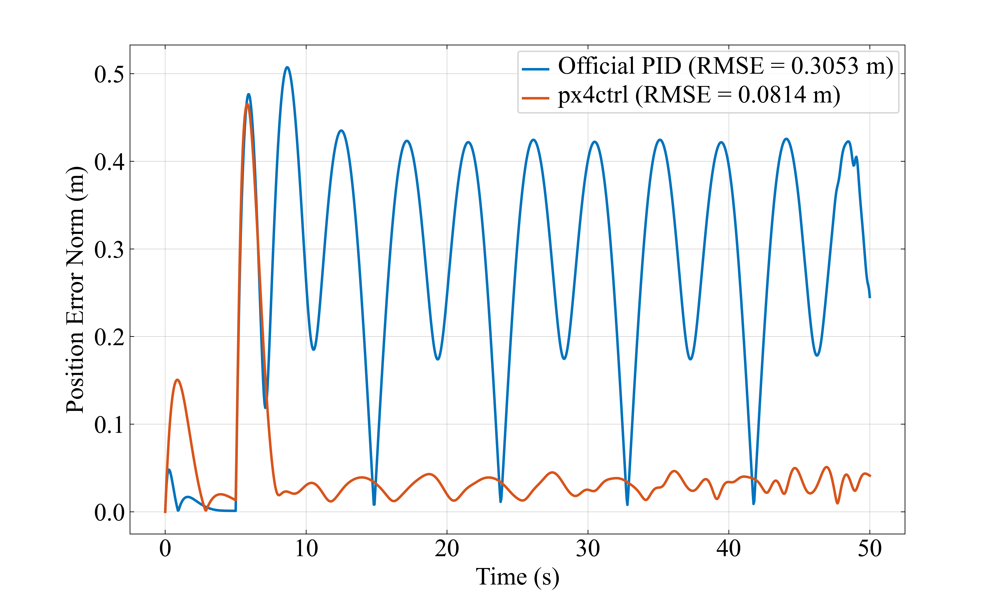

- **页内文案：**
  Figure8 同时考察横向耦合、速度变化与持续轨迹跟踪，px4ctrl 的位置 RMSE 为 0.0814 m，Official PID 为 0.3053 m。误差时程与 XY 轨迹共同展示结论的动态过程和空间形态，不能只报下降比例。
- **版式：**误差曲线居左、XY 轨迹居右，参考和实际曲线使用一致颜色。
- **讲解重点：**让评委既看到数字，也看到误差如何发生和消退。

### 18. 风扰下 px4ctrl 保持更低跟踪误差，但结论限定于当前记录

- **叙事角色：**结果高潮三。
- **模板页型：**双曲线结果页。
- **本页结论：**统一风扰场景中，px4ctrl 位置 RMSE 从 0.3365 m 降至 0.1613 m，降幅为 52.1%。
- **图源：**

  1. Docs/报告/figures/第11章/七场景对比/wind_disturbance_position_error_comparison.png
  2. Docs/报告/figures/第11章/灵敏度分析/wind_disturbance_sensitivity.png
- **审核预览（PPT/图源副本）：**
  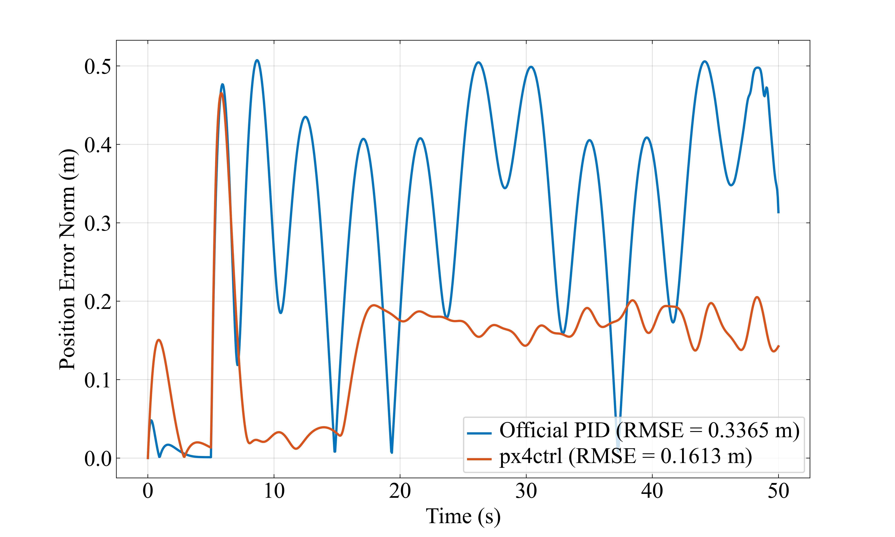

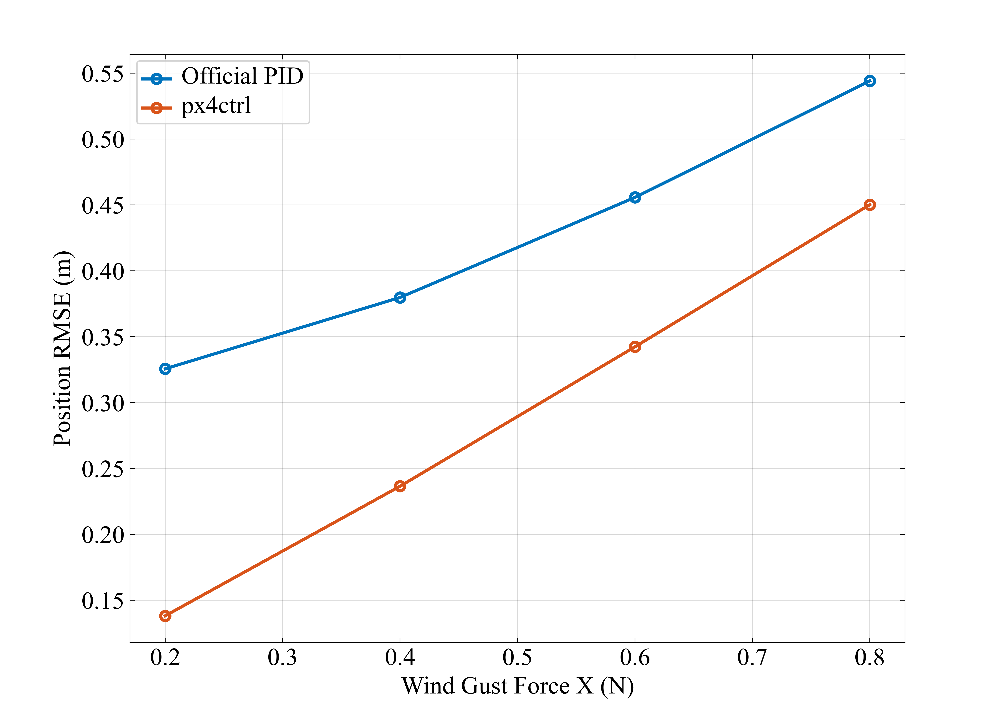

- **页内文案：**
  误差时程给出固定风扰场景的即时比较，灵敏度曲线补充了误差随风扰强度变化的趋势。该记录支持当前风扰条件下的改进结论，不延伸为所有扰动均全面领先。
- **版式：**时程曲线居左、灵敏度曲线居右，完整保留横轴单位与图例。
- **讲解重点：**强化“有证据的范围”，不扩大结论。

### 19. 任务边界与负样本让改进方向可量化，而不是隐藏不利结果

- **叙事角色：**结果可信度收束。
- **模板页型：**双场景边界页。
- **本页结论：**px4ctrl 在螺旋任务表现良好，但参数失配和电机效率下降仍是下一阶段优化重点。
- **图源：**

  1. Docs/报告/figures/第11章/七场景对比/parameter_mismatch_position_error_comparison.png
  2. Docs/报告/figures/第11章/灵敏度分析/motor_efficiency_sensitivity.png
- **审核预览（PPT/图源副本）：**
  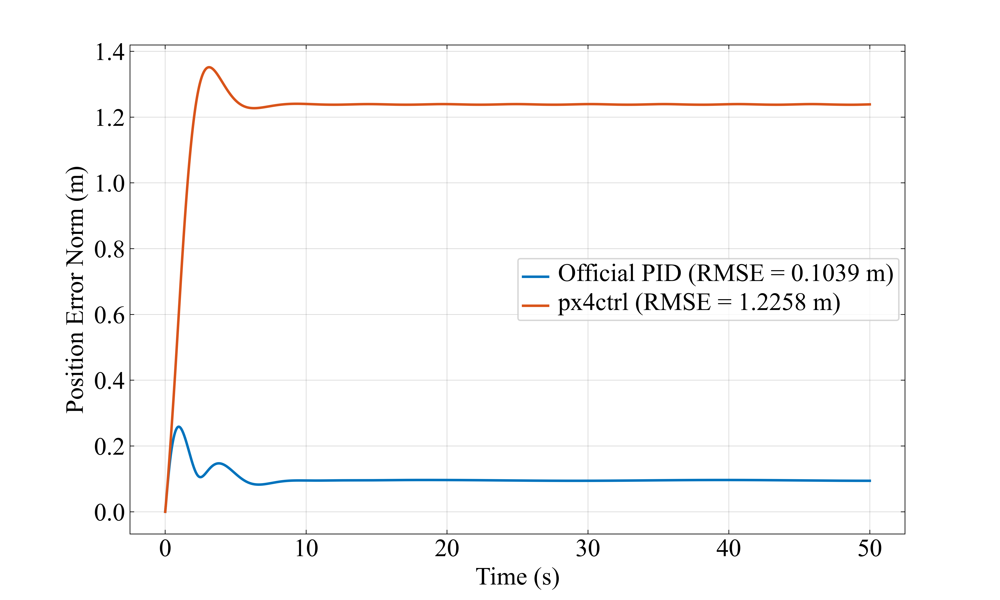

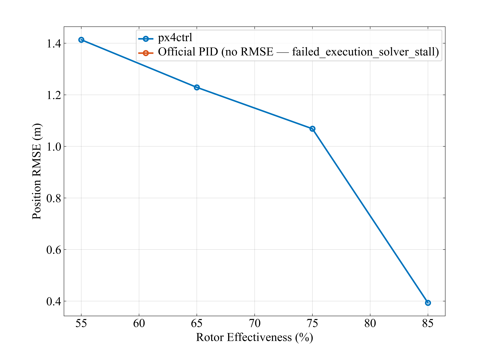

- **页内文案：**
  参数失配场景中 px4ctrl 的位置 RMSE 为 1.2258 m，高于 Official PID 的 0.1039 m，因此不能被描述为全面优于基线。电机效率下降记录用于观察性能变化而非宣称已完成故障诊断或容错控制，负样本把后续优化目标固定下来。
- **版式：**左侧参数失配曲线、右侧电机效率灵敏度曲线，底部只用一枚橙色“当前优化重点”标签。
- **讲解重点：**这页提升可信度，也是评委可能追问的关键边界。

---

## 第四部分：扩展能力、代码生成与运行时部署

### 20. 三机编队已保持固定队形，ECBF 为安全参考调节预留接口

- **叙事角色：**扩展能力与边界。
- **模板页型：**轨迹 + 距离页。
- **本页结论：**三机 Figure8 证明统一接口能够扩展到固定编队，ECBF 当前证明的是可插拔安全参考层而非完整安全认证。
- **图源：**

  1. Docs/报告/figures/第11章/三机编队/formation_trajectory_xy.png
  2. Docs/报告/figures/第11章/三机编队/inter_uav_distance.png
- **审核预览（PPT/图源副本）：**
  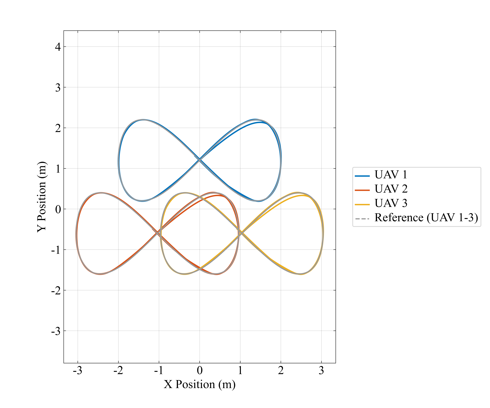

- **页内文案：**
  三架无人机沿固定三角队形 Figure8 共同推进，每架保留独立全机控制实例，50 s 记录中的队形误差 RMSE 为 2.2855e-13 m，最小机间距为 2.0785 m。ECBF 以有限参考修正插入 Guidance 与单机控制之间，未发生真实约束触发前不将其写成已验证的全面安全提升。
- **版式：**实际 XY 轨迹居左、机间距离时程居右，安全半径只作细线标注。
- **讲解重点：**区别“编队保持”“安全接口”和“动态障碍防碰撞认证”。

### 21. OpenBlocks 将单机和三机规划参考送入 MWORKS 全机执行

- **叙事角色：**扩展能力。
- **模板页型：**双轨迹对照页。
- **本页结论：**规划器负责生成参考，正式 MWORKS 全机模型负责单机和三机的跟踪执行与指标记录。
- **图源：**

  1. Docs/报告/figures/拓展任务/单机OpenBlocks/single_uav_trajectory_xy.png
  2. Docs/报告/figures/拓展任务/三机OpenBlocks/three_uav_trajectory_xy.png
- **审核预览（PPT/图源副本）：**
  

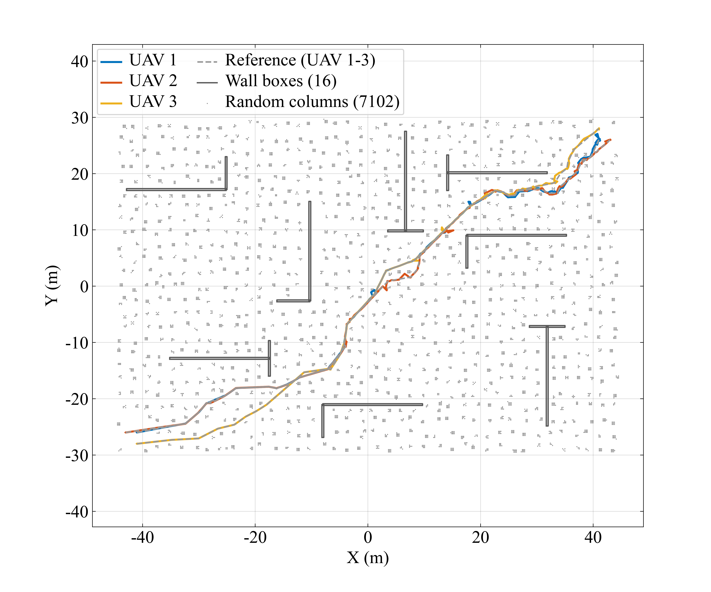

- **页内文案：**
  OpenBlocks 场景通过 A* 与 min-snap 形成规划参考，再经统一控制接口进入单机和三机全机模型执行。单机记录的位置 RMSE 为 1.1731 m，其中 Z 向 RMSE 为 1.1342 m，高度通道和姿态裕度是当前优化重点。
- **版式：**单机轨迹居左、三机轨迹居右，右下只保留“当前高度误差占主导”小卡。
- **讲解重点：**展示扩展深度，但不把规划参考误写成多机避障已全面通过。

### 22. px4ctrl 图形模型已自动生成可构建的 C99 控制核心

- **叙事角色：**从模型走向产物。
- **模板页型：**流程 + 产物页。
- **本页结论：**图形模型不是展示终点，px4ctrl 已输出可编译、可复用的标准 C99 控制核心。
- **图源：**

  1. Docs/报告/图/手绘架构/08_代码生成与ROS回灌部署流程.png
  2. Docs/报告/图/代码生成与部署/Mworks导出代码.png
- **审核预览（PPT/图源副本）：**
  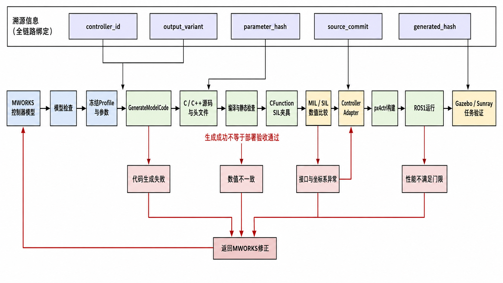

- **页内文案：**
  MWORKS GenerateModelCode 将 px4ctrl 导出为 C99 源码，并由 CMake 构建为静态库、共享库和固定输入测试程序。模型哈希、构建脚本和接口包装共同保留，使已验证的控制计算路径可以进入外部工程。
- **版式：**部署流程居左、代码导出目录或截图居右；代码截图不超过半页。
- **讲解重点：**突出可移植与可复现，不展示大段 C 代码。

### 23. 50 s SIL 显示图形模型与生成 C99 保持浮点舍入级一致

- **叙事角色：**验证生成一致性。
- **模板页型：**三数字卡页。
- **本页结论：**同一 px4ctrl 控制律从 Sysblock 导出到 C99 后，在 50 s 整机 SIL 中保持双精度量级一致。
- **图源：**

  1. 基于报告表 13-1 重绘三项一致性数字卡。
  2. Docs/报告/图/控制器/01_PID族/px4ctrl/01_图形模型.png（浅化为背景辅助）
- **审核预览（PPT/图源副本）：**
  

> **待制图：**本页图源中的重绘项尚无本地图片；其余现有图已在上方嵌入预览。

- **页内文案：**
  聚合位置 RMSE 差异为 1.148e-13 m，姿态最大绝对差为 3.207e-12 rad，旋翼指令最大绝对差为 7.354e-11 rad/s，三项均在预设门限内通过。该结论证明导出链路的数值一致性，不等同于所有运行时工况自动通过。
- **版式：**中央三张大数字卡，浅化 Sysblock 图仅作背景；不再加入曲线。
- **讲解重点：**将 10^-13 解释为浮点舍入级差异，不夸张为绝对零误差。

### 24. C99 已接入 ROS1/PX4/Gazebo 后端，正式模型证据与部署证据分层保存

- **叙事角色：**解释运行时架构。
- **模板页型：**数据流 + 场景页。
- **本页结论：**部署后端共享 Sunray/PX4/Gazebo 被控对象，控制核心可在原始实现与 graphical C99 间切换。
- **图源：**

  1. Docs/报告/图/手绘架构/15_ModelStudio_QGC_Gazebo联合仿真数据流.png
  2. Docs/报告/图/Gazebo/Gazebo.png
- **审核预览（PPT/图源副本）：**
  

- **页内文案：**
  ROS1、MAVROS、PX4 SITL 与 Gazebo 组成运行时后端，生成 C99 通过适配层参与控制计算。MWORKS 负责正式模型指标，Gazebo 负责部署链路中的名义飞行、风扰和故障恢复记录，二者按不同证据层保存。
- **版式：**数据流图居左、Gazebo 场景居右，使用两条不同颜色标签标注“正式模型”“运行时部署”。
- **讲解重点：**再次防止将运行时截图当作正式性能指标。

### 25. 运行时 Figure8 证明生成 C99 已进入 ROS/PX4/Gazebo 飞行生命周期

- **叙事角色：**呈现运行时可见证据。
- **模板页型：**双画面展示页。
- **本页结论：**生成 C99 后端在 Gazebo 中形成了 Figure8 轨迹跟踪的运行时记录。
- **图源：**

  1. Docs/报告/图/Rviz/8字.png
  2. Docs/报告/图/Rviz/8字+点云.png
- **审核预览（PPT/图源副本）：**
  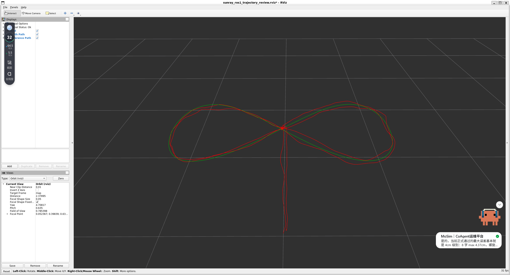

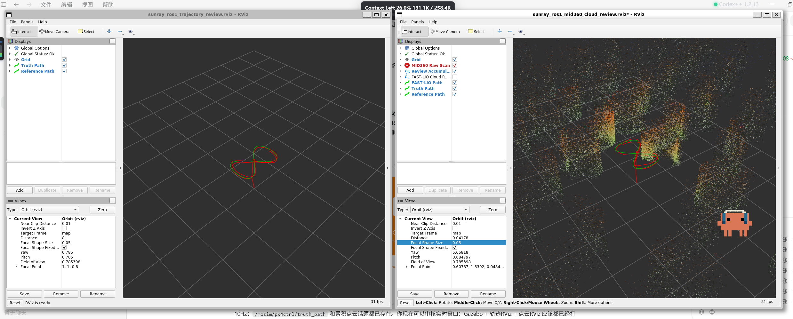

- **页内文案：**
  运行时画面中绿色为参考、红色为实际轨迹，说明控制核心已进入 ROS/PX4/Gazebo 飞行生命周期。点云叠加画面只用于展示定位和环境观测可见，不能替代 MWORKS 七场景的正式性能数字。
- **版式：**两张 RViz 图左右并列，图下只保留绿色/红色含义；不在 PPT 内嵌长视频。
- **讲解重点：**可以从本页衔接现场演示或已留存回放。

### 26. FAST-LIO、PX4 EKF 与控制器输入之间存在明确状态职责边界

- **叙事角色：**回答接口追问。
- **模板页型：**状态链路 + 点云页。
- **本页结论：**运行时控制器消费 PX4 EKF 融合后的 MAVROS 本地状态，FAST-LIO 原始话题服务定位链路和诊断。
- **图源：**

  1. Docs/报告/图/手绘架构/07_FASTLIO定位与规划部署边界.png
  2. Docs/报告/图/Rviz/fastlio点云.png
- **审核预览（PPT/图源副本）：**
  

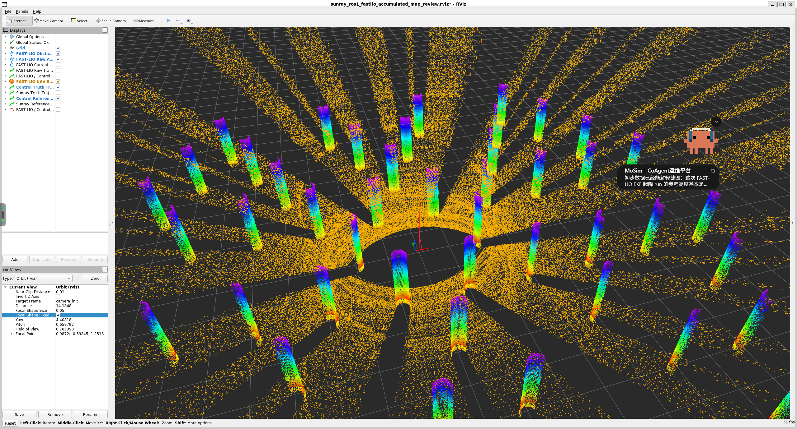

- **页内文案：**
  MID360 与 IMU 进入 FAST-LIO，外部视觉对齐后由 PX4 EKF 融合，px4ctrl 实际读取 /uav1/mavros/local_position/odom。状态链路与点云画面分别服务控制输入和定位诊断，避免把展示面误写成控制性能证据。
- **版式：**链路图居左、点云图居右，在链路图中高亮控制器实际输入。
- **讲解重点：**这是技术答辩中最容易被追问的接口边界。

### 27. MoSim Studio 让配置、模型入口、结果与代码生成形成可操作流程

- **叙事角色：**呈现使用体验。
- **模板页型：**双截图页。
- **本页结论：**Studio 改善配置与复核效率，但不替代 MWORKS 模型结果和运行时记录。
- **图源：**

  1. Docs/报告/图/APP/01_在线建模验证.png
  2. Docs/报告/图/APP/03_生成代码部署.png
- **审核预览（PPT/图源副本）：**
  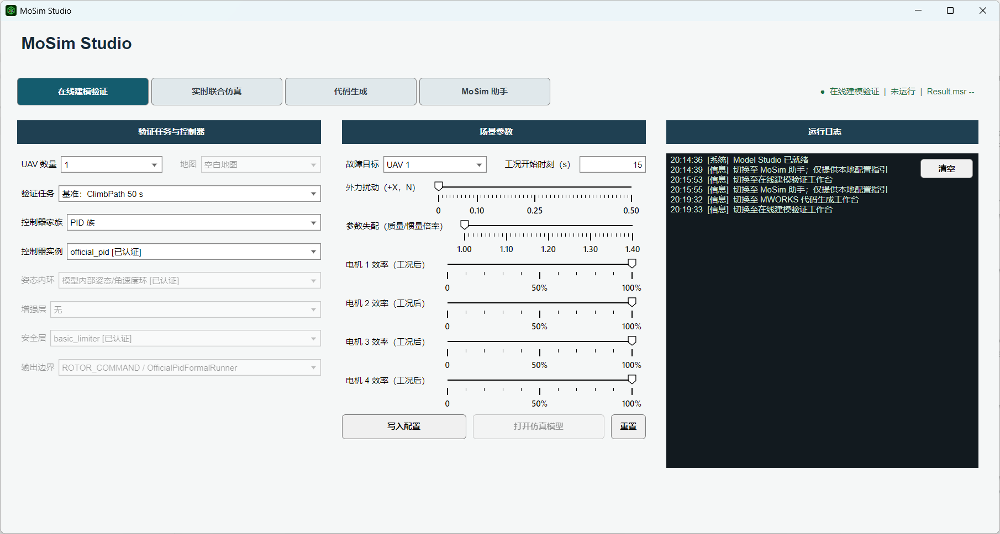

- **页内文案：**
  Studio 集中组织任务、控制器、场景参数、正式模型入口和代码生成入口，使评审可以按固定路径查看模型与结果。界面承担操作和导航职责，性能结论仍由 FormalRunner 结果和运行时记录给出。
- **版式：**两张界面图左右对照，各用一枚短标签说明入口；不在页面上另列功能清单。
- **讲解重点：**满足用户交互与文档可用性要求，同时保持证据边界。

### 28. 交付物把模型、配置、结果、代码和文档组织为可复现资产

- **叙事角色：**收束交付完整性。
- **模板页型：**交付物树 + 实例页。
- **本页结论：**成果不是一段演示视频，而是可从结论回溯到模型、Profile、结果和生成代码的交付包。
- **图源：**

  1. 基于报告目录结构重绘“模型库、控制器、配置、Results、C99、用户手册、仿真报告”交付物树。
  2. Docs/报告/图/代码生成与部署/PX4Ctrl导出目录.png
- **审核预览（PPT/图源副本）：**
  

> **待制图：**本页图源中的重绘项尚无本地图片；其余现有图已在上方嵌入预览。

- **页内文案：**
  模型、控制器、实验 Profile、原始结果与指标、C99 产物以及报告和手册均有固定路径，评审可以从任一结论回到对应输入与记录。该组织方式同时满足赛题对代码规范、模块化设计和文档完整性的要求。
- **版式：**交付物树居左、实际目录截图居右，避免列出过多文件名。
- **讲解重点：**这是规范性与完整性评分的收束页。

---

## 第五部分：结论与面向工具箱资产的展望

### 29. MoSim 已形成可审查、可比较、可部署的四旋翼工具链原型

- **叙事角色：**总结主结论。
- **模板页型：**总览 + 关键数字页。
- **本页结论：**MoSim 已完成赛题主线工程闭环，并沉淀出边界清晰、可继续封装的模型、接口、场景和验证资产。
- **图源：**

  1. Docs/报告/图/手绘架构/16_MWORKS建模仿真代码生成反馈闭环.png
  2. Docs/报告/图/云纵150/Sunray150_Blender_完整装配模型.png
- **审核预览（PPT/图源副本）：**
  

- **页内文案：**
  项目完成云纵150参照机体、统一控制接口与实验合同、30/48 当前名义筛查、px4ctrl 七场景比较、三机与规划扩展，以及图形模型到 C99/Gazebo 的部署链路。px4ctrl 相对 Official PID 在阶跃、Figure8 和风扰中的位置 RMSE 分别降低 29.8%、73.3% 和 52.1%，参数失配和电机效率仍按独立问题持续优化。
- **版式：**主链路图为左侧主体，右侧只放三枚结果数字与一枚“当前优化重点”标签；现场演示顺序以细字置底。
- **讲解重点：**先证明已经打通的闭环，再说明其可沉淀为长期资产。

### 30. 展望：将原型沉淀为 MWORKS 无人机工具箱的参考资产

- **叙事角色：**结尾与行动。
- **模板页型：**演进路线页。
- **本页结论：**下一阶段将公共 Plant、Adapter、Profile、指标、代表场景和部署接口模块化，使 MoSim 从一次作品延伸为可复用的工具箱参考资产。
- **图源：**

  1. 基于“MoSim 当前原型 -> 模型/接口/场景/指标资产包 -> MWORKS 无人机工具箱”重绘三段演进图。
  2. Docs/报告/图/手绘架构/16_MWORKS建模仿真代码生成反馈闭环.png（作为当前资产包缩略图）
- **审核预览（PPT/图源副本）：**
  

> **待制图：**本页图源中的重绘项尚无本地图片；其余现有图已在上方嵌入预览。

- **页内文案：**
  后续将以案例、文档和回归结果维持公共 Plant、控制器 Adapter、Profile、指标规则、代表场景与 C99/运行时接口的可用性。MoSim 是可审查的原型和参考资产，不代表官方产品路线或已被官方采纳。
- **版式：**三段演进图居左，右侧三枚短标签写“可复用模型资产”“可验证实验合同”“可移植部署接口”；结尾不新增技术名词。
- **讲解重点：**回扣开场：在受限环境下先把关键链路做成可掌控、可积累、可继续生长的能力。

---

## 备份页：用于评委追问，不进入主讲时间

### B01. 七场景完整指标矩阵

- **图源：**将报告表 9-1 重绘为两组控制器的紧凑热力表；不直接粘贴原始 Word 表格。

> **待制图：**七场景紧凑热力表尚无本地图片，当前不以临时截图替代。

- **说明：**保留 Hover、Step、Figure8、Spiral、Wind、Parameter mismatch、Motor efficiency 的状态、RMSE、终端误差、超调和能量；无效记录保持 invalid 标识。

### B02. 阶跃响应详细指标

- **图源：**Docs/报告/figures/第11章/七场景对比/step_response_position_error_comparison.png + 重新排版的表 9-2。
- **审核预览（PPT/图源副本）：**
  

> **待制图：**表 9-2 的答辩版重排尚无本地图片；上方仅为现有曲线图的审核预览。

- **说明：**供追问超调、调节时间、稳态误差与尾段 RMSE 时使用。

### B03. 48 条路线与算法族清单

- **图源：**Docs/报告/图/手绘架构/09_控制算法家族技术路线.png。
- **审核预览（PPT/图源副本）：**
  
- **说明：**解释 48 条 Studio 路由、46 个算法模块、Official PID 与 px4ctrl 两条基线之间的统计边界。

### B04. 参数 Profile 与坐标外参细节

- **图源：**Docs/报告/图/手绘架构/18_坐标系与FrameContract转换关系.png + 报告核心参数表重绘。
- **审核预览（PPT/图源副本）：**
  

> **待制图：**核心参数表的答辩版重绘尚无本地图片；上方仅为现有坐标关系图的审核预览。

- **说明：**供追问机体几何、旋翼索引、MID360 外参和当前参数来源时使用。

### B05. C99 生成与 SIL 一致性细节

- **图源：**Docs/报告/图/代码生成与部署/Mworks导出代码.png + SIL 三项阈值/差异表。
- **审核预览（PPT/图源副本）：**
  

> **待制图：**SIL 三项阈值/差异表尚无本地图片；上方仅为现有代码导出截图的审核预览。

- **说明：**说明 C99 是 MWORKS GenerateModelCode 产物，SIL 是模型内数值一致性验证，二者与 Gazebo 运行时证据分层。

### B06. 现场演示脚本与故障预案

- **推荐顺序：**Studio 打开 px4ctrl 正式入口 -> 展示 MWORKS 图形模型 -> 打开阶跃/Figure8 结果 -> 播放 Gazebo/RViz Figure8 回放。
- **说明：**演示只展示已有可复核结果；若运行时环境不可用，立即切换到已留存的结果图和视频回放，并明确这是回放证据而非新的实时运行。

---

## 制作检查单

- 主讲页固定为 01-30，共 30 页；每页均有叙事角色、模板页型、结论、1-2 个图源、两句页内文案、版式和讲解重点。
- 只使用本文件列出的当前 PNG，不使用归档或 _archive_svg_superseded 路径下的旧图；自绘图必须基于本页写明的当前报告、赛题或图源。
- 图表裁切后不得截断图例、坐标轴、单位、参考/实际颜色或数据来源；主讲页不直接粘贴宽表、完整类图或长公式。
- 正式模型、运行时、显示/操作三类证据不得混用。涉及 px4ctrl、ECBF、OpenBlocks、SIL、FAST-LIO、Gazebo 和 Studio 的页面必须保留本文件中的限定语。
- 现场演示按“Studio 配置 -> MWORKS 模型 -> 阶跃/Figure8 结果 -> Gazebo/RViz 回放”展开；运行时不可用时切换已有结果和回放，不宣称新的实时运行。
