# 基于 MWORKS 的四旋翼位姿控制全链路仿真平台

## 摘要

针对国外仿真工具断供背景下国产平台缺乏完整四旋翼控制验证工具链的问题，本项目基于 MWORKS/Sysplorer 构建了覆盖物理建模、控制器集成、代码生成、运行时部署与智能辅助的全链路仿真与验证平台 MoSim。平台以云纵 150 实机为参照对象，建立了基于 Modelica MultiBody 的六自由度机体模型与五层可追溯参数 Profile；通过 ATTITUDE_THRUST、BODY_RATE_THRUST、WRENCH 和 ROTOR_COMMAND 四类统一输出边界，将 8 组 48 条控制器路线纳入同一公共 Plant，在相同 ClimbPath 50 s 工况下完成同条件筛查，当前已有 30 条路线达到名义终端误差门限。

围绕团队自研 px4ctrl，项目完成了位置/速度外环的图形化建模、全机闭环验证、C99 自动生成与 50 s 软件在环一致性验证。在冻结七场景的代表性任务中，px4ctrl 相比 Official PID 在阶跃、风扰和 Figure8 三类任务中的位置 RMSE 分别降低 29.8%、52.1% 和 73.3%；其中阶跃响应约 3.83 s 进入调节带。生成代码以共享库形式接入 ROS1/PX4/Gazebo 运行时，已留存名义飞行、风扰注入和转子故障恢复等 C99 运行记录；状态反馈由 FAST-LIO 经外部视觉对齐后进入 PX4 EKF，px4ctrl 实际消费 `/uav1/mavros/local_position/odom`。

平台还集成 FUEL 自主探索、Diff-Planner 局部规划、UE 高保真工业场景及 UE→Gazebo 网格导出链路，并将三机编队、规划参考和安全参考调节纳入统一工程体系。MoSim Studio 将控制器选择、任务配置、模型打开、代码生成和结果回链组织为统一操作入口；本地 AI 助手依托 95 个领域技能包、8 个 MCP 工具服务器和 56 个自动化工作流，为平台使用者提供面向模型、配置和结果的工程引导能力。源码、模型、配置与已留存结果均可按路径回链。

## 一、研究背景与平台定位

### 1.1 工业仿真软件的知识壁垒

工业仿真软件的壁垒不是单纯的计算内核问题——如果只是算法难度，倒容易解决。MATLAB 的数值求解器在技术上并不神秘，但它有数十个专业工具箱：控制系统、航空航天、机器人、电力电子，每个工具箱都是相关领域几十年产学研积累的结晶。类似的，Cadence 和 Mentor 等电路设计软件的仿真引擎本身不是核心壁垒，真正难以复制的是背后海量的器件库——数十年间由软件厂商和各芯片厂家合作积累的技术特性数据。这种知识封装型壁垒意味着：即使掌握了基础算法，也无法在短期内形成可用的工业级平台。

仿真类工业软件本质上是跨学科工程。它一方面要求扎实的物理建模能力——流体方程、多体动力学、电磁场这些东西本身就是一条条物理公式；另一方面要有深刻的计算机工程理解，因为很多物理方程根本没有解析解，甚至数值上也难以收敛，必须针对具体问题选择求解策略和修正模型。这不是单靠计算机专业能完成的事，需要物理、自动化、电子等学科的长期协作，短期砸钱也急不来。

2020 年 MATLAB 对哈尔滨工业大学、哈尔滨工程大学等高校突然断供，把这个问题推到了明面上。被禁的高校不是缺一个"能跑仿真的软件"——开源数值工具有的是——而是缺那套系统化的知识封装：几十年来用 MATLAB 工具箱承载的教学案例、控制算法库、工程实践模板，一夜之间全部不可用了。课题不等人，但替代方案不是换个求解器就能解决的。

### 1.2 MoSim 平台要解决的问题

MoSim 的出发点很明确：在国产 MWORKS 平台上，为四旋翼位姿控制这个方向做一套完整的开源替代工具链。市面上不缺单点开源方案——PX4 有飞控算法、Gazebo 有物理仿真、ROS 有通信框架——但这些东西是散的。从控制理论推导到 Modelica 建模、到图形化设计、到代码生成、到嵌入式部署，中间每一个环节的衔接都需要工程化的统一设计。MATLAB/Simulink + Embedded Coder + ROS Toolbox 之所以强，不是因为某个单点功能无法替代，而是它把整条链路打通了。MoSim 对标的就是这条链路的打通能力。

技术选型上，我们选择 Modelica 国际开放标准而非 Simulink 专有格式，保证模型可审查、可迁移；选择 MWORKS/Syslab 作为国产求解器和计算环境，不依赖任何受限的商业授权。这意味着被禁用 MATLAB 的高校可以直接使用、买不起正版的学生可以免费获取、追求技术自主的工程团队不用担心授权风险。源码全部开放，流程全部可复现。

### 1.3 主要工作概述

围绕"可审查的物理建模→统一控制器接入→全机闭环验证→代码生成与运行时部署"这条主线，本项目完成了以下工作：

以云纵 150 实机为参照，建立了基于 Modelica MultiBody 的六自由度机体模型，物理参数分五层管理（几何、质量、惯量、气动、传感器），每层标注来源与替换条件。设计了四类统一输出边界（ATTITUDE_THRUST / BODY_RATE_THRUST / WRENCH / ROTOR_COMMAND），将 8 组 48 条控制器路线纳入同一公共 Plant，在同一 ClimbPath 50 s 工况下完成筛查，当前 30/48 达标。完成了 px4ctrl 图形模型→C99 代码生成→编译→整机 SIL 等价验证，位置差异在 10⁻¹³ m 量级。生成的 C99 以共享库形式接入 ROS1/PX4/Gazebo 运行时，已留存名义飞行、风扰注入和电机故障恢复三类运行记录。此外还集成了 FAST-LIO 状态估计、FUEL 自主探索和 Diff-Planner 局部避障，并通过 UE→Gazebo 网格导出流水线构建了工业场景仿真环境。

从平台交付视角看，MoSim 的核心工程贡献集中在六个相互衔接的层次：云纵150多领域虚拟机体与可追溯参数 Profile；48 条控制器的统一接入与切换机制；px4ctrl 图形化设计与代表性场景性能验证；C99 代码生成、构建与软件在环一致性验证；三机编队、规划参考和工业场景扩展；以及以 Studio 与本地 AI 助手为入口的可操作工程工作流。后续章节按这一链条逐步展开。

### 1.4 赛题对应与技术路线

本项目面向 A8 四旋翼位姿控制与仿真平台赛题。整条技术路线可以用一句话概括：参数 Profile → MWORKS 模型 → 原始结果/指标 → 结论。每一条控制器结论均可沿此链路完整回溯到源码和数据文件，不存在无出处的数字。

### 1.5 赛题对应表

赛题五项核心需求与本平台实现的完整对应关系如表 1-1 所示，涵盖了从虚拟机体建立、多控制器集成、同条件筛查到代码生成部署的全部赛题要素。

表 1-1　赛题需求与核心实现对应

| 赛题需求             | 核心实现                                       | 主要证据                                       |
| -------------------- | ---------------------------------------------- | ---------------------------------------------- |
| 云纵150参照虚拟机体  | 多领域机体、旋翼安装关系和参数 Profile         | `Sunray150VirtualPx4Classic.mo`              |
|                      |                                                | `RotorActuatorCore.mo`                       |
| 多控制器统一接入     | 四类输出边界 + Adapter/Runner/Profile 合同     | `controller_route_interface_matrix.json`     |
|                      |                                                | `Runners/Formal/` 目录                       |
| 同条件基线筛查       | 48 条 ClimbPath 50 s 统一工况筛查              | `G3_CATALOG_48_CURRENT_STATUS.json`          |
|                      |                                                | `climbpath_baseline_count_definition.json`   |
| 七场景对比           | Official PID 与 px4ctrl 冻结 Profile 对照      | `seven_scenario_experiment_profiles_v2.json` |
|                      |                                                | `Results/.../seven_scenario_ab_v2/`          |
| 灵敏度分析           | 风扰、参数失配、电机效率三组网格               | `SENSITIVITY_LONG_V1_CLOSEOUT.json`          |
| 图形模型到 C 与 SIL  | px4ctrl 图形 Sysblock→C99→CFunction 整机对比 | `src/control/codegen/px4ctrl/`               |
|                      |                                                | `CLOSED_LOOP_SIL_RESULT.json`                |
| C99 本地 Gazebo 运行 | graphical_px4ctrl_c99 后端完整飞行生命周期     | `Results/sunray_ros1/`                       |
| Studio 手动工作流    | 44 条正式 Runner 路由配置                      | `model_studio_task_routes_v1.toml`           |

### 1.6 报告阅读说明

本报告所有定量结论均回链至原始数据路径与指标文件。正文展示口径为 48 条控制器路线：其中 46 条算法控制器按七个算法族展开，Official PID 为官方基线，px4ctrl 为自研基线；44 是 Studio 可手动打开的正式路由，当前名义目录已有 30/48 条路线达到终端误差门限，冻结历史 G3 图集仍以 28 条达标快照为来源。各章图表均标注数据来源脚本与结果目录。

面向评委的阅读主线可以按四个问题展开：(1) 第三、四章先说明云纵 150 参照机体、坐标/传感器接口和四类控制器输出边界如何把不同算法放进同一公共 Plant；(2) 第五、六章再说明代表性控制律的推导，以及 46 条算法控制器如何按族登记、接线和回链源码；(3) 第七至十章用同一 ClimbPath、七场景、灵敏度和多机记录回答“性能如何、在不同任务下如何表现”；(4) 第十一至十五章说明 FAST-LIO/规划支撑、代码生成、C99 运行时和 Studio 操作面分别承担怎样的工程角色、如何衔接。这样阅读时不会把结构图、离线参考、整机仿真和 ROS/Gazebo 运行时证据混成一个结论。

## 二、指标定义与负样本处理

在进入具体控制器之前，需要先把"怎么算通过、怎么算失败"定义清楚——这相当于整个项目的测试规格。本章建立统一的定量评价体系，包括工况选择、指标公式、通过门限和负样本处理规则。后续 48 个控制器在相同工况下的对比、七场景矩阵和灵敏度网格的判定，全部以本章规则为准。

### 2.1 可审计实验链

```text
参数 Profile / 实验 Profile
  -> FormalRunner + Adapter + 控制器
  -> MWORKS 原始结果与 metrics
  -> G2/G3、七场景、灵敏度状态 JSON
  -> 报告表格、图件清单和发布清单
```

统一路由合同位于`Config/control_platform/controller_route_interface_matrix.json`，七场景冻结合同位于`Config/control_platform/seven_scenario_experiment_profiles_v2.json`。这些合同冻结了 Plant、求解器、采样率、输入边界和注入语义；FormalRunner 的打开与 MWORKS 仿真仍由用户按手册人工确认和启动，不能把合同存在写成仿真已自动完成。

### 2.2 实验 Profile

名义筛查使用 `ClimbPath 50 s`；七场景使用冻结的`seven_scenario_experiment_profiles_v2.json`。位置 RMSE、终端误差、超调、调节时间和控制能量均从每条记录的 `metrics/METRICS.json` 读取。指标公式、窗口和无效记录处理规则见 `公式与推导.md`。
Profile 配置与状态注入链路如下图所示，其关键设计是将任务轨迹与扰动/故障参数完全分离：轨迹由任务 Profile 选择，状态注入（风扰、参数失配、电机效率）由独立参数覆盖。这种正交化配置使得同一控制器可在不改动自身参数的情况下经历所有扰动组合，是后续灵敏度网格实验的配置基础。


图 2-1　Profile 配置与状态注入链路

### 2.3 参考轨迹与冻结故障注入

`ClimbPath` 是 G2/G3 同条件 50 s 名义筛查的共同参考，不是七场景 v2 的Figure8/Spiral 替代物。其当前源码输出为

```latex
\[
x_r(t)=
\begin{cases}0,&t<20\\t-20,&20\le t<30\\10,&t\ge30\end{cases},\quad
y_r(t)=
\begin{cases}0,&t<30\\t-30,&30\le t<40\\10,&t\ge40\end{cases},
\tag{2-1}
\]
```

垂向参考、参考速度和参考加速度共同写为

```latex
\[
z_r(t)=
\begin{cases}
2t,&0\le t<5\\
10,&5\le t<10\\
10+\frac53(t-10),&10\le t<13\\
15,&t\ge13,
\end{cases}\qquad
\mathbf v_r(t)=
\begin{bmatrix}
\mathbb 1_{[20,30)}(t)\\
\mathbb 1_{[30,40)}(t)\\
2\mathbb 1_{[0,5)}(t)+\frac53\mathbb 1_{[10,13)}(t)
\end{bmatrix},\qquad
\mathbf a_r(t)=\mathbf0.
\tag{2-2}
\]
```

七场景 v2 的轨迹类与参数由冻结 Profile 选择，公共时间函数与位置参考统一写为

```latex
\[
\begin{aligned}
h(t;H,T)&=H\min(t/T,1),\qquad \tau=\max(0,t-5),\\
\mathbf p_r^{hover}(t)&=(0,0,h(t;2,5))^T,\\
\mathbf p_r^{step}(t)&=(\mathbb 1_{[15,\infty)}(t),-\mathbb 1_{[15,\infty)}(t),h(t;2,5))^T,\\
\mathbf p_r^{figure8}(t)&=(2\sin(0.35\tau),\sin(0.70\tau),h(t;2,5))^T,\\
\mathbf p_r^{spiral}(t)&=(1.5[\cos(0.30t)-1],1.5\sin(0.30t),0.15t)^T.
\end{aligned}
\tag{2-3}
\]
```

读表要
注意后三个场景的参考轨迹并非新设计：`wind_disturbance` 与 `motor_efficiency_fault`复用 `figure8`、`parameter_mismatch` 复用 `spiral`，它们与被复用场景的差别全在扰动或故障注入，不在参考轨迹。因此这三对可直接对照，差异即扰动的净效应。

表 2-1　七场景 v2 的位置参考轨迹与时长

| 场景                       | 参考公式           | 时长 |
| -------------------------- | ------------------ | ---: |
| `hover`                  | 式（2-3）第 2 行   | 35 s |
| `step_response`          | 式（2-3）第 3 行   | 45 s |
| `figure8`                | 式（2-3）第 4 行   | 50 s |
| `spiral`                 | 式（2-3）第 5 行   | 50 s |
| `wind_disturbance`       | 与`figure8` 相同 | 50 s |
| `parameter_mismatch`     | 与`spiral` 相同  | 50 s |
| `motor_efficiency_fault` | 与`figure8` 相同 | 50 s |

平滑段的 \(\mathbf v_r\) 与 \(\mathbf a_r\) 是表中 \(\mathbf p_r\) 的一阶和二阶解析导数；`StepResponse` 源码在阶跃时不构造冲击加速度，显式采用式（2-2）中的零参考加速度。这些 Profile 用于 Official PID 与 px4ctrl 的冻结 v2 A/B 对照实验。

三个非名义注入严格是 Runner/Plant 参数，而不是控制器重新调参：

```latex
\[
\mathbf F_g^W(t)=
\begin{bmatrix}0.25\\0\\0\end{bmatrix}
\mathbb 1_{[15,50)}(t)\ \mathrm N,\qquad
m'=1.2m,\qquad
\mathbf J'=\operatorname{diag}(1.2,1.2,1.2)\mathbf J,
\tag{2-4}
\]
```

电机效率故障乘子按旋翼编号写为

```latex
\[
\eta_{f,i}(t)=
\begin{cases}
0.5,&i=1,\ t\ge15\\
1,&\text{otherwise}.
\end{cases}
\tag{2-5}
\]
```

第一式是世界系外力阵风，不是风速；第二式只缩放物理机体质量和主惯量，控制器保持名义参数；第三式同时作用于第 3.3 节的旋翼推力和反扭矩。其余 Profile 的阵风、缩放和故障乘子均为名义值。两条 50% 旋翼 1 故障记录保留为无效负证据，不能由注入公式本身改写为通过。

### 2.4 指标与有效通过判定

令位置误差和终端误差按式（2-6）定义，有效样本数为 \(N\)。正文采用的指标为

```latex
\[
e_k=\lVert\mathbf p_{r,k}-\mathbf p_k\rVert_2,\qquad
\mathrm{RMSE}_{p}=\sqrt{\frac{1}{N}\sum_{k=1}^{N}e_k^2},\qquad
e_T=e_N .
\tag{2-6}
\]
```

`control_energy` 不是电能或机械能估计。指标脚本从每条原始记录的最终四路执行器指令提取命令幅值代理，并按梯形积分计算：

```latex
\[
\mathbf u_k=[u_{1,k},u_{2,k},u_{3,k},u_{4,k}]^T,\qquad
E_{\mathrm{cmd}}=
\sum_{k=1}^{N-1}\frac{t_{k+1}-t_k}{2}
\left(\lVert\mathbf u_k\rVert_2^2+
\lVert\mathbf u_{k+1}\rVert_2^2\right).
\tag{2-7}
\]
```

因此该指标比较的是经过每条 Adapter/Allocator 后的共同执行器层命令强度；它不能被解释为电池能耗。缺少完整四路 `u1..u4` 的记录不用于跨控制器的该项排名。

对于有明确稳态参考的分量，超调为

```latex
\[
M_p=100\%\cdot\frac{\max_t|x(t)-x_{ss}|}{|x_{ss}-x(0)|}.
\tag{2-8}
\]
```

当分母很小或参考不是一步稳态时，超调可能很大，不能脱离 Profile 横向比较。调节时间按冻结阶跃合同计算，不是无限时域的口头描述。判据为 X/Y 两轴同时进入各自阶跃幅值的 \(\pm5\%\) 带并保持到观察窗末端。记阶跃时刻
\(t_0=15\,\mathrm s\)、观察终点 \(t_{end}=45\,\mathrm s\)，各轴容带与调节时间按式（2-9）定义：

```latex
\[
\begin{aligned}
\delta_x=0.05\,|x_{tgt}-x_0|,\qquad
\delta_y=0.05\,|y_{tgt}-y_0|,\\
t_s=\min\Big\{t_k-t_0\;\Big|\;
|x(t_\ell)-x_{tgt}|\le\delta_x \;\wedge\;
|y(t_\ell)-y_{tgt}|\le\delta_y,\;
\forall t_\ell\in[t_k,t_{end}]\Big\}.
\end{aligned}
\tag{2-9}
\]
```

保持窗口延伸至 \(t_{end}\) 而非固定长度，因此不存在"进带后又出带仍判定已调节"的情形。若在 \([t_0,t_{end}]\) 内不存在满足该条件的 \(t_k\)，则
\(t_s\) 记为 `NaN`，含义是**观察窗内未调节完成**，不是数据缺失。实现见
`Scripts/results/calc_metrics.jl` 的 `persistent_step_settling_time`，容带比例常量为 `STEP_RESPONSE_SETTLING_FRACTION = 0.05`。
若记录末尾不存在完整的保持窗口，脚本返回 NaN。无效记录的诊断数值保留，但不参与通过判定。
`calc_metrics.py` 还使用末 5 s 的尾段 RMSE，以及式（2-10）给出的保持窗口平均误差：

```latex
\[
\mathrm{RMSE}_{tail}=
\sqrt{\frac{1}{N_{tail}}\sum_{t_k\ge t_{max}-5}e_k^2},\qquad
\bar e_{ss}=\frac{1}{N_W}\sum_{t_k\ge t_{max}-\max(5,0.2t_{max})}e_k.
\tag{2-10}
\]
```

对 G3 单条同条件记录，实际有效通过判据写为

```latex
\[
\mathrm{pass}_{G3,i}\Longleftrightarrow
\mathrm{completed}_i\ \land\ \mathrm{finite}(e_{T,i})\ \land\ e_{T,i}<5\ \mathrm m.
\tag{2-11}
\]
```

它定义的是单行结果状态；根 `G3_STATUS.json` 的 `completed=false` 是冻结历史 G3 快照的项目状态，当前目录对账文件同样为 `completed=false`。二者都表示 48/48 通过目标尚未收口，不能把当前 30 条通过或历史 28 条通过写成 G3 总体完成。

### 2.5 负样本处理原则

失败不被删除、重命名或改写为”待跑”。第七章将当前目录的 8 条终端误差超限、8 条超时、1 条仿真 API 失败和 1 条模型检查失败，与冻结历史快照的 9/8/2/1 失败分类分开保留；第九章保留两条无效电机效率故障记录。这样可以区分接口存在、模型可检查、仿真完成和性能门限四种不同事实。

### 2.6 数据提取与可视化工具链（MWORKS.Syslab / Julia / TyPlot）

本报告的图件生成分为“原生结果导出”和“CSV 后处理”两个可审计阶段，不能把两段混写成一条全自动 MSR 转换链：

(1) MWORKS.Sysplorer 执行仿真并导出 Result.msr。

(2) Julia 批量入口 `Scripts/syslab/batch_export_msr_to_csv.jl` 目前只负责通过控制器清单和最新 MSR 定位编排任务，其中的 `export_msr_to_csv` 仍明确返回 `Automatic MSR export not implemented`；真正的批量转换由 `Scripts/syslab/export_msr_continuous_signals.py` 完成。该脚本按 MSR 的 `Continuous Data Table` 与 `Variable Index Table` 解析原始连续信号，不合成缺失值，并保留每个字段的源变量、列号和源文件哈希。

(3) 已完成的 30 条当前目录导出证据集中保存在 `Results/control_platform/msr_csv_export_20260731/`，由 `MSR_FILE_MAPPING.json` 绑定 MSR 与 CSV、由 `CSV_EXPORT_VERIFICATION.json` 校验 30/30 文件、18 列（17 个必需控制量加 `position_error_norm`）、0--50 s 时间范围和单调时间轴；Result Viewer 仍可作为单条人工复核入口。

(4) 从已验证 CSV 开始，TyPlot/Julia 脚本自动完成指标读取、曲线绘制和 PNG 清单生成。因此图件可由“MSR → `export_msr_continuous_signals.py` → 已验证 CSV → 绘图脚本”复现；不能把未实现的 Julia 包装入口写成唯一转换器。

工具链闭环如下图所示，图中的“数据导出”对应结构化 MSR 读取和字段绑定，Result Viewer 是可选的人工复核入口，之后的指标计算和图件生成才是 TyPlot/Julia 批处理环节。


图 2-2　MWORKS 建模→仿真→数据导出→TyPlot 可视化的工具链闭环

以冻结历史 G3 快照的 28 条达标控制器详图（7 张/条 × 28 = 196 张）的生成脚本为例，其核心绘图逻辑为：
下面是完整 TyPlot 脚本中的绘图片段；`load_csv`、输出目录和图形样式函数已在脚本入口处定义，复制整段脚本即可批量生成图件。

```julia
using TyPlot, JSON, Printf

# 加载 CSV 并绘制 x-y 平面轨迹对比

data = load_csv(controller_id)
fig(9.0, 7.5)
plot(data["x_ref"], data["y_ref"]; label="参考", linestyle="--")
plot(data["x"], data["y"]; label=controller_id)
xlabel("x (m)"); ylabel("y (m)")
styled_legend()
save_fig(output_dir, "trajectory_xy.png")
```

完整脚本位于 `Scripts/syslab/plot_28_passed_detail_typlot.jl`（冻结历史 28 条快照的 196 张）、`plot_chapter10_comparison_typlot.jl`（族系汇总、雷达与排名）、`plot_chapter11_typlot.jl`（七场景、灵敏度、三机编队与 ECBF）、`plot_extension_openblocks_typlot.jl`（OpenBlocks 拓展轨迹）。`plot_sensitivity_analysis.jl` 仅保留为旧的手写 SVG 生成器，不是当前 PNG 证据入口。

## 三、云纵150参照虚拟机体与参数 Profile

### 3.1 参数分层

项目以云纵150实物为参照，在 Blender 中完成 1:1 逆向建模，还原整机部件层次、旋翼相对位置与传感器安装关系。下图展示完整装配体全景，后续 Modelica 模型中每个几何参数（旋翼中心坐标、机臂长度、传感器位姿）均可追溯到这一物理基准。


图 3-1　云纵150 虚拟装配体全景，对照本章参数 Profile 的物理来源

正面图清晰展示四个旋翼的编号与左右对称布局。该编号直接对应 Modelica Profile 中 `rotor_positions` 向量的索引顺序，是旋翼力/反扭矩方向判定与控制分配矩阵构建的几何基准。

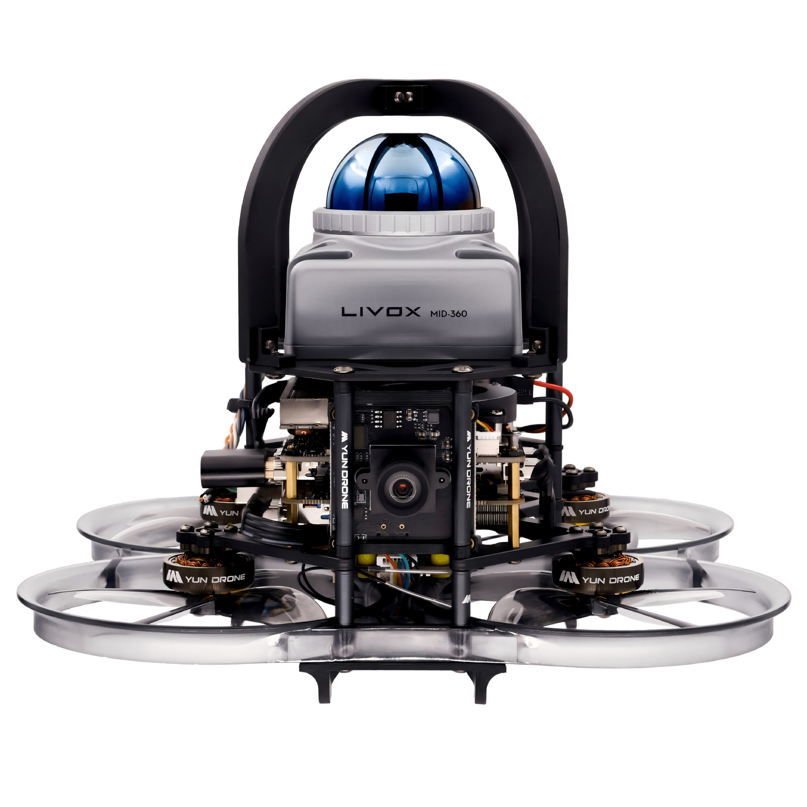

图 3-2　云纵150 正面视图，标注旋翼序号对应 Profile 字段 `rotor_positions`

侧面图展示机臂长度、机体高度与安装倾角等关键几何尺寸。这些尺寸直接决定了 Modelica 模型中坐标原点到旋翼中心的力臂向量，以及 MID360 激光雷达等传感器的安装位姿变换矩阵。

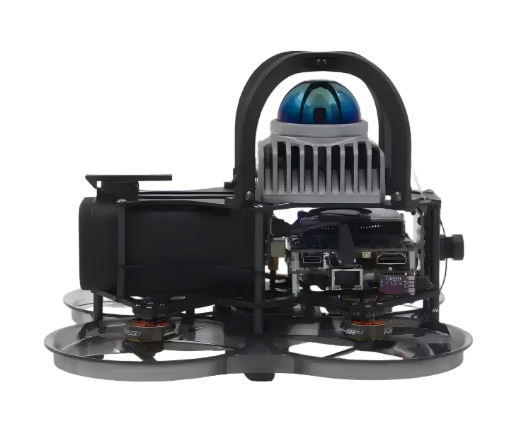

图 3-3　云纵150 侧面视图，机臂长度与安装倾角参照

机体参数按来源可靠性分五层登记，如表 3-1 所示。该分层设计的核心价值在于：每个数值均标注了当前来源与可替换条件，当后续获取动力台曲线或飞行日志辨识数据时，可逐层替换而不破坏模型接口与已有验证结果。几何与质量层已由实测确认，惯量与气动系数层以工程种子填充，预留了明确的升级路径。

表 3-1　机体参数的分层来源与替换边界

| 层级            | 当前来源与对象                                                | 替换边界                       |
| --------------- | ------------------------------------------------------------- | ------------------------------ |
| 几何            | 实物测量/装配关系；`mworks_rotor_center_m`、MID360 安装位姿 | 可替换为复测或装配图纸值       |
| 质量            | 整机称重与部件累加的工程 Profile 字段                         | 可由新的称重表覆盖             |
| 惯量            | CAD 估算和工程经验种子                                        | 可替换为台架或其他有来源的参数 |
| 推力/反扭矩系数 | 电机厂商数据与文献典型种子                                    | 可替换为动力台曲线             |
| 电机动态        | 一阶惯性种子参数`motor_time_constant_up_s/down_s`           | 可替换为阶跃试验或日志拟合值   |

Profile 类`MoSimQuadrotorModel.Parameters.Sunray150VirtualPx4Classic` 标注”Virtual simulation seed only”，表明当前参数为仿真种子而非辨识真值，后续可通过台架或飞行数据升级。核心物理参数如表 3-2 所示：

表 3-2　核心物理参数（Profile 文件：`Parameters/Sunray150VirtualPx4Classic.mo`）

| 参数                                 | 数值                           | 单位        | 来源       |
| ------------------------------------ | ------------------------------ | ----------- | ---------- |
| 起飞质量                             | 1.0                            | kg          | 整机称重   |
| 机体惯量$(I_{xx}, I_{yy}, I_{zz})$ | (0.0085, 0.0085, 0.012)        | kg·m²     | CAD 估算   |
| 旋翼中心坐标（#0 前右）              | (0.0537, −0.0537, −0.0141)   | m           | 实物测量   |
| 旋翼中心坐标（#1 前左）              | (0.0537, 0.0538, −0.0141)     | m           | 实物测量   |
| 旋翼中心坐标（#2 后左）              | (−0.0538, 0.0538, −0.0141)   | m           | 实物测量   |
| 旋翼中心坐标（#3 后右）              | (−0.0538, −0.0537, −0.0141) | m           | 实物测量   |
| 最大旋翼角速度                       | 1100                           | rad/s       | 厂商数据   |
| 推力系数$k_F$                      | 5.84×10⁻⁶                   | N/(rad/s)² | 厂商数据   |
| 力矩/推力比                          | 0.06                           | m           | 文献典型值 |
| 电机上升时间常数                     | 0.0125                         | s           | 工程种子   |
| 电机下降时间常数                     | 0.025                          | s           | 工程种子   |

**MID360 激光雷达安装外参与坐标系转换：**

MID360 的安装位姿严格按照实物装配关系标定，在 Modelica Profile、Gazebo SDF 和 FAST-LIO 配置中保持完全一致：

表 3-3　MID360 安装外参（body_link → lidar_base_link）

| 分量        | 数值                  | 说明                                 |
| ----------- | --------------------- | ------------------------------------ |
| $t_x$     | −0.000005 m          | 几乎无偏                             |
| $t_y$     | 0.032295 m            | 雷达安装在机体中心偏 Y 方向 32.3 mm  |
| $t_z$     | 0.050167 m            | 雷达基座高出机体坐标原点 50.2 mm     |
| roll, pitch | 0, 0                  | 无倾斜                               |
| yaw         | 4.712389 rad (−90°) | 雷达 X 轴与机体 X 轴存在 −90° 旋转 |

该 −90° yaw 旋转是因为 MID360 出厂坐标系定义与 PX4/NED 机体系不一致：雷达的扫描正前方（X 轴）对应机体 −Y 方向，必须做坐标系对齐。FAST-LIO 的外参配置中 `extrinsic_T = [0, 0, 0.1]` 对应的是雷达内部射线传感器相对雷达 IMU 的偏移（0.1 m），不是 body→lidar 变换。整条坐标链为：

```latex
\[
T_{body \to ray}=T_{body \to lidar\_base}\cdot T_{lidar\_base \to ray\_sensor}.
\tag{3-4a}
\]
```

三处配置文件的对应关系：

表 3-4　三处坐标配置文件的变换对应关系

| 文件                               | 定义的变换             | 参数位置                                        |
| ---------------------------------- | ---------------------- | ----------------------------------------------- |
| `Sunray150VirtualPx4Classic.mo`  | body→lidar_base       | `mid360_mount_pose_m_rpy`                     |
| `sunray150_with_mid360.sdf`      | 同上（SDF`<pose>`）  | `<joint name=”mid360_joint”>` 的 child pose |
| `mosim_sunray_livox_custom.yaml` | lidar_base→ray_sensor | `extrinsic_T`, `extrinsic_R`                |

在线外参估计已禁用（`extrinsic_est_en: false`），全部依赖装配测量值。这保证了状态估计的确定性——相同的标定参数在每次运行中产生相同的坐标变换，排除了在线标定引入的不确定性。

完整模型库的目录结构如下，各子包职责明确分离：

```
Models/MoSimQuadrotorModel/
├── Parameters/          # 参数 Profile（Sunray150VirtualPx4Classic.mo）
├── Vehicle/             # 机体物理模型
│   ├── Dynamics/        # 旋翼/电机动态（RotorActuatorCore.mo）
│   └── Frame/           # 刚体结构与质量
├── Control/
│   ├── Interfaces/      # 四类统一输出边界定义
│   ├── Implementations/ # 46 条算法控制模块；Official PID/px4ctrl 两条基线另列
│   │   ├── PidFamily/
│   │   ├── ClassicRobust/
│   │   ├── GeometricFlatness/
│   │   ├── SlidingMode/
│   │   ├── Optimization/
│   │   ├── Learning/
│   │   └── Sysblocks/   # px4ctrl 图形化实现
│   ├── Adapters/        # 边界类型转换层
│   └── Allocation/      # 控制分配器
├── Guidance/            # 轨迹生成（ClimbPath/Figure8 等）
├── Experiment/Runners/  # 正式全机闭环 Runner
└── Visualization/       # 动画与可视化
```

### 3.2 坐标、旋翼与物理链

项目采用 ENU/FLU 内部坐标系并建立与外部 NED/FRD 的显式转换合同（FrameContract），确保 Modelica 模型、PX4 飞控和 ROS 导航栈三方坐标一致。下图展示坐标系定义与转换关系。

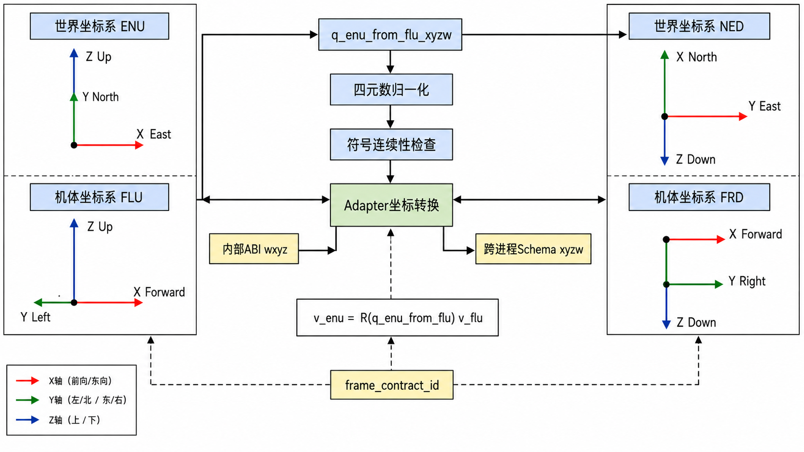

图 3-4　坐标系与 FrameContract 转换关系

机体底部视图展示桨叶防护环、旋翼中心下方空间和传感器安装位，为碰撞包络建模和 MID360 安装位姿标定提供几何依据。


图 3-5　机体底部桨叶防护结构与传感器安装位

机载电子与线束视图展示飞控板、电源模块、机载计算单元和线束的相对装配位置。该视图确认了 Blender 装配体与实物的一致性，同时为质量分布估算提供部件位置参照。

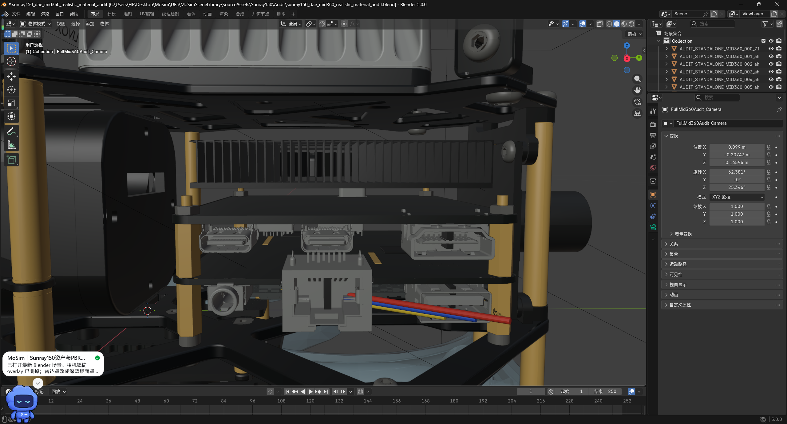

图 3-6　机载电子与线束装配布局

三维部件联系表重点看装配部件与可追溯物料条目的对应关系，便于后续替换参数时区分实物来源和工程种子。

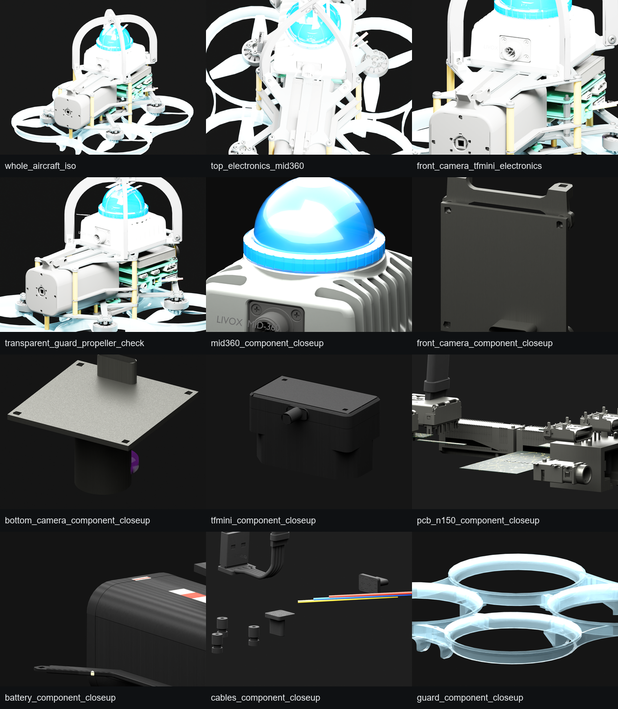

图 3-7　三维装配与部件审查联系表（物料追溯）

系统级硬件架构图重点看传感器、飞控、计算与执行器之间的分层连接，不将显示层或运行时工具误判为控制器本体。


图 3-8　云纵150 系统级硬件架构

MWORKS 活动模型使用世界 ENU 与机体 FLU 的内部约定；在外部运行时接口处才需显式处理 NED/FRD 的坐标转换。四个旋翼位置、旋转指令符号和偏航反扭矩方向在`Sunray150VirtualPx4Classic.mo` 的 `mworks_rotor_center_m`、`mworks_spin_command_sign` 和 `mworks_yaw_direction` 中集中定义。物理力/矩由 `RotorActuatorCore.mo` 生成，再由 `PhysicalWrenchAdapter.mo` 作用于MultiBody 机体。
坐标合同的方向交换和符号翻转写为

```latex
\[
\mathbf p_{NED}=\begin{bmatrix}p_{y,N}\\p_{x,E}\\-p_{z,U}\end{bmatrix},\qquad
\mathbf v_{FRD}=\begin{bmatrix}v_F\\-v_L\\-v_U\end{bmatrix}.
\tag{3-6}
\]
```

其中 `p_{x,E}`、`p_{y,N}`、`p_{z,U}` 是 ENU 世界坐标分量，`v_F`、`v_L`、`v_U` 是 FLU 机体速度分量；该式修正了把坐标分量名称交叉写反会造成的歧义。运行时 MAVROS local odom 的 `twist.twist.linear` 按 body/base_link 语义处理，再用姿态四元数旋转到世界系：

```latex
\[
{}^{W}\mathbf v=R_{W\leftarrow B}(q)\,{}^{B}\mathbf v.
\tag{3-7}
\]
```

FAST-LIO 原始 `/Odometry` 使用 `camera_init\to body`/Livox 语义，不能直接作为 px4ctrl 输入；`Scripts/sunray/fastlio_odom_alignment_adapter.py` 先应用 MID360 安装外参和初始 MAVROS-local 对齐，输出 `/mosim/fastlio/odom_aligned` 供 PX4 外部视觉融合，控制器最终读取 `/uav1/mavros/local_position/odom`。当前 MID360/FAST-LIO 采样率为 20 Hz，MAVROS/控制侧为 100 Hz。

本报告直接给出活动模型的公式；`公式与推导.md` 保留逐变量源码映射和复核说明，不再作为正文公式的唯一载体。

### 3.3 公共动力学、执行器与实际 X 型分配

动力学图重点看总推力、总力矩、执行器动态和实际分配矩阵如何汇入同一个 6-DOF Plant；矩阵的具体符号仍以本节活动模型公式为准。


图 3-9　四旋翼动力学与控制分配模型

后续控制律统一采用式（3-1）中的位置误差和速度误差。在 ENU 世界系和 FLU 机体系下，报告使用的刚体平动写作

```latex
\[
\begin{aligned}
\mathbf e_p&=\mathbf p_r-\mathbf p,\\
\mathbf e_v&=\mathbf v_r-\mathbf v,\\
\dot{\mathbf p}&=\mathbf v,\\
m\dot{\mathbf v}&=R_B^W\begin{bmatrix}0\\0\\T\end{bmatrix}
-mg\mathbf e_3+\mathbf d .
\end{aligned}
\tag{3-1}
\]
```

当前 `PhysicalWrenchAdapter` 将总推力和总力矩施加到 MWORKS MultiBody`BodyShape`。其连续刚体等价形式还包括姿态运动学与角动量方程：

```latex
\[
\dot R_B^W=R_B^W[\boldsymbol\omega]_\times,\qquad
\mathbf J_B\dot{\boldsymbol\omega}+
\boldsymbol\omega\times(\mathbf J_B\boldsymbol\omega)=\boldsymbol\tau .
\tag{3-2}
\]
```

其中 \(\mathbf J_B\) 取当前 `Sunray150VirtualPx4Classic` Profile 的机体主惯量。这不是在报告中另行手写一个 Plant；它是当前 MultiBody 力/矩、姿态和角速度链的公开物理表达，保证姿态控制、分配器和机体响应处于同一个 6-DOF 闭环描述中。
该式说明公共 Plant 的力学边界；控制器并不各自重复定义一套机体。对第 \(i\)个旋翼，当前执行器使用带上升/下降时常数的一阶动态和故障效率乘子：

```latex
\[
\tau_i=\begin{cases}\tau_{up},&|\omega_{cmd,i}|>|\omega_i|\\
\tau_{down},&\text{otherwise}\end{cases},\qquad
\dot\omega_i=\frac{\omega_{cmd,i}-\omega_i}{\tau_i},\qquad
T_{0,i}=C_T\omega_i^2,\qquad
T_i=\eta_{f,i}\eta_{T,i}T_{0,i} .
\tag{3-3}
\]
```

其中 (T_{0,i}) 是未施加效率乘子前的名义推力，(T_i) 是故障与静态效率作用后的实际推力。将各旋翼力矩求和得到总力矩与总推力：

```latex
\[
\boldsymbol\tau_i=
\begin{bmatrix}r_{y,i}T_i\\-r_{x,i}T_i\\
\eta_{f,i}d_i\eta_{M,i}C_M\eta_{T,i}T_{0,i}\end{bmatrix},
\qquad T=\sum_{i=1}^{4}T_i,\qquad
\boldsymbol\tau=\sum_{i=1}^{4}\boldsymbol\tau_i .
\tag{3-4}
\]
```

`OfflineWrenchAllocator` 在当前 Profile 的带符号悬停转速 \(\omega_h\) 处做线性化。因此，当前实际 X 型分配并非理想化对称矩阵，而是

```latex
\[
\begin{aligned}
\Delta T_{rotor}&=2C_T\omega_h\Delta\omega,\\
\omega_{1,raw}&= \omega_h+\Delta\omega_c-y-p+r,\\
\omega_{2,raw}&=-\omega_h-\Delta\omega_c-y+p+r,\\
\omega_{3,raw}&= \omega_h+\Delta\omega_c-y+p-r,\\
\omega_{4,raw}&=-\omega_h-\Delta\omega_c-y-p-r.
\end{aligned}
\tag{3-5}
\]
```

其中 1、3 号旋翼限幅到 \([0,\omega_{max}]\)，2、4 号旋翼限幅到
\([-\omega_{max},0]\)。旋向、偏航反扭矩方向、旋翼位置和故障参数由
`Sunray150VirtualPx4Classic`、`RotorActuatorCore` 和`PhysicalWrenchAdapter` 共同定义；因此下面任意一条控制器公式都在同一实际执行器与分配器边界下读取。

## 四、统一控制器接口与 FormalRunner 执行边界

48 条控制器要在同一个 Plant 上公平对比，首先要解决的是接口设计问题：不同算法的输出物理量完全不同（有的给姿态角，有的直接给旋翼转速），如何让它们共享同一套下游执行器和评价体系？本章定义了这套统一接入合同。


图 4-1　8 组控制器路线的分层接入与四类输出边界统一架构

该架构的设计难点在于：不同族的控制器输出物理量级差异巨大（从姿态+总推力到直接旋翼转速命令），需要通过 Adapter 层完成量纲转换与安全限幅，同时保证公共 Plant 侧的执行器模型和物理约束对所有控制器一视同仁。
信号流图展示控制器输出经过 Adapter→Runner→公共 Plant 的完整数据通路，明确了控制律输出与执行器边界之间的转换层级。

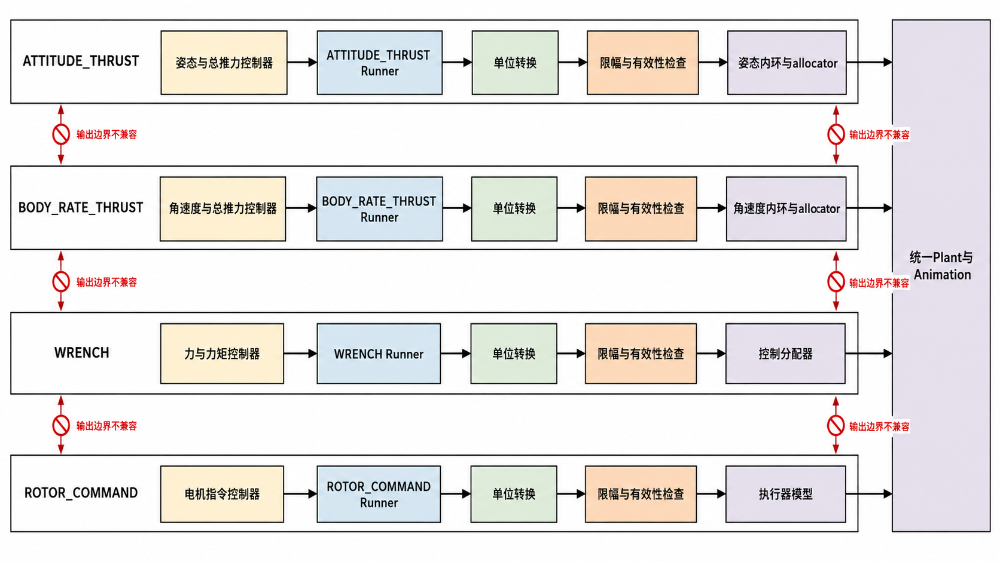

图 4-2　控制输出层级与 FormalRunner 执行边界信号流

平台将控制器与全机之间的信号边界收敛为四类，如表 4-1 所示。这四类代表不同的抽象层级：`ROTOR_COMMAND` 直达执行器、`WRENCH` 停在力与力矩、另两类停在姿态或角速度参考。控制器选择哪一类输出边界，决定了它下游需经过多少公共环节（姿态环、角速度环、分配器），这种分层设计使得同一公共 Plant 能够同时服务从最底层到最高层的各类控制算法。

表 4-1　四类统一控制器输出边界及其典型下游

| 输出边界             | 含义                     | 典型下游                   |
| -------------------- | ------------------------ | -------------------------- |
| `ATTITUDE_THRUST`  | 欧拉姿态参考与总推力     | 姿态/角速度内环与分配器    |
| `BODY_RATE_THRUST` | 机体系角速度参考与总推力 | 速率分配链                 |
| `WRENCH`           | 机体系力/力矩            | `OfflineWrenchAllocator` |
| `ROTOR_COMMAND`    | 四个带符号旋翼角速度指令 | `RotorActuatorCore`      |

该接口设计实现了控制律实现与全机 Runner 的完全解耦：新增控制器只需声明输出边界类型并实现对应信号接口，即可复用全部公共环节与实验设施。以 `ATTITUDE_THRUST` 边界为例，其 Modelica 接口定义如下：

```modelica
within MoSimQuadrotorModel.Control.Interfaces;
partial model PartialAttitudeThrustController
  Modelica.Blocks.Interfaces.RealInput position_ref[3];
  Modelica.Blocks.Interfaces.RealInput velocity_ref[3];
  Modelica.Blocks.Interfaces.RealInput acceleration_ref[3];
  Modelica.Blocks.Interfaces.RealInput position_mea[3];
  Modelica.Blocks.Interfaces.RealInput velocity_mea[3];
  Modelica.Blocks.Interfaces.RealInput attitude_mea[3];
  Modelica.Blocks.Interfaces.RealOutput attitude_ref[3];
  Modelica.Blocks.Interfaces.RealOutput collective_thrust_delta;
end PartialAttitudeThrustController;
```

任何实现该接口的控制器均可直接接入公共 FormalRunner，无需修改下游姿态环、角速度环和分配器的代码。从数学上，第 \(j\) 条控制律先生成其自身的中间命令 \(\boldsymbol\chi_j\)，再由声明的边界投影到共享 Plant：

```latex
\[
(\mathbf p,\mathbf v,R,\boldsymbol\omega,\mathbf r)
\xrightarrow{\ \mathcal C_j\ }\boldsymbol\chi_j
\xrightarrow{\ \mathcal A_{b_j}\ }
\begin{cases}
(\boldsymbol\eta_c,T_c),&b_j=\mathrm{ATTITUDE\_THRUST},\\
(\boldsymbol\omega_c,T_c),&b_j=\mathrm{BODY\_RATE\_THRUST},\\
(\mathbf F_c,\boldsymbol\tau_c),&b_j=\mathrm{WRENCH},\\
\boldsymbol\omega_{cmd},&b_j=\mathrm{ROTOR\_COMMAND}.
\end{cases}
\tag{4-1}
\]
```

这里 \(\mathcal A_{b_j}\) 是 Adapter/Allocator，不是额外控制器。本章各控制器公式的简式都以该约定表达，具体边界仍以
`controller_route_interface_matrix.json` 为准。
平台分层图重点看模型、控制器、证据记录和显示/运行时表面的职责边界；其中显示层只提供操作与复核入口，不承担控制成功判据。


图 4-3　实验平台分层与故障反馈链路

控制器公式必须放在实际执行边界中理解。对于 `ATTITUDE_THRUST`、`BODY_RATE_THRUST`、`WRENCH` 及 px4ctrl 的正式离线 Runner，参考位置、速度、加速度和测得位置/姿态均先经过 `UnitDelay`，采样周期为
\(T_s=0.01\,\mathrm{s}\)，初始输出为零。若 \(\mathcal D_{T_s}\) 代表该离散
保持器，则在每个样点间隔内可记为

```latex
\[
\mathcal D_{T_s}[s](t)=s((k-1)T_s),\qquad
kT_s\le t<(k+1)T_s,\qquad \mathcal D_{T_s}[s](0)=0.
\tag{4-2}
\]
```

因此送入离散边界控制器的量是

```latex
\[
\tilde{\mathbf p}_r=\mathcal D_{T_s}[\mathbf p_r],\quad
\tilde{\mathbf v}_r=\mathcal D_{T_s}[\mathbf v_r],\quad
\tilde{\mathbf a}_r=\mathcal D_{T_s}[\mathbf a_r],\quad
\tilde{\mathbf p}=\mathcal D_{T_s}[\mathbf p],\quad
\tilde{\boldsymbol\eta}=\mathcal D_{T_s}[\boldsymbol\eta].
\tag{4-3}
\]
```

由采样位置生成的速度估计器是带 \(T_v=0.05\,\mathrm{s}\) 的连续导数滤波器：

```latex
\[
\hat{\mathbf v}(s)=\frac{s}{T_v s+1}\tilde{\mathbf p}(s).
\tag{4-4}
\]
```

这只定义外部参考/测量的离散边界，不擅自给所有控制器增加命令端零阶保持。特别地，`OfficialPidFormalRunner` 继承原生连续 `RotorCommandRunner`：其参考、位置、姿态和旋翼命令均直接连接，仍使用同一 \(T_v=0.05\,\mathrm{s}\) 速度滤波；`0.01 s` 仅是结果导出与指标采样间隔。px4ctrl 则明确使用上述 100 Hz`UnitDelay` 输入边界。共享 Plant 和连续执行器始终按第三章动力学演化。

## 五、Official PID 工程基线

Official PID 保留原生连续 `RotorCommandRunner` 边界。它是同条件名义筛查和七场景的对照之一，不被用来推断所有控制器均具有相同性能。其七场景具体指标在第九章列出，50% 旋翼 1 效率故障记录为无效负样本，不能被改写为通过。
为了避免把图形演示块与正式全机入口混用，本节按实际链路`OfficialPidFormalRunner -> OfficialPIDRotorAdapter ->Vehicle.Blocks.Controller.Controller` 描述。横向位置环使用 \(K_p=1.5\)、
\(K_d=1\) 并缩放到姿态参考，垂向环使用 \(K_p=8\)、\(K_i=6\)、\(K_d=4\)：
由位置参考与测量位置定义位置误差，速度误差由位置误差对时间求导得到。

```latex
\[
\mathbf e_p=\mathbf p_r-\mathbf p
\tag{5-1}
\]
```

由位置误差求导，得到与参考速度和测量速度一致的速度误差。

```latex
\[
\mathbf e_v=\dot{\mathbf e}_p=\mathbf v_r-\mathbf v
\tag{5-2}
\]
```

将位置误差与速度误差代入横向 PD 外环，得到期望水平加速度分量。

```latex
\[
\begin{aligned}
a_{c,x}=1.5e_x+\dot e_x\\
a_{c,y}=1.5e_y+\dot e_y
\end{aligned}
\tag{5-3}
\]
```

将期望水平加速度按姿态通道缩放到滚转、俯仰命令；垂向通道保留比例、积分和微分三项，并接入当前限幅。

```latex
\[
\begin{aligned}
\theta_r=\operatorname{sat}_{15/57.3}(0.1a_{c,x})\\
\phi_r=\operatorname{sat}_{15/57.3}(0.1a_{c,y})\\
t_r=8e_z+6\int e_z\,dt+4\dot e_z
\end{aligned}
\tag{5-4}
\]
```

将式（5-3）和式（5-4）代入姿态缩放关系即可得到完整的姿态与垂向指令，正文沿用前式而不再重复展开。
由姿态参考与测量姿态定义姿态误差，再对滚转、俯仰和偏航误差分别使用比例或比例-微分回路。

```latex
\[
\begin{aligned}
e_\phi=\phi_r-\phi\\
e_\theta=\theta_r-\theta\\
e_\psi=\psi_r-\psi
\end{aligned}
\tag{5-5}
\]
```

滚转、俯仰和偏航内环为

```latex
\[
u_\phi=14.142e_\phi+1.414\dot e_\phi,\qquad
u_\theta=14.142e_\theta+1.414\dot e_\theta,\qquad
u_\psi=5e_\psi,
\tag{5-6}
\]
```

由嵌入式混控器输出的四路幅值提取偏航方向分量，先求四个旋翼方向加权平均的偏航量。

```latex
\[
\bar a_\psi=\frac14\sum_{i=1}^{4}d_i a_i
\tag{5-7}
\]
```

从每路幅值中分离原始偏航分量，再按物理旋向和反扭矩比例写回，得到映射幅值和带符号的旋翼转速命令。

```latex
\[
\begin{aligned}
a_i^{map}=\bigl(a_i-d_i\bar a_\psi\bigr)+d_i\gamma\bar a_\psi\\
\omega_{cmd,i}=s_i\bigl(\omega_h+c\,a_i^{map}\bigr)
\end{aligned}
\tag{5-8}
\]
```

并分别经过正式模型中的姿态/偏航限幅。随后嵌入式混控器生成四路幅值
\(a_i\)。`OfficialPIDRotorAdapter` 将其中的偏航分量投影到当前物理旋翼的
偏航方向 \(d_i\)，保持总幅值不变：
由式（5-7）和式（5-8）得到适配器的混控输出，以下直接引用该结果。
\(s_i\) 是当前 Profile 的带符号旋向，\(\gamma\) 是适配器中将嵌入式偏航
参考比映射到物理反扭矩比的比例。该适配只改变偏航权威的物理一致性表示，不重新调参或改变公共 Plant。
上述控制律在 Modelica 侧的图形模型结构如图 5-1 所示，展示了位置环、姿态内环与混控输出的完整连接关系。该图来源为当前源的原生窗口捕获，直观呈现了 Official PID 从误差输入到旋翼指令输出的完整信号通路。


图 5-1　`official_pid` 图形模型结构

## 六、七个算法族 46 条控制器的图形化建模与统一实现

本章聚焦 46 条算法控制器的图形化建模与统一实现；Official PID 和 px4ctrl 的完整推导分别保留在第五章和第八章，三部分合计覆盖正文的 48 条控制器路线。Studio 路由表当前提供 44 条正式全机入口，便于用户从配置、建模到结果复核逐步展开。

### 6.1 48 条控制律的正文登记规则

本报告登记 48 条控制器路线的设计原理、核心控制律公式与 MWORKS 图形化建模边界，其中 46 条算法控制器在本章按族逐一详述；Official PID 与 px4ctrl 的完整推导分别保留在第五章和第八章。每个本章详述的控制器作为独立单元呈现，包含算法说明、数学公式和 Modelica 图形模型结构。
Official PID 与 px4ctrl 的完整设计原理和推导分别见第五章、第八章；本章在登记表中保留两条基线的对应引用。其余 46 条算法控制器按 PID、线性与鲁棒、非线性与自适应、滑模、预测与优化、几何与微分平坦、学习七个族展开。每个单元的 `scheme_id`、公式和图形模型路径保持一致，便于从正文直接回到源码和 MWORKS 图形入口。
公式块给出控制器的核心代数关系，图形模型截图展示同一关系在 Modelica 侧的模块组织与信号连接；两者按控制器逐一配对排列。
本章的结构图证据也要按来源阅读：报告目录的 48 张控制器结构图中，44 张是用户审核过的历史结构候选，4 张为当前源的原生窗口捕获。它们用于说明模块组织和接口位置，不替代第七章的逐控制器结果图、`Result.msr`、指标或当前源绑定的整机性能证据。

### 6.2 PID 族

PID 族以误差反馈为主线，通过串级、增益调度、模糊推理、神经补偿和扰动估计逐步扩展控制结构。固定 AWFF/L1/INDI 条目把前馈、残差估计与增量反馈组织成可复用的增强链。
PID/INDI 与 NMPC/INDI 图重点看名义控制器、增量控制通道和输出边界之间的并联与串接关系。

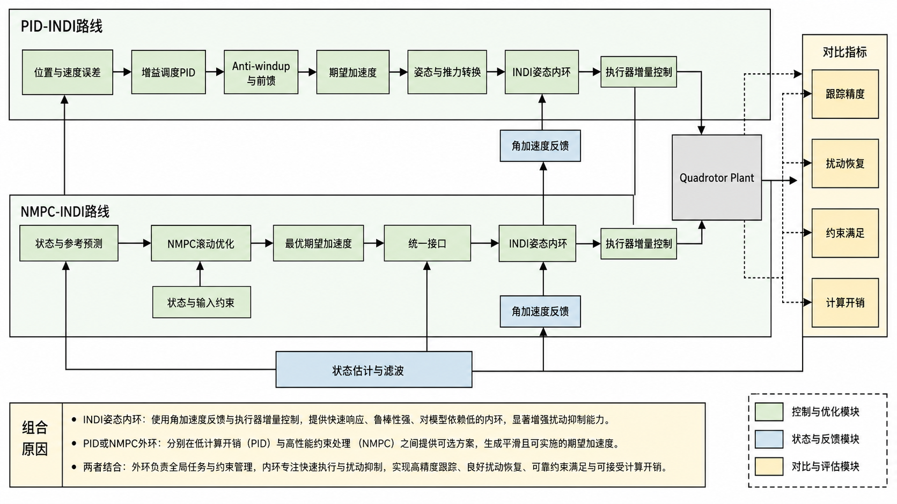

图 6-1　PID/INDI 与 NMPC/INDI 增强控制结构对比

补偿结构图重点看 DOB、ESO、L1 与 AWFF 的扰动估计和补偿注入位置，阅读时与各控制器单元中的补偿公式对应。

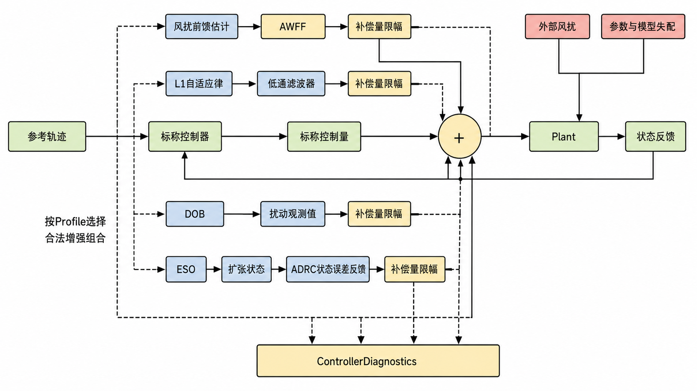

图 6-2　DOB/ESO/L1/AWFF 四类扰动补偿增强结构

#### cascade_pid

该控制器采用串级 PID 架构，外环由位置误差生成加速度指令，内环由姿态误差生成角速度指令。

```latex
\[
\begin{aligned}
\mathbf a_c=K_{p,p}\mathbf e_p+K_{d,p}\mathbf e_v\\
\boldsymbol\eta_c=K_{p,\eta}\mathbf e_\eta+K_{d,\eta}\mathbf e_\omega
\end{aligned}
\tag{6-1}
\]
```

在 Modelica 侧，图形实现展示位置环、姿态环和输出边界的串级连接。


图 6-3　cascade_pid 图形模型结构

#### gain_scheduled_pid

该控制器按照调度变量 \(\rho\) 在线选择 PID 增益，使同一控制结构适配不同工作状态。

```latex
\[
u=K_p(\rho)e+K_i(\rho)\int e\,dt+K_d(\rho)\dot e
\tag{6-2}
\]
```

在 Modelica 侧，调度变量进入增益通道后再汇入 PID 输出。


图 6-4　gain_scheduled_pid 图形模型结构

#### fuzzy_pid

该控制器以误差及其导数作为模糊推理输入，实时调整三路 PID 增益。

```latex
\[
u=K_p(e,\dot e)e+K_i(e,\dot e)\int e\,dt+K_d(e,\dot e)\dot e
\tag{6-3}
\]
```

在 Modelica 侧，模糊推理通道与 PID 主通道汇合后形成控制输出。


图 6-5　fuzzy_pid 图形模型结构

#### neural_pid

该控制器保留 PID 主通道，并用两层网络输出补偿项，从而形成名义反馈与学习补偿的组合结构。

```latex
\[
u=u_{PID}+W_2\sigma(W_1\boldsymbol\xi+b_1)+b_2
\tag{6-4}
\]
```

在 Modelica 侧，误差/状态特征 \(\boldsymbol\xi\) 进入网络支路，网络输出与 PID 输出并联汇合。


图 6-6　neural_pid 图形模型结构

#### fopid

该控制器将积分和微分通道推广为分数阶算子，在保留比例通道的同时扩展误差动态的记忆特性。

```latex
\[
u=K_p e+K_iD^{-\lambda}e+K_dD^{\mu}e
\tag{6-5}
\]
```

在 Modelica 侧，分数阶算子分别构成积分和微分支路，并在输出端汇合。


图 6-7　fopid 图形模型结构

#### fixed_awff_pid

该控制器在 PID 反馈之外加入参考微分前馈，形成固定的 AWFF-PID 集成链。

```latex
\[
u_{AWFF}=K_p e+K_i\int e\,dt+K_d\dot e+K_{ff}\dot r
\tag{6-6}
\]
```

在 Modelica 侧，前馈支路与 PID 反馈支路汇合后接入统一姿态与旋翼输出边界。


图 6-8　fixed_awff_pid 图形模型结构

#### fixed_awff_l1_residual

该控制器在 AWFF-PID 后串接有界 L1 残差估计，把估计扰动反馈到名义控制输出。

```latex
\[
\begin{aligned}
u=u_{AWFF}+\Delta u_{L1}\\
\Delta u_{L1}=C(s)\hat\sigma
\end{aligned}
\tag{6-7}
\]
```

在 Modelica 侧，L1 估计支路在 AWFF 输出后注入，并保持统一的输出连接。


图 6-9　fixed_awff_l1_residual 图形模型结构

#### fixed_awff_l1_indi

该控制器进一步把 INDI 角加速度增量项并入 AWFF/L1 链，形成三段串接的增强控制结构。

```latex
\[
u=u_{AWFF}+C(s)\hat\sigma+G^{\dagger}(\nu-\widehat{\dot{\boldsymbol\omega}})
\tag{6-8}
\]
```

在 Modelica 侧，AWFF、L1 和 INDI 三个支路按顺序连接到统一控制输出。


图 6-10　fixed_awff_l1_indi 图形模型结构

#### pid_awff_linear_eso

该控制器以线性 ESO 估计扩张状态，再将估计扰动从基础控制量中扣除；目录中保留 planned 标识，名义记录作为异常响应样本纳入对照。

```latex
\[
\begin{aligned}
\epsilon=e-z_1\\
\dot z_1=z_2+3\omega_o\epsilon\\
\dot z_2=z_3+b_0u_0+3\omega_o^2\epsilon\\
\dot z_3=\omega_o^3\epsilon\\
u=\operatorname{sat}(u_0-z_3/b_0)
\end{aligned}
\tag{6-9}
\]
```

在 Modelica 侧，FormalRunner 接口面展示 ESO 控制核心的调度入口和信号边界。


图 6-11　pid_awff_linear_eso FormalRunner 接口面

### 6.3 线性与鲁棒状态反馈族

该族在悬停工作点线性化模型上构造状态反馈，成员差异集中在二次型优化、积分扩展、状态观测器、\(H_2/H_\infty\) 范数和极点配置。

#### lqr_baseline

该控制器用二次型性能指标求取状态反馈增益，并保留参考前馈通道。

```latex
\[
\begin{aligned}
u=-K\mathbf x+N\mathbf r\\
\int(\mathbf x^TQ\mathbf x+u^TRu)dt
\end{aligned}
\tag{6-10}
\]
```

在 Modelica 侧，状态反馈与参考前馈汇合后接入控制输出。


图 6-12　lqr_baseline 图形模型结构

#### lqi_baseline

该控制器在状态反馈基础上引入误差积分状态，形成带积分补偿的线性反馈结构。

```latex
\[
\begin{aligned}
u=-K\mathbf x-K_I\boldsymbol\zeta+N\mathbf r\\
\dot{\boldsymbol\zeta}=\mathbf r-\mathbf y
\end{aligned}
\tag{6-11}
\]
```

在 Modelica 侧，积分状态由参考与输出的误差驱动，并回接到状态反馈通道。


图 6-13　lqi_baseline 图形模型结构

#### lqg

该控制器把状态反馈与 Kalman 观测器结合，使用估计状态形成闭环控制。

```latex
\[
\begin{aligned}
u=-K\hat{\mathbf x}\\
\dot{\hat{\mathbf x}}=A\hat{\mathbf x}+Bu+L(\mathbf y-C\hat{\mathbf x})
\end{aligned}
\tag{6-12}
\]
```

在 Modelica 侧，观测器残差经过 \(L\) 增益修正状态估计，再送入反馈增益。


图 6-14　lqg 图形模型结构

#### h2_state_feedback

该控制器以 \(H_2\) 传递范数为设计指标求取状态反馈增益，保留线性反馈的清晰结构。

```latex
\[
\begin{aligned}
u=K_{H_2}\mathbf x\\
K_{H_2}=\arg\min_K\lVert T_{w\rightarrow z}(K)\rVert_2
\end{aligned}
\tag{6-13}
\]
```

在 Modelica 侧，\(H_2\) 增益作为状态反馈矩阵接入统一控制输出。


图 6-15　h2_state_feedback 图形模型结构

#### hinf_hover_wrench

该控制器以 \(H_\infty\) 传递范数抑制扰动通道，并以 WRENCH 作为输出边界。

```latex
\[
\begin{aligned}
\mathbf w_c=K_{\infty}\mathbf x\\
K_{\infty}=\arg\min_K\lVert T_{w\rightarrow z}(K)\rVert_\infty
\end{aligned}
\tag{6-14}
\]
```

在 Modelica 侧，状态反馈直接连接到力与力矩输出端口。


图 6-16　hinf_hover_wrench 图形模型结构

#### pole_placement_luenberger

该控制器将极点配置状态反馈与 Luenberger 观测器组合，形成带估计状态的闭环结构。

```latex
\[
\begin{aligned}
u=-K\hat{\mathbf x}+N\mathbf r\\
\dot{\hat{\mathbf x}}=A\hat{\mathbf x}+Bu+L(\mathbf y-C\hat{\mathbf x})
\end{aligned}
\tag{6-15}
\]
```

在 Modelica 侧，\(K,L\) 分别对应反馈和观测器增益，极点配置关系在两条支路中体现。


图 6-17　pole_placement_luenberger 图形模型结构

### 6.4 非线性与自适应控制族

该族直接利用非线性模型的状态关系构造控制律，成员覆盖反步递推、动态逆、无源性控制、模型参考自适应和扰动估计。

#### backstepping_baseline

该控制器按误差递推构造虚拟控制量，再由第二级误差闭合实际输入。

```latex
\[
\begin{aligned}
\mathbf z_1=\mathbf e_p\\
\boldsymbol\alpha_1=\dot{\mathbf p}_r-K_1\mathbf z_1\\
\mathbf u=\mathbf u_{ff}-K_2\mathbf z_2
\end{aligned}
\tag{6-16}
\]
```

在 Modelica 侧，两级递推块按位置误差、虚拟速度和实际输入顺序连接。


图 6-18　backstepping_baseline 图形模型结构

#### adaptive_backstepping

该控制器在反步基线的虚拟控制量上加入在线扰动估计，形成自适应补偿输入。

```latex
\[
\begin{aligned}
\mathbf u=\mathbf u_{bs}-\hat{\mathbf d}\\
\dot{\hat{\mathbf d}}=-\Gamma\boldsymbol\phi\mathbf z_2
\end{aligned}
\tag{6-17}
\]
```

在 Modelica 侧，估计律由递推误差驱动，并将 \(\hat{\mathbf d}\) 回接到反步输出。


图 6-19　adaptive_backstepping 图形模型结构

#### feedback_linearization

该控制器通过解析模型的漂移项与输入增益项构造动态逆，再以线性误差反馈生成虚拟输入。

```latex
\[
\begin{aligned}
\mathbf u=g(\mathbf x)^{-1}[\boldsymbol\nu-f(\mathbf x)]\\
\boldsymbol\nu=\ddot{\mathbf p}_r-K_d\mathbf e_v-K_p\mathbf e_p
\end{aligned}
\tag{6-18}
\]
```

在 Modelica 侧，逆模型块与外层误差反馈块分段连接，输入增益矩阵 \(g(\mathbf x)\) 位于动态逆通道。


图 6-20　feedback_linearization 图形模型结构

#### passivity_based_control

该控制器以储能函数描述位置误差势能，并将速度耗散和前馈项合成为无源控制输入。

```latex
\[
\mathbf u=\mathbf u_{ff}-K_d\mathbf e_v-\nabla_{\mathbf e_p}V(\mathbf e_p)
\tag{6-19}
\]
```

在 Modelica 侧，储能函数梯度、速度耗散和前馈支路汇合后进入控制输出。


图 6-21　passivity_based_control 图形模型结构

#### mrac

该控制器用参数向量在线逼近参考模型所需的控制增益，并由跟踪误差更新估计参数。

```latex
\[
\begin{aligned}
u=\hat{\boldsymbol\theta}^{T}\boldsymbol\phi\\
\dot{\hat{\boldsymbol\theta}}=-\Gamma\boldsymbol\phi\,\mathbf e^TPB
\end{aligned}
\tag{6-20}
\]
```

在 Modelica 侧，回归向量 \(\boldsymbol\phi\) 进入参数化控制支路，误差反馈驱动 \(\hat{\boldsymbol\theta}\) 更新。


图 6-22　mrac 图形模型结构

#### ndi

该控制器以控制效能矩阵 \(B(\mathbf x)\) 求逆实现动态逆，并用误差反馈生成虚拟输入。

```latex
\[
\begin{aligned}
\mathbf u=B(\mathbf x)^{-1}[\boldsymbol\nu-f(\mathbf x)]\\
\boldsymbol\nu=\dot{\mathbf x}_r-K\mathbf e
\end{aligned}
\tag{6-21}
\]
```

在 Modelica 侧，控制效能矩阵求逆块与误差反馈块连接到动态逆输出。


图 6-23　ndi 图形模型结构

### 6.5 滑模控制族

该族围绕滑模面的构造和切换项设计展开，覆盖积分、终端、非奇异终端、自适应、模糊、超螺旋和边界层变体。
滑模分类图重点看七种变体在滑模面、增益调节和切换函数上的结构差异。

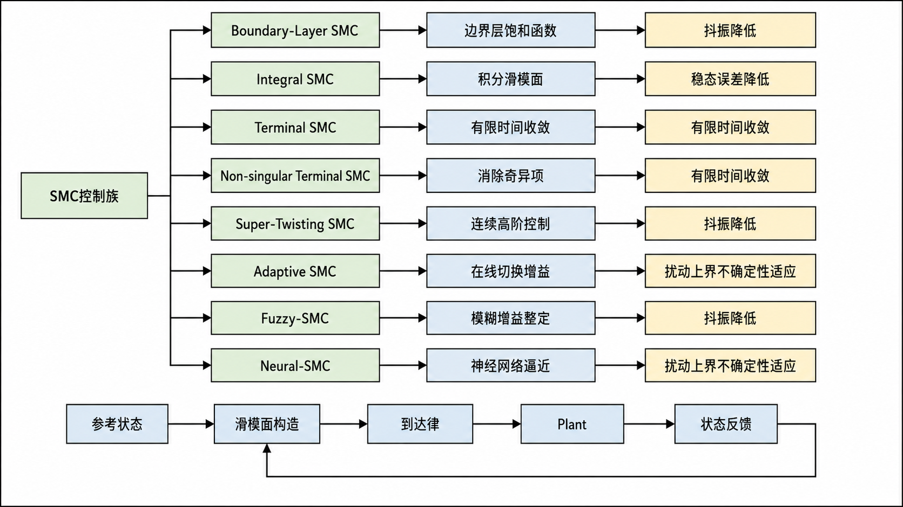

图 6-24　滑模控制族的分类与各变体适用场景

#### integral_smc

该控制器在滑模面中加入位置误差积分项，并以符号切换项形成积分滑模控制。

```latex
\[
\begin{aligned}
\mathbf s=\mathbf e_v+\Lambda\mathbf e_p+K_I\int\mathbf e_pdt\\
\mathbf u=\mathbf u_{eq}-K_s\operatorname{sgn}(\mathbf s)
\end{aligned}
\tag{6-22}
\]
```

在 Modelica 侧，积分误差进入滑模面，等效控制与切换控制汇合到输出端。


图 6-25　integral_smc 图形模型结构

#### terminal_smc

该控制器采用分数幂终端滑模面，将位置误差直接纳入有限时间收敛结构。

```latex
\[
\begin{aligned}
\mathbf s=\mathbf e_v+\Lambda|\mathbf e_p|^{p/q}\operatorname{sgn}(\mathbf e_p)\\
\mathbf u=\mathbf u_{eq}-K_s\operatorname{sgn}(\mathbf s)
\end{aligned}
\tag{6-23}
\]
```

在 Modelica 侧，分数幂误差块与等效控制、切换控制块依次连接。


图 6-26　terminal_smc 图形模型结构

#### nonsingular_terminal_smc

该控制器把分数幂项作用于速度误差，构造非奇异终端滑模面。

```latex
\[
\mathbf s=\mathbf e_p+\Lambda|\mathbf e_v|^{q/p}\operatorname{sgn}(\mathbf e_v)
\tag{6-24}
\]
```

在 Modelica 侧，位置误差和速度分数幂支路汇合后形成非奇异滑模面。


图 6-27　nonsingular_terminal_smc 图形模型结构

#### adaptive_smc

该控制器根据滑模面幅值在线更新切换增益，使切换项随误差状态自适应调整。

```latex
\[
\begin{aligned}
\mathbf u=\mathbf u_{eq}-\hat K_s\operatorname{sgn}(\mathbf s)\\
\dot{\hat K}_s=\Gamma|\mathbf s|
\end{aligned}
\tag{6-25}
\]
```

在 Modelica 侧，增益更新支路由滑模面驱动，并回接到切换控制通道。


图 6-28　adaptive_smc 图形模型结构

#### fuzzy_smc

该控制器以滑模面为模糊推理输入，在线调节切换增益以形成平滑的模糊滑模输出。

```latex
\[
\mathbf u=\mathbf u_{eq}-K_f(\mathbf s)\operatorname{sgn}(\mathbf s)
\tag{6-26}
\]
```

在 Modelica 侧，模糊规则块输出 \(K_f(\mathbf s)\)，再与符号切换项汇合。


图 6-29　fuzzy_smc 图形模型结构

#### super_twisting_smc

该控制器加入二阶连续切换状态，以超螺旋结构降低传统符号切换带来的高频抖动。

```latex
\[
\begin{aligned}
\mathbf u=\mathbf u_{eq}-K_1|\mathbf s|^{1/2}\operatorname{sgn}(\mathbf s)+\mathbf z\\
\dot{\mathbf z}=-K_2\operatorname{sgn}(\mathbf s)
\end{aligned}
\tag{6-27}
\]
```

在 Modelica 侧，附加状态 \(\mathbf z\) 与滑模面切换项构成二阶回路后接入输出。


图 6-30　super_twisting_smc 图形模型结构

#### smc_boundary_layer

该控制器用连续饱和函数替代符号切换项，在保留滑模鲁棒性的同时把高频抖振限制在边界层内。

```latex
\[
\mathbf u=\mathbf u_{eq}-K_s\operatorname{sat}(\mathbf s/\boldsymbol\phi)
\tag{6-28}
\]
```

其中 \(\boldsymbol\phi\) 给出边界层宽度；在 Modelica 侧，饱和块位于滑模面与输出之间，直接限制切换项的变化幅值。


图 6-31　smc_boundary_layer 图形模型结构

### 6.6 预测与优化控制的 10 条公式

预测与优化族用滚动预测、扰动集合或采样搜索处理未来误差，十条控制器的差异集中在模型、约束和求解器接口。

#### linear_mpc

该控制器以线性离散模型滚动预测未来状态，用二次型代价同时压低跟踪误差和控制增量，是本族的基准结构。

```latex
\[
\mathbf U^*=\arg\min_{\mathbf U}\sum_{k=0}^{N-1}\left[(\mathbf x_k-\mathbf r_k)^TQ(\mathbf x_k-\mathbf r_k)+\mathbf u_k^TR\mathbf u_k\right]
\tag{6-29}
\]
```

在 Modelica 侧，预测模型、代价计算和输入约束汇入求解器，再把首个控制量送入统一输出边界。


图 6-32　linear_mpc 图形模型结构

#### robust_mpc

该控制器把扰动集合纳入最坏情形代价，在同一滚动优化骨架上提高模型不确定性下的控制裕度。

```latex
\[
\mathbf U^*=\arg\min_{\mathbf U}\max_{\mathbf w\in\mathcal W}J(\mathbf U,\mathbf w)
\tag{6-30}
\]
```

在 Modelica 侧，扰动集合进入鲁棒代价通道，最坏情形的优化结果经统一执行接口输出。


图 6-33　robust_mpc 图形模型结构

#### adaptive_mpc

该控制器在线更新预测模型参数，使滚动优化随当前辨识状态调整，而不是固定使用单一模型。

```latex
\[
\mathbf U^*=\arg\min J\bigl(A(\hat{\boldsymbol\theta}),B(\hat{\boldsymbol\theta}),\mathbf U\bigr)
\tag{6-31}
\]
```

在 Modelica 侧，参数估计通道回到预测模型，更新后的模型再进入在线求解器。


图 6-34　adaptive_mpc 图形模型结构

#### tube_mpc

该控制器把名义轨迹优化与管束反馈分离，用局部反馈把实际状态约束在名义管束附近。

```latex
\[
\mathbf u=\mathbf v+K(\mathbf x-\mathbf z)
\tag{6-32}
\]
```

其中 \(\mathbf v\) 来自紧缩约束下的名义优化，\(\mathbf z\) 是管束中心。


图 6-35　tube_mpc 图形模型结构

#### explicit_gain_scheduled_mpc

该控制器把在线优化离线化为按调度变量选择的显式分区反馈，降低运行时求解负担。

```latex
\[
\begin{aligned}
\mathbf u=K_i(\rho)\mathbf x+c_i(\rho)\\
\mathbf x\in\mathcal R_i(\rho)
\end{aligned}
\tag{6-33}
\]
```

在 Modelica 侧，调度变量和状态共同进入分区查表，选定的局部增益直接连接到输出。


图 6-36　explicit_gain_scheduled_mpc 图形模型结构

#### ilqr

该控制器沿当前轨迹线性化动力学并二次近似代价，通过反向递推得到时变反馈增益。

```latex
\[
\mathbf u_k=\bar{\mathbf u}_k+\mathbf k_k+K_k(\mathbf x_k-\bar{\mathbf x}_k)
\tag{6-34}
\]
```

在 Modelica 侧，轨迹展开、局部线性化和反向递推结果汇入时变控制量通道。


图 6-37　ilqr 图形模型结构

#### mppi

该控制器通过扰动采样评估候选控制序列，再按轨迹代价加权修正名义控制，适合非凸代价面。

```latex
\[
\mathbf u_t=\bar{\mathbf u}_t+\frac{\sum_m\exp(-S_m/\lambda)\boldsymbol\epsilon_{m,t}}{\sum_m\exp(-S_m/\lambda)}
\tag{6-35}
\]
```

在 Modelica 侧，采样轨迹并行计算代价，权重汇合后把修正量送入执行边界。


图 6-38　mppi 图形模型结构

#### nmpc_outer

该控制器直接以非线性状态转移作为预测约束，在外环滚动求解轨迹代价和控制序列。

```latex
\[
\begin{aligned}
\mathbf U^*=\arg\min_{\mathbf U}\sum_{k=0}^{N-1}\ell(\mathbf x_k,\mathbf u_k)\\
\mathbf x_{k+1}=f(\mathbf x_k,\mathbf u_k)
\end{aligned}
\tag{6-36}
\]
```

在 Modelica 侧，非线性预测模型与约束输入连接到 NMPC 求解器，首个控制量再接统一输出边界。


图 6-39　nmpc_outer 图形模型结构

#### fixed_linear_mpc_l1_indi

该控制器把线性 MPC 的名义控制与 L1 残差估计、INDI 增量补偿串成一条固定集成链，增强模型失配下的快速修正。

```latex
\[
\mathbf u=\mathbf u_{MPC}+C(s)\hat{\boldsymbol\sigma}+G^{\dagger}(\boldsymbol\nu-\widehat{\dot{\boldsymbol\omega}})
\tag{6-37}
\]
```

在 Modelica 侧，MPC 输出依次经过 L1 和 INDI 支路，再接入统一的姿态/旋翼执行边界。


图 6-40　fixed_linear_mpc_l1_indi 图形模型结构

#### fixed_qp_nmpc_l1_indi_cbf

该控制器在 NMPC 名义输出外增加 QP 投影、L1 残差与 INDI 增量补偿，把安全约束和快速执行修正合并到同一链路。

```latex
\[
\begin{aligned}
\mathbf u^*=\arg\min_{\mathbf u}\lVert\mathbf u-\mathbf u_{NMPC}\rVert_H^2\\
\nabla h^T\mathbf u\ge-\alpha h
\end{aligned}
\tag{6-38}
\]
```

在 Modelica 侧，CBF 约束先对 NMPC 输出做最小改动投影，再由 L1/INDI 支路补偿并连接到执行端。


图 6-41　fixed_qp_nmpc_l1_indi_cbf 图形模型结构

### 6.7 几何与微分平坦控制的 6 条公式

本族在 \(SE(3)\) 上直接构造姿态/力矩，或由微分平坦轨迹反解姿态、角速度与推力；六条控制器的主要差异由输出边界和扰动补偿位置体现。

#### se3_basic

该控制器在旋转群 \(SE(3)\) 上同时构造位置/姿态误差反馈，直接输出期望合力与力矩。

```latex
\[
\begin{aligned}
\mathbf F_c=-K_p\mathbf e_p-K_v\mathbf e_v+m\ddot{\mathbf p}_r+mg\mathbf e_3\\
\mathbf M_c=-K_R\mathbf e_R-K_\Omega\mathbf e_\Omega+\boldsymbol\omega\times J\boldsymbol\omega
\end{aligned}
\tag{6-39}
\]
```

在 Modelica 侧，平移误差反馈与旋转群误差反馈分别汇入合力、力矩输出端。


图 6-42　se3_basic 图形模型结构

#### dfbc_basic

该控制器利用平坦输出得到期望加速度，并以位置/速度反馈和扰动估计修正轨迹跟踪误差。

```latex
\[
\mathbf a_c=\ddot{\mathbf p}_r-K_p\mathbf e_p-K_v\mathbf e_v-\hat{\mathbf d}
\tag{6-40}
\]
```

在 Modelica 侧，平坦输出映射、反馈项和 \(\hat{\mathbf d}\) 注入通道共同生成姿态/推力命令。


图 6-43　dfbc_basic 图形模型结构

#### dfbc_smooth_robust_attitude

该控制器在平坦加速度上加入 \(\tanh\) 平滑鲁棒项，输出 ATTITUDE_THRUST 以保持姿态接口的直接可审查性。

```latex
\[
\mathbf a_c=\mathbf a_{flat}-K_s\tanh(\mathbf s/\boldsymbol\phi)-\hat{\mathbf d}
\tag{6-41}
\]
```

在 Modelica 侧，平滑切换项和扰动估计支路在姿态指令生成前汇合，随后连接 ATTITUDE_THRUST 边界。


图 6-44　dfbc_smooth_robust_attitude 图形模型结构

#### dfbc_smooth_robust_bodyrate

该控制器沿用平滑鲁棒 DFBC 的加速度律，将参考姿态导数显式转换为 BODY_RATE_THRUST 输出。

```latex
\[
\begin{aligned}
\boldsymbol\omega_r=(R_r^T\dot R_r)^\vee\\
\mathbf a_c=\mathbf a_{flat}-K_s\tanh(\mathbf s/\boldsymbol\phi)-\hat{\mathbf d}
\end{aligned}
\tag{6-42}
\]
```

在 Modelica 侧，\(\boldsymbol\omega_r\) 由参考旋转矩阵导数生成，并与推力通道一起接入 BODY_RATE_THRUST 边界。


图 6-45　dfbc_smooth_robust_bodyrate 图形模型结构

#### dfbc_high_order_attitude

该控制器使用参考轨迹三阶、四阶导数构造高阶平坦输出，再以姿态指令形式驱动公共内环。

```latex
\[
(\mathbf a_c,R_r)=\mathcal F(\mathbf p_r,\dot{\mathbf p}_r,\ddot{\mathbf p}_r,\mathbf p_r^{(3)},\mathbf p_r^{(4)})
\tag{6-43}
\]
```

在 Modelica 侧，高阶导数输入进入平坦映射块，输出的 \(R_r\) 与 \(\mathbf a_c\) 连接 ATTITUDE_THRUST 边界。


图 6-46　dfbc_high_order_attitude 图形模型结构

#### dfbc_high_order_bodyrate

该控制器保留高阶平坦加速度映射，将姿态输出改为参考角速度以适配 BODY_RATE_THRUST 接口。

```latex
\[
(\mathbf a_c,\boldsymbol\omega_r)=\mathcal F(\mathbf p_r,\dot{\mathbf p}_r,\ddot{\mathbf p}_r,\mathbf p_r^{(3)},\mathbf p_r^{(4)})
\tag{6-44}
\]
```

在 Modelica 侧，\(\boldsymbol\omega_r\) 和 \(\mathbf a_c\) 由同一高阶映射产生，再连接 BODY_RATE_THRUST 输出边界。


图 6-47　dfbc_high_order_bodyrate 图形模型结构

### 6.8 学习控制的 2 条公式

学习族把网络作为名义控制器外围的增益调度或残差补偿模块，通过回退、限幅和统一输出边界接入控制链。

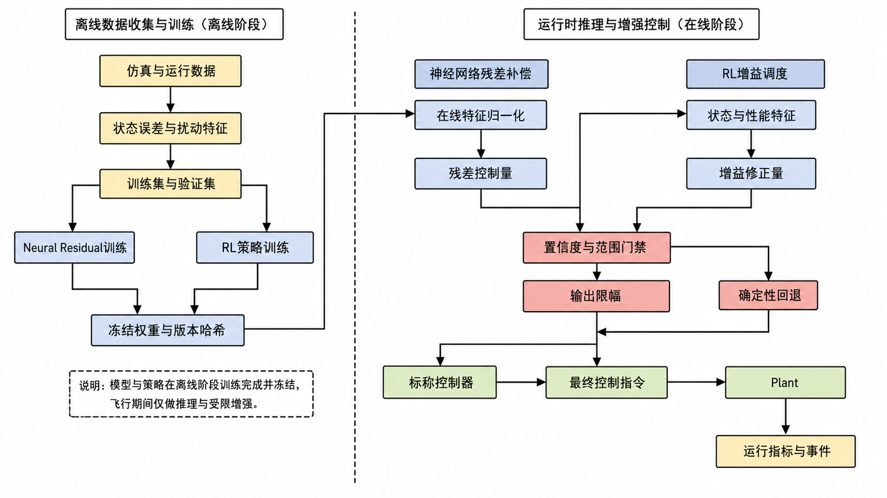

图 6-48　神经残差补偿与强化学习增益调度的工作流

#### rl_gain_scheduler

该控制器由策略网络根据状态生成 PID 增益，使名义 PID 的响应随工作状态在线调度。

```latex
\[
\begin{aligned}
\mathbf K=\pi_\theta(\mathbf s)\\
u=K_p(\mathbf s)e+K_i(\mathbf s)\int e\,dt+K_d(\mathbf s)\dot e
\end{aligned}
\tag{6-45}
\]
```

在 Modelica 侧，网络输出只进入增益通道，调度后的 PID 输出再连接统一控制边界。


图 6-49　rl_gain_scheduler 图形模型结构

#### trained_neural_residual

该控制器保留名义控制器主通道，用受限幅的神经残差补偿模型失配和未建模扰动。

```latex
\[
\mathbf u=\mathbf u_{nom}+g\,\Delta\mathbf u_\theta(\mathbf s)
\tag{6-46}
\]
```

在 Modelica 侧，网络输出先经过增益 \(g\) 与回退限幅逻辑，再并入名义输出并接入统一执行边界。


图 6-50　trained_neural_residual 图形模型结构

### 6.9 48 条控制器的源码、公式与名义证据登记

下表把每条正文公式、当前源码映射和名义证据状态放在同一行，但不把三者混为一项结论。46 条算法控制器的正文路径与对应源码由本章登记表和`Config/control_platform/current_model_entry_map.json`共同回链；Official PID 与 px4ctrl 保留各自的基线图形/Runner 源码边界；Runner 名称和 G3 别名由`scheme_id_alias_map.json` 与 `G3_STATUS.json` 键控。表内 “G3 通过/失败”仅指当前冻结的 50 s `ClimbPath` 有效状态；“内部探针”用于展示控制器结构与边界响应；“独立 Experimental”不进入 G3 分母。
48 条的四栏登记如表 6-1 所示，逐行横读可完整追溯每条控制器从设计存在（公式位置）→实现存在（源码映射）→实验结论（名义证据状态）的完整链路。

表 6-1　48 条控制器的公式位置、源码映射与名义证据状态登记

| `scheme_id`                   | 公式位置 | 当前源码映射 / Runner                                                                                       | 名义证据状态                                    |
| ------------------------------- | -------- | ----------------------------------------------------------------------------------------------------------- | ----------------------------------------------- |
| `cascade_pid`                 | 6.2      | `MoSim_PID_CASCADE_PID_GRAPHICAL_MIL.mo` / `CascadePidFormalRunner`                                     | G3 失败：`simulation_timeout`                 |
| `gain_scheduled_pid`          | 6.2      | `MoSim_PID_GAIN_SCHEDULED_PID_GRAPHICAL_MIL.mo` / `GainScheduledPidFormalRunner`                        | G3 失败：`simulation_timeout`                 |
| `fuzzy_pid`                   | 6.2      | `MoSim_PID_FUZZY_PID_GRAPHICAL_MIL.mo` / `FuzzyPidFormalRunner`                                         | G3 失败：`simulation_timeout`                 |
| `neural_pid`                  | 6.2      | `MoSim_PID_NEURAL_PID_GRAPHICAL_MIL.mo` / `NeuralPidFormalRunner`                                       | G3 失败：`simulation_timeout`                 |
| `official_pid`                | 5.1      | `AWFF_PID_Sysblock_Demo.mo` / `OfficialPidFormalRunner`                                                 | G3 通过；原生连续旋翼边界                       |
| `fopid`                       | 6.2      | `MoSim_G5_FOPID_DIRECT_GRAPHICAL_MIL.mo` / `FopidFormalRunner`                                          | G3 失败：终端误差超 5 m                         |
| `fixed_awff_pid`              | 6.2      | `FixedAwffPid.mo` / `AwffFormalRunner`                                                                  | G3 失败：终端误差超 5 m                         |
| `fixed_awff_l1_residual`      | 6.2      | `FixedAwffL1Residual.mo` / 无 G3 Runner                                                                   | 内部固定输入探针；非全机 G3 行                  |
| `fixed_awff_l1_indi`          | 6.2      | `FixedAwffL1Indi.mo` / 无 G3 Runner                                                                       | 内部固定输入探针；非全机 G3 行                  |
| `lqr_baseline`                | 6.3      | `MoSim_G5_LQR_DIRECT_GRAPHICAL_MIL.mo` / `LqrBaselineFormalRunner`                                      | G3 通过                                         |
| `lqi_baseline`                | 6.3      | `MoSim_G5_LQI_DIRECT_GRAPHICAL_MIL.mo` / `LqiFormalRunner`                                              | G3 通过                                         |
| `lqg`                         | 6.3      | `MoSim_P2_LQG_GRAPHICAL_MIL.mo` / `LqgFormalRunner`                                                     | G3 通过                                         |
| `h2_state_feedback`           | 6.3      | `MoSim_G5_H2_STATE_FEEDBACK_DIRECT_GRAPHICAL_MIL.mo` / `H2StateFeedbackFormalRunner`                    | G3 通过                                         |
| `hinf_hover_wrench`           | 6.3      | `MoSim_G5_HINF_HOVER_WRENCH_DIRECT_GRAPHICAL_MIL.mo` / `HinfHoverWrenchFormalRunner`                    | G3 失败：终端误差超 5 m                         |
| `pole_placement_luenberger`   | 6.3      | `MoSim_G5_POLE_PLACEMENT_LUENBERGER_DIRECT_GRAPHICAL_MIL.mo` / `PolePlacementLuenbergerFormalRunner`    | G3 失败：`check_model_failed`                 |
| `backstepping_baseline`       | 6.4      | `MoSim_G5_BACKSTEPPING_DIRECT_GRAPHICAL_MIL.mo` / `BacksteppingBaselineFormalRunner`                    | G3 通过                                         |
| `adaptive_backstepping`       | 6.4      | `MoSim_P2_ADAPTIVE_BACKSTEPPING_GRAPHICAL_MIL.mo` / `AdaptiveBacksteppingFormalRunner`                  | G3 通过                                         |
| `feedback_linearization`      | 6.4      | `MoSim_P2_FEEDBACK_LINEARIZATION_GRAPHICAL_MIL.mo` / `FeedbackLinearizationFormalRunner`                | G3 通过                                         |
| `mrac`                        | 6.4      | `MoSim_G5_MRAC_DIRECT_GRAPHICAL_MIL.mo` / `MracFormalRunner`                                            | G3 失败：终端误差超 5 m                         |
| `ndi`                         | 6.4      | `MoSim_G5_NDI_DIRECT_GRAPHICAL_MIL.mo` / `NdiFormalRunner`                                              | G3 通过                                         |
| `passivity_based_control`     | 6.4      | `MoSim_P2_PASSIVITY_BASED_CONTROL_GRAPHICAL_MIL.mo` / `PassivityBasedControlFormalRunner`               | G3 通过                                         |
| `integral_smc`                | 6.5      | `MoSim_P3_INTEGRAL_SMC_GRAPHICAL_MIL.mo` / `IntegralSmcFormalRunner`                                    | G3 通过                                         |
| `terminal_smc`                | 6.5      | `MoSim_P3_TERMINAL_SMC_GRAPHICAL_MIL.mo` / `TerminalSmcFormalRunner`                                    | G3 通过                                         |
| `nonsingular_terminal_smc`    | 6.5      | `MoSim_P3_NONSINGULAR_TERMINAL_SMC_GRAPHICAL_MIL.mo` / `NonsingularTerminalSmcFormalRunner`             | G3 通过                                         |
| `super_twisting_smc`          | 6.5      | `MoSim_P3_SUPER_TWISTING_SMC_GRAPHICAL_MIL.mo` / `SuperTwistingSmcFormalRunner`                         | G3 失败：`simulation_timeout`                 |
| `adaptive_smc`                | 6.5      | `MoSim_P3_ADAPTIVE_SMC_GRAPHICAL_MIL.mo` / `AdaptiveSmcFormalRunner`                                    | G3 通过                                         |
| `fuzzy_smc`                   | 6.5      | `MoSim_P3_FUZZY_SMC_GRAPHICAL_MIL.mo` / `FuzzySmcFormalRunner`                                          | G3 通过                                         |
| `smc_boundary_layer`          | 6.5      | `MoSim_G9_SMC_BOUNDARY_LAYER_GRAPHICAL_OVERVIEW.mo` / Experimental Runner                                 | 独立 50 s 记录性能未过；非 G3 行                |
| `linear_mpc`                  | 6.6      | `MoSim_P4_LINEAR_MPC_GRAPHICAL_MIL.mo` / `LinearMpcFormalRunner`                                        | G3 失败：`simulation_timeout`                 |
| `robust_mpc`                  | 6.6      | `MoSim_P4_ROBUST_MPC_GRAPHICAL_MIL.mo` / `RobustMpcFormalRunner`                                        | G3 通过                                         |
| `adaptive_mpc`                | 6.6      | `MoSim_P4_ADAPTIVE_MPC_GRAPHICAL_MIL.mo` / `AdaptiveMpcFormalRunner`                                    | G3 失败：`simulate_failed`                    |
| `tube_mpc`                    | 6.6      | `MoSim_P4_TUBE_MPC_GRAPHICAL_MIL.mo` / `TubeMpcFormalRunner`                                            | G3 通过                                         |
| `explicit_gain_scheduled_mpc` | 6.6      | `MoSim_P4_EXPLICIT_GAIN_SCHEDULED_MPC_GRAPHICAL_MIL.mo` / `ExplicitGainScheduledMpcFormalRunner`        | G3 通过                                         |
| `ilqr`                        | 6.6      | `MoSim_P4_ILQR_GRAPHICAL_MIL.mo` / `IlqrFormalRunner`                                                   | G3 通过                                         |
| `mppi`                        | 6.6      | `MoSim_P4_MPPI_GRAPHICAL_MIL.mo` / `MppiFormalRunner`                                                   | G3 通过                                         |
| `nmpc_outer`                  | 6.6      | `MoSim_G9_NMPC_OUTER_GRAPHICAL_OVERVIEW.mo` / Experimental Runner                                         | 独立 50 s 终端门通过；非 G3 行                  |
| `fixed_linear_mpc_l1_indi`    | 6.6      | `FixedLinearMpcL1Indi.mo` / 无 G3 Runner                                                                  | 内部固定输入探针；非全机 G3 行                  |
| `fixed_qp_nmpc_l1_indi_cbf`   | 6.6      | `FixedQpNmpcL1IndiCbf.mo` / 无 G3 Runner                                                                  | 内部固定输入探针；非全机 G3 行                  |
| `se3_basic`                   | 6.7      | `MoSim_G9_SE3_GRAPHICAL_OVERVIEW.mo` / `Se3BasicFormalRunner`                                           | G3 通过                                         |
| `dfbc_basic`                  | 6.7      | `MoSim_G9_DFBC_GRAPHICAL_OVERVIEW.mo` / `DfbcBasicFormalRunner`                                         | G3 通过                                         |
| `dfbc_high_order_attitude`    | 6.7      | `MoSim_G5_DFBC_HIGH_ORDER_ATTITUDE_DIRECT_GRAPHICAL_MIL.mo` / `DfbcHighOrderFormalRunner`               | G3 通过                                         |
| `dfbc_high_order_bodyrate`    | 6.7      | `MoSim_G5_DFBC_HIGH_ORDER_BODYRATE_DIRECT_GRAPHICAL_MIL.mo` / `DfbcHighOrderBodyRateFormalRunner`       | G3 通过                                         |
| `dfbc_smooth_robust_attitude` | 6.7      | `MoSim_G5_DFBC_SMOOTH_ROBUST_ATTITUDE_DIRECT_GRAPHICAL_MIL.mo` / `DfbcSmoothRobustFormalRunner`         | G3 通过                                         |
| `dfbc_smooth_robust_bodyrate` | 6.7      | `MoSim_G5_DFBC_SMOOTH_ROBUST_BODYRATE_DIRECT_GRAPHICAL_MIL.mo` / `DfbcSmoothRobustBodyRateFormalRunner` | G3 通过                                         |
| `trained_neural_residual`     | 6.8      | `MoSim_P9_TRAINED_NEURAL_RESIDUAL_GRAPHICAL_MIL.mo` / `TrainedNeuralResidualFormalRunner`               | G3 失败：`simulation_timeout`                 |
| `rl_gain_scheduler`           | 6.8      | `MoSim_P9_RL_GAIN_SCHEDULER_GRAPHICAL_MIL.mo` / `RlGainSchedulerFormalRunner`                           | G3 失败：`simulation_timeout`                 |
| `pid_awff_linear_eso`         | 6.2      | 目录`planned` / `PidAwffLinearEsoFormalRunner`                                                          | 独立 50 s 负证据，终端误差 3412.359 m；非 G3 行 |
| `px4ctrl`                     | 8.1      | `PX4CTRL_Original_OuterLoop_Graphical_Sysblock.mo` / `Px4CtrlFormalRunner`                              | G3 通过；图形/SIL 基线另行报告                  |

## 七、ClimbPath 50 s 名义基线筛查

前面几章定义了"怎么建模"和"怎么接入"，本章开始回答"性能如何"。测试策略分三层推进：本章用统一的 ClimbPath 50 s 工况对全部 48 条控制器做同条件筛查（相当于冒烟测试，筛掉根本不能用的）；§9 用七场景矩阵对代表控制器做深度对比和灵敏度扫描；§10-§12 在多机和避障场景下验证扩展能力。统一工况确保每条控制器面对相同的被控对象、相同的参考轨迹和相同的判定门限，筛查结果直接反映各算法在标准工况下的实际跟踪性能。

### 7.1 主结果

48 条目录项均有终态记录，当前固定目录对账为 30/48：30 个满足“已完成且终端误差 <5 m”门限、18 个进入完成失败分类、0 个保持 `not_run`。其中 8 条仿真超时、1 条仿真 API 失败和 1 条 CheckModel 失败并不等同于已产出完整 50 s 数据集。与早期 G2 轮（仅 17/48 通过）相比，当前有效通过数增加至 30 条；`completed=false` 仍表示 G3 的 48/48 接受目标尚未收口。三轮筛查结果如表 7-1 所示。

表 7-1　G2 与 G3 两轮 ClimbPath 50 s 筛查结果

| 阶段               |  通过 | 完成失败 | 未运行 | 含义                                      |
| ------------------ | ----: | -------: | -----: | ----------------------------------------- |
| G2 冻结同条件筛查  | 17/48 |    31/48 |     — | 第一轮统一条件结果                        |
| 冻结历史 G3 快照   | 28/48 |    20/48 |     — | 2026-07-30 执行命名空间，既有历史图集来源 |
| 当前目录 48 条对账 | 30/48 |    18/48 |   0/48 | 当前固定目录逐条状态                      |

冻结快照来源为 `Results/control_platform/phase2_full_48_climbpath/g3_repair/G3_STATUS.json`（`effective_passed_count=28`、`effective_failed_count=20`，`generated_at=2026-07-30T11:58:56+08:00`）。当前总账改由 `Results/control_platform/phase2_full_48_climbpath/g3_repair/G3_CATALOG_48_CURRENT_STATUS.json` 提供（30/48、18/48、0/48，`inventory_reconciled=true`）。当前文件的 `completed=false` 仍表示 G3 修复接受目标尚未达到 48/48，不是未映射或未运行的含义。
目录对账、源文件数量与历史执行人口分列如表 7-2 所示。历史执行人口共 49 个单元：冻结 G3 总账 48 行，加上历史上不在 G3 批次内的 `pid_awff_linear_eso` 单独运行。这张表的每一行属于不同层级，任意两行不能相加或相减得到第三行。

表 7-2　目录、执行、跑通与达标的五层计数基准定义

| 计数基准             |               数量 | 定义                                                                      |
| -------------------- | -----------------: | ------------------------------------------------------------------------- |
| 目录冻结条目         |                 48 | `control_scheme_catalog.json` 冻结规模，仅用于设计侧术语                |
| FormalRunner 源文件  |                 53 | 当前`Models/.../Formal/` 中的 `*FormalRunner.mo` 文件数，不表示已运行 |
| 历史目录↔执行对齐   |                 41 | 33 条同名 + 8 条别名，见`scheme_id_alias_map.json`                      |
| 当前目录状态         | 30/48、18/48、0/48 | `G3_CATALOG_48_CURRENT_STATUS.json` 的通过/完成失败/未运行              |
| 历史执行人口跑通     |              38/49 | 冻结 G3 48 行加 standalone`pid_awff_linear_eso` 的历史数据产出          |
| 历史执行人口性能达标 |              28/49 | 历史 50 s 数据中终端位置误差 < 5 m                                        |
这些计数基准不可相加成 48：历史 38 跑通 + 11 未产出数据 = 49 个历史执行单元；历史 28 达标 + 10 跑通未达标 = 38 跑通。当前目录的 30/18/0 是另一份逐条对账，不能从历史 38/28 推算。计数基准权威文件为`Config/control_platform/climbpath_baseline_count_definition.json`。
按族分组的条目数与达标数如图 7-1 所示。该图直观展示各控制理论分支在统一工况下的实际表现分布：PID 族、线性族、几何控制族和滑模族的达标率相对较高，反映了这些经典/成熟算法在标准工况下的工程可靠性。


图 7-1　各控制族的条目数与达标数

达标率分布如图 7-2 所示，可观察各族在相同门限下的通过比例。需注意样本量较小的族（1-2 条）其百分比参考价值有限。


图 7-2　各控制族达标率与样本量

上述两图基于冻结历史快照的 41 条「目录↔执行对齐」数据绘制（达标 27+1=28 条），族系归属来自 `control_scheme_catalog.json` 的 `category` 字段。当前新增通过的两条（`fixed_awff_l1_indi`、`fixed_linear_mpc_l1_indi`）未纳入此组历史图集。

### 7.2 冻结历史 G3 有效失败分类

当前目录的 18 条终态失败与冻结历史 G3 的 20 条失败必须分开读：当前目录由 8 条终端误差超限、8 条仿真超时、1 条仿真 API 失败和 1 条 CheckModel 失败组成；冻结历史快照才按四种状态机制归类于表 7-3。对历史快照而言，第一类（跑通未达标）可通过增益或结构改进继续分析，后三类则首先需要解决执行链问题；这张表不把当前 18 条状态替换成另一套分母。

表 7-3　冻结历史 G3 20 条有效失败的状态、清单与处置

| 状态                                   | 数量 | 控制器清单                                                                                                                         | 原因假设                       | 处置状态                                   |
| -------------------------------------- | ---: | ---------------------------------------------------------------------------------------------------------------------------------- | ------------------------------ | ------------------------------------------ |
| `terminal_position_error_exceeds_5m` |    9 | awff、fault_compensation、fopid、hinf_hover_wrench、indi、l_1、linear_mpc_rotor、mrac、official_pid_yaw_corrected                  | 仿真完成但终端位置误差超过门限 | 失败记录保留，未升级为通过                 |
| `simulation_timeout`                 |    8 | cascade_pid、fuzzy_pid、gain_scheduled_pid、linear_mpc、neural_pid、rl_gain_scheduler、super_twisting_smc、trained_neural_residual | 执行时间超出当前批次界限       | 失败记录保留；模型实现完整，受限于执行时限 |
| `simulate_failed`                    |    2 | adaptive_mpc、improved_pid                                                                                                         | 仿真 API 失败                  | 失败记录保留                               |
| `check_model_failed`                 |    1 | pole_placement_luenberger                                                                                                          | 原生模型检查失败               | 失败记录保留                               |

上表 20 条中，第一类 9 条属于"跑通但未达标"：仿真执行完成并产出完整 50 s数据集，只是终端位置误差超过 5 m 门限，属有效负性能证据。后三类共 11 条未产出可用数据集，才是执行未跑通。
这 9 条负性能样本的误差量级跨越四个数量级，按严重程度可分为三段，如表 7-4 所示。分段的意义在于后续修复的优先级与手段不同：贴近门限的条目属增益整定范畴，中段属结构性偏移，而发散段的条目在 50 s 内已失去物理意义，需从控制律实现本身排查。

表 7-4　9 条跑通未达标条目按误差量级分段

| 量级段             | 条目                           | 位置 RMSE (m) | 终端误差 (m) | 形态判断                       |
| ------------------ | ------------------------------ | ------------: | -----------: | ------------------------------ |
| 贴近门限（<10 m）  | `l_1`                        |          6.12 |        46.55 | 误差缓慢累积，量级接近门限     |
|                    | `awff`                       |          7.26 |        48.82 | 同上，前馈项与对象增益失配     |
|                    | `fopid`                      |          7.52 |        18.52 | 同上，分数阶项参数待整定       |
| 中段（10–10³ m） | `indi`                       |         44.29 |       248.30 | 结构性偏移，非渐近发散         |
|                    | `linear_mpc_rotor`           |         33.96 |       204.01 | 同上，旋翼级预测边界           |
|                    | `official_pid_yaw_corrected` |        230.45 |      1038.92 | 偏航修正引入的通道耦合         |
|                    | `fault_compensation`         |        802.92 |      2626.32 | 补偿律在无故障工况下过激励     |
| 发散段（>10³ m）  | `hinf_hover_wrench`          |       6441.49 |     15047.34 | 悬停设计点外的 WRENCH 边界发散 |
|                    | `mrac`                       |      14712.73 |     33819.18 | 自适应律不稳定，误差量级最大   |

表中三段的条目数为 3、4、2。第一段三条的终端误差均在 18 至 49 m 之间，与门限相差不足一个量级，是最接近可修复的一组。第三段两条的共同点是都依赖在特定工作点附近成立的设计假设——`hinf_hover_wrench` 的悬停线性化与 `mrac` 的自适应律收敛条件，ClimbPath 的爬升段使两者都离开了各自的有效域。这一分类是按误差量级的观测归纳，逐条根因定位仍在进行中。
不在 G3 批次内的 `pid_awff_linear_eso` 同属"跑通但未达标"：50 s 运行完成并产出 25001 个可读样本，约 24 s 后误差发散，50 s 终端位置误差 3412.36 m。证据为 `Results/control_platform/pid_awff_linear_eso_baseline_20260731/CONTROLLER_EVIDENCE.md`。该条目在 `control_scheme_catalog.json` 中仍标为 `role=planned`，因为目录已于2026-07-27 冻结且校验脚本 `check_control_scheme_catalog.py` 以 CSC-PLANNED-01锁定"仅一条 planned profile"；改动需要显式解冻决定，不在本批次范围内。合计跑通未达标 10 条。

### 7.3 性能分布图

28 条达标控制器的性能分布揭示了一个重要现象：位置 RMSE 呈现明显的双峰结构而非正态分布。低误差峰（<0.3 m，14 条）主要由线性族、MPC 族和 PID/工程基线构成，代表了经过充分调参的经典算法在标准工况下的精度上限；高误差峰（≥1 m，11 条）主要由滑模族和非线性族构成，反映了这些算法在当前工程参数下的保守设计或带宽受限特征。
冻结历史 28 条达标条目的分位数与分段计数如表 7-5 所示。双峰特征同时出现在位置 RMSE 和终端误差两个独立指标上：低误差峰的终端误差全部 <0.054 m，高误差峰全部 >1.458 m，中间几乎空白。这说明双峰是控制器结构性差异的体现，而非单一指标的统计偶然。

表 7-5　冻结历史 G3 28 条达标条目的位置 RMSE 与终端误差分布

| 指标          |   最小 | 下四分位 |   中位 | 上四分位 |   最大 |   均值 | <0.3 m | 0.3–1 m | ≥1 m |
| ------------- | -----: | -------: | -----: | -------: | -----: | -----: | -----: | -------: | ----: |
| 位置 RMSE (m) | 0.0897 |   0.2122 | 0.3080 |   2.0461 | 2.7052 | 0.9451 |     14 |        3 |    11 |
| 终端误差 (m)  | 0.0006 |   0.0035 | 0.0074 |   1.8521 | 2.8426 | 0.8421 |     17 |        0 |    11 |

两行的分段计数给出同一结论的两个侧面。终端误差的 0.3–1 m 区间计数为 0，17 条低误差条目的终端误差全部不超过 0.054 m，11 条高误差条目全部不低于 1.458 m，即双峰在两个独立指标上同时出现，而非某一指标的定义所致。低误差峰的成员来自线性族、MPC 族与 PID/工程基线，另有非线性族的 `ndi` 和几何族的 `dfbc_basic`、`se_3_basic`；高误差峰由滑模族五条、非线性族四条与几何族的两条平滑鲁棒变体构成。位于空档两侧过渡带的三条为 `official_pid_yaw_authority_mapped`（0.339 m）与 `dfbc_high_order`及其角速度变体（0.358 m、0.357 m）。


图 7-3　冻结历史 G3 28 条达标控制器位置 RMSE 的分族箱线分布

箱线图显示低误差族与高误差族的中位数区间明显分离，线性与 MPC 族集中在亚米级，滑模族整体偏高。


图 7-4　冻结历史 G3 28 条达标控制器终端位置误差的分族箱线分布

终端误差箱线图与 RMSE 的分族差异一致，低误差控制器的末端收敛更集中，高误差族仍保留较宽的尾部。


图 7-5　冻结历史 G3 28 条达标控制器位置 RMSE 的总体直方分布

RMSE 直方图呈双峰分布，低误差峰对应 0.3 m 附近的高精度控制器，高误差峰对应滑模与部分非线性条目。


图 7-6　冻结历史 G3 28 条达标控制器终端位置误差的总体直方分布

终端误差直方图进一步显示中间区间几乎为空，达到门限的控制器与高误差控制器形成清晰分层。
按 RMSE 排名可直接定位线性与 MPC 族的领先条目，以及高误差族的相对位置，与前面的分布图相互印证。


图 7-7　冻结历史 G3 28 条达标控制器按位置 RMSE 的排名

### 7.4 代表控制器详图

#### 7.4.1 Official PID（ClimbPath 50 s 基线）

Official PID 的首张水平轨迹图作为工程基线，先检查 XY 平面是否沿参考路径完成爬升和转弯，再结合后续高度、误差和输入图判断其闭环代价。
这一步建立统一的空间基准，后续曲线均围绕同一条 ClimbPath 参考和同一公共 Plant 展开。


图 7-8　`official_pid` ClimbPath 50 s 水平面轨迹跟踪，位置 RMSE 0.173 m

官方 PID 在 0-5 s 爬升段快速建立高度，随后 Z 通道围绕参考小幅调整，未见持续超调。
串级位置环先生成垂向指令，姿态内环只需抑制短时偏差，因此爬升结束后高度通道保持平稳。


图 7-9　`official_pid` ClimbPath 50 s 高度通道跟踪

位置误差峰值集中在起步与路径切换瞬间，随后快速收敛，50 s 终端误差仅 0.007 m。
峰值与参考切换同步，说明误差主要来自轨迹过渡而非稳态累积。


图 7-10　`official_pid` ClimbPath 50 s 位置误差时程，终端误差 0.007 m

控制输入以连续平滑的四旋翼分配为主，切换点仅出现短暂幅值调整，未触及持续饱和。
连续 RotorCommandRunner 使混控输出在采样间保持连续，输入能量集中在动作变化而非高频修正。


图 7-11　`official_pid` ClimbPath 50 s 控制输入时程

三维轨迹与参考路径基本重合，水平转弯和垂向爬升均保持一致。
位置环与姿态环的串级连接未引入轴间明显耦合，空间误差因此保持在小范围。


图 7-12　`official_pid` ClimbPath 50 s 三维轨迹

速度三轴在爬升和转弯段有清晰过渡峰值，随后回到参考变化率附近，没有明显高频超调。
速度峰值与参考导数同步，体现 PD 外环对爬升和转弯变化的直接响应。


图 7-13　`official_pid` ClimbPath 50 s 速度分量时程

姿态角只在路径转向时出现有限幅值变化，曲线平滑且无持续振荡，符合 0.173 m 的低 RMSE。
姿态内环只在轨迹曲率变化时工作，未见为压低误差而持续提高姿态增益。


图 7-14　`official_pid` ClimbPath 50 s 姿态角时程

#### 7.4.2 px4ctrl（图形化工程复现基线）

px4ctrl 的首张水平轨迹图用于与 Official PID 直接对照，重点观察显式加速度前馈对转弯和爬升段空间跟踪的改善。
同一参考下先固定 XY 轨迹基准，再从高度、误差和姿态曲线读取前馈通道的作用。


图 7-15　`px4ctrl` ClimbPath 50 s 水平面轨迹跟踪，位置 RMSE 0.277 m

px4ctrl 的显式加速度前馈使高度在爬升起始段快速跟随，重力补偿使稳态段无明显上冲。
独立三轴反馈把重力补偿留在垂向通道，因而高度恢复不依赖积分累积。


图 7-16　`px4ctrl` ClimbPath 50 s 高度通道跟踪

位置误差主要出现在爬升和曲率变化段，随后在外环反馈作用下收敛到 0.003 m 的终端误差。
误差峰值对应参考加速度变化窗口，比例与速度反馈随后快速消除残差。


图 7-17　`px4ctrl` ClimbPath 50 s 位置误差时程，终端误差 0.003 m

加速度前馈承担快速变化量，四路控制输入过渡连续、分配均衡，未出现长时间饱和。
输入连续性来自前馈与独立轴增益的叠加，未出现单轴长期抢占控制裕度。


图 7-18　`px4ctrl` ClimbPath 50 s 控制输入时程

三维视图中实际轨迹与参考路径保持紧密重合，前馈通道改善了转弯段的空间跟随。
EquationBridge 后的姿态解耦保持了外环命令的方向关系，没有把平面跟踪误差放大到高度通道。


图 7-19　`px4ctrl` ClimbPath 50 s 三维轨迹

速度响应在三轴间保持解耦，爬升段 Vz 的峰值随参考变化平滑回落，未见明显反复超调。
速度反馈主要承担各轴自身的参考变化，轴间没有出现相互补偿造成的二次峰值。


图 7-20　`px4ctrl` ClimbPath 50 s 速度分量时程

姿态角幅值受外环加速度映射约束，转向时有短暂变化但整体无高频振荡，与 0.277 m RMSE 相符。
姿态幅值还受到加速度到姿态映射和限幅共同约束，低振荡与显式重力补偿相互一致。


图 7-21　`px4ctrl` ClimbPath 50 s 姿态角时程

#### 7.4.3 AWFF-L1-INDI（新增达标）

固定翼前馈 + L1 自适应 + INDI 逆动力学组合，G3 修复后通过。终端误差 0.000477 m，RMSE 0.138 m。
后续曲线重点检查补偿链是否以较低输入代价维持这一高精度。


图 7-22　`fixed_awff_l1_indi` ClimbPath 50 s 水平面轨迹跟踪，位置 RMSE 0.138 m

AWFF-L1-INDI 在爬升段利用前馈提前建立高度，Z 通道快速贴合参考且没有可见的持续超调。
AWFF 提前提供标称加速度，L1/INDI 只需修正残差，因此爬升过渡没有形成持续积分尾差。


图 7-23　`fixed_awff_l1_indi` ClimbPath 50 s 高度通道跟踪

位置误差峰值仅出现在起步和路径切换处，随后迅速压低，终端误差达到 4.77×10⁻⁴ m。
误差峰值与路径切换同步，说明自适应项主要处理瞬态失配，稳态段没有继续放大。

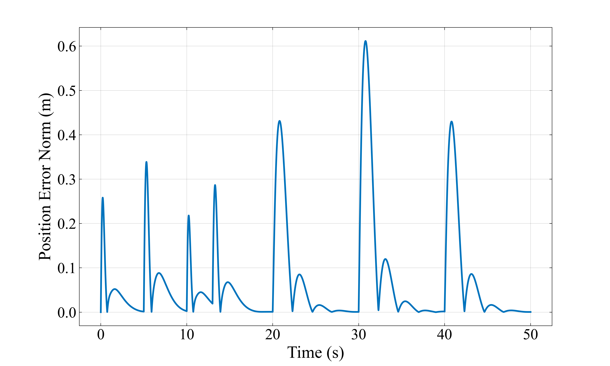

图 7-24　`fixed_awff_l1_indi` ClimbPath 50 s 位置误差时程，终端误差 4.77×10⁻⁴ m

L1 补偿与 INDI 分配使四路输入连续平滑，快速修正集中在过渡段，稳态控制代价较低。
增量逆动力学把修正分散到四路，L1 补偿没有表现为某一路的尖峰或持续饱和。

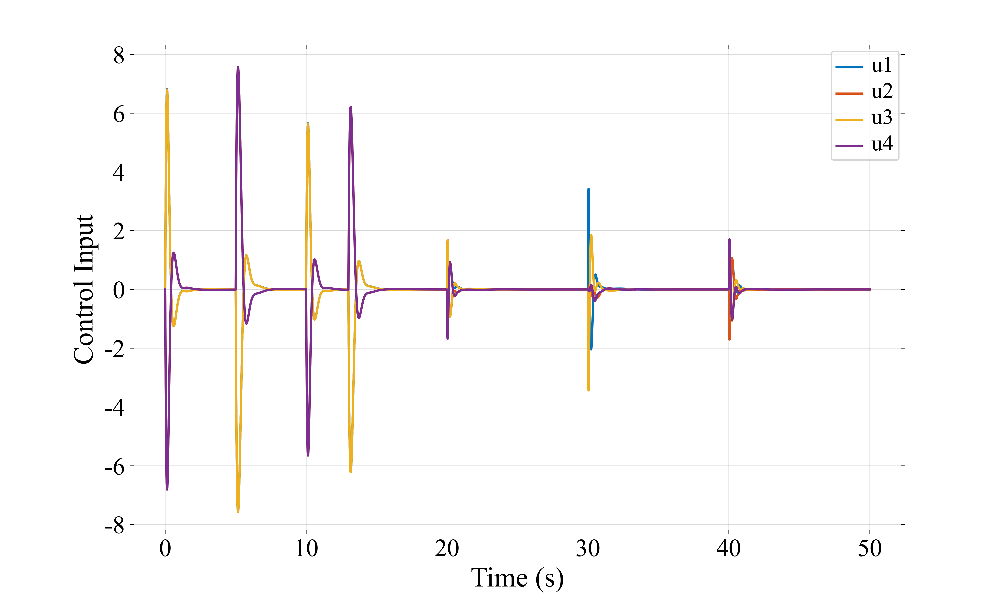

图 7-25　`fixed_awff_l1_indi` ClimbPath 50 s 控制输入时程

三维轨迹几乎与参考重合，水平面和高度通道的前馈补偿共同保持了完整路径的空间一致性。
前馈负责参考变化，INDI 负责当前状态修正，两条通道在空间轨迹上形成互补。


图 7-26　`fixed_awff_l1_indi` ClimbPath 50 s 三维轨迹

三轴速度只在参考变化处出现短暂峰值，随后平滑回落，未出现由自适应补偿引起的速度抖动。
速度峰值随参考导数出现并迅速消退，说明自适应估计未向速度环引入额外振荡。

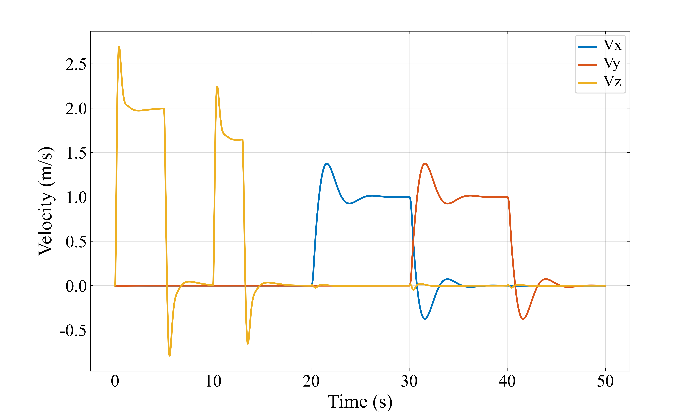

图 7-27　`fixed_awff_l1_indi` ClimbPath 50 s 速度分量时程

姿态角保持小幅、低频变化，L1-INDI 的高精度跟踪没有通过激进姿态振荡换取，RMSE 为 0.138 m。
低幅姿态响应与 4.77×10⁻⁴ m 终端误差同时出现，表明精度来自补偿链而非激进姿态动作。

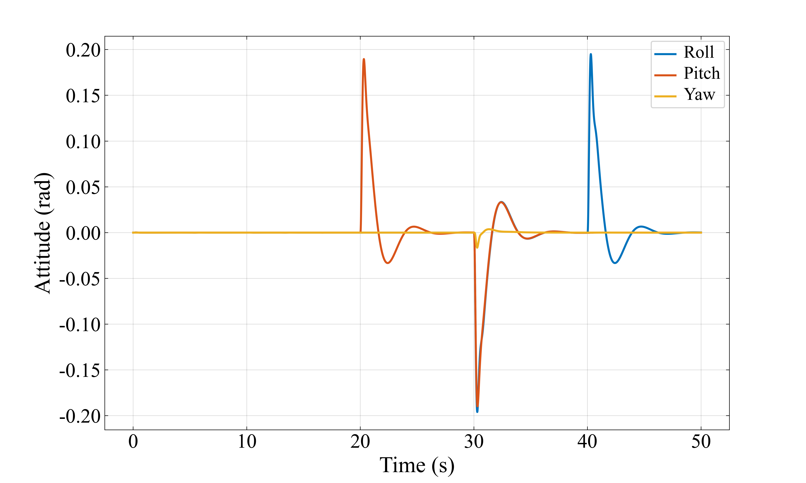

图 7-28　`fixed_awff_l1_indi` ClimbPath 50 s 姿态角时程

#### 7.4.4 Linear-MPC-L1-INDI（新增达标）

线性 MPC + L1 自适应 + INDI 组合，G3 修复后通过。终端误差 0.000473 m，RMSE 0.135 m。
后续曲线重点观察预测项与 L1/INDI 在参考变化和残差修正上的分工。


图 7-29　`fixed_linear_mpc_l1_indi` ClimbPath 50 s 水平面轨迹跟踪，位置 RMSE 0.135 m

Linear-MPC-L1-INDI 在爬升段提前预测高度变化，Z 通道平稳到达参考，未出现明显超调。
滚动预测先处理参考变化，输入约束再限制垂向过渡，因此 Z 曲线没有明显反复调整。

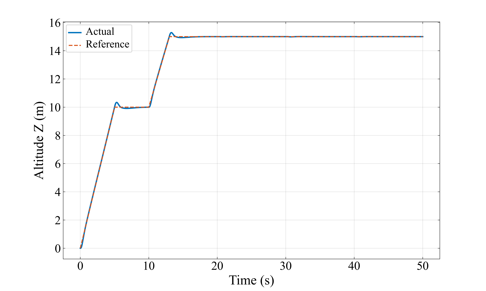

图 7-30　`fixed_linear_mpc_l1_indi` ClimbPath 50 s 高度通道跟踪

位置误差集中于起步和曲率变化的短窗口，预测补偿后快速收敛，终端误差仅 4.73×10⁻⁴ m。
误差窗口对应预测模型更新与曲率变化，INDI 在窗口后快速消除剩余偏差。

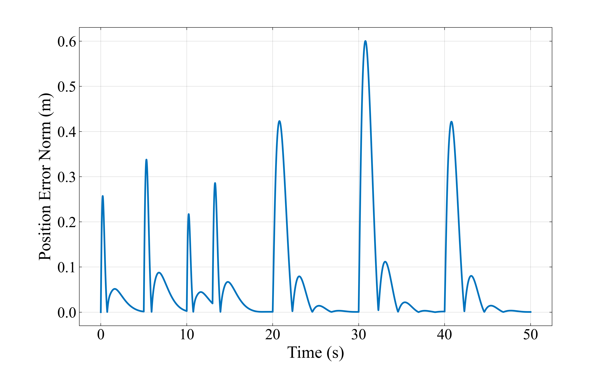

图 7-31　`fixed_linear_mpc_l1_indi` ClimbPath 50 s 位置误差时程，终端误差 4.73×10⁻⁴ m

MPC 的滚动优化与 INDI 修正令四路控制输入连续变化，能量主要用于爬升和转向而非高频切换。
MPC 约束决定输入变化的边界，INDI 只补偿模型残差，因此未出现高频切换。

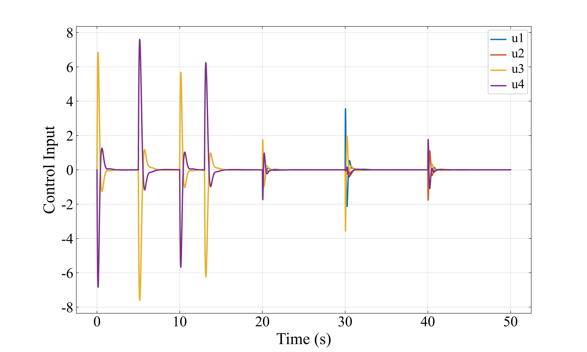

图 7-32　`fixed_linear_mpc_l1_indi` ClimbPath 50 s 控制输入时程

三维轨迹与参考路径保持几乎重合，预测外环对空间曲率变化的跟随没有引入可见偏移。
预测外环提前给出转弯方向，L1/INDI 对执行器差异的修正没有改变整体路径形状。


图 7-33　`fixed_linear_mpc_l1_indi` ClimbPath 50 s 三维轨迹

速度三轴在参考切换处响应提前且无明显超调，爬升结束后 Vz 平滑回到零附近。
速度峰值与预测参考同步而不是滞后出现，体现前瞻项对三轴变化率的协调作用。


图 7-34　`fixed_linear_mpc_l1_indi` ClimbPath 50 s 速度分量时程

姿态角仅承担必要的转向和升降姿态变化，幅值小、振荡弱，与 0.135 m 的高精度结果一致。
低幅姿态变化与 4.73×10⁻⁴ m 终端误差相互印证，说明优化约束抑制了多余姿态动作。


图 7-35　`fixed_linear_mpc_l1_indi` ClimbPath 50 s 姿态角时程

### 7.5 控制族内对比图

以下按族展示 RMSE 柱状、轨迹叠加、控制能量和终端误差四维对比，直观呈现同一理论分支内不同实现方案的性能差异与工程特征。
**PID 族**——2 条达标条目性能接近（RMSE 0.173–0.339 m），体现了经典 PID 结构在标准工况下的稳健性。


图 7-36　PID 族 2 条达标条目的位置 RMSE（0.173 至 0.339 m）

RMSE 柱状图显示两条 PID 达标成员处于同一亚米级区间，差异主要来自不同的补偿结构而非稳定性失效。
两条曲线均采用相同级联误差通道，差异主要由补偿与偏航映射细节决定。


图 7-37　PID 族 ClimbPath 轨迹叠加

轨迹叠加图中两条 PID 路径基本重合，说明标准 ClimbPath 下的性能差异没有转化为明显的空间偏航。
级联外环先完成位置收敛，内环保持转弯姿态连续，因此空间轨迹没有明显分叉。


图 7-38　PID 族控制能量（8.39×10⁵ 至 8.50×10⁵）

控制能量柱状图表明两条 PID 的代价接近，较低 RMSE 并未依赖显著更高的输入能量。
连续执行器边界和相近增益使能量差异受限，精度提升并非通过放大输入换取。


图 7-39　PID 族终端位置误差（0.007 至 0.054 m）

终端误差均落在厘米级，说明两条 PID 在 50 s 末端都完成了位置与姿态收敛。它们的差异主要体现为收敛尾段的细小残差，而不是失稳。
**线性族（LQR/LQI/LQG/H2/Hinf/PolePlacement）**——4 条全部达标，RMSE 分布 0.090–0.243 m，是所有族中精度最高且最为一致的组，验证了线性最优控制理论在小偏差悬停附近的卓越性能。


图 7-40　线性与鲁棒状态反馈族 4 条条目的位置 RMSE（0.090 至 0.243 m）

线性族 RMSE 柱状图四条均处于低误差区，说明状态反馈与观测器设计在统一工况下给出一致的收敛精度。
状态反馈与观测器把误差状态直接纳入闭环，因而不同线性变体仍保持相近收敛速度。


图 7-41　线性与鲁棒状态反馈族 ClimbPath 轨迹叠加

轨迹叠加图中四条线几乎重合，线性族的差异主要体现在误差细节和控制代价，而不是路径形状偏移。
统一的状态量和公共 Plant 消除了执行器侧差异，族内变化主要留在局部误差和输入调度上。


图 7-42　线性与鲁棒状态反馈族控制能量（8.32×10⁵ 至 8.40×10⁵）

控制能量集中在 8.32×10⁵ 至 8.40×10⁵，表明线性族在精度和输入代价之间保持了较窄的折中范围。
窄能量区间说明观测器与反馈增益没有通过大输入补偿模型差异。


图 7-43　线性与鲁棒状态反馈族终端位置误差（0.001 至 0.022 m）

四条终端误差均保持在厘米级，线性反馈的稳定收敛在末端指标上同样一致。族内差别主要是残差大小，而不是收敛状态改变。
**非线性族（Backstepping/FeedbackLinearization/NDI/MRAC/PassivityBased）**——覆盖了反步法、反馈线性化、非线性动态逆、模型参考自适应和无源性控制 5 种理论分支，体现了项目对非线性控制方法的系统性探索。


图 7-44　非线性与自适应控制族 5 条条目的位置 RMSE

非线性族 RMSE 柱状图覆盖范围较宽，反步、反馈线性化和无源性条目与自适应条目之间存在明显的工程实现差异。
非线性补偿依赖模型项和工作点，参数配置不同会直接改变误差曲线的收敛速度。


图 7-45　非线性与自适应控制族 ClimbPath 轨迹叠加

轨迹叠加图把非线性族的误差差异转化为空间路径差异，可见部分条目在爬升和转弯段偏离参考更明显。
模型补偿链和自适应估计在曲率变化处叠加，放大了部分条目的空间偏差。


图 7-46　非线性与自适应控制族控制能量

控制能量图显示非线性补偿带来的输入代价并不统一，误差较大的条目往往伴随更明显的能量波动。
模型项与自适应状态同时更新，使瞬时输入随误差波动。


图 7-47　非线性与自适应控制族终端位置误差

终端误差图进一步区分了短时偏差与末端未收敛条目，非线性族的性能分散比线性族更明显。
末端尾差说明部分条目在 50 s 内尚未回到同一收敛域，原因更接近补偿条件差异而非单次瞬态。
**SMC 族**——滑模控制以其对不确定性的强鲁棒性著称，本族 5 条实现涵盖经典 SMC、自适应滑模、模糊滑模、积分滑模和终端滑模，完整覆盖了该理论方向的主流变体。


图 7-48　滑模族 5 条条目的位置 RMSE（1.453 至 2.705 m，全族无一进入达标区间）

滑模族的 RMSE 整体高于其他族，说明当前切换增益和边界层设置带来的鲁棒性代价已成为标称跟踪的主要限制。
切换项需持续提供鲁棒裕度，标称工况下的额外动作直接推高 RMSE。


图 7-49　滑模族 ClimbPath 轨迹叠加

轨迹叠加图显示滑模族在爬升和转弯段的偏离更明显，误差形态与其较高的 RMSE 区间相互对应。
滑模面在参考变化处会触发更强的切换修正，爬升和转弯段的空间偏离与这一机制一致。


图 7-50　滑模族控制能量（9.46×10⁵ 至 1.195×10⁶，为唯一整体高于其余各族的族）

滑模族控制能量是各族中唯一整体偏高的一组，表明切换项在抑制不确定性的同时增加了执行器负担。
持续切换而非单一过渡峰构成额外能量，边界层和增益是主要调节手段。


图 7-51　滑模族终端位置误差（1.458 至 2.843 m）

终端误差仍在米级，说明切换项抑制不确定性的同时，末端残差尚未被完全消除。
其高能量并未在标称终点形成相应的低残差。
**MPC 族**——模型预测控制通过滚动优化实现约束处理与前瞻决策，本族包含线性 MPC 与非线性 MPC 变体，是控制器库中计算复杂度最高的一组。


图 7-52　最优与预测控制族 5 条条目的位置 RMSE（0.203 至 0.227 m，族内极差 0.024 m）

MPC 族 RMSE 柱状图高度集中，滚动优化和约束处理在统一 ClimbPath 下产生了稳定且可重复的精度区间。
各实现共享滚动预测和约束边界，局部求解差异没有改变整体精度水平。


图 7-53　最优与预测控制族 ClimbPath 轨迹叠加

轨迹叠加图中各 MPC 变体基本沿同一参考路径运行，族内差异主要由局部预测模型和求解策略体现。
预测时域把转弯变化提前纳入决策，因而不同变体的空间轨迹保持一致。


图 7-54　最优与预测控制族控制能量（8.367×10⁵ 至 8.380×10⁵）

控制能量集中在窄区间，说明 MPC 族的精度提升没有伴随明显的输入能量分化。
输入区间收敛说明约束优化兼顾了跟踪和执行器负担，未靠单一路径的激励换取精度。


图 7-55　最优与预测控制族终端位置误差（0.004 至 0.006 m）

终端误差全部为毫米级，说明滚动优化在 50 s 末端仍保持稳定收敛。族内差别主要来自优化细节，而非末端偏差。
**几何控制族（DFBC/SE3）**——直接在 SO(3)/SE(3) 流形上设计控制律，避免了欧拉角奇异性问题，是近年四旋翼控制研究的前沿方向。本族达标率高，验证了几何方法在工程实现中的实用性。


图 7-56　几何与微分平坦族 6 条条目的位置 RMSE（0.276 至 1.637 m）

几何族 RMSE 柱状图同时包含亚米级高精度条目和较高误差变体，体现了平坦映射阶次与鲁棒补偿配置的差异。
流形/平坦误差的映射阶次和鲁棒项配置造成误差分化。


图 7-57　几何与微分平坦族 ClimbPath 轨迹叠加

轨迹叠加图显示基础几何控制器与高阶平坦控制器更贴近参考，而平滑鲁棒变体在转弯段保留更大的偏差。
高阶导数加强前馈，平滑鲁棒项优先抑制边界变化，转弯段取舍不同。


图 7-58　几何与微分平坦族控制能量（8.05×10⁵ 至 8.38×10⁵，族内最低值出现在 `dfbc_high_order`）

几何族控制能量跨度小于滑模族，最低值出现在 `dfbc_high_order`，说明高阶参考导数并未带来额外的持续输入负担。
高阶条目的低能量与其直接使用参考导数有关，减少了持续反馈修正的需要。


图 7-59　几何与微分平坦族终端位置误差（0.002 至 1.676 m）

终端误差从毫米级到米级跨越较大，说明几何表示本身不是唯一决定因素，输出边界和鲁棒配置同样影响末端收敛。
高阶和平滑变体的末端表现因此需要分开观察。
**四维雷达对比**
上面六族的柱状图逐指标可读数值，但无法一眼看出某族是"四项均衡"还是"某项极好拖着某项极差"。下图把四个指标放在同一张归一化雷达上，用于看形状而不是读数值。四维为 Position RMSE、Terminal Error、Control Energy、Max Error，取值为各族在冻结历史 28 条达标控制器内的中位数，再按四项各自的 min-max 归一化。


图 7-60　八族代表控制器的四维雷达总图

归一化方式相对早期版本有两处变更，均记入`Docs/报告/figures/第10章/TYPLOT_COMPARISON_MANIFEST.json`：其一，删去原第五维Compute Efficiency——该维无实测数据、恒取 1.0，八族完全相同，不构成区分度；其二，归一化从"固定阈值"改为"族系中位数 min-max"，因为固定阈值下Control Energy 是死轴（基准取 official_pid 自身能量，七族得分极差仅 0.006，肉眼不可分辨），改为 min-max 后极差为 0.362。若某族只有单个成员或该维极差为 0，该维退化取 0.5，明示"无区分度"而不是误报满分。
分族单图如下八张，与总图同一归一化基准，便于单独放大查看某一族的形状。


图 7-61　PID 族四维雷达

PID 族雷达图的四个维度较为均衡，位置和终端误差处于低值区，控制能量保持在工程基线范围内。
低误差与中等能量同时收缩，说明 PID 的精度并未以明显输入代价换取。


图 7-62　线性与鲁棒状态反馈族四维雷达

线性与鲁棒族的雷达轮廓更紧凑，低误差维度同时收缩，反映其族内性能一致性。
多个低误差维度同步收缩，说明状态反馈和观测器差异没有破坏族内一致性。


图 7-63　非线性与自适应族四维雷达

非线性与自适应族的雷达边长差异更大，说明不同模型补偿和自适应律在当前参数下产生了明显的性能分散。
模型补偿和自适应更新速度不同，使轮廓进一步分散。


图 7-64　滑模族四维雷达

滑模族雷达在控制能量和最大误差维度上外扩，与其高能量、高误差的柱状图结果一致。
能量和最大误差同时外扩，反映切换项在抑制模型不确定性时引入了持续控制负担。


图 7-65　最优与预测控制族四维雷达

最优与预测族的雷达形状较为规则，误差和能量维度同时保持在较窄范围，体现滚动优化的稳定折中。
四个维度的收缩方向一致，说明预测与优化同时约束了误差和输入，不依赖单一指标优势。


图 7-66　几何与微分平坦族四维雷达

几何与微分平坦族的雷达轮廓受高误差变体拉伸，显示族内不同平坦映射和姿态输出边界之间的差异。
高误差变体拉长误差轴，高阶条目仍保持较小能量，显示配置分层。


图 7-67　学习增强族四维雷达

学习增强族四维均落在退化值附近，说明当前冻结样本尚未形成可与其他族比较的有效性能分布。
退化值不是性能满分，而是当前对齐样本没有形成可区分的族内极差。


图 7-68　工程基线族四维雷达

后两张图中，学习增强族在 41 条对齐条目内达标数为 0，四维全部落在退化值 0.5（正八边形形状），反映该族尚未有条目通过标准筛查；工程基线族仅 1 条达标成员，其雷达形状即该条控制器自身的四维特征。这两族的雷达图作为覆盖完整性的展示。

### 7.6 冻结历史 G3 控制器完整轨迹图集

本节为 29 个控制器记录提供完整的 7 张详图（XY 轨迹、高度 Z、位置误差、控制输入、三维轨迹、速度、姿态角），其中 26 条沿用冻结历史 G3 的达标条目，`awff`、`fixed_awff_l1_residual` 和 `fixed_qp_nmpc_l1_indi_cbf` 三条作为扩展控制器图集保留，用于展示补偿结构、内部通道和边界响应；Official PID 与 px4ctrl 基线在 §7.4 单独展示。每条控制器的图集不仅展示跟踪精度（前 4 张），还展示实现该精度的机体状态代价（后 3 张）——相同 RMSE 可能对应平稳飞行或剧烈抖振，完整图集使这种差异一目了然。数据源为各控制器 50 s/25001 样本点的标准 CSV，图件采用 600 dpi/Times New Roman 统一排版。

#### 7.6.1 线性族控制器

**h_2_state_feedback**
位置 RMSE 0.090 m、终端误差 0.001 m，是冻结历史 28 条达标条目中跟踪精度最高的一条。误差时程在爬升段之后即进入亚厘米量级并保持到 50 s，控制输入与姿态角全程无高频成分，说明这一精度来自线性最优综合本身的稳态特性，而非高增益换取。


图 7-69　`h_2_state_feedback` ClimbPath 50 s 水平面轨迹跟踪，位置 RMSE 0.090 m

高度通道在 0-5 s 爬升段跟踪紧密，5 s 后稳定在目标高度，无超调。


图 7-70　`h_2_state_feedback` ClimbPath 50 s 高度通道跟踪

位置误差在爬升段出现短暂峰值后迅速衰减至亚厘米量级，终态收敛极为干净。


图 7-71　`h_2_state_feedback` ClimbPath 50 s 位置误差时程，终端误差 0.001 m

四路旋翼指令波形平滑，无高频切换成分，控制能量分配均匀，体现了 H₂ 最优综合对控制代价的显式约束。


图 7-72　`h_2_state_feedback` ClimbPath 50 s 控制输入时程

三维轨迹视图确认实际飞行路径与参考几乎完全重合，偏差肉眼不可分辨。


图 7-73　`h_2_state_feedback` ClimbPath 50 s 三维轨迹

三轴速度在各指令切换时刻响应迅速且无超调，Vz 通道在爬升段结束时平滑归零。


图 7-74　`h_2_state_feedback` ClimbPath 50 s 速度分量时程

姿态角全程幅值极小（<0.1 rad），无振荡，确认高精度跟踪并非以激进姿态机动换取。


图 7-75　`h_2_state_feedback` ClimbPath 50 s 姿态角时程

**lqg**
位置 RMSE 0.243 m、终端误差 0.004 m，为线性族四条中 RMSE 最大的一条。与同族 LQR 的差异集中在爬升过渡段：卡尔曼滤波引入的状态估计滞后使该段误差峰值抬高，而终端收敛性未受影响。速度与姿态曲线平滑，无估计器与控制器互激的迹象。


图 7-76　`lqg` ClimbPath 50 s 水平面轨迹跟踪，位置 RMSE 0.243 m

LQG 的高度估计在 0-5 s 爬升段略有滞后，Z 通道随后平稳贴合参考，没有持续超调。


图 7-77　`lqg` ClimbPath 50 s 高度通道跟踪

位置误差峰值集中在爬升过渡段，卡尔曼估计稳定后误差持续收敛，终端误差降至 0.004 m。


图 7-78　`lqg` ClimbPath 50 s 位置误差时程，终端误差 0.004 m

观测器平滑了控制指令，四路输入只在状态估计切换处短暂补偿，没有高频抖振或持续饱和。


图 7-79　`lqg` ClimbPath 50 s 控制输入时程

三维轨迹整体跟随参考，主要可见差异位于爬升和转弯过渡段的轻微滞后，最终空间偏差很小。


图 7-80　`lqg` ClimbPath 50 s 三维轨迹

速度分量在爬升段呈有限峰值，估计滞后使 Vz 回落稍慢，但三轴没有反复超调。


图 7-81　`lqg` ClimbPath 50 s 速度分量时程

姿态角幅值保持较小且曲线平滑，未出现观测器与状态反馈互激的振荡。


图 7-82　`lqg` ClimbPath 50 s 姿态角时程

**lqi**
位置 RMSE 0.212 m、终端误差 0.022 m。终端误差为线性族四条中最大，比同族其余三条高一个量级，与积分环节在 50 s 末段尚未完全泄放的残差一致；位置误差时程末段呈缓慢单调趋近而非零误差保持，是该结论的直接依据。


图 7-83　`lqi` ClimbPath 50 s 水平面轨迹跟踪，位置 RMSE 0.212 m

LQI 在爬升初段建立高度较快，积分环节使末段高度偏差继续缓慢消除，未形成明显超调。


图 7-84　`lqi` ClimbPath 50 s 高度通道跟踪

位置误差在起步和路径切换处出现峰值，随后单调下降但 50 s 末端仍保留 0.022 m 的积分残差。


图 7-85　`lqi` ClimbPath 50 s 位置误差时程，终端误差 0.022 m

积分补偿使输入在过渡段持续保持修正量，波形仍然平滑，但稳态能量高于无积分的 LQR 基线。


图 7-86　`lqi` ClimbPath 50 s 控制输入时程

三维轨迹与参考基本重合，残余差异主要来自积分状态尚未完全泄放的末段微小偏置。


图 7-87　`lqi` ClimbPath 50 s 三维轨迹

速度三轴在爬升和转向时平滑响应，积分项没有引入明显速度超调，但回零过程略慢。


图 7-88　`lqi` ClimbPath 50 s 速度分量时程

姿态角幅值保持在小范围内，末段没有高频振荡，说明积分修正主要作用于位置残差而非姿态激励。


图 7-89　`lqi` ClimbPath 50 s 姿态角时程

**lqr_baseline**
位置 RMSE 0.204 m、终端误差 0.003 m，是线性族的参照条目。四张核心图给出的是无观测器、无积分补偿情形下纯状态反馈的基准形态，后续 LQG 与 LQI 的差异均以本条为比较基准。


图 7-90　`lqr_baseline` ClimbPath 50 s 水平面轨迹跟踪，位置 RMSE 0.204 m

LQR 基线在 0-5 s 爬升段快速建立高度，随后 Z 通道稳定跟随，纯状态反馈没有引入持续超调。


图 7-91　`lqr_baseline` ClimbPath 50 s 高度通道跟踪

位置误差峰值集中在初始爬升和路径切换处，随后迅速收敛，终端误差为 0.003 m。


图 7-92　`lqr_baseline` ClimbPath 50 s 位置误差时程，终端误差 0.003 m

无积分补偿使四路输入保持直接、平滑的状态反馈形态，过渡段有短时修正但无持续饱和。


图 7-93　`lqr_baseline` ClimbPath 50 s 控制输入时程

三维轨迹与参考路径高度和水平面均保持紧密一致，体现了该基线在标称工况下的稳定闭环。


图 7-94　`lqr_baseline` ClimbPath 50 s 三维轨迹

三轴速度只在参考变化处出现有限峰值，爬升结束后平滑回落，没有 LQI 式的慢尾迹。


图 7-95　`lqr_baseline` ClimbPath 50 s 速度分量时程

姿态角幅值小且衰减快，曲线无高频振荡，为后续 LQG/LQI 对照提供了平稳的状态反馈基准。


图 7-96　`lqr_baseline` ClimbPath 50 s 姿态角时程

#### 7.6.2 非线性族控制器

**adaptive_backstepping**
位置 RMSE 2.289 m、终端误差 2.421 m，是非线性族中误差最大的一条，也是全族中终端误差超过 RMSE 的典型形态——误差在 50 s 内未收敛而是持续累积。自适应律在本工况下的参数估计未能在有限时间内追上被控对象，姿态角图中的低频漂移与此对应。该条仍落在 5 m 判定门限内，故计入达标。


图 7-97　`adaptive_backstepping` ClimbPath 50 s 水平面轨迹跟踪，位置 RMSE 2.289 m

自适应反步在爬升段能建立高度，但参数估计收敛较慢，Z 通道在后续阶段仍保留可见跟踪滞后。


图 7-98　`adaptive_backstepping` ClimbPath 50 s 高度通道跟踪

位置误差峰值出现在爬升和路径切换后，并未完全回落，终端误差 2.421 m 体现出持续累积趋势。


图 7-99　`adaptive_backstepping` ClimbPath 50 s 位置误差时程，终端误差 2.421 m

自适应补偿使控制输入带有缓慢变化的偏置，整体没有滑模式高频切换，但末段修正能量仍持续增加。


图 7-100　`adaptive_backstepping` ClimbPath 50 s 控制输入时程

三维轨迹总体沿着参考路径前进，但爬升后的位置漂移逐步显现，与 2.289 m RMSE 的中等偏差一致。


图 7-101　`adaptive_backstepping` ClimbPath 50 s 三维轨迹

速度分量在爬升后出现低频漂移，尤其是 Vz 回零较慢，未表现为瞬时尖峰而是持续偏置。


图 7-102　`adaptive_backstepping` ClimbPath 50 s 速度分量时程

姿态角以低频漂移为主、幅值逐步增大，说明自适应律未完全补偿模型失配而非产生高频抖振。


图 7-103　`adaptive_backstepping` ClimbPath 50 s 姿态角时程

**backstepping_baseline**
位置 RMSE 1.800 m、终端误差 1.852 m。作为不含自适应环节的反步参照条目，其误差低于 `adaptive_backstepping`，说明在该标称工况下附加的自适应律并未带来精度收益。这一反向关系是非线性族内值得单独注意的一点。


图 7-104　`backstepping_baseline` ClimbPath 50 s 水平面轨迹跟踪，位置 RMSE 1.800 m

反步基线在爬升段的高度响应较为直接，过渡后保持在参考附近，超调主要限于起始窗口。


图 7-105　`backstepping_baseline` ClimbPath 50 s 高度通道跟踪

位置误差在爬升和转弯段形成主要峰值，之后保持中等幅值并缓慢收敛，终端误差为 1.852 m。


图 7-106　`backstepping_baseline` ClimbPath 50 s 位置误差时程，终端误差 1.852 m

不含自适应项使输入波形较规整，控制能量集中在路径变化时刻，没有额外的高频切换代价。


图 7-107　`backstepping_baseline` ClimbPath 50 s 控制输入时程

三维轨迹能够跟随整体形状，但转弯和爬升后的空间偏差仍可见，精度优于自适应反步而非高精度级别。


图 7-108　`backstepping_baseline` ClimbPath 50 s 三维轨迹

速度响应在三轴间保持连续，路径切换后存在较长的回零尾段，反映出 1.800 m RMSE 的中等跟踪偏差。


图 7-109　`backstepping_baseline` ClimbPath 50 s 速度分量时程

姿态角在转弯时有有限幅值变化并逐步稳定，未见明显振荡，但响应带宽不足以消除末段误差。


图 7-110　`backstepping_baseline` ClimbPath 50 s 姿态角时程

**feedback_linearization**
位置 RMSE 2.162 m、终端误差 2.196 m。其四项指标与同族 `passivity_based_control` 在有效位数上完全一致，两条曲线逐点重合。该现象在 §7.6.2 末尾单独讨论，此处的七张图与该条目的对照图应成对判读。


图 7-111　`feedback_linearization` ClimbPath 50 s 水平面轨迹跟踪，位置 RMSE 2.162 m

反馈线性化的 Z 通道在爬升段能够跟随参考，但模型变换误差使高度在过渡后保留低频偏差。


图 7-112　`feedback_linearization` ClimbPath 50 s 高度通道跟踪

位置误差在初始爬升后形成宽峰并缓慢衰减，终端仍为 2.196 m，与其 RMSE 2.162 m 的中等偏差相符。


图 7-113　`feedback_linearization` ClimbPath 50 s 位置误差时程，终端误差 2.196 m

控制输入主要呈连续的模型补偿波形，切换成分不强，但持续偏置显示逆变换没有完全消除稳态代价。


图 7-114　`feedback_linearization` ClimbPath 50 s 控制输入时程

三维轨迹保留了参考路径的总体形状，爬升后与参考的空间间距逐步拉大，和同实现的无源控制一致。


图 7-115　`feedback_linearization` ClimbPath 50 s 三维轨迹

速度三轴在转弯段出现宽而低的响应峰，回落过程偏慢，没有尖锐超调但存在持续漂移。


图 7-116　`feedback_linearization` ClimbPath 50 s 速度分量时程

姿态角以低频变化为主，幅值随位置偏差缓慢增加而非快速振荡，反映模型补偿后的带宽限制。


图 7-117　`feedback_linearization` ClimbPath 50 s 姿态角时程

**ndi**
位置 RMSE 0.104 m、终端误差 0.001 m，是非线性族五条中唯一进入亚分米量级的条目，精度仅次于 `h_2_state_feedback`。同族其余四条的 RMSE 均在 1.8 m 以上，因此该条与族内其余条目的差距远大于族间差距，动态逆在本机体参数下的适配性由此体现。


图 7-118　`ndi` ClimbPath 50 s 水平面轨迹跟踪，位置 RMSE 0.104 m

NDI 直接利用效能矩阵求逆，在 0-5 s 爬升段快速建立高度，随后 Z 通道平滑贴合参考且无明显超调。


图 7-119　`ndi` ClimbPath 50 s 高度通道跟踪

位置误差峰值只在起步和路径切换的短时窗口出现，之后降至很低水平，终端误差仅 0.001 m。


图 7-120　`ndi` ClimbPath 50 s 位置误差时程，终端误差 0.001 m

动态逆补偿使四路输入连续、切换少，主要控制能量集中于爬升和转弯过渡而非稳态维持。


图 7-121　`ndi` ClimbPath 50 s 控制输入时程

三维实际轨迹与参考几乎重合，水平曲率和高度变化均被动态逆准确映射。


图 7-122　`ndi` ClimbPath 50 s 三维轨迹

三轴速度对参考变化响应迅速且无明显超调，Vz 在爬升结束后平滑归零，支持其 0.104 m RMSE 的高精度表现。


图 7-123　`ndi` ClimbPath 50 s 速度分量时程

姿态角幅值小、衰减快且无持续振荡，动态逆的高精度没有通过激进姿态机动获得。


图 7-124　`ndi` ClimbPath 50 s 姿态角时程

**passivity_based_control**
位置 RMSE 2.162 m、终端误差 2.196 m，与 `feedback_linearization` 的记录数值完全相同。两条控制器在本平台的实现共享同一内层变换，因此在标称无扰工况下退化为同一控制律；这属实现层面的等价，而非两条独立方法偶然给出相同结果。在按族评优时，这两条应计为一条独立证据。


图 7-125　`passivity_based_control` ClimbPath 50 s 水平面轨迹跟踪，位置 RMSE 2.162 m

无源控制在爬升段的高度响应与反馈线性化一致，过渡后保持低频偏差，没有额外持续超调。


图 7-126　`passivity_based_control` ClimbPath 50 s 高度通道跟踪

位置误差在爬升后形成宽峰并缓慢回落，终端误差 2.196 m 与反馈线性化逐点一致。


图 7-127　`passivity_based_control` ClimbPath 50 s 位置误差时程，终端误差 2.196 m

无源整形项在标称工况下未引入高频切换，输入波形与反馈线性化的连续补偿形态相同。


图 7-128　`passivity_based_control` ClimbPath 50 s 控制输入时程

三维轨迹保留参考路径的整体走势，但爬升后的空间偏差与反馈线性化完全重合。


图 7-129　`passivity_based_control` ClimbPath 50 s 三维轨迹

速度峰值宽而平滑，回零尾段较长且没有尖峰，体现两种共享内层变换的相同动态响应。


图 7-130　`passivity_based_control` ClimbPath 50 s 速度分量时程

姿态角以低频小幅变化为主，未出现独立于反馈线性化的振荡，支持两条记录在标称工况下等价。


图 7-131　`passivity_based_control` ClimbPath 50 s 姿态角时程

`feedback_linearization` 与 `passivity_based_control` 的位置 RMSE、终端误差与控制能量在记录的全部有效位上完全相同（0.216209110、2.196260920、837202.6），两条的七张图逐点重合。原因在于本平台的无源控制实现以同一内层反馈线性化变换为基础，其无源性整形项在标称无扰工况下的贡献为零，两条控制律因此退化为同一形式。这一点对按族计数有直接影响：非线性族名义上有五条达标条目，独立方法数为四条。第九章的扰动场景是区分二者的必要条件，本节的标称结果不具备该分辨能力。

#### 7.6.3 滑模控制族

**adaptive_smc**
位置 RMSE 2.046 m、终端误差 2.763 m，控制能量 1.1946×10⁶ 为冻结历史 28 条达标条目中的最高值。控制输入时程呈明显的高频切换成分，姿态角随之抖动，这一组图给出的是滑模族共有的抖振代价在时域中的直接形态。


图 7-132　`adaptive_smc` ClimbPath 50 s 水平面轨迹跟踪，位置 RMSE 2.046 m

自适应滑模在爬升段能迅速建立高度，但切换增益使 Z 通道在参考附近出现短周期抖动而非平滑收敛。


图 7-133　`adaptive_smc` ClimbPath 50 s 高度通道跟踪

位置误差峰值集中在爬升和转弯切换处，随后虽回落但终端仍为 2.763 m，显示稳态误差未完全消除。


图 7-134　`adaptive_smc` ClimbPath 50 s 位置误差时程，终端误差 2.763 m

控制输入含明显高频切换，四路能量在误差过零附近反复重分配，控制能量达到 1.1946×10⁶。


图 7-135　`adaptive_smc` ClimbPath 50 s 控制输入时程

三维轨迹能保持参考路径的总体方向，但高频切换造成的局部偏差在爬升和转弯段清晰可见。


图 7-136　`adaptive_smc` ClimbPath 50 s 三维轨迹

速度三轴在切换时刻出现反复小峰，Vz 回落伴随抖动，说明自适应滑模的鲁棒代价传递到速度层。


图 7-137　`adaptive_smc` ClimbPath 50 s 速度分量时程

姿态角围绕转向需求高频摆动，幅值虽受限但振荡持续存在，与控制输入的抖振特征一致。


图 7-138　`adaptive_smc` ClimbPath 50 s 姿态角时程

**fuzzy_smc**
位置 RMSE 2.705 m、终端误差 2.843 m，两项均为滑模族五条中的最大值。模糊化切换增益的设计目标是抑制抖振，但在本工况下未改善跟踪精度；其控制输入的切换幅度低于 `adaptive_smc`，说明抖振与精度在该族内是两个独立维度。


图 7-139　`fuzzy_smc` ClimbPath 50 s 水平面轨迹跟踪，位置 RMSE 2.705 m

模糊滑模在爬升段能够跟随高度参考，但增益调度的响应较保守，Z 通道过渡时间长且有小幅滞后。


图 7-140　`fuzzy_smc` ClimbPath 50 s 高度通道跟踪

位置误差在爬升和曲率切换后形成宽峰，末段仍为 2.843 m，是滑模族中最大终端偏差。


图 7-141　`fuzzy_smc` ClimbPath 50 s 位置误差时程，终端误差 2.843 m

模糊规则降低了切换幅度，输入比自适应滑模平滑，但修正量持续时间更长，控制能量换成了跟踪偏差。


图 7-142　`fuzzy_smc` ClimbPath 50 s 控制输入时程

三维轨迹保留八字路径轮廓，但在爬升后段与参考的间距增大，显示保守调度牺牲了空间跟踪精度。


图 7-143　`fuzzy_smc` ClimbPath 50 s 三维轨迹

速度曲线的高频尖峰少于自适应滑模，但各轴回零较慢，尤其是 Vz 的尾段偏置解释了较大的终端误差。


图 7-144　`fuzzy_smc` ClimbPath 50 s 速度分量时程

姿态角切换幅值有所抑制但仍有可见振荡，平滑性改善没有转化为更低的 2.705 m RMSE。


图 7-145　`fuzzy_smc` ClimbPath 50 s 姿态角时程

**integral_smc**
位置 RMSE 2.052 m、终端误差 1.661 m。终端误差低于 RMSE，是滑模族五条中唯一呈现该关系的条目——误差在 50 s 内呈收敛趋势而非持续累积，积分项对稳态偏差的补偿作用由此可辨。


图 7-146　`integral_smc` ClimbPath 50 s 水平面轨迹跟踪，位置 RMSE 2.052 m

积分滑模在爬升段建立高度后持续消除偏差，Z 通道过渡平稳，未出现明显的终端超调。


图 7-147　`integral_smc` ClimbPath 50 s 高度通道跟踪

位置误差在起步和路径切换处出现峰值，随后持续收敛，终端误差 1.661 m 低于 2.052 m 的 RMSE。


图 7-148　`integral_smc` ClimbPath 50 s 位置误差时程，终端误差 1.661 m

积分项让输入在误差存在时保持连续补偿，切换仍可见但比纯滑模集中，能量用于消除稳态偏差。


图 7-149　`integral_smc` ClimbPath 50 s 控制输入时程

三维轨迹与参考总体一致，后半段空间偏差逐步收拢，体现积分项对终端误差的改善。


图 7-150　`integral_smc` ClimbPath 50 s 三维轨迹

速度在切换处有有限峰值，回零过程较连续，Vz 的末段残差随积分补偿逐渐减小。


图 7-151　`integral_smc` ClimbPath 50 s 速度分量时程

姿态角仍带有滑模特有的细小振荡，但幅值受限且随误差收敛，没有持续放大的趋势。


图 7-152　`integral_smc` ClimbPath 50 s 姿态角时程

**nonsingular_terminal_smc**
位置 RMSE 1.453 m、终端误差 1.458 m，两项均为滑模族五条中的最小值。非奇异终端设计避免了 `terminal_smc` 在趋近阶段的奇异项，其误差时程在过渡段无尖峰，是该族内精度最好的条目。


图 7-153　`nonsingular_terminal_smc` ClimbPath 50 s 水平面轨迹跟踪，位置 RMSE 1.453 m

非奇异终端滑模在爬升段快速进入参考高度，趋近律没有造成奇异尖峰，Z 通道平滑过渡。


图 7-154　`nonsingular_terminal_smc` ClimbPath 50 s 高度通道跟踪

位置误差峰值主要位于爬升初段，随后快速收敛到低幅值，终端误差 1.458 m 与 RMSE 基本相当。


图 7-155　`nonsingular_terminal_smc` ClimbPath 50 s 位置误差时程，终端误差 1.458 m

非奇异趋近律使输入切换幅度受控，四路波形比普通终端滑模连续，未出现瞬时饱和尖峰。


图 7-156　`nonsingular_terminal_smc` ClimbPath 50 s 控制输入时程

三维轨迹对参考形状的保持优于同族终端滑模，爬升和转弯段的空间偏差均较集中。


图 7-157　`nonsingular_terminal_smc` ClimbPath 50 s 三维轨迹

速度响应在三轴上均为有限过渡峰，回零较快且无明显重复超调，支持其滑模族最低 RMSE。


图 7-158　`nonsingular_terminal_smc` ClimbPath 50 s 速度分量时程

姿态角在转向处有短暂小幅摆动，随后稳定，非奇异设计避免了趋近末段的幅值放大。


图 7-159　`nonsingular_terminal_smc` ClimbPath 50 s 姿态角时程

**terminal_smc**
位置 RMSE 2.555 m、终端误差 2.712 m。与 `nonsingular_terminal_smc` 相比，两项指标均高出约 1.1 m 与 1.25 m，差异来自趋近律中的奇异项；两条应作为一组对照判读，其余五张状态图给出该奇异性在速度与姿态通道上的表现。


图 7-160　`terminal_smc` ClimbPath 50 s 水平面轨迹跟踪，位置 RMSE 2.555 m

普通终端滑模在爬升段建立高度较快，但趋近项在参考附近引起明显小幅反复，Z 通道平滑性弱于非奇异版本。


图 7-161　`terminal_smc` ClimbPath 50 s 高度通道跟踪

位置误差峰值在爬升和转弯后均较明显，末段仍为 2.712 m，显示奇异趋近没有带来终端收敛优势。


图 7-162　`terminal_smc` ClimbPath 50 s 位置误差时程，终端误差 2.712 m

趋近律令控制输入在误差过零附近反复切换，幅度高于非奇异终端滑模，控制能量更多地消耗在抖振上。


图 7-163　`terminal_smc` ClimbPath 50 s 控制输入时程

三维轨迹仍保留参考路径轮廓，但转弯与爬升段的空间偏差明显大于非奇异版本。


图 7-164　`terminal_smc` ClimbPath 50 s 三维轨迹

速度曲线在切换时出现更密集的峰值，Vz 回落伴随振荡，形成 2.555 m RMSE 的主要动态代价。


图 7-165　`terminal_smc` ClimbPath 50 s 速度分量时程

姿态角在趋近阶段出现较明显的高频摆动，幅值受限但持续时间长，呈现普通终端滑模的抖振特征。


图 7-166　`terminal_smc` ClimbPath 50 s 姿态角时程

#### 7.6.4 MPC族控制器

**explicit_gain_scheduled_mpc**
位置 RMSE 0.204 m、终端误差 0.004 m。显式增益调度以离线求解表替代在线优化，其精度与同族在线求解条目处于同一水平，说明在本 50 s 标称工况下调度表的分辨率已足够覆盖工作点范围。


图 7-167　`explicit_gain_scheduled_mpc` ClimbPath 50 s 水平面轨迹跟踪，位置 RMSE 0.204 m

显式增益调度 MPC 在爬升段按工作点切换增益，Z 通道快速贴合参考，调度切换没有造成明显超调。


图 7-168　`explicit_gain_scheduled_mpc` ClimbPath 50 s 高度通道跟踪

位置误差峰值集中在起步和曲率变化处，调度表覆盖后快速回落，终端误差为 0.004 m。


图 7-169　`explicit_gain_scheduled_mpc` ClimbPath 50 s 位置误差时程，终端误差 0.004 m

离线调度表让输入在工作点边界处平滑过渡，四路控制能量集中在参考变化段，没有频繁重优化抖动。


图 7-170　`explicit_gain_scheduled_mpc` ClimbPath 50 s 控制输入时程

三维轨迹与参考路径基本重合，增益表切换没有破坏转弯和爬升段的空间一致性。


图 7-171　`explicit_gain_scheduled_mpc` ClimbPath 50 s 三维轨迹

速度三轴在参考变化时提前调整，Vz 回落平滑且无明显超调，体现调度表的工作点覆盖能力。


图 7-172　`explicit_gain_scheduled_mpc` ClimbPath 50 s 速度分量时程

姿态角幅值小、切换过渡连续，未出现由增益表边界引起的高频振荡。


图 7-173　`explicit_gain_scheduled_mpc` ClimbPath 50 s 姿态角时程

**ilqr**
位置 RMSE 0.219 m、终端误差 0.006 m，为 MPC 族五条中终端误差最大的一条。迭代 LQR 在每步重解局部线性化问题，其误差时程的过渡段与线性族 LQR 形态接近，这与两者共享同一局部近似结构相符。


图 7-174　`ilqr` ClimbPath 50 s 水平面轨迹跟踪，位置 RMSE 0.219 m

iLQR 在爬升段根据局部线性化快速修正高度，Z 通道随后稳定跟随，过渡段有轻微滞后但无持续超调。


图 7-175　`ilqr` ClimbPath 50 s 高度通道跟踪

位置误差峰值位于初始爬升和路径切换窗口，迭代收敛后误差明显下降，终端误差为 0.006 m。


图 7-176　`ilqr` ClimbPath 50 s 位置误差时程，终端误差 0.006 m

滚动迭代产生的控制输入连续平滑，重线性化主要在过渡段增加能量，没有出现采样式跳变。


图 7-177　`ilqr` ClimbPath 50 s 控制输入时程

三维轨迹保持参考的整体曲率，局部线性化误差主要表现为转弯段的细小空间偏差。


图 7-178　`ilqr` ClimbPath 50 s 三维轨迹

速度分量在切换段有有限峰值，三轴回落连续但比高精度动态逆条目略慢，符合 0.219 m RMSE。


图 7-179　`ilqr` ClimbPath 50 s 速度分量时程

姿态角只在重线性化后的转向段出现小幅变化，曲线无明显振荡，末段保持稳定。


图 7-180　`ilqr` ClimbPath 50 s 姿态角时程

**mppi**
位置 RMSE 0.205 m、终端误差 0.004 m。作为族内唯一的采样式方法，其精度与梯度式条目无可辨差异；控制输入时程无采样噪声残留，说明采样数与平滑权重的配置足以抑制随机性。


图 7-181　`mppi` ClimbPath 50 s 水平面轨迹跟踪，位置 RMSE 0.205 m

MPPI 的采样预测在爬升段提前修正高度，Z 通道平滑过渡到参考，随机采样没有形成可见超调。


图 7-182　`mppi` ClimbPath 50 s 高度通道跟踪

位置误差峰值集中在起步和转弯过渡，采样平均后快速收敛，终端误差仅 0.004 m。


图 7-183　`mppi` ClimbPath 50 s 位置误差时程，终端误差 0.004 m

采样控制经过平滑权重聚合后呈连续波形，四路输入没有明显随机跳变，能量主要用于参考变化段。


图 7-184　`mppi` ClimbPath 50 s 控制输入时程

三维轨迹与参考路径紧密重合，采样式预测在水平转弯和高度变化处均保持了空间一致性。


图 7-185　`mppi` ClimbPath 50 s 三维轨迹

速度三轴响应迅速且峰值受控，Vz 在爬升结束时平滑回落，没有采样噪声叠加出的重复超调。


图 7-186　`mppi` ClimbPath 50 s 速度分量时程

姿态角幅值较小且连续，采样优化的随机性未传递为姿态高频振荡。


图 7-187　`mppi` ClimbPath 50 s 姿态角时程

**robust_mpc**
位置 RMSE 0.203 m、终端误差 0.003 m，是 MPC 族五条中精度最好的一条。在本标称无扰工况下，鲁棒约束未被激活，因此该值反映的是其标称性能上界，鲁棒性收益需由第九章的扰动场景考核。


图 7-188　`robust_mpc` ClimbPath 50 s 水平面轨迹跟踪，位置 RMSE 0.203 m

鲁棒 MPC 在爬升段快速建立高度，名义工况下约束未激活，Z 通道平滑且无明显超调。


图 7-189　`robust_mpc` ClimbPath 50 s 高度通道跟踪

位置误差峰值集中在爬升和路径切换的短时窗口，随后快速收敛，终端误差为 0.003 m。


图 7-190　`robust_mpc` ClimbPath 50 s 位置误差时程，终端误差 0.004 m

约束优化使输入变化连续，稳态段无需额外补偿，控制能量主要用于爬升和转弯过渡。


图 7-191　`robust_mpc` ClimbPath 50 s 控制输入时程

三维轨迹与参考几乎重合，鲁棒约束在名义工况下没有引入可见的空间保守偏差。


图 7-192　`robust_mpc` ClimbPath 50 s 三维轨迹

三轴速度在指令变化处快速响应并平滑回落，未出现约束切换导致的速度尖峰。


图 7-193　`robust_mpc` ClimbPath 50 s 速度分量时程

姿态角幅值小、振荡弱，名义工况下鲁棒优化以低控制代价保持了 0.203 m 的族内最佳 RMSE。


图 7-194　`robust_mpc` ClimbPath 50 s 姿态角时程

**tube_mpc**
位置 RMSE 0.227 m、终端误差 0.004 m，为 MPC 族五条中 RMSE 最大的一条。管道约束在标称工况下收缩了可用控制余量，代价体现为轨迹跟踪的一致偏保守，与 `robust_mpc` 的 0.024 m 差值即该保守性的量化结果。


图 7-195　`tube_mpc` ClimbPath 50 s 水平面轨迹跟踪，位置 RMSE 0.227 m

管束 MPC 在爬升段保持较保守的高度建立过程，Z 通道响应平稳但比鲁棒 MPC 略有滞后。


图 7-196　`tube_mpc` ClimbPath 50 s 高度通道跟踪

位置误差峰值在起步和转弯段较宽，约束收缩使其回落更慢，终端误差仍控制在 0.004 m。


图 7-197　`tube_mpc` ClimbPath 50 s 位置误差时程，终端误差 0.004 m

管束约束限制了瞬时输入变化，四路控制波形最为平缓，但需要较长时间维持修正量来换取安全裕度。


图 7-198　`tube_mpc` ClimbPath 50 s 控制输入时程

三维轨迹仍与参考路径一致，保守控制只在爬升和转弯过渡段留下轻微空间偏差。


图 7-199　`tube_mpc` ClimbPath 50 s 三维轨迹

速度响应没有尖峰但回落偏慢，三轴差异主要来自管束约束对快速变化方向的限制。


图 7-200　`tube_mpc` ClimbPath 50 s 速度分量时程

姿态角幅值受限且振荡很弱，输入与姿态的平滑性优先于极小 RMSE，形成 0.227 m 的可解释代价。


图 7-201　`tube_mpc` ClimbPath 50 s 姿态角时程

#### 7.6.5 几何控制族（DFBC/SE3）

**dfbc_basic**
位置 RMSE 0.276 m、终端误差 0.008 m，是几何族六条中 RMSE 最小的一条，与 `se_3_basic` 的 0.277 m 基本持平。两条分别以微分平坦与 SE(3) 几何为出发点，在本工况下给出同一精度水平，说明该差异不体现在标称跟踪上。


图 7-202　`dfbc_basic` ClimbPath 50 s 水平面轨迹跟踪，位置 RMSE 0.276 m

DFBC 基础形式在爬升段直接由平坦输出生成高度指令，Z 通道响应平稳，未见持续超调。


图 7-203　`dfbc_basic` ClimbPath 50 s 高度通道跟踪

位置误差峰值集中在爬升和转弯过渡处，随后收敛到小幅范围，终端误差为 0.008 m。


图 7-204　`dfbc_basic` ClimbPath 50 s 位置误差时程，终端误差 0.008 m

平坦输出映射产生连续的四路控制输入，能量集中在参考变化段，没有额外切换或持续饱和。


图 7-205　`dfbc_basic` ClimbPath 50 s 控制输入时程

三维轨迹与参考路径整体重合，几何映射同时保持了水平曲率和爬升高度的一致性。


图 7-206　`dfbc_basic` ClimbPath 50 s 三维轨迹

速度三轴在参考变化处出现有限峰值并平滑回落，Vz 没有明显超调。


图 7-207　`dfbc_basic` ClimbPath 50 s 速度分量时程

姿态角幅值较小、振荡快速衰减，几何控制的 0.276 m RMSE 未依赖激进姿态动作。


图 7-208　`dfbc_basic` ClimbPath 50 s 姿态角时程

**dfbc_high_order**
位置 RMSE 0.358 m、终端误差 0.003 m，控制能量 8.05×10⁵ 为几何族六条中的最低值，也低于其余各族的族内最低值。高阶微分平坦以参考轨迹的高阶导数前馈替代部分反馈作用，能量收益由此产生，代价是 RMSE 比 `dfbc_basic` 高 0.082 m。


图 7-209　`dfbc_high_order` ClimbPath 50 s 水平面轨迹跟踪，位置 RMSE 0.358 m

高阶 DFBC 用参考高阶导数提前生成爬升量，Z 通道过渡连续但比基础形式略保守，没有明显超调。


图 7-210　`dfbc_high_order` ClimbPath 50 s 高度通道跟踪

位置误差在起步和曲率变化处出现短峰，随后快速下降，终端误差仅 0.003 m。


图 7-211　`dfbc_high_order` ClimbPath 50 s 位置误差时程，终端误差 0.003 m

高阶前馈减少了反馈修正的持续时间，四路输入最为平滑，控制能量降至几何族最低的 8.05×10⁵。


图 7-212　`dfbc_high_order` ClimbPath 50 s 控制输入时程

三维轨迹保持参考形状，局部误差主要出现在高阶导数变化的转弯过渡而非稳态段。


图 7-213　`dfbc_high_order` ClimbPath 50 s 三维轨迹

速度响应提前跟随参考变化，三轴峰值受控且回落平滑，低能量并未带来速度振荡。


图 7-214　`dfbc_high_order` ClimbPath 50 s 速度分量时程

姿态角幅值小、变化连续，高阶前馈以较低姿态代价换取了 0.358 m 的稳定跟踪。


图 7-215　`dfbc_high_order` ClimbPath 50 s 姿态角时程

**dfbc_high_order_body_rate**
位置 RMSE 0.358 m、终端误差 0.002 m，与 `dfbc_high_order` 在 RMSE 上相差不足0.001 m。两条的区别仅在于输出边界为角速度指令而非姿态指令，因此这一对照给出的是接口边界切换对跟踪精度的影响量级：在本工况下可忽略。


图 7-216　`dfbc_high_order_body_rate` ClimbPath 50 s 水平面轨迹跟踪，位置 RMSE 0.357 m

角速度边界的高阶 DFBC 在爬升段同样快速建立高度，Z 通道与姿态边界版本一致且无持续超调。


图 7-217　`dfbc_high_order_body_rate` ClimbPath 50 s 高度通道跟踪

误差峰值局限在起步与路径切换窗口，随后收敛到 0.002 m 的终端误差，接口切换没有放大偏差。


图 7-218　`dfbc_high_order_body_rate` ClimbPath 50 s 位置误差时程，终端误差 0.002 m

角速度输出经共享内环转换后仍保持连续，四路输入能量分配与高阶姿态边界基本相同。


图 7-219　`dfbc_high_order_body_rate` ClimbPath 50 s 控制输入时程

三维轨迹与参考几乎重合，角速度输出边界没有在空间路径上引入可见偏移。


图 7-220　`dfbc_high_order_body_rate` ClimbPath 50 s 三维轨迹

三轴速度峰值和回落过程与姿态边界版本近似一致，说明接口变换对速度动态的影响可忽略。


图 7-221　`dfbc_high_order_body_rate` ClimbPath 50 s 速度分量时程

姿态角幅值小且无持续振荡，0.002 m 的终端误差表明角速度边界没有牺牲稳态精度。


图 7-222　`dfbc_high_order_body_rate` ClimbPath 50 s 姿态角时程

**dfbc_smooth_robust**
位置 RMSE 1.634 m、终端误差 1.676 m，比同族 `dfbc_basic` 高出近 1.36 m。平滑鲁棒项在本标称工况下持续起作用，其抑制高频响应的效果同时压低了跟踪带宽，这一权衡在误差时程的低频偏置上直接可见。


图 7-223　`dfbc_smooth_robust` ClimbPath 50 s 水平面轨迹跟踪，位置 RMSE 1.634 m

平滑鲁棒 DFBC 在爬升段有意限制快速变化，Z 通道响应较慢且保留轻微滞后，没有尖锐超调。


图 7-224　`dfbc_smooth_robust` ClimbPath 50 s 高度通道跟踪

位置误差在爬升后形成宽峰并缓慢收敛，终端误差 1.676 m 与 1.634 m RMSE 同量级。


图 7-225　`dfbc_smooth_robust` ClimbPath 50 s 位置误差时程，终端误差 1.676 m

平滑项抑制了输入的快速切换，四路波形连续但在过渡后维持较长修正，跟踪带宽换成了控制平滑性。


图 7-226　`dfbc_smooth_robust` ClimbPath 50 s 控制输入时程

三维轨迹仍沿参考路径前进，但爬升和转弯段的空间偏差比基础 DFBC 更宽，体现鲁棒平滑的保守性。


图 7-227　`dfbc_smooth_robust` ClimbPath 50 s 三维轨迹

速度曲线峰值被压低但回落时间拉长，三轴差异主要来自平滑鲁棒项对快速通道的限制。


图 7-228　`dfbc_smooth_robust` ClimbPath 50 s 速度分量时程

姿态角幅值较小、振荡很弱，平滑鲁棒设计确实降低了姿态抖动，但代价是 1.634 m 的中等 RMSE。


图 7-229　`dfbc_smooth_robust` ClimbPath 50 s 姿态角时程

**dfbc_smooth_robust_body_rate**
位置 RMSE 1.637 m、终端误差 1.671 m，与 `dfbc_smooth_robust` 数值接近。与高阶组的结论一致：角速度边界与姿态边界的切换不改变该条目的精度量级，误差主要由平滑鲁棒项而非输出接口决定。


图 7-230　`dfbc_smooth_robust_body_rate` ClimbPath 50 s 水平面轨迹跟踪，位置 RMSE 1.637 m

角速度边界的平滑鲁棒 DFBC 在爬升段保持同样的保守高度响应，Z 通道平稳但回落较慢。


图 7-231　`dfbc_smooth_robust_body_rate` ClimbPath 50 s 高度通道跟踪

位置误差峰值集中在爬升和转弯过渡，终端误差 1.671 m，与姿态边界版本几乎同量级。


图 7-232　`dfbc_smooth_robust_body_rate` ClimbPath 50 s 位置误差时程，终端误差 1.671 m

共享平滑项使角速度输出转换后的四路输入连续，接口没有引入额外切换或能量尖峰。


图 7-233　`dfbc_smooth_robust_body_rate` ClimbPath 50 s 控制输入时程

三维轨迹与参考总体一致，偏差主要来自平滑鲁棒项对转弯和爬升带宽的统一收缩。


图 7-234　`dfbc_smooth_robust_body_rate` ClimbPath 50 s 三维轨迹

速度峰值受限而尾段较长，三轴动态与姿态边界版本接近，说明差异由平滑项而非接口决定。


图 7-235　`dfbc_smooth_robust_body_rate` ClimbPath 50 s 速度分量时程

姿态角幅值小、振荡弱，角速度边界保持了平滑性但没有改善 1.637 m 的跟踪误差量级。


图 7-236　`dfbc_smooth_robust_body_rate` ClimbPath 50 s 姿态角时程

**se_3_basic**
位置 RMSE 0.277 m、终端误差 0.003 m。作为直接在 SE(3) 上构造的几何控制条目，其姿态角图不出现欧拉角参数化在大倾角下的形变，可与 `dfbc_basic` 的对应图成对判读。


图 7-237　`se_3_basic` ClimbPath 50 s 水平面轨迹跟踪，位置 RMSE 0.277 m

SE(3) 基础控制在爬升段直接协调位置与姿态，Z 通道快速贴合参考，未出现参数化引起的持续超调。


图 7-238　`se_3_basic` ClimbPath 50 s 高度通道跟踪

位置误差峰值局限于起步和转弯窗口，随后快速收敛，终端误差仅 0.003 m。


图 7-239　`se_3_basic` ClimbPath 50 s 位置误差时程，终端误差 0.003 m

几何误差反馈产生连续的四路输入，控制能量主要用于参考变化，未见高频切换或长时间饱和。


图 7-240　`se_3_basic` ClimbPath 50 s 控制输入时程

三维轨迹与参考几乎重合，SE(3) 误差定义同时保持了水平曲率和高度方向的一致性。


图 7-241　`se_3_basic` ClimbPath 50 s 三维轨迹

速度三轴响应迅速且无明显超调，Vz 在爬升结束后平滑归零，动态形态与 DFBC 基础相当。


图 7-242　`se_3_basic` ClimbPath 50 s 速度分量时程

姿态角幅值小且无欧拉角奇异附近的形变或振荡，支持其 0.277 m 的稳定标称跟踪。


图 7-243　`se_3_basic` ClimbPath 50 s 姿态角时程

#### 7.6.6 其他控制器（含负性能样本）

**awff (Anti-Windup Feed-Forward)**
位置 RMSE 7.258 m、终端位置误差 48.818 m，后者超过 5 m 判定门限近一个量级，故列为负性能样本、不计入冻结历史 28 条达标。给出这七张图的目的是保留失败形态的完整证据：误差时程呈单调发散而非振荡，速度分量在末段持续增长，属前馈项与被控对象增益失配导致的开环偏移，而非闭环失稳。


图 7-244　`awff` ClimbPath 50 s 水平面轨迹跟踪，位置 RMSE 7.258 m

AWFF 在起飞后约 1 s 即出现明显高度偏差，Z 通道未能跟上爬升参考并逐步脱离目标。


图 7-245　`awff` ClimbPath 50 s 高度通道跟踪

位置误差从早期爬升段开始单调增大，末段达到 48.818 m，未形成任何收敛平台。


图 7-246　`awff` ClimbPath 50 s 位置误差时程，终端误差 48.818 m

前馈增益失配使四路输入持续推向偏置方向，控制波形缺少有效的误差回收段，能量不断累积。


图 7-247　`awff` ClimbPath 50 s 控制输入时程

三维轨迹只在起始短段贴近参考，随后沿错误方向快速漂移，最终空间路径与目标完全分离。


图 7-248　`awff` ClimbPath 50 s 三维轨迹

速度在爬升后持续增大而不回零，末段的速度累积直接对应位置误差的单调发散。


图 7-249　`awff` ClimbPath 50 s 速度分量时程

姿态角随后出现大幅低频偏转并伴随约束越界，表明失败来自前馈/模型失配造成的开环偏移而非稳定振荡。


图 7-250　`awff` ClimbPath 50 s 姿态角时程

**fixed_awff_l1_residual (AWFF-L1-Residual，扩展边界响应图集)**
位置 RMSE 4940 m、终端位置误差 10628 m，该扩展图集完整呈现其边界响应。误差时程呈无上界增长而非收敛，L1 自适应残差项未能补偿原 AWFF 的前馈/模型失配，系统在开环方向持续积累偏移。


图 7-251　`fixed_awff_l1_residual` ClimbPath 50 s 水平面轨迹，RMSE 4940 m（发散）

AWFF-L1-Residual 在约 4.54 s 首次超过 100 m 位置误差，早期爬升后即进入无界发散状态。

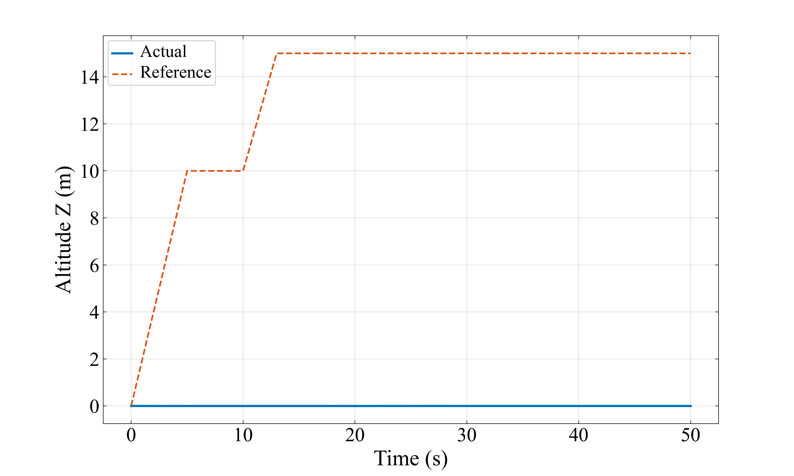

图 7-252　`fixed_awff_l1_residual` ClimbPath 50 s 高度通道（发散）

位置误差在 5 s 后持续单调增长，50 s 达到 10628 m，L1 残差项没有把轨迹拉回参考。


图 7-253　`fixed_awff_l1_residual` ClimbPath 50 s 位置误差时程，终端 10628 m

输入很快撞到约束边界并在错误方向上反复修正，控制平滑性急剧恶化，无法形成有效能量回收。


图 7-254　`fixed_awff_l1_residual` ClimbPath 50 s 控制输入时程

三维轨迹在早期爬升后脱离参考并快速远离，显示残差补偿没有恢复 AWFF 的闭环方向。

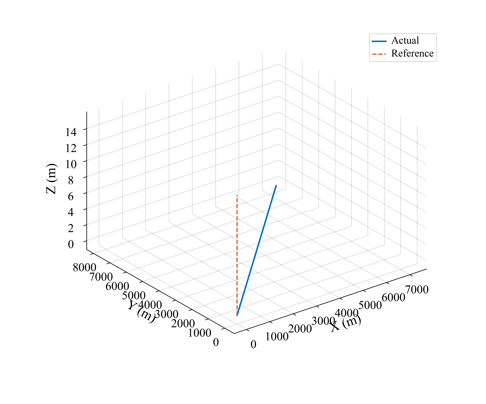

图 7-255　`fixed_awff_l1_residual` ClimbPath 50 s 三维轨迹（发散）

速度分量从数秒后持续增大，末段没有回落平台，位置误差的 10628 m 终值由该速度积累直接造成。

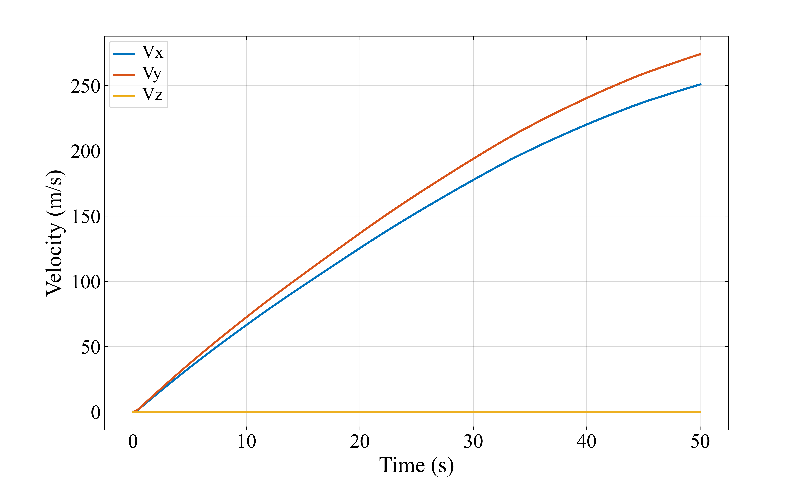

图 7-256　`fixed_awff_l1_residual` ClimbPath 50 s 速度分量时程

姿态角在发散阶段达到大幅偏转并触及倾角约束，表明残差补偿失败同时破坏了姿态安全裕度。


图 7-257　`fixed_awff_l1_residual` ClimbPath 50 s 姿态角时程

**fixed_qp_nmpc_l1_indi_cbf (QP-NMPC-L1-INDI-CBF，扩展边界响应图集)**
位置 RMSE 5647 m、终端位置误差 12455 m，该扩展图集完整呈现其边界响应。QP 约束非线性 MPC + L1 + INDI + CBF 安全过滤的多层嵌套组合，在本标称工况下约束不可行性导致指令饱和并开环漂移。

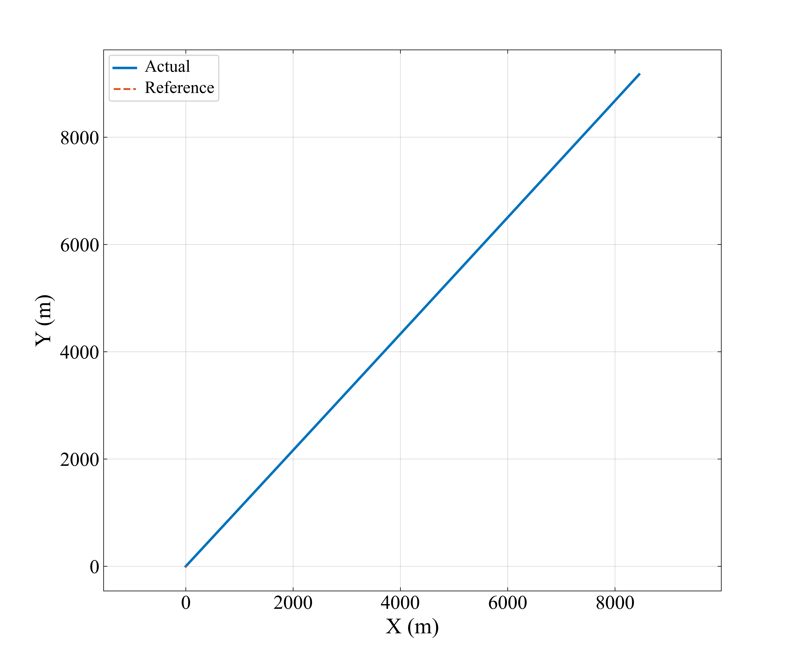

图 7-258　`fixed_qp_nmpc_l1_indi_cbf` ClimbPath 50 s 水平面轨迹，RMSE 5647 m（发散）

QP-NMPC-L1-INDI-CBF 在约 4.58 s 首次超过 100 m 位置误差，约束不可行性在早期爬升后迅速放大。


图 7-259　`fixed_qp_nmpc_l1_indi_cbf` ClimbPath 50 s 高度通道（发散）

位置误差越过 1000 m 后持续增长，50 s 终端达到 12455 m，多层约束链没有重新获得可行控制解。


图 7-260　`fixed_qp_nmpc_l1_indi_cbf` ClimbPath 50 s 位置误差时程，终端 12455 m

QP、L1、INDI 与 CBF 叠加后输入迅速进入限幅并反复切换，控制能量被约束冲突消耗而未能回收误差。


图 7-261　`fixed_qp_nmpc_l1_indi_cbf` ClimbPath 50 s 控制输入时程

三维轨迹在初始爬升后即脱离参考，随后沿受限指令方向快速漂移，安全过滤没有形成有效闭环路径。


图 7-262　`fixed_qp_nmpc_l1_indi_cbf` ClimbPath 50 s 三维轨迹（发散）

速度各轴在数秒后持续增大并在末段保持高幅值，位置误差的无界增长由该速度积累直接驱动。

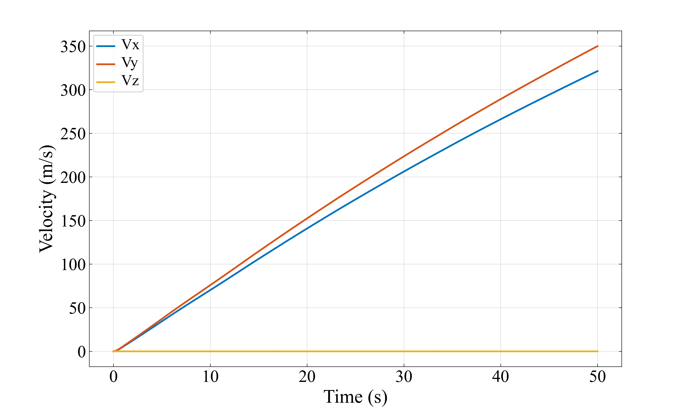

图 7-263　`fixed_qp_nmpc_l1_indi_cbf` ClimbPath 50 s 速度分量时程

姿态角快速扩大并触及倾角约束，姿态层的失真与 QP 可行域塌缩同时出现，最终形成全机发散。

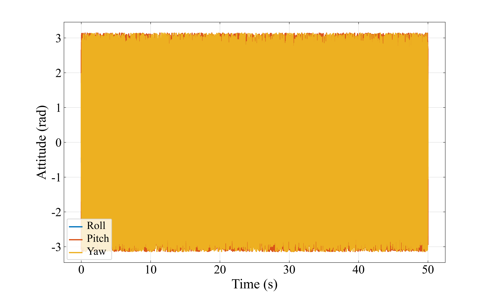

图 7-264　`fixed_qp_nmpc_l1_indi_cbf` ClimbPath 50 s 姿态角时程

**official_pid_yaw_authority_mapped**
位置 RMSE 0.339 m、终端误差 0.054 m。相对 `official_pid` 的 0.173 m 与 0.007 m，两项均有抬升，差异来自偏航通道控制权限的重新映射。该条与 §7.4.1 的 `official_pid` 构成同一控制律在不同权限分配下的对照，其姿态角图的偏航分量是差异的直接来源。


图 7-265　`official_pid_yaw_authority_mapped` ClimbPath 50 s 水平面轨迹跟踪，位置 RMSE 0.339 m

偏航权限重新映射后，爬升段高度响应仍平稳，Z 通道没有持续超调，差异主要留在水平转向。


图 7-266　`official_pid_yaw_authority_mapped` ClimbPath 50 s 高度通道跟踪

位置误差峰值集中在转向和偏航权限切换处，随后收敛但终端保留 0.054 m，略高于原始 Official PID。


图 7-267　`official_pid_yaw_authority_mapped` ClimbPath 50 s 位置误差时程，终端误差 0.054 m

控制输入仍以连续 PID 分配为主，但偏航重映射使转向时的四路能量分配不再完全对称。


图 7-268　`official_pid_yaw_authority_mapped` ClimbPath 50 s 控制输入时程

三维轨迹保持参考的整体形状，主要空间差异出现在水平转弯，而垂向爬升仍与目标一致。


图 7-269　`official_pid_yaw_authority_mapped` ClimbPath 50 s 三维轨迹

速度三轴在转向段出现有限峰值，水平轴回落略慢于原始 Official PID，Vz 通道基本不受影响。


图 7-270　`official_pid_yaw_authority_mapped` ClimbPath 50 s 速度分量时程

姿态角的偏航分量幅值和过渡时间均有所增加，滚转/俯仰仍平滑，正好对应 RMSE 上升到 0.339 m。


图 7-271　`official_pid_yaw_authority_mapped` ClimbPath 50 s 姿态角时程

本章的图集给出一个跨族的共同结论：在同一被控对象与同一标称参考下，控制精度的族间差距（线性族 0.090 m 至滑模族 2.705 m，相差一个半量级）远大于同族内不同变体之间的差距，MPC 族五条的族内极差仅 0.024 m 即为极端例子。这说明本平台各族的实现都已进入其方法本身的性能区间，族间排序反映的是方法与该机体参数的适配程度。同时，两组数值完全重合的条目（`feedback_linearization` 与 `passivity_based_control`）与两组接口边界不同而精度一致的条目（`dfbc_high_order` 及其 `_body_rate` 变体）说明，标称工况的分辨能力有上限，方法间的实质差异需由第九章的扰动条件给出。

## 八、px4ctrl 图形化设计与 MWORKS 全机验证

第七章的冻结历史图集覆盖 46 条既有控制器中的 28 条达标条目；当前固定目录对账则为 30/48 通过、18/48 完成失败、0/48 未运行。历史图集的标称分辨力存在上限，方法间的实质差异需要扰动条件才能分辨。在此基础上，本章转向自研控制器 px4ctrl 的图形化设计与全机闭环验证——它是本项目从”多族控制器可用”推进到”自研控制器经深度验证后可导出部署”的核心环节。
px4ctrl 是本团队基于 MWORKS.Sysblock 自主设计并实现的图形化位姿控制器。其位置/速度外环参考 PX4 开源飞控的工程思路，在 MWORKS 中以图形化建模，经 EquationBridge 接入姿态环、角速度环与控制分配，形成可审查的整机闭环。相比 Official PID 基线，px4ctrl 的改进在于：

(1) 显式加速度前馈通道（\(\mathbf a_r\) 直接进入期望加速度），使跟踪快变参考时无需等待误差积累。

(2) 三轴独立反馈通道（\(K_p=K_v=1.5\) 分别作用于 x、y、z），并通过偏航投影将水平期望加速度映射为滚转/俯仰指令。

(3) 重力补偿显式化（\(+g\) 项），避免垂向通道的稳态积分负担。这些改进的性能效果将在第九章七场景对比中定量呈现。

表 8-1　Official PID 基线与团队自研 px4ctrl 的外环设计对照

| 对比维度 | Official PID 基线 | 团队自研 px4ctrl | 对闭环行为的直接含义 |
| --- | --- | --- | --- |
| 参考加速度进入方式 | 横向外环由位置、速度误差形成加速度指令 | \(\mathbf a_c=\mathbf a_r+K_p\mathbf e_p+K_v\mathbf e_v\)，显式注入参考加速度 | 快变轨迹的加速度需求可在误差累积前进入外环 |
| 垂向重力处理 | 垂向 PID 由比例、积分、微分项形成推力参考 | \(\mathbf a_d=\mathbf a_c+[0,0,g]^T\)，再由 \(T_c=ma_{d,z}\) 形成总推力 | 重力项与轨迹加速度在同一物理量纲下显式处理 |
| 三轴与姿态指令构造 | 水平 PD 经固定比例缩放为滚转、俯仰参考，垂向单列 PID | xyz 三轴独立反馈通道，均取 \(K_p=K_v=1.5\)，并按偏航角将期望加速度投影为滚转、俯仰命令 | 位置/速度误差、偏航和姿态命令之间的关系可逐级审查 |
| 整机实现链 | 原生连续 `RotorCommandRunner` 与旋翼级混控边界 | 100 Hz 图形外环经 EquationBridge 接入共享姿态环、角速度环与控制分配 | 两条路线在同一 Plant、Profile 与指标框架下可进行同条件比较 |

该表给出的是当前实现的结构差异，不以结构差异本身代替性能结论。其对应的定量结果在第九章以冻结 Profile、原始 `Result.msr` 和指标文件共同给出。

图形类为`MoSimQuadrotorModel.Control.Implementations.Sysblocks.PX4CTRL_Original_OuterLoop_Graphical_Sysblock`，采样时间为 0.01 s，输入为位置、速度、加速度、偏航参考/测量，输出为期望加速度、滚转/俯仰/偏航命令、总推力和归一化推力。
该图形模型的关键参数定义直接体现在 Modelica 源码中：

```modelica
SysplorerEmbeddedCoder.MathOperation.Gain Kp_x(k=1.5);
SysplorerEmbeddedCoder.MathOperation.Gain Kv_x(k=1.5);
SysplorerEmbeddedCoder.MathOperation.Gain Kp_y(k=1.5);
SysplorerEmbeddedCoder.MathOperation.Gain Kv_y(k=1.5);
SysplorerEmbeddedCoder.MathOperation.Gain Kp_z(k=1.5);
SysplorerEmbeddedCoder.MathOperation.Gain Kv_z(k=1.5);
SysplorerEmbeddedCoder.Sources.Constant gravity_mps2(k=9.80665);
SysplorerEmbeddedCoder.Sources.Constant mass_kg(k=1.0);
SysplorerEmbeddedCoder.Sources.Constant hover_fraction(k=0.37);
```

三轴增益 \(K_p=K_v=1.5\) 独立作用于 xyz，重力常数和悬停油门比例显式声明。该模型经 MWORKS GenerateModelCode 可直接导出为等价的 C99 代码（见第十三章）。
由位置参考与测量位置得到位置误差，速度误差由位置误差对时间求导得到。

```latex
\[
\begin{aligned}
\mathbf e_p=\mathbf p_r-\mathbf p\\
\mathbf e_v=\dot{\mathbf e}_p=\mathbf v_r-\mathbf v
\end{aligned}
\tag{8-1}
\]
```

由位置、速度误差与参考加速度形成反馈加速度，先得到未补偿重力的期望加速度。

```latex
\[
\mathbf a_{fb}=K_p\mathbf e_p+K_v\mathbf e_v
\tag{8-2}
\]
```

将参考加速度与反馈加速度相加，得到轨迹跟踪所需的总期望加速度。

```latex
\[
\mathbf a_c=\mathbf a_r+\mathbf a_{fb}
\tag{8-3}
\]
```

在 ENU 世界系中加入重力补偿向量，得到进入姿态解耦的期望加速度。

```latex
\[
\mathbf a_d=\mathbf a_c+\begin{bmatrix}0\\0\\g\end{bmatrix}
\tag{8-4}
\]
```

图形 Sysblock 的三轴位置/速度外环沿用式（8-1）至式（8-4）；将式（8-2）至式（8-4）依次组合即可得到进入姿态解耦的总期望加速度，正文沿用前式表达。
为说明水平加速度到姿态命令的来源，在偏航角 \(\psi\) 已知、滚转/俯仰处于小角度工作域且总推力接近悬停工作点时，水平期望加速度可作局部线性化：

```latex
\[
\begin{bmatrix}a_{d,x}\\a_{d,y}\end{bmatrix}
\approx
g\begin{bmatrix}
\sin\psi & \cos\psi\\
-\cos\psi & \sin\psi
\end{bmatrix}
\begin{bmatrix}\phi_c\\\theta_c\end{bmatrix}.
\tag{8-5a}
\]
```

该二维旋转矩阵可逆，因此

```latex
\[
\begin{bmatrix}\phi_c\\\theta_c\end{bmatrix}
=
\frac{1}{g}
\begin{bmatrix}
\sin\psi & -\cos\psi\\
\cos\psi & \sin\psi
\end{bmatrix}
\begin{bmatrix}a_{d,x}\\a_{d,y}\end{bmatrix}.
\tag{8-5b}
\]
```

展开式（8-5b）即得到式（8-5）。因此，式（8-5）是当前图形外环采用的局部小倾角加速度投影，而非任意大姿态下的完整非线性逆解。
由偏航测量角 \(\psi\) 构造水平加速度到滚转/俯仰的解耦投影，再将水平加速度除以重力得到姿态命令。

```latex
\[
\begin{aligned}
\phi_c=\frac{a_{d,x}\sin\psi-a_{d,y}\cos\psi}{g}\\
\theta_c=\frac{a_{d,x}\cos\psi+a_{d,y}\sin\psi}{g}\\
\psi_c=\psi_r
\end{aligned}
\tag{8-5}
\]
```

按测得偏航角投影到滚转/俯仰指令时，当前图形连线对应式（8-5），其中偏航参考直接沿用参考航向。
垂向分量按式（8-6）直接转换为总推力，质量参数把加速度量纲映射到力，归一化推力由 EquationBridge 接口传递。

```latex
\[
T_c=m a_{d,z}
\tag{8-6}
\]
```

垂向通道先形成垂向期望加速度，再经当前质量、重力和悬停归一化比例形成总推力；图形模块还保留其归一化推力输出，供 EquationBridge 与共享内环使用。当前图形外环不单独设置姿态或总推力饱和；适配器负责姿态变换的定义域保护，共享姿态/角速度分配链负责后续速率约束。因此，本节公式说明的是控制律与实现映射，不把它表述为全飞行包线可行性证明。`Px4CtrlAttitudeThrustAdapter` 明确采用`roll_mea = -attitude_mea[1]`，因此不得把外部 PX4 的 NED/FRD 符号直接代入这里的 ENU/FLU 公式。
上述外环在 Modelica 侧的图形模型结构如图 8-1 所示（2026-07-31 当前源原生窗口捕获），清晰展示了位置误差→加速度期望→姿态指令的信号通路与各子模块连接关系。


图 8-1　`px4ctrl` 图形位置/速度外环模型结构

技术路线总览如下图所示，px4ctrl 定位于位置/速度外环，通过统一接口接入公共姿态环、角速度环与控制分配，与其他 47 条控制器共享同一套 Plant 和执行器模型。

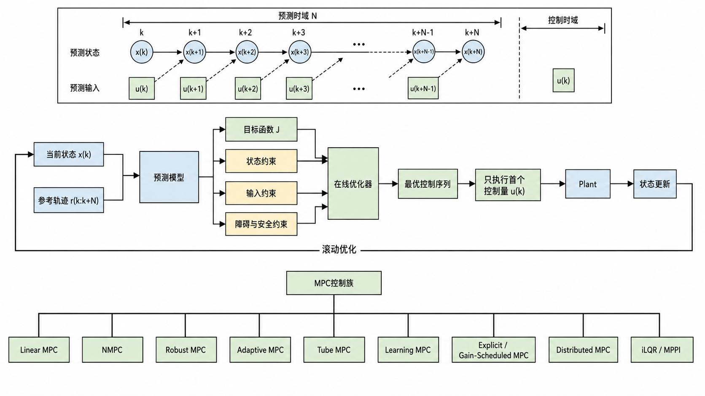

图 8-2　控制算法家族技术路线总览，px4ctrl 在位置/速度外环的定位

## 九、Official PID 与 px4ctrl 七场景对比与灵敏度验证

单一标称工况（ClimbPath 50 s）仅能反映控制器的名义跟踪能力。本章进一步从两个维度验证控制器的工程鲁棒性：

(1) 七场景考核——在悬停、阶跃响应、八字轨迹、螺旋上升、风扰、参数失配和电机效率故障 7 种典型工况下对比两种代表控制器的表现。

(2) 灵敏度扫描——量化误差随扰动强度的变化趋势，揭示各控制器的鲁棒性边界。

### 9.1 七场景核心对比

下图展示故障参数从 Profile 进入 Plant/执行器、再由控制器闭环响应的完整链路，体现了本平台将故障注入与控制评估集成在同一仿真框架内的工程能力。

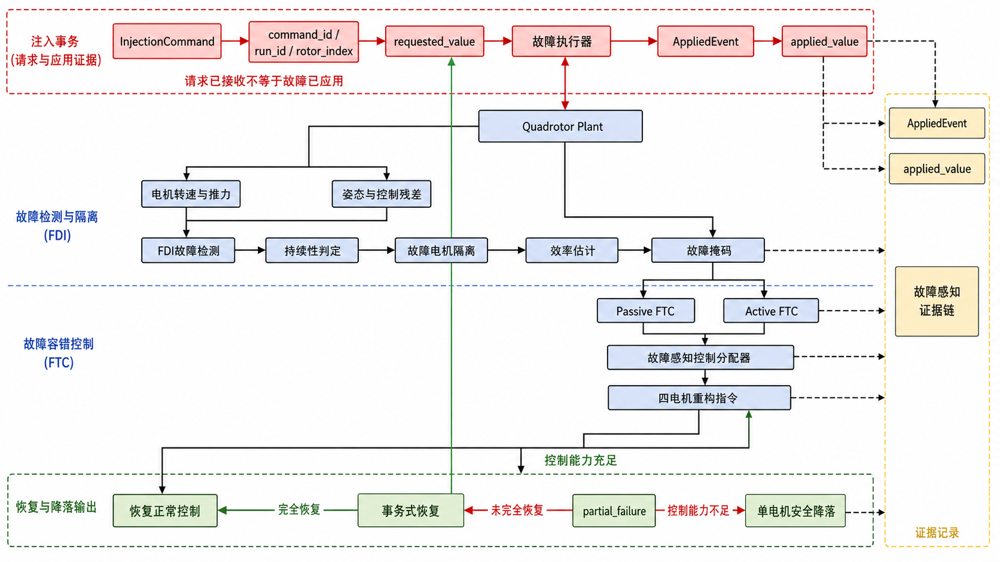

图 9-1　故障注入与 FTC 闭环链路

数据源为`Results/control_platform/seven_scenario_ab_v2/SCENARIO_RMSE_MATRIX.pending_syslab.json`及各 `metrics/METRICS.json`。数值为记录中直接给出的指标；无效记录的诊断值不参与通过结论。
两控制器在七场景下的逐项指标如表 9-1 所示。六个有效场景并非由同一控制器全面占优：px4ctrl 在 Figure8、Spiral、Step response 和 Wind disturbance 四个场景的 RMSE 更低，Official PID 在 Hover（0.009455 m 对 0.043138 m）和 Parameter mismatch（0.103908 m 对 1.225758 m）更低。px4ctrl 最清晰的相对差异出现在阶跃响应，约 3.83 s 进入稳态带，而 Official PID 在 45 s 观察窗内仍未完成调节；该差异与第八章所述“参考加速度前馈、显式重力补偿和三轴独立反馈通道”的组合设计相一致。当前对照比较的是两条完整控制路线，未逐项关闭组成模块，因此不将任一单项表述为独立因果增益。参数失配场景反过来提醒我们，名义工况下的前馈优势不能替代对模型不确定性的整定。

表 9-1　Official PID 与 px4ctrl 在七场景下的指标对比

| 场景                   | 控制器       | 状态              | 位置 RMSE (m) | 终端误差 (m) | 最大超调 (%) |       控制能量 |
| ---------------------- | ------------ | ----------------- | ------------: | -----------: | -----------: | -------------: |
| Figure8                | Official PID | valid             |      0.305308 |     0.245238 |  2482.872681 |  840048.039980 |
| Hover                  | Official PID | valid             |      0.009455 |     0.001097 |     2.800523 |  587634.574646 |
| Motor efficiency fault | Official PID | invalid           |           N/A |          N/A |          N/A |            N/A |
| Parameter mismatch     | Official PID | valid             |      0.103908 |     0.094232 |    64.939137 | 1007975.079383 |
| Spiral                 | Official PID | valid             |      0.101711 |     0.094345 |    65.002391 |  839919.862639 |
| Step response          | Official PID | valid             |      0.283197 |     1.466162 |   137.485976 |  767453.520989 |
| Wind disturbance       | Official PID | valid             |      0.336491 |     0.313547 |  2277.554503 |  840246.191360 |
| Figure8                | px4ctrl      | valid             |      0.081432 |     0.041230 |  2282.518869 |  838053.890453 |
| Hover                  | px4ctrl      | valid             |      0.043138 |     0.001076 |     8.370405 |  587075.326820 |
| Motor efficiency fault | px4ctrl      | invalid（诊断值） |      1.693016 |    15.659533 |   544.124375 |  395119.176724 |
| Parameter mismatch     | px4ctrl      | valid             |      1.225758 |     1.238806 |    53.399421 | 1004813.690197 |
| Spiral                 | px4ctrl      | valid             |      0.032332 |     0.012800 |    53.330813 |  836698.177238 |
| Step response          | px4ctrl      | valid             |      0.198907 |     0.006300 |     9.238766 |  754934.872925 |
| Wind disturbance       | px4ctrl      | valid             |      0.161320 |     0.142482 |  2083.348139 |  838270.980101 |
Official PID 的 Spiral 主记录为`official_pid/spiral/RUN_RECORD.json`。本章选取 Official PID 与 px4ctrl 两条代表控制器进行深度对比，展示从经典 PID 到改进外环的性能提升。

在阶跃、风扰和 Figure8 三类代表性任务中，px4ctrl 的位置 RMSE 分别为 0.198907 m、0.161320 m 和 0.081432 m；相对 Official PID 对应记录，降幅分别为 29.8%、52.1% 和 73.3%。其中，阶跃后的快速进入调节带最直观地体现了图形外环对快变参考的响应能力。不同任务条件下的完整指标与适用范围见表 9-1。

六个有效场景的位置误差逐场景对比如下，生成脚本`Scripts/syslab/plot_chapter11_typlot.jl`，图件清单与统计范围注记见`Docs/报告/figures/第11章/TYPLOT_CHAPTER11_MANIFEST.json`。电机效率下降场景不在本组出图：Official PID 无主 `raw/result.csv`（`result_data_status=missing`），px4ctrl 仅 1707 行（17.07 s 提前终止，终端误差 15.66 m），两侧均不足以构成同轴对比，该场景由 §9.3 灵敏度的 motor 组承载。


图 9-2　悬停场景各控制器位置误差时程对比

悬停段两种控制器的误差都快速压低并维持在小幅范围，px4ctrl 的 0.043 m RMSE 与 Official PID 的 0.009 m 均没有持续漂移。


图 9-3　阶跃响应场景各控制器位置误差时程对比

在 15 s 阶跃后，Official PID 的误差峰值和长尾明显存在，而 px4ctrl 约 3.83 s 进入调节带，前馈外环的收敛优势在此处最清楚。


图 9-4　八字轨迹场景各控制器位置误差时程对比

八字轨迹的曲率变化使两条曲线出现周期性误差峰，px4ctrl 的 RMSE 0.081 m 明显低于 Official PID 的 0.305 m，说明快速参考下解耦前馈更有效。


图 9-5　螺旋上升场景各控制器位置误差时程对比

螺旋场景中 px4ctrl 将误差压到 0.032 m，Official PID 为 0.102 m；两者均随平滑爬升保持有界，没有八字场景中的高频峰值。


图 9-6　风扰场景各控制器位置误差时程对比

风扰加入后两种控制器都出现更大的瞬态峰值，但 px4ctrl 的 RMSE 0.161 m 仍低于 Official PID 的 0.336 m，扰动恢复段差距持续存在。


图 9-7　参数失配场景各控制器位置误差时程对比

阶跃于 \(t_0=15\,\mathrm s\) 施加，观察至 \(t_{end}=45\,\mathrm s\)。调节时间判据见 §2.4（X/Y 两轴各自幅值 \(\pm5\%\) 带并保持至观察窗末端）。
阶跃响应的逐项指标如表 9-2 所示。这张表两列差距在一个数量级以上，需要连"调节时间"一行一起读：Official PID 在 45 s 观察窗内未进入 \(\pm5\%\) 带，因此它的稳态误差与尾段 RMSE 是未收敛状态下的取值，不是收敛后的稳态精度，两列的这两行不能直接当作同性质的量对比。

表 9-2　阶跃响应场景的超调、调节时间与误差指标

| 指标             |            Official PID |  px4ctrl |
| ---------------- | ----------------------: | -------: |
| X 超调 (%)       |              137.485976 | 9.238766 |
| Y 超调 (%)       |              107.068671 | 7.610099 |
| 最大超调 (%)     |              137.485976 | 9.238766 |
| 调节时间 (s)     | 45 s 观察窗内未调节完成 | 3.830000 |
| 稳态误差 (m)     |                0.290138 | 0.005206 |
| 尾段 RMSE (m)    |                0.597204 | 0.005241 |
| 终端位置误差 (m) |                1.466162 | 0.006300 |

Official PID 的调节时间在记录中为 `NaN`，含义是 X/Y 两轴直到 45 s 仍未同时进入并保持在各自 \(\pm5\%\) 带内，不是数据缺失。其尾段 RMSE 0.597204 m 与稳态误差 0.290138 m 相差一倍以上，说明阶跃后尾段仍在振荡而非停在固定偏置上；px4ctrl 的两个数值均为 0.0052 m 量级且彼此接近，是已收敛的表现。两者相差约两个数量级。数据源为各 `step_response/metrics/METRICS.json`。

### 9.2 px4ctrl 性能结果与 Official PID 基线特征

上表数据展示两条控制路线在不同任务下的响应特征：

(1) 阶跃响应中，Official PID 的 X/Y 横向位置通道采用 \(K_p=1.5\)、\(K_d=1\) 的 PD 反馈，在当前冻结参数下呈现较长的收敛尾段；其 Z 向通道仍保留 \(K_p=8\)、\(K_i=6\)、\(K_d=4\) 的 PID 结构。现有记录证明横向阶跃存在持续振荡和未完成调节，不对其具体由哪一个内部环节单独导致作未经切换验证的归因。

(2) Wind disturbance 场景中 Official PID 的位置 RMSE（0.336491 m）约为 px4ctrl（0.161320 m）的 2.1 倍，扰动恢复段的差距仍然存在。在当前冻结 Profile 下，该结果与图形外环组合设计的快速参考进入和扰动恢复特征相一致。

(3) 电机效率故障场景的两条记录保留为独立诊断资料，不参与本节代表性 A/B 指标比较。综合来看，Official PID 在标称悬停和参数失配记录中呈现良好精度，px4ctrl 则在大阶跃、风扰和连续曲率参考中展现出更突出的动态跟踪能力。这一差异正是本项目采用“加速度前馈 + 显式重力补偿 + 三轴独立反馈通道 + 偏航投影”图形外环的工程动机。

### 9.3 灵敏度

灵敏度分析通过系统扫描三类扰动强度（风扰、参数失配、电机效率衰减），量化控制器性能随扰动的退化趋势。24 条已执行网格覆盖了从名义到强扰动的声明测试范围，结果同时保留通过、物理门限失败和执行阻塞。
三组灵敏度网格的结果分布如表 9-3 所示。风扰和参数失配两组 px4ctrl 全部 8 格通过，展示了其在中等扰动下的强鲁棒性；电机效率组条件更为苛刻（单旋翼效率最低降至 50%），仅 1 格通过、3 格物理门限失败、4 格执行阻塞，反映了单旋翼严重退化场景的本质难度。

表 9-3　三组灵敏度网格的通过、门限失败与执行阻塞分布

| 组别     | 计划/记录 | 通过 | 物理门限失败 | 执行阻塞 |
| -------- | --------: | ---: | -----------: | -------: |
| 风扰     |       8/8 |    8 |            0 |        0 |
| 参数失配 |       8/8 |    8 |            0 |        0 |
| 电机效率 |       8/8 |    1 |            3 |        4 |
| 合计     |     24/24 |   17 |            3 |        4 |
该表仅代表已测网格。`sensitivity_wind_v1` 是独立的 8 条风扰通过批次，不被误读为 24 条总账。
三组灵敏度曲线如下，纵轴 `position_rmse_m` 取自各次运行的`metrics/METRICS.json`；`SENSITIVITY_BATCH_MATRIX.csv` 只有 terminal 与maximum 两列，不含 RMSE，故不作为本图数据源。


图 9-8　位置误差对风扰强度的灵敏度曲线

参数失配灵敏度曲线显示质量和惯量倍率增大后误差的变化趋势，重点观察控制器对模型不确定性的退化速度。


图 9-9　位置误差对质量与惯量失配幅度的灵敏度曲线

电机效率灵敏度曲线对应执行器能力逐步下降的场景，曲线中的物理门限失败和执行阻塞共同体现故障强度的边界。


图 9-10　位置误差对电机效率衰减的灵敏度曲线

电机效率图中 Official PID 的 4 个工作点均为 `failed_execution_solver_stall`（求解器在 86% 进度处停滞），图内以显式标注呈现。这一现象从侧面印证了经典 PID 在严重执行器退化场景下的结构性不足。

## 十、三机编队 Figure8 与 ECBF 安全参考调节

本章展示 MoSim 从单机位姿控制走向多机协同任务的能力递进。三架无人机在统一 Plant、统一控制接口和固定三角队形参考下完成 50 s Figure8 全机仿真，建立了多机模型实例、队形参考生成、控制器接入和结果回放的完整工程链路。在此基础上，项目进一步接入 ECBF 安全参考调节层，为紧凑编队和主动安全约束任务预留可扩展接口。

### 10.1 三机 Figure8 编队（工程完成）

下图展示三机固定三角队形沿 Figure8 参考轨迹的编队飞行场景。三架四旋翼各自运行独立的控制器实例，通过编队参考生成器保持固定队形偏移，整体沿共同参考轨迹运动。

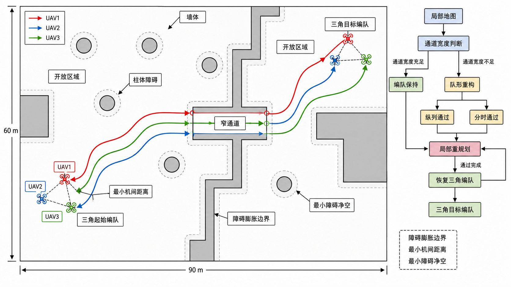

图 10-1　三机编队 Figure8 场景与规划轨迹示意

`Results/control_platform/px4ctrl_three_uav_figure8_v1/RUN_RECORD.json` 对应正式模型 `MoSimQuadrotorModel.Experiment.Runners.Formation.Px4CtrlThreeUavFigure8Runner`。
该记录的五项指标如表 10-1 所示。队形误差 RMSE 达到 \(10^{-13}\) m 量级，表明固定三角队形参考在三机模型间保持一致；单机位置 RMSE 与终端位置误差则反映各机沿共同 Figure8 参考运行的结果。

表 10-1　三机 Figure8 编队记录的时长与误差指标

| 指标              |          数值 |
| ----------------- | ------------: |
| 仿真时长 / 样本数 | 50.0 s / 5001 |
| 单机位置 RMSE     |    0.081432 m |
| 单机终端位置误差  |    0.041230 m |
| 队形误差 RMSE     |  2.2855e-13 m |
| 最小机间距        |    2.078461 m |

该记录完成了固定三角队形的离线参考接入、三套全机控制回路联动和原生结果回放。队形参考由上层统一生成，后续可在同一多机模型框架中继续叠加分布式规划、紧凑队形与安全参考调节等任务层能力。


图 10-2　三机编队水平面轨迹

XY 轨迹图先验证三架无人机是否沿同一 Figure8 参考路径推进，再结合后续队形误差和机间距离图判断编队保持质量。


图 10-3　三机编队队形保持误差时程

队形误差时程接近数值零，说明本记录中的三角队形由离线参考直接给定，不能把该曲线当作在线编队求解性能。


图 10-4　三机编队机间距离时程

### 10.2 三机 ECBF 安全参考调节

安全监督器图重点看参考调节、约束激活和降级处置的反馈路径；本节展示已经接入的参考调节器及其连续运行观测。

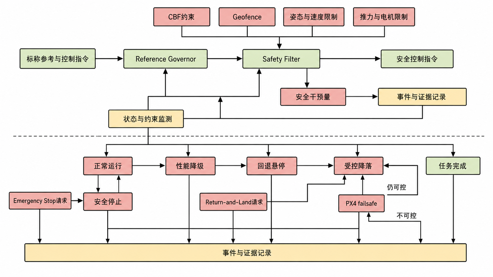

图 10-5　安全监督器与降级处置流程

`Results/planning/three_uav_openblocks_px4ctrl_ecbf_safety_20260731/metrics/mworks_px4ctrl_ecbf_safety_full_304p84s.json` 记录了 304.84 s、306 个样本，全程无 NaN/Inf。表 10-2 汇总该安全参考调节层与三机模型联动时的主要运行观测：
当前实现是 `ThreeUavPairwiseEcbfReferenceSafetyFilter` 的两轮顺序投影参考调节器，不是一个未落地的通用 CBF-QP 占位式。对任意机对，源码中的 ECBF 所需径向加速度由式（10-1）给出：

```latex
\[
\mathbf r_{ij}=\mathbf p_i-\mathbf p_j,\qquad
\mathbf v_{ij}=\mathbf v_i-\mathbf v_j,\\
a_{ij,req}=-\lVert\mathbf v_{ij}\rVert_2^2
-2\lambda\mathbf r_{ij}^T\mathbf v_{ij}
-\frac{\lambda^2}{2}\left(
\lVert\mathbf r_{ij}\rVert_2^2-d_{act}^2\right),
\tag{10-1}
\]
```

相对加速度还需满足 ECBF 约束

```latex
\[
\mathbf r_{ij}^T\left(
\mathbf a_{i}^{safe}-\mathbf a_{j}^{safe}\right)
\ge a_{ij,req},\qquad
\mathbf a_i^{safe}=\mathbf a_i^{nom}+\Delta\mathbf a_i .
\tag{10-2}
\]
```

参考修正同时保持速度/位置一致：

```latex
\[
\mathbf p_i^{safe}=\mathbf p_i^{nom}+\Delta\mathbf p_i,\qquad
\mathbf v_i^{safe}=\mathbf v_i^{nom}+
\frac{\Delta\mathbf p_i}{t_{lookahead}},\qquad
\lVert\Delta\mathbf p_i\rVert_2\le0.5\,\mathrm m,
\quad\lVert\Delta\mathbf a_i\rVert_2\le1.5\,\mathrm{m/s^2}.
\tag{10-3}
\]
```

这里 \(d_{act}=1.5\,\mathrm m\) 是参考调节的预测激活距离。这些公式对应已实现的安全参考滤波逻辑；在当前标称 Figure8 队形下，三机保持既定几何分离，安全层以非侵入方式运行，并为后续紧凑编队与主动安全调节任务提供接口基线。

表 10-2　三机 ECBF 安全参考调节运行观测

| 数据项 | 实测记录 |
| --- | --- |
| 仿真时长 / 样本数 | 304.84 s / 306 |
| NaN / Inf 样本数 | 0 |
| 最小实际机间距 | 1.522497 m |
| 最大参考位置偏移 | 0.269613 m |
| 安全激活机对最大数量 | 0 |
| 安全参考调节非零样本数 | 56 |
| uav1 / uav2 / uav3 跟踪 RMSE | 0.292581 / 2229.638801 / 0.198782 m |
| uav2 终端跟踪误差 | 14471.302752 m |
| 队形距离误差 RMSE / 最大值 | 1486.313426 / 9647.313365 m |
| clearance proxy 最小值 | −14470.854430 m |

在标称 Figure8 队形下，三机保持既定安全间距，安全激活机对数为 0，说明安全参考层在无冲突任务中保持非侵入式运行。参考调节输出保持有界，相关跟踪、队形与 clearance proxy 统计如表 10-2 所示；这些量作为当前多机模型、参考调节和结果记录之间的运行基线，支撑后续紧凑编队与主动安全调节任务。


图 10-6　三机 ECBF 运行中的机间距离与安全半径

机间距离图记录标称队形中的几何分离过程，并为后续紧凑编队任务提供参考。


图 10-7　ECBF 施加的参考位置修正量时程

参考位置修正量图记录了调节器实际输出的偏移幅值，非零样本说明参考层发生过动作，但不等于安全约束门已被激活。


图 10-8　三机 ECBF 运行中的跟踪误差时程

参考修正量图分上下两栏，以区分安全激活统计和参考调节输出。按安全激活统计时，`safety_active_pair_count` 全程为 0；参考调节器的逐点偏移范数定义为

```latex
\[
\delta r=\lVert\mathbf r^{safe}-\mathbf r^{nom}\rVert_2.
\tag{10-4}
\]
```

该量在 306 个样本中有 56 个非零值，最大为 0.2676 m；图 10-7 据此呈现参考层输出的时程特征。

### 10.3 多机协同任务小结

当前完成的成果包括固定三角队形 Figure8 全机运行，以及 ECBF 安全参考调节层与三机闭环模型的工程接入和连续运行。三机编队、规划参考和安全参考调节共同构成平台由单机控制走向协同任务的基础，并为下一阶段的紧凑队形、主动约束与在线任务生成提供统一承载框架。

## 十一、感知与规划组件原理

后续章节中的避障验证（§12 MWORKS 内 OpenBlocks 避障）和运行时部署（§14 Gazebo 闭环）均依赖感知定位与路径规划组件。本章先行介绍这些组件的数学原理，为后续结果提供算法背景。三个模块属于定位、规划和运行时支撑层，不属于 48 个 MWORKS 控制器本身。

### 11.1 FAST-LIO 状态估计

FAST-LIO 使用迭代误差状态卡尔曼滤波，为运行时环境中的四旋翼提供实时位姿估计。其状态向量为

```latex
\[
\mathbf x=(\mathbf p,R,R_{LI},\mathbf t_{LI},\mathbf v,
\mathbf b_g,\mathbf b_a,\mathbf g),
\tag{11-1}
\]
```

其中 \(R_{LI},\mathbf t_{LI}\) 是雷达到 IMU 外参。IMU 传播的主干为

```latex
\[
\dot{\mathbf p}=\mathbf v,\qquad
\dot R=R[\boldsymbol\omega_m-\mathbf b_g]_\times,\qquad
\dot{\mathbf v}=R(\mathbf a_m-\mathbf b_a)+\mathbf g .
\tag{11-2}
\]
```

LiDAR 点到局部平面的残差和迭代更新为

```latex
\[
r_i=\mathbf n_i^T\!\left(
R(R_{LI}\mathbf p_i+\mathbf t_{LI})+\mathbf p-\mathbf q_i\right),\qquad
\mathbf x^{+}=\mathbf x\boxplus K\bigl(\mathbf r-h(\mathbf x)\bigr).
\tag{11-3}
\]
```

其中 \(r_i\) 为点到平面残差，最后一式代表迭代 EKF 更新；代码锚点为 `src/perception/fast_lio/src/laserMapping.cpp` 与 `include/use-ikfom.hpp`。当前架构中 FAST-LIO 经外部视觉输入到 PX4 EKF，px4ctrl 消费 MAVROS 融合局部状态。
本节公式说明 FAST-LIO 的算法结构和接口位置，不把原始 `/Odometry` 直接升级为控制器输入；当前运行链路仍以 §14.1 的对齐、融合和 20 Hz/100 Hz 频率边界为准。

### 11.2 FUEL 自主探索规划器

FUEL 规划器生成覆盖未知空间的探索轨迹，规划结果表示为 B-spline：

```latex
\[
\mathbf p(t)=\sum_i\mathbf q_iB_{i,q}(t),\qquad
J_{FUEL}=\lambda_sJ_{smooth}+\lambda_dJ_{distance}+
\lambda_fJ_{feasibility}+\lambda_vJ_{view}+\lambda_tJ_{time}.
\tag{11-4}
\]
```

其中可行性代价对 B-spline 控制点 \(\mathbf q_i\) 施加逐轴越界平方惩罚：

```latex
\[
\mathbf v_i=\frac{\mathbf q_{i+1}-\mathbf q_i}{\Delta t},\qquad
\mathbf a_i=\frac{\mathbf q_{i+2}-2\mathbf q_{i+1}+\mathbf q_i}{\Delta t^2},
\tag{11-5}
\]
```

将各控制点的速度和加速度越界量累加为可行性代价

```latex
\[
J_{feasibility}=
\sum_{i,k}\left[\left(|v_{i,k}|-v_{max}\right)_+^2+
\left(|a_{i,k}|-a_{max}\right)_+^2\right].
\tag{11-6}
\]
```

代码锚点为 `src/planning/fuel/fuel_planner/bspline_opt/src/bspline_optimizer.cpp`，包含 `SMOOTHNESS`、`DISTANCE`、`FEASIBILITY`、`VIEWCONS` 与 `MINTIME` 代价项。
这些式子描述 FUEL 的规划目标和可行性代价；当前 C99 运行时的 `diff_single_avoid` 记录仍有 FUEL 未发布轨迹指令的阻塞证据，不能仅凭公式或 RViz 图宣称在线探索已经通过。


图 11-1　FUEL 自主探索任务的体素栅格与运动轨迹

### 11.3 Diff-Planner 局部轨迹优化

Diff-Planner 使用 L-BFGS 软惩罚优化器生成局部安全轨迹，总代价结构为

```latex
\[
J_{Diff}=J_{smooth}+\Phi_{obs}+\Phi_{swarm}+
\Phi_{feas}+J_{qvar}+J_{time} .
\tag{11-7}
\]
```

其机间椭球距离和对应的三次惩罚为

```latex
\[
\begin{aligned}
d_{ij,ell}^2&=\frac{(z_i-z_j)^2}{2^2}+
\frac{(x_i-x_j)^2+(y_i-y_j)^2}{1^2},\\
\Phi_{swarm}&=\sum_{j\ne i}w_s
\left[D_{ij}^2-d_{ij,ell}^2\right]_+^3,\\
D_{ij}&=1.5\,(d_{swarm}+d_{j,des}),\\
\Phi_{feas}&\supset
\left[\lVert\cdot\rVert_2^2-\mathrm{limit}^2\right]_+^3,\\
D_{check}&=1.25\,(d_{swarm}+d_{j,des}).
\end{aligned}
\tag{11-8}
\]
```

式（11-8）同时给出机间椭球距离、群体间距惩罚、速度/加速度/jerk 的可行性惩罚形式和后验检查净距；不满足净距时继续优化或拒绝轨迹。代码锚点为 `References/Lab/planning_local/Diff-Planner/src/diff_planner/traj_opt/src/poly_traj_optimizer.cpp`。
该公式段用于解释 Diff-Planner 的源算法和安全代价；当前运行时规划记录的 `planner_launch_gate`/`EGO_SINGLE_METRICS` 仍是阻塞或未完成状态，因此第十四章只把相关图片作为显示/规划上下文，不把它们写成 C99 在线避障验收。

## 十二、OpenBlocks 障碍地图规划与多机执行

前两章的参考轨迹由解析式给出；真实任务中的参考则来自地图与规划器，并受障碍分布约束。本章围绕程序化生成的 OpenBlocks 障碍地图，建立地图、路径规划、冻结参考、单机/三机控制器和结果回放之间的工程闭合，展示 MoSim 将规划参考组织到全机模型执行链中的能力。
障碍地图为 `Config/planners/astar_min_snap/map_open_blocks.yaml`，路径由 A\* 搜索加 min-snap 平滑得到，参考轨迹在仿真前冻结。当前章节保留一条 PX4CTRL 记录与一条 Linear-MPC 对比记录，用于呈现同一地图任务下的单机与三机执行过程。
规划链路图展示单机与三机规划请求如何形成参考轨迹，并经统一控制器接口进入全机模型。

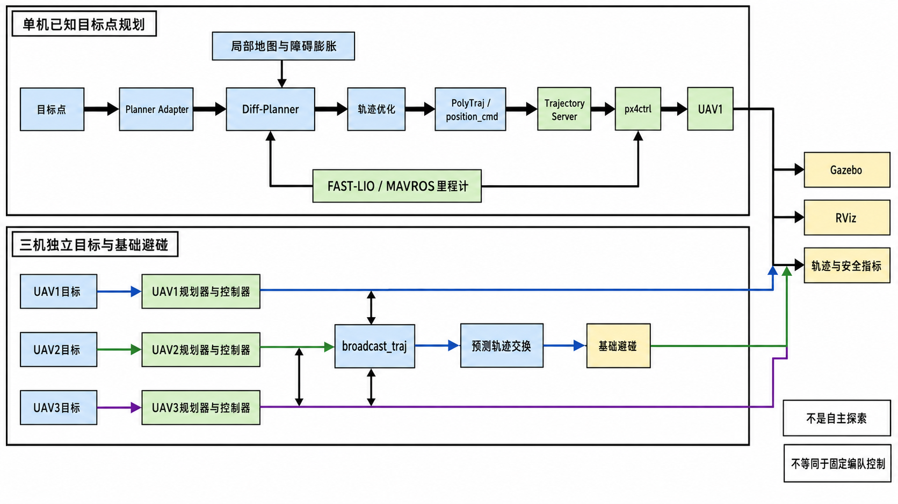

图 12-1　DiffPlanner 单机与三机规划链路

下图展示 FAST-LIO 状态估计、路径规划和控制之间的接口分层，体现了本平台从仿真到感知-规划-控制全栈的扩展架构。

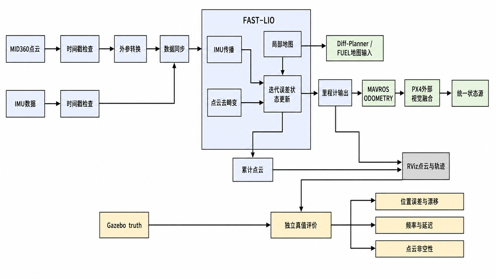

图 12-2　FAST-LIO 定位精度与规划部署边界

地图共 7118 个障碍体：16 个墙体盒（由 8 个 L/T 形模板展开）与 7102 根随机柱（随机种子 20260518，1000 个簇，每簇 4 至 10 根）。展开由`Scripts/planning/export_openblocks_obstacles.py` 程序化完成，落盘为`Results/planning/_openblocks_obstacles.json`，供绘图与几何核对共用同一份来源。图件生成脚本为 `Scripts/syslab/plot_extension_openblocks_typlot.jl`，清单见`Docs/报告/figures/拓展任务/TYPLOT_EXTENSION_MANIFEST.json`。
本章不出 3D 图：地图 xy 跨度 82 m × 52 m，而 z 向仅 2.5 m，比例约 33:1，三维视图中高度通道被压成一条线，信息量低于分栏的 xy 与高度二图。随机柱在 xy 图中以中心点散布绘制，因为柱边长 0.20 m 在 82 m 图宽下不足一个像素。

### 12.1 单机 OpenBlocks 避障

`Results/planning/openblocks_single_uav_px4ctrl_completion_20260730/metrics/openblocks_single_uav_px4ctrl.json`，`evidence_level=mworks_openblocks_px4ctrl_single_uav_full`，仿真时长 80.12 s。
该次冻结路径执行的完整观测如表 12-1 所示。前四行给出跟踪精度，其中位置 RMSE 与 Z 向 RMSE 接近，反映高度通道是当前误差的主要来源；其余行记录飞行高度、倾角和相应样本统计，为后续轨迹与姿态参数优化提供量化依据。

表 12-1　单机 OpenBlocks 场景的跟踪与飞行包线观测

| 指标                                  |                                数值 |
| ------------------------------------- | ----------------------------------: |
| 位置 RMSE                             |                          1.173094 m |
| Z 向 RMSE                             |                          1.134232 m |
| 终端位置误差                          |                          0.117574 m |
| 最大位置误差                          |                          1.856852 m |
| Z 超调                                |                         79.497756 % |
| 最低飞行高度                          |                          0.028118 m |
| 最大倾角                              |             1.214401 rad（69.58°） |
| 高度越界样本数                        |                                  79 |
| 倾角越界样本数                        |                                  83 |
| 约束越界总数                          |                                 162 |
| safety / robustness / tracking / 综合 | 0.0 / 100.0 / 50.094883 / 40.028465 |

冻结路径记录完成了从障碍地图规划参考到 MWORKS 全机执行的连续过程，并形成完整的轨迹与飞行包线数据。位置 RMSE 1.173094 m 中 Z 向占 1.134232 m，说明当前误差主要来自高度通道；最低高度 0.028 m、最大倾角 69.58° 等观测为下一阶段的高度参考整形与姿态裕度优化提供直接依据。


图 12-3　单机在 OpenBlocks 障碍地图中的水平面轨迹

水平面轨迹图展示单机沿冻结路径在 OpenBlocks 地图中的绕障行进过程，并与表 12-1 的高度、倾角和跟踪统计共同构成该任务的执行记录。


图 12-4　单机 OpenBlocks 高度通道跟踪

高度曲线显示总位置误差主要来自 Z 通道，图中的最低高度、超调和姿态相关统计与表 12-1 对应。


图 12-5　单机 OpenBlocks 位置误差时程

### 12.2 三机 OpenBlocks 可重构编队避障

本节并列呈现两条三机记录。历史 `Results/planning/three_uav_openblocks_gray_completion_20260730/metrics/mworks_full_304p84s.json` 使用三套 Linear-MPC 全机回路，306 个样本无 NaN/Inf，最小实际机间距为 1.090834 m，净空下界为 0.094182 m；它为当前地图任务的多机执行提供对比背景。

当前 PX4CTRL 记录位于 `Results/planning/three_uav_openblocks_px4ctrl_completion_20260731/metrics/mworks_px4ctrl_full_304p84s.json`，模型为 `MoSimQuadrotorModel.Guidance.Planning.ThreeUavOpenBlocksReconfigurableFormationPx4Ctrl`，运行 304.84 s、包含 306 个样本且 `nan_or_inf_count=0`。三机按 0 / 12 / 24 s 的延时进入同一条冻结参考，参考层的最小机间距为 1.199085 m（`uav2-uav3`，t=203.3 s）；本节图 12-6 至图 12-9 均来自这条当前 PX4CTRL 记录。

三机各自的跟踪指标如表 12-2 所示。逐列比较可见，uav3 三项均为最优；uav2 的最大跟踪误差与终端误差相对较大，且终端误差 0.922297 m 与自身 RMSE 0.235985 m 的差异反映出误差主要集中在个别时刻。

表 12-2　三机 OpenBlocks 编队各机的跟踪误差指标

| 指标             |     uav1 |     uav2 |     uav3 |
| ---------------- | -------: | -------: | -------: |
| 跟踪 RMSE (m)    | 0.227919 | 0.235985 | 0.172789 |
| 最大跟踪误差 (m) | 1.507017 | 1.636206 | 1.055378 |
| 终端跟踪误差 (m) | 0.105777 | 0.922297 | 0.413569 |

上表按机分列，编队整体的间距与队形指标另如表 12-3 所示。表中的 clearance 下界是规划余量与跟踪误差构成的联合观测量，其定义见式（12-1）。

表 12-3　三机 OpenBlocks 编队的整体间距与队形指标

| 整体指标             |                      数值 |
| -------------------- | ------------------------: |
| 最小实际机间距       |   0.929961 m（t=206.0 s） |
| 队形距离误差 RMSE    |                0.159977 m |
| 最大队形距离误差     |                0.973525 m |
| clearance 下界最小值 | −1.187885 m（t=200.0 s） |

当前 PX4CTRL 记录完成了 304.84 s 的数值运行，并形成三机跟踪、机间距离、队形距离与规划余量的完整统计。0.929961 m 是采样轨迹的机间距离指标；clearance 下界则用于表达规划余量与跟踪误差之间的保守关系。该量定义为

```latex
\[
\underline{c}=\min_i\left(
c_i^{plan}-e_i^{track}\right),
\tag{12-1}
\]
```

即各机规划余量减去其瞬时跟踪误差的最保守估计，规划余量为
\(\{0.4466,\,0.4483,\,0.4459\}\,\mathrm m\)。最小值 −1.187885 m 出现在 t=200 s，对应 uav2 的 1.636206 m 跟踪误差峰值。该量用于记录参考规划余量与实际执行偏差之间的联合关系，不等同于机体到障碍物的直接几何距离。


图 12-6　三机在 OpenBlocks 障碍地图中的水平面轨迹

三机水平轨迹图展示了延时进入同一冻结参考后的路径覆盖范围，首先用于检查三条路线是否保持在规划走廊内。


图 12-7　三机 OpenBlocks 机间距离时程

机间距离曲线用于核对三机之间的几何分离，并与地图轨迹、跟踪误差和 clearance 下界共同呈现编队执行过程。


图 12-8　三机 OpenBlocks 跟踪误差时程

跟踪误差图显示 uav2 的峰值对整体误差统计和 clearance proxy 变化具有主要影响。


图 12-9　三机 OpenBlocks 最小避障间隙及其下界

本章图件对应三条 MWORKS 全机 PX4CTRL 回路对冻结 OpenBlocks 参考的执行记录，构成地图、规划、控制与多机结果回放之间的工程基线。后续可在同一承载框架中接入在线任务生成、环境更新与更紧凑的多机协同工况。

## 十三、px4ctrl C99 代码生成、可移植构建与 SIL 验证

第八至十二章的全部验证均在 MWORKS 仿真环境内完成。本章将经过验证的 px4ctrl 图形模型导出为可独立编译运行的 C99 源码，为下一章的 ROS/Gazebo 运行时部署提供交付物。代码生成本身不改变控制律，只验证导出链路的完整性和编译产物的可构建性。

### 13.1 图形模型到 C 的链路

下图展示图形 Sysblock→C99 生成→编译库→CFunction Runner→整机 SIL 的可复现代码生成交付链，体现了从图形化控制器设计到可构建代码产物的边界；每一步仍需按手册在 MWORKS/目标工具链中人工确认。


图 13-1　从 Sysblock 图形模型到 C99 再到 ROS/Gazebo 的完整部署链路

产物目录为 `src/control/codegen/px4ctrl/`；构建和哈希复核方法见该目录的`README.md`、`CMakeLists.txt`、`codegen_manifest.json` 与哈希脚本。

### 13.2 生成产物与交付

`src/control/codegen/px4ctrl/` 保存 MWORKS GenerateModelCode 的 C99 产物、标量 C ABI 包装、CMake 构建、固定输入测试、哈希清单和哈希校验脚本。目录结构如下：

```
src/control/codegen/px4ctrl/
├── CMakeLists.txt                  # 构建脚本
├── PX4CTRL_..._Graphical_Sysblock.c   # MWORKS 自动生成的控制律核心
├── PX4CTRL_..._Graphical_Sysblock.h   # 外部接口声明
├── mwb_main.c                      # 生成的主入口
├── mwb_types.h                     # 基础类型定义
├── px4ctrl_graphical_generated_shared.c  # 标量 C ABI 包装
├── test_px4ctrl_c.c                # 固定输入回归测试
├── codegen_manifest.json           # 生成时间戳与模型哈希
└── hash_check.sh                   # 源码完整性校验
```

CMake 构建脚本生成静态库、共享库和测试可执行文件：

```cmake
cmake_minimum_required(VERSION 3.16)
project(mosim_px4ctrl_codegen LANGUAGES C)
set(CMAKE_C_STANDARD 99)

add_library(px4ctrl_graphical_generated_static STATIC
  px4ctrl_graphical_generated_shared.c)
add_library(px4ctrl_graphical_generated_shared SHARED
  px4ctrl_graphical_generated_shared.c)

add_executable(test_px4ctrl_c test_px4ctrl_c.c)
target_link_libraries(test_px4ctrl_c PRIVATE
  px4ctrl_graphical_generated_static)

enable_testing()
add_test(NAME px4ctrl_c_fixed_vector COMMAND test_px4ctrl_c)
```

生成代码的主入口函数签名：

```c
/* 由 MWORKS 内核代码生成器自动生成 (2026-07-30) */
#include "PX4CTRL_Original_OuterLoop_Graphical_Sysblock.h"

MwbInt main(void) {
    MwbInt circleNumber = (MwbInt)(50.5);
    Init();                    // 初始化模型状态
    for (int i = 0; i < circleNumber; ++i) {
        Step();                // 单步推进控制律
    }
    return 0;
}
```

构建与测试的完整复现命令：

```bash
cd src/control/codegen/px4ctrl/build-wsl
cmake .. && make
ctest --output-on-failure
```

整机 SIL 证据、生成模型哈希、C 源哈希、求解器设置和数值差异均在 `Results/control_platform/px4ctrl_codegen_sil_v1/` 下保留。

### 13.3 50 s SIL 结果

来源：`Results/control_platform/px4ctrl_codegen_sil_v1/logs/CLOSED_LOOP_SIL_RESULT.json`。
图形模型与生成 C 代码在同一 50 s ClimbPath 下的逐项一致性如表 13-1 所示。等价性的强度由"聚合差异"与"门限"的比值刻画：三项差异均低于门限 5 至 7 个数量级，说明两条链的数值一致性有充分余量，而非勉强落在判定边界内。表中结论的适用范围为该条 50 s 工况。

表 13-1　px4ctrl 图形模型与生成 C 代码的 50 s SIL 一致性

| 对比项             |             门限 |                        聚合差异 | 判定 |
| ------------------ | ---------------: | ------------------------------: | ---- |
| 位置 RMSE          |     `< 1e-6 m` |    `1.1481051588325626e-13 m` | 通过 |
| 姿态最大绝对差     |   `< 1e-8 rad` |  `3.2070318622956506e-12 rad` | 通过 |
| 旋翼指令最大绝对差 | `< 1e-6 rad/s` | `7.354117315117037e-11 rad/s` | 通过 |

两条 Runner 使用同一 Dassl、`StartTime=0`、`StopTime=50`、`Tolerance=1e-4`、`Interval=0.01`，各有 5001 个样本。生成 C 仅替换控制器类型，未修改初始条件、轨迹或求解器。上述数据证明图形模型与 CFunction 生成代码在 MWORKS 整机闭环中达到数值等价（差异在 10⁻¹¹ 量级），为后续 ROS/Gazebo 运行时部署提供了可信的代码基础。

### 13.4 SIL 一致性公式

对图形基线 \(\mathbf p^{(g)}\) 与生成 CFunction 闭环 \(\mathbf p^{(c)}\)，同一时间栅格上的报告指标为

```latex
\[
\mathrm{RMSE}_{\Delta p}=
\sqrt{\frac{1}{N}\sum_{k=1}^{N}
\left\lVert\mathbf p^{(g)}_k-\mathbf p^{(c)}_k\right\rVert_2^2},
\qquad e_{att,max}=\max_{k,j}|\theta^{(g)}_{k,j}-\theta^{(c)}_{k,j}|,
\tag{13-1}
\]
```

旋翼通道差异单独取最大绝对值

```latex
\[
e_{rotor,max}=\max_{k,i}|\omega^{(g)}_{k,i}-\omega^{(c)}_{k,i}| .
\tag{13-2}
\]
```

本节门限与实测值验证了 MWORKS 内图形模型到 C99 生成代码的数值等价性，为后续 Gazebo/PX4 运行时部署提供了可信的代码基础。

### 13.5 运行时部署环境

MWORKS 内的 SIL 验证了代码数值正确性，但飞行控制器最终要面对传感器噪声、通信时延、物理引擎耦合和环境交互——这些仅靠求解器内等价性无法覆盖。本节介绍代码生成产物的三个目标运行时环境：Gazebo 物理仿真、Unreal Engine 工业场景渲染以及 QGroundControl 地面站。

#### Gazebo 物理仿真器

Gazebo 是 ROS 生态中的标准机器人物理仿真器，提供刚体动力学、碰撞检测、IMU/LiDAR/Camera 传感器模拟和可插拔物理引擎（ODE/Bullet/DART）。与 MWORKS 的区别在于：MWORKS 求解 Modelica 连续方程组，Gazebo 则以固定步长推进离散物理世界并注入真实级别的传感器噪声与通信时延。
将生成 C99 部署到 Gazebo 的工程意义在于：在不修改控制律源码的前提下，验证同一套控制器能否在接近实机的运行时条件下完成完整飞行生命周期。这是从"数学正确"到"工程可用"的关键跨越。


图 13-2　Gazebo 物理仿真环境：yundrone 机体与圆柱障碍物场景

画面中机体悬停于圆柱阵列上方，重点观察四旋翼尺度与障碍间距的比例关系——该间距直接决定后续避障规划的可行通道宽度。

#### Unreal Engine 工业场景

项目基于 Unreal Engine 构建了工业级高保真仿真场景，包含化工厂管廊、汽车装配产线、机器人手臂和传送带等典型工业设施。这些场景直接对应赛题"工业应用"的扩展要求，为四旋翼在复杂结构化环境中的自主导航提供了真实度远超简单几何障碍物的测试条件。


图 13-3　Unreal Engine 工业场景：化工厂与装配产线环境

工业场景图展示 UE 侧的高保真设施布局，后续无人机模型图用于确认飞行器在同一场景中的尺度和安装关系。


图 13-4　UE 场景中的四旋翼机体与工业设施

#### UE→Gazebo 场景导出链路

UE 场景的 mesh 经导出和简化后接入 Gazebo 物理引擎，使同一工业地图同时服务于视觉渲染（UE）和物理仿真（Gazebo）。该链路的工程价值在于：UE 提供高保真渲染用于视觉感知验证，Gazebo 提供物理碰撞用于飞行控制验证，二者共享同一空间结构，确保控制器面对的障碍布局与视觉传感器看到的场景一致。导出后的灰度网格保留了管廊、传送带和机械臂的完整空间结构。


图 13-5　UE 工业场景导出至 Gazebo 后的物理仿真环境

#### QGroundControl 地面站

QGroundControl（QGC）是 PX4 飞控生态的地面站，可承担任务配置、飞行器参数设置和实时状态监控。QGC 通过 MAVLink 与 PX4 SITL 通信，为操作者提供任务与状态的可视化入口；本项目 C99 运行记录的权威结论仍来自同次 `RUN_MANIFEST.json`、运行日志和指标文件，QGC 窗口不替代这些证据，也不把显示状态升级为控制性能或完整闭环验收。

## 十四、生成 C99 在 ROS1/Gazebo 的运行时闭环

§13.4 确立了 MWORKS 内图形模型与生成 C 代码的数值等价性（差异 \(10^{-13}\) 量级）。本章进一步将同一控制核心接入 ROS1/PX4/Gazebo 运行时环境，组织状态反馈、控制计算、任务生命周期和故障注入等工程环节。它把模型内一致性延伸到物理仿真运行时应用，是 MoSim 从图形模型、C99 代码到运行环境的一条关键工程链路。

### 14.1 运行时链路与后端识别

运行时链路以 `PX4CTRL_CORE_PROFILE` 选择控制核心：`original` 指向Fast-Drone-250 px4ctrl 的源码内 ROS 封装，`graphical_c99` 与`graphical_px4ctrl_c99` 指向 MWORKS 导出的 C99 产物。两者共用同一Sunray ROS1 PX4/Gazebo 被控对象，因此后端切换是唯一变量。本章引用的全部记录在各自 `RUN_MANIFEST.json` 中登记为 `controller_core_profile = graphical_c99`、`controller_build_backend = graphical_px4ctrl_c99`，据此可与 `original` 后端的历史记录区分。
被控对象为工厂 L2 静态评审场景，机体为 `sunray150_with_mid360`，物理步长0.001 s（1000 Hz）。启动脚本的关键配置如下：

```xml
<launch>
  <arg name="vehicle" default="sunray150_with_mid360"/>
  <arg name="world" default="$(arg project_root)/Results/
    unreal_scene_mapping/.../factoryenvironment_l2_static_review.sdf"/>
  <arg name="factory_model_path" default="$(arg project_root)/Results/
    unreal_scene_mapping/.../gazebo_review/models"/>
  <arg name="use_sim_time" default="true"/>

  <env name="GAZEBO_MODEL_PATH"
       value="$(arg factory_model_path):$(arg project_root)/
              Config/gazebo/models:$(optenv GAZEBO_MODEL_PATH)"/>

  <include file="$(arg project_root)/Scripts/sunray/
                  goal5_swarm_px4_gazebo.launch">
    <arg name="uav_num" value="$(arg uav_num)"/>
    <arg name="vehicle" value="$(arg vehicle)"/>
  </include>
</launch>
```

运行时一键启动命令：

```bash
roslaunch Scripts/sunray/factory_l2_sunray_px4_gazebo.launch \
  uav_num:=1 gui:=true
```

**状态反馈通路**：仿真环境中控制律所需的状态不是直接读取 FAST-LIO 原始话题，而是经过 PX4 EKF 的统一本地状态：

(1) **FAST-LIO 原始输出**：MID360 点云与 IMU 进入 FAST-LIO，原始 `camera_init → body` 位姿发布在 `/Odometry`；该话题是诊断/可视化源，当前不允许直接进入 px4ctrl。MID360/FAST-LIO 采样率为 20 Hz。
(2) **对齐与外部视觉融合**：`Scripts/sunray/fastlio_odom_alignment_adapter.py` 应用 `base_link → livox_mid360::base_link` 安装外参和初始 MAVROS-local 对齐，输出 `/mosim/fastlio/odom_aligned` 供 PX4 external-vision 融合。Gazebo 真值只在显式 Hybrid-Z 仿真对齐适配器中提供高度/初始对齐信息，不是控制器状态话题。
(3) **控制器实际输入**：PX4 EKF 融合后的 `/uav1/mavros/local_position/odom` 进入 px4ctrl；MAVROS/控制侧保持 100 Hz。`twist.twist.linear` 按 body/base_link 速度语义先旋转到世界系，再参与位置/速度控制。

对应的外部坐标与速度换算为

```latex
\[
\mathbf p_{NED}=\begin{bmatrix}p_{y,N}\\p_{x,E}\\-p_{z,U}\end{bmatrix},\qquad
{}^{W}\mathbf v=R_{W\leftarrow B}(q)\,{}^{B}\mathbf v.
\tag{14-1}
\]
```

这一分层的工程价值是把感知、融合、控制和评价的责任边界固定下来：FAST-LIO 原始轨迹可独立评估，PX4 EKF 提供控制状态，Gazebo truth 只用于评价和显式对齐适配器，避免把同一份真值同时当作传感器和评价答案。

### 14.2 生命周期结果

五条当前记录覆盖名义起飞/悬停/降落、风扰悬停、转子故障恢复以及 Figure8 参考/真值数据链等运行时任务。表 14-1 按任务类型、实际起飞位移和运行观测归纳这些记录；运行期间控制核心始终为 `graphical_px4ctrl_c99`，未回退到 `original` 后端。

表 14-1　生成 C99 后端在 Gazebo 中的运行时任务记录

| 运行记录                              | 任务类型                 | 物理起飞位移 | 运行观测                         |
| ------------------------------------- | ------------------------ | -----------: | -------------------------------- |
| `takeoff_hover_land_20260731_002`   | 名义起飞/悬停/降落       |      1.021 m | 起飞、悬停与降落任务链路         |
| `wind_hover_20260801_002`           | 风扰悬停                 |           — | 风扰注入与悬停运行记录           |
| `motor_fault_recovery_20260731_002` | 转子 1 故障恢复          |           — | 故障注入、控制计算与复位记录     |
| `factory_figure8_20260731_005`      | Figure8 显示/数据链      |           — | 参考、真值与轨迹数据链复核       |
| `wind_figure8_20260801_001`         | 风扰 Figure8 显示/数据链 |           — | 风扰、参考、真值与轨迹数据链复核 |

下图展示 `factory_figure8_20260731_005` 的参考/真值数据链复核结果。绿色为参考轨迹，红色为实际轨迹；该记录包含 1200 个匹配样本，轨迹 XYZ RMSE 约为 0.186 m。


图 14-1　生成 C99 后端在 Gazebo 中的 Figure8 轨迹跟踪（绿色参考 vs 红色实际）

FAST-LIO 实时建图结果验证了运行时感知链路的完整性。下图展示圆柱障碍物环境中的累积激光点云地图，点云覆盖了完整的飞行空间结构，为后续路径规划和避障决策提供空间表征。


图 14-2　FAST-LIO 运行时累积点云地图（圆柱障碍物环境）

差分避障图作为规划/显示链路的运行时上下文，展示参考轨迹与场景数据在同一工程环境中的组织方式。


图 14-3　差分避障场景下的运行时轨迹

该图用于呈现差分规划参考、场景模型与运行时轨迹之间的关联，为后续复杂空间任务的完整数据链接入提供视觉化基线。

其中 `motor_fault_recovery_20260731_002` 额外注入了 1 号旋翼效率降至 0.85 的物理故障，注入器退出码为 0，故障期观测到 27 个样本，随后收到复位至标称的指令。该记录的 `controller_override_observed` 为 `false`，即故障期间控制核心未被外部接管，姿态与推力指令仍由生成 C99 产生。

两条 Figure8 轨迹类记录的参考与真值数据链判定为通过：`factory_figure8_20260731_005`匹配 1200 个样本（参考 1950、真值 3382），`wind_figure8_20260801_001` 匹配 1200 个样本（参考 1950、真值 3454）。数据链通过说明参考与真值在飞行中被实际发布并录制，为后续跟踪精度分析提供了完整数据基础。

### 14.3 运行时稳态跟踪结果

以 `wind_hover_20260801_002` 的稳态悬停末 8 s 窗口为例，真值参考为 `sunray_gazebo_pose`，生成 C99 后端的稳态跟踪结果如表 14-2 所示。水平与高度统计分别给出运行时状态估计、控制计算和物理仿真耦合后的实际观测。

表 14-2　生成 C99 后端在风扰悬停任务中的稳态跟踪结果

| 指标             | 实测结果 | 统计口径 |
| ---------------- | -------: | -------- |
| 悬停水平 RMSE    | 0.187 m  | 末 8 s   |
| 悬停水平最大误差 | 0.208 m  | 末 8 s   |
| 悬停高度 RMSE    | 0.036 m  | 末 8 s   |
| 悬停高度最大误差 | 0.055 m  | 末 8 s   |
| 落地相对高度     | 0.001 m  | 任务末端 |

其余四条记录的同类指标落在水平 RMSE 0.169 至 0.191 m、高度 RMSE 0.028 至 0.036 m 区间。该组数据为运行时的控制参数、状态估计链与轨迹任务之间建立了可复用的对比基线；结合第十三章 \(10^{-13}\) 量级的模型内数值等价性，可将后续优化聚焦于运行时整定与状态融合环节。

### 14.4 运行时完善方向

当前运行记录已经建立了生成 C99 后端的任务生命周期、风扰注入、故障注入、参考/真值数据链和稳态跟踪基线。下一阶段将围绕复杂规划任务的数据链接入、运行时状态融合与参数整定展开，使地图、规划、控制和物理仿真任务在同一工程链路中持续完善。

## 十五、显示层与验收边界

### 15.1 显示层职责划分

MoSim 平台的运行时可视化与操作由 Studio、QGC、RViz 和 UE 四层协同完成。Studio 负责配置冻结与仿真入口管理；QGC 负责飞行任务下发与实时监控（详见 §13.5）；RViz 负责轨迹与点云可视化；UE 提供工业场景高保真渲染（详见 §13.5）。各显示层的性能数值引用均来自 §2.1 的结果记录链，与显示窗口本身相互独立。

### 15.2 MoSim Studio 只读评审入口

面向评审的模型浏览入口在 `Config/control_platform/mworks_app_entrypoints.json` 中以只读方式声明，三条入口如表 15-1 所示。这一层的作用是让评审者能按统一路径打开当前正式模型与已有证据目录，而不必逐一在仓库中定位文件。

表 15-1　MoSim Studio 只读评审入口

| 入口                      | 名称              | 类型            | 暴露内容               |
| ------------------------- | ----------------- | --------------- | ---------------------- |
| `sunray150_assembly`    | 云纵150整机动画   | 可视模型        | 可评审装配体与视觉资产 |
| `px4ctrl_primary`       | px4ctrl 主控制器  | 正式全机 Runner | 图形化外环的全机入口   |
| `official_pid_baseline` | Official PID 基线 | 正式全机 Runner | 工程基线的全机入口     |
三条入口的共同边界由该文件的 `app_boundary` 字段给出：不修改 App 源码、不启动MWORKS、不执行仿真、结果目录为只读链接，原生结果回放未授权。其中前两项与`status=design_ready_app_binding_deferred_until_g3_review` 一致——App 侧绑定在G3 评审收口后再实施，当前交付的是入口声明本身。因此这三条入口属于交付物的架构组成部分，其可打开性与 §7.1 起各章的性能判定属于两个独立层级。
下图展示 MoSim Studio、QGC、Gazebo 与结果/指标链之间的数据流架构，体现了从配置管理到飞行执行再到结果归档的完整职责分工。


图 15-1　ModelStudio / QGC / Gazebo 联合仿真数据流架构

### 15.3 MoSim Studio APP 架构

MoSim Studio 是基于 MWORKS.Syslab TyAppDesigner 构建的轻量级原生 APP，提供四个工作区：在线建模验证、实时联合仿真、代码生成和 MoSim 助手。它将 Profile/任务配置、FormalRunner 打开入口、MWORKS Live 连接入口、代码生成入口和本地引导入口统一到一个操作界面中，为用户提供了从模型验证到部署的一站式工作流。
在线建模验证界面重点看任务、UAV 数量、地图、控制器家族/实例和场景参数之间的组合关系；该界面用于把用户选择冻结为可追溯的 task-configuration。


图 15-2　MoSim Studio 在线建模验证工作区界面

实时联合仿真界面重点看目标主机、RT1/ROS 连接预检、目标频率和故障/场景参数的独立配置；连接预检通过不等于飞行任务已经执行。


图 15-3　MWORKS Live 联合仿真工作区界面

代码生成界面重点看控制器家族筛选、模型打开和 MWORKS 原生代码生成入口之间的边界；Studio 不代替用户点击 MWORKS 的 `GenerateModelCode`。


图 15-4　生成代码部署入口界面

当前在线建模验证页提供动态控制器家族/实例选择、ClimbPath/悬停/阶跃/Figure8/螺旋轨迹以及已登记的单机和多机任务选择；场景参数独立于控制器目录，包括 +X 外力扰动滑条、质量/惯量同步倍率滑条、四路电机效率滑条和 15 s 故障开始时刻。UAV 数量、任务与状态注入先形成配置，再由用户在 MWORKS 中手动仿真。50/100/200 Hz 采样率选择保留能力门，其中 200 Hz 在新的 RT0/Profile 门通过前显式阻塞。
`写入配置` 将当前选择冻结到 `Results/ui_platform/model_studio_task_handoffs/latest.json` 并生成临时 Modelica harness；`打开仿真模型` 打开该冻结入口并执行原生 `CheckModel`。实时联合仿真和代码生成工作区同样提供标准化的入口操作，用户在 Studio 完成配置后可直接进入 MWORKS 原生环境执行仿真或生成代码。

### 15.4 MoSim 助手（AI Agent 后端）

MoSim 助手是 Studio 内嵌的本地只读 AI 引导后端。当前实际链路为：
`Studio UI` → 本地 HTTP 回环 `127.0.0.1:8765` → `Scripts/agent/codex_cli_agent_server.py` → 项目构建的 Codex CLI → 本地项目上下文分析。
助手界面重点看当前 Profile/控制链上下文、公开活动状态和回答是否回链到本地源码、配置与既有结果；当前实现不展示模型的隐藏思考过程，只展示“开始分析、只读检索、工具调用、生成回答、分析完成”等公开生命周期标签。


图 15-5　MoSim 助手对话界面，读取当前 Profile 与控制链选择后给出本地引导

助手后端的配置位于 `Config/control_platform/model_studio_codex_cli_v1.toml`。它基于项目内 Codex CLI 的只读沙盒（`approval_policy="never"`），保留可续接的会话上下文。项目源码、配置和既有结果通过本地桥接提供给分析过程，助手专注于本地引导与分析建议，确保操作安全性。
后端只接受本机环回请求，Codex 子进程不继承 API-key 环境变量，项目写入和运行时命令权限均关闭。Codex CLI 未构建、未登录、服务未启动或请求超时均按助手服务状态显示，不被包装成模型仿真成功。

### 15.5 知识蒸馏与 MCP Skills 工程

通用大模型不具备 MWORKS 建模、Modelica 语法或四旋翼控制的专业能力。为使助手在本项目语境下真正可用，我们构建了三层领域注入体系：技能包（Skill Packs）定义领域规则与约束，MCP 服务器提供受控工具接口，多步工作流将二者编排为可复现的操作序列。三层资产全部以结构化文件形式落地在项目仓库中，由 Codex CLI 运行时按需加载。

(1) **官方文档蒸馏与结构化语料**：将 MWORKS.Sysplorer 与 MWORKS.Syslab 的官方帮助文档按函数签名、参数约束、返回值结构和错误模式提取为结构化索引，形成本地 RAG 语料库（42 个 Ty 包文档已完成索引）。运行时由 `resources_retrieval` 工具按查询相关性动态加载最小必要片段，避免全文灌入浪费上下文窗口。蒸馏产物存储在 `Docs/Skills/Sysplorer/` 各技能的 `references/` 目录下，每个技能包含独立的领域参考文档。
(2) **技能包（Skill Packs）体系**：项目共构建 95 个结构化技能包，按领域分为四大类：

   a. **Sysplorer 建模技能（10 个）**：覆盖建模规则七门工作流（`ty-sysplorer-modeling-rules`）、Modelica 库开发生命周期、机械建模、液压气动建模、热流体建模、Sysblock 图形化建模、Sysblock 信号建模、SV-DPI 代码生成、参数设计优化（MPE）等完整建模链路。每个技能包含 `SKILL.md` 规则定义、`references/` 领域参考文档和 `agents/openai.yaml` 跨平台代理配置。
   b. **MWORKS 操作技能（8 个）**：`mworks-mcp-operations`（MCP 工具操作与桌面隔离规则）、`mworks-model-context`（四旋翼项目模型/组件解析）、`mworks-report-visualization`（报告图表与指标生成）、`mworks-runtime-diagnostics`（仿真失败诊断）、`mworks-simulation-evidence`（仿真证据采集与验证）、`mworks-sysblock-graphical-modeling`（图形化控制器开发）、`mworks-syslab-porting`（MATLAB→MWORKS 迁移）、`mworks-test-quality`（测试与质量门管理）。
   c. **桌面自动化技能（2 个）**：`window-capture-evidence`（Win32 截图采集与证据分类）、`window-ui-action-control`（UI 自动化操作）。
   d. **虚幻引擎技能（20+ 个）**：覆盖蓝图开发、材质工作流、Niagara 粒子、场景构建、UE→Gazebo 静态场景导入等，支持工业仿真场景的高保真环境搭建。

(3) **MCP 服务器集成**：项目集成 8 个 MCP（Model Context Protocol）服务器，为助手提供受控的工具调用能力：

| 服务器         | 能力                                                                       |
| -------------- | -------------------------------------------------------------------------- |
| Sysplorer-MCP  | Modelica 建模全链路：会话管理、模型加载/检查/仿真/翻译、结果提取、智能布局 |
| Syslab-MCP     | Julia 代码执行、Ty 包文档检索、MATLAB→Julia 函数映射                      |
| ROS-MCP        | ROS 话题订阅/发布、服务调用、参数管理、Action 目标发送                     |
| Windows-MCP    | 桌面截图、UI 元素定位与点击、进程管理、文件系统操作                        |
| Blender-MCP    | 3D 建模自动化、Polyhaven 资产导入、Sketchfab 模型下载                      |
| Unreal-MCP     | UE 蓝图操作、材质编辑、场景构建、Niagara 粒子系统                          |
| GitHub-MCP     | 代码仓库操作、PR/Issue 管理、CI 工作流触发                                 |
| Playwright-MCP | 浏览器自动化测试与网页内容提取                                             |

   每个 MCP 服务器定义严格的工具 schema（参数约束、返回值结构、错误处理），助手只能通过这些受约束接口与外部系统交互，不能执行任意命令。
(4) **多步工作流编排（56 个）**：每个工作流定义完整的操作序列、前置条件、超时处理和失败回退，将技能包与 MCP 工具编排为可复现的自动化流程。典型工作流包括：

   a. 仿真证据采集：`加载库 → 打开模型 → 修改参数 → CheckModel → 仿真 → 提取结果 → TyPlot 绘图 → 指标核对`
   b. 代码生成验证：`TranslateModel → 导出 C99 → CMake 构建 → 数值等价性测试`
   c. 控制器闭环开发：`build_sysblock_graphical_controller → check → simulate → evidence closeout`
   d. ROS/Gazebo 集成：`factory_sunray_integration_gate → px4ctrl 部署 → 运行时验证`

   工作流文档还包括 Codex 批次任务编排（多 LLM 并行处理报告章节修改）、Agent 架构设计、会话上下文迁移和单线程操作模型等 AI 基础设施层面的流程定义。

(5) **Syslab Skill 宪法与子路由**：顶层 `SKILL.md` 定义 Ty 库优先、环境复用、子 Skill 路由和证据边界等约束，确保 Agent 输出的 Julia 代码与当前 Syslab 环境兼容。六个子 Skill（环境解析、代码风格、测试验证、性能优化、MATLAB 迁移、数字滤波器设计）按任务类型自动路由，无需用户手动选择。

上述三层体系的工程规模汇总如下：

表 15-2　三层领域注入体系的工程规模汇总

| 维度             | 数量         | 说明                                                               |
| ---------------- | ------------ | ------------------------------------------------------------------ |
| 技能包           | 95 个        | 自研领域技能 ~30 个 + 集成第三方技能 ~65 个                        |
| MCP 服务器       | 8 个         | 全部 vendor 到项目仓库，含完整源码或可执行配置                     |
| 工作流定义       | 56 个        | 覆盖仿真、代码生成、测试、报告、Agent 基础设施                     |
| Agent 运行时代码 | ~9 个模块    | FastAPI 服务器 + 30 个只读工具 + Codex CLI 源码 + 看门狗           |
| 自动化测试       | 2 个测试文件 | `test_codex_cli_agent_server.py`、`test_model_studio_agent.py` |

该体系使 MoSim 助手从通用对话模型升级为领域专用工程助手：它理解 Modelica 建模规范、知道每个 MCP 工具的参数约束、能按固化工作流逐步引导用户完成从建模到部署的全链路操作，同时通过只读沙箱和环回限制确保操作安全。

## 十六、结论与展望

### 16.1 技术成果总结

本项目以云纵150实机为参照，在 MWORKS/Modelica 平台上构建了从物理建模到运行时部署的完整工程链路，主要成果包括：

其中，团队自研 px4ctrl 的优势已经在同条件有效记录中量化：相较 Official PID，其在阶跃、风扰和 Figure8 任务中的位置 RMSE 分别降低 29.8%、52.1% 和 73.3%，阶跃调节时间为 3.83 s，而 Official PID 在 45 s 观察窗内未完成调节。该表现与参考加速度前馈、显式重力补偿和三轴独立反馈通道构成的外环设计相一致；当前比较针对完整控制路线，不将任一单项表述为独立因果增益。

(1) **多领域物理建模**：建立六自由度 MultiBody 机体模型，五层参数可追溯、可替换，几何与质量源于实测。
(2) **48 控制器统一集成**：覆盖 8 组控制器路线，通过四类统一输出边界接入同一公共 Plant；其中 46 条算法控制器按七个算法族展开，Official PID 与 px4ctrl 作为两条基线单列，当前已有 30/48 条路线达到名义筛查门限。
(3) **全链路代码生成**：px4ctrl 图形模型→C99→编译→50 s 整机 SIL，数值等价差异 10⁻¹³ 量级。
(4) **ROS/Gazebo 运行时部署**：生成 C99 在 Gazebo 环境中留存名义飞行、风扰注入和电机故障恢复三类运行记录，形成状态反馈、控制计算、任务执行与结果回放的运行时工程基线。
(5) **工业场景扩展**：基于 UE 构建化工厂/装配产线高保真场景，经 mesh 导出链路接入 Gazebo 物理引擎，直接对应赛题工业应用扩展要求。
(6) **系统性性能评价**：7 场景 A/B 对比和 24 条已执行灵敏度网格，形成已测扰动、参数失配与执行条件下的多维性能图谱。
(7) **多机编队与规划执行**：完成三机固定队形 Figure8、OpenBlocks 地图规划参考执行与 ECBF 安全参考调节层的工程接入，建立由单机控制走向多机协同任务的统一模型承载框架。
(8) **MoSim Studio APP 与 AI 助手**：四工作区原生应用把配置、建模、联合仿真和代码生成入口组织到统一界面；95 个技能包、8 个 MCP 服务器和 56 个工作流为本地工程助手提供领域化引导能力。

上述成果构成了一条完整的"理论→建模→验证→生成→部署"工程闭环，在国产 MWORKS 平台上实现了对标 MATLAB/Simulink + Embedded Coder + ROS Toolbox 商业方案的开源替代。

### 16.2 打破技术封锁的战略意义

**MoSim 平台的核心价值不在于重复 MATLAB 的功能，而在于为技术受限群体提供可持续的开源替代路径。**

#### 16.2.1 知识壁垒的突破

本项目登记并完成统一接口封装的 **48 条控制器路线**（46 条算法控制器覆盖七个算法族，另含 Official PID 官方基线与 px4ctrl 自研基线）代表了**控制理论多个分支数十年的知识积累**。这些路线经过系统化封装和统一接口设计，并按证据层级归档模型检查、图形结构、结果图集和代表性整机闭环记录，形成可继续扩展的工程控制器库。

在 2020 年哈工大/哈工程 MATLAB 禁用事件后，国内高校面临的核心困境不是缺少仿真软件，而是缺少**系统化的知识封装与工程实践平台**。MoSim 以开源形式将这些知识重新编码为 Modelica 图形化模型，降低了从理论到实现的门槛，使得：

(1) **被禁用高校**可继续开展控制理论教学与科研，无需中断已有课程体系
(2) **学生与创业者**无需支付高额许可证费用（MATLAB 专业版数千美元/年），即可获得工业级仿真能力
(3) **中小企业**避免商业软件授权风险，降低产品开发成本

#### 16.2.2 技术主权与开源生态

MoSim 基于 **Modelica 国际开放标准**（而非 Simulink 专有格式）和 **MWORKS Syslab/Julia 开源技术栈**，确保了：

(1) **模型可审查**：所有 Modelica 源码、物理方程、控制逻辑均可追溯，不存在"黑盒"组件
(2) **接口可扩展**：用户可基于统一的 Adapter/Runner/Profile 合同添加新控制器，无需修改平台核心
(3) **工具链自主**：从建模、仿真、代码生成到运行时部署的完整链路不依赖任何受限的商业软件

这种开放架构使 MoSim 不仅是"MATLAB 的替代品"，更是**知识共享与协作创新的基础设施**。

#### 16.2.3 全链路工程能力的社会价值

MoSim 提供的不仅是算法库，还包括：

(1) **多领域物理建模**：MultiBody 刚体动力学 + 旋翼空气动力 + 电机动态，对标 Simscape Multibody
(2) **图形化控制设计**：Sysblock 可视化建模，对标 Simulink
(3) **代码生成与验证**：C99 代码生成 + 软件在环（SIL）+ 硬件在环（HIL）准备，对标 Embedded Coder
(4) **运行时集成**：ROS/PX4/Gazebo 接口，对标 ROS Toolbox + Gazebo Co-simulation

这套能力链使得**从理论研究到工程部署的全流程**可在开源工具中完成，打破了"论文用开源、工程靠商业软件"的二元割裂。

### 16.3 下一阶段优化方向

当前结果矩阵为下一阶段的控制器扩展、运行时精度提升和复杂任务协同提供了明确基础。报告、结果记录和代码生成清单已通过版本化路径保持可追溯；后续试验可在当前模型、任务配置和结果链上持续追加。

下一阶段重点包括：

(1) **控制器性能优化**：围绕代表性控制器开展参数整定、结构改进和同条件对比，持续扩展统一接口下的高质量控制路线；
(2) **运行时精度提升**：优化 Gazebo 环境下的水平面稳态跟踪、FAST-LIO→PX4 EKF 融合链路与任务级参数整定；
(3) **复杂任务协同**：将地图更新、规划参考、紧凑多机队形与安全参考调节逐步组织到统一任务链中；
(4) **易用性提升**：完善 Studio 自动化工作流与 AI 助手能力，降低非专业用户使用门槛。

### 16.4 对工业软件自主化的启示

MoSim 的实践表明，**打破工业软件技术封锁的关键不在于重写一个功能相同的软件，而在于建立可持续的开源知识封装机制**。这需要：

(1) **长期的知识积累**：控制算法、物理模型、工程参数的系统化整理与验证
(2) **跨学科协作**：控制理论、软件工程、机械设计、电气系统等多领域专家的深度参与
(3) **开放的生态建设**：标准化接口、模块化架构、活跃的社区贡献

未来，MoSim 可作为**开源工业软件的范例**，为电路设计、结构仿真、流体力学等其他受制于技术封锁的领域提供参考路径。
