# 基于 MWORKS 的四旋翼位姿控制全链路仿真平台——用户手册

本手册面向 MoSim 平台的使用者，覆盖 Studio 操作、MWORKS 仿真工作流、C99 代码生成与运行时部署、Gazebo/UE 仿真环境和 AI 助手的操作入口与复现边界。

MoSim Studio 是任务配置与操作引导界面，串联模型验证和运行时复现的分段入口；它不替代 MWORKS、Syslab、ROS/Gazebo 或 QGC 的原生操作与验收。

### 0.1 下载包统一入口

无论从 GitHub 克隆还是从百度网盘解压源码，先把 `MOSIM_ROOT` 设置为同时包含
`AGENTS.md`、`Models/` 和 `Config/` 的 `MoSim` 目录。不要把外层下载目录或
重复嵌套的 `MoSim/MoSim` 目录当作项目根。优先复现 APP 和 MWORKS 单机仿真时，
只需要 Windows/目标平台的源码包、已授权的 MWORKS Syslab、`Models/`、`Config/`
和 `Scripts/`；Gazebo、ROS、PX4、QGC 与大型运行资产属于可选运行时扩展。

当前最短路径是：

(1) 在 MWORKS 中加载 `Models/MoSimQuadrotorModel/package.mo`；
(2) 在同一 Syslab 会话执行 `include(joinpath(ENV["MOSIM_ROOT"], "apps", "model_studio", "src", "app.jl"))`；
(3) Studio 中点击“写入配置”，再点击“打开仿真模型”；
(4) 在 MWORKS 中确认 FormalRunner、执行 CheckModel，并由用户手动启动仿真；
(5) 仿真结束后用同次运行记录、指标和 `Result.msr` 做结果判断。

普通 Julia 不支持直接替代 Syslab 启动 APP；不要执行 `julia src/app.jl` 作为启动方式。

## 1. 系统定位与使用边界

### 1.1 用户完成一次验证的主流程

~~~text
选择任务和控制器
  -> 写入并冻结任务配置
  -> Studio 请求原生 MWORKS 打开 FormalRunner
  -> 原生 CheckModel 门
  -> 用户在 MWORKS 中人工启动仿真
  -> 查看 Result.msr 和指标
  -> 按需执行原生代码生成、构建和 SIL 复核
~~~

Studio 负责前半段的配置、路由检查和打开动作；MWORKS 是模型检查、仿真、原生
结果和代码生成的权威界面。生成 C 的构建和 MWORKS 内 SIL 是独立的后续步骤。

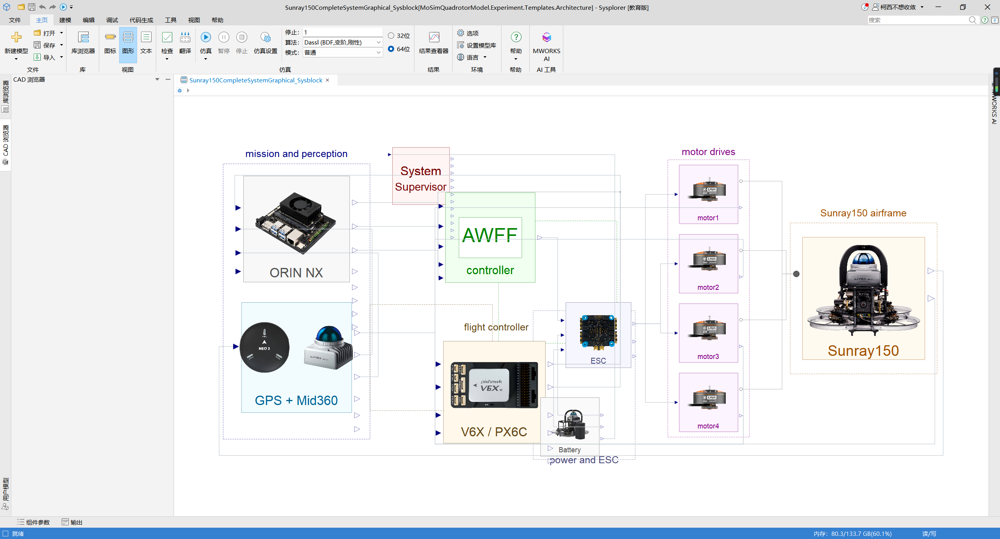

图 1-1 Sunray150 系统模型关系。该图用于理解任务、飞控、执行器、传感器和机体
的模型组成，不表示 PX4、Gazebo、ROS、QGC 或实机部署已经完成。

### 1.2 必须区分的五类状态

表 1-1　五类状态与证据边界

| 状态 | 用户可据此确认的内容 | 不能据此确认的内容 |
|---|---|---|
| 路由可打开 | 当前任务、控制器和 FormalRunner 组合已登记 | 仿真已运行或控制器性能通过 |
| CheckModel 通过 | 当前模型结构可检查 | 50 s 仿真完成或结果达标 |
| 仿真完成 | 存在可读 Result.msr 和对应指标 | 终端误差一定满足门限 |
| 性能通过 | 对应记录满足该实验的判据 | 其他任务、场景或平台也通过 |
| C/SIL 通过 | MWORKS 内图形模型与生成 CFunction 的指定工况一致 | 已接入 Gazebo、PX4、ROS 或实机 |
| C99 运行记录 | 指定 C99 后端已在项目本地 `src` -> MAVROS -> PX4 -> Sunray/Gazebo 链路完成记录中的任务生命周期或注入确认 | 其他控制器均已部署、严格同参性能 A/B、完整故障容错或实机已验证 |

任何性能、故障、安全或运行时结论都必须回到原始 Results、指标和运行记录核对。
Studio 的显示状态只说明界面动作，不自动产生这些结论。

当前这一类记录仅覆盖 px4ctrl 的 `graphical_px4ctrl_c99` 后端：
`Results/sunray_ros1/sunray_ros1_graphical_c99_takeoff_hover_land_20260731_002/`、
`Results/sunray_ros1/sunray_ros1_graphical_c99_wind_hover_20260801_002/` 与
`Results/sunray_ros1/sunray_ros1_graphical_c99_motor_fault_recovery_20260731_002/`。
名义记录的 FAST-LIO 体素参数为 `0.02 m`，风扰和电机效率记录为 `0.5 m`；因此它们
用于证明功能链和故障注入可达，不能被表述为严格同参性能比较。

### 1.3 当前项目状态速览

表 1-2　当前项目状态速览

| 项目 | 当前事实 | 权威位置 |
|---|---|---|
| 正文控制器路线 | 48 条：46 条算法控制器 + Official PID + px4ctrl | Config/control_platform/control_scheme_catalog.json |
| MWORKS 当前模型映射索引 | 46 条当前已解析模型路径（用于源码回链） | Config/control_platform/current_model_entry_map.json |
| Studio 可手动打开入口 | 路由表 48 条，其中 44 条 available=true | Config/control_platform/model_studio_task_routes_v1.toml |
| FormalRunner 文件候选 | 53 个 | Models/MoSimQuadrotorModel/Experiment/Runners/Formal |
| 名义 ClimbPath 50 s（当前目录） | 30/48 通过，18/48 完成失败，0/48 未运行；项目完成状态为 false | Results/control_platform/phase2_full_48_climbpath/g3_repair/G3_CATALOG_48_CURRENT_STATUS.json |
| 冻结历史 G3 快照 | 28/48 通过，20/48 失败，完成状态为 false | Results/control_platform/phase2_full_48_climbpath/g3_repair/G3_STATUS.json |
| 历史执行人口 | 38 条有完整 50 s 数据集，28 条终端误差小于 5 m | Config/control_platform/climbpath_baseline_count_definition.json |
| 七场景 | 14 条总记录，12 条有效，2 条保留为无效负样本 | Results/control_platform/seven_scenario_ab_v2 |
| 灵敏度 | 24 条：17 通过、3 物理门限失败、4 执行阻塞 | Results/control_platform/sensitivity_analysis_long_v1 |
| px4ctrl 生成 C | 已完成 MWORKS 图形模型到 C、构建和 50 s SIL | src/control/codegen/px4ctrl |

正文按 48 条控制器路线组织：46 条算法控制器加 Official PID、px4ctrl 两条基线；44、53、当前 30/18/0 与冻结历史 28/20 分别对应入口、Runner 文件和结果状态，不能互相替换。
完整数字、证据类别和限制见 Docs/Design/报告手册交付证据总账_P0_20260731.md 与
Docs/报告/审计/当前目录48条ClimbPath口径对齐_20260801.md。

## 2. 环境、入口与接口

### 2.1 环境与兼容性检查

开始前先完成下表的静态和原生环境核对。出现登录、许可、授权或 GUI 错误时，先处理
授权状态；不要把授权未知误判为模型、控制器或求解器问题。

表 2-1　环境与兼容性核对

| 组件 | 当前交付依据 | 最小核对动作 |
|---|---|---|
| MWORKS、Sysplorer、Sysblock、Syslab | 活动模型注解为 `26.3.0`；目标机必须已安装且授权正常 | 在“帮助/关于”记录版本；只加载正式包根后执行一次原生 CheckModel |
| Syslab | 必须可提供 `ObjectOriented` 和 `TyAppDesigner`；Studio 不使用独立 `Project.toml` | 在 Syslab 执行 `VERSION`，再执行 `using ObjectOriented; using TyAppDesigner` |
| Windows CMake | 用于 px4ctrl Windows 构建 | 执行 `cmake --version`；目标机还需有 Visual Studio Build Tools 或 LLVM/Clang |
| WSL 工具链 | 当前已验证口径为 Ubuntu-20.04、gcc 9.4.0、CMake 3.16.3 | 在目标 WSL 发行版执行 `gcc --version` 和 `cmake --version` |
| MoSim 助手 | 可选；缺失不影响 MWORKS 仿真、结果复核或代码生成 | 执行 `codex --version` 与 `codex login status` |
| Sysplorer MCP wrapper | 仅自动 MIL/批量回归和部分自动化证据路径需要；缺失不影响 APP 配置、原生打开模型或手动仿真 | 运行自动批次前检查 `SYSPLORER_MCP_WRAPPER` 或项目 MWORKS wrapper；缺失时按阻断处理，不改判为控制器失败 |

Windows 上如果 MWORKS 不在脚本的默认安装位置，先在当前 PowerShell 会话设置 native
打开/检查 helper 的路径覆盖；不要把开发机的 `D:\Program Files\...` 路径写死到复现脚本：

~~~powershell
$env:MWORKS_SYSPLORE_EXE = "C:\path\to\mworks.exe"
$env:MWORKS_SYSPLORE_PYTHON = "C:\path\to\External\python64\python.exe"
~~~

这两个变量只影响 Studio 的 native 模型打开/CheckModel helper；离线“写入配置”和
APP 源码解析不依赖它们。若未设置，helper 才会尝试其机器默认回退路径。

没有 Sysplorer MCP wrapper 时，仍可使用本手册的基础路径：Studio 写入配置，原生
`ModelingPy` 打开模型，用户在 MWORKS 中执行 CheckModel 并手动启动仿真。APP 的
自动“运行 MWORKS MIL”按钮和离线批量认证会因缺少 MCP wrapper 而阻断；这只是自动化
执行能力不可用，不是模型或控制器判定失败。

项目正式模型包根是 `Models/MoSimQuadrotorModel/package.mo`。不要把仓库内其他
`package.mo` 当作第二个项目根重复加载；多个根会改变类解析和依赖边界。

### 2.2 设置项目根目录

Windows PowerShell：

~~~powershell
$MOSIM_ROOT = (Resolve-Path '<MoSim 项目目录>').Path
$env:MOSIM_ROOT = $MOSIM_ROOT
Set-Location $MOSIM_ROOT
~~~

Linux 或 WSL：

~~~bash
export MOSIM_ROOT="/path/to/MoSim"
cd "$MOSIM_ROOT"
~~~

后文用 MOSIM_ROOT 指代项目根目录。Windows 示例使用反斜杠，Linux/WSL 示例使用
正斜杠。

### 2.3 启动 MoSim Studio

apps/model_studio 当前不使用独立 Project.toml。请在已授权的 MWORKS Syslab
环境中执行：

~~~julia
include(joinpath(ENV["MOSIM_ROOT"], "apps", "model_studio", "src", "app.jl"))
~~~

出现 Studio 窗口只表示界面已启动，不表示模型已加载、CheckModel 已通过或仿真
已开始。窗口启动失败时，先核查 MWORKS 授权和 Syslab/TyAppDesigner，而不是把它
误判为控制器故障。

### 2.4 四个工作台

表 2-2　四个工作台职责边界

| 工作台 | 面向的用户动作 | Studio 不会替代的动作 |
|---|---|---|
| 在线建模验证 | 选择任务、配置场景、写入配置、打开 FormalRunner | 自动启动仿真或判定性能 |
| 实时联合仿真 | 填写链路参数、执行连接预检、打开登记模型 | 以连接成功代替运行时验收 |
| 代码生成 | 打开登记的 MWORKS 代码生成模型 | 自动点击原生导出、构建或部署 |
| MoSim 助手 | 基于当前配置的本机只读问答 | 修改文件、启动仿真、生成代码或发送运行时命令 |

### 2.5 配置与数据接口

表 2-3　配置与数据接口

| 接口 | 写入方 | 读取方 | 作用与限制 |
|---|---|---|---|
| Config/control_platform/model_studio_task_routes_v1.toml | 项目维护者 | Studio、配置写入脚本 | 唯一的手动 FormalRunner 路由权威源；`available=true` 仅表示登记 Runner 与输出边界存在，不表示性能、七场景或代码生成通过 |
| Config/control_platform/seven_scenario_experiment_profiles_v2.json | 项目维护者 | Studio 配置写入脚本、七场景执行器 | 七场景的轨迹、时长、参数覆盖和 SHA-256 绑定；不是控制器增益文件 |
| Config/control_platform/seven_scenario_injection_contract_v2.json | 项目维护者 | 七场景执行器、结果复核 | 规定注入语义、求解器、采样、有效性门和必留证据；不能以界面参数绕过 |
| Results/ui_platform/model_studio_task_handoffs/latest.json | Studio 配置写入动作 | 打开模型脚本 | 当前一次任务的冻结交接；下一次“写入配置”会覆盖它；不是仿真结果 |
| Models/MoSimQuadrotorModel/package.mo | 项目模型 | MWORKS | 唯一正式模型包根 |
| Result.msr 与 metrics/METRICS.json | 原生 MWORKS 仿真和指标流程 | 结果查看器、分析脚本、报告 | 结果是否有效必须由对应运行记录和指标判断 |
| src/control/codegen/px4ctrl | MWORKS GenerateModelCode 与交付构建流程 | CMake、固定向量测试、SIL | 当前有证据的代码生成交付路径是 px4ctrl |
| 本机回环 Codex CLI 服务 | Studio 按需启动 | MoSim 助手 | 仅本机、只读；不拥有 MWORKS 或运行时控制权 |

源码包与证据包是两个交付物。根 `.gitignore` 排除了 `Results/`，因此干净源码包中没有
历史结果是正常的；首次点击“写入配置”时，Studio 会自动创建
`Results/ui_platform/model_studio_task_handoffs/`、`latest.json` 和临时 harness。
独立证据包中的 `latest.json` 只是某次配置交接快照，不能替代当前生成动作，也不是
`Result.msr` 或性能结论。交付包中应使用证据包自己的相对路径和 SHA-256 清单，不要
把 `C:\Users\...` 这类开发机绝对路径写入复现步骤。

### 2.6 Studio 交接 JSON 协议

`latest.json` 的 schema 是 `mosim.model_studio.task_config.v1`。它是“将要打开哪个
模型及其参数”的配置证据，不是一次仿真的完成记录。人工复核时至少应检查：

表 2-4　Studio 交接 JSON 必查字段

| 字段组 | 必查字段 | 含义 |
|---|---|---|
| 身份 | `created_at`、`controller_id`、`task_id`、`configuration_kind` | 本次选择的控制器、任务和配置类型 |
| 模型绑定 | `runner_class`、`model_name`、`harness_file`、`harness_sha256` | 要打开的 Runner 与生成的临时 harness；哈希变化说明配置已变更 |
| Profile | `profile.profile_id`、`scenario_id`、`trajectory_class`、`duration_s` | 使用的轨迹与计划时长 |
| 注入 | `profile.runner_parameter_overrides`、`task_parameters`、`selection` | 风扰、物理质量/惯量比例、旋翼效率、机数、地图和故障目标 |
| 可追溯性 | `profile_source`、`contract_source` 及对应 SHA-256 | 必须能回到 Profile 和合同权威源；哈希不一致时不得复用旧结论 |
| 边界 | `claim_boundary` | 正常写入配置时必须明确“未启动 MWORKS 仿真” |

交接 JSON 只适合当前一次打开动作。需要保存一次完整实验时，应保留它的副本或以同次
`RUN_CONFIG.json`、`RUN_RECORD.json` 和 Profile/合同哈希作为最终记录。

## 3. 五分钟快速开始

推荐先用单机 official_pid 的“基准：ClimbPath 50 s”熟悉完整操作链。该路径用于
熟悉界面，不应替代已有的正式结果记录。

(1) 启动 Studio，进入 在线建模验证。
(2) 选择单机、基准：ClimbPath 50 s、PID 族和 official_pid。
(3) 保持默认场景参数，或按实验合同设置外力、质量/惯量比例、电机效率、故障目标和
   起始时刻。
(4) 点击 写入配置。日志出现“配置已冻结”后，当前交接文件位于
   Results/ui_platform/model_studio_task_handoffs/latest.json。
(5) 点击 打开仿真模型。在线建模模式会先对当前模型发起原生 CheckModel；只有检查
   成功后，Studio 才报告模型已打开。
(6) 在 MWORKS 原生窗口确认 Runner、Profile 与场景参数，然后由用户人工点击仿真。
(7) 仿真完成后，在原生结果查看器读取 Result.msr，或打开对应运行目录的
   metrics/METRICS.json。

写入配置和打开模型均不会自动启动仿真。若随后修改了控制器、任务或场景参数，必须
重新写入配置；若手工改动模型，则应在 MWORKS 中再次执行 CheckModel。

## 4. 在线建模验证


图 4-1 在线建模验证页。左侧选择任务和控制器，中间定义场景参数，右侧记录
Studio 操作日志。

### 4.1 选择任务和控制器

页面按以下顺序约束选择：

(1) UAV 数量和地图；
(2) 验证任务；
(3) 控制器家族与控制器实例；
(4) 路由自动确定的姿态内环、增强层、安全层和输出边界。

某个控制器显示为已实现、已认证或可选，不等于它在所有任务中都有可打开入口。
三机和自主避障等专用任务会按登记路由限制控制器；看到不可选项时，应切换到允许
的任务组合，而不是修改历史入口文件。

### 4.2 设置场景参数

当前页面输入会被规范化后写入交接配置。可调范围和约束如下；超过范围时，配置写入
应失败，而不是自动截断为一个看似可用的值。

表 4-1　场景参数写入约束

| 页面输入 | 写入字段 | 单位与范围 | 约束与作用 |
|---|---|---|---|
| 外力扰动 | `gust_force_x_n`，随后映射为 `gust_force=[x,0,0]` | N，`0.0` 到 `0.5` | 仅为世界坐标系 +X 外力，不是风速；启用时从故障起始时刻持续到该任务结束 |
| 质量/惯量比例 | `mass_inertia_scale`，随后映射为 `mass_scale` 和三轴 `inertia_scale` | 无量纲，`1.0` 到 `1.4` | 只改变物理机体；控制器保持名义参数 |
| 四路电机效率 | `motor_effectiveness[4]`，随后映射为 `rotor_effectiveness[4]` | 每项 `0.0` 到 `1.0` | 允许名义四路 `1.0`，或恰好一项低于 `1.0`；多旋翼同时失效会被拒绝 |
| 故障开始时刻 | `fault_start_s` | s，`0` 到当前 Profile `duration_s` | 只有旋翼效率低于 `1.0` 时才写入实际故障起点 |
| 无人机数量和故障目标 | `selection.vehicle_count`、`selection.fault_target_uav` | 整数；机数 `1` 到 `9`，故障目标必须在机数内 | 每个已登记任务还会进一步校验其固定机数、地图和控制器组合 |
| 地图、控制器和输出边界 | `selection.map_id`、`controller_id`、`runner_class` | 由登记路由决定 | 手工改交接文件绕过 `available`、任务机数或地图限制，不构成有效任务配置 |

这些值不是“已注入”的运行时证据，也不会因为滑块位置发生变化就改变已有的 G3、
七场景或灵敏度结果。

### 4.3 写入配置、打开模型与仿真

表 4-2　写入、打开、仿真与结果查看边界

| 操作 | Studio 的实际动作 | 用户接下来要做的事 |
|---|---|---|
| 写入配置 | 检查登记路由并写入最新交接 JSON，日志标注“未启动仿真” | 确认日志无缺失 Runner 或合同错误 |
| 打开仿真模型 | 在线建模模式先请求原生 CheckModel，再打开当前 Runner | 在 MWORKS 检查类名、Profile 和参数 |
| 运行 MWORKS MIL | 在线建模页不会从 Studio 自动启动仿真 | 用户在 MWORKS 中人工点击仿真 |
| 查看结果 | 只对已有结果提供查看入口 | 确认 Result.msr、指标和运行记录完整 |

若打开模型被阻断，依次检查：当前任务和控制器是否为已登记组合、是否重新写入了
配置、路由表中的 available 是否为 true，以及日志是否指出 Runner 或输出合同缺失。

### 4.4 基础与拓展场景复现矩阵

`ClimbPath 50 s` 是全部 48 个目录条目的独立最小闭环筛选，不属于七场景 v2。七场景
v2 只绑定 `official_pid` 与 `px4ctrl` 两个既有 FormalRunner；不要把其他已登记的
控制器手动套入该 A/B 合同。

表 4-3　基础与拓展场景复现矩阵

| 类别 | task_id / Profile | 轨迹与时长 | 注入或关键参数 | 复核重点 |
|---|---|---|---|---|
| 基础 | `climb_path_50s` / `model_studio_climb_path_50s_v1` | ClimbPath，50 s | 名义机体、无风、四路效率 1.0 | 当前目录的 `RUN_RECORD`、原生 `Result.msr`、终端位置误差 |
| 基础 | `hover` / `mworks_seven_scenario_hover_v2` | HoverHold，35 s | 目标高度 2 m；起飞 5 s、保持 30 s | `position_rmse_m`、`tail_rmse_m`、终端误差和最大误差 |
| 基础 | `step_response` / `mworks_seven_scenario_step_response_v2` | StepResponse，45 s | 15 s 时 x/y 分别阶跃 `+1 m` / `-1 m`；5% 稳态带 | `overshoot_percent_x`、`overshoot_percent_y`、`settling_time_s`、`steady_state_error_m` 和 `position_rmse_m` |
| 基础 | `figure8` / `mworks_seven_scenario_figure8_v2` | Figure8，50 s | 固定零偏航 | 位置/XY RMSE、最大误差、终端误差 |
| 基础 | `spiral` / `mworks_seven_scenario_spiral_v2` | SpiralAscent，50 s | 半径 1.5 m、角速度 0.3 rad/s、爬升 0.15 m/s | 位置、XY、Z RMSE 和最大误差 |
| 拓展 | `wind_disturbance` / `mworks_seven_scenario_wind_disturbance_v2` | Figure8，50 s | 15 s 起施加世界系 `+X 0.25 N` 外力，持续 35 s | 扰动窗口 RMSE、最大误差、终端误差；不可写成风速试验 |
| 拓展 | `parameter_mismatch` / `mworks_seven_scenario_parameter_mismatch_v2` | SpiralAscent，50 s | 物理质量与三轴惯量均为 `1.2`；控制器仍为 `1.0` | 位置、XY、Z RMSE、最大误差与控制能量 |
| 拓展 | `motor_efficiency_fault` / `mworks_seven_scenario_motor_efficiency_fault_v2` | Figure8，50 s | 15 s 时 1 号旋翼效率从 `1.0` 切换至 `0.5`，同时影响推力和反作用力矩 | 故障前/后 RMSE、故障后峰值误差、终端误差和控制能量 |

七场景记录的有效性要求为：绑定 Runner/轨迹 CheckModel 通过、达到声明终止时刻、核心
跟踪量有限、最大位置误差小于 5 m，并同时保留原始 CSV、Python 指标、原生
`Result.msr`、原生结果窗口截图、MCP 日志、`RUN_CONFIG.json`、`RUN_RECORD.json` 与
Profile/合同哈希。发散、超时或不满足门限的记录必须作为负证据保留。

阶跃结果必须单独核对 `overshoot_percent_x`、`overshoot_percent_y` 和
`settling_time_s`。其中 `step_response_time_s` 只表示阶跃起始时刻，当前合同为
`15.0 s`，不能把它当作调节时间；`step_response_evaluation_end_s` 和
`step_response_settling_fraction` 分别记录评估终点和稳态带比例。若
`settling_time_s` 为 `NaN` 或缺失，手册和报告只能说明“调节时间未得到有效数值”，
不得用阶跃起始时刻代替。

### 4.5 专用多机、地图与安全任务

以下是 Studio 当前登记的专用路线。它们的“可打开”只代表任务-地图-控制器组合受到
配置约束，不代表避障、编队安全或在线规划验收已经通过。

表 4-4　专用多机、地图与安全任务

| task_id | 固定选择 | Runner / 基础模型 | 计划时长 | 当前手册边界 |
|---|---|---|---|---|
| `single_uav_autonomous_avoidance` | 1 架、`openblocks`、`px4ctrl` | `MoSimQuadrotorModel.Guidance.Planning.OpenBlocksPx4Ctrl` | 80.1247340259 s | 仅为单机 OpenBlocks 规划路线；必须以该次原始结果核查障碍物、轨迹和终止状态 |
| `three_uav_figure8` | 3 架、`blank`、`px4ctrl` | `MoSimQuadrotorModel.Experiment.Runners.Formation.Px4CtrlThreeUavFigure8Runner` | 50 s | 编队 Figure8 与障碍物避障是不同命题；空白地图记录不能作为避障证明 |
| `three_uav_autonomous_avoidance` | 3 架、`openblocks`、`linear_mpc` | `MoSimQuadrotorModel.Guidance.Planning.OpenBlocksThreeUavFormation` | 360 s | 当前只允许登记组合；安全过滤、在线分布式规划和避障效果需独立原始证据 |

### 4.6 专用多机与安全任务的证据边界

三机 Figure8 已有离线参考接入的 MWORKS 通过记录；它不证明在线分布式规划或
自主避障。三机 ECBF 安全参考调节当前为 blocked，未能证明安全干预或避障能力。
因此，页面上能够选择的多机/安全任务必须与其独立运行记录一起解读，不能由界面
可见性推断验收通过。

OpenBlocks 另有两条需要区分的历史记录：

(1) `Results/planning/three_uav_openblocks_gray_completion_20260730/` 是三套 Linear-MPC 全机回路的历史接受记录，状态为 `accepted_with_reduced_clearance_margin`，`accepted=true`，但 `planning_margin_preserved=false`，且源哈希已与当前模型漂移；
(2) `Results/planning/three_uav_openblocks_px4ctrl_completion_20260731/` 是当前 PX4CTRL 记录，状态为 `blocked`。两条记录都不能由 Studio 页面升级为在线重规划、墙体碰撞或 Gazebo/PX4/ROS 运行时验收。

## 5. 实时联合仿真


图 5-1 实时联合仿真页。该页面用于配置和预检，不把连接状态写成控制性能结论。

### 5.1 当前适用范围

当前源代码只允许单机 official_pid 的 ATTITUDE_THRUST 实时合同进入打开/准备门。
页面会固定或限制不兼容的控制器、姿态内环和输出边界。保存其他组合的界面参数不等于
该组合可以准备运行。

### 5.2 连接预检

按页面填写目标主机、RT1 端口、ROS Master、本机公告 IP 与目标频率，然后点击
测试连接。预检会检查 ROS Master/RT1 双向链路并显示原因码、RTT 或链路信息。

准备动作只有在以下条件同时成立时才会解除阻断：

(1) 双向连接通过；
(2) 实时联合仿真预检目标频率为 50 Hz（独立于 FormalRunner/C99 控制侧的 100 Hz 边界）；
(3) 当前组合符合单机 official_pid 的 ATTITUDE_THRUST 合同。

连接通过只说明通信预检通过；它不证明飞控状态、控制性能、故障处理、QGC 操作、
Gazebo/PX4/ROS 部署或飞行安全。运行时验收应按独立运行时工作流和原始日志执行。

### 5.3 常见阻断

表 5-1　实时联合仿真常见阻断

| 界面现象 | 优先检查项 |
|---|---|
| 连接阻断 | ROS Master URL、RT1 地址端口、网络可达性和原因码 |
| 连接通过但无法准备 | 实时联合仿真目标频率是否为 50 Hz，是否仍为单机 official_pid/ATTITUDE_THRUST 合同 |
| 打开联合仿真模型被拒绝 | 当前组合是否超出已登记实时合同 |
| 有窗口但没有性能数据 | 是否存在完成运行、原始日志、Result.msr 与指标；仅窗口不构成结果 |

## 6. MWORKS 代码生成与 px4ctrl C 交付

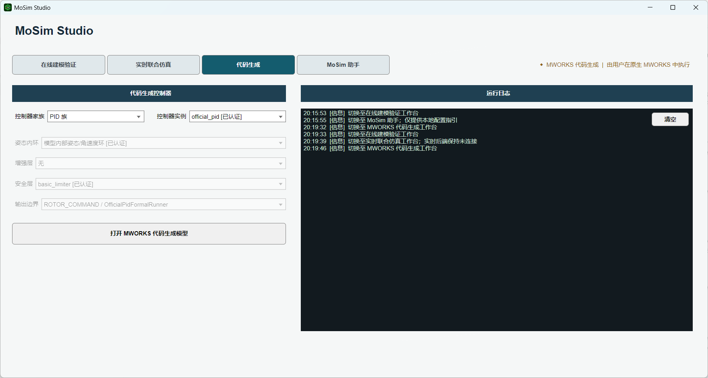

图 6-1 代码生成页。Studio 只负责打开已登记的原生 MWORKS 代码生成模型。

该入口图先说明 Studio 的责任边界；下一张原生 MWORKS 截图再展示实际的代码生成动作。

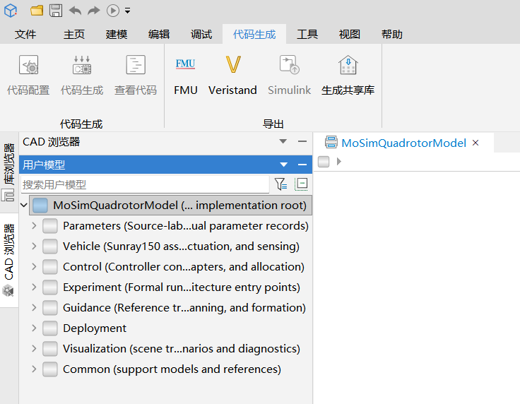

图 6-2 在 MWORKS 原生代码生成功能中执行 GenerateModelCode。

原生导出动作完成后，下面的目录图用于核对 C/H 产物是否进入项目声明的交付位置。

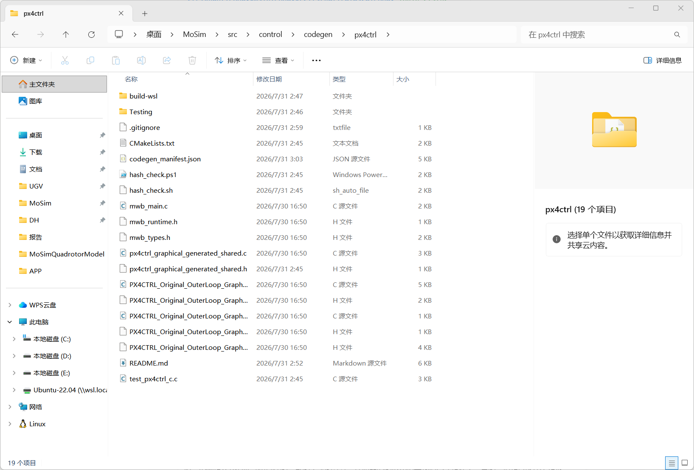

图 6-3 px4ctrl 生成 C 交付目录示例。

### 6.1 操作步骤

(1) 进入 代码生成页，选择已登记的控制器。
(2) 点击 打开 MWORKS 代码生成模型。
(3) 在 MWORKS 中确认图形 Sysblock，先执行 CheckModel。
(4) 在原生 代码生成 页签执行 GenerateModelCode；当前活动模型要求 C99、双精度和
   0.01 s 采样。
(5) 将生成的核心 C/H 文件与 src/control/codegen/px4ctrl 中的清单比较，更新真实
   SHA256 后再构建。
(6) 运行固定向量 C 测试、哈希检查；需要整机数值一致性时，再按相同 50 s 工况执行
   MWORKS CFunction SIL。

Studio 不会替用户点击导出，也不会因模型打开而报告 C 构建成功。

### 6.2 Windows 构建与哈希复核

安装 Visual Studio Build Tools 或 LLVM/Clang 后，在已设置 MOSIM_ROOT 的
PowerShell 中执行：

~~~powershell
cmake -S "$MOSIM_ROOT\src\control\codegen\px4ctrl" `
  -B "$MOSIM_ROOT\src\control\codegen\px4ctrl\build-win" `
  -DCMAKE_BUILD_TYPE=Release
cmake --build "$MOSIM_ROOT\src\control\codegen\px4ctrl\build-win" --config Release
Push-Location "$MOSIM_ROOT\src\control\codegen\px4ctrl\build-win"
ctest -C Release --output-on-failure
Pop-Location
& "$MOSIM_ROOT\src\control\codegen\px4ctrl\hash_check.ps1"
~~~

### 6.3 Linux/WSL 构建与哈希复核

~~~bash
cmake -S "$MOSIM_ROOT/src/control/codegen/px4ctrl" \
  -B "$MOSIM_ROOT/src/control/codegen/px4ctrl/build-wsl" \
  -DCMAKE_BUILD_TYPE=Release
cmake --build "$MOSIM_ROOT/src/control/codegen/px4ctrl/build-wsl" --parallel
(cd "$MOSIM_ROOT/src/control/codegen/px4ctrl/build-wsl" && ctest --output-on-failure)
bash "$MOSIM_ROOT/src/control/codegen/px4ctrl/hash_check.sh"
~~~

Windows 与 WSL 的 ABI 和二进制格式不同，必须在目标平台重新编译；不能把已有
Linux .so 当作 Windows DLL 或部署证明。显式设置 `CMAKE_BUILD_TYPE=Release` 可使
单配置生成器与 Visual Studio 等多配置生成器都复现 Release 测试目标。

### 6.4 已有证据与边界

当前 px4ctrl 已有图形模型到生成 C、独立构建和 50 s MWORKS CFunction SIL 记录。
该 SIL 只证明指定 MWORKS 工况下的位置、姿态与旋翼指令一致性，不能提升为
Gazebo/PX4/ROS 或实机部署通过。

### 6.5 C99 单机运行时复现

本节复现的是当前已通过的 `graphical_px4ctrl_c99` 单机运行时基线。链路为：

~~~text
MWORKS 图形 px4ctrl 生成 C99
  -> src/control/runtime_adapters/px4ctrl
  -> MAVROS -> PX4 SITL -> Sunray/Gazebo
  -> FAST-LIO -> PX4 EKF -> /uav1/mavros/local_position/odom
~~~

px4ctrl 只读取上述 MAVROS 本地里程计；Gazebo 真值仅用于仿真对齐，不作为控制器
直接输入。该基线固定使用 `PX4CTRL_HOVER_PERCENTAGE=0.456`、禁用 GPS
（`EKF2_GPS_CTRL=0`）、启用 FAST-LIO 外部视觉融合（`EKF2_EV_CTRL=15`）和
`graphical_px4ctrl_c99` 后端。Gazebo 真值只能为仿真对齐适配器提供高度通道，
px4ctrl 仍只读取 MAVROS 本地里程计。用户不应为了得到“通过”而修改这些值、绕过
FAST-LIO 或将真值直接接入控制器。

#### 6.5.1 前置条件

(1) 将完整仓库克隆到 Windows 可挂载的本地磁盘，例如 `D:\work\MoSim`；当前
   Windows 入口会根据自身位置自动换算 WSL 路径，因此不要求使用开发者桌面路径。
(2) WSL2 中必须存在名称为 `Ubuntu-20.04` 的发行版，并已安装 ROS1 Noetic、Gazebo
   Classic、CMake、Ninja、Python 3 和 ROS Catkin 工具链。
(3) 项目中的 `src/flight_stack/px4/`、`src/perception/fast_lio/`、Sunray 运行时源码和
   Gazebo 插件资产必须完整。当前支持路径不从 `References/` 读取活动源码。
(4) 同一时刻只运行一个 C99 演示；正常结束前不要重复点击另一条命令。

#### 6.5.1.1 干净克隆核验

以下命令用于确认用户实际运行的是刚克隆的项目，而不是开发机遗留的构建目录或历史
结果。示例远端可替换为项目镜像或用户自己的 fork：

~~~powershell
git clone https://github.com/lzy18001500226/MoSim.git MoSim
Set-Location .\MoSim
git rev-parse --show-toplevel
git status --short
~~~

最后一条命令在未自行编辑文件时应无输出。建议在执行 `00` 前运行下列只读静态检查；
它们不启动 PX4、Gazebo 或飞行任务，但会确认活动入口指向项目 `src/`，而非
`References/`：

~~~powershell
python Scripts\quality\check_project_path_registry.py --project-root . --require-canonical-active
python Scripts\quality\check_local_source_activation.py --project-root .
~~~

在 Windows PowerShell 中可先确认 WSL 发行版：

~~~powershell
wsl -l -v
~~~

输出中必须有 `Ubuntu-20.04`。缺少它、ROS Noetic 或 Gazebo Classic 时，先完成系统
依赖安装；不要用旧结果目录冒充新的运行。

#### 6.5.2 运行顺序

从资源管理器双击，或在仓库根目录执行以下命令。`00` 在初次克隆、切换分支或修改
`src/` 运行时源码后必须执行一次；它只构建并预检，不启动飞行任务。

~~~powershell
cmd /c Scripts\cmd\00_准备C99单机环境.cmd
~~~

终端显示准备完成后，只选择一项演示运行：

表 6-1　C99 演示运行与验收文件

| 目的 | 命令 | 成功时必须检查的文件 |
|---|---|---|
| 名义起飞、悬停、降落、解除解锁 | `cmd /c Scripts\cmd\01_运行C99单机起飞悬停降落.cmd` | `PX4CTRL_BASIC_MISSION_METRICS.json` 的 `status=passed` |
| 受限风扰 | `cmd /c Scripts\cmd\02_运行C99风扰闭环.cmd` | `DEMO_STATUS.json` 与 `WIND_INJECTION_EVIDENCE.json` 的 `status=passed` |
| 转子 1 效率 0.85、恢复额定效率 | `cmd /c Scripts\cmd\03_运行C99电机故障恢复闭环.cmd` | `DEMO_STATUS.json` 与 `MOTOR_EFFICIENCY_INJECTION_EVIDENCE.json` 的 `status=passed` |

每次运行都会在 `Results/sunray_ros1/` 新建带时间戳的目录，终端会打印其路径。仅检查
这次新目录中的 JSON；不要回看历史 `passed` 文件后把失败运行写成通过。三项命令都会
自动清理其启动的 Gazebo、PX4 和 ROS 进程。仅当终端异常中断或进程残留时，才运行：

~~~powershell
cmd /c Scripts\cmd\停止所有仿真.cmd
~~~

每次通过记录还必须在同一目录检查 `px4ctrl_build_backend.txt`，其中应包含
`PX4CTRL_BUILD_BACKEND=graphical_px4ctrl_c99`。运行记录、`RUN_MANIFEST.json` 和原始
日志应与 JSON 状态一起保留，作为复现证据。

复现报告至少记录当前提交、实际运行命令、生成的 `run_id`/结果目录，以及上述 JSON、
`RUN_MANIFEST.json` 和 `px4ctrl_build_backend.txt`。这使第三方能够区分“历史记录存在”
与“本机重新运行通过”。

#### 6.5.3 运行结果能说明什么

表 6-2　C99 运行证据的可得结论与边界

| 运行 | 已通过的结论 | 不可升级的结论 |
|---|---|---|
| 名义 C99 | 本地 C99 适配器、MAVROS、PX4、FAST-LIO 和 Sunray/Gazebo 完成起飞、悬停、降落和解除解锁生命周期 | 不是严格悬停精度或所有控制器已部署 |
| 风扰 C99 | Gazebo 接收规定风扳手，且同次 C99 生命周期完成 | 不是严格同传感器参数的抗扰性能对比，也不是完整鲁棒性证明 |
| 电机故障 C99 | Gazebo 执行转子效率下降与恢复，px4ctrl 保持唯一控制权，且同次生命周期完成 | 不是完整故障容错性能、任意故障幅值稳定性或实机结论 |

名义记录使用 FAST-LIO `0.02 m` 体素参数，风扰和电机故障记录使用 `0.5 m`。因此
不能将这三项叙述为同一传感器参数下的性能 A/B 对比。

#### 6.5.4 常见阻断与处理

表 6-3　C99 运行常见阻断

| 现象 | 首先检查 | 正确处理 |
|---|---|---|
| `00` 找不到 `Ubuntu-20.04` 或无法映射项目路径 | `wsl -l -v`、仓库是否位于 Windows 挂载盘 | 修复 WSL2/发行版或移动仓库后重试 `00` |
| `00` 报 ROS、Gazebo、Ninja、Catkin 或源码缺失 | 终端中第一条 `BLOCKER`/`ERROR` | 安装缺失系统依赖或补全本地 `src/` 源码，再重新执行 `00` |
| 演示未生成新的结果目录 | 终端退出码和 `Results/sunray_ros1/` 最新目录 | 不使用历史结果；保留本次终端错误并从 `00` 重新预检 |
| JSON 为 `blocked`、`invalid` 或无 `status=passed` | `RUN_MANIFEST.json`、对应 JSON、终端日志 | 将本次记录视为未通过，不修改门限或配置来改写结论 |
| 想同时打开地面站 | `Scripts/cmd/启动MoSim地面站.cmd` | 地面站可独立显示，但不启动、不控制本节的 C99 任务，也不改变运行结论 |

QGC、UE、RViz、规划器、多机和 rosbag 回放属于独立验收线。它们未包含在上述 C99
通过结论中，不能因为窗口出现或地图显示而升级本节的 C99 结果。

## 7. MoSim 助手

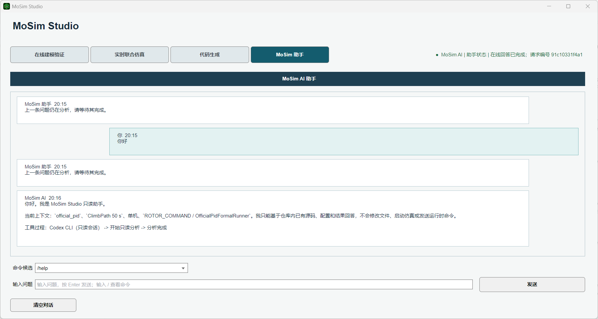

图 7-1 MoSim 助手使用本机 Codex CLI 进行只读分析。

### 7.1 启用条件和边界

助手为可选功能。正常用户只需要本机安装并登录可用的 Codex CLI；不需要安装 Rust、
Cargo，也不需要构建项目内的 src/Agent 源码。缺少或未登录 CLI 只会使助手不可用，
不影响 MWORKS 仿真、结果复核或代码生成。

Studio 的 CLI 发现顺序固定如下：

(1) 维护人员显式设置的 MOSIM_CODEX_BIN；
(2) 用户已安装的 Codex CLI（Windows 为 %LOCALAPPDATA%\\OpenAI\\Codex\\bin 下的
   codex.exe 或 PATH 中的 codex；Linux/macOS 为 PATH 中的 codex）；
(3) 项目内由 src/Agent/codex-main 构建得到的 CLI 产物，仅作为维护或离线兜底。

因此，普通交付使用的是用户已安装的 Codex CLI。项目内源码用于审计、维护和没有
全局 CLI 时的可选构建，不是 Studio 助手的前置依赖。

助手始终受以下限制：

(1) 仅在本机回环服务上运行；
(2) 只读分析当前项目内可验证的源码、配置和既有结果；
(3) 不修改文件；
(4) 不启动 CheckModel、仿真、代码生成或编译；
(5) 不发送 QGC、Gazebo、PX4、ROS、MAVROS、飞控或电机命令；
(6) 不把界面状态、截图或目录存在误报为性能或运行时通过。

### 7.2 安装、登录与自检

在启动 Studio 前，于同一用户账户的终端执行：

~~~powershell
codex --version
codex login status
~~~

两条命令均成功后，Studio 会自动发现并按需启动该 CLI。若未登录，在本机终端执行：

~~~powershell
codex login --with-api-key
~~~

按 CLI 的交互提示输入用户自己的 API Key。Key 不写入项目目录、Studio 配置、文档或
交接 JSON；它由 Codex CLI 的本机认证存储管理。更换 Provider、API Key 或 Codex CLI
后，应关闭并重新打开 Studio，再重新检查上述两条命令。

Studio 本身不直接向模型服务发送 HTTP 请求。它启动本机 Codex CLI，由该 CLI 使用当前
用户的 Provider 和登录凭据访问模型服务。因此，若 API 后台没有出现预期调用，应先用
codex login status 确认当前 CLI 的认证身份，并确认 Studio 发现的是预期的 CLI，而不是
把问题归因于 MWORKS 或仿真模型。

仅在维护、离线兜底或需要固定二进制版本时，才设置 MOSIM_CODEX_BIN 指向指定的
codex.exe。普通用户不应设置该变量，也不应手工修改 CODEX_HOME、auth.json 或项目内
的 Codex 源码。

### 7.3 常用命令

表 7-1　MoSim 助手常用命令

| 命令 | 用途 |
|---|---|
| /help | 显示全部可用命令 |
| /status | 查看助手、权限和上下文状态 |
| /model 或 /model 名称 | 查看或设置本次会话模型 |
| /attach 项目内相对路径 | 添加项目内文本或图片附件 |
| /attachments | 查看当前附件 |
| /compact | 请求压缩当前 Codex 会话的可续接事实摘要 |
| /stop | 停止当前只读分析 |
| /clear | 清空界面显示并创建新的 Codex 会话 |

助手不可用时，先检查本机 Codex CLI 是否已安装、是否已完成登录，以及助手状态页
返回的健康检查信息。不要把助手不可用归因于 MWORKS 控制器性能。

## 8. 结果读取、状态解释与交付边界

### 8.1 运行记录目录与最小证据集

正式记录应位于任务对应的结果叶目录，而不是只保留截图或汇总表。七场景 v2 的典型
布局为 `Results/control_platform/seven_scenario_ab_v2/<controller_id>/<scenario_id>/`：

表 8-1　运行记录最小证据集

| 工件 | 典型相对路径 | 用途 | 不能替代的内容 |
|---|---|---|---|
| 配置冻结 | `RUN_CONFIG.json` | 记录本次 Profile、合同、Runner 和哈希 | 不代表 MWORKS 已启动或完成 |
| 执行记录 | `RUN_RECORD.json` | 记录执行状态、结果定位和证据清单 | 不替代原始时序数据 |
| 原始时序 | `raw/result.csv` | 供独立指标脚本复算 | 不替代原生 Result.msr 的来源证明 |
| 原生结果 | `raw/.../Result.msr` | MWORKS 结果查看器的原始结果 | 不自动说明门限通过 |
| 指标 | `metrics/METRICS.json`、`metrics/METRICS.csv`、`metrics/metrics.python.csv` | 记录 RMSE、终端误差、峰值误差、有效性及场景指标 | 不可脱离同次 RUN_CONFIG/RUN_RECORD 单独引用 |
| 原生窗口证据 | `screenshots/` 和 capture manifest | 便于人工回溯结果窗口 | 图像本身不替代原始结果和指标 |

`METRICS.json` 至少应能定位 `raw_file`、`controller_id`、`scene_id`、`duration_s`、
`sample_rate_hz`、位置误差指标、`valid`、`source` 与 `evidence_level`。阶跃、风扰和
故障场景还应读取各自的合同指标，而不能把无关场景中的 `NaN` 字段误当作失败或通过。

### 8.2 在哪里读取结果

一次人工仿真完成后，优先核查：

(1) 当前运行目录内的 Result.msr；
(2) 对应 metrics/METRICS.json；
(3) RUN_CONFIG.json、RUN_RECORD.json 或任务合同；
(4) 汇总状态文件：当前目录使用 G3_CATALOG_48_CURRENT_STATUS.json，历史 G3
   追溯使用 G3_STATUS.json；
(5) 需要代码生成时的 codegen_manifest.json、固定向量测试和 SIL 记录。

需要从 MSR 生成分析 CSV 时，使用项目的结构化导出器，而不是手工猜测 HDF5 路径：

(1) 准备 `MSR_FILE_MAPPING.json`，为每个控制器绑定最新的 `Result.msr` 和目标 `raw/climbpath50s.csv`。

(2) 在项目根目录运行 `python Scripts/syslab/export_msr_continuous_signals.py --manifest <MSR_FILE_MAPPING.json> --summary <CSV_EXPORT_VERIFICATION.json> --overwrite`；脚本读取 `Continuous Data Table`/`Variable Index Table`，校验时间单调、有限值和必需字段，并写入源变量绑定与 SHA-256。

(3) 只有验证报告中的 `status=valid` 文件才进入 TyPlot/Julia 绘图；`Scripts/syslab/batch_export_msr_to_csv.jl` 目前是 Syslab 内的定位/编排入口，其自动导出函数仍是占位实现。Result Viewer 可用于单条结果的人工复核，但不应绕过 CSV 验证报告。

Results 中的原生结果窗口截图可用于回溯，但图像本身不替代 Result.msr、指标和
运行记录。

### 8.3 如何解读实验状态

表 8-2　实验状态解释

| 状态 | 含义 | 用户应如何处理 |
|---|---|---|
| passed 或 valid | 已满足该条记录的明确门限 | 保留源配置、结果、指标和运行记录 |
| terminal_position_error_exceeds_5m | 仿真完成但终端误差超过 5 m | 作为有效负性能证据保留 |
| simulation_timeout、simulate_failed、check_model_failed | 未得到可用于该门限判断的完整结果 | 按原始失败原因保留，不能写作通过 |
| blocked | 关键门未满足或执行受阻 | 记录阻断条件，不推断能力已验证 |
| invalid | 记录保留但不满足该实验有效性合同 | 作为无效负样本，不并入有效通过分母 |

当前目录的 18 条完成失败由 8 条终端误差超限、8 条仿真超时、1 条仿真 API 失败和
1 条 CheckModel 失败组成。冻结历史 G3 的 20 条失败仍按 9/8/2/1 分类保留。七场景
的两条电机效率故障记录是无效负样本；灵敏度中的 3 条物理门限失败和 4 条执行阻塞
同样必须保留。

### 8.4 报告与运行时的边界

除第 6.5 节限定的 C99 单机运行时记录外，本手册中的 MWORKS 结果不替代以下独立
验收：

(1) 其他控制器的 Gazebo/PX4/ROS/MAVROS 运行时部署；
(2) UE、QGC 或 RViz 的显示和交互；
(3) 在线自主避障、分布式规划或安全过滤触发；
(4) 目标硬件上的生成 C 编译、加载和飞行验证。

需要查阅完整实验结论时，使用 Docs/报告/仿真分析报告_正文骨架.md；需要核对
数字、路径和证据边界时，使用 Docs/Design/报告手册交付证据总账_P0_20260731.md。

### 8.5 Gazebo 仿真环境与运行时显示

#### 8.5.1 Gazebo 环境概述

Gazebo Classic 是 C99 运行时闭环的物理仿真后端。§6.5 已给出完整的启动和复现步骤；本节补充环境本身的说明和辅助显示工具的使用方式。

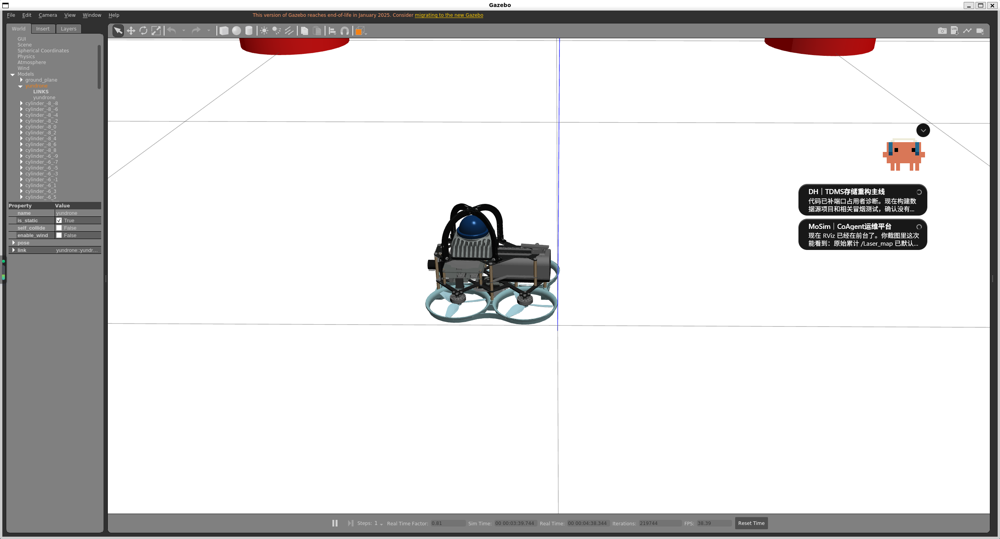

图 8-1　Gazebo 中运行的 sunray150_with_mid360 四旋翼模型。物理步长 0.001 s（1000 Hz），传感器包含 MID360 激光雷达和 IMU。

#### 8.5.2 状态反馈通路

运行时环境中控制律所需的状态不是直接读取 FAST-LIO 原始话题，而是经过 PX4 EKF 的统一本地状态：

表 8-3　运行时状态反馈通路

| 通道 | 数据来源 | 话题 | 说明 |
|------|----------|------|------|
| FAST-LIO 原始定位 | MID360 + IMU 融合 | `/Odometry` | `camera_init -> body` 诊断/可视化源；当前不是 px4ctrl 的直接输入，采样率为 20 Hz |
| 对齐后的外部视觉 | `fastlio_odom_alignment_adapter.py` | `/mosim/fastlio/odom_aligned` | 应用安装外参和初始 MAVROS-local 对齐后，供 PX4 EKF 融合 |
| 控制器状态 | PX4 EKF + MAVROS | `/uav1/mavros/local_position/odom` | px4ctrl 实际读取；MAVROS/控制侧保持 100 Hz，`twist.twist.linear` 按 body/base_link 语义处理 |
| Z 高度对齐替身 | Gazebo 真值 | 对齐适配器内部通道 | 仅用于显式 Hybrid-Z 仿真对齐，不能直接注入 px4ctrl；实机可替换为下视 ToF |

body-frame 速度先按姿态四元数旋转到世界系，外部 ENU/NED 接口再做轴交换与符号翻转：

```latex
\[
\mathbf p_{NED}=\begin{bmatrix}p_{y,N}\\p_{x,E}\\-p_{z,U}\end{bmatrix},\qquad
{}^{W}\mathbf v=R_{W\leftarrow B}(q)\,{}^{B}\mathbf v.
\tag{8-1}
\]
```

原始 `/Odometry` 必须先经过 `Scripts/sunray/fastlio_odom_alignment_adapter.py`，不能跳过对齐直接接入控制器；Gazebo 真值不直接输入 px4ctrl。

#### 8.5.3 UE 工业场景与 Gazebo 导入

项目包含虚幻引擎工厂场景和 UE→Gazebo 的网格导出路径。只有在对应 SDF/模型目录、配置和运行记录同时存在时，才能把某次场景称为已加载；本节图片本身不证明当前机器已完成导入。

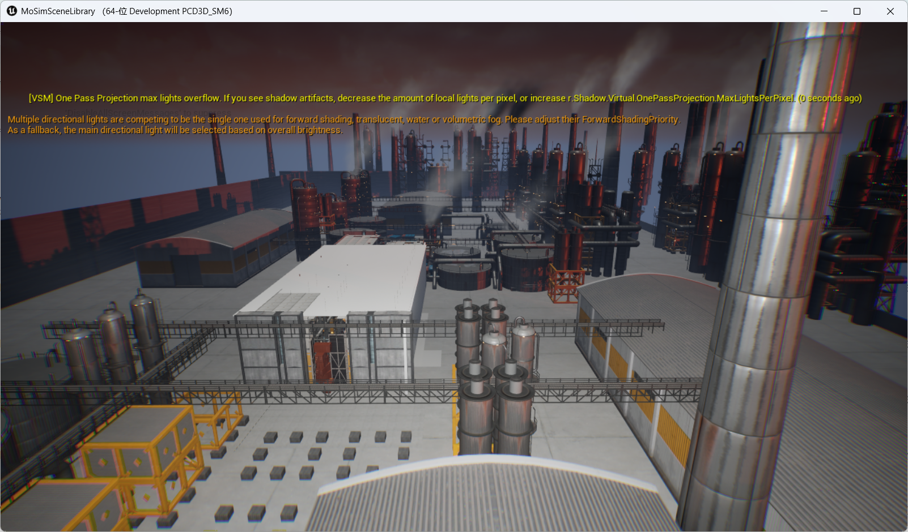

图 8-2　虚幻引擎中的工业工厂场景。

该图先交代工业场景的空间布局；下一张图把关注点缩小到同一场景中的飞行器尺度和安装关系。

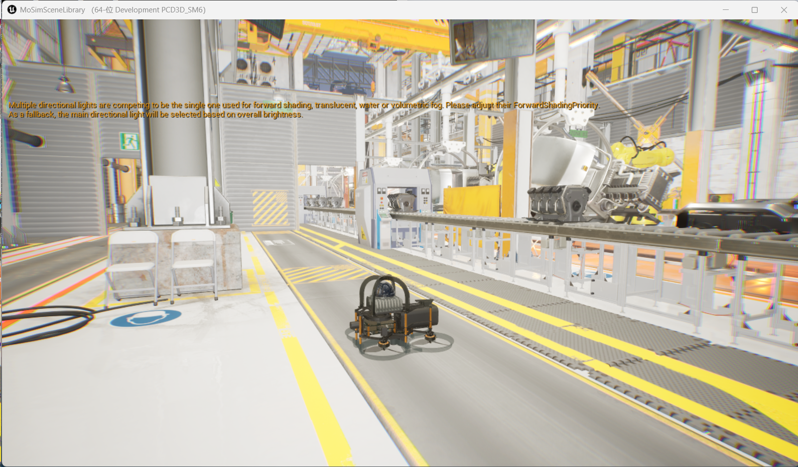

图 8-3　UE 环境中的四旋翼模型视角。

确认飞行器尺度后，下面的 Gazebo 截图展示同一场景网格进入物理仿真环境后的承载位置。

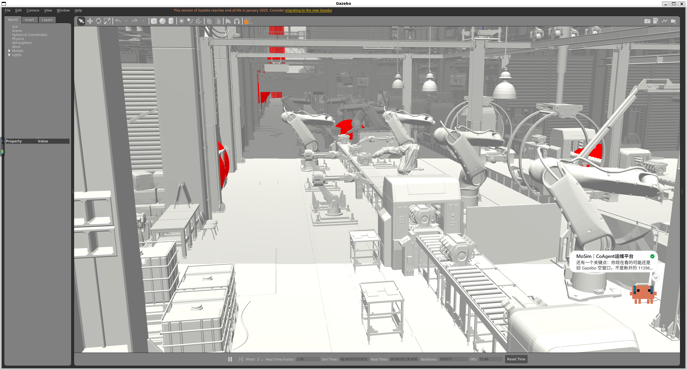

图 8-4　UE 工厂场景经网格导出后在 Gazebo 中加载的效果。启动时通过 `factory_model_path` 参数指定导出目录。

#### 8.5.4 QGC 地面站

QGroundControl 用于实时监控飞行状态、电池电压、模式切换和任务进度。启动命令：

```bash
Scripts/cmd/启动MoSim地面站.cmd
```

地面站可与 §6.5 的 C99 运行时并行启动，但不控制任务执行流程。

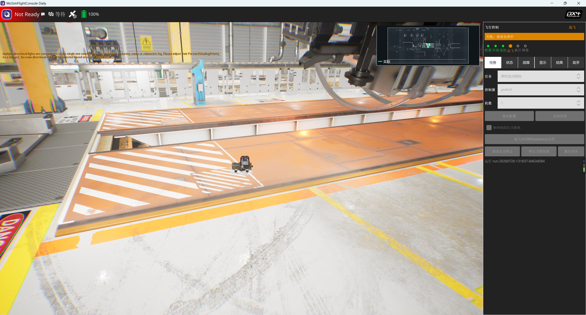

图 8-5　QGC 任务页、控制器选择与工厂地图显示。

任务页说明可选的任务与地图入口；下一张图专门展示故障参数的配置与恢复入口。

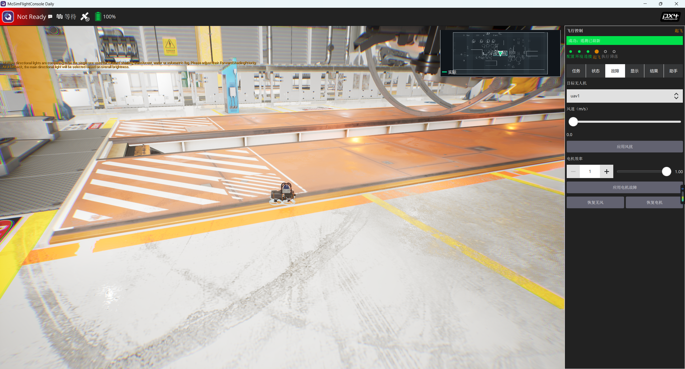

图 8-6　QGC 中的风扰、电机效率故障与恢复入口。

故障入口说明参数如何被操作者选择；下面的运行状态页用于核对飞机数量、模式和位置状态。

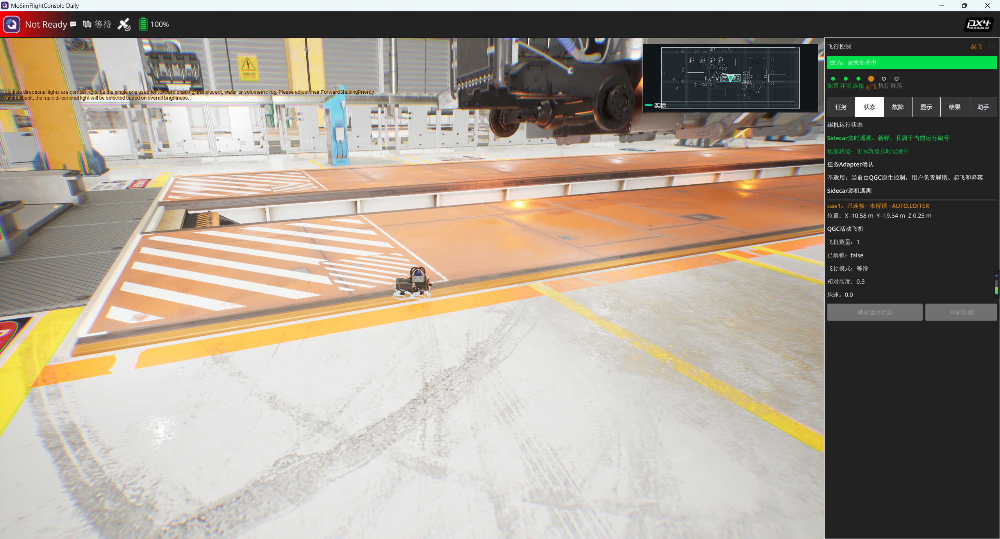

图 8-7　QGC 运行状态、飞机数量、模式和位置状态。

运行状态页确认飞行器与模式显示；下一张图把辅助感知窗口的点云、栅格和 UE 入口放在同一视图中。

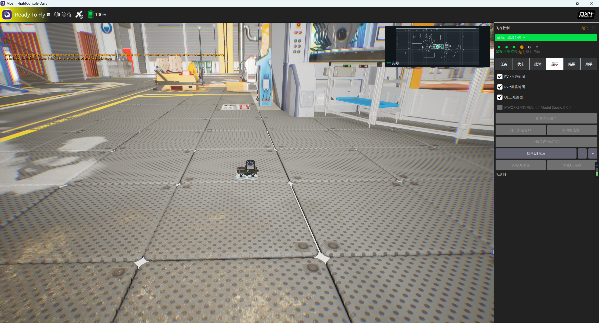

图 8-8　QGC 显示页中的 RViz 点云、栅格地图与 UE 显示入口。

辅助感知入口确认显示层之间的联动位置；最后一张图给出工厂二维地图和航迹的展开视图。

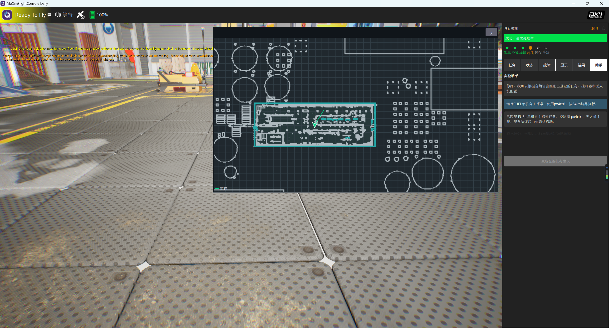

图 8-9　工厂二维地图展开视图及轨迹示意。

#### 8.5.5 感知与规划组件（RViz 可视化）

以下组件属于 ROS/Gazebo 运行线的可视化入口。是否实际启动、数据频率和规划结果，
必须以对应运行目录的日志、轨迹和指标为准；本节图片不构成 planner_ready、避障成功或
运行时验收。

**FAST-LIO 实时建图**：在启用对应 ROS/Gazebo 运行链路时，融合 MID360 激光雷达点云和 IMU，
输出位姿并构建三维点云地图；频率和质量以该次运行记录为准。


图 8-10　FAST-LIO 实时累积的三维环境点云地图。

**Diff-Planner 局部避障**：可在登记的 ROS/Gazebo 规划链路中使用 FAST-LIO 地图求解局部轨迹；
本手册不固定宣称实时性、毫秒级重规划或 planner 成功，须由对应运行证据单独证明。

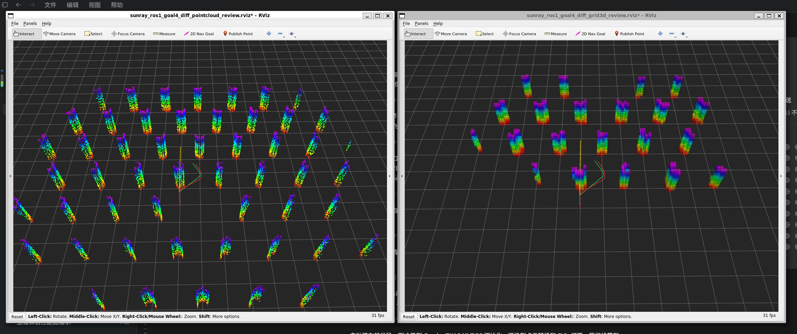

图 8-11　Diff-Planner 规划轨迹与栅格地图，绿色为参考路径，红色为优化后实际轨迹。

**FUEL 自主探索**：在对应探索运行链路中可依据未知区域信息增益选择观测目标；覆盖率、终止
条件和是否完成探索以该次运行证据为准。

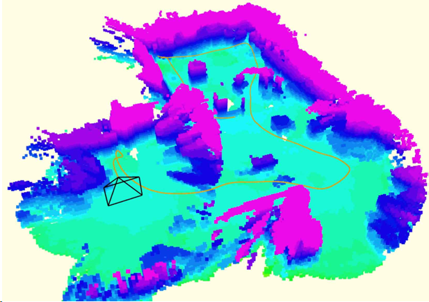

图 8-12　FUEL 自主探索过程中的点云地图与探索路径。

**Figure-8 轨迹跟踪**：用于展示参考路径与跟踪轨迹的审核图；只有绑定的运行记录和指标
存在时，才可据此讨论 px4ctrl 的实际跟踪结果。


图 8-13　RViz 中的 Figure-8 参考路径与实际跟踪轨迹对比。

## 9. 故障排查与交付自检

表 9-1　故障排查与交付自检

| 问题 | 原因判断 | 处理方式 |
|---|---|---|
| Studio 无法启动 | 授权、Syslab 或 TyAppDesigner 不可用 | 先检查 MWORKS 授权和 Syslab 模块，再检查 MOSIM_ROOT |
| 写入配置或打开模型不可用 | 任务、控制器或 FormalRunner 路由不匹配 | 切换到 available=true 的登记组合，重新写入配置，查看运行日志 |
| 打开模型后没有结果 | Studio 不会自动仿真 | 在 MWORKS 中人工完成仿真，再检查 Result.msr 和指标 |
| 结果查看器没有数据 | 仿真未完成、结果路径错误或运行记录不完整 | 从当前 Runner 和运行目录回溯，不以窗口状态补写结果 |
| 实时页面连接通过但无法准备 | 频率或实时合同不满足 | 使用实时联合仿真要求的 50 Hz，并确认单机 official_pid/ATTITUDE_THRUST 组合 |
| CMake 构建失败 | 工具链、平台 ABI 或生成文件不一致 | 在目标平台安装工具链，重新生成、构建、测试并运行哈希检查 |
| MoSim 助手不可用 | CLI 未发现、未登录或健康检查失败 | 检查本机 Codex CLI、登录状态和助手状态；核心 MWORKS 流程可继续使用 |

交付前做一次最小自检：

(1) 正确设置 MOSIM_ROOT，只加载正式模型包根。
(2) 使用登记路由写入配置，确认交接 JSON 已生成。
(3) 原生 CheckModel 通过后，由用户人工启动仿真。
(4) 保留 Result.msr、指标、运行配置和失败/阻断记录。
(5) 代码生成时保留生成文件、哈希、构建和固定向量测试；需要时另做 SIL。
(6) 不把 Studio、助手、连接预检或截图写作控制闭环、运行时或部署通过。

### 9.1 复现包最小清单

一次可交接的复现实验至少应包含：当前提交或发布版本、使用的 `controller_id` 和
`task_id`、Profile/合同哈希、运行命令或人工操作路径、`RUN_CONFIG.json`、
`RUN_RECORD.json`、`Result.msr`、原始 CSV、指标文件以及本次状态为通过、失败、阻断
或无效的明确分类。只存在旧图、窗口截图或汇总数字时，不能补写为本次复现完成。

完整入口索引、关键哈希、Linux/WSL 构建命令和发布限制见
Docs/Workflows/RELEASE_CHECKLIST.md。
