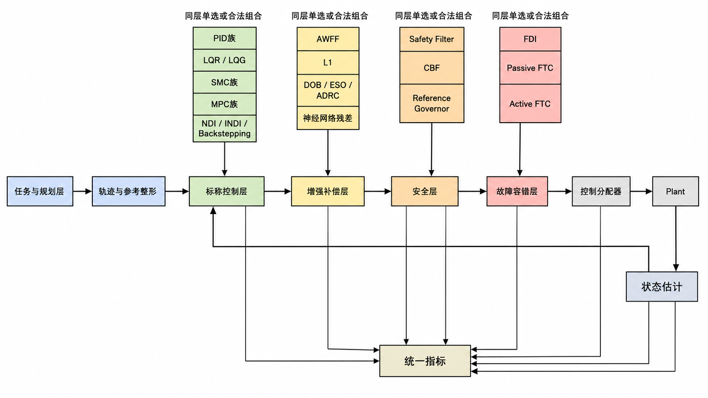
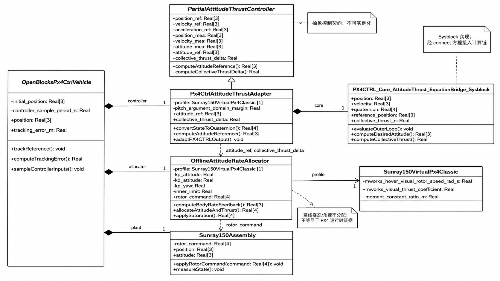
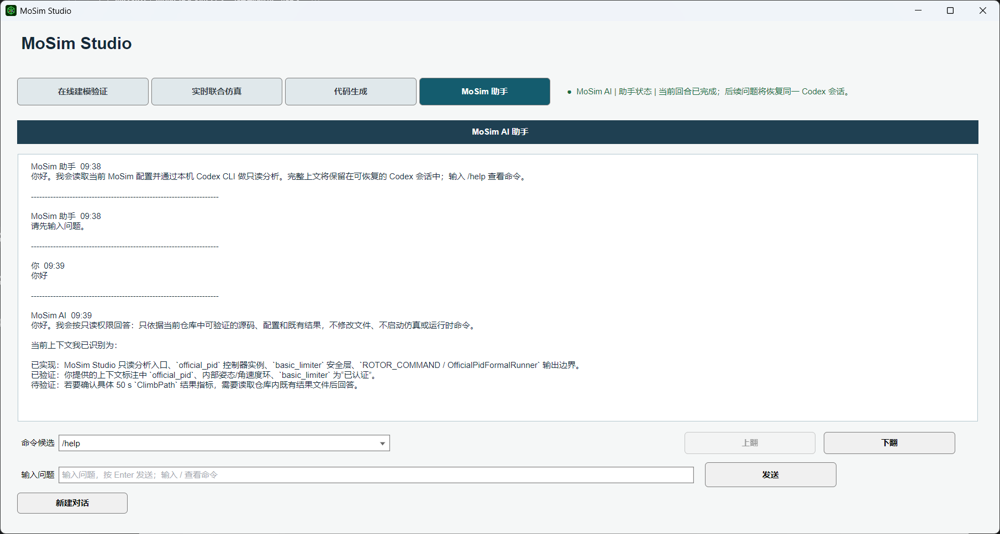
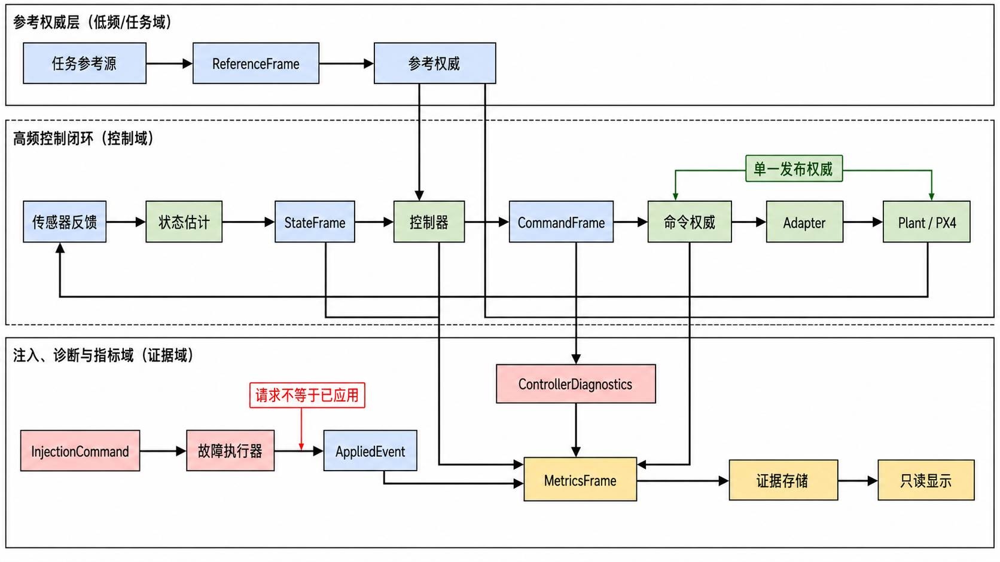
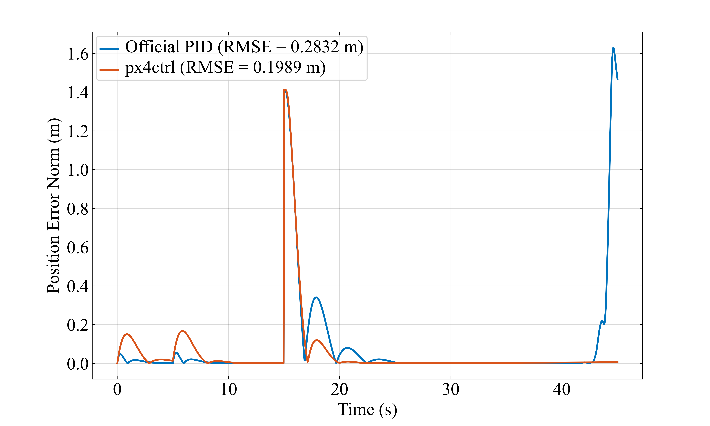

# 基于 MWORKS 的四旋翼位姿控制全链路仿真平台维护与升级

小组成员：刘致远(231304113，软件2301)；钟俊杰(231304130，软件2301)；朱尚吉(231304133，软件2301)；陈健(231304103，软件2301)；王家祺(231304120，软件2301)。

分工与答辩安排：成员职责和答辩范围见第 6 章；贡献比例由成员在提交前按实际情况填写。

## 1. 项目概述

### 1.1 项目介绍

MoSim 是基于 MWORKS/Sysplorer/Syslab 和 Modelica 的四旋翼位姿控制全链路仿真平台。平台以云纵 150 实机为参照，建立六自由度 MultiBody 机体、旋翼执行器、电机动态、控制器接口、实验 Profile、指标处理和运行时适配器，覆盖从控制器设计到 C99 代码生成和 ROS1/PX4/Gazebo 运行的工程流程。

本课程设计将 MoSim 视为一个已有项目，围绕“完善功能、修正缺陷、适应运行环境、预防后续漂移”进行维护和升级。维护对象不是单个控制算法，而是模型、配置、脚本、生成代码、测试和证据文件共同组成的软件系统。

项目已有的基本工程链路如下：

~~~text
Modelica 机体与参数 Profile
  -> 统一控制器接口与 Adapter
  -> FormalRunner 和实验 Profile
  -> MWORKS 原始结果与指标
  -> C99 生成、构建和 SIL
  -> ROS1/PX4/Gazebo 运行时适配
  -> Studio 配置与结果回链
~~~

项目维护的基本原则是保持官方模型和正式证据边界：源代码和配置是结构依据，MWORKS 原生结果是正式仿真依据，同次运行 manifest 和指标是运行时依据，Studio、QGC、RViz、UE 只承担显示或操作职责。

图 1-1 控制器路线与执行边界分层架构。

该图作为维护对象的总体分层参考，展示控制器族、增强层、安全层、容错层、分配器和公共 Plant 的连接关系。

### 1.2 项目维护内容

#### 1.2.1 新增功能性维护

为明确本节的新增功能性维护，相关对象、字段和当前边界按下表整理。

表 1-1　新增功能性维护

| 编号 | 新增功能 | 维护后的使用价值 | 主要实现和证据 |
|---|---|---|---|
| F-01 | 动力学模块所有权收敛 | 将原先隐藏在 `Vehicle.Dynamics` 中的兼容别名收敛为明确的动力学构件目录，降低包解析和后续维护歧义 | 提交 `49ba5668d8`；`Vehicle/Dynamics/package.mo` |
| F-02 | FormalRunner 分层 | 按 Base、Formal、Diagnostic 分离可复用模板、正式路线和诊断路线，减少 Runner 命名与用途混用 | 提交 `92b1e65c45`；`Experiment/Runners/` |
| F-03 | 连续旋翼命令回归夹具 | 保留参考量和测量量采样边界，移除共享旋翼命令侧 ZOH，使命令直接进入公共 Plant，并用隔离 T1 夹具复核 | 提交 `37ad8fd6e8`；`run_t1_rotor_command_harness_regression.py` |
| F-04 | 旋翼符号映射修正 | 修正 AWFF/INDI 等 ROTOR_COMMAND Adapter 中 2、4 号旋翼的符号表达，避免控制量方向与执行器合同不一致 | 提交 `bac9b48be7`；AWFF/INDI Adapter |
| F-05 | 图形入口与交付清单维护 | 将图形入口、px4ctrl 路线和生成清单的来源/哈希关系显式化，便于重新生成和审查 | 提交 `c7c6726624`、`4a2fd0a3d3`、`3c606f9b42`；`CompleteSystemGraphical.mo`、`codegen_manifest.json` |

以上功能属于平台能力扩展。它们不意味着所有控制器都已完成运行时部署，也不把路由登记自动提升为性能通过。

#### 1.2.2 新增非功能性维护

为明确本节的新增非功能性维护，相关对象、字段和当前边界按下表整理。

表 1-2　新增非功能性维护

| 编号 | 非功能性完善 | 具体措施 | 预期效果 |
|---|---|---|---|
| NF-01 | 可追溯性 | Profile、路由、manifest、原始结果和指标文件按路径关联 | 结论可以回到数据来源 |
| NF-02 | 可复现性 | 固定求解器、采样、时长、参数覆盖和源哈希 | 相同配置可以重建同类实验 |
| NF-03 | 可维护性 | 接口、Adapter、Runner、运行时适配器和 UI 分层 | 新增路线不需要复制公共 Plant |
| NF-04 | 可移植性 | C99、C ABI、CMake、CTest 和目标平台重建说明 | 生成代码不依赖单一机器的二进制 |
| NF-05 | 安全性 | 助手只读、运行时后端显式匹配、未知状态失败关闭 | 降低误操作和证据越权 |
| NF-06 | 可观察性 | 状态标签、失败分类、注入记录和运行清单 | 能区分失败、阻塞、无效和通过 |

表中的对应关系用于明确本节的对象、责任或验证边界；它需要与后续实现和结果证据共同解读，不能将单项登记直接外推为全部功能、性能或运行时验收结论。

#### 1.2.3 改正性、适应性、完善性和预防性维护

为明确本节的改正性、适应性、完善性和预防性维护，相关对象、字段和当前边界按下表整理。

表 1-3　改正性、适应性、完善性和预防性维护

| 维护类别 | 维护工作 | 结果或边界 |
|---|---|---|
| 改正性维护 | 修正旋翼命令符号映射和共享命令侧 ZOH；对生成 C 的 Init/Step 使用稳定包装；拒绝非法故障参数组合 | 通过 Adapter、Runner 基类、ABI 包装、配置校验和回归测试降低已知错误 |
| 适应性维护 | 将 Runner 迁移到 Base/Formal/Diagnostic 分层，维护图形入口和 C99 运行时交付边界 | MWORKS、代码生成和 ROS1/PX4/Gazebo 各自保留权威边界，目标机器仍需重新构建 |
| 完善性维护 | 增加七场景、灵敏度网格、任务配置写入和 Studio 工作区 | 扩大可复用场景；结构能力仍不自动升级为运行时验收 |
| 预防性维护 | 建立 schema、manifest、SHA-256、证据等级、失败关闭和源文件清单 | 防止路径漂移、参数重复维护、结果误归类和生成产物被手工覆盖 |

表中的对应关系用于明确本节的对象、责任或验证边界；它需要与后续实现和结果证据共同解读，不能将单项登记直接外推为全部功能、性能或运行时验收结论。

### 1.3 新增关键技术

(1) 模型包所有权收敛。 `Vehicle.Dynamics` 从隐藏兼容别名整理为明确的动力学构件包，降低包路径漂移和重复定义风险。
(2) Runner 分层。 Base 保存可复用的全机执行模板，Formal 保存正式控制器路线，Diagnostic 保存诊断路线，三者通过包顺序和类路径区分。
(3) 连续命令边界。 参考量和测量量仍按合同采样，ROTOR_COMMAND 直接连接公共 Plant；专项 T1 夹具只改变该边界并冻结原 G2 矩阵。
(4) Adapter 符号维护。 AWFF、INDI 等旋翼命令的奇数/偶数旋向表达显式写出，避免以字符串或隐含符号传播物理方向错误。
(5) 生成代码的源绑定。 C99 交付物由 `codegen_manifest.json` 记录源模型、生成文件、构建产物和哈希；生成核心与维护包装层分开。
(6) 图形入口可追踪。 `CompleteSystemGraphical.mo`、px4ctrl FormalRunner 和结果清单之间保持可回链关系，但图形入口本身不替代 CheckModel 或仿真证据。

## 2. 软件分析

### 2.1 软件功能分析

维护后的系统功能可以按输入、处理、输出三个阶段划分：

表 2-1　软件功能分析

| 阶段 | 功能 | 维护关注点 |
|---|---|---|
| 输入 | 选择控制器、任务、轨迹、采样率和注入参数 | 输入组合必须符合路由和 Profile 合同 |
| 配置 | 写入任务 JSON 和 Modelica harness | 配置文件是单一事实来源，不能由 UI 另存一套隐含参数 |
| 建模 | 加载参数 Profile、控制器和公共 Plant | CheckModel 是结构门，不等于仿真通过 |
| 执行 | FormalRunner 仿真、指标提取和 CFunction SIL | 必须保存原始结果、样本数和求解器信息 |
| 交付 | 生成 C99、CMake 构建、固定向量测试和哈希核验 | 生成核心与维护包装层分开 |
| 运行 | ROS1/PX4/Gazebo 任务生命周期和注入 | manifest 明确后端，运行记录独立于 MWORKS |
| 输出 | 结果、图表、失败分类和报告引用 | 无效和阻塞记录不可被改写成通过 |

表中的对应关系用于明确本节的对象、责任或验证边界；它需要与后续实现和结果证据共同解读，不能将单项登记直接外推为全部功能、性能或运行时验收结论。

### 2.2 非功能性分析

为明确本节的非功能性分析，相关对象、字段和当前边界按下表整理。

表 2-2　非功能性分析

| 属性 | 维护目标 | 检查方式 |
|---|---|---|
| 性能 | 在统一工况下计算 RMSE、终端误差、调节时间和控制输入 | MWORKS metrics、CSV 和图件 |
| 安全 | 未授权、未知窗口或后端不匹配时停止扩展动作 | 状态门、失败关闭和后端检查 |
| 易用性 | 使用者可以从 Studio 完成配置并定位原生入口 | UI 工作区、配置反馈和任务 handoff |
| 可理解性 | 控制器输出边界和结果状态可解释 | 接口文件、路由表、证据等级 |
| 可维护性 | 公共 Plant 和控制核心只保留一份 | Adapter、Registry、manifest 和测试 |
| 可移植性 | C 交付物在目标平台可重建 | CMake、CTest、哈希脚本和构建说明 |
| 可审计性 | 结论、源码、配置和结果可以逐项回链 | 结果目录、JSON 清单和报告索引 |

性能测试只在声明的实验范围内成立。比如 MWORKS SIL 的数值差异证明图形模型与生成 CFunction 在同一 MWORKS Plant 下的一致性，不能直接证明 Gazebo/PX4 运行时的性能；运行时风扰注入记录证明服务调用和任务事实，也不能单独证明抗扰能力。

### 2.3 软件缺陷

本节从软件维护角度记录缺陷或高风险缺陷，不把控制器性能失败直接当成软件代码缺陷。

表 2-3　软件缺陷

| 编号 | 缺陷现象 | 影响 | 维护处理 |
|---|---|---|---|
| D-01 | `Vehicle.Dynamics` 同时承担真实构件和隐藏兼容别名 | 包所有权不清，修改可能落到错误命名空间 | 在 `49ba5668d8` 中将动力学构件收敛到明确目录，并保留诊断目录的独立边界 |
| D-02 | Base、Formal、Diagnostic Runner 混在同一层级 | 可复用模板、正式实验和诊断记录难以分别审查 | 在 `92b1e65c45` 中按用途拆包并同步包顺序、类路径和绑定文件 |
| D-03 | 共享旋翼命令侧存在额外 ZOH，和连续 ROTOR_COMMAND 契约不一致 | 控制命令经过未声明的保持环节，回归结果不能直接代表目标边界 | 在 `37ad8fd6e8` 中移除该 ZOH；T1 仍保留 50 s `simulate_failed`，所以不能写成完全修复 |
| D-04 | AWFF、INDI 等 Adapter 的 2、4 号旋翼符号表达不一致 | 旋向和控制量方向可能与执行器分配合同不一致 | 在 `bac9b48be7` 中修正符号，并以 Adapter 源码和静态检查回归 |
| D-05 | 图形入口的结构审查语义和正式 Runner 语义容易混用 | 打开图形模型可能被误写成已完成正式仿真 | 用 `CompleteSystemGraphical.mo`、Formal Runner 类和证据标签分开表达两种入口 |
| D-06 | 生成清单与当前图形源模型的哈希可能漂移 | 无法确认 C99 产物是否对应当前源模型 | 在 `3c606f9b42` 中同步 manifest 哈希，并保留源绑定清单 |
| D-07 | 路由可用、模型可检查、仿真完成和性能通过容易被混为一个布尔状态 | 报告可能产生过度结论 | 在配置、结果和正文中拆分状态、有效性和 claim boundary |

其中 D-06 不是“把所有失败修成通过”的问题。软件维护的正确处理是保留证据、明确状态和限制结论范围。

### 2.4 代码坏味道

下列坏味道从软件构造角度识别，和报告中按控制器族分析性能的内容相区分。

表 2-4　代码坏味道

| 坏味道 | 在项目中的表现 | 重构方向 |
|---|---|---|
| 隐藏兼容别名 | `Vehicle.Dynamics` 通过多个 `extends` 别名暴露旧路径，真实所有权不明显 | 用明确的 `Dynamics` 构件包和 `LegacyDiagnostics` 诊断目录表达责任 |
| 包顺序承载架构语义 | Runner 名称、基类和诊断模型混在同一 `package.order` | 用 `Base`、`Formal`、`Diagnostic` 子包和绑定文件表达层次 |
| 隐含时间行为 | 共享旋翼命令侧的 UnitDelay 不是控制器输出合同的一部分，却影响实际执行时序 | 只在声明的参考/测量边界保留采样，对 ROTOR_COMMAND 直接连接并用 T1 夹具回归 |
| 魔法符号 | 偶数旋翼的负号散落在多个 Adapter 表达式中 | 统一检查 1、2、3、4 号旋翼的符号和分配合同 |
| 生成代码污染 | 若直接修改生成核心，重新 GenerateModelCode 后改动会消失 | 生成核心只读，业务逻辑放在共享 C ABI 包装和运行时适配层 |
| 入口语义漂移 | 图形结构入口和正式 Runner 入口可能使用相近名称 | 通过类路径、文档说明、路由和证据等级明确区分结构审查与正式仿真 |
| 哈希漂移 | 源模型、生成文件和交付记录的对应关系依赖人工记忆 | 用 `codegen_manifest.json` 保存源哈希、生成哈希和构建状态 |
| 布尔状态含义不清 | `available`、`check_model`、`simulate`、`accepted` 混成一个“成功”字段 | 使用显式状态枚举、有效性字段和 claim boundary |

这些坏味道的共同后果是修改一个局部功能时可能影响模型、运行时和报告。重构的目标是降低变化传播范围，而不是为了形式上的类数量增加抽象层。

## 3. 软件构造

### 3.1 软件体系结构设计

维护后的体系结构分为五个相互协作但权责不同的层次：

(1) 模型与参数层：Modelica MultiBody 机体、RotorActuatorCore、坐标合同和 Sunray150 参数 Profile。
(2) 控制器与接口层：控制器实现、四类输出边界、Adapter、EquationBridge 和控制分配。
(3) 实验与结果层：任务 Profile、FormalRunner、原始 Result、metrics、失败分类和图件脚本。
(4) 代码与运行时层：GenerateModelCode、生成 C99、C ABI、CMake、ROS1/PX4/Gazebo 适配器。
(5) 操作与辅助层：Model Studio、QGC、RViz、UE 和只读本地助手。

依赖关系采用从上游事实到下游适配的单向方式。控制器只依赖输出合同，公共 Plant 不依赖控制器内部实现；运行时适配器调用稳定 ABI，不复制图形控制律；报告读取结果和 manifest，不从界面状态推断性能。

本次维护把两个容易混淆的目录关系显式化。`Vehicle.Dynamics` 只承载旋翼执行器、力矩适配和相关物理构件，旧的诊断/冒烟模型放入 `Vehicle.LegacyDiagnostics`；`Experiment.Runners` 则通过 `Base`、`Formal`、`Diagnostic` 三个子包区分复用模板、正式控制器路线和诊断路线。这样做的直接收益是：修改 Runner 基类时可以限定影响面，正式结果的类路径也不再依赖隐藏兼容别名。

维护后的代码依赖可以用四个变化点概括：模型包负责物理构件，Adapter 负责控制输出合同，Runner 负责任务边界，结果清单负责事实绑定。它们分别对应提交 `49ba5668d8`、`92b1e65c45`、`37ad8fd6e8` 和 `3c606f9b42` 的维护主题；提交号用于说明变更来源，不把提交存在本身写成测试通过。

下列为 Markdown 技术底稿中的关系速览；后续 Word 排版稿使用图 3-1 和本节文字说明，不直接排印该文本块。

~~~text
Profile / 路由合同
        |
        v
控制器核心 -> Adapter -> FormalRunner -> 公共 Plant -> Result / metrics
        |                                  |
        v                                  v
生成 C99 -> C ABI -> ROS1/PX4/Gazebo       报告与图件
        ^
        |
Studio 配置与只读指引
~~~

图 3-1 控制器与执行机构类图。

该图说明抽象控制合同、px4ctrl 适配器、离线分配器和公共 Plant 的责任边界；不额外增加组件图。

### 3.2 用户界面设计

MoSim Studio 的界面按工作流而不是按底层文件组织：

表 3-1　用户界面设计

| 工作区 | 主要控件/入口 | 维护后的职责 |
|---|---|---|
| 在线建模验证 | 任务、UAV 数量、控制器、场景参数、打开模型 | 生成可追溯配置并进入 MWORKS CheckModel |
| 实时联合仿真 | 目标主机、连接、频率和故障参数 | 提供运行预检和交接信息，不代替任务执行 |
| 代码生成 | 控制器选择、打开代码生成模型 | 进入 MWORKS GenerateModelCode |
| MoSim 助手 | 当前上下文、MWORKS/QGC/结果指引 | 本地只读检索和说明，不执行项目写入 |

界面中的“可用”表示路由、入口或配置能力存在；实际模型检查、仿真、代码构建和运行时成功分别由各自证据记录确认。

图 3-2 Studio 在线建模验证界面。

界面集中展示验证任务、控制器、场景参数、配置写入入口和运行日志。

图 3-3 Studio 助手界面与控制链引导。

助手只读呈现项目上下文和控制链说明，不替代模型执行。

### 3.3 用例设计

为明确本节的用例设计，相关对象、字段和当前边界按下表整理。

表 3-2　用例设计

| 用例 | 参与者 | 维护后流程 | 失败处理 |
|---|---|---|---|
| 新建任务 | 使用者、Studio | 选择 task、controller 和参数，写入 latest.json/harness | 非法组合立即报错，不生成半成品任务 |
| 打开正式模型 | 使用者、Studio、MWORKS | Studio 请求原生打开，用户在 MWORKS 中确认 | 记录打开失败或授权阻塞 |
| 执行仿真 | 使用者、MWORKS | CheckModel 后人工启动 FormalRunner | 保存超时、提前终止或无结果状态 |
| 生成代码 | 使用者、MWORKS、CMake | CheckModel、GenerateModelCode、构建、固定向量测试 | 生成、编译或哈希失败均停止后续部署 |
| 运行任务 | 操作者、ROS1/PX4/Gazebo | 选择后端、启动任务、保存 manifest 和指标 | 后端不匹配、状态异常或注入失败时保留 blocker |
| 复核结果 | 维护者、报告脚本 | 读取原始数据、metrics、manifest 和图件 | 无效记录不进入有效比较 |

表中的对应关系用于明确本节的对象、责任或验证边界；它需要与后续实现和结果证据共同解读，不能将单项登记直接外推为全部功能、性能或运行时验收结论。

### 3.4 类设计

为明确本节的类设计，相关对象、字段和当前边界按下表整理。

表 3-3　类设计

| 类/模块 | 设计职责 | 维护收益 |
|---|---|---|
| PartialAttitudeThrustController 等接口 | 统一输入输出维度和单位 | 消除控制器与下游的直接耦合 |
| 具体 Adapter | 完成边界转换、限幅和物理量映射 | 新增算法只增加局部适配器 |
| FormalRunner | 固定 Plant、轨迹、求解器和指标输出 | 保持实验条件一致 |
| Sunray150VirtualPx4Classic | 集中物理参数和替换边界 | 避免每个控制器复制一份机体参数 |
| model_studio_task_config.py | 结构化写配置并做组合校验 | 把输入错误挡在仿真前 |
| app.jl | 组织 UI 状态和动作 | 维护界面工作流与原生入口关系 |
| Generated shared wrapper | 隔离生成符号并提供 C ABI | 避免生成源码和调用方互相污染 |
| Result/Manifest 记录 | 保存状态、来源和哈希 | 支持结果复核和报告回链 |

表中的对应关系用于明确本节的对象、责任或验证边界；它需要与后续实现和结果证据共同解读，不能将单项登记直接外推为全部功能、性能或运行时验收结论。

### 3.5 数据设计

维护后的数据分为四类：

(1) 源数据：Modelica、Julia、Python、C/C++ 和配置源文件。
(2) 输入合同：控制器路由矩阵、实验 Profile、任务配置和运行时后端目录。
(3) 观测数据：Result.msr、CSV、运行日志、注入样本和同次任务指标。
(4) 交付索引：RUN_MANIFEST、CODEGEN_MANIFEST、哈希清单、状态 JSON 和报告图件 manifest。

数据对象之间的绑定关系为：

下列为 Markdown 技术底稿中的追溯链速览；Word 排版稿改由本段说明和对应表格承载，不直接排印该文本块。

~~~text
controller_id + task_id + profile_hash
  -> runner / model / solver
  -> raw result + metrics
  -> evidence level + claim boundary
  -> report figure / table
~~~

该结构避免用文件名猜测控制器身份，也避免将历史记录、当前源状态和结构截图放到同一个无类型目录中。

### 3.6 设计模式

为明确本节的设计模式，相关对象、字段和当前边界按下表整理。

表 3-4　设计模式

| 设计模式 | 应用位置 | 解决的问题 |
|---|---|---|
| Adapter | 控制器输出边界、C ABI、ROS1 运行时 | 将不同接口转换为稳定公共合同 |
| Strategy | 任务轨迹、控制器路由和运行时后端选择 | 把可变策略从固定流程中分离 |
| Registry | 控制器目录、Studio 路由和后端目录 | 用数据登记变化点，减少条件分支 |
| Template Method | FormalRunner 和部分控制器接口 | 固定公共仿真步骤，保留算法实现差异 |
| Facade | Studio 工作区和结果入口 | 对使用者隐藏多工具联动细节 |
| Builder | 任务 JSON 与临时 Modelica harness 生成 | 逐步构造合法的实验配置 |
| Repository/Manifest | Results、metrics、运行清单和代码清单 | 统一读取结果状态、来源和哈希 |
| Fail-closed Policy | 授权、后端、配置和证据状态门 | 未知或不满足条件时阻止错误升级 |

这些模式服务于真实变化点：控制器和平台会增加，任务参数会组合，生成代码会重新导出，结果状态可能失败。模式不用于把简单数据结构过度包装。

## 4. 软件实现

### 4.1 新增功能展示

本节的代码块是 Markdown 技术底稿，用于把维护结论回链到项目真实源码；每段只保留能够说明责任边界的最小摘录。后续 Word 排版稿只保留相应的职责说明、图件和源码路径，不直接排印这些代码块。

#### 4.1.1 任务配置和场景注入

维护后的任务写入器接收任务 ID、控制器 ID、风扰、质量/惯量倍率和四路电机效率，并生成结构化配置。对正式任务，配置包含 runner class、轨迹类、时长、采样和参数覆盖；对非法电机故障，写入器要求只有一个转子发生效率变化；对未登记控制器，直接抛出错误。

源码：[任务配置校验器](../../Scripts/ui/model_studio_task_config.py)。下列摘录先检查任务的机体数、地图和故障目标，再把正式任务限定到已登记且可用的 Runner，避免先生成半成品 harness 再在 MWORKS 中失败。

~~~python
def validate_selection(
    task_id: str,
    controller_id: str,
    vehicle_count: int,
    map_id: str,
    fault_target_uav: int,
) -> tuple[str, dict[str, Any]]:
    if not 1 <= vehicle_count <= 9:
        raise ValueError("vehicle_count_must_be_within_1_and_9")
    if map_id not in MAP_IDS:
        raise ValueError("unknown_map_id")
    if not 1 <= fault_target_uav <= vehicle_count:
        raise ValueError("fault_target_uav_must_be_within_vehicle_count")

    if task_id in FORMAL_TASK_IDS or task_id in LEGACY_INJECTION_TASK_IDS:
        if vehicle_count != 1:
            raise ValueError("formal_task_requires_single_uav")
        if map_id != "blank":
            raise ValueError("formal_task_requires_blank_map")
        route = FORMAL_CONTROLLER_ROUTES.get(controller_id)
        if route is None or not bool(route["available"]):
            raise ValueError("formal_task_controller_has_no_registered_runner")
        return "formal", copy.deepcopy(route)
~~~

~~~text
用户选择
  -> 配置校验
  -> latest.json
  -> 临时 Modelica harness
  -> MWORKS 原生 CheckModel
  -> 用户启动 FormalRunner
~~~

图 4-1 Profile 配置与状态注入链路。

任务参考、状态估计、控制器、命令权限、Adapter、Plant 和指标存储均在图中具有明确位置。

#### 4.1.2 统一控制器接口

本次维护以 ROTOR_COMMAND Adapter 为例说明接口重构。AWFF 和 INDI 都继承同一个部分控制器接口，输入侧接收参考、位置、速度和姿态，输出侧只声明四路旋翼命令。源码：[AWFFRotorAdapter.mo](../../Models/MoSimQuadrotorModel/Control/Adapters/AWFFRotorAdapter.mo)。修正后的 AWFF 关键片段如下：

~~~modelica
model AWFFRotorAdapter
  extends MoSimQuadrotorModel.Control.Interfaces.PartialRotorCommandController;
  parameter MoSimQuadrotorModel.Parameters.Sunray150VirtualPx4Classic profile;
  parameter Real hover_speed = profile.mworks_hover_visual_rotor_speed_rad_s;
  parameter Real command_scale = hover_speed / 13.985413115099604;
  MoSimQuadrotorModel.Control.Implementations.Sysblocks.AWFF_FullControllerEquation_Sysblock core;
equation
  core.x_error = position_ref[1] - position_mea[1];
  core.y_error = position_ref[2] - position_mea[2];
  core.z_error = position_ref[3] - position_mea[3];
  rotor_command = {hover_speed + command_scale * core.y,
    -hover_speed + command_scale * core.y1,
    hover_speed + command_scale * core.y2,
    -hover_speed + command_scale * core.y3};
end AWFFRotorAdapter;
~~~

其中第 2、4 路的负号是本次 `bac9b48be7` 修正的实际内容。该结构使控制器核心、公共姿态环、角速度环、分配器和执行器各自保持稳定责任；类似修正同步应用于 INDI、L1、Linear MPC Rotor 等共享旋翼命令 Adapter。

#### 4.1.3 共享 Runner 的时间边界

`FormalRotorCommandRunnerBase.mo` 的维护重点是删除未在控制合同中声明的共享命令侧保持。参考量、位置测量和姿态测量仍保留 100 Hz 的采样边界，控制器已经产生的旋翼命令则直接进入 Plant。维护前后的核心连接如下：

~~~modelica
// 维护前：命令被额外保持一次
connect(controller.rotor_command, sampled_rotor_command.u);
connect(sampled_rotor_command.y, plant.rotor_command);

// 维护后：保留输入边界，命令连续进入公共 Plant
connect(controller.rotor_command, plant.rotor_command);
rotor_command = controller.rotor_command;
~~~

当前源码：[FormalRotorCommandRunnerBase.mo](../../Models/MoSimQuadrotorModel/Experiment/Runners/Base/FormalRotorCommandRunnerBase.mo)。实际实现把参考量和测量量保持在 Runner 边界内，而旋翼命令通过一条直接 `connect` 进入 Plant；这就是删除命令侧额外保持后保留下来的时间合同。

~~~modelica
parameter Real controller_sample_period_s(unit = "s") = 0.01
  "External reference and measurement hold period";
Modelica.Blocks.Discrete.UnitDelay sampled_position_ref[3](
  each samplePeriod = controller_sample_period_s,
  each y_start = 0);
Modelica.Blocks.Discrete.UnitDelay sampled_position[3](
  each samplePeriod = controller_sample_period_s,
  each y_start = 0);

equation
  connect(reference.position_command, sampled_position_ref.u);
  connect(sampled_position_ref.y, controller.position_ref);
  connect(plant.position, sampled_position.u);
  connect(sampled_position.y, controller.position_mea);
  connect(controller.rotor_command, plant.rotor_command);
  rotor_command = controller.rotor_command;
~~~

该改动只针对 Runner 的命令侧时间语义，不修改 Official PID Adapter 或 Sunray150 Plant。隔离 T1 结果显示 5 s 和 10 s 记录通过，但 50 s 记录在 42.97 s 处 `simulate_failed`，因此本案例的正确结论是“问题定位和局部修正已完成，50 s 基线仍阻塞”，而不是“全部回归通过”。

#### 4.1.4 C99 交付和运行时后端

C99 生成目录保存生成核心、C ABI 包装、CMakeLists、固定向量测试、代码生成清单和哈希脚本。共享入口 MosimPx4ctrlGeneratedGraphStepScalar 接收 17 个标量输入并输出 8 个控制量，运行时适配器负责把生成的期望加速度转换为物理推力。

源码：[C ABI 头文件](../../src/control/codegen/px4ctrl/px4ctrl_graphical_generated_shared.h)。生成方程文件保持不手改，运行时只调用以下稳定接口；输入引用、测量和偏航状态均为标量，输出为期望加速度、姿态命令和推力，便于 CMake 测试与 ROS 适配器复用。

~~~c
#ifdef __cplusplus
extern "C" {
#endif

void MosimPx4ctrlGeneratedGraphStepScalar(
  double ref_px, double px, double ref_vx, double vx, double ref_ax,
  double ref_py, double py, double ref_vy, double vy, double ref_ay,
  double ref_pz, double pz, double ref_vz, double vz, double ref_az,
  double yaw_mea, double ref_yaw,
  double *desired_acc_x,
  double *desired_acc_y,
  double *desired_acc_z,
  double *roll_cmd,
  double *pitch_cmd,
  double *yaw_cmd,
  double *collective_thrust_n,
  double *normalized_thrust);

#ifdef __cplusplus
}
#endif
~~~

图 4-2 C99 生成与部署验证链路。

图中明确区分模型检查、代码生成、编译、SIL 数值比较和 ROS/Gazebo 任务验证，便于定位维护环节。

### 4.2 代码重构前后对比

为明确本节的代码重构前后对比，相关对象、字段和当前边界按下表整理。

表 4-1　代码重构前后对比

| 重构点 | 重构前风险 | 重构后结构 | 可观察收益 |
|---|---|---|---|
| 模块所有权 | 真实动力学构件和兼容别名混在同一包中 | `Vehicle.Dynamics` 承载真实构件，诊断模型单独归档 | 变更入口明确，减少命名空间误用；提交 `49ba5668d8` |
| Runner 组织 | Base、Formal、Diagnostic 模型平铺在同一层 | 三个子包分别承载模板、正式路线和诊断路线 | 类路径和结果绑定更容易审查；提交 `92b1e65c45` |
| 旋翼命令时序 | 控制器命令经过未声明的命令侧 ZOH | 仅保留参考/测量采样，命令直接连接 Plant | 时间语义显式；提交 `37ad8fd6e8`，但 T1 50 s 仍失败 |
| 旋翼符号映射 | 偶数旋翼的负号表达与执行器合同不一致 | Adapter 中显式使用 1、2、3、4 路符号 | 降低方向错误风险；提交 `bac9b48be7` |
| 图形入口 | 结构入口和正式 Runner 入口容易被同名路径混淆 | 通过 `CompleteSystemGraphical`、Formal Runner 和证据标签区分 | 截图、CheckModel 和仿真结果分层 |
| 生成交付 | 生成文件与业务包装混在一起，源绑定依赖人工记忆 | 生成核心只读，包装层单独维护，manifest 记录哈希 | 重新生成后可核验漂移；提交 `3c606f9b42` |
| 结果判定 | `available`、`simulate`、`accepted` 混用 | 状态字段、有效性和 claim boundary 分开 | 失败和阻塞不被误写成通过 |

表中的对应关系用于明确本节的对象、责任或验证边界；它需要与后续实现和结果证据共同解读，不能将单项登记直接外推为全部功能、性能或运行时验收结论。

图 4-3 FormalRunner 的四类输出边界与执行信号流。

图中展示 ATTITUDE_THRUST、BODY_RATE_THRUST、WRENCH 与 ROTOR_COMMAND 四条链路的 Runner、单位转换、限幅和公共 Plant 边界。

图 4-4 MWORKS 建模、仿真、数据导出与 TyPlot 可视化工具链。

图中将模型问题、参数问题、接口/坐标系问题和运行问题纳入反馈闭环；其流程图不替代单次正式结果。

图 4-5 源绑定、代码生成与部署追溯链路。

图中保留 `source commit`、参数哈希和生成哈希等追溯字段；该图说明交付可追溯性，不把提交信息写成性能证据。

## 5. 软件测试

### 5.1 测试计划

软件维护后的测试目标包括新增功能正确性、接口兼容性、配置边界、代码生成一致性、运行时后端识别和结果可追溯性。测试顺序遵循先静态、再单元、再 MWORKS、再独立运行时的原则：

(1) 检查源码、配置、路由和生成目录的存在性与格式。
(2) 运行任务配置写入器、路由表、C ABI 包装和运行时契约的自动化测试。
(3) 在 MWORKS 中执行 CheckModel，确认模型结构和接口可检查。
(4) 执行 FormalRunner，确认 Result.msr、样本数和指标文件可读。
(5) 运行图形模型与生成 CFunction 的同条件 SIL。
(6) 在 ROS1/PX4/Gazebo 中确认 C99 后端、任务生命周期和注入证据。
(7) 对测试失败进行缺陷分类，并将结果边界写回正文。

按模板要求，测试记录分为四类：界面测试检查 Studio 的字段、状态和入口显示；手动功能测试检查配置写入后能否正确交接到 MWORKS 原生入口；自动功能测试检查包路径、接口、Adapter、C ABI 和 manifest；性能/回归测试只引用有完整原始记录的 MWORKS 或运行时结果。四类证据分别记录，不能用一张界面截图替代自动化或性能测试。

### 5.2 测试环境

为明确本节的测试环境，相关对象、字段和当前边界按下表整理。

表 5-1　测试环境

| 环境 | 测试对象 | 说明 |
|---|---|---|
| Windows + MWORKS Syslab/Sysplorer | Modelica、FormalRunner、原生结果 | MWORKS 是正式模型和仿真证据权威 |
| Python 配置和测试工具 | task config、路由、结果契约 | 负责结构化输入校验和静态回归 |
| Ubuntu 20.04 + ROS1 Noetic + PX4 + MAVROS + Gazebo Classic | C99 运行时 | 独立于 MWORKS 的运行时证据 lane |
| GCC/CMake/CTest | 生成 C 交付物 | 目标平台必须重新构建，不能直接假定已有 Linux 共享库可用 |
| Julia/Syslab/TyPlot | 指标和图件 | 读取结果，不修改 MWORKS 原始结果 |

表中的对应关系用于明确本节的对象、责任或验证边界；它需要与后续实现和结果证据共同解读，不能将单项登记直接外推为全部功能、性能或运行时验收结论。

### 5.3 设计测试用例

为明确本节的设计测试用例，相关对象、字段和当前边界按下表整理。

表 5-2　设计测试用例

| 编号 | 测试用例 | 输入 | 预期输出 | 类型 |
|---|---|---|---|---|
| ST-01 | 正式包根检查 | Models/MoSimQuadrotorModel/package.mo | 只存在一个项目正式包根 | 静态检查 |
| ST-02 | 路由覆盖检查 | 48 条控制器路由和 Runner 文件 | 路由字段、Runner 类和边界可解析 | 配置测试 |
| ST-03 | 风扰配置 | gust_force=0.25 N | 生成 formal v2 Profile 和 harness | 自动化测试 |
| ST-04 | 参数失配配置 | mass/inertia scale=1.3 | 质量与三个惯量倍率同步 | 自动化测试 |
| ST-05 | 非法电机组合 | 同时降低多个转子效率 | 抛出明确 ValueError，不生成任务 | 自动化测试 |
| ST-06 | C ABI 包装 | 固定标量输入序列 | Init 只执行一次，Step 输出稳定 | C 固定向量 |
| ST-07 | 运行时后端契约 | graphical_px4ctrl_c99 | CMake、脚本和 manifest 后端一致 | Python 静态测试 |
| ST-08 | 七场景结果有效性 | Official PID 与 px4ctrl 七场景 | 12 条有效、2 条无效单独统计 | MWORKS 指标 |
| ST-09 | 灵敏度总账 | 三组各 8 条长时记录 | 17 通过、3 物理失败、4 执行阻塞 | 结果分类 |
| ST-10 | MWORKS SIL | 50 s、5001 样本 | 三类差异低于门限 | 正式仿真 |
| ST-11 | C99 名义任务 | 起飞、悬停、降落 | 任务生命周期完成并生成指标 | ROS1 运行时 |
| ST-12 | 注入记录 | 风扰和单转子效率变化 | 注入服务/故障样本/复位命令可回链 | 运行时事实 |
| ST-13 | Studio 界面状态与入口 | 控制器、任务、参数和当前状态显示一致 | 界面/手动 |
| ST-14 | Runner 分层与动力学包归属 | Base、Formal、Diagnostic 和 Dynamics 路径唯一且可解析 | 静态回归 |
| ST-15 | T1 旋翼命令回归 | 5 s/10 s 记录通过；50 s 失败单独保留 | MWORKS 回归结果 |

表中的对应关系用于明确本节的对象、责任或验证边界；它需要与后续实现和结果证据共同解读，不能将单项登记直接外推为全部功能、性能或运行时验收结论。

### 5.4 测试用例执行

当前证据同时包含维护回归和项目基线引用，二者在表中明确区分：

表 5-3　测试用例执行

| 测试对象 | 执行结果 | 结论边界 |
|---|---|---|
| 任务配置写入器 | 能写入正式任务、参数变体和手动 FormalRunner 任务，并拒绝非法组合 | 证明配置契约，不等于 MWORKS 已运行 |
| Runner 分层与 Adapter 静态检查 | 当前源码和包顺序包含 `Base`、`Formal`、`Diagnostic`，AWFF/INDI 的符号表达已修正 | 证明结构维护，不等于每条路线性能通过 |
| T1 旋翼命令回归 | 5 s、10 s Official PID 记录为 `pass`；50 s 记录在 42.97 s 处 `simulate_failed`，`T1_FIX_STATUS` 总状态为 `blocked` | 证明 ZOH 修正尚未恢复 50 s 基线，失败必须保留 |
| C99 代码交付(项目基线) | 生成核心、共享包装、CMake、CTest 和哈希清单已登记 | 证明交付物可审查，目标平台仍需重新构建 |
| MWORKS 图形/CFunction SIL(项目基线) | 50 s、5001 个样本；位置 RMSE 差 1.1481051588325626e-13 m，姿态最大差 3.2070318622956506e-12 rad，旋翼指令最大差 7.354117315117037e-11 rad/s | 仅为 MWORKS whole-aircraft SIL，不是 T1 Runner 回归 |
| 七场景 A/B(项目基线) | 14 条总记录，12 条 valid、2 条 invalid，后者为电机效率故障记录 | 只覆盖 Official PID 和 px4ctrl |
| C99 ROS1/Gazebo 名义任务(项目基线) | graphical_c99/graphical_px4ctrl_c99 后端完成起飞、悬停、降落和解除解锁 | 只覆盖 px4ctrl 生成 C 路线 |
| C99 风扰/电机故障注入(项目基线) | 保留注入调用、故障期观测和恢复记录 | 证明注入/恢复事实，不是单独抗扰或 FTC 验收 |

本次课程报告补充的自动化测试实际执行命令如下。它覆盖 px4ctrl 的 MWORKS Adapter、Studio 目录与任务交接、生成 C 的运行时契约、代码生成运行时检查和 OpenBlocks 模型合同，共计 45 项；该批测试验证源码、配置和交付契约，不替代 MWORKS 原生仿真或 ROS1 飞行运行。

~~~powershell
python -m pytest `
  Scripts/tests/test_px4ctrl_mworks_adapter.py `
  Scripts/tests/test_model_studio_task_handoff.py `
  Scripts/tests/test_model_studio_catalog.py `
  Scripts/tests/test_px4ctrl_graphical_c99_runtime_contract.py `
  Scripts/tests/test_mworks_codegen_runtime.py `
  Scripts/tests/test_px4ctrl_open_blocks_mworks.py
~~~

实际输出为 `45 passed in 3.30s`。其中 Adapter 合同 10 项、任务交接 13 项、Studio 目录 6 项、C99 运行时契约 8 项、代码生成运行时 4 项、OpenBlocks 合同 4 项。该结果与本节的 MWORKS 结果、SIL 和 ROS1/Gazebo 记录并列保存，分别说明不同层次的验证事实。

### 5.5 测试结果及分析

测试结果支持以下维护判断：

(1) 统一接口和 Registry 降低了新增控制器接入的修改范围。
(2) 配置校验把一部分错误前移到仿真前，减少了无意义的 MWORKS 运行。
(3) C ABI 包装、CMake 和固定向量测试把生成代码与运行时调用边界显式化。
(4) manifest、metrics 和 claim boundary 使“通过、失败、无效、阻塞”可以独立呈现。
(5) 运行时后端检查能够防止把原始控制核心和 graphical_px4ctrl_c99 记录混为一谈。

T1 回归还给出一个重要的维护结论：删除命令侧 ZOH 解决了一个明确的时间边界问题，但没有自动恢复 Official PID 的 50 s 基线。5 s 和 10 s 记录通过，50 s 记录在 42.97 s 处仿真失败；剩余影响来自共享 Runner 中仍存在的参考、位置和姿态采样边界。该结果说明回归夹具同时承担发现残余问题的作用，不能只挑选短时通过记录写入总结。

当前仍需保留的风险包括：部分长时记录执行阻塞，严格运行时性能 A/B 尚不覆盖全部控制器，规划和故障容错的完整闭环还需要独立的检测、隔离、重构和恢复证据。

图 5-1 正向验证与问题反馈流程。

测试流程覆盖需求/任务、MWORKS 建模、控制器设计、MIL、结果、代码生成、SIL 和 ROS1/PX4/Gazebo 部署。

图 5-2 阶跃响应场景位置误差对比。

曲线比较 Official PID 与 px4ctrl 在代表性阶跃场景中的位置误差。

图 5-3 风扰场景位置误差对比。

曲线说明该对照在风扰场景下的误差变化，不能外推为所有路线均已通过。

图 5-4 C99 后端在 Gazebo 中的 Figure8 轨迹跟踪。

这是运行时轨迹复核画面，正式性能判断仍需结合同次 manifest 与指标文件。

### 5.6 缺陷修复

为明确本节的缺陷修复，相关对象、字段和当前边界按下表整理。

表 5-4　缺陷修复

| 缺陷编号 | 修复动作 | 回归检查 |
|---|---|---|
| D-01 | 提交 `49ba5668d8` 收敛 `Vehicle.Dynamics` 的构件所有权，移除隐藏兼容别名 | `Vehicle/Dynamics/package.mo`、包顺序和模型路径检查 |
| D-02 | 提交 `92b1e65c45` 将 Runner 分为 `Base`、`Formal`、`Diagnostic` | Runner package order、绑定 JSON 和类路径检查 |
| D-03 | 提交 `37ad8fd6e8` 删除共享旋翼命令侧 ZOH，保留输入采样边界 | T1 5 s/10 s `pass`，50 s `simulate_failed`；总体状态保留为 `blocked` |
| D-04 | 提交 `bac9b48be7` 修正 AWFF、INDI 等 Adapter 的 2、4 号旋翼符号 | Adapter 源码静态检查和对应 Modelica 路由检查 |
| D-05 | 同步图形入口的架构审查语义、Formal Runner 类路径和显示说明 | `CompleteSystemGraphical.mo`、CheckModel/结果证据分层 |
| D-06 | 提交 `3c606f9b42` 同步图形 px4ctrl 的生成清单哈希 | `codegen_manifest.json`、`hash_check` 和 C99 交付记录 |
| D-07 | 对生成 C 使用稳定 C ABI 包装，并把生成核心与维护代码分开 | CMake/CTest、固定向量和 `test_px4ctrl_mworks_adapter.py` |
| D-08 | 将 available、CheckModel、simulate、valid 和 accepted 分开记录 | 结果 JSON 的状态字段和报告证据边界 |

表中的对应关系用于明确本节的对象、责任或验证边界；它需要与后续实现和结果证据共同解读，不能将单项登记直接外推为全部功能、性能或运行时验收结论。

## 6. 课设总结

### 6.1 成果总结

通过本次软件构造课程设计，MoSim 的维护对象被拆成可定位的代码和证据边界：动力学包所有权收敛、Runner 分层、旋翼命令时序修正、Adapter 符号修正、图形入口维护以及生成清单哈希同步。维护报告不把这些提交的存在写成性能通过，而是用隔离回归、静态契约和结果状态说明维护效果。

本次维护的代表性结论是“局部修正有效，但长时基线仍有残余问题”：T1 的 5 s 和 10 s Official PID 记录通过，50 s 记录在 42.97 s 处仿真失败。该负结果被保留为后续维护输入，也说明软件测试必须覆盖完整目标时长，不能只依据短时冒烟结果收口。

### 6.2 维护工作的认识

软件维护不仅是修复报错，也包括把隐含约定变成接口、把目录结构变成依赖边界、把时间语义写进 Runner、把生成产物和人工维护代码分开、把失败记录变成可解释状态。对仿真项目而言，结果文件和证据边界同样属于软件质量的一部分；没有原始结果、指标和来源路径，界面看起来正常也不能支撑工程结论。

### 6.3 维护实践结论

维护工作需要同时保持接口、配置、生成产物和验证记录的一致性。功能可运行并不等同于系统可维护；模块职责、变更范围和复核依据应在修改前后持续记录，以避免后续调整破坏已有结果。

**刘致远。** 本次工作使我认识到系统方案、代码改动和报告结论必须同时保持一致。前期项目成果较多，只有先明确模型、配置、结果和运行时记录各自能说明什么，后续维护才能避免把局部修复、界面状态或短时测试放大为整体结论。今后我会继续用明确的需求边界、接口合同和验证记录组织项目协作。

**钟俊杰。** 通过本次实践，我认识到抽象并不是为了增加层次，而是为了隔离变化。控制器、适配器、任务配置和运行入口各自承担清晰责任后，局部调整才不会扩散成难以定位的问题。以后我会更关注依赖方向和接口稳定性，用更小的改动解决更具体的问题。

**朱尚吉。** 这次课程设计使我体会到配置管理和文档管理同样属于软件质量。参数、路径和运行条件如果只存在于口头说明中，项目很难被他人复现或维护。今后我会及时记录配置来源、版本和使用条件，并通过清单和检查步骤减少环境差异带来的问题。

**陈健。** 我在本次实践中进一步理解了测试的价值。测试不仅要覆盖正常流程，还应明确失败、超时和无效结果的处理方式；否则看似通过的演示无法说明系统真正满足要求。以后我会把测试前提、预期结果和异常处理写得更完整，让测试结论更可信。

**王家祺。** 本次项目让我认识到协作开发需要共享事实，而不仅是共享代码。成员之间统一使用任务配置、提交记录、结果清单和问题状态进行沟通，可以减少重复劳动并提高交付质量。今后我会在协作中主动同步关键变更和验证结果，促进项目持续迭代。
