# 基于 MWORKS 的四旋翼位姿控制全链路仿真平台

小组成员：刘致远(231304113，软件2301)；钟俊杰(231304130，软件2301)；朱尚吉(231304133，软件2301)；陈健(231304103，软件2301)；王家祺(231304120，软件2301)。

分工与答辩安排：分工和答辩职责见 7.1 节；贡献比例由成员在提交前按实际情况填写。

## 1. 实践目的与要求

本项目综合实践以 MoSim 四旋翼位姿控制全链路仿真平台为对象，目标是完成一次覆盖需求分析、体系结构设计、软件构造、测试验证、项目管理和后续维护的综合实践。项目不把“能打开模型”作为唯一成果，而是把模型、控制器、实验配置、原始结果、指标和运行时记录组织成可追溯的工程链路。

本实践的具体要求如下：

(1) 建立以云纵 150 实机为参照的四旋翼虚拟机体，形成可检查、可替换的参数 Profile 和公共 Plant。
(2) 将不同输出层级的控制器接入统一的全机执行链路，在相同任务和指标口径下进行对比。
(3) 提供任务、轨迹、风扰、参数失配和电机效率等场景配置，并保存配置与结果之间的对应关系。
(4) 完成代表性控制器 px4ctrl 的图形化建模、代码生成、构建和 MWORKS 内整机 SIL 对比。
(5) 将生成的 C99 控制核心接入独立的 ROS1/PX4/Gazebo 运行时，保留任务生命周期和注入记录。
(6) 通过结构检查、自动化测试、结果指标和失败记录，对软件质量和结论边界进行说明。

本报告采用分层验收原则：模型结构、静态文件、实验夹具、MWORKS 正式结果、独立 ROS1 运行记录和显示层截图分别归类。路由可打开不等于仿真完成，CheckModel 通过不等于性能通过，运行时注入确认也不等于控制器鲁棒性已经证明。

## 2. 项目概述

### 2.1 项目背景及意义

工业仿真软件的难点不只是数值求解器，而是长期积累的物理模型、控制算法、工程参数、实验流程和部署工具链。四旋翼控制研究通常需要在物理建模、控制器设计、仿真求解、代码生成和运行时部署之间反复切换。如果这些环节分别依赖不同工具，模型变量、坐标系、采样时间和故障语义容易发生漂移，实验结果也难以复核。

MoSim 选择 MWORKS、Sysplorer、Syslab 与 Modelica 作为核心技术栈，以云纵 150 实机为参照，建立从六自由度物理模型到控制器验证和代码部署的统一工程环境。Modelica 源码可检查、接口边界可审查，Profile 和结果文件能够记录每次实验所使用的参数与任务。该项目的意义在于为教学、控制算法研究和工业场景仿真提供一个可继续维护的国产平台实践样例。

本项目面向 A8 四旋翼位姿控制与仿真平台赛题，主要链路为：

~~~text
参数 Profile
  -> MWORKS/Modelica 物理模型
  -> 控制器 Adapter 与 FormalRunner
  -> 原生结果和指标
  -> C99 代码生成与 SIL
  -> ROS1/PX4/Gazebo 运行时记录
  -> 报告图表和可追溯证据
~~~

图 2-1 控制器路线、执行边界与统一指标。

图中表达任务与规划层、控制器族、增强/安全/容错层、分配器和公共 Plant 的职责边界。

### 2.2 关键技术问题

(1) 异构控制器如何共享同一个被控对象

控制器可能输出姿态与总推力、机体角速度与总推力、六维力矩或四路旋翼命令。如果每条路线都直接连接独立的执行器和机体模型，就无法保证比较条件一致。项目因此定义了 ATTITUDE_THRUST、BODY_RATE_THRUST、WRENCH 和 ROTOR_COMMAND 四类输出边界，并通过 Adapter 和 FormalRunner 把控制律接入公共 Plant。

(2) 物理参数如何可追溯和可替换

云纵 150 虚拟机体的参数分为几何、质量、惯量、气动和传感器五层。几何和质量层有实物装配或称量依据，惯量、气动系数和电机动态保留工程种子，同时在 Profile 中标出替换边界。这样可以在取得新的辨识数据后只替换参数层，不破坏控制器和实验接口。

(3) 实验条件如何复用且不污染控制器配置

任务轨迹与状态注入被分开管理。ClimbPath 用于 50 s 名义筛查，七场景 Profile 负责悬停、阶跃、Figure8、螺旋、风扰、参数失配和电机效率故障。风扰、质量/惯量缩放以及电机效率变化属于 Runner/Plant 参数，不作为控制器重新调参的依据。

(4) 图形模型如何转化为可构建的软件产物

px4ctrl 的位置/速度外环在 MWORKS.Sysblock 中实现，通过 EquationBridge 接入姿态环、角速度环和控制分配。项目使用 MWORKS GenerateModelCode 导出 C99，随后通过 CMake、固定输入测试和 MWORKS CFunction Runner 检查代码产物，最后再进入独立 ROS1/PX4/Gazebo 运行时。

(5) 如何避免把显示状态写成性能结论

Studio、QGroundControl、RViz 和 UE 分别承担配置、操作、轨迹/点云显示和工业场景展示职责。性能结论来自 MWORKS 原始结果、指标文件和运行时同次记录；窗口截图只证明结构或操作状态，不单独证明控制器通过。

### 2.3 项目特色与创新

(1) 统一控制器接入合同。 通过四类输出边界、Adapter、Runner 和 Profile，把七个算法族的 46 条算法路线以及 Official PID、px4ctrl 两条基线，共 48 条路线放入同一公共 Plant；新增路线只需声明边界并实现相应接口。
(2) 参数和实验双 Profile 设计。 机体物理参数与任务扰动参数分离，配置可冻结、可回链，支持名义、风扰、参数失配和电机效率场景复用。
(3) 图形设计到代码交付。 px4ctrl 形成“图形 Sysblock -> C99 -> 构建 -> MWORKS 整机 SIL”的可审查链路，代码目录同时保存生成清单、C ABI 包装和固定向量测试。
(4) 正式证据与运行时证据分层。 MWORKS FormalRunner 负责模型和仿真结论，ROS1/PX4/Gazebo 记录负责独立运行时事实，两类结果不互相替代。
(5) 面向使用者的统一入口。 MoSim Studio 将配置、模型打开、代码生成和结果查看入口集中到四个工作区，本地助手以只读方式提供上下文和操作指引。
(6) 失败记录保留。 未达标、超时、无效或执行阻塞记录均保留，并在报告中区分性能失败和执行未完成，避免用“未实现”概括所有负样本。

## 3. 软件需求分析

### 3.1 功能性需求

为明确本节的功能性需求，相关对象、字段和当前边界按下表整理。

表 3-1　功能性需求

| 编号 | 功能需求 | 主要实现 | 验证或证据 |
|---|---|---|---|
| FR-01 | 加载正式 Modelica 包并打开模型 | Models/MoSimQuadrotorModel/package.mo 与 MWORKS 原生入口 | CheckModel 记录、模型源码 |
| FR-02 | 选择控制器、任务和输出边界 | Studio 配置页、控制器路由表、FormalRunner | Config/control_platform/model_studio_task_routes_v1.toml |
| FR-03 | 写入并冻结实验 Profile | 任务配置写入器和临时 Modelica harness | Scripts/ui/model_studio_task_config.py、Results/ui_platform/ |
| FR-04 | 注入风扰、参数失配和单旋翼效率变化 | Runner/Plant 参数覆盖与 RotorActuatorCore | 七场景 Profile、注入证据 |
| FR-05 | 执行名义筛查和七场景对比 | ClimbPath、七场景实验 Profile、指标脚本 | MWORKS 原始结果和 METRICS.json |
| FR-06 | 导出、构建并核验 px4ctrl C99 | GenerateModelCode、CMake、C ABI 包装、SIL Runner | src/control/codegen/px4ctrl/ |
| FR-07 | 接入 ROS1/PX4/Gazebo 运行时 | graphical_px4ctrl_c99 后端和项目本地运行脚本 | Results/sunray_ros1/ |
| FR-08 | 回链结果、指标、图件和失败记录 | Result、metrics、manifest 和报告脚本 | Results/ 与报告正文 |

功能需求的验收对象不是同一个按钮或窗口，而是从输入配置到结果归档的完整路径。比如“打开 FormalRunner”只能证明路由登记存在；只有同次运行留下可读结果和指标，才能进入仿真完成或性能分析。

### 3.2 非功能性需求

为明确本节的非功能性需求，相关对象、字段和当前边界按下表整理。

表 3-2　非功能性需求

| 质量属性 | 需求 | 设计措施 | 当前边界 |
|---|---|---|---|
| 可追溯性 | 结论能够回到源码、Profile 和结果文件 | 路由表、manifest、SHA-256、结果目录和指标文件 | 仍需在最终导出前复核外部报告与工作区状态 |
| 可复现性 | 相同配置可重建同类实验 | 固定采样时间、求解器、任务 Profile 和输入范围 | MWORKS 原生仿真仍需用户在授权环境中启动 |
| 可维护性 | 新控制器不修改公共 Plant | 接口、Adapter、Runner 和控制器实现分层 | 新增路线仍需完成独立 CheckModel 和结果验证 |
| 可移植性 | 生成代码可在目标平台重新构建 | C99、CMake、C ABI 和平台构建说明 | 不把 WSL 共享库写成任意平台可直接运行 |
| 安全性 | 未授权或未知状态时停止扩展动作 | Studio 只读助手、路径边界、失败关闭和状态标签 | 不以界面截图替代登录、授权或运行时门禁 |
| 易用性 | 使用者能按统一入口完成配置和结果回链 | Studio 四工作区、配置校验、结果入口和操作提示 | Studio 不替代 MWORKS、QGC、RViz 或 Gazebo |
| 性能可测量性 | 能比较误差、调节时间和控制输入 | 统一指标定义、CSV 导出和 TyPlot/Julia 后处理 | 指标只对有效记录和声明的实验范围负责 |

表中的对应关系用于明确本节的对象、责任或验证边界；它需要与后续实现和结果证据共同解读，不能将单项登记直接外推为全部功能、性能或运行时验收结论。

### 3.3 软件需求建模

本系统面向使用者和维护者两类人员。使用者在软件界面中选择控制器和实验任务，设置参数后提交仿真，并查看仿真曲线、性能指标和运行记录。维护者负责更新模型、控制器和配置文件，检查实验结果，保证每次实验的配置、结果和异常记录能够追溯。图 3-1 给出了人员、外部运行环境与系统核心功能之间的关系。

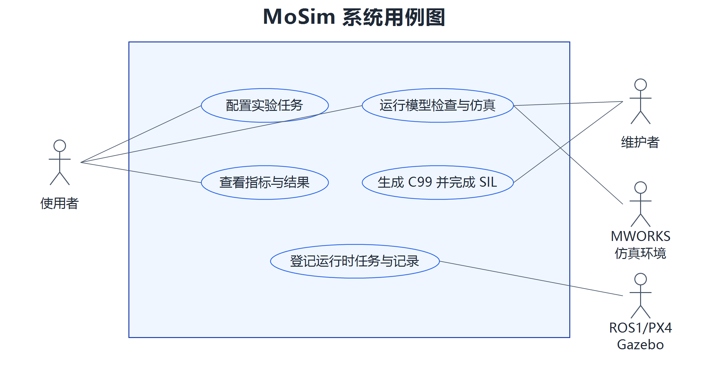

图 3-1 MoSim 系统用例图。

图中，使用者完成任务配置、仿真和结果查看；维护者负责配置维护和代码交付；MWORKS 与 ROS1/PX4/Gazebo 分别通过正式仿真接口和运行时接口参与相应用例。外部环境的参与不代表其运行结果已经通过验收。

系统的使用过程按“配置任务、检查模型、执行仿真、查看结果”组织。任务配置完成只说明输入参数已经写入；模型检查通过说明模型具备运行条件；只有仿真完成并生成有效结果后，才能对控制效果和性能指标进行分析。各项操作的前置条件、主要步骤和输出结果见 4.2 节。

## 4. 软件设计

### 4.1 软件体系结构设计

MoSim 采用分层和适配器相结合的体系结构：

(1) 物理模型层：Modelica MultiBody 机体、旋翼执行器、质量/惯量/气动参数和坐标系合同。
(2) 控制器接口层：四类统一输出边界、控制器实现、Adapter、EquationBridge 和控制分配。
(3) 实验执行层：任务轨迹、状态注入、FormalRunner、求解器设置、原始结果和指标。
(4) 交付与运行层：GenerateModelCode、C99 ABI、CMake/CTest、ROS1/PX4/Gazebo 适配器。
(5) 操作与辅助层：MoSim Studio、QGC、RViz、UE 和只读本地助手。

层间的权威关系为：Modelica/MWORKS 是正式模型和仿真证据权威；Profile 和配置文件是任务参数权威；运行时 manifest、日志和同次指标是 ROS1 运行事实权威；显示层只负责操作和复核。这样可以防止控制器算法在 MWORKS、ROS 和 PX4 中复制成三套互不一致的实现。

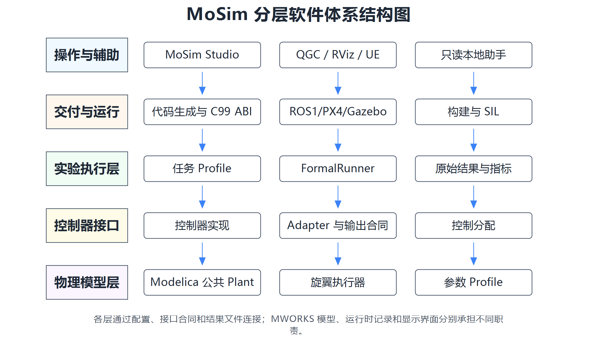

图 4-1 MoSim 分层软件体系结构图。

图中从上到下依次给出操作与辅助、交付与运行、实验执行、控制器接口和物理模型五层；相邻层通过配置、接口合同和结果文件连接。该图用于说明软件职责边界，而不以界面或运行记录替代 MWORKS 的模型和仿真结论。

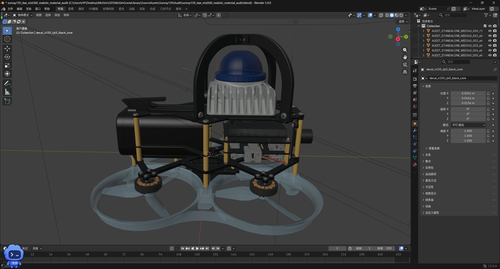

图 4-2 云纵 150 虚拟机体装配与组件关系。

图中展示机架、四个旋翼执行器、飞控、传感器和机体坐标系的装配关系，是物理模型层的直观说明。

### 4.2 用例设计

为明确本节的用例设计，相关对象、字段和当前边界按下表整理。

表 4-1　用例设计

| 用例 | 前置条件 | 主要步骤 | 后置条件 |
|---|---|---|---|
| 配置名义任务 | 项目根路径和路由表存在 | 选择控制器、ClimbPath 和采样设置，写入配置 | 得到可追溯任务配置 |
| 配置扰动任务 | 任务 Profile 允许参数覆盖 | 设置风扰、质量/惯量倍率或单个转子效率 | 得到参数化 harness，参数语义不改写控制器 |
| 执行正式仿真 | MWORKS 已授权且模型可检查 | 打开 FormalRunner，执行 CheckModel，人工启动仿真 | 形成 Result.msr 或保留明确失败状态 |
| 对比控制器 | 两条路线共用 Plant 和指标定义 | 读取有效记录，计算 RMSE、终端误差等 | 形成可解释的 A/B 表格 |
| 生成并核验 C99 | 图形模型 CheckModel 通过 | GenerateModelCode、构建固定向量测试、运行 SIL | 形成生成清单和 SIL 结果 |
| 执行运行时任务 | ROS1/PX4/Gazebo 运行环境就绪 | 选择后端，完成任务生命周期和注入记录 | 形成独立运行时 manifest 和指标 |

图 4-3 以正式实验为例，说明配置、模型检查、仿真和结果归档之间的主要判断分支。

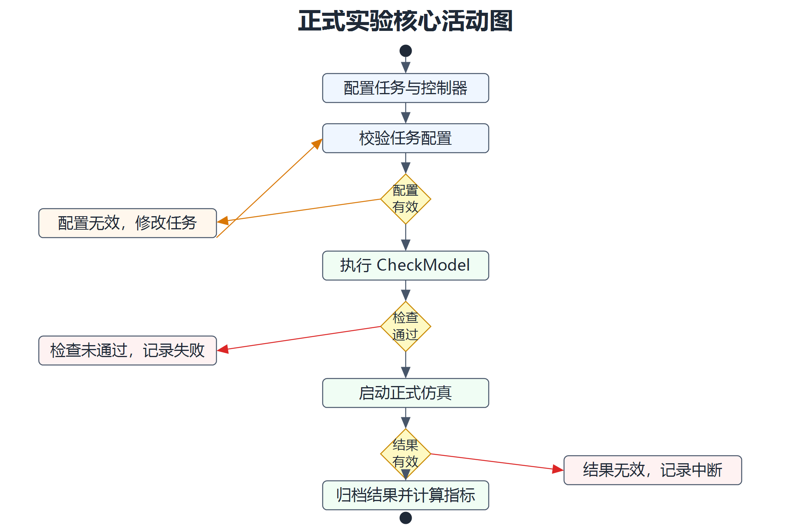

图 4-3 正式实验核心活动图。

任务配置无效时需返回修改；CheckModel 未通过时记录失败，不进入仿真；仿真中断或结果无效时只保留无效记录。只有形成有效结果后，才归档结果并计算指标。该流程与表 4-1 的前置条件和后置条件一一对应。

每个用例都记录输入、执行状态、输出证据和不可得结论。尤其是代码生成完成后，仍需单独验证运行时；运行时任务完成后，也不能反向证明所有 MWORKS 控制器都已部署。

### 4.3 类设计

为明确本节的类设计，相关对象、字段和当前边界按下表整理。

表 4-2　类设计

| 模块或类 | 责任 | 依赖方向 |
|---|---|---|
| Sunray150VirtualPx4Classic | 保存参照机体参数和替换边界 | 被 Plant、Adapter 和 Runner 使用 |
| RotorActuatorCore | 计算旋翼推力、反扭矩、电机动态和效率注入 | 接收 Adapter 命令，作用于机体 |
| Partial*Controller | 声明四类控制器输出合同 | 被具体控制器和 Adapter 继承 |
| *Adapter | 将不同控制律输出转换为共享边界 | 连接控制器与 FormalRunner |
| *FormalRunner | 固定任务、求解器、Plant 和结果变量 | 使用 Profile、Adapter 和公共模型 |
| model_studio_task_config.py | 校验选择并写入任务配置/harness | 读取路由与 Profile |
| app.jl | 提供 Studio 工作区、操作入口和状态反馈 | 调用项目配置/原生 MWORKS 入口 |
| px4ctrl_graphical_generated_shared.c | 包装生成 C 核心并暴露稳定 C ABI | 被 CMake 和运行时适配器调用 |
| Results manifest/metrics | 保存结果来源、状态和指标 | 被报告、图件和审计脚本读取 |

类之间遵循“高层依赖合同、低层实现可替换”的原则。公共 Plant 不依赖某一条控制器的内部实现，运行时适配器也不复制 MWORKS 控制律。

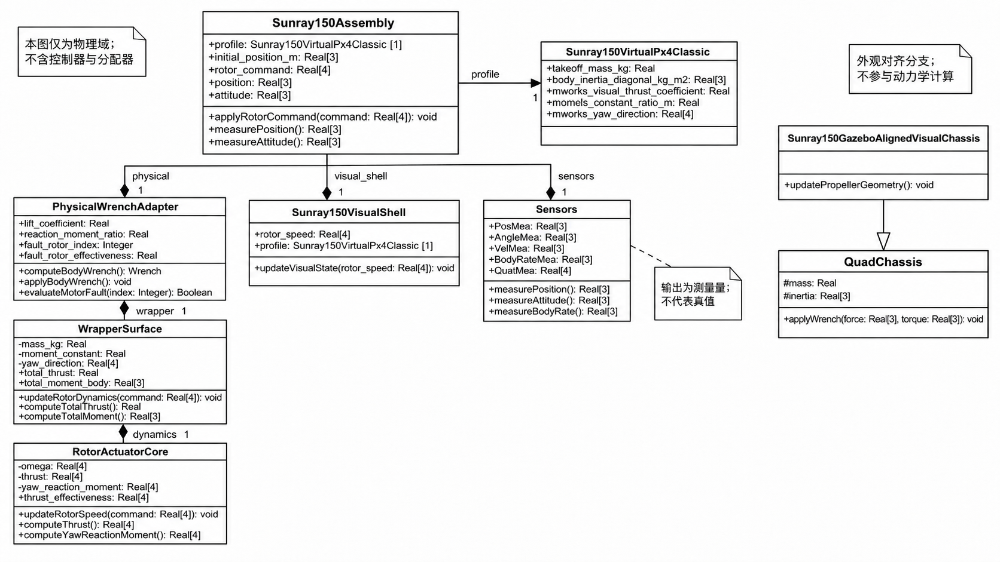

图 4-4 Sunray150 物理模型领域类图。

图中说明整机装配、力/力矩适配、旋翼执行器、传感器和参数 Profile 的组合关系；该图不包含控制器和分配器。

图 4-5 控制器与执行机构类图。

图中说明抽象 ATTITUDE_THRUST 合同、px4ctrl 适配器、控制分配器和公共 Plant 的继承、组合和依赖关系；离线姿态/角速度分配不等同于 PX4 运行时证据。

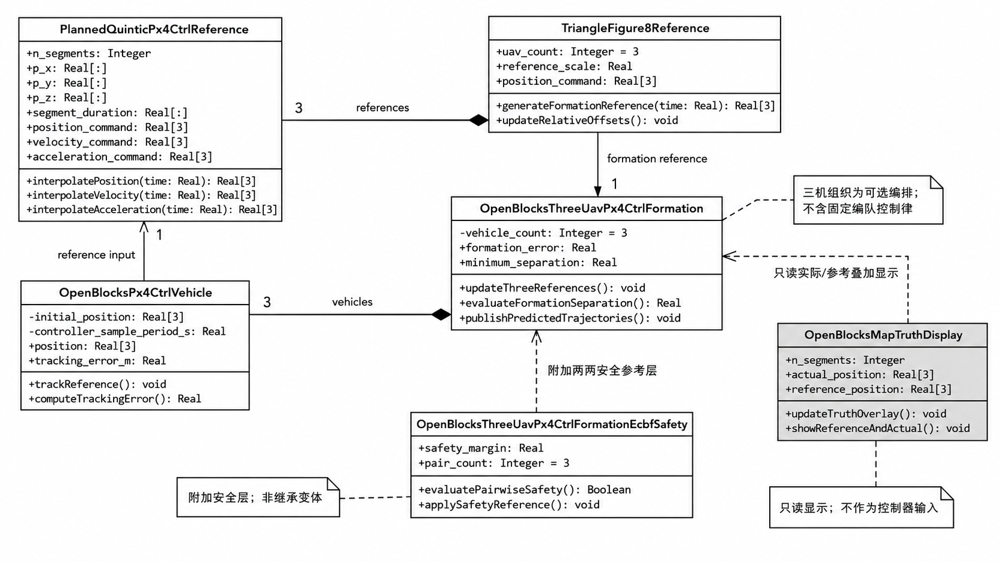

图 4-6 规划、轨迹与多机组织类图。

图中说明参考轨迹、单机跟踪、三机编队、安全参考调节与只读地图显示的对象边界；不将三机组织表述为固定编队控制律。

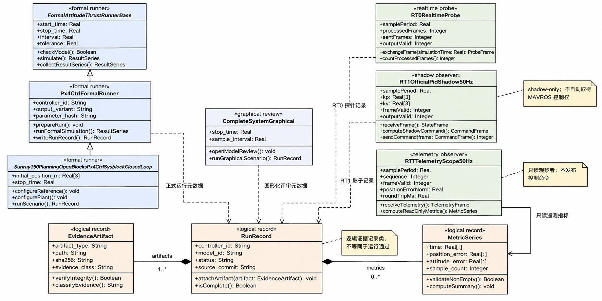

图 4-7 实验入口与证据记录类图。

图中说明 FormalRunner 继承链、RT0/RT1、只读遥测观察者和逻辑证据记录的关系；记录关系不等同于运行通过结论。

四张图均采用标准 UML 类图表示：类框包含名称、属性和操作分栏，关系使用可见性、连接符号、多重性和清晰走线表达。它们只用于说明对象职责和关系，不替代 3.3 节的用例图或 4.2 节的活动图。

### 4.4 数据设计

为明确本节的数据设计，相关对象、字段和当前边界按下表整理。

表 4-3　数据设计

| 数据对象 | 关键字段 | 来源/去向 | 作用 |
|---|---|---|---|
| 机体 Profile | 几何、质量、惯量、气动、传感器参数 | Modelica 参数包 | 定义公共 Plant |
| 路由合同 | 控制器 ID、Runner、输出边界、可用状态 | JSON/TOML | 选择和打开正式入口 |
| 实验 Profile | 轨迹、时长、采样、注入参数 | JSON | 固定实验条件 |
| 任务配置 | task、controller、参数覆盖、harness 路径 | JSON/Modelica | 连接 UI 选择和 MWORKS 模型 |
| 原始结果 | 时间序列、Result.msr、CSV | MWORKS/导出脚本 | 保留原始观测 |
| 指标记录 | RMSE、终端误差、调节时间、有效性 | METRICS.json | 形成判定和图表 |
| 运行清单 | 后端、源码路径、环境和生命周期状态 | RUN_MANIFEST.json | 区分运行时事实 |
| 交付清单 | 源哈希、生成文件、构建与测试状态 | codegen_manifest.json | 防止生成产物漂移 |

图 4-8 说明配置、原始结果、运行清单和报告之间的数据流向。

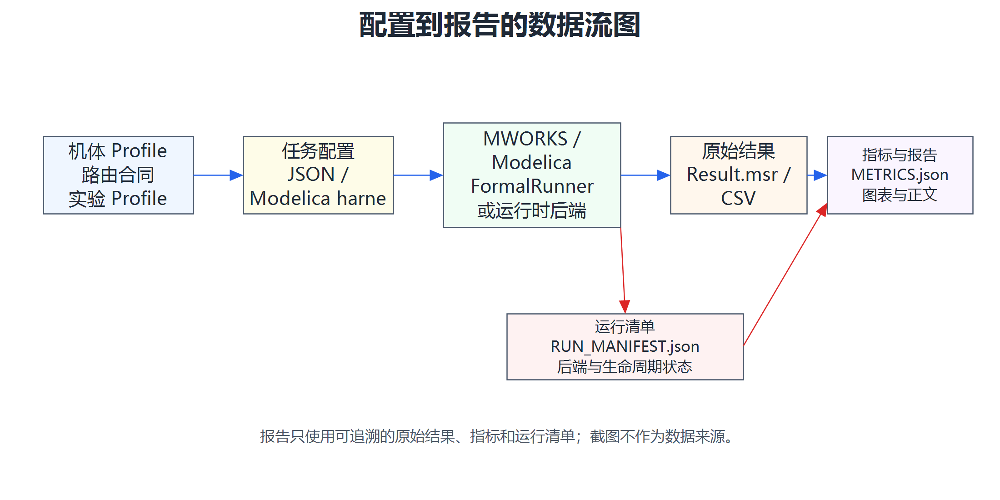

图 4-8 配置到报告的数据流图。

数据流严格遵循“配置 -> 模型/运行 -> 原始数据 -> 指标 -> 报告”的单向审计链。运行清单单独记录后端和生命周期状态，与原始结果和指标共同支撑报告中的表格和图件；报告数字不直接从截图 OCR 或手工录入得到。

### 4.5 用户界面设计

MoSim Studio 提供四个工作区：在线建模验证、实时联合仿真、代码生成和 MoSim 助手。在线建模验证区负责选择任务、控制器和注入参数；实时区负责目标主机、连接和任务参数；代码生成区负责进入 MWORKS 原生生成入口；助手区提供当前控制链和结果查看指引。

界面设计遵循以下原则：

(1) 配置选择和实际执行分开，Studio 不直接代替 MWORKS 原生 CheckModel/Simulation。
(2) 任务 Profile、控制器路由和故障参数显示在同一上下文中，但分别保存，避免重复维护。
(3) 助手仅使用本机回环只读服务，不开放项目写入或任意命令执行。
(4) QGC 负责飞行任务和状态操作，RViz 负责点云/轨迹，UE 负责工业场景显示；它们不改写 MWORKS 指标。

图 4-9 MoSim Studio 在线建模验证工作区。

该界面用于选择验证任务、控制器和场景参数，并写入配置；界面状态不单独代表模型或性能验证通过。

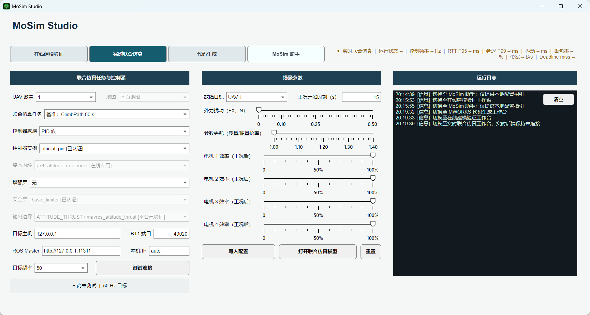

图 4-10 MoSim Studio 实时联合仿真工作区。

该界面展示目标主机、连接和任务参数，实际后端状态仍以同次运行记录为准。

## 5. 软件编码与实现

### 5.1 代码重构

本项目的编码重点不是把生成代码手工改成另一套控制器，而是通过接口和适配器减少耦合，并让可维护代码与不可手改的生成产物分离。

#### 5.1.1 统一输出边界

具体 Adapter 继承相应的部分控制器接口。例如，姿态/推力路线使用以下结构：

~~~modelica
within MoSimQuadrotorModel.Control.Adapters;
model ExampleAttitudeThrustAdapter
  extends MoSimQuadrotorModel.Control.Interfaces.PartialAttitudeThrustController;
  parameter MoSimQuadrotorModel.Parameters.Sunray150VirtualPx4Classic profile;
  // 控制律只负责产生本边界所声明的输出
end ExampleAttitudeThrustAdapter;
~~~

这种方式把公共输入、输出维度、单位和采样语义集中在接口层，具体控制器只实现自己的核心算法。

图 5-1 px4ctrl 图形控制模型。

图中展示位置、速度、姿态、角速度和控制分配的图形化连接关系，作为图形设计与代码生成的实现依据。

#### 5.1.2 生成 C 的稳定 ABI 包装

生成器源码保持原样，项目维护的共享包装层提供稳定的调用入口：

~~~c
void MosimPx4ctrlGeneratedGraphStepScalar(
    double ref_px, double px, double ref_vx, double vx, double ref_ax,
    double ref_py, double py, double ref_vy, double vy, double ref_ay,
    double ref_pz, double pz, double ref_vz, double vz, double ref_az,
    double yaw_mea, double ref_yaw,
    double *desired_acc_x, double *desired_acc_y, double *desired_acc_z,
    double *roll_cmd, double *pitch_cmd, double *yaw_cmd,
    double *collective_thrust_n, double *normalized_thrust);
~~~

包装层使用私有化的初始化和单步符号，避免生成源码的 Init/Step 与调用方发生冲突；运行时适配器把实际物理加速度映射为推力，再交给姿态和控制分配链路。

#### 5.1.3 配置写入和参数组合校验

Studio 的配置写入器将控制器、轨迹、质量/惯量倍率和电机效率写入统一任务文件，并生成临时 harness。对电机故障任务，校验器要求只有一个转子被降低效率；对未登记控制器，直接返回错误，不生成看似有效的配置。

图 5-2 Profile 配置与状态注入链路。

图中将任务参考、状态估计、控制器、命令权限、Adapter、Plant 和指标存储放入同一审计链路。

### 5.2 代码示例及结果展示

#### 5.2.1 统一任务配置示例

~~~json
{
  "task_id": "wind_disturbance",
  "controller_id": "px4ctrl",
  "configuration_kind": "formal_v2_profile",
  "runner_parameter_overrides": {
    "gust_force": [0.25, 0.0, 0.0],
    "mass_scale": 1.0,
    "fault_rotor_effectiveness": 1.0
  }
}
~~~

该示例只表达配置结构，不代表在本次生成 Markdown 时重新执行了 MWORKS 仿真。

#### 5.2.2 代表性结果

为明确本节的代表性结果，相关对象、字段和当前边界按下表整理。

表 5-1　代表性结果

| 验证对象 | 结果 | 结果边界 |
|---|---:|---|
| px4ctrl 与 Official PID 阶跃场景位置 RMSE 相对变化 | px4ctrl 降低 29.8% | 本项目的有效 A/B 记录 |
| 风扰场景位置 RMSE 相对变化 | px4ctrl 降低 52.1% | 本项目的有效 A/B 记录 |
| Figure8 场景位置 RMSE 相对变化 | px4ctrl 降低 73.3% | 本项目的有效 A/B 记录 |
| px4ctrl 阶跃调节时间 | 约 3.83 s | 观察窗和指标定义以内 |
| 图形模型到 CFunction 的位置 RMSE 差 | 1.1481051588325626e-13 m | MWORKS 整机 SIL，不包含 Gazebo/PX4/ROS |
| 姿态最大绝对差 | 3.2070318622956506e-12 rad | 同上 |
| 旋翼指令最大绝对差 | 7.354117315117037e-11 rad/s | 同上 |

表中的对应关系用于明确本节的对象、责任或验证边界；它需要与后续实现和结果证据共同解读，不能将单项登记直接外推为全部功能、性能或运行时验收结论。

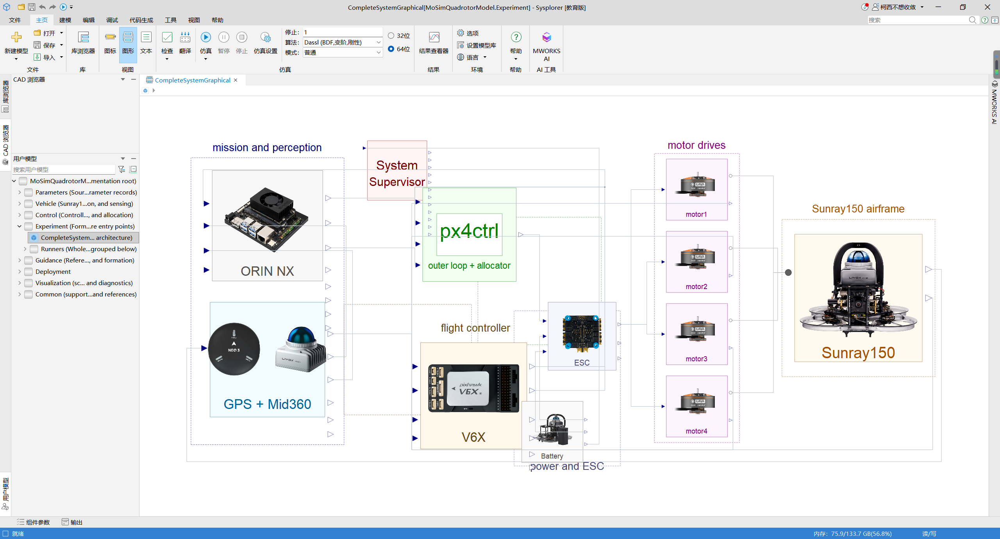

图 5-3 px4ctrl 系统模型与闭环链路。

MWORKS 活动模型使用世界 ENU 与机体 FLU 的内部约定；在外部运行时接口处才需显式处理 NED/FRD 的坐标转换。四个旋翼位置、旋转指令符号和偏航反扭矩方向在 `Sunray150VirtualPx4Classic.mo` 的 `mworks_rotor_center_m`、`mworks_spin_command_sign` 和 `mworks_yaw_direction` 中集中定义。物理力/矩由 `RotorActuatorCore.mo` 生成，再由 `PhysicalWrenchAdapter.mo` 作用于 MultiBody 机体。

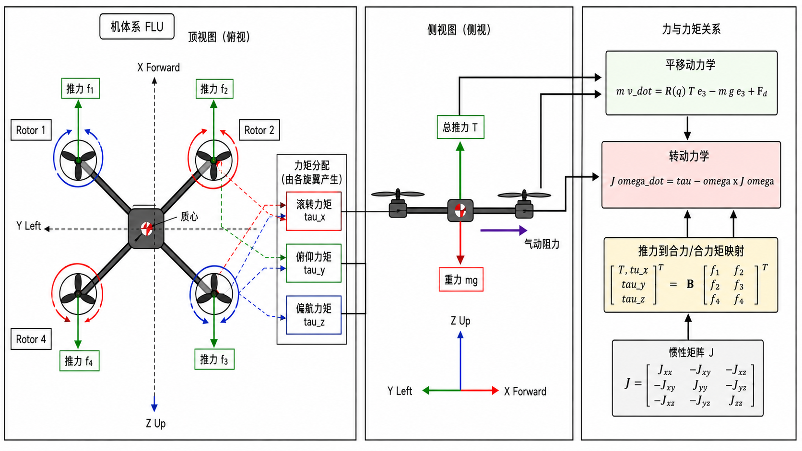

图 5-4 四旋翼动力学与控制分配链路。

后续控制律统一采用式(3-1)中的位置误差和速度误差。在 ENU 世界系和 FLU 机体系下，报告使用的刚体平动写作

图 5-5 阶跃场景位置误差对比。

该图是七场景中的代表性曲线，比较 Official PID 与 px4ctrl 的位置误差时程。

图 5-6 风扰场景位置误差对比。

该图展示同一对照在风扰条件下的误差时程；其结论边界与本节结果表保持一致。

图 5-7 C99 生成到 ROS/Gazebo 部署链路。

图中区分模型检查、代码生成、编译静态检查、SIL 数值比较、运行时构建和任务验证，避免把代码生成成功直接写成部署验证通过。

图 5-8 C99 后端在 Gazebo 中的 Figure8 轨迹跟踪。

该图展示生成代码后端在运行时的轨迹复核画面；运行时性能判断仍以同次指标和任务记录为准。

图 5-9 FormalRunner 的四类输出边界与执行信号流。

图中展示 ATTITUDE_THRUST、BODY_RATE_THRUST、WRENCH 与 ROTOR_COMMAND 四条链路的 Runner、单位转换、限幅和公共 Plant 边界。

### 5.3 48 条控制器路线的统一实现

本项目的控制器工作量不是只有 Official PID 和 px4ctrl 两条路线。当前口径为七个算法族的 46 条算法控制器，加上 Official PID 和 px4ctrl 两条基线，共 48 条路线。系统为每条路线登记公式、图形结构、源码映射和 FormalRunner；本课程设计将其压缩为可审查的全量目录，避免把 48 条路线误写成只有代表性控制器。

表 5-2　48 条控制器路线的统一实现

| 控制器族 | 数量 | 当前登记的路线 | 统一接入方式 |
|---|---:|---|---|
| PID 族 | 9 | `cascade_pid`、`gain_scheduled_pid`、`fuzzy_pid`、`neural_pid`、`fopid`、`fixed_awff_pid`、`fixed_awff_l1_residual`、`fixed_awff_l1_indi`、`pid_awff_linear_eso` | PID/扰动补偿 Adapter |
| 线性与鲁棒状态反馈 | 6 | `lqr_baseline`、`lqi_baseline`、`lqg`、`h2_state_feedback`、`hinf_hover_wrench`、`pole_placement_luenberger` | WRENCH 或 ATTITUDE_THRUST |
| 非线性与自适应 | 6 | `backstepping_baseline`、`adaptive_backstepping`、`feedback_linearization`、`passivity_based_control`、`mrac`、`ndi` | 姿态/推力 Adapter |
| 滑模控制 | 7 | `integral_smc`、`terminal_smc`、`nonsingular_terminal_smc`、`adaptive_smc`、`fuzzy_smc`、`super_twisting_smc`、`smc_boundary_layer` | 鲁棒控制 Adapter |
| 预测与优化 | 10 | `linear_mpc`、`robust_mpc`、`adaptive_mpc`、`tube_mpc`、`explicit_gain_scheduled_mpc`、`ilqr`、`mppi`、`nmpc_outer`、`fixed_linear_mpc_l1_indi`、`fixed_qp_nmpc_l1_indi_cbf` | 外环/旋翼命令 Adapter |
| 几何与微分平坦 | 6 | `se3_basic`、`dfbc_basic`、`dfbc_smooth_robust_attitude`、`dfbc_smooth_robust_bodyrate`、`dfbc_high_order_attitude`、`dfbc_high_order_bodyrate` | 几何姿态与体速率边界 |
| 学习控制 | 2 | `rl_gain_scheduler`、`trained_neural_residual` | 学习补偿 Adapter |
| 基线路线 | 2 | `Official PID`、`px4ctrl` | 正式全机 Runner |

这些路线共享 `Partial*Controller`、Adapter、控制分配器、公共 Sunray150 Plant 和任务 Profile。统一登记只证明“路线、模型和入口已经组织起来”，不把 30/48 名义达标、超时、终端误差失败和未形成完整结果的记录混写成全部通过。
以下图集完整呈现 48 条路线的图形模型。图形模型证明相应控制结构已被组织并接入统一接口；性能结论仍以第 6 章的有效结果、失败记录和指标为准。

#### 5.3.1 Official PID 基线

Official PID 是统一评估链中的工程基线，用于与后续控制器路线在相同 Plant、任务和指标下进行对照。

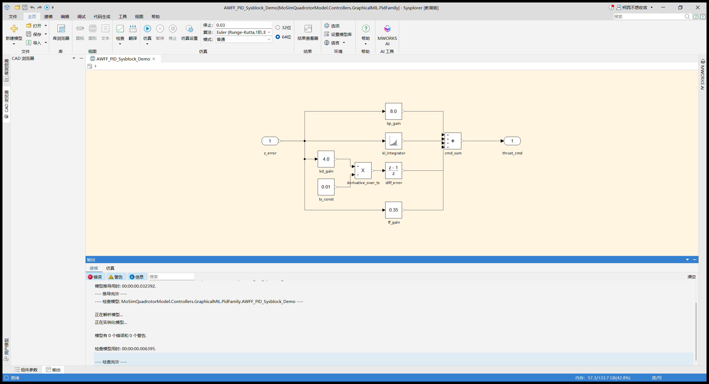

图 5-10 Official PID 控制器图形模型。

该图用于核对该控制器路线的图形结构、信号连接和统一输出接口。它证明模型组织与接口审查信息，具体性能结论仍以同一工况下的结果、指标和有效性状态为准。

#### 5.3.2 PID 族(9 条)

PID 族从串级 PID 出发，扩展了增益调度、模糊/神经补偿、分数阶以及 AWFF、L1、INDI、ESO 等增强支路。

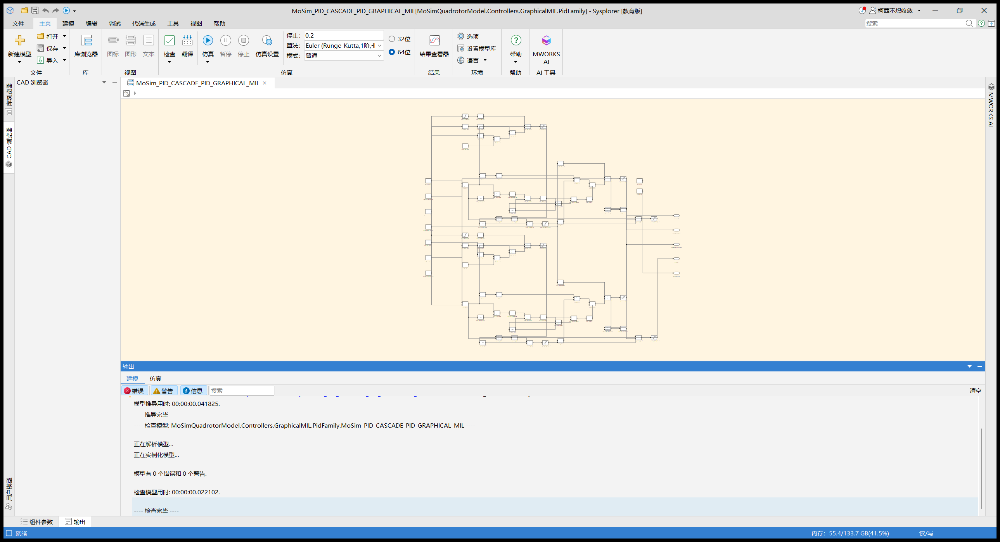

图 5-11 cascade_pid 控制器图形模型。

该图用于核对该控制器路线的图形结构、信号连接和统一输出接口。它证明模型组织与接口审查信息，具体性能结论仍以同一工况下的结果、指标和有效性状态为准。

图 5-12 gain_scheduled_pid 控制器图形模型。

该图用于核对该控制器路线的图形结构、信号连接和统一输出接口。它证明模型组织与接口审查信息，具体性能结论仍以同一工况下的结果、指标和有效性状态为准。

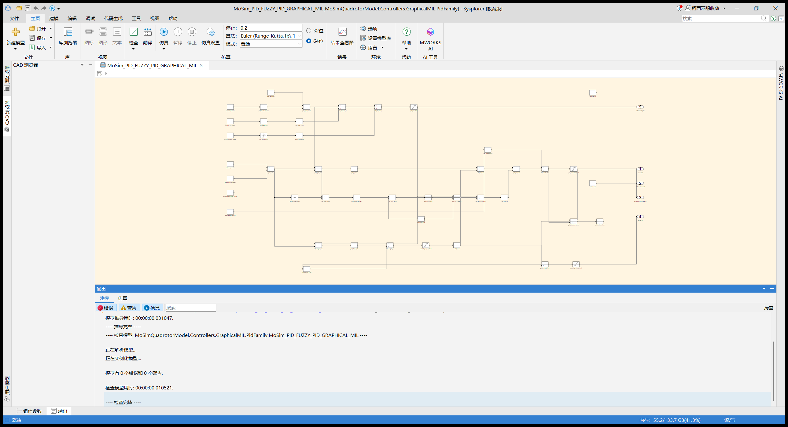

图 5-13 fuzzy_pid 控制器图形模型。

该图用于核对该控制器路线的图形结构、信号连接和统一输出接口。它证明模型组织与接口审查信息，具体性能结论仍以同一工况下的结果、指标和有效性状态为准。

图 5-14 neural_pid 控制器图形模型。

该图用于核对该控制器路线的图形结构、信号连接和统一输出接口。它证明模型组织与接口审查信息，具体性能结论仍以同一工况下的结果、指标和有效性状态为准。

图 5-15 fopid 控制器图形模型。

该图用于核对该控制器路线的图形结构、信号连接和统一输出接口。它证明模型组织与接口审查信息，具体性能结论仍以同一工况下的结果、指标和有效性状态为准。

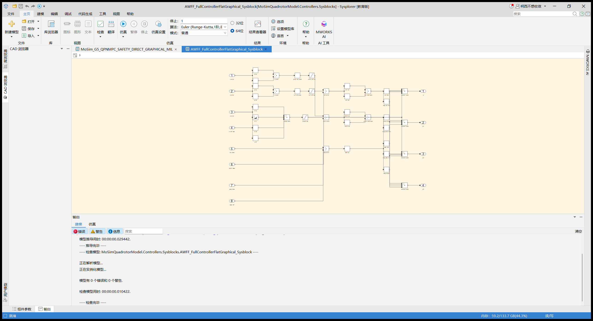

图 5-16 fixed_awff_pid 控制器图形模型。

该图用于核对该控制器路线的图形结构、信号连接和统一输出接口。它证明模型组织与接口审查信息，具体性能结论仍以同一工况下的结果、指标和有效性状态为准。

图 5-17 fixed_awff_l1_residual 控制器图形模型。

该图用于核对该控制器路线的图形结构、信号连接和统一输出接口。它证明模型组织与接口审查信息，具体性能结论仍以同一工况下的结果、指标和有效性状态为准。

图 5-18 fixed_awff_l1_indi 控制器图形模型。

该图用于核对该控制器路线的图形结构、信号连接和统一输出接口。它证明模型组织与接口审查信息，具体性能结论仍以同一工况下的结果、指标和有效性状态为准。

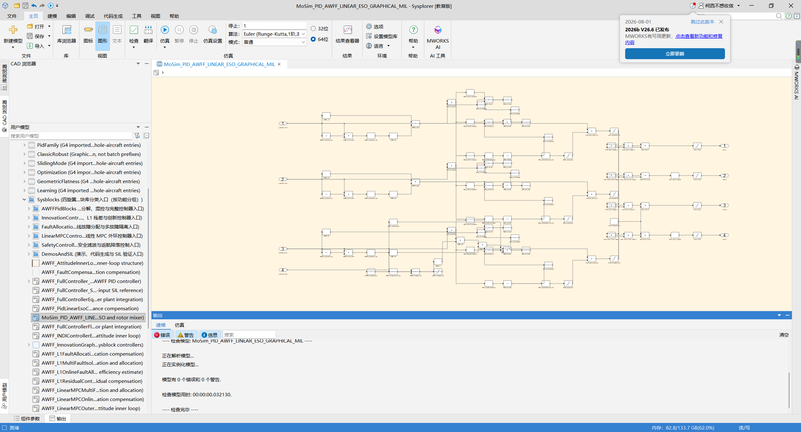

图 5-19 pid_awff_linear_eso 控制器图形模型。

该图用于核对该控制器路线的图形结构、信号连接和统一输出接口。它证明模型组织与接口审查信息，具体性能结论仍以同一工况下的结果、指标和有效性状态为准。

#### 5.3.3 线性与鲁棒状态反馈族(6 条)

本组以 LQR、LQI、LQG、H2、H-infinity 与极点配置为代表，统一通过姿态/推力或 WRENCH 边界接入公共 Plant。

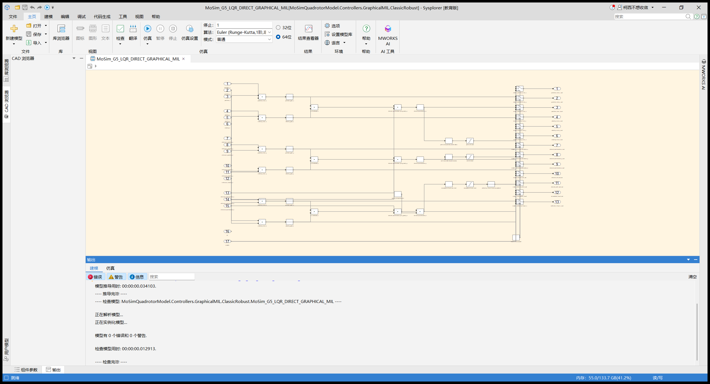

图 5-20 lqr_baseline 控制器图形模型。

该图用于核对该控制器路线的图形结构、信号连接和统一输出接口。它证明模型组织与接口审查信息，具体性能结论仍以同一工况下的结果、指标和有效性状态为准。

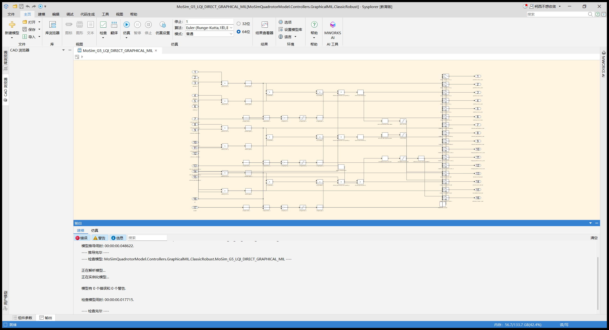

图 5-21 lqi_baseline 控制器图形模型。

该图用于核对该控制器路线的图形结构、信号连接和统一输出接口。它证明模型组织与接口审查信息，具体性能结论仍以同一工况下的结果、指标和有效性状态为准。

图 5-22 lqg 控制器图形模型。

该图用于核对该控制器路线的图形结构、信号连接和统一输出接口。它证明模型组织与接口审查信息，具体性能结论仍以同一工况下的结果、指标和有效性状态为准。

图 5-23 h2_state_feedback 控制器图形模型。

该图用于核对该控制器路线的图形结构、信号连接和统一输出接口。它证明模型组织与接口审查信息，具体性能结论仍以同一工况下的结果、指标和有效性状态为准。

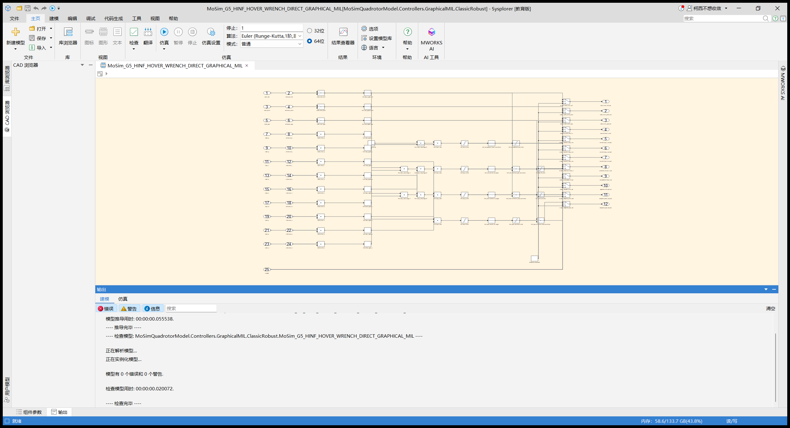

图 5-24 hinf_hover_wrench 控制器图形模型。

该图用于核对该控制器路线的图形结构、信号连接和统一输出接口。它证明模型组织与接口审查信息，具体性能结论仍以同一工况下的结果、指标和有效性状态为准。

图 5-25 pole_placement_luenberger 控制器图形模型。

该图用于核对该控制器路线的图形结构、信号连接和统一输出接口。它证明模型组织与接口审查信息，具体性能结论仍以同一工况下的结果、指标和有效性状态为准。

#### 5.3.4 非线性与自适应控制族(6 条)

本组覆盖反步、反馈线性化、无源控制、模型参考自适应和非线性动态逆，重点处理模型非线性和参数变化。

图 5-26 backstepping_baseline 控制器图形模型。

该图用于核对该控制器路线的图形结构、信号连接和统一输出接口。它证明模型组织与接口审查信息，具体性能结论仍以同一工况下的结果、指标和有效性状态为准。

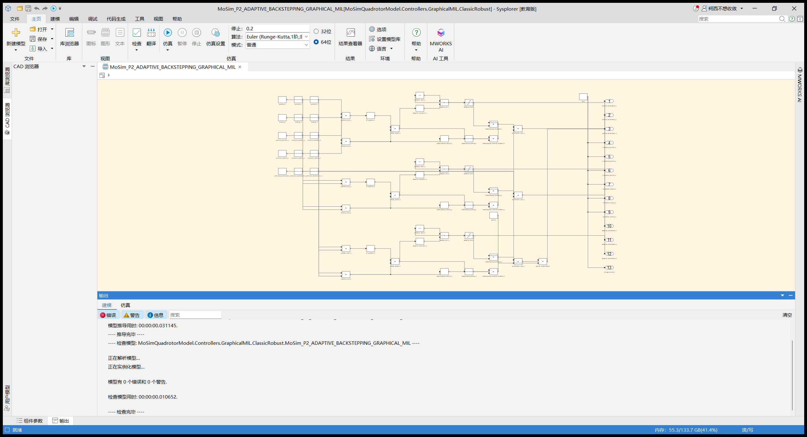

图 5-27 adaptive_backstepping 控制器图形模型。

该图用于核对该控制器路线的图形结构、信号连接和统一输出接口。它证明模型组织与接口审查信息，具体性能结论仍以同一工况下的结果、指标和有效性状态为准。

图 5-28 feedback_linearization 控制器图形模型。

该图用于核对该控制器路线的图形结构、信号连接和统一输出接口。它证明模型组织与接口审查信息，具体性能结论仍以同一工况下的结果、指标和有效性状态为准。

图 5-29 passivity_based_control 控制器图形模型。

该图用于核对该控制器路线的图形结构、信号连接和统一输出接口。它证明模型组织与接口审查信息，具体性能结论仍以同一工况下的结果、指标和有效性状态为准。

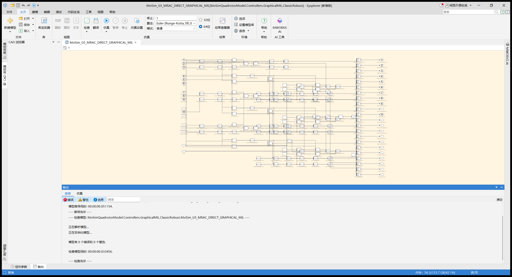

图 5-30 mrac 控制器图形模型。

该图用于核对该控制器路线的图形结构、信号连接和统一输出接口。它证明模型组织与接口审查信息，具体性能结论仍以同一工况下的结果、指标和有效性状态为准。

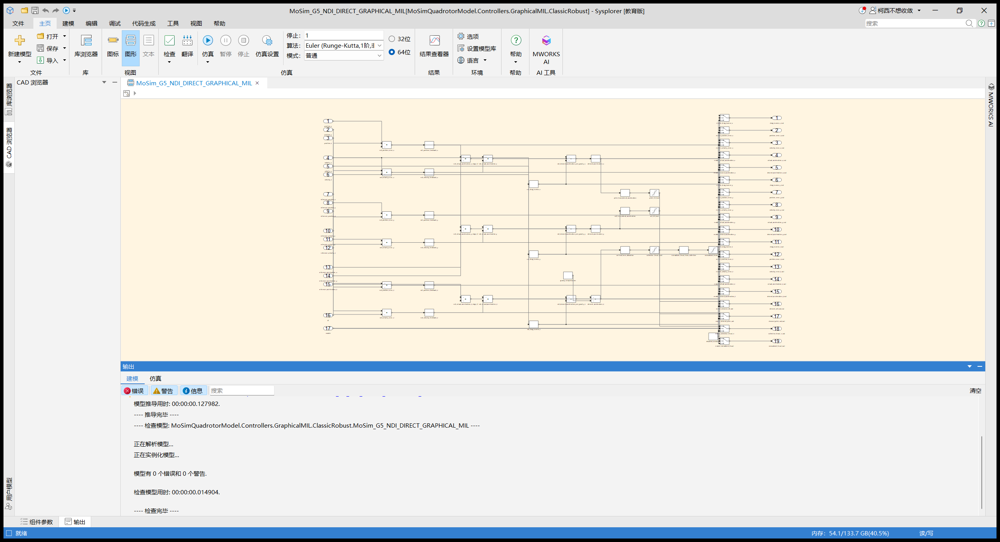

图 5-31 ndi 控制器图形模型。

该图用于核对该控制器路线的图形结构、信号连接和统一输出接口。它证明模型组织与接口审查信息，具体性能结论仍以同一工况下的结果、指标和有效性状态为准。

#### 5.3.5 滑模控制族(7 条)

滑模控制族将不同滑模面构造、到达律和连续化策略统一组织在同一执行边界下。

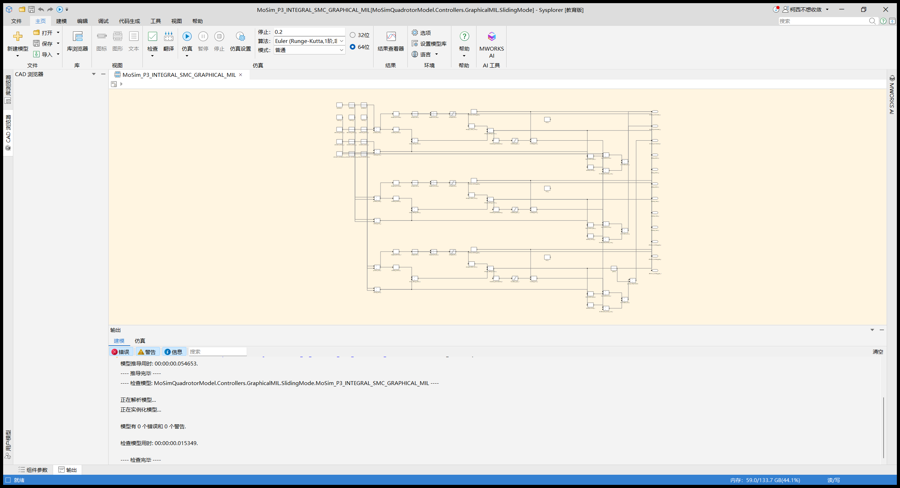

图 5-32 integral_smc 控制器图形模型。

该图用于核对该控制器路线的图形结构、信号连接和统一输出接口。它证明模型组织与接口审查信息，具体性能结论仍以同一工况下的结果、指标和有效性状态为准。

图 5-33 terminal_smc 控制器图形模型。

该图用于核对该控制器路线的图形结构、信号连接和统一输出接口。它证明模型组织与接口审查信息，具体性能结论仍以同一工况下的结果、指标和有效性状态为准。

图 5-34 nonsingular_terminal_smc 控制器图形模型。

该图用于核对该控制器路线的图形结构、信号连接和统一输出接口。它证明模型组织与接口审查信息，具体性能结论仍以同一工况下的结果、指标和有效性状态为准。

图 5-35 adaptive_smc 控制器图形模型。

该图用于核对该控制器路线的图形结构、信号连接和统一输出接口。它证明模型组织与接口审查信息，具体性能结论仍以同一工况下的结果、指标和有效性状态为准。

图 5-36 fuzzy_smc 控制器图形模型。

该图用于核对该控制器路线的图形结构、信号连接和统一输出接口。它证明模型组织与接口审查信息，具体性能结论仍以同一工况下的结果、指标和有效性状态为准。

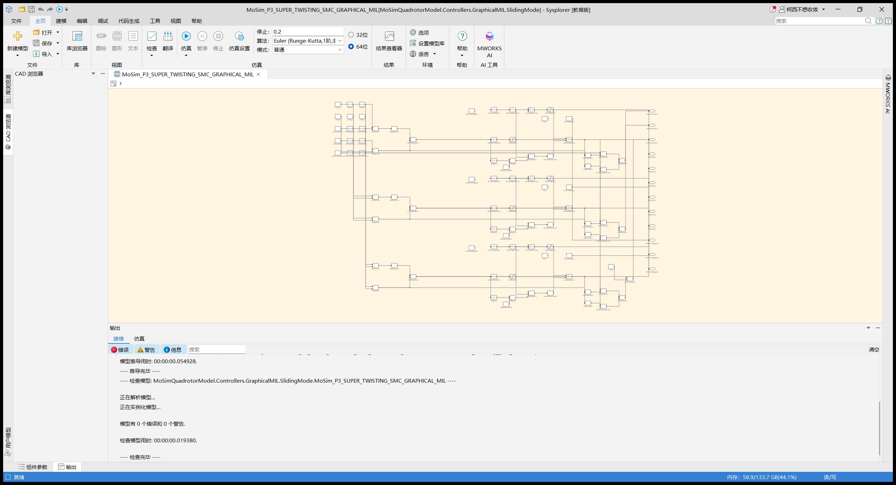

图 5-37 super_twisting_smc 控制器图形模型。

该图用于核对该控制器路线的图形结构、信号连接和统一输出接口。它证明模型组织与接口审查信息，具体性能结论仍以同一工况下的结果、指标和有效性状态为准。

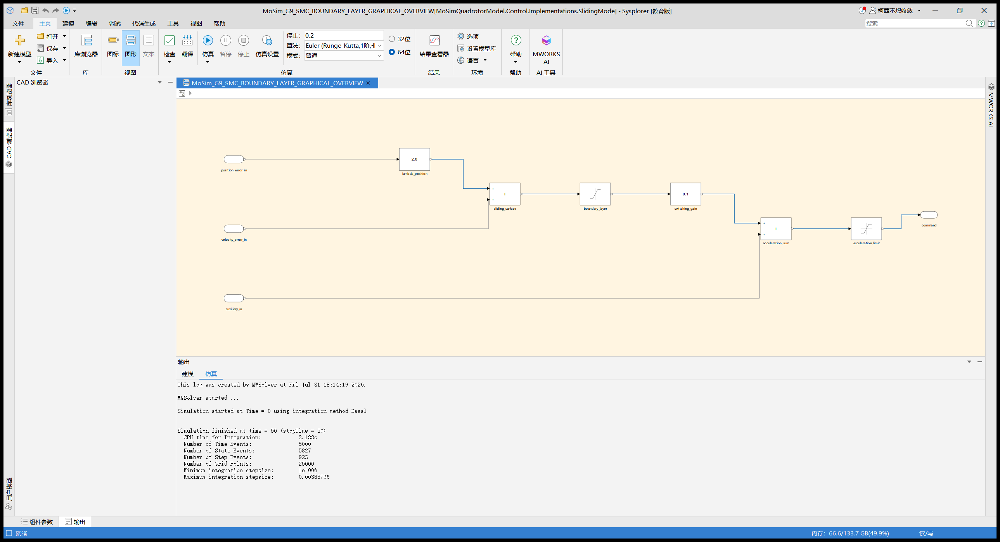

图 5-38 smc_boundary_layer 控制器图形模型。

该图用于核对该控制器路线的图形结构、信号连接和统一输出接口。它证明模型组织与接口审查信息，具体性能结论仍以同一工况下的结果、指标和有效性状态为准。

#### 5.3.6 预测与优化控制族(10 条)

本组覆盖线性、鲁棒、自适应、Tube、显式调度 MPC，以及 iLQR、MPPI、NMPC 和融合 L1/INDI/CBF 的优化路线。

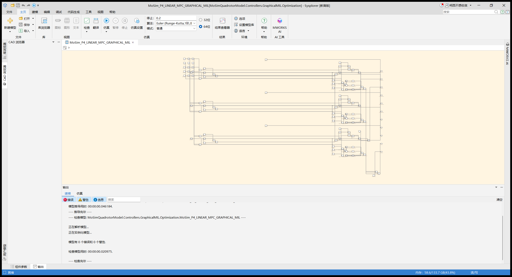

图 5-39 linear_mpc 控制器图形模型。

该图用于核对该控制器路线的图形结构、信号连接和统一输出接口。它证明模型组织与接口审查信息，具体性能结论仍以同一工况下的结果、指标和有效性状态为准。

图 5-40 robust_mpc 控制器图形模型。

该图用于核对该控制器路线的图形结构、信号连接和统一输出接口。它证明模型组织与接口审查信息，具体性能结论仍以同一工况下的结果、指标和有效性状态为准。

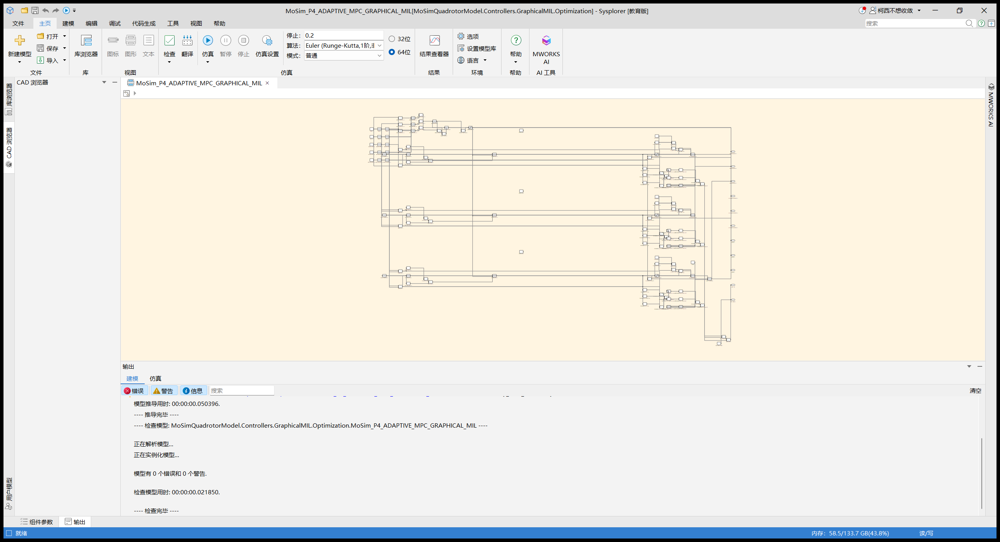

图 5-41 adaptive_mpc 控制器图形模型。

该图用于核对该控制器路线的图形结构、信号连接和统一输出接口。它证明模型组织与接口审查信息，具体性能结论仍以同一工况下的结果、指标和有效性状态为准。

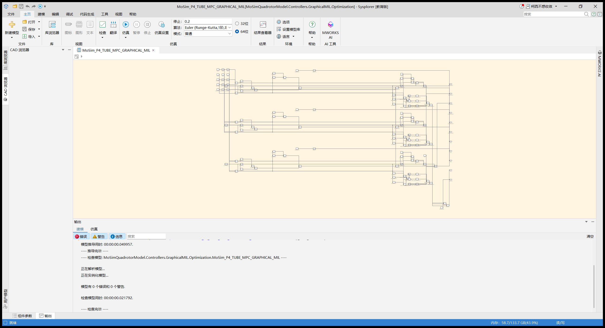

图 5-42 tube_mpc 控制器图形模型。

该图用于核对该控制器路线的图形结构、信号连接和统一输出接口。它证明模型组织与接口审查信息，具体性能结论仍以同一工况下的结果、指标和有效性状态为准。

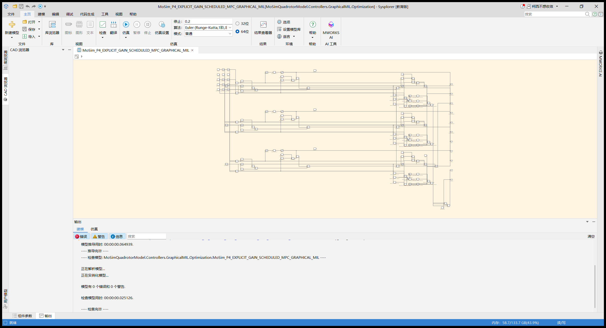

图 5-43 explicit_gain_scheduled_mpc 控制器图形模型。

该图用于核对该控制器路线的图形结构、信号连接和统一输出接口。它证明模型组织与接口审查信息，具体性能结论仍以同一工况下的结果、指标和有效性状态为准。

图 5-44 ilqr 控制器图形模型。

该图用于核对该控制器路线的图形结构、信号连接和统一输出接口。它证明模型组织与接口审查信息，具体性能结论仍以同一工况下的结果、指标和有效性状态为准。

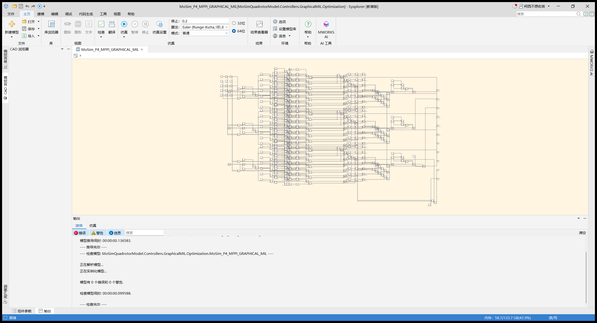

图 5-45 mppi 控制器图形模型。

该图用于核对该控制器路线的图形结构、信号连接和统一输出接口。它证明模型组织与接口审查信息，具体性能结论仍以同一工况下的结果、指标和有效性状态为准。

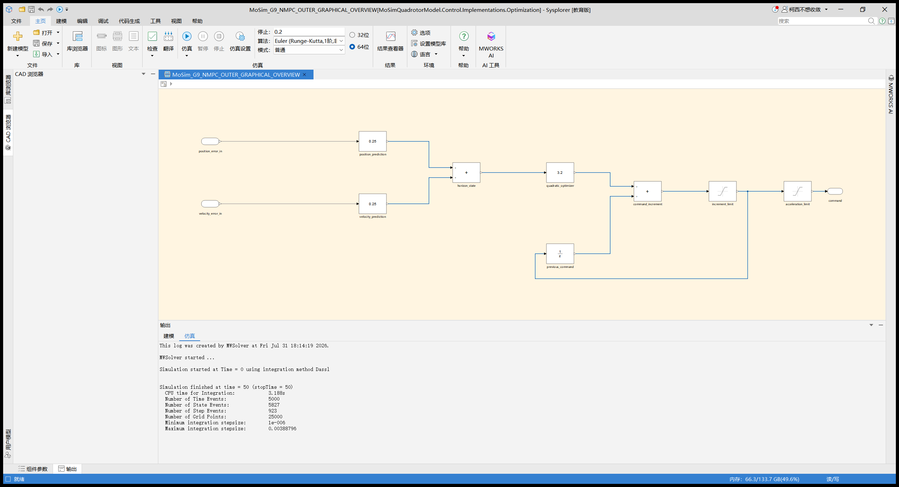

图 5-46 nmpc_outer 控制器图形模型。

该图用于核对该控制器路线的图形结构、信号连接和统一输出接口。它证明模型组织与接口审查信息，具体性能结论仍以同一工况下的结果、指标和有效性状态为准。

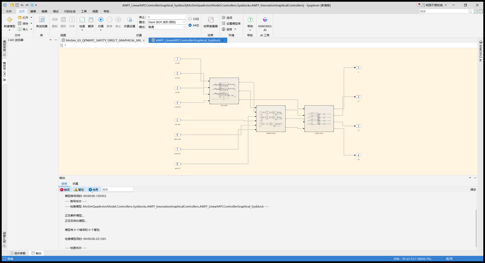

图 5-47 fixed_linear_mpc_l1_indi 控制器图形模型。

该图用于核对该控制器路线的图形结构、信号连接和统一输出接口。它证明模型组织与接口审查信息，具体性能结论仍以同一工况下的结果、指标和有效性状态为准。

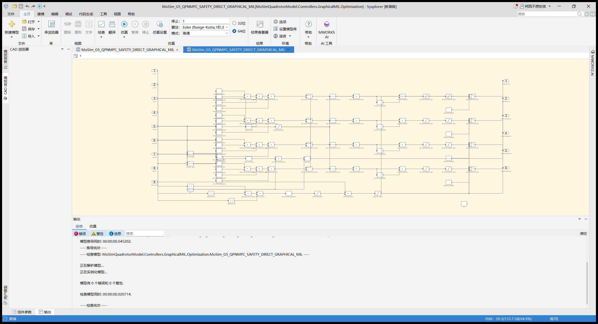

图 5-48 fixed_qp_nmpc_l1_indi_cbf 控制器图形模型。

该图用于核对该控制器路线的图形结构、信号连接和统一输出接口。它证明模型组织与接口审查信息，具体性能结论仍以同一工况下的结果、指标和有效性状态为准。

#### 5.3.7 几何与微分平坦控制族(6 条)

几何与微分平坦控制族将位置、速度、姿态或体角速度参考转换为统一的姿态/推力或体速率/推力接口。

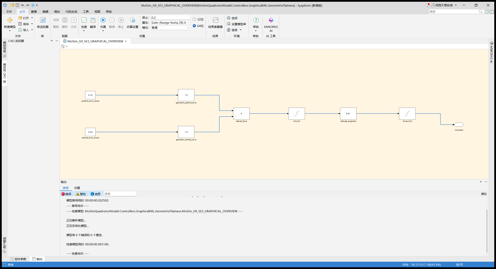

图 5-49 se3_basic 控制器图形模型。

该图用于核对该控制器路线的图形结构、信号连接和统一输出接口。它证明模型组织与接口审查信息，具体性能结论仍以同一工况下的结果、指标和有效性状态为准。

图 5-50 dfbc_basic 控制器图形模型。

该图用于核对该控制器路线的图形结构、信号连接和统一输出接口。它证明模型组织与接口审查信息，具体性能结论仍以同一工况下的结果、指标和有效性状态为准。

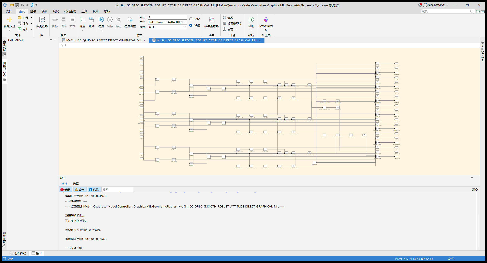

图 5-51 dfbc_smooth_robust_attitude 控制器图形模型。

该图用于核对该控制器路线的图形结构、信号连接和统一输出接口。它证明模型组织与接口审查信息，具体性能结论仍以同一工况下的结果、指标和有效性状态为准。

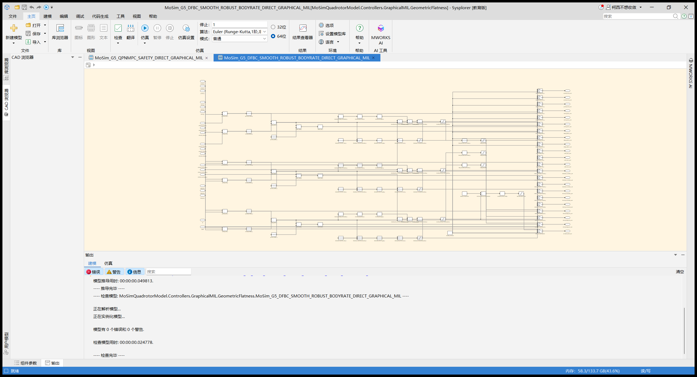

图 5-52 dfbc_smooth_robust_bodyrate 控制器图形模型。

该图用于核对该控制器路线的图形结构、信号连接和统一输出接口。它证明模型组织与接口审查信息，具体性能结论仍以同一工况下的结果、指标和有效性状态为准。

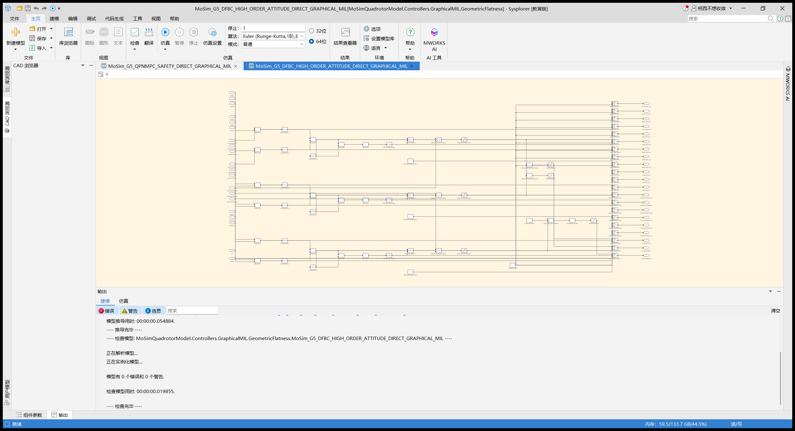

图 5-53 dfbc_high_order_attitude 控制器图形模型。

该图用于核对该控制器路线的图形结构、信号连接和统一输出接口。它证明模型组织与接口审查信息，具体性能结论仍以同一工况下的结果、指标和有效性状态为准。

图 5-54 dfbc_high_order_bodyrate 控制器图形模型。

该图用于核对该控制器路线的图形结构、信号连接和统一输出接口。它证明模型组织与接口审查信息，具体性能结论仍以同一工况下的结果、指标和有效性状态为准。

#### 5.3.8 学习控制族(2 条)

学习控制族保留强化学习增益调度和训练神经残差补偿，并通过限幅与回退机制接入名义控制链。

图 5-55 rl_gain_scheduler 控制器图形模型。

该图用于核对该控制器路线的图形结构、信号连接和统一输出接口。它证明模型组织与接口审查信息，具体性能结论仍以同一工况下的结果、指标和有效性状态为准。

图 5-56 trained_neural_residual 控制器图形模型。

该图用于核对该控制器路线的图形结构、信号连接和统一输出接口。它证明模型组织与接口审查信息，具体性能结论仍以同一工况下的结果、指标和有效性状态为准。

#### 5.3.9 px4ctrl 基线

px4ctrl 是项目重点完成图形化设计、代码生成、MWORKS 全机 SIL 和 ROS1/Gazebo 运行时链路的基线路线。

图 5-57 px4ctrl 控制器图形模型。

该图用于核对该控制器路线的图形结构、信号连接和统一输出接口。它证明模型组织与接口审查信息，具体性能结论仍以同一工况下的结果、指标和有效性状态为准。

### 5.3.10 ClimbPath 50 s 名义筛查全量结果图集

本节完整保留用户指定《MoSim_仿真分析报告》中的 ClimbPath 50 s 名义筛查图件。图集覆盖当前 48 条控制器在同一公共 Plant、参考轨迹和判定口径下的 30 条达标记录、9 条性能未达标记录、8 条执行超时记录以及 1 条 MWORKS 原生仿真提前终止记录。图件按原报告的结果逻辑组织，不省略负性能和未完成样本；其作用是呈现项目的完整实验工作量，具体性能判断仍以同次原始结果、指标和有效性状态为准。

#### 主结果

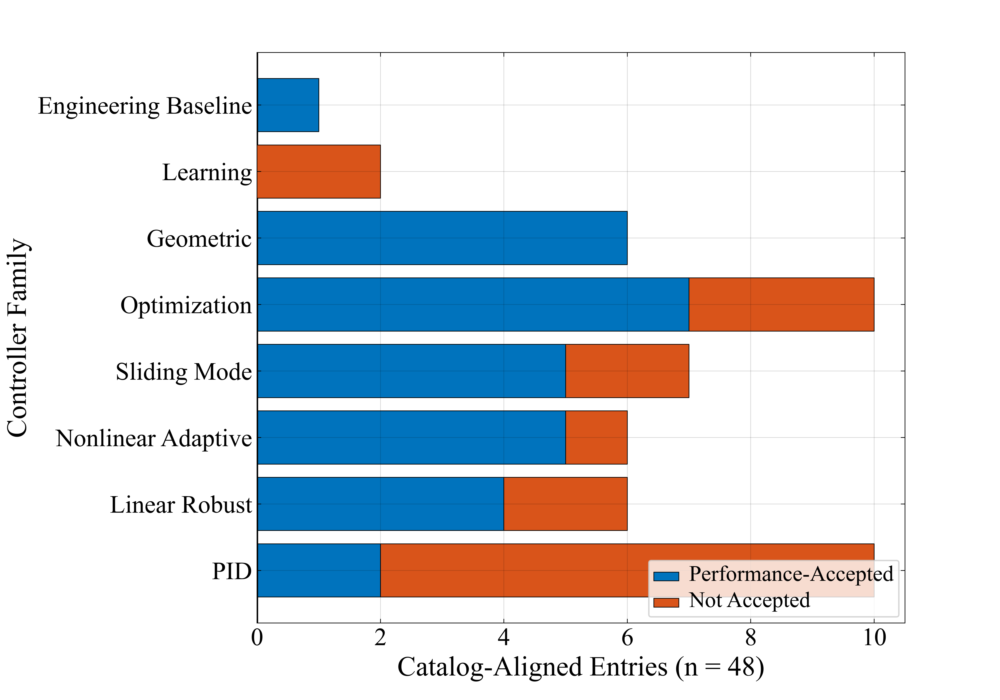

图 5-58 各控制族的条目数与达标数。

达标率分布如图 5-59 所示，可观察各族在相同门限下的通过比例。需注意样本量较小的族（1-2 条）其百分比参考价值有限。

图 5-59 各控制族达标率与样本量。

上述两图基于当前 30 条有效记录绘制，族系归属来自 `control_scheme_catalog.json` 的 `category` 字段；第 7.6 节的控制器详图用于展示动态形态，不参与这两张汇总图的样本统计。

#### 未达标记录与失败原因

#### 性能分布图

图 5-60 当前 30 条达标控制器位置 RMSE 的分族箱线分布。

箱线图显示低误差族与高误差族的中位数区间明显分离，线性与 MPC 族集中在亚米级，滑模族整体偏高。

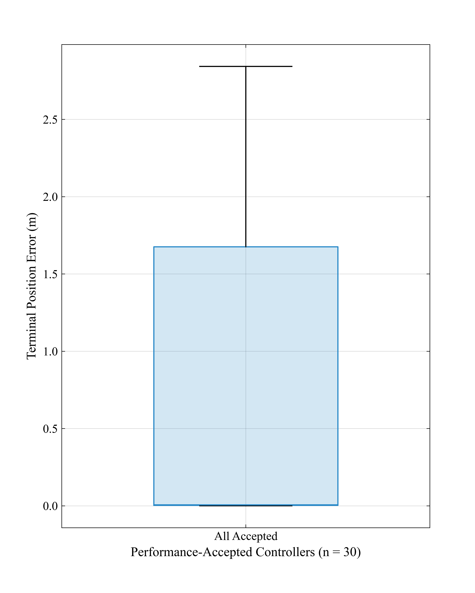

图 5-61 当前 30 条达标控制器终端位置误差的分族箱线分布。

终端误差箱线图与 RMSE 的分族差异一致，低误差控制器的末端收敛更集中，高误差族仍保留较宽的尾部。

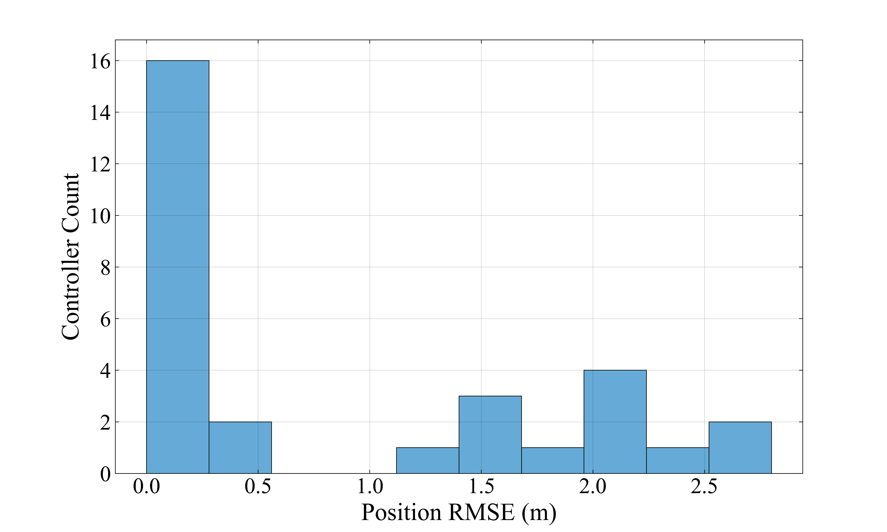

图 5-62 当前 30 条达标控制器位置 RMSE 的总体直方分布。

RMSE 直方图呈双峰分布，低误差峰对应 0.3 m 附近的高精度控制器，高误差峰对应滑模与部分非线性条目。

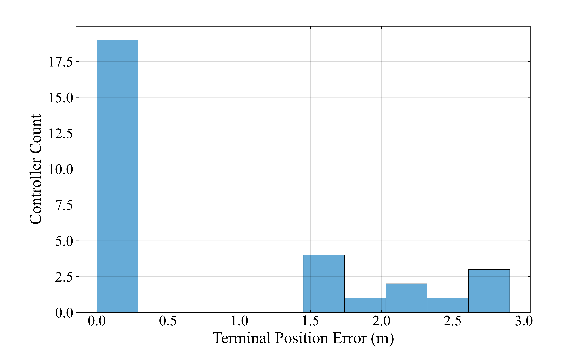

图 5-63 当前 30 条达标控制器终端位置误差的总体直方分布。

终端误差直方图进一步显示中间区间几乎为空，达到门限的控制器与高误差控制器形成清晰分层。

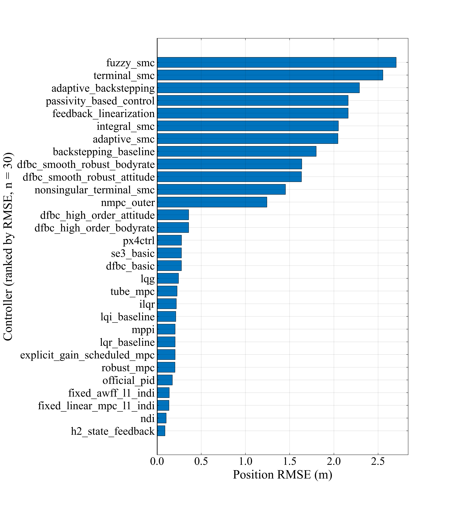

图 5-64 当前 30 条达标控制器按位置 RMSE 的排名。

该图用于比较当前记录中的相应指标或轨迹关系。比较范围仅限图示的同一任务和有效样本，不外推为未执行路线或独立运行时性能结论。

#### 代表控制器详图

##### Official PID(ClimbPath 50 s 基线)

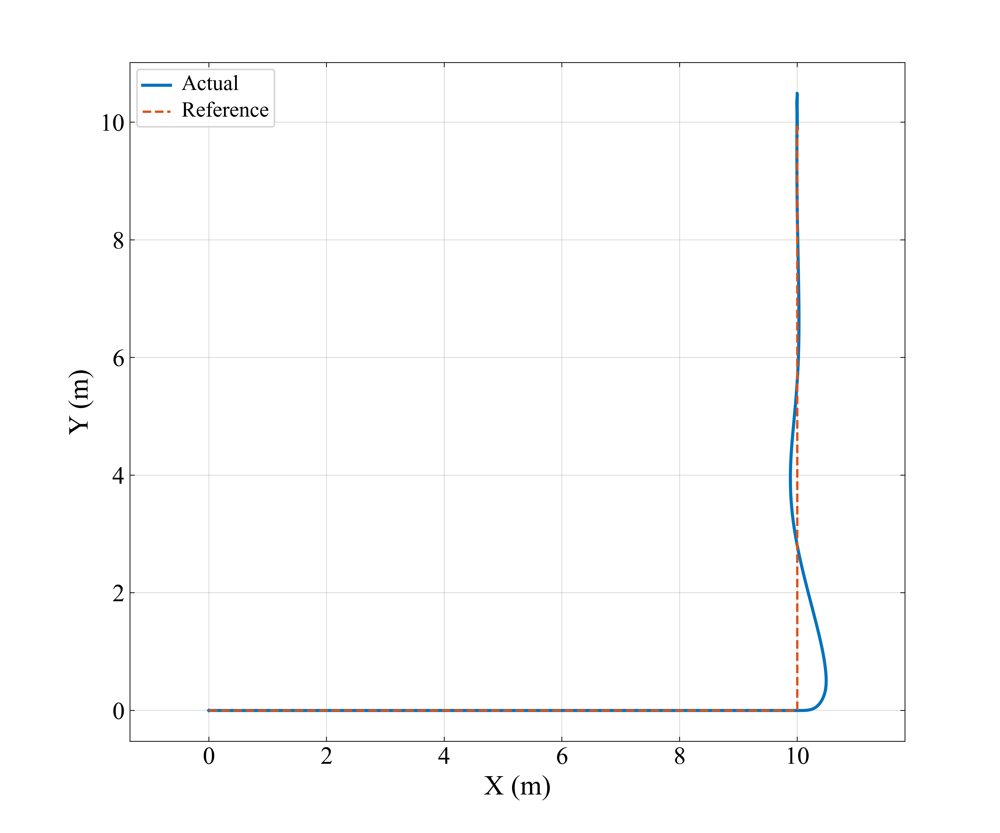

图 5-65 official_pid ClimbPath 50 s 水平面轨迹跟踪。

官方 PID 在 0-5 s 爬升段快速建立高度，随后 Z 通道围绕参考小幅调整，未见持续超调。

图 5-66 official_pid ClimbPath 50 s 高度通道跟踪。

位置误差峰值集中在起步与路径切换瞬间，随后快速收敛，50 s 终端误差仅 0.007 m。

图 5-67 official_pid ClimbPath 50 s 位置误差时程。

控制输入以连续平滑的四旋翼分配为主，切换点仅出现短暂幅值调整，未触及持续饱和。

图 5-68 official_pid ClimbPath 50 s 控制输入时程。

三维轨迹与参考路径基本重合，水平转弯和垂向爬升均保持一致。

图 5-69 official_pid ClimbPath 50 s 三维轨迹。

速度三轴在爬升和转弯段有清晰过渡峰值，随后回到参考变化率附近，没有明显高频超调。

图 5-70 official_pid ClimbPath 50 s 速度分量时程。

姿态角只在路径转向时出现有限幅值变化，曲线平滑且无持续振荡，符合 0.173 m 的低 RMSE。

图 5-71 official_pid ClimbPath 50 s 姿态角时程。

该图补充该记录的姿态通道时程，应与同组的轨迹、误差和控制输入共同解读；它描述当前记录，不单独证明控制器性能。

##### px4ctrl 全机闭环名义结果

图 5-72 px4ctrl ClimbPath 50 s 水平面轨迹跟踪。

px4ctrl 的显式加速度前馈使高度在爬升起始段快速跟随，重力补偿使稳态段无明显上冲。

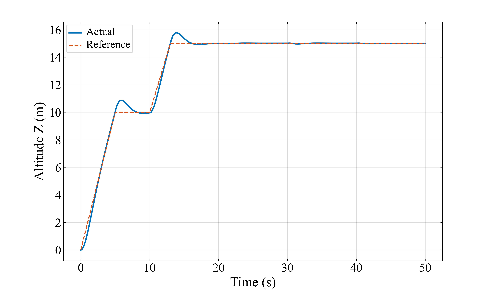

图 5-73 px4ctrl ClimbPath 50 s 高度通道跟踪。

位置误差主要出现在爬升和曲率变化段，随后在外环反馈作用下收敛到 0.003 m 的终端误差。

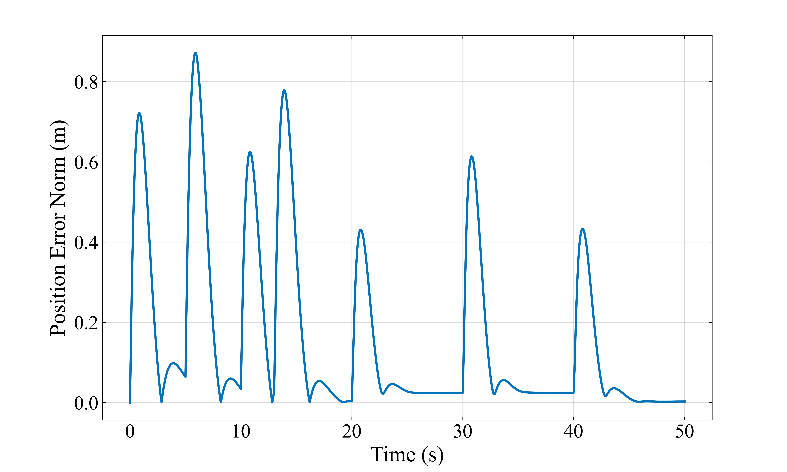

图 5-74 px4ctrl ClimbPath 50 s 位置误差时程。

加速度前馈承担快速变化量，四路控制输入过渡连续、分配均衡，未出现长时间饱和。

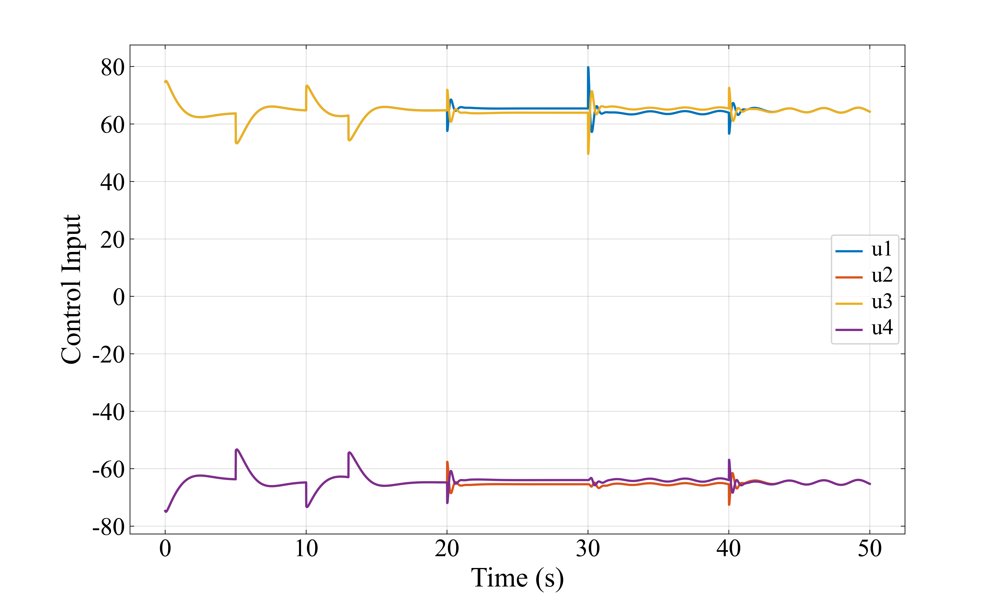

图 5-75 px4ctrl ClimbPath 50 s 控制输入时程。

三维视图中实际轨迹与参考路径保持紧密重合，前馈通道改善了转弯段的空间跟随。

图 5-76 px4ctrl ClimbPath 50 s 三维轨迹。

速度响应在三轴间保持解耦，爬升段 Vz 的峰值随参考变化平滑回落，未见明显反复超调。

图 5-77 px4ctrl ClimbPath 50 s 速度分量时程。

姿态角幅值受外环加速度映射约束，转向时有短暂变化但整体无高频振荡，与 0.277 m RMSE 相符。

图 5-78 px4ctrl ClimbPath 50 s 姿态角时程。

该图补充该记录的姿态通道时程，应与同组的轨迹、误差和控制输入共同解读；它描述当前记录，不单独证明控制器性能。

##### AWFF-L1-INDI

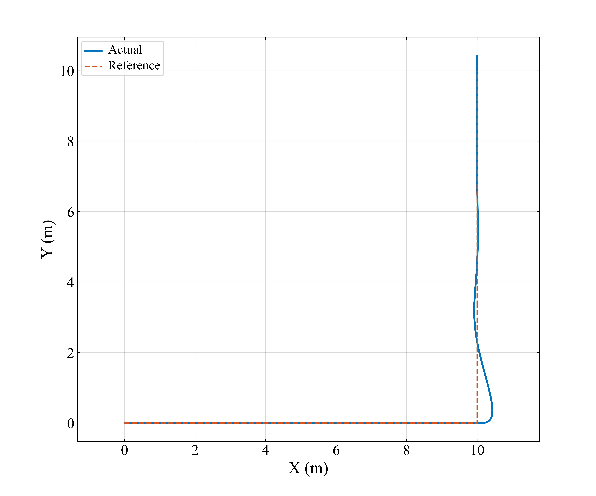

图 5-79 fixed_awff_l1_indi ClimbPath 50 s 水平面轨迹跟踪。

AWFF-L1-INDI 在爬升段利用前馈提前建立高度，Z 通道快速贴合参考且没有可见的持续超调。

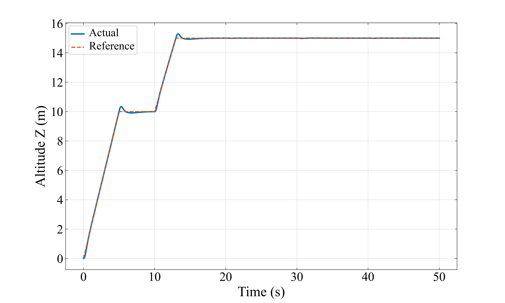

图 5-80 fixed_awff_l1_indi ClimbPath 50 s 高度通道跟踪。

位置误差峰值仅出现在起步和路径切换处，随后迅速压低，终端误差达到 4.77×10⁻⁴ m。

图 5-81 fixed_awff_l1_indi ClimbPath 50 s 位置误差时程。

L1 补偿与 INDI 分配使四路输入连续平滑，快速修正集中在过渡段，稳态控制代价较低。

图 5-82 fixed_awff_l1_indi ClimbPath 50 s 控制输入时程。

三维轨迹几乎与参考重合，水平面和高度通道的前馈补偿共同保持了完整路径的空间一致性。

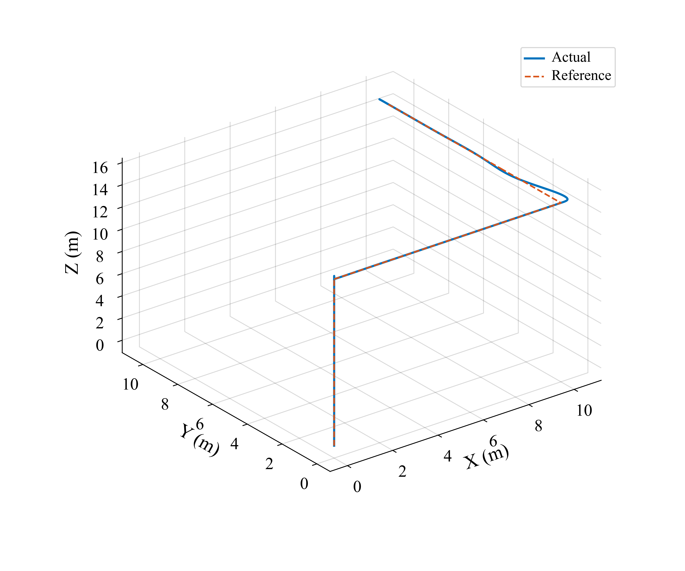

图 5-83 fixed_awff_l1_indi ClimbPath 50 s 三维轨迹。

三轴速度只在参考变化处出现短暂峰值，随后平滑回落，未出现由自适应补偿引起的速度抖动。

图 5-84 fixed_awff_l1_indi ClimbPath 50 s 速度分量时程。

姿态角保持小幅、低频变化，L1-INDI 的高精度跟踪没有通过激进姿态振荡换取，RMSE 为 0.138 m。

图 5-85 fixed_awff_l1_indi ClimbPath 50 s 姿态角时程。

该图补充该记录的姿态通道时程，应与同组的轨迹、误差和控制输入共同解读；它描述当前记录，不单独证明控制器性能。

##### Linear-MPC-L1-INDI

图 5-86 fixed_linear_mpc_l1_indi ClimbPath 50 s 水平面轨迹跟踪。

Linear-MPC-L1-INDI 在爬升段提前预测高度变化，Z 通道平稳到达参考，未出现明显超调。

图 5-87 fixed_linear_mpc_l1_indi ClimbPath 50 s 高度通道跟踪。

位置误差集中于起步和曲率变化的短窗口，预测补偿后快速收敛，终端误差仅 4.73×10⁻⁴ m。

图 5-88 fixed_linear_mpc_l1_indi ClimbPath 50 s 位置误差时程。

MPC 的滚动优化与 INDI 修正令四路控制输入连续变化，能量主要用于爬升和转向而非高频切换。

图 5-89 fixed_linear_mpc_l1_indi ClimbPath 50 s 控制输入时程。

三维轨迹与参考路径保持几乎重合，预测外环对空间曲率变化的跟随没有引入可见偏移。

图 5-90 fixed_linear_mpc_l1_indi ClimbPath 50 s 三维轨迹。

速度三轴在参考切换处响应提前且无明显超调，爬升结束后 Vz 平滑回到零附近。

图 5-91 fixed_linear_mpc_l1_indi ClimbPath 50 s 速度分量时程。

姿态角仅承担必要的转向和升降姿态变化，幅值小、振荡弱，与 0.135 m 的高精度结果一致。

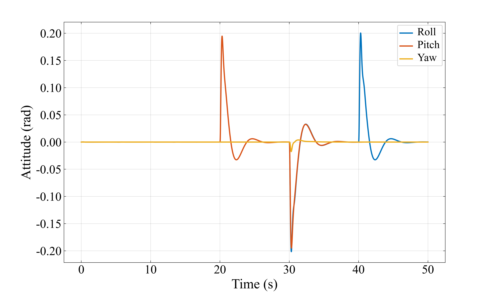

图 5-92 fixed_linear_mpc_l1_indi ClimbPath 50 s 姿态角时程。

该图补充该记录的姿态通道时程，应与同组的轨迹、误差和控制输入共同解读；它描述当前记录，不单独证明控制器性能。

#### 控制族内对比图


图 5-93 PID 族 2 条达标条目的位置 RMSE。

RMSE 柱状图显示两条 PID 达标成员处于同一亚米级区间，差异主要来自不同的补偿结构而非稳定性失效。


图 5-94 PID 族 ClimbPath 轨迹叠加。

轨迹叠加图中两条 PID 路径基本重合，说明标准 ClimbPath 下的性能差异没有转化为明显的空间偏航。


图 5-95 PID 族控制能量(约 1.64×10² 至 8.39×10⁵)。

该图在当前已有记录中比较控制能量。控制能量必须与位置误差、终端误差和结果有效性共同解读，不能单独作为全部控制器的优劣或运行时性能结论。


图 5-96 PID 族终端位置误差。

终端误差均落在厘米级，说明两条 PID 在 50 s 末端都完成了位置与姿态收敛。它们的差异主要体现为收敛尾段的细小残差，而不是失稳。


图 5-97 线性与鲁棒状态反馈族 4 条条目的位置 RMSE。

线性族 RMSE 柱状图四条均处于低误差区，说明状态反馈与观测器设计在统一工况下给出一致的收敛精度。


图 5-98 线性与鲁棒状态反馈族 ClimbPath 轨迹叠加。

轨迹叠加图中四条线几乎重合，线性族的差异主要体现在误差细节和控制代价，而不是路径形状偏移。


图 5-99 线性与鲁棒状态反馈族控制能量(8.32×10⁵ 至 8.40×10⁵)。

该图在当前已有记录中比较控制能量。控制能量必须与位置误差、终端误差和结果有效性共同解读，不能单独作为全部控制器的优劣或运行时性能结论。


图 5-100 线性与鲁棒状态反馈族终端位置误差。

四条终端误差均保持在厘米级，线性反馈的稳定收敛在末端指标上同样一致。族内差别主要是残差大小，而不是收敛状态改变。


图 5-101 非线性与自适应控制族 5 条条目的位置 RMSE。

非线性族 RMSE 柱状图覆盖范围较宽，反步、反馈线性化和无源性条目与自适应条目之间存在明显的工程实现差异。

图 5-102 非线性与自适应控制族 ClimbPath 轨迹叠加。

轨迹叠加图把非线性族的误差差异转化为空间路径差异，可见部分条目在爬升和转弯段偏离参考更明显。


图 5-103 非线性与自适应控制族控制能量。

控制能量图显示非线性补偿带来的输入代价并不统一，误差较大的条目往往伴随更明显的能量波动。


图 5-104 非线性与自适应控制族终端位置误差。

终端误差图进一步区分了短时偏差与末端未收敛条目，非线性族的性能分散比线性族更明显。


图 5-105 滑模族 5 条条目的位置 RMSE。

滑模族的 RMSE 整体高于其他族，说明当前切换增益和边界层设置带来的鲁棒性代价已成为标称跟踪的主要限制。

图 5-106 滑模族 ClimbPath 轨迹叠加。

轨迹叠加图显示滑模族在爬升和转弯段的偏离更明显，误差形态与其较高的 RMSE 区间相互对应。


图 5-107 滑模族控制能量(9.46×10⁵ 至 1.195×10⁶，为唯一整体高于其余各族的族)。

该图在当前已有记录中比较控制能量。控制能量必须与位置误差、终端误差和结果有效性共同解读，不能单独作为全部控制器的优劣或运行时性能结论。


图 5-108 滑模族终端位置误差。

终端误差仍在米级，说明切换项抑制不确定性的同时，末端残差尚未被完全消除。


图 5-109 最优与预测控制族 7 条条目的位置 RMSE。

MPC 族 RMSE 柱状图高度集中，滚动优化和约束处理在统一 ClimbPath 下产生了稳定且可重复的精度区间。


图 5-110 最优与预测控制族 ClimbPath 轨迹叠加。

轨迹叠加图中各 MPC 变体基本沿同一参考路径运行，族内差异主要由局部预测模型和求解策略体现。


图 5-111 最优与预测控制族控制能量(有记录的 6 条约为 1.65×10² 至 8.38×10⁵)。

该图在当前已有记录中比较控制能量。控制能量必须与位置误差、终端误差和结果有效性共同解读，不能单独作为全部控制器的优劣或运行时性能结论。


图 5-112 最优与预测控制族终端位置误差。

终端误差为 0.0005–0.143 m，主体记录保持亚米级，说明滚动优化及其补充路线在 50 s 末端仍保持稳定收敛；族内差别主要来自优化结构和执行边界。


图 5-113 几何与微分平坦族 6 条条目的位置 RMSE。

几何族 RMSE 柱状图同时包含亚米级高精度条目和较高误差变体，体现了平坦映射阶次与鲁棒补偿配置的差异。


图 5-114 几何与微分平坦族 ClimbPath 轨迹叠加。

轨迹叠加图显示基础几何控制器与高阶平坦控制器更贴近参考，而平滑鲁棒变体在转弯段保留更大的偏差。


图 5-115 几何与微分平坦族控制能量(8.05×10⁵ 至 8.38×10⁵，族内最低值出现在 dfbc_high_order)。

该图在当前已有记录中比较控制能量。控制能量必须与位置误差、终端误差和结果有效性共同解读，不能单独作为全部控制器的优劣或运行时性能结论。


图 5-116 几何与微分平坦族终端位置误差。

终端误差从毫米级到米级跨越较大，说明几何表示本身不是唯一决定因素，输出边界和鲁棒配置同样影响末端收敛。


图 5-117 八族代表控制器的四维雷达总图。

归一化方式相对早期版本有两处变更，均记入`Docs/报告/figures/第10章/TYPLOT_COMPARISON_MANIFEST.json`：其一，删去原第五维Compute Efficiency——该维无实测数据、恒取 1.0，八族完全相同，不构成区分度；其二，归一化从"固定阈值"改为"族系中位数 min-max"，因为固定阈值下Control Energy 是死轴（基准取 official_pid 自身能量，有数据族的得分极差仅 0.006，肉眼不可分辨），改为 min-max 后极差为 0.362。若某族只有单个成员或该维极差为 0，该维退化取 0.5，明示"无区分度"而不是误报满分。


图 5-118 PID 族四维雷达。

PID 族雷达图的四个维度较为均衡，位置和终端误差处于低值区，控制能量保持在工程基线范围内。


图 5-119 线性与鲁棒状态反馈族四维雷达。

线性与鲁棒族的雷达轮廓更紧凑，低误差维度同时收缩，反映其族内性能一致性。


图 5-120 非线性与自适应族四维雷达。

非线性与自适应族的雷达边长差异更大，说明不同模型补偿和自适应律在当前参数下产生了明显的性能分散。


图 5-121 滑模族四维雷达。

滑模族雷达在控制能量和最大误差维度上外扩，与其高能量、高误差的柱状图结果一致。


图 5-122 最优与预测控制族四维雷达。

最优与预测族的雷达形状较为规则，误差和能量维度同时保持在较窄范围，体现滚动优化的稳定折中。


图 5-123 几何与微分平坦族四维雷达。

几何与微分平坦族的雷达轮廓受高误差变体拉伸，显示族内不同平坦映射和姿态输出边界之间的差异。


图 5-124 学习增强族四维雷达。

学习增强族四维均落在退化值附近，说明当前样本尚未形成可与其他族比较的有效性能分布。


图 5-125 工程基线族四维雷达。

后两张图中，学习增强族在 41 条对齐条目内达标数为 0，四维全部落在退化值 0.5（正八边形形状），反映该族尚未有条目通过标准筛查；工程基线族仅 1 条达标成员，其雷达形状即该条控制器自身的四维特征。这两族的雷达图作为覆盖完整性的展示。

#### 控制器完整轨迹图集

##### 线性族控制器


图 5-126 h_2_state_feedback ClimbPath 50 s 水平面轨迹跟踪。

高度通道在 0-5 s 爬升段跟踪紧密，5 s 后稳定在目标高度，无超调。

图 5-127 h_2_state_feedback ClimbPath 50 s 高度通道跟踪。

位置误差在爬升段出现短暂峰值后迅速衰减至亚厘米量级，终态收敛极为干净。

图 5-128 h_2_state_feedback ClimbPath 50 s 位置误差时程。

四路旋翼指令波形平滑，无高频切换成分，控制能量分配均匀，体现了 H₂ 最优综合对控制代价的显式约束。

图 5-129 h_2_state_feedback ClimbPath 50 s 控制输入时程。

三维轨迹视图确认实际飞行路径与参考几乎完全重合，偏差肉眼不可分辨。

图 5-130 h_2_state_feedback ClimbPath 50 s 三维轨迹。

三轴速度在各指令切换时刻响应迅速且无超调，Vz 通道在爬升段结束时平滑归零。

图 5-131 h_2_state_feedback ClimbPath 50 s 速度分量时程。

姿态角全程幅值极小（<0.1 rad），无振荡，确认高精度跟踪并非以激进姿态机动换取。

图 5-132 h_2_state_feedback ClimbPath 50 s 姿态角时程。

**lqg**

图 5-133 lqg ClimbPath 50 s 水平面轨迹跟踪。

LQG 的高度估计在 0-5 s 爬升段略有滞后，Z 通道随后平稳贴合参考，没有持续超调。

图 5-134 lqg ClimbPath 50 s 高度通道跟踪。

位置误差峰值集中在爬升过渡段，卡尔曼估计稳定后误差持续收敛，终端误差降至 0.004 m。

图 5-135 lqg ClimbPath 50 s 位置误差时程。

观测器平滑了控制指令，四路输入只在状态估计切换处短暂补偿，没有高频抖振或持续饱和。


图 5-136 lqg ClimbPath 50 s 控制输入时程。

三维轨迹整体跟随参考，主要可见差异位于爬升和转弯过渡段的轻微滞后，最终空间偏差很小。

图 5-137 lqg ClimbPath 50 s 三维轨迹。

速度分量在爬升段呈有限峰值，估计滞后使 Vz 回落稍慢，但三轴没有反复超调。


图 5-138 lqg ClimbPath 50 s 速度分量时程。

姿态角幅值保持较小且曲线平滑，未出现观测器与状态反馈互激的振荡。

图 5-139 lqg ClimbPath 50 s 姿态角时程。

**lqi**

图 5-140 lqi ClimbPath 50 s 水平面轨迹跟踪。

LQI 在爬升初段建立高度较快，积分环节使末段高度偏差继续缓慢消除，未形成明显超调。


图 5-141 lqi ClimbPath 50 s 高度通道跟踪。

位置误差在起步和路径切换处出现峰值，随后单调下降但 50 s 末端仍保留 0.022 m 的积分残差。


图 5-142 lqi ClimbPath 50 s 位置误差时程。

积分补偿使输入在过渡段持续保持修正量，波形仍然平滑，但稳态能量高于无积分的 LQR 基线。

图 5-143 lqi ClimbPath 50 s 控制输入时程。

三维轨迹与参考基本重合，残余差异主要来自积分状态尚未完全泄放的末段微小偏置。


图 5-144 lqi ClimbPath 50 s 三维轨迹。

速度三轴在爬升和转向时平滑响应，积分项没有引入明显速度超调，但回零过程略慢。

图 5-145 lqi ClimbPath 50 s 速度分量时程。

姿态角幅值保持在小范围内，末段没有高频振荡，说明积分修正主要作用于位置残差而非姿态激励。

图 5-146 lqi ClimbPath 50 s 姿态角时程。

**lqr_baseline**

图 5-147 lqr_baseline ClimbPath 50 s 水平面轨迹跟踪。

LQR 基线在 0-5 s 爬升段快速建立高度，随后 Z 通道稳定跟随，纯状态反馈没有引入持续超调。

图 5-148 lqr_baseline ClimbPath 50 s 高度通道跟踪。

位置误差峰值集中在初始爬升和路径切换处，随后迅速收敛，终端误差为 0.003 m。

图 5-149 lqr_baseline ClimbPath 50 s 位置误差时程。

无积分补偿使四路输入保持直接、平滑的状态反馈形态，过渡段有短时修正但无持续饱和。


图 5-150 lqr_baseline ClimbPath 50 s 控制输入时程。

三维轨迹与参考路径高度和水平面均保持紧密一致，体现了该基线在标称工况下的稳定闭环。

图 5-151 lqr_baseline ClimbPath 50 s 三维轨迹。

三轴速度只在参考变化处出现有限峰值，爬升结束后平滑回落，没有 LQI 式的慢尾迹。

图 5-152 lqr_baseline ClimbPath 50 s 速度分量时程。

姿态角幅值小且衰减快，曲线无高频振荡，为后续 LQG/LQI 对照提供了平稳的状态反馈基准。


图 5-153 lqr_baseline ClimbPath 50 s 姿态角时程。

该图补充该记录的姿态通道时程，应与同组的轨迹、误差和控制输入共同解读；它描述当前记录，不单独证明控制器性能。

##### 非线性族控制器


图 5-154 adaptive_backstepping ClimbPath 50 s 水平面轨迹跟踪。

自适应反步在爬升段能建立高度，但参数估计收敛较慢，Z 通道在后续阶段仍保留可见跟踪滞后。


图 5-155 adaptive_backstepping ClimbPath 50 s 高度通道跟踪。

位置误差峰值出现在爬升和路径切换后，并未完全回落，终端误差 2.421 m 体现出持续累积趋势。


图 5-156 adaptive_backstepping ClimbPath 50 s 位置误差时程。

自适应补偿使控制输入带有缓慢变化的偏置，整体没有滑模式高频切换，但末段修正能量仍持续增加。

图 5-157 adaptive_backstepping ClimbPath 50 s 控制输入时程。

三维轨迹总体沿着参考路径前进，但爬升后的位置漂移逐步显现，与 2.289 m RMSE 的中等偏差一致。


图 5-158 adaptive_backstepping ClimbPath 50 s 三维轨迹。

速度分量在爬升后出现低频漂移，尤其是 Vz 回零较慢，未表现为瞬时尖峰而是持续偏置。


图 5-159 adaptive_backstepping ClimbPath 50 s 速度分量时程。

姿态角以低频漂移为主、幅值逐步增大，说明自适应律未完全补偿模型失配而非产生高频抖振。


图 5-160 adaptive_backstepping ClimbPath 50 s 姿态角时程。

**backstepping_baseline**

图 5-161 backstepping_baseline ClimbPath 50 s 水平面轨迹跟踪。

反步基线在爬升段的高度响应较为直接，过渡后保持在参考附近，超调主要限于起始窗口。

图 5-162 backstepping_baseline ClimbPath 50 s 高度通道跟踪。

位置误差在爬升和转弯段形成主要峰值，之后保持中等幅值并缓慢收敛，终端误差为 1.852 m。


图 5-163 backstepping_baseline ClimbPath 50 s 位置误差时程。

不含自适应项使输入波形较规整，控制能量集中在路径变化时刻，没有额外的高频切换代价。

图 5-164 backstepping_baseline ClimbPath 50 s 控制输入时程。

三维轨迹能够跟随整体形状，但转弯和爬升后的空间偏差仍可见，精度优于自适应反步而非高精度级别。


图 5-165 backstepping_baseline ClimbPath 50 s 三维轨迹。

速度响应在三轴间保持连续，路径切换后存在较长的回零尾段，反映出 1.800 m RMSE 的中等跟踪偏差。

图 5-166 backstepping_baseline ClimbPath 50 s 速度分量时程。

姿态角在转弯时有有限幅值变化并逐步稳定，未见明显振荡，但响应带宽不足以消除末段误差。

图 5-167 backstepping_baseline ClimbPath 50 s 姿态角时程。

**feedback_linearization**

图 5-168 feedback_linearization ClimbPath 50 s 水平面轨迹跟踪。

反馈线性化的 Z 通道在爬升段能够跟随参考，但模型变换误差使高度在过渡后保留低频偏差。

图 5-169 feedback_linearization ClimbPath 50 s 高度通道跟踪。

位置误差在初始爬升后形成宽峰并缓慢衰减，终端仍为 2.196 m，与其 RMSE 2.162 m 的中等偏差相符。

图 5-170 feedback_linearization ClimbPath 50 s 位置误差时程。

控制输入主要呈连续的模型补偿波形，切换成分不强，但持续偏置显示逆变换没有完全消除稳态代价。

图 5-171 feedback_linearization ClimbPath 50 s 控制输入时程。

三维轨迹保留了参考路径的总体形状，爬升后与参考的空间间距逐步拉大，和同实现的无源控制一致。

图 5-172 feedback_linearization ClimbPath 50 s 三维轨迹。

速度三轴在转弯段出现宽而低的响应峰，回落过程偏慢，没有尖锐超调但存在持续漂移。

图 5-173 feedback_linearization ClimbPath 50 s 速度分量时程。

姿态角以低频变化为主，幅值随位置偏差缓慢增加而非快速振荡，反映模型补偿后的带宽限制。

图 5-174 feedback_linearization ClimbPath 50 s 姿态角时程。

**ndi**

图 5-175 ndi ClimbPath 50 s 水平面轨迹跟踪。

NDI 直接利用效能矩阵求逆，在 0-5 s 爬升段快速建立高度，随后 Z 通道平滑贴合参考且无明显超调。


图 5-176 ndi ClimbPath 50 s 高度通道跟踪。

位置误差峰值只在起步和路径切换的短时窗口出现，之后降至很低水平，终端误差仅 0.001 m。

图 5-177 ndi ClimbPath 50 s 位置误差时程。

动态逆补偿使四路输入连续、切换少，主要控制能量集中于爬升和转弯过渡而非稳态维持。

图 5-178 ndi ClimbPath 50 s 控制输入时程。

三维实际轨迹与参考几乎重合，水平曲率和高度变化均被动态逆准确映射。

图 5-179 ndi ClimbPath 50 s 三维轨迹。

三轴速度对参考变化响应迅速且无明显超调，Vz 在爬升结束后平滑归零，支持其 0.104 m RMSE 的高精度表现。


图 5-180 ndi ClimbPath 50 s 速度分量时程。

姿态角幅值小、衰减快且无持续振荡，动态逆的高精度没有通过激进姿态机动获得。

图 5-181 ndi ClimbPath 50 s 姿态角时程。

**passivity_based_control**

图 5-182 passivity_based_control ClimbPath 50 s 水平面轨迹跟踪。

无源控制在爬升段的高度响应与反馈线性化一致，过渡后保持低频偏差，没有额外持续超调。

图 5-183 passivity_based_control ClimbPath 50 s 高度通道跟踪。

位置误差在爬升后形成宽峰并缓慢回落，终端误差 2.196 m 与反馈线性化逐点一致。


图 5-184 passivity_based_control ClimbPath 50 s 位置误差时程。

无源整形项在标称工况下未引入高频切换，输入波形与反馈线性化的连续补偿形态相同。

图 5-185 passivity_based_control ClimbPath 50 s 控制输入时程。

三维轨迹保留参考路径的整体走势，但爬升后的空间偏差与反馈线性化完全重合。

图 5-186 passivity_based_control ClimbPath 50 s 三维轨迹。

速度峰值宽而平滑，回零尾段较长且没有尖峰，体现两种共享内层变换的相同动态响应。

图 5-187 passivity_based_control ClimbPath 50 s 速度分量时程。

姿态角以低频小幅变化为主，未出现独立于反馈线性化的振荡，支持两条记录在标称工况下等价。

图 5-188 passivity_based_control ClimbPath 50 s 姿态角时程。

`feedback_linearization` 与 `passivity_based_control` 的位置 RMSE、终端误差与控制能量在记录的全部有效位上完全相同（0.216209110、2.196260920、837202.6），两条的七张图逐点重合。原因在于本平台的无源控制实现以同一内层反馈线性化变换为基础，其无源性整形项在标称无扰工况下的贡献为零，两条控制律因此退化为同一形式。这一点对按族计数有直接影响：非线性族名义上有五条达标条目，独立方法数为四条。第九章的扰动场景是区分二者的必要条件，本节的标称结果不具备该分辨能力。

##### 滑模控制族

图 5-189 adaptive_smc ClimbPath 50 s 水平面轨迹跟踪。

自适应滑模在爬升段能迅速建立高度，但切换增益使 Z 通道在参考附近出现短周期抖动而非平滑收敛。

图 5-190 adaptive_smc ClimbPath 50 s 高度通道跟踪。

位置误差峰值集中在爬升和转弯切换处，随后虽回落但终端仍为 2.763 m，显示稳态误差未完全消除。


图 5-191 adaptive_smc ClimbPath 50 s 位置误差时程。

控制输入含明显高频切换，四路能量在误差过零附近反复重分配，控制能量达到 1.1946×10⁶。

图 5-192 adaptive_smc ClimbPath 50 s 控制输入时程。

三维轨迹能保持参考路径的总体方向，但高频切换造成的局部偏差在爬升和转弯段清晰可见。

图 5-193 adaptive_smc ClimbPath 50 s 三维轨迹。

速度三轴在切换时刻出现反复小峰，Vz 回落伴随抖动，说明自适应滑模的鲁棒代价传递到速度层。

图 5-194 adaptive_smc ClimbPath 50 s 速度分量时程。

姿态角围绕转向需求高频摆动，幅值虽受限但振荡持续存在，与控制输入的抖振特征一致。

图 5-195 adaptive_smc ClimbPath 50 s 姿态角时程。

**fuzzy_smc**


图 5-196 fuzzy_smc ClimbPath 50 s 水平面轨迹跟踪。

模糊滑模在爬升段能够跟随高度参考，但增益调度的响应较保守，Z 通道过渡时间长且有小幅滞后。


图 5-197 fuzzy_smc ClimbPath 50 s 高度通道跟踪。

位置误差在爬升和曲率切换后形成宽峰，末段仍为 2.843 m，是滑模族中最大终端偏差。


图 5-198 fuzzy_smc ClimbPath 50 s 位置误差时程。

模糊规则降低了切换幅度，输入比自适应滑模平滑，但修正量持续时间更长，控制能量换成了跟踪偏差。


图 5-199 fuzzy_smc ClimbPath 50 s 控制输入时程。

三维轨迹保留八字路径轮廓，但在爬升后段与参考的间距增大，显示保守调度牺牲了空间跟踪精度。


图 5-200 fuzzy_smc ClimbPath 50 s 三维轨迹。

速度曲线的高频尖峰少于自适应滑模，但各轴回零较慢，尤其是 Vz 的尾段偏置解释了较大的终端误差。

图 5-201 fuzzy_smc ClimbPath 50 s 速度分量时程。

姿态角切换幅值有所抑制但仍有可见振荡，平滑性改善没有转化为更低的 2.705 m RMSE。


图 5-202 fuzzy_smc ClimbPath 50 s 姿态角时程。

**integral_smc**


图 5-203 integral_smc ClimbPath 50 s 水平面轨迹跟踪。

积分滑模在爬升段建立高度后持续消除偏差，Z 通道过渡平稳，未出现明显的终端超调。

图 5-204 integral_smc ClimbPath 50 s 高度通道跟踪。

位置误差在起步和路径切换处出现峰值，随后持续收敛，终端误差 1.661 m 低于 2.052 m 的 RMSE。

图 5-205 integral_smc ClimbPath 50 s 位置误差时程。

积分项让输入在误差存在时保持连续补偿，切换仍可见但比纯滑模集中，能量用于消除稳态偏差。

图 5-206 integral_smc ClimbPath 50 s 控制输入时程。

三维轨迹与参考总体一致，后半段空间偏差逐步收拢，体现积分项对终端误差的改善。

图 5-207 integral_smc ClimbPath 50 s 三维轨迹。

速度在切换处有有限峰值，回零过程较连续，Vz 的末段残差随积分补偿逐渐减小。


图 5-208 integral_smc ClimbPath 50 s 速度分量时程。

姿态角仍带有滑模特有的细小振荡，但幅值受限且随误差收敛，没有持续放大的趋势。


图 5-209 integral_smc ClimbPath 50 s 姿态角时程。

**nonsingular_terminal_smc**


图 5-210 nonsingular_terminal_smc ClimbPath 50 s 水平面轨迹跟踪。

非奇异终端滑模在爬升段快速进入参考高度，趋近律没有造成奇异尖峰，Z 通道平滑过渡。

图 5-211 nonsingular_terminal_smc ClimbPath 50 s 高度通道跟踪。

位置误差峰值主要位于爬升初段，随后快速收敛到低幅值，终端误差 1.458 m 与 RMSE 基本相当。


图 5-212 nonsingular_terminal_smc ClimbPath 50 s 位置误差时程。

非奇异趋近律使输入切换幅度受控，四路波形比普通终端滑模连续，未出现瞬时饱和尖峰。

图 5-213 nonsingular_terminal_smc ClimbPath 50 s 控制输入时程。

三维轨迹对参考形状的保持优于同族终端滑模，爬升和转弯段的空间偏差均较集中。

图 5-214 nonsingular_terminal_smc ClimbPath 50 s 三维轨迹。

速度响应在三轴上均为有限过渡峰，回零较快且无明显重复超调，支持其滑模族最低 RMSE。


图 5-215 nonsingular_terminal_smc ClimbPath 50 s 速度分量时程。

姿态角在转向处有短暂小幅摆动，随后稳定，非奇异设计避免了趋近末段的幅值放大。

图 5-216 nonsingular_terminal_smc ClimbPath 50 s 姿态角时程。

**terminal_smc**

图 5-217 terminal_smc ClimbPath 50 s 水平面轨迹跟踪。

普通终端滑模在爬升段建立高度较快，但趋近项在参考附近引起明显小幅反复，Z 通道平滑性弱于非奇异版本。


图 5-218 terminal_smc ClimbPath 50 s 高度通道跟踪。

位置误差峰值在爬升和转弯后均较明显，末段仍为 2.712 m，显示奇异趋近没有带来终端收敛优势。

图 5-219 terminal_smc ClimbPath 50 s 位置误差时程。

趋近律令控制输入在误差过零附近反复切换，幅度高于非奇异终端滑模，控制能量更多地消耗在抖振上。

图 5-220 terminal_smc ClimbPath 50 s 控制输入时程。

三维轨迹仍保留参考路径轮廓，但转弯与爬升段的空间偏差明显大于非奇异版本。

图 5-221 terminal_smc ClimbPath 50 s 三维轨迹。

速度曲线在切换时出现更密集的峰值，Vz 回落伴随振荡，形成 2.555 m RMSE 的主要动态代价。

图 5-222 terminal_smc ClimbPath 50 s 速度分量时程。

姿态角在趋近阶段出现较明显的高频摆动，幅值受限但持续时间长，呈现普通终端滑模的抖振特征。


图 5-223 terminal_smc ClimbPath 50 s 姿态角时程。

该图补充该记录的姿态通道时程，应与同组的轨迹、误差和控制输入共同解读；它描述当前记录，不单独证明控制器性能。

##### MPC族控制器

图 5-224 explicit_gain_scheduled_mpc ClimbPath 50 s 水平面轨迹跟踪。

显式增益调度 MPC 在爬升段按工作点切换增益，Z 通道快速贴合参考，调度切换没有造成明显超调。

图 5-225 explicit_gain_scheduled_mpc ClimbPath 50 s 高度通道跟踪。

位置误差峰值集中在起步和曲率变化处，调度表覆盖后快速回落，终端误差为 0.004 m。

图 5-226 explicit_gain_scheduled_mpc ClimbPath 50 s 位置误差时程。

离线调度表让输入在工作点边界处平滑过渡，四路控制能量集中在参考变化段，没有频繁重优化抖动。

图 5-227 explicit_gain_scheduled_mpc ClimbPath 50 s 控制输入时程。

三维轨迹与参考路径基本重合，增益表切换没有破坏转弯和爬升段的空间一致性。


图 5-228 explicit_gain_scheduled_mpc ClimbPath 50 s 三维轨迹。

速度三轴在参考变化时提前调整，Vz 回落平滑且无明显超调，体现调度表的工作点覆盖能力。

图 5-229 explicit_gain_scheduled_mpc ClimbPath 50 s 速度分量时程。

姿态角幅值小、切换过渡连续，未出现由增益表边界引起的高频振荡。


图 5-230 explicit_gain_scheduled_mpc ClimbPath 50 s 姿态角时程。

**ilqr**


图 5-231 ilqr ClimbPath 50 s 水平面轨迹跟踪。

iLQR 在爬升段根据局部线性化快速修正高度，Z 通道随后稳定跟随，过渡段有轻微滞后但无持续超调。


图 5-232 ilqr ClimbPath 50 s 高度通道跟踪。

位置误差峰值位于初始爬升和路径切换窗口，迭代收敛后误差明显下降，终端误差为 0.006 m。

图 5-233 ilqr ClimbPath 50 s 位置误差时程。

滚动迭代产生的控制输入连续平滑，重线性化主要在过渡段增加能量，没有出现采样式跳变。


图 5-234 ilqr ClimbPath 50 s 控制输入时程。

三维轨迹保持参考的整体曲率，局部线性化误差主要表现为转弯段的细小空间偏差。

图 5-235 ilqr ClimbPath 50 s 三维轨迹。

速度分量在切换段有有限峰值，三轴回落连续但比高精度动态逆条目略慢，符合 0.219 m RMSE。

图 5-236 ilqr ClimbPath 50 s 速度分量时程。

姿态角只在重线性化后的转向段出现小幅变化，曲线无明显振荡，末段保持稳定。

图 5-237 ilqr ClimbPath 50 s 姿态角时程。

**mppi**

图 5-238 mppi ClimbPath 50 s 水平面轨迹跟踪。

MPPI 的采样预测在爬升段提前修正高度，Z 通道平滑过渡到参考，随机采样没有形成可见超调。

图 5-239 mppi ClimbPath 50 s 高度通道跟踪。

位置误差峰值集中在起步和转弯过渡，采样平均后快速收敛，终端误差仅 0.004 m。

图 5-240 mppi ClimbPath 50 s 位置误差时程。

采样控制经过平滑权重聚合后呈连续波形，四路输入没有明显随机跳变，能量主要用于参考变化段。

图 5-241 mppi ClimbPath 50 s 控制输入时程。

三维轨迹与参考路径紧密重合，采样式预测在水平转弯和高度变化处均保持了空间一致性。

图 5-242 mppi ClimbPath 50 s 三维轨迹。

速度三轴响应迅速且峰值受控，Vz 在爬升结束时平滑回落，没有采样噪声叠加出的重复超调。


图 5-243 mppi ClimbPath 50 s 速度分量时程。

姿态角幅值较小且连续，采样优化的随机性未传递为姿态高频振荡。


图 5-244 mppi ClimbPath 50 s 姿态角时程。

**robust_mpc**


图 5-245 robust_mpc ClimbPath 50 s 水平面轨迹跟踪。

鲁棒 MPC 在爬升段快速建立高度，名义工况下约束未激活，Z 通道平滑且无明显超调。

图 5-246 robust_mpc ClimbPath 50 s 高度通道跟踪。

位置误差峰值集中在爬升和路径切换的短时窗口，随后快速收敛，终端误差为 0.003 m。

图 5-247 robust_mpc ClimbPath 50 s 位置误差时程。

约束优化使输入变化连续，稳态段无需额外补偿，控制能量主要用于爬升和转弯过渡。

图 5-248 robust_mpc ClimbPath 50 s 控制输入时程。

三维轨迹与参考几乎重合，鲁棒约束在名义工况下没有引入可见的空间保守偏差。

图 5-249 robust_mpc ClimbPath 50 s 三维轨迹。

三轴速度在指令变化处快速响应并平滑回落，未出现约束切换导致的速度尖峰。

图 5-250 robust_mpc ClimbPath 50 s 速度分量时程。

姿态角幅值小、振荡弱，名义工况下鲁棒优化以低控制代价保持了 0.203 m 的族内最佳 RMSE。


图 5-251 robust_mpc ClimbPath 50 s 姿态角时程。

**tube_mpc**

图 5-252 tube_mpc ClimbPath 50 s 水平面轨迹跟踪。

管束 MPC 在爬升段保持较保守的高度建立过程，Z 通道响应平稳但比鲁棒 MPC 略有滞后。

图 5-253 tube_mpc ClimbPath 50 s 高度通道跟踪。

位置误差峰值在起步和转弯段较宽，约束收缩使其回落更慢，终端误差仍控制在 0.004 m。


图 5-254 tube_mpc ClimbPath 50 s 位置误差时程。

管束约束限制了瞬时输入变化，四路控制波形最为平缓，但需要较长时间维持修正量来换取安全裕度。

图 5-255 tube_mpc ClimbPath 50 s 控制输入时程。

三维轨迹仍与参考路径一致，保守控制只在爬升和转弯过渡段留下轻微空间偏差。

图 5-256 tube_mpc ClimbPath 50 s 三维轨迹。

速度响应没有尖峰但回落偏慢，三轴差异主要来自管束约束对快速变化方向的限制。

图 5-257 tube_mpc ClimbPath 50 s 速度分量时程。

姿态角幅值受限且振荡很弱，输入与姿态的平滑性优先于极小 RMSE，形成 0.227 m 的可解释代价。


图 5-258 tube_mpc ClimbPath 50 s 姿态角时程。

该图补充该记录的姿态通道时程，应与同组的轨迹、误差和控制输入共同解读；它描述当前记录，不单独证明控制器性能。

##### 几何控制族(DFBC/SE3)

图 5-259 dfbc_basic ClimbPath 50 s 水平面轨迹跟踪。

DFBC 基础形式在爬升段直接由平坦输出生成高度指令，Z 通道响应平稳，未见持续超调。

图 5-260 dfbc_basic ClimbPath 50 s 高度通道跟踪。

位置误差峰值集中在爬升和转弯过渡处，随后收敛到小幅范围，终端误差为 0.008 m。

图 5-261 dfbc_basic ClimbPath 50 s 位置误差时程。

平坦输出映射产生连续的四路控制输入，能量集中在参考变化段，没有额外切换或持续饱和。

图 5-262 dfbc_basic ClimbPath 50 s 控制输入时程。

三维轨迹与参考路径整体重合，几何映射同时保持了水平曲率和爬升高度的一致性。

图 5-263 dfbc_basic ClimbPath 50 s 三维轨迹。

速度三轴在参考变化处出现有限峰值并平滑回落，Vz 没有明显超调。

图 5-264 dfbc_basic ClimbPath 50 s 速度分量时程。

姿态角幅值较小、振荡快速衰减，几何控制的 0.276 m RMSE 未依赖激进姿态动作。

图 5-265 dfbc_basic ClimbPath 50 s 姿态角时程。

**dfbc_high_order**

图 5-266 dfbc_high_order ClimbPath 50 s 水平面轨迹跟踪。

高阶 DFBC 用参考高阶导数提前生成爬升量，Z 通道过渡连续但比基础形式略保守，没有明显超调。

图 5-267 dfbc_high_order ClimbPath 50 s 高度通道跟踪。

位置误差在起步和曲率变化处出现短峰，随后快速下降，终端误差仅 0.003 m。

图 5-268 dfbc_high_order ClimbPath 50 s 位置误差时程。

高阶前馈减少了反馈修正的持续时间，四路输入最为平滑，控制能量降至几何族最低的 8.05×10⁵。


图 5-269 dfbc_high_order ClimbPath 50 s 控制输入时程。

三维轨迹保持参考形状，局部误差主要出现在高阶导数变化的转弯过渡而非稳态段。

图 5-270 dfbc_high_order ClimbPath 50 s 三维轨迹。

速度响应提前跟随参考变化，三轴峰值受控且回落平滑，低能量并未带来速度振荡。


图 5-271 dfbc_high_order ClimbPath 50 s 速度分量时程。

姿态角幅值小、变化连续，高阶前馈以较低姿态代价换取了 0.358 m 的稳定跟踪。

图 5-272 dfbc_high_order ClimbPath 50 s 姿态角时程。

**dfbc_high_order_body_rate**


图 5-273 dfbc_high_order_body_rate ClimbPath 50 s 水平面轨迹跟踪。

角速度边界的高阶 DFBC 在爬升段同样快速建立高度，Z 通道与姿态边界版本一致且无持续超调。

图 5-274 dfbc_high_order_body_rate ClimbPath 50 s 高度通道跟踪。

误差峰值局限在起步与路径切换窗口，随后收敛到 0.002 m 的终端误差，接口切换没有放大偏差。


图 5-275 dfbc_high_order_body_rate ClimbPath 50 s 位置误差时程。

角速度输出经共享内环转换后仍保持连续，四路输入能量分配与高阶姿态边界基本相同。


图 5-276 dfbc_high_order_body_rate ClimbPath 50 s 控制输入时程。

三维轨迹与参考几乎重合，角速度输出边界没有在空间路径上引入可见偏移。


图 5-277 dfbc_high_order_body_rate ClimbPath 50 s 三维轨迹。

三轴速度峰值和回落过程与姿态边界版本近似一致，说明接口变换对速度动态的影响可忽略。


图 5-278 dfbc_high_order_body_rate ClimbPath 50 s 速度分量时程。

姿态角幅值小且无持续振荡，0.002 m 的终端误差表明角速度边界没有牺牲稳态精度。

图 5-279 dfbc_high_order_body_rate ClimbPath 50 s 姿态角时程。

**dfbc_smooth_robust**

图 5-280 dfbc_smooth_robust ClimbPath 50 s 水平面轨迹跟踪。

平滑鲁棒 DFBC 在爬升段有意限制快速变化，Z 通道响应较慢且保留轻微滞后，没有尖锐超调。

图 5-281 dfbc_smooth_robust ClimbPath 50 s 高度通道跟踪。

位置误差在爬升后形成宽峰并缓慢收敛，终端误差 1.676 m 与 1.634 m RMSE 同量级。


图 5-282 dfbc_smooth_robust ClimbPath 50 s 位置误差时程。

平滑项抑制了输入的快速切换，四路波形连续但在过渡后维持较长修正，跟踪带宽换成了控制平滑性。

图 5-283 dfbc_smooth_robust ClimbPath 50 s 控制输入时程。

三维轨迹仍沿参考路径前进，但爬升和转弯段的空间偏差比基础 DFBC 更宽，体现鲁棒平滑的保守性。

图 5-284 dfbc_smooth_robust ClimbPath 50 s 三维轨迹。

速度曲线峰值被压低但回落时间拉长，三轴差异主要来自平滑鲁棒项对快速通道的限制。


图 5-285 dfbc_smooth_robust ClimbPath 50 s 速度分量时程。

姿态角幅值较小、振荡很弱，平滑鲁棒设计确实降低了姿态抖动，但代价是 1.634 m 的中等 RMSE。

图 5-286 dfbc_smooth_robust ClimbPath 50 s 姿态角时程。

**dfbc_smooth_robust_body_rate**


图 5-287 dfbc_smooth_robust_body_rate ClimbPath 50 s 水平面轨迹跟踪。

角速度边界的平滑鲁棒 DFBC 在爬升段保持同样的保守高度响应，Z 通道平稳但回落较慢。


图 5-288 dfbc_smooth_robust_body_rate ClimbPath 50 s 高度通道跟踪。

位置误差峰值集中在爬升和转弯过渡，终端误差 1.671 m，与姿态边界版本几乎同量级。

图 5-289 dfbc_smooth_robust_body_rate ClimbPath 50 s 位置误差时程。

共享平滑项使角速度输出转换后的四路输入连续，接口没有引入额外切换或能量尖峰。

图 5-290 dfbc_smooth_robust_body_rate ClimbPath 50 s 控制输入时程。

三维轨迹与参考总体一致，偏差主要来自平滑鲁棒项对转弯和爬升带宽的统一收缩。


图 5-291 dfbc_smooth_robust_body_rate ClimbPath 50 s 三维轨迹。

速度峰值受限而尾段较长，三轴动态与姿态边界版本接近，说明差异由平滑项而非接口决定。


图 5-292 dfbc_smooth_robust_body_rate ClimbPath 50 s 速度分量时程。

姿态角幅值小、振荡弱，角速度边界保持了平滑性但没有改善 1.637 m 的跟踪误差量级。


图 5-293 dfbc_smooth_robust_body_rate ClimbPath 50 s 姿态角时程。

**se_3_basic**

图 5-294 se_3_basic ClimbPath 50 s 水平面轨迹跟踪。

SE(3) 基础控制在爬升段直接协调位置与姿态，Z 通道快速贴合参考，未出现参数化引起的持续超调。

图 5-295 se_3_basic ClimbPath 50 s 高度通道跟踪。

位置误差峰值局限于起步和转弯窗口，随后快速收敛，终端误差仅 0.003 m。

图 5-296 se_3_basic ClimbPath 50 s 位置误差时程。

几何误差反馈产生连续的四路输入，控制能量主要用于参考变化，未见高频切换或长时间饱和。


图 5-297 se_3_basic ClimbPath 50 s 控制输入时程。

三维轨迹与参考几乎重合，SE(3) 误差定义同时保持了水平曲率和高度方向的一致性。

图 5-298 se_3_basic ClimbPath 50 s 三维轨迹。

速度三轴响应迅速且无明显超调，Vz 在爬升结束后平滑归零，动态形态与 DFBC 基础相当。

图 5-299 se_3_basic ClimbPath 50 s 速度分量时程。

姿态角幅值小且无欧拉角奇异附近的形变或振荡，支持其 0.277 m 的稳定标称跟踪。


图 5-300 se_3_basic ClimbPath 50 s 姿态角时程。

该图补充该记录的姿态通道时程，应与同组的轨迹、误差和控制输入共同解读；它描述当前记录，不单独证明控制器性能。

##### 其他控制器(含负性能样本)

图 5-301 awff ClimbPath 50 s 水平面轨迹跟踪。

AWFF 在起飞后约 1 s 即出现明显高度偏差，Z 通道未能跟上爬升参考并逐步脱离目标。

图 5-302 awff ClimbPath 50 s 高度通道跟踪。

位置误差从早期爬升段开始单调增大，末段达到 48.818 m，未形成任何收敛平台。


图 5-303 awff ClimbPath 50 s 位置误差时程。

前馈增益失配使四路输入持续推向偏置方向，控制波形缺少有效的误差回收段，能量不断累积。


图 5-304 awff ClimbPath 50 s 控制输入时程。

三维轨迹只在起始短段贴近参考，随后沿错误方向快速漂移，最终空间路径与目标完全分离。

图 5-305 awff ClimbPath 50 s 三维轨迹。

速度在爬升后持续增大而不回零，末段的速度累积直接对应位置误差的单调发散。


图 5-306 awff ClimbPath 50 s 速度分量时程。

姿态角随后出现大幅低频偏转并伴随约束越界，表明失败来自前馈/模型失配造成的开环偏移而非稳定振荡。


图 5-307 awff ClimbPath 50 s 姿态角时程。

**fixed_awff_l1_residual (AWFF-L1-Residual，扩展边界响应图集)**


图 5-308 fixed_awff_l1_residual ClimbPath 50 s 水平面轨迹。

AWFF-L1-Residual 在约 4.54 s 首次超过 100 m 位置误差，早期爬升后即进入无界发散状态。

图 5-309 fixed_awff_l1_residual ClimbPath 50 s 高度通道。

位置误差在 5 s 后持续单调增长，50 s 达到 10628 m，L1 残差项没有把轨迹拉回参考。


图 5-310 fixed_awff_l1_residual ClimbPath 50 s 位置误差时程。

输入很快撞到约束边界并在错误方向上反复修正，控制平滑性急剧恶化，无法形成有效能量回收。


图 5-311 fixed_awff_l1_residual ClimbPath 50 s 控制输入时程。

三维轨迹在早期爬升后脱离参考并快速远离，显示残差补偿没有恢复 AWFF 的闭环方向。

图 5-312 fixed_awff_l1_residual ClimbPath 50 s 三维轨迹。

速度分量从数秒后持续增大，末段没有回落平台，位置误差的 10628 m 终值由该速度积累直接造成。

图 5-313 fixed_awff_l1_residual ClimbPath 50 s 速度分量时程。

姿态角在发散阶段达到大幅偏转并触及倾角约束，表明残差补偿失败同时破坏了姿态安全裕度。


图 5-314 fixed_awff_l1_residual ClimbPath 50 s 姿态角时程。

**fixed_qp_nmpc_l1_indi_cbf (QP-NMPC-L1-INDI-CBF，扩展边界响应图集)**

图 5-315 fixed_qp_nmpc_l1_indi_cbf ClimbPath 50 s 水平面轨迹。

QP-NMPC-L1-INDI-CBF 在约 4.58 s 首次超过 100 m 位置误差，约束不可行性在早期爬升后迅速放大。


图 5-316 fixed_qp_nmpc_l1_indi_cbf ClimbPath 50 s 高度通道。

位置误差越过 1000 m 后持续增长，50 s 终端达到 12455 m，多层约束链没有重新获得可行控制解。


图 5-317 fixed_qp_nmpc_l1_indi_cbf ClimbPath 50 s 位置误差时程。

QP、L1、INDI 与 CBF 叠加后输入迅速进入限幅并反复切换，控制能量被约束冲突消耗而未能回收误差。


图 5-318 fixed_qp_nmpc_l1_indi_cbf ClimbPath 50 s 控制输入时程。

三维轨迹在初始爬升后即脱离参考，随后沿受限指令方向快速漂移，安全过滤没有形成有效闭环路径。


图 5-319 fixed_qp_nmpc_l1_indi_cbf ClimbPath 50 s 三维轨迹。

速度各轴在数秒后持续增大并在末段保持高幅值，位置误差的无界增长由该速度积累直接驱动。

图 5-320 fixed_qp_nmpc_l1_indi_cbf ClimbPath 50 s 速度分量时程。

姿态角快速扩大并触及倾角约束，姿态层的失真与 QP 可行域塌缩同时出现，最终形成全机发散。

图 5-321 fixed_qp_nmpc_l1_indi_cbf ClimbPath 50 s 姿态角时程。

**official_pid_yaw_authority_mapped**


图 5-322 official_pid_yaw_authority_mapped ClimbPath 50 s 水平面轨迹跟踪。

偏航权限重新映射后，爬升段高度响应仍平稳，Z 通道没有持续超调，差异主要留在水平转向。

图 5-323 official_pid_yaw_authority_mapped ClimbPath 50 s 高度通道跟踪。

位置误差峰值集中在转向和偏航权限切换处，随后收敛但终端保留 0.054 m，略高于原始 Official PID。


图 5-324 official_pid_yaw_authority_mapped ClimbPath 50 s 位置误差时程。

控制输入仍以连续 PID 分配为主，但偏航重映射使转向时的四路能量分配不再完全对称。

图 5-325 official_pid_yaw_authority_mapped ClimbPath 50 s 控制输入时程。

三维轨迹保持参考的整体形状，主要空间差异出现在水平转弯，而垂向爬升仍与目标一致。

图 5-326 official_pid_yaw_authority_mapped ClimbPath 50 s 三维轨迹。

速度三轴在转向段出现有限峰值，水平轴回落略慢于原始 Official PID，Vz 通道基本不受影响。


图 5-327 official_pid_yaw_authority_mapped ClimbPath 50 s 速度分量时程。

姿态角的偏航分量幅值和过渡时间均有所增加，滚转/俯仰仍平滑，正好对应 RMSE 上升到 0.339 m。

图 5-328 official_pid_yaw_authority_mapped ClimbPath 50 s 姿态角时程。

本章的图集给出一个跨族的共同结论：在同一被控对象与同一标称参考下，当前控制精度的族间差距（线性族 0.090 m 至滑模族 2.705 m，相差一个半量级）仍远大于多数同族变体之间的差距；优化/预测族当前 7 条记录扩展到 0.135–1.243 m，说明补充路线纳入后不能再用早期五条记录的窄区间概括全族。这说明本平台各族的实现表现进入了各自方法与机体参数共同决定的区间，族间排序反映的是方法与当前机体参数的适配程度。同时，两组数值完全重合的条目（`feedback_linearization` 与 `passivity_based_control`）与两组接口边界不同而精度一致的条目（`dfbc_high_order` 及其 `_body_rate` 变体）说明，标称工况的分辨能力有上限，方法间的实质差异需由第九章的扰动条件给出。

### 5.4 三机编队与安全参考调节

在单机位姿控制之外，项目建立了固定三角队形的三机 Figure8 全机任务。`Px4CtrlThreeUavFigure8Runner` 使用三个独立控制器实例、同一公共 Plant 和上层队形参考，形成了多机模型实例化、队形参考生成、控制器接入和结果回放的完整链路；报告记录的队形误差达到 10^-13 m 量级。该工作量属于项目综合实践的系统扩展，不归入软件构造稿的局部重构案例。

随后接入 `ThreeUavPairwiseEcbfReferenceSafetyFilter`。当前安全参考调节记录运行 304.84 s、306 个样本，`nan_or_inf_count=0`，预测激活距离 `dact=1.5 m`，标称 Figure8 中安全激活机对数为 0。这里的“0 次激活”只说明标称任务下滤波器非侵入运行，不等于已经完成冲突场景、检测隔离或故障恢复验收。

图 5-329 三机 Figure8 场景与规划轨迹。

图中展示三机从三角初始队形经过障碍区域后的目标队形组织和局部重规划分支。


图 5-330 三机编队保持误差时程。

该曲线展示本次三机实验记录的队形误差量级。


图 5-331 三机 ECBF 运行中的机间距离与安全半径。

机间距离图记录标称队形中的几何分离过程，并为后续紧凑编队任务提供参考。

### 5.5 感知与规划组件

FAST-LIO、FUEL 和 Diff-Planner 属于定位、探索规划和局部轨迹优化支撑层，不属于 48 条 MWORKS 控制器。为完整呈现项目工作量，本稿保留它们的职责、接口和当前边界：

表 5-3　感知与规划组件

| 组件 | 已移植的工作量 | 当前证据边界 |
|---|---|---|
| FAST-LIO | 迭代误差状态卡尔曼滤波、LiDAR-IMU 外参、点到平面更新，以及 `/Odometry -> 对齐 -> PX4 EKF -> px4ctrl` 状态链 | 记录算法原理和运行时接口；原始 FAST-LIO 话题不直接作为控制器输入 |
| FUEL | 以 B-spline 表达探索轨迹，保留 SMOOTHNESS、DISTANCE、FEASIBILITY、VIEWCONS、MINTIME 代价项 | 作为规划原理与参考生成工作量；规划参考发布链仍需独立完善 |
| Diff-Planner | L-BFGS 局部轨迹优化、机间椭球距离惩罚、速度/加速度/jerk 可行性约束和后验净距检查 | 作为局部规划支撑；不把当前参考展示升级为完整在线避障验收 |

系统分别在 FAST-LIO、FUEL 和 Diff-Planner 模块中实现点云建图、轨迹优化与局部规划逻辑，并通过统一的参考轨迹与状态接口接入控制链。

图 5-332 FAST-LIO 局部地图与点云状态。

图中展示激光点云、局部地图和位姿估计的可视化结果；该图说明感知模块的运行状态，不单独代表控制闭环性能。

### 5.6 OpenBlocks 障碍地图与多机执行

OpenBlocks 将解析式 ClimbPath/Figure8 之外的地图规划参考接入全机执行链。路径由 A* 搜索和 min-snap 平滑生成；程序化展开得到 7118 个障碍体，包括 16 个墙体盒和 7102 根随机柱，随机种子为 20260518。

单机 px4ctrl 记录运行 80.12 s，位置 RMSE 为 1.173094 m，其中 Z 向 RMSE 为 1.134232 m，最低高度 0.028 m、最大倾角 69.58°。三机 px4ctrl 记录运行 304.84 s、306 个样本且无 NaN/Inf，最小参考机间距为 1.199085 m；规划余量减去跟踪误差得到的 clearance 下界最低为 -1.187885 m。最后一个量不是障碍物几何距离，不能写成“全程安全”，但它完整体现了地图、规划、参考、三机控制器和结果回放的工作量。


图 5-333 单机 OpenBlocks 水平面轨迹。

图中叠加了参考轨迹、实际轨迹、墙体、随机柱、起点和终点。

图 5-334 单机 OpenBlocks 高度通道跟踪。

高度曲线显示总位置误差主要来自 Z 通道，图中的最低高度、超调和姿态相关统计与表 12-1 对应。

图 5-335 三机 OpenBlocks 水平面轨迹。

图中展示三条实际轨迹与对应参考轨迹在同一障碍地图中的关系。


图 5-336 三机 OpenBlocks 机间距离。

图中给出多机执行过程中的机间距离变化，用于观察队形保持和安全参考的边界。

### 5.7 Studio、显示层与领域知识工程

MoSim Studio 的四个工作区为在线建模验证、实时联合仿真、代码生成和 MoSim 助手。Studio 只负责配置、入口和状态反馈，MWORKS 负责正式 CheckModel/仿真，QGC 负责飞行操作，RViz 负责点云/轨迹，UE 负责工业场景显示；各显示层不改写 MWORKS 指标。

项目还形成了面向助手的领域知识工程：42 个 Ty 包文档索引、95 个结构化 Skill Pack、8 个受控 MCP 服务器和 56 个多步工作流。助手通过本机 `127.0.0.1:8765` 回环服务提供只读引导，未构建、未登录、服务未启动或请求超时时显示状态而不是假装完成操作。这部分体现平台的软件工具链与工程实践，但不等于 MWORKS 仿真或 ROS 运行时验收。


图 5-337 ModelStudio、QGC 与 Gazebo 联合仿真数据流。

图中区分 GUI 控制面、ROS1 实时数据面和 MAVLink 飞行面。

图 5-338 MoSim Studio 在线建模验证工作区。

该图只说明配置和入口状态，不替代 MWORKS 正式结果。

图 5-339 MoSim 助手对话界面与控制链引导。

助手用于只读说明和上下文引导，不执行模型或运行时操作。

## 6. 软件测试

### 6.1 测试计划

测试采用从低成本到高成本的分层顺序：

(1) 文本、JSON、TOML、Modelica 路径和接口的静态检查。
(2) 配置写入器、路由校验、C ABI 包装和运行时脚本的自动化测试。
(3) MWORKS 原生 CheckModel，确认模型结构和接口可编译。
(4) MWORKS FormalRunner 仿真、Result.msr 读取和指标计算。
(5) 图形模型与生成 CFunction 的同条件 50 s SIL 对比。
(6) 独立 ROS1/PX4/Gazebo 任务生命周期、状态反馈和故障/风扰注入记录。
(7) 对失败、无效和阻塞记录进行分类复核，并更新报告边界。

图 6-1 MWORKS 建模、仿真、数据导出与结果反馈工具链。

图中呈现模型、控制器、仿真、数据处理、代码生成与运行时部署之间的闭环，用于说明本节测试计划的执行顺序。

### 6.2 测试环境

为明确本节的测试环境，相关对象、字段和当前边界按下表整理。

表 6-1　测试环境

| 环境 | 用途 | 权威输出 |
|---|---|---|
| Windows + MWORKS Syslab/Sysplorer | Modelica 模型、FormalRunner、原生结果 | CheckModel、Result.msr、MWORKS metrics |
| Ubuntu 20.04 + ROS1 Noetic + PX4 + MAVROS + Gazebo Classic | C99 独立运行时 | 同次运行 manifest、日志、运行指标 |
| Julia/Syslab 后处理和 TyPlot | CSV 导出、指标和图件 | CSV 验证、指标 JSON/图件 |
| CMake/CTest + GCC 或目标平台编译器 | C99 交付物构建 | 构建结果、固定向量测试、哈希清单 |
| Studio/QGC/RViz/UE | 配置、操作和显示辅助 | 只读/显示证据，不替代正式判定 |

表中的对应关系用于明确本节的对象、责任或验证边界；它需要与后续实现和结果证据共同解读，不能将单项登记直接外推为全部功能、性能或运行时验收结论。

### 6.3 设计测试用例

为明确本节的设计测试用例，相关对象、字段和当前边界按下表整理。

表 6-2　设计测试用例

| 用例编号 | 测试内容 | 预期结果 | 证据类型 |
|---|---|---|---|
| TC-01 | 正式包和关键 Modelica 类路径检查 | 文件存在且包根唯一 | 静态检查 |
| TC-02 | 四类输出边界和路由表完整性 | 控制器与 Runner 映射一致 | 配置/静态 |
| TC-03 | 风扰任务配置 | 生成合法 Profile 和 harness | 自动化测试 |
| TC-04 | 参数失配配置 | 质量倍率与三轴惯量倍率同步 | 自动化测试 |
| TC-05 | 多转子故障配置 | 非法组合被拒绝 | 自动化测试 |
| TC-06 | ClimbPath 50 s 名义筛查 | 有效记录按统一门限分类 | MWORKS 结果 |
| TC-07 | 七场景 A/B 对比 | 有效记录计算 RMSE 等指标，无效记录单独保留 | MWORKS metrics |
| TC-08 | 灵敏度三组网格 | 通过、物理失败、执行阻塞分开统计 | 结果总账 |
| TC-09 | 图形模型与 CFunction SIL | 三类差异均低于门限 | SIL JSON |
| TC-10 | C99 固定向量和符号检查 | ABI、构建和测试通过 | CMake/CTest |
| TC-11 | ROS1 名义生命周期 | 起飞、悬停、降落和解除解锁完成 | 运行时记录 |
| TC-12 | 风扰/电机效率注入 | 注入器有同次确认，控制器权属不被外部接管 | 运行时注入证据 |

表中的对应关系用于明确本节的对象、责任或验证边界；它需要与后续实现和结果证据共同解读，不能将单项登记直接外推为全部功能、性能或运行时验收结论。

### 6.4 测试用例执行

项目主要执行摘要如下：

表 6-3　测试用例执行

| 测试批次 | 执行摘要 | 结论 |
|---|---|---|
| 48 条 ClimbPath 名义筛查 | 30 条达到报告规定的终端误差门限，18 条未达到或未形成完整结果 | 作为报告口径的基线筛查，不等同 48 条全部通过 |
| Official PID/px4ctrl 七场景 | 14 条总记录，其中 12 条有效、2 条电机效率故障记录无效 | 仅用于两条代表路线的深度比较 |
| 长时灵敏度网格 | 24 条记录：17 条通过、3 条物理门限失败、4 条执行阻塞 | 不把阻塞记录改写为物理失败或通过 |
| MWORKS 图形/CFunction SIL | 50 s、5001 个样本，位置/姿态/旋翼指令差异均低于门限 | MWORKS 内代码等价性通过 |
| C99 ROS1/Gazebo 名义任务 | 生成 C 后端完成名义起飞、悬停、降落和解除解锁 | 仅覆盖 px4ctrl 的运行时事实 |
| Gazebo 风扰注入 | 0.8 N、35 度、约 8.10 s，81/81 次注入调用被接受 | 证明注入确认，不单独证明抗扰性能 |
| Gazebo 电机效率注入 | 1 号旋翼效率 0.85，故障期观测 27 个样本，控制器未被外部接管 | 证明注入/恢复事实，不单独证明容错性能 |

表中的对应关系用于明确本节的对象、责任或验证边界；它需要与后续实现和结果证据共同解读，不能将单项登记直接外推为全部功能、性能或运行时验收结论。

### 6.5 测试结果及分析

测试结果表明，项目已经形成从配置到结果的可复用测试链。统一接口使多控制器可以在同一 Plant 和指标定义下比较；px4ctrl 的图形模型与生成 CFunction 在 MWORKS 内达到数值一致；生成 C 后端在 ROS1/PX4/Gazebo 中有独立任务生命周期记录。

同时，测试也明确了项目当前的工程边界：

(1) 名义筛查的失败记录包含终端误差超限、执行超时和原生仿真提前终止，不能统一解释为代码不存在。
(2) 电机效率灵敏度网格中存在执行阻塞，不能据此推断一个未经采样的物理临界阈值。
(3) 运行时的风扰和电机效率文件证明注入器动作和同次任务事实，不能替代严格同参数 A/B 性能试验。
(4) Studio、QGC、RViz 和 UE 的截图只能作为结构、操作或显示证据。

### 6.6 缺陷修复

为明确本节的缺陷修复，相关对象、字段和当前边界按下表整理。

表 6-4　缺陷修复

| 缺陷或风险 | 修复/处置 | 复核证据 |
|---|---|---|
| 不同控制器直接耦合公共 Plant，新增路线需要修改下游 | 引入四类输出边界和 Adapter/Runner 合同 | 接口 Modelica 文件、路由矩阵 |
| 生成 C 的通用 Init/Step 符号可能与调用方冲突 | 在共享包装层私有化生成符号并提供稳定 C ABI | px4ctrl_graphical_generated_shared.c、固定向量测试 |
| 运行时可能把归一化推力直接当作物理推力 | 由生成的物理加速度经过统一推力映射后进入控制链 | src/control/runtime_adapters/px4ctrl/src/controller.cpp |
| 非法电机故障组合可能生成不可解释任务 | 配置写入器要求单个受损转子并拒绝未登记路线 | Scripts/tests/test_model_studio_task_handoff.py |
| 结构截图、路由状态和性能结果容易被混写 | 增加 evidence level、claim boundary 和结果分类 | Results/ manifest、报告证据说明 |
| 生成产物被手工修改后难以追踪 | 保存源哈希、生成文件哈希和构建说明，生成核心标为不可手改 | codegen_manifest.json、代码目录 README |

表中的对应关系用于明确本节的对象、责任或验证边界；它需要与后续实现和结果证据共同解读，不能将单项登记直接外推为全部功能、性能或运行时验收结论。

## 7. 软件项目管理

### 7.1 人员与沟通管理(含人员分工)

以下表格记录小组分工和答辩职责；贡献比例由成员在提交前按实际情况填写。

表 7-1　人员与沟通管理(含人员分工)

| 成员 | 学号 | 班级 | 负责模块与主要任务 | 贡献比例 | 答辩职责 |
|---|---|---|---|---:|---|
| 刘致远 | 231304113 | 软件2301 | 总体方案、需求边界、系统架构与两份报告整合 | 待填写 | 陈述项目目标、总体架构和结果结论边界 |
| 钟俊杰 | 231304130 | 软件2301 | Sunray150 物理模型、参数 Profile 与动力学资料整理 | 待填写 | 说明机体建模、坐标系、旋翼参数与仿真条件 |
| 朱尚吉 | 231304133 | 软件2301 | 控制器路线、Adapter、FormalRunner 与接口设计 | 待填写 | 说明控制器接入、输出边界和 UML 类图关系 |
| 陈健 | 231304103 | 软件2301 | Studio 配置、代码生成、C99/SIL 与测试组织 | 待填写 | 说明配置校验、代码交付链路和测试方法 |
| 王家祺 | 231304120 | 软件2301 | ROS/Gazebo 运行时材料、结果图表与证据归档 | 待填写 | 说明运行时记录、图表来源和证据分层 |

小组沟通以任务配置、源码提交、结果清单和问题记录为共同语言。涉及 MWORKS 窗口、运行时环境或大文件时，先记录路径和状态，再讨论是否可得出更强结论。

### 7.2 进度管理

为明确本节的进度管理，相关对象、字段和当前边界按下表整理。

表 7-2　进度管理

| 阶段 | 工作内容 | 阶段输出 |
|---|---|---|
| 需求与范围 | 明确赛题目标、证据层级和课程模板章节 | 需求表、用例草案 |
| 模型与接口 | 完成云纵 150 Profile、公共 Plant 和四类输出边界 | Modelica 源码、路由合同 |
| 控制器与实验 | 登记控制器、配置 ClimbPath/七场景/灵敏度实验 | Profile、Runner、指标结果 |
| 代码与运行时 | 生成 C99、构建、SIL 和 ROS1/PX4/Gazebo 记录 | 生成清单、SIL、运行 manifest |
| 质量与交付 | 复核图件、指标、失败记录和报告边界 | 正文 Markdown、Word 导入素材 |

表中的对应关系用于明确本节的对象、责任或验证边界；它需要与后续实现和结果证据共同解读，不能将单项登记直接外推为全部功能、性能或运行时验收结论。

### 7.3 质量管理

项目采用“源代码/配置先行，结果记录随后，显示层最后”的质量流程。每项关键结论至少绑定一个源码或配置路径和一个结果/指标路径；对无效、超时和阻塞记录保留原状态；对生成代码执行源哈希、构建和固定向量检查；对运行时记录区分任务生命周期、注入确认和性能指标。

### 7.4 风险管理

为明确本节的风险管理，相关对象、字段和当前边界按下表整理。

表 7-3　风险管理

| 风险 | 影响 | 应对措施 |
|---|---|---|
| MWORKS 登录、授权或许可证状态未知 | 无法继续正式模型或求解工作 | 保留阻塞证据，停止跨越授权门的操作 |
| Solver 超时或仿真提前终止 | 结果不完整，指标不可判定 | 保存原始状态，分类为执行阻塞或无效 |
| 配置、源码和报告数字漂移 | 结论不可复现 | 使用 Profile、manifest、哈希和导出前复核 |
| ROS/PX4 后端与生成库不一致 | 运行时事实归属错误 | manifest 记录后端，并在 gate 中强制匹配 |
| 大型图件或 DOCX 超过托管限制 | 无法直接发布二进制 | 保留源文件和清单，成品按批准渠道管理 |
| 误把显示层当作验收依据 | 形成过度结论 | 在正文中显式写出证据边界 |

表中的对应关系用于明确本节的对象、责任或验证边界；它需要与后续实现和结果证据共同解读，不能将单项登记直接外推为全部功能、性能或运行时验收结论。

### 7.5 配置管理

项目将 Modelica 源码、配置、脚本、结果和报告分层管理。正式包根为 Models/MoSimQuadrotorModel/package.mo；任务参数集中在 Config/control_platform/；证据放在 Results/；图件和报告素材放在 Docs/报告/。生成 C 的核心文件保留生成器原样，维护代码集中在 ABI 包装、构建和测试层。每次交付前执行路径范围检查、Markdown 结构检查、链接检查和 git diff --check，不把其他任务的工作区改动带入本任务。

## 8. 软件推广与维护

### 8.1 软件推广

MoSim 的推广对象分为三类：

(1) 课程教学。 使用 Studio 和 MWORKS FormalRunner 演示从参数、模型、控制器到指标的完整过程，让学生同时理解软件构造和控制仿真。
(2) 算法研究。 通过统一接口和七场景 Profile 比较控制器，使用结果目录和指标脚本复核论文或实验结论。
(3) 工程验证。 通过 C99 生成、CMake 构建和 ROS1/PX4/Gazebo 运行时记录，验证控制核心从模型到软件集成的可行路径。

推广时必须同时提供环境要求、模型版本、Profile、结果清单和已知限制。当前系统是研究与教学平台，不把已有运行记录升级为实机飞行或生产系统验收。

### 8.2 软件维护

为明确本节的软件维护，相关对象、字段和当前边界按下表整理。

表 8-1　软件维护

| 维护类型 | 维护内容 | 当前做法/后续方向 |
|---|---|---|
| 改正性维护 | 修复接口耦合、配置非法组合、生成 C 符号冲突和运行时推力映射问题 | 通过 Adapter、配置校验、ABI 包装和回归测试闭环 |
| 适应性维护 | 适配 MWORKS/Syslab 入口、C99 后端、ROS1/PX4/Gazebo 和新的任务 Profile | 保持平台边界清晰，目标平台重新构建生成库 |
| 完善性维护 | 增加七场景、灵敏度、多机编队、规划参考和 Studio 工作区 | 继续补充有效结果、图件和用户操作指引 |
| 预防性维护 | 防止路径漂移、参数重复维护、结果误归类和生成产物被手改 | 使用 schema、manifest、哈希、静态检查和失败关闭 |

下一阶段重点是补齐尚未形成完整结果的实验记录，完善复杂规划任务的参考发布链，提升运行时状态融合和水平跟踪精度，并继续把新控制器接入统一合同。对于规划、在线避障和故障容错，必须分别建立注入、检测、隔离、重构和恢复证据，不能仅凭场景开关宣称已完成。

## 9. 实践总结

### 9.1 项目成果总结

本项目完成了以云纵 150 为参照的 Modelica 六自由度机体建模、统一控制器接口、实验 Profile、px4ctrl 图形化设计、C99 代码生成、MWORKS 整机 SIL、ROS1/PX4/Gazebo 运行时记录以及 Studio 操作入口的工程组织。代表性结果显示，px4ctrl 在阶跃、风扰和 Figure8 任务中的位置 RMSE 相比 Official PID 分别降低 29.8%、52.1% 和 73.3%；图形模型与生成 CFunction 的位置差异为 10^-13 m 量级。

更重要的成果是建立了可审计的软件工程方法：配置、模型、结果、指标、图件和结论之间具有明确路径；失败和阻塞记录被保留；显示层、正式仿真和独立运行时不被混写。这些做法使项目能够在后续维护中持续追加实验，而不必重新建立整套工程上下文。

### 9.2 工程实践结论

课程实践表明，控制算法、物理模型和运行环境必须通过配置、源码、原始结果和结论构成可追溯链路。输入条件、评价指标和证据边界应在实验开始前明确；界面状态或单次现象不能替代性能结论。

系统集成的关键在于接口责任、配置版本和结果记录保持一致。统一接口、配置文件、清单、检查流程和异常记录能够降低维护对个人经验的依赖，并为后续功能扩展和结果复核提供依据。
