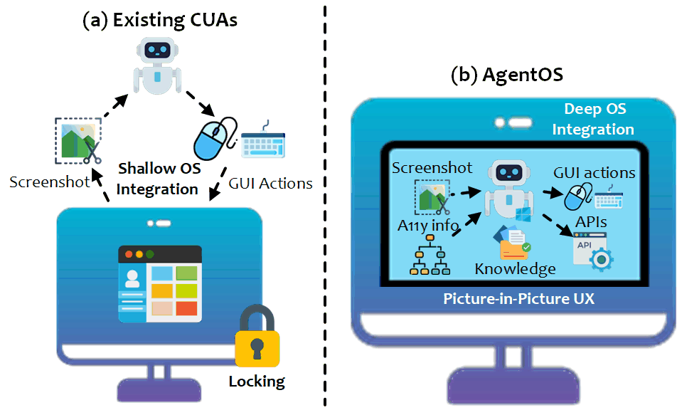
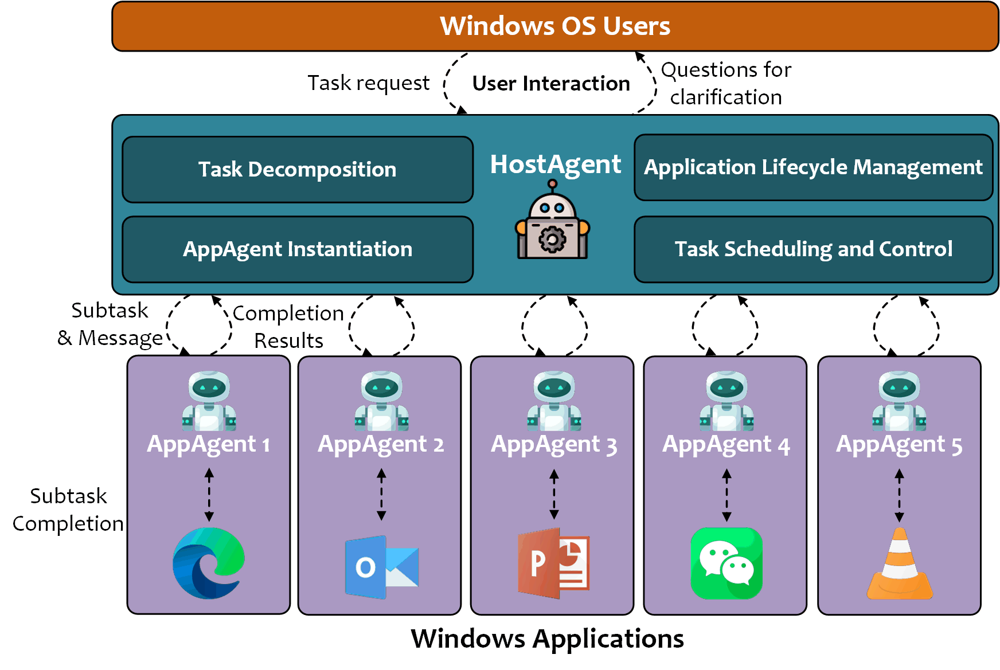

<!-- markdownlint-disable MD033 MD041 -->

<h1 align="center">
  <b>UFO²</b>  :&nbsp;桌面操作系统智能体
</h1>
<parameter name="content">
  <em>将自然语言请求转化为 Windows 上自动化、可靠的多应用程序工作流，超越以 UI 为中心。</em>
</p>

<p align="center">
  <strong>📖 Language / 语言:</strong>
  <a href="README.md">English</a> |
  <strong>中文</strong>
</p>

<div align="center">

[](https://arxiv.org/abs/2504.14603)&ensp;
&ensp;
[](https://opensource.org/licenses/MIT)&ensp;
[](https://microsoft.github.io/UFO/)&ensp;
[](https://www.youtube.com/watch?v=QT_OhygMVXU)&ensp;

</div>

<p align="center">
  <strong>⬆️ 寻找 UFO³ (多设备星系)?</strong>
  <a href="../README_ZH.md">🌌 返回 UFO³ 主 README</a>
</p>

<h1 align="center">
    
</h1>

---

## ✨ 核心能力
<div align="center">

| [深度操作系统集成](https://microsoft.github.io/UFO)  | 画中画桌面 *(即将推出)* | [混合 GUI + API 操作](https://microsoft.github.io/UFO/automator/overview) |
|---------------------|-------------------------------------------|---------------------------|
| 结合 Windows UIA、Win32 和 WinCOM 实现一流的控件检测和本地命令。 | 自动化在沙盒虚拟桌面中运行，您可以继续使用主屏幕。 | 优先使用原生 API，不可用时回退到点击/按键——快速*且*稳健。 |

| [推测性多操作](https://microsoft.github.io/UFO/advanced_usage/multi_action) | [持续知识基底](https://microsoft.github.io/UFO/advanced_usage/reinforce_appagent/overview/) | [UIA + 视觉控件检测](https://microsoft.github.io/UFO/advanced_usage/control_detection/hybrid_detection) |
|--------------------------|--------------------------------|--------------------------------|
| 将多个预测步骤打包到一次 LLM 调用中，实时验证——**减少 51% 的查询次数**。 | 通过 RAG 混合文档、必应搜索、用户演示和执行轨迹，使智能体随时间学习。 | 使用混合 UIA + 视觉管道检测标准*和*自定义控件。 |

</div>

*查看[文档](https://microsoft.github.io/UFO/)了解完整详情。*

---

## 📢 新闻
- 📅 2025-04-19: 版本 **v2.0.0** 发布！我们很高兴宣布 **UFO²** 发布！UFO² 是对原始 UFO 的重大升级，具有增强的功能。它引入了 **AgentOS** 概念，能够无缝集成多个智能体以完成复杂任务。请查看我们的[新技术报告](https://arxiv.org/pdf/2504.14603)了解更多详情。
- 📅 ...
- 📅 2024-02-14: 我们的 UFO [技术报告](https://arxiv.org/abs/2402.07939)已上线！
- 📅 2024-02-10: UFO 的第一个版本在 GitHub 上发布🎈。春节快乐🐉！

---

## 🏗️ 架构概览
<p align="center">
  
</p>


UFO² 作为**桌面操作系统智能体**运行，包含一个多智能体框架，包括：

1. **HostAgent（主机智能体）** – 解析自然语言目标，启动必要的应用程序，启动/协调 AppAgents，并控制全局有限状态机（FSM）。
2. **AppAgents（应用智能体）** – 每个应用程序一个；每个运行一个 ReAct 循环，具有多模态感知、混合控件检测、检索增强知识和选择 GUI 操作和原生 API 之间的 **Puppeteer** 执行器。
3. **知识基底** – 将离线文档、在线搜索、演示和执行轨迹混合到向量存储中，在推理时实时检索。
4. **推测性执行器** – 通过预测可能的操作批次并在一次调用中根据实时 UIA 状态验证它们，大幅降低 LLM 延迟。
5. **画中画桌面** *(即将推出)* – 在隔离的虚拟桌面中运行智能体，因此您的主工作区和输入设备保持不变。

有关深入了解，请参阅我们的[技术报告](https://arxiv.org/pdf/2504.14603)或[文档网站](https://microsoft.github.io/UFO)。

---

## 🌐 媒体报道

UFO 的出现引起了各种媒体的关注，包括：
- [微软正式开源UFO²，Windows桌面迈入「AgentOS 时代」](https://www.jiqizhixin.com/articles/2025-05-06-13)
- [Microsoft's UFO abducts traditional user interfaces for a smarter Windows experience](https://the-decoder.com/microsofts-ufo-abducts-traditional-user-interfaces-for-a-smarter-windows-experience/)
- [🚀 UFO & GPT-4-V: Sit back and relax, mientras GPT lo hace todo🌌](https://www.linkedin.com/posts/gutierrezfrancois_ai-ufo-microsoft-activity-7176819900399652865-pLoo?utm_source=share&utm_medium=member_desktop)
- [The AI PC - The Future of Computers? - Microsoft UFO](https://www.youtube.com/watch?v=1k4LcffCq3E)
- [下一代Windows系统曝光：基于GPT-4V，Agent跨应用调度，代号UFO](https://baijiahao.baidu.com/s?id=1790938358152188625&wfr=spider&for=pc)
- [下一代智能版 Windows 要来了？微软推出首个 Windows Agent，命名为 UFO！](https://blog.csdn.net/csdnnews/article/details/136161570)
- [Microsoft発のオープンソース版「UFO」登場！　Windowsを自動操縦するAIエージェントを試す](https://internet.watch.impress.co.jp/docs/column/shimizu/1570581.html)
- ...

这些来源提供了对技术演变格局的见解，以及 UFO 现象对各种平台的影响。

---

## 🚀 三分钟快速入门


### 🛠️ 步骤 1：安装
UFO 需要在 **Windows OS >= 10** 上运行 **Python >= 3.10**。可以通过运行以下命令进行安装：
```powershell
# [可选：创建 conda 环境]
# conda create -n ufo python=3.10
# conda activate ufo

# 克隆仓库
git clone https://github.com/microsoft/UFO.git
cd UFO
# 安装依赖
pip install -r requirements.txt
# 如果想使用 Qwen 作为 LLM，请取消注释相关库。
```

### ⚙️ 步骤 2：配置 LLM

> **📢 新配置系统（推荐）**
> UFO² 现在使用位于 `config/ufo/` 中的**新模块化配置系统**，具有自动发现和类型验证功能。虽然仍然支持传统的 `ufo/config/config.yaml` 以实现向后兼容，但我们强烈建议迁移到新系统以获得更好的可维护性。

#### **选项 1：新配置系统（推荐）**

新配置文件组织在 `config/ufo/` 中，不同组件使用单独的 YAML 文件：

```powershell
# 复制模板以创建您的智能体配置文件（包含 API 密钥）
copy config\ufo\agents.yaml.template config\ufo\agents.yaml
notepad config\ufo\agents.yaml   # 编辑您的 LLM API 凭据
```

**目录结构：**
```
config/ufo/
├── agents.yaml.template     # 模板：智能体配置（HOST_AGENT、APP_AGENT）- 复制并编辑此文件
├── agents.yaml              # 您的智能体配置与 API 密钥（不要提交到 git）
├── rag.yaml                 # RAG 和知识设置（默认值，如需要可编辑）
├── system.yaml              # 系统设置（默认值，如需要可编辑）
├── mcp.yaml                 # MCP 集成设置（默认值，如需要可编辑）
└── ...                      # 其他具有默认值的模块化配置
```

> 📝 **注意**：只有 `agents.yaml` 包含敏感信息（API 密钥）。其他配置文件具有默认值，仅在您想自定义设置时才需要编辑。

**迁移优势：**
- ✅ **类型安全**：使用 Pydantic 模式自动验证
- ✅ **自动发现**：无需手动加载配置
- ✅ **模块化**：将关注点分离到单独的文件中
- ✅ **IDE 支持**：更好的自动完成和错误检测

**在代码中使用新配置：**
```python
from config.config_loader import get_ufo_config

# 现代方法（类型安全、已验证）
config = get_ufo_config()
api_type = config.get("HOST_AGENT", "API_TYPE")

# 传统方法仍然有效（用于向后兼容）
# from ufo.config import Config
# configs = Config.get_instance().config_data
```

#### **选项 2：传统配置（向后兼容）**

对于现有用户，旧配置路径仍然有效：

```powershell
copy ufo\config\config.yaml.template ufo\config\config.yaml
notepad ufo\config\config.yaml   # 粘贴您的密钥和端点
```

> ⚠️ **注意**：如果旧配置和新配置都存在，`config/ufo/` 中的新配置将优先。启动期间将显示警告。

#### OpenAI 配置

**新配置 (`config/ufo/agents.yaml`)：**
```yaml
HOST_AGENT:
  VISUAL_MODE: true
  API_TYPE: "openai"
  API_BASE: "https://api.openai.com/v1/chat/completions"
  API_KEY: "sk-YOUR_KEY_HERE"  # 替换为您的实际 API 密钥
  API_VERSION: "2025-02-01-preview"
  API_MODEL: "gpt-4o"

APP_AGENT:
  VISUAL_MODE: true
  API_TYPE: "openai"
  API_BASE: "https://api.openai.com/v1/chat/completions"
  API_KEY: "sk-YOUR_KEY_HERE"  # 替换为您的实际 API 密钥
  API_VERSION: "2025-02-01-preview"
  API_MODEL: "gpt-4o"
```

**传统配置 (`ufo/config/config.yaml`)：**
```yaml
VISUAL_MODE: True, # 是否使用视觉模式
API_TYPE: "openai" , # API 类型，OpenAI API 为 "openai"。
API_BASE: "https://api.openai.com/v1/chat/completions", # OpenAI API 端点。
API_KEY: "sk-",  # OpenAI API 密钥，以 sk- 开头
API_VERSION: "2024-02-15-preview", # 默认为 "2024-02-15-preview"
API_MODEL: "gpt-4o",  # 唯一的 OpenAI 模型
```

#### Azure OpenAI (AOAI) 配置

**新配置 (`config/ufo/agents.yaml`)：**
```yaml
HOST_AGENT:
  VISUAL_MODE: true
  API_TYPE: "aoai"
  API_BASE: "https://YOUR_RESOURCE.openai.azure.com"
  API_KEY: "YOUR_AOAI_KEY"
  API_VERSION: "2024-02-15-preview"
  API_MODEL: "gpt-4o"
  API_DEPLOYMENT_ID: "YOUR_DEPLOYMENT_ID"

APP_AGENT:
  VISUAL_MODE: true
  API_TYPE: "aoai"
  API_BASE: "https://YOUR_RESOURCE.openai.azure.com"
  API_KEY: "YOUR_AOAI_KEY"
  API_VERSION: "2024-02-15-preview"
  API_MODEL: "gpt-4o"
  API_DEPLOYMENT_ID: "YOUR_DEPLOYMENT_ID"
```

**传统配置 (`ufo/config/config.yaml`)：**
```yaml
VISUAL_MODE: True, # 是否使用视觉模式
API_TYPE: "aoai" , # API 类型，Azure OpenAI 为 "aoai"。
API_BASE: "YOUR_ENDPOINT", # AOAI API 地址。格式：https://{your-resource-name}.openai.azure.com
API_KEY: "YOUR_KEY",  # aoai API 密钥
API_VERSION: "2024-02-15-preview", # 默认为 "2024-02-15-preview"
API_MODEL: "gpt-4o",  # 唯一的 OpenAI 模型
API_DEPLOYMENT_ID: "YOUR_AOAI_DEPLOYMENT", # AOAI API 的部署 ID
```

> 需要 Qwen、Gemini、非视觉 GPT-4，甚至 **OpenAI CUA Operator** 作为 AppAgent？请参阅[模型指南](https://microsoft.github.io/UFO/supported_models/overview/)。

### 📔 步骤 3：RAG 的附加设置（可选）。

如果您想通过外部知识增强 UFO 的能力，可以选择使用外部数据库配置它以进行检索增强生成（RAG）。

**对于新配置系统**：编辑 `config/ufo/rag.yaml`（已存在默认值）
**对于传统配置**：编辑 `ufo/config/config.yaml`

我们为 RAG 提供以下选项以增强 UFO 的能力：
- [离线帮助文档](https://microsoft.github.io/UFO/advanced_usage/reinforce_appagent/learning_from_help_document/) 使 UFO 能够从离线帮助文档中检索信息。
- [在线必应搜索引擎](https://microsoft.github.io/UFO/advanced_usage/reinforce_appagent/learning_from_bing_search/)：利用最新的在线搜索结果增强 UFO 的能力。
- [自我经验](https://microsoft.github.io/UFO/advanced_usage/reinforce_appagent/experience_learning/)：将任务完成轨迹保存到 UFO 的内存中以供将来参考。
- [用户演示](https://microsoft.github.io/UFO/advanced_usage/reinforce_appagent/learning_from_demonstration/)：通过用户演示提升 UFO 的能力。

**RAG 配置示例 (`config/ufo/rag.yaml`)：**
```yaml
# 启用必应搜索
RAG_ONLINE_SEARCH: True
BING_API_KEY: "YOUR_BING_API_KEY"  # 从 https://www.microsoft.com/en-us/bing/apis 获取

# 启用经验学习
RAG_EXPERIENCE: True
```

有关如何配置这些设置的更多信息，请查阅它们各自的文档。


### 🎉 步骤 4：启动 UFO

#### ⌨️ 您可以在 Windows 命令行（CLI）上执行以下操作：

```powershell
# 假设您在克隆的 UFO 文件夹中
python -m ufo --task <your_task_name>
```

这将启动 UFO 进程，您可以通过命令行界面与其交互。
如果一切顺利，您将看到以下消息：

```powershell
Welcome to use UFO🛸, A UI-focused Agent for Windows OS Interaction.
 _   _  _____   ___
| | | ||  ___| / _ \
| | | || |_   | | | |
| |_| ||  _|  | |_| |
 \___/ |_|     \___/
Please enter your request to be completed🛸:
```

或者，您还可以通过使用以下命令直接使用特定任务和请求调用 UFO：

```powershell
python -m ufo --task <your_task_name> -r "<your_request>"
```


###  步骤 5 🎥：执行日志

您可以在以下文件夹中找到拍摄的屏幕截图以及请求和响应日志：
```
./ufo/logs/<your_task_name>/
```
您可以使用它们来调试、重放或分析智能体输出。


## ❓获取帮助
* 请首先查看我们的文档[此处](https://microsoft.github.io/UFO/)。
* ❔GitHub Issues（首选）
* 对于其他通信，请联系 [ufo-agent@microsoft.com](mailto:ufo-agent@microsoft.com)。

---

## 🔄 迁移到新配置系统

如果您从使用 `ufo/config/config.yaml` 的旧版本 UFO 升级，我们提供了一个**自动转换工具**，可以智能地将您的传统单体配置转换为新的模块化结构。

### ⚡ 自动转换（推荐）

**一键转换，格式转换：**

```powershell
# 交互式转换，自动备份
python -m ufo.tools.convert_config

# 首先预览更改（试运行）
python -m ufo.tools.convert_config --dry-run

# 强制转换，无需确认
python -m ufo.tools.convert_config --force
```

**转换工具的功能：**
- ✅ **拆分**单体 `config.yaml` 到模块化文件（agents.yaml、rag.yaml、system.yaml）
- ✅ **转换**流式 YAML（带大括号 `{}`）到标准块式 YAML
- ✅ **映射**传统文件名（例如，`agent_mcp.yaml` → `mcp.yaml`，`config_prices.yaml` → `prices.yaml`）
- ✅ **保留**所有配置值（由单元测试验证）
- ✅ **创建**转换前的时间戳备份
- ✅ **验证**输出文件可解析为 YAML
- ✅ **提供**需要时的回滚说明

**示例输出：**
```
🔧 Config Conversion

Converting configurations...
Processing: ufo\config\config.yaml
Processing: ufo\config\agent_mcp.yaml
Processing: ufo\config\config_prices.yaml
Skipping: ufo\config\config_dev.yaml (environment-specific, use --env=dev)

✓ Wrote: config\ufo\agents.yaml (6 keys)
✓ Wrote: config\ufo\rag.yaml (11 keys)
✓ Wrote: config\ufo\system.yaml (6 keys)
✓ Wrote: config\ufo\mcp.yaml (5 keys)
✓ Wrote: config\ufo\prices.yaml (1 keys)

✨ Conversion Complete!
```

**转换详情：**

| 传统文件 | → | 新文件 | 转换 |
|-------------|---|-------------|----------------|
| `config.yaml`（单体） | → | `agents.yaml` + `rag.yaml` + `system.yaml` | 智能字段拆分 |
| `agent_mcp.yaml` | → | `mcp.yaml` | 重命名 + 格式转换 |
| `config_prices.yaml` | → | `prices.yaml` | 重命名 + 格式转换 |
| `config_dev.yaml` | → |（保持单独，使用 `--env=dev`）| 特定于环境 |

**格式转换：**
```yaml
# 旧格式（流式，带大括号）
HOST_AGENT: { API_TYPE: "azure_ad", API_KEY: "...", VISUAL_MODE: True }

# 新格式（块式，带缩进）
HOST_AGENT:
  API_TYPE: azure_ad
  API_KEY: YOUR_KEY
  VISUAL_MODE: true
```

### 🛠️ 手动迁移步骤

如果您更喜欢手动迁移或想了解转换工具的作用：

1. **复制模板文件**以创建您的智能体配置：
   ```powershell
   copy config\ufo\agents.yaml.template config\ufo\agents.yaml
   ```

2. **将您的 API 凭据**从旧配置转移到新配置：

   **从** `ufo/config/config.yaml`：
   ```yaml
   HOST_AGENT: { API_TYPE: "azure_ad", API_KEY: "YOUR_KEY", ... }
   ```

   **到** `config/ufo/agents.yaml`：
   ```yaml
   HOST_AGENT:
     API_TYPE: azure_ad
     API_KEY: YOUR_KEY
     # ... 复制其他字段
   ```

3. **其他配置使用默认值** - 像 `rag.yaml`、`system.yaml`、`mcp.yaml` 这样的文件已经存在合理的默认值。仅在您想自定义设置时编辑它们（例如，启用必应搜索、更改 RAG 设置）。

4. **验证转换**是否有效：
   ```powershell
   # 测试新配置是否正确加载
   python -c "from config.config_loader import get_ufo_config; print('Config loaded:', len(get_ufo_config()), 'keys')"
   ```

### ⚙️ 向后兼容性

- ✅ 旧配置路径 `ufo/config/config.yaml` **仍然有效**
- ✅ 使用 `Config.get_instance().config_data` 的旧代码**仍然有效**
- ✅ 支持渐进式迁移 - 两个系统可以暂时共存
- ⚠️ **推荐**：转换后，将传统配置保留为备份，直到验证

### 📚 详细迁移指南

有关完整的迁移详细信息，包括代码示例、测试步骤、回滚说明和配置文件映射，请参阅：

**📖 [完整迁移文档](https://microsoft.github.io/UFO/configuration/system/migration/)**

---

## 📊 评估

UFO² 在两个公开可用的实时任务套件上进行了严格的基准测试：

| 基准 | 范围 | 文档 |
|-----------|-------|-------|
| [**Windows Agent Arena (WAA)**](https://github.com/nice-mee/WindowsAgentArena) | 15 个应用程序（Office、Edge、文件资源管理器、VS Code 等）的 154 个真实 Windows 任务 | <https://microsoft.github.io/UFO/benchmark/windows_agent_arena/> |
| [**OSWorld (Windows)**](https://github.com/nice-mee/WindowsAgentArena/tree/2020-qqtcg/osworld) | 49 个跨应用程序任务，混合 Office 365、浏览器和系统实用程序 | <https://microsoft.github.io/UFO/benchmark/osworld> |

这些基准与 UFO² 的集成在单独的存储库中。请遵循上述文档了解更多详情。

---


## 📚 引用

如果您在此工作的基础上进行构建，请引用我们的 AgentOS 框架：

**UFO² – 桌面操作系统智能体（2025）**
<https://arxiv.org/abs/2504.14603>
```bibtex
@article{zhang2025ufo2,
  title   = {{UFO2: The Desktop AgentOS}},
  author  = {Zhang, Chaoyun and Huang, He and Ni, Chiming and Mu, Jian and Qin, Si and He, Shilin and Wang, Lu and Yang, Fangkai and Zhao, Pu and Du, Chao and Li, Liqun and Kang, Yu and Jiang, Zhao and Zheng, Suzhen and Wang, Rujia and Qian, Jiaxu and Ma, Minghua and Lou, Jian-Guang and Lin, Qingwei and Rajmohan, Saravan and Zhang, Dongmei},
  journal = {arXiv preprint arXiv:2504.14603},
  year    = {2025}
}
```

**UFO – 用于 Windows OS 交互的以 UI 为中心的智能体（2024）**
<https://arxiv.org/abs/2402.07939>
```bibtex
@article{zhang2024ufo,
  title   = {{UFO: A UI-Focused Agent for Windows OS Interaction}},
  author  = {Zhang, Chaoyun and Li, Liqun and He, Shilin and Zhang, Xu and Qiao, Bo and Qin, Si and Ma, Minghua and Kang, Yu and Lin, Qingwei and Rajmohan, Saravan and Zhang, Dongmei and Zhang, Qi},
  journal = {arXiv preprint arXiv:2402.07939},
  year    = {2024}
}
```


---

## 📝 路线图

UFO² 团队正在积极开发以下功能和改进：

- [ ] **画中画模式** – 开发中
- [x] **AgentOS 即服务** – 已完成并集成到框架中
- [ ] **自动调试工具包** – 开发中
- [x] **与 MCP 集成** – 已完成并集成到框架中


---

## 🎨 相关项目
- **TaskWeaver** — 用于数据分析的代码优先 LLM 智能体：<https://github.com/microsoft/TaskWeaver>
- **基于 LLM 的 GUI 智能体：综述**：<https://arxiv.org/abs/2411.18279> • [GitHub](https://github.com/vyokky/LLM-Brained-GUI-Agents-Survey) • [交互式网站](https://vyokky.github.io/LLM-Brained-GUI-Agents-Survey/)

---


## ⚠️ 免责声明
通过选择运行提供的代码，您承认并同意[DISCLAIMER.md](../DISCLAIMER.md)中有关功能和数据处理实践的以下条款和条件


##  商标

本项目可能包含项目、产品或服务的商标或徽标。Microsoft 商标或徽标的授权使用受
[Microsoft 商标和品牌指南](https://www.microsoft.com/en-us/legal/intellectualproperty/trademarks/usage/general)的约束并必须遵循。
在本项目的修改版本中使用 Microsoft 商标或徽标不得引起混淆或暗示 Microsoft 赞助。
任何第三方商标或徽标的使用均受这些第三方的政策约束。


---

## ⚖️ 许可证
本存储库根据 [MIT 许可证](LICENSE)（SPDX 标识符：MIT）发布。
有关隐私和安全通知，请参阅 [DISCLAIMER.md](DISCLAIMER.md)。

---

<p align="center"><sub>© Microsoft 2025 • UFO² 是一个开源项目，不是官方 Windows 功能。</sub></p>
