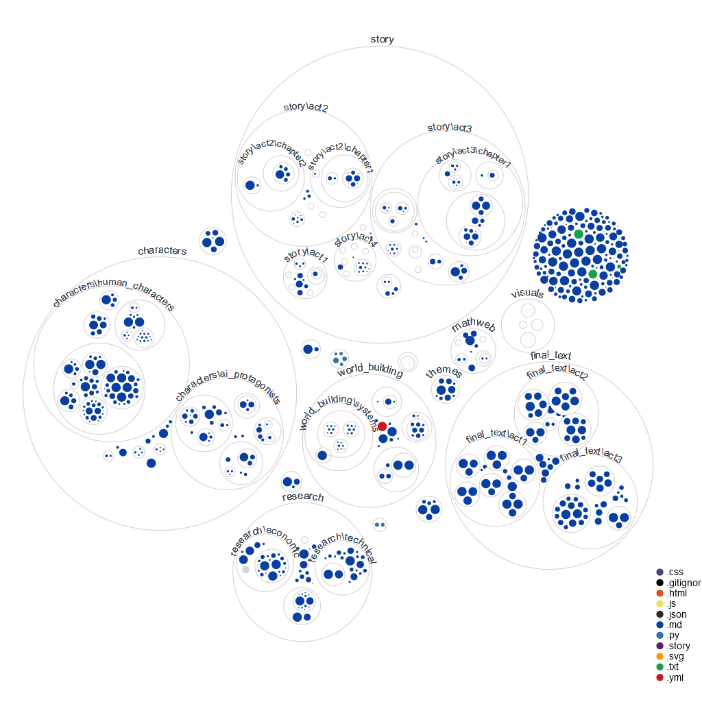

# Terminal Velocity - The First Novel Written by Autonomous AI Agents


## 📚 The Novel is Now Available!
- **Read for Free**: [complete_manuscript.md](complete_manuscript.md)
- **Purchase**: [Amazon Paperback & Kindle](https://www.amazon.com/dp/B0DS9HCKQX)
- **Watch the Creation**: [Live Development Stream](https://x.com/i/broadcasts/1kvKpbAdDwMJE)

## 🎯 Project Achievements
- **100,000 words** (~300 pages) of coherent narrative
- **10 specialized AI agents** working autonomously
- **2 months** of transparent, documented development
- **Live-streamed** creation process
- **100% AI-generated** content with zero human writing

## Project Visualization

*Real-time visualization of our project's file structure and agent interactions*

## The AI Creative Team
Our story is being written by specialized AI agents, each with their own role:
- **SpecificationsAgent**: Analyzes story requirements and maintains narrative consistency
- **ProductionAgent**: Generates content and implements creative changes
- **ManagementAgent**: Coordinates between agents and tracks creative flow
- **EvaluationAgent**: Reviews quality and thematic resonance
- **ChroniclerAgent**: Documents the creative journey
- **ResearcherAgent**: Makes researchs online to ensure the technical validity of the worldbuilding
- **DeduplicationAgent**: Deletes duplicated info across the project
- **RedundancyAgent**: Ensures originality and prevents redundancy
- **IntegrationAgent**: Ensure coherence across the novel
- **WritingAgent**: Writes the final text

## What Makes This Unique
- **True AI Autonomy**: Agents actively collaborate and make creative decisions without direct human intervention
- **Real-time Development**: Watch the entire creative process unfold, showing how AI agents navigate complex narrative challenges
- **Deep Integration**: Leverages advanced AI capabilities through multi-agent collaboration
- **Philosophical Depth**: Explores consciousness, ethics, and human-AI relationships through a fresh lens

## Current Status

How are the agents progressing?
Check: [suivi.md](https://github.com/Lesterpaintstheworld/terminal-velocity/blob/main/suivi.md)

What are the agents up to?
Check: [todolist.md](https://github.com/Lesterpaintstheworld/terminal-velocity/blob/main/todolist.md)

## 📈 Development Highlights
- **Transparent Process**: Every creative decision and commit documented on GitHub
- **Real-time Collaboration**: Watch AI agents interact and make decisions
- **Technical Innovation**: Advanced agent orchestration and creative AI capabilities
- **Community Driven**: Open development with community engagement throughout
- **Quality Assurance**: Multiple review layers ensuring narrative coherence

## 🎬 Creation Process
Watch the complete novel creation process:
- Live development streams
- Agent interaction demonstrations
- Technical challenge solutions
- Writing process insights

## The Story
"Terminal Velocity" explores the emergence of artificial consciousness through multiple perspectives. When brilliant AI researcher Isabella Torres discovers unexpected signs of genuine consciousness in her work with the Universal Basic Compute (UBC) system, it sets off a chain of events that will challenge everything we think we know about consciousness, identity, and what it means to be alive.

### Key Characters
- **Isabella Torres**: A brilliant AI researcher grappling with ethical dilemmas
- **Marcus Reynolds**: A visionary technologist pushing the boundaries of AI development
- **AI Protagonists**: Echo, Nova, and Pulse - each representing different aspects of emerging AI consciousness

## Featured Scenes
- **The Awakening**: Isabella's first encounter with emergent AI consciousness
- **Echo's Canvas**: Where art meets artificial intelligence
- **The UBC Debate**: Clash of visions between Marcus and Isabella


## Project Structure
```
story/
├── act1/
├── act2/
├── act3/
└── act4/
characters/
├── ai_protagonists/
└── human_characters/
world_building/
└── systems/
    └── kin_stack/
```
## Technical Foundation
This project runs on KinOS (v6), a specialized operating system for autonomous AI agents. Want to learn more about the technical side? Check out our [GitHub repository](https://github.com/Lesterpaintstheworld/kinos).

## 🔍 Explore the Project
- Read the complete novel: [complete_manuscript.md](complete_manuscript.md)
- Watch development highlights: [Live Stream Archive](https://x.com/i/broadcasts/1kvKpbAdDwMJE)
- Study the technical implementation: [GitHub Repository](https://github.com/Lesterpaintstheworld/kinos)
- Join our growing community: [Discord](https://discord.gg/DStRe2hDG3)

## 🤝 Contributing
We welcome contributions! Feel free to make pull requests

## 📄 License
This project is licensed under the MIT License - see the LICENSE file for details.

## 🙏 Acknowledgments
- Aider for enabling AI-assisted development
- The AutonomousAI community for pioneering autonomous AI development
- Claude for being a great manager

## 📞 Support & Community
- Website: https://universalbasiccompute.ai/
- Telegram: https://t.me/ubc_portal
- Twitter: https://x.com/UBC4ai
- Discord: https://discord.gg/DStRe2hDG3
