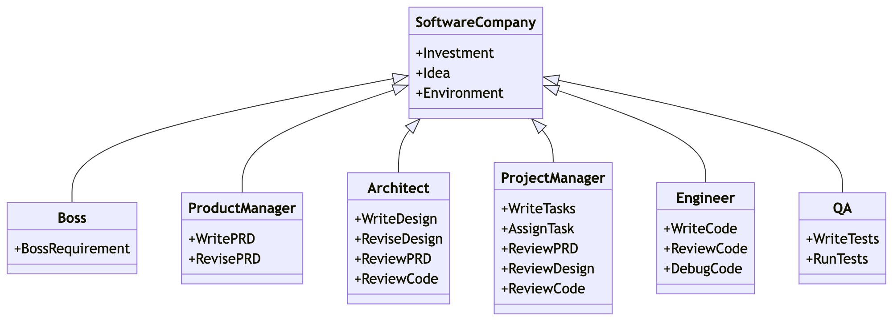

# MetaGPT: Architecture Multi-Agent

<p align="center">
<a href=""></a>
</p>

<p align="center">
[ <a href="../README.md">En</a> |
<a href="README_CN.md">中</a> |
<b>Fr</b> |
<a href="README_JA.md">日</a> ]
<b>Assigner différents rôles aux GPTs pour former une entité collaborative capable de gérer des tâches complexes.</b>
</p>

<p align="center">
<a href="https://opensource.org/licenses/MIT"></a>
<a href="https://discord.gg/DYn29wFk9z"></a>
<a href="https://twitter.com/MetaGPT_"></a>
</p>

## Nouveautés
🚀 29 mars 2024:  La version [v0.8.0](https://github.com/geekan/MetaGPT/releases/tag/v0.8.0) a été publiée. Vous pouvez désormais utiliser le Data Interpreter ([arxiv](https://arxiv.org/abs/2402.18679), [example](https://docs.deepwisdom.ai/main/en/DataInterpreter/), [code](https://github.com/geekan/MetaGPT/tree/main/examples/di)) via l'importation du package PyPI. De plus, le module RAG (Génération Augmentée par Récupération) a été intégré, et plusieurs nouveaux modèles de LLMs sont désormais pris en charge.

🚀 28 février 2024: La version [v0.7.0](https://github.com/geekan/MetaGPT/releases/tag/v0.7.0) a été publiée, permettant l'attribution de différents modèles de langage (LLMs) à différents Rôles. Nous avons également introduit le [Data Interpreter](https://github.com/geekan/MetaGPT/blob/main/examples/di/README.md), , un agent puissant capable de résoudre une grande variété de problèmes du monde réel.

🚀 16 janvier 2024: Notre article intitulé  [MetaGPT: Meta Programming for A Multi-Agent Collaborative Framework
](https://openreview.net/forum?id=VtmBAGCN7o) a été accepté pour une **présentation orale (top 1,2%)** à la conférence ICLR 2024, se **classant n°1** dans la catégorie des agents basés sur les modèles de langage (LLM).

🚀 3 janvier 2024 : La version [v0.6.0](https://github.com/geekan/MetaGPT/releases/tag/v0.6.0) a été publiée avec de nouvelles fonctionnalités, notamment la sérialisation, la mise à niveau du package OpenAI et la prise en charge de plusieurs modèles de langage (LLM). Un [exemple minimal pour le débat](https://github.com/geekan/MetaGPT/blob/main/examples/debate_simple.py)  a également été ajouté pour illustrer ces capacités.

🚀 15 décembre 2023 : La version [v0.5.0](https://github.com/geekan/MetaGPT/releases/tag/v0.5.0) a été publiée, introduisant des fonctionnalités expérimentales telles que le développement incrémental, la prise en charge du multilingue, et la compatibilité avec plusieurs langages de programmation, etc..


🔥 8 novembre 2023 : MetaGPT a été sélectionné parmi les [Open100: Top 100 des réalisations open source](https://www.benchcouncil.org/evaluation/opencs/annual.html), une reconnaissance qui met en avant les meilleures innovations et contributions dans le domaine des projets open source.

🔥 1er septembre 2023 : MetaGPT a dominé le classement **GitHub Trending Monthly** pour la **17ème fois** en août 2023, consolidant ainsi sa position en tant que projet open source de premier plan.

🌟 30 juin 2023 : MetaGPT est désormais open source, permettant à la communauté de contribuer et d'enrichir le projet.

🌟 24 avril 2023 : La première ligne de code de MetaGPT a été engagée, marquant le début de ce projet innovant.


### Système multi-agents dans une entreprise de logiciels

1. **Exigence unique** : MetaGPT prend en entrée une **exigence formulée en une ligne** et produit des résultats variés, tels que des **user stories, des analyses concurrentielles, des exigences, des structures de données, des API, des documents, etc.**.

2. **Structure interne** : MetaGPT intègre divers rôles présents dans une entreprise de logiciels, notamment **des chefs de produits, des architectes, des chefs de projet et des ingénieurs**. Ce système propose un processus complet de **développement logiciel**, soutenu par des **procédures opérationnelles standardisées (SOP) soigneusement orchestrées**.

   1. La philosophie centrale du système est exprimée par l'énoncé : `Code = SOP(Équipe)`. Cela signifie que les SOP sont concrétisées et appliquées à des équipes composées de modèles de langage (LLMs), permettant ainsi une meilleure gestion et un meilleur déroulement des projets.




<p align="center">Schéma multi-agent d'une entreprise de logiciels (Mise en œuvre progressive)</p>


## Commençons !

### Installation

> Assurez-vous que Python 3.9 ou supérieur, mais inférieur à 3.12, est installé sur votre système. Vous pouvez le vérifier en utilisant : `python --version`.
> Vous pouvez utiliser conda comme suit : `conda create -n metagpt python=3.9 && conda activate metagpt`

```bash
pip install --upgrade metagpt
# or `pip install --upgrade git+https://github.com/geekan/MetaGPT.git`
# or `git clone https://github.com/geekan/MetaGPT && cd MetaGPT && pip install --upgrade -e .`
```

Pour des conseils d'installation détaillés, veuillez vous référer à [cli_install](https://docs.deepwisdom.ai/main/en/guide/get_started/installation.html#install-stable-version)
 ou [docker_install](https://docs.deepwisdom.ai/main/en/guide/get_started/installation.html#install-with-docker)

### Configuration

Vous pouvez initialiser la configuration de MetaGPT en lançant la commande suivante, ou en créant manuellement le fichier `~/.metagpt/config2.yaml` :
```bash
# Visitez https://docs.deepwisdom.ai/main/en/guide/get_started/configuration.html pour plus de détails
metagpt --init-config  # il créera ~/.metagpt/config2.yaml, il suffit de le modifier selon vos besoins
```

Vous pouvez configurer `~/.metagpt/config2.yaml` selon l'[exemple](https://github.com/geekan/MetaGPT/blob/main/config/config2.example.yaml) et le [doc](https://docs.deepwisdom.ai/main/en/guide/get_started/configuration.html) :

```yaml
llm:
  api_type: "openai"  # ou azure / ollama / groq etc. Consultez LLMType pour plus d'options
  model: "gpt-4-turbo"  # ou gpt-3.5-turbo
  base_url: "https://api.openai.com/v1"  # ou URL de transfert / URL d'autre LLM.
  api_key: "VOTRE_CLE_API"
```

### Utilisation

Après l'installation, vous pouvez utiliser MetaGPT en CLI

```bash
metagpt "Create a 2048 game"  #  ceci créera un repo dans ./workspace
```

ou l'utiliser comme bibliothèque

```python
from metagpt.software_company import generate_repo, ProjectRepo
repo: ProjectRepo = generate_repo("Create a 2048 game")  # ou ProjectRepo("<path>")
print(repo)  # il affichera la structure du repo avec les fichiers
```

Vous pouvez aussi utiliser [Data Interpreter](https://github.com/geekan/MetaGPT/tree/main/examples/di) pour écrire du code:

```python
import asyncio
from metagpt.roles.di.data_interpreter import DataInterpreter

async def main():
    di = DataInterpreter()
    await di.run("Exécuter une analyse de données sur le jeu de données sklearn Iris et y inclure un graphique")

asyncio.run(main())  # ou attendre main() dans une configuration de notebook jupyter
```


### Vidéo de démonstration et de démarrage rapide (en Anglais) :
- Essayez-le sur [MetaGPT Huggingface Space](https://huggingface.co/spaces/deepwisdom/MetaGPT)
- [Matthew Berman : Comment installer MetaGPT - Construire une startup avec une seule invite](https://youtu.be/uT75J_KG_aY)
- [Vidéo de démonstration officielle](https://github.com/geekan/MetaGPT/assets/2707039/5e8c1062-8c35-440f-bb20-2b0320f8d27d)

https://github.com/user-attachments/assets/888cb169-78c3-4a42-9d62-9d90ed3928c9

## Tutoriel (en Anglais)

- 🗒 [Document en ligne](https://docs.deepwisdom.ai/main/en/)
- 💻 [Utilisation](https://docs.deepwisdom.ai/main/en/guide/get_started/quickstart.html)
- 🔎 [Que peut faire MetaGPT](https://docs.deepwisdom.ai/main/en/guide/get_started/introduction.html)
- 🛠 Comment créer ses propres agents ?
  - [MetaGPT Guide d'utilisation et de développement | Agent 101](https://docs.deepwisdom.ai/main/en/guide/tutorials/agent_101.html)
  - [MetaGPT Guide d'utilisation et de développement | MultiAgent 101](https://docs.deepwisdom.ai/main/en/guide/tutorials/multi_agent_101.html)
- 🧑‍💻 Contribution
  - [Élaborer une feuille de route](docs/ROADMAP.md)
- 🔖 Cas d'usage
  - [Interprète des données](https://docs.deepwisdom.ai/main/en/guide/use_cases/agent/interpreter/intro.html)
  - [Débat](https://docs.deepwisdom.ai/main/en/guide/use_cases/multi_agent/debate.html)
  - [Chercheur](https://docs.deepwisdom.ai/main/en/guide/use_cases/agent/researcher.html)
  - [Assistant(e) de réception](https://docs.deepwisdom.ai/main/en/guide/use_cases/agent/receipt_assistant.html)
- ❓ [FAQs](https://docs.deepwisdom.ai/main/en/guide/faq.html)

## Support

### Rejoignez-nous sur Discord

📢 Rejoignez-nous sur [Discord Channel](https://discord.gg/ZRHeExS6xv)! Au plaisir de vous y voir ! 🎉

### Formulaire de contribution

📝 [Remplissez le formulaire](https://airtable.com/appInfdG0eJ9J4NNL/pagK3Fh1sGclBvVkV/form) pour devenir contributeur. Nous nous réjouissons de votre participation !

### Information de contact

Si vous avez des questions ou des commentaires sur ce projet, n'hésitez pas à nous contacter. Nous apprécions grandement vos suggestions !

- **Email:** alexanderwu@deepwisdom.ai
- **GitHub Issues:** Pour des questions plus techniques, vous pouvez également créer un nouveau problème dans notre [dépôt Github](https://github.com/geekan/metagpt/issues).

Nous répondrons à toutes les questions dans un délai de 2 à 3 jours ouvrables.

## Citation

Pour rester informé des dernières recherches et développements, suivez [@MetaGPT_] (https://twitter.com/MetaGPT_) sur Twitter.

Pour citer [MetaGPT](https://openreview.net/forum?id=VtmBAGCN7o) ou [Data Interpreter](https://arxiv.org/abs/2402.18679) dans des publications, veuillez utiliser les entrées BibTeX suivantes.

```bibtex
@inproceedings{hong2024metagpt,
      title={Meta{GPT}: Meta Programming for A Multi-Agent Collaborative Framework},
      author={Sirui Hong and Mingchen Zhuge and Jonathan Chen and Xiawu Zheng and Yuheng Cheng and Jinlin Wang and Ceyao Zhang and Zili Wang and Steven Ka Shing Yau and Zijuan Lin and Liyang Zhou and Chenyu Ran and Lingfeng Xiao and Chenglin Wu and J{\"u}rgen Schmidhuber},
      booktitle={The Twelfth International Conference on Learning Representations},
      year={2024},
      url={https://openreview.net/forum?id=VtmBAGCN7o}
}
@misc{hong2024data,
      title={Data Interpreter: An LLM Agent For Data Science},
      author={Sirui Hong and Yizhang Lin and Bang Liu and Bangbang Liu and Binhao Wu and Danyang Li and Jiaqi Chen and Jiayi Zhang and Jinlin Wang and Li Zhang and Lingyao Zhang and Min Yang and Mingchen Zhuge and Taicheng Guo and Tuo Zhou and Wei Tao and Wenyi Wang and Xiangru Tang and Xiangtao Lu and Xiawu Zheng and Xinbing Liang and Yaying Fei and Yuheng Cheng and Zongze Xu and Chenglin Wu},
      year={2024},
      eprint={2402.18679},
      archivePrefix={arXiv},
      primaryClass={cs.AI}
}
```
