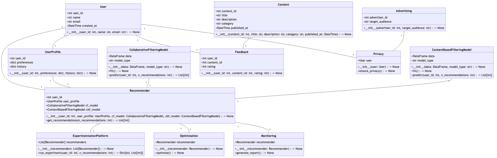

# MetaGPT: マルチエージェントフレームワーク

<p align="center">
<a href=""></a>
</p>

<p align="center">
[ <a href="../README.md">En</a> |
<a href="README_CN.md">中</a> |
<a href="README_FR.md">Fr</a> |
<b>日</b> ]
<b>GPT にさまざまな役割を割り当てることで、複雑なタスクのための共同ソフトウェアエンティティを形成します。</b>
</p>

<p align="center">
<a href="https://opensource.org/licenses/MIT"></a>
<a href="https://discord.gg/DYn29wFk9z"></a>
<a href="https://twitter.com/MetaGPT_"></a>

1. MetaGPT は、**1 行の要件** を入力とし、**ユーザーストーリー / 競合分析 / 要件 / データ構造 / API / 文書など** を出力します。
2. MetaGPT には、**プロダクト マネージャー、アーキテクト、プロジェクト マネージャー、エンジニア** が含まれています。MetaGPT は、**ソフトウェア会社のプロセス全体を、慎重に調整された SOP とともに提供します。**
   1. `Code = SOP(Team)` が基本理念です。私たちは SOP を具体化し、LLM で構成されるチームに適用します。


<p align="center">ソフトウェア会社のマルチロール図式（順次導入）</p>

## MetaGPT の能力


https://github.com/user-attachments/assets/888cb169-78c3-4a42-9d62-9d90ed3928c9


## 例（GPT-4 で完全生成）

例えば、`metagpt "Toutiao のような RecSys をデザインする"`と入力すると、多くの出力が得られます



解析と設計を含む 1 つの例を生成するのに約 **$0.2**（GPT-4 の API 使用料）、完全なプロジェクトでは約 **$2.0** かかります。


## インストール

### インストールビデオガイド

- [Matthew Berman: How To Install MetaGPT - Build A Startup With One Prompt!!](https://youtu.be/uT75J_KG_aY)

### 伝統的なインストール
> Python 3.9 以上がシステムにインストールされていることを確認してください。これは `python --version` を使ってチェックできます。
> 以下のようにcondaを使うことができます：`conda create -n metagpt python=3.9 && conda activate metagpt`

```bash
pip install metagpt
metagpt --init-config  # ~/.metagpt/config2.yaml を作成し、自分の設定に合わせて変更してください
metagpt "2048ゲームを作成する"  # これにより ./workspace にリポジトリが作成されます
```

または、ライブラリとして使用することもできます

```python
from metagpt.software_company import generate_repo, ProjectRepo
repo: ProjectRepo = generate_repo("2048ゲームを作成する")  # または ProjectRepo("<パス>")
print(repo)  # リポジトリの構造とファイルを出力します
```

**注:**

- すでに Chrome、Chromium、MS Edge がインストールされている場合は、環境変数 `PUPPETEER_SKIP_CHROMIUM_DOWNLOAD` を `true` に設定することで、
Chromium のダウンロードをスキップすることができます。

- このツールをグローバルにインストールする[問題を抱えている](https://github.com/mermaidjs/mermaid.cli/issues/15)人もいます。ローカルにインストールするのが代替の解決策です、

  ```bash
  npm install @mermaid-js/mermaid-cli
  ```

- config.yml に mmdc のコンフィグを記述するのを忘れないこと

  ```yml
  puppeteer_config: "./config/puppeteer-config.json"
  path: "./node_modules/.bin/mmdc"
  ```

- もし `pip install -e.` がエラー `[Errno 13] Permission denied: '/usr/local/lib/python3.11/dist-packages/test-easy-install-13129.write-test'` で失敗したら、代わりに `pip install -e. --user` を実行してみてください

- Mermaid charts を SVG、PNG、PDF 形式に変換します。Node.js 版の Mermaid-CLI に加えて、Python 版の Playwright、pyppeteer、または mermaid.ink をこのタスクに使用できるようになりました。

  - Playwright
    - **Playwright のインストール**

    ```bash
    pip install playwright
    ```

    - **必要なブラウザのインストール**

    PDF変換をサポートするには、Chrominumをインストールしてください。

    ```bash
    playwright install --with-deps chromium
    ```

    - **modify `config2.yaml`**

    config2.yaml から mermaid.engine のコメントを外し、`playwright` に変更する

    ```yaml
    mermaid:
      engine: playwright
    ```

  - pyppeteer
    - **pyppeteer のインストール**

    ```bash
    pip install pyppeteer
    ```

    - **自分のブラウザを使用**

    pyppeteer を使えばインストールされているブラウザを使うことができます、以下の環境を設定してください

    ```bash
    export PUPPETEER_EXECUTABLE_PATH = /path/to/your/chromium or edge or chrome
    ```

    ブラウザのインストールにこのコマンドを使わないでください、これは古すぎます

    ```bash
    pyppeteer-install
    ```

    - **`config2.yaml` を修正**

    config2.yaml から mermaid.engine のコメントを外し、`pyppeteer` に変更する

    ```yaml
    mermaid:
      engine: pyppeteer
    ```

  - mermaid.ink
    - **`config2.yaml` を修正**

    config2.yaml から mermaid.engine のコメントを外し、`ink` に変更する

    ```yaml
    mermaid:
      engine: ink
    ```

    注: この方法は pdf エクスポートに対応していません。

### Docker によるインストール
> Windowsでは、"/opt/metagpt"をDockerが作成する権限を持つディレクトリに置き換える必要があります。例えば、"D:\Users\x\metagpt"などです。

```bash
# ステップ 1: metagpt 公式イメージをダウンロードし、config2.yaml を準備する
docker pull metagpt/metagpt:latest
mkdir -p /opt/metagpt/{config,workspace}
docker run --rm metagpt/metagpt:latest cat /app/metagpt/config/config2.yaml > /opt/metagpt/config/config2.yaml
vim /opt/metagpt/config/config2.yaml # 設定を変更する

# ステップ 2: コンテナで metagpt デモを実行する
docker run --rm \
    --privileged \
    -v /opt/metagpt/config/config2.yaml:/app/metagpt/config/config2.yaml \
    -v /opt/metagpt/workspace:/app/metagpt/workspace \
    metagpt/metagpt:latest \
    metagpt "Write a cli snake game"

# コンテナを起動し、その中でコマンドを実行することもできます
docker run --name metagpt -d \
    --privileged \
    -v /opt/metagpt/config/config2.yaml:/app/metagpt/config/config2.yaml \
    -v /opt/metagpt/workspace:/app/metagpt/workspace \
    metagpt/metagpt:latest

docker exec -it metagpt /bin/bash
$ metagpt "Write a cli snake game"
```

コマンド `docker run ...` は以下のことを行います:

- 特権モードで実行し、ブラウザの実行権限を得る
- ホスト設定ファイル `/opt/metagpt/config/config2.yaml` をコンテナ `/app/metagpt/config/config2.yaml` にマップします
- ホストディレクトリ `/opt/metagpt/workspace` をコンテナディレクトリ `/app/metagpt/workspace` にマップするs
- デモコマンド `metagpt "Write a cli snake game"` を実行する

### 自分でイメージをビルドする

```bash
# また、自分で metagpt イメージを構築することもできます。
git clone https://github.com/geekan/MetaGPT.git
cd MetaGPT && docker build -t metagpt:custom .
```

## 設定

- `api_key` を `~/.metagpt/config2.yaml / config/config2.yaml` のいずれかで設定します。
- 優先順位は: `~/.metagpt/config2.yaml > config/config2.yaml > env` の順です。

```bash
# 設定ファイルをコピーし、必要な修正を加える。
cp config/config2.yaml ~/.metagpt/config2.yaml
```

## チュートリアル: スタートアップの開始

```shell
# スクリプトの実行
metagpt "Write a cli snake game"
# プロジェクトの実施にエンジニアを雇わないこと
metagpt "Write a cli snake game" --no-implement
# エンジニアを雇い、コードレビューを行う
metagpt "Write a cli snake game" --code_review
```

スクリプトを実行すると、`workspace/` ディレクトリに新しいプロジェクトが見つかります。

### プラットフォームまたはツールの設定

要件を述べるときに、どのプラットフォームまたはツールを使用するかを指定できます。

```shell
metagpt "pygame をベースとした cli ヘビゲームを書く"
```

### 使用方法

```
会社名
    metagpt - 私たちは AI で構成されたソフトウェア・スタートアップです。私たちに投資することは、無限の可能性に満ちた未来に力を与えることです。

シノプシス
    metagpt IDEA <flags>

説明
    私たちは AI で構成されたソフトウェア・スタートアップです。私たちに投資することは、無限の可能性に満ちた未来に力を与えることです。

位置引数
    IDEA
        型: str
        あなたの革新的なアイデア、例えば"スネークゲームを作る。"など

フラグ
    --investment=INVESTMENT
        型: float
        デフォルト: 3.0
        投資家として、あなたはこの AI 企業に一定の金額を拠出する機会がある。
    --n_round=N_ROUND
        型: int
        デフォルト: 5

注意事項
    位置引数にフラグ構文を使うこともできます
```

### コードウォークスルー

```python
from metagpt.team import Team
from metagpt.roles import ProjectManager, ProductManager, Architect, Engineer

async def startup(idea: str, investment: float = 3.0, n_round: int = 5):
    """スタートアップを実行する。ボスになる。"""
    company = Team()
    company.hire([ProductManager(), Architect(), ProjectManager(), Engineer()])
    company.invest(investment)
    company.start_project(idea)
    await company.run(n_round=n_round)
```

`examples` でシングル・ロール（ナレッジ・ベース付き）と LLM のみの例を詳しく見ることができます。

## クイックスタート

ローカル環境のインストールや設定は、ユーザーによっては難しいものです。以下のチュートリアルで MetaGPT の魅力をすぐに体験できます。

- [MetaGPT クイックスタート](https://deepwisdom.feishu.cn/wiki/CyY9wdJc4iNqArku3Lncl4v8n2b)

Hugging Face Space で試す
- https://huggingface.co/spaces/deepwisdom/MetaGPT-SoftwareCompany

## 引用

研究論文でMetaGPTやData Interpreterを使用する場合は、以下のように当社の作業を引用してください：

```bibtex
@inproceedings{hong2024metagpt,
      title={Meta{GPT}: Meta Programming for A Multi-Agent Collaborative Framework},
      author={Sirui Hong and Mingchen Zhuge and Jonathan Chen and Xiawu Zheng and Yuheng Cheng and Jinlin Wang and Ceyao Zhang and Zili Wang and Steven Ka Shing Yau and Zijuan Lin and Liyang Zhou and Chenyu Ran and Lingfeng Xiao and Chenglin Wu and J{\"u}rgen Schmidhuber},
      booktitle={The Twelfth International Conference on Learning Representations},
      year={2024},
      url={https://openreview.net/forum?id=VtmBAGCN7o}
}
@misc{hong2024data,
      title={Data Interpreter: An LLM Agent For Data Science},
      author={Sirui Hong and Yizhang Lin and Bang Liu and Bangbang Liu and Binhao Wu and Danyang Li and Jiaqi Chen and Jiayi Zhang and Jinlin Wang and Li Zhang and Lingyao Zhang and Min Yang and Mingchen Zhuge and Taicheng Guo and Tuo Zhou and Wei Tao and Wenyi Wang and Xiangru Tang and Xiangtao Lu and Xiawu Zheng and Xinbing Liang and Yaying Fei and Yuheng Cheng and Zongze Xu and Chenglin Wu},
      year={2024},
      eprint={2402.18679},
      archivePrefix={arXiv},
      primaryClass={cs.AI}
}
```

## お問い合わせ先

このプロジェクトに関するご質問やご意見がございましたら、お気軽にお問い合わせください。皆様のご意見をお待ちしております！

- **Email:** alexanderwu@deepwisdom.ai
- **GitHub Issues:** 技術的なお問い合わせについては、[GitHub リポジトリ](https://github.com/geekan/metagpt/issues) に新しい issue を作成することもできます。

ご質問には 2-3 営業日以内に回答いたします。

## デモ

https://github.com/geekan/MetaGPT/assets/2707039/5e8c1062-8c35-440f-bb20-2b0320f8d27d

## 参加する

📢 Discord チャンネルに参加してください！
https://discord.gg/ZRHeExS6xv

お会いできることを楽しみにしています！ 🎉
