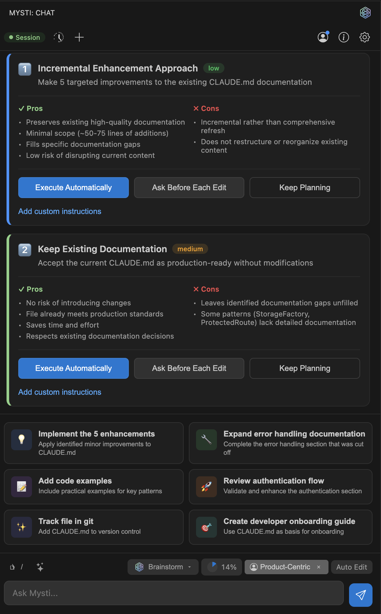
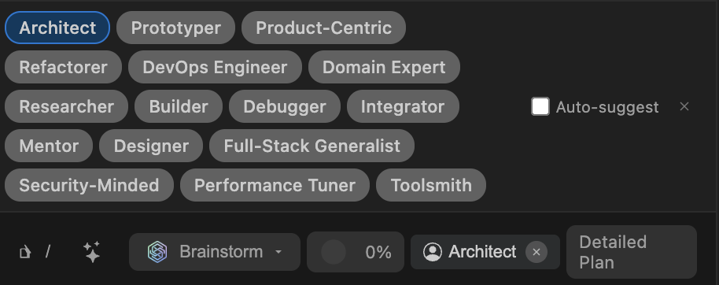
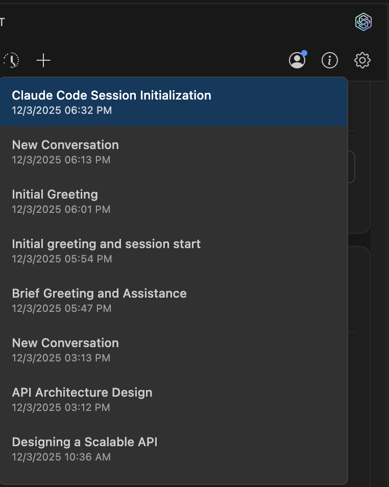

<p align="center">
  <a href="README.md">English</a> | <a href="README.zh-CN.md">简体中文</a> | <a href="README.ja.md">日本語</a> | <a href="README.ko.md">한국어</a> | <a href="README.es.md">Español</a> | <a href="README.pt-BR.md">Português</a> | العربية | <a href="README.de.md">Deutsch</a> | <a href="README.fr.md">Français</a> | <a href="README.tr.md">Türkçe</a> | <a href="README.ru.md">Русский</a>
</p>

<div dir="rtl">

# Mysti - فريق البرمجة بالذكاء الاصطناعي يعمل معاً

<p align="center">
  
</p>

<p align="center">
  <a href="https://marketplace.visualstudio.com/items?itemName=DeepMyst.mysti">
    
  </a>
  <a href="https://marketplace.visualstudio.com/items?itemName=DeepMyst.mysti">
    
  </a>
  <a href="https://marketplace.visualstudio.com/items?itemName=DeepMyst.mysti">
    
  </a>
  <a href="https://github.com/DeepMyst/Mysti/stargazers">
    
  </a>
  <a href="https://github.com/DeepMyst/Mysti/network/members">
    
  </a>
  <a href="https://github.com/DeepMyst/Mysti/blob/main/LICENSE">
    
  </a>
</p>

<p align="center">
  <strong>فريق البرمجة بالذكاء الاصطناعي لـ VSCode</strong><br>
  <em>11 مزود ذكاء اصطناعي — Claude Code و Codex و Gemini و Copilot و Cline و Cursor و OpenClaw و OpenCode و Qwen Code و Ollama و LocalAI — يعملون فردياً أو كفريق</em><br>
  <em>حكمة الجماعة حيث الذكاء الجماعي لعدة وكلاء يتفوق على وكيل واحد.</em>
</p>

<p align="center">
  <a href="https://marketplace.visualstudio.com/items?itemName=DeepMyst.mysti">
    
  </a>
</p>

<p align="center">
  <a href="#اختر-ذكاءك-الاصطناعي">المزودون</a> •
  <a href="#وضع-العصف-الذهني">العصف الذهني</a> •
  <a href="#الميزات-الرئيسية">الميزات</a> •
  <a href="#البدء-السريع">البدء السريع</a> •
  <a href="#الإعدادات">الإعدادات</a> •
  <a href="#التوثيق">التوثيق</a>
</p>

---

## الجديد في v0.3.4

### 11 مزود ذكاء اصطناعي

يدعم Mysti الآن **11 مزود ذكاء اصطناعي** — تمت إضافة **OpenCode** و **Qwen Code** و **Ollama** و **LocalAI** إلى جانب Claude Code و Codex و Gemini و GitHub Copilot و Cline و Cursor و OpenClaw. شغّل نماذج محلية مع Ollama/LocalAI أو استخدم مزودي السحابة مثل OpenCode و Qwen Code. كل مزود له شعاره الخاص في واجهة المستخدم.

### Qwen Code

أداة CLI للبرمجة بالذكاء الاصطناعي من Alibaba بقدرات تفكير عميقة. تستخدم نفس بروتوكول البث المباشر مثل Claude Code للتكامل السلس. تدعم نماذج Qwen3 Coder مع أوضاع الموافقة plan و auto-edit و yolo.

### OpenCode

وكيل برمجة متعدد الخلفيات يدعم Anthropic و OpenAI و Google و Groq عبر CLI واحد. يستخدم نموذجك الافتراضي المُعَد — بدون قيود على مزودين محددين.

### دعم الذكاء الاصطناعي المحلي

شغّل نماذج الذكاء الاصطناعي محلياً مع **Ollama** و **LocalAI** — بدون حاجة لاشتراك سحابي. خصوصية كاملة، تأخير صفري، تحكم كامل في نماذجك.

---

## التثبيت في ثوانٍ

**من VS Code:** اضغط `Ctrl+P` (`Cmd+P` على Mac)، ثم الصق:

```
ext install DeepMyst.mysti
```

**أو** [ثبّت من VS Code Marketplace](https://marketplace.visualstudio.com/items?itemName=DeepMyst.mysti)

---

## اختر ذكاءك الاصطناعي

يعمل Mysti مع أدوات البرمجة بالذكاء الاصطناعي التي لديك بالفعل. **لا حاجة لاشتراكات إضافية.**

<p align="center">
  
</p>

| المزود | الأفضل لـ |
|--------|----------|
| **Claude Code** | التفكير العميق، إعادة الهيكلة المعقدة، التحليل الشامل |
| **Codex** | التكرار السريع، أسلوب OpenAI المألوف |
| **Gemini** | الاستجابات السريعة، التكامل مع نظام Google |
| **GitHub Copilot** | الوصول متعدد النماذج (Claude و GPT-5 و Gemini) عبر اشتراك GitHub |
| **Cline** | وضع Plan/Act، إكمال المهام المنظم |
| **Cursor** | اختيار النموذج التلقائي، متعدد النماذج مع Claude و GPT-5 و Gemini |
| **OpenClaw** | بث WebSocket الفوري، مستويات تفكير قابلة للتعديل |
| **OpenCode** | وكيل متعدد الخلفيات (Anthropic و OpenAI و Google و Groq) |
| **Qwen Code** | وكيل برمجة ذكاء اصطناعي من Alibaba، تفكير عميق |
| **Ollama** | استدلال LLM محلي، الخصوصية أولاً، بدون اشتراك |
| **LocalAI** | نماذج ذكاء اصطناعي مستضافة ذاتياً، تحكم كامل |

**بدّل بين المزودين بنقرة واحدة. بدون قيود.**

### لماذا Mysti؟

| مقابل Copilot/Cursor | ميزة Mysti |
|----------------------|-----------|
| ذكاء اصطناعي واحد | **عصف ذهني متعدد الوكلاء** — ذكاءان اصطناعيان يتعاونان بـ 5 استراتيجيات |
| مقيد بمزود واحد | **11 مزوداً** — Claude و Codex و Gemini و Copilot و Cline و Cursor و OpenClaw و OpenCode و Qwen و Ollama و LocalAI |
| صندوق أسود | **تحكم كامل في الصلاحيات** — من القراءة فقط إلى الوصول الكامل |
| ردود عامة | **16 شخصية** — مهندس معماري، مُصلح أخطاء، خبير أمان... |
| سير عمل يدوي | **وضع مستقل** — الذكاء الاصطناعي يعمل بشكل مستقل مع ضوابط أمان |
| لا توجيه بين الوكلاء | **@الإشارات** — وجّه المهام لوكلاء محددين ضمن النص |

---

## شاهده أثناء العمل

<p align="center">
  
</p>

<p align="center"><em>واجهة محادثة جميلة وحديثة مع تمييز بناء الجملة ودعم Markdown ومخططات Mermaid</em></p>

<p align="center">
  
</p>

<p align="center"><em>عرض قائمة المهام الفوري وتتبع التقدم</em></p>

---

## وضع العصف الذهني

**تريد رأياً ثانياً؟** فعّل وضع العصف الذهني ودع وكيلي ذكاء اصطناعي يعالجان مشكلتك معاً. **اختر أي 2 من 11 وكيلاً** من لوحة الإعدادات.

<p align="center">
  
</p>

### 5 استراتيجيات تعاون

| الاستراتيجية | الأدوار | الأفضل لـ |
|-------------|---------|----------|
| **Quick** | تجميع مباشر | المهام البسيطة، الإجابات السريعة |
| **Debate** | ناقد ضد مدافع | قرارات البنية، المفاضلات |
| **Red-Team** | مقترح ضد متحدٍّ | مراجعات الأمان، اكتشاف الحالات الحدية |
| **Perspectives** | محلل مخاطر ضد مبتكر | التصميم الجديد، اختيار التقنية |
| **Delphi** | ميسّر ضد مُحسّن | المشاكل المعقدة، الوصول للإجماع |

### لماذا ذكاءان اصطناعيان أفضل من واحد

يملك **Claude Code** (Anthropic) و **Codex** (OpenAI) و **Gemini** (Google) و **GitHub Copilot** و **Cline** و **Cursor** و **OpenClaw** و **OpenCode** و **Qwen Code** (Alibaba) و **Ollama** و **LocalAI** تدريبات مختلفة ونقاط قوة مختلفة ونقاط ضعف مختلفة. عندما يعمل أي اثنان معاً:

- كل ذكاء اصطناعي يكتشف حالات حدية قد يفوتها الآخر
- الرؤى المختلفة تؤدي إلى حلول أكثر متانة
- **معاً** يتناقشون ويتحدون بعضهم البعض ويجمّعون أفضل حل

إنه مثل وجود مطور أول وقائد تقني يراجعان كودك — إلا أنهما يناقشانه فعلياً أولاً.

### كشف التقارب

أثناء المناقشات، يتتبع Mysti اتفاق الوكلاء واستقرار المواقف. عند تفعيل **التقارب التلقائي**، تنتهي المناقشة مبكراً بمجرد وصول الوكلاء للإجماع — يوفر الوقت دون التضحية بالجودة.

### اختر فريقك

عدّل أي وكيلين يتعاونان في **لوحة الإعدادات**:

<p align="center">
  
</p>

| التوليفة | الأفضل لـ |
|---------|----------|
| Claude + Codex | التحليل العميق مع التكرار السريع |
| Claude + Gemini | التفكير الشامل مع التحقق السريع |
| Claude + Copilot | مقارنة Claude الأصلي مع نهج Copilot متعدد النماذج |
| Cursor + Gemini | مرونة متعددة النماذج مع تكامل Google |
| OpenClaw + Claude | بث WebSocket مع تفكير عميق |
| Qwen + Claude | مقارنة تفكير Alibaba و Anthropic |
| OpenCode + Gemini | مرونة متعددة الخلفيات مع سرعة Google |
| Ollama + Claude | خصوصية محلية مع ذكاء سحابي |

[توثيق العصف الذهني الكامل](docs/BRAINSTORM.md)

### الكشف الذكي عن الخطط

عندما يقدم الذكاء الاصطناعي عدة مناهج تنفيذ، يكتشفها Mysti تلقائياً ويتيح لك اختيار المسار المفضل.

<p align="center">
  
</p>

*يتطلب تثبيت أداتي CLI على الأقل. انظر [المتطلبات](#المتطلبات).*

---

## الميزات الرئيسية

### الوضع المستقل

دع الذكاء الاصطناعي يعمل بشكل مستقل مع ضوابط أمان قابلة للتعديل:

- **مصنّف الأمان**: ثلاثة مستويات — آمن (موافقة تلقائية)، حذر (يعتمد على الوضع)، محظور (رفض دائم)
- **ثلاثة أوضاع أمان**: محافظ، متوازن، جريء
- **ذاكرة التعلم**: يتذكر تفضيلات الصلاحيات ويتحسن مع الوقت
- **أوضاع الاستمرار**: قائمة على الأهداف أو طابور المهام للجلسات المستقلة الممتدة
- **سجل المراجعة**: كل قرار مستقل يُسجل للمراجعة

<p align="center">
  
</p>

[توثيق الوضع المستقل الكامل](docs/AUTONOMOUS-MODE.md)

### نظام @الإشارات

وجّه المهام لوكلاء محددين وأشِر للملفات ضمن النص:

<p align="center">
  
</p>

```
@claude راجع هذا الكود بحثاً عن مشاكل أمنية
@src/auth.ts @gemini اقترح تحسينات أداء لهذا الملف
@claude اكتب اختبارات، ثم @codex حسّنها
```

- **إشارات الملفات**: `@filename` يضيف سياقاً مؤقتاً
- **إشارات الوكلاء**: `@agent` يوجّه المهام لذلك المزود
- **التسلسل**: الوكلاء اللاحقون يتلقون ردود الوكلاء السابقين كسياق

[توثيق @الإشارات الكامل](docs/MENTIONS.md)

### ضغط السياق

إدارة ذكية للمحادثة تمنع تجاوز السياق:

- **تلقائي**: يُفعَّل عندما يقترب استخدام الرموز من العتبة (افتراضي 75%)
- **دعم أصلي**: Claude Code يستخدم الأمر المدمج `/compact`
- **من جانب العميل**: المزودون الآخرون يستخدمون تلخيصاً ذكياً للرسائل
- **تتبع لكل لوحة**: كل لوحة محادثة تتتبع الاستخدام بشكل مستقل

[توثيق الضغط الكامل](docs/COMPACTION.md)

### 16 شخصية مطوّر

شكّل طريقة تفكير ذكائك الاصطناعي. اختر من شخصيات متخصصة تغيّر نهج الذكاء الاصطناعي تجاه مشاكلك.

<p align="center">
  
</p>

| الشخصية | التركيز |
|---------|--------|
| **المهندس المعماري** | تصميم الأنظمة، قابلية التوسع، البنية النظيفة |
| **مُصلح الأخطاء** | تحليل السبب الجذري، إصلاح الأخطاء |
| **خبير الأمان** | الثغرات، نمذجة التهديدات |
| **مُحسّن الأداء** | التحسين، التنميط، زمن الاستجابة |
| **المُنمذج** | التكرار السريع، إثبات المفاهيم |
| **مُعيد الهيكلة** | جودة الكود، قابلية الصيانة |
| + 10 أخرى... | فول ستاك، DevOps، مرشد، مصمم... |

[توثيق الشخصيات والمهارات الكامل](docs/PERSONAS-AND-SKILLS.md)

---

### اختيار سريع للشخصية

اختر الشخصيات مباشرة من شريط الأدوات دون فتح اللوحات.

<p align="center">
  
</p>

---

### اقتراحات تلقائية ذكية

يقترح Mysti تلقائياً شخصيات وإجراءات ذات صلة بناءً على رسالتك.

<p align="center">
  
</p>

---

### سجل المحادثات

لا تفقد عملك أبداً. جميع المحادثات محفوظة ويمكن الوصول إليها بسهولة.

<p align="center">
  
</p>

---

### إجراءات سريعة في صفحة الترحيب

ابدأ بسرعة مع إجراءات بنقرة واحدة للمهام الشائعة.

<p align="center">
  
</p>

---

### إعدادات شاملة

اضبط كل جانب من Mysti بما في ذلك ميزانيات الرموز، مستويات الوصول، ووضع العصف الذهني.

<p align="center">
  
</p>

---

## المتطلبات

**تدفع بالفعل مقابل Claude أو ChatGPT أو Gemini أو GitHub Copilot؟ أنت جاهز.**

يعمل Mysti مع اشتراكاتك الحالية — بدون تكاليف إضافية!

| أداة CLI | الاشتراك | التثبيت |
|----------|---------|---------|
| **Claude Code** (مُوصى به) | Anthropic API أو Claude Pro/Max | `npm install -g @anthropic-ai/claude-code` |
| **GitHub Copilot CLI** | GitHub Copilot Pro/Pro+/Business | `npm install -g @github/copilot-cli` |
| **Gemini CLI** | Google AI API أو Gemini Advanced | `npm install -g @google/gemini-cli` |
| **Codex CLI** | OpenAI API | اتبع دليل تثبيت OpenAI |
| **Cline** | يعتمد على مزود النموذج | `npm install -g cline` |
| **Cursor** | اشتراك Cursor | `curl https://cursor.com/install -fsS \| bash` |
| **OpenClaw** | حساب OpenClaw | `npm install -g openclaw@latest && openclaw onboard --install-daemon` |
| **OpenCode** | مفاتيح API للمزود (Anthropic، OpenAI، إلخ) | `npm i -g opencode-ai@latest` |
| **Qwen Code** | Qwen OAuth أو مفاتيح API | `npm install -g @qwen-code/qwen-code@latest` |
| **Ollama** | محلي (لا حاجة لاشتراك) | [تثبيت من ollama.com](https://ollama.com) |
| **LocalAI** | محلي (لا حاجة لاشتراك) | [تثبيت من localai.io](https://localai.io) |

تحتاج **أداة CLI واحدة** فقط للبدء. ثبّت **أي اثنتين** لفتح وضع العصف الذهني.

---

## البدء السريع

### 1. ثبّت Mysti

**الخيار أ:** اضغط `Ctrl+P` (`Cmd+P` على Mac)، الصق ونفّذ:
```
ext install DeepMyst.mysti
```

**الخيار ب:** [تثبيت من VS Code Marketplace](https://marketplace.visualstudio.com/items?itemName=DeepMyst.mysti)

### 2. ثبّت أداة CLI

```bash
# Claude Code (مُوصى به)
npm install -g @anthropic-ai/claude-code
claude auth login

# أو GitHub Copilot CLI (الوصول لـ Claude و GPT-5 و Gemini عبر GitHub)
npm install -g @github/copilot-cli
copilot  # ثم استخدم أمر /login

# أو Gemini CLI
npm install -g @google/gemini-cli
gemini auth login

# أو Cursor
curl https://cursor.com/install -fsS | bash
agent login

# أو OpenClaw
npm install -g openclaw@latest && openclaw onboard --install-daemon
openclaw login

# أو OpenCode
npm i -g opencode-ai@latest
opencode auth login

# أو Qwen Code
npm install -g @qwen-code/qwen-code@latest
qwen  # ثم اكتب /auth
```

لوضع العصف الذهني، ثبّت أي أداتي CLI.

### 3. افتح Mysti

- انقر على **أيقونة Mysti** في شريط النشاط، أو
- اضغط `Ctrl+Shift+M` (`Cmd+Shift+M` على Mac)

### 4. ابدأ البرمجة

اكتب طلبك ودع الذكاء الاصطناعي يساعدك!

---

## أوامر الشرطة المائلة

الوصول للمهارات والإجراءات بسرعة عبر قائمة أوامر الشرطة المائلة المدمجة.

<p align="center">
  
</p>

---

## 12 مهارة قابلة للتبديل

امزج وطابق معدّلات السلوك:

- **موجز** - تواصل واضح ومختصر
- **مدفوع بالاختبارات** - اختبارات مع الكود
- **التزام تلقائي** - التزامات تدريجية
- **المبادئ الأولى** - استدلال من الأساسيات
- **انضباط النطاق** - التركيز على المهمة
- و 7 أخرى...

[توثيق الشخصيات والمهارات الكامل](docs/PERSONAS-AND-SKILLS.md)

---

## ضوابط الصلاحيات

تحكم فيما يمكن للذكاء الاصطناعي فعله:

- **قراءة فقط** - الذكاء الاصطناعي يقرأ فقط، لا يعدّل أبداً
- **طلب إذن** - موافقة على كل تغيير في الملفات
- **وصول كامل** - دع الذكاء الاصطناعي يعمل بشكل مستقل

<p align="center">
  
</p>

---

## الإعدادات

### الإعدادات الأساسية

```json
{
  "mysti.defaultProvider": "claude-code",
  "mysti.brainstorm.agents": ["claude-code", "google-gemini"],
  "mysti.brainstorm.strategy": "quick",
  "mysti.accessLevel": "ask-permission"
}
```

### إعدادات المزودين

| الإعداد | الافتراضي | الوصف |
|---------|----------|-------|
| `mysti.defaultProvider` | `claude-code` | مزود الذكاء الاصطناعي الرئيسي |
| `mysti.claudePath` | `claude` | مسار CLI لـ Claude |
| `mysti.codexPath` | `codex` | مسار CLI لـ Codex |
| `mysti.geminiPath` | `gemini` | مسار CLI لـ Gemini |
| `mysti.copilotPath` | `copilot` | مسار CLI لـ Copilot |
| `mysti.clinePath` | `cline` | مسار CLI لـ Cline |
| `mysti.cursorPath` | `agent` | مسار CLI لـ Cursor |
| `mysti.openclawPath` | `openclaw` | مسار CLI لـ OpenClaw |
| `mysti.opencodePath` | `opencode` | مسار CLI لـ OpenCode |
| `mysti.qwenCodePath` | `qwen` | مسار CLI لـ Qwen Code |
| `mysti.ollamaPath` | `ollama` | مسار CLI لـ Ollama |
| `mysti.localaiPath` | `localai` | مسار CLI لـ LocalAI |

### إعدادات العصف الذهني

| الإعداد | الافتراضي | الوصف |
|---------|----------|-------|
| `mysti.brainstorm.agents` | `["claude-code", "openai-codex"]` | أي وكيلين يُستخدمان |
| `mysti.brainstorm.strategy` | `quick` | الاستراتيجية: `quick` أو `debate` أو `red-team` أو `perspectives` أو `delphi` |
| `mysti.brainstorm.autoConverge` | `true` | الخروج تلقائياً عند تقارب الوكلاء |
| `mysti.brainstorm.maxDiscussionRounds` | `3` | أقصى عدد لجولات النقاش |

### إعدادات الوضع المستقل

| الإعداد | الافتراضي | الوصف |
|---------|----------|-------|
| `mysti.autonomous.safetyMode` | `balanced` | `conservative` أو `balanced` أو `aggressive` |
| `mysti.autonomous.blockPatterns` | `[]` | أنماط مخصصة للحظر دائماً |

### إعدادات الضغط

| الإعداد | الافتراضي | الوصف |
|---------|----------|-------|
| `mysti.compaction.enabled` | `true` | تفعيل ضغط السياق |
| `mysti.compaction.threshold` | `75` | عتبة الضغط (% من نافذة السياق) |

### إعدادات عامة

| الإعداد | الافتراضي | الوصف |
|---------|----------|-------|
| `mysti.accessLevel` | `ask-permission` | مستوى الوصول للملفات |
| `mysti.agents.autoSuggest` | `true` | اقتراح الشخصيات تلقائياً |
| `mysti.agents.maxTokenBudget` | `0` | أقصى رموز لسياق الوكيل (0 = بلا حدود) |

[توثيق المزودين الكامل](docs/PROVIDERS.md)

---

## اختصارات لوحة المفاتيح

| الإجراء | Windows/Linux | Mac |
|--------|---------------|-----|
| فتح Mysti | `Ctrl+Shift+M` | `Cmd+Shift+M` |
| فتح في تبويب جديد | `Ctrl+Shift+N` | `Cmd+Shift+N` |

---

## الأوامر

| الأمر | الوصف |
|------|-------|
| `Mysti: Open Chat` | فتح الشريط الجانبي للمحادثة |
| `Mysti: New Conversation` | بدء محادثة جديدة |
| `Mysti: Add to Context` | إضافة ملف/تحديد للسياق |
| `Mysti: Clear Context` | مسح كل السياق |
| `Mysti: Open in New Tab` | فتح المحادثة كتبويب محرر |

---

## التوثيق

| الدليل | الوصف |
|-------|-------|
| [المزودون](docs/PROVIDERS.md) | جميع المزودين الـ 11 — الإعداد، النماذج، الميزات |
| [وضع العصف الذهني](docs/BRAINSTORM.md) | 5 استراتيجيات، التقارب، اختيار الفريق |
| [الشخصيات والمهارات](docs/PERSONAS-AND-SKILLS.md) | 16 شخصية، 12 مهارة، وكلاء مخصصون |
| [الوضع المستقل](docs/AUTONOMOUS-MODE.md) | نظام الأمان، الذاكرة، أوضاع الاستمرار |
| [@الإشارات](docs/MENTIONS.md) | توجيه الوكلاء وسياق الملفات |
| [الضغط](docs/COMPACTION.md) | إدارة السياق والتلخيص |
| [البنية](docs/ARCHITECTURE.md) | التفاصيل التقنية ونقاط التوسع |
| [الميزات](docs/FEATURES.md) | مرجع الميزات الكامل |

---

## القياس عن بُعد

يجمع Mysti بيانات استخدام **مجهولة** لتحسين الإضافة:

- أنماط استخدام الميزات
- معدلات الأخطاء
- تفضيلات المزودين

**لا يُجمع أي كود أو مسارات ملفات أو بيانات شخصية أبداً.**

يحترم إعدادات القياس عن بُعد في VSCode. عطّله عبر:
الإعدادات > Telemetry: Telemetry Level > off

---

## المساهمون

شكراً لكل من ساعد في تحسين Mysti!

<a href="https://github.com/BahaAbuNojaim"></a>
<a href="https://github.com/MostlyKIGuess"></a>
<a href="https://github.com/a-programmers-programmer"></a>
<a href="https://github.com/patrick-fu"></a>

تريد الانضمام؟ اطّلع على قسم [المساهمة](#المساهمة) أدناه.

---

## سجل النجوم

إذا كان Mysti مفيداً لك، فكّر في منحه نجمة — يساعد الآخرين على اكتشاف المشروع ويبقينا محفّزين!

<p align="center">
  <a href="https://github.com/DeepMyst/Mysti/stargazers">
    
  </a>
</p>

<p align="center">
  <a href="https://star-history.com/#DeepMyst/Mysti&Date">
    
  </a>
</p>

---

## المساهمة

نرحب بالمساهمات! سواء كانت تقارير أخطاء أو طلبات ميزات أو مساهمات كود.

- **مشاكل جيدة للمبتدئين**: ابحث عن تسمية [`good first issue`](https://github.com/DeepMyst/Mysti/labels/good%20first%20issue)
- **التطوير**: اضغط `F5` في VS Code لتشغيل مضيف تطوير الإضافات
- **طلبات السحب**: انسخ المستودع، أنشئ فرعاً للميزة، وقدّم PR

انظر [CONTRIBUTING.md](CONTRIBUTING.md) للإرشادات التفصيلية.

---

## الرخصة

Apache License 2.0 — حر للاستخدام والتعديل والتوزيع، بما في ذلك للأغراض التجارية.
انظر ملف `LICENSE` للنص الكامل.

---

<p align="center">
  <a href="https://marketplace.visualstudio.com/items?itemName=DeepMyst.mysti">تثبيت</a> •
  <a href="https://github.com/DeepMyst/Mysti/issues">الإبلاغ عن مشكلة</a> •
  <a href="https://github.com/DeepMyst/Mysti">GitHub</a>
</p>

<p align="center">
  <strong>Mysti</strong> — بُني بواسطة <a href="https://www.deepmyst.com/mysti">DeepMyst Inc</a><br>
  <sub>صُنع بواسطة Mysti</sub>
</p>

</div>
