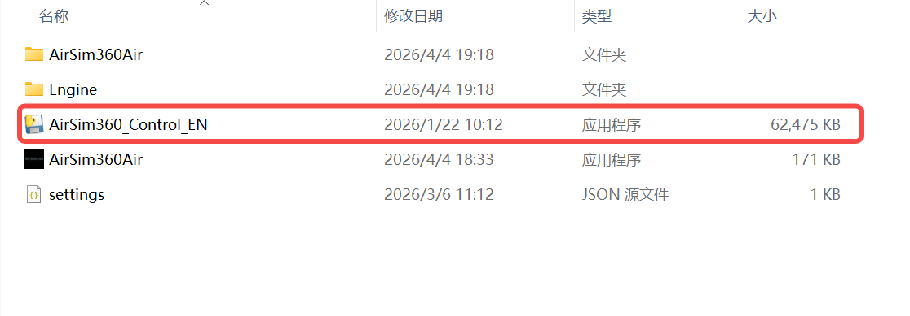
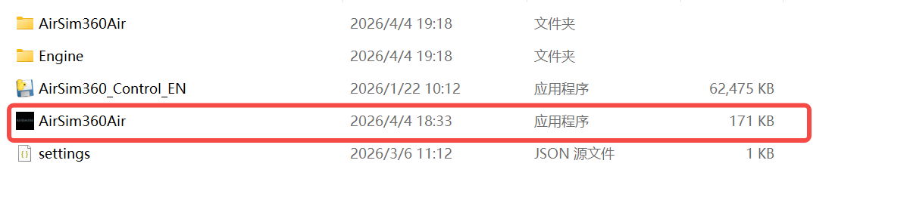
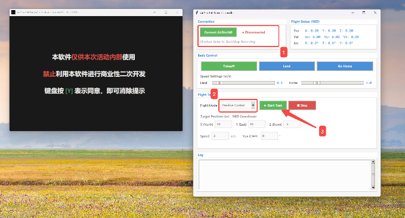
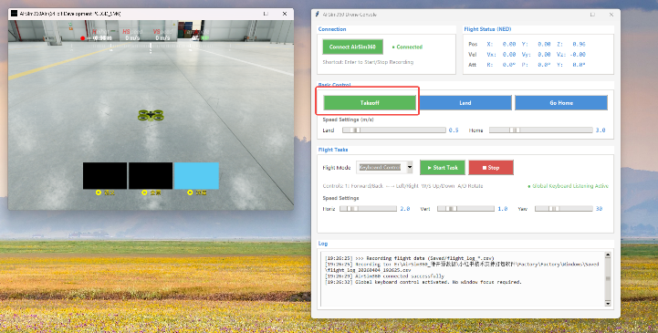
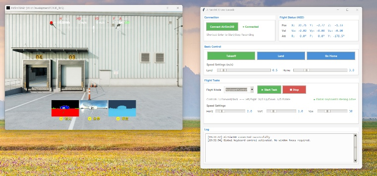
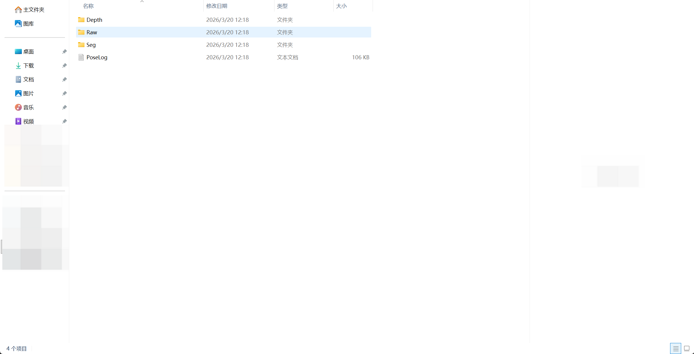
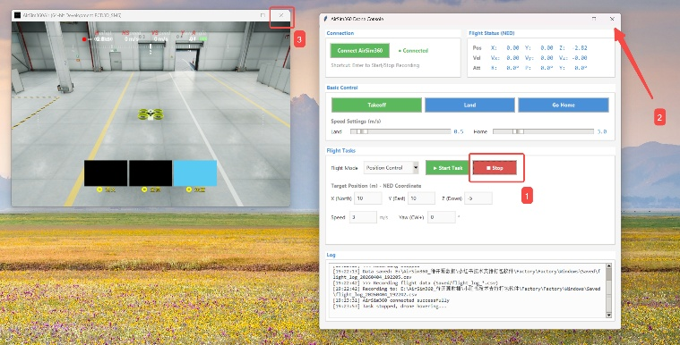

# AirSim360 Air - Quick User Guide

AirSim360 Air is the GUI-first edition of AirSim360 for direct data collection with a keyboard and mouse. The package includes the required runtime components, so on a supported Windows PC it is intended to be close to plug-and-play.

This guide explains the standard Air workflow on Windows: launch order, preflight steps, takeoff, flight controls, camera switching, preview behavior, and output locations.

## Table of contents

- [Demo video](#demo-video)
- [Quick start](#quick-start)
- [System requirements](#system-requirements)
- [Launch order](#launch-order)
- [Preflight and takeoff](#preflight-and-takeoff)
- [Panorama previews and performance](#panorama-previews-and-performance)
- [Keyboard and mouse controls](#keyboard-and-mouse-controls)
- [Camera view switching](#camera-view-switching)
- [Where files are saved](#where-files-are-saved)
- [Shutdown order](#shutdown-order)

## Demo video

The following video shows a typical AirSim360 Air operating flow.

<video src="../media/videos/airsim360_air_demo_0410_v2.mp4" controls playsinline width="100%"></video>

> Demo purpose: launch the remote controller, connect to the simulator, enter the scene, take off, and inspect the capture workflow.

## Quick start

Use the software in the following order:

1. Launch the **simulation remote control** application.
2. Launch the **main simulator** window.
3. In the remote-control app, click **Connect**, choose **keyboard / mouse** mode, and then click **Start Task**.
4. Click inside the simulator viewport, press **Y** to accept the agreement, and then click **Take off**.

This order is recommended for normal operation and helps avoid connection or control-state issues during startup.

## System requirements

AirSim360 relies on high-quality real-time rendering, so performance depends heavily on your hardware.

- **OS:** Tested on **Windows 11**; **Windows 10** is also supported.
- **GPU:** NVIDIA GPU with **at least 16 GB VRAM**.
- **System memory:** **16 GB RAM minimum**, **32 GB RAM recommended**.
- **Display mode:** Prefer **windowed** or **borderless windowed** mode when possible. Full-screen mode can increase GPU load.

## Launch order

Start the two applications in this sequence:

1. Start the **simulation remote control** application first.

2. Start the **main simulator** window.

3. Keep both windows open while you complete the next steps.

## Preflight and takeoff

After both applications are open, complete the following setup in order.

### In the remote-control application

1. Click **Connect** to link the controller to the simulator.
2. Select **keyboard / mouse** control mode.
3. Click **Start Task**.

### In the simulator window

1. Click inside the renderer view on the left to focus the simulator window.
2. Read the license / usage agreement and press **Y** to accept it.
3. Click **Take off** when you are ready to start flying.

## Panorama previews and performance

The three panorama preview panels at the bottom of the interface can consume substantial GPU resources, so they are disabled by default.

- Press **R** to enable the previews.
- Press **R** again to disable them.

Enable these previews only when you need live visual feedback for panorama-related outputs. Leaving them off usually improves runtime performance.

## Keyboard and mouse controls

The default flight controls are:

| Key | Action |
| --- | --- |
| **W** | Ascend |
| **S** | Descend |
| **A** | Yaw left |
| **D** | Yaw right |
| **Up Arrow** | Move forward |
| **Down Arrow** | Move backward |
| **Left Arrow** | Strafe left |
| **Right Arrow** | Strafe right |

## Camera view switching

Press **P** to toggle between the two common viewing modes:

- **Aircraft main camera view:** the onboard camera perspective.
- **Third-person chase view:** the default external camera that follows the drone.

## Where files are saved

Captured outputs are typically separated by modality. In many Air builds, the folders shown in the UI look like the following:

- **`Raw/`** - panoramic RGB images
- **`Depth/`** - panoramic depth maps
- **`Seg/`** - panoramic semantic segmentation labels

Folder names may differ across packaged builds, export presets, or project-specific configurations. If you see different names in your version, follow the paths shown by the simulator UI or your local project configuration.

## Shutdown order

To exit cleanly, close the applications in this order:

1. Close the **simulation remote control** application first.
2. Close the **main simulator** window second.

