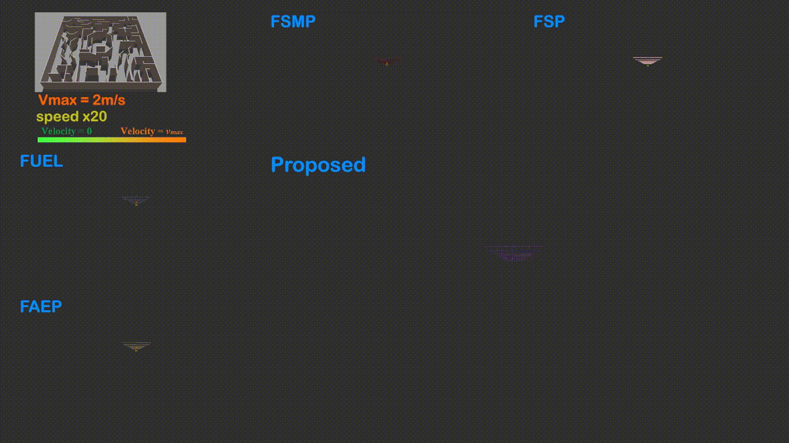
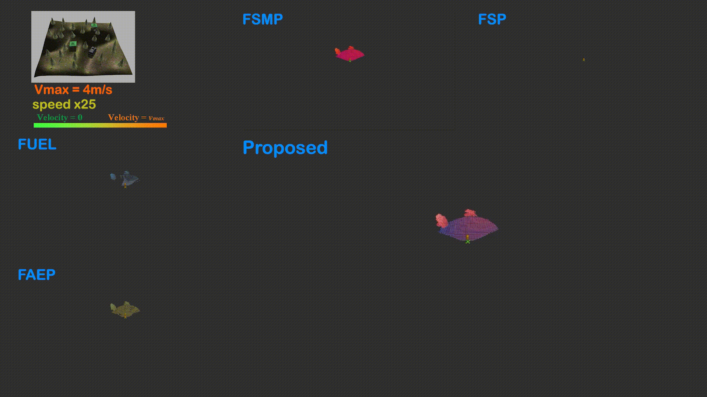
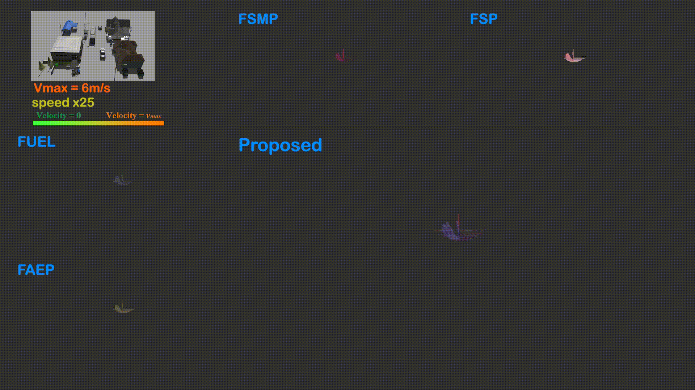

# HighStar
HIGHSTAR: High-Speed and Efficient Online Autonomous UAV Exploration(TASE 2025 accepted)

- [Overview](#1-overview)
- [Setup](#2-setup)
- [Parameters](#3-parameters)
- [Acknowledgements](#4-acknowledgements)
- [Error in Paper](#5-some-errors-in-article)
- [Future Work](#6-future-work)


## 1. Overview
<p align="left">
  
  
  
</p>

**Highstar** is a high-speed and efficient online autonomous UAV exploration method. First, to fully leverage the current velocity and acceleration of the UAV in exploration target planning, we propose a motion primitive activated graph search method. Specifically, it utilizes motion primitives to simulate the motion tendency in a short period to improve the accuracy of evaluated motion time cost and searches from the terminal points of motion primitives on a voxel graph with a dynamically calculated searching upper bound to reduce the computational cost. Then, a minimum time trajectory to the optimal viewpoint with a non-zero terminal velocity constraint inside a safety-guaranteed and exploration-stimulative convex hull is optimized. Finally, a SE(3) coverage trajectory that can cover the unknown space around the exploration path is further optimized according to the minimum time trajectory. 

[IEEE paper link](https://ieeexplore.ieee.org/document/11146891)

If you found this research useful for your own work, please use the following citation:
```
@article{0HIGHSTAR,
  title={HIGHSTAR: High-Speed and Efficient Online Autonomous UAV Exploration},
  author={ Dong, Qianli  and  Zhang, Xuebo  and  Zhang, Shiyong  and  Wang, Ziyu  and  Ma, Zhe  and  Li, Tianyi  and  Xi, Haobo },
  journal={IEEE Transactions on Automation Science and Engineering},
  year={2025},
  volume={22},
}
```

And this work is based on our [previus work](https://ieeexplore.ieee.org/document/10909355):
```
@article{2025FSMP,
  title={FSMP: A Frontier-Sampling-Mixed Planner for Fast Autonomous Exploration of Complex and Large 3-D Environments},
  author={ Zhang, Shiyong  and  Zhang, Xuebo  and  Dong, Qianli  and  Wang, Ziyu  and  Xi, Haobo  and  Yuan, Jing },
  journal={IEEE Transactions on Instrumentation and Measurement},
  year={2025},
  volume={74},
}
```

**Author**: [Qianli Dong (Charlie Dog)](https://github.com/charlie-dog), [Shiyong Zhang](https://github.com/shiyong-zhang), [Ziyu Wang](https://github.com/wzya112), [Zhe Ma](https://github.com/Ma-Phil), [Tianyi Li](https://github.com/LTianyyi), and [Haobo Xi](https://github.com/littlelittle-bo).

## 2. Setup
This work is developed in Ubuntu 20.04, [ROS noetic](http://wiki.ros.org/noetic/Installation/Ubuntu).

**Prerequisites**:
```
$ sudo apt-get install ros-noetic-joy ros-noetic-octomap-ros python3-wstool python3-catkin-tools protobuf-compiler libgoogle-glog-dev ros-noetic-control-toolbox ros-noetic-mavros
```

**Simulation environment**:
We adopt [RotorS](https://github.com/ethz-asl/rotors_simulator) as the simulation platform. To adapt to the scenario of multi-UAV exploration, we have made some modifications. You can get the modified version with:
```
$ mkdir -p rotors-ws/src
$ cd rotors-ws/src
$ git clone https://github.com/NKU-UAVTeam/rotors-modified.git
$ git clone https://github.com/ethz-asl/mav_comm.git
$ git clone https://github.com/catkin/catkin_simple.git
$ cd ..
$ catkin_make 

# if report error: "‘mavlink_status_t’ has not been declared", $sudo apt remove ros-noetic-mavlink. install it later

$ echo "source ~/rotors-ws/devel/setup.bash --extend" >> ~/.bashrc
```

**Clone Code and Make**:
```
$ mkdir -p HighStar/src
$ cd HighStar/src
$ git clone https://github.com/ethz-asl/gflags_catkin.git
$ git clone https://github.com/ethz-asl/glog_catkin.git
$ git clone https://github.com/catkin/catkin_simple.git
$ git clone https://github.com/NKU-MobFly-Robotics/HighStar.git
$ cd ..
$ catkin_make
```
**Run Exploration**:
```
$ source devel/setup.bash
$ roslaunch murder murder_demo_maze4_mid.launch
```
**Show Explored Volume**:
```
rostopic echo /
```
## 3. Parameters
**Exploration Space**:
Parameters are contained in the yaml files:
[murder_maze4.yaml](./Exploration/murder/resource/high_mobility/murder_demo_maze4_mid.yaml)
```
# exploration bounding box
Exp/minX: -10.0
Exp/minY: -20.0
Exp/minZ: 0.0
Exp/maxX: 10.0
Exp/maxY: 20.0
Exp/maxZ: 3.0

# map size (larger than the exploration bounding box)
block_map/minX: -22.5
block_map/minY: -22.5
block_map/minZ: -0.1
block_map/maxX: 22.5
block_map/maxY: 22.5
block_map/maxZ: 3.5
```

## 4. Acknowledgements
We use [MINCO](https://github.com/ZJU-FAST-Lab/GCOPTER.git) for trajectory planning.

## 5. Some Errors in Article
Thank you to @Killow1998 for pointing out these issues. 
- Section IV-E, the paper states ''In high-speed trajectory planning, the tilt of the UAV is negligible ...'', here, the ''negligible'' should be ''non-negligible''.
- Section IV-E, before Eq. 18, ''Thus, the safety cost is...'', it should be ''feasibility cost''.

## 6. Future Work
Maybe an aerobatic exploration planner will come soon. Maybe.